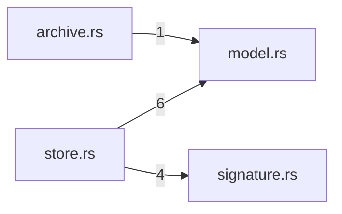

# plugins — generated atlas

[All packages](../../../../docs/architecture/generated/index.md) · [Maintained explanation](../README.md)

## Cargo targets

| Target | Kind | Entry |
|---|---|---|
| `plugins` | lib | [crates/plugins/src/lib.rs](../../src/lib.rs) |
| `slice12_gates` | test | [crates/plugins/tests/slice12_gates.rs](../../tests/slice12_gates.rs) |

## Direct workspace dependencies

| Dependency | Kind | Target cfg |
|---|---|---|
| `store` | normal | all |

[Public/restricted API and direct callers](api.md)

## Source files / lexical modules

`src` files have full symbol/call tables and partitioned function graphs. Integration tests and examples remain in the JSON inventory.
File-derived paths below are lexical navigation, not a compiler-resolved module tree; inline module declarations are listed separately.

| File | Symbols | Call sites | Detail |
|---|---:|---:|---|
| [crates/plugins/src/archive.rs](../../src/archive.rs) | 43 | 391 | [Symbols and calls](src--archive.md) |
| [crates/plugins/src/lib.rs](../../src/lib.rs) | 2 | 0 | [Symbols and calls](src--lib.md) |
| [crates/plugins/src/model.rs](../../src/model.rs) | 28 | 264 | [Symbols and calls](src--model.md) |
| [crates/plugins/src/signature.rs](../../src/signature.rs) | 12 | 99 | [Symbols and calls](src--signature.md) |
| [crates/plugins/src/store.rs](../../src/store.rs) | 74 | 932 | [Symbols and calls](src--store.md) |
| [crates/plugins/tests/slice12_gates.rs](../../tests/slice12_gates.rs) | 33 | 738 | `inventory.json` |

## Cross-file direct calls

Source files stand in for out-of-line modules; see declarations for inline modules. Counts are syntactic call sites, not runtime frequency.

