# plugins::archive

[Package atlas](index.md) · [Source](../../src/archive.rs)

## Declarations

Visibility is the declaration spelling; trait members and reexports require their enclosing interface. `cfg` is not evaluated.

| Symbol | Kind | Visibility | Test / cfg |
|---|---|---|---|
| [plugins::archive::MAX_ARCHIVE_BYTES](../../src/archive.rs#L16) | const_item | `private` |  |
| [plugins::archive::MAX_EXPANDED_BYTES](../../src/archive.rs#L17) | const_item | `private` |  |
| [plugins::archive::MAX_ENTRY_BYTES](../../src/archive.rs#L18) | const_item | `private` |  |
| [plugins::archive::MAX_ENTRIES](../../src/archive.rs#L19) | const_item | `private` |  |
| [plugins::archive::PluginSource](../../src/archive.rs#L22) | enum_item | `pub` |  |
| [plugins::archive::PluginSource::from_path](../../src/archive.rs#L28) | function_item | `pub` |  |
| [plugins::archive::PluginSource::stage](../../src/archive.rs#L47) | function_item | `pub(crate)` |  |
| [plugins::archive::PluginSource::description](../../src/archive.rs#L54) | function_item | `pub(crate)` |  |
| [plugins::archive::PluginArchive](../../src/archive.rs#L61) | struct_item | `pub` |  |
| [plugins::archive::Envelope](../../src/archive.rs#L65) | struct_item | `private` |  |
| [plugins::archive::Entry](../../src/archive.rs#L71) | struct_item | `private` |  |
| [plugins::archive::EntryKind](../../src/archive.rs#L82) | enum_item | `private` |  |
| [plugins::archive::PluginArchive::inspect](../../src/archive.rs#L88) | function_item | `pub` |  |
| [plugins::archive::PluginArchive::expand](../../src/archive.rs#L98) | function_item | `pub` |  |
| [plugins::archive::ArchiveExpandHook](../../src/archive.rs#L106) | trait_item | `private` |  |
| [plugins::archive::ArchiveExpandHook::before_open_directory](../../src/archive.rs#L107) | function_signature_item | `private` |  |
| [plugins::archive::expand_archive_with_hook](../../src/archive.rs#L110) | function_item | `private` |  |
| [plugins::archive::read_envelope](../../src/archive.rs#L195) | function_item | `private` |  |
| [plugins::archive::archive_components](../../src/archive.rs#L225) | function_item | `private` |  |
| [plugins::archive::open_archive_directory_chain](../../src/archive.rs#L235) | function_item | `private` |  |
| [plugins::archive::validate_entries](../../src/archive.rs#L271) | function_item | `private` |  |
| [plugins::archive::copy_tree](../../src/archive.rs#L322) | function_item | `private` |  |
| [plugins::archive::DirectoryStageHook](../../src/archive.rs#L326) | trait_item | `private` |  |
| [plugins::archive::DirectoryStageHook::before_open](../../src/archive.rs#L327) | function_signature_item | `private` |  |
| [plugins::archive::F::before_open](../../src/archive.rs#L331) | function_item | `private` |  |
| [plugins::archive::F::before_open_directory](../../src/archive.rs#L337) | function_item | `private` |  |
| [plugins::archive::NoopStageHook](../../src/archive.rs#L342) | struct_item | `private` |  |
| [plugins::archive::NoopStageHook::before_open](../../src/archive.rs#L345) | function_item | `private` |  |
| [plugins::archive::NoopStageHook::before_open_directory](../../src/archive.rs#L349) | function_item | `private` |  |
| [plugins::archive::copy_tree_with_hook](../../src/archive.rs#L352) | function_item | `private` |  |
| [plugins::archive::StageLimits](../../src/archive.rs#L393) | struct_item | `private` |  |
| [plugins::archive::copy_directory_fd](../../src/archive.rs#L398) | function_item | `private` |  |
| [plugins::archive::directory_names](../../src/archive.rs#L467) | function_item | `private` |  |
| [plugins::archive::openat_source](../../src/archive.rs#L483) | function_item | `private` |  |
| [plugins::archive::openat_destination_directory](../../src/archive.rs#L496) | function_item | `private` |  |
| [plugins::archive::openat_destination_file](../../src/archive.rs#L507) | function_item | `private` |  |
| [plugins::archive::create_directory_at](../../src/archive.rs#L528) | function_item | `private` |  |
| [plugins::archive::descriptor_stat](../../src/archive.rs#L534) | function_item | `private` |  |
| [plugins::archive::full_sync](../../src/archive.rs#L538) | function_item | `private` |  |
| [plugins::archive::full_sync_path](../../src/archive.rs#L542) | function_item | `private` |  |
| [plugins::archive::tests::directory_stage_race_never_follows_a_replaced_symlink](../../src/archive.rs#L556) | function_item | `private` | test; #[cfg(test)] |
| [plugins::archive::tests::archive_source_symlink_is_rejected_before_reading](../../src/archive.rs#L586) | function_item | `private` | test; #[cfg(test)] |
| [plugins::archive::tests::archive_expansion_race_never_follows_a_destination_symlink](../../src/archive.rs#L612) | function_item | `private` | test; #[cfg(test)] |

## Imports / reexports

| Local name | Source path | Visibility |
|---|---|---|
| `BTreeSet` | `std::collections::BTreeSet` | `private` |
| `CString` | `std::ffi::CString` | `private` |
| `fs` | `std::fs` | `private` |
| `File` | `std::fs::File` | `private` |
| `io` | `std::io` | `private` |
| `Read` | `std::io::Read` | `private` |
| `Write` | `std::io::Write` | `private` |
| `OsStrExt` | `std::os::unix::ffi::OsStrExt` | `private` |
| `Path` | `std::path::Path` | `private` |
| `PathBuf` | `std::path::PathBuf` | `private` |
| `Engine` | `base64::Engine` | `private` |
| `STANDARD` | `base64::engine::general_purpose::STANDARD` | `private` |
| `Dir` | `rustix::fs::Dir` | `private` |
| `FileType` | `rustix::fs::FileType` | `private` |
| `Mode` | `rustix::fs::Mode` | `private` |
| `OFlags` | `rustix::fs::OFlags` | `private` |
| `fchmod` | `rustix::fs::fchmod` | `private` |
| `fstat` | `rustix::fs::fstat` | `private` |
| `mkdirat` | `rustix::fs::mkdirat` | `private` |
| `open` | `rustix::fs::open` | `private` |
| `openat` | `rustix::fs::openat` | `private` |
| `Deserialize` | `serde::Deserialize` | `private` |
| `Serialize` | `serde::Serialize` | `private` |
| `FullSync` | `store::FullSync` | `private` |
| `PLUGIN_ARCHIVE_EXTENSION` | `crate::PLUGIN_ARCHIVE_EXTENSION` | `private` |
| `PluginError` | `crate::PluginError` | `private` |
| `AtomicBool` | `std::sync::atomic::AtomicBool` | `private` |
| `Ordering` | `std::sync::atomic::Ordering` | `private` |
| `TempDir` | `tempfile::TempDir` | `private` |
| `*` | `super::*` | `private` |

## Module declarations

| Module | Visibility | Attributes |
|---|---|---|
| `plugins::archive::tests` | `private` | #[cfg(test)] |

## Function call graphs

Edges below are syntactically resolved calls only, including private functions. Graphs partition callers into groups of 20; they are not execution order. All unresolved sites are listed below and in the JSON inventory.

```mermaid
flowchart TD
  n0["plugins::archive::expand_archive_with_hook"]
  n1["plugins::archive::read_envelope"]
  n2["plugins::archive::archive_components"]
  n3["plugins::archive::open_archive_directory_chain"]
  n4["plugins::archive::validate_entries"]
  n5["plugins::archive::PluginSource::from_path"]
  n6["plugins::archive::copy_tree"]
  n7["plugins::archive::F::before_open"]
  n8["plugins::archive::F::before_open_directory"]
  n9["plugins::archive::NoopStageHook::before_open"]
  n10["plugins::archive::NoopStageHook::before_open_directory"]
  n11["plugins::archive::copy_tree_with_hook"]
  n12["plugins::archive::copy_directory_fd"]
  n13["plugins::archive::directory_names"]
  n14["plugins::archive::PluginSource::stage"]
  n15["plugins::archive::openat_source"]
  n16["plugins::archive::openat_destination_directory"]
  n17["plugins::archive::openat_destination_file"]
  n18["plugins::archive::create_directory_at"]
  n19["plugins::archive::descriptor_stat"]
  n20["plugins::archive::full_sync"]
  n21["plugins::archive::full_sync_path"]
  n22["plugins::archive::PluginSource::description"]
  n23["plugins::archive::PluginArchive::inspect"]
  n24["plugins::archive::PluginArchive::expand"]
  n25["plugins::model::safe_relative"]
  n0 --> n1
  n0 --> n2
  n0 --> n3
  n0 --> n4
  n0 --> n20
  n0 --> n21
  n3 --> n20
  n4 --> n25
  n6 --> n11
  n11 --> n12
  n11 --> n20
  n11 --> n21
  n12 --> n12
  n12 --> n13
  n12 --> n15
  n12 --> n16
  n12 --> n17
  n12 --> n18
  n12 --> n19
  n12 --> n20
  n14 --> n6
  n14 --> n24
  n23 --> n1
  n23 --> n4
  n24 --> n0
```

Functions 1–20: 25 direct edges

Functions 21–25: 3 direct edges

## Call sites

Includes test functions (marked in declarations). Receiver-type-required sites need type analysis/manual tracing. Calls in closures are attributed to their enclosing function; their occurrence here does not mean the closure executes immediately.

| Caller | Callee expression | Source lines | Target / classification |
|---|---|---|---|
| `from_path` | `path.into` | [29](../../src/archive.rs#L29) | receiver-type-required |
| `from_path` | `fs::symlink_metadata(&path).map_err` | [31](../../src/archive.rs#L31) | receiver-type-required |
| `from_path` | `fs::symlink_metadata` | [31](../../src/archive.rs#L31) | external-constructor-callback-or-unresolved |
| `from_path` | `PluginError::Storage` | [31](../../src/archive.rs#L31) | external-constructor-callback-or-unresolved |
| `from_path` | `error.to_string` | [31](../../src/archive.rs#L31) | receiver-type-required |
| `from_path` | `metadata.file_type().is_dir` | [32](../../src/archive.rs#L32) | receiver-type-required |
| `from_path` | `metadata.file_type` | [32](../../src/archive.rs#L32), [34](../../src/archive.rs#L34) | receiver-type-required |
| `from_path` | `Ok` | [33](../../src/archive.rs#L33), [39](../../src/archive.rs#L39) | external-constructor-callback-or-unresolved |
| `from_path` | `Self::Directory` | [33](../../src/archive.rs#L33) | external-constructor-callback-or-unresolved |
| `from_path` | `metadata.file_type().is_file` | [34](../../src/archive.rs#L34) | receiver-type-required |
| `from_path` | `path                 .extension()                 .is_some_and` | [35](../../src/archive.rs#L35) | receiver-type-required |
| `from_path` | `path                 .extension` | [35](../../src/archive.rs#L35) | receiver-type-required |
| `from_path` | `value.eq_ignore_ascii_case` | [37](../../src/archive.rs#L37) | receiver-type-required |
| `from_path` | `Self::Archive` | [39](../../src/archive.rs#L39) | external-constructor-callback-or-unresolved |
| `from_path` | `Err` | [41](../../src/archive.rs#L41) | external-constructor-callback-or-unresolved |
| `from_path` | `PluginError::InvalidArchive` | [41](../../src/archive.rs#L41) | external-constructor-callback-or-unresolved |
| `from_path` | `"source must be a directory or .tekesplugin file".to_owned` | [42](../../src/archive.rs#L42) | receiver-type-required |
| `stage` | `copy_tree` | [49](../../src/archive.rs#L49) | [plugins::archive::copy_tree](../../src/archive.rs#L322) |
| `stage` | `PluginArchive::expand` | [50](../../src/archive.rs#L50) | [plugins::archive::PluginArchive::expand](../../src/archive.rs#L98) |
| `description` | `path.display().to_string` | [56](../../src/archive.rs#L56) | receiver-type-required |
| `description` | `path.display` | [56](../../src/archive.rs#L56) | receiver-type-required |
| `inspect` | `read_envelope` | [89](../../src/archive.rs#L89) | [plugins::archive::read_envelope](../../src/archive.rs#L195) |
| `inspect` | `path.as_ref` | [89](../../src/archive.rs#L89) | receiver-type-required |
| `inspect` | `validate_entries` | [90](../../src/archive.rs#L90) | [plugins::archive::validate_entries](../../src/archive.rs#L271) |
| `inspect` | `Ok` | [91](../../src/archive.rs#L91) | external-constructor-callback-or-unresolved |
| `inspect` | `envelope             .entries             .into_iter()             .map(&#124;entry&#124; (entry.path, matches!(entry.kind, EntryKind::File)))             .collect` | [91](../../src/archive.rs#L91) | receiver-type-required |
| `inspect` | `envelope             .entries             .into_iter()             .map` | [91](../../src/archive.rs#L91) | receiver-type-required |
| `inspect` | `envelope             .entries             .into_iter` | [91](../../src/archive.rs#L91) | receiver-type-required |
| `expand` | `expand_archive_with_hook` | [102](../../src/archive.rs#L102) | [plugins::archive::expand_archive_with_hook](../../src/archive.rs#L110) |
| `expand` | `path.as_ref` | [102](../../src/archive.rs#L102) | receiver-type-required |
| `expand` | `destination.as_ref` | [102](../../src/archive.rs#L102) | receiver-type-required |
| `expand_archive_with_hook` | `read_envelope` | [115](../../src/archive.rs#L115) | [plugins::archive::read_envelope](../../src/archive.rs#L195) |
| `expand_archive_with_hook` | `validate_entries` | [116](../../src/archive.rs#L116) | [plugins::archive::validate_entries](../../src/archive.rs#L271) |
| `expand_archive_with_hook` | `fs::create_dir(destination).map_err` | [117](../../src/archive.rs#L117) | receiver-type-required |
| `expand_archive_with_hook` | `fs::create_dir` | [117](../../src/archive.rs#L117) | external-constructor-callback-or-unresolved |
| `expand_archive_with_hook` | `PluginError::Storage` | [117](../../src/archive.rs#L117), [124](../../src/archive.rs#L124), [126](../../src/archive.rs#L126), [178](../../src/archive.rs#L178), [180](../../src/archive.rs#L180), [182](../../src/archive.rs#L182) | external-constructor-callback-or-unresolved |
| `expand_archive_with_hook` | `error.to_string` | [117](../../src/archive.rs#L117), [124](../../src/archive.rs#L124), [126](../../src/archive.rs#L126), [156](../../src/archive.rs#L156), [178](../../src/archive.rs#L178), [180](../../src/archive.rs#L180), [182](../../src/archive.rs#L182) | receiver-type-required |
| `expand_archive_with_hook` | `File::from` | [118](../../src/archive.rs#L118), [167](../../src/archive.rs#L167) | external-constructor-callback-or-unresolved |
| `expand_archive_with_hook` | `open(             destination,             OFlags::RDONLY &#124; OFlags::DIRECTORY &#124; OFlags::NOFOLLOW &#124; OFlags::CLOEXEC,             Mode::empty(),         )         .map_err` | [119](../../src/archive.rs#L119) | receiver-type-required |
| `expand_archive_with_hook` | `open` | [119](../../src/archive.rs#L119) | external-constructor-callback-or-unresolved |
| `expand_archive_with_hook` | `Mode::empty` | [122](../../src/archive.rs#L122) | external-constructor-callback-or-unresolved |
| `expand_archive_with_hook` | `fchmod(&destination_fd, Mode::RWXU).map_err` | [126](../../src/archive.rs#L126) | receiver-type-required |
| `expand_archive_with_hook` | `fchmod` | [126](../../src/archive.rs#L126), [180](../../src/archive.rs#L180) | external-constructor-callback-or-unresolved |
| `expand_archive_with_hook` | `full_sync` | [127](../../src/archive.rs#L127), [151](../../src/archive.rs#L151), [183](../../src/archive.rs#L183), [184](../../src/archive.rs#L184), [188](../../src/archive.rs#L188) | [plugins::archive::full_sync](../../src/archive.rs#L538) |
| `expand_archive_with_hook` | `destination.parent` | [128](../../src/archive.rs#L128), [189](../../src/archive.rs#L189) | receiver-type-required |
| `expand_archive_with_hook` | `full_sync_path` | [129](../../src/archive.rs#L129), [190](../../src/archive.rs#L190) | [plugins::archive::full_sync_path](../../src/archive.rs#L542) |
| `expand_archive_with_hook` | `entries.sort_by` | [132](../../src/archive.rs#L132) | receiver-type-required |
| `expand_archive_with_hook` | `left.path             .split('/')             .count()             .cmp(&right.path.split('/').count())             .then_with(&#124;&#124; {                 matches!(right.kind, EntryKind::Directory)                     .cmp(&matches!(left.kind, EntryKind::Directory))             })             .then_with` | [133](../../src/archive.rs#L133) | receiver-type-required |
| `expand_archive_with_hook` | `left.path             .split('/')             .count()             .cmp(&right.path.split('/').count())             .then_with` | [133](../../src/archive.rs#L133) | receiver-type-required |
| `expand_archive_with_hook` | `left.path             .split('/')             .count()             .cmp` | [133](../../src/archive.rs#L133) | receiver-type-required |
| `expand_archive_with_hook` | `left.path             .split('/')             .count` | [133](../../src/archive.rs#L133) | receiver-type-required |
| `expand_archive_with_hook` | `left.path             .split` | [133](../../src/archive.rs#L133) | receiver-type-required |
| `expand_archive_with_hook` | `right.path.split('/').count` | [136](../../src/archive.rs#L136) | receiver-type-required |
| `expand_archive_with_hook` | `right.path.split` | [136](../../src/archive.rs#L136) | receiver-type-required |
| `expand_archive_with_hook` | `matches!(right.kind, EntryKind::Directory)                     .cmp` | [138](../../src/archive.rs#L138) | receiver-type-required |
| `expand_archive_with_hook` | `left.path.cmp` | [141](../../src/archive.rs#L141) | receiver-type-required |
| `expand_archive_with_hook` | `archive_components` | [144](../../src/archive.rs#L144) | [plugins::archive::archive_components](../../src/archive.rs#L225) |
| `expand_archive_with_hook` | `open_archive_directory_chain(&destination_fd, &components, hook)?                     .ok_or_else` | [147](../../src/archive.rs#L147) | receiver-type-required |
| `expand_archive_with_hook` | `open_archive_directory_chain` | [147](../../src/archive.rs#L147), [160](../../src/archive.rs#L160) | [plugins::archive::open_archive_directory_chain](../../src/archive.rs#L235) |
| `expand_archive_with_hook` | `PluginError::InvalidArchive` | [149](../../src/archive.rs#L149), [156](../../src/archive.rs#L156), [158](../../src/archive.rs#L158) | external-constructor-callback-or-unresolved |
| `expand_archive_with_hook` | `"empty archive directory path".to_owned` | [149](../../src/archive.rs#L149) | receiver-type-required |
| `expand_archive_with_hook` | `STANDARD                     .decode(entry.data.as_deref().unwrap_or_default())                     .map_err` | [154](../../src/archive.rs#L154) | receiver-type-required |
| `expand_archive_with_hook` | `STANDARD                     .decode` | [154](../../src/archive.rs#L154) | receiver-type-required |
| `expand_archive_with_hook` | `entry.data.as_deref().unwrap_or_default` | [155](../../src/archive.rs#L155) | receiver-type-required |
| `expand_archive_with_hook` | `entry.data.as_deref` | [155](../../src/archive.rs#L155) | receiver-type-required |
| `expand_archive_with_hook` | `components.split_last().ok_or_else` | [157](../../src/archive.rs#L157) | receiver-type-required |
| `expand_archive_with_hook` | `components.split_last` | [157](../../src/archive.rs#L157) | receiver-type-required |
| `expand_archive_with_hook` | `"empty archive file path".to_owned` | [158](../../src/archive.rs#L158) | receiver-type-required |
| `expand_archive_with_hook` | `parent.as_ref().unwrap_or` | [161](../../src/archive.rs#L161) | receiver-type-required |
| `expand_archive_with_hook` | `parent.as_ref` | [161](../../src/archive.rs#L161) | receiver-type-required |
| `expand_archive_with_hook` | `Some` | [162](../../src/archive.rs#L162) | external-constructor-callback-or-unresolved |
| `expand_archive_with_hook` | `openat(                         parent_fd,                         name,                         OFlags::WRONLY                             &#124; OFlags::CREATE                             &#124; OFlags::EXCL                             &#124; OFlags::NOFOLLOW                             &#124; OFlags::CLOEXEC,                         mode,                     )                     .map_err` | [168](../../src/archive.rs#L168) | receiver-type-required |
| `expand_archive_with_hook` | `openat` | [168](../../src/archive.rs#L168) | external-constructor-callback-or-unresolved |
| `expand_archive_with_hook` | `fchmod(&file, mode).map_err` | [180](../../src/archive.rs#L180) | receiver-type-required |
| `expand_archive_with_hook` | `file.write_all(&data)                     .map_err` | [181](../../src/archive.rs#L181) | receiver-type-required |
| `expand_archive_with_hook` | `file.write_all` | [181](../../src/archive.rs#L181) | receiver-type-required |
| `expand_archive_with_hook` | `Ok` | [192](../../src/archive.rs#L192) | external-constructor-callback-or-unresolved |
| `read_envelope` | `open(         path,         OFlags::RDONLY &#124; OFlags::NOFOLLOW &#124; OFlags::CLOEXEC &#124; OFlags::NONBLOCK,         Mode::empty(),     )     .map_err` | [196](../../src/archive.rs#L196) | receiver-type-required |
| `read_envelope` | `open` | [196](../../src/archive.rs#L196) | external-constructor-callback-or-unresolved |
| `read_envelope` | `Mode::empty` | [199](../../src/archive.rs#L199) | external-constructor-callback-or-unresolved |
| `read_envelope` | `PluginError::InvalidArchive` | [201](../../src/archive.rs#L201), [203](../../src/archive.rs#L203), [208](../../src/archive.rs#L208), [218](../../src/archive.rs#L218), [222](../../src/archive.rs#L222) | external-constructor-callback-or-unresolved |
| `read_envelope` | `fstat(&descriptor)         .map_err` | [202](../../src/archive.rs#L202) | receiver-type-required |
| `read_envelope` | `fstat` | [202](../../src/archive.rs#L202) | external-constructor-callback-or-unresolved |
| `read_envelope` | `u64::try_from(stat.st_size).unwrap_or` | [204](../../src/archive.rs#L204) | receiver-type-required |
| `read_envelope` | `u64::try_from` | [204](../../src/archive.rs#L204), [217](../../src/archive.rs#L217) | external-constructor-callback-or-unresolved |
| `read_envelope` | `FileType::from_raw_mode` | [205](../../src/archive.rs#L205) | external-constructor-callback-or-unresolved |
| `read_envelope` | `(1..=MAX_ARCHIVE_BYTES).contains` | [206](../../src/archive.rs#L206) | receiver-type-required |
| `read_envelope` | `Err` | [208](../../src/archive.rs#L208), [218](../../src/archive.rs#L218) | external-constructor-callback-or-unresolved |
| `read_envelope` | `"archive size or file kind is invalid".to_owned` | [209](../../src/archive.rs#L209) | receiver-type-required |
| `read_envelope` | `Vec::with_capacity` | [212](../../src/archive.rs#L212) | external-constructor-callback-or-unresolved |
| `read_envelope` | `usize::try_from(size).unwrap_or` | [212](../../src/archive.rs#L212) | receiver-type-required |
| `read_envelope` | `usize::try_from` | [212](../../src/archive.rs#L212) | external-constructor-callback-or-unresolved |
| `read_envelope` | `File::from(descriptor)         .take(MAX_ARCHIVE_BYTES + 1)         .read_to_end(&mut bytes)         .map_err` | [213](../../src/archive.rs#L213) | receiver-type-required |
| `read_envelope` | `File::from(descriptor)         .take(MAX_ARCHIVE_BYTES + 1)         .read_to_end` | [213](../../src/archive.rs#L213) | receiver-type-required |
| `read_envelope` | `File::from(descriptor)         .take` | [213](../../src/archive.rs#L213) | receiver-type-required |
| `read_envelope` | `File::from` | [213](../../src/archive.rs#L213) | external-constructor-callback-or-unresolved |
| `read_envelope` | `PluginError::Storage` | [216](../../src/archive.rs#L216) | external-constructor-callback-or-unresolved |
| `read_envelope` | `error.to_string` | [216](../../src/archive.rs#L216), [222](../../src/archive.rs#L222) | receiver-type-required |
| `read_envelope` | `u64::try_from(bytes.len()).unwrap_or` | [217](../../src/archive.rs#L217) | receiver-type-required |
| `read_envelope` | `bytes.len` | [217](../../src/archive.rs#L217) | receiver-type-required |
| `read_envelope` | `"archive changed while reading".to_owned` | [219](../../src/archive.rs#L219) | receiver-type-required |
| `read_envelope` | `serde_json::from_slice(&bytes).map_err` | [222](../../src/archive.rs#L222) | receiver-type-required |
| `read_envelope` | `serde_json::from_slice` | [222](../../src/archive.rs#L222) | external-constructor-callback-or-unresolved |
| `archive_components` | `path.split('/')         .map(&#124;component&#124; {             CString::new(component.as_bytes()).map_err(&#124;_&#124; {                 PluginError::InvalidArchive(format!("archive entry contains NUL: {path}"))             })         })         .collect` | [226](../../src/archive.rs#L226) | receiver-type-required |
| `archive_components` | `path.split('/')         .map` | [226](../../src/archive.rs#L226) | receiver-type-required |
| `archive_components` | `path.split` | [226](../../src/archive.rs#L226) | receiver-type-required |
| `archive_components` | `CString::new(component.as_bytes()).map_err` | [228](../../src/archive.rs#L228) | receiver-type-required |
| `archive_components` | `CString::new` | [228](../../src/archive.rs#L228) | external-constructor-callback-or-unresolved |
| `archive_components` | `component.as_bytes` | [228](../../src/archive.rs#L228) | receiver-type-required |
| `archive_components` | `PluginError::InvalidArchive` | [229](../../src/archive.rs#L229) | external-constructor-callback-or-unresolved |
| `open_archive_directory_chain` | `PathBuf::new` | [241](../../src/archive.rs#L241) | external-constructor-callback-or-unresolved |
| `open_archive_directory_chain` | `current.as_ref().unwrap_or` | [243](../../src/archive.rs#L243) | receiver-type-required |
| `open_archive_directory_chain` | `current.as_ref` | [243](../../src/archive.rs#L243) | receiver-type-required |
| `open_archive_directory_chain` | `mkdirat` | [244](../../src/archive.rs#L244) | external-constructor-callback-or-unresolved |
| `open_archive_directory_chain` | `full_sync` | [245](../../src/archive.rs#L245), [265](../../src/archive.rs#L265) | [plugins::archive::full_sync](../../src/archive.rs#L538) |
| `open_archive_directory_chain` | `Err` | [247](../../src/archive.rs#L247) | external-constructor-callback-or-unresolved |
| `open_archive_directory_chain` | `PluginError::Storage` | [247](../../src/archive.rs#L247), [264](../../src/archive.rs#L264) | external-constructor-callback-or-unresolved |
| `open_archive_directory_chain` | `error.to_string` | [247](../../src/archive.rs#L247), [264](../../src/archive.rs#L264) | receiver-type-required |
| `open_archive_directory_chain` | `relative.push` | [249](../../src/archive.rs#L249) | receiver-type-required |
| `open_archive_directory_chain` | `std::ffi::OsStr::from_bytes` | [249](../../src/archive.rs#L249) | external-constructor-callback-or-unresolved |
| `open_archive_directory_chain` | `component.as_bytes` | [249](../../src/archive.rs#L249) | receiver-type-required |
| `open_archive_directory_chain` | `hook.before_open_directory` | [250](../../src/archive.rs#L250) | receiver-type-required |
| `open_archive_directory_chain` | `File::from` | [251](../../src/archive.rs#L251) | external-constructor-callback-or-unresolved |
| `open_archive_directory_chain` | `openat(                 parent,                 component,                 OFlags::RDONLY &#124; OFlags::DIRECTORY &#124; OFlags::NOFOLLOW &#124; OFlags::CLOEXEC,                 Mode::empty(),             )             .map_err` | [252](../../src/archive.rs#L252) | receiver-type-required |
| `open_archive_directory_chain` | `openat` | [252](../../src/archive.rs#L252) | external-constructor-callback-or-unresolved |
| `open_archive_directory_chain` | `Mode::empty` | [256](../../src/archive.rs#L256) | external-constructor-callback-or-unresolved |
| `open_archive_directory_chain` | `PluginError::InvalidArchive` | [259](../../src/archive.rs#L259) | external-constructor-callback-or-unresolved |
| `open_archive_directory_chain` | `fchmod(&directory, Mode::RWXU).map_err` | [264](../../src/archive.rs#L264) | receiver-type-required |
| `open_archive_directory_chain` | `fchmod` | [264](../../src/archive.rs#L264) | external-constructor-callback-or-unresolved |
| `open_archive_directory_chain` | `Some` | [266](../../src/archive.rs#L266) | external-constructor-callback-or-unresolved |
| `open_archive_directory_chain` | `Ok` | [268](../../src/archive.rs#L268) | external-constructor-callback-or-unresolved |
| `validate_entries` | `envelope.entries.is_empty` | [273](../../src/archive.rs#L273) | receiver-type-required |
| `validate_entries` | `envelope.entries.len` | [274](../../src/archive.rs#L274) | receiver-type-required |
| `validate_entries` | `Err` | [276](../../src/archive.rs#L276), [284](../../src/archive.rs#L284), [291](../../src/archive.rs#L291), [304](../../src/archive.rs#L304), [311](../../src/archive.rs#L311) | external-constructor-callback-or-unresolved |
| `validate_entries` | `PluginError::InvalidArchive` | [276](../../src/archive.rs#L276), [284](../../src/archive.rs#L284), [291](../../src/archive.rs#L291), [298](../../src/archive.rs#L298), [302](../../src/archive.rs#L302), [304](../../src/archive.rs#L304), [311](../../src/archive.rs#L311) | external-constructor-callback-or-unresolved |
| `validate_entries` | `"unsupported version or entry count".to_owned` | [277](../../src/archive.rs#L277) | receiver-type-required |
| `validate_entries` | `BTreeSet::new` | [280](../../src/archive.rs#L280) | external-constructor-callback-or-unresolved |
| `validate_entries` | `crate::model::safe_relative` | [283](../../src/archive.rs#L283) | [plugins::model::safe_relative](../../src/model.rs#L424) |
| `validate_entries` | `paths.insert` | [283](../../src/archive.rs#L283) | receiver-type-required |
| `validate_entries` | `entry.path.clone` | [283](../../src/archive.rs#L283) | receiver-type-required |
| `validate_entries` | `entry.data.is_some` | [290](../../src/archive.rs#L290) | receiver-type-required |
| `validate_entries` | `entry.executable.is_some` | [290](../../src/archive.rs#L290) | receiver-type-required |
| `validate_entries` | `entry.data.as_deref().ok_or_else` | [297](../../src/archive.rs#L297) | receiver-type-required |
| `validate_entries` | `entry.data.as_deref` | [297](../../src/archive.rs#L297) | receiver-type-required |
| `validate_entries` | `STANDARD                     .decode(data)                     .map_err` | [300](../../src/archive.rs#L300) | receiver-type-required |
| `validate_entries` | `STANDARD                     .decode` | [300](../../src/archive.rs#L300) | receiver-type-required |
| `validate_entries` | `error.to_string` | [302](../../src/archive.rs#L302) | receiver-type-required |
| `validate_entries` | `decoded.len` | [303](../../src/archive.rs#L303), [309](../../src/archive.rs#L309) | receiver-type-required |
| `validate_entries` | `expanded.saturating_add` | [309](../../src/archive.rs#L309) | receiver-type-required |
| `validate_entries` | `"expanded archive is too large".to_owned` | [312](../../src/archive.rs#L312) | receiver-type-required |
| `validate_entries` | `Ok` | [319](../../src/archive.rs#L319) | external-constructor-callback-or-unresolved |
| `copy_tree` | `copy_tree_with_hook` | [323](../../src/archive.rs#L323) | [plugins::archive::copy_tree_with_hook](../../src/archive.rs#L352) |
| `before_open` | `self` | [332](../../src/archive.rs#L332) | external-constructor-callback-or-unresolved |
| `before_open_directory` | `self` | [338](../../src/archive.rs#L338) | external-constructor-callback-or-unresolved |
| `copy_tree_with_hook` | `File::from` | [357](../../src/archive.rs#L357), [370](../../src/archive.rs#L370) | external-constructor-callback-or-unresolved |
| `copy_tree_with_hook` | `open(             source,             OFlags::RDONLY &#124; OFlags::DIRECTORY &#124; OFlags::NOFOLLOW &#124; OFlags::CLOEXEC,             Mode::empty(),         )         .map_err` | [358](../../src/archive.rs#L358) | receiver-type-required |
| `copy_tree_with_hook` | `open` | [358](../../src/archive.rs#L358), [371](../../src/archive.rs#L371) | external-constructor-callback-or-unresolved |
| `copy_tree_with_hook` | `Mode::empty` | [361](../../src/archive.rs#L361), [374](../../src/archive.rs#L374) | external-constructor-callback-or-unresolved |
| `copy_tree_with_hook` | `PluginError::InvalidArchive` | [364](../../src/archive.rs#L364) | external-constructor-callback-or-unresolved |
| `copy_tree_with_hook` | `fs::create_dir(destination).map_err` | [369](../../src/archive.rs#L369) | receiver-type-required |
| `copy_tree_with_hook` | `fs::create_dir` | [369](../../src/archive.rs#L369) | external-constructor-callback-or-unresolved |
| `copy_tree_with_hook` | `PluginError::Storage` | [369](../../src/archive.rs#L369), [376](../../src/archive.rs#L376), [378](../../src/archive.rs#L378) | external-constructor-callback-or-unresolved |
| `copy_tree_with_hook` | `error.to_string` | [369](../../src/archive.rs#L369), [376](../../src/archive.rs#L376), [378](../../src/archive.rs#L378) | receiver-type-required |
| `copy_tree_with_hook` | `open(             destination,             OFlags::RDONLY &#124; OFlags::DIRECTORY &#124; OFlags::NOFOLLOW &#124; OFlags::CLOEXEC,             Mode::empty(),         )         .map_err` | [371](../../src/archive.rs#L371) | receiver-type-required |
| `copy_tree_with_hook` | `fchmod(&destination_fd, Mode::RWXU).map_err` | [378](../../src/archive.rs#L378) | receiver-type-required |
| `copy_tree_with_hook` | `fchmod` | [378](../../src/archive.rs#L378) | external-constructor-callback-or-unresolved |
| `copy_tree_with_hook` | `full_sync` | [379](../../src/archive.rs#L379), [385](../../src/archive.rs#L385) | [plugins::archive::full_sync](../../src/archive.rs#L538) |
| `copy_tree_with_hook` | `destination.parent` | [380](../../src/archive.rs#L380), [386](../../src/archive.rs#L386) | receiver-type-required |
| `copy_tree_with_hook` | `full_sync_path` | [381](../../src/archive.rs#L381), [387](../../src/archive.rs#L387) | [plugins::archive::full_sync_path](../../src/archive.rs#L542) |
| `copy_tree_with_hook` | `StageLimits::default` | [383](../../src/archive.rs#L383) | external-constructor-callback-or-unresolved |
| `copy_tree_with_hook` | `copy_directory_fd` | [384](../../src/archive.rs#L384) | [plugins::archive::copy_directory_fd](../../src/archive.rs#L398) |
| `copy_tree_with_hook` | `Path::new` | [384](../../src/archive.rs#L384) | external-constructor-callback-or-unresolved |
| `copy_tree_with_hook` | `Ok` | [389](../../src/archive.rs#L389) | external-constructor-callback-or-unresolved |
| `copy_directory_fd` | `directory_names` | [405](../../src/archive.rs#L405) | [plugins::archive::directory_names](../../src/archive.rs#L467) |
| `copy_directory_fd` | `limits.entries.saturating_add` | [406](../../src/archive.rs#L406) | receiver-type-required |
| `copy_directory_fd` | `Err` | [408](../../src/archive.rs#L408), [435](../../src/archive.rs#L435), [448](../../src/archive.rs#L448), [457](../../src/archive.rs#L457) | external-constructor-callback-or-unresolved |
| `copy_directory_fd` | `PluginError::InvalidArchive` | [408](../../src/archive.rs#L408), [413](../../src/archive.rs#L413), [428](../../src/archive.rs#L428), [435](../../src/archive.rs#L435), [448](../../src/archive.rs#L448), [457](../../src/archive.rs#L457) | external-constructor-callback-or-unresolved |
| `copy_directory_fd` | `"directory package has too many entries".to_owned` | [409](../../src/archive.rs#L409) | receiver-type-required |
| `copy_directory_fd` | `name.to_str().map_err` | [412](../../src/archive.rs#L412) | receiver-type-required |
| `copy_directory_fd` | `name.to_str` | [412](../../src/archive.rs#L412) | receiver-type-required |
| `copy_directory_fd` | `"directory entry name is not UTF-8".to_owned` | [413](../../src/archive.rs#L413) | receiver-type-required |
| `copy_directory_fd` | `relative_root.join` | [415](../../src/archive.rs#L415) | receiver-type-required |
| `copy_directory_fd` | `hook.before_open` | [416](../../src/archive.rs#L416) | receiver-type-required |
| `copy_directory_fd` | `openat_source` | [417](../../src/archive.rs#L417) | [plugins::archive::openat_source](../../src/archive.rs#L483) |
| `copy_directory_fd` | `descriptor_stat` | [418](../../src/archive.rs#L418) | [plugins::archive::descriptor_stat](../../src/archive.rs#L534) |
| `copy_directory_fd` | `FileType::from_raw_mode` | [419](../../src/archive.rs#L419) | external-constructor-callback-or-unresolved |
| `copy_directory_fd` | `create_directory_at` | [421](../../src/archive.rs#L421) | [plugins::archive::create_directory_at](../../src/archive.rs#L528) |
| `copy_directory_fd` | `openat_destination_directory` | [422](../../src/archive.rs#L422) | [plugins::archive::openat_destination_directory](../../src/archive.rs#L496) |
| `copy_directory_fd` | `copy_directory_fd` | [423](../../src/archive.rs#L423) | [plugins::archive::copy_directory_fd](../../src/archive.rs#L398) |
| `copy_directory_fd` | `full_sync` | [424](../../src/archive.rs#L424), [453](../../src/archive.rs#L453), [454](../../src/archive.rs#L454) | [plugins::archive::full_sync](../../src/archive.rs#L538) |
| `copy_directory_fd` | `usize::try_from(stat.st_size).map_err` | [427](../../src/archive.rs#L427) | receiver-type-required |
| `copy_directory_fd` | `usize::try_from` | [427](../../src/archive.rs#L427) | external-constructor-callback-or-unresolved |
| `copy_directory_fd` | `limits.bytes.saturating_add` | [433](../../src/archive.rs#L433) | receiver-type-required |
| `copy_directory_fd` | `openat_destination_file` | [442](../../src/archive.rs#L442) | [plugins::archive::openat_destination_file](../../src/archive.rs#L507) |
| `copy_directory_fd` | `source.take` | [444](../../src/archive.rs#L444) | receiver-type-required |
| `copy_directory_fd` | `u64::try_from(MAX_ENTRY_BYTES).unwrap_or` | [444](../../src/archive.rs#L444) | receiver-type-required |
| `copy_directory_fd` | `u64::try_from` | [444](../../src/archive.rs#L444), [447](../../src/archive.rs#L447) | external-constructor-callback-or-unresolved |
| `copy_directory_fd` | `io::copy(&mut bounded, &mut destination)                     .map_err` | [445](../../src/archive.rs#L445) | receiver-type-required |
| `copy_directory_fd` | `io::copy` | [445](../../src/archive.rs#L445) | external-constructor-callback-or-unresolved |
| `copy_directory_fd` | `PluginError::Storage` | [446](../../src/archive.rs#L446) | external-constructor-callback-or-unresolved |
| `copy_directory_fd` | `error.to_string` | [446](../../src/archive.rs#L446) | receiver-type-required |
| `copy_directory_fd` | `u64::try_from(size).unwrap_or` | [447](../../src/archive.rs#L447) | receiver-type-required |
| `copy_directory_fd` | `Ok` | [464](../../src/archive.rs#L464) | external-constructor-callback-or-unresolved |
| `directory_names` | `Dir::read_from(directory_fd).map_err` | [469](../../src/archive.rs#L469) | receiver-type-required |
| `directory_names` | `Dir::read_from` | [469](../../src/archive.rs#L469) | external-constructor-callback-or-unresolved |
| `directory_names` | `PluginError::Storage` | [469](../../src/archive.rs#L469), [472](../../src/archive.rs#L472) | external-constructor-callback-or-unresolved |
| `directory_names` | `error.to_string` | [469](../../src/archive.rs#L469), [472](../../src/archive.rs#L472) | receiver-type-required |
| `directory_names` | `Vec::new` | [470](../../src/archive.rs#L470) | external-constructor-callback-or-unresolved |
| `directory_names` | `entry.map_err` | [472](../../src/archive.rs#L472) | receiver-type-required |
| `directory_names` | `entry.file_name` | [473](../../src/archive.rs#L473) | receiver-type-required |
| `directory_names` | `name.to_bytes` | [474](../../src/archive.rs#L474) | receiver-type-required |
| `directory_names` | `names.push` | [477](../../src/archive.rs#L477) | receiver-type-required |
| `directory_names` | `name.to_owned` | [477](../../src/archive.rs#L477) | receiver-type-required |
| `directory_names` | `names.sort_by` | [479](../../src/archive.rs#L479) | receiver-type-required |
| `directory_names` | `left.as_bytes().cmp` | [479](../../src/archive.rs#L479) | receiver-type-required |
| `directory_names` | `left.as_bytes` | [479](../../src/archive.rs#L479) | receiver-type-required |
| `directory_names` | `right.as_bytes` | [479](../../src/archive.rs#L479) | receiver-type-required |
| `directory_names` | `Ok` | [480](../../src/archive.rs#L480) | external-constructor-callback-or-unresolved |
| `openat_source` | `openat(         directory_fd,         name,         OFlags::RDONLY &#124; OFlags::NOFOLLOW &#124; OFlags::CLOEXEC &#124; OFlags::NONBLOCK,         Mode::empty(),     )     .map(File::from)     .map_err` | [484](../../src/archive.rs#L484) | receiver-type-required |
| `openat_source` | `openat(         directory_fd,         name,         OFlags::RDONLY &#124; OFlags::NOFOLLOW &#124; OFlags::CLOEXEC &#124; OFlags::NONBLOCK,         Mode::empty(),     )     .map` | [484](../../src/archive.rs#L484) | receiver-type-required |
| `openat_source` | `openat` | [484](../../src/archive.rs#L484) | external-constructor-callback-or-unresolved |
| `openat_source` | `Mode::empty` | [488](../../src/archive.rs#L488) | external-constructor-callback-or-unresolved |
| `openat_source` | `PluginError::InvalidArchive` | [492](../../src/archive.rs#L492) | external-constructor-callback-or-unresolved |
| `openat_destination_directory` | `openat(         directory_fd,         name,         OFlags::RDONLY &#124; OFlags::DIRECTORY &#124; OFlags::NOFOLLOW &#124; OFlags::CLOEXEC,         Mode::empty(),     )     .map(File::from)     .map_err` | [497](../../src/archive.rs#L497) | receiver-type-required |
| `openat_destination_directory` | `openat(         directory_fd,         name,         OFlags::RDONLY &#124; OFlags::DIRECTORY &#124; OFlags::NOFOLLOW &#124; OFlags::CLOEXEC,         Mode::empty(),     )     .map` | [497](../../src/archive.rs#L497) | receiver-type-required |
| `openat_destination_directory` | `openat` | [497](../../src/archive.rs#L497) | external-constructor-callback-or-unresolved |
| `openat_destination_directory` | `Mode::empty` | [501](../../src/archive.rs#L501) | external-constructor-callback-or-unresolved |
| `openat_destination_directory` | `PluginError::Storage` | [504](../../src/archive.rs#L504) | external-constructor-callback-or-unresolved |
| `openat_destination_directory` | `error.to_string` | [504](../../src/archive.rs#L504) | receiver-type-required |
| `openat_destination_file` | `openat(         directory_fd,         name,         OFlags::WRONLY &#124; OFlags::CREATE &#124; OFlags::EXCL &#124; OFlags::NOFOLLOW &#124; OFlags::CLOEXEC,         mode,     )     .map_err` | [517](../../src/archive.rs#L517) | receiver-type-required |
| `openat_destination_file` | `openat` | [517](../../src/archive.rs#L517) | external-constructor-callback-or-unresolved |
| `openat_destination_file` | `PluginError::Storage` | [523](../../src/archive.rs#L523), [524](../../src/archive.rs#L524) | external-constructor-callback-or-unresolved |
| `openat_destination_file` | `error.to_string` | [523](../../src/archive.rs#L523), [524](../../src/archive.rs#L524) | receiver-type-required |
| `openat_destination_file` | `fchmod(&descriptor, mode).map_err` | [524](../../src/archive.rs#L524) | receiver-type-required |
| `openat_destination_file` | `fchmod` | [524](../../src/archive.rs#L524) | external-constructor-callback-or-unresolved |
| `openat_destination_file` | `Ok` | [525](../../src/archive.rs#L525) | external-constructor-callback-or-unresolved |
| `openat_destination_file` | `fs::File::from` | [525](../../src/archive.rs#L525) | external-constructor-callback-or-unresolved |
| `create_directory_at` | `mkdirat(directory_fd, name, Mode::RWXU)         .map_err` | [529](../../src/archive.rs#L529) | receiver-type-required |
| `create_directory_at` | `mkdirat` | [529](../../src/archive.rs#L529) | external-constructor-callback-or-unresolved |
| `create_directory_at` | `PluginError::Storage` | [530](../../src/archive.rs#L530) | external-constructor-callback-or-unresolved |
| `create_directory_at` | `error.to_string` | [530](../../src/archive.rs#L530) | receiver-type-required |
| `create_directory_at` | `full_sync` | [531](../../src/archive.rs#L531) | [plugins::archive::full_sync](../../src/archive.rs#L538) |
| `descriptor_stat` | `fstat(descriptor).map_err` | [535](../../src/archive.rs#L535) | receiver-type-required |
| `descriptor_stat` | `fstat` | [535](../../src/archive.rs#L535) | external-constructor-callback-or-unresolved |
| `descriptor_stat` | `PluginError::InvalidArchive` | [535](../../src/archive.rs#L535) | external-constructor-callback-or-unresolved |
| `descriptor_stat` | `error.to_string` | [535](../../src/archive.rs#L535) | receiver-type-required |
| `full_sync` | `FullSync::full_sync(file).map_err` | [539](../../src/archive.rs#L539) | receiver-type-required |
| `full_sync` | `FullSync::full_sync` | [539](../../src/archive.rs#L539) | [store::platform::FullSync::full_sync](../../../store/src/platform.rs#L31) |
| `full_sync` | `PluginError::Storage` | [539](../../src/archive.rs#L539) | external-constructor-callback-or-unresolved |
| `full_sync` | `error.to_string` | [539](../../src/archive.rs#L539) | receiver-type-required |
| `full_sync_path` | `File::open(path).map_err` | [543](../../src/archive.rs#L543) | receiver-type-required |
| `full_sync_path` | `File::open` | [543](../../src/archive.rs#L543) | external-constructor-callback-or-unresolved |
| `full_sync_path` | `PluginError::Storage` | [543](../../src/archive.rs#L543) | external-constructor-callback-or-unresolved |
| `full_sync_path` | `error.to_string` | [543](../../src/archive.rs#L543) | receiver-type-required |
| `full_sync_path` | `full_sync` | [544](../../src/archive.rs#L544) | [plugins::archive::full_sync](../../src/archive.rs#L538) |
| `directory_stage_race_never_follows_a_replaced_symlink` | `TempDir::new().expect` | [557](../../src/archive.rs#L557), [558](../../src/archive.rs#L558), [559](../../src/archive.rs#L559) | receiver-type-required |
| `directory_stage_race_never_follows_a_replaced_symlink` | `TempDir::new` | [557](../../src/archive.rs#L557), [558](../../src/archive.rs#L558), [559](../../src/archive.rs#L559) | external-constructor-callback-or-unresolved |
| `directory_stage_race_never_follows_a_replaced_symlink` | `fs::write(source.path().join("payload"), "inside\n").expect` | [560](../../src/archive.rs#L560) | receiver-type-required |
| `directory_stage_race_never_follows_a_replaced_symlink` | `fs::write` | [560](../../src/archive.rs#L560), [561](../../src/archive.rs#L561) | external-constructor-callback-or-unresolved |
| `directory_stage_race_never_follows_a_replaced_symlink` | `source.path().join` | [560](../../src/archive.rs#L560), [565](../../src/archive.rs#L565), [568](../../src/archive.rs#L568) | receiver-type-required |
| `directory_stage_race_never_follows_a_replaced_symlink` | `source.path` | [560](../../src/archive.rs#L560), [565](../../src/archive.rs#L565), [568](../../src/archive.rs#L568) | receiver-type-required |
| `directory_stage_race_never_follows_a_replaced_symlink` | `fs::write(outside.path().join("secret"), "outside-secret\n").expect` | [561](../../src/archive.rs#L561) | receiver-type-required |
| `directory_stage_race_never_follows_a_replaced_symlink` | `outside.path().join` | [561](../../src/archive.rs#L561), [567](../../src/archive.rs#L567) | receiver-type-required |
| `directory_stage_race_never_follows_a_replaced_symlink` | `outside.path` | [561](../../src/archive.rs#L561), [567](../../src/archive.rs#L567) | receiver-type-required |
| `directory_stage_race_never_follows_a_replaced_symlink` | `AtomicBool::new` | [562](../../src/archive.rs#L562) | external-constructor-callback-or-unresolved |
| `directory_stage_race_never_follows_a_replaced_symlink` | `Path::new` | [564](../../src/archive.rs#L564) | external-constructor-callback-or-unresolved |
| `directory_stage_race_never_follows_a_replaced_symlink` | `swapped.swap` | [564](../../src/archive.rs#L564) | receiver-type-required |
| `directory_stage_race_never_follows_a_replaced_symlink` | `fs::remove_file(source.path().join("payload")).expect` | [565](../../src/archive.rs#L565) | receiver-type-required |
| `directory_stage_race_never_follows_a_replaced_symlink` | `fs::remove_file` | [565](../../src/archive.rs#L565) | external-constructor-callback-or-unresolved |
| `directory_stage_race_never_follows_a_replaced_symlink` | `std::os::unix::fs::symlink(                     outside.path().join("secret"),                     source.path().join("payload"),                 )                 .expect` | [566](../../src/archive.rs#L566) | receiver-type-required |
| `directory_stage_race_never_follows_a_replaced_symlink` | `std::os::unix::fs::symlink` | [566](../../src/archive.rs#L566) | external-constructor-callback-or-unresolved |
| `directory_stage_race_never_follows_a_replaced_symlink` | `destination_parent.path().join` | [573](../../src/archive.rs#L573) | receiver-type-required |
| `directory_stage_race_never_follows_a_replaced_symlink` | `destination_parent.path` | [573](../../src/archive.rs#L573) | receiver-type-required |
| `archive_source_symlink_is_rejected_before_reading` | `TempDir::new().expect` | [587](../../src/archive.rs#L587) | receiver-type-required |
| `archive_source_symlink_is_rejected_before_reading` | `TempDir::new` | [587](../../src/archive.rs#L587) | external-constructor-callback-or-unresolved |
| `archive_source_symlink_is_rejected_before_reading` | `root.path().join` | [588](../../src/archive.rs#L588), [603](../../src/archive.rs#L603) | receiver-type-required |
| `archive_source_symlink_is_rejected_before_reading` | `root.path` | [588](../../src/archive.rs#L588), [603](../../src/archive.rs#L603) | receiver-type-required |
| `archive_source_symlink_is_rejected_before_reading` | `fs::write(             &archive,             serde_json::to_vec(&Envelope {                 archive_version: 1,                 entries: vec![Entry {                     path: "payload".to_owned(),                     kind: EntryKind::File,                     executable: None,                     data: Some(STANDARD.encode("payload\n")),                 }],             })             .expect("archive bytes"),         )         .expect` | [589](../../src/archive.rs#L589) | receiver-type-required |
| `archive_source_symlink_is_rejected_before_reading` | `fs::write` | [589](../../src/archive.rs#L589) | external-constructor-callback-or-unresolved |
| `archive_source_symlink_is_rejected_before_reading` | `serde_json::to_vec(&Envelope {                 archive_version: 1,                 entries: vec![Entry {                     path: "payload".to_owned(),                     kind: EntryKind::File,                     executable: None,                     data: Some(STANDARD.encode("payload\n")),                 }],             })             .expect` | [591](../../src/archive.rs#L591) | receiver-type-required |
| `archive_source_symlink_is_rejected_before_reading` | `serde_json::to_vec` | [591](../../src/archive.rs#L591) | external-constructor-callback-or-unresolved |
| `archive_source_symlink_is_rejected_before_reading` | `std::os::unix::fs::symlink(&archive, &alias).expect` | [604](../../src/archive.rs#L604) | receiver-type-required |
| `archive_source_symlink_is_rejected_before_reading` | `std::os::unix::fs::symlink` | [604](../../src/archive.rs#L604) | external-constructor-callback-or-unresolved |
| `archive_expansion_race_never_follows_a_destination_symlink` | `TempDir::new().expect` | [613](../../src/archive.rs#L613), [614](../../src/archive.rs#L614), [615](../../src/archive.rs#L615) | receiver-type-required |
| `archive_expansion_race_never_follows_a_destination_symlink` | `TempDir::new` | [613](../../src/archive.rs#L613), [614](../../src/archive.rs#L614), [615](../../src/archive.rs#L615) | external-constructor-callback-or-unresolved |
| `archive_expansion_race_never_follows_a_destination_symlink` | `root.path().join` | [616](../../src/archive.rs#L616) | receiver-type-required |
| `archive_expansion_race_never_follows_a_destination_symlink` | `root.path` | [616](../../src/archive.rs#L616) | receiver-type-required |
| `archive_expansion_race_never_follows_a_destination_symlink` | `fs::write(             &archive,             serde_json::to_vec(&Envelope {                 archive_version: 1,                 entries: vec![                     Entry {                         path: "parent".to_owned(),                         kind: EntryKind::Directory,                         executable: None,                         data: None,                     },                     Entry {                         path: "parent/payload".to_owned(),                         kind: EntryKind::File,                         executable: None,                         data: Some(STANDARD.encode("inside\n")),                     },                 ],             })             .expect("archive bytes"),         )         .expect` | [617](../../src/archive.rs#L617) | receiver-type-required |
| `archive_expansion_race_never_follows_a_destination_symlink` | `fs::write` | [617](../../src/archive.rs#L617) | external-constructor-callback-or-unresolved |
| `archive_expansion_race_never_follows_a_destination_symlink` | `serde_json::to_vec(&Envelope {                 archive_version: 1,                 entries: vec![                     Entry {                         path: "parent".to_owned(),                         kind: EntryKind::Directory,                         executable: None,                         data: None,                     },                     Entry {                         path: "parent/payload".to_owned(),                         kind: EntryKind::File,                         executable: None,                         data: Some(STANDARD.encode("inside\n")),                     },                 ],             })             .expect` | [619](../../src/archive.rs#L619) | receiver-type-required |
| `archive_expansion_race_never_follows_a_destination_symlink` | `serde_json::to_vec` | [619](../../src/archive.rs#L619) | external-constructor-callback-or-unresolved |
| `archive_expansion_race_never_follows_a_destination_symlink` | `destination_parent.path().join` | [639](../../src/archive.rs#L639) | receiver-type-required |
| `archive_expansion_race_never_follows_a_destination_symlink` | `destination_parent.path` | [639](../../src/archive.rs#L639) | receiver-type-required |
| `archive_expansion_race_never_follows_a_destination_symlink` | `AtomicBool::new` | [640](../../src/archive.rs#L640) | external-constructor-callback-or-unresolved |
| `archive_expansion_race_never_follows_a_destination_symlink` | `Path::new` | [642](../../src/archive.rs#L642) | external-constructor-callback-or-unresolved |
| `archive_expansion_race_never_follows_a_destination_symlink` | `swapped.swap` | [642](../../src/archive.rs#L642) | receiver-type-required |
| `archive_expansion_race_never_follows_a_destination_symlink` | `fs::remove_dir(destination.join("parent")).expect` | [643](../../src/archive.rs#L643) | receiver-type-required |
| `archive_expansion_race_never_follows_a_destination_symlink` | `fs::remove_dir` | [643](../../src/archive.rs#L643) | external-constructor-callback-or-unresolved |
| `archive_expansion_race_never_follows_a_destination_symlink` | `destination.join` | [643](../../src/archive.rs#L643), [644](../../src/archive.rs#L644) | receiver-type-required |
| `archive_expansion_race_never_follows_a_destination_symlink` | `std::os::unix::fs::symlink(outside.path(), destination.join("parent"))                     .expect` | [644](../../src/archive.rs#L644) | receiver-type-required |
| `archive_expansion_race_never_follows_a_destination_symlink` | `std::os::unix::fs::symlink` | [644](../../src/archive.rs#L644) | external-constructor-callback-or-unresolved |
| `archive_expansion_race_never_follows_a_destination_symlink` | `outside.path` | [644](../../src/archive.rs#L644) | receiver-type-required |
