# plugins::model

[Package atlas](index.md) · [Source](../../src/model.rs)

## Declarations

Visibility is the declaration spelling; trait members and reexports require their enclosing interface. `cfg` is not evaluated.

| Symbol | Kind | Visibility | Test / cfg |
|---|---|---|---|
| [plugins::model::PluginVersion](../../src/model.rs#L11) | struct_item | `pub` |  |
| [plugins::model::Err](../../src/model.rs#L20) | type_item | `private` |  |
| [plugins::model::PluginVersion::from_str](../../src/model.rs#L22) | function_item | `private` |  |
| [plugins::model::PluginVersion::fmt](../../src/model.rs#L83) | function_item | `private` |  |
| [plugins::model::PluginVersion::precedence_cmp](../../src/model.rs#L99) | function_item | `pub` |  |
| [plugins::model::PluginVersion::cmp](../../src/model.rs#L133) | function_item | `private` |  |
| [plugins::model::PluginVersion::partial_cmp](../../src/model.rs#L140) | function_item | `private` |  |
| [plugins::model::numeric_identifier_cmp](../../src/model.rs#L145) | function_item | `private` |  |
| [plugins::model::PluginVersion::serialize](../../src/model.rs#L150) | function_item | `private` |  |
| [plugins::model::PluginVersion::deserialize](../../src/model.rs#L159) | function_item | `private` |  |
| [plugins::model::Manifest](../../src/model.rs#L171) | struct_item | `pub` |  |
| [plugins::model::CapabilityRequest](../../src/model.rs#L187) | struct_item | `pub` |  |
| [plugins::model::Component](../../src/model.rs#L194) | struct_item | `pub` |  |
| [plugins::model::ComponentKind](../../src/model.rs#L205) | enum_item | `pub` |  |
| [plugins::model::ComponentKind::expects_directory](../../src/model.rs#L216) | function_item | `pub(crate)` |  |
| [plugins::model::PlatformRequirement](../../src/model.rs#L223) | struct_item | `pub` |  |
| [plugins::model::OperatingSystem](../../src/model.rs#L233) | enum_item | `pub` |  |
| [plugins::model::HostEnvironment](../../src/model.rs#L241) | struct_item | `pub` |  |
| [plugins::model::Manifest::validate](../../src/model.rs#L249) | function_item | `pub` |  |
| [plugins::model::ComponentProjection](../../src/model.rs#L384) | struct_item | `pub` |  |
| [plugins::model::PluginComponentReference](../../src/model.rs#L404) | struct_item | `pub` |  |
| [plugins::model::ResolvedPluginExecutable](../../src/model.rs#L415) | struct_item | `pub` |  |
| [plugins::model::safe_relative](../../src/model.rs#L424) | function_item | `pub(crate)` |  |
| [plugins::model::qualified_id](../../src/model.rs#L435) | function_item | `pub(crate)` |  |
| [plugins::model::bounded](../../src/model.rs#L457) | function_item | `private` |  |
| [plugins::model::numeric_version_lt](../../src/model.rs#L461) | function_item | `private` |  |
| [plugins::model::parse_numeric_version](../../src/model.rs#L474) | function_item | `private` |  |
| [plugins::model::tests::semver_accepts_hyphens_inside_identifiers_and_orders_prereleases](../../src/model.rs#L488) | function_item | `private` | test; #[cfg(test)] |

## Imports / reexports

| Local name | Source path | Visibility |
|---|---|---|
| `Ordering` | `std::cmp::Ordering` | `private` |
| `fmt` | `std::fmt` | `private` |
| `PathBuf` | `std::path::PathBuf` | `private` |
| `FromStr` | `std::str::FromStr` | `private` |
| `Deserialize` | `serde::Deserialize` | `private` |
| `Deserializer` | `serde::Deserializer` | `private` |
| `Serialize` | `serde::Serialize` | `private` |
| `Serializer` | `serde::Serializer` | `private` |
| `PluginError` | `crate::PluginError` | `private` |
| `*` | `super::*` | `private` |

## Module declarations

| Module | Visibility | Attributes |
|---|---|---|
| `plugins::model::tests` | `private` | #[cfg(test)] |

## Function call graphs

Edges below are syntactically resolved calls only, including private functions. Graphs partition callers into groups of 20; they are not execution order. All unresolved sites are listed below and in the JSON inventory.

```mermaid
flowchart TD
  n0["plugins::model::PluginVersion::cmp"]
  n1["plugins::model::PluginVersion::partial_cmp"]
  n2["plugins::model::numeric_identifier_cmp"]
  n3["plugins::model::PluginVersion::serialize"]
  n4["plugins::model::PluginVersion::deserialize"]
  n5["plugins::model::ComponentKind::expects_directory"]
  n6["plugins::model::PluginVersion::from_str"]
  n7["plugins::model::Manifest::validate"]
  n8["plugins::model::safe_relative"]
  n9["plugins::model::qualified_id"]
  n10["plugins::model::bounded"]
  n11["plugins::model::numeric_version_lt"]
  n12["plugins::model::parse_numeric_version"]
  n13["plugins::model::PluginVersion::fmt"]
  n14["plugins::model::PluginVersion::precedence_cmp"]
  n7 --> n8
  n7 --> n9
  n7 --> n10
  n7 --> n11
  n7 --> n12
  n11 --> n12
  n14 --> n2
```

Functions 1–15: 7 direct edges

## Call sites

Includes test functions (marked in declarations). Receiver-type-required sites need type analysis/manual tracing. Calls in closures are attributed to their enclosing function; their occurrence here does not mean the closure executes immediately.

| Caller | Callee expression | Source lines | Target / classification |
|---|---|---|---|
| `from_str` | `value             .split_once('+')             .map_or` | [23](../../src/model.rs#L23) | receiver-type-required |
| `from_str` | `value             .split_once` | [23](../../src/model.rs#L23) | receiver-type-required |
| `from_str` | `Some` | [25](../../src/model.rs#L25), [32](../../src/model.rs#L32), [45](../../src/model.rs#L45) | external-constructor-callback-or-unresolved |
| `from_str` | `build.is_some_and` | [26](../../src/model.rs#L26) | receiver-type-required |
| `from_str` | `build.contains` | [26](../../src/model.rs#L26) | receiver-type-required |
| `from_str` | `Err` | [27](../../src/model.rs#L27), [36](../../src/model.rs#L36), [64](../../src/model.rs#L64) | external-constructor-callback-or-unresolved |
| `from_str` | `PluginError::InvalidVersion` | [27](../../src/model.rs#L27), [36](../../src/model.rs#L36), [64](../../src/model.rs#L64), [71](../../src/model.rs#L71), [73](../../src/model.rs#L73), [75](../../src/model.rs#L75) | external-constructor-callback-or-unresolved |
| `from_str` | `value.to_owned` | [27](../../src/model.rs#L27), [36](../../src/model.rs#L36), [64](../../src/model.rs#L64), [71](../../src/model.rs#L71), [73](../../src/model.rs#L73), [75](../../src/model.rs#L75) | receiver-type-required |
| `from_str` | `core_pre             .split_once('-')             .map_or` | [29](../../src/model.rs#L29) | receiver-type-required |
| `from_str` | `core_pre             .split_once` | [29](../../src/model.rs#L29) | receiver-type-required |
| `from_str` | `core.split('.').collect::<Vec<_>>` | [34](../../src/model.rs#L34) | receiver-type-required |
| `from_str` | `core.split` | [34](../../src/model.rs#L34) | receiver-type-required |
| `from_str` | `numbers.len` | [35](../../src/model.rs#L35) | receiver-type-required |
| `from_str` | `number.is_empty` | [39](../../src/model.rs#L39) | receiver-type-required |
| `from_str` | `number.bytes().all` | [40](../../src/model.rs#L40) | receiver-type-required |
| `from_str` | `number.bytes` | [40](../../src/model.rs#L40) | receiver-type-required |
| `from_str` | `byte.is_ascii_digit` | [40](../../src/model.rs#L40), [59](../../src/model.rs#L59) | receiver-type-required |
| `from_str` | `number.len` | [41](../../src/model.rs#L41) | receiver-type-required |
| `from_str` | `number.starts_with` | [41](../../src/model.rs#L41) | receiver-type-required |
| `from_str` | `number.to_owned` | [45](../../src/model.rs#L45) | receiver-type-required |
| `from_str` | `Ok` | [49](../../src/model.rs#L49), [66](../../src/model.rs#L66), [69](../../src/model.rs#L69) | external-constructor-callback-or-unresolved |
| `from_str` | `Vec::new` | [49](../../src/model.rs#L49) | external-constructor-callback-or-unresolved |
| `from_str` | `part.split('.').map(str::to_owned).collect::<Vec<_>>` | [51](../../src/model.rs#L51) | receiver-type-required |
| `from_str` | `part.split('.').map` | [51](../../src/model.rs#L51) | receiver-type-required |
| `from_str` | `part.split` | [51](../../src/model.rs#L51) | receiver-type-required |
| `from_str` | `values.is_empty` | [52](../../src/model.rs#L52) | receiver-type-required |
| `from_str` | `values.iter().any` | [53](../../src/model.rs#L53) | receiver-type-required |
| `from_str` | `values.iter` | [53](../../src/model.rs#L53) | receiver-type-required |
| `from_str` | `item.is_empty` | [54](../../src/model.rs#L54) | receiver-type-required |
| `from_str` | `item                             .bytes()                             .all` | [55](../../src/model.rs#L55) | receiver-type-required |
| `from_str` | `item                             .bytes` | [55](../../src/model.rs#L55) | receiver-type-required |
| `from_str` | `byte.is_ascii_alphanumeric` | [57](../../src/model.rs#L57) | receiver-type-required |
| `from_str` | `item.bytes().all` | [59](../../src/model.rs#L59) | receiver-type-required |
| `from_str` | `item.bytes` | [59](../../src/model.rs#L59) | receiver-type-required |
| `from_str` | `item.len` | [60](../../src/model.rs#L60) | receiver-type-required |
| `from_str` | `item.starts_with` | [61](../../src/model.rs#L61) | receiver-type-required |
| `from_str` | `parse_number(numbers[0])                 .ok_or_else` | [70](../../src/model.rs#L70) | receiver-type-required |
| `from_str` | `parse_number` | [70](../../src/model.rs#L70), [72](../../src/model.rs#L72), [74](../../src/model.rs#L74) | external-constructor-callback-or-unresolved |
| `from_str` | `parse_number(numbers[1])                 .ok_or_else` | [72](../../src/model.rs#L72) | receiver-type-required |
| `from_str` | `parse_number(numbers[2])                 .ok_or_else` | [74](../../src/model.rs#L74) | receiver-type-required |
| `from_str` | `parse_identifiers` | [76](../../src/model.rs#L76), [77](../../src/model.rs#L77) | external-constructor-callback-or-unresolved |
| `fmt` | `self.prerelease.is_empty` | [85](../../src/model.rs#L85) | receiver-type-required |
| `fmt` | `self.build.is_empty` | [88](../../src/model.rs#L88) | receiver-type-required |
| `fmt` | `Ok` | [91](../../src/model.rs#L91) | external-constructor-callback-or-unresolved |
| `precedence_cmp` | `numeric_identifier_cmp` | [105](../../src/model.rs#L105), [122](../../src/model.rs#L122) | [plugins::model::numeric_identifier_cmp](../../src/model.rs#L145) |
| `precedence_cmp` | `self.prerelease.is_empty` | [110](../../src/model.rs#L110) | receiver-type-required |
| `precedence_cmp` | `other.prerelease.is_empty` | [110](../../src/model.rs#L110) | receiver-type-required |
| `precedence_cmp` | `self.prerelease.iter().zip` | [115](../../src/model.rs#L115) | receiver-type-required |
| `precedence_cmp` | `self.prerelease.iter` | [115](../../src/model.rs#L115) | receiver-type-required |
| `precedence_cmp` | `left.bytes().all` | [119](../../src/model.rs#L119) | receiver-type-required |
| `precedence_cmp` | `left.bytes` | [119](../../src/model.rs#L119) | receiver-type-required |
| `precedence_cmp` | `byte.is_ascii_digit` | [119](../../src/model.rs#L119), [120](../../src/model.rs#L120) | receiver-type-required |
| `precedence_cmp` | `right.bytes().all` | [120](../../src/model.rs#L120) | receiver-type-required |
| `precedence_cmp` | `right.bytes` | [120](../../src/model.rs#L120) | receiver-type-required |
| `precedence_cmp` | `left.cmp` | [125](../../src/model.rs#L125) | receiver-type-required |
| `precedence_cmp` | `self.prerelease.len().cmp` | [128](../../src/model.rs#L128) | receiver-type-required |
| `precedence_cmp` | `self.prerelease.len` | [128](../../src/model.rs#L128) | receiver-type-required |
| `precedence_cmp` | `other.prerelease.len` | [128](../../src/model.rs#L128) | receiver-type-required |
| `cmp` | `self.precedence_cmp(other)             .then_with` | [134](../../src/model.rs#L134) | receiver-type-required |
| `cmp` | `self.precedence_cmp` | [134](../../src/model.rs#L134) | receiver-type-required |
| `cmp` | `self.build.cmp` | [135](../../src/model.rs#L135) | receiver-type-required |
| `partial_cmp` | `Some` | [141](../../src/model.rs#L141) | external-constructor-callback-or-unresolved |
| `partial_cmp` | `self.cmp` | [141](../../src/model.rs#L141) | receiver-type-required |
| `numeric_identifier_cmp` | `left.len().cmp(&right.len()).then_with` | [146](../../src/model.rs#L146) | receiver-type-required |
| `numeric_identifier_cmp` | `left.len().cmp` | [146](../../src/model.rs#L146) | receiver-type-required |
| `numeric_identifier_cmp` | `left.len` | [146](../../src/model.rs#L146) | receiver-type-required |
| `numeric_identifier_cmp` | `right.len` | [146](../../src/model.rs#L146) | receiver-type-required |
| `numeric_identifier_cmp` | `left.cmp` | [146](../../src/model.rs#L146) | receiver-type-required |
| `serialize` | `serializer.serialize_str` | [154](../../src/model.rs#L154) | receiver-type-required |
| `serialize` | `self.to_string` | [154](../../src/model.rs#L154) | receiver-type-required |
| `deserialize` | `String::deserialize(deserializer)?             .parse()             .map_err` | [163](../../src/model.rs#L163) | receiver-type-required |
| `deserialize` | `String::deserialize(deserializer)?             .parse` | [163](../../src/model.rs#L163) | receiver-type-required |
| `deserialize` | `String::deserialize` | [163](../../src/model.rs#L163) | external-constructor-callback-or-unresolved |
| `validate` | `Err` | [251](../../src/model.rs#L251), [256](../../src/model.rs#L256), [259](../../src/model.rs#L259), [268](../../src/model.rs#L268), [273](../../src/model.rs#L273), [284](../../src/model.rs#L284), [306](../../src/model.rs#L306), [316](../../src/model.rs#L316), [328](../../src/model.rs#L328), [335](../../src/model.rs#L335), [351](../../src/model.rs#L351), [372](../../src/model.rs#L372) | external-constructor-callback-or-unresolved |
| `validate` | `PluginError::InvalidManifest` | [251](../../src/model.rs#L251), [256](../../src/model.rs#L256), [259](../../src/model.rs#L259), [268](../../src/model.rs#L268), [273](../../src/model.rs#L273), [284](../../src/model.rs#L284), [306](../../src/model.rs#L306), [351](../../src/model.rs#L351), [372](../../src/model.rs#L372) | external-constructor-callback-or-unresolved |
| `validate` | `"manifestVersion must be 1".to_owned` | [252](../../src/model.rs#L252) | receiver-type-required |
| `validate` | `qualified_id` | [255](../../src/model.rs#L255), [344](../../src/model.rs#L344), [363](../../src/model.rs#L363) | [plugins::model::qualified_id](../../src/model.rs#L435) |
| `validate` | `"invalid plugin id".to_owned` | [256](../../src/model.rs#L256) | receiver-type-required |
| `validate` | `bounded` | [258](../../src/model.rs#L258), [266](../../src/model.rs#L266), [348](../../src/model.rs#L348) | [plugins::model::bounded](../../src/model.rs#L457) |
| `validate` | `"invalid displayName".to_owned` | [260](../../src/model.rs#L260) | receiver-type-required |
| `validate` | `self             .description             .as_ref()             .is_some_and` | [263](../../src/model.rs#L263) | receiver-type-required |
| `validate` | `self             .description             .as_ref` | [263](../../src/model.rs#L263) | receiver-type-required |
| `validate` | `"invalid description".to_owned` | [269](../../src/model.rs#L269) | receiver-type-required |
| `validate` | `self.platforms.is_empty` | [272](../../src/model.rs#L272) | receiver-type-required |
| `validate` | `self.components.is_empty` | [272](../../src/model.rs#L272) | receiver-type-required |
| `validate` | `"platforms and components must not be empty".to_owned` | [274](../../src/model.rs#L274) | receiver-type-required |
| `validate` | `self             .platforms             .iter()             .map(&#124;platform&#124; platform.os)             .collect::<std::collections::BTreeSet<_>>()             .len` | [277](../../src/model.rs#L277) | receiver-type-required |
| `validate` | `self             .platforms             .iter()             .map(&#124;platform&#124; platform.os)             .collect::<std::collections::BTreeSet<_>>` | [277](../../src/model.rs#L277) | receiver-type-required |
| `validate` | `self             .platforms             .iter()             .map` | [277](../../src/model.rs#L277) | receiver-type-required |
| `validate` | `self             .platforms             .iter` | [277](../../src/model.rs#L277), [318](../../src/model.rs#L318) | receiver-type-required |
| `validate` | `self.platforms.len` | [283](../../src/model.rs#L283) | receiver-type-required |
| `validate` | `"duplicate platform".to_owned` | [285](../../src/model.rs#L285) | receiver-type-required |
| `validate` | `platform                 .architectures                 .iter()                 .collect::<std::collections::BTreeSet<_>>` | [289](../../src/model.rs#L289) | receiver-type-required |
| `validate` | `platform                 .architectures                 .iter` | [289](../../src/model.rs#L289) | receiver-type-required |
| `validate` | `architectures.len` | [293](../../src/model.rs#L293) | receiver-type-required |
| `validate` | `platform.architectures.len` | [293](../../src/model.rs#L293) | receiver-type-required |
| `validate` | `platform.architectures.iter().any` | [294](../../src/model.rs#L294) | receiver-type-required |
| `validate` | `platform.architectures.iter` | [294](../../src/model.rs#L294) | receiver-type-required |
| `validate` | `architecture.is_empty` | [295](../../src/model.rs#L295) | receiver-type-required |
| `validate` | `architecture.len` | [296](../../src/model.rs#L296) | receiver-type-required |
| `validate` | `architecture                             .bytes()                             .all` | [297](../../src/model.rs#L297) | receiver-type-required |
| `validate` | `architecture                             .bytes` | [297](../../src/model.rs#L297) | receiver-type-required |
| `validate` | `byte.is_ascii_alphanumeric` | [299](../../src/model.rs#L299) | receiver-type-required |
| `validate` | `platform                     .minimum_version                     .as_ref()                     .is_some_and` | [301](../../src/model.rs#L301) | receiver-type-required |
| `validate` | `platform                     .minimum_version                     .as_ref` | [301](../../src/model.rs#L301) | receiver-type-required |
| `validate` | `parse_numeric_version(version).is_none` | [304](../../src/model.rs#L304) | receiver-type-required |
| `validate` | `parse_numeric_version` | [304](../../src/model.rs#L304) | [plugins::model::parse_numeric_version](../../src/model.rs#L474) |
| `validate` | `"invalid platform requirement".to_owned` | [307](../../src/model.rs#L307) | receiver-type-required |
| `validate` | `self             .minimum_host_version             .as_ref()             .is_some_and` | [311](../../src/model.rs#L311) | receiver-type-required |
| `validate` | `self             .minimum_host_version             .as_ref` | [311](../../src/model.rs#L311) | receiver-type-required |
| `validate` | `host.host_version.precedence_cmp(version).is_lt` | [314](../../src/model.rs#L314) | receiver-type-required |
| `validate` | `host.host_version.precedence_cmp` | [314](../../src/model.rs#L314) | receiver-type-required |
| `validate` | `PluginError::Incompatible` | [316](../../src/model.rs#L316), [322](../../src/model.rs#L322), [328](../../src/model.rs#L328), [335](../../src/model.rs#L335) | external-constructor-callback-or-unresolved |
| `validate` | `"host-version".to_owned` | [316](../../src/model.rs#L316) | receiver-type-required |
| `validate` | `self             .platforms             .iter()             .find(&#124;platform&#124; platform.os == host.operating_system)             .ok_or_else` | [318](../../src/model.rs#L318) | receiver-type-required |
| `validate` | `self             .platforms             .iter()             .find` | [318](../../src/model.rs#L318) | receiver-type-required |
| `validate` | `"operating-system".to_owned` | [322](../../src/model.rs#L322) | receiver-type-required |
| `validate` | `platform             .minimum_version             .as_ref()             .is_some_and` | [323](../../src/model.rs#L323) | receiver-type-required |
| `validate` | `platform             .minimum_version             .as_ref` | [323](../../src/model.rs#L323) | receiver-type-required |
| `validate` | `numeric_version_lt` | [326](../../src/model.rs#L326) | [plugins::model::numeric_version_lt](../../src/model.rs#L461) |
| `validate` | `"operating-system-version".to_owned` | [329](../../src/model.rs#L329) | receiver-type-required |
| `validate` | `platform.architectures.is_empty` | [332](../../src/model.rs#L332) | receiver-type-required |
| `validate` | `platform.architectures.contains` | [333](../../src/model.rs#L333) | receiver-type-required |
| `validate` | `"architecture".to_owned` | [335](../../src/model.rs#L335) | receiver-type-required |
| `validate` | `self             .capabilities             .iter()             .map(&#124;capability&#124; capability.id.clone())             .collect::<std::collections::BTreeSet<_>>` | [337](../../src/model.rs#L337) | receiver-type-required |
| `validate` | `self             .capabilities             .iter()             .map` | [337](../../src/model.rs#L337) | receiver-type-required |
| `validate` | `self             .capabilities             .iter` | [337](../../src/model.rs#L337) | receiver-type-required |
| `validate` | `capability.id.clone` | [340](../../src/model.rs#L340) | receiver-type-required |
| `validate` | `requested.len` | [342](../../src/model.rs#L342) | receiver-type-required |
| `validate` | `self.capabilities.len` | [342](../../src/model.rs#L342) | receiver-type-required |
| `validate` | `self.capabilities.iter().any` | [343](../../src/model.rs#L343) | receiver-type-required |
| `validate` | `self.capabilities.iter` | [343](../../src/model.rs#L343) | receiver-type-required |
| `validate` | `capability                         .reason                         .as_ref()                         .is_some_and` | [345](../../src/model.rs#L345) | receiver-type-required |
| `validate` | `capability                         .reason                         .as_ref` | [345](../../src/model.rs#L345) | receiver-type-required |
| `validate` | `"invalid or duplicate capability".to_owned` | [352](../../src/model.rs#L352) | receiver-type-required |
| `validate` | `std::collections::BTreeSet::new` | [355](../../src/model.rs#L355), [356](../../src/model.rs#L356) | external-constructor-callback-or-unresolved |
| `validate` | `component                 .capabilities                 .iter()                 .cloned()                 .collect::<std::collections::BTreeSet<_>>` | [358](../../src/model.rs#L358) | receiver-type-required |
| `validate` | `component                 .capabilities                 .iter()                 .cloned` | [358](../../src/model.rs#L358) | receiver-type-required |
| `validate` | `component                 .capabilities                 .iter` | [358](../../src/model.rs#L358) | receiver-type-required |
| `validate` | `ids.insert` | [364](../../src/model.rs#L364) | receiver-type-required |
| `validate` | `component.id.clone` | [364](../../src/model.rs#L364) | receiver-type-required |
| `validate` | `safe_relative` | [365](../../src/model.rs#L365) | [plugins::model::safe_relative](../../src/model.rs#L424) |
| `validate` | `paths.insert` | [366](../../src/model.rs#L366) | receiver-type-required |
| `validate` | `component.path.clone` | [366](../../src/model.rs#L366) | receiver-type-required |
| `validate` | `capabilities.len` | [367](../../src/model.rs#L367) | receiver-type-required |
| `validate` | `component.capabilities.len` | [367](../../src/model.rs#L367) | receiver-type-required |
| `validate` | `capabilities.is_subset` | [368](../../src/model.rs#L368) | receiver-type-required |
| `validate` | `capabilities.contains` | [370](../../src/model.rs#L370) | receiver-type-required |
| `validate` | `Ok` | [378](../../src/model.rs#L378) | external-constructor-callback-or-unresolved |
| `safe_relative` | `value.is_empty` | [425](../../src/model.rs#L425) | receiver-type-required |
| `safe_relative` | `value.len` | [426](../../src/model.rs#L426) | receiver-type-required |
| `safe_relative` | `value.starts_with` | [427](../../src/model.rs#L427), [428](../../src/model.rs#L428) | receiver-type-required |
| `safe_relative` | `value.contains` | [429](../../src/model.rs#L429) | receiver-type-required |
| `safe_relative` | `value             .split('/')             .all` | [430](../../src/model.rs#L430) | receiver-type-required |
| `safe_relative` | `value             .split` | [430](../../src/model.rs#L430) | receiver-type-required |
| `safe_relative` | `component.is_empty` | [432](../../src/model.rs#L432) | receiver-type-required |
| `qualified_id` | `value.len` | [436](../../src/model.rs#L436) | receiver-type-required |
| `qualified_id` | `value.bytes().all` | [437](../../src/model.rs#L437) | receiver-type-required |
| `qualified_id` | `value.bytes` | [437](../../src/model.rs#L437) | receiver-type-required |
| `qualified_id` | `byte.is_ascii_lowercase` | [438](../../src/model.rs#L438), [449](../../src/model.rs#L449), [453](../../src/model.rs#L453) | receiver-type-required |
| `qualified_id` | `byte.is_ascii_digit` | [438](../../src/model.rs#L438), [449](../../src/model.rs#L449), [453](../../src/model.rs#L453) | receiver-type-required |
| `qualified_id` | `value.starts_with` | [440](../../src/model.rs#L440) | receiver-type-required |
| `qualified_id` | `value.ends_with` | [441](../../src/model.rs#L441) | receiver-type-required |
| `qualified_id` | `value.contains` | [442](../../src/model.rs#L442), [443](../../src/model.rs#L443) | receiver-type-required |
| `qualified_id` | `value.split('.').all` | [444](../../src/model.rs#L444) | receiver-type-required |
| `qualified_id` | `value.split` | [444](../../src/model.rs#L444) | receiver-type-required |
| `qualified_id` | `part.is_empty` | [445](../../src/model.rs#L445) | receiver-type-required |
| `qualified_id` | `part                     .bytes()                     .next()                     .is_some_and` | [446](../../src/model.rs#L446) | receiver-type-required |
| `qualified_id` | `part                     .bytes()                     .next` | [446](../../src/model.rs#L446) | receiver-type-required |
| `qualified_id` | `part                     .bytes` | [446](../../src/model.rs#L446), [450](../../src/model.rs#L450) | receiver-type-required |
| `qualified_id` | `part                     .bytes()                     .last()                     .is_some_and` | [450](../../src/model.rs#L450) | receiver-type-required |
| `qualified_id` | `part                     .bytes()                     .last` | [450](../../src/model.rs#L450) | receiver-type-required |
| `bounded` | `value.trim().is_empty` | [458](../../src/model.rs#L458) | receiver-type-required |
| `bounded` | `value.trim` | [458](../../src/model.rs#L458) | receiver-type-required |
| `bounded` | `value.chars().count` | [458](../../src/model.rs#L458) | receiver-type-required |
| `bounded` | `value.chars` | [458](../../src/model.rs#L458) | receiver-type-required |
| `numeric_version_lt` | `parse_numeric_version` | [463](../../src/model.rs#L463), [464](../../src/model.rs#L464) | [plugins::model::parse_numeric_version](../../src/model.rs#L474) |
| `numeric_version_lt` | `current.len().max` | [468](../../src/model.rs#L468) | receiver-type-required |
| `numeric_version_lt` | `current.len` | [468](../../src/model.rs#L468) | receiver-type-required |
| `numeric_version_lt` | `required.len` | [468](../../src/model.rs#L468) | receiver-type-required |
| `numeric_version_lt` | `current.resize` | [469](../../src/model.rs#L469) | receiver-type-required |
| `numeric_version_lt` | `required.resize` | [470](../../src/model.rs#L470) | receiver-type-required |
| `parse_numeric_version` | `value         .split('.')         .map(str::parse::<u64>)         .collect::<Result<Vec<_>, _>>()         .ok` | [475](../../src/model.rs#L475) | receiver-type-required |
| `parse_numeric_version` | `value         .split('.')         .map(str::parse::<u64>)         .collect::<Result<Vec<_>, _>>` | [475](../../src/model.rs#L475) | receiver-type-required |
| `parse_numeric_version` | `value         .split('.')         .map` | [475](../../src/model.rs#L475) | receiver-type-required |
| `parse_numeric_version` | `value         .split` | [475](../../src/model.rs#L475) | receiver-type-required |
| `parse_numeric_version` | `(1..=4).contains(&values.len()).then_some` | [480](../../src/model.rs#L480) | receiver-type-required |
| `parse_numeric_version` | `(1..=4).contains` | [480](../../src/model.rs#L480) | receiver-type-required |
| `parse_numeric_version` | `values.len` | [480](../../src/model.rs#L480) | receiver-type-required |
| `semver_accepts_hyphens_inside_identifiers_and_orders_prereleases` | `"1.2.3-alpha-beta.1+darwin-arm64"             .parse::<PluginVersion>()             .expect` | [489](../../src/model.rs#L489) | receiver-type-required |
| `semver_accepts_hyphens_inside_identifiers_and_orders_prereleases` | `"1.2.3-alpha-beta.1+darwin-arm64"             .parse::<PluginVersion>` | [489](../../src/model.rs#L489) | receiver-type-required |
| `semver_accepts_hyphens_inside_identifiers_and_orders_prereleases` | `"1.2.3+darwin-arm64"             .parse::<PluginVersion>()             .expect` | [507](../../src/model.rs#L507) | receiver-type-required |
| `semver_accepts_hyphens_inside_identifiers_and_orders_prereleases` | `"1.2.3+darwin-arm64"             .parse::<PluginVersion>` | [507](../../src/model.rs#L507) | receiver-type-required |
| `semver_accepts_hyphens_inside_identifiers_and_orders_prereleases` | `"1.2.3+darwin-x86-64"             .parse::<PluginVersion>()             .expect` | [510](../../src/model.rs#L510) | receiver-type-required |
| `semver_accepts_hyphens_inside_identifiers_and_orders_prereleases` | `"1.2.3+darwin-x86-64"             .parse::<PluginVersion>` | [510](../../src/model.rs#L510) | receiver-type-required |
| `semver_accepts_hyphens_inside_identifiers_and_orders_prereleases` | `"18446744073709551616.18446744073709551617.18446744073709551618"             .parse::<PluginVersion>()             .expect` | [517](../../src/model.rs#L517) | receiver-type-required |
| `semver_accepts_hyphens_inside_identifiers_and_orders_prereleases` | `"18446744073709551616.18446744073709551617.18446744073709551618"             .parse::<PluginVersion>` | [517](../../src/model.rs#L517) | receiver-type-required |
| `semver_accepts_hyphens_inside_identifiers_and_orders_prereleases` | `serde_json::to_string(&beyond_u64).expect` | [533](../../src/model.rs#L533) | receiver-type-required |
| `semver_accepts_hyphens_inside_identifiers_and_orders_prereleases` | `serde_json::to_string` | [533](../../src/model.rs#L533) | external-constructor-callback-or-unresolved |
| `semver_accepts_hyphens_inside_identifiers_and_orders_prereleases` | `"com.example.large-version".to_owned` | [541](../../src/model.rs#L541) | receiver-type-required |
| `semver_accepts_hyphens_inside_identifiers_and_orders_prereleases` | `"1.0.0".parse().expect` | [542](../../src/model.rs#L542) | receiver-type-required |
| `semver_accepts_hyphens_inside_identifiers_and_orders_prereleases` | `"1.0.0".parse` | [542](../../src/model.rs#L542) | receiver-type-required |
| `semver_accepts_hyphens_inside_identifiers_and_orders_prereleases` | `"Large version".to_owned` | [543](../../src/model.rs#L543) | receiver-type-required |
| `semver_accepts_hyphens_inside_identifiers_and_orders_prereleases` | `Some` | [545](../../src/model.rs#L545) | external-constructor-callback-or-unresolved |
| `semver_accepts_hyphens_inside_identifiers_and_orders_prereleases` | `"18446744073709551616.0.0"                     .parse()                     .expect` | [546](../../src/model.rs#L546) | receiver-type-required |
| `semver_accepts_hyphens_inside_identifiers_and_orders_prereleases` | `"18446744073709551616.0.0"                     .parse` | [546](../../src/model.rs#L546) | receiver-type-required |
