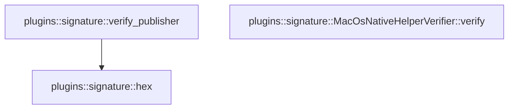

# plugins::signature

[Package atlas](index.md) · [Source](../../src/signature.rs)

## Declarations

Visibility is the declaration spelling; trait members and reexports require their enclosing interface. `cfg` is not evaluated.

| Symbol | Kind | Visibility | Test / cfg |
|---|---|---|---|
| [plugins::signature::PUBLISHER_ATTESTATION_PATH](../../src/signature.rs#L13) | const_item | `pub` |  |
| [plugins::signature::NativeHelperIdentity](../../src/signature.rs#L17) | struct_item | `pub` |  |
| [plugins::signature::PublisherIdentity](../../src/signature.rs#L28) | struct_item | `pub` |  |
| [plugins::signature::SignaturePolicy](../../src/signature.rs#L35) | struct_item | `pub` |  |
| [plugins::signature::NativeHelperVerifier](../../src/signature.rs#L41) | trait_item | `pub` |  |
| [plugins::signature::NativeHelperVerifier::verify](../../src/signature.rs#L42) | function_signature_item | `private` |  |
| [plugins::signature::MacOsNativeHelperVerifier](../../src/signature.rs#L51) | struct_item | `pub` |  |
| [plugins::signature::MacOsNativeHelperVerifier::verify](../../src/signature.rs#L54) | function_item | `private` |  |
| [plugins::signature::PublisherAttestation](../../src/signature.rs#L123) | struct_item | `private` |  |
| [plugins::signature::verify_publisher](../../src/signature.rs#L131) | function_item | `pub(crate)` |  |
| [plugins::signature::hex](../../src/signature.rs#L181) | function_item | `pub(crate)` |  |
| [plugins::signature::hex::HEX](../../src/signature.rs#L182) | const_item | `private` |  |

## Imports / reexports

| Local name | Source path | Visibility |
|---|---|---|
| `Path` | `std::path::Path` | `private` |
| `Command` | `std::process::Command` | `private` |
| `Engine` | `base64::Engine` | `private` |
| `STANDARD` | `base64::engine::general_purpose::STANDARD` | `private` |
| `ED25519` | `ring::signature::ED25519` | `private` |
| `UnparsedPublicKey` | `ring::signature::UnparsedPublicKey` | `private` |
| `Deserialize` | `serde::Deserialize` | `private` |
| `Serialize` | `serde::Serialize` | `private` |
| `Digest` | `sha2::Digest` | `private` |
| `Sha256` | `sha2::Sha256` | `private` |
| `PluginError` | `crate::PluginError` | `private` |

## Module declarations

| Module | Visibility | Attributes |
|---|---|---|

## Function call graphs

Edges below are syntactically resolved calls only, including private functions. Graphs partition callers into groups of 20; they are not execution order. All unresolved sites are listed below and in the JSON inventory.

Functions 1–3: 1 direct edges

## Call sites

Includes test functions (marked in declarations). Receiver-type-required sites need type analysis/manual tracing. Calls in closures are attributed to their enclosing function; their occurrence here does not mean the closure executes immediately.

| Caller | Callee expression | Source lines | Target / classification |
|---|---|---|---|
| `verify` | `Command::new("/usr/bin/codesign")                 .args(["--verify", "--strict", "--verbose=4"])                 .arg(executable)                 .output()                 .map_err` | [62](../../src/signature.rs#L62) | receiver-type-required |
| `verify` | `Command::new("/usr/bin/codesign")                 .args(["--verify", "--strict", "--verbose=4"])                 .arg(executable)                 .output` | [62](../../src/signature.rs#L62) | receiver-type-required |
| `verify` | `Command::new("/usr/bin/codesign")                 .args(["--verify", "--strict", "--verbose=4"])                 .arg` | [62](../../src/signature.rs#L62) | receiver-type-required |
| `verify` | `Command::new("/usr/bin/codesign")                 .args` | [62](../../src/signature.rs#L62), [72](../../src/signature.rs#L72) | receiver-type-required |
| `verify` | `Command::new` | [62](../../src/signature.rs#L62), [72](../../src/signature.rs#L72) | external-constructor-callback-or-unresolved |
| `verify` | `PluginError::Signature` | [66](../../src/signature.rs#L66), [68](../../src/signature.rs#L68), [76](../../src/signature.rs#L76), [78](../../src/signature.rs#L78), [94](../../src/signature.rs#L94), [102](../../src/signature.rs#L102), [114](../../src/signature.rs#L114) | external-constructor-callback-or-unresolved |
| `verify` | `error.to_string` | [66](../../src/signature.rs#L66), [76](../../src/signature.rs#L76) | receiver-type-required |
| `verify` | `verified.status.success` | [67](../../src/signature.rs#L67) | receiver-type-required |
| `verify` | `Err` | [68](../../src/signature.rs#L68), [78](../../src/signature.rs#L78), [114](../../src/signature.rs#L114) | external-constructor-callback-or-unresolved |
| `verify` | `Command::new("/usr/bin/codesign")                 .args(["--display", "--verbose=4", "-r-"])                 .arg(executable)                 .output()                 .map_err` | [72](../../src/signature.rs#L72) | receiver-type-required |
| `verify` | `Command::new("/usr/bin/codesign")                 .args(["--display", "--verbose=4", "-r-"])                 .arg(executable)                 .output` | [72](../../src/signature.rs#L72) | receiver-type-required |
| `verify` | `Command::new("/usr/bin/codesign")                 .args(["--display", "--verbose=4", "-r-"])                 .arg` | [72](../../src/signature.rs#L72) | receiver-type-required |
| `verify` | `displayed.status.success` | [77](../../src/signature.rs#L77) | receiver-type-required |
| `verify` | `text                 .lines()                 .find_map(&#124;line&#124; {                     line.strip_prefix("# designated => ")                         .or_else(&#124;&#124; line.strip_prefix("designated => "))                 })                 .ok_or_else` | [87](../../src/signature.rs#L87) | receiver-type-required |
| `verify` | `text                 .lines()                 .find_map` | [87](../../src/signature.rs#L87) | receiver-type-required |
| `verify` | `text                 .lines` | [87](../../src/signature.rs#L87) | receiver-type-required |
| `verify` | `line.strip_prefix("# designated => ")                         .or_else` | [90](../../src/signature.rs#L90) | receiver-type-required |
| `verify` | `line.strip_prefix` | [90](../../src/signature.rs#L90), [91](../../src/signature.rs#L91), [98](../../src/signature.rs#L98) | receiver-type-required |
| `verify` | `"missing designated requirement".to_owned` | [94](../../src/signature.rs#L94) | receiver-type-required |
| `verify` | `text.lines()                     .find_map(&#124;line&#124; line.strip_prefix(name))                     .map` | [97](../../src/signature.rs#L97) | receiver-type-required |
| `verify` | `text.lines()                     .find_map` | [97](../../src/signature.rs#L97) | receiver-type-required |
| `verify` | `text.lines` | [97](../../src/signature.rs#L97) | receiver-type-required |
| `verify` | `field("Identifier=")                 .ok_or_else` | [101](../../src/signature.rs#L101) | receiver-type-required |
| `verify` | `field` | [101](../../src/signature.rs#L101), [108](../../src/signature.rs#L108) | external-constructor-callback-or-unresolved |
| `verify` | `"missing signing identifier".to_owned` | [102](../../src/signature.rs#L102) | receiver-type-required |
| `verify` | `Ok` | [103](../../src/signature.rs#L103) | external-constructor-callback-or-unresolved |
| `verify` | `component_id.to_owned` | [104](../../src/signature.rs#L104) | receiver-type-required |
| `verify` | `relative_path.to_owned` | [105](../../src/signature.rs#L105) | receiver-type-required |
| `verify` | `requirement.to_owned` | [106](../../src/signature.rs#L106) | receiver-type-required |
| `verify` | `field("TeamIdentifier=").filter` | [108](../../src/signature.rs#L108) | receiver-type-required |
| `verify` | `"native helper signatures require macOS".to_owned` | [115](../../src/signature.rs#L115) | receiver-type-required |
| `verify_publisher` | `root.join` | [135](../../src/signature.rs#L135) | receiver-type-required |
| `verify_publisher` | `path.is_file` | [136](../../src/signature.rs#L136) | receiver-type-required |
| `verify_publisher` | `Ok` | [137](../../src/signature.rs#L137), [174](../../src/signature.rs#L174) | external-constructor-callback-or-unresolved |
| `verify_publisher` | `serde_json::from_slice(         &std::fs::read(&path).map_err(&#124;error&#124; PluginError::Storage(error.to_string()))?,     )     .map_err` | [139](../../src/signature.rs#L139) | receiver-type-required |
| `verify_publisher` | `serde_json::from_slice` | [139](../../src/signature.rs#L139) | external-constructor-callback-or-unresolved |
| `verify_publisher` | `std::fs::read(&path).map_err` | [140](../../src/signature.rs#L140) | receiver-type-required |
| `verify_publisher` | `std::fs::read` | [140](../../src/signature.rs#L140) | external-constructor-callback-or-unresolved |
| `verify_publisher` | `PluginError::Storage` | [140](../../src/signature.rs#L140) | external-constructor-callback-or-unresolved |
| `verify_publisher` | `error.to_string` | [140](../../src/signature.rs#L140), [142](../../src/signature.rs#L142), [161](../../src/signature.rs#L161), [164](../../src/signature.rs#L164) | receiver-type-required |
| `verify_publisher` | `PluginError::Signature` | [142](../../src/signature.rs#L142), [155](../../src/signature.rs#L155), [161](../../src/signature.rs#L161), [164](../../src/signature.rs#L164), [167](../../src/signature.rs#L167), [173](../../src/signature.rs#L173) | external-constructor-callback-or-unresolved |
| `verify_publisher` | `attestation.publisher_id.is_empty` | [143](../../src/signature.rs#L143) | receiver-type-required |
| `verify_publisher` | `attestation.publisher_id.len` | [144](../../src/signature.rs#L144) | receiver-type-required |
| `verify_publisher` | `attestation             .publisher_id             .bytes()             .all` | [145](../../src/signature.rs#L145) | receiver-type-required |
| `verify_publisher` | `attestation             .publisher_id             .bytes` | [145](../../src/signature.rs#L145) | receiver-type-required |
| `verify_publisher` | `byte.is_ascii_alphanumeric` | [148](../../src/signature.rs#L148) | receiver-type-required |
| `verify_publisher` | `attestation.content_digest.len` | [149](../../src/signature.rs#L149) | receiver-type-required |
| `verify_publisher` | `attestation             .content_digest             .bytes()             .all` | [150](../../src/signature.rs#L150) | receiver-type-required |
| `verify_publisher` | `attestation             .content_digest             .bytes` | [150](../../src/signature.rs#L150) | receiver-type-required |
| `verify_publisher` | `byte.is_ascii_hexdigit` | [153](../../src/signature.rs#L153) | receiver-type-required |
| `verify_publisher` | `byte.is_ascii_uppercase` | [153](../../src/signature.rs#L153) | receiver-type-required |
| `verify_publisher` | `Err` | [155](../../src/signature.rs#L155), [167](../../src/signature.rs#L167) | external-constructor-callback-or-unresolved |
| `verify_publisher` | `"invalid publisher attestation fields".to_owned` | [156](../../src/signature.rs#L156) | receiver-type-required |
| `verify_publisher` | `STANDARD         .decode(attestation.public_key)         .map_err` | [159](../../src/signature.rs#L159) | receiver-type-required |
| `verify_publisher` | `STANDARD         .decode` | [159](../../src/signature.rs#L159), [162](../../src/signature.rs#L162) | receiver-type-required |
| `verify_publisher` | `STANDARD         .decode(attestation.signature)         .map_err` | [162](../../src/signature.rs#L162) | receiver-type-required |
| `verify_publisher` | `digest_without_attestation` | [165](../../src/signature.rs#L165) | external-constructor-callback-or-unresolved |
| `verify_publisher` | `"publisher content digest mismatch".to_owned` | [168](../../src/signature.rs#L168) | receiver-type-required |
| `verify_publisher` | `UnparsedPublicKey::new(&ED25519, &public_key)         .verify(attestation.content_digest.as_bytes(), &signature)         .map_err` | [171](../../src/signature.rs#L171) | receiver-type-required |
| `verify_publisher` | `UnparsedPublicKey::new(&ED25519, &public_key)         .verify` | [171](../../src/signature.rs#L171) | receiver-type-required |
| `verify_publisher` | `UnparsedPublicKey::new` | [171](../../src/signature.rs#L171) | external-constructor-callback-or-unresolved |
| `verify_publisher` | `attestation.content_digest.as_bytes` | [172](../../src/signature.rs#L172) | receiver-type-required |
| `verify_publisher` | `"publisher signature rejected".to_owned` | [173](../../src/signature.rs#L173) | receiver-type-required |
| `verify_publisher` | `Some` | [174](../../src/signature.rs#L174) | external-constructor-callback-or-unresolved |
| `verify_publisher` | `hex` | [176](../../src/signature.rs#L176) | [plugins::signature::hex](../../src/signature.rs#L181) |
| `verify_publisher` | `Sha256::digest` | [176](../../src/signature.rs#L176) | external-constructor-callback-or-unresolved |
| `hex` | `String::with_capacity` | [183](../../src/signature.rs#L183) | external-constructor-callback-or-unresolved |
| `hex` | `bytes.len` | [183](../../src/signature.rs#L183) | receiver-type-required |
| `hex` | `output.push` | [185](../../src/signature.rs#L185), [186](../../src/signature.rs#L186) | receiver-type-required |
| `hex` | `char::from` | [185](../../src/signature.rs#L185), [186](../../src/signature.rs#L186) | external-constructor-callback-or-unresolved |
| `hex` | `usize::from` | [185](../../src/signature.rs#L185), [186](../../src/signature.rs#L186) | external-constructor-callback-or-unresolved |
