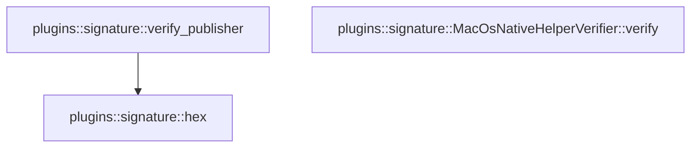

# plugins::signature

[Package atlas](index.md) · [Source](../../src/signature.rs)

## Declarations

Visibility is the declaration spelling; trait members and reexports require their enclosing interface. `cfg` is not evaluated.

| Symbol | Kind | Visibility | Test / cfg |
|---|---|---|---|
| [plugins::signature::PUBLISHER_ATTESTATION_PATH](../../src/signature.rs#L12) | const_item | `pub` |  |
| [plugins::signature::NativeHelperIdentity](../../src/signature.rs#L16) | struct_item | `pub` |  |
| [plugins::signature::PublisherIdentity](../../src/signature.rs#L27) | struct_item | `pub` |  |
| [plugins::signature::SignaturePolicy](../../src/signature.rs#L34) | struct_item | `pub` |  |
| [plugins::signature::NativeHelperVerifier](../../src/signature.rs#L40) | trait_item | `pub` |  |
| [plugins::signature::NativeHelperVerifier::verify](../../src/signature.rs#L41) | function_signature_item | `private` |  |
| [plugins::signature::MacOsNativeHelperVerifier](../../src/signature.rs#L50) | struct_item | `pub` |  |
| [plugins::signature::MacOsNativeHelperVerifier::verify](../../src/signature.rs#L53) | function_item | `private` |  |
| [plugins::signature::PublisherAttestation](../../src/signature.rs#L122) | struct_item | `private` |  |
| [plugins::signature::verify_publisher](../../src/signature.rs#L130) | function_item | `pub(crate)` |  |
| [plugins::signature::hex](../../src/signature.rs#L180) | function_item | `pub(crate)` |  |
| [plugins::signature::hex::HEX](../../src/signature.rs#L181) | const_item | `private` |  |

## Imports / reexports

| Local name | Source path | Visibility |
|---|---|---|
| `Path` | `std::path::Path` | `private` |
| `Command` | `std::process::Command` | `private` |
| `Engine` | `base64::Engine` | `private` |
| `STANDARD` | `base64::engine::general_purpose::STANDARD` | `private` |
| `ED25519` | `ring::signature::ED25519` | `private` |
| `UnparsedPublicKey` | `ring::signature::UnparsedPublicKey` | `private` |
| `Deserialize` | `serde::Deserialize` | `private` |
| `Serialize` | `serde::Serialize` | `private` |
| `Digest` | `sha2::Digest` | `private` |
| `Sha256` | `sha2::Sha256` | `private` |
| `PluginError` | `crate::PluginError` | `private` |

## Module declarations

| Module | Visibility | Attributes |
|---|---|---|

## Function call graphs

Edges below are syntactically resolved calls only, including private functions. Graphs partition callers into groups of 20; they are not execution order. All unresolved sites are listed below and in the JSON inventory.

Functions 1–3: 1 direct edges

## Call sites

Includes test functions (marked in declarations). Receiver-type-required sites need type analysis/manual tracing. Calls in closures are attributed to their enclosing function; their occurrence here does not mean the closure executes immediately.

| Caller | Callee expression | Source lines | Target / classification |
|---|---|---|---|
| `verify` | `Command::new("/usr/bin/codesign")                 .args(["--verify", "--strict", "--verbose=4"])                 .arg(executable)                 .output()                 .map_err` | [61](../../src/signature.rs#L61) | receiver-type-required |
| `verify` | `Command::new("/usr/bin/codesign")                 .args(["--verify", "--strict", "--verbose=4"])                 .arg(executable)                 .output` | [61](../../src/signature.rs#L61) | receiver-type-required |
| `verify` | `Command::new("/usr/bin/codesign")                 .args(["--verify", "--strict", "--verbose=4"])                 .arg` | [61](../../src/signature.rs#L61) | receiver-type-required |
| `verify` | `Command::new("/usr/bin/codesign")                 .args` | [61](../../src/signature.rs#L61), [71](../../src/signature.rs#L71) | receiver-type-required |
| `verify` | `Command::new` | [61](../../src/signature.rs#L61), [71](../../src/signature.rs#L71) | external-constructor-callback-or-unresolved |
| `verify` | `PluginError::Signature` | [65](../../src/signature.rs#L65), [67](../../src/signature.rs#L67), [75](../../src/signature.rs#L75), [77](../../src/signature.rs#L77), [93](../../src/signature.rs#L93), [101](../../src/signature.rs#L101), [113](../../src/signature.rs#L113) | external-constructor-callback-or-unresolved |
| `verify` | `error.to_string` | [65](../../src/signature.rs#L65), [75](../../src/signature.rs#L75) | receiver-type-required |
| `verify` | `verified.status.success` | [66](../../src/signature.rs#L66) | receiver-type-required |
| `verify` | `Err` | [67](../../src/signature.rs#L67), [77](../../src/signature.rs#L77), [113](../../src/signature.rs#L113) | external-constructor-callback-or-unresolved |
| `verify` | `Command::new("/usr/bin/codesign")                 .args(["--display", "--verbose=4", "-r-"])                 .arg(executable)                 .output()                 .map_err` | [71](../../src/signature.rs#L71) | receiver-type-required |
| `verify` | `Command::new("/usr/bin/codesign")                 .args(["--display", "--verbose=4", "-r-"])                 .arg(executable)                 .output` | [71](../../src/signature.rs#L71) | receiver-type-required |
| `verify` | `Command::new("/usr/bin/codesign")                 .args(["--display", "--verbose=4", "-r-"])                 .arg` | [71](../../src/signature.rs#L71) | receiver-type-required |
| `verify` | `displayed.status.success` | [76](../../src/signature.rs#L76) | receiver-type-required |
| `verify` | `text                 .lines()                 .find_map(&#124;line&#124; {                     line.strip_prefix("# designated => ")                         .or_else(&#124;&#124; line.strip_prefix("designated => "))                 })                 .ok_or_else` | [86](../../src/signature.rs#L86) | receiver-type-required |
| `verify` | `text                 .lines()                 .find_map` | [86](../../src/signature.rs#L86) | receiver-type-required |
| `verify` | `text                 .lines` | [86](../../src/signature.rs#L86) | receiver-type-required |
| `verify` | `line.strip_prefix("# designated => ")                         .or_else` | [89](../../src/signature.rs#L89) | receiver-type-required |
| `verify` | `line.strip_prefix` | [89](../../src/signature.rs#L89), [90](../../src/signature.rs#L90), [97](../../src/signature.rs#L97) | receiver-type-required |
| `verify` | `"missing designated requirement".to_owned` | [93](../../src/signature.rs#L93) | receiver-type-required |
| `verify` | `text.lines()                     .find_map(&#124;line&#124; line.strip_prefix(name))                     .map` | [96](../../src/signature.rs#L96) | receiver-type-required |
| `verify` | `text.lines()                     .find_map` | [96](../../src/signature.rs#L96) | receiver-type-required |
| `verify` | `text.lines` | [96](../../src/signature.rs#L96) | receiver-type-required |
| `verify` | `field("Identifier=")                 .ok_or_else` | [100](../../src/signature.rs#L100) | receiver-type-required |
| `verify` | `field` | [100](../../src/signature.rs#L100), [107](../../src/signature.rs#L107) | external-constructor-callback-or-unresolved |
| `verify` | `"missing signing identifier".to_owned` | [101](../../src/signature.rs#L101) | receiver-type-required |
| `verify` | `Ok` | [102](../../src/signature.rs#L102) | external-constructor-callback-or-unresolved |
| `verify` | `component_id.to_owned` | [103](../../src/signature.rs#L103) | receiver-type-required |
| `verify` | `relative_path.to_owned` | [104](../../src/signature.rs#L104) | receiver-type-required |
| `verify` | `requirement.to_owned` | [105](../../src/signature.rs#L105) | receiver-type-required |
| `verify` | `field("TeamIdentifier=").filter` | [107](../../src/signature.rs#L107) | receiver-type-required |
| `verify` | `"native helper signatures require macOS".to_owned` | [114](../../src/signature.rs#L114) | receiver-type-required |
| `verify_publisher` | `root.join` | [134](../../src/signature.rs#L134) | receiver-type-required |
| `verify_publisher` | `path.is_file` | [135](../../src/signature.rs#L135) | receiver-type-required |
| `verify_publisher` | `Ok` | [136](../../src/signature.rs#L136), [173](../../src/signature.rs#L173) | external-constructor-callback-or-unresolved |
| `verify_publisher` | `serde_json::from_slice(         &std::fs::read(&path).map_err(&#124;error&#124; PluginError::Storage(error.to_string()))?,     )     .map_err` | [138](../../src/signature.rs#L138) | receiver-type-required |
| `verify_publisher` | `serde_json::from_slice` | [138](../../src/signature.rs#L138) | external-constructor-callback-or-unresolved |
| `verify_publisher` | `std::fs::read(&path).map_err` | [139](../../src/signature.rs#L139) | receiver-type-required |
| `verify_publisher` | `std::fs::read` | [139](../../src/signature.rs#L139) | external-constructor-callback-or-unresolved |
| `verify_publisher` | `PluginError::Storage` | [139](../../src/signature.rs#L139) | external-constructor-callback-or-unresolved |
| `verify_publisher` | `error.to_string` | [139](../../src/signature.rs#L139), [141](../../src/signature.rs#L141), [160](../../src/signature.rs#L160), [163](../../src/signature.rs#L163) | receiver-type-required |
| `verify_publisher` | `PluginError::Signature` | [141](../../src/signature.rs#L141), [154](../../src/signature.rs#L154), [160](../../src/signature.rs#L160), [163](../../src/signature.rs#L163), [166](../../src/signature.rs#L166), [172](../../src/signature.rs#L172) | external-constructor-callback-or-unresolved |
| `verify_publisher` | `attestation.publisher_id.is_empty` | [142](../../src/signature.rs#L142) | receiver-type-required |
| `verify_publisher` | `attestation.publisher_id.len` | [143](../../src/signature.rs#L143) | receiver-type-required |
| `verify_publisher` | `attestation             .publisher_id             .bytes()             .all` | [144](../../src/signature.rs#L144) | receiver-type-required |
| `verify_publisher` | `attestation             .publisher_id             .bytes` | [144](../../src/signature.rs#L144) | receiver-type-required |
| `verify_publisher` | `byte.is_ascii_alphanumeric` | [147](../../src/signature.rs#L147) | receiver-type-required |
| `verify_publisher` | `attestation.content_digest.len` | [148](../../src/signature.rs#L148) | receiver-type-required |
| `verify_publisher` | `attestation             .content_digest             .bytes()             .all` | [149](../../src/signature.rs#L149) | receiver-type-required |
| `verify_publisher` | `attestation             .content_digest             .bytes` | [149](../../src/signature.rs#L149) | receiver-type-required |
| `verify_publisher` | `byte.is_ascii_hexdigit` | [152](../../src/signature.rs#L152) | receiver-type-required |
| `verify_publisher` | `byte.is_ascii_uppercase` | [152](../../src/signature.rs#L152) | receiver-type-required |
| `verify_publisher` | `Err` | [154](../../src/signature.rs#L154), [166](../../src/signature.rs#L166) | external-constructor-callback-or-unresolved |
| `verify_publisher` | `"invalid publisher attestation fields".to_owned` | [155](../../src/signature.rs#L155) | receiver-type-required |
| `verify_publisher` | `STANDARD         .decode(attestation.public_key)         .map_err` | [158](../../src/signature.rs#L158) | receiver-type-required |
| `verify_publisher` | `STANDARD         .decode` | [158](../../src/signature.rs#L158), [161](../../src/signature.rs#L161) | receiver-type-required |
| `verify_publisher` | `STANDARD         .decode(attestation.signature)         .map_err` | [161](../../src/signature.rs#L161) | receiver-type-required |
| `verify_publisher` | `digest_without_attestation` | [164](../../src/signature.rs#L164) | external-constructor-callback-or-unresolved |
| `verify_publisher` | `"publisher content digest mismatch".to_owned` | [167](../../src/signature.rs#L167) | receiver-type-required |
| `verify_publisher` | `UnparsedPublicKey::new(&ED25519, &public_key)         .verify(attestation.content_digest.as_bytes(), &signature)         .map_err` | [170](../../src/signature.rs#L170) | receiver-type-required |
| `verify_publisher` | `UnparsedPublicKey::new(&ED25519, &public_key)         .verify` | [170](../../src/signature.rs#L170) | receiver-type-required |
| `verify_publisher` | `UnparsedPublicKey::new` | [170](../../src/signature.rs#L170) | external-constructor-callback-or-unresolved |
| `verify_publisher` | `attestation.content_digest.as_bytes` | [171](../../src/signature.rs#L171) | receiver-type-required |
| `verify_publisher` | `"publisher signature rejected".to_owned` | [172](../../src/signature.rs#L172) | receiver-type-required |
| `verify_publisher` | `Some` | [173](../../src/signature.rs#L173) | external-constructor-callback-or-unresolved |
| `verify_publisher` | `hex` | [175](../../src/signature.rs#L175) | [plugins::signature::hex](../../src/signature.rs#L180) |
| `verify_publisher` | `Sha256::digest` | [175](../../src/signature.rs#L175) | external-constructor-callback-or-unresolved |
| `hex` | `String::with_capacity` | [182](../../src/signature.rs#L182) | external-constructor-callback-or-unresolved |
| `hex` | `bytes.len` | [182](../../src/signature.rs#L182) | receiver-type-required |
| `hex` | `output.push` | [184](../../src/signature.rs#L184), [185](../../src/signature.rs#L185) | receiver-type-required |
| `hex` | `char::from` | [184](../../src/signature.rs#L184), [185](../../src/signature.rs#L185) | external-constructor-callback-or-unresolved |
| `hex` | `usize::from` | [184](../../src/signature.rs#L184), [185](../../src/signature.rs#L185) | external-constructor-callback-or-unresolved |
