```mermaid
flowchart TD
  n0["plugins::model::safe_relative"]
  n1["plugins::model::qualified_id"]
  n2["plugins::store::PluginStore::operations_root"]
  n3["plugins::store::PluginStore::operation_path"]
  n4["plugins::store::PluginStore::registry_path"]
  n5["plugins::store::sorted_capabilities"]
  n6["plugins::store::validate_operation"]
  n7["plugins::store::validate_receipt"]
  n8["plugins::store::is_lower_hex_digest"]
  n9["plugins::store::validate_grants"]
  n10["plugins::store::require_all_grants"]
  n11["plugins::store::write_canonical"]
  n12["plugins::store::read_canonical"]
  n13["plugins::store::remove_tree"]
  n14["plugins::store::cleanup_temporaries"]
  n15["plugins::store::read_dirs"]
  n16["plugins::store::path_is_present"]
  n17["plugins::store::ensure_directory"]
  n18["plugins::store::remove_empty"]
  n19["plugins::store::sync_directory"]
  n20["plugins::store::PluginStore::create_layout"]
  n21["plugins::store::PluginStore::read_registry"]
  n22["plugins::store::PluginStore::write_registry"]
  n23["plugins::store::PluginStore::write_operation"]
  n24["plugins::store::PluginStore::collect_orphans"]
  n25["plugins::store::PluginStore::cleanup_publication_temporaries"]
  n26["plugins::store::PluginStore::ensure_plugin_data_directory"]
  n27["plugins::store::PluginStore::crash"]
  n28["plugins::store::PluginStore::packages_root"]
  n29["plugins::store::PluginStore::data_root"]
  n30["plugins::store::PluginStore::staging_root"]
  n31["store::platform::FullSync::full_sync"]
  n3 --> n2
  n6 --> n1
  n6 --> n7
  n7 --> n0
  n7 --> n1
  n7 --> n8
  n20 --> n2
  n20 --> n17
  n20 --> n19
  n20 --> n28
  n20 --> n29
  n20 --> n30
  n21 --> n4
  n21 --> n7
  n21 --> n12
  n21 --> n16
  n22 --> n4
  n22 --> n11
  n23 --> n3
  n23 --> n11
  n24 --> n13
  n24 --> n15
  n24 --> n18
  n24 --> n21
  n24 --> n28
  n24 --> n29
  n25 --> n2
  n25 --> n14
  n26 --> n17
  n26 --> n29
  n26 --> n31
```

# plugins::store

[Package atlas](index.md) · [Source](../../src/store.rs)

## Declarations

Visibility is the declaration spelling; trait members and reexports require their enclosing interface. `cfg` is not evaluated.

| Symbol | Kind | Visibility | Test / cfg |
|---|---|---|---|
| [plugins::store::OPERATION_ORDINAL](../../src/store.rs#L26) | static_item | `private` |  |
| [plugins::store::PluginError](../../src/store.rs#L29) | enum_item | `pub` |  |
| [plugins::store::FaultPoint](../../src/store.rs#L71) | enum_item | `pub` |  |
| [plugins::store::InstallOptions](../../src/store.rs#L78) | struct_item | `pub` |  |
| [plugins::store::IntegrityStatus](../../src/store.rs#L87) | enum_item | `pub` |  |
| [plugins::store::PluginReceipt](../../src/store.rs#L94) | struct_item | `pub` |  |
| [plugins::store::PluginInspection](../../src/store.rs#L112) | struct_item | `pub` |  |
| [plugins::store::PluginReceipt::requested_ids](../../src/store.rs#L120) | function_item | `private` |  |
| [plugins::store::ManagementRequest](../../src/store.rs#L129) | enum_item | `pub` |  |
| [plugins::store::ManagementResult](../../src/store.rs#L151) | enum_item | `pub` |  |
| [plugins::store::Registry](../../src/store.rs#L160) | struct_item | `private` |  |
| [plugins::store::Registry::default](../../src/store.rs#L166) | function_item | `private` |  |
| [plugins::store::OperationKind](../../src/store.rs#L176) | enum_item | `private` |  |
| [plugins::store::OperationPhase](../../src/store.rs#L185) | enum_item | `private` |  |
| [plugins::store::Operation](../../src/store.rs#L192) | struct_item | `private` |  |
| [plugins::store::PluginStore](../../src/store.rs#L202) | struct_item | `pub` |  |
| [plugins::store::PluginStore::open](../../src/store.rs#L211) | function_item | `pub` |  |
| [plugins::store::PluginStore::injecting_fault](../../src/store.rs#L230) | function_item | `pub` |  |
| [plugins::store::PluginStore::manage](../../src/store.rs#L235) | function_item | `pub` |  |
| [plugins::store::PluginStore::install](../../src/store.rs#L258) | function_item | `pub` |  |
| [plugins::store::PluginStore::inspect](../../src/store.rs#L390) | function_item | `pub` |  |
| [plugins::store::PluginStore::freeze_source](../../src/store.rs#L410) | function_item | `pub` |  |
| [plugins::store::PluginStore::inspect_staged](../../src/store.rs#L436) | function_item | `private` |  |
| [plugins::store::PluginStore::list](../../src/store.rs#L467) | function_item | `pub` |  |
| [plugins::store::PluginStore::set_enabled](../../src/store.rs#L472) | function_item | `pub` |  |
| [plugins::store::PluginStore::set_grants](../../src/store.rs#L493) | function_item | `pub` |  |
| [plugins::store::PluginStore::remove](../../src/store.rs#L511) | function_item | `pub` |  |
| [plugins::store::PluginStore::components](../../src/store.rs#L546) | function_item | `pub` |  |
| [plugins::store::PluginStore::resolve_executable_component](../../src/store.rs#L593) | function_item | `pub` |  |
| [plugins::store::PluginStore::recover](../../src/store.rs#L634) | function_item | `pub` |  |
| [plugins::store::PluginStore::mutate_receipt](../../src/store.rs#L680) | function_item | `private` |  |
| [plugins::store::PluginStore::verify_stored_receipt](../../src/store.rs#L721) | function_item | `private` |  |
| [plugins::store::PluginStore::load_package](../../src/store.rs#L804) | function_item | `private` |  |
| [plugins::store::PluginStore::verify_native_helpers](../../src/store.rs#L848) | function_item | `private` |  |
| [plugins::store::PluginStore::create_layout](../../src/store.rs#L874) | function_item | `private` |  |
| [plugins::store::PluginStore::read_registry](../../src/store.rs#L890) | function_item | `private` |  |
| [plugins::store::PluginStore::write_registry](../../src/store.rs#L913) | function_item | `private` |  |
| [plugins::store::PluginStore::write_operation](../../src/store.rs#L921) | function_item | `private` |  |
| [plugins::store::PluginStore::collect_orphans](../../src/store.rs#L925) | function_item | `private` |  |
| [plugins::store::PluginStore::cleanup_publication_temporaries](../../src/store.rs#L960) | function_item | `private` |  |
| [plugins::store::PluginStore::ensure_plugin_data_directory](../../src/store.rs#L965) | function_item | `private` |  |
| [plugins::store::PluginStore::crash](../../src/store.rs#L985) | function_item | `private` |  |
| [plugins::store::PluginStore::packages_root](../../src/store.rs#L993) | function_item | `private` |  |
| [plugins::store::PluginStore::data_root](../../src/store.rs#L996) | function_item | `private` |  |
| [plugins::store::PluginStore::staging_root](../../src/store.rs#L999) | function_item | `private` |  |
| [plugins::store::PluginStore::operations_root](../../src/store.rs#L1002) | function_item | `private` |  |
| [plugins::store::PluginStore::operation_path](../../src/store.rs#L1005) | function_item | `private` |  |
| [plugins::store::PluginStore::registry_path](../../src/store.rs#L1008) | function_item | `private` |  |
| [plugins::store::LoadedPackage](../../src/store.rs#L1013) | struct_item | `private` |  |
| [plugins::store::sorted_capabilities](../../src/store.rs#L1018) | function_item | `private` |  |
| [plugins::store::validate_operation](../../src/store.rs#L1024) | function_item | `private` |  |
| [plugins::store::validate_receipt](../../src/store.rs#L1076) | function_item | `private` |  |
| [plugins::store::is_lower_hex_digest](../../src/store.rs#L1146) | function_item | `private` |  |
| [plugins::store::validate_grants](../../src/store.rs#L1153) | function_item | `private` |  |
| [plugins::store::require_all_grants](../../src/store.rs#L1166) | function_item | `private` |  |
| [plugins::store::package_digest](../../src/store.rs#L1179) | function_item | `private` |  |
| [plugins::store::collect_entries](../../src/store.rs#L1212) | function_item | `private` |  |
| [plugins::store::hash_fields](../../src/store.rs#L1240) | function_item | `private` |  |
| [plugins::store::hash_value](../../src/store.rs#L1246) | function_item | `private` |  |
| [plugins::store::write_canonical](../../src/store.rs#L1251) | function_item | `private` |  |
| [plugins::store::read_canonical](../../src/store.rs#L1279) | function_item | `private` |  |
| [plugins::store::operation_id](../../src/store.rs#L1303) | function_item | `private` |  |
| [plugins::store::seal_tree](../../src/store.rs#L1311) | function_item | `private` |  |
| [plugins::store::sync_tree](../../src/store.rs#L1331) | function_item | `private` |  |
| [plugins::store::collect_paths](../../src/store.rs#L1342) | function_item | `private` |  |
| [plugins::store::remove_tree](../../src/store.rs#L1365) | function_item | `private` |  |
| [plugins::store::clear_directory](../../src/store.rs#L1402) | function_item | `private` |  |
| [plugins::store::cleanup_temporaries](../../src/store.rs#L1413) | function_item | `private` |  |
| [plugins::store::read_dirs](../../src/store.rs#L1441) | function_item | `private` |  |
| [plugins::store::path_is_present](../../src/store.rs#L1462) | function_item | `private` |  |
| [plugins::store::require_directory](../../src/store.rs#L1470) | function_item | `private` |  |
| [plugins::store::ensure_directory](../../src/store.rs#L1483) | function_item | `private` |  |
| [plugins::store::remove_empty](../../src/store.rs#L1499) | function_item | `private` |  |
| [plugins::store::sync_directory](../../src/store.rs#L1513) | function_item | `private` |  |

## Imports / reexports

| Local name | Source path | Visibility |
|---|---|---|
| `BTreeMap` | `std::collections::BTreeMap` | `private` |
| `BTreeSet` | `std::collections::BTreeSet` | `private` |
| `fs` | `std::fs` | `private` |
| `File` | `std::fs::File` | `private` |
| `OpenOptions` | `std::fs::OpenOptions` | `private` |
| `Write` | `std::io::Write` | `private` |
| `OpenOptionsExt` | `std::os::unix::fs::OpenOptionsExt` | `private` |
| `PermissionsExt` | `std::os::unix::fs::PermissionsExt` | `private` |
| `Path` | `std::path::Path` | `private` |
| `PathBuf` | `std::path::PathBuf` | `private` |
| `AtomicU64` | `std::sync::atomic::AtomicU64` | `private` |
| `Ordering` | `std::sync::atomic::Ordering` | `private` |
| `SystemTime` | `std::time::SystemTime` | `private` |
| `UNIX_EPOCH` | `std::time::UNIX_EPOCH` | `private` |
| `Mode` | `rustix::fs::Mode` | `private` |
| `OFlags` | `rustix::fs::OFlags` | `private` |
| `fchmod` | `rustix::fs::fchmod` | `private` |
| `open` | `rustix::fs::open` | `private` |
| `DeserializeOwned` | `serde::de::DeserializeOwned` | `private` |
| `Deserialize` | `serde::Deserialize` | `private` |
| `Serialize` | `serde::Serialize` | `private` |
| `Digest` | `sha2::Digest` | `private` |
| `Sha256` | `sha2::Sha256` | `private` |
| `FullSync` | `store::FullSync` | `private` |
| `Error` | `thiserror::Error` | `private` |
| `ComponentKind` | `crate::model::ComponentKind` | `private` |
| `ComponentProjection` | `crate::model::ComponentProjection` | `private` |
| `NativeHelperIdentity` | `crate::signature::NativeHelperIdentity` | `private` |
| `NativeHelperVerifier` | `crate::signature::NativeHelperVerifier` | `private` |
| `PUBLISHER_ATTESTATION_PATH` | `crate::signature::PUBLISHER_ATTESTATION_PATH` | `private` |
| `PublisherIdentity` | `crate::signature::PublisherIdentity` | `private` |
| `SignaturePolicy` | `crate::signature::SignaturePolicy` | `private` |
| `hex` | `crate::signature::hex` | `private` |
| `verify_publisher` | `crate::signature::verify_publisher` | `private` |
| `HostEnvironment` | `crate::HostEnvironment` | `private` |
| `Manifest` | `crate::Manifest` | `private` |
| `PLUGIN_MANIFEST_FILE` | `crate::PLUGIN_MANIFEST_FILE` | `private` |
| `PluginComponentReference` | `crate::PluginComponentReference` | `private` |
| `PluginSource` | `crate::PluginSource` | `private` |
| `PluginVersion` | `crate::PluginVersion` | `private` |
| `ResolvedPluginExecutable` | `crate::ResolvedPluginExecutable` | `private` |

## Module declarations

| Module | Visibility | Attributes |
|---|---|---|

## Function call graphs

Edges below are syntactically resolved calls only, including private functions. Graphs partition callers into groups of 20; they are not execution order. All unresolved sites are listed below and in the JSON inventory.

```mermaid
flowchart TD
  n0["plugins::signature::verify_publisher"]
  n1["plugins::store::PluginStore::operations_root"]
  n2["plugins::store::PluginStore::operation_path"]
  n3["plugins::store::sorted_capabilities"]
  n4["plugins::store::validate_operation"]
  n5["plugins::store::validate_grants"]
  n6["plugins::store::require_all_grants"]
  n7["plugins::store::package_digest"]
  n8["plugins::store::PluginReceipt::requested_ids"]
  n9["plugins::store::read_canonical"]
  n10["plugins::store::operation_id"]
  n11["plugins::store::seal_tree"]
  n12["plugins::store::sync_tree"]
  n13["plugins::store::remove_tree"]
  n14["plugins::store::clear_directory"]
  n15["plugins::store::path_is_present"]
  n16["plugins::store::require_directory"]
  n17["plugins::store::ensure_directory"]
  n18["plugins::store::sync_directory"]
  n19["plugins::store::Registry::default"]
  n20["plugins::store::PluginStore::open"]
  n21["plugins::store::PluginStore::injecting_fault"]
  n22["plugins::store::PluginStore::manage"]
  n23["plugins::store::PluginStore::install"]
  n24["plugins::store::PluginStore::inspect"]
  n25["plugins::store::PluginStore::freeze_source"]
  n26["plugins::store::PluginStore::inspect_staged"]
  n27["plugins::store::PluginStore::list"]
  n28["plugins::store::PluginStore::set_enabled"]
  n29["plugins::store::PluginStore::set_grants"]
  n30["plugins::store::PluginStore::remove"]
  n31["plugins::store::PluginStore::components"]
  n32["plugins::store::PluginStore::resolve_executable_component"]
  n33["plugins::store::PluginStore::recover"]
  n34["plugins::store::PluginStore::mutate_receipt"]
  n35["plugins::store::PluginStore::verify_stored_receipt"]
  n36["plugins::store::PluginStore::load_package"]
  n37["plugins::store::PluginStore::verify_native_helpers"]
  n38["plugins::store::PluginStore::create_layout"]
  n39["plugins::store::PluginStore::read_registry"]
  n40["plugins::store::PluginStore::write_registry"]
  n41["plugins::store::PluginStore::write_operation"]
  n42["plugins::store::PluginStore::collect_orphans"]
  n43["plugins::store::PluginStore::cleanup_publication_temporaries"]
  n44["plugins::store::PluginStore::ensure_plugin_data_directory"]
  n45["plugins::store::PluginStore::crash"]
  n46["plugins::store::PluginStore::packages_root"]
  n47["plugins::store::PluginStore::data_root"]
  n48["plugins::store::PluginStore::staging_root"]
  n22 --> n23
  n22 --> n27
  n22 --> n28
  n22 --> n29
  n22 --> n30
  n22 --> n31
  n22 --> n33
  n23 --> n0
  n23 --> n3
  n23 --> n5
  n23 --> n6
  n23 --> n7
  n23 --> n11
  n23 --> n12
  n23 --> n13
  n23 --> n15
  n23 --> n16
  n23 --> n17
  n23 --> n18
  n23 --> n33
  n23 --> n36
  n23 --> n37
  n23 --> n39
  n23 --> n40
  n23 --> n41
  n23 --> n45
  n23 --> n46
  n23 --> n47
  n23 --> n48
  n24 --> n13
  n24 --> n26
  n25 --> n12
  n25 --> n13
  n25 --> n15
  n25 --> n16
  n25 --> n18
  n25 --> n26
  n26 --> n0
  n26 --> n3
  n26 --> n7
  n26 --> n36
  n26 --> n37
  n27 --> n33
  n27 --> n39
  n28 --> n34
  n29 --> n34
  n30 --> n10
  n30 --> n33
  n30 --> n39
  n30 --> n40
  n30 --> n41
  n30 --> n45
  n31 --> n33
  n31 --> n35
  n31 --> n36
  n31 --> n39
  n31 --> n47
  n32 --> n33
  n32 --> n35
  n32 --> n36
  n32 --> n39
  n32 --> n44
  n33 --> n1
  n33 --> n2
  n33 --> n4
  n33 --> n9
  n33 --> n13
  n33 --> n14
  n33 --> n15
  n33 --> n18
  n33 --> n35
  n33 --> n38
  n33 --> n39
  n33 --> n42
  n33 --> n43
  n33 --> n44
  n33 --> n47
  n33 --> n48
  n34 --> n10
  n34 --> n33
  n34 --> n35
  n34 --> n39
  n34 --> n40
  n34 --> n41
  n34 --> n45
  n35 --> n0
  n35 --> n3
  n35 --> n5
  n35 --> n6
  n35 --> n7
  n35 --> n36
  n35 --> n37
```

Functions 1–20: 92 direct edges

Functions 21–40: 31 direct edges

Functions 41–59: 22 direct edges

```mermaid
flowchart TD
  n0["plugins::signature::hex"]
  n1["plugins::store::package_digest"]
  n2["plugins::store::collect_entries"]
  n3["plugins::store::hash_fields"]
  n4["plugins::store::hash_value"]
  n5["plugins::store::write_canonical"]
  n6["plugins::store::read_canonical"]
  n7["plugins::store::operation_id"]
  n8["plugins::store::seal_tree"]
  n9["plugins::store::sync_tree"]
  n10["plugins::store::collect_paths"]
  n11["plugins::store::remove_tree"]
  n12["plugins::store::clear_directory"]
  n13["plugins::store::cleanup_temporaries"]
  n14["plugins::store::read_dirs"]
  n15["plugins::store::path_is_present"]
  n16["plugins::store::require_directory"]
  n17["plugins::store::ensure_directory"]
  n18["plugins::store::remove_empty"]
  n19["plugins::store::sync_directory"]
  n20["store::platform::FullSync::full_sync"]
  n1 --> n0
  n1 --> n2
  n1 --> n3
  n1 --> n4
  n2 --> n2
  n3 --> n4
  n5 --> n17
  n5 --> n19
  n5 --> n20
  n8 --> n10
  n9 --> n10
  n9 --> n20
  n10 --> n10
  n11 --> n10
  n11 --> n19
  n12 --> n11
  n12 --> n19
  n13 --> n19
  n17 --> n16
  n17 --> n19
  n18 --> n19
  n19 --> n20
```

## Call sites

Includes test functions (marked in declarations). Receiver-type-required sites need type analysis/manual tracing. Calls in closures are attributed to their enclosing function; their occurrence here does not mean the closure executes immediately.

| Caller | Callee expression | Source lines | Target / classification |
|---|---|---|---|
| `OPERATION_ORDINAL` | `AtomicU64::new` | [26](../../src/store.rs#L26) | external-constructor-callback-or-unresolved |
| `requested_ids` | `self.requested_capabilities             .iter()             .map(&#124;capability&#124; capability.id.clone())             .collect` | [121](../../src/store.rs#L121) | receiver-type-required |
| `requested_ids` | `self.requested_capabilities             .iter()             .map` | [121](../../src/store.rs#L121) | receiver-type-required |
| `requested_ids` | `self.requested_capabilities             .iter` | [121](../../src/store.rs#L121) | receiver-type-required |
| `requested_ids` | `capability.id.clone` | [123](../../src/store.rs#L123) | receiver-type-required |
| `default` | `Vec::new` | [169](../../src/store.rs#L169) | external-constructor-callback-or-unresolved |
| `open` | `root.into` | [218](../../src/store.rs#L218) | receiver-type-required |
| `open` | `store.create_layout` | [224](../../src/store.rs#L224) | receiver-type-required |
| `open` | `store.recover` | [225](../../src/store.rs#L225) | receiver-type-required |
| `open` | `Ok` | [226](../../src/store.rs#L226) | external-constructor-callback-or-unresolved |
| `injecting_fault` | `Some` | [231](../../src/store.rs#L231) | external-constructor-callback-or-unresolved |
| `manage` | `self                 .install(&source, options)                 .map(Box::new)                 .map` | [237](../../src/store.rs#L237) | receiver-type-required |
| `manage` | `self                 .install(&source, options)                 .map` | [237](../../src/store.rs#L237) | receiver-type-required |
| `manage` | `self                 .install` | [237](../../src/store.rs#L237) | [plugins::store::PluginStore::install](../../src/store.rs#L258) |
| `manage` | `self                 .set_enabled(&plugin_id, enabled)                 .map(Box::new)                 .map` | [241](../../src/store.rs#L241) | receiver-type-required |
| `manage` | `self                 .set_enabled(&plugin_id, enabled)                 .map` | [241](../../src/store.rs#L241) | receiver-type-required |
| `manage` | `self                 .set_enabled` | [241](../../src/store.rs#L241) | [plugins::store::PluginStore::set_enabled](../../src/store.rs#L472) |
| `manage` | `self                 .set_grants(&plugin_id, grants)                 .map(Box::new)                 .map` | [245](../../src/store.rs#L245) | receiver-type-required |
| `manage` | `self                 .set_grants(&plugin_id, grants)                 .map` | [245](../../src/store.rs#L245) | receiver-type-required |
| `manage` | `self                 .set_grants` | [245](../../src/store.rs#L245) | [plugins::store::PluginStore::set_grants](../../src/store.rs#L493) |
| `manage` | `self.remove(&plugin_id).map` | [250](../../src/store.rs#L250) | receiver-type-required |
| `manage` | `self.remove` | [250](../../src/store.rs#L250) | [plugins::store::PluginStore::remove](../../src/store.rs#L511) |
| `manage` | `self.list().map` | [252](../../src/store.rs#L252) | receiver-type-required |
| `manage` | `self.list` | [252](../../src/store.rs#L252) | [plugins::store::PluginStore::list](../../src/store.rs#L467) |
| `manage` | `self.components().map` | [253](../../src/store.rs#L253) | receiver-type-required |
| `manage` | `self.components` | [253](../../src/store.rs#L253) | [plugins::store::PluginStore::components](../../src/store.rs#L546) |
| `manage` | `self.recover().map` | [254](../../src/store.rs#L254) | receiver-type-required |
| `manage` | `self.recover` | [254](../../src/store.rs#L254) | [plugins::store::PluginStore::recover](../../src/store.rs#L634) |
| `install` | `self.recover` | [263](../../src/store.rs#L263), [383](../../src/store.rs#L383) | [plugins::store::PluginStore::recover](../../src/store.rs#L634) |
| `install` | `operation_id` | [264](../../src/store.rs#L264) | external-constructor-callback-or-unresolved |
| `install` | `self.staging_root().join` | [265](../../src/store.rs#L265) | receiver-type-required |
| `install` | `self.staging_root` | [265](../../src/store.rs#L265), [332](../../src/store.rs#L332), [336](../../src/store.rs#L336) | [plugins::store::PluginStore::staging_root](../../src/store.rs#L999) |
| `install` | `source.stage` | [266](../../src/store.rs#L266) | receiver-type-required |
| `install` | `self.load_package` | [267](../../src/store.rs#L267) | [plugins::store::PluginStore::load_package](../../src/store.rs#L804) |
| `install` | `validate_grants` | [268](../../src/store.rs#L268) | [plugins::store::validate_grants](../../src/store.rs#L1153) |
| `install` | `require_all_grants` | [270](../../src/store.rs#L270) | [plugins::store::require_all_grants](../../src/store.rs#L1166) |
| `install` | `self.verify_native_helpers` | [272](../../src/store.rs#L272) | [plugins::store::PluginStore::verify_native_helpers](../../src/store.rs#L848) |
| `install` | `verify_publisher` | [273](../../src/store.rs#L273) | [plugins::signature::verify_publisher](../../src/signature.rs#L130) |
| `install` | `package_digest` | [274](../../src/store.rs#L274), [289](../../src/store.rs#L289), [320](../../src/store.rs#L320) | [plugins::store::package_digest](../../src/store.rs#L1179) |
| `install` | `Some` | [274](../../src/store.rs#L274), [280](../../src/store.rs#L280), [369](../../src/store.rs#L369) | external-constructor-callback-or-unresolved |
| `install` | `publisher.as_ref().is_some_and` | [276](../../src/store.rs#L276) | receiver-type-required |
| `install` | `publisher.as_ref` | [276](../../src/store.rs#L276) | receiver-type-required |
| `install` | `self.signature_policy                 .trusted_publishers                 .get` | [277](../../src/store.rs#L277) | receiver-type-required |
| `install` | `publisher.is_some` | [282](../../src/store.rs#L282) | receiver-type-required |
| `install` | `publisher.is_none` | [283](../../src/store.rs#L283) | receiver-type-required |
| `install` | `Err` | [285](../../src/store.rs#L285), [299](../../src/store.rs#L299), [308](../../src/store.rs#L308), [321](../../src/store.rs#L321) | external-constructor-callback-or-unresolved |
| `install` | `PluginError::PublisherTrustRequired` | [285](../../src/store.rs#L285) | external-constructor-callback-or-unresolved |
| `install` | `"package has no publisher key pinned by the trust policy".to_owned` | [286](../../src/store.rs#L286) | receiver-type-required |
| `install` | `self.read_registry` | [290](../../src/store.rs#L290) | [plugins::store::PluginStore::read_registry](../../src/store.rs#L890) |
| `install` | `registry             .plugins             .iter()             .find(&#124;receipt&#124; receipt.plugin_id == package.manifest.id)             .cloned` | [291](../../src/store.rs#L291) | receiver-type-required |
| `install` | `registry             .plugins             .iter()             .find` | [291](../../src/store.rs#L291) | receiver-type-required |
| `install` | `registry             .plugins             .iter` | [291](../../src/store.rs#L291) | receiver-type-required |
| `install` | `package.manifest.version.precedence_cmp` | [297](../../src/store.rs#L297) | receiver-type-required |
| `install` | `precedence.is_lt` | [298](../../src/store.rs#L298) | receiver-type-required |
| `install` | `installed.version.to_string` | [300](../../src/store.rs#L300) | receiver-type-required |
| `install` | `package.manifest.version.to_string` | [301](../../src/store.rs#L301), [309](../../src/store.rs#L309), [329](../../src/store.rs#L329) | receiver-type-required |
| `install` | `precedence.is_eq` | [304](../../src/store.rs#L304) | receiver-type-required |
| `install` | `PluginError::SameVersionChanged` | [308](../../src/store.rs#L308) | external-constructor-callback-or-unresolved |
| `install` | `self.root.join` | [317](../../src/store.rs#L317) | receiver-type-required |
| `install` | `path_is_present` | [318](../../src/store.rs#L318) | [plugins::store::path_is_present](../../src/store.rs#L1462) |
| `install` | `require_directory` | [319](../../src/store.rs#L319) | [plugins::store::require_directory](../../src/store.rs#L1470) |
| `install` | `PluginError::CorruptRegistry` | [321](../../src/store.rs#L321) | external-constructor-callback-or-unresolved |
| `install` | `"existing package digest mismatch".to_owned` | [322](../../src/store.rs#L322) | receiver-type-required |
| `install` | `remove_tree` | [325](../../src/store.rs#L325) | [plugins::store::remove_tree](../../src/store.rs#L1365) |
| `install` | `self.packages_root().join` | [327](../../src/store.rs#L327) | receiver-type-required |
| `install` | `self.packages_root` | [327](../../src/store.rs#L327) | [plugins::store::PluginStore::packages_root](../../src/store.rs#L993) |
| `install` | `ensure_directory` | [328](../../src/store.rs#L328), [330](../../src/store.rs#L330), [360](../../src/store.rs#L360) | [plugins::store::ensure_directory](../../src/store.rs#L1483) |
| `install` | `plugin_root.join` | [329](../../src/store.rs#L329) | receiver-type-required |
| `install` | `sync_tree` | [331](../../src/store.rs#L331), [339](../../src/store.rs#L339) | [plugins::store::sync_tree](../../src/store.rs#L1331) |
| `install` | `sync_directory` | [332](../../src/store.rs#L332), [333](../../src/store.rs#L333), [336](../../src/store.rs#L336), [337](../../src/store.rs#L337), [340](../../src/store.rs#L340) | [plugins::store::sync_directory](../../src/store.rs#L1513) |
| `install` | `fs::rename(&stage, &final_path)                 .map_err` | [334](../../src/store.rs#L334) | receiver-type-required |
| `install` | `fs::rename` | [334](../../src/store.rs#L334) | external-constructor-callback-or-unresolved |
| `install` | `PluginError::Storage` | [335](../../src/store.rs#L335) | external-constructor-callback-or-unresolved |
| `install` | `error.to_string` | [335](../../src/store.rs#L335) | receiver-type-required |
| `install` | `seal_tree` | [338](../../src/store.rs#L338) | [plugins::store::seal_tree](../../src/store.rs#L1311) |
| `install` | `package.manifest.id.clone` | [343](../../src/store.rs#L343) | receiver-type-required |
| `install` | `package.manifest.version.clone` | [344](../../src/store.rs#L344) | receiver-type-required |
| `install` | `package.manifest.display_name.clone` | [345](../../src/store.rs#L345) | receiver-type-required |
| `install` | `source.description` | [348](../../src/store.rs#L348) | receiver-type-required |
| `install` | `sorted_capabilities` | [354](../../src/store.rs#L354) | [plugins::store::sorted_capabilities](../../src/store.rs#L1018) |
| `install` | `options.grants.iter().cloned().collect` | [355](../../src/store.rs#L355) | receiver-type-required |
| `install` | `options.grants.iter().cloned` | [355](../../src/store.rs#L355) | receiver-type-required |
| `install` | `options.grants.iter` | [355](../../src/store.rs#L355) | receiver-type-required |
| `install` | `self.data_root().join` | [360](../../src/store.rs#L360) | receiver-type-required |
| `install` | `self.data_root` | [360](../../src/store.rs#L360) | [plugins::store::PluginStore::data_root](../../src/store.rs#L996) |
| `install` | `self.crash` | [361](../../src/store.rs#L361), [372](../../src/store.rs#L372), [378](../../src/store.rs#L378) | [plugins::store::PluginStore::crash](../../src/store.rs#L985) |
| `install` | `receipt.plugin_id.clone` | [367](../../src/store.rs#L367) | receiver-type-required |
| `install` | `previous.clone` | [368](../../src/store.rs#L368) | receiver-type-required |
| `install` | `receipt.clone` | [369](../../src/store.rs#L369), [376](../../src/store.rs#L376) | receiver-type-required |
| `install` | `self.write_operation` | [371](../../src/store.rs#L371), [379](../../src/store.rs#L379) | [plugins::store::PluginStore::write_operation](../../src/store.rs#L921) |
| `install` | `registry             .plugins             .retain` | [373](../../src/store.rs#L373) | receiver-type-required |
| `install` | `registry.plugins.push` | [376](../../src/store.rs#L376) | receiver-type-required |
| `install` | `self.write_registry` | [377](../../src/store.rs#L377) | [plugins::store::PluginStore::write_registry](../../src/store.rs#L913) |
| `install` | `Ok` | [384](../../src/store.rs#L384) | external-constructor-callback-or-unresolved |
| `inspect` | `OPERATION_ORDINAL.fetch_add` | [391](../../src/store.rs#L391) | receiver-type-required |
| `inspect` | `std::env::temp_dir().join` | [392](../../src/store.rs#L392) | receiver-type-required |
| `inspect` | `std::env::temp_dir` | [392](../../src/store.rs#L392) | external-constructor-callback-or-unresolved |
| `inspect` | `source.stage` | [396](../../src/store.rs#L396) | receiver-type-required |
| `inspect` | `self.inspect_staged` | [397](../../src/store.rs#L397) | [plugins::store::PluginStore::inspect_staged](../../src/store.rs#L436) |
| `inspect` | `remove_tree` | [398](../../src/store.rs#L398) | [plugins::store::remove_tree](../../src/store.rs#L1365) |
| `inspect` | `Ok` | [400](../../src/store.rs#L400) | external-constructor-callback-or-unresolved |
| `inspect` | `Err` | [401](../../src/store.rs#L401), [402](../../src/store.rs#L402) | external-constructor-callback-or-unresolved |
| `freeze_source` | `path_is_present` | [415](../../src/store.rs#L415) | [plugins::store::path_is_present](../../src/store.rs#L1462) |
| `freeze_source` | `require_directory` | [416](../../src/store.rs#L416) | [plugins::store::require_directory](../../src/store.rs#L1470) |
| `freeze_source` | `self.inspect_staged` | [417](../../src/store.rs#L417), [423](../../src/store.rs#L423) | [plugins::store::PluginStore::inspect_staged](../../src/store.rs#L436) |
| `freeze_source` | `source.stage` | [419](../../src/store.rs#L419) | receiver-type-required |
| `freeze_source` | `remove_tree` | [420](../../src/store.rs#L420), [431](../../src/store.rs#L431) | [plugins::store::remove_tree](../../src/store.rs#L1365) |
| `freeze_source` | `Err` | [421](../../src/store.rs#L421) | external-constructor-callback-or-unresolved |
| `freeze_source` | `result.is_ok` | [424](../../src/store.rs#L424) | receiver-type-required |
| `freeze_source` | `sync_tree` | [425](../../src/store.rs#L425) | [plugins::store::sync_tree](../../src/store.rs#L1331) |
| `freeze_source` | `destination                 .parent()                 .ok_or_else` | [426](../../src/store.rs#L426) | receiver-type-required |
| `freeze_source` | `destination                 .parent` | [426](../../src/store.rs#L426) | receiver-type-required |
| `freeze_source` | `PluginError::Storage` | [428](../../src/store.rs#L428) | external-constructor-callback-or-unresolved |
| `freeze_source` | `"frozen source has no parent".to_owned` | [428](../../src/store.rs#L428) | receiver-type-required |
| `freeze_source` | `sync_directory` | [429](../../src/store.rs#L429) | [plugins::store::sync_directory](../../src/store.rs#L1513) |
| `inspect_staged` | `self.load_package` | [437](../../src/store.rs#L437) | [plugins::store::PluginStore::load_package](../../src/store.rs#L804) |
| `inspect_staged` | `self.verify_native_helpers` | [438](../../src/store.rs#L438) | [plugins::store::PluginStore::verify_native_helpers](../../src/store.rs#L848) |
| `inspect_staged` | `verify_publisher` | [439](../../src/store.rs#L439) | [plugins::signature::verify_publisher](../../src/signature.rs#L130) |
| `inspect_staged` | `package_digest` | [440](../../src/store.rs#L440), [458](../../src/store.rs#L458) | [plugins::store::package_digest](../../src/store.rs#L1179) |
| `inspect_staged` | `Some` | [440](../../src/store.rs#L440), [446](../../src/store.rs#L446) | external-constructor-callback-or-unresolved |
| `inspect_staged` | `publisher.as_ref().is_some_and` | [442](../../src/store.rs#L442) | receiver-type-required |
| `inspect_staged` | `publisher.as_ref` | [442](../../src/store.rs#L442) | receiver-type-required |
| `inspect_staged` | `self.signature_policy                 .trusted_publishers                 .get` | [443](../../src/store.rs#L443) | receiver-type-required |
| `inspect_staged` | `publisher.is_some` | [448](../../src/store.rs#L448) | receiver-type-required |
| `inspect_staged` | `publisher.is_none` | [449](../../src/store.rs#L449) | receiver-type-required |
| `inspect_staged` | `Err` | [451](../../src/store.rs#L451) | external-constructor-callback-or-unresolved |
| `inspect_staged` | `PluginError::PublisherTrustRequired` | [451](../../src/store.rs#L451) | external-constructor-callback-or-unresolved |
| `inspect_staged` | `"package has no publisher key pinned by the trust policy".to_owned` | [452](../../src/store.rs#L452) | receiver-type-required |
| `inspect_staged` | `Ok` | [455](../../src/store.rs#L455) | external-constructor-callback-or-unresolved |
| `inspect_staged` | `sorted_capabilities` | [456](../../src/store.rs#L456) | [plugins::store::sorted_capabilities](../../src/store.rs#L1018) |
| `list` | `self.recover` | [468](../../src/store.rs#L468) | [plugins::store::PluginStore::recover](../../src/store.rs#L634) |
| `list` | `Ok` | [469](../../src/store.rs#L469) | external-constructor-callback-or-unresolved |
| `list` | `self.read_registry` | [469](../../src/store.rs#L469) | [plugins::store::PluginStore::read_registry](../../src/store.rs#L890) |
| `set_enabled` | `self.mutate_receipt` | [477](../../src/store.rs#L477) | [plugins::store::PluginStore::mutate_receipt](../../src/store.rs#L680) |
| `set_enabled` | `receipt                     .granted_capabilities                     .iter()                     .cloned()                     .collect::<BTreeSet<_>>` | [479](../../src/store.rs#L479) | receiver-type-required |
| `set_enabled` | `receipt                     .granted_capabilities                     .iter()                     .cloned` | [479](../../src/store.rs#L479) | receiver-type-required |
| `set_enabled` | `receipt                     .granted_capabilities                     .iter` | [479](../../src/store.rs#L479) | receiver-type-required |
| `set_enabled` | `receipt.requested_ids().difference(&grants).next` | [484](../../src/store.rs#L484) | receiver-type-required |
| `set_enabled` | `receipt.requested_ids().difference` | [484](../../src/store.rs#L484) | receiver-type-required |
| `set_enabled` | `receipt.requested_ids` | [484](../../src/store.rs#L484) | receiver-type-required |
| `set_enabled` | `Err` | [485](../../src/store.rs#L485) | external-constructor-callback-or-unresolved |
| `set_enabled` | `PluginError::MissingGrant` | [485](../../src/store.rs#L485) | external-constructor-callback-or-unresolved |
| `set_enabled` | `missing.clone` | [485](../../src/store.rs#L485) | receiver-type-required |
| `set_enabled` | `Ok` | [489](../../src/store.rs#L489) | external-constructor-callback-or-unresolved |
| `set_grants` | `self.mutate_receipt` | [498](../../src/store.rs#L498) | [plugins::store::PluginStore::mutate_receipt](../../src/store.rs#L680) |
| `set_grants` | `receipt.requested_ids` | [499](../../src/store.rs#L499) | receiver-type-required |
| `set_grants` | `grants.difference(&requested).next` | [500](../../src/store.rs#L500) | receiver-type-required |
| `set_grants` | `grants.difference` | [500](../../src/store.rs#L500) | receiver-type-required |
| `set_grants` | `Err` | [501](../../src/store.rs#L501) | external-constructor-callback-or-unresolved |
| `set_grants` | `PluginError::UndeclaredGrant` | [501](../../src/store.rs#L501) | external-constructor-callback-or-unresolved |
| `set_grants` | `undeclared.clone` | [501](../../src/store.rs#L501) | receiver-type-required |
| `set_grants` | `grants.iter().cloned().collect` | [503](../../src/store.rs#L503) | receiver-type-required |
| `set_grants` | `grants.iter().cloned` | [503](../../src/store.rs#L503) | receiver-type-required |
| `set_grants` | `grants.iter` | [503](../../src/store.rs#L503) | receiver-type-required |
| `set_grants` | `requested.is_subset` | [504](../../src/store.rs#L504) | receiver-type-required |
| `set_grants` | `Ok` | [507](../../src/store.rs#L507) | external-constructor-callback-or-unresolved |
| `remove` | `self.recover` | [512](../../src/store.rs#L512), [542](../../src/store.rs#L542) | [plugins::store::PluginStore::recover](../../src/store.rs#L634) |
| `remove` | `self.read_registry` | [513](../../src/store.rs#L513) | [plugins::store::PluginStore::read_registry](../../src/store.rs#L890) |
| `remove` | `registry             .plugins             .iter()             .find(&#124;receipt&#124; receipt.plugin_id == plugin_id)             .cloned` | [514](../../src/store.rs#L514) | receiver-type-required |
| `remove` | `registry             .plugins             .iter()             .find` | [514](../../src/store.rs#L514) | receiver-type-required |
| `remove` | `registry             .plugins             .iter` | [514](../../src/store.rs#L514) | receiver-type-required |
| `remove` | `Ok` | [520](../../src/store.rs#L520), [543](../../src/store.rs#L543) | external-constructor-callback-or-unresolved |
| `remove` | `operation_id` | [524](../../src/store.rs#L524) | [plugins::store::operation_id](../../src/store.rs#L1303) |
| `remove` | `plugin_id.to_owned` | [527](../../src/store.rs#L527) | receiver-type-required |
| `remove` | `Some` | [528](../../src/store.rs#L528) | external-constructor-callback-or-unresolved |
| `remove` | `self.write_operation` | [531](../../src/store.rs#L531), [538](../../src/store.rs#L538) | [plugins::store::PluginStore::write_operation](../../src/store.rs#L921) |
| `remove` | `self.crash` | [532](../../src/store.rs#L532), [537](../../src/store.rs#L537) | [plugins::store::PluginStore::crash](../../src/store.rs#L985) |
| `remove` | `registry             .plugins             .retain` | [533](../../src/store.rs#L533) | receiver-type-required |
| `remove` | `self.write_registry` | [536](../../src/store.rs#L536) | [plugins::store::PluginStore::write_registry](../../src/store.rs#L913) |
| `components` | `self.recover` | [547](../../src/store.rs#L547) | [plugins::store::PluginStore::recover](../../src/store.rs#L634) |
| `components` | `Vec::new` | [548](../../src/store.rs#L548) | external-constructor-callback-or-unresolved |
| `components` | `BTreeMap::<(ComponentKind, String), String>::new` | [549](../../src/store.rs#L549) | external-constructor-callback-or-unresolved |
| `components` | `self.read_registry` | [550](../../src/store.rs#L550) | [plugins::store::PluginStore::read_registry](../../src/store.rs#L890) |
| `components` | `self.verify_stored_receipt` | [554](../../src/store.rs#L554) | [plugins::store::PluginStore::verify_stored_receipt](../../src/store.rs#L721) |
| `components` | `self.root.join` | [555](../../src/store.rs#L555) | receiver-type-required |
| `components` | `self.load_package` | [556](../../src/store.rs#L556) | [plugins::store::PluginStore::load_package](../../src/store.rs#L804) |
| `components` | `component.id.clone` | [558](../../src/store.rs#L558) | receiver-type-required |
| `components` | `owners.insert` | [559](../../src/store.rs#L559) | receiver-type-required |
| `components` | `key.clone` | [559](../../src/store.rs#L559) | receiver-type-required |
| `components` | `receipt.plugin_id.clone` | [559](../../src/store.rs#L559), [568](../../src/store.rs#L568) | receiver-type-required |
| `components` | `Err` | [560](../../src/store.rs#L560) | external-constructor-callback-or-unresolved |
| `components` | `projections.push` | [567](../../src/store.rs#L567) | receiver-type-required |
| `components` | `receipt.version.clone` | [569](../../src/store.rs#L569) | receiver-type-required |
| `components` | `package_root.clone` | [572](../../src/store.rs#L572) | receiver-type-required |
| `components` | `package_root.join` | [573](../../src/store.rs#L573) | receiver-type-required |
| `components` | `self.data_root().join` | [574](../../src/store.rs#L574) | receiver-type-required |
| `components` | `self.data_root` | [574](../../src/store.rs#L574) | [plugins::store::PluginStore::data_root](../../src/store.rs#L996) |
| `components` | `receipt.granted_capabilities.clone` | [575](../../src/store.rs#L575) | receiver-type-required |
| `components` | `projections.sort_by` | [580](../../src/store.rs#L580) | receiver-type-required |
| `components` | `left.owner_plugin_id                 .cmp(&right.owner_plugin_id)                 .then_with` | [581](../../src/store.rs#L581) | receiver-type-required |
| `components` | `left.owner_plugin_id                 .cmp` | [581](../../src/store.rs#L581) | receiver-type-required |
| `components` | `left.component_id.cmp` | [583](../../src/store.rs#L583) | receiver-type-required |
| `components` | `Ok` | [585](../../src/store.rs#L585) | external-constructor-callback-or-unresolved |
| `resolve_executable_component` | `self.recover` | [597](../../src/store.rs#L597) | [plugins::store::PluginStore::recover](../../src/store.rs#L634) |
| `resolve_executable_component` | `self.read_registry` | [598](../../src/store.rs#L598) | [plugins::store::PluginStore::read_registry](../../src/store.rs#L890) |
| `resolve_executable_component` | `registry             .plugins             .iter()             .find` | [599](../../src/store.rs#L599) | receiver-type-required |
| `resolve_executable_component` | `registry             .plugins             .iter` | [599](../../src/store.rs#L599) | receiver-type-required |
| `resolve_executable_component` | `Ok` | [604](../../src/store.rs#L604), [615](../../src/store.rs#L615), [621](../../src/store.rs#L621), [624](../../src/store.rs#L624) | external-constructor-callback-or-unresolved |
| `resolve_executable_component` | `self.verify_stored_receipt` | [606](../../src/store.rs#L606) | [plugins::store::PluginStore::verify_stored_receipt](../../src/store.rs#L721) |
| `resolve_executable_component` | `self.root.join` | [607](../../src/store.rs#L607) | receiver-type-required |
| `resolve_executable_component` | `self.load_package` | [608](../../src/store.rs#L608) | [plugins::store::PluginStore::load_package](../../src/store.rs#L804) |
| `resolve_executable_component` | `package             .manifest             .components             .iter()             .find` | [609](../../src/store.rs#L609) | receiver-type-required |
| `resolve_executable_component` | `package             .manifest             .components             .iter` | [609](../../src/store.rs#L609) | receiver-type-required |
| `resolve_executable_component` | `package_root.join` | [617](../../src/store.rs#L617) | receiver-type-required |
| `resolve_executable_component` | `fs::symlink_metadata(&executable_path)             .map_err` | [618](../../src/store.rs#L618) | receiver-type-required |
| `resolve_executable_component` | `fs::symlink_metadata` | [618](../../src/store.rs#L618) | external-constructor-callback-or-unresolved |
| `resolve_executable_component` | `PluginError::Storage` | [619](../../src/store.rs#L619) | external-constructor-callback-or-unresolved |
| `resolve_executable_component` | `error.to_string` | [619](../../src/store.rs#L619) | receiver-type-required |
| `resolve_executable_component` | `metadata.file_type().is_file` | [620](../../src/store.rs#L620) | receiver-type-required |
| `resolve_executable_component` | `metadata.file_type` | [620](../../src/store.rs#L620) | receiver-type-required |
| `resolve_executable_component` | `metadata.permissions().mode` | [620](../../src/store.rs#L620) | receiver-type-required |
| `resolve_executable_component` | `metadata.permissions` | [620](../../src/store.rs#L620) | receiver-type-required |
| `resolve_executable_component` | `self.ensure_plugin_data_directory` | [623](../../src/store.rs#L623) | [plugins::store::PluginStore::ensure_plugin_data_directory](../../src/store.rs#L965) |
| `resolve_executable_component` | `Some` | [624](../../src/store.rs#L624) | external-constructor-callback-or-unresolved |
| `resolve_executable_component` | `reference.clone` | [625](../../src/store.rs#L625) | receiver-type-required |
| `resolve_executable_component` | `receipt.package_digest.clone` | [629](../../src/store.rs#L629) | receiver-type-required |
| `resolve_executable_component` | `receipt.granted_capabilities.clone` | [630](../../src/store.rs#L630) | receiver-type-required |
| `recover` | `self.create_layout` | [635](../../src/store.rs#L635) | [plugins::store::PluginStore::create_layout](../../src/store.rs#L874) |
| `recover` | `self.read_registry` | [636](../../src/store.rs#L636), [674](../../src/store.rs#L674) | [plugins::store::PluginStore::read_registry](../../src/store.rs#L890) |
| `recover` | `self.verify_stored_receipt` | [638](../../src/store.rs#L638), [675](../../src/store.rs#L675) | [plugins::store::PluginStore::verify_stored_receipt](../../src/store.rs#L721) |
| `recover` | `self.ensure_plugin_data_directory` | [639](../../src/store.rs#L639) | [plugins::store::PluginStore::ensure_plugin_data_directory](../../src/store.rs#L965) |
| `recover` | `path_is_present` | [641](../../src/store.rs#L641) | [plugins::store::path_is_present](../../src/store.rs#L1462) |
| `recover` | `self.operation_path` | [641](../../src/store.rs#L641), [642](../../src/store.rs#L642), [667](../../src/store.rs#L667) | [plugins::store::PluginStore::operation_path](../../src/store.rs#L1005) |
| `recover` | `read_canonical` | [642](../../src/store.rs#L642) | [plugins::store::read_canonical](../../src/store.rs#L1279) |
| `recover` | `validate_operation` | [643](../../src/store.rs#L643) | [plugins::store::validate_operation](../../src/store.rs#L1024) |
| `recover` | `registry                 .plugins                 .iter()                 .find` | [644](../../src/store.rs#L644) | receiver-type-required |
| `recover` | `registry                 .plugins                 .iter` | [644](../../src/store.rs#L644) | receiver-type-required |
| `recover` | `operation.next.as_ref` | [648](../../src/store.rs#L648), [651](../../src/store.rs#L651) | receiver-type-required |
| `recover` | `operation.next.as_ref().is_none_or` | [651](../../src/store.rs#L651) | receiver-type-required |
| `recover` | `remove_tree` | [654](../../src/store.rs#L654), [658](../../src/store.rs#L658), [664](../../src/store.rs#L664) | [plugins::store::remove_tree](../../src/store.rs#L1365) |
| `recover` | `self.root.join` | [654](../../src/store.rs#L654), [664](../../src/store.rs#L664) | receiver-type-required |
| `recover` | `operation.next.is_none` | [657](../../src/store.rs#L657) | receiver-type-required |
| `recover` | `self.data_root().join` | [658](../../src/store.rs#L658) | receiver-type-required |
| `recover` | `self.data_root` | [658](../../src/store.rs#L658) | [plugins::store::PluginStore::data_root](../../src/store.rs#L996) |
| `recover` | `operation.previous.as_ref().is_none_or` | [661](../../src/store.rs#L661) | receiver-type-required |
| `recover` | `operation.previous.as_ref` | [661](../../src/store.rs#L661) | receiver-type-required |
| `recover` | `fs::remove_file(self.operation_path())                 .map_err` | [667](../../src/store.rs#L667) | receiver-type-required |
| `recover` | `fs::remove_file` | [667](../../src/store.rs#L667) | external-constructor-callback-or-unresolved |
| `recover` | `PluginError::Storage` | [668](../../src/store.rs#L668) | external-constructor-callback-or-unresolved |
| `recover` | `error.to_string` | [668](../../src/store.rs#L668) | receiver-type-required |
| `recover` | `sync_directory` | [669](../../src/store.rs#L669) | [plugins::store::sync_directory](../../src/store.rs#L1513) |
| `recover` | `self.operations_root` | [669](../../src/store.rs#L669) | [plugins::store::PluginStore::operations_root](../../src/store.rs#L1002) |
| `recover` | `clear_directory` | [671](../../src/store.rs#L671) | [plugins::store::clear_directory](../../src/store.rs#L1402) |
| `recover` | `self.staging_root` | [671](../../src/store.rs#L671) | [plugins::store::PluginStore::staging_root](../../src/store.rs#L999) |
| `recover` | `self.cleanup_publication_temporaries` | [672](../../src/store.rs#L672) | [plugins::store::PluginStore::cleanup_publication_temporaries](../../src/store.rs#L960) |
| `recover` | `self.collect_orphans` | [673](../../src/store.rs#L673) | [plugins::store::PluginStore::collect_orphans](../../src/store.rs#L925) |
| `recover` | `Ok` | [677](../../src/store.rs#L677) | external-constructor-callback-or-unresolved |
| `mutate_receipt` | `self.recover` | [686](../../src/store.rs#L686), [717](../../src/store.rs#L717) | [plugins::store::PluginStore::recover](../../src/store.rs#L634) |
| `mutate_receipt` | `self.read_registry` | [687](../../src/store.rs#L687) | [plugins::store::PluginStore::read_registry](../../src/store.rs#L890) |
| `mutate_receipt` | `registry             .plugins             .iter()             .position(&#124;receipt&#124; receipt.plugin_id == plugin_id)             .ok_or_else` | [688](../../src/store.rs#L688) | receiver-type-required |
| `mutate_receipt` | `registry             .plugins             .iter()             .position` | [688](../../src/store.rs#L688) | receiver-type-required |
| `mutate_receipt` | `registry             .plugins             .iter` | [688](../../src/store.rs#L688) | receiver-type-required |
| `mutate_receipt` | `PluginError::NotInstalled` | [692](../../src/store.rs#L692) | external-constructor-callback-or-unresolved |
| `mutate_receipt` | `plugin_id.to_owned` | [692](../../src/store.rs#L692), [704](../../src/store.rs#L704) | receiver-type-required |
| `mutate_receipt` | `registry.plugins[index].clone` | [693](../../src/store.rs#L693) | receiver-type-required |
| `mutate_receipt` | `previous.clone` | [694](../../src/store.rs#L694) | receiver-type-required |
| `mutate_receipt` | `mutate` | [695](../../src/store.rs#L695) | external-constructor-callback-or-unresolved |
| `mutate_receipt` | `self.verify_stored_receipt` | [697](../../src/store.rs#L697) | [plugins::store::PluginStore::verify_stored_receipt](../../src/store.rs#L721) |
| `mutate_receipt` | `operation_id` | [701](../../src/store.rs#L701) | [plugins::store::operation_id](../../src/store.rs#L1303) |
| `mutate_receipt` | `Some` | [705](../../src/store.rs#L705), [706](../../src/store.rs#L706) | external-constructor-callback-or-unresolved |
| `mutate_receipt` | `next.clone` | [706](../../src/store.rs#L706), [710](../../src/store.rs#L710) | receiver-type-required |
| `mutate_receipt` | `self.write_operation` | [708](../../src/store.rs#L708), [713](../../src/store.rs#L713) | [plugins::store::PluginStore::write_operation](../../src/store.rs#L921) |
| `mutate_receipt` | `self.crash` | [709](../../src/store.rs#L709), [712](../../src/store.rs#L712) | [plugins::store::PluginStore::crash](../../src/store.rs#L985) |
| `mutate_receipt` | `self.write_registry` | [711](../../src/store.rs#L711) | [plugins::store::PluginStore::write_registry](../../src/store.rs#L913) |
| `mutate_receipt` | `Ok` | [718](../../src/store.rs#L718) | external-constructor-callback-or-unresolved |
| `verify_stored_receipt` | `self.root.join` | [722](../../src/store.rs#L722) | receiver-type-required |
| `verify_stored_receipt` | `package_digest` | [723](../../src/store.rs#L723), [767](../../src/store.rs#L767) | [plugins::store::package_digest](../../src/store.rs#L1179) |
| `verify_stored_receipt` | `Err` | [724](../../src/store.rs#L724), [736](../../src/store.rs#L736), [761](../../src/store.rs#L761), [770](../../src/store.rs#L770), [787](../../src/store.rs#L787), [796](../../src/store.rs#L796) | external-constructor-callback-or-unresolved |
| `verify_stored_receipt` | `PluginError::CorruptRegistry` | [724](../../src/store.rs#L724), [736](../../src/store.rs#L736), [747](../../src/store.rs#L747), [754](../../src/store.rs#L754), [787](../../src/store.rs#L787) | external-constructor-callback-or-unresolved |
| `verify_stored_receipt` | `self.load_package` | [729](../../src/store.rs#L729) | [plugins::store::PluginStore::load_package](../../src/store.rs#L804) |
| `verify_stored_receipt` | `sorted_capabilities` | [730](../../src/store.rs#L730) | [plugins::store::sorted_capabilities](../../src/store.rs#L1018) |
| `verify_stored_receipt` | `receipt             .granted_capabilities             .iter()             .cloned()             .collect::<BTreeSet<_>>` | [741](../../src/store.rs#L741) | receiver-type-required |
| `verify_stored_receipt` | `receipt             .granted_capabilities             .iter()             .cloned` | [741](../../src/store.rs#L741) | receiver-type-required |
| `verify_stored_receipt` | `receipt             .granted_capabilities             .iter` | [741](../../src/store.rs#L741) | receiver-type-required |
| `verify_stored_receipt` | `validate_grants(&grants, &package.manifest).map_err` | [746](../../src/store.rs#L746) | receiver-type-required |
| `verify_stored_receipt` | `validate_grants` | [746](../../src/store.rs#L746) | [plugins::store::validate_grants](../../src/store.rs#L1153) |
| `verify_stored_receipt` | `require_all_grants(&grants, &package.manifest).map_err` | [753](../../src/store.rs#L753) | receiver-type-required |
| `verify_stored_receipt` | `require_all_grants` | [753](../../src/store.rs#L753) | [plugins::store::require_all_grants](../../src/store.rs#L1166) |
| `verify_stored_receipt` | `self.verify_native_helpers` | [760](../../src/store.rs#L760) | [plugins::store::PluginStore::verify_native_helpers](../../src/store.rs#L848) |
| `verify_stored_receipt` | `PluginError::Signature` | [761](../../src/store.rs#L761), [770](../../src/store.rs#L770) | external-constructor-callback-or-unresolved |
| `verify_stored_receipt` | `verify_publisher` | [766](../../src/store.rs#L766) | [plugins::signature::verify_publisher](../../src/signature.rs#L130) |
| `verify_stored_receipt` | `Some` | [767](../../src/store.rs#L767), [779](../../src/store.rs#L779) | external-constructor-callback-or-unresolved |
| `verify_stored_receipt` | `publisher.as_ref().is_some_and` | [775](../../src/store.rs#L775) | receiver-type-required |
| `verify_stored_receipt` | `publisher.as_ref` | [775](../../src/store.rs#L775) | receiver-type-required |
| `verify_stored_receipt` | `self.signature_policy                 .trusted_publishers                 .get` | [776](../../src/store.rs#L776) | receiver-type-required |
| `verify_stored_receipt` | `PluginError::PublisherTrustRequired` | [796](../../src/store.rs#L796) | external-constructor-callback-or-unresolved |
| `verify_stored_receipt` | `Ok` | [801](../../src/store.rs#L801) | external-constructor-callback-or-unresolved |
| `load_package` | `root.join` | [805](../../src/store.rs#L805), [819](../../src/store.rs#L819) | receiver-type-required |
| `load_package` | `fs::symlink_metadata(&manifest_path)             .map_err` | [806](../../src/store.rs#L806) | receiver-type-required |
| `load_package` | `fs::symlink_metadata` | [806](../../src/store.rs#L806), [826](../../src/store.rs#L826) | external-constructor-callback-or-unresolved |
| `load_package` | `PluginError::InvalidManifest` | [807](../../src/store.rs#L807), [809](../../src/store.rs#L809), [816](../../src/store.rs#L816), [821](../../src/store.rs#L821), [827](../../src/store.rs#L827), [836](../../src/store.rs#L836) | external-constructor-callback-or-unresolved |
| `load_package` | `error.to_string` | [807](../../src/store.rs#L807), [814](../../src/store.rs#L814), [816](../../src/store.rs#L816) | receiver-type-required |
| `load_package` | `metadata.file_type().is_file` | [808](../../src/store.rs#L808), [831](../../src/store.rs#L831) | receiver-type-required |
| `load_package` | `metadata.file_type` | [808](../../src/store.rs#L808), [829](../../src/store.rs#L829), [830](../../src/store.rs#L830), [831](../../src/store.rs#L831) | receiver-type-required |
| `load_package` | `Err` | [809](../../src/store.rs#L809), [821](../../src/store.rs#L821), [836](../../src/store.rs#L836) | external-constructor-callback-or-unresolved |
| `load_package` | `"tekes-plugin.json is not a regular file".to_owned` | [810](../../src/store.rs#L810) | receiver-type-required |
| `load_package` | `serde_json::from_slice(             &fs::read(&manifest_path).map_err(&#124;error&#124; PluginError::Storage(error.to_string()))?,         )         .map_err` | [813](../../src/store.rs#L813) | receiver-type-required |
| `load_package` | `serde_json::from_slice` | [813](../../src/store.rs#L813) | external-constructor-callback-or-unresolved |
| `load_package` | `fs::read(&manifest_path).map_err` | [814](../../src/store.rs#L814) | receiver-type-required |
| `load_package` | `fs::read` | [814](../../src/store.rs#L814) | external-constructor-callback-or-unresolved |
| `load_package` | `PluginError::Storage` | [814](../../src/store.rs#L814) | external-constructor-callback-or-unresolved |
| `load_package` | `manifest.validate` | [817](../../src/store.rs#L817) | receiver-type-required |
| `load_package` | `path.starts_with` | [820](../../src/store.rs#L820) | receiver-type-required |
| `load_package` | `fs::symlink_metadata(&path).map_err` | [826](../../src/store.rs#L826) | receiver-type-required |
| `load_package` | `metadata.file_type().is_symlink` | [829](../../src/store.rs#L829) | receiver-type-required |
| `load_package` | `component.kind.expects_directory` | [830](../../src/store.rs#L830), [831](../../src/store.rs#L831) | receiver-type-required |
| `load_package` | `metadata.file_type().is_dir` | [830](../../src/store.rs#L830) | receiver-type-required |
| `load_package` | `metadata.permissions().mode` | [833](../../src/store.rs#L833) | receiver-type-required |
| `load_package` | `metadata.permissions` | [833](../../src/store.rs#L833) | receiver-type-required |
| `load_package` | `path.join("SKILL.md").is_file` | [834](../../src/store.rs#L834) | receiver-type-required |
| `load_package` | `path.join` | [834](../../src/store.rs#L834) | receiver-type-required |
| `load_package` | `Ok` | [842](../../src/store.rs#L842) | external-constructor-callback-or-unresolved |
| `load_package` | `root.to_owned` | [843](../../src/store.rs#L843) | receiver-type-required |
| `verify_native_helpers` | `package             .manifest             .components             .iter()             .filter(&#124;component&#124; {                 component                     .capabilities                     .iter()                     .any(&#124;capability&#124; capability == "native-helper.execute")             })             .map(&#124;component&#124; {                 self.verifier.verify(                     &package.root.join(&component.path),                     &component.id,                     &component.path,                 )             })             .collect::<Result<Vec<_>, _>>` | [852](../../src/store.rs#L852) | receiver-type-required |
| `verify_native_helpers` | `package             .manifest             .components             .iter()             .filter(&#124;component&#124; {                 component                     .capabilities                     .iter()                     .any(&#124;capability&#124; capability == "native-helper.execute")             })             .map` | [852](../../src/store.rs#L852) | receiver-type-required |
| `verify_native_helpers` | `package             .manifest             .components             .iter()             .filter` | [852](../../src/store.rs#L852) | receiver-type-required |
| `verify_native_helpers` | `package             .manifest             .components             .iter` | [852](../../src/store.rs#L852) | receiver-type-required |
| `verify_native_helpers` | `component                     .capabilities                     .iter()                     .any` | [857](../../src/store.rs#L857) | receiver-type-required |
| `verify_native_helpers` | `component                     .capabilities                     .iter` | [857](../../src/store.rs#L857) | receiver-type-required |
| `verify_native_helpers` | `self.verifier.verify` | [863](../../src/store.rs#L863) | receiver-type-required |
| `verify_native_helpers` | `package.root.join` | [864](../../src/store.rs#L864) | receiver-type-required |
| `verify_native_helpers` | `identities.sort_by` | [870](../../src/store.rs#L870) | receiver-type-required |
| `verify_native_helpers` | `left.component_id.cmp` | [870](../../src/store.rs#L870) | receiver-type-required |
| `verify_native_helpers` | `Ok` | [871](../../src/store.rs#L871) | external-constructor-callback-or-unresolved |
| `create_layout` | `self.root.clone` | [876](../../src/store.rs#L876) | receiver-type-required |
| `create_layout` | `self.packages_root` | [877](../../src/store.rs#L877) | [plugins::store::PluginStore::packages_root](../../src/store.rs#L993) |
| `create_layout` | `self.data_root` | [878](../../src/store.rs#L878) | [plugins::store::PluginStore::data_root](../../src/store.rs#L996) |
| `create_layout` | `self.staging_root` | [879](../../src/store.rs#L879) | [plugins::store::PluginStore::staging_root](../../src/store.rs#L999) |
| `create_layout` | `self.operations_root` | [880](../../src/store.rs#L880) | [plugins::store::PluginStore::operations_root](../../src/store.rs#L1002) |
| `create_layout` | `ensure_directory` | [882](../../src/store.rs#L882) | [plugins::store::ensure_directory](../../src/store.rs#L1483) |
| `create_layout` | `fs::set_permissions(&path, fs::Permissions::from_mode(0o700))                 .map_err` | [883](../../src/store.rs#L883) | receiver-type-required |
| `create_layout` | `fs::set_permissions` | [883](../../src/store.rs#L883) | external-constructor-callback-or-unresolved |
| `create_layout` | `fs::Permissions::from_mode` | [883](../../src/store.rs#L883) | external-constructor-callback-or-unresolved |
| `create_layout` | `PluginError::Storage` | [884](../../src/store.rs#L884) | external-constructor-callback-or-unresolved |
| `create_layout` | `error.to_string` | [884](../../src/store.rs#L884) | receiver-type-required |
| `create_layout` | `sync_directory` | [885](../../src/store.rs#L885) | [plugins::store::sync_directory](../../src/store.rs#L1513) |
| `create_layout` | `Ok` | [887](../../src/store.rs#L887) | external-constructor-callback-or-unresolved |
| `read_registry` | `path_is_present` | [891](../../src/store.rs#L891) | [plugins::store::path_is_present](../../src/store.rs#L1462) |
| `read_registry` | `self.registry_path` | [891](../../src/store.rs#L891), [894](../../src/store.rs#L894) | [plugins::store::PluginStore::registry_path](../../src/store.rs#L1008) |
| `read_registry` | `Ok` | [892](../../src/store.rs#L892), [910](../../src/store.rs#L910) | external-constructor-callback-or-unresolved |
| `read_registry` | `Registry::default` | [892](../../src/store.rs#L892) | external-constructor-callback-or-unresolved |
| `read_registry` | `read_canonical` | [894](../../src/store.rs#L894) | [plugins::store::read_canonical](../../src/store.rs#L1279) |
| `read_registry` | `Err` | [896](../../src/store.rs#L896), [904](../../src/store.rs#L904) | external-constructor-callback-or-unresolved |
| `read_registry` | `PluginError::CorruptRegistry` | [896](../../src/store.rs#L896), [904](../../src/store.rs#L904) | external-constructor-callback-or-unresolved |
| `read_registry` | `"unsupported registry format".to_owned` | [897](../../src/store.rs#L897) | receiver-type-required |
| `read_registry` | `BTreeSet::new` | [900](../../src/store.rs#L900) | external-constructor-callback-or-unresolved |
| `read_registry` | `validate_receipt` | [902](../../src/store.rs#L902) | [plugins::store::validate_receipt](../../src/store.rs#L1076) |
| `read_registry` | `ids.insert` | [903](../../src/store.rs#L903) | receiver-type-required |
| `read_registry` | `receipt.plugin_id.clone` | [903](../../src/store.rs#L903) | receiver-type-required |
| `write_registry` | `registry.clone` | [914](../../src/store.rs#L914) | receiver-type-required |
| `write_registry` | `normalized             .plugins             .sort_by` | [915](../../src/store.rs#L915) | receiver-type-required |
| `write_registry` | `left.plugin_id.cmp` | [917](../../src/store.rs#L917) | receiver-type-required |
| `write_registry` | `write_canonical` | [918](../../src/store.rs#L918) | [plugins::store::write_canonical](../../src/store.rs#L1251) |
| `write_registry` | `self.registry_path` | [918](../../src/store.rs#L918) | [plugins::store::PluginStore::registry_path](../../src/store.rs#L1008) |
| `write_operation` | `write_canonical` | [922](../../src/store.rs#L922) | [plugins::store::write_canonical](../../src/store.rs#L1251) |
| `write_operation` | `self.operation_path` | [922](../../src/store.rs#L922) | [plugins::store::PluginStore::operation_path](../../src/store.rs#L1005) |
| `collect_orphans` | `self.read_registry` | [926](../../src/store.rs#L926) | [plugins::store::PluginStore::read_registry](../../src/store.rs#L890) |
| `collect_orphans` | `registry             .plugins             .iter()             .map(&#124;receipt&#124; self.root.join(&receipt.package_relative_path))             .collect::<BTreeSet<_>>` | [927](../../src/store.rs#L927) | receiver-type-required |
| `collect_orphans` | `registry             .plugins             .iter()             .map` | [927](../../src/store.rs#L927), [943](../../src/store.rs#L943) | receiver-type-required |
| `collect_orphans` | `registry             .plugins             .iter` | [927](../../src/store.rs#L927), [943](../../src/store.rs#L943) | receiver-type-required |
| `collect_orphans` | `self.root.join` | [930](../../src/store.rs#L930) | receiver-type-required |
| `collect_orphans` | `read_dirs` | [932](../../src/store.rs#L932), [933](../../src/store.rs#L933), [934](../../src/store.rs#L934), [948](../../src/store.rs#L948) | [plugins::store::read_dirs](../../src/store.rs#L1441) |
| `collect_orphans` | `self.packages_root` | [932](../../src/store.rs#L932) | [plugins::store::PluginStore::packages_root](../../src/store.rs#L993) |
| `collect_orphans` | `referenced.contains` | [935](../../src/store.rs#L935) | receiver-type-required |
| `collect_orphans` | `remove_tree` | [936](../../src/store.rs#L936), [954](../../src/store.rs#L954) | [plugins::store::remove_tree](../../src/store.rs#L1365) |
| `collect_orphans` | `remove_empty` | [939](../../src/store.rs#L939), [941](../../src/store.rs#L941) | [plugins::store::remove_empty](../../src/store.rs#L1499) |
| `collect_orphans` | `registry             .plugins             .iter()             .map(&#124;receipt&#124; receipt.plugin_id.as_str())             .collect::<BTreeSet<_>>` | [943](../../src/store.rs#L943) | receiver-type-required |
| `collect_orphans` | `receipt.plugin_id.as_str` | [946](../../src/store.rs#L946) | receiver-type-required |
| `collect_orphans` | `self.data_root` | [948](../../src/store.rs#L948) | [plugins::store::PluginStore::data_root](../../src/store.rs#L996) |
| `collect_orphans` | `data                 .file_name()                 .and_then(&#124;name&#124; name.to_str())                 .is_some_and` | [949](../../src/store.rs#L949) | receiver-type-required |
| `collect_orphans` | `data                 .file_name()                 .and_then` | [949](../../src/store.rs#L949) | receiver-type-required |
| `collect_orphans` | `data                 .file_name` | [949](../../src/store.rs#L949) | receiver-type-required |
| `collect_orphans` | `name.to_str` | [951](../../src/store.rs#L951) | receiver-type-required |
| `collect_orphans` | `installed.contains` | [952](../../src/store.rs#L952) | receiver-type-required |
| `collect_orphans` | `Ok` | [957](../../src/store.rs#L957) | external-constructor-callback-or-unresolved |
| `cleanup_publication_temporaries` | `cleanup_temporaries` | [961](../../src/store.rs#L961), [962](../../src/store.rs#L962) | [plugins::store::cleanup_temporaries](../../src/store.rs#L1413) |
| `cleanup_publication_temporaries` | `self.operations_root` | [962](../../src/store.rs#L962) | [plugins::store::PluginStore::operations_root](../../src/store.rs#L1002) |
| `ensure_plugin_data_directory` | `self.data_root().join` | [966](../../src/store.rs#L966) | receiver-type-required |
| `ensure_plugin_data_directory` | `self.data_root` | [966](../../src/store.rs#L966) | [plugins::store::PluginStore::data_root](../../src/store.rs#L996) |
| `ensure_plugin_data_directory` | `ensure_directory` | [967](../../src/store.rs#L967) | [plugins::store::ensure_directory](../../src/store.rs#L1483) |
| `ensure_plugin_data_directory` | `File::from` | [968](../../src/store.rs#L968) | external-constructor-callback-or-unresolved |
| `ensure_plugin_data_directory` | `open(                 &path,                 OFlags::RDONLY &#124; OFlags::DIRECTORY &#124; OFlags::NOFOLLOW &#124; OFlags::CLOEXEC,                 Mode::empty(),             )             .map_err` | [969](../../src/store.rs#L969) | receiver-type-required |
| `ensure_plugin_data_directory` | `open` | [969](../../src/store.rs#L969) | external-constructor-callback-or-unresolved |
| `ensure_plugin_data_directory` | `Mode::empty` | [972](../../src/store.rs#L972) | external-constructor-callback-or-unresolved |
| `ensure_plugin_data_directory` | `PluginError::Storage` | [975](../../src/store.rs#L975), [980](../../src/store.rs#L980), [981](../../src/store.rs#L981) | external-constructor-callback-or-unresolved |
| `ensure_plugin_data_directory` | `fchmod(&directory, Mode::RWXU).map_err` | [980](../../src/store.rs#L980) | receiver-type-required |
| `ensure_plugin_data_directory` | `fchmod` | [980](../../src/store.rs#L980) | external-constructor-callback-or-unresolved |
| `ensure_plugin_data_directory` | `error.to_string` | [980](../../src/store.rs#L980), [981](../../src/store.rs#L981) | receiver-type-required |
| `ensure_plugin_data_directory` | `FullSync::full_sync(&directory).map_err` | [981](../../src/store.rs#L981) | receiver-type-required |
| `ensure_plugin_data_directory` | `FullSync::full_sync` | [981](../../src/store.rs#L981) | [store::platform::FullSync::full_sync](../../../store/src/platform.rs#L30) |
| `ensure_plugin_data_directory` | `Ok` | [982](../../src/store.rs#L982) | external-constructor-callback-or-unresolved |
| `crash` | `Some` | [986](../../src/store.rs#L986) | external-constructor-callback-or-unresolved |
| `crash` | `Err` | [987](../../src/store.rs#L987) | external-constructor-callback-or-unresolved |
| `crash` | `PluginError::InjectedCrash` | [987](../../src/store.rs#L987) | external-constructor-callback-or-unresolved |
| `crash` | `Ok` | [989](../../src/store.rs#L989) | external-constructor-callback-or-unresolved |
| `packages_root` | `self.root.join` | [994](../../src/store.rs#L994) | receiver-type-required |
| `data_root` | `self.root.join` | [997](../../src/store.rs#L997) | receiver-type-required |
| `staging_root` | `self.root.join` | [1000](../../src/store.rs#L1000) | receiver-type-required |
| `operations_root` | `self.root.join` | [1003](../../src/store.rs#L1003) | receiver-type-required |
| `operation_path` | `self.operations_root().join` | [1006](../../src/store.rs#L1006) | receiver-type-required |
| `operation_path` | `self.operations_root` | [1006](../../src/store.rs#L1006) | [plugins::store::PluginStore::operations_root](../../src/store.rs#L1002) |
| `registry_path` | `self.root.join` | [1009](../../src/store.rs#L1009) | receiver-type-required |
| `sorted_capabilities` | `manifest.capabilities.clone` | [1019](../../src/store.rs#L1019) | receiver-type-required |
| `sorted_capabilities` | `values.sort_by` | [1020](../../src/store.rs#L1020) | receiver-type-required |
| `sorted_capabilities` | `left.id.cmp` | [1020](../../src/store.rs#L1020) | receiver-type-required |
| `validate_operation` | `crate::model::qualified_id` | [1026](../../src/store.rs#L1026) | [plugins::model::qualified_id](../../src/model.rs#L435) |
| `validate_operation` | `operation.id.is_empty` | [1027](../../src/store.rs#L1027) | receiver-type-required |
| `validate_operation` | `operation.id.len` | [1028](../../src/store.rs#L1028) | receiver-type-required |
| `validate_operation` | `Err` | [1030](../../src/store.rs#L1030), [1040](../../src/store.rs#L1040), [1069](../../src/store.rs#L1069) | external-constructor-callback-or-unresolved |
| `validate_operation` | `PluginError::CorruptRegistry` | [1030](../../src/store.rs#L1030), [1040](../../src/store.rs#L1040), [1069](../../src/store.rs#L1069) | external-constructor-callback-or-unresolved |
| `validate_operation` | `"invalid operation identity or format".to_owned` | [1031](../../src/store.rs#L1031) | receiver-type-required |
| `validate_operation` | `[operation.previous.as_ref(), operation.next.as_ref()]         .into_iter()         .flatten` | [1034](../../src/store.rs#L1034) | receiver-type-required |
| `validate_operation` | `[operation.previous.as_ref(), operation.next.as_ref()]         .into_iter` | [1034](../../src/store.rs#L1034) | receiver-type-required |
| `validate_operation` | `operation.previous.as_ref` | [1034](../../src/store.rs#L1034) | receiver-type-required |
| `validate_operation` | `operation.next.as_ref` | [1034](../../src/store.rs#L1034), [1051](../../src/store.rs#L1051), [1060](../../src/store.rs#L1060) | receiver-type-required |
| `validate_operation` | `validate_receipt` | [1038](../../src/store.rs#L1038) | [plugins::store::validate_receipt](../../src/store.rs#L1076) |
| `validate_operation` | `"operation receipt has a different plugin id".to_owned` | [1041](../../src/store.rs#L1041) | receiver-type-required |
| `validate_operation` | `operation.next.is_some` | [1046](../../src/store.rs#L1046) | receiver-type-required |
| `validate_operation` | `operation.previous.is_some` | [1047](../../src/store.rs#L1047) | receiver-type-required |
| `validate_operation` | `operation.next.is_none` | [1047](../../src/store.rs#L1047) | receiver-type-required |
| `validate_operation` | `operation             .previous             .as_ref()             .zip(operation.next.as_ref())             .is_some_and` | [1048](../../src/store.rs#L1048), [1057](../../src/store.rs#L1057) | receiver-type-required |
| `validate_operation` | `operation             .previous             .as_ref()             .zip` | [1048](../../src/store.rs#L1048), [1057](../../src/store.rs#L1057) | receiver-type-required |
| `validate_operation` | `operation             .previous             .as_ref` | [1048](../../src/store.rs#L1048), [1057](../../src/store.rs#L1057) | receiver-type-required |
| `validate_operation` | `previous.clone` | [1053](../../src/store.rs#L1053), [1062](../../src/store.rs#L1062) | receiver-type-required |
| `validate_operation` | `next.granted_capabilities.clone` | [1063](../../src/store.rs#L1063) | receiver-type-required |
| `validate_operation` | `"operation mutation shape is invalid".to_owned` | [1070](../../src/store.rs#L1070) | receiver-type-required |
| `validate_operation` | `Ok` | [1073](../../src/store.rs#L1073) | external-constructor-callback-or-unresolved |
| `validate_receipt` | `receipt.requested_ids` | [1077](../../src/store.rs#L1077) | receiver-type-required |
| `validate_receipt` | `receipt         .granted_capabilities         .iter()         .cloned()         .collect::<BTreeSet<_>>` | [1078](../../src/store.rs#L1078) | receiver-type-required |
| `validate_receipt` | `receipt         .granted_capabilities         .iter()         .cloned` | [1078](../../src/store.rs#L1078) | receiver-type-required |
| `validate_receipt` | `receipt         .granted_capabilities         .iter` | [1078](../../src/store.rs#L1078) | receiver-type-required |
| `validate_receipt` | `receipt         .requested_capabilities         .windows(2)         .all` | [1087](../../src/store.rs#L1087) | receiver-type-required |
| `validate_receipt` | `receipt         .requested_capabilities         .windows` | [1087](../../src/store.rs#L1087) | receiver-type-required |
| `validate_receipt` | `receipt         .granted_capabilities         .windows(2)         .all` | [1091](../../src/store.rs#L1091) | receiver-type-required |
| `validate_receipt` | `receipt         .granted_capabilities         .windows` | [1091](../../src/store.rs#L1091) | receiver-type-required |
| `validate_receipt` | `receipt         .native_helper_identities         .windows(2)         .all` | [1095](../../src/store.rs#L1095) | receiver-type-required |
| `validate_receipt` | `receipt         .native_helper_identities         .windows` | [1095](../../src/store.rs#L1095) | receiver-type-required |
| `validate_receipt` | `receipt.publisher_identity.is_none` | [1100](../../src/store.rs#L1100) | receiver-type-required |
| `validate_receipt` | `receipt.publisher_identity.is_some` | [1101](../../src/store.rs#L1101) | receiver-type-required |
| `validate_receipt` | `crate::model::qualified_id` | [1103](../../src/store.rs#L1103), [1113](../../src/store.rs#L1113), [1125](../../src/store.rs#L1125) | [plugins::model::qualified_id](../../src/model.rs#L435) |
| `validate_receipt` | `receipt.display_name.trim().is_empty` | [1104](../../src/store.rs#L1104) | receiver-type-required |
| `validate_receipt` | `receipt.display_name.trim` | [1104](../../src/store.rs#L1104) | receiver-type-required |
| `validate_receipt` | `receipt.display_name.chars().count` | [1105](../../src/store.rs#L1105) | receiver-type-required |
| `validate_receipt` | `receipt.display_name.chars` | [1105](../../src/store.rs#L1105) | receiver-type-required |
| `validate_receipt` | `receipt.source.is_empty` | [1106](../../src/store.rs#L1106) | receiver-type-required |
| `validate_receipt` | `is_lower_hex_digest` | [1107](../../src/store.rs#L1107), [1133](../../src/store.rs#L1133), [1134](../../src/store.rs#L1134) | [plugins::store::is_lower_hex_digest](../../src/store.rs#L1146) |
| `validate_receipt` | `crate::model::safe_relative` | [1108](../../src/store.rs#L1108), [1126](../../src/store.rs#L1126) | [plugins::model::safe_relative](../../src/model.rs#L424) |
| `validate_receipt` | `requested.len` | [1110](../../src/store.rs#L1110) | receiver-type-required |
| `validate_receipt` | `receipt.requested_capabilities.len` | [1110](../../src/store.rs#L1110) | receiver-type-required |
| `validate_receipt` | `receipt.requested_capabilities.iter().all` | [1112](../../src/store.rs#L1112) | receiver-type-required |
| `validate_receipt` | `receipt.requested_capabilities.iter` | [1112](../../src/store.rs#L1112) | receiver-type-required |
| `validate_receipt` | `capability                     .reason                     .as_ref()                     .is_none_or` | [1114](../../src/store.rs#L1114) | receiver-type-required |
| `validate_receipt` | `capability                     .reason                     .as_ref` | [1114](../../src/store.rs#L1114) | receiver-type-required |
| `validate_receipt` | `reason.trim().is_empty` | [1117](../../src/store.rs#L1117) | receiver-type-required |
| `validate_receipt` | `reason.trim` | [1117](../../src/store.rs#L1117) | receiver-type-required |
| `validate_receipt` | `reason.chars().count` | [1117](../../src/store.rs#L1117) | receiver-type-required |
| `validate_receipt` | `reason.chars` | [1117](../../src/store.rs#L1117) | receiver-type-required |
| `validate_receipt` | `grants.len` | [1119](../../src/store.rs#L1119) | receiver-type-required |
| `validate_receipt` | `receipt.granted_capabilities.len` | [1119](../../src/store.rs#L1119) | receiver-type-required |
| `validate_receipt` | `grants.is_subset` | [1121](../../src/store.rs#L1121) | receiver-type-required |
| `validate_receipt` | `requested.is_subset` | [1122](../../src/store.rs#L1122) | receiver-type-required |
| `validate_receipt` | `receipt.native_helper_identities.iter().all` | [1124](../../src/store.rs#L1124) | receiver-type-required |
| `validate_receipt` | `receipt.native_helper_identities.iter` | [1124](../../src/store.rs#L1124) | receiver-type-required |
| `validate_receipt` | `identity.designated_requirement.is_empty` | [1127](../../src/store.rs#L1127) | receiver-type-required |
| `validate_receipt` | `identity.signing_identifier.is_empty` | [1128](../../src/store.rs#L1128) | receiver-type-required |
| `validate_receipt` | `receipt.publisher_identity.as_ref().is_none_or` | [1131](../../src/store.rs#L1131) | receiver-type-required |
| `validate_receipt` | `receipt.publisher_identity.as_ref` | [1131](../../src/store.rs#L1131) | receiver-type-required |
| `validate_receipt` | `publisher.publisher_id.is_empty` | [1132](../../src/store.rs#L1132) | receiver-type-required |
| `validate_receipt` | `Ok` | [1137](../../src/store.rs#L1137) | external-constructor-callback-or-unresolved |
| `validate_receipt` | `Err` | [1139](../../src/store.rs#L1139) | external-constructor-callback-or-unresolved |
| `validate_receipt` | `PluginError::CorruptRegistry` | [1139](../../src/store.rs#L1139) | external-constructor-callback-or-unresolved |
| `is_lower_hex_digest` | `value.len` | [1147](../../src/store.rs#L1147) | receiver-type-required |
| `is_lower_hex_digest` | `value             .bytes()             .all` | [1148](../../src/store.rs#L1148) | receiver-type-required |
| `is_lower_hex_digest` | `value             .bytes` | [1148](../../src/store.rs#L1148) | receiver-type-required |
| `is_lower_hex_digest` | `byte.is_ascii_hexdigit` | [1150](../../src/store.rs#L1150) | receiver-type-required |
| `is_lower_hex_digest` | `byte.is_ascii_uppercase` | [1150](../../src/store.rs#L1150) | receiver-type-required |
| `validate_grants` | `manifest         .capabilities         .iter()         .map(&#124;capability&#124; capability.id.clone())         .collect::<BTreeSet<_>>` | [1154](../../src/store.rs#L1154) | receiver-type-required |
| `validate_grants` | `manifest         .capabilities         .iter()         .map` | [1154](../../src/store.rs#L1154) | receiver-type-required |
| `validate_grants` | `manifest         .capabilities         .iter` | [1154](../../src/store.rs#L1154) | receiver-type-required |
| `validate_grants` | `capability.id.clone` | [1157](../../src/store.rs#L1157) | receiver-type-required |
| `validate_grants` | `grants.difference(&requested).next` | [1159](../../src/store.rs#L1159) | receiver-type-required |
| `validate_grants` | `grants.difference` | [1159](../../src/store.rs#L1159) | receiver-type-required |
| `validate_grants` | `Err` | [1160](../../src/store.rs#L1160) | external-constructor-callback-or-unresolved |
| `validate_grants` | `PluginError::UndeclaredGrant` | [1160](../../src/store.rs#L1160) | external-constructor-callback-or-unresolved |
| `validate_grants` | `grant.clone` | [1160](../../src/store.rs#L1160) | receiver-type-required |
| `validate_grants` | `Ok` | [1162](../../src/store.rs#L1162) | external-constructor-callback-or-unresolved |
| `require_all_grants` | `manifest         .capabilities         .iter()         .map(&#124;capability&#124; capability.id.clone())         .collect::<BTreeSet<_>>` | [1167](../../src/store.rs#L1167) | receiver-type-required |
| `require_all_grants` | `manifest         .capabilities         .iter()         .map` | [1167](../../src/store.rs#L1167) | receiver-type-required |
| `require_all_grants` | `manifest         .capabilities         .iter` | [1167](../../src/store.rs#L1167) | receiver-type-required |
| `require_all_grants` | `capability.id.clone` | [1170](../../src/store.rs#L1170) | receiver-type-required |
| `require_all_grants` | `requested.difference(grants).next` | [1172](../../src/store.rs#L1172) | receiver-type-required |
| `require_all_grants` | `requested.difference` | [1172](../../src/store.rs#L1172) | receiver-type-required |
| `require_all_grants` | `Err` | [1173](../../src/store.rs#L1173) | external-constructor-callback-or-unresolved |
| `require_all_grants` | `PluginError::MissingGrant` | [1173](../../src/store.rs#L1173) | external-constructor-callback-or-unresolved |
| `require_all_grants` | `missing.clone` | [1173](../../src/store.rs#L1173) | receiver-type-required |
| `require_all_grants` | `Ok` | [1175](../../src/store.rs#L1175) | external-constructor-callback-or-unresolved |
| `package_digest` | `collect_entries` | [1181](../../src/store.rs#L1181) | [plugins::store::collect_entries](../../src/store.rs#L1212) |
| `package_digest` | `entries.sort_by` | [1182](../../src/store.rs#L1182) | receiver-type-required |
| `package_digest` | `left.0.cmp` | [1182](../../src/store.rs#L1182) | receiver-type-required |
| `package_digest` | `Sha256::new` | [1183](../../src/store.rs#L1183) | external-constructor-callback-or-unresolved |
| `package_digest` | `Some` | [1185](../../src/store.rs#L1185) | external-constructor-callback-or-unresolved |
| `package_digest` | `relative.as_str` | [1185](../../src/store.rs#L1185) | receiver-type-required |
| `package_digest` | `fs::symlink_metadata(&path).map_err` | [1189](../../src/store.rs#L1189) | receiver-type-required |
| `package_digest` | `fs::symlink_metadata` | [1189](../../src/store.rs#L1189) | external-constructor-callback-or-unresolved |
| `package_digest` | `PluginError::Storage` | [1189](../../src/store.rs#L1189), [1201](../../src/store.rs#L1201) | external-constructor-callback-or-unresolved |
| `package_digest` | `error.to_string` | [1189](../../src/store.rs#L1189), [1201](../../src/store.rs#L1201) | receiver-type-required |
| `package_digest` | `metadata.file_type().is_dir` | [1190](../../src/store.rs#L1190) | receiver-type-required |
| `package_digest` | `metadata.file_type` | [1190](../../src/store.rs#L1190), [1192](../../src/store.rs#L1192) | receiver-type-required |
| `package_digest` | `hash_fields` | [1191](../../src/store.rs#L1191), [1198](../../src/store.rs#L1198) | [plugins::store::hash_fields](../../src/store.rs#L1240) |
| `package_digest` | `metadata.file_type().is_file` | [1192](../../src/store.rs#L1192) | receiver-type-required |
| `package_digest` | `metadata.permissions().mode` | [1193](../../src/store.rs#L1193) | receiver-type-required |
| `package_digest` | `metadata.permissions` | [1193](../../src/store.rs#L1193) | receiver-type-required |
| `package_digest` | `hash_value` | [1199](../../src/store.rs#L1199) | [plugins::store::hash_value](../../src/store.rs#L1246) |
| `package_digest` | `fs::read(&path).map_err` | [1201](../../src/store.rs#L1201) | receiver-type-required |
| `package_digest` | `fs::read` | [1201](../../src/store.rs#L1201) | external-constructor-callback-or-unresolved |
| `package_digest` | `Err` | [1204](../../src/store.rs#L1204) | external-constructor-callback-or-unresolved |
| `package_digest` | `PluginError::InvalidArchive` | [1204](../../src/store.rs#L1204) | external-constructor-callback-or-unresolved |
| `package_digest` | `Ok` | [1209](../../src/store.rs#L1209) | external-constructor-callback-or-unresolved |
| `package_digest` | `hex` | [1209](../../src/store.rs#L1209) | [plugins::signature::hex](../../src/signature.rs#L180) |
| `package_digest` | `hasher.finalize` | [1209](../../src/store.rs#L1209) | receiver-type-required |
| `collect_entries` | `fs::read_dir(current).map_err` | [1217](../../src/store.rs#L1217) | receiver-type-required |
| `collect_entries` | `fs::read_dir` | [1217](../../src/store.rs#L1217) | external-constructor-callback-or-unresolved |
| `collect_entries` | `PluginError::Storage` | [1217](../../src/store.rs#L1217), [1218](../../src/store.rs#L1218), [1222](../../src/store.rs#L1222), [1226](../../src/store.rs#L1226) | external-constructor-callback-or-unresolved |
| `collect_entries` | `error.to_string` | [1217](../../src/store.rs#L1217), [1218](../../src/store.rs#L1218), [1222](../../src/store.rs#L1222), [1226](../../src/store.rs#L1226) | receiver-type-required |
| `collect_entries` | `entry.map_err` | [1218](../../src/store.rs#L1218) | receiver-type-required |
| `collect_entries` | `entry.path` | [1219](../../src/store.rs#L1219) | receiver-type-required |
| `collect_entries` | `path             .strip_prefix(root)             .map_err(&#124;error&#124; PluginError::Storage(error.to_string()))?             .to_string_lossy()             .to_string` | [1220](../../src/store.rs#L1220) | receiver-type-required |
| `collect_entries` | `path             .strip_prefix(root)             .map_err(&#124;error&#124; PluginError::Storage(error.to_string()))?             .to_string_lossy` | [1220](../../src/store.rs#L1220) | receiver-type-required |
| `collect_entries` | `path             .strip_prefix(root)             .map_err` | [1220](../../src/store.rs#L1220) | receiver-type-required |
| `collect_entries` | `path             .strip_prefix` | [1220](../../src/store.rs#L1220) | receiver-type-required |
| `collect_entries` | `fs::symlink_metadata(&path).map_err` | [1226](../../src/store.rs#L1226) | receiver-type-required |
| `collect_entries` | `fs::symlink_metadata` | [1226](../../src/store.rs#L1226) | external-constructor-callback-or-unresolved |
| `collect_entries` | `metadata.file_type().is_symlink` | [1227](../../src/store.rs#L1227) | receiver-type-required |
| `collect_entries` | `metadata.file_type` | [1227](../../src/store.rs#L1227), [1233](../../src/store.rs#L1233) | receiver-type-required |
| `collect_entries` | `Err` | [1228](../../src/store.rs#L1228) | external-constructor-callback-or-unresolved |
| `collect_entries` | `PluginError::InvalidArchive` | [1228](../../src/store.rs#L1228) | external-constructor-callback-or-unresolved |
| `collect_entries` | `entries.push` | [1232](../../src/store.rs#L1232) | receiver-type-required |
| `collect_entries` | `path.clone` | [1232](../../src/store.rs#L1232) | receiver-type-required |
| `collect_entries` | `metadata.file_type().is_dir` | [1233](../../src/store.rs#L1233) | receiver-type-required |
| `collect_entries` | `collect_entries` | [1234](../../src/store.rs#L1234) | [plugins::store::collect_entries](../../src/store.rs#L1212) |
| `collect_entries` | `Ok` | [1237](../../src/store.rs#L1237) | external-constructor-callback-or-unresolved |
| `hash_fields` | `hash_value` | [1242](../../src/store.rs#L1242) | [plugins::store::hash_value](../../src/store.rs#L1246) |
| `hash_fields` | `field.as_bytes` | [1242](../../src/store.rs#L1242) | receiver-type-required |
| `hash_value` | `hasher.update` | [1247](../../src/store.rs#L1247), [1248](../../src/store.rs#L1248) | receiver-type-required |
| `hash_value` | `u64::try_from(bytes.len()).unwrap_or(u64::MAX).to_be_bytes` | [1247](../../src/store.rs#L1247) | receiver-type-required |
| `hash_value` | `u64::try_from(bytes.len()).unwrap_or` | [1247](../../src/store.rs#L1247) | receiver-type-required |
| `hash_value` | `u64::try_from` | [1247](../../src/store.rs#L1247) | external-constructor-callback-or-unresolved |
| `hash_value` | `bytes.len` | [1247](../../src/store.rs#L1247) | receiver-type-required |
| `write_canonical` | `serde_json_canonicalizer::to_vec(value)         .map_err` | [1252](../../src/store.rs#L1252) | receiver-type-required |
| `write_canonical` | `serde_json_canonicalizer::to_vec` | [1252](../../src/store.rs#L1252) | external-constructor-callback-or-unresolved |
| `write_canonical` | `PluginError::Storage` | [1253](../../src/store.rs#L1253), [1257](../../src/store.rs#L1257), [1271](../../src/store.rs#L1271), [1273](../../src/store.rs#L1273), [1274](../../src/store.rs#L1274), [1275](../../src/store.rs#L1275) | external-constructor-callback-or-unresolved |
| `write_canonical` | `error.to_string` | [1253](../../src/store.rs#L1253), [1271](../../src/store.rs#L1271), [1273](../../src/store.rs#L1273), [1274](../../src/store.rs#L1274), [1275](../../src/store.rs#L1275) | receiver-type-required |
| `write_canonical` | `bytes.push` | [1254](../../src/store.rs#L1254) | receiver-type-required |
| `write_canonical` | `path         .parent()         .ok_or_else` | [1255](../../src/store.rs#L1255) | receiver-type-required |
| `write_canonical` | `path         .parent` | [1255](../../src/store.rs#L1255) | receiver-type-required |
| `write_canonical` | `"publication has no parent".to_owned` | [1257](../../src/store.rs#L1257) | receiver-type-required |
| `write_canonical` | `ensure_directory` | [1258](../../src/store.rs#L1258) | [plugins::store::ensure_directory](../../src/store.rs#L1483) |
| `write_canonical` | `parent.join` | [1259](../../src/store.rs#L1259) | receiver-type-required |
| `write_canonical` | `OpenOptions::new()         .create_new(true)         .write(true)         .mode(0o600)         .open(&temporary)         .map_err` | [1266](../../src/store.rs#L1266) | receiver-type-required |
| `write_canonical` | `OpenOptions::new()         .create_new(true)         .write(true)         .mode(0o600)         .open` | [1266](../../src/store.rs#L1266) | receiver-type-required |
| `write_canonical` | `OpenOptions::new()         .create_new(true)         .write(true)         .mode` | [1266](../../src/store.rs#L1266) | receiver-type-required |
| `write_canonical` | `OpenOptions::new()         .create_new(true)         .write` | [1266](../../src/store.rs#L1266) | receiver-type-required |
| `write_canonical` | `OpenOptions::new()         .create_new` | [1266](../../src/store.rs#L1266) | receiver-type-required |
| `write_canonical` | `OpenOptions::new` | [1266](../../src/store.rs#L1266) | external-constructor-callback-or-unresolved |
| `write_canonical` | `file.write_all(&bytes)         .map_err` | [1272](../../src/store.rs#L1272) | receiver-type-required |
| `write_canonical` | `file.write_all` | [1272](../../src/store.rs#L1272) | receiver-type-required |
| `write_canonical` | `FullSync::full_sync(&file).map_err` | [1274](../../src/store.rs#L1274) | receiver-type-required |
| `write_canonical` | `FullSync::full_sync` | [1274](../../src/store.rs#L1274) | [store::platform::FullSync::full_sync](../../../store/src/platform.rs#L30) |
| `write_canonical` | `fs::rename(&temporary, path).map_err` | [1275](../../src/store.rs#L1275) | receiver-type-required |
| `write_canonical` | `fs::rename` | [1275](../../src/store.rs#L1275) | external-constructor-callback-or-unresolved |
| `write_canonical` | `sync_directory` | [1276](../../src/store.rs#L1276) | [plugins::store::sync_directory](../../src/store.rs#L1513) |
| `read_canonical` | `fs::symlink_metadata(path).map_err` | [1281](../../src/store.rs#L1281) | receiver-type-required |
| `read_canonical` | `fs::symlink_metadata` | [1281](../../src/store.rs#L1281) | external-constructor-callback-or-unresolved |
| `read_canonical` | `PluginError::Storage` | [1281](../../src/store.rs#L1281), [1288](../../src/store.rs#L1288) | external-constructor-callback-or-unresolved |
| `read_canonical` | `error.to_string` | [1281](../../src/store.rs#L1281), [1288](../../src/store.rs#L1288), [1290](../../src/store.rs#L1290), [1292](../../src/store.rs#L1292) | receiver-type-required |
| `read_canonical` | `metadata.file_type().is_file` | [1282](../../src/store.rs#L1282) | receiver-type-required |
| `read_canonical` | `metadata.file_type` | [1282](../../src/store.rs#L1282) | receiver-type-required |
| `read_canonical` | `Err` | [1283](../../src/store.rs#L1283), [1295](../../src/store.rs#L1295) | external-constructor-callback-or-unresolved |
| `read_canonical` | `PluginError::CorruptRegistry` | [1283](../../src/store.rs#L1283), [1290](../../src/store.rs#L1290), [1292](../../src/store.rs#L1292), [1295](../../src/store.rs#L1295) | external-constructor-callback-or-unresolved |
| `read_canonical` | `fs::read(path).map_err` | [1288](../../src/store.rs#L1288) | receiver-type-required |
| `read_canonical` | `fs::read` | [1288](../../src/store.rs#L1288) | external-constructor-callback-or-unresolved |
| `read_canonical` | `serde_json::from_slice(&bytes)         .map_err` | [1289](../../src/store.rs#L1289) | receiver-type-required |
| `read_canonical` | `serde_json::from_slice` | [1289](../../src/store.rs#L1289) | external-constructor-callback-or-unresolved |
| `read_canonical` | `serde_json_canonicalizer::to_vec(&value)         .map_err` | [1291](../../src/store.rs#L1291) | receiver-type-required |
| `read_canonical` | `serde_json_canonicalizer::to_vec` | [1291](../../src/store.rs#L1291) | external-constructor-callback-or-unresolved |
| `read_canonical` | `canonical.push` | [1293](../../src/store.rs#L1293) | receiver-type-required |
| `read_canonical` | `Ok` | [1300](../../src/store.rs#L1300) | external-constructor-callback-or-unresolved |
| `operation_id` | `SystemTime::now()         .duration_since(UNIX_EPOCH)         .map_or` | [1304](../../src/store.rs#L1304) | receiver-type-required |
| `operation_id` | `SystemTime::now()         .duration_since` | [1304](../../src/store.rs#L1304) | receiver-type-required |
| `operation_id` | `SystemTime::now` | [1304](../../src/store.rs#L1304) | external-constructor-callback-or-unresolved |
| `operation_id` | `duration.as_nanos` | [1306](../../src/store.rs#L1306) | receiver-type-required |
| `operation_id` | `OPERATION_ORDINAL.fetch_add` | [1307](../../src/store.rs#L1307) | receiver-type-required |
| `seal_tree` | `Vec::new` | [1312](../../src/store.rs#L1312) | external-constructor-callback-or-unresolved |
| `seal_tree` | `collect_paths` | [1313](../../src/store.rs#L1313) | [plugins::store::collect_paths](../../src/store.rs#L1342) |
| `seal_tree` | `entries.sort_by_key` | [1314](../../src/store.rs#L1314) | receiver-type-required |
| `seal_tree` | `std::cmp::Reverse` | [1314](../../src/store.rs#L1314) | external-constructor-callback-or-unresolved |
| `seal_tree` | `path.components().count` | [1314](../../src/store.rs#L1314) | receiver-type-required |
| `seal_tree` | `path.components` | [1314](../../src/store.rs#L1314) | receiver-type-required |
| `seal_tree` | `fs::symlink_metadata(&path).map_err` | [1317](../../src/store.rs#L1317) | receiver-type-required |
| `seal_tree` | `fs::symlink_metadata` | [1317](../../src/store.rs#L1317) | external-constructor-callback-or-unresolved |
| `seal_tree` | `PluginError::Storage` | [1317](../../src/store.rs#L1317), [1326](../../src/store.rs#L1326) | external-constructor-callback-or-unresolved |
| `seal_tree` | `error.to_string` | [1317](../../src/store.rs#L1317), [1326](../../src/store.rs#L1326) | receiver-type-required |
| `seal_tree` | `metadata.file_type().is_dir` | [1318](../../src/store.rs#L1318) | receiver-type-required |
| `seal_tree` | `metadata.file_type` | [1318](../../src/store.rs#L1318) | receiver-type-required |
| `seal_tree` | `metadata.permissions().mode` | [1320](../../src/store.rs#L1320) | receiver-type-required |
| `seal_tree` | `metadata.permissions` | [1320](../../src/store.rs#L1320) | receiver-type-required |
| `seal_tree` | `fs::set_permissions(path, fs::Permissions::from_mode(mode))             .map_err` | [1325](../../src/store.rs#L1325) | receiver-type-required |
| `seal_tree` | `fs::set_permissions` | [1325](../../src/store.rs#L1325) | external-constructor-callback-or-unresolved |
| `seal_tree` | `fs::Permissions::from_mode` | [1325](../../src/store.rs#L1325) | external-constructor-callback-or-unresolved |
| `seal_tree` | `Ok` | [1328](../../src/store.rs#L1328) | external-constructor-callback-or-unresolved |
| `sync_tree` | `Vec::new` | [1332](../../src/store.rs#L1332) | external-constructor-callback-or-unresolved |
| `sync_tree` | `collect_paths` | [1333](../../src/store.rs#L1333) | [plugins::store::collect_paths](../../src/store.rs#L1342) |
| `sync_tree` | `entries.sort_by_key` | [1334](../../src/store.rs#L1334) | receiver-type-required |
| `sync_tree` | `std::cmp::Reverse` | [1334](../../src/store.rs#L1334) | external-constructor-callback-or-unresolved |
| `sync_tree` | `path.components().count` | [1334](../../src/store.rs#L1334) | receiver-type-required |
| `sync_tree` | `path.components` | [1334](../../src/store.rs#L1334) | receiver-type-required |
| `sync_tree` | `File::open(path).map_err` | [1336](../../src/store.rs#L1336) | receiver-type-required |
| `sync_tree` | `File::open` | [1336](../../src/store.rs#L1336) | external-constructor-callback-or-unresolved |
| `sync_tree` | `PluginError::Storage` | [1336](../../src/store.rs#L1336), [1337](../../src/store.rs#L1337) | external-constructor-callback-or-unresolved |
| `sync_tree` | `error.to_string` | [1336](../../src/store.rs#L1336), [1337](../../src/store.rs#L1337) | receiver-type-required |
| `sync_tree` | `FullSync::full_sync(&entry).map_err` | [1337](../../src/store.rs#L1337) | receiver-type-required |
| `sync_tree` | `FullSync::full_sync` | [1337](../../src/store.rs#L1337) | [store::platform::FullSync::full_sync](../../../store/src/platform.rs#L30) |
| `sync_tree` | `Ok` | [1339](../../src/store.rs#L1339) | external-constructor-callback-or-unresolved |
| `collect_paths` | `fs::symlink_metadata(root).map_err` | [1344](../../src/store.rs#L1344) | receiver-type-required |
| `collect_paths` | `fs::symlink_metadata` | [1344](../../src/store.rs#L1344) | external-constructor-callback-or-unresolved |
| `collect_paths` | `PluginError::Storage` | [1344](../../src/store.rs#L1344), [1346](../../src/store.rs#L1346), [1353](../../src/store.rs#L1353), [1356](../../src/store.rs#L1356) | external-constructor-callback-or-unresolved |
| `collect_paths` | `error.to_string` | [1344](../../src/store.rs#L1344), [1353](../../src/store.rs#L1353), [1356](../../src/store.rs#L1356) | receiver-type-required |
| `collect_paths` | `metadata.file_type().is_symlink` | [1345](../../src/store.rs#L1345) | receiver-type-required |
| `collect_paths` | `metadata.file_type` | [1345](../../src/store.rs#L1345), [1352](../../src/store.rs#L1352) | receiver-type-required |
| `collect_paths` | `Err` | [1346](../../src/store.rs#L1346) | external-constructor-callback-or-unresolved |
| `collect_paths` | `output.push` | [1351](../../src/store.rs#L1351) | receiver-type-required |
| `collect_paths` | `root.to_owned` | [1351](../../src/store.rs#L1351) | receiver-type-required |
| `collect_paths` | `metadata.file_type().is_dir` | [1352](../../src/store.rs#L1352) | receiver-type-required |
| `collect_paths` | `fs::read_dir(root).map_err` | [1353](../../src/store.rs#L1353) | receiver-type-required |
| `collect_paths` | `fs::read_dir` | [1353](../../src/store.rs#L1353) | external-constructor-callback-or-unresolved |
| `collect_paths` | `collect_paths` | [1354](../../src/store.rs#L1354) | [plugins::store::collect_paths](../../src/store.rs#L1342) |
| `collect_paths` | `entry                     .map_err(&#124;error&#124; PluginError::Storage(error.to_string()))?                     .path` | [1355](../../src/store.rs#L1355) | receiver-type-required |
| `collect_paths` | `entry                     .map_err` | [1355](../../src/store.rs#L1355) | receiver-type-required |
| `collect_paths` | `Ok` | [1362](../../src/store.rs#L1362) | external-constructor-callback-or-unresolved |
| `remove_tree` | `fs::symlink_metadata` | [1366](../../src/store.rs#L1366), [1382](../../src/store.rs#L1382) | external-constructor-callback-or-unresolved |
| `remove_tree` | `metadata.file_type().is_symlink` | [1367](../../src/store.rs#L1367), [1383](../../src/store.rs#L1383) | receiver-type-required |
| `remove_tree` | `metadata.file_type` | [1367](../../src/store.rs#L1367), [1383](../../src/store.rs#L1383), [1386](../../src/store.rs#L1386) | receiver-type-required |
| `remove_tree` | `fs::remove_file(path).map_err` | [1368](../../src/store.rs#L1368) | receiver-type-required |
| `remove_tree` | `fs::remove_file` | [1368](../../src/store.rs#L1368) | external-constructor-callback-or-unresolved |
| `remove_tree` | `PluginError::Storage` | [1368](../../src/store.rs#L1368), [1376](../../src/store.rs#L1376), [1382](../../src/store.rs#L1382), [1392](../../src/store.rs#L1392), [1395](../../src/store.rs#L1395) | external-constructor-callback-or-unresolved |
| `remove_tree` | `error.to_string` | [1368](../../src/store.rs#L1368), [1376](../../src/store.rs#L1376), [1382](../../src/store.rs#L1382), [1392](../../src/store.rs#L1392), [1395](../../src/store.rs#L1395) | receiver-type-required |
| `remove_tree` | `path.parent` | [1369](../../src/store.rs#L1369), [1396](../../src/store.rs#L1396) | receiver-type-required |
| `remove_tree` | `sync_directory` | [1370](../../src/store.rs#L1370), [1397](../../src/store.rs#L1397) | [plugins::store::sync_directory](../../src/store.rs#L1513) |
| `remove_tree` | `Ok` | [1372](../../src/store.rs#L1372), [1375](../../src/store.rs#L1375), [1399](../../src/store.rs#L1399) | external-constructor-callback-or-unresolved |
| `remove_tree` | `error.kind` | [1375](../../src/store.rs#L1375) | receiver-type-required |
| `remove_tree` | `Err` | [1376](../../src/store.rs#L1376) | external-constructor-callback-or-unresolved |
| `remove_tree` | `Vec::new` | [1378](../../src/store.rs#L1378) | external-constructor-callback-or-unresolved |
| `remove_tree` | `collect_paths` | [1379](../../src/store.rs#L1379) | [plugins::store::collect_paths](../../src/store.rs#L1342) |
| `remove_tree` | `fs::symlink_metadata(item).map_err` | [1382](../../src/store.rs#L1382) | receiver-type-required |
| `remove_tree` | `fs::set_permissions(                 item,                 fs::Permissions::from_mode(if metadata.file_type().is_dir() {                     0o700                 } else {                     0o600                 }),             )             .map_err` | [1384](../../src/store.rs#L1384) | receiver-type-required |
| `remove_tree` | `fs::set_permissions` | [1384](../../src/store.rs#L1384) | external-constructor-callback-or-unresolved |
| `remove_tree` | `fs::Permissions::from_mode` | [1386](../../src/store.rs#L1386) | external-constructor-callback-or-unresolved |
| `remove_tree` | `metadata.file_type().is_dir` | [1386](../../src/store.rs#L1386) | receiver-type-required |
| `remove_tree` | `fs::remove_dir_all(path).map_err` | [1395](../../src/store.rs#L1395) | receiver-type-required |
| `remove_tree` | `fs::remove_dir_all` | [1395](../../src/store.rs#L1395) | external-constructor-callback-or-unresolved |
| `clear_directory` | `fs::read_dir(path).map_err` | [1403](../../src/store.rs#L1403) | receiver-type-required |
| `clear_directory` | `fs::read_dir` | [1403](../../src/store.rs#L1403) | external-constructor-callback-or-unresolved |
| `clear_directory` | `PluginError::Storage` | [1403](../../src/store.rs#L1403), [1406](../../src/store.rs#L1406) | external-constructor-callback-or-unresolved |
| `clear_directory` | `error.to_string` | [1403](../../src/store.rs#L1403), [1406](../../src/store.rs#L1406) | receiver-type-required |
| `clear_directory` | `remove_tree` | [1404](../../src/store.rs#L1404) | [plugins::store::remove_tree](../../src/store.rs#L1365) |
| `clear_directory` | `entry                 .map_err(&#124;error&#124; PluginError::Storage(error.to_string()))?                 .path` | [1405](../../src/store.rs#L1405) | receiver-type-required |
| `clear_directory` | `entry                 .map_err` | [1405](../../src/store.rs#L1405) | receiver-type-required |
| `clear_directory` | `sync_directory` | [1410](../../src/store.rs#L1410) | [plugins::store::sync_directory](../../src/store.rs#L1513) |
| `cleanup_temporaries` | `fs::read_dir(path).map_err` | [1415](../../src/store.rs#L1415) | receiver-type-required |
| `cleanup_temporaries` | `fs::read_dir` | [1415](../../src/store.rs#L1415) | external-constructor-callback-or-unresolved |
| `cleanup_temporaries` | `PluginError::Storage` | [1415](../../src/store.rs#L1415), [1416](../../src/store.rs#L1416), [1425](../../src/store.rs#L1425), [1427](../../src/store.rs#L1427), [1432](../../src/store.rs#L1432) | external-constructor-callback-or-unresolved |
| `cleanup_temporaries` | `error.to_string` | [1415](../../src/store.rs#L1415), [1416](../../src/store.rs#L1416), [1425](../../src/store.rs#L1425), [1432](../../src/store.rs#L1432) | receiver-type-required |
| `cleanup_temporaries` | `entry.map_err` | [1416](../../src/store.rs#L1416) | receiver-type-required |
| `cleanup_temporaries` | `entry.file_name` | [1417](../../src/store.rs#L1417) | receiver-type-required |
| `cleanup_temporaries` | `name.to_str` | [1418](../../src/store.rs#L1418) | receiver-type-required |
| `cleanup_temporaries` | `name.starts_with` | [1421](../../src/store.rs#L1421) | receiver-type-required |
| `cleanup_temporaries` | `name.ends_with` | [1421](../../src/store.rs#L1421) | receiver-type-required |
| `cleanup_temporaries` | `fs::symlink_metadata(entry.path())             .map_err` | [1424](../../src/store.rs#L1424) | receiver-type-required |
| `cleanup_temporaries` | `fs::symlink_metadata` | [1424](../../src/store.rs#L1424) | external-constructor-callback-or-unresolved |
| `cleanup_temporaries` | `entry.path` | [1424](../../src/store.rs#L1424), [1432](../../src/store.rs#L1432) | receiver-type-required |
| `cleanup_temporaries` | `metadata.file_type().is_file` | [1426](../../src/store.rs#L1426) | receiver-type-required |
| `cleanup_temporaries` | `metadata.file_type` | [1426](../../src/store.rs#L1426) | receiver-type-required |
| `cleanup_temporaries` | `Err` | [1427](../../src/store.rs#L1427) | external-constructor-callback-or-unresolved |
| `cleanup_temporaries` | `fs::remove_file(entry.path()).map_err` | [1432](../../src/store.rs#L1432) | receiver-type-required |
| `cleanup_temporaries` | `fs::remove_file` | [1432](../../src/store.rs#L1432) | external-constructor-callback-or-unresolved |
| `cleanup_temporaries` | `sync_directory` | [1436](../../src/store.rs#L1436) | [plugins::store::sync_directory](../../src/store.rs#L1513) |
| `cleanup_temporaries` | `Ok` | [1438](../../src/store.rs#L1438) | external-constructor-callback-or-unresolved |
| `read_dirs` | `Vec::new` | [1442](../../src/store.rs#L1442) | external-constructor-callback-or-unresolved |
| `read_dirs` | `fs::read_dir(path).map_err` | [1443](../../src/store.rs#L1443) | receiver-type-required |
| `read_dirs` | `fs::read_dir` | [1443](../../src/store.rs#L1443) | external-constructor-callback-or-unresolved |
| `read_dirs` | `PluginError::Storage` | [1443](../../src/store.rs#L1443), [1445](../../src/store.rs#L1445), [1448](../../src/store.rs#L1448), [1451](../../src/store.rs#L1451) | external-constructor-callback-or-unresolved |
| `read_dirs` | `error.to_string` | [1443](../../src/store.rs#L1443), [1445](../../src/store.rs#L1445), [1448](../../src/store.rs#L1448) | receiver-type-required |
| `read_dirs` | `entry             .map_err(&#124;error&#124; PluginError::Storage(error.to_string()))?             .path` | [1444](../../src/store.rs#L1444) | receiver-type-required |
| `read_dirs` | `entry             .map_err` | [1444](../../src/store.rs#L1444) | receiver-type-required |
| `read_dirs` | `fs::symlink_metadata(&path)             .map_err(&#124;error&#124; PluginError::Storage(error.to_string()))?             .file_type` | [1447](../../src/store.rs#L1447) | receiver-type-required |
| `read_dirs` | `fs::symlink_metadata(&path)             .map_err` | [1447](../../src/store.rs#L1447) | receiver-type-required |
| `read_dirs` | `fs::symlink_metadata` | [1447](../../src/store.rs#L1447) | external-constructor-callback-or-unresolved |
| `read_dirs` | `metadata.is_dir` | [1450](../../src/store.rs#L1450) | receiver-type-required |
| `read_dirs` | `Err` | [1451](../../src/store.rs#L1451) | external-constructor-callback-or-unresolved |
| `read_dirs` | `values.push` | [1456](../../src/store.rs#L1456) | receiver-type-required |
| `read_dirs` | `values.sort` | [1458](../../src/store.rs#L1458) | receiver-type-required |
| `read_dirs` | `Ok` | [1459](../../src/store.rs#L1459) | external-constructor-callback-or-unresolved |
| `path_is_present` | `fs::symlink_metadata` | [1463](../../src/store.rs#L1463) | external-constructor-callback-or-unresolved |
| `path_is_present` | `Ok` | [1464](../../src/store.rs#L1464), [1465](../../src/store.rs#L1465) | external-constructor-callback-or-unresolved |
| `path_is_present` | `error.kind` | [1465](../../src/store.rs#L1465) | receiver-type-required |
| `path_is_present` | `Err` | [1466](../../src/store.rs#L1466) | external-constructor-callback-or-unresolved |
| `path_is_present` | `PluginError::Storage` | [1466](../../src/store.rs#L1466) | external-constructor-callback-or-unresolved |
| `path_is_present` | `error.to_string` | [1466](../../src/store.rs#L1466) | receiver-type-required |
| `require_directory` | `fs::symlink_metadata(path).map_err` | [1472](../../src/store.rs#L1472) | receiver-type-required |
| `require_directory` | `fs::symlink_metadata` | [1472](../../src/store.rs#L1472) | external-constructor-callback-or-unresolved |
| `require_directory` | `PluginError::Storage` | [1472](../../src/store.rs#L1472), [1476](../../src/store.rs#L1476) | external-constructor-callback-or-unresolved |
| `require_directory` | `error.to_string` | [1472](../../src/store.rs#L1472) | receiver-type-required |
| `require_directory` | `metadata.file_type().is_dir` | [1473](../../src/store.rs#L1473) | receiver-type-required |
| `require_directory` | `metadata.file_type` | [1473](../../src/store.rs#L1473) | receiver-type-required |
| `require_directory` | `Ok` | [1474](../../src/store.rs#L1474) | external-constructor-callback-or-unresolved |
| `require_directory` | `Err` | [1476](../../src/store.rs#L1476) | external-constructor-callback-or-unresolved |
| `ensure_directory` | `fs::create_dir` | [1484](../../src/store.rs#L1484) | external-constructor-callback-or-unresolved |
| `ensure_directory` | `fs::set_permissions(path, fs::Permissions::from_mode(0o700))                 .map_err` | [1486](../../src/store.rs#L1486) | receiver-type-required |
| `ensure_directory` | `fs::set_permissions` | [1486](../../src/store.rs#L1486) | external-constructor-callback-or-unresolved |
| `ensure_directory` | `fs::Permissions::from_mode` | [1486](../../src/store.rs#L1486) | external-constructor-callback-or-unresolved |
| `ensure_directory` | `PluginError::Storage` | [1487](../../src/store.rs#L1487), [1495](../../src/store.rs#L1495) | external-constructor-callback-or-unresolved |
| `ensure_directory` | `error.to_string` | [1487](../../src/store.rs#L1487), [1495](../../src/store.rs#L1495) | receiver-type-required |
| `ensure_directory` | `sync_directory` | [1488](../../src/store.rs#L1488), [1490](../../src/store.rs#L1490) | [plugins::store::sync_directory](../../src/store.rs#L1513) |
| `ensure_directory` | `path.parent` | [1489](../../src/store.rs#L1489) | receiver-type-required |
| `ensure_directory` | `Ok` | [1492](../../src/store.rs#L1492) | external-constructor-callback-or-unresolved |
| `ensure_directory` | `error.kind` | [1494](../../src/store.rs#L1494) | receiver-type-required |
| `ensure_directory` | `require_directory` | [1494](../../src/store.rs#L1494) | [plugins::store::require_directory](../../src/store.rs#L1470) |
| `ensure_directory` | `Err` | [1495](../../src/store.rs#L1495) | external-constructor-callback-or-unresolved |
| `remove_empty` | `fs::read_dir(path)         .map_err(&#124;error&#124; PluginError::Storage(error.to_string()))?         .next()         .is_none` | [1500](../../src/store.rs#L1500) | receiver-type-required |
| `remove_empty` | `fs::read_dir(path)         .map_err(&#124;error&#124; PluginError::Storage(error.to_string()))?         .next` | [1500](../../src/store.rs#L1500) | receiver-type-required |
| `remove_empty` | `fs::read_dir(path)         .map_err` | [1500](../../src/store.rs#L1500) | receiver-type-required |
| `remove_empty` | `fs::read_dir` | [1500](../../src/store.rs#L1500) | external-constructor-callback-or-unresolved |
| `remove_empty` | `PluginError::Storage` | [1501](../../src/store.rs#L1501), [1505](../../src/store.rs#L1505) | external-constructor-callback-or-unresolved |
| `remove_empty` | `error.to_string` | [1501](../../src/store.rs#L1501), [1505](../../src/store.rs#L1505) | receiver-type-required |
| `remove_empty` | `fs::remove_dir(path).map_err` | [1505](../../src/store.rs#L1505) | receiver-type-required |
| `remove_empty` | `fs::remove_dir` | [1505](../../src/store.rs#L1505) | external-constructor-callback-or-unresolved |
| `remove_empty` | `path.parent` | [1506](../../src/store.rs#L1506) | receiver-type-required |
| `remove_empty` | `sync_directory` | [1507](../../src/store.rs#L1507) | [plugins::store::sync_directory](../../src/store.rs#L1513) |
| `remove_empty` | `Ok` | [1510](../../src/store.rs#L1510) | external-constructor-callback-or-unresolved |
| `sync_directory` | `File::open(path).map_err` | [1514](../../src/store.rs#L1514) | receiver-type-required |
| `sync_directory` | `File::open` | [1514](../../src/store.rs#L1514) | external-constructor-callback-or-unresolved |
| `sync_directory` | `PluginError::Storage` | [1514](../../src/store.rs#L1514), [1515](../../src/store.rs#L1515) | external-constructor-callback-or-unresolved |
| `sync_directory` | `error.to_string` | [1514](../../src/store.rs#L1514), [1515](../../src/store.rs#L1515) | receiver-type-required |
| `sync_directory` | `FullSync::full_sync(&directory).map_err` | [1515](../../src/store.rs#L1515) | receiver-type-required |
| `sync_directory` | `FullSync::full_sync` | [1515](../../src/store.rs#L1515) | [store::platform::FullSync::full_sync](../../../store/src/platform.rs#L30) |
