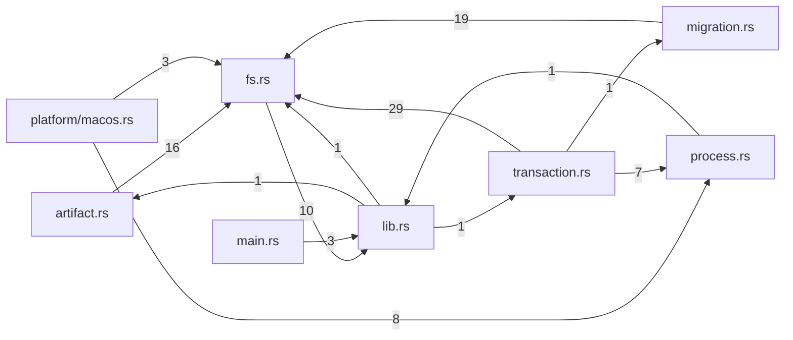

# tekes-kernel-installer — generated atlas

[All packages](../../../../docs/architecture/generated/index.md) · [Maintained explanation](../README.md)

## Cargo targets

| Target | Kind | Entry |
|---|---|---|
| `tekes_kernel_installer` | lib | [crates/product-installer/src/lib.rs](../../src/lib.rs) |
| `tekes-kernel-installer` | bin | [crates/product-installer/src/main.rs](../../src/main.rs) |
| `build-script-build` | custom-build | [crates/product-installer/build.rs](../../build.rs) |

## Direct workspace dependencies

| Dependency | Kind | Target cfg |
|---|---|---|

[Public/restricted API and direct callers](api.md)

## Source files / lexical modules

`src` files have full symbol/call tables and partitioned function graphs. Integration tests and examples remain in the JSON inventory.
File-derived paths below are lexical navigation, not a compiler-resolved module tree; inline module declarations are listed separately.

| File | Symbols | Call sites | Detail |
|---|---:|---:|---|
| [crates/product-installer/build.rs](../../build.rs) | 1 | 1 | [Symbols and calls](build.md) |
| [crates/product-installer/src/artifact.rs](../../src/artifact.rs) | 10 | 165 | [Symbols and calls](src--artifact.md) |
| [crates/product-installer/src/fs.rs](../../src/fs.rs) | 17 | 146 | [Symbols and calls](src--fs.md) |
| [crates/product-installer/src/lib.rs](../../src/lib.rs) | 23 | 60 | [Symbols and calls](src--lib.md) |
| [crates/product-installer/src/main.rs](../../src/main.rs) | 1 | 21 | [Symbols and calls](src--main.md) |
| [crates/product-installer/src/migration.rs](../../src/migration.rs) | 26 | 273 | [Symbols and calls](src--migration.md) |
| [crates/product-installer/src/platform/macos.rs](../../src/platform/macos.rs) | 18 | 140 | [Symbols and calls](src--platform--macos.md) |
| [crates/product-installer/src/platform/mod.rs](../../src/platform/mod.rs) | 11 | 14 | [Symbols and calls](src--platform--mod.md) |
| [crates/product-installer/src/process.rs](../../src/process.rs) | 3 | 55 | [Symbols and calls](src--process.md) |
| [crates/product-installer/src/transaction.rs](../../src/transaction.rs) | 24 | 292 | [Symbols and calls](src--transaction.md) |

## Cross-file direct calls

Source files stand in for out-of-line modules; see declarations for inline modules. Counts are syntactic call sites, not runtime frequency.

