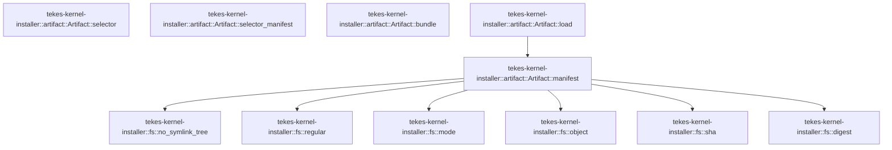

# tekes-kernel-installer::artifact

[Package atlas](index.md) · [Source](../../src/artifact.rs)

## Declarations

Visibility is the declaration spelling; trait members and reexports require their enclosing interface. `cfg` is not evaluated.

| Symbol | Kind | Visibility | Test / cfg |
|---|---|---|---|
| [tekes-kernel-installer::artifact::Artifact](../../src/artifact.rs#L4) | struct_item | `pub(crate)` |  |
| [tekes-kernel-installer::artifact::Artifact::selector](../../src/artifact.rs#L24) | function_item | `pub` |  |
| [tekes-kernel-installer::artifact::Artifact::selector_manifest](../../src/artifact.rs#L27) | function_item | `pub` |  |
| [tekes-kernel-installer::artifact::Artifact::bundle](../../src/artifact.rs#L30) | function_item | `pub` |  |
| [tekes-kernel-installer::artifact::Artifact::load](../../src/artifact.rs#L33) | function_item | `pub` |  |
| [tekes-kernel-installer::artifact::Artifact::manifest](../../src/artifact.rs#L40) | function_item | `private` |  |
| [tekes-kernel-installer::artifact::tests::write](../../src/artifact.rs#L204) | function_item | `private` | test; #[cfg(test)] |
| [tekes-kernel-installer::artifact::tests::fixture](../../src/artifact.rs#L208) | function_item | `private` | test; #[cfg(test)] |
| [tekes-kernel-installer::artifact::tests::artifact_integrity_rejects_wrong_team_and_changed_payload](../../src/artifact.rs#L251) | function_item | `private` | test; #[cfg(test)] |
| [tekes-kernel-installer::artifact::tests::artifact_rejects_noncanonical_manifest_and_symlink](../../src/artifact.rs#L265) | function_item | `private` | test; #[cfg(test)] |

## Imports / reexports

| Local name | Source path | Visibility |
|---|---|---|
| `fs` | `crate::fs` | `private` |
| `*` | `crate::*` | `private` |
| `BTreeSet` | `std::collections::BTreeSet` | `private` |
| `*` | `super::*` | `private` |
| `PermissionsExt` | `std::os::unix::fs::PermissionsExt` | `private` |

## Module declarations

| Module | Visibility | Attributes |
|---|---|---|
| `tekes-kernel-installer::artifact::tests` | `private` | #[cfg(test)] |

## Function call graphs

Edges below are syntactically resolved calls only, including private functions. Graphs partition callers into groups of 20; they are not execution order. All unresolved sites are listed below and in the JSON inventory.

Functions 1–5: 7 direct edges

## Call sites

Includes test functions (marked in declarations). Receiver-type-required sites need type analysis/manual tracing. Calls in closures are attributed to their enclosing function; their occurrence here does not mean the closure executes immediately.

| Caller | Callee expression | Source lines | Target / classification |
|---|---|---|---|
| `selector` | `self.release.join` | [25](../../src/artifact.rs#L25) | receiver-type-required |
| `selector_manifest` | `self.release.join` | [28](../../src/artifact.rs#L28) | receiver-type-required |
| `bundle` | `self.release.join` | [31](../../src/artifact.rs#L31) | receiver-type-required |
| `load` | `option_env!("TEKES_INSTALLER_TEAM_ID").ok_or` | [34](../../src/artifact.rs#L34) | receiver-type-required |
| `load` | `Failure` | [34](../../src/artifact.rs#L34) | external-constructor-callback-or-unresolved |
| `load` | `Self::manifest` | [35](../../src/artifact.rs#L35) | [tekes-kernel-installer::artifact::Artifact::manifest](../../src/artifact.rs#L40) |
| `load` | `platform::verify_artifact` | [36](../../src/artifact.rs#L36) | external-constructor-callback-or-unresolved |
| `load` | `Ok` | [37](../../src/artifact.rs#L37) | external-constructor-callback-or-unresolved |
| `manifest` | `fs::no_symlink_tree` | [41](../../src/artifact.rs#L41) | [tekes-kernel-installer::fs::no_symlink_tree](../../src/fs.rs#L44) |
| `manifest` | `std::fs::read_dir(root)?             .map(&#124;e&#124; e.map(&#124;e&#124; e.file_name().to_string_lossy().into_owned()))             .collect::<std::io::Result<BTreeSet<_>>>` | [42](../../src/artifact.rs#L42) | receiver-type-required |
| `manifest` | `std::fs::read_dir(root)?             .map` | [42](../../src/artifact.rs#L42) | receiver-type-required |
| `manifest` | `std::fs::read_dir` | [42](../../src/artifact.rs#L42) | external-constructor-callback-or-unresolved |
| `manifest` | `e.map` | [43](../../src/artifact.rs#L43) | receiver-type-required |
| `manifest` | `e.file_name().to_string_lossy().into_owned` | [43](../../src/artifact.rs#L43) | receiver-type-required |
| `manifest` | `e.file_name().to_string_lossy` | [43](../../src/artifact.rs#L43) | receiver-type-required |
| `manifest` | `e.file_name` | [43](../../src/artifact.rs#L43) | receiver-type-required |
| `manifest` | `require` | [45](../../src/artifact.rs#L45), [55](../../src/artifact.rs#L55), [71](../../src/artifact.rs#L71), [73](../../src/artifact.rs#L73), [77](../../src/artifact.rs#L77), [97](../../src/artifact.rs#L97), [111](../../src/artifact.rs#L111), [149](../../src/artifact.rs#L149), [157](../../src/artifact.rs#L157), [161](../../src/artifact.rs#L161), [171](../../src/artifact.rs#L171), [178](../../src/artifact.rs#L178) | external-constructor-callback-or-unresolved |
| `manifest` | `["installer", "product-manifest.canonical.json", "release"]                     .into_iter()                     .map(str::to_owned)                     .collect` | [47](../../src/artifact.rs#L47) | receiver-type-required |
| `manifest` | `["installer", "product-manifest.canonical.json", "release"]                     .into_iter()                     .map` | [47](../../src/artifact.rs#L47) | receiver-type-required |
| `manifest` | `["installer", "product-manifest.canonical.json", "release"]                     .into_iter` | [47](../../src/artifact.rs#L47) | receiver-type-required |
| `manifest` | `fs::object` | [53](../../src/artifact.rs#L53), [109](../../src/artifact.rs#L109), [135](../../src/artifact.rs#L135), [168](../../src/artifact.rs#L168) | [tekes-kernel-installer::fs::object](../../src/fs.rs#L73) |
| `manifest` | `root.join` | [53](../../src/artifact.rs#L53), [94](../../src/artifact.rs#L94), [98](../../src/artifact.rs#L98), [101](../../src/artifact.rs#L101) | receiver-type-required |
| `manifest` | `keys` | [56](../../src/artifact.rs#L56), [78](../../src/artifact.rs#L78), [81](../../src/artifact.rs#L81), [112](../../src/artifact.rs#L112), [157](../../src/artifact.rs#L157) | external-constructor-callback-or-unresolved |
| `manifest` | `p["format"].as_u64` | [66](../../src/artifact.rs#L66) | receiver-type-required |
| `manifest` | `Some` | [66](../../src/artifact.rs#L66), [123](../../src/artifact.rs#L123), [162](../../src/artifact.rs#L162), [179](../../src/artifact.rs#L179) | external-constructor-callback-or-unresolved |
| `manifest` | `string` | [70](../../src/artifact.rs#L70), [72](../../src/artifact.rs#L72), [95](../../src/artifact.rs#L95), [105](../../src/artifact.rs#L105), [107](../../src/artifact.rs#L107), [108](../../src/artifact.rs#L108), [131](../../src/artifact.rs#L131), [132](../../src/artifact.rs#L132), [133](../../src/artifact.rs#L133), [134](../../src/artifact.rs#L134), [158](../../src/artifact.rs#L158), [160](../../src/artifact.rs#L160), [163](../../src/artifact.rs#L163), [180](../../src/artifact.rs#L180) | external-constructor-callback-or-unresolved |
| `manifest` | `identifier` | [71](../../src/artifact.rs#L71) | external-constructor-callback-or-unresolved |
| `manifest` | `fs::digest` | [93](../../src/artifact.rs#L93), [106](../../src/artifact.rs#L106), [107](../../src/artifact.rs#L107), [108](../../src/artifact.rs#L108) | [tekes-kernel-installer::fs::digest](../../src/fs.rs#L82) |
| `manifest` | `fs::regular` | [98](../../src/artifact.rs#L98), [159](../../src/artifact.rs#L159), [177](../../src/artifact.rs#L177) | [tekes-kernel-installer::fs::regular](../../src/fs.rs#L58) |
| `manifest` | `release.join` | [102](../../src/artifact.rs#L102), [103](../../src/artifact.rs#L103), [104](../../src/artifact.rs#L104), [158](../../src/artifact.rs#L158), [177](../../src/artifact.rs#L177) | receiver-type-required |
| `manifest` | `id["format"].as_u64` | [123](../../src/artifact.rs#L123) | receiver-type-required |
| `manifest` | `bundle["files"]             .as_array()             .ok_or` | [146](../../src/artifact.rs#L146) | receiver-type-required |
| `manifest` | `bundle["files"]             .as_array` | [146](../../src/artifact.rs#L146) | receiver-type-required |
| `manifest` | `Failure` | [148](../../src/artifact.rs#L148) | external-constructor-callback-or-unresolved |
| `manifest` | `rows.len` | [151](../../src/artifact.rs#L151) | receiver-type-required |
| `manifest` | `expected.len` | [151](../../src/artifact.rs#L151) | receiver-type-required |
| `manifest` | `rows.iter().zip(expected).all` | [152](../../src/artifact.rs#L152) | receiver-type-required |
| `manifest` | `rows.iter().zip` | [152](../../src/artifact.rs#L152) | receiver-type-required |
| `manifest` | `rows.iter` | [152](../../src/artifact.rs#L152) | receiver-type-required |
| `manifest` | `release.join("bundle").join` | [158](../../src/artifact.rs#L158) | receiver-type-required |
| `manifest` | `row["bytes"].as_u64` | [162](../../src/artifact.rs#L162) | receiver-type-required |
| `manifest` | `bytes.len` | [162](../../src/artifact.rs#L162), [179](../../src/artifact.rs#L179) | receiver-type-required |
| `manifest` | `fs::sha` | [163](../../src/artifact.rs#L163), [180](../../src/artifact.rs#L180), [194](../../src/artifact.rs#L194) | [tekes-kernel-installer::fs::sha](../../src/fs.rs#L79) |
| `manifest` | `fs::mode` | [164](../../src/artifact.rs#L164) | [tekes-kernel-installer::fs::mode](../../src/fs.rs#L70) |
| `manifest` | `f["bytes"].as_u64` | [179](../../src/artifact.rs#L179) | receiver-type-required |
| `manifest` | `root.into` | [184](../../src/artifact.rs#L184) | receiver-type-required |
| `manifest` | `version.into` | [186](../../src/artifact.rs#L186) | receiver-type-required |
| `manifest` | `team.into` | [187](../../src/artifact.rs#L187) | receiver-type-required |
| `manifest` | `group.into` | [188](../../src/artifact.rs#L188) | receiver-type-required |
| `manifest` | `client_requirement.into` | [189](../../src/artifact.rs#L189) | receiver-type-required |
| `manifest` | `selector_requirement.into` | [190](../../src/artifact.rs#L190) | receiver-type-required |
| `manifest` | `supervisor_requirement.into` | [191](../../src/artifact.rs#L191) | receiver-type-required |
| `manifest` | `identity_sha.into` | [193](../../src/artifact.rs#L193) | receiver-type-required |
| `manifest` | `Ok` | [196](../../src/artifact.rs#L196) | external-constructor-callback-or-unresolved |
| `write` | `std::fs::create_dir_all(p.parent().unwrap()).unwrap` | [205](../../src/artifact.rs#L205) | receiver-type-required |
| `write` | `std::fs::create_dir_all` | [205](../../src/artifact.rs#L205) | external-constructor-callback-or-unresolved |
| `write` | `p.parent().unwrap` | [205](../../src/artifact.rs#L205) | receiver-type-required |
| `write` | `p.parent` | [205](../../src/artifact.rs#L205) | receiver-type-required |
| `write` | `std::fs::write(p, canonical(v).unwrap()).unwrap` | [206](../../src/artifact.rs#L206) | receiver-type-required |
| `write` | `std::fs::write` | [206](../../src/artifact.rs#L206) | external-constructor-callback-or-unresolved |
| `write` | `canonical(v).unwrap` | [206](../../src/artifact.rs#L206) | receiver-type-required |
| `write` | `canonical` | [206](../../src/artifact.rs#L206) | external-constructor-callback-or-unresolved |
| `fixture` | `tempfile::tempdir().unwrap` | [209](../../src/artifact.rs#L209) | receiver-type-required |
| `fixture` | `tempfile::tempdir` | [209](../../src/artifact.rs#L209) | external-constructor-callback-or-unresolved |
| `fixture` | `std::fs::canonicalize(dir.path()).unwrap` | [210](../../src/artifact.rs#L210) | receiver-type-required |
| `fixture` | `std::fs::canonicalize` | [210](../../src/artifact.rs#L210) | external-constructor-callback-or-unresolved |
| `fixture` | `dir.path` | [210](../../src/artifact.rs#L210) | receiver-type-required |
| `fixture` | `root.join` | [211](../../src/artifact.rs#L211), [212](../../src/artifact.rs#L212), [213](../../src/artifact.rs#L213), [245](../../src/artifact.rs#L245) | receiver-type-required |
| `fixture` | `std::fs::create_dir_all(root.join("installer")).unwrap` | [212](../../src/artifact.rs#L212) | receiver-type-required |
| `fixture` | `std::fs::create_dir_all` | [212](../../src/artifact.rs#L212), [228](../../src/artifact.rs#L228), [238](../../src/artifact.rs#L238) | external-constructor-callback-or-unresolved |
| `fixture` | `std::fs::write(root.join("installer/contract.canonical.json"), CONTRACT).unwrap` | [213](../../src/artifact.rs#L213) | receiver-type-required |
| `fixture` | `std::fs::write` | [213](../../src/artifact.rs#L213), [229](../../src/artifact.rs#L229), [239](../../src/artifact.rs#L239) | external-constructor-callback-or-unresolved |
| `fixture` | `write` | [215](../../src/artifact.rs#L215), [233](../../src/artifact.rs#L233), [240](../../src/artifact.rs#L240), [244](../../src/artifact.rs#L244) | [tekes-kernel-installer::artifact::tests::write](../../src/artifact.rs#L204) |
| `fixture` | `release.join` | [215](../../src/artifact.rs#L215), [227](../../src/artifact.rs#L227), [234](../../src/artifact.rs#L234), [237](../../src/artifact.rs#L237), [241](../../src/artifact.rs#L241) | receiver-type-required |
| `fixture` | `release.join("bundle").join` | [227](../../src/artifact.rs#L227) | receiver-type-required |
| `fixture` | `std::fs::create_dir_all(p.parent().unwrap()).unwrap` | [228](../../src/artifact.rs#L228) | receiver-type-required |
| `fixture` | `p.parent().unwrap` | [228](../../src/artifact.rs#L228) | receiver-type-required |
| `fixture` | `p.parent` | [228](../../src/artifact.rs#L228) | receiver-type-required |
| `fixture` | `std::fs::write(&p, b"fixture").unwrap` | [229](../../src/artifact.rs#L229) | receiver-type-required |
| `fixture` | `std::fs::set_permissions(&p, std::fs::Permissions::from_mode(0o644)).unwrap` | [230](../../src/artifact.rs#L230) | receiver-type-required |
| `fixture` | `std::fs::set_permissions` | [230](../../src/artifact.rs#L230) | external-constructor-callback-or-unresolved |
| `fixture` | `std::fs::Permissions::from_mode` | [230](../../src/artifact.rs#L230) | external-constructor-callback-or-unresolved |
| `fixture` | `rows.push` | [231](../../src/artifact.rs#L231) | receiver-type-required |
| `fixture` | `std::fs::create_dir_all(selector.parent().unwrap()).unwrap` | [238](../../src/artifact.rs#L238) | receiver-type-required |
| `fixture` | `selector.parent().unwrap` | [238](../../src/artifact.rs#L238) | receiver-type-required |
| `fixture` | `selector.parent` | [238](../../src/artifact.rs#L238) | receiver-type-required |
| `fixture` | `std::fs::write(selector, b"selector").unwrap` | [239](../../src/artifact.rs#L239) | receiver-type-required |
| `artifact_integrity_rejects_wrong_team_and_changed_payload` | `fixture` | [252](../../src/artifact.rs#L252) | [tekes-kernel-installer::artifact::tests::fixture](../../src/artifact.rs#L208) |
| `artifact_integrity_rejects_wrong_team_and_changed_payload` | `std::fs::write(root.join("release/bundle/bin/tekes-worker"), b"modified").unwrap` | [258](../../src/artifact.rs#L258) | receiver-type-required |
| `artifact_integrity_rejects_wrong_team_and_changed_payload` | `std::fs::write` | [258](../../src/artifact.rs#L258) | external-constructor-callback-or-unresolved |
| `artifact_integrity_rejects_wrong_team_and_changed_payload` | `root.join` | [258](../../src/artifact.rs#L258) | receiver-type-required |
| `artifact_rejects_noncanonical_manifest_and_symlink` | `fixture` | [266](../../src/artifact.rs#L266), [275](../../src/artifact.rs#L275) | [tekes-kernel-installer::artifact::tests::fixture](../../src/artifact.rs#L208) |
| `artifact_rejects_noncanonical_manifest_and_symlink` | `root.join` | [267](../../src/artifact.rs#L267), [276](../../src/artifact.rs#L276) | receiver-type-required |
| `artifact_rejects_noncanonical_manifest_and_symlink` | `std::fs::read(&path).unwrap` | [268](../../src/artifact.rs#L268) | receiver-type-required |
| `artifact_rejects_noncanonical_manifest_and_symlink` | `std::fs::read` | [268](../../src/artifact.rs#L268) | external-constructor-callback-or-unresolved |
| `artifact_rejects_noncanonical_manifest_and_symlink` | `bytes.push` | [269](../../src/artifact.rs#L269) | receiver-type-required |
| `artifact_rejects_noncanonical_manifest_and_symlink` | `std::fs::write(&path, bytes).unwrap` | [270](../../src/artifact.rs#L270) | receiver-type-required |
| `artifact_rejects_noncanonical_manifest_and_symlink` | `std::fs::write` | [270](../../src/artifact.rs#L270) | external-constructor-callback-or-unresolved |
| `artifact_rejects_noncanonical_manifest_and_symlink` | `std::os::unix::fs::symlink("tekes-worker", root.join("release/bundle/bin/link")).unwrap` | [276](../../src/artifact.rs#L276) | receiver-type-required |
| `artifact_rejects_noncanonical_manifest_and_symlink` | `std::os::unix::fs::symlink` | [276](../../src/artifact.rs#L276) | external-constructor-callback-or-unresolved |
