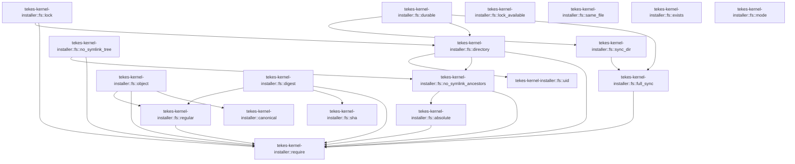

# tekes-kernel-installer::fs

[Package atlas](index.md) · [Source](../../src/fs.rs)

## Declarations

Visibility is the declaration spelling; trait members and reexports require their enclosing interface. `cfg` is not evaluated.

| Symbol | Kind | Visibility | Test / cfg |
|---|---|---|---|
| [tekes-kernel-installer::fs::absolute](../../src/fs.rs#L14) | function_item | `pub` |  |
| [tekes-kernel-installer::fs::uid](../../src/fs.rs#L25) | function_item | `pub` |  |
| [tekes-kernel-installer::fs::exists](../../src/fs.rs#L28) | function_item | `pub` |  |
| [tekes-kernel-installer::fs::no_symlink_ancestors](../../src/fs.rs#L35) | function_item | `pub` |  |
| [tekes-kernel-installer::fs::no_symlink_tree](../../src/fs.rs#L44) | function_item | `pub` |  |
| [tekes-kernel-installer::fs::regular](../../src/fs.rs#L58) | function_item | `pub` |  |
| [tekes-kernel-installer::fs::mode](../../src/fs.rs#L70) | function_item | `pub` |  |
| [tekes-kernel-installer::fs::object](../../src/fs.rs#L73) | function_item | `pub` |  |
| [tekes-kernel-installer::fs::sha](../../src/fs.rs#L79) | function_item | `pub` |  |
| [tekes-kernel-installer::fs::digest](../../src/fs.rs#L82) | function_item | `pub` |  |
| [tekes-kernel-installer::fs::directory](../../src/fs.rs#L88) | function_item | `pub` |  |
| [tekes-kernel-installer::fs::full_sync](../../src/fs.rs#L99) | function_item | `private` |  |
| [tekes-kernel-installer::fs::sync_dir](../../src/fs.rs#L111) | function_item | `pub` |  |
| [tekes-kernel-installer::fs::durable](../../src/fs.rs#L118) | function_item | `pub` |  |
| [tekes-kernel-installer::fs::lock](../../src/fs.rs#L131) | function_item | `pub` |  |
| [tekes-kernel-installer::fs::lock_available](../../src/fs.rs#L147) | function_item | `pub` |  |
| [tekes-kernel-installer::fs::same_file](../../src/fs.rs#L168) | function_item | `pub` | #[cfg(target_os = "macos")] |

## Imports / reexports

| Local name | Source path | Visibility |
|---|---|---|
| `Failure` | `crate::Failure` | `private` |
| `Result` | `crate::Result` | `private` |
| `canonical` | `crate::canonical` | `private` |
| `require` | `crate::require` | `private` |
| `Value` | `serde_json::Value` | `private` |
| `Digest` | `sha2::Digest` | `private` |
| `Sha256` | `sha2::Sha256` | `private` |
| `fs` | `std::fs` | `private` |
| `File` | `std::fs::File` | `private` |
| `OpenOptions` | `std::fs::OpenOptions` | `private` |
| `Write` | `std::io::Write` | `private` |
| `AsRawFd` | `std::os::fd::AsRawFd` | `private` |
| `DirBuilderExt` | `std::os::unix::fs::DirBuilderExt` | `private` |
| `MetadataExt` | `std::os::unix::fs::MetadataExt` | `private` |
| `OpenOptionsExt` | `std::os::unix::fs::OpenOptionsExt` | `private` |
| `PermissionsExt` | `std::os::unix::fs::PermissionsExt` | `private` |
| `Path` | `std::path::Path` | `private` |
| `PathBuf` | `std::path::PathBuf` | `private` |

## Module declarations

| Module | Visibility | Attributes |
|---|---|---|

## Function call graphs

Edges below are syntactically resolved calls only, including private functions. Graphs partition callers into groups of 20; they are not execution order. All unresolved sites are listed below and in the JSON inventory.

Functions 1–17: 22 direct edges

## Call sites

Includes test functions (marked in declarations). Receiver-type-required sites need type analysis/manual tracing. Calls in closures are attributed to their enclosing function; their occurrence here does not mean the closure executes immediately.

| Caller | Callee expression | Source lines | Target / classification |
|---|---|---|---|
| `absolute` | `require` | [15](../../src/fs.rs#L15) | [tekes-kernel-installer::require](../../src/lib.rs#L33) |
| `absolute` | `s.starts_with` | [16](../../src/fs.rs#L16) | receiver-type-required |
| `absolute` | `s.contains` | [17](../../src/fs.rs#L17), [19](../../src/fs.rs#L19) | receiver-type-required |
| `absolute` | `s.ends_with` | [18](../../src/fs.rs#L18) | receiver-type-required |
| `absolute` | `s.split('/').any` | [20](../../src/fs.rs#L20) | receiver-type-required |
| `absolute` | `s.split` | [20](../../src/fs.rs#L20) | receiver-type-required |
| `absolute` | `Ok` | [23](../../src/fs.rs#L23) | external-constructor-callback-or-unresolved |
| `absolute` | `s.into` | [23](../../src/fs.rs#L23) | receiver-type-required |
| `uid` | `libc::geteuid` | [26](../../src/fs.rs#L26) | external-constructor-callback-or-unresolved |
| `exists` | `fs::symlink_metadata` | [29](../../src/fs.rs#L29) | external-constructor-callback-or-unresolved |
| `exists` | `Ok` | [30](../../src/fs.rs#L30), [31](../../src/fs.rs#L31) | external-constructor-callback-or-unresolved |
| `exists` | `e.kind` | [31](../../src/fs.rs#L31) | receiver-type-required |
| `exists` | `Err` | [32](../../src/fs.rs#L32) | external-constructor-callback-or-unresolved |
| `exists` | `Failure` | [32](../../src/fs.rs#L32) | external-constructor-callback-or-unresolved |
| `no_symlink_ancestors` | `absolute` | [36](../../src/fs.rs#L36) | [tekes-kernel-installer::fs::absolute](../../src/fs.rs#L14) |
| `no_symlink_ancestors` | `p.to_str().ok_or` | [36](../../src/fs.rs#L36) | receiver-type-required |
| `no_symlink_ancestors` | `p.to_str` | [36](../../src/fs.rs#L36) | receiver-type-required |
| `no_symlink_ancestors` | `Failure` | [36](../../src/fs.rs#L36) | external-constructor-callback-or-unresolved |
| `no_symlink_ancestors` | `p.ancestors` | [37](../../src/fs.rs#L37) | receiver-type-required |
| `no_symlink_ancestors` | `fs::symlink_metadata` | [38](../../src/fs.rs#L38) | external-constructor-callback-or-unresolved |
| `no_symlink_ancestors` | `require` | [39](../../src/fs.rs#L39) | [tekes-kernel-installer::require](../../src/lib.rs#L33) |
| `no_symlink_ancestors` | `m.file_type().is_symlink` | [39](../../src/fs.rs#L39) | receiver-type-required |
| `no_symlink_ancestors` | `m.file_type` | [39](../../src/fs.rs#L39) | receiver-type-required |
| `no_symlink_ancestors` | `Ok` | [42](../../src/fs.rs#L42) | external-constructor-callback-or-unresolved |
| `no_symlink_tree` | `no_symlink_ancestors` | [45](../../src/fs.rs#L45) | [tekes-kernel-installer::fs::no_symlink_ancestors](../../src/fs.rs#L35) |
| `no_symlink_tree` | `pending.pop` | [47](../../src/fs.rs#L47) | receiver-type-required |
| `no_symlink_tree` | `fs::symlink_metadata` | [48](../../src/fs.rs#L48) | external-constructor-callback-or-unresolved |
| `no_symlink_tree` | `require` | [49](../../src/fs.rs#L49) | [tekes-kernel-installer::require](../../src/lib.rs#L33) |
| `no_symlink_tree` | `m.file_type().is_symlink` | [49](../../src/fs.rs#L49) | receiver-type-required |
| `no_symlink_tree` | `m.file_type` | [49](../../src/fs.rs#L49) | receiver-type-required |
| `no_symlink_tree` | `m.is_dir` | [50](../../src/fs.rs#L50) | receiver-type-required |
| `no_symlink_tree` | `fs::read_dir` | [51](../../src/fs.rs#L51) | external-constructor-callback-or-unresolved |
| `no_symlink_tree` | `pending.push` | [52](../../src/fs.rs#L52) | receiver-type-required |
| `no_symlink_tree` | `e?.path` | [52](../../src/fs.rs#L52) | receiver-type-required |
| `no_symlink_tree` | `Ok` | [56](../../src/fs.rs#L56) | external-constructor-callback-or-unresolved |
| `regular` | `OpenOptions::new()         .read(true)         .custom_flags(libc::O_NOFOLLOW &#124; libc::O_CLOEXEC)         .open(p)         .map_err` | [59](../../src/fs.rs#L59) | receiver-type-required |
| `regular` | `OpenOptions::new()         .read(true)         .custom_flags(libc::O_NOFOLLOW &#124; libc::O_CLOEXEC)         .open` | [59](../../src/fs.rs#L59) | receiver-type-required |
| `regular` | `OpenOptions::new()         .read(true)         .custom_flags` | [59](../../src/fs.rs#L59) | receiver-type-required |
| `regular` | `OpenOptions::new()         .read` | [59](../../src/fs.rs#L59) | receiver-type-required |
| `regular` | `OpenOptions::new` | [59](../../src/fs.rs#L59) | external-constructor-callback-or-unresolved |
| `regular` | `Failure` | [63](../../src/fs.rs#L63) | external-constructor-callback-or-unresolved |
| `regular` | `require` | [64](../../src/fs.rs#L64) | [tekes-kernel-installer::require](../../src/lib.rs#L33) |
| `regular` | `f.metadata()?.is_file` | [64](../../src/fs.rs#L64) | receiver-type-required |
| `regular` | `f.metadata` | [64](../../src/fs.rs#L64) | receiver-type-required |
| `regular` | `Vec::new` | [66](../../src/fs.rs#L66) | external-constructor-callback-or-unresolved |
| `regular` | `(&f).read_to_end` | [67](../../src/fs.rs#L67) | receiver-type-required |
| `regular` | `Ok` | [68](../../src/fs.rs#L68) | external-constructor-callback-or-unresolved |
| `mode` | `Ok` | [71](../../src/fs.rs#L71) | external-constructor-callback-or-unresolved |
| `mode` | `fs::symlink_metadata(p)?.mode` | [71](../../src/fs.rs#L71) | receiver-type-required |
| `mode` | `fs::symlink_metadata` | [71](../../src/fs.rs#L71) | external-constructor-callback-or-unresolved |
| `object` | `regular` | [74](../../src/fs.rs#L74) | [tekes-kernel-installer::fs::regular](../../src/fs.rs#L58) |
| `object` | `serde_json::from_slice(&b).map_err` | [75](../../src/fs.rs#L75) | receiver-type-required |
| `object` | `serde_json::from_slice` | [75](../../src/fs.rs#L75) | external-constructor-callback-or-unresolved |
| `object` | `Failure` | [75](../../src/fs.rs#L75) | external-constructor-callback-or-unresolved |
| `object` | `require` | [76](../../src/fs.rs#L76) | [tekes-kernel-installer::require](../../src/lib.rs#L33) |
| `object` | `v.is_object` | [76](../../src/fs.rs#L76) | receiver-type-required |
| `object` | `canonical` | [76](../../src/fs.rs#L76) | [tekes-kernel-installer::canonical](../../src/lib.rs#L43) |
| `object` | `Ok` | [77](../../src/fs.rs#L77) | external-constructor-callback-or-unresolved |
| `digest` | `require` | [83](../../src/fs.rs#L83) | [tekes-kernel-installer::require](../../src/lib.rs#L33) |
| `digest` | `expected.len` | [84](../../src/fs.rs#L84) | receiver-type-required |
| `digest` | `sha` | [84](../../src/fs.rs#L84) | [tekes-kernel-installer::fs::sha](../../src/fs.rs#L79) |
| `digest` | `regular` | [84](../../src/fs.rs#L84) | [tekes-kernel-installer::fs::regular](../../src/fs.rs#L58) |
| `directory` | `no_symlink_ancestors` | [89](../../src/fs.rs#L89) | [tekes-kernel-installer::fs::no_symlink_ancestors](../../src/fs.rs#L35) |
| `directory` | `fs::DirBuilder::new()         .recursive(true)         .mode(0o700)         .create` | [90](../../src/fs.rs#L90) | receiver-type-required |
| `directory` | `fs::DirBuilder::new()         .recursive(true)         .mode` | [90](../../src/fs.rs#L90) | receiver-type-required |
| `directory` | `fs::DirBuilder::new()         .recursive` | [90](../../src/fs.rs#L90) | receiver-type-required |
| `directory` | `fs::DirBuilder::new` | [90](../../src/fs.rs#L90) | external-constructor-callback-or-unresolved |
| `directory` | `fs::symlink_metadata` | [94](../../src/fs.rs#L94) | external-constructor-callback-or-unresolved |
| `directory` | `require` | [95](../../src/fs.rs#L95) | [tekes-kernel-installer::require](../../src/lib.rs#L33) |
| `directory` | `m.is_dir` | [95](../../src/fs.rs#L95) | receiver-type-required |
| `directory` | `m.uid` | [95](../../src/fs.rs#L95) | receiver-type-required |
| `directory` | `uid` | [95](../../src/fs.rs#L95) | [tekes-kernel-installer::fs::uid](../../src/fs.rs#L25) |
| `directory` | `fs::set_permissions` | [96](../../src/fs.rs#L96) | external-constructor-callback-or-unresolved |
| `directory` | `fs::Permissions::from_mode` | [96](../../src/fs.rs#L96) | external-constructor-callback-or-unresolved |
| `directory` | `Ok` | [97](../../src/fs.rs#L97) | external-constructor-callback-or-unresolved |
| `full_sync` | `require` | [102](../../src/fs.rs#L102) | [tekes-kernel-installer::require](../../src/lib.rs#L33) |
| `full_sync` | `libc::fcntl` | [103](../../src/fs.rs#L103) | external-constructor-callback-or-unresolved |
| `full_sync` | `f.as_raw_fd` | [103](../../src/fs.rs#L103) | receiver-type-required |
| `full_sync` | `f.sync_all` | [108](../../src/fs.rs#L108) | receiver-type-required |
| `full_sync` | `Ok` | [109](../../src/fs.rs#L109) | external-constructor-callback-or-unresolved |
| `sync_dir` | `OpenOptions::new()         .read(true)         .custom_flags(libc::O_DIRECTORY &#124; libc::O_NOFOLLOW &#124; libc::O_CLOEXEC)         .open` | [112](../../src/fs.rs#L112) | receiver-type-required |
| `sync_dir` | `OpenOptions::new()         .read(true)         .custom_flags` | [112](../../src/fs.rs#L112) | receiver-type-required |
| `sync_dir` | `OpenOptions::new()         .read` | [112](../../src/fs.rs#L112) | receiver-type-required |
| `sync_dir` | `OpenOptions::new` | [112](../../src/fs.rs#L112) | external-constructor-callback-or-unresolved |
| `sync_dir` | `full_sync` | [116](../../src/fs.rs#L116) | [tekes-kernel-installer::fs::full_sync](../../src/fs.rs#L99) |
| `durable` | `p.parent().ok_or` | [119](../../src/fs.rs#L119) | receiver-type-required |
| `durable` | `p.parent` | [119](../../src/fs.rs#L119) | receiver-type-required |
| `durable` | `Failure` | [119](../../src/fs.rs#L119), [128](../../src/fs.rs#L128) | external-constructor-callback-or-unresolved |
| `durable` | `directory` | [120](../../src/fs.rs#L120) | [tekes-kernel-installer::fs::directory](../../src/fs.rs#L88) |
| `durable` | `tempfile::Builder::new()         .prefix(".installer-tmp-")         .tempfile_in` | [121](../../src/fs.rs#L121) | receiver-type-required |
| `durable` | `tempfile::Builder::new()         .prefix` | [121](../../src/fs.rs#L121) | receiver-type-required |
| `durable` | `tempfile::Builder::new` | [121](../../src/fs.rs#L121) | external-constructor-callback-or-unresolved |
| `durable` | `tmp.as_file()         .set_permissions` | [124](../../src/fs.rs#L124) | receiver-type-required |
| `durable` | `tmp.as_file` | [124](../../src/fs.rs#L124), [127](../../src/fs.rs#L127) | receiver-type-required |
| `durable` | `fs::Permissions::from_mode` | [125](../../src/fs.rs#L125) | external-constructor-callback-or-unresolved |
| `durable` | `tmp.write_all` | [126](../../src/fs.rs#L126) | receiver-type-required |
| `durable` | `full_sync` | [127](../../src/fs.rs#L127) | [tekes-kernel-installer::fs::full_sync](../../src/fs.rs#L99) |
| `durable` | `tmp.persist(p).map_err` | [128](../../src/fs.rs#L128) | receiver-type-required |
| `durable` | `tmp.persist` | [128](../../src/fs.rs#L128) | receiver-type-required |
| `durable` | `sync_dir` | [129](../../src/fs.rs#L129) | [tekes-kernel-installer::fs::sync_dir](../../src/fs.rs#L111) |
| `lock` | `directory` | [132](../../src/fs.rs#L132) | [tekes-kernel-installer::fs::directory](../../src/fs.rs#L88) |
| `lock` | `p.parent().ok_or` | [132](../../src/fs.rs#L132) | receiver-type-required |
| `lock` | `p.parent` | [132](../../src/fs.rs#L132) | receiver-type-required |
| `lock` | `Failure` | [132](../../src/fs.rs#L132) | external-constructor-callback-or-unresolved |
| `lock` | `OpenOptions::new()         .read(true)         .write(true)         .create(true)         .truncate(false)         .mode(0o600)         .custom_flags(libc::O_CLOEXEC &#124; libc::O_NOFOLLOW)         .open` | [133](../../src/fs.rs#L133) | receiver-type-required |
| `lock` | `OpenOptions::new()         .read(true)         .write(true)         .create(true)         .truncate(false)         .mode(0o600)         .custom_flags` | [133](../../src/fs.rs#L133) | receiver-type-required |
| `lock` | `OpenOptions::new()         .read(true)         .write(true)         .create(true)         .truncate(false)         .mode` | [133](../../src/fs.rs#L133) | receiver-type-required |
| `lock` | `OpenOptions::new()         .read(true)         .write(true)         .create(true)         .truncate` | [133](../../src/fs.rs#L133) | receiver-type-required |
| `lock` | `OpenOptions::new()         .read(true)         .write(true)         .create` | [133](../../src/fs.rs#L133) | receiver-type-required |
| `lock` | `OpenOptions::new()         .read(true)         .write` | [133](../../src/fs.rs#L133) | receiver-type-required |
| `lock` | `OpenOptions::new()         .read` | [133](../../src/fs.rs#L133) | receiver-type-required |
| `lock` | `OpenOptions::new` | [133](../../src/fs.rs#L133) | external-constructor-callback-or-unresolved |
| `lock` | `require` | [141](../../src/fs.rs#L141) | [tekes-kernel-installer::require](../../src/lib.rs#L33) |
| `lock` | `libc::flock` | [142](../../src/fs.rs#L142) | external-constructor-callback-or-unresolved |
| `lock` | `f.as_raw_fd` | [142](../../src/fs.rs#L142) | receiver-type-required |
| `lock` | `Ok` | [145](../../src/fs.rs#L145) | external-constructor-callback-or-unresolved |
| `lock_available` | `OpenOptions::new()         .read(true)         .write(true)         .custom_flags(libc::O_CLOEXEC &#124; libc::O_NOFOLLOW)         .open` | [148](../../src/fs.rs#L148) | receiver-type-required |
| `lock_available` | `OpenOptions::new()         .read(true)         .write(true)         .custom_flags` | [148](../../src/fs.rs#L148) | receiver-type-required |
| `lock_available` | `OpenOptions::new()         .read(true)         .write` | [148](../../src/fs.rs#L148) | receiver-type-required |
| `lock_available` | `OpenOptions::new()         .read` | [148](../../src/fs.rs#L148) | receiver-type-required |
| `lock_available` | `OpenOptions::new` | [148](../../src/fs.rs#L148) | external-constructor-callback-or-unresolved |
| `lock_available` | `e.kind` | [155](../../src/fs.rs#L155) | receiver-type-required |
| `lock_available` | `Ok` | [155](../../src/fs.rs#L155), [159](../../src/fs.rs#L159), [162](../../src/fs.rs#L162) | external-constructor-callback-or-unresolved |
| `lock_available` | `Err` | [156](../../src/fs.rs#L156), [164](../../src/fs.rs#L164) | external-constructor-callback-or-unresolved |
| `lock_available` | `Failure` | [156](../../src/fs.rs#L156), [164](../../src/fs.rs#L164) | external-constructor-callback-or-unresolved |
| `lock_available` | `libc::flock` | [158](../../src/fs.rs#L158) | external-constructor-callback-or-unresolved |
| `lock_available` | `f.as_raw_fd` | [158](../../src/fs.rs#L158) | receiver-type-required |
| `lock_available` | `std::io::Error::last_os_error().raw_os_error` | [161](../../src/fs.rs#L161) | receiver-type-required |
| `lock_available` | `std::io::Error::last_os_error` | [161](../../src/fs.rs#L161) | external-constructor-callback-or-unresolved |
| `lock_available` | `Some` | [161](../../src/fs.rs#L161) | external-constructor-callback-or-unresolved |
| `same_file` | `fs::metadata` | [169](../../src/fs.rs#L169) | external-constructor-callback-or-unresolved |
| `same_file` | `a.is_file` | [170](../../src/fs.rs#L170) | receiver-type-required |
| `same_file` | `b.is_file` | [170](../../src/fs.rs#L170) | receiver-type-required |
| `same_file` | `a.dev` | [170](../../src/fs.rs#L170) | receiver-type-required |
| `same_file` | `b.dev` | [170](../../src/fs.rs#L170) | receiver-type-required |
| `same_file` | `a.ino` | [170](../../src/fs.rs#L170) | receiver-type-required |
| `same_file` | `b.ino` | [170](../../src/fs.rs#L170) | receiver-type-required |
