# tekes-kernel-installer

[Package atlas](index.md) · [Source](../../src/lib.rs)

## Declarations

Visibility is the declaration spelling; trait members and reexports require their enclosing interface. `cfg` is not evaluated.

| Symbol | Kind | Visibility | Test / cfg |
|---|---|---|---|
| [tekes-kernel-installer::PROTOCOL](../../src/lib.rs#L13) | const_item | `pub` |  |
| [tekes-kernel-installer::LEGACY_PROTOCOL](../../src/lib.rs#L15) | const_item | `pub` |  |
| [tekes-kernel-installer::ORIGIN](../../src/lib.rs#L16) | const_item | `pub` |  |
| [tekes-kernel-installer::IDENTIFIER](../../src/lib.rs#L17) | const_item | `pub` |  |
| [tekes-kernel-installer::CONTRACT](../../src/lib.rs#L18) | const_item | `pub` |  |
| [tekes-kernel-installer::Result](../../src/lib.rs#L20) | type_item | `pub` |  |
| [tekes-kernel-installer::Failure](../../src/lib.rs#L22) | struct_item | `pub` |  |
| [tekes-kernel-installer::Failure::from](../../src/lib.rs#L24) | function_item | `private` |  |
| [tekes-kernel-installer::Failure::from](../../src/lib.rs#L29) | function_item | `private` |  |
| [tekes-kernel-installer::require](../../src/lib.rs#L33) | function_item | `private` |  |
| [tekes-kernel-installer::keys](../../src/lib.rs#L36) | function_item | `private` |  |
| [tekes-kernel-installer::string](../../src/lib.rs#L40) | function_item | `private` |  |
| [tekes-kernel-installer::canonical](../../src/lib.rs#L43) | function_item | `private` |  |
| [tekes-kernel-installer::identifier](../../src/lib.rs#L48) | function_item | `private` |  |
| [tekes-kernel-installer::Operation](../../src/lib.rs#L56) | enum_item | `pub` |  |
| [tekes-kernel-installer::Operation::name](../../src/lib.rs#L64) | function_item | `pub` |  |
| [tekes-kernel-installer::Arguments](../../src/lib.rs#L75) | struct_item | `pub` |  |
| [tekes-kernel-installer::Arguments::parse](../../src/lib.rs#L80) | function_item | `pub` |  |
| [tekes-kernel-installer::Layout](../../src/lib.rs#L111) | struct_item | `private` |  |
| [tekes-kernel-installer::Layout::macos](../../src/lib.rs#L124) | function_item | `private` | test; #[cfg(any(target_os = "macos", test))] |
| [tekes-kernel-installer::execute](../../src/lib.rs#L140) | function_item | `pub` |  |
| [tekes-kernel-installer::error_reply](../../src/lib.rs#L147) | function_item | `pub` |  |
| [tekes-kernel-installer::tests::command_contract_and_argument_errors](../../src/lib.rs#L155) | function_item | `private` | test; #[cfg(test)] |

## Imports / reexports

| Local name | Source path | Visibility |
|---|---|---|
| `Value` | `serde_json::Value` | `private` |
| `json` | `serde_json::json` | `private` |
| `Path` | `std::path::Path` | `private` |
| `PathBuf` | `std::path::PathBuf` | `private` |
| `*` | `super::*` | `private` |

## Module declarations

| Module | Visibility | Attributes |
|---|---|---|
| `tekes-kernel-installer::artifact` | `private` |  |
| `tekes-kernel-installer::fs` | `private` |  |
| `tekes-kernel-installer::migration` | `private` |  |
| `tekes-kernel-installer::platform` | `private` |  |
| `tekes-kernel-installer::process` | `private` |  |
| `tekes-kernel-installer::transaction` | `private` |  |
| `tekes-kernel-installer::tests` | `private` | #[cfg(test)] |

## Function call graphs

Edges below are syntactically resolved calls only, including private functions. Graphs partition callers into groups of 20; they are not execution order. All unresolved sites are listed below and in the JSON inventory.

```mermaid
flowchart TD
  n0["tekes-kernel-installer::artifact::Artifact::load"]
  n1["tekes-kernel-installer::fs::absolute"]
  n2["tekes-kernel-installer::execute"]
  n3["tekes-kernel-installer::error_reply"]
  n4["tekes-kernel-installer::Failure::from"]
  n5["tekes-kernel-installer::Failure::from"]
  n6["tekes-kernel-installer::require"]
  n7["tekes-kernel-installer::keys"]
  n8["tekes-kernel-installer::string"]
  n9["tekes-kernel-installer::canonical"]
  n10["tekes-kernel-installer::identifier"]
  n11["tekes-kernel-installer::Operation::name"]
  n12["tekes-kernel-installer::Arguments::parse"]
  n13["tekes-kernel-installer::transaction::execute"]
  n2 --> n0
  n2 --> n13
  n3 --> n9
  n12 --> n1
  n12 --> n6
```

Functions 1–11: 5 direct edges

## Call sites

Includes test functions (marked in declarations). Receiver-type-required sites need type analysis/manual tracing. Calls in closures are attributed to their enclosing function; their occurrence here does not mean the closure executes immediately.

| Caller | Callee expression | Source lines | Target / classification |
|---|---|---|---|
| `from` | `Self` | [25](../../src/lib.rs#L25) | external-constructor-callback-or-unresolved |
| `from` | `Self` | [30](../../src/lib.rs#L30) | external-constructor-callback-or-unresolved |
| `require` | `Ok` | [34](../../src/lib.rs#L34) | external-constructor-callback-or-unresolved |
| `require` | `Err` | [34](../../src/lib.rs#L34) | external-constructor-callback-or-unresolved |
| `require` | `Failure` | [34](../../src/lib.rs#L34) | external-constructor-callback-or-unresolved |
| `keys` | `v.as_object()         .is_some_and` | [37](../../src/lib.rs#L37) | receiver-type-required |
| `keys` | `v.as_object` | [37](../../src/lib.rs#L37) | receiver-type-required |
| `keys` | `o.len` | [38](../../src/lib.rs#L38) | receiver-type-required |
| `keys` | `names.len` | [38](../../src/lib.rs#L38) | receiver-type-required |
| `keys` | `names.iter().all` | [38](../../src/lib.rs#L38) | receiver-type-required |
| `keys` | `names.iter` | [38](../../src/lib.rs#L38) | receiver-type-required |
| `keys` | `o.contains_key` | [38](../../src/lib.rs#L38) | receiver-type-required |
| `string` | `v[key].as_str().ok_or` | [41](../../src/lib.rs#L41) | receiver-type-required |
| `string` | `v[key].as_str` | [41](../../src/lib.rs#L41) | receiver-type-required |
| `string` | `Failure` | [41](../../src/lib.rs#L41) | external-constructor-callback-or-unresolved |
| `canonical` | `serde_json::to_vec` | [44](../../src/lib.rs#L44) | external-constructor-callback-or-unresolved |
| `canonical` | `b.push` | [45](../../src/lib.rs#L45) | receiver-type-required |
| `canonical` | `Ok` | [46](../../src/lib.rs#L46) | external-constructor-callback-or-unresolved |
| `identifier` | `s.is_empty` | [49](../../src/lib.rs#L49) | receiver-type-required |
| `identifier` | `s.len` | [50](../../src/lib.rs#L50) | receiver-type-required |
| `identifier` | `s.bytes()             .all` | [51](../../src/lib.rs#L51) | receiver-type-required |
| `identifier` | `s.bytes` | [51](../../src/lib.rs#L51) | receiver-type-required |
| `identifier` | `b.is_ascii_alphanumeric` | [52](../../src/lib.rs#L52) | receiver-type-required |
| `identifier` | `b"-._".contains` | [52](../../src/lib.rs#L52) | receiver-type-required |
| `parse` | `Ok` | [82](../../src/lib.rs#L82), [104](../../src/lib.rs#L104) | external-constructor-callback-or-unresolved |
| `parse` | `require` | [85](../../src/lib.rs#L85), [103](../../src/lib.rs#L103) | [tekes-kernel-installer::require](../../src/lib.rs#L33) |
| `parse` | `args.len` | [86](../../src/lib.rs#L86), [103](../../src/lib.rs#L103) | receiver-type-required |
| `parse` | `args[3].as_str` | [95](../../src/lib.rs#L95) | receiver-type-required |
| `parse` | `Err` | [101](../../src/lib.rs#L101) | external-constructor-callback-or-unresolved |
| `parse` | `Failure` | [101](../../src/lib.rs#L101) | external-constructor-callback-or-unresolved |
| `parse` | `Some` | [104](../../src/lib.rs#L104) | external-constructor-callback-or-unresolved |
| `parse` | `fs::absolute` | [106](../../src/lib.rs#L106) | [tekes-kernel-installer::fs::absolute](../../src/fs.rs#L14) |
| `macos` | `home.join` | [125](../../src/lib.rs#L125), [126](../../src/lib.rs#L126), [133](../../src/lib.rs#L133) | receiver-type-required |
| `macos` | `home.into` | [128](../../src/lib.rs#L128) | receiver-type-required |
| `macos` | `base.join` | [129](../../src/lib.rs#L129), [130](../../src/lib.rs#L130) | receiver-type-required |
| `macos` | `data.join` | [131](../../src/lib.rs#L131), [132](../../src/lib.rs#L132) | receiver-type-required |
| `execute` | `platform::supported` | [141](../../src/lib.rs#L141) | ambiguous-cfg-or-overload |
| `execute` | `artifact::Artifact::load` | [142](../../src/lib.rs#L142) | [tekes-kernel-installer::artifact::Artifact::load](../../src/artifact.rs#L33) |
| `execute` | `platform::verify_caller` | [143](../../src/lib.rs#L143) | ambiguous-cfg-or-overload |
| `execute` | `platform::layout` | [144](../../src/lib.rs#L144) | ambiguous-cfg-or-overload |
| `execute` | `transaction::execute` | [145](../../src/lib.rs#L145) | [tekes-kernel-installer::transaction::execute](../../src/transaction.rs#L428) |
| `error_reply` | `canonical(&json!({"error":{"code":error.0}})).expect` | [148](../../src/lib.rs#L148) | receiver-type-required |
| `error_reply` | `canonical` | [148](../../src/lib.rs#L148) | [tekes-kernel-installer::canonical](../../src/lib.rs#L43) |
| `command_contract_and_argument_errors` | `serde_json::from_slice(CONTRACT).unwrap` | [156](../../src/lib.rs#L156) | receiver-type-required |
| `command_contract_and_argument_errors` | `serde_json::from_slice` | [156](../../src/lib.rs#L156) | external-constructor-callback-or-unresolved |
| `command_contract_and_argument_errors` | `operations.push` | [165](../../src/lib.rs#L165) | receiver-type-required |
| `command_contract_and_argument_errors` | `op.name` | [165](../../src/lib.rs#L165) | receiver-type-required |
| `command_contract_and_argument_errors` | `vec![                 "--protocol",                 PROTOCOL,                 "--operation",                 op.name(),                 "--artifact-root",                 "/valid/product",                 "--origin",                 ORIGIN,             ]             .into_iter()             .map(str::to_owned)             .collect::<Vec<_>>` | [166](../../src/lib.rs#L166) | receiver-type-required |
| `command_contract_and_argument_errors` | `vec![                 "--protocol",                 PROTOCOL,                 "--operation",                 op.name(),                 "--artifact-root",                 "/valid/product",                 "--origin",                 ORIGIN,             ]             .into_iter()             .map` | [166](../../src/lib.rs#L166) | receiver-type-required |
| `command_contract_and_argument_errors` | `vec![                 "--protocol",                 PROTOCOL,                 "--operation",                 op.name(),                 "--artifact-root",                 "/valid/product",                 "--origin",                 ORIGIN,             ]             .into_iter` | [166](../../src/lib.rs#L166) | receiver-type-required |
| `command_contract_and_argument_errors` | `args.push` | [180](../../src/lib.rs#L180) | receiver-type-required |
| `command_contract_and_argument_errors` | `"extra".into` | [180](../../src/lib.rs#L180) | receiver-type-required |
| `command_contract_and_argument_errors` | `operations.sort` | [186](../../src/lib.rs#L186) | receiver-type-required |
