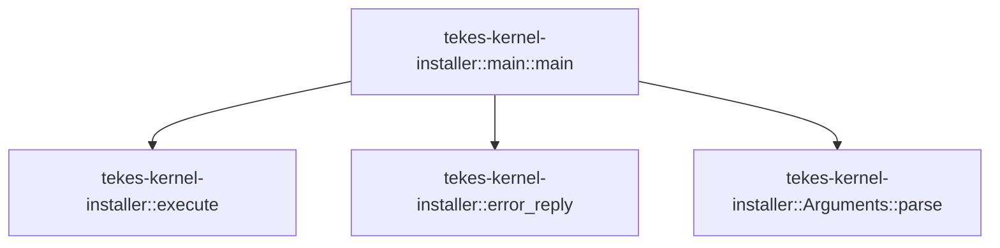

# tekes-kernel-installer::main

[Package atlas](index.md) · [Source](../../src/main.rs)

## Declarations

Visibility is the declaration spelling; trait members and reexports require their enclosing interface. `cfg` is not evaluated.

| Symbol | Kind | Visibility | Test / cfg |
|---|---|---|---|
| [tekes-kernel-installer::main::main](../../src/main.rs#L3) | function_item | `private` |  |

## Imports / reexports

| Local name | Source path | Visibility |
|---|---|---|
| `Write` | `std::io::Write` | `private` |
| `Arguments` | `tekes_kernel_installer::Arguments` | `private` |
| `CONTRACT` | `tekes_kernel_installer::CONTRACT` | `private` |
| `Failure` | `tekes_kernel_installer::Failure` | `private` |

## Module declarations

| Module | Visibility | Attributes |
|---|---|---|

## Function call graphs

Edges below are syntactically resolved calls only, including private functions. Graphs partition callers into groups of 20; they are not execution order. All unresolved sites are listed below and in the JSON inventory.

Functions 1–1: 3 direct edges

## Call sites

Includes test functions (marked in declarations). Receiver-type-required sites need type analysis/manual tracing. Calls in closures are attributed to their enclosing function; their occurrence here does not mean the closure executes immediately.

| Caller | Callee expression | Source lines | Target / classification |
|---|---|---|---|
| `main` | `(&#124;&#124; {         let args = std::env::args_os()             .skip(1)             .map(&#124;s&#124; s.into_string().map_err(&#124;_&#124; Failure("invalid-arguments")))             .collect::<Result<Vec<_>, _>>()?;         match Arguments::parse(&args)? {             None => std::io::stdout().write_all(CONTRACT)?,             Some(args) => {                 let reply = tekes_kernel_installer::execute(args)?;                 serde_json::to_writer(std::io::stdout(), &reply)?;                 std::io::stdout().write_all(b"\n")?;             }         }         Ok::<_, Failure>(())     })` | [4](../../src/main.rs#L4) | external-constructor-callback-or-unresolved |
| `main` | `std::env::args_os()             .skip(1)             .map(&#124;s&#124; s.into_string().map_err(&#124;_&#124; Failure("invalid-arguments")))             .collect::<Result<Vec<_>, _>>` | [5](../../src/main.rs#L5) | receiver-type-required |
| `main` | `std::env::args_os()             .skip(1)             .map` | [5](../../src/main.rs#L5) | receiver-type-required |
| `main` | `std::env::args_os()             .skip` | [5](../../src/main.rs#L5) | receiver-type-required |
| `main` | `std::env::args_os` | [5](../../src/main.rs#L5) | external-constructor-callback-or-unresolved |
| `main` | `s.into_string().map_err` | [7](../../src/main.rs#L7) | receiver-type-required |
| `main` | `s.into_string` | [7](../../src/main.rs#L7) | receiver-type-required |
| `main` | `Failure` | [7](../../src/main.rs#L7) | external-constructor-callback-or-unresolved |
| `main` | `Arguments::parse` | [9](../../src/main.rs#L9) | [tekes-kernel-installer::Arguments::parse](../../src/lib.rs#L80) |
| `main` | `std::io::stdout().write_all` | [10](../../src/main.rs#L10), [14](../../src/main.rs#L14) | receiver-type-required |
| `main` | `std::io::stdout` | [10](../../src/main.rs#L10), [13](../../src/main.rs#L13), [14](../../src/main.rs#L14) | external-constructor-callback-or-unresolved |
| `main` | `tekes_kernel_installer::execute` | [12](../../src/main.rs#L12) | [tekes-kernel-installer::execute](../../src/lib.rs#L140) |
| `main` | `serde_json::to_writer` | [13](../../src/main.rs#L13) | external-constructor-callback-or-unresolved |
| `main` | `Ok::<_, Failure>` | [17](../../src/main.rs#L17) | external-constructor-callback-or-unresolved |
| `main` | `std::io::stderr().write_all` | [20](../../src/main.rs#L20) | receiver-type-required |
| `main` | `std::io::stderr` | [20](../../src/main.rs#L20) | external-constructor-callback-or-unresolved |
| `main` | `tekes_kernel_installer::error_reply` | [20](../../src/main.rs#L20) | [tekes-kernel-installer::error_reply](../../src/lib.rs#L147) |
| `main` | `std::process::exit` | [21](../../src/main.rs#L21) | external-constructor-callback-or-unresolved |
