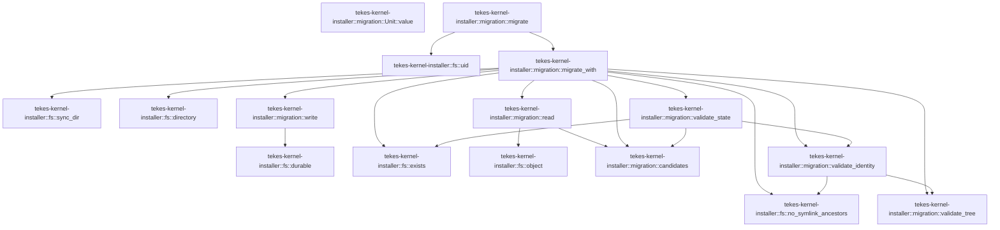

# tekes-kernel-installer::migration

[Package atlas](index.md) · [Source](../../src/migration.rs)

## Declarations

Visibility is the declaration spelling; trait members and reexports require their enclosing interface. `cfg` is not evaluated.

| Symbol | Kind | Visibility | Test / cfg |
|---|---|---|---|
| [tekes-kernel-installer::migration::Unit](../../src/migration.rs#L5) | struct_item | `private` |  |
| [tekes-kernel-installer::migration::Unit::value](../../src/migration.rs#L14) | function_item | `private` |  |
| [tekes-kernel-installer::migration::candidates](../../src/migration.rs#L18) | function_item | `private` |  |
| [tekes-kernel-installer::migration::validate_tree](../../src/migration.rs#L50) | function_item | `private` |  |
| [tekes-kernel-installer::migration::validate_identity](../../src/migration.rs#L66) | function_item | `private` |  |
| [tekes-kernel-installer::migration::validate_state](../../src/migration.rs#L79) | function_item | `private` |  |
| [tekes-kernel-installer::migration::write](../../src/migration.rs#L118) | function_item | `private` |  |
| [tekes-kernel-installer::migration::read](../../src/migration.rs#L127) | function_item | `private` |  |
| [tekes-kernel-installer::migration::migrate](../../src/migration.rs#L163) | function_item | `pub` |  |
| [tekes-kernel-installer::migration::migrate_with](../../src/migration.rs#L166) | function_item | `private` |  |
| [tekes-kernel-installer::migration::tests::setup](../../src/migration.rs#L252) | function_item | `private` | test; #[cfg(test)] |
| [tekes-kernel-installer::migration::tests::interruption_after_rename_resumes_without_copying](../../src/migration.rs#L261) | function_item | `private` | test; #[cfg(test)] |
| [tekes-kernel-installer::migration::tests::conflicting_destination_never_overwrites](../../src/migration.rs#L283) | function_item | `private` | test; #[cfg(test)] |
| [tekes-kernel-installer::migration::tests::cross_device_failure_preserves_source](../../src/migration.rs#L290) | function_item | `private` | test; #[cfg(test)] |
| [tekes-kernel-installer::migration::tests::symlink_source_is_rejected](../../src/migration.rs#L304) | function_item | `private` | test; #[cfg(test)] |
| [tekes-kernel-installer::migration::tests::completed_journal_does_not_hide_new_legacy_data](../../src/migration.rs#L310) | function_item | `private` | test; #[cfg(test)] |
| [tekes-kernel-installer::migration::tests::journal](../../src/migration.rs#L316) | function_item | `private` | test; #[cfg(test)] |
| [tekes-kernel-installer::migration::tests::interrupt](../../src/migration.rs#L320) | function_item | `private` | test; #[cfg(test)] |
| [tekes-kernel-installer::migration::tests::edit](../../src/migration.rs#L335) | function_item | `private` | test; #[cfg(test)] |
| [tekes-kernel-installer::migration::tests::every_crash_checkpoint_recovers](../../src/migration.rs#L341) | function_item | `private` | test; #[cfg(test)] |
| [tekes-kernel-installer::migration::tests::completed_migration_survives_mount_renumbering](../../src/migration.rs#L357) | function_item | `private` | test; #[cfg(test)] |
| [tekes-kernel-installer::migration::tests::forged_or_omitted_units_fail_closed](../../src/migration.rs#L366) | function_item | `private` | test; #[cfg(test)] |
| [tekes-kernel-installer::migration::tests::forged_completion_and_inode_are_rejected](../../src/migration.rs#L386) | function_item | `private` | test; #[cfg(test)] |
| [tekes-kernel-installer::migration::tests::duplicate_entries_are_rejected](../../src/migration.rs#L403) | function_item | `private` | test; #[cfg(test)] |
| [tekes-kernel-installer::migration::tests::malformed_and_unknown_journals_are_rejected](../../src/migration.rs#L420) | function_item | `private` | test; #[cfg(test)] |
| [tekes-kernel-installer::migration::tests::wrong_owner_and_writable_source_are_rejected](../../src/migration.rs#L433) | function_item | `private` | test; #[cfg(test)] |

## Imports / reexports

| Local name | Source path | Visibility |
|---|---|---|
| `fs` | `crate::fs` | `private` |
| `*` | `crate::*` | `private` |
| `BTreeSet` | `std::collections::BTreeSet` | `private` |
| `MetadataExt` | `std::os::unix::fs::MetadataExt` | `private` |
| `*` | `super::*` | `private` |

## Module declarations

| Module | Visibility | Attributes |
|---|---|---|
| `tekes-kernel-installer::migration::tests` | `private` | #[cfg(test)] |

## Function call graphs

Edges below are syntactically resolved calls only, including private functions. Graphs partition callers into groups of 20; they are not execution order. All unresolved sites are listed below and in the JSON inventory.

Functions 1–9: 20 direct edges

## Call sites

Includes test functions (marked in declarations). Receiver-type-required sites need type analysis/manual tracing. Calls in closures are attributed to their enclosing function; their occurrence here does not mean the closure executes immediately.

| Caller | Callee expression | Source lines | Target / classification |
|---|---|---|---|
| `candidates` | `names         .into_iter()         .map(&#124;n&#124; (n.into(), l.base.join(n), l.data.join(n)))         .collect` | [39](../../src/migration.rs#L39) | receiver-type-required |
| `candidates` | `names         .into_iter()         .map` | [39](../../src/migration.rs#L39) | receiver-type-required |
| `candidates` | `names         .into_iter` | [39](../../src/migration.rs#L39) | receiver-type-required |
| `candidates` | `n.into` | [41](../../src/migration.rs#L41) | receiver-type-required |
| `candidates` | `l.base.join` | [41](../../src/migration.rs#L41) | receiver-type-required |
| `candidates` | `l.data.join` | [41](../../src/migration.rs#L41) | receiver-type-required |
| `candidates` | `v.push` | [43](../../src/migration.rs#L43) | receiver-type-required |
| `candidates` | `"kernel-logs".into` | [44](../../src/migration.rs#L44) | receiver-type-required |
| `candidates` | `l.home.join` | [45](../../src/migration.rs#L45) | receiver-type-required |
| `candidates` | `l.logs.clone` | [46](../../src/migration.rs#L46) | receiver-type-required |
| `validate_tree` | `pending.pop` | [52](../../src/migration.rs#L52) | receiver-type-required |
| `validate_tree` | `std::fs::symlink_metadata(&p).map_err` | [53](../../src/migration.rs#L53) | receiver-type-required |
| `validate_tree` | `std::fs::symlink_metadata` | [53](../../src/migration.rs#L53) | external-constructor-callback-or-unresolved |
| `validate_tree` | `Failure` | [53](../../src/migration.rs#L53), [59](../../src/migration.rs#L59), [60](../../src/migration.rs#L60) | external-constructor-callback-or-unresolved |
| `validate_tree` | `require` | [54](../../src/migration.rs#L54) | external-constructor-callback-or-unresolved |
| `validate_tree` | `m.uid` | [55](../../src/migration.rs#L55) | receiver-type-required |
| `validate_tree` | `m.mode` | [55](../../src/migration.rs#L55) | receiver-type-required |
| `validate_tree` | `m.is_dir` | [55](../../src/migration.rs#L55), [58](../../src/migration.rs#L58) | receiver-type-required |
| `validate_tree` | `m.is_file` | [55](../../src/migration.rs#L55) | receiver-type-required |
| `validate_tree` | `std::fs::read_dir(p).map_err` | [59](../../src/migration.rs#L59) | receiver-type-required |
| `validate_tree` | `std::fs::read_dir` | [59](../../src/migration.rs#L59) | external-constructor-callback-or-unresolved |
| `validate_tree` | `pending.push` | [60](../../src/migration.rs#L60) | receiver-type-required |
| `validate_tree` | `e.map_err(&#124;_&#124; Failure("migration-io"))?.path` | [60](../../src/migration.rs#L60) | receiver-type-required |
| `validate_tree` | `e.map_err` | [60](../../src/migration.rs#L60) | receiver-type-required |
| `validate_tree` | `Ok` | [64](../../src/migration.rs#L64) | external-constructor-callback-or-unresolved |
| `validate_identity` | `fs::no_symlink_ancestors` | [67](../../src/migration.rs#L67) | [tekes-kernel-installer::fs::no_symlink_ancestors](../../src/fs.rs#L35) |
| `validate_identity` | `std::fs::symlink_metadata(p).map_err` | [68](../../src/migration.rs#L68) | receiver-type-required |
| `validate_identity` | `std::fs::symlink_metadata` | [68](../../src/migration.rs#L68) | external-constructor-callback-or-unresolved |
| `validate_identity` | `Failure` | [68](../../src/migration.rs#L68) | external-constructor-callback-or-unresolved |
| `validate_identity` | `require` | [69](../../src/migration.rs#L69) | external-constructor-callback-or-unresolved |
| `validate_identity` | `m.is_dir` | [70](../../src/migration.rs#L70) | receiver-type-required |
| `validate_identity` | `m.uid` | [71](../../src/migration.rs#L71) | receiver-type-required |
| `validate_identity` | `m.dev` | [72](../../src/migration.rs#L72) | receiver-type-required |
| `validate_identity` | `m.ino` | [73](../../src/migration.rs#L73) | receiver-type-required |
| `validate_identity` | `m.mode` | [74](../../src/migration.rs#L74) | receiver-type-required |
| `validate_identity` | `validate_tree` | [77](../../src/migration.rs#L77) | [tekes-kernel-installer::migration::validate_tree](../../src/migration.rs#L50) |
| `validate_state` | `units.iter().map(&#124;u&#124; u.name.clone()).collect` | [86](../../src/migration.rs#L86) | receiver-type-required |
| `validate_state` | `units.iter().map` | [86](../../src/migration.rs#L86) | receiver-type-required |
| `validate_state` | `units.iter` | [86](../../src/migration.rs#L86), [101](../../src/migration.rs#L101) | receiver-type-required |
| `validate_state` | `u.name.clone` | [86](../../src/migration.rs#L86) | receiver-type-required |
| `validate_state` | `require` | [87](../../src/migration.rs#L87), [97](../../src/migration.rs#L97), [104](../../src/migration.rs#L104), [106](../../src/migration.rs#L106) | external-constructor-callback-or-unresolved |
| `validate_state` | `names.len` | [88](../../src/migration.rs#L88) | receiver-type-required |
| `validate_state` | `units.len` | [88](../../src/migration.rs#L88) | receiver-type-required |
| `validate_state` | `completed.is_subset` | [89](../../src/migration.rs#L89) | receiver-type-required |
| `validate_state` | `completed.is_empty` | [90](../../src/migration.rs#L90) | receiver-type-required |
| `validate_state` | `candidates` | [94](../../src/migration.rs#L94) | [tekes-kernel-installer::migration::candidates](../../src/migration.rs#L18) |
| `validate_state` | `fs::exists` | [95](../../src/migration.rs#L95), [96](../../src/migration.rs#L96) | [tekes-kernel-installer::fs::exists](../../src/fs.rs#L28) |
| `validate_state` | `names.contains` | [98](../../src/migration.rs#L98) | receiver-type-required |
| `validate_state` | `units.iter().find` | [101](../../src/migration.rs#L101) | receiver-type-required |
| `validate_state` | `completed.contains` | [105](../../src/migration.rs#L105) | receiver-type-required |
| `validate_state` | `validate_identity` | [107](../../src/migration.rs#L107), [109](../../src/migration.rs#L109), [111](../../src/migration.rs#L111) | [tekes-kernel-installer::migration::validate_identity](../../src/migration.rs#L66) |
| `validate_state` | `Err` | [113](../../src/migration.rs#L113) | external-constructor-callback-or-unresolved |
| `validate_state` | `Failure` | [113](../../src/migration.rs#L113) | external-constructor-callback-or-unresolved |
| `validate_state` | `Ok` | [116](../../src/migration.rs#L116) | external-constructor-callback-or-unresolved |
| `write` | `fs::durable` | [119](../../src/migration.rs#L119) | [tekes-kernel-installer::fs::durable](../../src/fs.rs#L118) |
| `write` | `canonical` | [121](../../src/migration.rs#L121) | external-constructor-callback-or-unresolved |
| `read` | `fs::object(p).map_err` | [129](../../src/migration.rs#L129) | receiver-type-required |
| `read` | `fs::object` | [129](../../src/migration.rs#L129) | [tekes-kernel-installer::fs::object](../../src/fs.rs#L73) |
| `read` | `Failure` | [129](../../src/migration.rs#L129), [138](../../src/migration.rs#L138), [141](../../src/migration.rs#L141), [142](../../src/migration.rs#L142), [143](../../src/migration.rs#L143), [144](../../src/migration.rs#L144), [155](../../src/migration.rs#L155), [158](../../src/migration.rs#L158) | external-constructor-callback-or-unresolved |
| `read` | `require` | [130](../../src/migration.rs#L130), [135](../../src/migration.rs#L135), [139](../../src/migration.rs#L139), [145](../../src/migration.rs#L145), [160](../../src/migration.rs#L160) | external-constructor-callback-or-unresolved |
| `read` | `keys` | [131](../../src/migration.rs#L131), [139](../../src/migration.rs#L139) | external-constructor-callback-or-unresolved |
| `read` | `v["format"].as_u64` | [131](../../src/migration.rs#L131) | receiver-type-required |
| `read` | `Some` | [131](../../src/migration.rs#L131) | external-constructor-callback-or-unresolved |
| `read` | `string` | [134](../../src/migration.rs#L134), [140](../../src/migration.rs#L140) | external-constructor-callback-or-unresolved |
| `read` | `["prepared", "moving", "completed"].contains` | [135](../../src/migration.rs#L135) | receiver-type-required |
| `read` | `candidates` | [137](../../src/migration.rs#L137) | [tekes-kernel-installer::migration::candidates](../../src/migration.rs#L18) |
| `read` | `v["units"].as_array().ok_or` | [138](../../src/migration.rs#L138) | receiver-type-required |
| `read` | `v["units"].as_array` | [138](../../src/migration.rs#L138) | receiver-type-required |
| `read` | `choices.iter().find(&#124;c&#124; c.0 == name).ok_or` | [141](../../src/migration.rs#L141) | receiver-type-required |
| `read` | `choices.iter().find` | [141](../../src/migration.rs#L141) | receiver-type-required |
| `read` | `choices.iter` | [141](../../src/migration.rs#L141) | receiver-type-required |
| `read` | `r["device"].as_u64().ok_or` | [142](../../src/migration.rs#L142) | receiver-type-required |
| `read` | `r["device"].as_u64` | [142](../../src/migration.rs#L142) | receiver-type-required |
| `read` | `r["inode"].as_u64().ok_or` | [143](../../src/migration.rs#L143) | receiver-type-required |
| `read` | `r["inode"].as_u64` | [143](../../src/migration.rs#L143) | receiver-type-required |
| `read` | `r["mode"].as_u64().ok_or` | [144](../../src/migration.rs#L144) | receiver-type-required |
| `read` | `r["mode"].as_u64` | [144](../../src/migration.rs#L144) | receiver-type-required |
| `read` | `units.push` | [146](../../src/migration.rs#L146) | receiver-type-required |
| `read` | `name.into` | [147](../../src/migration.rs#L147) | receiver-type-required |
| `read` | `src.clone` | [148](../../src/migration.rs#L148) | receiver-type-required |
| `read` | `dst.clone` | [149](../../src/migration.rs#L149) | receiver-type-required |
| `read` | `v["completed"].as_array().ok_or` | [155](../../src/migration.rs#L155) | receiver-type-required |
| `read` | `v["completed"].as_array` | [155](../../src/migration.rs#L155) | receiver-type-required |
| `read` | `raw         .iter()         .map(&#124;s&#124; s.as_str().map(str::to_owned).ok_or(Failure(e)))         .collect::<Result<BTreeSet<_>>>` | [156](../../src/migration.rs#L156) | receiver-type-required |
| `read` | `raw         .iter()         .map` | [156](../../src/migration.rs#L156) | receiver-type-required |
| `read` | `raw         .iter` | [156](../../src/migration.rs#L156) | receiver-type-required |
| `read` | `s.as_str().map(str::to_owned).ok_or` | [158](../../src/migration.rs#L158) | receiver-type-required |
| `read` | `s.as_str().map` | [158](../../src/migration.rs#L158) | receiver-type-required |
| `read` | `s.as_str` | [158](../../src/migration.rs#L158) | receiver-type-required |
| `read` | `completed.len` | [160](../../src/migration.rs#L160) | receiver-type-required |
| `read` | `raw.len` | [160](../../src/migration.rs#L160) | receiver-type-required |
| `read` | `Ok` | [161](../../src/migration.rs#L161) | external-constructor-callback-or-unresolved |
| `read` | `phase.into` | [161](../../src/migration.rs#L161) | receiver-type-required |
| `migrate` | `migrate_with` | [164](../../src/migration.rs#L164) | [tekes-kernel-installer::migration::migrate_with](../../src/migration.rs#L166) |
| `migrate` | `fs::uid` | [164](../../src/migration.rs#L164) | [tekes-kernel-installer::fs::uid](../../src/fs.rs#L25) |
| `migrate` | `std::fs::rename` | [164](../../src/migration.rs#L164) | external-constructor-callback-or-unresolved |
| `migrate` | `Ok` | [164](../../src/migration.rs#L164) | external-constructor-callback-or-unresolved |
| `migrate_with` | `l.data.join` | [172](../../src/migration.rs#L172), [174](../../src/migration.rs#L174), [175](../../src/migration.rs#L175) | receiver-type-required |
| `migrate_with` | `fs::directory` | [173](../../src/migration.rs#L173), [174](../../src/migration.rs#L174), [175](../../src/migration.rs#L175), [176](../../src/migration.rs#L176), [226](../../src/migration.rs#L226) | [tekes-kernel-installer::fs::directory](../../src/fs.rs#L88) |
| `migrate_with` | `root.join` | [177](../../src/migration.rs#L177) | receiver-type-required |
| `migrate_with` | `fs::exists` | [178](../../src/migration.rs#L178), [183](../../src/migration.rs#L183), [193](../../src/migration.rs#L193), [222](../../src/migration.rs#L222), [224](../../src/migration.rs#L224) | [tekes-kernel-installer::fs::exists](../../src/fs.rs#L28) |
| `migrate_with` | `read` | [179](../../src/migration.rs#L179) | [tekes-kernel-installer::migration::read](../../src/migration.rs#L127) |
| `migrate_with` | `candidates` | [182](../../src/migration.rs#L182) | [tekes-kernel-installer::migration::candidates](../../src/migration.rs#L18) |
| `migrate_with` | `std::fs::symlink_metadata` | [186](../../src/migration.rs#L186) | external-constructor-callback-or-unresolved |
| `migrate_with` | `require` | [187](../../src/migration.rs#L187), [193](../../src/migration.rs#L193), [224](../../src/migration.rs#L224) | external-constructor-callback-or-unresolved |
| `migrate_with` | `m.is_dir` | [188](../../src/migration.rs#L188) | receiver-type-required |
| `migrate_with` | `m.uid` | [188](../../src/migration.rs#L188) | receiver-type-required |
| `migrate_with` | `m.mode` | [188](../../src/migration.rs#L188), [200](../../src/migration.rs#L200) | receiver-type-required |
| `migrate_with` | `fs::no_symlink_ancestors` | [191](../../src/migration.rs#L191) | [tekes-kernel-installer::fs::no_symlink_ancestors](../../src/fs.rs#L35) |
| `migrate_with` | `validate_tree` | [192](../../src/migration.rs#L192) | [tekes-kernel-installer::migration::validate_tree](../../src/migration.rs#L50) |
| `migrate_with` | `units.push` | [194](../../src/migration.rs#L194) | receiver-type-required |
| `migrate_with` | `m.dev` | [198](../../src/migration.rs#L198) | receiver-type-required |
| `migrate_with` | `m.ino` | [199](../../src/migration.rs#L199) | receiver-type-required |
| `migrate_with` | `units.is_empty` | [203](../../src/migration.rs#L203) | receiver-type-required |
| `migrate_with` | `Ok` | [204](../../src/migration.rs#L204), [213](../../src/migration.rs#L213) | external-constructor-callback-or-unresolved |
| `migrate_with` | `BTreeSet::new` | [206](../../src/migration.rs#L206) | external-constructor-callback-or-unresolved |
| `migrate_with` | `write` | [207](../../src/migration.rs#L207), [216](../../src/migration.rs#L216), [240](../../src/migration.rs#L240), [245](../../src/migration.rs#L245) | [tekes-kernel-installer::migration::write](../../src/migration.rs#L118) |
| `migrate_with` | `checkpoint` | [208](../../src/migration.rs#L208), [217](../../src/migration.rs#L217), [236](../../src/migration.rs#L236), [241](../../src/migration.rs#L241), [244](../../src/migration.rs#L244), [246](../../src/migration.rs#L246) | external-constructor-callback-or-unresolved |
| `migrate_with` | `"prepared".into` | [209](../../src/migration.rs#L209) | receiver-type-required |
| `migrate_with` | `validate_state` | [211](../../src/migration.rs#L211), [243](../../src/migration.rs#L243) | [tekes-kernel-installer::migration::validate_state](../../src/migration.rs#L79) |
| `migrate_with` | `"moving".into` | [215](../../src/migration.rs#L215) | receiver-type-required |
| `migrate_with` | `completed.contains` | [219](../../src/migration.rs#L219) | receiver-type-required |
| `migrate_with` | `validate_identity` | [223](../../src/migration.rs#L223), [238](../../src/migration.rs#L238) | [tekes-kernel-installer::migration::validate_identity](../../src/migration.rs#L66) |
| `migrate_with` | `u.dest.parent().ok_or` | [225](../../src/migration.rs#L225) | receiver-type-required |
| `migrate_with` | `u.dest.parent` | [225](../../src/migration.rs#L225) | receiver-type-required |
| `migrate_with` | `Failure` | [225](../../src/migration.rs#L225), [228](../../src/migration.rs#L228), [235](../../src/migration.rs#L235) | external-constructor-callback-or-unresolved |
| `migrate_with` | `rename(&u.source, &u.dest).map_err` | [227](../../src/migration.rs#L227) | receiver-type-required |
| `migrate_with` | `rename` | [227](../../src/migration.rs#L227) | external-constructor-callback-or-unresolved |
| `migrate_with` | `e.raw_os_error` | [228](../../src/migration.rs#L228) | receiver-type-required |
| `migrate_with` | `Some` | [228](../../src/migration.rs#L228) | external-constructor-callback-or-unresolved |
| `migrate_with` | `fs::sync_dir` | [234](../../src/migration.rs#L234), [235](../../src/migration.rs#L235) | [tekes-kernel-installer::fs::sync_dir](../../src/fs.rs#L111) |
| `migrate_with` | `u.source.parent().ok_or` | [235](../../src/migration.rs#L235) | receiver-type-required |
| `migrate_with` | `u.source.parent` | [235](../../src/migration.rs#L235) | receiver-type-required |
| `migrate_with` | `completed.insert` | [239](../../src/migration.rs#L239) | receiver-type-required |
| `migrate_with` | `u.name.clone` | [239](../../src/migration.rs#L239) | receiver-type-required |
| `setup` | `tempfile::tempdir().unwrap` | [253](../../src/migration.rs#L253) | receiver-type-required |
| `setup` | `tempfile::tempdir` | [253](../../src/migration.rs#L253) | external-constructor-callback-or-unresolved |
| `setup` | `std::fs::canonicalize(d.path()).unwrap` | [254](../../src/migration.rs#L254) | receiver-type-required |
| `setup` | `std::fs::canonicalize` | [254](../../src/migration.rs#L254) | external-constructor-callback-or-unresolved |
| `setup` | `d.path` | [254](../../src/migration.rs#L254) | receiver-type-required |
| `setup` | `Layout::macos` | [255](../../src/migration.rs#L255) | external-constructor-callback-or-unresolved |
| `setup` | `fs::directory(&l.base.join("threads")).unwrap` | [256](../../src/migration.rs#L256) | receiver-type-required |
| `setup` | `fs::directory` | [256](../../src/migration.rs#L256) | external-constructor-callback-or-unresolved |
| `setup` | `l.base.join` | [256](../../src/migration.rs#L256), [257](../../src/migration.rs#L257) | receiver-type-required |
| `setup` | `std::fs::write(l.base.join("threads/data"), b"preserve").unwrap` | [257](../../src/migration.rs#L257) | receiver-type-required |
| `setup` | `std::fs::write` | [257](../../src/migration.rs#L257) | external-constructor-callback-or-unresolved |
| `interruption_after_rename_resumes_without_copying` | `setup` | [262](../../src/migration.rs#L262) | [tekes-kernel-installer::migration::tests::setup](../../src/migration.rs#L252) |
| `interruption_after_rename_resumes_without_copying` | `std::fs::metadata(l.base.join("threads")).unwrap().ino` | [263](../../src/migration.rs#L263) | receiver-type-required |
| `interruption_after_rename_resumes_without_copying` | `std::fs::metadata(l.base.join("threads")).unwrap` | [263](../../src/migration.rs#L263) | receiver-type-required |
| `interruption_after_rename_resumes_without_copying` | `std::fs::metadata` | [263](../../src/migration.rs#L263) | external-constructor-callback-or-unresolved |
| `interruption_after_rename_resumes_without_copying` | `l.base.join` | [263](../../src/migration.rs#L263) | receiver-type-required |
| `interruption_after_rename_resumes_without_copying` | `migrate(&l).unwrap` | [277](../../src/migration.rs#L277), [278](../../src/migration.rs#L278) | receiver-type-required |
| `interruption_after_rename_resumes_without_copying` | `migrate` | [277](../../src/migration.rs#L277), [278](../../src/migration.rs#L278) | external-constructor-callback-or-unresolved |
| `conflicting_destination_never_overwrites` | `setup` | [284](../../src/migration.rs#L284) | [tekes-kernel-installer::migration::tests::setup](../../src/migration.rs#L252) |
| `conflicting_destination_never_overwrites` | `fs::directory(&l.threads).unwrap` | [285](../../src/migration.rs#L285) | receiver-type-required |
| `conflicting_destination_never_overwrites` | `fs::directory` | [285](../../src/migration.rs#L285) | external-constructor-callback-or-unresolved |
| `cross_device_failure_preserves_source` | `setup` | [291](../../src/migration.rs#L291) | [tekes-kernel-installer::migration::tests::setup](../../src/migration.rs#L252) |
| `symlink_source_is_rejected` | `setup` | [305](../../src/migration.rs#L305) | [tekes-kernel-installer::migration::tests::setup](../../src/migration.rs#L252) |
| `symlink_source_is_rejected` | `std::os::unix::fs::symlink("data", l.base.join("threads/link")).unwrap` | [306](../../src/migration.rs#L306) | receiver-type-required |
| `symlink_source_is_rejected` | `std::os::unix::fs::symlink` | [306](../../src/migration.rs#L306) | external-constructor-callback-or-unresolved |
| `symlink_source_is_rejected` | `l.base.join` | [306](../../src/migration.rs#L306) | receiver-type-required |
| `completed_journal_does_not_hide_new_legacy_data` | `setup` | [311](../../src/migration.rs#L311) | [tekes-kernel-installer::migration::tests::setup](../../src/migration.rs#L252) |
| `completed_journal_does_not_hide_new_legacy_data` | `migrate(&l).unwrap` | [312](../../src/migration.rs#L312) | receiver-type-required |
| `completed_journal_does_not_hide_new_legacy_data` | `migrate` | [312](../../src/migration.rs#L312) | external-constructor-callback-or-unresolved |
| `completed_journal_does_not_hide_new_legacy_data` | `fs::directory(&l.base.join("config")).unwrap` | [313](../../src/migration.rs#L313) | receiver-type-required |
| `completed_journal_does_not_hide_new_legacy_data` | `fs::directory` | [313](../../src/migration.rs#L313) | external-constructor-callback-or-unresolved |
| `completed_journal_does_not_hide_new_legacy_data` | `l.base.join` | [313](../../src/migration.rs#L313) | receiver-type-required |
| `journal` | `l.data             .join` | [317](../../src/migration.rs#L317) | receiver-type-required |
| `edit` | `fs::object(&journal(l)).unwrap` | [336](../../src/migration.rs#L336) | receiver-type-required |
| `edit` | `fs::object` | [336](../../src/migration.rs#L336) | external-constructor-callback-or-unresolved |
| `edit` | `journal` | [336](../../src/migration.rs#L336), [338](../../src/migration.rs#L338) | [tekes-kernel-installer::migration::tests::journal](../../src/migration.rs#L316) |
| `edit` | `f` | [337](../../src/migration.rs#L337) | external-constructor-callback-or-unresolved |
| `edit` | `fs::durable(&journal(l), &canonical(&v).unwrap(), 0o600).unwrap` | [338](../../src/migration.rs#L338) | receiver-type-required |
| `edit` | `fs::durable` | [338](../../src/migration.rs#L338) | external-constructor-callback-or-unresolved |
| `edit` | `canonical(&v).unwrap` | [338](../../src/migration.rs#L338) | receiver-type-required |
| `edit` | `canonical` | [338](../../src/migration.rs#L338) | external-constructor-callback-or-unresolved |
| `every_crash_checkpoint_recovers` | `setup` | [350](../../src/migration.rs#L350) | [tekes-kernel-installer::migration::tests::setup](../../src/migration.rs#L252) |
| `every_crash_checkpoint_recovers` | `interrupt` | [351](../../src/migration.rs#L351) | [tekes-kernel-installer::migration::tests::interrupt](../../src/migration.rs#L320) |
| `every_crash_checkpoint_recovers` | `migrate(&l).unwrap` | [352](../../src/migration.rs#L352) | receiver-type-required |
| `every_crash_checkpoint_recovers` | `migrate` | [352](../../src/migration.rs#L352) | external-constructor-callback-or-unresolved |
| `completed_migration_survives_mount_renumbering` | `setup` | [358](../../src/migration.rs#L358) | [tekes-kernel-installer::migration::tests::setup](../../src/migration.rs#L252) |
| `completed_migration_survives_mount_renumbering` | `migrate(&l).unwrap` | [359](../../src/migration.rs#L359), [363](../../src/migration.rs#L363) | receiver-type-required |
| `completed_migration_survives_mount_renumbering` | `migrate` | [359](../../src/migration.rs#L359), [363](../../src/migration.rs#L363) | external-constructor-callback-or-unresolved |
| `completed_migration_survives_mount_renumbering` | `edit` | [360](../../src/migration.rs#L360) | [tekes-kernel-installer::migration::tests::edit](../../src/migration.rs#L335) |
| `forged_or_omitted_units_fail_closed` | `setup` | [368](../../src/migration.rs#L368) | [tekes-kernel-installer::migration::tests::setup](../../src/migration.rs#L252) |
| `forged_or_omitted_units_fail_closed` | `fs::directory(&l.base.join("archive")).unwrap` | [369](../../src/migration.rs#L369) | receiver-type-required |
| `forged_or_omitted_units_fail_closed` | `fs::directory` | [369](../../src/migration.rs#L369) | external-constructor-callback-or-unresolved |
| `forged_or_omitted_units_fail_closed` | `l.base.join` | [369](../../src/migration.rs#L369) | receiver-type-required |
| `forged_or_omitted_units_fail_closed` | `interrupt` | [370](../../src/migration.rs#L370) | [tekes-kernel-installer::migration::tests::interrupt](../../src/migration.rs#L320) |
| `forged_or_omitted_units_fail_closed` | `edit` | [371](../../src/migration.rs#L371) | [tekes-kernel-installer::migration::tests::edit](../../src/migration.rs#L335) |
| `forged_or_omitted_units_fail_closed` | `v["units"]                         .as_array_mut()                         .unwrap()                         .retain` | [376](../../src/migration.rs#L376) | receiver-type-required |
| `forged_or_omitted_units_fail_closed` | `v["units"]                         .as_array_mut()                         .unwrap` | [376](../../src/migration.rs#L376) | receiver-type-required |
| `forged_or_omitted_units_fail_closed` | `v["units"]                         .as_array_mut` | [376](../../src/migration.rs#L376) | receiver-type-required |
| `forged_completion_and_inode_are_rejected` | `setup` | [387](../../src/migration.rs#L387), [394](../../src/migration.rs#L394) | [tekes-kernel-installer::migration::tests::setup](../../src/migration.rs#L252) |
| `forged_completion_and_inode_are_rejected` | `interrupt` | [388](../../src/migration.rs#L388), [395](../../src/migration.rs#L395) | [tekes-kernel-installer::migration::tests::interrupt](../../src/migration.rs#L320) |
| `forged_completion_and_inode_are_rejected` | `edit` | [389](../../src/migration.rs#L389), [396](../../src/migration.rs#L396) | [tekes-kernel-installer::migration::tests::edit](../../src/migration.rs#L335) |
| `duplicate_entries_are_rejected` | `setup` | [405](../../src/migration.rs#L405) | [tekes-kernel-installer::migration::tests::setup](../../src/migration.rs#L252) |
| `duplicate_entries_are_rejected` | `interrupt` | [406](../../src/migration.rs#L406) | [tekes-kernel-installer::migration::tests::interrupt](../../src/migration.rs#L320) |
| `duplicate_entries_are_rejected` | `edit` | [407](../../src/migration.rs#L407) | [tekes-kernel-installer::migration::tests::edit](../../src/migration.rs#L335) |
| `duplicate_entries_are_rejected` | `v["units"][0].clone` | [412](../../src/migration.rs#L412) | receiver-type-required |
| `duplicate_entries_are_rejected` | `v["units"].as_array_mut().unwrap().push` | [413](../../src/migration.rs#L413) | receiver-type-required |
| `duplicate_entries_are_rejected` | `v["units"].as_array_mut().unwrap` | [413](../../src/migration.rs#L413) | receiver-type-required |
| `duplicate_entries_are_rejected` | `v["units"].as_array_mut` | [413](../../src/migration.rs#L413) | receiver-type-required |
| `malformed_and_unknown_journals_are_rejected` | `setup` | [422](../../src/migration.rs#L422) | [tekes-kernel-installer::migration::tests::setup](../../src/migration.rs#L252) |
| `malformed_and_unknown_journals_are_rejected` | `interrupt` | [423](../../src/migration.rs#L423) | [tekes-kernel-installer::migration::tests::interrupt](../../src/migration.rs#L320) |
| `malformed_and_unknown_journals_are_rejected` | `std::fs::write(journal(&l), b"{\"format\":1").unwrap` | [425](../../src/migration.rs#L425) | receiver-type-required |
| `malformed_and_unknown_journals_are_rejected` | `std::fs::write` | [425](../../src/migration.rs#L425) | external-constructor-callback-or-unresolved |
| `malformed_and_unknown_journals_are_rejected` | `journal` | [425](../../src/migration.rs#L425) | [tekes-kernel-installer::migration::tests::journal](../../src/migration.rs#L316) |
| `malformed_and_unknown_journals_are_rejected` | `edit` | [427](../../src/migration.rs#L427) | [tekes-kernel-installer::migration::tests::edit](../../src/migration.rs#L335) |
| `wrong_owner_and_writable_source_are_rejected` | `setup` | [434](../../src/migration.rs#L434) | [tekes-kernel-installer::migration::tests::setup](../../src/migration.rs#L252) |
| `wrong_owner_and_writable_source_are_rejected` | `std::fs::set_permissions(             l.base.join("threads"),             std::fs::Permissions::from_mode(0o777),         )         .unwrap` | [440](../../src/migration.rs#L440) | receiver-type-required |
| `wrong_owner_and_writable_source_are_rejected` | `std::fs::set_permissions` | [440](../../src/migration.rs#L440) | external-constructor-callback-or-unresolved |
| `wrong_owner_and_writable_source_are_rejected` | `l.base.join` | [441](../../src/migration.rs#L441) | receiver-type-required |
| `wrong_owner_and_writable_source_are_rejected` | `std::fs::Permissions::from_mode` | [442](../../src/migration.rs#L442) | external-constructor-callback-or-unresolved |
