# tekes-kernel-installer::platform::macos

[Package atlas](index.md) · [Source](../../src/platform/macos.rs)

## Declarations

Visibility is the declaration spelling; trait members and reexports require their enclosing interface. `cfg` is not evaluated.

| Symbol | Kind | Visibility | Test / cfg |
|---|---|---|---|
| [tekes-kernel-installer::platform::macos::SERVICE](../../src/platform/macos.rs#L3) | const_item | `private` |  |
| [tekes-kernel-installer::platform::macos::supported](../../src/platform/macos.rs#L4) | function_item | `pub` |  |
| [tekes-kernel-installer::platform::macos::layout](../../src/platform/macos.rs#L7) | function_item | `pub` |  |
| [tekes-kernel-installer::platform::macos::path](../../src/platform/macos.rs#L21) | function_item | `private` |  |
| [tekes-kernel-installer::platform::macos::verify](../../src/platform/macos.rs#L24) | function_item | `private` |  |
| [tekes-kernel-installer::platform::macos::verify_artifact](../../src/platform/macos.rs#L55) | function_item | `pub` |  |
| [tekes-kernel-installer::platform::macos::verify_caller](../../src/platform/macos.rs#L93) | function_item | `pub` |  |
| [tekes-kernel-installer::platform::macos::domain](../../src/platform/macos.rs#L112) | function_item | `private` |  |
| [tekes-kernel-installer::platform::macos::target](../../src/platform/macos.rs#L115) | function_item | `private` |  |
| [tekes-kernel-installer::platform::macos::loaded](../../src/platform/macos.rs#L118) | function_item | `pub` |  |
| [tekes-kernel-installer::platform::macos::bootstrap](../../src/platform/macos.rs#L121) | function_item | `pub` |  |
| [tekes-kernel-installer::platform::macos::stop](../../src/platform/macos.rs#L140) | function_item | `pub` |  |
| [tekes-kernel-installer::platform::macos::render](../../src/platform/macos.rs#L153) | function_item | `pub` |  |
| [tekes-kernel-installer::platform::macos::render::esc](../../src/platform/macos.rs#L154) | function_item | `private` |  |
| [tekes-kernel-installer::platform::macos::bearer_read](../../src/platform/macos.rs#L170) | function_item | `pub` |  |
| [tekes-kernel-installer::platform::macos::bearer_ensure](../../src/platform/macos.rs#L194) | function_item | `pub` |  |
| [tekes-kernel-installer::platform::macos::bearer_rotate](../../src/platform/macos.rs#L201) | function_item | `pub` |  |
| [tekes-kernel-installer::platform::macos::tests::launch_agent_preserves_existing_bytes](../../src/platform/macos.rs#L209) | function_item | `private` | test; #[cfg(test)] |

## Imports / reexports

| Local name | Source path | Visibility |
|---|---|---|
| `Artifact` | `crate::artifact::Artifact` | `private` |
| `fs` | `crate::fs` | `private` |
| `run` | `crate::process::run` | `private` |
| `*` | `crate::*` | `private` |
| `CStr` | `std::ffi::CStr` | `private` |
| `*` | `super::*` | `private` |

## Module declarations

| Module | Visibility | Attributes |
|---|---|---|
| `tekes-kernel-installer::platform::macos::tests` | `private` | #[cfg(test)] |

## Function call graphs

Edges below are syntactically resolved calls only, including private functions. Graphs partition callers into groups of 20; they are not execution order. All unresolved sites are listed below and in the JSON inventory.

```mermaid
flowchart TD
  n0["tekes-kernel-installer::fs::absolute"]
  n1["tekes-kernel-installer::fs::same_file"]
  n2["tekes-kernel-installer::fs::exists"]
  n3["tekes-kernel-installer::platform::macos::domain"]
  n4["tekes-kernel-installer::platform::macos::target"]
  n5["tekes-kernel-installer::platform::macos::loaded"]
  n6["tekes-kernel-installer::platform::macos::bootstrap"]
  n7["tekes-kernel-installer::platform::macos::stop"]
  n8["tekes-kernel-installer::platform::macos::render"]
  n9["tekes-kernel-installer::platform::macos::render::esc"]
  n10["tekes-kernel-installer::platform::macos::bearer_read"]
  n11["tekes-kernel-installer::platform::macos::bearer_ensure"]
  n12["tekes-kernel-installer::platform::macos::bearer_rotate"]
  n13["tekes-kernel-installer::platform::macos::path"]
  n14["tekes-kernel-installer::platform::macos::verify"]
  n15["tekes-kernel-installer::platform::macos::supported"]
  n16["tekes-kernel-installer::platform::macos::verify_artifact"]
  n17["tekes-kernel-installer::platform::macos::layout"]
  n18["tekes-kernel-installer::platform::macos::verify_caller"]
  n19["tekes-kernel-installer::process::run"]
  n5 --> n4
  n5 --> n19
  n6 --> n3
  n6 --> n4
  n6 --> n5
  n6 --> n13
  n6 --> n19
  n7 --> n2
  n7 --> n3
  n7 --> n4
  n7 --> n5
  n7 --> n13
  n7 --> n19
  n11 --> n10
  n14 --> n13
  n14 --> n19
  n16 --> n1
  n16 --> n14
  n17 --> n0
  n18 --> n14
```

Functions 1–16: 20 direct edges

## Call sites

Includes test functions (marked in declarations). Receiver-type-required sites need type analysis/manual tracing. Calls in closures are attributed to their enclosing function; their occurrence here does not mean the closure executes immediately.

| Caller | Callee expression | Source lines | Target / classification |
|---|---|---|---|
| `supported` | `Ok` | [5](../../src/platform/macos.rs#L5) | external-constructor-callback-or-unresolved |
| `layout` | `libc::getpwuid` | [10](../../src/platform/macos.rs#L10) | external-constructor-callback-or-unresolved |
| `layout` | `libc::geteuid` | [10](../../src/platform/macos.rs#L10) | external-constructor-callback-or-unresolved |
| `layout` | `p.is_null` | [11](../../src/platform/macos.rs#L11) | receiver-type-required |
| `layout` | `(*p).pw_dir.is_null` | [11](../../src/platform/macos.rs#L11) | receiver-type-required |
| `layout` | `Err` | [12](../../src/platform/macos.rs#L12) | external-constructor-callback-or-unresolved |
| `layout` | `Failure` | [12](../../src/platform/macos.rs#L12), [16](../../src/platform/macos.rs#L16) | external-constructor-callback-or-unresolved |
| `layout` | `CStr::from_ptr((*p).pw_dir)             .to_str()             .map_err(&#124;_&#124; Failure("platform-unavailable"))?             .to_owned` | [14](../../src/platform/macos.rs#L14) | receiver-type-required |
| `layout` | `CStr::from_ptr((*p).pw_dir)             .to_str()             .map_err` | [14](../../src/platform/macos.rs#L14) | receiver-type-required |
| `layout` | `CStr::from_ptr((*p).pw_dir)             .to_str` | [14](../../src/platform/macos.rs#L14) | receiver-type-required |
| `layout` | `CStr::from_ptr` | [14](../../src/platform/macos.rs#L14) | external-constructor-callback-or-unresolved |
| `layout` | `Ok` | [19](../../src/platform/macos.rs#L19) | external-constructor-callback-or-unresolved |
| `layout` | `Layout::macos` | [19](../../src/platform/macos.rs#L19) | external-constructor-callback-or-unresolved |
| `layout` | `fs::absolute` | [19](../../src/platform/macos.rs#L19) | [tekes-kernel-installer::fs::absolute](../../src/fs.rs#L14) |
| `path` | `p.to_str().ok_or` | [22](../../src/platform/macos.rs#L22) | receiver-type-required |
| `path` | `p.to_str` | [22](../../src/platform/macos.rs#L22) | receiver-type-required |
| `path` | `Failure` | [22](../../src/platform/macos.rs#L22) | external-constructor-callback-or-unresolved |
| `verify` | `path` | [25](../../src/platform/macos.rs#L25) | [tekes-kernel-installer::platform::macos::path](../../src/platform/macos.rs#L21) |
| `verify` | `require` | [26](../../src/platform/macos.rs#L26), [37](../../src/platform/macos.rs#L37), [46](../../src/platform/macos.rs#L46), [50](../../src/platform/macos.rs#L50) | external-constructor-callback-or-unresolved |
| `verify` | `run` | [27](../../src/platform/macos.rs#L27), [36](../../src/platform/macos.rs#L36), [45](../../src/platform/macos.rs#L45) | [tekes-kernel-installer::process::run](../../src/process.rs#L20) |
| `verify` | `String::from_utf8_lossy(&details.stderr)                 .lines()                 .any` | [39](../../src/platform/macos.rs#L39) | receiver-type-required |
| `verify` | `String::from_utf8_lossy(&details.stderr)                 .lines` | [39](../../src/platform/macos.rs#L39) | receiver-type-required |
| `verify` | `String::from_utf8_lossy` | [39](../../src/platform/macos.rs#L39), [47](../../src/platform/macos.rs#L47), [48](../../src/platform/macos.rs#L48) | external-constructor-callback-or-unresolved |
| `verify` | `groups.is_empty` | [44](../../src/platform/macos.rs#L44) | receiver-type-required |
| `verify` | `String::from_utf8_lossy(&ent.stdout).into_owned` | [47](../../src/platform/macos.rs#L47) | receiver-type-required |
| `verify` | `text.contains` | [50](../../src/platform/macos.rs#L50) | receiver-type-required |
| `verify` | `Ok` | [53](../../src/platform/macos.rs#L53) | external-constructor-callback-or-unresolved |
| `verify_artifact` | `std::env::current_exe` | [56](../../src/platform/macos.rs#L56) | external-constructor-callback-or-unresolved |
| `verify_artifact` | `require` | [57](../../src/platform/macos.rs#L57) | external-constructor-callback-or-unresolved |
| `verify_artifact` | `fs::same_file` | [58](../../src/platform/macos.rs#L58) | [tekes-kernel-installer::fs::same_file](../../src/fs.rs#L168) |
| `verify_artifact` | `a.root                 .join` | [60](../../src/platform/macos.rs#L60) | receiver-type-required |
| `verify_artifact` | `a.group.as_str` | [66](../../src/platform/macos.rs#L66) | receiver-type-required |
| `verify_artifact` | `provider.as_str` | [66](../../src/platform/macos.rs#L66) | receiver-type-required |
| `verify_artifact` | `verify` | [67](../../src/platform/macos.rs#L67), [73](../../src/platform/macos.rs#L73), [79](../../src/platform/macos.rs#L79), [81](../../src/platform/macos.rs#L81) | [tekes-kernel-installer::platform::macos::verify](../../src/platform/macos.rs#L24) |
| `verify_artifact` | `a.root.join` | [68](../../src/platform/macos.rs#L68) | receiver-type-required |
| `verify_artifact` | `a.bundle().join` | [74](../../src/platform/macos.rs#L74), [82](../../src/platform/macos.rs#L82) | receiver-type-required |
| `verify_artifact` | `a.bundle` | [74](../../src/platform/macos.rs#L74), [82](../../src/platform/macos.rs#L82) | receiver-type-required |
| `verify_artifact` | `a.selector` | [79](../../src/platform/macos.rs#L79) | receiver-type-required |
| `verify_artifact` | `a.bundle().join("bin").join` | [82](../../src/platform/macos.rs#L82) | receiver-type-required |
| `verify_artifact` | `Ok` | [91](../../src/platform/macos.rs#L91) | external-constructor-callback-or-unresolved |
| `verify_caller` | `libc::proc_pidpath` | [96](../../src/platform/macos.rs#L96) | external-constructor-callback-or-unresolved |
| `verify_caller` | `libc::getppid` | [97](../../src/platform/macos.rs#L97) | external-constructor-callback-or-unresolved |
| `verify_caller` | `buffer.as_mut_ptr().cast` | [98](../../src/platform/macos.rs#L98) | receiver-type-required |
| `verify_caller` | `buffer.as_mut_ptr` | [98](../../src/platform/macos.rs#L98) | receiver-type-required |
| `verify_caller` | `buffer.len` | [99](../../src/platform/macos.rs#L99) | receiver-type-required |
| `verify_caller` | `require` | [102](../../src/platform/macos.rs#L102) | external-constructor-callback-or-unresolved |
| `verify_caller` | `CStr::from_bytes_until_nul(&buffer)         .map_err(&#124;_&#124; Failure("invalid-client"))?         .to_str()         .map_err` | [103](../../src/platform/macos.rs#L103) | receiver-type-required |
| `verify_caller` | `CStr::from_bytes_until_nul(&buffer)         .map_err(&#124;_&#124; Failure("invalid-client"))?         .to_str` | [103](../../src/platform/macos.rs#L103) | receiver-type-required |
| `verify_caller` | `CStr::from_bytes_until_nul(&buffer)         .map_err` | [103](../../src/platform/macos.rs#L103) | receiver-type-required |
| `verify_caller` | `CStr::from_bytes_until_nul` | [103](../../src/platform/macos.rs#L103) | external-constructor-callback-or-unresolved |
| `verify_caller` | `Failure` | [104](../../src/platform/macos.rs#L104), [106](../../src/platform/macos.rs#L106), [109](../../src/platform/macos.rs#L109) | external-constructor-callback-or-unresolved |
| `verify_caller` | `exe         .rsplit_once("/Contents/MacOS/")         .ok_or` | [107](../../src/platform/macos.rs#L107) | receiver-type-required |
| `verify_caller` | `exe         .rsplit_once` | [107](../../src/platform/macos.rs#L107) | receiver-type-required |
| `verify_caller` | `verify` | [110](../../src/platform/macos.rs#L110) | [tekes-kernel-installer::platform::macos::verify](../../src/platform/macos.rs#L24) |
| `verify_caller` | `Path::new` | [110](../../src/platform/macos.rs#L110) | external-constructor-callback-or-unresolved |
| `loaded` | `run("/bin/launchctl", &["print", &target()], 30).is_ok_and` | [119](../../src/platform/macos.rs#L119) | receiver-type-required |
| `loaded` | `run` | [119](../../src/platform/macos.rs#L119) | [tekes-kernel-installer::process::run](../../src/process.rs#L20) |
| `loaded` | `target` | [119](../../src/platform/macos.rs#L119) | [tekes-kernel-installer::platform::macos::target](../../src/platform/macos.rs#L115) |
| `bootstrap` | `loaded` | [122](../../src/platform/macos.rs#L122) | [tekes-kernel-installer::platform::macos::loaded](../../src/platform/macos.rs#L118) |
| `bootstrap` | `require` | [123](../../src/platform/macos.rs#L123), [135](../../src/platform/macos.rs#L135) | external-constructor-callback-or-unresolved |
| `bootstrap` | `run` | [124](../../src/platform/macos.rs#L124), [136](../../src/platform/macos.rs#L136) | [tekes-kernel-installer::process::run](../../src/process.rs#L20) |
| `bootstrap` | `domain` | [126](../../src/platform/macos.rs#L126) | [tekes-kernel-installer::platform::macos::domain](../../src/platform/macos.rs#L112) |
| `bootstrap` | `path` | [126](../../src/platform/macos.rs#L126) | [tekes-kernel-installer::platform::macos::path](../../src/platform/macos.rs#L21) |
| `bootstrap` | `target` | [136](../../src/platform/macos.rs#L136) | [tekes-kernel-installer::platform::macos::target](../../src/platform/macos.rs#L115) |
| `stop` | `run` | [141](../../src/platform/macos.rs#L141), [142](../../src/platform/macos.rs#L142) | [tekes-kernel-installer::process::run](../../src/process.rs#L20) |
| `stop` | `target` | [141](../../src/platform/macos.rs#L141) | [tekes-kernel-installer::platform::macos::target](../../src/platform/macos.rs#L115) |
| `stop` | `domain` | [144](../../src/platform/macos.rs#L144) | [tekes-kernel-installer::platform::macos::domain](../../src/platform/macos.rs#L112) |
| `stop` | `path` | [144](../../src/platform/macos.rs#L144) | [tekes-kernel-installer::platform::macos::path](../../src/platform/macos.rs#L21) |
| `stop` | `fs::exists` | [147](../../src/platform/macos.rs#L147) | [tekes-kernel-installer::fs::exists](../../src/fs.rs#L28) |
| `stop` | `require` | [148](../../src/platform/macos.rs#L148) | external-constructor-callback-or-unresolved |
| `stop` | `loaded` | [148](../../src/platform/macos.rs#L148) | [tekes-kernel-installer::platform::macos::loaded](../../src/platform/macos.rs#L118) |
| `stop` | `Ok` | [151](../../src/platform/macos.rs#L151) | external-constructor-callback-or-unresolved |
| `render` | `esc` | [162](../../src/platform/macos.rs#L162), [163](../../src/platform/macos.rs#L163), [164](../../src/platform/macos.rs#L164), [165](../../src/platform/macos.rs#L165), [166](../../src/platform/macos.rs#L166) | external-constructor-callback-or-unresolved |
| `render` | `l.kernel.join` | [162](../../src/platform/macos.rs#L162) | receiver-type-required |
| `render` | `l.logs.join` | [165](../../src/platform/macos.rs#L165), [166](../../src/platform/macos.rs#L166) | receiver-type-required |
| `render` | `Ok` | [167](../../src/platform/macos.rs#L167) | external-constructor-callback-or-unresolved |
| `render` | `format!("<?xml version=\"1.0\" encoding=\"UTF-8\"?>\n<!DOCTYPE plist PUBLIC \"-//Apple//DTD PLIST 1.0//EN\" \"http://www.apple.com/DTDs/PropertyList-1.0.dtd\">\n<plist version=\"1.0\"><dict>\n<key>Label</key><string>{SERVICE}</string>\n<key>ProgramArguments</key><array><string>{selector}</string><string>--install-root</string><string>{root}</string><string>serve</string><string>--storage-root</string><string>{storage}</string><string>--listen</string><string>127.0.0.1:7347</string></array>\n<key>KeepAlive</key><true/><key>RunAtLoad</key><true/><key>ProcessType</key><string>Background</string>\n<key>StandardOutPath</key><string>{stdout}</string><key>StandardErrorPath</key><string>{stderr}</string>\n</dict></plist>").into_bytes` | [167](../../src/platform/macos.rs#L167) | receiver-type-required |
| `esc` | `Ok` | [155](../../src/platform/macos.rs#L155) | external-constructor-callback-or-unresolved |
| `esc` | `path(p)?             .replace('&', "&amp;")             .replace('<', "&lt;")             .replace('>', "&gt;")             .replace('"', "&quot;")             .replace` | [155](../../src/platform/macos.rs#L155) | receiver-type-required |
| `esc` | `path(p)?             .replace('&', "&amp;")             .replace('<', "&lt;")             .replace('>', "&gt;")             .replace` | [155](../../src/platform/macos.rs#L155) | receiver-type-required |
| `esc` | `path(p)?             .replace('&', "&amp;")             .replace('<', "&lt;")             .replace` | [155](../../src/platform/macos.rs#L155) | receiver-type-required |
| `esc` | `path(p)?             .replace('&', "&amp;")             .replace` | [155](../../src/platform/macos.rs#L155) | receiver-type-required |
| `esc` | `path(p)?             .replace` | [155](../../src/platform/macos.rs#L155) | receiver-type-required |
| `esc` | `path` | [155](../../src/platform/macos.rs#L155) | external-constructor-callback-or-unresolved |
| `bearer_read` | `std::env::var` | [171](../../src/platform/macos.rs#L171) | external-constructor-callback-or-unresolved |
| `bearer_read` | `zeroize::Zeroizing::new` | [172](../../src/platform/macos.rs#L172) | external-constructor-callback-or-unresolved |
| `bearer_read` | `Ok` | [173](../../src/platform/macos.rs#L173), [191](../../src/platform/macos.rs#L191) | external-constructor-callback-or-unresolved |
| `bearer_read` | `Err` | [174](../../src/platform/macos.rs#L174) | external-constructor-callback-or-unresolved |
| `bearer_read` | `Failure` | [174](../../src/platform/macos.rs#L174), [185](../../src/platform/macos.rs#L185), [188](../../src/platform/macos.rs#L188) | external-constructor-callback-or-unresolved |
| `bearer_read` | `require` | [176](../../src/platform/macos.rs#L176) | external-constructor-callback-or-unresolved |
| `bearer_read` | `value.len` | [177](../../src/platform/macos.rs#L177) | receiver-type-required |
| `bearer_read` | `value.bytes().all` | [177](../../src/platform/macos.rs#L177) | receiver-type-required |
| `bearer_read` | `value.bytes` | [177](../../src/platform/macos.rs#L177) | receiver-type-required |
| `bearer_read` | `b.is_ascii_hexdigit` | [177](../../src/platform/macos.rs#L177) | receiver-type-required |
| `bearer_read` | `Vec::with_capacity` | [180](../../src/platform/macos.rs#L180) | external-constructor-callback-or-unresolved |
| `bearer_read` | `value.as_bytes().chunks_exact` | [181](../../src/platform/macos.rs#L181) | receiver-type-required |
| `bearer_read` | `value.as_bytes` | [181](../../src/platform/macos.rs#L181) | receiver-type-required |
| `bearer_read` | `token.push` | [182](../../src/platform/macos.rs#L182) | receiver-type-required |
| `bearer_read` | `u8::from_str_radix(                 std::str::from_utf8(pair)                     .map_err(&#124;_&#124; Failure("endpoint-credential-unavailable"))?,                 16,             )             .map_err` | [183](../../src/platform/macos.rs#L183) | receiver-type-required |
| `bearer_read` | `u8::from_str_radix` | [183](../../src/platform/macos.rs#L183) | external-constructor-callback-or-unresolved |
| `bearer_read` | `std::str::from_utf8(pair)                     .map_err` | [184](../../src/platform/macos.rs#L184) | receiver-type-required |
| `bearer_read` | `std::str::from_utf8` | [184](../../src/platform/macos.rs#L184) | external-constructor-callback-or-unresolved |
| `bearer_read` | `Some` | [191](../../src/platform/macos.rs#L191) | external-constructor-callback-or-unresolved |
| `bearer_ensure` | `require` | [195](../../src/platform/macos.rs#L195) | external-constructor-callback-or-unresolved |
| `bearer_ensure` | `bearer_read(artifact)?.is_some` | [196](../../src/platform/macos.rs#L196) | receiver-type-required |
| `bearer_ensure` | `bearer_read` | [196](../../src/platform/macos.rs#L196) | [tekes-kernel-installer::platform::macos::bearer_read](../../src/platform/macos.rs#L170) |
| `bearer_rotate` | `Err` | [202](../../src/platform/macos.rs#L202) | external-constructor-callback-or-unresolved |
| `bearer_rotate` | `Failure` | [202](../../src/platform/macos.rs#L202) | external-constructor-callback-or-unresolved |
| `launch_agent_preserves_existing_bytes` | `Layout::macos` | [210](../../src/platform/macos.rs#L210) | external-constructor-callback-or-unresolved |
| `launch_agent_preserves_existing_bytes` | `Path::new` | [210](../../src/platform/macos.rs#L210) | external-constructor-callback-or-unresolved |
| `launch_agent_preserves_existing_bytes` | `String::from_utf8(render(&l).unwrap()).unwrap` | [211](../../src/platform/macos.rs#L211) | receiver-type-required |
| `launch_agent_preserves_existing_bytes` | `String::from_utf8` | [211](../../src/platform/macos.rs#L211) | external-constructor-callback-or-unresolved |
| `launch_agent_preserves_existing_bytes` | `render(&l).unwrap` | [211](../../src/platform/macos.rs#L211) | receiver-type-required |
| `launch_agent_preserves_existing_bytes` | `render` | [211](../../src/platform/macos.rs#L211) | external-constructor-callback-or-unresolved |
