# tekes-kernel-installer::platform

[Package atlas](index.md) · [Source](../../src/platform/mod.rs)

## Declarations

Visibility is the declaration spelling; trait members and reexports require their enclosing interface. `cfg` is not evaluated.

| Symbol | Kind | Visibility | Test / cfg |
|---|---|---|---|
| [tekes-kernel-installer::platform::unsupported::supported](../../src/platform/mod.rs#L10) | function_item | `pub` | #[cfg(not(target_os = "macos"))] |
| [tekes-kernel-installer::platform::unsupported::layout](../../src/platform/mod.rs#L13) | function_item | `pub` | #[cfg(not(target_os = "macos"))] |
| [tekes-kernel-installer::platform::unsupported::verify_artifact](../../src/platform/mod.rs#L16) | function_item | `pub` | #[cfg(not(target_os = "macos"))] |
| [tekes-kernel-installer::platform::unsupported::verify_caller](../../src/platform/mod.rs#L19) | function_item | `pub` | #[cfg(not(target_os = "macos"))] |
| [tekes-kernel-installer::platform::unsupported::loaded](../../src/platform/mod.rs#L22) | function_item | `pub` | #[cfg(not(target_os = "macos"))] |
| [tekes-kernel-installer::platform::unsupported::bootstrap](../../src/platform/mod.rs#L25) | function_item | `pub` | #[cfg(not(target_os = "macos"))] |
| [tekes-kernel-installer::platform::unsupported::stop](../../src/platform/mod.rs#L28) | function_item | `pub` | #[cfg(not(target_os = "macos"))] |
| [tekes-kernel-installer::platform::unsupported::render](../../src/platform/mod.rs#L31) | function_item | `pub` | #[cfg(not(target_os = "macos"))] |
| [tekes-kernel-installer::platform::unsupported::bearer_read](../../src/platform/mod.rs#L34) | function_item | `pub` | #[cfg(not(target_os = "macos"))] |
| [tekes-kernel-installer::platform::unsupported::bearer_ensure](../../src/platform/mod.rs#L37) | function_item | `pub` | #[cfg(not(target_os = "macos"))] |
| [tekes-kernel-installer::platform::unsupported::bearer_rotate](../../src/platform/mod.rs#L40) | function_item | `pub` | #[cfg(not(target_os = "macos"))] |

## Imports / reexports

| Local name | Source path | Visibility |
|---|---|---|
| `*` | `macos::*` | `pub(crate)` |
| `Artifact` | `crate::artifact::Artifact` | `private` |
| `*` | `crate::*` | `private` |
| `*` | `unsupported::*` | `pub(crate)` |

## Module declarations

| Module | Visibility | Attributes |
|---|---|---|
| `tekes-kernel-installer::platform::macos` | `private` | #[cfg(target_os = "macos")] |
| `tekes-kernel-installer::platform::unsupported` | `private` | #[cfg(not(target_os = "macos"))] |

## Function call graphs

Edges below are syntactically resolved calls only, including private functions. Graphs partition callers into groups of 20; they are not execution order. All unresolved sites are listed below and in the JSON inventory.

```mermaid
flowchart TD
  n0["tekes-kernel-installer::platform::unsupported::supported"]
  n1["tekes-kernel-installer::platform::unsupported::layout"]
  n2["tekes-kernel-installer::platform::unsupported::verify_artifact"]
  n3["tekes-kernel-installer::platform::unsupported::verify_caller"]
  n4["tekes-kernel-installer::platform::unsupported::loaded"]
  n5["tekes-kernel-installer::platform::unsupported::bootstrap"]
  n6["tekes-kernel-installer::platform::unsupported::stop"]
  n7["tekes-kernel-installer::platform::unsupported::render"]
  n8["tekes-kernel-installer::platform::unsupported::bearer_read"]
  n9["tekes-kernel-installer::platform::unsupported::bearer_ensure"]
  n10["tekes-kernel-installer::platform::unsupported::bearer_rotate"]
  n2 --> n0
  n3 --> n0
  n5 --> n0
  n6 --> n0
  n9 --> n0
  n10 --> n0
```

Functions 1–11: 6 direct edges

## Call sites

Includes test functions (marked in declarations). Receiver-type-required sites need type analysis/manual tracing. Calls in closures are attributed to their enclosing function; their occurrence here does not mean the closure executes immediately.

| Caller | Callee expression | Source lines | Target / classification |
|---|---|---|---|
| `supported` | `Err` | [11](../../src/platform/mod.rs#L11) | external-constructor-callback-or-unresolved |
| `supported` | `Failure` | [11](../../src/platform/mod.rs#L11) | external-constructor-callback-or-unresolved |
| `layout` | `Err` | [14](../../src/platform/mod.rs#L14) | external-constructor-callback-or-unresolved |
| `layout` | `Failure` | [14](../../src/platform/mod.rs#L14) | external-constructor-callback-or-unresolved |
| `verify_artifact` | `supported` | [17](../../src/platform/mod.rs#L17) | [tekes-kernel-installer::platform::unsupported::supported](../../src/platform/mod.rs#L10) |
| `verify_caller` | `supported` | [20](../../src/platform/mod.rs#L20) | [tekes-kernel-installer::platform::unsupported::supported](../../src/platform/mod.rs#L10) |
| `bootstrap` | `supported` | [26](../../src/platform/mod.rs#L26) | [tekes-kernel-installer::platform::unsupported::supported](../../src/platform/mod.rs#L10) |
| `stop` | `supported` | [29](../../src/platform/mod.rs#L29) | [tekes-kernel-installer::platform::unsupported::supported](../../src/platform/mod.rs#L10) |
| `render` | `Err` | [32](../../src/platform/mod.rs#L32) | external-constructor-callback-or-unresolved |
| `render` | `Failure` | [32](../../src/platform/mod.rs#L32) | external-constructor-callback-or-unresolved |
| `bearer_read` | `Err` | [35](../../src/platform/mod.rs#L35) | external-constructor-callback-or-unresolved |
| `bearer_read` | `Failure` | [35](../../src/platform/mod.rs#L35) | external-constructor-callback-or-unresolved |
| `bearer_ensure` | `supported` | [38](../../src/platform/mod.rs#L38) | [tekes-kernel-installer::platform::unsupported::supported](../../src/platform/mod.rs#L10) |
| `bearer_rotate` | `supported` | [41](../../src/platform/mod.rs#L41) | [tekes-kernel-installer::platform::unsupported::supported](../../src/platform/mod.rs#L10) |
