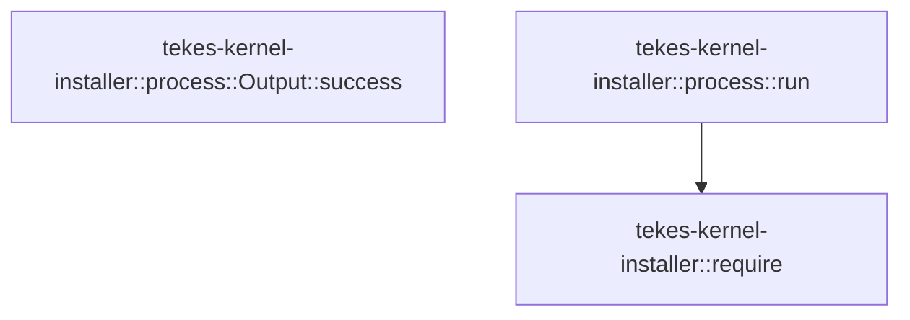

# tekes-kernel-installer::process

[Package atlas](index.md) · [Source](../../src/process.rs)

## Declarations

Visibility is the declaration spelling; trait members and reexports require their enclosing interface. `cfg` is not evaluated.

| Symbol | Kind | Visibility | Test / cfg |
|---|---|---|---|
| [tekes-kernel-installer::process::Output](../../src/process.rs#L10) | struct_item | `pub` |  |
| [tekes-kernel-installer::process::Output::success](../../src/process.rs#L16) | function_item | `pub` |  |
| [tekes-kernel-installer::process::run](../../src/process.rs#L20) | function_item | `pub` |  |

## Imports / reexports

| Local name | Source path | Visibility |
|---|---|---|
| `Failure` | `crate::Failure` | `private` |
| `Result` | `crate::Result` | `private` |
| `require` | `crate::require` | `private` |
| `fs` | `std::fs` | `private` |
| `OpenOptionsExt` | `std::os::unix::fs::OpenOptionsExt` | `private` |
| `Path` | `std::path::Path` | `private` |
| `Command` | `std::process::Command` | `private` |
| `Stdio` | `std::process::Stdio` | `private` |
| `thread` | `std::thread` | `private` |
| `Duration` | `std::time::Duration` | `private` |
| `Instant` | `std::time::Instant` | `private` |

## Module declarations

| Module | Visibility | Attributes |
|---|---|---|

## Function call graphs

Edges below are syntactically resolved calls only, including private functions. Graphs partition callers into groups of 20; they are not execution order. All unresolved sites are listed below and in the JSON inventory.

Functions 1–2: 1 direct edges

## Call sites

Includes test functions (marked in declarations). Receiver-type-required sites need type analysis/manual tracing. Calls in closures are attributed to their enclosing function; their occurrence here does not mean the closure executes immediately.

| Caller | Callee expression | Source lines | Target / classification |
|---|---|---|---|
| `success` | `self.stderr.is_empty` | [17](../../src/process.rs#L17) | receiver-type-required |
| `run` | `tempfile::Builder::new()         .prefix("tekes-kernel-product-child-")         .tempdir` | [21](../../src/process.rs#L21) | receiver-type-required |
| `run` | `tempfile::Builder::new()         .prefix` | [21](../../src/process.rs#L21) | receiver-type-required |
| `run` | `tempfile::Builder::new` | [21](../../src/process.rs#L21) | external-constructor-callback-or-unresolved |
| `run` | `dir.path().join` | [24](../../src/process.rs#L24), [25](../../src/process.rs#L25) | receiver-type-required |
| `run` | `dir.path` | [24](../../src/process.rs#L24), [25](../../src/process.rs#L25) | receiver-type-required |
| `run` | `fs::OpenOptions::new()             .create_new(true)             .write(true)             .mode(0o600)             .open` | [27](../../src/process.rs#L27) | receiver-type-required |
| `run` | `fs::OpenOptions::new()             .create_new(true)             .write(true)             .mode` | [27](../../src/process.rs#L27) | receiver-type-required |
| `run` | `fs::OpenOptions::new()             .create_new(true)             .write` | [27](../../src/process.rs#L27) | receiver-type-required |
| `run` | `fs::OpenOptions::new()             .create_new` | [27](../../src/process.rs#L27) | receiver-type-required |
| `run` | `fs::OpenOptions::new` | [27](../../src/process.rs#L27) | external-constructor-callback-or-unresolved |
| `run` | `Command::new(exe.as_ref())         .args(args)         .env_clear()         .stdin(Stdio::null())         .stdout(open(&out)?)         .stderr(open(&err)?)         .spawn()         .map_err` | [33](../../src/process.rs#L33) | receiver-type-required |
| `run` | `Command::new(exe.as_ref())         .args(args)         .env_clear()         .stdin(Stdio::null())         .stdout(open(&out)?)         .stderr(open(&err)?)         .spawn` | [33](../../src/process.rs#L33) | receiver-type-required |
| `run` | `Command::new(exe.as_ref())         .args(args)         .env_clear()         .stdin(Stdio::null())         .stdout(open(&out)?)         .stderr` | [33](../../src/process.rs#L33) | receiver-type-required |
| `run` | `Command::new(exe.as_ref())         .args(args)         .env_clear()         .stdin(Stdio::null())         .stdout` | [33](../../src/process.rs#L33) | receiver-type-required |
| `run` | `Command::new(exe.as_ref())         .args(args)         .env_clear()         .stdin` | [33](../../src/process.rs#L33) | receiver-type-required |
| `run` | `Command::new(exe.as_ref())         .args(args)         .env_clear` | [33](../../src/process.rs#L33) | receiver-type-required |
| `run` | `Command::new(exe.as_ref())         .args` | [33](../../src/process.rs#L33) | receiver-type-required |
| `run` | `Command::new` | [33](../../src/process.rs#L33) | external-constructor-callback-or-unresolved |
| `run` | `exe.as_ref` | [33](../../src/process.rs#L33) | receiver-type-required |
| `run` | `Stdio::null` | [36](../../src/process.rs#L36) | external-constructor-callback-or-unresolved |
| `run` | `open` | [37](../../src/process.rs#L37), [38](../../src/process.rs#L38) | external-constructor-callback-or-unresolved |
| `run` | `Failure` | [40](../../src/process.rs#L40), [56](../../src/process.rs#L56) | external-constructor-callback-or-unresolved |
| `run` | `Instant::now` | [41](../../src/process.rs#L41), [46](../../src/process.rs#L46), [50](../../src/process.rs#L50), [51](../../src/process.rs#L51) | external-constructor-callback-or-unresolved |
| `run` | `Duration::from_secs` | [41](../../src/process.rs#L41), [50](../../src/process.rs#L50) | external-constructor-callback-or-unresolved |
| `run` | `child.try_wait` | [43](../../src/process.rs#L43), [51](../../src/process.rs#L51) | receiver-type-required |
| `run` | `libc::kill` | [48](../../src/process.rs#L48) | external-constructor-callback-or-unresolved |
| `run` | `child.id` | [48](../../src/process.rs#L48) | receiver-type-required |
| `run` | `child.try_wait()?.is_none` | [51](../../src/process.rs#L51) | receiver-type-required |
| `run` | `thread::sleep` | [52](../../src/process.rs#L52), [58](../../src/process.rs#L58) | external-constructor-callback-or-unresolved |
| `run` | `Duration::from_millis` | [52](../../src/process.rs#L52), [58](../../src/process.rs#L58) | external-constructor-callback-or-unresolved |
| `run` | `child.kill` | [54](../../src/process.rs#L54) | receiver-type-required |
| `run` | `child.wait` | [55](../../src/process.rs#L55) | receiver-type-required |
| `run` | `Err` | [56](../../src/process.rs#L56) | external-constructor-callback-or-unresolved |
| `run` | `require` | [60](../../src/process.rs#L60) | [tekes-kernel-installer::require](../../src/lib.rs#L33) |
| `run` | `fs::metadata(&out)?.len` | [61](../../src/process.rs#L61) | receiver-type-required |
| `run` | `fs::metadata` | [61](../../src/process.rs#L61) | external-constructor-callback-or-unresolved |
| `run` | `fs::metadata(&err)?.len` | [61](../../src/process.rs#L61) | receiver-type-required |
| `run` | `Ok` | [64](../../src/process.rs#L64) | external-constructor-callback-or-unresolved |
| `run` | `status.code().unwrap_or` | [65](../../src/process.rs#L65) | receiver-type-required |
| `run` | `status.code` | [65](../../src/process.rs#L65) | receiver-type-required |
| `run` | `fs::read` | [66](../../src/process.rs#L66), [67](../../src/process.rs#L67) | external-constructor-callback-or-unresolved |
