# tekes-kernel-installer::transaction

[Package atlas](index.md) · [Source](../../src/transaction.rs)

## Declarations

Visibility is the declaration spelling; trait members and reexports require their enclosing interface. `cfg` is not evaluated.

| Symbol | Kind | Visibility | Test / cfg |
|---|---|---|---|
| [tekes-kernel-installer::transaction::p](../../src/transaction.rs#L6) | function_item | `private` |  |
| [tekes-kernel-installer::transaction::PHASES](../../src/transaction.rs#L9) | const_item | `private` |  |
| [tekes-kernel-installer::transaction::request](../../src/transaction.rs#L19) | function_item | `private` |  |
| [tekes-kernel-installer::transaction::write_operation](../../src/transaction.rs#L27) | function_item | `private` |  |
| [tekes-kernel-installer::transaction::installed](../../src/transaction.rs#L35) | function_item | `private` |  |
| [tekes-kernel-installer::transaction::health](../../src/transaction.rs#L40) | function_item | `private` |  |
| [tekes-kernel-installer::transaction::snapshot](../../src/transaction.rs#L67) | function_item | `private` |  |
| [tekes-kernel-installer::transaction::shutdown_complete](../../src/transaction.rs#L82) | function_item | `private` |  |
| [tekes-kernel-installer::transaction::bootout](../../src/transaction.rs#L85) | function_item | `private` |  |
| [tekes-kernel-installer::transaction::begin](../../src/transaction.rs#L101) | function_item | `private` |  |
| [tekes-kernel-installer::transaction::initialize](../../src/transaction.rs#L175) | function_item | `private` |  |
| [tekes-kernel-installer::transaction::publish_selector](../../src/transaction.rs#L227) | function_item | `private` |  |
| [tekes-kernel-installer::transaction::install](../../src/transaction.rs#L254) | function_item | `private` |  |
| [tekes-kernel-installer::transaction::attest](../../src/transaction.rs#L362) | function_item | `private` |  |
| [tekes-kernel-installer::transaction::ready_reply](../../src/transaction.rs#L386) | function_item | `private` |  |
| [tekes-kernel-installer::transaction::failure_code](../../src/transaction.rs#L392) | function_item | `private` |  |
| [tekes-kernel-installer::transaction::wait_ready](../../src/transaction.rs#L407) | function_item | `private` |  |
| [tekes-kernel-installer::transaction::execute](../../src/transaction.rs#L428) | function_item | `pub` |  |
| [tekes-kernel-installer::transaction::tests::shutdown_requires_all_four_authorities](../../src/transaction.rs#L460) | function_item | `private` | test; #[cfg(test)] |
| [tekes-kernel-installer::transaction::receipt_tests::setup](../../src/transaction.rs#L476) | function_item | `private` | test; #[cfg(test)] |
| [tekes-kernel-installer::transaction::receipt_tests::closed_receipt_reopens_after_selection_rollback](../../src/transaction.rs#L496) | function_item | `private` | test; #[cfg(test)] |
| [tekes-kernel-installer::transaction::receipt_tests::matching_closed_receipt_stays_closed](../../src/transaction.rs#L512) | function_item | `private` | test; #[cfg(test)] |
| [tekes-kernel-installer::transaction::receipt_tests::incomplete_receipt_requires_absent_response](../../src/transaction.rs#L524) | function_item | `private` | test; #[cfg(test)] |
| [tekes-kernel-installer::transaction::receipt_tests::installer_lock_excludes_second_actor](../../src/transaction.rs#L534) | function_item | `private` | test; #[cfg(test)] |

## Imports / reexports

| Local name | Source path | Visibility |
|---|---|---|
| `Artifact` | `crate::artifact::Artifact` | `private` |
| `fs` | `crate::fs` | `private` |
| `run` | `crate::process::run` | `private` |
| `*` | `crate::*` | `private` |
| `thread` | `std::thread` | `private` |
| `Duration` | `std::time::Duration` | `private` |
| `Instant` | `std::time::Instant` | `private` |
| `*` | `super::*` | `private` |
| `*` | `super::*` | `private` |

## Module declarations

| Module | Visibility | Attributes |
|---|---|---|
| `tekes-kernel-installer::transaction::tests` | `private` | #[cfg(test)] |
| `tekes-kernel-installer::transaction::receipt_tests` | `private` | #[cfg(test)] |

## Function call graphs

Edges below are syntactically resolved calls only, including private functions. Graphs partition callers into groups of 20; they are not execution order. All unresolved sites are listed below and in the JSON inventory.

```mermaid
flowchart TD
  n0["tekes-kernel-installer::fs::durable"]
  n1["tekes-kernel-installer::fs::lock"]
  n2["tekes-kernel-installer::fs::lock_available"]
  n3["tekes-kernel-installer::fs::exists"]
  n4["tekes-kernel-installer::fs::regular"]
  n5["tekes-kernel-installer::fs::mode"]
  n6["tekes-kernel-installer::fs::object"]
  n7["tekes-kernel-installer::fs::sha"]
  n8["tekes-kernel-installer::fs::directory"]
  n9["tekes-kernel-installer::migration::migrate"]
  n10["tekes-kernel-installer::process::run"]
  n11["tekes-kernel-installer::transaction::begin"]
  n12["tekes-kernel-installer::transaction::initialize"]
  n13["tekes-kernel-installer::transaction::request"]
  n14["tekes-kernel-installer::transaction::publish_selector"]
  n15["tekes-kernel-installer::transaction::install"]
  n16["tekes-kernel-installer::transaction::write_operation"]
  n17["tekes-kernel-installer::transaction::installed"]
  n18["tekes-kernel-installer::transaction::attest"]
  n19["tekes-kernel-installer::transaction::ready_reply"]
  n20["tekes-kernel-installer::transaction::failure_code"]
  n21["tekes-kernel-installer::transaction::wait_ready"]
  n22["tekes-kernel-installer::transaction::health"]
  n23["tekes-kernel-installer::transaction::execute"]
  n24["tekes-kernel-installer::transaction::snapshot"]
  n25["tekes-kernel-installer::transaction::p"]
  n26["tekes-kernel-installer::transaction::shutdown_complete"]
  n27["tekes-kernel-installer::transaction::bootout"]
  n11 --> n0
  n11 --> n3
  n11 --> n6
  n11 --> n13
  n11 --> n16
  n11 --> n17
  n11 --> n27
  n12 --> n0
  n12 --> n3
  n12 --> n4
  n12 --> n8
  n12 --> n9
  n13 --> n7
  n14 --> n0
  n14 --> n3
  n14 --> n4
  n14 --> n10
  n14 --> n25
  n15 --> n0
  n15 --> n1
  n15 --> n4
  n15 --> n5
  n15 --> n10
  n15 --> n11
  n15 --> n12
  n15 --> n14
  n15 --> n16
  n15 --> n17
  n15 --> n24
  n15 --> n25
  n15 --> n27
  n16 --> n0
  n16 --> n13
  n17 --> n6
  n18 --> n10
  n18 --> n25
  n19 --> n18
  n20 --> n10
  n20 --> n25
  n21 --> n19
  n21 --> n20
  n21 --> n21
  n21 --> n22
  n21 --> n27
  n22 --> n10
  n23 --> n1
  n23 --> n15
  n23 --> n17
  n23 --> n19
  n23 --> n21
  n23 --> n22
  n23 --> n24
  n23 --> n27
  n24 --> n22
  n27 --> n2
  n27 --> n22
  n27 --> n26
```

Functions 1–17: 57 direct edges

## Call sites

Includes test functions (marked in declarations). Receiver-type-required sites need type analysis/manual tracing. Calls in closures are attributed to their enclosing function; their occurrence here does not mean the closure executes immediately.

| Caller | Callee expression | Source lines | Target / classification |
|---|---|---|---|
| `p` | `p.to_str().ok_or` | [7](../../src/transaction.rs#L7) | receiver-type-required |
| `p` | `p.to_str` | [7](../../src/transaction.rs#L7) | receiver-type-required |
| `p` | `Failure` | [7](../../src/transaction.rs#L7) | external-constructor-callback-or-unresolved |
| `request` | `canonical` | [20](../../src/transaction.rs#L20) | external-constructor-callback-or-unresolved |
| `request` | `fs::sha` | [23](../../src/transaction.rs#L23) | [tekes-kernel-installer::fs::sha](../../src/fs.rs#L79) |
| `request` | `Ok` | [25](../../src/transaction.rs#L25) | external-constructor-callback-or-unresolved |
| `write_operation` | `request` | [28](../../src/transaction.rs#L28) | [tekes-kernel-installer::transaction::request](../../src/transaction.rs#L19) |
| `write_operation` | `fs::durable` | [33](../../src/transaction.rs#L33) | [tekes-kernel-installer::fs::durable](../../src/fs.rs#L118) |
| `write_operation` | `l.installer.join` | [33](../../src/transaction.rs#L33) | receiver-type-required |
| `write_operation` | `canonical` | [33](../../src/transaction.rs#L33) | external-constructor-callback-or-unresolved |
| `installed` | `fs::object(&l.kernel.join("selector/current.json")).ok()?.0["selection"]["version"]         .as_str()         .map` | [36](../../src/transaction.rs#L36) | receiver-type-required |
| `installed` | `fs::object(&l.kernel.join("selector/current.json")).ok()?.0["selection"]["version"]         .as_str` | [36](../../src/transaction.rs#L36) | receiver-type-required |
| `installed` | `fs::object(&l.kernel.join("selector/current.json")).ok` | [36](../../src/transaction.rs#L36) | receiver-type-required |
| `installed` | `fs::object` | [36](../../src/transaction.rs#L36) | [tekes-kernel-installer::fs::object](../../src/fs.rs#L73) |
| `installed` | `l.kernel.join` | [36](../../src/transaction.rs#L36) | receiver-type-required |
| `health` | `run(         "/usr/bin/curl",         &[             "--silent",             "--show-error",             "--max-time",             "2",             &format!("{ORIGIN}/health/ready"),         ],         4,     )     .ok` | [41](../../src/transaction.rs#L41) | receiver-type-required |
| `health` | `run` | [41](../../src/transaction.rs#L41) | [tekes-kernel-installer::process::run](../../src/process.rs#L20) |
| `health` | `out.success` | [53](../../src/transaction.rs#L53) | receiver-type-required |
| `health` | `serde_json::from_slice(&out.stdout).ok` | [56](../../src/transaction.rs#L56) | receiver-type-required |
| `health` | `serde_json::from_slice` | [56](../../src/transaction.rs#L56) | external-constructor-callback-or-unresolved |
| `health` | `keys` | [57](../../src/transaction.rs#L57) | external-constructor-callback-or-unresolved |
| `health` | `v["ready"].as_bool` | [58](../../src/transaction.rs#L58) | receiver-type-required |
| `health` | `Some` | [58](../../src/transaction.rs#L58), [62](../../src/transaction.rs#L62) | external-constructor-callback-or-unresolved |
| `health` | `v["build"].is_string` | [59](../../src/transaction.rs#L59) | receiver-type-required |
| `health` | `v["generation"].as_u64().is_some_and` | [60](../../src/transaction.rs#L60) | receiver-type-required |
| `health` | `v["generation"].as_u64` | [60](../../src/transaction.rs#L60) | receiver-type-required |
| `snapshot` | `installed` | [68](../../src/transaction.rs#L68) | external-constructor-callback-or-unresolved |
| `snapshot` | `platform::loaded` | [69](../../src/transaction.rs#L69) | external-constructor-callback-or-unresolved |
| `snapshot` | `health` | [70](../../src/transaction.rs#L70) | [tekes-kernel-installer::transaction::health](../../src/transaction.rs#L40) |
| `snapshot` | `installed.is_none` | [71](../../src/transaction.rs#L71) | receiver-type-required |
| `snapshot` | `ready.is_some` | [73](../../src/transaction.rs#L73) | receiver-type-required |
| `bootout` | `platform::stop` | [86](../../src/transaction.rs#L86) | external-constructor-callback-or-unresolved |
| `bootout` | `Instant::now` | [87](../../src/transaction.rs#L87), [88](../../src/transaction.rs#L88) | external-constructor-callback-or-unresolved |
| `bootout` | `Duration::from_secs` | [87](../../src/transaction.rs#L87) | external-constructor-callback-or-unresolved |
| `bootout` | `shutdown_complete` | [89](../../src/transaction.rs#L89) | [tekes-kernel-installer::transaction::shutdown_complete](../../src/transaction.rs#L82) |
| `bootout` | `platform::loaded` | [90](../../src/transaction.rs#L90) | external-constructor-callback-or-unresolved |
| `bootout` | `health().is_some` | [91](../../src/transaction.rs#L91) | receiver-type-required |
| `bootout` | `health` | [91](../../src/transaction.rs#L91) | [tekes-kernel-installer::transaction::health](../../src/transaction.rs#L40) |
| `bootout` | `fs::lock_available` | [92](../../src/transaction.rs#L92), [93](../../src/transaction.rs#L93) | [tekes-kernel-installer::fs::lock_available](../../src/fs.rs#L147) |
| `bootout` | `l.kernel.join` | [92](../../src/transaction.rs#L92) | receiver-type-required |
| `bootout` | `l.threads.join` | [93](../../src/transaction.rs#L93) | receiver-type-required |
| `bootout` | `Ok` | [95](../../src/transaction.rs#L95) | external-constructor-callback-or-unresolved |
| `bootout` | `thread::sleep` | [97](../../src/transaction.rs#L97) | external-constructor-callback-or-unresolved |
| `bootout` | `Duration::from_millis` | [97](../../src/transaction.rs#L97) | external-constructor-callback-or-unresolved |
| `bootout` | `Err` | [99](../../src/transaction.rs#L99) | external-constructor-callback-or-unresolved |
| `bootout` | `Failure` | [99](../../src/transaction.rs#L99) | external-constructor-callback-or-unresolved |
| `begin` | `l.installer.join` | [102](../../src/transaction.rs#L102), [144](../../src/transaction.rs#L144) | receiver-type-required |
| `begin` | `request` | [103](../../src/transaction.rs#L103) | [tekes-kernel-installer::transaction::request](../../src/transaction.rs#L19) |
| `begin` | `fs::exists` | [104](../../src/transaction.rs#L104) | [tekes-kernel-installer::fs::exists](../../src/fs.rs#L28) |
| `begin` | `fs::object` | [105](../../src/transaction.rs#L105) | [tekes-kernel-installer::fs::object](../../src/fs.rs#L73) |
| `begin` | `require` | [107](../../src/transaction.rs#L107), [135](../../src/transaction.rs#L135), [139](../../src/transaction.rs#L139), [157](../../src/transaction.rs#L157) | external-constructor-callback-or-unresolved |
| `begin` | `keys` | [108](../../src/transaction.rs#L108), [118](../../src/transaction.rs#L118), [158](../../src/transaction.rs#L158) | external-constructor-callback-or-unresolved |
| `begin` | `v["format"].as_u64` | [129](../../src/transaction.rs#L129) | receiver-type-required |
| `begin` | `Some` | [129](../../src/transaction.rs#L129), [159](../../src/transaction.rs#L159), [164](../../src/transaction.rs#L164) | external-constructor-callback-or-unresolved |
| `begin` | `string` | [134](../../src/transaction.rs#L134), [136](../../src/transaction.rs#L136), [137](../../src/transaction.rs#L137) | external-constructor-callback-or-unresolved |
| `begin` | `PHASES.contains` | [135](../../src/transaction.rs#L135) | receiver-type-required |
| `begin` | `v.get("response").is_some` | [139](../../src/transaction.rs#L139) | receiver-type-required |
| `begin` | `v.get` | [139](../../src/transaction.rs#L139) | receiver-type-required |
| `begin` | `bootout` | [142](../../src/transaction.rs#L142) | [tekes-kernel-installer::transaction::bootout](../../src/transaction.rs#L85) |
| `begin` | `fs::durable` | [143](../../src/transaction.rs#L143) | [tekes-kernel-installer::fs::durable](../../src/fs.rs#L118) |
| `begin` | `write_operation` | [151](../../src/transaction.rs#L151), [165](../../src/transaction.rs#L165), [172](../../src/transaction.rs#L172) | [tekes-kernel-installer::transaction::write_operation](../../src/transaction.rs#L27) |
| `begin` | `Ok` | [152](../../src/transaction.rs#L152), [166](../../src/transaction.rs#L166), [169](../../src/transaction.rs#L169), [173](../../src/transaction.rs#L173) | external-constructor-callback-or-unresolved |
| `begin` | `"prepared".into` | [152](../../src/transaction.rs#L152), [166](../../src/transaction.rs#L166), [173](../../src/transaction.rs#L173) | receiver-type-required |
| `begin` | `r["format"].as_u64` | [159](../../src/transaction.rs#L159) | receiver-type-required |
| `begin` | `installed(l).as_deref` | [164](../../src/transaction.rs#L164) | receiver-type-required |
| `begin` | `installed` | [164](../../src/transaction.rs#L164) | [tekes-kernel-installer::transaction::installed](../../src/transaction.rs#L35) |
| `begin` | `phase.into` | [169](../../src/transaction.rs#L169) | receiver-type-required |
| `initialize` | `crate::migration::migrate` | [176](../../src/transaction.rs#L176) | [tekes-kernel-installer::migration::migrate](../../src/migration.rs#L163) |
| `initialize` | `fs::directory` | [185](../../src/transaction.rs#L185), [194](../../src/transaction.rs#L194), [208](../../src/transaction.rs#L208) | [tekes-kernel-installer::fs::directory](../../src/fs.rs#L88) |
| `initialize` | `l.kernel.join` | [194](../../src/transaction.rs#L194), [211](../../src/transaction.rs#L211), [212](../../src/transaction.rs#L212) | receiver-type-required |
| `initialize` | `l.data.join` | [208](../../src/transaction.rs#L208) | receiver-type-required |
| `initialize` | `l.threads.join` | [213](../../src/transaction.rs#L213) | receiver-type-required |
| `initialize` | `fs::exists` | [215](../../src/transaction.rs#L215), [220](../../src/transaction.rs#L220) | [tekes-kernel-installer::fs::exists](../../src/fs.rs#L28) |
| `initialize` | `fs::durable` | [216](../../src/transaction.rs#L216), [223](../../src/transaction.rs#L223) | [tekes-kernel-installer::fs::durable](../../src/fs.rs#L118) |
| `initialize` | `l.installer.join` | [219](../../src/transaction.rs#L219) | receiver-type-required |
| `initialize` | `require` | [221](../../src/transaction.rs#L221) | external-constructor-callback-or-unresolved |
| `initialize` | `fs::regular` | [221](../../src/transaction.rs#L221) | [tekes-kernel-installer::fs::regular](../../src/fs.rs#L58) |
| `initialize` | `Ok` | [225](../../src/transaction.rs#L225) | external-constructor-callback-or-unresolved |
| `publish_selector` | `l.kernel.join` | [228](../../src/transaction.rs#L228) | receiver-type-required |
| `publish_selector` | `a.selector` | [229](../../src/transaction.rs#L229) | receiver-type-required |
| `publish_selector` | `a.selector_manifest` | [230](../../src/transaction.rs#L230) | receiver-type-required |
| `publish_selector` | `fs::exists` | [231](../../src/transaction.rs#L231) | [tekes-kernel-installer::fs::exists](../../src/fs.rs#L28) |
| `publish_selector` | `fs::regular` | [232](../../src/transaction.rs#L232), [250](../../src/transaction.rs#L250) | [tekes-kernel-installer::fs::regular](../../src/fs.rs#L58) |
| `publish_selector` | `p` | [235](../../src/transaction.rs#L235), [238](../../src/transaction.rs#L238), [240](../../src/transaction.rs#L240) | [tekes-kernel-installer::transaction::p](../../src/transaction.rs#L6) |
| `publish_selector` | `run(&installed, &args, 45)?.success` | [242](../../src/transaction.rs#L242) | receiver-type-required |
| `publish_selector` | `run` | [242](../../src/transaction.rs#L242), [244](../../src/transaction.rs#L244) | [tekes-kernel-installer::process::run](../../src/process.rs#L20) |
| `publish_selector` | `require` | [243](../../src/transaction.rs#L243) | external-constructor-callback-or-unresolved |
| `publish_selector` | `run(&selector, &args, 45)?.success` | [244](../../src/transaction.rs#L244) | receiver-type-required |
| `publish_selector` | `fs::durable` | [250](../../src/transaction.rs#L250) | [tekes-kernel-installer::fs::durable](../../src/fs.rs#L118) |
| `publish_selector` | `Ok` | [252](../../src/transaction.rs#L252) | external-constructor-callback-or-unresolved |
| `install` | `fs::lock` | [255](../../src/transaction.rs#L255) | [tekes-kernel-installer::fs::lock](../../src/fs.rs#L131) |
| `install` | `l.installer.join` | [255](../../src/transaction.rs#L255), [266](../../src/transaction.rs#L266) | receiver-type-required |
| `install` | `begin` | [256](../../src/transaction.rs#L256) | [tekes-kernel-installer::transaction::begin](../../src/transaction.rs#L101) |
| `install` | `match phase.as_str() {             "prepared" => {                 bootout(l)?;                 initialize(l, a)?;                 "identity-published"             }             "identity-published" => {                 require(                     fs::regular(&l.installer.join("install-identity.json"))? == a.identity,                     "invalid-install",                 )?;                 platform::bearer_ensure(a)?;                 "credential-published"             }             "credential-published" => {                 require(                     platform::bearer_read(a)?.is_some(),                     "endpoint-credential-unavailable",                 )?;                 bootout(l)?;                 publish_selector(l, a)?;                 let selector = l.kernel.join("selector/bin/tekes-selector");                 require(                     run(                         &selector,                         &[                             "--install-root",                             p(&l.kernel)?,                             "stage",                             "--bundle",                             p(&a.bundle())?,                             "--version",                             &a.version,                         ],                         45,                     )?                     .success(),                     "bundle-stage-failed",                 )?;                 "bundles-published"             }             "bundles-published" => {                 require(                     fs::regular(                         &l.kernel                             .join("bundles")                             .join(&a.version)                             .join("manifest.canonical.json"),                     )? == fs::regular(&a.bundle().join("manifest.canonical.json"))?,                     "invalid-install",                 )?;                 bootout(l)?;                 require(                     run(                         l.kernel.join("selector/bin/tekes-selector"),                         &[                             "--install-root",                             p(&l.kernel)?,                             "activate",                             "--version",                             &a.version,                         ],                         45,                     )?                     .success(),                     "bundle-activate-failed",                 )?;                 "selection-published"             }             "selection-published" => {                 require(                     installed(l).as_deref() == Some(&a.version),                     "invalid-install",                 )?;                 fs::durable(&l.service_file, &platform::render(l)?, 0o644)?;                 "plist-published"             }             "plist-published" => {                 require(                     fs::regular(&l.service_file)? == platform::render(l)?                         && fs::mode(&l.service_file)? == 0o644,                     "invalid-install",                 )?;                 platform::bootstrap(l)?;                 "service-started"             }             "service-started" => {                 if !platform::loaded() {                     platform::bootstrap(l)?;                 }                 "closed"             }             _ => return Err(Failure("invalid-install")),         }         .into` | [258](../../src/transaction.rs#L258) | receiver-type-required |
| `install` | `phase.as_str` | [258](../../src/transaction.rs#L258) | receiver-type-required |
| `install` | `bootout` | [260](../../src/transaction.rs#L260), [277](../../src/transaction.rs#L277), [309](../../src/transaction.rs#L309) | [tekes-kernel-installer::transaction::bootout](../../src/transaction.rs#L85) |
| `install` | `initialize` | [261](../../src/transaction.rs#L261) | [tekes-kernel-installer::transaction::initialize](../../src/transaction.rs#L175) |
| `install` | `require` | [265](../../src/transaction.rs#L265), [273](../../src/transaction.rs#L273), [280](../../src/transaction.rs#L280), [300](../../src/transaction.rs#L300), [310](../../src/transaction.rs#L310), [328](../../src/transaction.rs#L328), [336](../../src/transaction.rs#L336), [356](../../src/transaction.rs#L356) | external-constructor-callback-or-unresolved |
| `install` | `fs::regular` | [266](../../src/transaction.rs#L266), [301](../../src/transaction.rs#L301), [306](../../src/transaction.rs#L306), [337](../../src/transaction.rs#L337) | [tekes-kernel-installer::fs::regular](../../src/fs.rs#L58) |
| `install` | `platform::bearer_ensure` | [269](../../src/transaction.rs#L269) | external-constructor-callback-or-unresolved |
| `install` | `platform::bearer_read(a)?.is_some` | [274](../../src/transaction.rs#L274) | receiver-type-required |
| `install` | `platform::bearer_read` | [274](../../src/transaction.rs#L274) | external-constructor-callback-or-unresolved |
| `install` | `publish_selector` | [278](../../src/transaction.rs#L278) | [tekes-kernel-installer::transaction::publish_selector](../../src/transaction.rs#L227) |
| `install` | `l.kernel.join` | [279](../../src/transaction.rs#L279), [312](../../src/transaction.rs#L312) | receiver-type-required |
| `install` | `run(                         &selector,                         &[                             "--install-root",                             p(&l.kernel)?,                             "stage",                             "--bundle",                             p(&a.bundle())?,                             "--version",                             &a.version,                         ],                         45,                     )?                     .success` | [281](../../src/transaction.rs#L281) | receiver-type-required |
| `install` | `run` | [281](../../src/transaction.rs#L281), [311](../../src/transaction.rs#L311) | [tekes-kernel-installer::process::run](../../src/process.rs#L20) |
| `install` | `p` | [285](../../src/transaction.rs#L285), [288](../../src/transaction.rs#L288), [315](../../src/transaction.rs#L315) | [tekes-kernel-installer::transaction::p](../../src/transaction.rs#L6) |
| `install` | `a.bundle` | [288](../../src/transaction.rs#L288), [306](../../src/transaction.rs#L306) | receiver-type-required |
| `install` | `l.kernel                             .join("bundles")                             .join(&a.version)                             .join` | [302](../../src/transaction.rs#L302) | receiver-type-required |
| `install` | `l.kernel                             .join("bundles")                             .join` | [302](../../src/transaction.rs#L302) | receiver-type-required |
| `install` | `l.kernel                             .join` | [302](../../src/transaction.rs#L302) | receiver-type-required |
| `install` | `a.bundle().join` | [306](../../src/transaction.rs#L306) | receiver-type-required |
| `install` | `run(                         l.kernel.join("selector/bin/tekes-selector"),                         &[                             "--install-root",                             p(&l.kernel)?,                             "activate",                             "--version",                             &a.version,                         ],                         45,                     )?                     .success` | [311](../../src/transaction.rs#L311) | receiver-type-required |
| `install` | `installed(l).as_deref` | [329](../../src/transaction.rs#L329), [357](../../src/transaction.rs#L357) | receiver-type-required |
| `install` | `installed` | [329](../../src/transaction.rs#L329), [357](../../src/transaction.rs#L357) | [tekes-kernel-installer::transaction::installed](../../src/transaction.rs#L35) |
| `install` | `Some` | [329](../../src/transaction.rs#L329), [357](../../src/transaction.rs#L357) | external-constructor-callback-or-unresolved |
| `install` | `fs::durable` | [332](../../src/transaction.rs#L332) | [tekes-kernel-installer::fs::durable](../../src/fs.rs#L118) |
| `install` | `platform::render` | [332](../../src/transaction.rs#L332), [337](../../src/transaction.rs#L337) | external-constructor-callback-or-unresolved |
| `install` | `fs::mode` | [338](../../src/transaction.rs#L338) | [tekes-kernel-installer::fs::mode](../../src/fs.rs#L70) |
| `install` | `platform::bootstrap` | [341](../../src/transaction.rs#L341), [346](../../src/transaction.rs#L346) | external-constructor-callback-or-unresolved |
| `install` | `platform::loaded` | [345](../../src/transaction.rs#L345) | external-constructor-callback-or-unresolved |
| `install` | `Err` | [350](../../src/transaction.rs#L350) | external-constructor-callback-or-unresolved |
| `install` | `Failure` | [350](../../src/transaction.rs#L350) | external-constructor-callback-or-unresolved |
| `install` | `write_operation` | [354](../../src/transaction.rs#L354) | [tekes-kernel-installer::transaction::write_operation](../../src/transaction.rs#L27) |
| `install` | `Ok` | [360](../../src/transaction.rs#L360) | external-constructor-callback-or-unresolved |
| `install` | `snapshot` | [360](../../src/transaction.rs#L360) | [tekes-kernel-installer::transaction::snapshot](../../src/transaction.rs#L67) |
| `attest` | `Instant::now` | [363](../../src/transaction.rs#L363), [380](../../src/transaction.rs#L380) | external-constructor-callback-or-unresolved |
| `attest` | `Duration::from_secs` | [363](../../src/transaction.rs#L363) | external-constructor-callback-or-unresolved |
| `attest` | `run(             l.kernel.join("selector/bin/tekes-selector"),             &[                 "--install-root",                 p(&l.kernel)?,                 "attest-install-health",                 "--version",                 &a.version,             ],             10,         )?         .success` | [365](../../src/transaction.rs#L365) | receiver-type-required |
| `attest` | `run` | [365](../../src/transaction.rs#L365) | [tekes-kernel-installer::process::run](../../src/process.rs#L20) |
| `attest` | `l.kernel.join` | [366](../../src/transaction.rs#L366) | receiver-type-required |
| `attest` | `p` | [369](../../src/transaction.rs#L369) | [tekes-kernel-installer::transaction::p](../../src/transaction.rs#L6) |
| `attest` | `Ok` | [378](../../src/transaction.rs#L378) | external-constructor-callback-or-unresolved |
| `attest` | `Err` | [381](../../src/transaction.rs#L381) | external-constructor-callback-or-unresolved |
| `attest` | `Failure` | [381](../../src/transaction.rs#L381) | external-constructor-callback-or-unresolved |
| `attest` | `thread::sleep` | [383](../../src/transaction.rs#L383) | external-constructor-callback-or-unresolved |
| `attest` | `Duration::from_millis` | [383](../../src/transaction.rs#L383) | external-constructor-callback-or-unresolved |
| `ready_reply` | `attest` | [387](../../src/transaction.rs#L387) | [tekes-kernel-installer::transaction::attest](../../src/transaction.rs#L362) |
| `ready_reply` | `Ok` | [388](../../src/transaction.rs#L388) | external-constructor-callback-or-unresolved |
| `failure_code` | `run(         l.kernel.join("selector/bin/tekes-selector"),         &["--install-root", p(&l.kernel).ok()?, "status"],         10,     )     .ok` | [393](../../src/transaction.rs#L393) | receiver-type-required |
| `failure_code` | `run` | [393](../../src/transaction.rs#L393) | [tekes-kernel-installer::process::run](../../src/process.rs#L20) |
| `failure_code` | `l.kernel.join` | [394](../../src/transaction.rs#L394) | receiver-type-required |
| `failure_code` | `p(&l.kernel).ok` | [395](../../src/transaction.rs#L395) | receiver-type-required |
| `failure_code` | `p` | [395](../../src/transaction.rs#L395) | [tekes-kernel-installer::transaction::p](../../src/transaction.rs#L6) |
| `failure_code` | `out.success` | [399](../../src/transaction.rs#L399) | receiver-type-required |
| `failure_code` | `serde_json::from_slice(&out.stdout).ok` | [402](../../src/transaction.rs#L402) | receiver-type-required |
| `failure_code` | `serde_json::from_slice` | [402](../../src/transaction.rs#L402) | external-constructor-callback-or-unresolved |
| `failure_code` | `["last_failure", "prelaunch_failure"]         .into_iter()         .find_map` | [403](../../src/transaction.rs#L403) | receiver-type-required |
| `failure_code` | `["last_failure", "prelaunch_failure"]         .into_iter` | [403](../../src/transaction.rs#L403) | receiver-type-required |
| `failure_code` | `v[k]["code"].as_str().map` | [405](../../src/transaction.rs#L405) | receiver-type-required |
| `failure_code` | `v[k]["code"].as_str` | [405](../../src/transaction.rs#L405) | receiver-type-required |
| `wait_ready` | `Instant::now` | [408](../../src/transaction.rs#L408), [409](../../src/transaction.rs#L409) | external-constructor-callback-or-unresolved |
| `wait_ready` | `Duration::from_secs` | [408](../../src/transaction.rs#L408) | external-constructor-callback-or-unresolved |
| `wait_ready` | `health` | [410](../../src/transaction.rs#L410) | [tekes-kernel-installer::transaction::health](../../src/transaction.rs#L40) |
| `wait_ready` | `ready_reply` | [412](../../src/transaction.rs#L412) | [tekes-kernel-installer::transaction::ready_reply](../../src/transaction.rs#L386) |
| `wait_ready` | `thread::sleep` | [415](../../src/transaction.rs#L415) | external-constructor-callback-or-unresolved |
| `wait_ready` | `Duration::from_millis` | [415](../../src/transaction.rs#L415) | external-constructor-callback-or-unresolved |
| `wait_ready` | `failure_code(l).as_deref` | [418](../../src/transaction.rs#L418) | receiver-type-required |
| `wait_ready` | `failure_code` | [418](../../src/transaction.rs#L418) | [tekes-kernel-installer::transaction::failure_code](../../src/transaction.rs#L392) |
| `wait_ready` | `Some` | [418](../../src/transaction.rs#L418) | external-constructor-callback-or-unresolved |
| `wait_ready` | `platform::bearer_read(a).ok().flatten().is_some` | [419](../../src/transaction.rs#L419) | receiver-type-required |
| `wait_ready` | `platform::bearer_read(a).ok().flatten` | [419](../../src/transaction.rs#L419) | receiver-type-required |
| `wait_ready` | `platform::bearer_read(a).ok` | [419](../../src/transaction.rs#L419) | receiver-type-required |
| `wait_ready` | `platform::bearer_read` | [419](../../src/transaction.rs#L419) | external-constructor-callback-or-unresolved |
| `wait_ready` | `platform::bearer_rotate` | [421](../../src/transaction.rs#L421) | external-constructor-callback-or-unresolved |
| `wait_ready` | `bootout` | [422](../../src/transaction.rs#L422) | [tekes-kernel-installer::transaction::bootout](../../src/transaction.rs#L85) |
| `wait_ready` | `platform::bootstrap` | [423](../../src/transaction.rs#L423) | external-constructor-callback-or-unresolved |
| `wait_ready` | `wait_ready` | [424](../../src/transaction.rs#L424) | [tekes-kernel-installer::transaction::wait_ready](../../src/transaction.rs#L407) |
| `wait_ready` | `Err` | [426](../../src/transaction.rs#L426) | external-constructor-callback-or-unresolved |
| `wait_ready` | `Failure` | [426](../../src/transaction.rs#L426) | external-constructor-callback-or-unresolved |
| `execute` | `Ok` | [430](../../src/transaction.rs#L430), [450](../../src/transaction.rs#L450) | external-constructor-callback-or-unresolved |
| `execute` | `snapshot` | [430](../../src/transaction.rs#L430) | [tekes-kernel-installer::transaction::snapshot](../../src/transaction.rs#L67) |
| `execute` | `install` | [431](../../src/transaction.rs#L431), [434](../../src/transaction.rs#L434) | [tekes-kernel-installer::transaction::install](../../src/transaction.rs#L254) |
| `execute` | `installed(l).as_deref` | [433](../../src/transaction.rs#L433), [437](../../src/transaction.rs#L437) | receiver-type-required |
| `execute` | `installed` | [433](../../src/transaction.rs#L433), [437](../../src/transaction.rs#L437) | [tekes-kernel-installer::transaction::installed](../../src/transaction.rs#L35) |
| `execute` | `Some` | [433](../../src/transaction.rs#L433), [437](../../src/transaction.rs#L437) | external-constructor-callback-or-unresolved |
| `execute` | `health` | [436](../../src/transaction.rs#L436) | [tekes-kernel-installer::transaction::health](../../src/transaction.rs#L40) |
| `execute` | `platform::loaded` | [437](../../src/transaction.rs#L437) | external-constructor-callback-or-unresolved |
| `execute` | `ready_reply` | [440](../../src/transaction.rs#L440) | [tekes-kernel-installer::transaction::ready_reply](../../src/transaction.rs#L386) |
| `execute` | `platform::bootstrap` | [444](../../src/transaction.rs#L444) | external-constructor-callback-or-unresolved |
| `execute` | `wait_ready` | [445](../../src/transaction.rs#L445) | [tekes-kernel-installer::transaction::wait_ready](../../src/transaction.rs#L407) |
| `execute` | `fs::lock` | [448](../../src/transaction.rs#L448) | [tekes-kernel-installer::fs::lock](../../src/fs.rs#L131) |
| `execute` | `l.installer.join` | [448](../../src/transaction.rs#L448) | receiver-type-required |
| `execute` | `bootout` | [449](../../src/transaction.rs#L449) | [tekes-kernel-installer::transaction::bootout](../../src/transaction.rs#L85) |
| `setup` | `tempfile::tempdir().unwrap` | [477](../../src/transaction.rs#L477) | receiver-type-required |
| `setup` | `tempfile::tempdir` | [477](../../src/transaction.rs#L477) | external-constructor-callback-or-unresolved |
| `setup` | `std::fs::canonicalize(d.path()).unwrap` | [478](../../src/transaction.rs#L478) | receiver-type-required |
| `setup` | `std::fs::canonicalize` | [478](../../src/transaction.rs#L478) | external-constructor-callback-or-unresolved |
| `setup` | `d.path` | [478](../../src/transaction.rs#L478) | receiver-type-required |
| `setup` | `Layout::macos` | [479](../../src/transaction.rs#L479) | external-constructor-callback-or-unresolved |
| `setup` | `home.join` | [481](../../src/transaction.rs#L481), [482](../../src/transaction.rs#L482) | receiver-type-required |
| `setup` | `"v2".into` | [483](../../src/transaction.rs#L483) | receiver-type-required |
| `setup` | `"TEKESAPP01".into` | [484](../../src/transaction.rs#L484) | receiver-type-required |
| `setup` | `"group".into` | [485](../../src/transaction.rs#L485) | receiver-type-required |
| `setup` | `"client".into` | [486](../../src/transaction.rs#L486) | receiver-type-required |
| `setup` | `"selector".into` | [487](../../src/transaction.rs#L487) | receiver-type-required |
| `setup` | `"supervisor".into` | [488](../../src/transaction.rs#L488) | receiver-type-required |
| `setup` | `b"{}\n".to_vec` | [489](../../src/transaction.rs#L489) | receiver-type-required |
| `setup` | `fs::sha` | [490](../../src/transaction.rs#L490) | external-constructor-callback-or-unresolved |
| `setup` | `"f".repeat` | [491](../../src/transaction.rs#L491) | receiver-type-required |
| `closed_receipt_reopens_after_selection_rollback` | `setup` | [497](../../src/transaction.rs#L497) | [tekes-kernel-installer::transaction::receipt_tests::setup](../../src/transaction.rs#L476) |
| `closed_receipt_reopens_after_selection_rollback` | `write_operation(&l, &a, "closed").unwrap` | [498](../../src/transaction.rs#L498) | receiver-type-required |
| `closed_receipt_reopens_after_selection_rollback` | `write_operation` | [498](../../src/transaction.rs#L498) | external-constructor-callback-or-unresolved |
| `closed_receipt_reopens_after_selection_rollback` | `fs::durable(             &l.kernel.join("selector/current.json"),             &canonical(&json!({"selection":{"version":"v1"}})).unwrap(),             0o600,         )         .unwrap` | [499](../../src/transaction.rs#L499) | receiver-type-required |
| `closed_receipt_reopens_after_selection_rollback` | `fs::durable` | [499](../../src/transaction.rs#L499) | external-constructor-callback-or-unresolved |
| `closed_receipt_reopens_after_selection_rollback` | `l.kernel.join` | [500](../../src/transaction.rs#L500) | receiver-type-required |
| `closed_receipt_reopens_after_selection_rollback` | `canonical(&json!({"selection":{"version":"v1"}})).unwrap` | [501](../../src/transaction.rs#L501) | receiver-type-required |
| `closed_receipt_reopens_after_selection_rollback` | `canonical` | [501](../../src/transaction.rs#L501) | external-constructor-callback-or-unresolved |
| `matching_closed_receipt_stays_closed` | `setup` | [513](../../src/transaction.rs#L513) | [tekes-kernel-installer::transaction::receipt_tests::setup](../../src/transaction.rs#L476) |
| `matching_closed_receipt_stays_closed` | `write_operation(&l, &a, "closed").unwrap` | [514](../../src/transaction.rs#L514) | receiver-type-required |
| `matching_closed_receipt_stays_closed` | `write_operation` | [514](../../src/transaction.rs#L514) | external-constructor-callback-or-unresolved |
| `matching_closed_receipt_stays_closed` | `fs::durable(             &l.kernel.join("selector/current.json"),             &canonical(&json!({"selection":{"version":"v2"}})).unwrap(),             0o600,         )         .unwrap` | [515](../../src/transaction.rs#L515) | receiver-type-required |
| `matching_closed_receipt_stays_closed` | `fs::durable` | [515](../../src/transaction.rs#L515) | external-constructor-callback-or-unresolved |
| `matching_closed_receipt_stays_closed` | `l.kernel.join` | [516](../../src/transaction.rs#L516) | receiver-type-required |
| `matching_closed_receipt_stays_closed` | `canonical(&json!({"selection":{"version":"v2"}})).unwrap` | [517](../../src/transaction.rs#L517) | receiver-type-required |
| `matching_closed_receipt_stays_closed` | `canonical` | [517](../../src/transaction.rs#L517) | external-constructor-callback-or-unresolved |
| `incomplete_receipt_requires_absent_response` | `setup` | [525](../../src/transaction.rs#L525) | [tekes-kernel-installer::transaction::receipt_tests::setup](../../src/transaction.rs#L476) |
| `incomplete_receipt_requires_absent_response` | `write_operation(&l, &a, "prepared").unwrap` | [526](../../src/transaction.rs#L526) | receiver-type-required |
| `incomplete_receipt_requires_absent_response` | `write_operation` | [526](../../src/transaction.rs#L526) | external-constructor-callback-or-unresolved |
| `incomplete_receipt_requires_absent_response` | `l.installer.join` | [527](../../src/transaction.rs#L527) | receiver-type-required |
| `incomplete_receipt_requires_absent_response` | `fs::object(&path).unwrap` | [528](../../src/transaction.rs#L528) | receiver-type-required |
| `incomplete_receipt_requires_absent_response` | `fs::object` | [528](../../src/transaction.rs#L528) | external-constructor-callback-or-unresolved |
| `incomplete_receipt_requires_absent_response` | `fs::durable(&path, &canonical(&v).unwrap(), 0o600).unwrap` | [530](../../src/transaction.rs#L530) | receiver-type-required |
| `incomplete_receipt_requires_absent_response` | `fs::durable` | [530](../../src/transaction.rs#L530) | external-constructor-callback-or-unresolved |
| `incomplete_receipt_requires_absent_response` | `canonical(&v).unwrap` | [530](../../src/transaction.rs#L530) | receiver-type-required |
| `incomplete_receipt_requires_absent_response` | `canonical` | [530](../../src/transaction.rs#L530) | external-constructor-callback-or-unresolved |
| `installer_lock_excludes_second_actor` | `setup` | [535](../../src/transaction.rs#L535) | [tekes-kernel-installer::transaction::receipt_tests::setup](../../src/transaction.rs#L476) |
| `installer_lock_excludes_second_actor` | `fs::lock(&l.installer.join(".lock")).unwrap` | [536](../../src/transaction.rs#L536) | receiver-type-required |
| `installer_lock_excludes_second_actor` | `fs::lock` | [536](../../src/transaction.rs#L536) | external-constructor-callback-or-unresolved |
| `installer_lock_excludes_second_actor` | `l.installer.join` | [536](../../src/transaction.rs#L536) | receiver-type-required |
