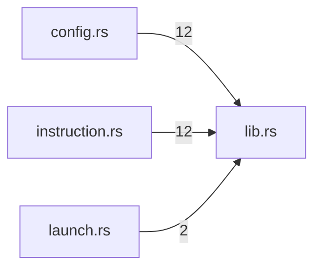

# profile — generated atlas

[All packages](../../../../docs/architecture/generated/index.md) · [Maintained explanation](../README.md)

## Cargo targets

| Target | Kind | Entry |
|---|---|---|
| `profile` | lib | [crates/profile/src/lib.rs](../../src/lib.rs) |
| `slice8_launch_bindings` | test | [crates/profile/tests/slice8_launch_bindings.rs](../../tests/slice8_launch_bindings.rs) |
| `storage_layout` | test | [crates/profile/tests/storage_layout.rs](../../tests/storage_layout.rs) |
| `web_search_config` | test | [crates/profile/tests/web_search_config.rs](../../tests/web_search_config.rs) |

## Direct workspace dependencies

| Dependency | Kind | Target cfg |
|---|---|---|
| `schema` | normal | all |
| `store` | normal | all |
| `tools` | normal | all |

[Public/restricted API and direct callers](api.md)

## Source files / lexical modules

`src` files have full symbol/call tables and partitioned function graphs. Integration tests and examples remain in the JSON inventory.
File-derived paths below are lexical navigation, not a compiler-resolved module tree; inline module declarations are listed separately.

| File | Symbols | Call sites | Detail |
|---|---:|---:|---|
| [crates/profile/src/config.rs](../../src/config.rs) | 93 | 895 | [Symbols and calls](src--config.md) |
| [crates/profile/src/instruction.rs](../../src/instruction.rs) | 51 | 459 | [Symbols and calls](src--instruction.md) |
| [crates/profile/src/launch.rs](../../src/launch.rs) | 41 | 287 | [Symbols and calls](src--launch.md) |
| [crates/profile/src/lib.rs](../../src/lib.rs) | 5 | 38 | [Symbols and calls](src--lib.md) |
| [crates/profile/src/resources.rs](../../src/resources.rs) | 40 | 322 | [Symbols and calls](src--resources.md) |
| [crates/profile/tests/slice8_launch_bindings.rs](../../tests/slice8_launch_bindings.rs) | 14 | 87 | `inventory.json` |
| [crates/profile/tests/storage_layout.rs](../../tests/storage_layout.rs) | 11 | 238 | `inventory.json` |
| [crates/profile/tests/web_search_config.rs](../../tests/web_search_config.rs) | 1 | 4 | `inventory.json` |

## Cross-file direct calls

Source files stand in for out-of-line modules; see declarations for inline modules. Counts are syntactic call sites, not runtime frequency.

