# profile::config

[Package atlas](index.md) · [Source](../../src/config.rs)

## Declarations

Visibility is the declaration spelling; trait members and reexports require their enclosing interface. `cfg` is not evaluated.

| Symbol | Kind | Visibility | Test / cfg |
|---|---|---|---|
| [profile::config::FORMAT](../../src/config.rs#L14) | const_item | `private` |  |
| [profile::config::MAX_SAFE_INTEGER](../../src/config.rs#L15) | const_item | `private` |  |
| [profile::config::WorkspacePolicy](../../src/config.rs#L19) | struct_item | `pub` |  |
| [profile::config::WorkspaceFolder](../../src/config.rs#L41) | struct_item | `pub` |  |
| [profile::config::WorkspaceConfig](../../src/config.rs#L48) | struct_item | `pub` |  |
| [profile::config::WorkspaceConfig::folder_paths](../../src/config.rs#L63) | function_item | `pub` |  |
| [profile::config::WorkspaceConfig::binding_for_path](../../src/config.rs#L75) | function_item | `pub` |  |
| [profile::config::WorkspaceConfig::path_for_binding](../../src/config.rs#L89) | function_item | `pub` |  |
| [profile::config::Model](../../src/config.rs#L107) | struct_item | `pub` |  |
| [profile::config::Provider](../../src/config.rs#L117) | struct_item | `pub` |  |
| [profile::config::WebSearch](../../src/config.rs#L136) | struct_item | `pub` |  |
| [profile::config::ProvidersConfig](../../src/config.rs#L144) | struct_item | `pub` |  |
| [profile::config::ProvidersConfig::default](../../src/config.rs#L153) | function_item | `private` |  |
| [profile::config::Limits](../../src/config.rs#L165) | struct_item | `pub` |  |
| [profile::config::SettingsConfig](../../src/config.rs#L174) | struct_item | `pub` |  |
| [profile::config::SessionSettings](../../src/config.rs#L187) | struct_item | `pub` |  |
| [profile::config::SettingsConfig::default](../../src/config.rs#L197) | function_item | `private` |  |
| [profile::config::ResolvedWorkspace](../../src/config.rs#L210) | struct_item | `pub` |  |
| [profile::config::RevisionVector](../../src/config.rs#L229) | struct_item | `pub` |  |
| [profile::config::ignore_legacy_field](../../src/config.rs#L246) | function_item | `private` |  |
| [profile::config::ConfigSnapshot](../../src/config.rs#L252) | struct_item | `pub` |  |
| [profile::config::ConfigSnapshot::execution_cwd](../../src/config.rs#L273) | function_item | `pub` |  |
| [profile::config::ConfigSnapshot::canonical_bytes](../../src/config.rs#L280) | function_item | `pub` |  |
| [profile::config::ConfigSnapshot::digest](../../src/config.rs#L285) | function_item | `pub` |  |
| [profile::config::ConfigSnapshot::decode](../../src/config.rs#L289) | function_item | `pub` |  |
| [profile::config::ConfigSnapshot::publish](../../src/config.rs#L301) | function_item | `pub` |  |
| [profile::config::ConfigSnapshot::requires_respawn_from](../../src/config.rs#L315) | function_item | `pub` |  |
| [profile::config::config_document](../../src/config.rs#L339) | macro_definition | `private` |  |
| [profile::config::ConfigRepository](../../src/config.rs#L366) | struct_item | `pub` |  |
| [profile::config::invalid_private_directory](../../src/config.rs#L370) | function_item | `private` |  |
| [profile::config::validate_private_directory_fd](../../src/config.rs#L377) | function_item | `private` |  |
| [profile::config::rustix_profile_error](../../src/config.rs#L407) | function_item | `private` |  |
| [profile::config::open_directory_at](../../src/config.rs#L411) | function_item | `private` |  |
| [profile::config::open_private_root](../../src/config.rs#L445) | function_item | `private` |  |
| [profile::config::open_private_root_darwin](../../src/config.rs#L531) | function_item | `private` | #[cfg(target_os = "macos")] |
| [profile::config::prepare_repository_directories](../../src/config.rs#L595) | function_item | `private` |  |
| [profile::config::prepare_private_directory](../../src/config.rs#L604) | function_item | `private` |  |
| [profile::config::prepare_workspace_directory](../../src/config.rs#L620) | function_item | `private` |  |
| [profile::config::prepare_existing_workspace_directories](../../src/config.rs#L630) | function_item | `private` |  |
| [profile::config::ConfigRepository::open](../../src/config.rs#L654) | function_item | `pub` |  |
| [profile::config::ConfigRepository::workspace_data_dir](../../src/config.rs#L661) | function_item | `pub` |  |
| [profile::config::ConfigRepository::root](../../src/config.rs#L667) | function_item | `pub` |  |
| [profile::config::ConfigRepository::resolve](../../src/config.rs#L671) | function_item | `pub` |  |
| [profile::config::ConfigRepository::resolve_for_binding](../../src/config.rs#L680) | function_item | `pub` |  |
| [profile::config::ConfigRepository::resolve_for_session](../../src/config.rs#L690) | function_item | `pub` |  |
| [profile::config::ConfigRepository::resolve_for_session_binding](../../src/config.rs#L710) | function_item | `pub` |  |
| [profile::config::ConfigRepository::providers](../../src/config.rs#L727) | function_item | `pub` |  |
| [profile::config::ConfigRepository::settings](../../src/config.rs#L736) | function_item | `pub` |  |
| [profile::config::ConfigRepository::workspace](../../src/config.rs#L746) | function_item | `pub` |  |
| [profile::config::ConfigRepository::workspaces](../../src/config.rs#L761) | function_item | `pub` |  |
| [profile::config::ConfigRepository::resource_workspace_roots](../../src/config.rs#L795) | function_item | `pub` |  |
| [profile::config::ConfigRepository::publish_workspace](../../src/config.rs#L836) | function_item | `pub` |  |
| [profile::config::ConfigRepository::publish_providers](../../src/config.rs#L858) | function_item | `pub` |  |
| [profile::config::ConfigRepository::publish_providers_checked](../../src/config.rs#L873) | function_item | `pub` |  |
| [profile::config::ConfigRepository::publish_settings](../../src/config.rs#L899) | function_item | `pub` |  |
| [profile::config::ConfigRepository::publish_settings_checked](../../src/config.rs#L912) | function_item | `pub` |  |
| [profile::config::ConfigRepository::publish_workspace_policy](../../src/config.rs#L947) | function_item | `pub` |  |
| [profile::config::ConfigRepository::publish_session_settings](../../src/config.rs#L985) | function_item | `pub` |  |
| [profile::config::ConfigRepository::session_settings](../../src/config.rs#L1010) | function_item | `pub` |  |
| [profile::config::ConfigRepository::publish_global](../../src/config.rs#L1023) | function_item | `private` |  |
| [profile::config::ConfigRepository::resolve_unlocked](../../src/config.rs#L1047) | function_item | `private` |  |
| [profile::config::ConfigRepository::read_required](../../src/config.rs#L1121) | function_item | `private` |  |
| [profile::config::ConfigRepository::read_optional](../../src/config.rs#L1125) | function_item | `private` |  |
| [profile::config::ConfigRepository::validate_all_provider_references_unlocked](../../src/config.rs#L1136) | function_item | `private` |  |
| [profile::config::check_publication_revision](../../src/config.rs#L1184) | function_item | `private` |  |
| [profile::config::revision_from_value](../../src/config.rs#L1206) | function_item | `private` |  |
| [profile::config::revision_from_value::RevisionOnly](../../src/config.rs#L1208) | struct_item | `private` |  |
| [profile::config::validate_workspace_id](../../src/config.rs#L1223) | function_item | `private` |  |
| [profile::config::workspace_document_path](../../src/config.rs#L1240) | function_item | `private` |  |
| [profile::config::validate_common](../../src/config.rs#L1246) | function_item | `private` |  |
| [profile::config::validate_workspace](../../src/config.rs#L1268) | function_item | `private` |  |
| [profile::config::validate_providers](../../src/config.rs#L1308) | function_item | `private` |  |
| [profile::config::validate_web_search_origin](../../src/config.rs#L1370) | function_item | `private` |  |
| [profile::config::validate_settings](../../src/config.rs#L1405) | function_item | `private` |  |
| [profile::config::validate_session_settings](../../src/config.rs#L1427) | function_item | `private` |  |
| [profile::config::validate_session_reference](../../src/config.rs#L1441) | function_item | `private` |  |
| [profile::config::validate_references](../../src/config.rs#L1467) | function_item | `private` |  |
| [profile::config::resolve_workspace](../../src/config.rs#L1516) | function_item | `private` |  |
| [profile::config::validate_snapshot](../../src/config.rs#L1568) | function_item | `private` |  |
| [profile::config::validate_safe_integer](../../src/config.rs#L1693) | function_item | `private` |  |
| [profile::config::is_sorted_unique](../../src/config.rs#L1704) | function_item | `private` |  |
| [profile::config::canonical_directory](../../src/config.rs#L1708) | function_item | `private` |  |
| [profile::config::validate_absolute](../../src/config.rs#L1729) | function_item | `private` |  |
| [profile::config::validate_id](../../src/config.rs#L1739) | function_item | `private` |  |
| [profile::config::validate_unique](../../src/config.rs#L1750) | function_item | `private` |  |
| [profile::config::invalid](../../src/config.rs#L1759) | function_item | `private` |  |
| [profile::config::invalid_reference](../../src/config.rs#L1766) | function_item | `private` |  |
| [profile::config::removed](../../src/config.rs#L1773) | function_item | `private` |  |
| [profile::config::lowered](../../src/config.rs#L1778) | function_item | `private` |  |
| [profile::config::enabled_provider_models](../../src/config.rs#L1786) | function_item | `private` |  |
| [profile::config::private_directory_tests::private_directory_rejects_wrong_owner](../../src/config.rs#L1805) | function_item | `private` | test; #[cfg(test)] |
| [profile::config::toolchain_tests::toolchain_roots_are_canonical_deduplicated_and_never_writable_roots](../../src/config.rs#L1821) | function_item | `private` | test; #[cfg(test)] |
| [profile::config::legacy_snapshot_tests::a_snapshot_published_with_the_integrations_file_still_decodes](../../src/config.rs#L1869) | function_item | `private` | test; #[cfg(test)] |

## Imports / reexports

| Local name | Source path | Visibility |
|---|---|---|
| `BTreeSet` | `std::collections::BTreeSet` | `private` |
| `fs` | `std::fs` | `private` |
| `OwnedFd` | `std::os::fd::OwnedFd` | `private` |
| `OpenOptionsExt` | `std::os::unix::fs::OpenOptionsExt` | `private` |
| `Path` | `std::path::Path` | `private` |
| `PathBuf` | `std::path::PathBuf` | `private` |
| `Mode` | `rustix::fs::Mode` | `private` |
| `OFlags` | `rustix::fs::OFlags` | `private` |
| `fchmod` | `rustix::fs::fchmod` | `private` |
| `fstat` | `rustix::fs::fstat` | `private` |
| `mkdirat` | `rustix::fs::mkdirat` | `private` |
| `open` | `rustix::fs::open` | `private` |
| `openat` | `rustix::fs::openat` | `private` |
| `Deserialize` | `serde::Deserialize` | `private` |
| `Serialize` | `serde::Serialize` | `private` |
| `AssetRef` | `store::AssetRef` | `private` |
| `AssetStore` | `store::AssetStore` | `private` |
| `AtomicPublisher` | `store::AtomicPublisher` | `private` |
| `NamedLock` | `store::NamedLock` | `private` |
| `ProfileError` | `crate::ProfileError` | `private` |
| `canonical_line` | `crate::canonical_line` | `private` |
| `digest` | `crate::digest` | `private` |
| `parse_canonical` | `crate::parse_canonical` | `private` |
| `open_private_root` | `super::open_private_root` | `private` |
| `validate_private_directory_fd` | `super::validate_private_directory_fd` | `private` |
| `*` | `super::*` | `private` |
| `*` | `super::*` | `private` |

## Module declarations

| Module | Visibility | Attributes |
|---|---|---|
| `profile::config::private_directory_tests` | `private` | #[cfg(test)] |
| `profile::config::toolchain_tests` | `private` | #[cfg(test)] |
| `profile::config::legacy_snapshot_tests` | `private` | #[cfg(test)] |

## Function call graphs

Edges below are syntactically resolved calls only, including private functions. Graphs partition callers into groups of 20; they are not execution order. All unresolved sites are listed below and in the JSON inventory.

Functions 1–20: 26 direct edges

Functions 21–40: 83 direct edges

Functions 41–60: 68 direct edges

Functions 61–72: 18 direct edges

```mermaid
flowchart TD
  n0["profile::config::validate_workspace_id"]
  n1["profile::config::validate_common"]
  n2["profile::config::validate_providers"]
  n3["profile::config::validate_settings"]
  n4["profile::config::validate_session_settings"]
  n5["profile::config::validate_session_reference"]
  n6["profile::config::validate_references"]
  n7["profile::config::validate_snapshot"]
  n8["profile::config::validate_safe_integer"]
  n9["profile::config::is_sorted_unique"]
  n10["profile::config::canonical_directory"]
  n11["profile::config::validate_absolute"]
  n12["profile::config::validate_id"]
  n13["profile::config::validate_unique"]
  n14["profile::config::invalid"]
  n15["profile::config::invalid_reference"]
  n16["profile::config::removed"]
  n17["profile::config::lowered"]
  n18["profile::config::enabled_provider_models"]
  n7 --> n0
  n7 --> n1
  n7 --> n2
  n7 --> n3
  n7 --> n4
  n7 --> n5
  n7 --> n6
  n7 --> n8
  n7 --> n9
  n7 --> n10
  n7 --> n11
  n7 --> n12
  n7 --> n13
  n7 --> n14
  n8 --> n14
  n10 --> n11
  n12 --> n14
  n13 --> n14
```

## Call sites

Includes test functions (marked in declarations). Receiver-type-required sites need type analysis/manual tracing. Calls in closures are attributed to their enclosing function; their occurrence here does not mean the closure executes immediately.

| Caller | Callee expression | Source lines | Target / classification |
|---|---|---|---|
| `folder_paths` | `self.folders.is_empty` | [64](../../src/config.rs#L64) | receiver-type-required |
| `folder_paths` | `self.cwd.iter().map(String::as_str).collect` | [65](../../src/config.rs#L65) | receiver-type-required |
| `folder_paths` | `self.cwd.iter().map` | [65](../../src/config.rs#L65) | receiver-type-required |
| `folder_paths` | `self.cwd.iter` | [65](../../src/config.rs#L65) | receiver-type-required |
| `folder_paths` | `self.folders                 .iter()                 .map(&#124;folder&#124; folder.path.as_str())                 .collect` | [67](../../src/config.rs#L67) | receiver-type-required |
| `folder_paths` | `self.folders                 .iter()                 .map` | [67](../../src/config.rs#L67) | receiver-type-required |
| `folder_paths` | `self.folders                 .iter` | [67](../../src/config.rs#L67) | receiver-type-required |
| `folder_paths` | `folder.path.as_str` | [69](../../src/config.rs#L69) | receiver-type-required |
| `binding_for_path` | `self.folders             .iter()             .find(&#124;folder&#124; folder.path == path)             .map(&#124;folder&#124; folder.id.clone())             .or_else` | [76](../../src/config.rs#L76) | receiver-type-required |
| `binding_for_path` | `self.folders             .iter()             .find(&#124;folder&#124; folder.path == path)             .map` | [76](../../src/config.rs#L76) | receiver-type-required |
| `binding_for_path` | `self.folders             .iter()             .find` | [76](../../src/config.rs#L76) | receiver-type-required |
| `binding_for_path` | `self.folders             .iter` | [76](../../src/config.rs#L76) | receiver-type-required |
| `binding_for_path` | `folder.id.clone` | [79](../../src/config.rs#L79) | receiver-type-required |
| `binding_for_path` | `self.cwd                     .iter()                     .position(&#124;candidate&#124; candidate == path)                     .map` | [81](../../src/config.rs#L81) | receiver-type-required |
| `binding_for_path` | `self.cwd                     .iter()                     .position` | [81](../../src/config.rs#L81) | receiver-type-required |
| `binding_for_path` | `self.cwd                     .iter` | [81](../../src/config.rs#L81) | receiver-type-required |
| `path_for_binding` | `self.folders.is_empty` | [90](../../src/config.rs#L90) | receiver-type-required |
| `path_for_binding` | `self.cwd                 .iter()                 .enumerate()                 .find(&#124;(index, _)&#124; binding == format!("folder-{:04}", index + 1))                 .map` | [91](../../src/config.rs#L91) | receiver-type-required |
| `path_for_binding` | `self.cwd                 .iter()                 .enumerate()                 .find` | [91](../../src/config.rs#L91) | receiver-type-required |
| `path_for_binding` | `self.cwd                 .iter()                 .enumerate` | [91](../../src/config.rs#L91) | receiver-type-required |
| `path_for_binding` | `self.cwd                 .iter` | [91](../../src/config.rs#L91) | receiver-type-required |
| `path_for_binding` | `path.as_str` | [95](../../src/config.rs#L95) | receiver-type-required |
| `path_for_binding` | `self.folders                 .iter()                 .find(&#124;folder&#124; folder.id == binding)                 .map` | [97](../../src/config.rs#L97) | receiver-type-required |
| `path_for_binding` | `self.folders                 .iter()                 .find` | [97](../../src/config.rs#L97) | receiver-type-required |
| `path_for_binding` | `self.folders                 .iter` | [97](../../src/config.rs#L97) | receiver-type-required |
| `path_for_binding` | `folder.path.as_str` | [100](../../src/config.rs#L100) | receiver-type-required |
| `default` | `Vec::new` | [157](../../src/config.rs#L157) | external-constructor-callback-or-unresolved |
| `ignore_legacy_field` | `serde::de::IgnoredAny::deserialize(deserializer).map` | [247](../../src/config.rs#L247) | receiver-type-required |
| `ignore_legacy_field` | `serde::de::IgnoredAny::deserialize` | [247](../../src/config.rs#L247) | external-constructor-callback-or-unresolved |
| `execution_cwd` | `self.workspace             .selected_cwd             .as_deref()             .or_else` | [274](../../src/config.rs#L274) | receiver-type-required |
| `execution_cwd` | `self.workspace             .selected_cwd             .as_deref` | [274](../../src/config.rs#L274) | receiver-type-required |
| `execution_cwd` | `self.workspace.cwd.first().map` | [277](../../src/config.rs#L277) | receiver-type-required |
| `execution_cwd` | `self.workspace.cwd.first` | [277](../../src/config.rs#L277) | receiver-type-required |
| `canonical_bytes` | `validate_snapshot` | [281](../../src/config.rs#L281) | [profile::config::validate_snapshot](../../src/config.rs#L1568) |
| `canonical_bytes` | `canonical_line` | [282](../../src/config.rs#L282) | [profile::canonical_line](../../src/lib.rs#L109) |
| `digest` | `Ok` | [286](../../src/config.rs#L286) | external-constructor-callback-or-unresolved |
| `digest` | `digest` | [286](../../src/config.rs#L286) | [profile::digest](../../src/lib.rs#L123) |
| `digest` | `self.canonical_bytes` | [286](../../src/config.rs#L286) | [profile::config::ConfigSnapshot::canonical_bytes](../../src/config.rs#L280) |
| `decode` | `parse_canonical` | [290](../../src/config.rs#L290) | [profile::parse_canonical](../../src/lib.rs#L64) |
| `decode` | `Err` | [292](../../src/config.rs#L292) | external-constructor-callback-or-unresolved |
| `decode` | `PathBuf::from` | [293](../../src/config.rs#L293) | external-constructor-callback-or-unresolved |
| `decode` | `validate_snapshot` | [297](../../src/config.rs#L297) | [profile::config::validate_snapshot](../../src/config.rs#L1568) |
| `decode` | `Ok` | [298](../../src/config.rs#L298) | external-constructor-callback-or-unresolved |
| `publish` | `self.canonical_bytes` | [302](../../src/config.rs#L302) | [profile::config::ConfigSnapshot::canonical_bytes](../../src/config.rs#L280) |
| `publish` | `digest` | [303](../../src/config.rs#L303) | external-constructor-callback-or-unresolved |
| `publish` | `assets.publish` | [304](../../src/config.rs#L304) | receiver-type-required |
| `publish` | `Err` | [306](../../src/config.rs#L306) | external-constructor-callback-or-unresolved |
| `publish` | `Ok` | [311](../../src/config.rs#L311) | external-constructor-callback-or-unresolved |
| `requires_respawn_from` | `removed` | [319](../../src/config.rs#L319), [321](../../src/config.rs#L321) | [profile::config::removed](../../src/config.rs#L1773) |
| `requires_respawn_from` | `lowered` | [322](../../src/config.rs#L322) | [profile::config::lowered](../../src/config.rs#L1778) |
| `requires_respawn_from` | `enabled_provider_models` | [328](../../src/config.rs#L328), [329](../../src/config.rs#L329) | [profile::config::enabled_provider_models](../../src/config.rs#L1786) |
| `requires_respawn_from` | `old_providers.is_subset` | [330](../../src/config.rs#L330) | receiver-type-required |
| `requires_respawn_from` | `previous                 .providers                 .web_search                 .as_ref()                 .is_some_and` | [331](../../src/config.rs#L331) | receiver-type-required |
| `requires_respawn_from` | `previous                 .providers                 .web_search                 .as_ref` | [331](../../src/config.rs#L331) | receiver-type-required |
| `requires_respawn_from` | `self.providers.web_search.as_ref` | [335](../../src/config.rs#L335) | receiver-type-required |
| `requires_respawn_from` | `Some` | [335](../../src/config.rs#L335) | external-constructor-callback-or-unresolved |
| `invalid_private_directory` | `path.to_path_buf` | [372](../../src/config.rs#L372) | receiver-type-required |
| `invalid_private_directory` | `reason.to_owned` | [373](../../src/config.rs#L373) | receiver-type-required |
| `validate_private_directory_fd` | `fstat(descriptor).map_err` | [382](../../src/config.rs#L382) | receiver-type-required |
| `validate_private_directory_fd` | `fstat` | [382](../../src/config.rs#L382) | external-constructor-callback-or-unresolved |
| `validate_private_directory_fd` | `Err` | [384](../../src/config.rs#L384), [390](../../src/config.rs#L390), [396](../../src/config.rs#L396) | external-constructor-callback-or-unresolved |
| `validate_private_directory_fd` | `invalid_private_directory` | [384](../../src/config.rs#L384), [390](../../src/config.rs#L390), [396](../../src/config.rs#L396) | [profile::config::invalid_private_directory](../../src/config.rs#L370) |
| `validate_private_directory_fd` | `fchmod(descriptor, Mode::RWXU).map_err` | [403](../../src/config.rs#L403) | receiver-type-required |
| `validate_private_directory_fd` | `fchmod` | [403](../../src/config.rs#L403) | external-constructor-callback-or-unresolved |
| `validate_private_directory_fd` | `Ok` | [404](../../src/config.rs#L404) | external-constructor-callback-or-unresolved |
| `rustix_profile_error` | `std::io::Error::from_raw_os_error(error.raw_os_error()).into` | [408](../../src/config.rs#L408) | receiver-type-required |
| `rustix_profile_error` | `std::io::Error::from_raw_os_error` | [408](../../src/config.rs#L408) | external-constructor-callback-or-unresolved |
| `rustix_profile_error` | `error.raw_os_error` | [408](../../src/config.rs#L408) | receiver-type-required |
| `open_directory_at` | `openat` | [419](../../src/config.rs#L419), [429](../../src/config.rs#L429) | external-constructor-callback-or-unresolved |
| `open_directory_at` | `Mode::empty` | [419](../../src/config.rs#L419), [429](../../src/config.rs#L429) | external-constructor-callback-or-unresolved |
| `open_directory_at` | `result         .as_ref()         .is_err_and` | [420](../../src/config.rs#L420) | receiver-type-required |
| `open_directory_at` | `result         .as_ref` | [420](../../src/config.rs#L420) | receiver-type-required |
| `open_directory_at` | `mkdirat` | [425](../../src/config.rs#L425) | external-constructor-callback-or-unresolved |
| `open_directory_at` | `Err` | [427](../../src/config.rs#L427), [434](../../src/config.rs#L434), [439](../../src/config.rs#L439) | external-constructor-callback-or-unresolved |
| `open_directory_at` | `rustix_profile_error` | [427](../../src/config.rs#L427), [439](../../src/config.rs#L439) | [profile::config::rustix_profile_error](../../src/config.rs#L407) |
| `open_directory_at` | `invalid_private_directory` | [434](../../src/config.rs#L434) | [profile::config::invalid_private_directory](../../src/config.rs#L370) |
| `open_directory_at` | `validate_private_directory_fd` | [441](../../src/config.rs#L441) | [profile::config::validate_private_directory_fd](../../src/config.rs#L377) |
| `open_directory_at` | `Ok` | [442](../../src/config.rs#L442) | external-constructor-callback-or-unresolved |
| `open_private_root` | `path.is_absolute` | [451](../../src/config.rs#L451), [462](../../src/config.rs#L462), [492](../../src/config.rs#L492) | receiver-type-required |
| `open_private_root` | `open_private_root_darwin` | [452](../../src/config.rs#L452) | [profile::config::open_private_root_darwin](../../src/config.rs#L531) |
| `open_private_root` | `path.strip_prefix("/var").map_or_else` | [455](../../src/config.rs#L455) | receiver-type-required |
| `open_private_root` | `path.strip_prefix` | [455](../../src/config.rs#L455) | receiver-type-required |
| `open_private_root` | `path.to_path_buf` | [456](../../src/config.rs#L456), [460](../../src/config.rs#L460) | receiver-type-required |
| `open_private_root` | `Path::new("/private/var").join` | [457](../../src/config.rs#L457) | receiver-type-required |
| `open_private_root` | `Path::new` | [457](../../src/config.rs#L457) | external-constructor-callback-or-unresolved |
| `open_private_root` | `open("/", flags, Mode::empty()).map_err` | [463](../../src/config.rs#L463) | receiver-type-required |
| `open_private_root` | `open` | [463](../../src/config.rs#L463), [465](../../src/config.rs#L465) | external-constructor-callback-or-unresolved |
| `open_private_root` | `Mode::empty` | [463](../../src/config.rs#L463), [465](../../src/config.rs#L465), [500](../../src/config.rs#L500), [511](../../src/config.rs#L511) | external-constructor-callback-or-unresolved |
| `open_private_root` | `open(".", flags, Mode::empty()).map_err` | [465](../../src/config.rs#L465) | receiver-type-required |
| `open_private_root` | `Vec::new` | [467](../../src/config.rs#L467) | external-constructor-callback-or-unresolved |
| `open_private_root` | `traversal_path.components` | [468](../../src/config.rs#L468) | receiver-type-required |
| `open_private_root` | `value.to_str().ok_or_else` | [472](../../src/config.rs#L472) | receiver-type-required |
| `open_private_root` | `value.to_str` | [472](../../src/config.rs#L472) | receiver-type-required |
| `open_private_root` | `invalid_private_directory` | [473](../../src/config.rs#L473), [478](../../src/config.rs#L478), [486](../../src/config.rs#L486), [518](../../src/config.rs#L518) | [profile::config::invalid_private_directory](../../src/config.rs#L370) |
| `open_private_root` | `components.push` | [475](../../src/config.rs#L475) | receiver-type-required |
| `open_private_root` | `value.to_owned` | [475](../../src/config.rs#L475) | receiver-type-required |
| `open_private_root` | `Err` | [478](../../src/config.rs#L478), [486](../../src/config.rs#L486), [509](../../src/config.rs#L509), [518](../../src/config.rs#L518), [523](../../src/config.rs#L523) | external-constructor-callback-or-unresolved |
| `open_private_root` | `components.is_empty` | [485](../../src/config.rs#L485) | receiver-type-required |
| `open_private_root` | `PathBuf::from` | [493](../../src/config.rs#L493), [495](../../src/config.rs#L495) | external-constructor-callback-or-unresolved |
| `open_private_root` | `components.len` | [497](../../src/config.rs#L497) | receiver-type-required |
| `open_private_root` | `components.into_iter().enumerate` | [498](../../src/config.rs#L498) | receiver-type-required |
| `open_private_root` | `components.into_iter` | [498](../../src/config.rs#L498) | receiver-type-required |
| `open_private_root` | `traversed.push` | [499](../../src/config.rs#L499) | receiver-type-required |
| `open_private_root` | `openat` | [500](../../src/config.rs#L500), [511](../../src/config.rs#L511) | external-constructor-callback-or-unresolved |
| `open_private_root` | `result             .as_ref()             .is_err_and` | [501](../../src/config.rs#L501) | receiver-type-required |
| `open_private_root` | `result             .as_ref` | [501](../../src/config.rs#L501) | receiver-type-required |
| `open_private_root` | `mkdirat` | [507](../../src/config.rs#L507) | external-constructor-callback-or-unresolved |
| `open_private_root` | `rustix_profile_error` | [509](../../src/config.rs#L509), [523](../../src/config.rs#L523) | [profile::config::rustix_profile_error](../../src/config.rs#L407) |
| `open_private_root` | `validate_private_directory_fd` | [526](../../src/config.rs#L526) | [profile::config::validate_private_directory_fd](../../src/config.rs#L377) |
| `open_private_root` | `Ok` | [527](../../src/config.rs#L527) | external-constructor-callback-or-unresolved |
| `open_private_root_darwin` | `path.strip_prefix("/var").map_or_else` | [536](../../src/config.rs#L536) | receiver-type-required |
| `open_private_root_darwin` | `path.strip_prefix` | [536](../../src/config.rs#L536) | receiver-type-required |
| `open_private_root_darwin` | `path.to_path_buf` | [537](../../src/config.rs#L537) | receiver-type-required |
| `open_private_root_darwin` | `Path::new("/private/var").join` | [538](../../src/config.rs#L538) | receiver-type-required |
| `open_private_root_darwin` | `Path::new` | [538](../../src/config.rs#L538) | external-constructor-callback-or-unresolved |
| `open_private_root_darwin` | `path.components().any` | [540](../../src/config.rs#L540) | receiver-type-required |
| `open_private_root_darwin` | `path.components` | [540](../../src/config.rs#L540) | receiver-type-required |
| `open_private_root_darwin` | `Err` | [546](../../src/config.rs#L546), [552](../../src/config.rs#L552), [579](../../src/config.rs#L579), [584](../../src/config.rs#L584), [589](../../src/config.rs#L589) | external-constructor-callback-or-unresolved |
| `open_private_root_darwin` | `invalid_private_directory` | [546](../../src/config.rs#L546), [552](../../src/config.rs#L552), [571](../../src/config.rs#L571), [576](../../src/config.rs#L576), [584](../../src/config.rs#L584) | [profile::config::invalid_private_directory](../../src/config.rs#L370) |
| `open_private_root_darwin` | `path.file_name().is_none` | [551](../../src/config.rs#L551) | receiver-type-required |
| `open_private_root_darwin` | `path.file_name` | [551](../../src/config.rs#L551) | receiver-type-required |
| `open_private_root_darwin` | `fs::OpenOptions::new()             .read(true)             .custom_flags(libc::O_DIRECTORY &#124; libc::O_NOFOLLOW_ANY &#124; libc::O_CLOEXEC)             .open` | [561](../../src/config.rs#L561) | receiver-type-required |
| `open_private_root_darwin` | `fs::OpenOptions::new()             .read(true)             .custom_flags` | [561](../../src/config.rs#L561) | receiver-type-required |
| `open_private_root_darwin` | `fs::OpenOptions::new()             .read` | [561](../../src/config.rs#L561) | receiver-type-required |
| `open_private_root_darwin` | `fs::OpenOptions::new` | [561](../../src/config.rs#L561) | external-constructor-callback-or-unresolved |
| `open_private_root_darwin` | `Ok` | [565](../../src/config.rs#L565), [592](../../src/config.rs#L592) | external-constructor-callback-or-unresolved |
| `open_private_root_darwin` | `file.into` | [565](../../src/config.rs#L565) | receiver-type-required |
| `open_private_root_darwin` | `open_directory` | [567](../../src/config.rs#L567), [573](../../src/config.rs#L573), [581](../../src/config.rs#L581) | external-constructor-callback-or-unresolved |
| `open_private_root_darwin` | `error.kind` | [569](../../src/config.rs#L569) | receiver-type-required |
| `open_private_root_darwin` | `path.parent().ok_or_else` | [570](../../src/config.rs#L570) | receiver-type-required |
| `open_private_root_darwin` | `path.parent` | [570](../../src/config.rs#L570) | receiver-type-required |
| `open_private_root_darwin` | `open_directory(parent_path).map_err` | [573](../../src/config.rs#L573) | receiver-type-required |
| `open_private_root_darwin` | `path                 .file_name()                 .ok_or_else` | [574](../../src/config.rs#L574) | receiver-type-required |
| `open_private_root_darwin` | `path                 .file_name` | [574](../../src/config.rs#L574) | receiver-type-required |
| `open_private_root_darwin` | `mkdirat` | [577](../../src/config.rs#L577) | external-constructor-callback-or-unresolved |
| `open_private_root_darwin` | `rustix_profile_error` | [579](../../src/config.rs#L579) | [profile::config::rustix_profile_error](../../src/config.rs#L407) |
| `open_private_root_darwin` | `open_directory(&path).map_err` | [581](../../src/config.rs#L581) | receiver-type-required |
| `open_private_root_darwin` | `error.raw_os_error` | [583](../../src/config.rs#L583) | receiver-type-required |
| `open_private_root_darwin` | `Some` | [583](../../src/config.rs#L583) | external-constructor-callback-or-unresolved |
| `open_private_root_darwin` | `ProfileError::from` | [589](../../src/config.rs#L589) | external-constructor-callback-or-unresolved |
| `open_private_root_darwin` | `validate_private_directory_fd` | [591](../../src/config.rs#L591) | [profile::config::validate_private_directory_fd](../../src/config.rs#L377) |
| `prepare_repository_directories` | `rustix::process::geteuid().as_raw` | [596](../../src/config.rs#L596) | receiver-type-required |
| `prepare_repository_directories` | `rustix::process::geteuid` | [596](../../src/config.rs#L596) | external-constructor-callback-or-unresolved |
| `prepare_repository_directories` | `open_private_root` | [597](../../src/config.rs#L597) | [profile::config::open_private_root](../../src/config.rs#L445) |
| `prepare_repository_directories` | `open_directory_at` | [599](../../src/config.rs#L599) | [profile::config::open_directory_at](../../src/config.rs#L411) |
| `prepare_repository_directories` | `root.join` | [599](../../src/config.rs#L599) | receiver-type-required |
| `prepare_repository_directories` | `Ok` | [601](../../src/config.rs#L601) | external-constructor-callback-or-unresolved |
| `prepare_private_directory` | `path         .parent()         .ok_or_else` | [605](../../src/config.rs#L605) | receiver-type-required |
| `prepare_private_directory` | `path         .parent` | [605](../../src/config.rs#L605) | receiver-type-required |
| `prepare_private_directory` | `invalid_private_directory` | [607](../../src/config.rs#L607), [612](../../src/config.rs#L612) | [profile::config::invalid_private_directory](../../src/config.rs#L370) |
| `prepare_private_directory` | `path         .file_name()         .and_then(std::ffi::OsStr::to_str)         .ok_or_else` | [608](../../src/config.rs#L608) | receiver-type-required |
| `prepare_private_directory` | `path         .file_name()         .and_then` | [608](../../src/config.rs#L608) | receiver-type-required |
| `prepare_private_directory` | `path         .file_name` | [608](../../src/config.rs#L608) | receiver-type-required |
| `prepare_private_directory` | `rustix::process::geteuid().as_raw` | [614](../../src/config.rs#L614) | receiver-type-required |
| `prepare_private_directory` | `rustix::process::geteuid` | [614](../../src/config.rs#L614) | external-constructor-callback-or-unresolved |
| `prepare_private_directory` | `open_private_root` | [615](../../src/config.rs#L615) | [profile::config::open_private_root](../../src/config.rs#L445) |
| `prepare_private_directory` | `open_directory_at` | [616](../../src/config.rs#L616) | [profile::config::open_directory_at](../../src/config.rs#L411) |
| `prepare_private_directory` | `Ok` | [617](../../src/config.rs#L617) | external-constructor-callback-or-unresolved |
| `prepare_workspace_directory` | `validate_workspace_id` | [621](../../src/config.rs#L621) | [profile::config::validate_workspace_id](../../src/config.rs#L1223) |
| `prepare_workspace_directory` | `root.join("workspaces").join` | [622](../../src/config.rs#L622) | receiver-type-required |
| `prepare_workspace_directory` | `root.join` | [622](../../src/config.rs#L622) | receiver-type-required |
| `prepare_workspace_directory` | `prepare_private_directory` | [623](../../src/config.rs#L623), [625](../../src/config.rs#L625) | [profile::config::prepare_private_directory](../../src/config.rs#L604) |
| `prepare_workspace_directory` | `directory.join` | [625](../../src/config.rs#L625) | receiver-type-required |
| `prepare_workspace_directory` | `Ok` | [627](../../src/config.rs#L627) | external-constructor-callback-or-unresolved |
| `prepare_existing_workspace_directories` | `root.join` | [631](../../src/config.rs#L631) | receiver-type-required |
| `prepare_existing_workspace_directories` | `fs::read_dir` | [632](../../src/config.rs#L632) | external-constructor-callback-or-unresolved |
| `prepare_existing_workspace_directories` | `entry.path` | [634](../../src/config.rs#L634), [645](../../src/config.rs#L645) | receiver-type-required |
| `prepare_existing_workspace_directories` | `entry.file_type()?.is_symlink` | [635](../../src/config.rs#L635) | receiver-type-required |
| `prepare_existing_workspace_directories` | `entry.file_type` | [635](../../src/config.rs#L635) | receiver-type-required |
| `prepare_existing_workspace_directories` | `entry.file_type()?.is_dir` | [635](../../src/config.rs#L635) | receiver-type-required |
| `prepare_existing_workspace_directories` | `Err` | [636](../../src/config.rs#L636) | external-constructor-callback-or-unresolved |
| `prepare_existing_workspace_directories` | `"workspace authority entry must be a directory".to_owned` | [638](../../src/config.rs#L638) | receiver-type-required |
| `prepare_existing_workspace_directories` | `entry             .file_name()             .into_string()             .map_err` | [641](../../src/config.rs#L641) | receiver-type-required |
| `prepare_existing_workspace_directories` | `entry             .file_name()             .into_string` | [641](../../src/config.rs#L641) | receiver-type-required |
| `prepare_existing_workspace_directories` | `entry             .file_name` | [641](../../src/config.rs#L641) | receiver-type-required |
| `prepare_existing_workspace_directories` | `"workspace authority directory must be UTF-8".to_owned` | [646](../../src/config.rs#L646) | receiver-type-required |
| `prepare_existing_workspace_directories` | `prepare_workspace_directory` | [648](../../src/config.rs#L648) | [profile::config::prepare_workspace_directory](../../src/config.rs#L620) |
| `prepare_existing_workspace_directories` | `Ok` | [650](../../src/config.rs#L650) | external-constructor-callback-or-unresolved |
| `open` | `root.as_ref().to_path_buf` | [655](../../src/config.rs#L655) | receiver-type-required |
| `open` | `root.as_ref` | [655](../../src/config.rs#L655) | receiver-type-required |
| `open` | `prepare_repository_directories` | [656](../../src/config.rs#L656) | [profile::config::prepare_repository_directories](../../src/config.rs#L595) |
| `open` | `prepare_existing_workspace_directories` | [657](../../src/config.rs#L657) | [profile::config::prepare_existing_workspace_directories](../../src/config.rs#L630) |
| `open` | `Ok` | [658](../../src/config.rs#L658) | external-constructor-callback-or-unresolved |
| `workspace_data_dir` | `validate_workspace_id` | [662](../../src/config.rs#L662) | [profile::config::validate_workspace_id](../../src/config.rs#L1223) |
| `workspace_data_dir` | `Ok` | [663](../../src/config.rs#L663) | external-constructor-callback-or-unresolved |
| `workspace_data_dir` | `self.root.join("workspaces").join` | [663](../../src/config.rs#L663) | receiver-type-required |
| `workspace_data_dir` | `self.root.join` | [663](../../src/config.rs#L663) | receiver-type-required |
| `resolve` | `validate_workspace_id` | [672](../../src/config.rs#L672) | [profile::config::validate_workspace_id](../../src/config.rs#L1223) |
| `resolve` | `NamedLock::shared` | [673](../../src/config.rs#L673) | [store::platform::NamedLock::shared](../../../store/src/platform.rs#L99) |
| `resolve` | `self.root.join` | [673](../../src/config.rs#L673) | receiver-type-required |
| `resolve` | `self.resolve_unlocked` | [674](../../src/config.rs#L674) | [profile::config::ConfigRepository::resolve_unlocked](../../src/config.rs#L1047) |
| `resolve_for_binding` | `validate_workspace_id` | [685](../../src/config.rs#L685) | [profile::config::validate_workspace_id](../../src/config.rs#L1223) |
| `resolve_for_binding` | `NamedLock::shared` | [686](../../src/config.rs#L686) | [store::platform::NamedLock::shared](../../../store/src/platform.rs#L99) |
| `resolve_for_binding` | `self.root.join` | [686](../../src/config.rs#L686) | receiver-type-required |
| `resolve_for_binding` | `self.resolve_unlocked` | [687](../../src/config.rs#L687) | [profile::config::ConfigRepository::resolve_unlocked](../../src/config.rs#L1047) |
| `resolve_for_binding` | `Some` | [687](../../src/config.rs#L687) | external-constructor-callback-or-unresolved |
| `resolve_for_session` | `validate_workspace_id` | [695](../../src/config.rs#L695) | [profile::config::validate_workspace_id](../../src/config.rs#L1223) |
| `resolve_for_session` | `NamedLock::shared` | [696](../../src/config.rs#L696) | [store::platform::NamedLock::shared](../../../store/src/platform.rs#L99) |
| `resolve_for_session` | `self.root.join` | [696](../../src/config.rs#L696) | receiver-type-required |
| `resolve_for_session` | `self.resolve_unlocked` | [697](../../src/config.rs#L697) | [profile::config::ConfigRepository::resolve_unlocked](../../src/config.rs#L1047) |
| `resolve_for_session` | `Some` | [697](../../src/config.rs#L697) | external-constructor-callback-or-unresolved |
| `resolve_for_session` | `session_folder.as_ref` | [697](../../src/config.rs#L697), [700](../../src/config.rs#L700) | receiver-type-required |
| `resolve_for_session` | `snapshot.workspace.cwd.len` | [698](../../src/config.rs#L698) | receiver-type-required |
| `resolve_for_session` | `Err` | [699](../../src/config.rs#L699) | external-constructor-callback-or-unresolved |
| `resolve_for_session` | `session_folder.as_ref().to_path_buf` | [700](../../src/config.rs#L700) | receiver-type-required |
| `resolve_for_session` | `"multi-folder session has no stable folder binding".to_owned` | [701](../../src/config.rs#L701) | receiver-type-required |
| `resolve_for_session` | `Ok` | [704](../../src/config.rs#L704) | external-constructor-callback-or-unresolved |
| `resolve_for_session_binding` | `validate_workspace_id` | [716](../../src/config.rs#L716) | [profile::config::validate_workspace_id](../../src/config.rs#L1223) |
| `resolve_for_session_binding` | `NamedLock::shared` | [717](../../src/config.rs#L717) | [store::platform::NamedLock::shared](../../../store/src/platform.rs#L99) |
| `resolve_for_session_binding` | `self.root.join` | [717](../../src/config.rs#L717) | receiver-type-required |
| `resolve_for_session_binding` | `self.resolve_unlocked` | [718](../../src/config.rs#L718) | [profile::config::ConfigRepository::resolve_unlocked](../../src/config.rs#L1047) |
| `resolve_for_session_binding` | `Some` | [720](../../src/config.rs#L720), [721](../../src/config.rs#L721) | external-constructor-callback-or-unresolved |
| `resolve_for_session_binding` | `session_folder.as_ref` | [720](../../src/config.rs#L720) | receiver-type-required |
| `providers` | `NamedLock::shared` | [728](../../src/config.rs#L728) | [store::platform::NamedLock::shared](../../../store/src/platform.rs#L99) |
| `providers` | `self.root.join` | [728](../../src/config.rs#L728), [729](../../src/config.rs#L729) | receiver-type-required |
| `providers` | `self.read_optional(&path)?.unwrap_or_default` | [730](../../src/config.rs#L730) | receiver-type-required |
| `providers` | `self.read_optional` | [730](../../src/config.rs#L730) | [profile::config::ConfigRepository::read_optional](../../src/config.rs#L1125) |
| `providers` | `validate_providers` | [731](../../src/config.rs#L731) | [profile::config::validate_providers](../../src/config.rs#L1308) |
| `providers` | `Ok` | [732](../../src/config.rs#L732) | external-constructor-callback-or-unresolved |
| `settings` | `NamedLock::shared` | [737](../../src/config.rs#L737) | [store::platform::NamedLock::shared](../../../store/src/platform.rs#L99) |
| `settings` | `self.root.join` | [737](../../src/config.rs#L737), [738](../../src/config.rs#L738) | receiver-type-required |
| `settings` | `self.read_optional(&path)?.unwrap_or_default` | [739](../../src/config.rs#L739) | receiver-type-required |
| `settings` | `self.read_optional` | [739](../../src/config.rs#L739) | [profile::config::ConfigRepository::read_optional](../../src/config.rs#L1125) |
| `settings` | `validate_settings` | [740](../../src/config.rs#L740) | [profile::config::validate_settings](../../src/config.rs#L1405) |
| `settings` | `Ok` | [741](../../src/config.rs#L741) | external-constructor-callback-or-unresolved |
| `workspace` | `validate_workspace_id` | [747](../../src/config.rs#L747) | [profile::config::validate_workspace_id](../../src/config.rs#L1223) |
| `workspace` | `NamedLock::shared` | [748](../../src/config.rs#L748) | [store::platform::NamedLock::shared](../../../store/src/platform.rs#L99) |
| `workspace` | `self.root.join` | [748](../../src/config.rs#L748) | receiver-type-required |
| `workspace` | `workspace_document_path` | [749](../../src/config.rs#L749) | [profile::config::workspace_document_path](../../src/config.rs#L1240) |
| `workspace` | `self.read_required` | [750](../../src/config.rs#L750) | [profile::config::ConfigRepository::read_required](../../src/config.rs#L1121) |
| `workspace` | `validate_workspace` | [751](../../src/config.rs#L751) | [profile::config::validate_workspace](../../src/config.rs#L1268) |
| `workspace` | `invalid` | [753](../../src/config.rs#L753) | [profile::config::invalid](../../src/config.rs#L1759) |
| `workspace` | `Ok` | [755](../../src/config.rs#L755) | external-constructor-callback-or-unresolved |
| `workspaces` | `NamedLock::shared` | [762](../../src/config.rs#L762) | [store::platform::NamedLock::shared](../../../store/src/platform.rs#L99) |
| `workspaces` | `self.root.join` | [762](../../src/config.rs#L762), [764](../../src/config.rs#L764) | receiver-type-required |
| `workspaces` | `fs::read_dir(self.root.join("workspaces"))?.collect::<Result<Vec<_>, _>>` | [764](../../src/config.rs#L764) | receiver-type-required |
| `workspaces` | `fs::read_dir` | [764](../../src/config.rs#L764) | external-constructor-callback-or-unresolved |
| `workspaces` | `entries.sort_by_key` | [765](../../src/config.rs#L765) | receiver-type-required |
| `workspaces` | `Vec::with_capacity` | [766](../../src/config.rs#L766) | external-constructor-callback-or-unresolved |
| `workspaces` | `entries.len` | [766](../../src/config.rs#L766) | receiver-type-required |
| `workspaces` | `entry.path` | [768](../../src/config.rs#L768) | receiver-type-required |
| `workspaces` | `entry.file_type()?.is_symlink` | [769](../../src/config.rs#L769) | receiver-type-required |
| `workspaces` | `entry.file_type` | [769](../../src/config.rs#L769) | receiver-type-required |
| `workspaces` | `entry.file_type()?.is_dir` | [769](../../src/config.rs#L769) | receiver-type-required |
| `workspaces` | `invalid` | [770](../../src/config.rs#L770), [785](../../src/config.rs#L785) | [profile::config::invalid](../../src/config.rs#L1759) |
| `workspaces` | `entry                     .file_name()                     .into_string()                     .map_err` | [773](../../src/config.rs#L773) | receiver-type-required |
| `workspaces` | `entry                     .file_name()                     .into_string` | [773](../../src/config.rs#L773) | receiver-type-required |
| `workspaces` | `entry                     .file_name` | [773](../../src/config.rs#L773) | receiver-type-required |
| `workspaces` | `directory.clone` | [777](../../src/config.rs#L777) | receiver-type-required |
| `workspaces` | `"workspace authority directory must be UTF-8".to_owned` | [778](../../src/config.rs#L778) | receiver-type-required |
| `workspaces` | `validate_workspace_id` | [780](../../src/config.rs#L780) | [profile::config::validate_workspace_id](../../src/config.rs#L1223) |
| `workspaces` | `directory.join` | [781](../../src/config.rs#L781) | receiver-type-required |
| `workspaces` | `self.read_required` | [782](../../src/config.rs#L782) | [profile::config::ConfigRepository::read_required](../../src/config.rs#L1121) |
| `workspaces` | `validate_workspace` | [783](../../src/config.rs#L783) | [profile::config::validate_workspace](../../src/config.rs#L1268) |
| `workspaces` | `values.push` | [787](../../src/config.rs#L787) | receiver-type-required |
| `workspaces` | `Ok` | [789](../../src/config.rs#L789) | external-constructor-callback-or-unresolved |
| `resource_workspace_roots` | `NamedLock::shared` | [796](../../src/config.rs#L796) | [store::platform::NamedLock::shared](../../../store/src/platform.rs#L99) |
| `resource_workspace_roots` | `self.root.join` | [796](../../src/config.rs#L796), [797](../../src/config.rs#L797) | receiver-type-required |
| `resource_workspace_roots` | `fs::read_dir(&directory)?.collect::<Result<Vec<_>, _>>` | [798](../../src/config.rs#L798) | receiver-type-required |
| `resource_workspace_roots` | `fs::read_dir` | [798](../../src/config.rs#L798) | external-constructor-callback-or-unresolved |
| `resource_workspace_roots` | `entries.sort_by_key` | [799](../../src/config.rs#L799) | receiver-type-required |
| `resource_workspace_roots` | `Vec::new` | [800](../../src/config.rs#L800) | external-constructor-callback-or-unresolved |
| `resource_workspace_roots` | `entry.path` | [802](../../src/config.rs#L802) | receiver-type-required |
| `resource_workspace_roots` | `entry.file_type()?.is_dir` | [803](../../src/config.rs#L803) | receiver-type-required |
| `resource_workspace_roots` | `entry.file_type` | [803](../../src/config.rs#L803) | receiver-type-required |
| `resource_workspace_roots` | `Err` | [804](../../src/config.rs#L804), [821](../../src/config.rs#L821) | external-constructor-callback-or-unresolved |
| `resource_workspace_roots` | `"workspace authority entry must be a directory".to_owned` | [806](../../src/config.rs#L806) | receiver-type-required |
| `resource_workspace_roots` | `directory_path                 .file_name()                 .and_then(&#124;value&#124; value.to_str())                 .ok_or_else` | [809](../../src/config.rs#L809) | receiver-type-required |
| `resource_workspace_roots` | `directory_path                 .file_name()                 .and_then` | [809](../../src/config.rs#L809) | receiver-type-required |
| `resource_workspace_roots` | `directory_path                 .file_name` | [809](../../src/config.rs#L809) | receiver-type-required |
| `resource_workspace_roots` | `value.to_str` | [811](../../src/config.rs#L811) | receiver-type-required |
| `resource_workspace_roots` | `directory_path.clone` | [813](../../src/config.rs#L813) | receiver-type-required |
| `resource_workspace_roots` | `"workspace authority directory must be UTF-8".to_owned` | [814](../../src/config.rs#L814) | receiver-type-required |
| `resource_workspace_roots` | `validate_workspace_id` | [816](../../src/config.rs#L816) | [profile::config::validate_workspace_id](../../src/config.rs#L1223) |
| `resource_workspace_roots` | `workspace_document_path` | [817](../../src/config.rs#L817) | [profile::config::workspace_document_path](../../src/config.rs#L1240) |
| `resource_workspace_roots` | `self.read_required` | [818](../../src/config.rs#L818) | [profile::config::ConfigRepository::read_required](../../src/config.rs#L1121) |
| `resource_workspace_roots` | `validate_workspace` | [819](../../src/config.rs#L819) | [profile::config::validate_workspace](../../src/config.rs#L1268) |
| `resource_workspace_roots` | `"workspace id does not match filename".to_owned` | [823](../../src/config.rs#L823) | receiver-type-required |
| `resource_workspace_roots` | `resolve_workspace(&workspace, &path)?                 .cwd                 .into_iter()                 .map(PathBuf::from)                 .collect::<Vec<_>>` | [826](../../src/config.rs#L826) | receiver-type-required |
| `resource_workspace_roots` | `resolve_workspace(&workspace, &path)?                 .cwd                 .into_iter()                 .map` | [826](../../src/config.rs#L826) | receiver-type-required |
| `resource_workspace_roots` | `resolve_workspace(&workspace, &path)?                 .cwd                 .into_iter` | [826](../../src/config.rs#L826) | receiver-type-required |
| `resource_workspace_roots` | `resolve_workspace` | [826](../../src/config.rs#L826) | [profile::config::resolve_workspace](../../src/config.rs#L1516) |
| `resource_workspace_roots` | `workspaces.push` | [831](../../src/config.rs#L831) | receiver-type-required |
| `resource_workspace_roots` | `workspace_id.to_owned` | [831](../../src/config.rs#L831) | receiver-type-required |
| `resource_workspace_roots` | `Ok` | [833](../../src/config.rs#L833) | external-constructor-callback-or-unresolved |
| `publish_workspace` | `validate_workspace_id` | [841](../../src/config.rs#L841) | [profile::config::validate_workspace_id](../../src/config.rs#L1223) |
| `publish_workspace` | `workspace_document_path` | [842](../../src/config.rs#L842) | [profile::config::workspace_document_path](../../src/config.rs#L1240) |
| `publish_workspace` | `NamedLock::exclusive` | [843](../../src/config.rs#L843) | [store::platform::NamedLock::exclusive](../../../store/src/platform.rs#L103) |
| `publish_workspace` | `self.root.join` | [843](../../src/config.rs#L843) | receiver-type-required |
| `publish_workspace` | `prepare_workspace_directory` | [844](../../src/config.rs#L844) | [profile::config::prepare_workspace_directory](../../src/config.rs#L620) |
| `publish_workspace` | `self.read_optional::<WorkspaceConfig>` | [845](../../src/config.rs#L845) | [profile::config::ConfigRepository::read_optional](../../src/config.rs#L1125) |
| `publish_workspace` | `validate_workspace` | [847](../../src/config.rs#L847), [853](../../src/config.rs#L853) | [profile::config::validate_workspace](../../src/config.rs#L1268) |
| `publish_workspace` | `check_publication_revision` | [852](../../src/config.rs#L852) | [profile::config::check_publication_revision](../../src/config.rs#L1184) |
| `publish_workspace` | `AtomicPublisher::replace` | [854](../../src/config.rs#L854) | [store::atomic::AtomicPublisher::replace](../../../store/src/atomic.rs#L16) |
| `publish_workspace` | `canonical_line` | [854](../../src/config.rs#L854) | [profile::canonical_line](../../src/lib.rs#L109) |
| `publish_workspace` | `Ok` | [855](../../src/config.rs#L855) | external-constructor-callback-or-unresolved |
| `publish_providers` | `self.root.join` | [863](../../src/config.rs#L863) | receiver-type-required |
| `publish_providers` | `self.publish_global` | [864](../../src/config.rs#L864) | [profile::config::ConfigRepository::publish_global](../../src/config.rs#L1023) |
| `publish_providers` | `validate_providers` | [865](../../src/config.rs#L865) | [profile::config::validate_providers](../../src/config.rs#L1308) |
| `publish_providers_checked` | `self.root.join` | [878](../../src/config.rs#L878), [887](../../src/config.rs#L887) | receiver-type-required |
| `publish_providers_checked` | `store::endpoint_management_root(&self.root)?.join` | [882](../../src/config.rs#L882) | receiver-type-required |
| `publish_providers_checked` | `store::endpoint_management_root` | [882](../../src/config.rs#L882) | [store::management_root::endpoint_management_root](../../../store/src/management_root.rs#L47) |
| `publish_providers_checked` | `management_path             .exists()             .then(&#124;&#124; NamedLock::shared(&management_path))             .transpose` | [883](../../src/config.rs#L883) | receiver-type-required |
| `publish_providers_checked` | `management_path             .exists()             .then` | [883](../../src/config.rs#L883) | receiver-type-required |
| `publish_providers_checked` | `management_path             .exists` | [883](../../src/config.rs#L883) | receiver-type-required |
| `publish_providers_checked` | `NamedLock::shared` | [885](../../src/config.rs#L885) | [store::platform::NamedLock::shared](../../../store/src/platform.rs#L99) |
| `publish_providers_checked` | `NamedLock::exclusive` | [887](../../src/config.rs#L887) | [store::platform::NamedLock::exclusive](../../../store/src/platform.rs#L103) |
| `publish_providers_checked` | `self             .read_optional::<ProvidersConfig>(&path)?             .unwrap_or_default` | [888](../../src/config.rs#L888) | receiver-type-required |
| `publish_providers_checked` | `self             .read_optional::<ProvidersConfig>` | [888](../../src/config.rs#L888) | [profile::config::ConfigRepository::read_optional](../../src/config.rs#L1125) |
| `publish_providers_checked` | `validate_providers` | [891](../../src/config.rs#L891), [893](../../src/config.rs#L893) | [profile::config::validate_providers](../../src/config.rs#L1308) |
| `publish_providers_checked` | `check_publication_revision` | [892](../../src/config.rs#L892) | [profile::config::check_publication_revision](../../src/config.rs#L1184) |
| `publish_providers_checked` | `self.validate_all_provider_references_unlocked` | [894](../../src/config.rs#L894) | [profile::config::ConfigRepository::validate_all_provider_references_unlocked](../../src/config.rs#L1136) |
| `publish_providers_checked` | `AtomicPublisher::replace` | [895](../../src/config.rs#L895) | [store::atomic::AtomicPublisher::replace](../../../store/src/atomic.rs#L16) |
| `publish_providers_checked` | `canonical_line` | [895](../../src/config.rs#L895) | [profile::canonical_line](../../src/lib.rs#L109) |
| `publish_providers_checked` | `Ok` | [896](../../src/config.rs#L896) | external-constructor-callback-or-unresolved |
| `publish_settings` | `self.root.join` | [904](../../src/config.rs#L904) | receiver-type-required |
| `publish_settings` | `self.publish_global` | [905](../../src/config.rs#L905) | [profile::config::ConfigRepository::publish_global](../../src/config.rs#L1023) |
| `publish_settings` | `validate_settings` | [906](../../src/config.rs#L906) | [profile::config::validate_settings](../../src/config.rs#L1405) |
| `publish_settings_checked` | `self.root.join` | [917](../../src/config.rs#L917), [918](../../src/config.rs#L918), [919](../../src/config.rs#L919) | receiver-type-required |
| `publish_settings_checked` | `NamedLock::exclusive` | [919](../../src/config.rs#L919) | [store::platform::NamedLock::exclusive](../../../store/src/platform.rs#L103) |
| `publish_settings_checked` | `self             .read_optional::<SettingsConfig>(&path)?             .unwrap_or_default` | [920](../../src/config.rs#L920) | receiver-type-required |
| `publish_settings_checked` | `self             .read_optional::<SettingsConfig>` | [920](../../src/config.rs#L920) | [profile::config::ConfigRepository::read_optional](../../src/config.rs#L1125) |
| `publish_settings_checked` | `validate_settings` | [923](../../src/config.rs#L923), [925](../../src/config.rs#L925) | [profile::config::validate_settings](../../src/config.rs#L1405) |
| `publish_settings_checked` | `check_publication_revision` | [924](../../src/config.rs#L924) | [profile::config::check_publication_revision](../../src/config.rs#L1184) |
| `publish_settings_checked` | `self             .read_optional::<ProvidersConfig>(&providers_path)?             .unwrap_or_default` | [926](../../src/config.rs#L926) | receiver-type-required |
| `publish_settings_checked` | `self             .read_optional::<ProvidersConfig>` | [926](../../src/config.rs#L926) | [profile::config::ConfigRepository::read_optional](../../src/config.rs#L1125) |
| `publish_settings_checked` | `validate_providers` | [929](../../src/config.rs#L929) | [profile::config::validate_providers](../../src/config.rs#L1308) |
| `publish_settings_checked` | `"reference-check".to_owned` | [933](../../src/config.rs#L933), [934](../../src/config.rs#L934) | receiver-type-required |
| `publish_settings_checked` | `Vec::new` | [936](../../src/config.rs#L936) | external-constructor-callback-or-unresolved |
| `publish_settings_checked` | `validate_references` | [939](../../src/config.rs#L939) | [profile::config::validate_references](../../src/config.rs#L1467) |
| `publish_settings_checked` | `AtomicPublisher::replace` | [940](../../src/config.rs#L940) | [store::atomic::AtomicPublisher::replace](../../../store/src/atomic.rs#L16) |
| `publish_settings_checked` | `canonical_line` | [940](../../src/config.rs#L940) | [profile::canonical_line](../../src/lib.rs#L109) |
| `publish_settings_checked` | `Ok` | [941](../../src/config.rs#L941) | external-constructor-callback-or-unresolved |
| `publish_workspace_policy` | `validate_workspace_id` | [953](../../src/config.rs#L953) | [profile::config::validate_workspace_id](../../src/config.rs#L1223) |
| `publish_workspace_policy` | `workspace_document_path` | [954](../../src/config.rs#L954) | [profile::config::workspace_document_path](../../src/config.rs#L1240) |
| `publish_workspace_policy` | `self.root.join` | [955](../../src/config.rs#L955), [956](../../src/config.rs#L956), [957](../../src/config.rs#L957) | receiver-type-required |
| `publish_workspace_policy` | `NamedLock::exclusive` | [957](../../src/config.rs#L957) | [store::platform::NamedLock::exclusive](../../../store/src/platform.rs#L103) |
| `publish_workspace_policy` | `self.read_required` | [958](../../src/config.rs#L958) | [profile::config::ConfigRepository::read_required](../../src/config.rs#L1121) |
| `publish_workspace_policy` | `validate_workspace` | [959](../../src/config.rs#L959), [971](../../src/config.rs#L971) | [profile::config::validate_workspace](../../src/config.rs#L1268) |
| `publish_workspace_policy` | `value                 .revision                 .checked_add(1)                 .ok_or_else` | [961](../../src/config.rs#L961) | receiver-type-required |
| `publish_workspace_policy` | `value                 .revision                 .checked_add` | [961](../../src/config.rs#L961) | receiver-type-required |
| `publish_workspace_policy` | `path.clone` | [965](../../src/config.rs#L965) | receiver-type-required |
| `publish_workspace_policy` | `"workspace revision overflow".to_owned` | [966](../../src/config.rs#L966) | receiver-type-required |
| `publish_workspace_policy` | `check_publication_revision` | [968](../../src/config.rs#L968) | [profile::config::check_publication_revision](../../src/config.rs#L1184) |
| `publish_workspace_policy` | `Some` | [970](../../src/config.rs#L970) | external-constructor-callback-or-unresolved |
| `publish_workspace_policy` | `self             .read_optional::<ProvidersConfig>(&providers_path)?             .unwrap_or_default` | [972](../../src/config.rs#L972) | receiver-type-required |
| `publish_workspace_policy` | `self             .read_optional::<ProvidersConfig>` | [972](../../src/config.rs#L972) | [profile::config::ConfigRepository::read_optional](../../src/config.rs#L1125) |
| `publish_workspace_policy` | `self             .read_optional::<SettingsConfig>(&settings_path)?             .unwrap_or_default` | [975](../../src/config.rs#L975) | receiver-type-required |
| `publish_workspace_policy` | `self             .read_optional::<SettingsConfig>` | [975](../../src/config.rs#L975) | [profile::config::ConfigRepository::read_optional](../../src/config.rs#L1125) |
| `publish_workspace_policy` | `validate_providers` | [978](../../src/config.rs#L978) | [profile::config::validate_providers](../../src/config.rs#L1308) |
| `publish_workspace_policy` | `validate_settings` | [979](../../src/config.rs#L979) | [profile::config::validate_settings](../../src/config.rs#L1405) |
| `publish_workspace_policy` | `validate_references` | [980](../../src/config.rs#L980) | [profile::config::validate_references](../../src/config.rs#L1467) |
| `publish_workspace_policy` | `AtomicPublisher::replace` | [981](../../src/config.rs#L981) | [store::atomic::AtomicPublisher::replace](../../../store/src/atomic.rs#L16) |
| `publish_workspace_policy` | `canonical_line` | [981](../../src/config.rs#L981) | [profile::canonical_line](../../src/lib.rs#L109) |
| `publish_workspace_policy` | `Ok` | [982](../../src/config.rs#L982) | external-constructor-callback-or-unresolved |
| `publish_session_settings` | `store::session_settings_path` | [991](../../src/config.rs#L991) | [store::management_root::session_settings_path](../../../store/src/management_root.rs#L57) |
| `publish_session_settings` | `session_folder.as_ref` | [991](../../src/config.rs#L991) | receiver-type-required |
| `publish_session_settings` | `NamedLock::exclusive` | [992](../../src/config.rs#L992) | [store::platform::NamedLock::exclusive](../../../store/src/platform.rs#L103) |
| `publish_session_settings` | `self.root.join` | [992](../../src/config.rs#L992), [1002](../../src/config.rs#L1002) | receiver-type-required |
| `publish_session_settings` | `self.read_optional::<SessionSettings>` | [993](../../src/config.rs#L993) | [profile::config::ConfigRepository::read_optional](../../src/config.rs#L1125) |
| `publish_session_settings` | `validate_session_settings` | [995](../../src/config.rs#L995), [1001](../../src/config.rs#L1001) | [profile::config::validate_session_settings](../../src/config.rs#L1427) |
| `publish_session_settings` | `check_publication_revision` | [1000](../../src/config.rs#L1000) | [profile::config::check_publication_revision](../../src/config.rs#L1184) |
| `publish_session_settings` | `self.read_optional(&providers_path)?.unwrap_or_default` | [1003](../../src/config.rs#L1003) | receiver-type-required |
| `publish_session_settings` | `self.read_optional` | [1003](../../src/config.rs#L1003) | [profile::config::ConfigRepository::read_optional](../../src/config.rs#L1125) |
| `publish_session_settings` | `validate_providers` | [1004](../../src/config.rs#L1004) | [profile::config::validate_providers](../../src/config.rs#L1308) |
| `publish_session_settings` | `validate_session_reference` | [1005](../../src/config.rs#L1005) | [profile::config::validate_session_reference](../../src/config.rs#L1441) |
| `publish_session_settings` | `Some` | [1005](../../src/config.rs#L1005) | external-constructor-callback-or-unresolved |
| `publish_session_settings` | `value.clone` | [1005](../../src/config.rs#L1005) | receiver-type-required |
| `publish_session_settings` | `AtomicPublisher::replace` | [1006](../../src/config.rs#L1006) | [store::atomic::AtomicPublisher::replace](../../../store/src/atomic.rs#L16) |
| `publish_session_settings` | `canonical_line` | [1006](../../src/config.rs#L1006) | [profile::canonical_line](../../src/lib.rs#L109) |
| `publish_session_settings` | `Ok` | [1007](../../src/config.rs#L1007) | external-constructor-callback-or-unresolved |
| `session_settings` | `NamedLock::shared` | [1014](../../src/config.rs#L1014) | [store::platform::NamedLock::shared](../../../store/src/platform.rs#L99) |
| `session_settings` | `self.root.join` | [1014](../../src/config.rs#L1014) | receiver-type-required |
| `session_settings` | `store::session_settings_path` | [1015](../../src/config.rs#L1015) | [store::management_root::session_settings_path](../../../store/src/management_root.rs#L57) |
| `session_settings` | `session_folder.as_ref` | [1015](../../src/config.rs#L1015) | receiver-type-required |
| `session_settings` | `self.read_optional::<SessionSettings>` | [1016](../../src/config.rs#L1016) | [profile::config::ConfigRepository::read_optional](../../src/config.rs#L1125) |
| `session_settings` | `validate_session_settings` | [1018](../../src/config.rs#L1018) | [profile::config::validate_session_settings](../../src/config.rs#L1427) |
| `session_settings` | `Ok` | [1020](../../src/config.rs#L1020) | external-constructor-callback-or-unresolved |
| `publish_global` | `NamedLock::exclusive` | [1031](../../src/config.rs#L1031) | [store::platform::NamedLock::exclusive](../../../store/src/platform.rs#L103) |
| `publish_global` | `self.root.join` | [1031](../../src/config.rs#L1031) | receiver-type-required |
| `publish_global` | `fs::read` | [1032](../../src/config.rs#L1032) | external-constructor-callback-or-unresolved |
| `publish_global` | `parse_canonical` | [1034](../../src/config.rs#L1034) | [profile::parse_canonical](../../src/lib.rs#L64) |
| `publish_global` | `validate` | [1035](../../src/config.rs#L1035), [1042](../../src/config.rs#L1042) | external-constructor-callback-or-unresolved |
| `publish_global` | `revision_from_value` | [1036](../../src/config.rs#L1036) | [profile::config::revision_from_value](../../src/config.rs#L1206) |
| `publish_global` | `error.kind` | [1038](../../src/config.rs#L1038) | receiver-type-required |
| `publish_global` | `Err` | [1039](../../src/config.rs#L1039) | external-constructor-callback-or-unresolved |
| `publish_global` | `error.into` | [1039](../../src/config.rs#L1039) | receiver-type-required |
| `publish_global` | `check_publication_revision` | [1041](../../src/config.rs#L1041) | [profile::config::check_publication_revision](../../src/config.rs#L1184) |
| `publish_global` | `AtomicPublisher::replace` | [1043](../../src/config.rs#L1043) | [store::atomic::AtomicPublisher::replace](../../../store/src/atomic.rs#L16) |
| `publish_global` | `canonical_line` | [1043](../../src/config.rs#L1043) | [profile::canonical_line](../../src/lib.rs#L109) |
| `publish_global` | `Ok` | [1044](../../src/config.rs#L1044) | external-constructor-callback-or-unresolved |
| `resolve_unlocked` | `workspace_document_path` | [1053](../../src/config.rs#L1053) | [profile::config::workspace_document_path](../../src/config.rs#L1240) |
| `resolve_unlocked` | `self.read_required` | [1054](../../src/config.rs#L1054) | [profile::config::ConfigRepository::read_required](../../src/config.rs#L1121) |
| `resolve_unlocked` | `Err` | [1056](../../src/config.rs#L1056), [1096](../../src/config.rs#L1096) | external-constructor-callback-or-unresolved |
| `resolve_unlocked` | `"workspace id does not match filename".to_owned` | [1058](../../src/config.rs#L1058) | receiver-type-required |
| `resolve_unlocked` | `self.root.join` | [1061](../../src/config.rs#L1061), [1062](../../src/config.rs#L1062) | receiver-type-required |
| `resolve_unlocked` | `self.read_optional(&providers_path)?.unwrap_or_default` | [1063](../../src/config.rs#L1063) | receiver-type-required |
| `resolve_unlocked` | `self.read_optional` | [1063](../../src/config.rs#L1063), [1064](../../src/config.rs#L1064) | [profile::config::ConfigRepository::read_optional](../../src/config.rs#L1125) |
| `resolve_unlocked` | `self.read_optional(&settings_path)?.unwrap_or_default` | [1064](../../src/config.rs#L1064) | receiver-type-required |
| `resolve_unlocked` | `session_folder             .map(store::session_settings_path)             .transpose` | [1065](../../src/config.rs#L1065) | receiver-type-required |
| `resolve_unlocked` | `session_folder             .map` | [1065](../../src/config.rs#L1065) | receiver-type-required |
| `resolve_unlocked` | `session_settings_path.as_ref` | [1068](../../src/config.rs#L1068) | receiver-type-required |
| `resolve_unlocked` | `self.read_optional::<SessionSettings>` | [1069](../../src/config.rs#L1069) | [profile::config::ConfigRepository::read_optional](../../src/config.rs#L1125) |
| `resolve_unlocked` | `validate_workspace` | [1073](../../src/config.rs#L1073) | [profile::config::validate_workspace](../../src/config.rs#L1268) |
| `resolve_unlocked` | `validate_providers` | [1074](../../src/config.rs#L1074) | [profile::config::validate_providers](../../src/config.rs#L1308) |
| `resolve_unlocked` | `validate_settings` | [1075](../../src/config.rs#L1075) | [profile::config::validate_settings](../../src/config.rs#L1405) |
| `resolve_unlocked` | `validate_session_settings` | [1077](../../src/config.rs#L1077) | [profile::config::validate_session_settings](../../src/config.rs#L1427) |
| `resolve_unlocked` | `validate_references` | [1079](../../src/config.rs#L1079) | [profile::config::validate_references](../../src/config.rs#L1467) |
| `resolve_unlocked` | `validate_session_reference` | [1080](../../src/config.rs#L1080) | [profile::config::validate_session_reference](../../src/config.rs#L1441) |
| `resolve_unlocked` | `session_settings_path.as_deref().unwrap_or` | [1083](../../src/config.rs#L1083) | receiver-type-required |
| `resolve_unlocked` | `session_settings_path.as_deref` | [1083](../../src/config.rs#L1083) | receiver-type-required |
| `resolve_unlocked` | `resolve_workspace` | [1085](../../src/config.rs#L1085) | [profile::config::resolve_workspace](../../src/config.rs#L1516) |
| `resolve_unlocked` | `validate_id` | [1087](../../src/config.rs#L1087) | [profile::config::validate_id](../../src/config.rs#L1739) |
| `resolve_unlocked` | `workspace.path_for_binding(binding).ok_or_else` | [1088](../../src/config.rs#L1088) | receiver-type-required |
| `resolve_unlocked` | `workspace.path_for_binding` | [1088](../../src/config.rs#L1088) | receiver-type-required |
| `resolve_unlocked` | `workspace_path.clone` | [1090](../../src/config.rs#L1090), [1097](../../src/config.rs#L1097) | receiver-type-required |
| `resolve_unlocked` | `canonical_directory` | [1094](../../src/config.rs#L1094) | [profile::config::canonical_directory](../../src/config.rs#L1708) |
| `resolve_unlocked` | `resolved.cwd.contains` | [1095](../../src/config.rs#L1095) | receiver-type-required |
| `resolve_unlocked` | `Some` | [1101](../../src/config.rs#L1101), [1102](../../src/config.rs#L1102) | external-constructor-callback-or-unresolved |
| `resolve_unlocked` | `binding.to_owned` | [1101](../../src/config.rs#L1101) | receiver-type-required |
| `resolve_unlocked` | `Ok` | [1104](../../src/config.rs#L1104) | external-constructor-callback-or-unresolved |
| `resolve_unlocked` | `session_settings.as_ref().map` | [1110](../../src/config.rs#L1110) | receiver-type-required |
| `resolve_unlocked` | `session_settings.as_ref` | [1110](../../src/config.rs#L1110) | receiver-type-required |
| `read_required` | `parse_canonical` | [1122](../../src/config.rs#L1122) | [profile::parse_canonical](../../src/lib.rs#L64) |
| `read_required` | `fs::read` | [1122](../../src/config.rs#L1122) | external-constructor-callback-or-unresolved |
| `read_optional` | `fs::read` | [1129](../../src/config.rs#L1129) | external-constructor-callback-or-unresolved |
| `read_optional` | `Ok` | [1130](../../src/config.rs#L1130), [1131](../../src/config.rs#L1131) | external-constructor-callback-or-unresolved |
| `read_optional` | `Some` | [1130](../../src/config.rs#L1130) | external-constructor-callback-or-unresolved |
| `read_optional` | `parse_canonical` | [1130](../../src/config.rs#L1130) | [profile::parse_canonical](../../src/lib.rs#L64) |
| `read_optional` | `error.kind` | [1131](../../src/config.rs#L1131) | receiver-type-required |
| `read_optional` | `Err` | [1132](../../src/config.rs#L1132) | external-constructor-callback-or-unresolved |
| `read_optional` | `error.into` | [1132](../../src/config.rs#L1132) | receiver-type-required |
| `validate_all_provider_references_unlocked` | `self.root.join` | [1140](../../src/config.rs#L1140), [1147](../../src/config.rs#L1147), [1163](../../src/config.rs#L1163) | receiver-type-required |
| `validate_all_provider_references_unlocked` | `self             .read_optional::<SettingsConfig>(&settings_path)?             .unwrap_or_default` | [1141](../../src/config.rs#L1141) | receiver-type-required |
| `validate_all_provider_references_unlocked` | `self             .read_optional::<SettingsConfig>` | [1141](../../src/config.rs#L1141) | [profile::config::ConfigRepository::read_optional](../../src/config.rs#L1125) |
| `validate_all_provider_references_unlocked` | `validate_settings` | [1144](../../src/config.rs#L1144) | [profile::config::validate_settings](../../src/config.rs#L1405) |
| `validate_all_provider_references_unlocked` | `fs::read_dir(self.root.join("workspaces"))?.collect::<Result<Vec<_>, _>>` | [1147](../../src/config.rs#L1147) | receiver-type-required |
| `validate_all_provider_references_unlocked` | `fs::read_dir` | [1147](../../src/config.rs#L1147), [1164](../../src/config.rs#L1164) | external-constructor-callback-or-unresolved |
| `validate_all_provider_references_unlocked` | `workspace_entries.sort_by_key` | [1148](../../src/config.rs#L1148) | receiver-type-required |
| `validate_all_provider_references_unlocked` | `entry.file_type()?.is_dir` | [1150](../../src/config.rs#L1150), [1170](../../src/config.rs#L1170) | receiver-type-required |
| `validate_all_provider_references_unlocked` | `entry.file_type` | [1150](../../src/config.rs#L1150), [1170](../../src/config.rs#L1170) | receiver-type-required |
| `validate_all_provider_references_unlocked` | `invalid` | [1151](../../src/config.rs#L1151) | [profile::config::invalid](../../src/config.rs#L1759) |
| `validate_all_provider_references_unlocked` | `entry.path` | [1152](../../src/config.rs#L1152), [1156](../../src/config.rs#L1156), [1173](../../src/config.rs#L1173) | receiver-type-required |
| `validate_all_provider_references_unlocked` | `entry.path().join` | [1156](../../src/config.rs#L1156) | receiver-type-required |
| `validate_all_provider_references_unlocked` | `self.read_required` | [1157](../../src/config.rs#L1157) | [profile::config::ConfigRepository::read_required](../../src/config.rs#L1121) |
| `validate_all_provider_references_unlocked` | `validate_workspace` | [1158](../../src/config.rs#L1158) | [profile::config::validate_workspace](../../src/config.rs#L1268) |
| `validate_all_provider_references_unlocked` | `validate_references` | [1159](../../src/config.rs#L1159) | [profile::config::validate_references](../../src/config.rs#L1467) |
| `validate_all_provider_references_unlocked` | `entries.collect::<Result<Vec<_>, _>>` | [1165](../../src/config.rs#L1165) | receiver-type-required |
| `validate_all_provider_references_unlocked` | `error.kind` | [1166](../../src/config.rs#L1166) | receiver-type-required |
| `validate_all_provider_references_unlocked` | `Err` | [1167](../../src/config.rs#L1167) | external-constructor-callback-or-unresolved |
| `validate_all_provider_references_unlocked` | `error.into` | [1167](../../src/config.rs#L1167) | receiver-type-required |
| `validate_all_provider_references_unlocked` | `store::session_settings_path` | [1173](../../src/config.rs#L1173) | [store::management_root::session_settings_path](../../../store/src/management_root.rs#L57) |
| `validate_all_provider_references_unlocked` | `self.read_optional::<SessionSettings>` | [1174](../../src/config.rs#L1174) | [profile::config::ConfigRepository::read_optional](../../src/config.rs#L1125) |
| `validate_all_provider_references_unlocked` | `validate_session_settings` | [1175](../../src/config.rs#L1175) | [profile::config::validate_session_settings](../../src/config.rs#L1427) |
| `validate_all_provider_references_unlocked` | `validate_session_reference` | [1176](../../src/config.rs#L1176) | [profile::config::validate_session_reference](../../src/config.rs#L1441) |
| `validate_all_provider_references_unlocked` | `Some` | [1176](../../src/config.rs#L1176) | external-constructor-callback-or-unresolved |
| `validate_all_provider_references_unlocked` | `Ok` | [1180](../../src/config.rs#L1180) | external-constructor-callback-or-unresolved |
| `check_publication_revision` | `validate_safe_integer` | [1185](../../src/config.rs#L1185), [1186](../../src/config.rs#L1186), [1187](../../src/config.rs#L1187) | [profile::config::validate_safe_integer](../../src/config.rs#L1693) |
| `check_publication_revision` | `Path::new` | [1185](../../src/config.rs#L1185), [1186](../../src/config.rs#L1186), [1187](../../src/config.rs#L1187) | external-constructor-callback-or-unresolved |
| `check_publication_revision` | `Err` | [1189](../../src/config.rs#L1189), [1198](../../src/config.rs#L1198) | external-constructor-callback-or-unresolved |
| `check_publication_revision` | `actual         .checked_add(1)         .ok_or_else` | [1191](../../src/config.rs#L1191) | receiver-type-required |
| `check_publication_revision` | `actual         .checked_add` | [1191](../../src/config.rs#L1191) | receiver-type-required |
| `check_publication_revision` | `PathBuf::from` | [1194](../../src/config.rs#L1194), [1199](../../src/config.rs#L1199) | external-constructor-callback-or-unresolved |
| `check_publication_revision` | `"revision cannot advance beyond the I-JSON safe-integer range".to_owned` | [1195](../../src/config.rs#L1195) | receiver-type-required |
| `check_publication_revision` | `Ok` | [1203](../../src/config.rs#L1203) | external-constructor-callback-or-unresolved |
| `revision_from_value` | `serde_json::to_value(value).map_err` | [1211](../../src/config.rs#L1211) | receiver-type-required |
| `revision_from_value` | `serde_json::to_value` | [1211](../../src/config.rs#L1211) | external-constructor-callback-or-unresolved |
| `revision_from_value` | `path.to_path_buf` | [1212](../../src/config.rs#L1212), [1218](../../src/config.rs#L1218) | receiver-type-required |
| `revision_from_value` | `error.to_string` | [1213](../../src/config.rs#L1213), [1219](../../src/config.rs#L1219) | receiver-type-required |
| `revision_from_value` | `serde_json::from_value::<RevisionOnly>(value)         .map(&#124;value&#124; value.revision)         .map_err` | [1215](../../src/config.rs#L1215) | receiver-type-required |
| `revision_from_value` | `serde_json::from_value::<RevisionOnly>(value)         .map` | [1215](../../src/config.rs#L1215) | receiver-type-required |
| `revision_from_value` | `serde_json::from_value::<RevisionOnly>` | [1215](../../src/config.rs#L1215) | external-constructor-callback-or-unresolved |
| `validate_workspace_id` | `id.is_empty` | [1224](../../src/config.rs#L1224) | receiver-type-required |
| `validate_workspace_id` | `id.len` | [1225](../../src/config.rs#L1225) | receiver-type-required |
| `validate_workspace_id` | `id.starts_with` | [1226](../../src/config.rs#L1226) | receiver-type-required |
| `validate_workspace_id` | `id             .bytes()             .all` | [1227](../../src/config.rs#L1227) | receiver-type-required |
| `validate_workspace_id` | `id             .bytes` | [1227](../../src/config.rs#L1227) | receiver-type-required |
| `validate_workspace_id` | `byte.is_ascii_alphanumeric` | [1229](../../src/config.rs#L1229) | receiver-type-required |
| `validate_workspace_id` | `Ok` | [1231](../../src/config.rs#L1231) | external-constructor-callback-or-unresolved |
| `validate_workspace_id` | `Err` | [1233](../../src/config.rs#L1233) | external-constructor-callback-or-unresolved |
| `validate_workspace_id` | `PathBuf::from` | [1234](../../src/config.rs#L1234) | external-constructor-callback-or-unresolved |
| `validate_workspace_id` | `"workspace id is outside [A-Za-z0-9._-]".to_owned` | [1235](../../src/config.rs#L1235) | receiver-type-required |
| `workspace_document_path` | `root.join("workspaces")         .join(workspace_id)         .join` | [1241](../../src/config.rs#L1241) | receiver-type-required |
| `workspace_document_path` | `root.join("workspaces")         .join` | [1241](../../src/config.rs#L1241) | receiver-type-required |
| `workspace_document_path` | `root.join` | [1241](../../src/config.rs#L1241) | receiver-type-required |
| `validate_common` | `Err` | [1253](../../src/config.rs#L1253), [1259](../../src/config.rs#L1259) | external-constructor-callback-or-unresolved |
| `validate_common` | `path.to_path_buf` | [1254](../../src/config.rs#L1254), [1260](../../src/config.rs#L1260) | receiver-type-required |
| `validate_common` | `"stored revision must be at least 1".to_owned` | [1261](../../src/config.rs#L1261) | receiver-type-required |
| `validate_common` | `validate_safe_integer` | [1264](../../src/config.rs#L1264) | [profile::config::validate_safe_integer](../../src/config.rs#L1693) |
| `validate_common` | `Ok` | [1265](../../src/config.rs#L1265) | external-constructor-callback-or-unresolved |
| `validate_workspace` | `validate_common` | [1273](../../src/config.rs#L1273) | [profile::config::validate_common](../../src/config.rs#L1246) |
| `validate_workspace` | `validate_workspace_id` | [1274](../../src/config.rs#L1274) | [profile::config::validate_workspace_id](../../src/config.rs#L1223) |
| `validate_workspace` | `validate_id` | [1275](../../src/config.rs#L1275), [1284](../../src/config.rs#L1284) | [profile::config::validate_id](../../src/config.rs#L1739) |
| `validate_workspace` | `value.cwd.is_empty` | [1276](../../src/config.rs#L1276), [1279](../../src/config.rs#L1279) | receiver-type-required |
| `validate_workspace` | `value.folders.is_empty` | [1276](../../src/config.rs#L1276), [1279](../../src/config.rs#L1279) | receiver-type-required |
| `validate_workspace` | `invalid` | [1277](../../src/config.rs#L1277), [1280](../../src/config.rs#L1280), [1286](../../src/config.rs#L1286), [1299](../../src/config.rs#L1299) | [profile::config::invalid](../../src/config.rs#L1759) |
| `validate_workspace` | `BTreeSet::new` | [1282](../../src/config.rs#L1282) | external-constructor-callback-or-unresolved |
| `validate_workspace` | `binding_ids.insert` | [1285](../../src/config.rs#L1285) | receiver-type-required |
| `validate_workspace` | `folder.id.as_str` | [1285](../../src/config.rs#L1285) | receiver-type-required |
| `validate_workspace` | `validate_absolute` | [1288](../../src/config.rs#L1288), [1291](../../src/config.rs#L1291), [1295](../../src/config.rs#L1295) | [profile::config::validate_absolute](../../src/config.rs#L1729) |
| `validate_workspace` | `value.folder_paths` | [1290](../../src/config.rs#L1290) | receiver-type-required |
| `validate_workspace` | `policy.writable_roots.iter().chain` | [1294](../../src/config.rs#L1294) | receiver-type-required |
| `validate_workspace` | `policy.writable_roots.iter` | [1294](../../src/config.rs#L1294) | receiver-type-required |
| `validate_workspace` | `validate_unique` | [1297](../../src/config.rs#L1297) | [profile::config::validate_unique](../../src/config.rs#L1750) |
| `validate_workspace` | `Some` | [1298](../../src/config.rs#L1298) | external-constructor-callback-or-unresolved |
| `validate_workspace` | `validate_safe_integer` | [1302](../../src/config.rs#L1302) | [profile::config::validate_safe_integer](../../src/config.rs#L1693) |
| `validate_workspace` | `Ok` | [1305](../../src/config.rs#L1305) | external-constructor-callback-or-unresolved |
| `validate_providers` | `validate_common` | [1313](../../src/config.rs#L1313) | [profile::config::validate_common](../../src/config.rs#L1246) |
| `validate_providers` | `BTreeSet::new` | [1314](../../src/config.rs#L1314), [1340](../../src/config.rs#L1340) | external-constructor-callback-or-unresolved |
| `validate_providers` | `validate_id` | [1316](../../src/config.rs#L1316), [1318](../../src/config.rs#L1318), [1320](../../src/config.rs#L1320), [1321](../../src/config.rs#L1321), [1322](../../src/config.rs#L1322), [1323](../../src/config.rs#L1323), [1328](../../src/config.rs#L1328), [1333](../../src/config.rs#L1333), [1338](../../src/config.rs#L1338), [1342](../../src/config.rs#L1342), [1343](../../src/config.rs#L1343), [1364](../../src/config.rs#L1364) | [profile::config::validate_id](../../src/config.rs#L1739) |
| `validate_providers` | `ids.insert` | [1334](../../src/config.rs#L1334) | receiver-type-required |
| `validate_providers` | `provider.id.as_str` | [1334](../../src/config.rs#L1334) | receiver-type-required |
| `validate_providers` | `invalid` | [1335](../../src/config.rs#L1335), [1350](../../src/config.rs#L1350), [1356](../../src/config.rs#L1356), [1362](../../src/config.rs#L1362) | [profile::config::invalid](../../src/config.rs#L1759) |
| `validate_providers` | `validate_safe_integer` | [1344](../../src/config.rs#L1344), [1345](../../src/config.rs#L1345) | [profile::config::validate_safe_integer](../../src/config.rs#L1693) |
| `validate_providers` | `models.insert` | [1355](../../src/config.rs#L1355) | receiver-type-required |
| `validate_providers` | `model.id.as_str` | [1355](../../src/config.rs#L1355) | receiver-type-required |
| `validate_providers` | `validate_web_search_origin` | [1365](../../src/config.rs#L1365) | [profile::config::validate_web_search_origin](../../src/config.rs#L1370) |
| `validate_providers` | `Ok` | [1367](../../src/config.rs#L1367) | external-constructor-callback-or-unresolved |
| `validate_web_search_origin` | `url::Url::parse(value).map_err` | [1371](../../src/config.rs#L1371) | receiver-type-required |
| `validate_web_search_origin` | `url::Url::parse` | [1371](../../src/config.rs#L1371) | external-constructor-callback-or-unresolved |
| `validate_web_search_origin` | `path.to_path_buf` | [1372](../../src/config.rs#L1372) | receiver-type-required |
| `validate_web_search_origin` | `"web_search endpoint is not an absolute URL".to_owned` | [1373](../../src/config.rs#L1373) | receiver-type-required |
| `validate_web_search_origin` | `parsed.scheme` | [1375](../../src/config.rs#L1375) | receiver-type-required |
| `validate_web_search_origin` | `parsed.username` | [1376](../../src/config.rs#L1376) | receiver-type-required |
| `validate_web_search_origin` | `parsed.password().is_some` | [1377](../../src/config.rs#L1377) | receiver-type-required |
| `validate_web_search_origin` | `parsed.password` | [1377](../../src/config.rs#L1377) | receiver-type-required |
| `validate_web_search_origin` | `parsed.query().is_some` | [1378](../../src/config.rs#L1378) | receiver-type-required |
| `validate_web_search_origin` | `parsed.query` | [1378](../../src/config.rs#L1378) | receiver-type-required |
| `validate_web_search_origin` | `parsed.fragment().is_some` | [1379](../../src/config.rs#L1379) | receiver-type-required |
| `validate_web_search_origin` | `parsed.fragment` | [1379](../../src/config.rs#L1379) | receiver-type-required |
| `validate_web_search_origin` | `parsed.path` | [1380](../../src/config.rs#L1380) | receiver-type-required |
| `validate_web_search_origin` | `parsed.host_str().is_none` | [1381](../../src/config.rs#L1381) | receiver-type-required |
| `validate_web_search_origin` | `parsed.host_str` | [1381](../../src/config.rs#L1381), [1389](../../src/config.rs#L1389) | receiver-type-required |
| `validate_web_search_origin` | `value.ends_with` | [1382](../../src/config.rs#L1382) | receiver-type-required |
| `validate_web_search_origin` | `invalid` | [1384](../../src/config.rs#L1384), [1400](../../src/config.rs#L1400) | [profile::config::invalid](../../src/config.rs#L1759) |
| `validate_web_search_origin` | `parsed.host_str().expect` | [1389](../../src/config.rs#L1389) | receiver-type-required |
| `validate_web_search_origin` | `host         .strip_prefix('[')         .and_then(&#124;value&#124; value.strip_suffix(']'))         .unwrap_or` | [1390](../../src/config.rs#L1390) | receiver-type-required |
| `validate_web_search_origin` | `host         .strip_prefix('[')         .and_then` | [1390](../../src/config.rs#L1390) | receiver-type-required |
| `validate_web_search_origin` | `host         .strip_prefix` | [1390](../../src/config.rs#L1390) | receiver-type-required |
| `validate_web_search_origin` | `value.strip_suffix` | [1392](../../src/config.rs#L1392) | receiver-type-required |
| `validate_web_search_origin` | `host.eq_ignore_ascii_case` | [1394](../../src/config.rs#L1394) | receiver-type-required |
| `validate_web_search_origin` | `host.ends_with` | [1395](../../src/config.rs#L1395) | receiver-type-required |
| `validate_web_search_origin` | `address_literal             .parse::<std::net::IpAddr>()             .is_ok_and` | [1396](../../src/config.rs#L1396) | receiver-type-required |
| `validate_web_search_origin` | `address_literal             .parse::<std::net::IpAddr>` | [1396](../../src/config.rs#L1396) | receiver-type-required |
| `validate_web_search_origin` | `tools::is_public_internet_address` | [1398](../../src/config.rs#L1398) | [tools::runtime_backends::is_public_internet_address](../../../tools/src/runtime_backends.rs#L1488) |
| `validate_web_search_origin` | `Ok` | [1402](../../src/config.rs#L1402) | external-constructor-callback-or-unresolved |
| `validate_settings` | `validate_common` | [1410](../../src/config.rs#L1410) | [profile::config::validate_common](../../src/config.rs#L1246) |
| `validate_settings` | `Some` | [1412](../../src/config.rs#L1412) | external-constructor-callback-or-unresolved |
| `validate_settings` | `invalid` | [1413](../../src/config.rs#L1413) | [profile::config::invalid](../../src/config.rs#L1759) |
| `validate_settings` | `validate_safe_integer` | [1420](../../src/config.rs#L1420) | [profile::config::validate_safe_integer](../../src/config.rs#L1693) |
| `validate_settings` | `Ok` | [1424](../../src/config.rs#L1424) | external-constructor-callback-or-unresolved |
| `validate_session_settings` | `validate_common` | [1432](../../src/config.rs#L1432) | [profile::config::validate_common](../../src/config.rs#L1246) |
| `validate_session_settings` | `validate_id` | [1433](../../src/config.rs#L1433), [1434](../../src/config.rs#L1434) | [profile::config::validate_id](../../src/config.rs#L1739) |
| `validate_session_settings` | `value.reasoning_effort.as_deref().is_some_and` | [1435](../../src/config.rs#L1435) | receiver-type-required |
| `validate_session_settings` | `value.reasoning_effort.as_deref` | [1435](../../src/config.rs#L1435) | receiver-type-required |
| `validate_session_settings` | `invalid` | [1436](../../src/config.rs#L1436) | [profile::config::invalid](../../src/config.rs#L1759) |
| `validate_session_settings` | `Ok` | [1438](../../src/config.rs#L1438) | external-constructor-callback-or-unresolved |
| `validate_session_reference` | `Ok` | [1447](../../src/config.rs#L1447), [1464](../../src/config.rs#L1464) | external-constructor-callback-or-unresolved |
| `validate_session_reference` | `providers         .providers         .iter()         .find(&#124;provider&#124; provider.id == settings.provider)         .ok_or_else` | [1449](../../src/config.rs#L1449) | receiver-type-required |
| `validate_session_reference` | `providers         .providers         .iter()         .find` | [1449](../../src/config.rs#L1449) | receiver-type-required |
| `validate_session_reference` | `providers         .providers         .iter` | [1449](../../src/config.rs#L1449) | receiver-type-required |
| `validate_session_reference` | `path.to_path_buf` | [1454](../../src/config.rs#L1454) | receiver-type-required |
| `validate_session_reference` | `provider         .models         .iter()         .any` | [1457](../../src/config.rs#L1457) | receiver-type-required |
| `validate_session_reference` | `provider         .models         .iter` | [1457](../../src/config.rs#L1457) | receiver-type-required |
| `validate_session_reference` | `invalid_reference` | [1462](../../src/config.rs#L1462) | [profile::config::invalid_reference](../../src/config.rs#L1766) |
| `validate_references` | `settings.default_provider.as_deref` | [1475](../../src/config.rs#L1475) | receiver-type-required |
| `validate_references` | `settings.default_model.as_deref` | [1476](../../src/config.rs#L1476) | receiver-type-required |
| `validate_references` | `workspace                 .policy                 .as_ref()                 .and_then` | [1479](../../src/config.rs#L1479), [1483](../../src/config.rs#L1483) | receiver-type-required |
| `validate_references` | `workspace                 .policy                 .as_ref` | [1479](../../src/config.rs#L1479), [1483](../../src/config.rs#L1483) | receiver-type-required |
| `validate_references` | `value.provider.as_deref` | [1482](../../src/config.rs#L1482) | receiver-type-required |
| `validate_references` | `value.model.as_deref` | [1486](../../src/config.rs#L1486) | receiver-type-required |
| `validate_references` | `model.is_some` | [1490](../../src/config.rs#L1490) | receiver-type-required |
| `validate_references` | `invalid_reference` | [1491](../../src/config.rs#L1491), [1509](../../src/config.rs#L1509) | [profile::config::invalid_reference](../../src/config.rs#L1766) |
| `validate_references` | `providers             .providers             .iter()             .find(&#124;value&#124; value.id == provider_id)             .ok_or_else` | [1495](../../src/config.rs#L1495) | receiver-type-required |
| `validate_references` | `providers             .providers             .iter()             .find` | [1495](../../src/config.rs#L1495) | receiver-type-required |
| `validate_references` | `providers             .providers             .iter` | [1495](../../src/config.rs#L1495) | receiver-type-required |
| `validate_references` | `path.to_path_buf` | [1500](../../src/config.rs#L1500) | receiver-type-required |
| `validate_references` | `provider                 .models                 .iter()                 .any` | [1504](../../src/config.rs#L1504) | receiver-type-required |
| `validate_references` | `provider                 .models                 .iter` | [1504](../../src/config.rs#L1504) | receiver-type-required |
| `validate_references` | `Ok` | [1513](../../src/config.rs#L1513) | external-constructor-callback-or-unresolved |
| `resolve_workspace` | `Vec::new` | [1520](../../src/config.rs#L1520), [1529](../../src/config.rs#L1529), [1543](../../src/config.rs#L1543) | external-constructor-callback-or-unresolved |
| `resolve_workspace` | `value.folder_paths` | [1521](../../src/config.rs#L1521) | receiver-type-required |
| `resolve_workspace` | `canonical_directory` | [1522](../../src/config.rs#L1522), [1531](../../src/config.rs#L1531), [1545](../../src/config.rs#L1545) | [profile::config::canonical_directory](../../src/config.rs#L1708) |
| `resolve_workspace` | `cwd.contains` | [1523](../../src/config.rs#L1523) | receiver-type-required |
| `resolve_workspace` | `invalid` | [1524](../../src/config.rs#L1524), [1536](../../src/config.rs#L1536), [1547](../../src/config.rs#L1547) | [profile::config::invalid](../../src/config.rs#L1759) |
| `resolve_workspace` | `cwd.push` | [1526](../../src/config.rs#L1526) | receiver-type-required |
| `resolve_workspace` | `value.policy.clone().unwrap_or_default` | [1528](../../src/config.rs#L1528) | receiver-type-required |
| `resolve_workspace` | `value.policy.clone` | [1528](../../src/config.rs#L1528) | receiver-type-required |
| `resolve_workspace` | `cwd             .iter()             .any` | [1532](../../src/config.rs#L1532) | receiver-type-required |
| `resolve_workspace` | `cwd             .iter` | [1532](../../src/config.rs#L1532) | receiver-type-required |
| `resolve_workspace` | `Path::new(&resolved).starts_with` | [1534](../../src/config.rs#L1534) | receiver-type-required |
| `resolve_workspace` | `Path::new` | [1534](../../src/config.rs#L1534) | external-constructor-callback-or-unresolved |
| `resolve_workspace` | `roots.push` | [1538](../../src/config.rs#L1538) | receiver-type-required |
| `resolve_workspace` | `roots.sort` | [1540](../../src/config.rs#L1540) | receiver-type-required |
| `resolve_workspace` | `roots.dedup` | [1541](../../src/config.rs#L1541) | receiver-type-required |
| `resolve_workspace` | `canonical.contains` | [1546](../../src/config.rs#L1546) | receiver-type-required |
| `resolve_workspace` | `toolchains.push` | [1549](../../src/config.rs#L1549) | receiver-type-required |
| `resolve_workspace` | `toolchains.sort` | [1551](../../src/config.rs#L1551) | receiver-type-required |
| `resolve_workspace` | `toolchains.dedup` | [1552](../../src/config.rs#L1552) | receiver-type-required |
| `resolve_workspace` | `policy.allowed_tools.sort` | [1554](../../src/config.rs#L1554) | receiver-type-required |
| `resolve_workspace` | `policy.allowed_tools.dedup` | [1555](../../src/config.rs#L1555) | receiver-type-required |
| `resolve_workspace` | `Ok` | [1556](../../src/config.rs#L1556) | external-constructor-callback-or-unresolved |
| `resolve_workspace` | `value.id.clone` | [1559](../../src/config.rs#L1559) | receiver-type-required |
| `resolve_workspace` | `value.name.clone` | [1560](../../src/config.rs#L1560) | receiver-type-required |
| `validate_snapshot` | `Path::new` | [1569](../../src/config.rs#L1569), [1637](../../src/config.rs#L1637) | external-constructor-callback-or-unresolved |
| `validate_snapshot` | `Err` | [1571](../../src/config.rs#L1571) | external-constructor-callback-or-unresolved |
| `validate_snapshot` | `path.to_path_buf` | [1572](../../src/config.rs#L1572) | receiver-type-required |
| `validate_snapshot` | `validate_common` | [1576](../../src/config.rs#L1576) | [profile::config::validate_common](../../src/config.rs#L1246) |
| `validate_snapshot` | `validate_workspace_id` | [1582](../../src/config.rs#L1582) | [profile::config::validate_workspace_id](../../src/config.rs#L1223) |
| `validate_snapshot` | `validate_id` | [1583](../../src/config.rs#L1583), [1585](../../src/config.rs#L1585) | [profile::config::validate_id](../../src/config.rs#L1739) |
| `validate_snapshot` | `snapshot.workspace.folder_binding.as_ref` | [1588](../../src/config.rs#L1588) | receiver-type-required |
| `validate_snapshot` | `snapshot.workspace.selected_cwd.as_ref` | [1589](../../src/config.rs#L1589) | receiver-type-required |
| `validate_snapshot` | `validate_absolute` | [1592](../../src/config.rs#L1592), [1608](../../src/config.rs#L1608), [1620](../../src/config.rs#L1620), [1629](../../src/config.rs#L1629) | [profile::config::validate_absolute](../../src/config.rs#L1729) |
| `validate_snapshot` | `canonical_directory` | [1593](../../src/config.rs#L1593), [1609](../../src/config.rs#L1609), [1621](../../src/config.rs#L1621), [1630](../../src/config.rs#L1630) | [profile::config::canonical_directory](../../src/config.rs#L1708) |
| `validate_snapshot` | `invalid` | [1594](../../src/config.rs#L1594), [1597](../../src/config.rs#L1597), [1601](../../src/config.rs#L1601), [1604](../../src/config.rs#L1604), [1610](../../src/config.rs#L1610), [1617](../../src/config.rs#L1617), [1622](../../src/config.rs#L1622), [1631](../../src/config.rs#L1631), [1639](../../src/config.rs#L1639), [1644](../../src/config.rs#L1644), [1654](../../src/config.rs#L1654), [1660](../../src/config.rs#L1660), [1685](../../src/config.rs#L1685) | [profile::config::invalid](../../src/config.rs#L1759) |
| `validate_snapshot` | `snapshot.workspace.cwd.contains` | [1596](../../src/config.rs#L1596) | receiver-type-required |
| `validate_snapshot` | `snapshot.workspace.cwd.is_empty` | [1603](../../src/config.rs#L1603) | receiver-type-required |
| `validate_snapshot` | `validate_unique` | [1606](../../src/config.rs#L1606) | [profile::config::validate_unique](../../src/config.rs#L1750) |
| `validate_snapshot` | `is_sorted_unique` | [1613](../../src/config.rs#L1613), [1614](../../src/config.rs#L1614), [1615](../../src/config.rs#L1615) | [profile::config::is_sorted_unique](../../src/config.rs#L1704) |
| `validate_snapshot` | `root.contains` | [1621](../../src/config.rs#L1621) | receiver-type-required |
| `validate_snapshot` | `snapshot             .workspace             .cwd             .iter()             .any` | [1633](../../src/config.rs#L1633) | receiver-type-required |
| `validate_snapshot` | `snapshot             .workspace             .cwd             .iter` | [1633](../../src/config.rs#L1633) | receiver-type-required |
| `validate_snapshot` | `Path::new(root).starts_with` | [1637](../../src/config.rs#L1637) | receiver-type-required |
| `validate_snapshot` | `validate_safe_integer` | [1646](../../src/config.rs#L1646) | [profile::config::validate_safe_integer](../../src/config.rs#L1693) |
| `validate_snapshot` | `validate_providers` | [1648](../../src/config.rs#L1648) | [profile::config::validate_providers](../../src/config.rs#L1308) |
| `validate_snapshot` | `validate_settings` | [1649](../../src/config.rs#L1649) | [profile::config::validate_settings](../../src/config.rs#L1405) |
| `validate_snapshot` | `validate_session_settings` | [1651](../../src/config.rs#L1651) | [profile::config::validate_session_settings](../../src/config.rs#L1427) |
| `validate_snapshot` | `ProvidersConfig::default` | [1653](../../src/config.rs#L1653) | external-constructor-callback-or-unresolved |
| `validate_snapshot` | `SettingsConfig::default` | [1659](../../src/config.rs#L1659) | external-constructor-callback-or-unresolved |
| `validate_snapshot` | `snapshot.workspace.id.clone` | [1668](../../src/config.rs#L1668) | receiver-type-required |
| `validate_snapshot` | `snapshot.workspace.name.clone` | [1669](../../src/config.rs#L1669) | receiver-type-required |
| `validate_snapshot` | `snapshot.workspace.cwd.clone` | [1670](../../src/config.rs#L1670) | receiver-type-required |
| `validate_snapshot` | `Vec::new` | [1671](../../src/config.rs#L1671) | external-constructor-callback-or-unresolved |
| `validate_snapshot` | `Some` | [1672](../../src/config.rs#L1672) | external-constructor-callback-or-unresolved |
| `validate_snapshot` | `snapshot.workspace.policy.clone` | [1672](../../src/config.rs#L1672) | receiver-type-required |
| `validate_snapshot` | `validate_references` | [1674](../../src/config.rs#L1674) | [profile::config::validate_references](../../src/config.rs#L1467) |
| `validate_snapshot` | `validate_session_reference` | [1675](../../src/config.rs#L1675) | [profile::config::validate_session_reference](../../src/config.rs#L1441) |
| `validate_snapshot` | `snapshot                 .session_settings                 .as_ref()                 .map` | [1680](../../src/config.rs#L1680) | receiver-type-required |
| `validate_snapshot` | `snapshot                 .session_settings                 .as_ref` | [1680](../../src/config.rs#L1680) | receiver-type-required |
| `validate_snapshot` | `Ok` | [1690](../../src/config.rs#L1690) | external-constructor-callback-or-unresolved |
| `validate_safe_integer` | `Ok` | [1695](../../src/config.rs#L1695) | external-constructor-callback-or-unresolved |
| `validate_safe_integer` | `invalid` | [1697](../../src/config.rs#L1697) | [profile::config::invalid](../../src/config.rs#L1759) |
| `is_sorted_unique` | `values.windows(2).all` | [1705](../../src/config.rs#L1705) | receiver-type-required |
| `is_sorted_unique` | `values.windows` | [1705](../../src/config.rs#L1705) | receiver-type-required |
| `canonical_directory` | `validate_absolute` | [1709](../../src/config.rs#L1709) | [profile::config::validate_absolute](../../src/config.rs#L1729) |
| `canonical_directory` | `fs::canonicalize(value).map_err` | [1710](../../src/config.rs#L1710) | receiver-type-required |
| `canonical_directory` | `fs::canonicalize` | [1710](../../src/config.rs#L1710) | external-constructor-callback-or-unresolved |
| `canonical_directory` | `PathBuf::from` | [1711](../../src/config.rs#L1711) | external-constructor-callback-or-unresolved |
| `canonical_directory` | `error.to_string` | [1712](../../src/config.rs#L1712) | receiver-type-required |
| `canonical_directory` | `canonical.is_dir` | [1714](../../src/config.rs#L1714) | receiver-type-required |
| `canonical_directory` | `Err` | [1715](../../src/config.rs#L1715) | external-constructor-callback-or-unresolved |
| `canonical_directory` | `"expected a directory".to_owned` | [1717](../../src/config.rs#L1717) | receiver-type-required |
| `canonical_directory` | `canonical         .to_str()         .map(ToOwned::to_owned)         .ok_or_else` | [1720](../../src/config.rs#L1720) | receiver-type-required |
| `canonical_directory` | `canonical         .to_str()         .map` | [1720](../../src/config.rs#L1720) | receiver-type-required |
| `canonical_directory` | `canonical         .to_str` | [1720](../../src/config.rs#L1720) | receiver-type-required |
| `canonical_directory` | `"path is not UTF-8".to_owned` | [1725](../../src/config.rs#L1725) | receiver-type-required |
| `validate_absolute` | `value.contains` | [1730](../../src/config.rs#L1730) | receiver-type-required |
| `validate_absolute` | `Path::new(value).is_absolute` | [1730](../../src/config.rs#L1730) | receiver-type-required |
| `validate_absolute` | `Path::new` | [1730](../../src/config.rs#L1730) | external-constructor-callback-or-unresolved |
| `validate_absolute` | `Err` | [1731](../../src/config.rs#L1731) | external-constructor-callback-or-unresolved |
| `validate_absolute` | `source.to_path_buf` | [1732](../../src/config.rs#L1732) | receiver-type-required |
| `validate_absolute` | `Ok` | [1736](../../src/config.rs#L1736) | external-constructor-callback-or-unresolved |
| `validate_id` | `value.is_empty` | [1740](../../src/config.rs#L1740) | receiver-type-required |
| `validate_id` | `value.chars().any` | [1740](../../src/config.rs#L1740) | receiver-type-required |
| `validate_id` | `value.chars` | [1740](../../src/config.rs#L1740) | receiver-type-required |
| `validate_id` | `invalid` | [1741](../../src/config.rs#L1741) | [profile::config::invalid](../../src/config.rs#L1759) |
| `validate_id` | `Ok` | [1746](../../src/config.rs#L1746) | external-constructor-callback-or-unresolved |
| `validate_unique` | `values.iter().collect::<BTreeSet<_>>` | [1751](../../src/config.rs#L1751) | receiver-type-required |
| `validate_unique` | `values.iter` | [1751](../../src/config.rs#L1751) | receiver-type-required |
| `validate_unique` | `unique.len` | [1752](../../src/config.rs#L1752) | receiver-type-required |
| `validate_unique` | `values.len` | [1752](../../src/config.rs#L1752) | receiver-type-required |
| `validate_unique` | `Ok` | [1753](../../src/config.rs#L1753) | external-constructor-callback-or-unresolved |
| `validate_unique` | `invalid` | [1755](../../src/config.rs#L1755) | [profile::config::invalid](../../src/config.rs#L1759) |
| `invalid` | `Err` | [1760](../../src/config.rs#L1760) | external-constructor-callback-or-unresolved |
| `invalid` | `path.to_path_buf` | [1761](../../src/config.rs#L1761) | receiver-type-required |
| `invalid` | `reason.to_owned` | [1762](../../src/config.rs#L1762) | receiver-type-required |
| `invalid_reference` | `Err` | [1767](../../src/config.rs#L1767) | external-constructor-callback-or-unresolved |
| `invalid_reference` | `path.to_path_buf` | [1768](../../src/config.rs#L1768) | receiver-type-required |
| `invalid_reference` | `reason.to_owned` | [1769](../../src/config.rs#L1769) | receiver-type-required |
| `removed` | `current.iter().collect::<BTreeSet<_>>` | [1774](../../src/config.rs#L1774) | receiver-type-required |
| `removed` | `current.iter` | [1774](../../src/config.rs#L1774) | receiver-type-required |
| `removed` | `previous.iter().any` | [1775](../../src/config.rs#L1775) | receiver-type-required |
| `removed` | `previous.iter` | [1775](../../src/config.rs#L1775) | receiver-type-required |
| `removed` | `current.contains` | [1775](../../src/config.rs#L1775) | receiver-type-required |
| `enabled_provider_models` | `providers         .providers         .iter()         .flat_map(&#124;provider&#124; {             provider                 .models                 .iter()                 .filter(&#124;model&#124; model.enabled)                 .map(move &#124;model&#124; (provider.id.as_str(), model.id.as_str()))         })         .collect` | [1787](../../src/config.rs#L1787) | receiver-type-required |
| `enabled_provider_models` | `providers         .providers         .iter()         .flat_map` | [1787](../../src/config.rs#L1787) | receiver-type-required |
| `enabled_provider_models` | `providers         .providers         .iter` | [1787](../../src/config.rs#L1787) | receiver-type-required |
| `enabled_provider_models` | `provider                 .models                 .iter()                 .filter(&#124;model&#124; model.enabled)                 .map` | [1791](../../src/config.rs#L1791) | receiver-type-required |
| `enabled_provider_models` | `provider                 .models                 .iter()                 .filter` | [1791](../../src/config.rs#L1791) | receiver-type-required |
| `enabled_provider_models` | `provider                 .models                 .iter` | [1791](../../src/config.rs#L1791) | receiver-type-required |
| `enabled_provider_models` | `provider.id.as_str` | [1795](../../src/config.rs#L1795) | receiver-type-required |
| `enabled_provider_models` | `model.id.as_str` | [1795](../../src/config.rs#L1795) | receiver-type-required |
| `private_directory_rejects_wrong_owner` | `tempfile::tempdir().expect` | [1806](../../src/config.rs#L1806) | receiver-type-required |
| `private_directory_rejects_wrong_owner` | `tempfile::tempdir` | [1806](../../src/config.rs#L1806) | external-constructor-callback-or-unresolved |
| `private_directory_rejects_wrong_owner` | `rustix::process::geteuid().as_raw` | [1807](../../src/config.rs#L1807) | receiver-type-required |
| `private_directory_rejects_wrong_owner` | `rustix::process::geteuid` | [1807](../../src/config.rs#L1807) | external-constructor-callback-or-unresolved |
| `private_directory_rejects_wrong_owner` | `open_private_root(root.path(), actual_uid, false).expect` | [1808](../../src/config.rs#L1808) | receiver-type-required |
| `private_directory_rejects_wrong_owner` | `open_private_root` | [1808](../../src/config.rs#L1808) | [profile::config::open_private_root](../../src/config.rs#L445) |
| `private_directory_rejects_wrong_owner` | `root.path` | [1808](../../src/config.rs#L1808), [1810](../../src/config.rs#L1810) | receiver-type-required |
| `private_directory_rejects_wrong_owner` | `validate_private_directory_fd(&descriptor, root.path(), actual_uid.wrapping_add(1))                 .expect_err` | [1810](../../src/config.rs#L1810) | receiver-type-required |
| `private_directory_rejects_wrong_owner` | `validate_private_directory_fd` | [1810](../../src/config.rs#L1810) | [profile::config::validate_private_directory_fd](../../src/config.rs#L377) |
| `private_directory_rejects_wrong_owner` | `actual_uid.wrapping_add` | [1810](../../src/config.rs#L1810) | receiver-type-required |
| `toolchain_roots_are_canonical_deduplicated_and_never_writable_roots` | `tempfile::tempdir().unwrap` | [1822](../../src/config.rs#L1822) | receiver-type-required |
| `toolchain_roots_are_canonical_deduplicated_and_never_writable_roots` | `tempfile::tempdir` | [1822](../../src/config.rs#L1822) | external-constructor-callback-or-unresolved |
| `toolchain_roots_are_canonical_deduplicated_and_never_writable_roots` | `root.path().join` | [1823](../../src/config.rs#L1823), [1824](../../src/config.rs#L1824), [1827](../../src/config.rs#L1827), [1856](../../src/config.rs#L1856) | receiver-type-required |
| `toolchain_roots_are_canonical_deduplicated_and_never_writable_roots` | `root.path` | [1823](../../src/config.rs#L1823), [1824](../../src/config.rs#L1824), [1827](../../src/config.rs#L1827), [1856](../../src/config.rs#L1856) | receiver-type-required |
| `toolchain_roots_are_canonical_deduplicated_and_never_writable_roots` | `fs::create_dir_all(&workspace).unwrap` | [1825](../../src/config.rs#L1825) | receiver-type-required |
| `toolchain_roots_are_canonical_deduplicated_and_never_writable_roots` | `fs::create_dir_all` | [1825](../../src/config.rs#L1825), [1826](../../src/config.rs#L1826) | external-constructor-callback-or-unresolved |
| `toolchain_roots_are_canonical_deduplicated_and_never_writable_roots` | `fs::create_dir_all(chain.join("bin")).unwrap` | [1826](../../src/config.rs#L1826) | receiver-type-required |
| `toolchain_roots_are_canonical_deduplicated_and_never_writable_roots` | `chain.join` | [1826](../../src/config.rs#L1826) | receiver-type-required |
| `toolchain_roots_are_canonical_deduplicated_and_never_writable_roots` | `std::os::unix::fs::symlink(&chain, &alias).unwrap` | [1828](../../src/config.rs#L1828) | receiver-type-required |
| `toolchain_roots_are_canonical_deduplicated_and_never_writable_roots` | `std::os::unix::fs::symlink` | [1828](../../src/config.rs#L1828) | external-constructor-callback-or-unresolved |
| `toolchain_roots_are_canonical_deduplicated_and_never_writable_roots` | `"ws".into` | [1832](../../src/config.rs#L1832), [1833](../../src/config.rs#L1833) | receiver-type-required |
| `toolchain_roots_are_canonical_deduplicated_and_never_writable_roots` | `Some` | [1836](../../src/config.rs#L1836) | external-constructor-callback-or-unresolved |
| `toolchain_roots_are_canonical_deduplicated_and_never_writable_roots` | `Default::default` | [1841](../../src/config.rs#L1841) | external-constructor-callback-or-unresolved |
| `toolchain_roots_are_canonical_deduplicated_and_never_writable_roots` | `resolve_workspace(&config, Path::new("test.json")).unwrap` | [1844](../../src/config.rs#L1844) | receiver-type-required |
| `toolchain_roots_are_canonical_deduplicated_and_never_writable_roots` | `resolve_workspace` | [1844](../../src/config.rs#L1844) | external-constructor-callback-or-unresolved |
| `toolchain_roots_are_canonical_deduplicated_and_never_writable_roots` | `Path::new` | [1844](../../src/config.rs#L1844) | external-constructor-callback-or-unresolved |
| `toolchain_roots_are_canonical_deduplicated_and_never_writable_roots` | `fs::create_dir(&ambiguous).unwrap` | [1857](../../src/config.rs#L1857) | receiver-type-required |
| `toolchain_roots_are_canonical_deduplicated_and_never_writable_roots` | `fs::create_dir` | [1857](../../src/config.rs#L1857) | external-constructor-callback-or-unresolved |
| `toolchain_roots_are_canonical_deduplicated_and_never_writable_roots` | `config.policy.as_mut().unwrap` | [1858](../../src/config.rs#L1858) | receiver-type-required |
| `toolchain_roots_are_canonical_deduplicated_and_never_writable_roots` | `config.policy.as_mut` | [1858](../../src/config.rs#L1858) | receiver-type-required |
| `a_snapshot_published_with_the_integrations_file_still_decodes` | `tempfile::tempdir().unwrap` | [1870](../../src/config.rs#L1870) | receiver-type-required |
| `a_snapshot_published_with_the_integrations_file_still_decodes` | `tempfile::tempdir` | [1870](../../src/config.rs#L1870) | external-constructor-callback-or-unresolved |
| `a_snapshot_published_with_the_integrations_file_still_decodes` | `std::fs::canonicalize(root.path()).unwrap` | [1871](../../src/config.rs#L1871) | receiver-type-required |
| `a_snapshot_published_with_the_integrations_file_still_decodes` | `std::fs::canonicalize` | [1871](../../src/config.rs#L1871) | external-constructor-callback-or-unresolved |
| `a_snapshot_published_with_the_integrations_file_still_decodes` | `root.path` | [1871](../../src/config.rs#L1871) | receiver-type-required |
| `a_snapshot_published_with_the_integrations_file_still_decodes` | `schema::IJsonValue::parse(&serde_json::to_vec(&legacy).unwrap())             .expect("i-json")             .canonical_bytes()             .expect` | [1883](../../src/config.rs#L1883) | receiver-type-required |
| `a_snapshot_published_with_the_integrations_file_still_decodes` | `schema::IJsonValue::parse(&serde_json::to_vec(&legacy).unwrap())             .expect("i-json")             .canonical_bytes` | [1883](../../src/config.rs#L1883) | receiver-type-required |
| `a_snapshot_published_with_the_integrations_file_still_decodes` | `schema::IJsonValue::parse(&serde_json::to_vec(&legacy).unwrap())             .expect` | [1883](../../src/config.rs#L1883) | receiver-type-required |
| `a_snapshot_published_with_the_integrations_file_still_decodes` | `schema::IJsonValue::parse` | [1883](../../src/config.rs#L1883) | [schema::ijson::IJsonValue::parse](../../../schema/src/ijson.rs#L16) |
| `a_snapshot_published_with_the_integrations_file_still_decodes` | `serde_json::to_vec(&legacy).unwrap` | [1883](../../src/config.rs#L1883) | receiver-type-required |
| `a_snapshot_published_with_the_integrations_file_still_decodes` | `serde_json::to_vec` | [1883](../../src/config.rs#L1883) | external-constructor-callback-or-unresolved |
| `a_snapshot_published_with_the_integrations_file_still_decodes` | `bytes.push` | [1887](../../src/config.rs#L1887) | receiver-type-required |
| `a_snapshot_published_with_the_integrations_file_still_decodes` | `ConfigSnapshot::decode(&bytes).expect` | [1888](../../src/config.rs#L1888) | receiver-type-required |
| `a_snapshot_published_with_the_integrations_file_still_decodes` | `ConfigSnapshot::decode` | [1888](../../src/config.rs#L1888) | external-constructor-callback-or-unresolved |
| `a_snapshot_published_with_the_integrations_file_still_decodes` | `snapshot.canonical_bytes().expect` | [1889](../../src/config.rs#L1889) | receiver-type-required |
| `a_snapshot_published_with_the_integrations_file_still_decodes` | `snapshot.canonical_bytes` | [1889](../../src/config.rs#L1889) | receiver-type-required |
