```mermaid
flowchart TD
  n0["profile::config::ConfigRepository::publish_global"]
  n1["profile::config::ConfigRepository::resolve_unlocked"]
  n2["profile::config::ConfigRepository::read_required"]
  n3["profile::config::ConfigRepository::read_optional"]
  n4["profile::config::ConfigRepository::validate_all_provider_references_unlocked"]
  n5["profile::config::check_publication_revision"]
  n6["profile::config::validate_workspace_id"]
  n7["profile::config::workspace_document_path"]
  n8["profile::config::validate_workspace"]
  n9["profile::config::validate_providers"]
  n10["profile::config::validate_settings"]
  n11["profile::config::validate_references"]
  n12["profile::config::resolve_workspace"]
  n13["profile::config::invalid"]
  n14["profile::config::invalid_private_directory"]
  n15["profile::config::open_directory_at"]
  n16["profile::config::open_private_root"]
  n17["profile::config::prepare_repository_directories"]
  n18["profile::config::prepare_private_directory"]
  n19["profile::config::prepare_workspace_directory"]
  n20["profile::config::prepare_existing_workspace_directories"]
  n21["profile::config::ConfigRepository::open"]
  n22["profile::config::ConfigRepository::workspace_data_dir"]
  n23["profile::config::ConfigRepository::root"]
  n24["profile::config::ConfigRepository::resolve"]
  n25["profile::config::ConfigRepository::resolve_for_binding"]
  n26["profile::config::ConfigRepository::resolve_for_session"]
  n27["profile::config::ConfigRepository::resolve_for_session_binding"]
  n28["profile::config::ConfigRepository::providers"]
  n29["profile::config::ConfigRepository::settings"]
  n30["profile::config::ConfigRepository::workspace"]
  n31["profile::config::ConfigRepository::workspaces"]
  n32["profile::config::ConfigRepository::resource_workspace_roots"]
  n33["profile::config::ConfigRepository::publish_workspace"]
  n34["profile::config::ConfigRepository::publish_providers"]
  n35["profile::config::ConfigRepository::publish_providers_checked"]
  n36["profile::config::ConfigRepository::publish_settings"]
  n37["profile::config::ConfigRepository::publish_settings_checked"]
  n38["profile::canonical_line"]
  n39["store::atomic::AtomicPublisher::replace"]
  n40["store::management_root::endpoint_management_root"]
  n41["store::platform::NamedLock::exclusive"]
  n42["store::platform::NamedLock::shared"]
  n18 --> n14
  n18 --> n15
  n18 --> n16
  n19 --> n6
  n19 --> n18
  n20 --> n19
  n21 --> n17
  n21 --> n20
  n22 --> n6
  n24 --> n1
  n24 --> n6
  n24 --> n42
  n25 --> n1
  n25 --> n6
  n25 --> n42
  n26 --> n1
  n26 --> n6
  n26 --> n42
  n27 --> n1
  n27 --> n6
  n27 --> n42
  n28 --> n3
  n28 --> n9
  n28 --> n42
  n29 --> n3
  n29 --> n10
  n29 --> n42
  n30 --> n2
  n30 --> n6
  n30 --> n7
  n30 --> n8
  n30 --> n13
  n30 --> n42
  n31 --> n2
  n31 --> n6
  n31 --> n8
  n31 --> n13
  n31 --> n42
  n32 --> n2
  n32 --> n6
  n32 --> n7
  n32 --> n8
  n32 --> n12
  n32 --> n42
  n33 --> n3
  n33 --> n5
  n33 --> n6
  n33 --> n7
  n33 --> n8
  n33 --> n19
  n33 --> n38
  n33 --> n39
  n33 --> n41
  n34 --> n0
  n34 --> n9
  n35 --> n3
  n35 --> n4
  n35 --> n5
  n35 --> n9
  n35 --> n38
  n35 --> n39
  n35 --> n40
  n35 --> n41
  n35 --> n42
  n36 --> n0
  n36 --> n10
  n37 --> n3
  n37 --> n5
  n37 --> n9
  n37 --> n10
  n37 --> n11
  n37 --> n38
  n37 --> n39
  n37 --> n41
```

```mermaid
flowchart TD
  n0["profile::config::ConfigRepository::publish_session_settings"]
  n1["profile::config::ConfigRepository::session_settings"]
  n2["profile::config::ConfigRepository::publish_global"]
  n3["profile::config::ConfigRepository::resolve_unlocked"]
  n4["profile::config::ConfigRepository::read_required"]
  n5["profile::config::ConfigRepository::read_optional"]
  n6["profile::config::ConfigRepository::validate_all_provider_references_unlocked"]
  n7["profile::config::check_publication_revision"]
  n8["profile::config::revision_from_value"]
  n9["profile::config::validate_workspace_id"]
  n10["profile::config::workspace_document_path"]
  n11["profile::config::validate_common"]
  n12["profile::config::validate_workspace"]
  n13["profile::config::validate_providers"]
  n14["profile::config::validate_web_search_origin"]
  n15["profile::config::validate_settings"]
  n16["profile::config::validate_session_settings"]
  n17["profile::config::validate_session_reference"]
  n18["profile::config::validate_references"]
  n19["profile::config::resolve_workspace"]
  n20["profile::config::validate_safe_integer"]
  n21["profile::config::canonical_directory"]
  n22["profile::config::validate_absolute"]
  n23["profile::config::validate_id"]
  n24["profile::config::validate_unique"]
  n25["profile::config::invalid"]
  n26["profile::config::invalid_reference"]
  n27["profile::config::ConfigRepository::publish_workspace_policy"]
  n28["profile::canonical_line"]
  n29["profile::parse_canonical"]
  n30["store::atomic::AtomicPublisher::replace"]
  n31["store::management_root::session_settings_path"]
  n32["store::platform::NamedLock::exclusive"]
  n33["store::platform::NamedLock::shared"]
  n34["tools::runtime_backends::is_public_internet_address"]
  n0 --> n5
  n0 --> n7
  n0 --> n13
  n0 --> n16
  n0 --> n17
  n0 --> n28
  n0 --> n30
  n0 --> n31
  n0 --> n32
  n1 --> n5
  n1 --> n16
  n1 --> n31
  n1 --> n33
  n2 --> n7
  n2 --> n8
  n2 --> n28
  n2 --> n29
  n2 --> n30
  n2 --> n32
  n3 --> n4
  n3 --> n5
  n3 --> n10
  n3 --> n12
  n3 --> n13
  n3 --> n15
  n3 --> n16
  n3 --> n17
  n3 --> n18
  n3 --> n19
  n3 --> n21
  n3 --> n23
  n4 --> n29
  n5 --> n29
  n6 --> n4
  n6 --> n5
  n6 --> n12
  n6 --> n15
  n6 --> n16
  n6 --> n17
  n6 --> n18
  n6 --> n25
  n6 --> n31
  n7 --> n20
  n11 --> n20
  n12 --> n9
  n12 --> n11
  n12 --> n20
  n12 --> n22
  n12 --> n23
  n12 --> n24
  n12 --> n25
  n13 --> n11
  n13 --> n14
  n13 --> n20
  n13 --> n23
  n13 --> n25
  n14 --> n25
  n14 --> n34
  n15 --> n11
  n15 --> n20
  n15 --> n25
  n16 --> n11
  n16 --> n23
  n16 --> n25
  n17 --> n26
  n18 --> n26
  n27 --> n4
  n27 --> n5
  n27 --> n7
  n27 --> n9
  n27 --> n10
  n27 --> n12
  n27 --> n13
  n27 --> n15
  n27 --> n18
  n27 --> n28
  n27 --> n30
  n27 --> n32
```

# profile::config

[Package atlas](index.md) · [Source](../../src/config.rs)

## Declarations

Visibility is the declaration spelling; trait members and reexports require their enclosing interface. `cfg` is not evaluated.

| Symbol | Kind | Visibility | Test / cfg |
|---|---|---|---|
| [profile::config::FORMAT](../../src/config.rs#L14) | const_item | `private` |  |
| [profile::config::MAX_SAFE_INTEGER](../../src/config.rs#L15) | const_item | `private` |  |
| [profile::config::WorkspacePolicy](../../src/config.rs#L19) | struct_item | `pub` |  |
| [profile::config::WorkspaceFolder](../../src/config.rs#L41) | struct_item | `pub` |  |
| [profile::config::WorkspaceConfig](../../src/config.rs#L48) | struct_item | `pub` |  |
| [profile::config::WorkspaceConfig::folder_paths](../../src/config.rs#L63) | function_item | `pub` |  |
| [profile::config::WorkspaceConfig::binding_for_path](../../src/config.rs#L75) | function_item | `pub` |  |
| [profile::config::WorkspaceConfig::path_for_binding](../../src/config.rs#L89) | function_item | `pub` |  |
| [profile::config::Model](../../src/config.rs#L107) | struct_item | `pub` |  |
| [profile::config::Provider](../../src/config.rs#L117) | struct_item | `pub` |  |
| [profile::config::WebSearch](../../src/config.rs#L136) | struct_item | `pub` |  |
| [profile::config::ProvidersConfig](../../src/config.rs#L144) | struct_item | `pub` |  |
| [profile::config::ProvidersConfig::default](../../src/config.rs#L153) | function_item | `private` |  |
| [profile::config::Limits](../../src/config.rs#L165) | struct_item | `pub` |  |
| [profile::config::SettingsConfig](../../src/config.rs#L174) | struct_item | `pub` |  |
| [profile::config::SessionSettings](../../src/config.rs#L187) | struct_item | `pub` |  |
| [profile::config::SettingsConfig::default](../../src/config.rs#L197) | function_item | `private` |  |
| [profile::config::ResolvedWorkspace](../../src/config.rs#L210) | struct_item | `pub` |  |
| [profile::config::RevisionVector](../../src/config.rs#L229) | struct_item | `pub` |  |
| [profile::config::ignore_legacy_field](../../src/config.rs#L246) | function_item | `private` |  |
| [profile::config::ConfigSnapshot](../../src/config.rs#L252) | struct_item | `pub` |  |
| [profile::config::ConfigSnapshot::execution_cwd](../../src/config.rs#L273) | function_item | `pub` |  |
| [profile::config::ConfigSnapshot::canonical_bytes](../../src/config.rs#L280) | function_item | `pub` |  |
| [profile::config::ConfigSnapshot::digest](../../src/config.rs#L285) | function_item | `pub` |  |
| [profile::config::ConfigSnapshot::decode](../../src/config.rs#L289) | function_item | `pub` |  |
| [profile::config::ConfigSnapshot::publish](../../src/config.rs#L301) | function_item | `pub` |  |
| [profile::config::ConfigSnapshot::requires_respawn_from](../../src/config.rs#L315) | function_item | `pub` |  |
| [profile::config::config_document](../../src/config.rs#L339) | macro_definition | `private` |  |
| [profile::config::ConfigRepository](../../src/config.rs#L366) | struct_item | `pub` |  |
| [profile::config::invalid_private_directory](../../src/config.rs#L370) | function_item | `private` |  |
| [profile::config::validate_private_directory_fd](../../src/config.rs#L377) | function_item | `private` |  |
| [profile::config::rustix_profile_error](../../src/config.rs#L407) | function_item | `private` |  |
| [profile::config::open_directory_at](../../src/config.rs#L411) | function_item | `private` |  |
| [profile::config::open_private_root](../../src/config.rs#L445) | function_item | `private` |  |
| [profile::config::open_private_root_darwin](../../src/config.rs#L542) | function_item | `private` | #[cfg(target_os = "macos")] |
| [profile::config::open_private_root_sandboxed](../../src/config.rs#L607) | function_item | `private` | #[cfg(target_os = "macos")] |
| [profile::config::prepare_repository_directories](../../src/config.rs#L625) | function_item | `private` |  |
| [profile::config::prepare_private_directory](../../src/config.rs#L634) | function_item | `private` |  |
| [profile::config::prepare_workspace_directory](../../src/config.rs#L650) | function_item | `private` |  |
| [profile::config::prepare_existing_workspace_directories](../../src/config.rs#L660) | function_item | `private` |  |
| [profile::config::ConfigRepository::open](../../src/config.rs#L684) | function_item | `pub` |  |
| [profile::config::ConfigRepository::workspace_data_dir](../../src/config.rs#L691) | function_item | `pub` |  |
| [profile::config::ConfigRepository::root](../../src/config.rs#L697) | function_item | `pub` |  |
| [profile::config::ConfigRepository::resolve](../../src/config.rs#L701) | function_item | `pub` |  |
| [profile::config::ConfigRepository::resolve_for_binding](../../src/config.rs#L710) | function_item | `pub` |  |
| [profile::config::ConfigRepository::resolve_for_session](../../src/config.rs#L720) | function_item | `pub` |  |
| [profile::config::ConfigRepository::resolve_for_session_binding](../../src/config.rs#L740) | function_item | `pub` |  |
| [profile::config::ConfigRepository::providers](../../src/config.rs#L757) | function_item | `pub` |  |
| [profile::config::ConfigRepository::settings](../../src/config.rs#L766) | function_item | `pub` |  |
| [profile::config::ConfigRepository::workspace](../../src/config.rs#L776) | function_item | `pub` |  |
| [profile::config::ConfigRepository::workspaces](../../src/config.rs#L791) | function_item | `pub` |  |
| [profile::config::ConfigRepository::resource_workspace_roots](../../src/config.rs#L825) | function_item | `pub` |  |
| [profile::config::ConfigRepository::publish_workspace](../../src/config.rs#L866) | function_item | `pub` |  |
| [profile::config::ConfigRepository::publish_providers](../../src/config.rs#L888) | function_item | `pub` |  |
| [profile::config::ConfigRepository::publish_providers_checked](../../src/config.rs#L903) | function_item | `pub` |  |
| [profile::config::ConfigRepository::publish_settings](../../src/config.rs#L929) | function_item | `pub` |  |
| [profile::config::ConfigRepository::publish_settings_checked](../../src/config.rs#L942) | function_item | `pub` |  |
| [profile::config::ConfigRepository::publish_workspace_policy](../../src/config.rs#L977) | function_item | `pub` |  |
| [profile::config::ConfigRepository::publish_session_settings](../../src/config.rs#L1015) | function_item | `pub` |  |
| [profile::config::ConfigRepository::session_settings](../../src/config.rs#L1040) | function_item | `pub` |  |
| [profile::config::ConfigRepository::publish_global](../../src/config.rs#L1053) | function_item | `private` |  |
| [profile::config::ConfigRepository::resolve_unlocked](../../src/config.rs#L1077) | function_item | `private` |  |
| [profile::config::ConfigRepository::read_required](../../src/config.rs#L1151) | function_item | `private` |  |
| [profile::config::ConfigRepository::read_optional](../../src/config.rs#L1155) | function_item | `private` |  |
| [profile::config::ConfigRepository::validate_all_provider_references_unlocked](../../src/config.rs#L1166) | function_item | `private` |  |
| [profile::config::check_publication_revision](../../src/config.rs#L1214) | function_item | `private` |  |
| [profile::config::revision_from_value](../../src/config.rs#L1236) | function_item | `private` |  |
| [profile::config::revision_from_value::RevisionOnly](../../src/config.rs#L1238) | struct_item | `private` |  |
| [profile::config::validate_workspace_id](../../src/config.rs#L1253) | function_item | `private` |  |
| [profile::config::workspace_document_path](../../src/config.rs#L1270) | function_item | `private` |  |
| [profile::config::validate_common](../../src/config.rs#L1276) | function_item | `private` |  |
| [profile::config::validate_workspace](../../src/config.rs#L1298) | function_item | `private` |  |
| [profile::config::validate_providers](../../src/config.rs#L1338) | function_item | `private` |  |
| [profile::config::validate_web_search_origin](../../src/config.rs#L1400) | function_item | `private` |  |
| [profile::config::validate_settings](../../src/config.rs#L1435) | function_item | `private` |  |
| [profile::config::validate_session_settings](../../src/config.rs#L1457) | function_item | `private` |  |
| [profile::config::validate_session_reference](../../src/config.rs#L1471) | function_item | `private` |  |
| [profile::config::validate_references](../../src/config.rs#L1497) | function_item | `private` |  |
| [profile::config::resolve_workspace](../../src/config.rs#L1546) | function_item | `private` |  |
| [profile::config::validate_snapshot](../../src/config.rs#L1598) | function_item | `private` |  |
| [profile::config::validate_safe_integer](../../src/config.rs#L1723) | function_item | `private` |  |
| [profile::config::is_sorted_unique](../../src/config.rs#L1734) | function_item | `private` |  |
| [profile::config::canonical_directory](../../src/config.rs#L1738) | function_item | `private` |  |
| [profile::config::validate_absolute](../../src/config.rs#L1759) | function_item | `private` |  |
| [profile::config::validate_id](../../src/config.rs#L1769) | function_item | `private` |  |
| [profile::config::validate_unique](../../src/config.rs#L1780) | function_item | `private` |  |
| [profile::config::invalid](../../src/config.rs#L1789) | function_item | `private` |  |
| [profile::config::invalid_reference](../../src/config.rs#L1796) | function_item | `private` |  |
| [profile::config::removed](../../src/config.rs#L1803) | function_item | `private` |  |
| [profile::config::lowered](../../src/config.rs#L1808) | function_item | `private` |  |
| [profile::config::enabled_provider_models](../../src/config.rs#L1816) | function_item | `private` |  |
| [profile::config::private_directory_tests::private_directory_rejects_wrong_owner](../../src/config.rs#L1841) | function_item | `private` | test; #[cfg(test)] |
| [profile::config::private_directory_tests::sandbox_fallback_rejects_a_symlinked_path](../../src/config.rs#L1853) | function_item | `private` | test; #[cfg(test)] #[cfg(target_os = "macos")] |
| [profile::config::toolchain_tests::toolchain_roots_are_canonical_deduplicated_and_never_writable_roots](../../src/config.rs#L1875) | function_item | `private` | test; #[cfg(test)] |
| [profile::config::legacy_snapshot_tests::a_snapshot_published_with_the_integrations_file_still_decodes](../../src/config.rs#L1923) | function_item | `private` | test; #[cfg(test)] |

## Imports / reexports

| Local name | Source path | Visibility |
|---|---|---|
| `BTreeSet` | `std::collections::BTreeSet` | `private` |
| `fs` | `std::fs` | `private` |
| `OwnedFd` | `std::os::fd::OwnedFd` | `private` |
| `OpenOptionsExt` | `std::os::unix::fs::OpenOptionsExt` | `private` |
| `Path` | `std::path::Path` | `private` |
| `PathBuf` | `std::path::PathBuf` | `private` |
| `Mode` | `rustix::fs::Mode` | `private` |
| `OFlags` | `rustix::fs::OFlags` | `private` |
| `fchmod` | `rustix::fs::fchmod` | `private` |
| `fstat` | `rustix::fs::fstat` | `private` |
| `mkdirat` | `rustix::fs::mkdirat` | `private` |
| `open` | `rustix::fs::open` | `private` |
| `openat` | `rustix::fs::openat` | `private` |
| `Deserialize` | `serde::Deserialize` | `private` |
| `Serialize` | `serde::Serialize` | `private` |
| `AssetRef` | `store::AssetRef` | `private` |
| `AssetStore` | `store::AssetStore` | `private` |
| `AtomicPublisher` | `store::AtomicPublisher` | `private` |
| `NamedLock` | `store::NamedLock` | `private` |
| `ProfileError` | `crate::ProfileError` | `private` |
| `canonical_line` | `crate::canonical_line` | `private` |
| `digest` | `crate::digest` | `private` |
| `parse_canonical` | `crate::parse_canonical` | `private` |
| `open_private_root` | `super::open_private_root` | `private` |
| `validate_private_directory_fd` | `super::validate_private_directory_fd` | `private` |
| `open_private_root_sandboxed` | `super::open_private_root_sandboxed` | `private` |
| `OFlags` | `rustix::fs::OFlags` | `private` |
| `*` | `super::*` | `private` |
| `*` | `super::*` | `private` |

## Module declarations

| Module | Visibility | Attributes |
|---|---|---|
| `profile::config::private_directory_tests` | `private` | #[cfg(test)] |
| `profile::config::toolchain_tests` | `private` | #[cfg(test)] |
| `profile::config::legacy_snapshot_tests` | `private` | #[cfg(test)] |

## Function call graphs

Edges below are syntactically resolved calls only, including private functions. Graphs partition callers into groups of 20; they are not execution order. All unresolved sites are listed below and in the JSON inventory.

Functions 1–20: 26 direct edges

Functions 21–40: 74 direct edges

Functions 41–60: 78 direct edges

Functions 61–73: 20 direct edges

```mermaid
flowchart TD
  n0["profile::config::validate_workspace_id"]
  n1["profile::config::validate_common"]
  n2["profile::config::validate_providers"]
  n3["profile::config::validate_settings"]
  n4["profile::config::validate_session_settings"]
  n5["profile::config::validate_session_reference"]
  n6["profile::config::validate_references"]
  n7["profile::config::resolve_workspace"]
  n8["profile::config::validate_snapshot"]
  n9["profile::config::validate_safe_integer"]
  n10["profile::config::is_sorted_unique"]
  n11["profile::config::canonical_directory"]
  n12["profile::config::validate_absolute"]
  n13["profile::config::validate_id"]
  n14["profile::config::validate_unique"]
  n15["profile::config::invalid"]
  n16["profile::config::invalid_reference"]
  n17["profile::config::removed"]
  n18["profile::config::lowered"]
  n19["profile::config::enabled_provider_models"]
  n7 --> n11
  n7 --> n15
  n8 --> n0
  n8 --> n1
  n8 --> n2
  n8 --> n3
  n8 --> n4
  n8 --> n5
  n8 --> n6
  n8 --> n9
  n8 --> n10
  n8 --> n11
  n8 --> n12
  n8 --> n13
  n8 --> n14
  n8 --> n15
  n9 --> n15
  n11 --> n12
  n13 --> n15
  n14 --> n15
```

## Call sites

Includes test functions (marked in declarations). Receiver-type-required sites need type analysis/manual tracing. Calls in closures are attributed to their enclosing function; their occurrence here does not mean the closure executes immediately.

| Caller | Callee expression | Source lines | Target / classification |
|---|---|---|---|
| `folder_paths` | `self.folders.is_empty` | [64](../../src/config.rs#L64) | receiver-type-required |
| `folder_paths` | `self.cwd.iter().map(String::as_str).collect` | [65](../../src/config.rs#L65) | receiver-type-required |
| `folder_paths` | `self.cwd.iter().map` | [65](../../src/config.rs#L65) | receiver-type-required |
| `folder_paths` | `self.cwd.iter` | [65](../../src/config.rs#L65) | receiver-type-required |
| `folder_paths` | `self.folders                 .iter()                 .map(&#124;folder&#124; folder.path.as_str())                 .collect` | [67](../../src/config.rs#L67) | receiver-type-required |
| `folder_paths` | `self.folders                 .iter()                 .map` | [67](../../src/config.rs#L67) | receiver-type-required |
| `folder_paths` | `self.folders                 .iter` | [67](../../src/config.rs#L67) | receiver-type-required |
| `folder_paths` | `folder.path.as_str` | [69](../../src/config.rs#L69) | receiver-type-required |
| `binding_for_path` | `self.folders             .iter()             .find(&#124;folder&#124; folder.path == path)             .map(&#124;folder&#124; folder.id.clone())             .or_else` | [76](../../src/config.rs#L76) | receiver-type-required |
| `binding_for_path` | `self.folders             .iter()             .find(&#124;folder&#124; folder.path == path)             .map` | [76](../../src/config.rs#L76) | receiver-type-required |
| `binding_for_path` | `self.folders             .iter()             .find` | [76](../../src/config.rs#L76) | receiver-type-required |
| `binding_for_path` | `self.folders             .iter` | [76](../../src/config.rs#L76) | receiver-type-required |
| `binding_for_path` | `folder.id.clone` | [79](../../src/config.rs#L79) | receiver-type-required |
| `binding_for_path` | `self.cwd                     .iter()                     .position(&#124;candidate&#124; candidate == path)                     .map` | [81](../../src/config.rs#L81) | receiver-type-required |
| `binding_for_path` | `self.cwd                     .iter()                     .position` | [81](../../src/config.rs#L81) | receiver-type-required |
| `binding_for_path` | `self.cwd                     .iter` | [81](../../src/config.rs#L81) | receiver-type-required |
| `path_for_binding` | `self.folders.is_empty` | [90](../../src/config.rs#L90) | receiver-type-required |
| `path_for_binding` | `self.cwd                 .iter()                 .enumerate()                 .find(&#124;(index, _)&#124; binding == format!("folder-{:04}", index + 1))                 .map` | [91](../../src/config.rs#L91) | receiver-type-required |
| `path_for_binding` | `self.cwd                 .iter()                 .enumerate()                 .find` | [91](../../src/config.rs#L91) | receiver-type-required |
| `path_for_binding` | `self.cwd                 .iter()                 .enumerate` | [91](../../src/config.rs#L91) | receiver-type-required |
| `path_for_binding` | `self.cwd                 .iter` | [91](../../src/config.rs#L91) | receiver-type-required |
| `path_for_binding` | `path.as_str` | [95](../../src/config.rs#L95) | receiver-type-required |
| `path_for_binding` | `self.folders                 .iter()                 .find(&#124;folder&#124; folder.id == binding)                 .map` | [97](../../src/config.rs#L97) | receiver-type-required |
| `path_for_binding` | `self.folders                 .iter()                 .find` | [97](../../src/config.rs#L97) | receiver-type-required |
| `path_for_binding` | `self.folders                 .iter` | [97](../../src/config.rs#L97) | receiver-type-required |
| `path_for_binding` | `folder.path.as_str` | [100](../../src/config.rs#L100) | receiver-type-required |
| `default` | `Vec::new` | [157](../../src/config.rs#L157) | external-constructor-callback-or-unresolved |
| `ignore_legacy_field` | `serde::de::IgnoredAny::deserialize(deserializer).map` | [247](../../src/config.rs#L247) | receiver-type-required |
| `ignore_legacy_field` | `serde::de::IgnoredAny::deserialize` | [247](../../src/config.rs#L247) | external-constructor-callback-or-unresolved |
| `execution_cwd` | `self.workspace             .selected_cwd             .as_deref()             .or_else` | [274](../../src/config.rs#L274) | receiver-type-required |
| `execution_cwd` | `self.workspace             .selected_cwd             .as_deref` | [274](../../src/config.rs#L274) | receiver-type-required |
| `execution_cwd` | `self.workspace.cwd.first().map` | [277](../../src/config.rs#L277) | receiver-type-required |
| `execution_cwd` | `self.workspace.cwd.first` | [277](../../src/config.rs#L277) | receiver-type-required |
| `canonical_bytes` | `validate_snapshot` | [281](../../src/config.rs#L281) | [profile::config::validate_snapshot](../../src/config.rs#L1598) |
| `canonical_bytes` | `canonical_line` | [282](../../src/config.rs#L282) | [profile::canonical_line](../../src/lib.rs#L109) |
| `digest` | `Ok` | [286](../../src/config.rs#L286) | external-constructor-callback-or-unresolved |
| `digest` | `digest` | [286](../../src/config.rs#L286) | [profile::digest](../../src/lib.rs#L123) |
| `digest` | `self.canonical_bytes` | [286](../../src/config.rs#L286) | [profile::config::ConfigSnapshot::canonical_bytes](../../src/config.rs#L280) |
| `decode` | `parse_canonical` | [290](../../src/config.rs#L290) | [profile::parse_canonical](../../src/lib.rs#L64) |
| `decode` | `Err` | [292](../../src/config.rs#L292) | external-constructor-callback-or-unresolved |
| `decode` | `PathBuf::from` | [293](../../src/config.rs#L293) | external-constructor-callback-or-unresolved |
| `decode` | `validate_snapshot` | [297](../../src/config.rs#L297) | [profile::config::validate_snapshot](../../src/config.rs#L1598) |
| `decode` | `Ok` | [298](../../src/config.rs#L298) | external-constructor-callback-or-unresolved |
| `publish` | `self.canonical_bytes` | [302](../../src/config.rs#L302) | [profile::config::ConfigSnapshot::canonical_bytes](../../src/config.rs#L280) |
| `publish` | `digest` | [303](../../src/config.rs#L303) | external-constructor-callback-or-unresolved |
| `publish` | `assets.publish` | [304](../../src/config.rs#L304) | receiver-type-required |
| `publish` | `Err` | [306](../../src/config.rs#L306) | external-constructor-callback-or-unresolved |
| `publish` | `Ok` | [311](../../src/config.rs#L311) | external-constructor-callback-or-unresolved |
| `requires_respawn_from` | `removed` | [319](../../src/config.rs#L319), [321](../../src/config.rs#L321) | [profile::config::removed](../../src/config.rs#L1803) |
| `requires_respawn_from` | `lowered` | [322](../../src/config.rs#L322) | [profile::config::lowered](../../src/config.rs#L1808) |
| `requires_respawn_from` | `enabled_provider_models` | [328](../../src/config.rs#L328), [329](../../src/config.rs#L329) | [profile::config::enabled_provider_models](../../src/config.rs#L1816) |
| `requires_respawn_from` | `old_providers.is_subset` | [330](../../src/config.rs#L330) | receiver-type-required |
| `requires_respawn_from` | `previous                 .providers                 .web_search                 .as_ref()                 .is_some_and` | [331](../../src/config.rs#L331) | receiver-type-required |
| `requires_respawn_from` | `previous                 .providers                 .web_search                 .as_ref` | [331](../../src/config.rs#L331) | receiver-type-required |
| `requires_respawn_from` | `self.providers.web_search.as_ref` | [335](../../src/config.rs#L335) | receiver-type-required |
| `requires_respawn_from` | `Some` | [335](../../src/config.rs#L335) | external-constructor-callback-or-unresolved |
| `invalid_private_directory` | `path.to_path_buf` | [372](../../src/config.rs#L372) | receiver-type-required |
| `invalid_private_directory` | `reason.to_owned` | [373](../../src/config.rs#L373) | receiver-type-required |
| `validate_private_directory_fd` | `fstat(descriptor).map_err` | [382](../../src/config.rs#L382) | receiver-type-required |
| `validate_private_directory_fd` | `fstat` | [382](../../src/config.rs#L382) | external-constructor-callback-or-unresolved |
| `validate_private_directory_fd` | `Err` | [384](../../src/config.rs#L384), [390](../../src/config.rs#L390), [396](../../src/config.rs#L396) | external-constructor-callback-or-unresolved |
| `validate_private_directory_fd` | `invalid_private_directory` | [384](../../src/config.rs#L384), [390](../../src/config.rs#L390), [396](../../src/config.rs#L396) | [profile::config::invalid_private_directory](../../src/config.rs#L370) |
| `validate_private_directory_fd` | `fchmod(descriptor, Mode::RWXU).map_err` | [403](../../src/config.rs#L403) | receiver-type-required |
| `validate_private_directory_fd` | `fchmod` | [403](../../src/config.rs#L403) | external-constructor-callback-or-unresolved |
| `validate_private_directory_fd` | `Ok` | [404](../../src/config.rs#L404) | external-constructor-callback-or-unresolved |
| `rustix_profile_error` | `std::io::Error::from_raw_os_error(error.raw_os_error()).into` | [408](../../src/config.rs#L408) | receiver-type-required |
| `rustix_profile_error` | `std::io::Error::from_raw_os_error` | [408](../../src/config.rs#L408) | external-constructor-callback-or-unresolved |
| `rustix_profile_error` | `error.raw_os_error` | [408](../../src/config.rs#L408) | receiver-type-required |
| `open_directory_at` | `openat` | [419](../../src/config.rs#L419), [429](../../src/config.rs#L429) | external-constructor-callback-or-unresolved |
| `open_directory_at` | `Mode::empty` | [419](../../src/config.rs#L419), [429](../../src/config.rs#L429) | external-constructor-callback-or-unresolved |
| `open_directory_at` | `result         .as_ref()         .is_err_and` | [420](../../src/config.rs#L420) | receiver-type-required |
| `open_directory_at` | `result         .as_ref` | [420](../../src/config.rs#L420) | receiver-type-required |
| `open_directory_at` | `mkdirat` | [425](../../src/config.rs#L425) | external-constructor-callback-or-unresolved |
| `open_directory_at` | `Err` | [427](../../src/config.rs#L427), [434](../../src/config.rs#L434), [439](../../src/config.rs#L439) | external-constructor-callback-or-unresolved |
| `open_directory_at` | `rustix_profile_error` | [427](../../src/config.rs#L427), [439](../../src/config.rs#L439) | [profile::config::rustix_profile_error](../../src/config.rs#L407) |
| `open_directory_at` | `invalid_private_directory` | [434](../../src/config.rs#L434) | [profile::config::invalid_private_directory](../../src/config.rs#L370) |
| `open_directory_at` | `validate_private_directory_fd` | [441](../../src/config.rs#L441) | [profile::config::validate_private_directory_fd](../../src/config.rs#L377) |
| `open_directory_at` | `Ok` | [442](../../src/config.rs#L442) | external-constructor-callback-or-unresolved |
| `open_private_root` | `path.is_absolute` | [451](../../src/config.rs#L451), [462](../../src/config.rs#L462), [499](../../src/config.rs#L499) | receiver-type-required |
| `open_private_root` | `open_private_root_darwin` | [452](../../src/config.rs#L452) | [profile::config::open_private_root_darwin](../../src/config.rs#L542) |
| `open_private_root` | `path.strip_prefix("/var").map_or_else` | [455](../../src/config.rs#L455) | receiver-type-required |
| `open_private_root` | `path.strip_prefix` | [455](../../src/config.rs#L455) | receiver-type-required |
| `open_private_root` | `path.to_path_buf` | [456](../../src/config.rs#L456), [460](../../src/config.rs#L460) | receiver-type-required |
| `open_private_root` | `Path::new("/private/var").join` | [457](../../src/config.rs#L457) | receiver-type-required |
| `open_private_root` | `Path::new` | [457](../../src/config.rs#L457) | external-constructor-callback-or-unresolved |
| `open_private_root` | `open` | [463](../../src/config.rs#L463), [472](../../src/config.rs#L472) | external-constructor-callback-or-unresolved |
| `open_private_root` | `Mode::empty` | [463](../../src/config.rs#L463), [472](../../src/config.rs#L472), [507](../../src/config.rs#L507), [518](../../src/config.rs#L518) | external-constructor-callback-or-unresolved |
| `open_private_root` | `open_private_root_sandboxed` | [467](../../src/config.rs#L467), [524](../../src/config.rs#L524) | [profile::config::open_private_root_sandboxed](../../src/config.rs#L607) |
| `open_private_root` | `Err` | [469](../../src/config.rs#L469), [485](../../src/config.rs#L485), [493](../../src/config.rs#L493), [516](../../src/config.rs#L516), [529](../../src/config.rs#L529), [534](../../src/config.rs#L534) | external-constructor-callback-or-unresolved |
| `open_private_root` | `rustix_profile_error` | [469](../../src/config.rs#L469), [516](../../src/config.rs#L516), [534](../../src/config.rs#L534) | [profile::config::rustix_profile_error](../../src/config.rs#L407) |
| `open_private_root` | `open(".", flags, Mode::empty()).map_err` | [472](../../src/config.rs#L472) | receiver-type-required |
| `open_private_root` | `Vec::new` | [474](../../src/config.rs#L474) | external-constructor-callback-or-unresolved |
| `open_private_root` | `traversal_path.components` | [475](../../src/config.rs#L475) | receiver-type-required |
| `open_private_root` | `value.to_str().ok_or_else` | [479](../../src/config.rs#L479) | receiver-type-required |
| `open_private_root` | `value.to_str` | [479](../../src/config.rs#L479) | receiver-type-required |
| `open_private_root` | `invalid_private_directory` | [480](../../src/config.rs#L480), [485](../../src/config.rs#L485), [493](../../src/config.rs#L493), [529](../../src/config.rs#L529) | [profile::config::invalid_private_directory](../../src/config.rs#L370) |
| `open_private_root` | `components.push` | [482](../../src/config.rs#L482) | receiver-type-required |
| `open_private_root` | `value.to_owned` | [482](../../src/config.rs#L482) | receiver-type-required |
| `open_private_root` | `components.is_empty` | [492](../../src/config.rs#L492) | receiver-type-required |
| `open_private_root` | `PathBuf::from` | [500](../../src/config.rs#L500), [502](../../src/config.rs#L502) | external-constructor-callback-or-unresolved |
| `open_private_root` | `components.len` | [504](../../src/config.rs#L504) | receiver-type-required |
| `open_private_root` | `components.into_iter().enumerate` | [505](../../src/config.rs#L505) | receiver-type-required |
| `open_private_root` | `components.into_iter` | [505](../../src/config.rs#L505) | receiver-type-required |
| `open_private_root` | `traversed.push` | [506](../../src/config.rs#L506) | receiver-type-required |
| `open_private_root` | `openat` | [507](../../src/config.rs#L507), [518](../../src/config.rs#L518) | external-constructor-callback-or-unresolved |
| `open_private_root` | `result             .as_ref()             .is_err_and` | [508](../../src/config.rs#L508) | receiver-type-required |
| `open_private_root` | `result             .as_ref` | [508](../../src/config.rs#L508) | receiver-type-required |
| `open_private_root` | `mkdirat` | [514](../../src/config.rs#L514) | external-constructor-callback-or-unresolved |
| `open_private_root` | `validate_private_directory_fd` | [537](../../src/config.rs#L537) | [profile::config::validate_private_directory_fd](../../src/config.rs#L377) |
| `open_private_root` | `Ok` | [538](../../src/config.rs#L538) | external-constructor-callback-or-unresolved |
| `open_private_root_darwin` | `path.strip_prefix("/var").map_or_else` | [547](../../src/config.rs#L547) | receiver-type-required |
| `open_private_root_darwin` | `path.strip_prefix` | [547](../../src/config.rs#L547) | receiver-type-required |
| `open_private_root_darwin` | `path.to_path_buf` | [548](../../src/config.rs#L548) | receiver-type-required |
| `open_private_root_darwin` | `Path::new("/private/var").join` | [549](../../src/config.rs#L549) | receiver-type-required |
| `open_private_root_darwin` | `Path::new` | [549](../../src/config.rs#L549) | external-constructor-callback-or-unresolved |
| `open_private_root_darwin` | `path.components().any` | [551](../../src/config.rs#L551) | receiver-type-required |
| `open_private_root_darwin` | `path.components` | [551](../../src/config.rs#L551) | receiver-type-required |
| `open_private_root_darwin` | `Err` | [557](../../src/config.rs#L557), [563](../../src/config.rs#L563), [590](../../src/config.rs#L590), [595](../../src/config.rs#L595), [600](../../src/config.rs#L600) | external-constructor-callback-or-unresolved |
| `open_private_root_darwin` | `invalid_private_directory` | [557](../../src/config.rs#L557), [563](../../src/config.rs#L563), [582](../../src/config.rs#L582), [587](../../src/config.rs#L587), [595](../../src/config.rs#L595) | [profile::config::invalid_private_directory](../../src/config.rs#L370) |
| `open_private_root_darwin` | `path.file_name().is_none` | [562](../../src/config.rs#L562) | receiver-type-required |
| `open_private_root_darwin` | `path.file_name` | [562](../../src/config.rs#L562) | receiver-type-required |
| `open_private_root_darwin` | `fs::OpenOptions::new()             .read(true)             .custom_flags(libc::O_DIRECTORY &#124; libc::O_NOFOLLOW_ANY &#124; libc::O_CLOEXEC)             .open` | [572](../../src/config.rs#L572) | receiver-type-required |
| `open_private_root_darwin` | `fs::OpenOptions::new()             .read(true)             .custom_flags` | [572](../../src/config.rs#L572) | receiver-type-required |
| `open_private_root_darwin` | `fs::OpenOptions::new()             .read` | [572](../../src/config.rs#L572) | receiver-type-required |
| `open_private_root_darwin` | `fs::OpenOptions::new` | [572](../../src/config.rs#L572) | external-constructor-callback-or-unresolved |
| `open_private_root_darwin` | `Ok` | [576](../../src/config.rs#L576), [603](../../src/config.rs#L603) | external-constructor-callback-or-unresolved |
| `open_private_root_darwin` | `file.into` | [576](../../src/config.rs#L576) | receiver-type-required |
| `open_private_root_darwin` | `open_directory` | [578](../../src/config.rs#L578), [584](../../src/config.rs#L584), [592](../../src/config.rs#L592) | external-constructor-callback-or-unresolved |
| `open_private_root_darwin` | `error.kind` | [580](../../src/config.rs#L580) | receiver-type-required |
| `open_private_root_darwin` | `path.parent().ok_or_else` | [581](../../src/config.rs#L581) | receiver-type-required |
| `open_private_root_darwin` | `path.parent` | [581](../../src/config.rs#L581) | receiver-type-required |
| `open_private_root_darwin` | `open_directory(parent_path).map_err` | [584](../../src/config.rs#L584) | receiver-type-required |
| `open_private_root_darwin` | `path                 .file_name()                 .ok_or_else` | [585](../../src/config.rs#L585) | receiver-type-required |
| `open_private_root_darwin` | `path                 .file_name` | [585](../../src/config.rs#L585) | receiver-type-required |
| `open_private_root_darwin` | `mkdirat` | [588](../../src/config.rs#L588) | external-constructor-callback-or-unresolved |
| `open_private_root_darwin` | `rustix_profile_error` | [590](../../src/config.rs#L590) | [profile::config::rustix_profile_error](../../src/config.rs#L407) |
| `open_private_root_darwin` | `open_directory(&path).map_err` | [592](../../src/config.rs#L592) | receiver-type-required |
| `open_private_root_darwin` | `error.raw_os_error` | [594](../../src/config.rs#L594) | receiver-type-required |
| `open_private_root_darwin` | `Some` | [594](../../src/config.rs#L594) | external-constructor-callback-or-unresolved |
| `open_private_root_darwin` | `ProfileError::from` | [600](../../src/config.rs#L600) | external-constructor-callback-or-unresolved |
| `open_private_root_darwin` | `validate_private_directory_fd` | [602](../../src/config.rs#L602) | [profile::config::validate_private_directory_fd](../../src/config.rs#L377) |
| `open_private_root_sandboxed` | `fs::canonicalize` | [613](../../src/config.rs#L613) | external-constructor-callback-or-unresolved |
| `open_private_root_sandboxed` | `Err` | [615](../../src/config.rs#L615) | external-constructor-callback-or-unresolved |
| `open_private_root_sandboxed` | `invalid_private_directory` | [615](../../src/config.rs#L615) | [profile::config::invalid_private_directory](../../src/config.rs#L370) |
| `open_private_root_sandboxed` | `open(&canonical, flags, Mode::empty()).map_err` | [620](../../src/config.rs#L620) | receiver-type-required |
| `open_private_root_sandboxed` | `open` | [620](../../src/config.rs#L620) | external-constructor-callback-or-unresolved |
| `open_private_root_sandboxed` | `Mode::empty` | [620](../../src/config.rs#L620) | external-constructor-callback-or-unresolved |
| `open_private_root_sandboxed` | `validate_private_directory_fd` | [621](../../src/config.rs#L621) | [profile::config::validate_private_directory_fd](../../src/config.rs#L377) |
| `open_private_root_sandboxed` | `Ok` | [622](../../src/config.rs#L622) | external-constructor-callback-or-unresolved |
| `prepare_repository_directories` | `rustix::process::geteuid().as_raw` | [626](../../src/config.rs#L626) | receiver-type-required |
| `prepare_repository_directories` | `rustix::process::geteuid` | [626](../../src/config.rs#L626) | external-constructor-callback-or-unresolved |
| `prepare_repository_directories` | `open_private_root` | [627](../../src/config.rs#L627) | [profile::config::open_private_root](../../src/config.rs#L445) |
| `prepare_repository_directories` | `open_directory_at` | [629](../../src/config.rs#L629) | [profile::config::open_directory_at](../../src/config.rs#L411) |
| `prepare_repository_directories` | `root.join` | [629](../../src/config.rs#L629) | receiver-type-required |
| `prepare_repository_directories` | `Ok` | [631](../../src/config.rs#L631) | external-constructor-callback-or-unresolved |
| `prepare_private_directory` | `path         .parent()         .ok_or_else` | [635](../../src/config.rs#L635) | receiver-type-required |
| `prepare_private_directory` | `path         .parent` | [635](../../src/config.rs#L635) | receiver-type-required |
| `prepare_private_directory` | `invalid_private_directory` | [637](../../src/config.rs#L637), [642](../../src/config.rs#L642) | [profile::config::invalid_private_directory](../../src/config.rs#L370) |
| `prepare_private_directory` | `path         .file_name()         .and_then(std::ffi::OsStr::to_str)         .ok_or_else` | [638](../../src/config.rs#L638) | receiver-type-required |
| `prepare_private_directory` | `path         .file_name()         .and_then` | [638](../../src/config.rs#L638) | receiver-type-required |
| `prepare_private_directory` | `path         .file_name` | [638](../../src/config.rs#L638) | receiver-type-required |
| `prepare_private_directory` | `rustix::process::geteuid().as_raw` | [644](../../src/config.rs#L644) | receiver-type-required |
| `prepare_private_directory` | `rustix::process::geteuid` | [644](../../src/config.rs#L644) | external-constructor-callback-or-unresolved |
| `prepare_private_directory` | `open_private_root` | [645](../../src/config.rs#L645) | [profile::config::open_private_root](../../src/config.rs#L445) |
| `prepare_private_directory` | `open_directory_at` | [646](../../src/config.rs#L646) | [profile::config::open_directory_at](../../src/config.rs#L411) |
| `prepare_private_directory` | `Ok` | [647](../../src/config.rs#L647) | external-constructor-callback-or-unresolved |
| `prepare_workspace_directory` | `validate_workspace_id` | [651](../../src/config.rs#L651) | [profile::config::validate_workspace_id](../../src/config.rs#L1253) |
| `prepare_workspace_directory` | `root.join("workspaces").join` | [652](../../src/config.rs#L652) | receiver-type-required |
| `prepare_workspace_directory` | `root.join` | [652](../../src/config.rs#L652) | receiver-type-required |
| `prepare_workspace_directory` | `prepare_private_directory` | [653](../../src/config.rs#L653), [655](../../src/config.rs#L655) | [profile::config::prepare_private_directory](../../src/config.rs#L634) |
| `prepare_workspace_directory` | `directory.join` | [655](../../src/config.rs#L655) | receiver-type-required |
| `prepare_workspace_directory` | `Ok` | [657](../../src/config.rs#L657) | external-constructor-callback-or-unresolved |
| `prepare_existing_workspace_directories` | `root.join` | [661](../../src/config.rs#L661) | receiver-type-required |
| `prepare_existing_workspace_directories` | `fs::read_dir` | [662](../../src/config.rs#L662) | external-constructor-callback-or-unresolved |
| `prepare_existing_workspace_directories` | `entry.path` | [664](../../src/config.rs#L664), [675](../../src/config.rs#L675) | receiver-type-required |
| `prepare_existing_workspace_directories` | `entry.file_type()?.is_symlink` | [665](../../src/config.rs#L665) | receiver-type-required |
| `prepare_existing_workspace_directories` | `entry.file_type` | [665](../../src/config.rs#L665) | receiver-type-required |
| `prepare_existing_workspace_directories` | `entry.file_type()?.is_dir` | [665](../../src/config.rs#L665) | receiver-type-required |
| `prepare_existing_workspace_directories` | `Err` | [666](../../src/config.rs#L666) | external-constructor-callback-or-unresolved |
| `prepare_existing_workspace_directories` | `"workspace authority entry must be a directory".to_owned` | [668](../../src/config.rs#L668) | receiver-type-required |
| `prepare_existing_workspace_directories` | `entry             .file_name()             .into_string()             .map_err` | [671](../../src/config.rs#L671) | receiver-type-required |
| `prepare_existing_workspace_directories` | `entry             .file_name()             .into_string` | [671](../../src/config.rs#L671) | receiver-type-required |
| `prepare_existing_workspace_directories` | `entry             .file_name` | [671](../../src/config.rs#L671) | receiver-type-required |
| `prepare_existing_workspace_directories` | `"workspace authority directory must be UTF-8".to_owned` | [676](../../src/config.rs#L676) | receiver-type-required |
| `prepare_existing_workspace_directories` | `prepare_workspace_directory` | [678](../../src/config.rs#L678) | [profile::config::prepare_workspace_directory](../../src/config.rs#L650) |
| `prepare_existing_workspace_directories` | `Ok` | [680](../../src/config.rs#L680) | external-constructor-callback-or-unresolved |
| `open` | `root.as_ref().to_path_buf` | [685](../../src/config.rs#L685) | receiver-type-required |
| `open` | `root.as_ref` | [685](../../src/config.rs#L685) | receiver-type-required |
| `open` | `prepare_repository_directories` | [686](../../src/config.rs#L686) | [profile::config::prepare_repository_directories](../../src/config.rs#L625) |
| `open` | `prepare_existing_workspace_directories` | [687](../../src/config.rs#L687) | [profile::config::prepare_existing_workspace_directories](../../src/config.rs#L660) |
| `open` | `Ok` | [688](../../src/config.rs#L688) | external-constructor-callback-or-unresolved |
| `workspace_data_dir` | `validate_workspace_id` | [692](../../src/config.rs#L692) | [profile::config::validate_workspace_id](../../src/config.rs#L1253) |
| `workspace_data_dir` | `Ok` | [693](../../src/config.rs#L693) | external-constructor-callback-or-unresolved |
| `workspace_data_dir` | `self.root.join("workspaces").join` | [693](../../src/config.rs#L693) | receiver-type-required |
| `workspace_data_dir` | `self.root.join` | [693](../../src/config.rs#L693) | receiver-type-required |
| `resolve` | `validate_workspace_id` | [702](../../src/config.rs#L702) | [profile::config::validate_workspace_id](../../src/config.rs#L1253) |
| `resolve` | `NamedLock::shared` | [703](../../src/config.rs#L703) | [store::platform::NamedLock::shared](../../../store/src/platform.rs#L99) |
| `resolve` | `self.root.join` | [703](../../src/config.rs#L703) | receiver-type-required |
| `resolve` | `self.resolve_unlocked` | [704](../../src/config.rs#L704) | [profile::config::ConfigRepository::resolve_unlocked](../../src/config.rs#L1077) |
| `resolve_for_binding` | `validate_workspace_id` | [715](../../src/config.rs#L715) | [profile::config::validate_workspace_id](../../src/config.rs#L1253) |
| `resolve_for_binding` | `NamedLock::shared` | [716](../../src/config.rs#L716) | [store::platform::NamedLock::shared](../../../store/src/platform.rs#L99) |
| `resolve_for_binding` | `self.root.join` | [716](../../src/config.rs#L716) | receiver-type-required |
| `resolve_for_binding` | `self.resolve_unlocked` | [717](../../src/config.rs#L717) | [profile::config::ConfigRepository::resolve_unlocked](../../src/config.rs#L1077) |
| `resolve_for_binding` | `Some` | [717](../../src/config.rs#L717) | external-constructor-callback-or-unresolved |
| `resolve_for_session` | `validate_workspace_id` | [725](../../src/config.rs#L725) | [profile::config::validate_workspace_id](../../src/config.rs#L1253) |
| `resolve_for_session` | `NamedLock::shared` | [726](../../src/config.rs#L726) | [store::platform::NamedLock::shared](../../../store/src/platform.rs#L99) |
| `resolve_for_session` | `self.root.join` | [726](../../src/config.rs#L726) | receiver-type-required |
| `resolve_for_session` | `self.resolve_unlocked` | [727](../../src/config.rs#L727) | [profile::config::ConfigRepository::resolve_unlocked](../../src/config.rs#L1077) |
| `resolve_for_session` | `Some` | [727](../../src/config.rs#L727) | external-constructor-callback-or-unresolved |
| `resolve_for_session` | `session_folder.as_ref` | [727](../../src/config.rs#L727), [730](../../src/config.rs#L730) | receiver-type-required |
| `resolve_for_session` | `snapshot.workspace.cwd.len` | [728](../../src/config.rs#L728) | receiver-type-required |
| `resolve_for_session` | `Err` | [729](../../src/config.rs#L729) | external-constructor-callback-or-unresolved |
| `resolve_for_session` | `session_folder.as_ref().to_path_buf` | [730](../../src/config.rs#L730) | receiver-type-required |
| `resolve_for_session` | `"multi-folder session has no stable folder binding".to_owned` | [731](../../src/config.rs#L731) | receiver-type-required |
| `resolve_for_session` | `Ok` | [734](../../src/config.rs#L734) | external-constructor-callback-or-unresolved |
| `resolve_for_session_binding` | `validate_workspace_id` | [746](../../src/config.rs#L746) | [profile::config::validate_workspace_id](../../src/config.rs#L1253) |
| `resolve_for_session_binding` | `NamedLock::shared` | [747](../../src/config.rs#L747) | [store::platform::NamedLock::shared](../../../store/src/platform.rs#L99) |
| `resolve_for_session_binding` | `self.root.join` | [747](../../src/config.rs#L747) | receiver-type-required |
| `resolve_for_session_binding` | `self.resolve_unlocked` | [748](../../src/config.rs#L748) | [profile::config::ConfigRepository::resolve_unlocked](../../src/config.rs#L1077) |
| `resolve_for_session_binding` | `Some` | [750](../../src/config.rs#L750), [751](../../src/config.rs#L751) | external-constructor-callback-or-unresolved |
| `resolve_for_session_binding` | `session_folder.as_ref` | [750](../../src/config.rs#L750) | receiver-type-required |
| `providers` | `NamedLock::shared` | [758](../../src/config.rs#L758) | [store::platform::NamedLock::shared](../../../store/src/platform.rs#L99) |
| `providers` | `self.root.join` | [758](../../src/config.rs#L758), [759](../../src/config.rs#L759) | receiver-type-required |
| `providers` | `self.read_optional(&path)?.unwrap_or_default` | [760](../../src/config.rs#L760) | receiver-type-required |
| `providers` | `self.read_optional` | [760](../../src/config.rs#L760) | [profile::config::ConfigRepository::read_optional](../../src/config.rs#L1155) |
| `providers` | `validate_providers` | [761](../../src/config.rs#L761) | [profile::config::validate_providers](../../src/config.rs#L1338) |
| `providers` | `Ok` | [762](../../src/config.rs#L762) | external-constructor-callback-or-unresolved |
| `settings` | `NamedLock::shared` | [767](../../src/config.rs#L767) | [store::platform::NamedLock::shared](../../../store/src/platform.rs#L99) |
| `settings` | `self.root.join` | [767](../../src/config.rs#L767), [768](../../src/config.rs#L768) | receiver-type-required |
| `settings` | `self.read_optional(&path)?.unwrap_or_default` | [769](../../src/config.rs#L769) | receiver-type-required |
| `settings` | `self.read_optional` | [769](../../src/config.rs#L769) | [profile::config::ConfigRepository::read_optional](../../src/config.rs#L1155) |
| `settings` | `validate_settings` | [770](../../src/config.rs#L770) | [profile::config::validate_settings](../../src/config.rs#L1435) |
| `settings` | `Ok` | [771](../../src/config.rs#L771) | external-constructor-callback-or-unresolved |
| `workspace` | `validate_workspace_id` | [777](../../src/config.rs#L777) | [profile::config::validate_workspace_id](../../src/config.rs#L1253) |
| `workspace` | `NamedLock::shared` | [778](../../src/config.rs#L778) | [store::platform::NamedLock::shared](../../../store/src/platform.rs#L99) |
| `workspace` | `self.root.join` | [778](../../src/config.rs#L778) | receiver-type-required |
| `workspace` | `workspace_document_path` | [779](../../src/config.rs#L779) | [profile::config::workspace_document_path](../../src/config.rs#L1270) |
| `workspace` | `self.read_required` | [780](../../src/config.rs#L780) | [profile::config::ConfigRepository::read_required](../../src/config.rs#L1151) |
| `workspace` | `validate_workspace` | [781](../../src/config.rs#L781) | [profile::config::validate_workspace](../../src/config.rs#L1298) |
| `workspace` | `invalid` | [783](../../src/config.rs#L783) | [profile::config::invalid](../../src/config.rs#L1789) |
| `workspace` | `Ok` | [785](../../src/config.rs#L785) | external-constructor-callback-or-unresolved |
| `workspaces` | `NamedLock::shared` | [792](../../src/config.rs#L792) | [store::platform::NamedLock::shared](../../../store/src/platform.rs#L99) |
| `workspaces` | `self.root.join` | [792](../../src/config.rs#L792), [794](../../src/config.rs#L794) | receiver-type-required |
| `workspaces` | `fs::read_dir(self.root.join("workspaces"))?.collect::<Result<Vec<_>, _>>` | [794](../../src/config.rs#L794) | receiver-type-required |
| `workspaces` | `fs::read_dir` | [794](../../src/config.rs#L794) | external-constructor-callback-or-unresolved |
| `workspaces` | `entries.sort_by_key` | [795](../../src/config.rs#L795) | receiver-type-required |
| `workspaces` | `Vec::with_capacity` | [796](../../src/config.rs#L796) | external-constructor-callback-or-unresolved |
| `workspaces` | `entries.len` | [796](../../src/config.rs#L796) | receiver-type-required |
| `workspaces` | `entry.path` | [798](../../src/config.rs#L798) | receiver-type-required |
| `workspaces` | `entry.file_type()?.is_symlink` | [799](../../src/config.rs#L799) | receiver-type-required |
| `workspaces` | `entry.file_type` | [799](../../src/config.rs#L799) | receiver-type-required |
| `workspaces` | `entry.file_type()?.is_dir` | [799](../../src/config.rs#L799) | receiver-type-required |
| `workspaces` | `invalid` | [800](../../src/config.rs#L800), [815](../../src/config.rs#L815) | [profile::config::invalid](../../src/config.rs#L1789) |
| `workspaces` | `entry                     .file_name()                     .into_string()                     .map_err` | [803](../../src/config.rs#L803) | receiver-type-required |
| `workspaces` | `entry                     .file_name()                     .into_string` | [803](../../src/config.rs#L803) | receiver-type-required |
| `workspaces` | `entry                     .file_name` | [803](../../src/config.rs#L803) | receiver-type-required |
| `workspaces` | `directory.clone` | [807](../../src/config.rs#L807) | receiver-type-required |
| `workspaces` | `"workspace authority directory must be UTF-8".to_owned` | [808](../../src/config.rs#L808) | receiver-type-required |
| `workspaces` | `validate_workspace_id` | [810](../../src/config.rs#L810) | [profile::config::validate_workspace_id](../../src/config.rs#L1253) |
| `workspaces` | `directory.join` | [811](../../src/config.rs#L811) | receiver-type-required |
| `workspaces` | `self.read_required` | [812](../../src/config.rs#L812) | [profile::config::ConfigRepository::read_required](../../src/config.rs#L1151) |
| `workspaces` | `validate_workspace` | [813](../../src/config.rs#L813) | [profile::config::validate_workspace](../../src/config.rs#L1298) |
| `workspaces` | `values.push` | [817](../../src/config.rs#L817) | receiver-type-required |
| `workspaces` | `Ok` | [819](../../src/config.rs#L819) | external-constructor-callback-or-unresolved |
| `resource_workspace_roots` | `NamedLock::shared` | [826](../../src/config.rs#L826) | [store::platform::NamedLock::shared](../../../store/src/platform.rs#L99) |
| `resource_workspace_roots` | `self.root.join` | [826](../../src/config.rs#L826), [827](../../src/config.rs#L827) | receiver-type-required |
| `resource_workspace_roots` | `fs::read_dir(&directory)?.collect::<Result<Vec<_>, _>>` | [828](../../src/config.rs#L828) | receiver-type-required |
| `resource_workspace_roots` | `fs::read_dir` | [828](../../src/config.rs#L828) | external-constructor-callback-or-unresolved |
| `resource_workspace_roots` | `entries.sort_by_key` | [829](../../src/config.rs#L829) | receiver-type-required |
| `resource_workspace_roots` | `Vec::new` | [830](../../src/config.rs#L830) | external-constructor-callback-or-unresolved |
| `resource_workspace_roots` | `entry.path` | [832](../../src/config.rs#L832) | receiver-type-required |
| `resource_workspace_roots` | `entry.file_type()?.is_dir` | [833](../../src/config.rs#L833) | receiver-type-required |
| `resource_workspace_roots` | `entry.file_type` | [833](../../src/config.rs#L833) | receiver-type-required |
| `resource_workspace_roots` | `Err` | [834](../../src/config.rs#L834), [851](../../src/config.rs#L851) | external-constructor-callback-or-unresolved |
| `resource_workspace_roots` | `"workspace authority entry must be a directory".to_owned` | [836](../../src/config.rs#L836) | receiver-type-required |
| `resource_workspace_roots` | `directory_path                 .file_name()                 .and_then(&#124;value&#124; value.to_str())                 .ok_or_else` | [839](../../src/config.rs#L839) | receiver-type-required |
| `resource_workspace_roots` | `directory_path                 .file_name()                 .and_then` | [839](../../src/config.rs#L839) | receiver-type-required |
| `resource_workspace_roots` | `directory_path                 .file_name` | [839](../../src/config.rs#L839) | receiver-type-required |
| `resource_workspace_roots` | `value.to_str` | [841](../../src/config.rs#L841) | receiver-type-required |
| `resource_workspace_roots` | `directory_path.clone` | [843](../../src/config.rs#L843) | receiver-type-required |
| `resource_workspace_roots` | `"workspace authority directory must be UTF-8".to_owned` | [844](../../src/config.rs#L844) | receiver-type-required |
| `resource_workspace_roots` | `validate_workspace_id` | [846](../../src/config.rs#L846) | [profile::config::validate_workspace_id](../../src/config.rs#L1253) |
| `resource_workspace_roots` | `workspace_document_path` | [847](../../src/config.rs#L847) | [profile::config::workspace_document_path](../../src/config.rs#L1270) |
| `resource_workspace_roots` | `self.read_required` | [848](../../src/config.rs#L848) | [profile::config::ConfigRepository::read_required](../../src/config.rs#L1151) |
| `resource_workspace_roots` | `validate_workspace` | [849](../../src/config.rs#L849) | [profile::config::validate_workspace](../../src/config.rs#L1298) |
| `resource_workspace_roots` | `"workspace id does not match filename".to_owned` | [853](../../src/config.rs#L853) | receiver-type-required |
| `resource_workspace_roots` | `resolve_workspace(&workspace, &path)?                 .cwd                 .into_iter()                 .map(PathBuf::from)                 .collect::<Vec<_>>` | [856](../../src/config.rs#L856) | receiver-type-required |
| `resource_workspace_roots` | `resolve_workspace(&workspace, &path)?                 .cwd                 .into_iter()                 .map` | [856](../../src/config.rs#L856) | receiver-type-required |
| `resource_workspace_roots` | `resolve_workspace(&workspace, &path)?                 .cwd                 .into_iter` | [856](../../src/config.rs#L856) | receiver-type-required |
| `resource_workspace_roots` | `resolve_workspace` | [856](../../src/config.rs#L856) | [profile::config::resolve_workspace](../../src/config.rs#L1546) |
| `resource_workspace_roots` | `workspaces.push` | [861](../../src/config.rs#L861) | receiver-type-required |
| `resource_workspace_roots` | `workspace_id.to_owned` | [861](../../src/config.rs#L861) | receiver-type-required |
| `resource_workspace_roots` | `Ok` | [863](../../src/config.rs#L863) | external-constructor-callback-or-unresolved |
| `publish_workspace` | `validate_workspace_id` | [871](../../src/config.rs#L871) | [profile::config::validate_workspace_id](../../src/config.rs#L1253) |
| `publish_workspace` | `workspace_document_path` | [872](../../src/config.rs#L872) | [profile::config::workspace_document_path](../../src/config.rs#L1270) |
| `publish_workspace` | `NamedLock::exclusive` | [873](../../src/config.rs#L873) | [store::platform::NamedLock::exclusive](../../../store/src/platform.rs#L103) |
| `publish_workspace` | `self.root.join` | [873](../../src/config.rs#L873) | receiver-type-required |
| `publish_workspace` | `prepare_workspace_directory` | [874](../../src/config.rs#L874) | [profile::config::prepare_workspace_directory](../../src/config.rs#L650) |
| `publish_workspace` | `self.read_optional::<WorkspaceConfig>` | [875](../../src/config.rs#L875) | [profile::config::ConfigRepository::read_optional](../../src/config.rs#L1155) |
| `publish_workspace` | `validate_workspace` | [877](../../src/config.rs#L877), [883](../../src/config.rs#L883) | [profile::config::validate_workspace](../../src/config.rs#L1298) |
| `publish_workspace` | `check_publication_revision` | [882](../../src/config.rs#L882) | [profile::config::check_publication_revision](../../src/config.rs#L1214) |
| `publish_workspace` | `AtomicPublisher::replace` | [884](../../src/config.rs#L884) | [store::atomic::AtomicPublisher::replace](../../../store/src/atomic.rs#L16) |
| `publish_workspace` | `canonical_line` | [884](../../src/config.rs#L884) | [profile::canonical_line](../../src/lib.rs#L109) |
| `publish_workspace` | `Ok` | [885](../../src/config.rs#L885) | external-constructor-callback-or-unresolved |
| `publish_providers` | `self.root.join` | [893](../../src/config.rs#L893) | receiver-type-required |
| `publish_providers` | `self.publish_global` | [894](../../src/config.rs#L894) | [profile::config::ConfigRepository::publish_global](../../src/config.rs#L1053) |
| `publish_providers` | `validate_providers` | [895](../../src/config.rs#L895) | [profile::config::validate_providers](../../src/config.rs#L1338) |
| `publish_providers_checked` | `self.root.join` | [908](../../src/config.rs#L908), [917](../../src/config.rs#L917) | receiver-type-required |
| `publish_providers_checked` | `store::endpoint_management_root(&self.root)?.join` | [912](../../src/config.rs#L912) | receiver-type-required |
| `publish_providers_checked` | `store::endpoint_management_root` | [912](../../src/config.rs#L912) | [store::management_root::endpoint_management_root](../../../store/src/management_root.rs#L47) |
| `publish_providers_checked` | `management_path             .exists()             .then(&#124;&#124; NamedLock::shared(&management_path))             .transpose` | [913](../../src/config.rs#L913) | receiver-type-required |
| `publish_providers_checked` | `management_path             .exists()             .then` | [913](../../src/config.rs#L913) | receiver-type-required |
| `publish_providers_checked` | `management_path             .exists` | [913](../../src/config.rs#L913) | receiver-type-required |
| `publish_providers_checked` | `NamedLock::shared` | [915](../../src/config.rs#L915) | [store::platform::NamedLock::shared](../../../store/src/platform.rs#L99) |
| `publish_providers_checked` | `NamedLock::exclusive` | [917](../../src/config.rs#L917) | [store::platform::NamedLock::exclusive](../../../store/src/platform.rs#L103) |
| `publish_providers_checked` | `self             .read_optional::<ProvidersConfig>(&path)?             .unwrap_or_default` | [918](../../src/config.rs#L918) | receiver-type-required |
| `publish_providers_checked` | `self             .read_optional::<ProvidersConfig>` | [918](../../src/config.rs#L918) | [profile::config::ConfigRepository::read_optional](../../src/config.rs#L1155) |
| `publish_providers_checked` | `validate_providers` | [921](../../src/config.rs#L921), [923](../../src/config.rs#L923) | [profile::config::validate_providers](../../src/config.rs#L1338) |
| `publish_providers_checked` | `check_publication_revision` | [922](../../src/config.rs#L922) | [profile::config::check_publication_revision](../../src/config.rs#L1214) |
| `publish_providers_checked` | `self.validate_all_provider_references_unlocked` | [924](../../src/config.rs#L924) | [profile::config::ConfigRepository::validate_all_provider_references_unlocked](../../src/config.rs#L1166) |
| `publish_providers_checked` | `AtomicPublisher::replace` | [925](../../src/config.rs#L925) | [store::atomic::AtomicPublisher::replace](../../../store/src/atomic.rs#L16) |
| `publish_providers_checked` | `canonical_line` | [925](../../src/config.rs#L925) | [profile::canonical_line](../../src/lib.rs#L109) |
| `publish_providers_checked` | `Ok` | [926](../../src/config.rs#L926) | external-constructor-callback-or-unresolved |
| `publish_settings` | `self.root.join` | [934](../../src/config.rs#L934) | receiver-type-required |
| `publish_settings` | `self.publish_global` | [935](../../src/config.rs#L935) | [profile::config::ConfigRepository::publish_global](../../src/config.rs#L1053) |
| `publish_settings` | `validate_settings` | [936](../../src/config.rs#L936) | [profile::config::validate_settings](../../src/config.rs#L1435) |
| `publish_settings_checked` | `self.root.join` | [947](../../src/config.rs#L947), [948](../../src/config.rs#L948), [949](../../src/config.rs#L949) | receiver-type-required |
| `publish_settings_checked` | `NamedLock::exclusive` | [949](../../src/config.rs#L949) | [store::platform::NamedLock::exclusive](../../../store/src/platform.rs#L103) |
| `publish_settings_checked` | `self             .read_optional::<SettingsConfig>(&path)?             .unwrap_or_default` | [950](../../src/config.rs#L950) | receiver-type-required |
| `publish_settings_checked` | `self             .read_optional::<SettingsConfig>` | [950](../../src/config.rs#L950) | [profile::config::ConfigRepository::read_optional](../../src/config.rs#L1155) |
| `publish_settings_checked` | `validate_settings` | [953](../../src/config.rs#L953), [955](../../src/config.rs#L955) | [profile::config::validate_settings](../../src/config.rs#L1435) |
| `publish_settings_checked` | `check_publication_revision` | [954](../../src/config.rs#L954) | [profile::config::check_publication_revision](../../src/config.rs#L1214) |
| `publish_settings_checked` | `self             .read_optional::<ProvidersConfig>(&providers_path)?             .unwrap_or_default` | [956](../../src/config.rs#L956) | receiver-type-required |
| `publish_settings_checked` | `self             .read_optional::<ProvidersConfig>` | [956](../../src/config.rs#L956) | [profile::config::ConfigRepository::read_optional](../../src/config.rs#L1155) |
| `publish_settings_checked` | `validate_providers` | [959](../../src/config.rs#L959) | [profile::config::validate_providers](../../src/config.rs#L1338) |
| `publish_settings_checked` | `"reference-check".to_owned` | [963](../../src/config.rs#L963), [964](../../src/config.rs#L964) | receiver-type-required |
| `publish_settings_checked` | `Vec::new` | [966](../../src/config.rs#L966) | external-constructor-callback-or-unresolved |
| `publish_settings_checked` | `validate_references` | [969](../../src/config.rs#L969) | [profile::config::validate_references](../../src/config.rs#L1497) |
| `publish_settings_checked` | `AtomicPublisher::replace` | [970](../../src/config.rs#L970) | [store::atomic::AtomicPublisher::replace](../../../store/src/atomic.rs#L16) |
| `publish_settings_checked` | `canonical_line` | [970](../../src/config.rs#L970) | [profile::canonical_line](../../src/lib.rs#L109) |
| `publish_settings_checked` | `Ok` | [971](../../src/config.rs#L971) | external-constructor-callback-or-unresolved |
| `publish_workspace_policy` | `validate_workspace_id` | [983](../../src/config.rs#L983) | [profile::config::validate_workspace_id](../../src/config.rs#L1253) |
| `publish_workspace_policy` | `workspace_document_path` | [984](../../src/config.rs#L984) | [profile::config::workspace_document_path](../../src/config.rs#L1270) |
| `publish_workspace_policy` | `self.root.join` | [985](../../src/config.rs#L985), [986](../../src/config.rs#L986), [987](../../src/config.rs#L987) | receiver-type-required |
| `publish_workspace_policy` | `NamedLock::exclusive` | [987](../../src/config.rs#L987) | [store::platform::NamedLock::exclusive](../../../store/src/platform.rs#L103) |
| `publish_workspace_policy` | `self.read_required` | [988](../../src/config.rs#L988) | [profile::config::ConfigRepository::read_required](../../src/config.rs#L1151) |
| `publish_workspace_policy` | `validate_workspace` | [989](../../src/config.rs#L989), [1001](../../src/config.rs#L1001) | [profile::config::validate_workspace](../../src/config.rs#L1298) |
| `publish_workspace_policy` | `value                 .revision                 .checked_add(1)                 .ok_or_else` | [991](../../src/config.rs#L991) | receiver-type-required |
| `publish_workspace_policy` | `value                 .revision                 .checked_add` | [991](../../src/config.rs#L991) | receiver-type-required |
| `publish_workspace_policy` | `path.clone` | [995](../../src/config.rs#L995) | receiver-type-required |
| `publish_workspace_policy` | `"workspace revision overflow".to_owned` | [996](../../src/config.rs#L996) | receiver-type-required |
| `publish_workspace_policy` | `check_publication_revision` | [998](../../src/config.rs#L998) | [profile::config::check_publication_revision](../../src/config.rs#L1214) |
| `publish_workspace_policy` | `Some` | [1000](../../src/config.rs#L1000) | external-constructor-callback-or-unresolved |
| `publish_workspace_policy` | `self             .read_optional::<ProvidersConfig>(&providers_path)?             .unwrap_or_default` | [1002](../../src/config.rs#L1002) | receiver-type-required |
| `publish_workspace_policy` | `self             .read_optional::<ProvidersConfig>` | [1002](../../src/config.rs#L1002) | [profile::config::ConfigRepository::read_optional](../../src/config.rs#L1155) |
| `publish_workspace_policy` | `self             .read_optional::<SettingsConfig>(&settings_path)?             .unwrap_or_default` | [1005](../../src/config.rs#L1005) | receiver-type-required |
| `publish_workspace_policy` | `self             .read_optional::<SettingsConfig>` | [1005](../../src/config.rs#L1005) | [profile::config::ConfigRepository::read_optional](../../src/config.rs#L1155) |
| `publish_workspace_policy` | `validate_providers` | [1008](../../src/config.rs#L1008) | [profile::config::validate_providers](../../src/config.rs#L1338) |
| `publish_workspace_policy` | `validate_settings` | [1009](../../src/config.rs#L1009) | [profile::config::validate_settings](../../src/config.rs#L1435) |
| `publish_workspace_policy` | `validate_references` | [1010](../../src/config.rs#L1010) | [profile::config::validate_references](../../src/config.rs#L1497) |
| `publish_workspace_policy` | `AtomicPublisher::replace` | [1011](../../src/config.rs#L1011) | [store::atomic::AtomicPublisher::replace](../../../store/src/atomic.rs#L16) |
| `publish_workspace_policy` | `canonical_line` | [1011](../../src/config.rs#L1011) | [profile::canonical_line](../../src/lib.rs#L109) |
| `publish_workspace_policy` | `Ok` | [1012](../../src/config.rs#L1012) | external-constructor-callback-or-unresolved |
| `publish_session_settings` | `store::session_settings_path` | [1021](../../src/config.rs#L1021) | [store::management_root::session_settings_path](../../../store/src/management_root.rs#L57) |
| `publish_session_settings` | `session_folder.as_ref` | [1021](../../src/config.rs#L1021) | receiver-type-required |
| `publish_session_settings` | `NamedLock::exclusive` | [1022](../../src/config.rs#L1022) | [store::platform::NamedLock::exclusive](../../../store/src/platform.rs#L103) |
| `publish_session_settings` | `self.root.join` | [1022](../../src/config.rs#L1022), [1032](../../src/config.rs#L1032) | receiver-type-required |
| `publish_session_settings` | `self.read_optional::<SessionSettings>` | [1023](../../src/config.rs#L1023) | [profile::config::ConfigRepository::read_optional](../../src/config.rs#L1155) |
| `publish_session_settings` | `validate_session_settings` | [1025](../../src/config.rs#L1025), [1031](../../src/config.rs#L1031) | [profile::config::validate_session_settings](../../src/config.rs#L1457) |
| `publish_session_settings` | `check_publication_revision` | [1030](../../src/config.rs#L1030) | [profile::config::check_publication_revision](../../src/config.rs#L1214) |
| `publish_session_settings` | `self.read_optional(&providers_path)?.unwrap_or_default` | [1033](../../src/config.rs#L1033) | receiver-type-required |
| `publish_session_settings` | `self.read_optional` | [1033](../../src/config.rs#L1033) | [profile::config::ConfigRepository::read_optional](../../src/config.rs#L1155) |
| `publish_session_settings` | `validate_providers` | [1034](../../src/config.rs#L1034) | [profile::config::validate_providers](../../src/config.rs#L1338) |
| `publish_session_settings` | `validate_session_reference` | [1035](../../src/config.rs#L1035) | [profile::config::validate_session_reference](../../src/config.rs#L1471) |
| `publish_session_settings` | `Some` | [1035](../../src/config.rs#L1035) | external-constructor-callback-or-unresolved |
| `publish_session_settings` | `value.clone` | [1035](../../src/config.rs#L1035) | receiver-type-required |
| `publish_session_settings` | `AtomicPublisher::replace` | [1036](../../src/config.rs#L1036) | [store::atomic::AtomicPublisher::replace](../../../store/src/atomic.rs#L16) |
| `publish_session_settings` | `canonical_line` | [1036](../../src/config.rs#L1036) | [profile::canonical_line](../../src/lib.rs#L109) |
| `publish_session_settings` | `Ok` | [1037](../../src/config.rs#L1037) | external-constructor-callback-or-unresolved |
| `session_settings` | `NamedLock::shared` | [1044](../../src/config.rs#L1044) | [store::platform::NamedLock::shared](../../../store/src/platform.rs#L99) |
| `session_settings` | `self.root.join` | [1044](../../src/config.rs#L1044) | receiver-type-required |
| `session_settings` | `store::session_settings_path` | [1045](../../src/config.rs#L1045) | [store::management_root::session_settings_path](../../../store/src/management_root.rs#L57) |
| `session_settings` | `session_folder.as_ref` | [1045](../../src/config.rs#L1045) | receiver-type-required |
| `session_settings` | `self.read_optional::<SessionSettings>` | [1046](../../src/config.rs#L1046) | [profile::config::ConfigRepository::read_optional](../../src/config.rs#L1155) |
| `session_settings` | `validate_session_settings` | [1048](../../src/config.rs#L1048) | [profile::config::validate_session_settings](../../src/config.rs#L1457) |
| `session_settings` | `Ok` | [1050](../../src/config.rs#L1050) | external-constructor-callback-or-unresolved |
| `publish_global` | `NamedLock::exclusive` | [1061](../../src/config.rs#L1061) | [store::platform::NamedLock::exclusive](../../../store/src/platform.rs#L103) |
| `publish_global` | `self.root.join` | [1061](../../src/config.rs#L1061) | receiver-type-required |
| `publish_global` | `fs::read` | [1062](../../src/config.rs#L1062) | external-constructor-callback-or-unresolved |
| `publish_global` | `parse_canonical` | [1064](../../src/config.rs#L1064) | [profile::parse_canonical](../../src/lib.rs#L64) |
| `publish_global` | `validate` | [1065](../../src/config.rs#L1065), [1072](../../src/config.rs#L1072) | external-constructor-callback-or-unresolved |
| `publish_global` | `revision_from_value` | [1066](../../src/config.rs#L1066) | [profile::config::revision_from_value](../../src/config.rs#L1236) |
| `publish_global` | `error.kind` | [1068](../../src/config.rs#L1068) | receiver-type-required |
| `publish_global` | `Err` | [1069](../../src/config.rs#L1069) | external-constructor-callback-or-unresolved |
| `publish_global` | `error.into` | [1069](../../src/config.rs#L1069) | receiver-type-required |
| `publish_global` | `check_publication_revision` | [1071](../../src/config.rs#L1071) | [profile::config::check_publication_revision](../../src/config.rs#L1214) |
| `publish_global` | `AtomicPublisher::replace` | [1073](../../src/config.rs#L1073) | [store::atomic::AtomicPublisher::replace](../../../store/src/atomic.rs#L16) |
| `publish_global` | `canonical_line` | [1073](../../src/config.rs#L1073) | [profile::canonical_line](../../src/lib.rs#L109) |
| `publish_global` | `Ok` | [1074](../../src/config.rs#L1074) | external-constructor-callback-or-unresolved |
| `resolve_unlocked` | `workspace_document_path` | [1083](../../src/config.rs#L1083) | [profile::config::workspace_document_path](../../src/config.rs#L1270) |
| `resolve_unlocked` | `self.read_required` | [1084](../../src/config.rs#L1084) | [profile::config::ConfigRepository::read_required](../../src/config.rs#L1151) |
| `resolve_unlocked` | `Err` | [1086](../../src/config.rs#L1086), [1126](../../src/config.rs#L1126) | external-constructor-callback-or-unresolved |
| `resolve_unlocked` | `"workspace id does not match filename".to_owned` | [1088](../../src/config.rs#L1088) | receiver-type-required |
| `resolve_unlocked` | `self.root.join` | [1091](../../src/config.rs#L1091), [1092](../../src/config.rs#L1092) | receiver-type-required |
| `resolve_unlocked` | `self.read_optional(&providers_path)?.unwrap_or_default` | [1093](../../src/config.rs#L1093) | receiver-type-required |
| `resolve_unlocked` | `self.read_optional` | [1093](../../src/config.rs#L1093), [1094](../../src/config.rs#L1094) | [profile::config::ConfigRepository::read_optional](../../src/config.rs#L1155) |
| `resolve_unlocked` | `self.read_optional(&settings_path)?.unwrap_or_default` | [1094](../../src/config.rs#L1094) | receiver-type-required |
| `resolve_unlocked` | `session_folder             .map(store::session_settings_path)             .transpose` | [1095](../../src/config.rs#L1095) | receiver-type-required |
| `resolve_unlocked` | `session_folder             .map` | [1095](../../src/config.rs#L1095) | receiver-type-required |
| `resolve_unlocked` | `session_settings_path.as_ref` | [1098](../../src/config.rs#L1098) | receiver-type-required |
| `resolve_unlocked` | `self.read_optional::<SessionSettings>` | [1099](../../src/config.rs#L1099) | [profile::config::ConfigRepository::read_optional](../../src/config.rs#L1155) |
| `resolve_unlocked` | `validate_workspace` | [1103](../../src/config.rs#L1103) | [profile::config::validate_workspace](../../src/config.rs#L1298) |
| `resolve_unlocked` | `validate_providers` | [1104](../../src/config.rs#L1104) | [profile::config::validate_providers](../../src/config.rs#L1338) |
| `resolve_unlocked` | `validate_settings` | [1105](../../src/config.rs#L1105) | [profile::config::validate_settings](../../src/config.rs#L1435) |
| `resolve_unlocked` | `validate_session_settings` | [1107](../../src/config.rs#L1107) | [profile::config::validate_session_settings](../../src/config.rs#L1457) |
| `resolve_unlocked` | `validate_references` | [1109](../../src/config.rs#L1109) | [profile::config::validate_references](../../src/config.rs#L1497) |
| `resolve_unlocked` | `validate_session_reference` | [1110](../../src/config.rs#L1110) | [profile::config::validate_session_reference](../../src/config.rs#L1471) |
| `resolve_unlocked` | `session_settings_path.as_deref().unwrap_or` | [1113](../../src/config.rs#L1113) | receiver-type-required |
| `resolve_unlocked` | `session_settings_path.as_deref` | [1113](../../src/config.rs#L1113) | receiver-type-required |
| `resolve_unlocked` | `resolve_workspace` | [1115](../../src/config.rs#L1115) | [profile::config::resolve_workspace](../../src/config.rs#L1546) |
| `resolve_unlocked` | `validate_id` | [1117](../../src/config.rs#L1117) | [profile::config::validate_id](../../src/config.rs#L1769) |
| `resolve_unlocked` | `workspace.path_for_binding(binding).ok_or_else` | [1118](../../src/config.rs#L1118) | receiver-type-required |
| `resolve_unlocked` | `workspace.path_for_binding` | [1118](../../src/config.rs#L1118) | receiver-type-required |
| `resolve_unlocked` | `workspace_path.clone` | [1120](../../src/config.rs#L1120), [1127](../../src/config.rs#L1127) | receiver-type-required |
| `resolve_unlocked` | `canonical_directory` | [1124](../../src/config.rs#L1124) | [profile::config::canonical_directory](../../src/config.rs#L1738) |
| `resolve_unlocked` | `resolved.cwd.contains` | [1125](../../src/config.rs#L1125) | receiver-type-required |
| `resolve_unlocked` | `Some` | [1131](../../src/config.rs#L1131), [1132](../../src/config.rs#L1132) | external-constructor-callback-or-unresolved |
| `resolve_unlocked` | `binding.to_owned` | [1131](../../src/config.rs#L1131) | receiver-type-required |
| `resolve_unlocked` | `Ok` | [1134](../../src/config.rs#L1134) | external-constructor-callback-or-unresolved |
| `resolve_unlocked` | `session_settings.as_ref().map` | [1140](../../src/config.rs#L1140) | receiver-type-required |
| `resolve_unlocked` | `session_settings.as_ref` | [1140](../../src/config.rs#L1140) | receiver-type-required |
| `read_required` | `parse_canonical` | [1152](../../src/config.rs#L1152) | [profile::parse_canonical](../../src/lib.rs#L64) |
| `read_required` | `fs::read` | [1152](../../src/config.rs#L1152) | external-constructor-callback-or-unresolved |
| `read_optional` | `fs::read` | [1159](../../src/config.rs#L1159) | external-constructor-callback-or-unresolved |
| `read_optional` | `Ok` | [1160](../../src/config.rs#L1160), [1161](../../src/config.rs#L1161) | external-constructor-callback-or-unresolved |
| `read_optional` | `Some` | [1160](../../src/config.rs#L1160) | external-constructor-callback-or-unresolved |
| `read_optional` | `parse_canonical` | [1160](../../src/config.rs#L1160) | [profile::parse_canonical](../../src/lib.rs#L64) |
| `read_optional` | `error.kind` | [1161](../../src/config.rs#L1161) | receiver-type-required |
| `read_optional` | `Err` | [1162](../../src/config.rs#L1162) | external-constructor-callback-or-unresolved |
| `read_optional` | `error.into` | [1162](../../src/config.rs#L1162) | receiver-type-required |
| `validate_all_provider_references_unlocked` | `self.root.join` | [1170](../../src/config.rs#L1170), [1177](../../src/config.rs#L1177), [1193](../../src/config.rs#L1193) | receiver-type-required |
| `validate_all_provider_references_unlocked` | `self             .read_optional::<SettingsConfig>(&settings_path)?             .unwrap_or_default` | [1171](../../src/config.rs#L1171) | receiver-type-required |
| `validate_all_provider_references_unlocked` | `self             .read_optional::<SettingsConfig>` | [1171](../../src/config.rs#L1171) | [profile::config::ConfigRepository::read_optional](../../src/config.rs#L1155) |
| `validate_all_provider_references_unlocked` | `validate_settings` | [1174](../../src/config.rs#L1174) | [profile::config::validate_settings](../../src/config.rs#L1435) |
| `validate_all_provider_references_unlocked` | `fs::read_dir(self.root.join("workspaces"))?.collect::<Result<Vec<_>, _>>` | [1177](../../src/config.rs#L1177) | receiver-type-required |
| `validate_all_provider_references_unlocked` | `fs::read_dir` | [1177](../../src/config.rs#L1177), [1194](../../src/config.rs#L1194) | external-constructor-callback-or-unresolved |
| `validate_all_provider_references_unlocked` | `workspace_entries.sort_by_key` | [1178](../../src/config.rs#L1178) | receiver-type-required |
| `validate_all_provider_references_unlocked` | `entry.file_type()?.is_dir` | [1180](../../src/config.rs#L1180), [1200](../../src/config.rs#L1200) | receiver-type-required |
| `validate_all_provider_references_unlocked` | `entry.file_type` | [1180](../../src/config.rs#L1180), [1200](../../src/config.rs#L1200) | receiver-type-required |
| `validate_all_provider_references_unlocked` | `invalid` | [1181](../../src/config.rs#L1181) | [profile::config::invalid](../../src/config.rs#L1789) |
| `validate_all_provider_references_unlocked` | `entry.path` | [1182](../../src/config.rs#L1182), [1186](../../src/config.rs#L1186), [1203](../../src/config.rs#L1203) | receiver-type-required |
| `validate_all_provider_references_unlocked` | `entry.path().join` | [1186](../../src/config.rs#L1186) | receiver-type-required |
| `validate_all_provider_references_unlocked` | `self.read_required` | [1187](../../src/config.rs#L1187) | [profile::config::ConfigRepository::read_required](../../src/config.rs#L1151) |
| `validate_all_provider_references_unlocked` | `validate_workspace` | [1188](../../src/config.rs#L1188) | [profile::config::validate_workspace](../../src/config.rs#L1298) |
| `validate_all_provider_references_unlocked` | `validate_references` | [1189](../../src/config.rs#L1189) | [profile::config::validate_references](../../src/config.rs#L1497) |
| `validate_all_provider_references_unlocked` | `entries.collect::<Result<Vec<_>, _>>` | [1195](../../src/config.rs#L1195) | receiver-type-required |
| `validate_all_provider_references_unlocked` | `error.kind` | [1196](../../src/config.rs#L1196) | receiver-type-required |
| `validate_all_provider_references_unlocked` | `Err` | [1197](../../src/config.rs#L1197) | external-constructor-callback-or-unresolved |
| `validate_all_provider_references_unlocked` | `error.into` | [1197](../../src/config.rs#L1197) | receiver-type-required |
| `validate_all_provider_references_unlocked` | `store::session_settings_path` | [1203](../../src/config.rs#L1203) | [store::management_root::session_settings_path](../../../store/src/management_root.rs#L57) |
| `validate_all_provider_references_unlocked` | `self.read_optional::<SessionSettings>` | [1204](../../src/config.rs#L1204) | [profile::config::ConfigRepository::read_optional](../../src/config.rs#L1155) |
| `validate_all_provider_references_unlocked` | `validate_session_settings` | [1205](../../src/config.rs#L1205) | [profile::config::validate_session_settings](../../src/config.rs#L1457) |
| `validate_all_provider_references_unlocked` | `validate_session_reference` | [1206](../../src/config.rs#L1206) | [profile::config::validate_session_reference](../../src/config.rs#L1471) |
| `validate_all_provider_references_unlocked` | `Some` | [1206](../../src/config.rs#L1206) | external-constructor-callback-or-unresolved |
| `validate_all_provider_references_unlocked` | `Ok` | [1210](../../src/config.rs#L1210) | external-constructor-callback-or-unresolved |
| `check_publication_revision` | `validate_safe_integer` | [1215](../../src/config.rs#L1215), [1216](../../src/config.rs#L1216), [1217](../../src/config.rs#L1217) | [profile::config::validate_safe_integer](../../src/config.rs#L1723) |
| `check_publication_revision` | `Path::new` | [1215](../../src/config.rs#L1215), [1216](../../src/config.rs#L1216), [1217](../../src/config.rs#L1217) | external-constructor-callback-or-unresolved |
| `check_publication_revision` | `Err` | [1219](../../src/config.rs#L1219), [1228](../../src/config.rs#L1228) | external-constructor-callback-or-unresolved |
| `check_publication_revision` | `actual         .checked_add(1)         .ok_or_else` | [1221](../../src/config.rs#L1221) | receiver-type-required |
| `check_publication_revision` | `actual         .checked_add` | [1221](../../src/config.rs#L1221) | receiver-type-required |
| `check_publication_revision` | `PathBuf::from` | [1224](../../src/config.rs#L1224), [1229](../../src/config.rs#L1229) | external-constructor-callback-or-unresolved |
| `check_publication_revision` | `"revision cannot advance beyond the I-JSON safe-integer range".to_owned` | [1225](../../src/config.rs#L1225) | receiver-type-required |
| `check_publication_revision` | `Ok` | [1233](../../src/config.rs#L1233) | external-constructor-callback-or-unresolved |
| `revision_from_value` | `serde_json::to_value(value).map_err` | [1241](../../src/config.rs#L1241) | receiver-type-required |
| `revision_from_value` | `serde_json::to_value` | [1241](../../src/config.rs#L1241) | external-constructor-callback-or-unresolved |
| `revision_from_value` | `path.to_path_buf` | [1242](../../src/config.rs#L1242), [1248](../../src/config.rs#L1248) | receiver-type-required |
| `revision_from_value` | `error.to_string` | [1243](../../src/config.rs#L1243), [1249](../../src/config.rs#L1249) | receiver-type-required |
| `revision_from_value` | `serde_json::from_value::<RevisionOnly>(value)         .map(&#124;value&#124; value.revision)         .map_err` | [1245](../../src/config.rs#L1245) | receiver-type-required |
| `revision_from_value` | `serde_json::from_value::<RevisionOnly>(value)         .map` | [1245](../../src/config.rs#L1245) | receiver-type-required |
| `revision_from_value` | `serde_json::from_value::<RevisionOnly>` | [1245](../../src/config.rs#L1245) | external-constructor-callback-or-unresolved |
| `validate_workspace_id` | `id.is_empty` | [1254](../../src/config.rs#L1254) | receiver-type-required |
| `validate_workspace_id` | `id.len` | [1255](../../src/config.rs#L1255) | receiver-type-required |
| `validate_workspace_id` | `id.starts_with` | [1256](../../src/config.rs#L1256) | receiver-type-required |
| `validate_workspace_id` | `id             .bytes()             .all` | [1257](../../src/config.rs#L1257) | receiver-type-required |
| `validate_workspace_id` | `id             .bytes` | [1257](../../src/config.rs#L1257) | receiver-type-required |
| `validate_workspace_id` | `byte.is_ascii_alphanumeric` | [1259](../../src/config.rs#L1259) | receiver-type-required |
| `validate_workspace_id` | `Ok` | [1261](../../src/config.rs#L1261) | external-constructor-callback-or-unresolved |
| `validate_workspace_id` | `Err` | [1263](../../src/config.rs#L1263) | external-constructor-callback-or-unresolved |
| `validate_workspace_id` | `PathBuf::from` | [1264](../../src/config.rs#L1264) | external-constructor-callback-or-unresolved |
| `validate_workspace_id` | `"workspace id is outside [A-Za-z0-9._-]".to_owned` | [1265](../../src/config.rs#L1265) | receiver-type-required |
| `workspace_document_path` | `root.join("workspaces")         .join(workspace_id)         .join` | [1271](../../src/config.rs#L1271) | receiver-type-required |
| `workspace_document_path` | `root.join("workspaces")         .join` | [1271](../../src/config.rs#L1271) | receiver-type-required |
| `workspace_document_path` | `root.join` | [1271](../../src/config.rs#L1271) | receiver-type-required |
| `validate_common` | `Err` | [1283](../../src/config.rs#L1283), [1289](../../src/config.rs#L1289) | external-constructor-callback-or-unresolved |
| `validate_common` | `path.to_path_buf` | [1284](../../src/config.rs#L1284), [1290](../../src/config.rs#L1290) | receiver-type-required |
| `validate_common` | `"stored revision must be at least 1".to_owned` | [1291](../../src/config.rs#L1291) | receiver-type-required |
| `validate_common` | `validate_safe_integer` | [1294](../../src/config.rs#L1294) | [profile::config::validate_safe_integer](../../src/config.rs#L1723) |
| `validate_common` | `Ok` | [1295](../../src/config.rs#L1295) | external-constructor-callback-or-unresolved |
| `validate_workspace` | `validate_common` | [1303](../../src/config.rs#L1303) | [profile::config::validate_common](../../src/config.rs#L1276) |
| `validate_workspace` | `validate_workspace_id` | [1304](../../src/config.rs#L1304) | [profile::config::validate_workspace_id](../../src/config.rs#L1253) |
| `validate_workspace` | `validate_id` | [1305](../../src/config.rs#L1305), [1314](../../src/config.rs#L1314) | [profile::config::validate_id](../../src/config.rs#L1769) |
| `validate_workspace` | `value.cwd.is_empty` | [1306](../../src/config.rs#L1306), [1309](../../src/config.rs#L1309) | receiver-type-required |
| `validate_workspace` | `value.folders.is_empty` | [1306](../../src/config.rs#L1306), [1309](../../src/config.rs#L1309) | receiver-type-required |
| `validate_workspace` | `invalid` | [1307](../../src/config.rs#L1307), [1310](../../src/config.rs#L1310), [1316](../../src/config.rs#L1316), [1329](../../src/config.rs#L1329) | [profile::config::invalid](../../src/config.rs#L1789) |
| `validate_workspace` | `BTreeSet::new` | [1312](../../src/config.rs#L1312) | external-constructor-callback-or-unresolved |
| `validate_workspace` | `binding_ids.insert` | [1315](../../src/config.rs#L1315) | receiver-type-required |
| `validate_workspace` | `folder.id.as_str` | [1315](../../src/config.rs#L1315) | receiver-type-required |
| `validate_workspace` | `validate_absolute` | [1318](../../src/config.rs#L1318), [1321](../../src/config.rs#L1321), [1325](../../src/config.rs#L1325) | [profile::config::validate_absolute](../../src/config.rs#L1759) |
| `validate_workspace` | `value.folder_paths` | [1320](../../src/config.rs#L1320) | receiver-type-required |
| `validate_workspace` | `policy.writable_roots.iter().chain` | [1324](../../src/config.rs#L1324) | receiver-type-required |
| `validate_workspace` | `policy.writable_roots.iter` | [1324](../../src/config.rs#L1324) | receiver-type-required |
| `validate_workspace` | `validate_unique` | [1327](../../src/config.rs#L1327) | [profile::config::validate_unique](../../src/config.rs#L1780) |
| `validate_workspace` | `Some` | [1328](../../src/config.rs#L1328) | external-constructor-callback-or-unresolved |
| `validate_workspace` | `validate_safe_integer` | [1332](../../src/config.rs#L1332) | [profile::config::validate_safe_integer](../../src/config.rs#L1723) |
| `validate_workspace` | `Ok` | [1335](../../src/config.rs#L1335) | external-constructor-callback-or-unresolved |
| `validate_providers` | `validate_common` | [1343](../../src/config.rs#L1343) | [profile::config::validate_common](../../src/config.rs#L1276) |
| `validate_providers` | `BTreeSet::new` | [1344](../../src/config.rs#L1344), [1370](../../src/config.rs#L1370) | external-constructor-callback-or-unresolved |
| `validate_providers` | `validate_id` | [1346](../../src/config.rs#L1346), [1348](../../src/config.rs#L1348), [1350](../../src/config.rs#L1350), [1351](../../src/config.rs#L1351), [1352](../../src/config.rs#L1352), [1353](../../src/config.rs#L1353), [1358](../../src/config.rs#L1358), [1363](../../src/config.rs#L1363), [1368](../../src/config.rs#L1368), [1372](../../src/config.rs#L1372), [1373](../../src/config.rs#L1373), [1394](../../src/config.rs#L1394) | [profile::config::validate_id](../../src/config.rs#L1769) |
| `validate_providers` | `ids.insert` | [1364](../../src/config.rs#L1364) | receiver-type-required |
| `validate_providers` | `provider.id.as_str` | [1364](../../src/config.rs#L1364) | receiver-type-required |
| `validate_providers` | `invalid` | [1365](../../src/config.rs#L1365), [1380](../../src/config.rs#L1380), [1386](../../src/config.rs#L1386), [1392](../../src/config.rs#L1392) | [profile::config::invalid](../../src/config.rs#L1789) |
| `validate_providers` | `validate_safe_integer` | [1374](../../src/config.rs#L1374), [1375](../../src/config.rs#L1375) | [profile::config::validate_safe_integer](../../src/config.rs#L1723) |
| `validate_providers` | `models.insert` | [1385](../../src/config.rs#L1385) | receiver-type-required |
| `validate_providers` | `model.id.as_str` | [1385](../../src/config.rs#L1385) | receiver-type-required |
| `validate_providers` | `validate_web_search_origin` | [1395](../../src/config.rs#L1395) | [profile::config::validate_web_search_origin](../../src/config.rs#L1400) |
| `validate_providers` | `Ok` | [1397](../../src/config.rs#L1397) | external-constructor-callback-or-unresolved |
| `validate_web_search_origin` | `url::Url::parse(value).map_err` | [1401](../../src/config.rs#L1401) | receiver-type-required |
| `validate_web_search_origin` | `url::Url::parse` | [1401](../../src/config.rs#L1401) | external-constructor-callback-or-unresolved |
| `validate_web_search_origin` | `path.to_path_buf` | [1402](../../src/config.rs#L1402) | receiver-type-required |
| `validate_web_search_origin` | `"web_search endpoint is not an absolute URL".to_owned` | [1403](../../src/config.rs#L1403) | receiver-type-required |
| `validate_web_search_origin` | `parsed.scheme` | [1405](../../src/config.rs#L1405) | receiver-type-required |
| `validate_web_search_origin` | `parsed.username` | [1406](../../src/config.rs#L1406) | receiver-type-required |
| `validate_web_search_origin` | `parsed.password().is_some` | [1407](../../src/config.rs#L1407) | receiver-type-required |
| `validate_web_search_origin` | `parsed.password` | [1407](../../src/config.rs#L1407) | receiver-type-required |
| `validate_web_search_origin` | `parsed.query().is_some` | [1408](../../src/config.rs#L1408) | receiver-type-required |
| `validate_web_search_origin` | `parsed.query` | [1408](../../src/config.rs#L1408) | receiver-type-required |
| `validate_web_search_origin` | `parsed.fragment().is_some` | [1409](../../src/config.rs#L1409) | receiver-type-required |
| `validate_web_search_origin` | `parsed.fragment` | [1409](../../src/config.rs#L1409) | receiver-type-required |
| `validate_web_search_origin` | `parsed.path` | [1410](../../src/config.rs#L1410) | receiver-type-required |
| `validate_web_search_origin` | `parsed.host_str().is_none` | [1411](../../src/config.rs#L1411) | receiver-type-required |
| `validate_web_search_origin` | `parsed.host_str` | [1411](../../src/config.rs#L1411), [1419](../../src/config.rs#L1419) | receiver-type-required |
| `validate_web_search_origin` | `value.ends_with` | [1412](../../src/config.rs#L1412) | receiver-type-required |
| `validate_web_search_origin` | `invalid` | [1414](../../src/config.rs#L1414), [1430](../../src/config.rs#L1430) | [profile::config::invalid](../../src/config.rs#L1789) |
| `validate_web_search_origin` | `parsed.host_str().expect` | [1419](../../src/config.rs#L1419) | receiver-type-required |
| `validate_web_search_origin` | `host         .strip_prefix('[')         .and_then(&#124;value&#124; value.strip_suffix(']'))         .unwrap_or` | [1420](../../src/config.rs#L1420) | receiver-type-required |
| `validate_web_search_origin` | `host         .strip_prefix('[')         .and_then` | [1420](../../src/config.rs#L1420) | receiver-type-required |
| `validate_web_search_origin` | `host         .strip_prefix` | [1420](../../src/config.rs#L1420) | receiver-type-required |
| `validate_web_search_origin` | `value.strip_suffix` | [1422](../../src/config.rs#L1422) | receiver-type-required |
| `validate_web_search_origin` | `host.eq_ignore_ascii_case` | [1424](../../src/config.rs#L1424) | receiver-type-required |
| `validate_web_search_origin` | `host.ends_with` | [1425](../../src/config.rs#L1425) | receiver-type-required |
| `validate_web_search_origin` | `address_literal             .parse::<std::net::IpAddr>()             .is_ok_and` | [1426](../../src/config.rs#L1426) | receiver-type-required |
| `validate_web_search_origin` | `address_literal             .parse::<std::net::IpAddr>` | [1426](../../src/config.rs#L1426) | receiver-type-required |
| `validate_web_search_origin` | `tools::is_public_internet_address` | [1428](../../src/config.rs#L1428) | [tools::runtime_backends::is_public_internet_address](../../../tools/src/runtime_backends.rs#L1488) |
| `validate_web_search_origin` | `Ok` | [1432](../../src/config.rs#L1432) | external-constructor-callback-or-unresolved |
| `validate_settings` | `validate_common` | [1440](../../src/config.rs#L1440) | [profile::config::validate_common](../../src/config.rs#L1276) |
| `validate_settings` | `Some` | [1442](../../src/config.rs#L1442) | external-constructor-callback-or-unresolved |
| `validate_settings` | `invalid` | [1443](../../src/config.rs#L1443) | [profile::config::invalid](../../src/config.rs#L1789) |
| `validate_settings` | `validate_safe_integer` | [1450](../../src/config.rs#L1450) | [profile::config::validate_safe_integer](../../src/config.rs#L1723) |
| `validate_settings` | `Ok` | [1454](../../src/config.rs#L1454) | external-constructor-callback-or-unresolved |
| `validate_session_settings` | `validate_common` | [1462](../../src/config.rs#L1462) | [profile::config::validate_common](../../src/config.rs#L1276) |
| `validate_session_settings` | `validate_id` | [1463](../../src/config.rs#L1463), [1464](../../src/config.rs#L1464) | [profile::config::validate_id](../../src/config.rs#L1769) |
| `validate_session_settings` | `value.reasoning_effort.as_deref().is_some_and` | [1465](../../src/config.rs#L1465) | receiver-type-required |
| `validate_session_settings` | `value.reasoning_effort.as_deref` | [1465](../../src/config.rs#L1465) | receiver-type-required |
| `validate_session_settings` | `invalid` | [1466](../../src/config.rs#L1466) | [profile::config::invalid](../../src/config.rs#L1789) |
| `validate_session_settings` | `Ok` | [1468](../../src/config.rs#L1468) | external-constructor-callback-or-unresolved |
| `validate_session_reference` | `Ok` | [1477](../../src/config.rs#L1477), [1494](../../src/config.rs#L1494) | external-constructor-callback-or-unresolved |
| `validate_session_reference` | `providers         .providers         .iter()         .find(&#124;provider&#124; provider.id == settings.provider)         .ok_or_else` | [1479](../../src/config.rs#L1479) | receiver-type-required |
| `validate_session_reference` | `providers         .providers         .iter()         .find` | [1479](../../src/config.rs#L1479) | receiver-type-required |
| `validate_session_reference` | `providers         .providers         .iter` | [1479](../../src/config.rs#L1479) | receiver-type-required |
| `validate_session_reference` | `path.to_path_buf` | [1484](../../src/config.rs#L1484) | receiver-type-required |
| `validate_session_reference` | `provider         .models         .iter()         .any` | [1487](../../src/config.rs#L1487) | receiver-type-required |
| `validate_session_reference` | `provider         .models         .iter` | [1487](../../src/config.rs#L1487) | receiver-type-required |
| `validate_session_reference` | `invalid_reference` | [1492](../../src/config.rs#L1492) | [profile::config::invalid_reference](../../src/config.rs#L1796) |
| `validate_references` | `settings.default_provider.as_deref` | [1505](../../src/config.rs#L1505) | receiver-type-required |
| `validate_references` | `settings.default_model.as_deref` | [1506](../../src/config.rs#L1506) | receiver-type-required |
| `validate_references` | `workspace                 .policy                 .as_ref()                 .and_then` | [1509](../../src/config.rs#L1509), [1513](../../src/config.rs#L1513) | receiver-type-required |
| `validate_references` | `workspace                 .policy                 .as_ref` | [1509](../../src/config.rs#L1509), [1513](../../src/config.rs#L1513) | receiver-type-required |
| `validate_references` | `value.provider.as_deref` | [1512](../../src/config.rs#L1512) | receiver-type-required |
| `validate_references` | `value.model.as_deref` | [1516](../../src/config.rs#L1516) | receiver-type-required |
| `validate_references` | `model.is_some` | [1520](../../src/config.rs#L1520) | receiver-type-required |
| `validate_references` | `invalid_reference` | [1521](../../src/config.rs#L1521), [1539](../../src/config.rs#L1539) | [profile::config::invalid_reference](../../src/config.rs#L1796) |
| `validate_references` | `providers             .providers             .iter()             .find(&#124;value&#124; value.id == provider_id)             .ok_or_else` | [1525](../../src/config.rs#L1525) | receiver-type-required |
| `validate_references` | `providers             .providers             .iter()             .find` | [1525](../../src/config.rs#L1525) | receiver-type-required |
| `validate_references` | `providers             .providers             .iter` | [1525](../../src/config.rs#L1525) | receiver-type-required |
| `validate_references` | `path.to_path_buf` | [1530](../../src/config.rs#L1530) | receiver-type-required |
| `validate_references` | `provider                 .models                 .iter()                 .any` | [1534](../../src/config.rs#L1534) | receiver-type-required |
| `validate_references` | `provider                 .models                 .iter` | [1534](../../src/config.rs#L1534) | receiver-type-required |
| `validate_references` | `Ok` | [1543](../../src/config.rs#L1543) | external-constructor-callback-or-unresolved |
| `resolve_workspace` | `Vec::new` | [1550](../../src/config.rs#L1550), [1559](../../src/config.rs#L1559), [1573](../../src/config.rs#L1573) | external-constructor-callback-or-unresolved |
| `resolve_workspace` | `value.folder_paths` | [1551](../../src/config.rs#L1551) | receiver-type-required |
| `resolve_workspace` | `canonical_directory` | [1552](../../src/config.rs#L1552), [1561](../../src/config.rs#L1561), [1575](../../src/config.rs#L1575) | [profile::config::canonical_directory](../../src/config.rs#L1738) |
| `resolve_workspace` | `cwd.contains` | [1553](../../src/config.rs#L1553) | receiver-type-required |
| `resolve_workspace` | `invalid` | [1554](../../src/config.rs#L1554), [1566](../../src/config.rs#L1566), [1577](../../src/config.rs#L1577) | [profile::config::invalid](../../src/config.rs#L1789) |
| `resolve_workspace` | `cwd.push` | [1556](../../src/config.rs#L1556) | receiver-type-required |
| `resolve_workspace` | `value.policy.clone().unwrap_or_default` | [1558](../../src/config.rs#L1558) | receiver-type-required |
| `resolve_workspace` | `value.policy.clone` | [1558](../../src/config.rs#L1558) | receiver-type-required |
| `resolve_workspace` | `cwd             .iter()             .any` | [1562](../../src/config.rs#L1562) | receiver-type-required |
| `resolve_workspace` | `cwd             .iter` | [1562](../../src/config.rs#L1562) | receiver-type-required |
| `resolve_workspace` | `Path::new(&resolved).starts_with` | [1564](../../src/config.rs#L1564) | receiver-type-required |
| `resolve_workspace` | `Path::new` | [1564](../../src/config.rs#L1564) | external-constructor-callback-or-unresolved |
| `resolve_workspace` | `roots.push` | [1568](../../src/config.rs#L1568) | receiver-type-required |
| `resolve_workspace` | `roots.sort` | [1570](../../src/config.rs#L1570) | receiver-type-required |
| `resolve_workspace` | `roots.dedup` | [1571](../../src/config.rs#L1571) | receiver-type-required |
| `resolve_workspace` | `canonical.contains` | [1576](../../src/config.rs#L1576) | receiver-type-required |
| `resolve_workspace` | `toolchains.push` | [1579](../../src/config.rs#L1579) | receiver-type-required |
| `resolve_workspace` | `toolchains.sort` | [1581](../../src/config.rs#L1581) | receiver-type-required |
| `resolve_workspace` | `toolchains.dedup` | [1582](../../src/config.rs#L1582) | receiver-type-required |
| `resolve_workspace` | `policy.allowed_tools.sort` | [1584](../../src/config.rs#L1584) | receiver-type-required |
| `resolve_workspace` | `policy.allowed_tools.dedup` | [1585](../../src/config.rs#L1585) | receiver-type-required |
| `resolve_workspace` | `Ok` | [1586](../../src/config.rs#L1586) | external-constructor-callback-or-unresolved |
| `resolve_workspace` | `value.id.clone` | [1589](../../src/config.rs#L1589) | receiver-type-required |
| `resolve_workspace` | `value.name.clone` | [1590](../../src/config.rs#L1590) | receiver-type-required |
| `validate_snapshot` | `Path::new` | [1599](../../src/config.rs#L1599), [1667](../../src/config.rs#L1667) | external-constructor-callback-or-unresolved |
| `validate_snapshot` | `Err` | [1601](../../src/config.rs#L1601) | external-constructor-callback-or-unresolved |
| `validate_snapshot` | `path.to_path_buf` | [1602](../../src/config.rs#L1602) | receiver-type-required |
| `validate_snapshot` | `validate_common` | [1606](../../src/config.rs#L1606) | [profile::config::validate_common](../../src/config.rs#L1276) |
| `validate_snapshot` | `validate_workspace_id` | [1612](../../src/config.rs#L1612) | [profile::config::validate_workspace_id](../../src/config.rs#L1253) |
| `validate_snapshot` | `validate_id` | [1613](../../src/config.rs#L1613), [1615](../../src/config.rs#L1615) | [profile::config::validate_id](../../src/config.rs#L1769) |
| `validate_snapshot` | `snapshot.workspace.folder_binding.as_ref` | [1618](../../src/config.rs#L1618) | receiver-type-required |
| `validate_snapshot` | `snapshot.workspace.selected_cwd.as_ref` | [1619](../../src/config.rs#L1619) | receiver-type-required |
| `validate_snapshot` | `validate_absolute` | [1622](../../src/config.rs#L1622), [1638](../../src/config.rs#L1638), [1650](../../src/config.rs#L1650), [1659](../../src/config.rs#L1659) | [profile::config::validate_absolute](../../src/config.rs#L1759) |
| `validate_snapshot` | `canonical_directory` | [1623](../../src/config.rs#L1623), [1639](../../src/config.rs#L1639), [1651](../../src/config.rs#L1651), [1660](../../src/config.rs#L1660) | [profile::config::canonical_directory](../../src/config.rs#L1738) |
| `validate_snapshot` | `invalid` | [1624](../../src/config.rs#L1624), [1627](../../src/config.rs#L1627), [1631](../../src/config.rs#L1631), [1634](../../src/config.rs#L1634), [1640](../../src/config.rs#L1640), [1647](../../src/config.rs#L1647), [1652](../../src/config.rs#L1652), [1661](../../src/config.rs#L1661), [1669](../../src/config.rs#L1669), [1674](../../src/config.rs#L1674), [1684](../../src/config.rs#L1684), [1690](../../src/config.rs#L1690), [1715](../../src/config.rs#L1715) | [profile::config::invalid](../../src/config.rs#L1789) |
| `validate_snapshot` | `snapshot.workspace.cwd.contains` | [1626](../../src/config.rs#L1626) | receiver-type-required |
| `validate_snapshot` | `snapshot.workspace.cwd.is_empty` | [1633](../../src/config.rs#L1633) | receiver-type-required |
| `validate_snapshot` | `validate_unique` | [1636](../../src/config.rs#L1636) | [profile::config::validate_unique](../../src/config.rs#L1780) |
| `validate_snapshot` | `is_sorted_unique` | [1643](../../src/config.rs#L1643), [1644](../../src/config.rs#L1644), [1645](../../src/config.rs#L1645) | [profile::config::is_sorted_unique](../../src/config.rs#L1734) |
| `validate_snapshot` | `root.contains` | [1651](../../src/config.rs#L1651) | receiver-type-required |
| `validate_snapshot` | `snapshot             .workspace             .cwd             .iter()             .any` | [1663](../../src/config.rs#L1663) | receiver-type-required |
| `validate_snapshot` | `snapshot             .workspace             .cwd             .iter` | [1663](../../src/config.rs#L1663) | receiver-type-required |
| `validate_snapshot` | `Path::new(root).starts_with` | [1667](../../src/config.rs#L1667) | receiver-type-required |
| `validate_snapshot` | `validate_safe_integer` | [1676](../../src/config.rs#L1676) | [profile::config::validate_safe_integer](../../src/config.rs#L1723) |
| `validate_snapshot` | `validate_providers` | [1678](../../src/config.rs#L1678) | [profile::config::validate_providers](../../src/config.rs#L1338) |
| `validate_snapshot` | `validate_settings` | [1679](../../src/config.rs#L1679) | [profile::config::validate_settings](../../src/config.rs#L1435) |
| `validate_snapshot` | `validate_session_settings` | [1681](../../src/config.rs#L1681) | [profile::config::validate_session_settings](../../src/config.rs#L1457) |
| `validate_snapshot` | `ProvidersConfig::default` | [1683](../../src/config.rs#L1683) | external-constructor-callback-or-unresolved |
| `validate_snapshot` | `SettingsConfig::default` | [1689](../../src/config.rs#L1689) | external-constructor-callback-or-unresolved |
| `validate_snapshot` | `snapshot.workspace.id.clone` | [1698](../../src/config.rs#L1698) | receiver-type-required |
| `validate_snapshot` | `snapshot.workspace.name.clone` | [1699](../../src/config.rs#L1699) | receiver-type-required |
| `validate_snapshot` | `snapshot.workspace.cwd.clone` | [1700](../../src/config.rs#L1700) | receiver-type-required |
| `validate_snapshot` | `Vec::new` | [1701](../../src/config.rs#L1701) | external-constructor-callback-or-unresolved |
| `validate_snapshot` | `Some` | [1702](../../src/config.rs#L1702) | external-constructor-callback-or-unresolved |
| `validate_snapshot` | `snapshot.workspace.policy.clone` | [1702](../../src/config.rs#L1702) | receiver-type-required |
| `validate_snapshot` | `validate_references` | [1704](../../src/config.rs#L1704) | [profile::config::validate_references](../../src/config.rs#L1497) |
| `validate_snapshot` | `validate_session_reference` | [1705](../../src/config.rs#L1705) | [profile::config::validate_session_reference](../../src/config.rs#L1471) |
| `validate_snapshot` | `snapshot                 .session_settings                 .as_ref()                 .map` | [1710](../../src/config.rs#L1710) | receiver-type-required |
| `validate_snapshot` | `snapshot                 .session_settings                 .as_ref` | [1710](../../src/config.rs#L1710) | receiver-type-required |
| `validate_snapshot` | `Ok` | [1720](../../src/config.rs#L1720) | external-constructor-callback-or-unresolved |
| `validate_safe_integer` | `Ok` | [1725](../../src/config.rs#L1725) | external-constructor-callback-or-unresolved |
| `validate_safe_integer` | `invalid` | [1727](../../src/config.rs#L1727) | [profile::config::invalid](../../src/config.rs#L1789) |
| `is_sorted_unique` | `values.windows(2).all` | [1735](../../src/config.rs#L1735) | receiver-type-required |
| `is_sorted_unique` | `values.windows` | [1735](../../src/config.rs#L1735) | receiver-type-required |
| `canonical_directory` | `validate_absolute` | [1739](../../src/config.rs#L1739) | [profile::config::validate_absolute](../../src/config.rs#L1759) |
| `canonical_directory` | `fs::canonicalize(value).map_err` | [1740](../../src/config.rs#L1740) | receiver-type-required |
| `canonical_directory` | `fs::canonicalize` | [1740](../../src/config.rs#L1740) | external-constructor-callback-or-unresolved |
| `canonical_directory` | `PathBuf::from` | [1741](../../src/config.rs#L1741) | external-constructor-callback-or-unresolved |
| `canonical_directory` | `error.to_string` | [1742](../../src/config.rs#L1742) | receiver-type-required |
| `canonical_directory` | `canonical.is_dir` | [1744](../../src/config.rs#L1744) | receiver-type-required |
| `canonical_directory` | `Err` | [1745](../../src/config.rs#L1745) | external-constructor-callback-or-unresolved |
| `canonical_directory` | `"expected a directory".to_owned` | [1747](../../src/config.rs#L1747) | receiver-type-required |
| `canonical_directory` | `canonical         .to_str()         .map(ToOwned::to_owned)         .ok_or_else` | [1750](../../src/config.rs#L1750) | receiver-type-required |
| `canonical_directory` | `canonical         .to_str()         .map` | [1750](../../src/config.rs#L1750) | receiver-type-required |
| `canonical_directory` | `canonical         .to_str` | [1750](../../src/config.rs#L1750) | receiver-type-required |
| `canonical_directory` | `"path is not UTF-8".to_owned` | [1755](../../src/config.rs#L1755) | receiver-type-required |
| `validate_absolute` | `value.contains` | [1760](../../src/config.rs#L1760) | receiver-type-required |
| `validate_absolute` | `Path::new(value).is_absolute` | [1760](../../src/config.rs#L1760) | receiver-type-required |
| `validate_absolute` | `Path::new` | [1760](../../src/config.rs#L1760) | external-constructor-callback-or-unresolved |
| `validate_absolute` | `Err` | [1761](../../src/config.rs#L1761) | external-constructor-callback-or-unresolved |
| `validate_absolute` | `source.to_path_buf` | [1762](../../src/config.rs#L1762) | receiver-type-required |
| `validate_absolute` | `Ok` | [1766](../../src/config.rs#L1766) | external-constructor-callback-or-unresolved |
| `validate_id` | `value.is_empty` | [1770](../../src/config.rs#L1770) | receiver-type-required |
| `validate_id` | `value.chars().any` | [1770](../../src/config.rs#L1770) | receiver-type-required |
| `validate_id` | `value.chars` | [1770](../../src/config.rs#L1770) | receiver-type-required |
| `validate_id` | `invalid` | [1771](../../src/config.rs#L1771) | [profile::config::invalid](../../src/config.rs#L1789) |
| `validate_id` | `Ok` | [1776](../../src/config.rs#L1776) | external-constructor-callback-or-unresolved |
| `validate_unique` | `values.iter().collect::<BTreeSet<_>>` | [1781](../../src/config.rs#L1781) | receiver-type-required |
| `validate_unique` | `values.iter` | [1781](../../src/config.rs#L1781) | receiver-type-required |
| `validate_unique` | `unique.len` | [1782](../../src/config.rs#L1782) | receiver-type-required |
| `validate_unique` | `values.len` | [1782](../../src/config.rs#L1782) | receiver-type-required |
| `validate_unique` | `Ok` | [1783](../../src/config.rs#L1783) | external-constructor-callback-or-unresolved |
| `validate_unique` | `invalid` | [1785](../../src/config.rs#L1785) | [profile::config::invalid](../../src/config.rs#L1789) |
| `invalid` | `Err` | [1790](../../src/config.rs#L1790) | external-constructor-callback-or-unresolved |
| `invalid` | `path.to_path_buf` | [1791](../../src/config.rs#L1791) | receiver-type-required |
| `invalid` | `reason.to_owned` | [1792](../../src/config.rs#L1792) | receiver-type-required |
| `invalid_reference` | `Err` | [1797](../../src/config.rs#L1797) | external-constructor-callback-or-unresolved |
| `invalid_reference` | `path.to_path_buf` | [1798](../../src/config.rs#L1798) | receiver-type-required |
| `invalid_reference` | `reason.to_owned` | [1799](../../src/config.rs#L1799) | receiver-type-required |
| `removed` | `current.iter().collect::<BTreeSet<_>>` | [1804](../../src/config.rs#L1804) | receiver-type-required |
| `removed` | `current.iter` | [1804](../../src/config.rs#L1804) | receiver-type-required |
| `removed` | `previous.iter().any` | [1805](../../src/config.rs#L1805) | receiver-type-required |
| `removed` | `previous.iter` | [1805](../../src/config.rs#L1805) | receiver-type-required |
| `removed` | `current.contains` | [1805](../../src/config.rs#L1805) | receiver-type-required |
| `enabled_provider_models` | `providers         .providers         .iter()         .flat_map(&#124;provider&#124; {             provider                 .models                 .iter()                 .filter(&#124;model&#124; model.enabled)                 .map(move &#124;model&#124; (provider.id.as_str(), model.id.as_str()))         })         .collect` | [1817](../../src/config.rs#L1817) | receiver-type-required |
| `enabled_provider_models` | `providers         .providers         .iter()         .flat_map` | [1817](../../src/config.rs#L1817) | receiver-type-required |
| `enabled_provider_models` | `providers         .providers         .iter` | [1817](../../src/config.rs#L1817) | receiver-type-required |
| `enabled_provider_models` | `provider                 .models                 .iter()                 .filter(&#124;model&#124; model.enabled)                 .map` | [1821](../../src/config.rs#L1821) | receiver-type-required |
| `enabled_provider_models` | `provider                 .models                 .iter()                 .filter` | [1821](../../src/config.rs#L1821) | receiver-type-required |
| `enabled_provider_models` | `provider                 .models                 .iter` | [1821](../../src/config.rs#L1821) | receiver-type-required |
| `enabled_provider_models` | `provider.id.as_str` | [1825](../../src/config.rs#L1825) | receiver-type-required |
| `enabled_provider_models` | `model.id.as_str` | [1825](../../src/config.rs#L1825) | receiver-type-required |
| `private_directory_rejects_wrong_owner` | `tempfile::tempdir().expect` | [1842](../../src/config.rs#L1842) | receiver-type-required |
| `private_directory_rejects_wrong_owner` | `tempfile::tempdir` | [1842](../../src/config.rs#L1842) | external-constructor-callback-or-unresolved |
| `private_directory_rejects_wrong_owner` | `rustix::process::geteuid().as_raw` | [1843](../../src/config.rs#L1843) | receiver-type-required |
| `private_directory_rejects_wrong_owner` | `rustix::process::geteuid` | [1843](../../src/config.rs#L1843) | external-constructor-callback-or-unresolved |
| `private_directory_rejects_wrong_owner` | `open_private_root(root.path(), actual_uid, false).expect` | [1844](../../src/config.rs#L1844) | receiver-type-required |
| `private_directory_rejects_wrong_owner` | `open_private_root` | [1844](../../src/config.rs#L1844) | [profile::config::open_private_root](../../src/config.rs#L445) |
| `private_directory_rejects_wrong_owner` | `root.path` | [1844](../../src/config.rs#L1844), [1846](../../src/config.rs#L1846) | receiver-type-required |
| `private_directory_rejects_wrong_owner` | `validate_private_directory_fd(&descriptor, root.path(), actual_uid.wrapping_add(1))                 .expect_err` | [1846](../../src/config.rs#L1846) | receiver-type-required |
| `private_directory_rejects_wrong_owner` | `validate_private_directory_fd` | [1846](../../src/config.rs#L1846) | [profile::config::validate_private_directory_fd](../../src/config.rs#L377) |
| `private_directory_rejects_wrong_owner` | `actual_uid.wrapping_add` | [1846](../../src/config.rs#L1846) | receiver-type-required |
| `sandbox_fallback_rejects_a_symlinked_path` | `tempfile::tempdir().expect` | [1854](../../src/config.rs#L1854) | receiver-type-required |
| `sandbox_fallback_rejects_a_symlinked_path` | `tempfile::tempdir` | [1854](../../src/config.rs#L1854) | external-constructor-callback-or-unresolved |
| `sandbox_fallback_rejects_a_symlinked_path` | `root.path().join` | [1855](../../src/config.rs#L1855), [1857](../../src/config.rs#L1857) | receiver-type-required |
| `sandbox_fallback_rejects_a_symlinked_path` | `root.path` | [1855](../../src/config.rs#L1855), [1857](../../src/config.rs#L1857) | receiver-type-required |
| `sandbox_fallback_rejects_a_symlinked_path` | `std::fs::create_dir(&directory).expect` | [1856](../../src/config.rs#L1856) | receiver-type-required |
| `sandbox_fallback_rejects_a_symlinked_path` | `std::fs::create_dir` | [1856](../../src/config.rs#L1856) | external-constructor-callback-or-unresolved |
| `sandbox_fallback_rejects_a_symlinked_path` | `std::os::unix::fs::symlink(&directory, &alias).expect` | [1858](../../src/config.rs#L1858) | receiver-type-required |
| `sandbox_fallback_rejects_a_symlinked_path` | `std::os::unix::fs::symlink` | [1858](../../src/config.rs#L1858) | external-constructor-callback-or-unresolved |
| `sandbox_fallback_rejects_a_symlinked_path` | `open_private_root_sandboxed(             &alias,             &alias,             OFlags::RDONLY &#124; OFlags::DIRECTORY &#124; OFlags::CLOEXEC &#124; OFlags::NOFOLLOW,             rustix::process::geteuid().as_raw(),         )         .expect_err` | [1859](../../src/config.rs#L1859) | receiver-type-required |
| `sandbox_fallback_rejects_a_symlinked_path` | `open_private_root_sandboxed` | [1859](../../src/config.rs#L1859) | [profile::config::open_private_root_sandboxed](../../src/config.rs#L607) |
| `sandbox_fallback_rejects_a_symlinked_path` | `rustix::process::geteuid().as_raw` | [1863](../../src/config.rs#L1863) | receiver-type-required |
| `sandbox_fallback_rejects_a_symlinked_path` | `rustix::process::geteuid` | [1863](../../src/config.rs#L1863) | external-constructor-callback-or-unresolved |
| `toolchain_roots_are_canonical_deduplicated_and_never_writable_roots` | `tempfile::tempdir().unwrap` | [1876](../../src/config.rs#L1876) | receiver-type-required |
| `toolchain_roots_are_canonical_deduplicated_and_never_writable_roots` | `tempfile::tempdir` | [1876](../../src/config.rs#L1876) | external-constructor-callback-or-unresolved |
| `toolchain_roots_are_canonical_deduplicated_and_never_writable_roots` | `root.path().join` | [1877](../../src/config.rs#L1877), [1878](../../src/config.rs#L1878), [1881](../../src/config.rs#L1881), [1910](../../src/config.rs#L1910) | receiver-type-required |
| `toolchain_roots_are_canonical_deduplicated_and_never_writable_roots` | `root.path` | [1877](../../src/config.rs#L1877), [1878](../../src/config.rs#L1878), [1881](../../src/config.rs#L1881), [1910](../../src/config.rs#L1910) | receiver-type-required |
| `toolchain_roots_are_canonical_deduplicated_and_never_writable_roots` | `fs::create_dir_all(&workspace).unwrap` | [1879](../../src/config.rs#L1879) | receiver-type-required |
| `toolchain_roots_are_canonical_deduplicated_and_never_writable_roots` | `fs::create_dir_all` | [1879](../../src/config.rs#L1879), [1880](../../src/config.rs#L1880) | external-constructor-callback-or-unresolved |
| `toolchain_roots_are_canonical_deduplicated_and_never_writable_roots` | `fs::create_dir_all(chain.join("bin")).unwrap` | [1880](../../src/config.rs#L1880) | receiver-type-required |
| `toolchain_roots_are_canonical_deduplicated_and_never_writable_roots` | `chain.join` | [1880](../../src/config.rs#L1880) | receiver-type-required |
| `toolchain_roots_are_canonical_deduplicated_and_never_writable_roots` | `std::os::unix::fs::symlink(&chain, &alias).unwrap` | [1882](../../src/config.rs#L1882) | receiver-type-required |
| `toolchain_roots_are_canonical_deduplicated_and_never_writable_roots` | `std::os::unix::fs::symlink` | [1882](../../src/config.rs#L1882) | external-constructor-callback-or-unresolved |
| `toolchain_roots_are_canonical_deduplicated_and_never_writable_roots` | `"ws".into` | [1886](../../src/config.rs#L1886), [1887](../../src/config.rs#L1887) | receiver-type-required |
| `toolchain_roots_are_canonical_deduplicated_and_never_writable_roots` | `Some` | [1890](../../src/config.rs#L1890) | external-constructor-callback-or-unresolved |
| `toolchain_roots_are_canonical_deduplicated_and_never_writable_roots` | `Default::default` | [1895](../../src/config.rs#L1895) | external-constructor-callback-or-unresolved |
| `toolchain_roots_are_canonical_deduplicated_and_never_writable_roots` | `resolve_workspace(&config, Path::new("test.json")).unwrap` | [1898](../../src/config.rs#L1898) | receiver-type-required |
| `toolchain_roots_are_canonical_deduplicated_and_never_writable_roots` | `resolve_workspace` | [1898](../../src/config.rs#L1898) | external-constructor-callback-or-unresolved |
| `toolchain_roots_are_canonical_deduplicated_and_never_writable_roots` | `Path::new` | [1898](../../src/config.rs#L1898) | external-constructor-callback-or-unresolved |
| `toolchain_roots_are_canonical_deduplicated_and_never_writable_roots` | `fs::create_dir(&ambiguous).unwrap` | [1911](../../src/config.rs#L1911) | receiver-type-required |
| `toolchain_roots_are_canonical_deduplicated_and_never_writable_roots` | `fs::create_dir` | [1911](../../src/config.rs#L1911) | external-constructor-callback-or-unresolved |
| `toolchain_roots_are_canonical_deduplicated_and_never_writable_roots` | `config.policy.as_mut().unwrap` | [1912](../../src/config.rs#L1912) | receiver-type-required |
| `toolchain_roots_are_canonical_deduplicated_and_never_writable_roots` | `config.policy.as_mut` | [1912](../../src/config.rs#L1912) | receiver-type-required |
| `a_snapshot_published_with_the_integrations_file_still_decodes` | `tempfile::tempdir().unwrap` | [1924](../../src/config.rs#L1924) | receiver-type-required |
| `a_snapshot_published_with_the_integrations_file_still_decodes` | `tempfile::tempdir` | [1924](../../src/config.rs#L1924) | external-constructor-callback-or-unresolved |
| `a_snapshot_published_with_the_integrations_file_still_decodes` | `std::fs::canonicalize(root.path()).unwrap` | [1925](../../src/config.rs#L1925) | receiver-type-required |
| `a_snapshot_published_with_the_integrations_file_still_decodes` | `std::fs::canonicalize` | [1925](../../src/config.rs#L1925) | external-constructor-callback-or-unresolved |
| `a_snapshot_published_with_the_integrations_file_still_decodes` | `root.path` | [1925](../../src/config.rs#L1925) | receiver-type-required |
| `a_snapshot_published_with_the_integrations_file_still_decodes` | `schema::IJsonValue::parse(&serde_json::to_vec(&legacy).unwrap())             .expect("i-json")             .canonical_bytes()             .expect` | [1937](../../src/config.rs#L1937) | receiver-type-required |
| `a_snapshot_published_with_the_integrations_file_still_decodes` | `schema::IJsonValue::parse(&serde_json::to_vec(&legacy).unwrap())             .expect("i-json")             .canonical_bytes` | [1937](../../src/config.rs#L1937) | receiver-type-required |
| `a_snapshot_published_with_the_integrations_file_still_decodes` | `schema::IJsonValue::parse(&serde_json::to_vec(&legacy).unwrap())             .expect` | [1937](../../src/config.rs#L1937) | receiver-type-required |
| `a_snapshot_published_with_the_integrations_file_still_decodes` | `schema::IJsonValue::parse` | [1937](../../src/config.rs#L1937) | [schema::ijson::IJsonValue::parse](../../../schema/src/ijson.rs#L16) |
| `a_snapshot_published_with_the_integrations_file_still_decodes` | `serde_json::to_vec(&legacy).unwrap` | [1937](../../src/config.rs#L1937) | receiver-type-required |
| `a_snapshot_published_with_the_integrations_file_still_decodes` | `serde_json::to_vec` | [1937](../../src/config.rs#L1937) | external-constructor-callback-or-unresolved |
| `a_snapshot_published_with_the_integrations_file_still_decodes` | `bytes.push` | [1941](../../src/config.rs#L1941) | receiver-type-required |
| `a_snapshot_published_with_the_integrations_file_still_decodes` | `ConfigSnapshot::decode(&bytes).expect` | [1942](../../src/config.rs#L1942) | receiver-type-required |
| `a_snapshot_published_with_the_integrations_file_still_decodes` | `ConfigSnapshot::decode` | [1942](../../src/config.rs#L1942) | external-constructor-callback-or-unresolved |
| `a_snapshot_published_with_the_integrations_file_still_decodes` | `snapshot.canonical_bytes().expect` | [1943](../../src/config.rs#L1943) | receiver-type-required |
| `a_snapshot_published_with_the_integrations_file_still_decodes` | `snapshot.canonical_bytes` | [1943](../../src/config.rs#L1943) | receiver-type-required |
