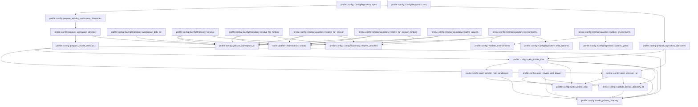
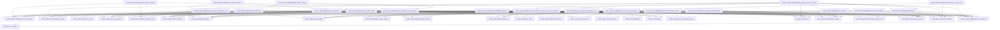
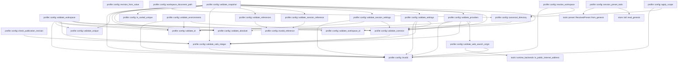

# profile::config

[Package atlas](index.md) · [Source](../../src/config.rs)

## Declarations

Visibility is the declaration spelling; trait members and reexports require their enclosing interface. `cfg` is not evaluated.

| Symbol | Kind | Visibility | Test / cfg |
|---|---|---|---|
| [profile::config::FORMAT](../../src/config.rs#L15) | const_item | `private` |  |
| [profile::config::MAX_SAFE_INTEGER](../../src/config.rs#L16) | const_item | `private` |  |
| [profile::config::WorkspacePolicy](../../src/config.rs#L20) | struct_item | `pub` |  |
| [profile::config::WorkspaceFolder](../../src/config.rs#L46) | struct_item | `pub` |  |
| [profile::config::WorkspaceConfig](../../src/config.rs#L53) | struct_item | `pub` |  |
| [profile::config::WorkspaceConfig::folder_paths](../../src/config.rs#L68) | function_item | `pub` |  |
| [profile::config::WorkspaceConfig::folder_ids](../../src/config.rs#L82) | function_item | `pub` |  |
| [profile::config::WorkspaceConfig::binding_for_path](../../src/config.rs#L96) | function_item | `pub` |  |
| [profile::config::WorkspaceConfig::path_for_binding](../../src/config.rs#L110) | function_item | `pub` |  |
| [profile::config::Model](../../src/config.rs#L128) | struct_item | `pub` |  |
| [profile::config::Provider](../../src/config.rs#L138) | struct_item | `pub` |  |
| [profile::config::WebSearch](../../src/config.rs#L157) | struct_item | `pub` |  |
| [profile::config::ProvidersConfig](../../src/config.rs#L165) | struct_item | `pub` |  |
| [profile::config::ProvidersConfig::default](../../src/config.rs#L174) | function_item | `private` |  |
| [profile::config::Limits](../../src/config.rs#L186) | struct_item | `pub` |  |
| [profile::config::SettingsConfig](../../src/config.rs#L195) | struct_item | `pub` |  |
| [profile::config::SessionSettings](../../src/config.rs#L208) | struct_item | `pub` |  |
| [profile::config::SettingsConfig::default](../../src/config.rs#L218) | function_item | `private` |  |
| [profile::config::EnvironmentsConfig](../../src/config.rs#L234) | struct_item | `pub` |  |
| [profile::config::EnvironmentsConfig::default](../../src/config.rs#L241) | function_item | `private` |  |
| [profile::config::EnvironmentsConfig::canonical_bytes](../../src/config.rs#L252) | function_item | `pub` |  |
| [profile::config::EnvironmentsConfig::decode](../../src/config.rs#L259) | function_item | `pub` |  |
| [profile::config::EnvironmentsConfig::environment](../../src/config.rs#L269) | function_item | `pub` |  |
| [profile::config::Environment](../../src/config.rs#L283) | struct_item | `pub` |  |
| [profile::config::Environment::local](../../src/config.rs#L296) | function_item | `pub` |  |
| [profile::config::ScopeSelection](../../src/config.rs#L309) | struct_item | `pub` |  |
| [profile::config::ResolvedWorkspace](../../src/config.rs#L317) | struct_item | `pub` |  |
| [profile::config::RevisionVector](../../src/config.rs#L345) | struct_item | `pub` |  |
| [profile::config::ignore_legacy_field](../../src/config.rs#L364) | function_item | `private` |  |
| [profile::config::ConfigSnapshot](../../src/config.rs#L370) | struct_item | `pub` |  |
| [profile::config::ConfigSnapshot::protected_roots](../../src/config.rs#L395) | function_item | `pub` |  |
| [profile::config::ConfigSnapshot::execution_cwd](../../src/config.rs#L403) | function_item | `pub` |  |
| [profile::config::ConfigSnapshot::canonical_bytes](../../src/config.rs#L410) | function_item | `pub` |  |
| [profile::config::ConfigSnapshot::digest](../../src/config.rs#L415) | function_item | `pub` |  |
| [profile::config::ConfigSnapshot::decode](../../src/config.rs#L419) | function_item | `pub` |  |
| [profile::config::ConfigSnapshot::publish](../../src/config.rs#L431) | function_item | `pub` |  |
| [profile::config::ConfigSnapshot::requires_respawn_from](../../src/config.rs#L445) | function_item | `pub` |  |
| [profile::config::config_document](../../src/config.rs#L469) | macro_definition | `private` |  |
| [profile::config::ConfigRepository](../../src/config.rs#L496) | struct_item | `pub` |  |
| [profile::config::invalid_private_directory](../../src/config.rs#L500) | function_item | `private` |  |
| [profile::config::validate_private_directory_fd](../../src/config.rs#L507) | function_item | `private` |  |
| [profile::config::rustix_profile_error](../../src/config.rs#L537) | function_item | `private` |  |
| [profile::config::open_directory_at](../../src/config.rs#L541) | function_item | `private` |  |
| [profile::config::open_private_root](../../src/config.rs#L575) | function_item | `private` |  |
| [profile::config::open_private_root_darwin](../../src/config.rs#L672) | function_item | `private` | #[cfg(target_os = "macos")] |
| [profile::config::open_private_root_sandboxed](../../src/config.rs#L737) | function_item | `private` | #[cfg(target_os = "macos")] |
| [profile::config::prepare_repository_directories](../../src/config.rs#L755) | function_item | `private` |  |
| [profile::config::prepare_private_directory](../../src/config.rs#L764) | function_item | `private` |  |
| [profile::config::prepare_workspace_directory](../../src/config.rs#L780) | function_item | `private` |  |
| [profile::config::prepare_existing_workspace_directories](../../src/config.rs#L790) | function_item | `private` |  |
| [profile::config::ConfigRepository::open](../../src/config.rs#L814) | function_item | `pub` |  |
| [profile::config::ConfigRepository::workspace_data_dir](../../src/config.rs#L821) | function_item | `pub` |  |
| [profile::config::ConfigRepository::root](../../src/config.rs#L827) | function_item | `pub` |  |
| [profile::config::ConfigRepository::resolve](../../src/config.rs#L831) | function_item | `pub` |  |
| [profile::config::ConfigRepository::resolve_for_binding](../../src/config.rs#L840) | function_item | `pub` |  |
| [profile::config::ConfigRepository::resolve_for_session](../../src/config.rs#L850) | function_item | `pub` |  |
| [profile::config::ConfigRepository::resolve_for_session_binding](../../src/config.rs#L871) | function_item | `pub` |  |
| [profile::config::ConfigRepository::resolve_scoped](../../src/config.rs#L892) | function_item | `pub` |  |
| [profile::config::ConfigRepository::environments](../../src/config.rs#L917) | function_item | `pub` |  |
| [profile::config::ConfigRepository::publish_environments](../../src/config.rs#L925) | function_item | `pub` |  |
| [profile::config::ConfigRepository::providers](../../src/config.rs#L938) | function_item | `pub` |  |
| [profile::config::ConfigRepository::settings](../../src/config.rs#L947) | function_item | `pub` |  |
| [profile::config::ConfigRepository::workspace](../../src/config.rs#L957) | function_item | `pub` |  |
| [profile::config::ConfigRepository::workspaces](../../src/config.rs#L972) | function_item | `pub` |  |
| [profile::config::ConfigRepository::resource_workspace_roots](../../src/config.rs#L1006) | function_item | `pub` |  |
| [profile::config::ConfigRepository::publish_workspace](../../src/config.rs#L1047) | function_item | `pub` |  |
| [profile::config::ConfigRepository::publish_providers](../../src/config.rs#L1069) | function_item | `pub` |  |
| [profile::config::ConfigRepository::publish_providers_checked](../../src/config.rs#L1084) | function_item | `pub` |  |
| [profile::config::ConfigRepository::publish_settings](../../src/config.rs#L1110) | function_item | `pub` |  |
| [profile::config::ConfigRepository::publish_settings_checked](../../src/config.rs#L1123) | function_item | `pub` |  |
| [profile::config::ConfigRepository::publish_workspace_policy](../../src/config.rs#L1158) | function_item | `pub` |  |
| [profile::config::ConfigRepository::publish_session_settings](../../src/config.rs#L1196) | function_item | `pub` |  |
| [profile::config::ConfigRepository::session_settings](../../src/config.rs#L1221) | function_item | `pub` |  |
| [profile::config::ConfigRepository::publish_global](../../src/config.rs#L1234) | function_item | `private` |  |
| [profile::config::ConfigRepository::resolve_unlocked](../../src/config.rs#L1258) | function_item | `private` |  |
| [profile::config::ConfigRepository::resolve_session_seed](../../src/config.rs#L1278) | function_item | `pub` |  |
| [profile::config::ConfigRepository::resolve_seed_unlocked](../../src/config.rs#L1289) | function_item | `private` |  |
| [profile::config::ConfigRepository::read_required](../../src/config.rs#L1386) | function_item | `private` |  |
| [profile::config::ConfigRepository::read_optional](../../src/config.rs#L1390) | function_item | `private` |  |
| [profile::config::ConfigRepository::validate_all_provider_references_unlocked](../../src/config.rs#L1401) | function_item | `private` |  |
| [profile::config::check_publication_revision](../../src/config.rs#L1449) | function_item | `private` |  |
| [profile::config::revision_from_value](../../src/config.rs#L1471) | function_item | `private` |  |
| [profile::config::revision_from_value::RevisionOnly](../../src/config.rs#L1473) | struct_item | `private` |  |
| [profile::config::validate_workspace_id](../../src/config.rs#L1488) | function_item | `private` |  |
| [profile::config::workspace_document_path](../../src/config.rs#L1505) | function_item | `private` |  |
| [profile::config::validate_common](../../src/config.rs#L1511) | function_item | `private` |  |
| [profile::config::validate_workspace](../../src/config.rs#L1533) | function_item | `private` |  |
| [profile::config::validate_providers](../../src/config.rs#L1573) | function_item | `private` |  |
| [profile::config::validate_web_search_origin](../../src/config.rs#L1635) | function_item | `private` |  |
| [profile::config::validate_settings](../../src/config.rs#L1670) | function_item | `private` |  |
| [profile::config::validate_session_settings](../../src/config.rs#L1692) | function_item | `private` |  |
| [profile::config::validate_session_reference](../../src/config.rs#L1706) | function_item | `private` |  |
| [profile::config::validate_references](../../src/config.rs#L1732) | function_item | `private` |  |
| [profile::config::session_preset_tools](../../src/config.rs#L1781) | function_item | `private` |  |
| [profile::config::apply_scope](../../src/config.rs#L1809) | function_item | `private` |  |
| [profile::config::validate_environments](../../src/config.rs#L1874) | function_item | `private` |  |
| [profile::config::resolve_workspace](../../src/config.rs#L1902) | function_item | `private` |  |
| [profile::config::validate_snapshot](../../src/config.rs#L1956) | function_item | `private` |  |
| [profile::config::validate_safe_integer](../../src/config.rs#L2084) | function_item | `private` |  |
| [profile::config::is_sorted_unique](../../src/config.rs#L2095) | function_item | `private` |  |
| [profile::config::canonical_directory](../../src/config.rs#L2099) | function_item | `private` |  |
| [profile::config::validate_absolute](../../src/config.rs#L2120) | function_item | `private` |  |
| [profile::config::validate_id](../../src/config.rs#L2130) | function_item | `private` |  |
| [profile::config::validate_unique](../../src/config.rs#L2141) | function_item | `private` |  |
| [profile::config::invalid](../../src/config.rs#L2150) | function_item | `private` |  |
| [profile::config::invalid_reference](../../src/config.rs#L2157) | function_item | `private` |  |
| [profile::config::removed](../../src/config.rs#L2164) | function_item | `private` |  |
| [profile::config::lowered](../../src/config.rs#L2169) | function_item | `private` |  |
| [profile::config::enabled_provider_models](../../src/config.rs#L2177) | function_item | `private` |  |
| [profile::config::private_directory_tests::private_directory_rejects_wrong_owner](../../src/config.rs#L2202) | function_item | `private` | test; #[cfg(test)] |
| [profile::config::private_directory_tests::sandbox_fallback_rejects_a_symlinked_path](../../src/config.rs#L2214) | function_item | `private` | test; #[cfg(test)] #[cfg(target_os = "macos")] |
| [profile::config::toolchain_tests::toolchain_roots_are_canonical_deduplicated_and_never_writable_roots](../../src/config.rs#L2236) | function_item | `private` | test; #[cfg(test)] |
| [profile::config::legacy_snapshot_tests::a_snapshot_published_with_the_integrations_file_still_decodes](../../src/config.rs#L2284) | function_item | `private` | test; #[cfg(test)] |

## Imports / reexports

| Local name | Source path | Visibility |
|---|---|---|
| `BTreeSet` | `std::collections::BTreeSet` | `private` |
| `fs` | `std::fs` | `private` |
| `OwnedFd` | `std::os::fd::OwnedFd` | `private` |
| `OpenOptionsExt` | `std::os::unix::fs::OpenOptionsExt` | `private` |
| `Path` | `std::path::Path` | `private` |
| `PathBuf` | `std::path::PathBuf` | `private` |
| `Mode` | `rustix::fs::Mode` | `private` |
| `OFlags` | `rustix::fs::OFlags` | `private` |
| `fchmod` | `rustix::fs::fchmod` | `private` |
| `fstat` | `rustix::fs::fstat` | `private` |
| `mkdirat` | `rustix::fs::mkdirat` | `private` |
| `open` | `rustix::fs::open` | `private` |
| `openat` | `rustix::fs::openat` | `private` |
| `Deserialize` | `serde::Deserialize` | `private` |
| `Serialize` | `serde::Serialize` | `private` |
| `AssetRef` | `store::AssetRef` | `private` |
| `AssetStore` | `store::AssetStore` | `private` |
| `AtomicPublisher` | `store::AtomicPublisher` | `private` |
| `NamedLock` | `store::NamedLock` | `private` |
| `UnicodeNormalization` | `unicode_normalization::UnicodeNormalization` | `private` |
| `ProfileError` | `crate::ProfileError` | `private` |
| `canonical_line` | `crate::canonical_line` | `private` |
| `digest` | `crate::digest` | `private` |
| `parse_canonical` | `crate::parse_canonical` | `private` |
| `open_private_root` | `super::open_private_root` | `private` |
| `validate_private_directory_fd` | `super::validate_private_directory_fd` | `private` |
| `open_private_root_sandboxed` | `super::open_private_root_sandboxed` | `private` |
| `OFlags` | `rustix::fs::OFlags` | `private` |
| `*` | `super::*` | `private` |
| `*` | `super::*` | `private` |

## Module declarations

| Module | Visibility | Attributes |
|---|---|---|
| `profile::config::private_directory_tests` | `private` | #[cfg(test)] |
| `profile::config::toolchain_tests` | `private` | #[cfg(test)] |
| `profile::config::legacy_snapshot_tests` | `private` | #[cfg(test)] |

## Function call graphs

Edges below are syntactically resolved calls only, including private functions. Graphs partition callers into groups of 20; they are not execution order. All unresolved sites are listed below and in the JSON inventory.

Functions 1–20: 16 direct edges

```mermaid
flowchart TD
  n0["profile::config::WorkspaceConfig::path_for_binding"]
  n1["profile::config::ProvidersConfig::default"]
  n2["profile::config::validate_environments"]
  n3["profile::config::validate_snapshot"]
  n4["profile::config::removed"]
  n5["profile::config::lowered"]
  n6["profile::config::enabled_provider_models"]
  n7["profile::config::SettingsConfig::default"]
  n8["profile::config::EnvironmentsConfig::default"]
  n9["profile::config::EnvironmentsConfig::canonical_bytes"]
  n10["profile::config::EnvironmentsConfig::decode"]
  n11["profile::config::EnvironmentsConfig::environment"]
  n12["profile::config::Environment::local"]
  n13["profile::config::ignore_legacy_field"]
  n14["profile::config::ConfigSnapshot::protected_roots"]
  n15["profile::config::ConfigSnapshot::execution_cwd"]
  n16["profile::config::ConfigSnapshot::canonical_bytes"]
  n17["profile::config::ConfigSnapshot::digest"]
  n18["profile::config::ConfigSnapshot::decode"]
  n19["profile::config::ConfigSnapshot::publish"]
  n20["profile::config::ConfigSnapshot::requires_respawn_from"]
  n21["profile::config::invalid_private_directory"]
  n22["profile::config::WorkspaceConfig::folder_paths"]
  n23["profile::config::WorkspaceConfig::folder_ids"]
  n24["profile::config::WorkspaceConfig::binding_for_path"]
  n25["profile::canonical_line"]
  n26["profile::digest"]
  n27["profile::parse_canonical"]
  n28["tools::sandbox::kernel_protected_roots"]
  n29["tools::sandbox::kernel_protected_roots_with_user_agent_dir"]
  n9 --> n2
  n9 --> n25
  n10 --> n2
  n10 --> n27
  n14 --> n28
  n14 --> n29
  n16 --> n3
  n16 --> n25
  n17 --> n16
  n17 --> n26
  n18 --> n3
  n18 --> n27
  n19 --> n16
  n20 --> n4
  n20 --> n5
  n20 --> n6
```

Functions 21–40: 45 direct edges

```mermaid
flowchart TD
  n0["profile::config::ConfigRepository::publish_global"]
  n1["profile::config::ConfigRepository::resolve_unlocked"]
  n2["profile::config::ConfigRepository::read_optional"]
  n3["profile::config::validate_workspace_id"]
  n4["profile::config::validate_environments"]
  n5["profile::config::invalid_private_directory"]
  n6["profile::config::validate_private_directory_fd"]
  n7["profile::config::rustix_profile_error"]
  n8["profile::config::open_directory_at"]
  n9["profile::config::open_private_root"]
  n10["profile::config::open_private_root_darwin"]
  n11["profile::config::open_private_root_sandboxed"]
  n12["profile::config::prepare_repository_directories"]
  n13["profile::config::prepare_private_directory"]
  n14["profile::config::prepare_workspace_directory"]
  n15["profile::config::prepare_existing_workspace_directories"]
  n16["profile::config::ConfigRepository::open"]
  n17["profile::config::ConfigRepository::workspace_data_dir"]
  n18["profile::config::ConfigRepository::root"]
  n19["profile::config::ConfigRepository::resolve"]
  n20["profile::config::ConfigRepository::resolve_for_binding"]
  n21["profile::config::ConfigRepository::resolve_for_session"]
  n22["profile::config::ConfigRepository::resolve_for_session_binding"]
  n23["profile::config::ConfigRepository::resolve_scoped"]
  n24["profile::config::ConfigRepository::environments"]
  n25["profile::config::ConfigRepository::publish_environments"]
  n26["store::platform::NamedLock::shared"]
  n6 --> n5
  n8 --> n5
  n8 --> n6
  n8 --> n7
  n9 --> n5
  n9 --> n6
  n9 --> n7
  n9 --> n10
  n9 --> n11
  n10 --> n5
  n10 --> n6
  n10 --> n7
  n11 --> n5
  n11 --> n6
  n12 --> n8
  n12 --> n9
  n13 --> n5
  n13 --> n8
  n13 --> n9
  n14 --> n3
  n14 --> n13
  n15 --> n14
  n16 --> n12
  n16 --> n15
  n17 --> n3
  n19 --> n1
  n19 --> n3
  n19 --> n26
  n20 --> n1
  n20 --> n3
  n20 --> n26
  n21 --> n1
  n21 --> n3
  n21 --> n26
  n22 --> n1
  n22 --> n3
  n22 --> n26
  n23 --> n1
  n23 --> n3
  n23 --> n26
  n24 --> n2
  n24 --> n4
  n24 --> n26
  n25 --> n0
  n25 --> n4
```

Functions 41–60: 112 direct edges

```mermaid
flowchart TD
  n0["profile::config::ConfigRepository::resource_workspace_roots"]
  n1["profile::config::ConfigRepository::publish_workspace"]
  n2["profile::config::ConfigRepository::publish_providers"]
  n3["profile::config::ConfigRepository::publish_providers_checked"]
  n4["profile::config::ConfigRepository::publish_settings"]
  n5["profile::config::ConfigRepository::publish_settings_checked"]
  n6["profile::config::ConfigRepository::publish_workspace_policy"]
  n7["profile::config::ConfigRepository::publish_session_settings"]
  n8["profile::config::ConfigRepository::session_settings"]
  n9["profile::config::ConfigRepository::publish_global"]
  n10["profile::config::ConfigRepository::resolve_unlocked"]
  n11["profile::config::ConfigRepository::resolve_session_seed"]
  n12["profile::config::ConfigRepository::resolve_seed_unlocked"]
  n13["profile::config::ConfigRepository::read_required"]
  n14["profile::config::ConfigRepository::read_optional"]
  n15["profile::config::ConfigRepository::validate_all_provider_references_unlocked"]
  n16["profile::config::check_publication_revision"]
  n17["profile::config::revision_from_value"]
  n18["profile::config::validate_workspace_id"]
  n19["profile::config::workspace_document_path"]
  n20["profile::config::validate_workspace"]
  n21["profile::config::validate_providers"]
  n22["profile::config::validate_settings"]
  n23["profile::config::validate_session_settings"]
  n24["profile::config::validate_session_reference"]
  n25["profile::config::validate_references"]
  n26["profile::config::apply_scope"]
  n27["profile::config::validate_environments"]
  n28["profile::config::resolve_workspace"]
  n29["profile::config::canonical_directory"]
  n30["profile::config::validate_id"]
  n31["profile::config::invalid"]
  n32["profile::config::prepare_workspace_directory"]
  n33["profile::config::ConfigRepository::providers"]
  n34["profile::config::ConfigRepository::settings"]
  n35["profile::config::ConfigRepository::workspace"]
  n36["profile::config::ConfigRepository::workspaces"]
  n37["profile::canonical_line"]
  n38["profile::parse_canonical"]
  n39["store::atomic::AtomicPublisher::replace"]
  n40["store::management_root::endpoint_management_root"]
  n41["store::management_root::session_settings_path"]
  n42["store::platform::NamedLock::exclusive"]
  n43["store::platform::NamedLock::shared"]
  n0 --> n13
  n0 --> n18
  n0 --> n19
  n0 --> n20
  n0 --> n28
  n0 --> n43
  n1 --> n14
  n1 --> n16
  n1 --> n18
  n1 --> n19
  n1 --> n20
  n1 --> n32
  n1 --> n37
  n1 --> n39
  n1 --> n42
  n2 --> n9
  n2 --> n21
  n3 --> n14
  n3 --> n15
  n3 --> n16
  n3 --> n21
  n3 --> n37
  n3 --> n39
  n3 --> n40
  n3 --> n42
  n3 --> n43
  n4 --> n9
  n4 --> n22
  n5 --> n14
  n5 --> n16
  n5 --> n21
  n5 --> n22
  n5 --> n25
  n5 --> n37
  n5 --> n39
  n5 --> n42
  n6 --> n13
  n6 --> n14
  n6 --> n16
  n6 --> n18
  n6 --> n19
  n6 --> n20
  n6 --> n21
  n6 --> n22
  n6 --> n25
  n6 --> n37
  n6 --> n39
  n6 --> n42
  n7 --> n14
  n7 --> n16
  n7 --> n21
  n7 --> n23
  n7 --> n24
  n7 --> n37
  n7 --> n39
  n7 --> n41
  n7 --> n42
  n8 --> n14
  n8 --> n23
  n8 --> n41
  n8 --> n43
  n9 --> n16
  n9 --> n17
  n9 --> n37
  n9 --> n38
  n9 --> n39
  n9 --> n42
  n10 --> n12
  n10 --> n13
  n10 --> n19
  n11 --> n12
  n11 --> n43
  n12 --> n14
  n12 --> n20
  n12 --> n21
  n12 --> n22
  n12 --> n23
  n12 --> n24
  n12 --> n25
  n12 --> n26
  n12 --> n27
  n12 --> n28
  n12 --> n29
  n12 --> n30
  n13 --> n38
  n14 --> n38
  n15 --> n13
  n15 --> n14
  n15 --> n20
  n15 --> n22
  n15 --> n23
  n15 --> n24
  n15 --> n25
  n15 --> n31
  n15 --> n41
  n33 --> n14
  n33 --> n21
  n33 --> n43
  n34 --> n14
  n34 --> n22
  n34 --> n43
  n35 --> n13
  n35 --> n18
  n35 --> n19
  n35 --> n20
  n35 --> n31
  n35 --> n43
  n36 --> n13
  n36 --> n18
  n36 --> n20
  n36 --> n31
  n36 --> n43
```

Functions 61–80: 49 direct edges

```mermaid
flowchart TD
  n0["profile::config::check_publication_revision"]
  n1["profile::config::revision_from_value"]
  n2["profile::config::validate_workspace_id"]
  n3["profile::config::workspace_document_path"]
  n4["profile::config::validate_common"]
  n5["profile::config::validate_workspace"]
  n6["profile::config::validate_providers"]
  n7["profile::config::validate_web_search_origin"]
  n8["profile::config::validate_settings"]
  n9["profile::config::validate_session_settings"]
  n10["profile::config::validate_session_reference"]
  n11["profile::config::validate_references"]
  n12["profile::config::session_preset_tools"]
  n13["profile::config::apply_scope"]
  n14["profile::config::validate_environments"]
  n15["profile::config::resolve_workspace"]
  n16["profile::config::validate_snapshot"]
  n17["profile::config::validate_safe_integer"]
  n18["profile::config::is_sorted_unique"]
  n19["profile::config::canonical_directory"]
  n20["profile::config::validate_absolute"]
  n21["profile::config::validate_id"]
  n22["profile::config::validate_unique"]
  n23["profile::config::invalid"]
  n24["profile::config::invalid_reference"]
  n25["store::tail::read_genesis"]
  n26["tools::preset::ResolvedPreset::from_genesis"]
  n27["tools::runtime_backends::is_public_internet_address"]
  n0 --> n17
  n4 --> n17
  n5 --> n2
  n5 --> n4
  n5 --> n17
  n5 --> n20
  n5 --> n21
  n5 --> n22
  n5 --> n23
  n6 --> n4
  n6 --> n7
  n6 --> n17
  n6 --> n21
  n6 --> n23
  n7 --> n23
  n7 --> n27
  n8 --> n4
  n8 --> n17
  n8 --> n23
  n9 --> n4
  n9 --> n21
  n9 --> n23
  n10 --> n24
  n11 --> n24
  n12 --> n25
  n12 --> n26
  n13 --> n19
  n13 --> n23
  n14 --> n4
  n14 --> n21
  n14 --> n23
  n15 --> n19
  n15 --> n23
  n16 --> n2
  n16 --> n4
  n16 --> n6
  n16 --> n8
  n16 --> n9
  n16 --> n10
  n16 --> n11
  n16 --> n17
  n16 --> n18
  n16 --> n19
  n16 --> n20
  n16 --> n21
  n16 --> n22
  n16 --> n23
  n17 --> n23
  n19 --> n20
```

Functions 81–88: 2 direct edges

```mermaid
flowchart TD
  n0["profile::config::validate_absolute"]
  n1["profile::config::validate_id"]
  n2["profile::config::validate_unique"]
  n3["profile::config::invalid"]
  n4["profile::config::invalid_reference"]
  n5["profile::config::removed"]
  n6["profile::config::lowered"]
  n7["profile::config::enabled_provider_models"]
  n1 --> n3
  n2 --> n3
```

## Call sites

Includes test functions (marked in declarations). Receiver-type-required sites need type analysis/manual tracing. Calls in closures are attributed to their enclosing function; their occurrence here does not mean the closure executes immediately.

| Caller | Callee expression | Source lines | Target / classification |
|---|---|---|---|
| `folder_paths` | `self.folders.is_empty` | [69](../../src/config.rs#L69) | receiver-type-required |
| `folder_paths` | `self.cwd.iter().map(String::as_str).collect` | [70](../../src/config.rs#L70) | receiver-type-required |
| `folder_paths` | `self.cwd.iter().map` | [70](../../src/config.rs#L70) | receiver-type-required |
| `folder_paths` | `self.cwd.iter` | [70](../../src/config.rs#L70) | receiver-type-required |
| `folder_paths` | `self.folders                 .iter()                 .map(&#124;folder&#124; folder.path.as_str())                 .collect` | [72](../../src/config.rs#L72) | receiver-type-required |
| `folder_paths` | `self.folders                 .iter()                 .map` | [72](../../src/config.rs#L72) | receiver-type-required |
| `folder_paths` | `self.folders                 .iter` | [72](../../src/config.rs#L72) | receiver-type-required |
| `folder_paths` | `folder.path.as_str` | [74](../../src/config.rs#L74) | receiver-type-required |
| `folder_ids` | `self.folders.is_empty` | [83](../../src/config.rs#L83) | receiver-type-required |
| `folder_ids` | `(1..=self.cwd.len())                 .map(&#124;index&#124; format!("folder-{index:04}"))                 .collect` | [84](../../src/config.rs#L84) | receiver-type-required |
| `folder_ids` | `(1..=self.cwd.len())                 .map` | [84](../../src/config.rs#L84) | receiver-type-required |
| `folder_ids` | `self.cwd.len` | [84](../../src/config.rs#L84) | receiver-type-required |
| `folder_ids` | `self.folders                 .iter()                 .map(&#124;folder&#124; folder.id.clone())                 .collect` | [88](../../src/config.rs#L88) | receiver-type-required |
| `folder_ids` | `self.folders                 .iter()                 .map` | [88](../../src/config.rs#L88) | receiver-type-required |
| `folder_ids` | `self.folders                 .iter` | [88](../../src/config.rs#L88) | receiver-type-required |
| `folder_ids` | `folder.id.clone` | [90](../../src/config.rs#L90) | receiver-type-required |
| `binding_for_path` | `self.folders             .iter()             .find(&#124;folder&#124; folder.path == path)             .map(&#124;folder&#124; folder.id.clone())             .or_else` | [97](../../src/config.rs#L97) | receiver-type-required |
| `binding_for_path` | `self.folders             .iter()             .find(&#124;folder&#124; folder.path == path)             .map` | [97](../../src/config.rs#L97) | receiver-type-required |
| `binding_for_path` | `self.folders             .iter()             .find` | [97](../../src/config.rs#L97) | receiver-type-required |
| `binding_for_path` | `self.folders             .iter` | [97](../../src/config.rs#L97) | receiver-type-required |
| `binding_for_path` | `folder.id.clone` | [100](../../src/config.rs#L100) | receiver-type-required |
| `binding_for_path` | `self.cwd                     .iter()                     .position(&#124;candidate&#124; candidate == path)                     .map` | [102](../../src/config.rs#L102) | receiver-type-required |
| `binding_for_path` | `self.cwd                     .iter()                     .position` | [102](../../src/config.rs#L102) | receiver-type-required |
| `binding_for_path` | `self.cwd                     .iter` | [102](../../src/config.rs#L102) | receiver-type-required |
| `path_for_binding` | `self.folders.is_empty` | [111](../../src/config.rs#L111) | receiver-type-required |
| `path_for_binding` | `self.cwd                 .iter()                 .enumerate()                 .find(&#124;(index, _)&#124; binding == format!("folder-{:04}", index + 1))                 .map` | [112](../../src/config.rs#L112) | receiver-type-required |
| `path_for_binding` | `self.cwd                 .iter()                 .enumerate()                 .find` | [112](../../src/config.rs#L112) | receiver-type-required |
| `path_for_binding` | `self.cwd                 .iter()                 .enumerate` | [112](../../src/config.rs#L112) | receiver-type-required |
| `path_for_binding` | `self.cwd                 .iter` | [112](../../src/config.rs#L112) | receiver-type-required |
| `path_for_binding` | `path.as_str` | [116](../../src/config.rs#L116) | receiver-type-required |
| `path_for_binding` | `self.folders                 .iter()                 .find(&#124;folder&#124; folder.id == binding)                 .map` | [118](../../src/config.rs#L118) | receiver-type-required |
| `path_for_binding` | `self.folders                 .iter()                 .find` | [118](../../src/config.rs#L118) | receiver-type-required |
| `path_for_binding` | `self.folders                 .iter` | [118](../../src/config.rs#L118) | receiver-type-required |
| `path_for_binding` | `folder.path.as_str` | [121](../../src/config.rs#L121) | receiver-type-required |
| `default` | `Vec::new` | [178](../../src/config.rs#L178) | external-constructor-callback-or-unresolved |
| `default` | `Vec::new` | [245](../../src/config.rs#L245) | external-constructor-callback-or-unresolved |
| `canonical_bytes` | `Path::new` | [253](../../src/config.rs#L253) | external-constructor-callback-or-unresolved |
| `canonical_bytes` | `validate_environments` | [254](../../src/config.rs#L254) | [profile::config::validate_environments](../../src/config.rs#L1874) |
| `canonical_bytes` | `canonical_line` | [255](../../src/config.rs#L255) | [profile::canonical_line](../../src/lib.rs#L118) |
| `decode` | `Path::new` | [260](../../src/config.rs#L260) | external-constructor-callback-or-unresolved |
| `decode` | `parse_canonical` | [261](../../src/config.rs#L261) | [profile::parse_canonical](../../src/lib.rs#L73) |
| `decode` | `validate_environments` | [262](../../src/config.rs#L262) | [profile::config::validate_environments](../../src/config.rs#L1874) |
| `decode` | `Ok` | [263](../../src/config.rs#L263) | external-constructor-callback-or-unresolved |
| `environment` | `self.environments             .iter()             .find(&#124;environment&#124; environment.id == id)             .cloned()             .or_else` | [270](../../src/config.rs#L270) | receiver-type-required |
| `environment` | `self.environments             .iter()             .find(&#124;environment&#124; environment.id == id)             .cloned` | [270](../../src/config.rs#L270) | receiver-type-required |
| `environment` | `self.environments             .iter()             .find` | [270](../../src/config.rs#L270) | receiver-type-required |
| `environment` | `self.environments             .iter` | [270](../../src/config.rs#L270) | receiver-type-required |
| `environment` | `(id == schema::DEFAULT_ENVIRONMENT).then` | [274](../../src/config.rs#L274) | receiver-type-required |
| `local` | `schema::DEFAULT_ENVIRONMENT.to_owned` | [298](../../src/config.rs#L298) | receiver-type-required |
| `local` | `Vec::new` | [300](../../src/config.rs#L300) | external-constructor-callback-or-unresolved |
| `ignore_legacy_field` | `serde::de::IgnoredAny::deserialize(deserializer).map` | [365](../../src/config.rs#L365) | receiver-type-required |
| `ignore_legacy_field` | `serde::de::IgnoredAny::deserialize` | [365](../../src/config.rs#L365) | external-constructor-callback-or-unresolved |
| `protected_roots` | `self.user_agent_dir.as_deref().map_or_else` | [396](../../src/config.rs#L396) | receiver-type-required |
| `protected_roots` | `self.user_agent_dir.as_deref` | [396](../../src/config.rs#L396) | receiver-type-required |
| `protected_roots` | `tools::kernel_protected_roots` | [397](../../src/config.rs#L397) | [tools::sandbox::kernel_protected_roots](../../../tools/src/sandbox.rs#L151) |
| `protected_roots` | `tools::kernel_protected_roots_with_user_agent_dir` | [398](../../src/config.rs#L398) | [tools::sandbox::kernel_protected_roots_with_user_agent_dir](../../../tools/src/sandbox.rs#L172) |
| `protected_roots` | `Path::new` | [398](../../src/config.rs#L398) | external-constructor-callback-or-unresolved |
| `execution_cwd` | `self.workspace             .selected_cwd             .as_deref()             .or_else` | [404](../../src/config.rs#L404) | receiver-type-required |
| `execution_cwd` | `self.workspace             .selected_cwd             .as_deref` | [404](../../src/config.rs#L404) | receiver-type-required |
| `execution_cwd` | `self.workspace.cwd.first().map` | [407](../../src/config.rs#L407) | receiver-type-required |
| `execution_cwd` | `self.workspace.cwd.first` | [407](../../src/config.rs#L407) | receiver-type-required |
| `canonical_bytes` | `validate_snapshot` | [411](../../src/config.rs#L411) | [profile::config::validate_snapshot](../../src/config.rs#L1956) |
| `canonical_bytes` | `canonical_line` | [412](../../src/config.rs#L412) | [profile::canonical_line](../../src/lib.rs#L118) |
| `digest` | `Ok` | [416](../../src/config.rs#L416) | external-constructor-callback-or-unresolved |
| `digest` | `digest` | [416](../../src/config.rs#L416) | [profile::digest](../../src/lib.rs#L132) |
| `digest` | `self.canonical_bytes` | [416](../../src/config.rs#L416) | [profile::config::ConfigSnapshot::canonical_bytes](../../src/config.rs#L410) |
| `decode` | `parse_canonical` | [420](../../src/config.rs#L420) | [profile::parse_canonical](../../src/lib.rs#L73) |
| `decode` | `Err` | [422](../../src/config.rs#L422) | external-constructor-callback-or-unresolved |
| `decode` | `PathBuf::from` | [423](../../src/config.rs#L423) | external-constructor-callback-or-unresolved |
| `decode` | `validate_snapshot` | [427](../../src/config.rs#L427) | [profile::config::validate_snapshot](../../src/config.rs#L1956) |
| `decode` | `Ok` | [428](../../src/config.rs#L428) | external-constructor-callback-or-unresolved |
| `publish` | `self.canonical_bytes` | [432](../../src/config.rs#L432) | [profile::config::ConfigSnapshot::canonical_bytes](../../src/config.rs#L410) |
| `publish` | `digest` | [433](../../src/config.rs#L433) | external-constructor-callback-or-unresolved |
| `publish` | `assets.publish` | [434](../../src/config.rs#L434) | receiver-type-required |
| `publish` | `Err` | [436](../../src/config.rs#L436) | external-constructor-callback-or-unresolved |
| `publish` | `Ok` | [441](../../src/config.rs#L441) | external-constructor-callback-or-unresolved |
| `requires_respawn_from` | `removed` | [449](../../src/config.rs#L449), [451](../../src/config.rs#L451) | [profile::config::removed](../../src/config.rs#L2164) |
| `requires_respawn_from` | `lowered` | [452](../../src/config.rs#L452) | [profile::config::lowered](../../src/config.rs#L2169) |
| `requires_respawn_from` | `enabled_provider_models` | [458](../../src/config.rs#L458), [459](../../src/config.rs#L459) | [profile::config::enabled_provider_models](../../src/config.rs#L2177) |
| `requires_respawn_from` | `old_providers.is_subset` | [460](../../src/config.rs#L460) | receiver-type-required |
| `requires_respawn_from` | `previous                 .providers                 .web_search                 .as_ref()                 .is_some_and` | [461](../../src/config.rs#L461) | receiver-type-required |
| `requires_respawn_from` | `previous                 .providers                 .web_search                 .as_ref` | [461](../../src/config.rs#L461) | receiver-type-required |
| `requires_respawn_from` | `self.providers.web_search.as_ref` | [465](../../src/config.rs#L465) | receiver-type-required |
| `requires_respawn_from` | `Some` | [465](../../src/config.rs#L465) | external-constructor-callback-or-unresolved |
| `invalid_private_directory` | `path.to_path_buf` | [502](../../src/config.rs#L502) | receiver-type-required |
| `invalid_private_directory` | `reason.to_owned` | [503](../../src/config.rs#L503) | receiver-type-required |
| `validate_private_directory_fd` | `fstat(descriptor).map_err` | [512](../../src/config.rs#L512) | receiver-type-required |
| `validate_private_directory_fd` | `fstat` | [512](../../src/config.rs#L512) | external-constructor-callback-or-unresolved |
| `validate_private_directory_fd` | `Err` | [514](../../src/config.rs#L514), [520](../../src/config.rs#L520), [526](../../src/config.rs#L526) | external-constructor-callback-or-unresolved |
| `validate_private_directory_fd` | `invalid_private_directory` | [514](../../src/config.rs#L514), [520](../../src/config.rs#L520), [526](../../src/config.rs#L526) | [profile::config::invalid_private_directory](../../src/config.rs#L500) |
| `validate_private_directory_fd` | `fchmod(descriptor, Mode::RWXU).map_err` | [533](../../src/config.rs#L533) | receiver-type-required |
| `validate_private_directory_fd` | `fchmod` | [533](../../src/config.rs#L533) | external-constructor-callback-or-unresolved |
| `validate_private_directory_fd` | `Ok` | [534](../../src/config.rs#L534) | external-constructor-callback-or-unresolved |
| `rustix_profile_error` | `std::io::Error::from_raw_os_error(error.raw_os_error()).into` | [538](../../src/config.rs#L538) | receiver-type-required |
| `rustix_profile_error` | `std::io::Error::from_raw_os_error` | [538](../../src/config.rs#L538) | external-constructor-callback-or-unresolved |
| `rustix_profile_error` | `error.raw_os_error` | [538](../../src/config.rs#L538) | receiver-type-required |
| `open_directory_at` | `openat` | [549](../../src/config.rs#L549), [559](../../src/config.rs#L559) | external-constructor-callback-or-unresolved |
| `open_directory_at` | `Mode::empty` | [549](../../src/config.rs#L549), [559](../../src/config.rs#L559) | external-constructor-callback-or-unresolved |
| `open_directory_at` | `result         .as_ref()         .is_err_and` | [550](../../src/config.rs#L550) | receiver-type-required |
| `open_directory_at` | `result         .as_ref` | [550](../../src/config.rs#L550) | receiver-type-required |
| `open_directory_at` | `mkdirat` | [555](../../src/config.rs#L555) | external-constructor-callback-or-unresolved |
| `open_directory_at` | `Err` | [557](../../src/config.rs#L557), [564](../../src/config.rs#L564), [569](../../src/config.rs#L569) | external-constructor-callback-or-unresolved |
| `open_directory_at` | `rustix_profile_error` | [557](../../src/config.rs#L557), [569](../../src/config.rs#L569) | [profile::config::rustix_profile_error](../../src/config.rs#L537) |
| `open_directory_at` | `invalid_private_directory` | [564](../../src/config.rs#L564) | [profile::config::invalid_private_directory](../../src/config.rs#L500) |
| `open_directory_at` | `validate_private_directory_fd` | [571](../../src/config.rs#L571) | [profile::config::validate_private_directory_fd](../../src/config.rs#L507) |
| `open_directory_at` | `Ok` | [572](../../src/config.rs#L572) | external-constructor-callback-or-unresolved |
| `open_private_root` | `path.is_absolute` | [581](../../src/config.rs#L581), [592](../../src/config.rs#L592), [629](../../src/config.rs#L629) | receiver-type-required |
| `open_private_root` | `open_private_root_darwin` | [582](../../src/config.rs#L582) | [profile::config::open_private_root_darwin](../../src/config.rs#L672) |
| `open_private_root` | `path.strip_prefix("/var").map_or_else` | [585](../../src/config.rs#L585) | receiver-type-required |
| `open_private_root` | `path.strip_prefix` | [585](../../src/config.rs#L585) | receiver-type-required |
| `open_private_root` | `path.to_path_buf` | [586](../../src/config.rs#L586), [590](../../src/config.rs#L590) | receiver-type-required |
| `open_private_root` | `Path::new("/private/var").join` | [587](../../src/config.rs#L587) | receiver-type-required |
| `open_private_root` | `Path::new` | [587](../../src/config.rs#L587) | external-constructor-callback-or-unresolved |
| `open_private_root` | `open` | [593](../../src/config.rs#L593), [602](../../src/config.rs#L602) | external-constructor-callback-or-unresolved |
| `open_private_root` | `Mode::empty` | [593](../../src/config.rs#L593), [602](../../src/config.rs#L602), [637](../../src/config.rs#L637), [648](../../src/config.rs#L648) | external-constructor-callback-or-unresolved |
| `open_private_root` | `open_private_root_sandboxed` | [597](../../src/config.rs#L597), [654](../../src/config.rs#L654) | [profile::config::open_private_root_sandboxed](../../src/config.rs#L737) |
| `open_private_root` | `Err` | [599](../../src/config.rs#L599), [615](../../src/config.rs#L615), [623](../../src/config.rs#L623), [646](../../src/config.rs#L646), [659](../../src/config.rs#L659), [664](../../src/config.rs#L664) | external-constructor-callback-or-unresolved |
| `open_private_root` | `rustix_profile_error` | [599](../../src/config.rs#L599), [646](../../src/config.rs#L646), [664](../../src/config.rs#L664) | [profile::config::rustix_profile_error](../../src/config.rs#L537) |
| `open_private_root` | `open(".", flags, Mode::empty()).map_err` | [602](../../src/config.rs#L602) | receiver-type-required |
| `open_private_root` | `Vec::new` | [604](../../src/config.rs#L604) | external-constructor-callback-or-unresolved |
| `open_private_root` | `traversal_path.components` | [605](../../src/config.rs#L605) | receiver-type-required |
| `open_private_root` | `value.to_str().ok_or_else` | [609](../../src/config.rs#L609) | receiver-type-required |
| `open_private_root` | `value.to_str` | [609](../../src/config.rs#L609) | receiver-type-required |
| `open_private_root` | `invalid_private_directory` | [610](../../src/config.rs#L610), [615](../../src/config.rs#L615), [623](../../src/config.rs#L623), [659](../../src/config.rs#L659) | [profile::config::invalid_private_directory](../../src/config.rs#L500) |
| `open_private_root` | `components.push` | [612](../../src/config.rs#L612) | receiver-type-required |
| `open_private_root` | `value.to_owned` | [612](../../src/config.rs#L612) | receiver-type-required |
| `open_private_root` | `components.is_empty` | [622](../../src/config.rs#L622) | receiver-type-required |
| `open_private_root` | `PathBuf::from` | [630](../../src/config.rs#L630), [632](../../src/config.rs#L632) | external-constructor-callback-or-unresolved |
| `open_private_root` | `components.len` | [634](../../src/config.rs#L634) | receiver-type-required |
| `open_private_root` | `components.into_iter().enumerate` | [635](../../src/config.rs#L635) | receiver-type-required |
| `open_private_root` | `components.into_iter` | [635](../../src/config.rs#L635) | receiver-type-required |
| `open_private_root` | `traversed.push` | [636](../../src/config.rs#L636) | receiver-type-required |
| `open_private_root` | `openat` | [637](../../src/config.rs#L637), [648](../../src/config.rs#L648) | external-constructor-callback-or-unresolved |
| `open_private_root` | `result             .as_ref()             .is_err_and` | [638](../../src/config.rs#L638) | receiver-type-required |
| `open_private_root` | `result             .as_ref` | [638](../../src/config.rs#L638) | receiver-type-required |
| `open_private_root` | `mkdirat` | [644](../../src/config.rs#L644) | external-constructor-callback-or-unresolved |
| `open_private_root` | `validate_private_directory_fd` | [667](../../src/config.rs#L667) | [profile::config::validate_private_directory_fd](../../src/config.rs#L507) |
| `open_private_root` | `Ok` | [668](../../src/config.rs#L668) | external-constructor-callback-or-unresolved |
| `open_private_root_darwin` | `path.strip_prefix("/var").map_or_else` | [677](../../src/config.rs#L677) | receiver-type-required |
| `open_private_root_darwin` | `path.strip_prefix` | [677](../../src/config.rs#L677) | receiver-type-required |
| `open_private_root_darwin` | `path.to_path_buf` | [678](../../src/config.rs#L678) | receiver-type-required |
| `open_private_root_darwin` | `Path::new("/private/var").join` | [679](../../src/config.rs#L679) | receiver-type-required |
| `open_private_root_darwin` | `Path::new` | [679](../../src/config.rs#L679) | external-constructor-callback-or-unresolved |
| `open_private_root_darwin` | `path.components().any` | [681](../../src/config.rs#L681) | receiver-type-required |
| `open_private_root_darwin` | `path.components` | [681](../../src/config.rs#L681) | receiver-type-required |
| `open_private_root_darwin` | `Err` | [687](../../src/config.rs#L687), [693](../../src/config.rs#L693), [720](../../src/config.rs#L720), [725](../../src/config.rs#L725), [730](../../src/config.rs#L730) | external-constructor-callback-or-unresolved |
| `open_private_root_darwin` | `invalid_private_directory` | [687](../../src/config.rs#L687), [693](../../src/config.rs#L693), [712](../../src/config.rs#L712), [717](../../src/config.rs#L717), [725](../../src/config.rs#L725) | [profile::config::invalid_private_directory](../../src/config.rs#L500) |
| `open_private_root_darwin` | `path.file_name().is_none` | [692](../../src/config.rs#L692) | receiver-type-required |
| `open_private_root_darwin` | `path.file_name` | [692](../../src/config.rs#L692) | receiver-type-required |
| `open_private_root_darwin` | `fs::OpenOptions::new()             .read(true)             .custom_flags(libc::O_DIRECTORY &#124; libc::O_NOFOLLOW_ANY &#124; libc::O_CLOEXEC)             .open` | [702](../../src/config.rs#L702) | receiver-type-required |
| `open_private_root_darwin` | `fs::OpenOptions::new()             .read(true)             .custom_flags` | [702](../../src/config.rs#L702) | receiver-type-required |
| `open_private_root_darwin` | `fs::OpenOptions::new()             .read` | [702](../../src/config.rs#L702) | receiver-type-required |
| `open_private_root_darwin` | `fs::OpenOptions::new` | [702](../../src/config.rs#L702) | external-constructor-callback-or-unresolved |
| `open_private_root_darwin` | `Ok` | [706](../../src/config.rs#L706), [733](../../src/config.rs#L733) | external-constructor-callback-or-unresolved |
| `open_private_root_darwin` | `file.into` | [706](../../src/config.rs#L706) | receiver-type-required |
| `open_private_root_darwin` | `open_directory` | [708](../../src/config.rs#L708), [714](../../src/config.rs#L714), [722](../../src/config.rs#L722) | external-constructor-callback-or-unresolved |
| `open_private_root_darwin` | `error.kind` | [710](../../src/config.rs#L710) | receiver-type-required |
| `open_private_root_darwin` | `path.parent().ok_or_else` | [711](../../src/config.rs#L711) | receiver-type-required |
| `open_private_root_darwin` | `path.parent` | [711](../../src/config.rs#L711) | receiver-type-required |
| `open_private_root_darwin` | `open_directory(parent_path).map_err` | [714](../../src/config.rs#L714) | receiver-type-required |
| `open_private_root_darwin` | `path                 .file_name()                 .ok_or_else` | [715](../../src/config.rs#L715) | receiver-type-required |
| `open_private_root_darwin` | `path                 .file_name` | [715](../../src/config.rs#L715) | receiver-type-required |
| `open_private_root_darwin` | `mkdirat` | [718](../../src/config.rs#L718) | external-constructor-callback-or-unresolved |
| `open_private_root_darwin` | `rustix_profile_error` | [720](../../src/config.rs#L720) | [profile::config::rustix_profile_error](../../src/config.rs#L537) |
| `open_private_root_darwin` | `open_directory(&path).map_err` | [722](../../src/config.rs#L722) | receiver-type-required |
| `open_private_root_darwin` | `error.raw_os_error` | [724](../../src/config.rs#L724) | receiver-type-required |
| `open_private_root_darwin` | `Some` | [724](../../src/config.rs#L724) | external-constructor-callback-or-unresolved |
| `open_private_root_darwin` | `ProfileError::from` | [730](../../src/config.rs#L730) | external-constructor-callback-or-unresolved |
| `open_private_root_darwin` | `validate_private_directory_fd` | [732](../../src/config.rs#L732) | [profile::config::validate_private_directory_fd](../../src/config.rs#L507) |
| `open_private_root_sandboxed` | `fs::canonicalize` | [743](../../src/config.rs#L743) | external-constructor-callback-or-unresolved |
| `open_private_root_sandboxed` | `Err` | [745](../../src/config.rs#L745) | external-constructor-callback-or-unresolved |
| `open_private_root_sandboxed` | `invalid_private_directory` | [745](../../src/config.rs#L745) | [profile::config::invalid_private_directory](../../src/config.rs#L500) |
| `open_private_root_sandboxed` | `open(&canonical, flags, Mode::empty()).map_err` | [750](../../src/config.rs#L750) | receiver-type-required |
| `open_private_root_sandboxed` | `open` | [750](../../src/config.rs#L750) | external-constructor-callback-or-unresolved |
| `open_private_root_sandboxed` | `Mode::empty` | [750](../../src/config.rs#L750) | external-constructor-callback-or-unresolved |
| `open_private_root_sandboxed` | `validate_private_directory_fd` | [751](../../src/config.rs#L751) | [profile::config::validate_private_directory_fd](../../src/config.rs#L507) |
| `open_private_root_sandboxed` | `Ok` | [752](../../src/config.rs#L752) | external-constructor-callback-or-unresolved |
| `prepare_repository_directories` | `rustix::process::geteuid().as_raw` | [756](../../src/config.rs#L756) | receiver-type-required |
| `prepare_repository_directories` | `rustix::process::geteuid` | [756](../../src/config.rs#L756) | external-constructor-callback-or-unresolved |
| `prepare_repository_directories` | `open_private_root` | [757](../../src/config.rs#L757) | [profile::config::open_private_root](../../src/config.rs#L575) |
| `prepare_repository_directories` | `open_directory_at` | [759](../../src/config.rs#L759) | [profile::config::open_directory_at](../../src/config.rs#L541) |
| `prepare_repository_directories` | `root.join` | [759](../../src/config.rs#L759) | receiver-type-required |
| `prepare_repository_directories` | `Ok` | [761](../../src/config.rs#L761) | external-constructor-callback-or-unresolved |
| `prepare_private_directory` | `path         .parent()         .ok_or_else` | [765](../../src/config.rs#L765) | receiver-type-required |
| `prepare_private_directory` | `path         .parent` | [765](../../src/config.rs#L765) | receiver-type-required |
| `prepare_private_directory` | `invalid_private_directory` | [767](../../src/config.rs#L767), [772](../../src/config.rs#L772) | [profile::config::invalid_private_directory](../../src/config.rs#L500) |
| `prepare_private_directory` | `path         .file_name()         .and_then(std::ffi::OsStr::to_str)         .ok_or_else` | [768](../../src/config.rs#L768) | receiver-type-required |
| `prepare_private_directory` | `path         .file_name()         .and_then` | [768](../../src/config.rs#L768) | receiver-type-required |
| `prepare_private_directory` | `path         .file_name` | [768](../../src/config.rs#L768) | receiver-type-required |
| `prepare_private_directory` | `rustix::process::geteuid().as_raw` | [774](../../src/config.rs#L774) | receiver-type-required |
| `prepare_private_directory` | `rustix::process::geteuid` | [774](../../src/config.rs#L774) | external-constructor-callback-or-unresolved |
| `prepare_private_directory` | `open_private_root` | [775](../../src/config.rs#L775) | [profile::config::open_private_root](../../src/config.rs#L575) |
| `prepare_private_directory` | `open_directory_at` | [776](../../src/config.rs#L776) | [profile::config::open_directory_at](../../src/config.rs#L541) |
| `prepare_private_directory` | `Ok` | [777](../../src/config.rs#L777) | external-constructor-callback-or-unresolved |
| `prepare_workspace_directory` | `validate_workspace_id` | [781](../../src/config.rs#L781) | [profile::config::validate_workspace_id](../../src/config.rs#L1488) |
| `prepare_workspace_directory` | `root.join("workspaces").join` | [782](../../src/config.rs#L782) | receiver-type-required |
| `prepare_workspace_directory` | `root.join` | [782](../../src/config.rs#L782) | receiver-type-required |
| `prepare_workspace_directory` | `prepare_private_directory` | [783](../../src/config.rs#L783), [785](../../src/config.rs#L785) | [profile::config::prepare_private_directory](../../src/config.rs#L764) |
| `prepare_workspace_directory` | `directory.join` | [785](../../src/config.rs#L785) | receiver-type-required |
| `prepare_workspace_directory` | `Ok` | [787](../../src/config.rs#L787) | external-constructor-callback-or-unresolved |
| `prepare_existing_workspace_directories` | `root.join` | [791](../../src/config.rs#L791) | receiver-type-required |
| `prepare_existing_workspace_directories` | `fs::read_dir` | [792](../../src/config.rs#L792) | external-constructor-callback-or-unresolved |
| `prepare_existing_workspace_directories` | `entry.path` | [794](../../src/config.rs#L794), [805](../../src/config.rs#L805) | receiver-type-required |
| `prepare_existing_workspace_directories` | `entry.file_type()?.is_symlink` | [795](../../src/config.rs#L795) | receiver-type-required |
| `prepare_existing_workspace_directories` | `entry.file_type` | [795](../../src/config.rs#L795) | receiver-type-required |
| `prepare_existing_workspace_directories` | `entry.file_type()?.is_dir` | [795](../../src/config.rs#L795) | receiver-type-required |
| `prepare_existing_workspace_directories` | `Err` | [796](../../src/config.rs#L796) | external-constructor-callback-or-unresolved |
| `prepare_existing_workspace_directories` | `"workspace authority entry must be a directory".to_owned` | [798](../../src/config.rs#L798) | receiver-type-required |
| `prepare_existing_workspace_directories` | `entry             .file_name()             .into_string()             .map_err` | [801](../../src/config.rs#L801) | receiver-type-required |
| `prepare_existing_workspace_directories` | `entry             .file_name()             .into_string` | [801](../../src/config.rs#L801) | receiver-type-required |
| `prepare_existing_workspace_directories` | `entry             .file_name` | [801](../../src/config.rs#L801) | receiver-type-required |
| `prepare_existing_workspace_directories` | `"workspace authority directory must be UTF-8".to_owned` | [806](../../src/config.rs#L806) | receiver-type-required |
| `prepare_existing_workspace_directories` | `prepare_workspace_directory` | [808](../../src/config.rs#L808) | [profile::config::prepare_workspace_directory](../../src/config.rs#L780) |
| `prepare_existing_workspace_directories` | `Ok` | [810](../../src/config.rs#L810) | external-constructor-callback-or-unresolved |
| `open` | `root.as_ref().to_path_buf` | [815](../../src/config.rs#L815) | receiver-type-required |
| `open` | `root.as_ref` | [815](../../src/config.rs#L815) | receiver-type-required |
| `open` | `prepare_repository_directories` | [816](../../src/config.rs#L816) | [profile::config::prepare_repository_directories](../../src/config.rs#L755) |
| `open` | `prepare_existing_workspace_directories` | [817](../../src/config.rs#L817) | [profile::config::prepare_existing_workspace_directories](../../src/config.rs#L790) |
| `open` | `Ok` | [818](../../src/config.rs#L818) | external-constructor-callback-or-unresolved |
| `workspace_data_dir` | `validate_workspace_id` | [822](../../src/config.rs#L822) | [profile::config::validate_workspace_id](../../src/config.rs#L1488) |
| `workspace_data_dir` | `Ok` | [823](../../src/config.rs#L823) | external-constructor-callback-or-unresolved |
| `workspace_data_dir` | `self.root.join("workspaces").join` | [823](../../src/config.rs#L823) | receiver-type-required |
| `workspace_data_dir` | `self.root.join` | [823](../../src/config.rs#L823) | receiver-type-required |
| `resolve` | `validate_workspace_id` | [832](../../src/config.rs#L832) | [profile::config::validate_workspace_id](../../src/config.rs#L1488) |
| `resolve` | `NamedLock::shared` | [833](../../src/config.rs#L833) | [store::platform::NamedLock::shared](../../../store/src/platform.rs#L99) |
| `resolve` | `self.root.join` | [833](../../src/config.rs#L833) | receiver-type-required |
| `resolve` | `self.resolve_unlocked` | [834](../../src/config.rs#L834) | [profile::config::ConfigRepository::resolve_unlocked](../../src/config.rs#L1258) |
| `resolve_for_binding` | `validate_workspace_id` | [845](../../src/config.rs#L845) | [profile::config::validate_workspace_id](../../src/config.rs#L1488) |
| `resolve_for_binding` | `NamedLock::shared` | [846](../../src/config.rs#L846) | [store::platform::NamedLock::shared](../../../store/src/platform.rs#L99) |
| `resolve_for_binding` | `self.root.join` | [846](../../src/config.rs#L846) | receiver-type-required |
| `resolve_for_binding` | `self.resolve_unlocked` | [847](../../src/config.rs#L847) | [profile::config::ConfigRepository::resolve_unlocked](../../src/config.rs#L1258) |
| `resolve_for_binding` | `Some` | [847](../../src/config.rs#L847) | external-constructor-callback-or-unresolved |
| `resolve_for_session` | `validate_workspace_id` | [855](../../src/config.rs#L855) | [profile::config::validate_workspace_id](../../src/config.rs#L1488) |
| `resolve_for_session` | `NamedLock::shared` | [856](../../src/config.rs#L856) | [store::platform::NamedLock::shared](../../../store/src/platform.rs#L99) |
| `resolve_for_session` | `self.root.join` | [856](../../src/config.rs#L856) | receiver-type-required |
| `resolve_for_session` | `self.resolve_unlocked` | [858](../../src/config.rs#L858) | [profile::config::ConfigRepository::resolve_unlocked](../../src/config.rs#L1258) |
| `resolve_for_session` | `Some` | [858](../../src/config.rs#L858) | external-constructor-callback-or-unresolved |
| `resolve_for_session` | `session_folder.as_ref` | [858](../../src/config.rs#L858), [861](../../src/config.rs#L861) | receiver-type-required |
| `resolve_for_session` | `snapshot.workspace.cwd.len` | [859](../../src/config.rs#L859) | receiver-type-required |
| `resolve_for_session` | `Err` | [860](../../src/config.rs#L860) | external-constructor-callback-or-unresolved |
| `resolve_for_session` | `session_folder.as_ref().to_path_buf` | [861](../../src/config.rs#L861) | receiver-type-required |
| `resolve_for_session` | `"multi-folder session has no stable folder binding".to_owned` | [862](../../src/config.rs#L862) | receiver-type-required |
| `resolve_for_session` | `Ok` | [865](../../src/config.rs#L865) | external-constructor-callback-or-unresolved |
| `resolve_for_session_binding` | `validate_workspace_id` | [877](../../src/config.rs#L877) | [profile::config::validate_workspace_id](../../src/config.rs#L1488) |
| `resolve_for_session_binding` | `NamedLock::shared` | [878](../../src/config.rs#L878) | [store::platform::NamedLock::shared](../../../store/src/platform.rs#L99) |
| `resolve_for_session_binding` | `self.root.join` | [878](../../src/config.rs#L878) | receiver-type-required |
| `resolve_for_session_binding` | `self.resolve_unlocked` | [879](../../src/config.rs#L879) | [profile::config::ConfigRepository::resolve_unlocked](../../src/config.rs#L1258) |
| `resolve_for_session_binding` | `Some` | [881](../../src/config.rs#L881), [882](../../src/config.rs#L882) | external-constructor-callback-or-unresolved |
| `resolve_for_session_binding` | `session_folder.as_ref` | [881](../../src/config.rs#L881) | receiver-type-required |
| `resolve_scoped` | `validate_workspace_id` | [899](../../src/config.rs#L899) | [profile::config::validate_workspace_id](../../src/config.rs#L1488) |
| `resolve_scoped` | `NamedLock::shared` | [900](../../src/config.rs#L900) | [store::platform::NamedLock::shared](../../../store/src/platform.rs#L99) |
| `resolve_scoped` | `self.root.join` | [900](../../src/config.rs#L900) | receiver-type-required |
| `resolve_scoped` | `self.resolve_unlocked` | [902](../../src/config.rs#L902) | [profile::config::ConfigRepository::resolve_unlocked](../../src/config.rs#L1258) |
| `resolve_scoped` | `Some` | [902](../../src/config.rs#L902) | external-constructor-callback-or-unresolved |
| `resolve_scoped` | `folder_binding.is_none` | [904](../../src/config.rs#L904) | receiver-type-required |
| `resolve_scoped` | `snapshot.workspace.cwd.len` | [905](../../src/config.rs#L905) | receiver-type-required |
| `resolve_scoped` | `Err` | [907](../../src/config.rs#L907) | external-constructor-callback-or-unresolved |
| `resolve_scoped` | `session_folder.to_path_buf` | [908](../../src/config.rs#L908) | receiver-type-required |
| `resolve_scoped` | `"multi-folder session has no stable folder binding".to_owned` | [909](../../src/config.rs#L909) | receiver-type-required |
| `resolve_scoped` | `Ok` | [912](../../src/config.rs#L912) | external-constructor-callback-or-unresolved |
| `environments` | `NamedLock::shared` | [918](../../src/config.rs#L918) | [store::platform::NamedLock::shared](../../../store/src/platform.rs#L99) |
| `environments` | `self.root.join` | [918](../../src/config.rs#L918), [919](../../src/config.rs#L919) | receiver-type-required |
| `environments` | `self.read_optional(&path)?.unwrap_or_default` | [920](../../src/config.rs#L920) | receiver-type-required |
| `environments` | `self.read_optional` | [920](../../src/config.rs#L920) | [profile::config::ConfigRepository::read_optional](../../src/config.rs#L1390) |
| `environments` | `validate_environments` | [921](../../src/config.rs#L921) | [profile::config::validate_environments](../../src/config.rs#L1874) |
| `environments` | `Ok` | [922](../../src/config.rs#L922) | external-constructor-callback-or-unresolved |
| `publish_environments` | `self.root.join` | [930](../../src/config.rs#L930) | receiver-type-required |
| `publish_environments` | `self.publish_global` | [931](../../src/config.rs#L931) | [profile::config::ConfigRepository::publish_global](../../src/config.rs#L1234) |
| `publish_environments` | `validate_environments` | [932](../../src/config.rs#L932) | [profile::config::validate_environments](../../src/config.rs#L1874) |
| `providers` | `NamedLock::shared` | [939](../../src/config.rs#L939) | [store::platform::NamedLock::shared](../../../store/src/platform.rs#L99) |
| `providers` | `self.root.join` | [939](../../src/config.rs#L939), [940](../../src/config.rs#L940) | receiver-type-required |
| `providers` | `self.read_optional(&path)?.unwrap_or_default` | [941](../../src/config.rs#L941) | receiver-type-required |
| `providers` | `self.read_optional` | [941](../../src/config.rs#L941) | [profile::config::ConfigRepository::read_optional](../../src/config.rs#L1390) |
| `providers` | `validate_providers` | [942](../../src/config.rs#L942) | [profile::config::validate_providers](../../src/config.rs#L1573) |
| `providers` | `Ok` | [943](../../src/config.rs#L943) | external-constructor-callback-or-unresolved |
| `settings` | `NamedLock::shared` | [948](../../src/config.rs#L948) | [store::platform::NamedLock::shared](../../../store/src/platform.rs#L99) |
| `settings` | `self.root.join` | [948](../../src/config.rs#L948), [949](../../src/config.rs#L949) | receiver-type-required |
| `settings` | `self.read_optional(&path)?.unwrap_or_default` | [950](../../src/config.rs#L950) | receiver-type-required |
| `settings` | `self.read_optional` | [950](../../src/config.rs#L950) | [profile::config::ConfigRepository::read_optional](../../src/config.rs#L1390) |
| `settings` | `validate_settings` | [951](../../src/config.rs#L951) | [profile::config::validate_settings](../../src/config.rs#L1670) |
| `settings` | `Ok` | [952](../../src/config.rs#L952) | external-constructor-callback-or-unresolved |
| `workspace` | `validate_workspace_id` | [958](../../src/config.rs#L958) | [profile::config::validate_workspace_id](../../src/config.rs#L1488) |
| `workspace` | `NamedLock::shared` | [959](../../src/config.rs#L959) | [store::platform::NamedLock::shared](../../../store/src/platform.rs#L99) |
| `workspace` | `self.root.join` | [959](../../src/config.rs#L959) | receiver-type-required |
| `workspace` | `workspace_document_path` | [960](../../src/config.rs#L960) | [profile::config::workspace_document_path](../../src/config.rs#L1505) |
| `workspace` | `self.read_required` | [961](../../src/config.rs#L961) | [profile::config::ConfigRepository::read_required](../../src/config.rs#L1386) |
| `workspace` | `validate_workspace` | [962](../../src/config.rs#L962) | [profile::config::validate_workspace](../../src/config.rs#L1533) |
| `workspace` | `invalid` | [964](../../src/config.rs#L964) | [profile::config::invalid](../../src/config.rs#L2150) |
| `workspace` | `Ok` | [966](../../src/config.rs#L966) | external-constructor-callback-or-unresolved |
| `workspaces` | `NamedLock::shared` | [973](../../src/config.rs#L973) | [store::platform::NamedLock::shared](../../../store/src/platform.rs#L99) |
| `workspaces` | `self.root.join` | [973](../../src/config.rs#L973), [975](../../src/config.rs#L975) | receiver-type-required |
| `workspaces` | `fs::read_dir(self.root.join("workspaces"))?.collect::<Result<Vec<_>, _>>` | [975](../../src/config.rs#L975) | receiver-type-required |
| `workspaces` | `fs::read_dir` | [975](../../src/config.rs#L975) | external-constructor-callback-or-unresolved |
| `workspaces` | `entries.sort_by_key` | [976](../../src/config.rs#L976) | receiver-type-required |
| `workspaces` | `Vec::with_capacity` | [977](../../src/config.rs#L977) | external-constructor-callback-or-unresolved |
| `workspaces` | `entries.len` | [977](../../src/config.rs#L977) | receiver-type-required |
| `workspaces` | `entry.path` | [979](../../src/config.rs#L979) | receiver-type-required |
| `workspaces` | `entry.file_type()?.is_symlink` | [980](../../src/config.rs#L980) | receiver-type-required |
| `workspaces` | `entry.file_type` | [980](../../src/config.rs#L980) | receiver-type-required |
| `workspaces` | `entry.file_type()?.is_dir` | [980](../../src/config.rs#L980) | receiver-type-required |
| `workspaces` | `invalid` | [981](../../src/config.rs#L981), [996](../../src/config.rs#L996) | [profile::config::invalid](../../src/config.rs#L2150) |
| `workspaces` | `entry                     .file_name()                     .into_string()                     .map_err` | [984](../../src/config.rs#L984) | receiver-type-required |
| `workspaces` | `entry                     .file_name()                     .into_string` | [984](../../src/config.rs#L984) | receiver-type-required |
| `workspaces` | `entry                     .file_name` | [984](../../src/config.rs#L984) | receiver-type-required |
| `workspaces` | `directory.clone` | [988](../../src/config.rs#L988) | receiver-type-required |
| `workspaces` | `"workspace authority directory must be UTF-8".to_owned` | [989](../../src/config.rs#L989) | receiver-type-required |
| `workspaces` | `validate_workspace_id` | [991](../../src/config.rs#L991) | [profile::config::validate_workspace_id](../../src/config.rs#L1488) |
| `workspaces` | `directory.join` | [992](../../src/config.rs#L992) | receiver-type-required |
| `workspaces` | `self.read_required` | [993](../../src/config.rs#L993) | [profile::config::ConfigRepository::read_required](../../src/config.rs#L1386) |
| `workspaces` | `validate_workspace` | [994](../../src/config.rs#L994) | [profile::config::validate_workspace](../../src/config.rs#L1533) |
| `workspaces` | `values.push` | [998](../../src/config.rs#L998) | receiver-type-required |
| `workspaces` | `Ok` | [1000](../../src/config.rs#L1000) | external-constructor-callback-or-unresolved |
| `resource_workspace_roots` | `NamedLock::shared` | [1007](../../src/config.rs#L1007) | [store::platform::NamedLock::shared](../../../store/src/platform.rs#L99) |
| `resource_workspace_roots` | `self.root.join` | [1007](../../src/config.rs#L1007), [1008](../../src/config.rs#L1008) | receiver-type-required |
| `resource_workspace_roots` | `fs::read_dir(&directory)?.collect::<Result<Vec<_>, _>>` | [1009](../../src/config.rs#L1009) | receiver-type-required |
| `resource_workspace_roots` | `fs::read_dir` | [1009](../../src/config.rs#L1009) | external-constructor-callback-or-unresolved |
| `resource_workspace_roots` | `entries.sort_by_key` | [1010](../../src/config.rs#L1010) | receiver-type-required |
| `resource_workspace_roots` | `Vec::new` | [1011](../../src/config.rs#L1011) | external-constructor-callback-or-unresolved |
| `resource_workspace_roots` | `entry.path` | [1013](../../src/config.rs#L1013) | receiver-type-required |
| `resource_workspace_roots` | `entry.file_type()?.is_dir` | [1014](../../src/config.rs#L1014) | receiver-type-required |
| `resource_workspace_roots` | `entry.file_type` | [1014](../../src/config.rs#L1014) | receiver-type-required |
| `resource_workspace_roots` | `Err` | [1015](../../src/config.rs#L1015), [1032](../../src/config.rs#L1032) | external-constructor-callback-or-unresolved |
| `resource_workspace_roots` | `"workspace authority entry must be a directory".to_owned` | [1017](../../src/config.rs#L1017) | receiver-type-required |
| `resource_workspace_roots` | `directory_path                 .file_name()                 .and_then(&#124;value&#124; value.to_str())                 .ok_or_else` | [1020](../../src/config.rs#L1020) | receiver-type-required |
| `resource_workspace_roots` | `directory_path                 .file_name()                 .and_then` | [1020](../../src/config.rs#L1020) | receiver-type-required |
| `resource_workspace_roots` | `directory_path                 .file_name` | [1020](../../src/config.rs#L1020) | receiver-type-required |
| `resource_workspace_roots` | `value.to_str` | [1022](../../src/config.rs#L1022) | receiver-type-required |
| `resource_workspace_roots` | `directory_path.clone` | [1024](../../src/config.rs#L1024) | receiver-type-required |
| `resource_workspace_roots` | `"workspace authority directory must be UTF-8".to_owned` | [1025](../../src/config.rs#L1025) | receiver-type-required |
| `resource_workspace_roots` | `validate_workspace_id` | [1027](../../src/config.rs#L1027) | [profile::config::validate_workspace_id](../../src/config.rs#L1488) |
| `resource_workspace_roots` | `workspace_document_path` | [1028](../../src/config.rs#L1028) | [profile::config::workspace_document_path](../../src/config.rs#L1505) |
| `resource_workspace_roots` | `self.read_required` | [1029](../../src/config.rs#L1029) | [profile::config::ConfigRepository::read_required](../../src/config.rs#L1386) |
| `resource_workspace_roots` | `validate_workspace` | [1030](../../src/config.rs#L1030) | [profile::config::validate_workspace](../../src/config.rs#L1533) |
| `resource_workspace_roots` | `"workspace id does not match filename".to_owned` | [1034](../../src/config.rs#L1034) | receiver-type-required |
| `resource_workspace_roots` | `resolve_workspace(&workspace, &path)?                 .cwd                 .into_iter()                 .map(PathBuf::from)                 .collect::<Vec<_>>` | [1037](../../src/config.rs#L1037) | receiver-type-required |
| `resource_workspace_roots` | `resolve_workspace(&workspace, &path)?                 .cwd                 .into_iter()                 .map` | [1037](../../src/config.rs#L1037) | receiver-type-required |
| `resource_workspace_roots` | `resolve_workspace(&workspace, &path)?                 .cwd                 .into_iter` | [1037](../../src/config.rs#L1037) | receiver-type-required |
| `resource_workspace_roots` | `resolve_workspace` | [1037](../../src/config.rs#L1037) | [profile::config::resolve_workspace](../../src/config.rs#L1902) |
| `resource_workspace_roots` | `workspaces.push` | [1042](../../src/config.rs#L1042) | receiver-type-required |
| `resource_workspace_roots` | `workspace_id.to_owned` | [1042](../../src/config.rs#L1042) | receiver-type-required |
| `resource_workspace_roots` | `Ok` | [1044](../../src/config.rs#L1044) | external-constructor-callback-or-unresolved |
| `publish_workspace` | `validate_workspace_id` | [1052](../../src/config.rs#L1052) | [profile::config::validate_workspace_id](../../src/config.rs#L1488) |
| `publish_workspace` | `workspace_document_path` | [1053](../../src/config.rs#L1053) | [profile::config::workspace_document_path](../../src/config.rs#L1505) |
| `publish_workspace` | `NamedLock::exclusive` | [1054](../../src/config.rs#L1054) | [store::platform::NamedLock::exclusive](../../../store/src/platform.rs#L103) |
| `publish_workspace` | `self.root.join` | [1054](../../src/config.rs#L1054) | receiver-type-required |
| `publish_workspace` | `prepare_workspace_directory` | [1055](../../src/config.rs#L1055) | [profile::config::prepare_workspace_directory](../../src/config.rs#L780) |
| `publish_workspace` | `self.read_optional::<WorkspaceConfig>` | [1056](../../src/config.rs#L1056) | [profile::config::ConfigRepository::read_optional](../../src/config.rs#L1390) |
| `publish_workspace` | `validate_workspace` | [1058](../../src/config.rs#L1058), [1064](../../src/config.rs#L1064) | [profile::config::validate_workspace](../../src/config.rs#L1533) |
| `publish_workspace` | `check_publication_revision` | [1063](../../src/config.rs#L1063) | [profile::config::check_publication_revision](../../src/config.rs#L1449) |
| `publish_workspace` | `AtomicPublisher::replace` | [1065](../../src/config.rs#L1065) | [store::atomic::AtomicPublisher::replace](../../../store/src/atomic.rs#L16) |
| `publish_workspace` | `canonical_line` | [1065](../../src/config.rs#L1065) | [profile::canonical_line](../../src/lib.rs#L118) |
| `publish_workspace` | `Ok` | [1066](../../src/config.rs#L1066) | external-constructor-callback-or-unresolved |
| `publish_providers` | `self.root.join` | [1074](../../src/config.rs#L1074) | receiver-type-required |
| `publish_providers` | `self.publish_global` | [1075](../../src/config.rs#L1075) | [profile::config::ConfigRepository::publish_global](../../src/config.rs#L1234) |
| `publish_providers` | `validate_providers` | [1076](../../src/config.rs#L1076) | [profile::config::validate_providers](../../src/config.rs#L1573) |
| `publish_providers_checked` | `self.root.join` | [1089](../../src/config.rs#L1089), [1098](../../src/config.rs#L1098) | receiver-type-required |
| `publish_providers_checked` | `store::endpoint_management_root(&self.root)?.join` | [1093](../../src/config.rs#L1093) | receiver-type-required |
| `publish_providers_checked` | `store::endpoint_management_root` | [1093](../../src/config.rs#L1093) | [store::management_root::endpoint_management_root](../../../store/src/management_root.rs#L47) |
| `publish_providers_checked` | `management_path             .exists()             .then(&#124;&#124; NamedLock::shared(&management_path))             .transpose` | [1094](../../src/config.rs#L1094) | receiver-type-required |
| `publish_providers_checked` | `management_path             .exists()             .then` | [1094](../../src/config.rs#L1094) | receiver-type-required |
| `publish_providers_checked` | `management_path             .exists` | [1094](../../src/config.rs#L1094) | receiver-type-required |
| `publish_providers_checked` | `NamedLock::shared` | [1096](../../src/config.rs#L1096) | [store::platform::NamedLock::shared](../../../store/src/platform.rs#L99) |
| `publish_providers_checked` | `NamedLock::exclusive` | [1098](../../src/config.rs#L1098) | [store::platform::NamedLock::exclusive](../../../store/src/platform.rs#L103) |
| `publish_providers_checked` | `self             .read_optional::<ProvidersConfig>(&path)?             .unwrap_or_default` | [1099](../../src/config.rs#L1099) | receiver-type-required |
| `publish_providers_checked` | `self             .read_optional::<ProvidersConfig>` | [1099](../../src/config.rs#L1099) | [profile::config::ConfigRepository::read_optional](../../src/config.rs#L1390) |
| `publish_providers_checked` | `validate_providers` | [1102](../../src/config.rs#L1102), [1104](../../src/config.rs#L1104) | [profile::config::validate_providers](../../src/config.rs#L1573) |
| `publish_providers_checked` | `check_publication_revision` | [1103](../../src/config.rs#L1103) | [profile::config::check_publication_revision](../../src/config.rs#L1449) |
| `publish_providers_checked` | `self.validate_all_provider_references_unlocked` | [1105](../../src/config.rs#L1105) | [profile::config::ConfigRepository::validate_all_provider_references_unlocked](../../src/config.rs#L1401) |
| `publish_providers_checked` | `AtomicPublisher::replace` | [1106](../../src/config.rs#L1106) | [store::atomic::AtomicPublisher::replace](../../../store/src/atomic.rs#L16) |
| `publish_providers_checked` | `canonical_line` | [1106](../../src/config.rs#L1106) | [profile::canonical_line](../../src/lib.rs#L118) |
| `publish_providers_checked` | `Ok` | [1107](../../src/config.rs#L1107) | external-constructor-callback-or-unresolved |
| `publish_settings` | `self.root.join` | [1115](../../src/config.rs#L1115) | receiver-type-required |
| `publish_settings` | `self.publish_global` | [1116](../../src/config.rs#L1116) | [profile::config::ConfigRepository::publish_global](../../src/config.rs#L1234) |
| `publish_settings` | `validate_settings` | [1117](../../src/config.rs#L1117) | [profile::config::validate_settings](../../src/config.rs#L1670) |
| `publish_settings_checked` | `self.root.join` | [1128](../../src/config.rs#L1128), [1129](../../src/config.rs#L1129), [1130](../../src/config.rs#L1130) | receiver-type-required |
| `publish_settings_checked` | `NamedLock::exclusive` | [1130](../../src/config.rs#L1130) | [store::platform::NamedLock::exclusive](../../../store/src/platform.rs#L103) |
| `publish_settings_checked` | `self             .read_optional::<SettingsConfig>(&path)?             .unwrap_or_default` | [1131](../../src/config.rs#L1131) | receiver-type-required |
| `publish_settings_checked` | `self             .read_optional::<SettingsConfig>` | [1131](../../src/config.rs#L1131) | [profile::config::ConfigRepository::read_optional](../../src/config.rs#L1390) |
| `publish_settings_checked` | `validate_settings` | [1134](../../src/config.rs#L1134), [1136](../../src/config.rs#L1136) | [profile::config::validate_settings](../../src/config.rs#L1670) |
| `publish_settings_checked` | `check_publication_revision` | [1135](../../src/config.rs#L1135) | [profile::config::check_publication_revision](../../src/config.rs#L1449) |
| `publish_settings_checked` | `self             .read_optional::<ProvidersConfig>(&providers_path)?             .unwrap_or_default` | [1137](../../src/config.rs#L1137) | receiver-type-required |
| `publish_settings_checked` | `self             .read_optional::<ProvidersConfig>` | [1137](../../src/config.rs#L1137) | [profile::config::ConfigRepository::read_optional](../../src/config.rs#L1390) |
| `publish_settings_checked` | `validate_providers` | [1140](../../src/config.rs#L1140) | [profile::config::validate_providers](../../src/config.rs#L1573) |
| `publish_settings_checked` | `"reference-check".to_owned` | [1144](../../src/config.rs#L1144), [1145](../../src/config.rs#L1145) | receiver-type-required |
| `publish_settings_checked` | `Vec::new` | [1147](../../src/config.rs#L1147) | external-constructor-callback-or-unresolved |
| `publish_settings_checked` | `validate_references` | [1150](../../src/config.rs#L1150) | [profile::config::validate_references](../../src/config.rs#L1732) |
| `publish_settings_checked` | `AtomicPublisher::replace` | [1151](../../src/config.rs#L1151) | [store::atomic::AtomicPublisher::replace](../../../store/src/atomic.rs#L16) |
| `publish_settings_checked` | `canonical_line` | [1151](../../src/config.rs#L1151) | [profile::canonical_line](../../src/lib.rs#L118) |
| `publish_settings_checked` | `Ok` | [1152](../../src/config.rs#L1152) | external-constructor-callback-or-unresolved |
| `publish_workspace_policy` | `validate_workspace_id` | [1164](../../src/config.rs#L1164) | [profile::config::validate_workspace_id](../../src/config.rs#L1488) |
| `publish_workspace_policy` | `workspace_document_path` | [1165](../../src/config.rs#L1165) | [profile::config::workspace_document_path](../../src/config.rs#L1505) |
| `publish_workspace_policy` | `self.root.join` | [1166](../../src/config.rs#L1166), [1167](../../src/config.rs#L1167), [1168](../../src/config.rs#L1168) | receiver-type-required |
| `publish_workspace_policy` | `NamedLock::exclusive` | [1168](../../src/config.rs#L1168) | [store::platform::NamedLock::exclusive](../../../store/src/platform.rs#L103) |
| `publish_workspace_policy` | `self.read_required` | [1169](../../src/config.rs#L1169) | [profile::config::ConfigRepository::read_required](../../src/config.rs#L1386) |
| `publish_workspace_policy` | `validate_workspace` | [1170](../../src/config.rs#L1170), [1182](../../src/config.rs#L1182) | [profile::config::validate_workspace](../../src/config.rs#L1533) |
| `publish_workspace_policy` | `value                 .revision                 .checked_add(1)                 .ok_or_else` | [1172](../../src/config.rs#L1172) | receiver-type-required |
| `publish_workspace_policy` | `value                 .revision                 .checked_add` | [1172](../../src/config.rs#L1172) | receiver-type-required |
| `publish_workspace_policy` | `path.clone` | [1176](../../src/config.rs#L1176) | receiver-type-required |
| `publish_workspace_policy` | `"workspace revision overflow".to_owned` | [1177](../../src/config.rs#L1177) | receiver-type-required |
| `publish_workspace_policy` | `check_publication_revision` | [1179](../../src/config.rs#L1179) | [profile::config::check_publication_revision](../../src/config.rs#L1449) |
| `publish_workspace_policy` | `Some` | [1181](../../src/config.rs#L1181) | external-constructor-callback-or-unresolved |
| `publish_workspace_policy` | `self             .read_optional::<ProvidersConfig>(&providers_path)?             .unwrap_or_default` | [1183](../../src/config.rs#L1183) | receiver-type-required |
| `publish_workspace_policy` | `self             .read_optional::<ProvidersConfig>` | [1183](../../src/config.rs#L1183) | [profile::config::ConfigRepository::read_optional](../../src/config.rs#L1390) |
| `publish_workspace_policy` | `self             .read_optional::<SettingsConfig>(&settings_path)?             .unwrap_or_default` | [1186](../../src/config.rs#L1186) | receiver-type-required |
| `publish_workspace_policy` | `self             .read_optional::<SettingsConfig>` | [1186](../../src/config.rs#L1186) | [profile::config::ConfigRepository::read_optional](../../src/config.rs#L1390) |
| `publish_workspace_policy` | `validate_providers` | [1189](../../src/config.rs#L1189) | [profile::config::validate_providers](../../src/config.rs#L1573) |
| `publish_workspace_policy` | `validate_settings` | [1190](../../src/config.rs#L1190) | [profile::config::validate_settings](../../src/config.rs#L1670) |
| `publish_workspace_policy` | `validate_references` | [1191](../../src/config.rs#L1191) | [profile::config::validate_references](../../src/config.rs#L1732) |
| `publish_workspace_policy` | `AtomicPublisher::replace` | [1192](../../src/config.rs#L1192) | [store::atomic::AtomicPublisher::replace](../../../store/src/atomic.rs#L16) |
| `publish_workspace_policy` | `canonical_line` | [1192](../../src/config.rs#L1192) | [profile::canonical_line](../../src/lib.rs#L118) |
| `publish_workspace_policy` | `Ok` | [1193](../../src/config.rs#L1193) | external-constructor-callback-or-unresolved |
| `publish_session_settings` | `store::session_settings_path` | [1202](../../src/config.rs#L1202) | [store::management_root::session_settings_path](../../../store/src/management_root.rs#L57) |
| `publish_session_settings` | `session_folder.as_ref` | [1202](../../src/config.rs#L1202) | receiver-type-required |
| `publish_session_settings` | `NamedLock::exclusive` | [1203](../../src/config.rs#L1203) | [store::platform::NamedLock::exclusive](../../../store/src/platform.rs#L103) |
| `publish_session_settings` | `self.root.join` | [1203](../../src/config.rs#L1203), [1213](../../src/config.rs#L1213) | receiver-type-required |
| `publish_session_settings` | `self.read_optional::<SessionSettings>` | [1204](../../src/config.rs#L1204) | [profile::config::ConfigRepository::read_optional](../../src/config.rs#L1390) |
| `publish_session_settings` | `validate_session_settings` | [1206](../../src/config.rs#L1206), [1212](../../src/config.rs#L1212) | [profile::config::validate_session_settings](../../src/config.rs#L1692) |
| `publish_session_settings` | `check_publication_revision` | [1211](../../src/config.rs#L1211) | [profile::config::check_publication_revision](../../src/config.rs#L1449) |
| `publish_session_settings` | `self.read_optional(&providers_path)?.unwrap_or_default` | [1214](../../src/config.rs#L1214) | receiver-type-required |
| `publish_session_settings` | `self.read_optional` | [1214](../../src/config.rs#L1214) | [profile::config::ConfigRepository::read_optional](../../src/config.rs#L1390) |
| `publish_session_settings` | `validate_providers` | [1215](../../src/config.rs#L1215) | [profile::config::validate_providers](../../src/config.rs#L1573) |
| `publish_session_settings` | `validate_session_reference` | [1216](../../src/config.rs#L1216) | [profile::config::validate_session_reference](../../src/config.rs#L1706) |
| `publish_session_settings` | `Some` | [1216](../../src/config.rs#L1216) | external-constructor-callback-or-unresolved |
| `publish_session_settings` | `value.clone` | [1216](../../src/config.rs#L1216) | receiver-type-required |
| `publish_session_settings` | `AtomicPublisher::replace` | [1217](../../src/config.rs#L1217) | [store::atomic::AtomicPublisher::replace](../../../store/src/atomic.rs#L16) |
| `publish_session_settings` | `canonical_line` | [1217](../../src/config.rs#L1217) | [profile::canonical_line](../../src/lib.rs#L118) |
| `publish_session_settings` | `Ok` | [1218](../../src/config.rs#L1218) | external-constructor-callback-or-unresolved |
| `session_settings` | `NamedLock::shared` | [1225](../../src/config.rs#L1225) | [store::platform::NamedLock::shared](../../../store/src/platform.rs#L99) |
| `session_settings` | `self.root.join` | [1225](../../src/config.rs#L1225) | receiver-type-required |
| `session_settings` | `store::session_settings_path` | [1226](../../src/config.rs#L1226) | [store::management_root::session_settings_path](../../../store/src/management_root.rs#L57) |
| `session_settings` | `session_folder.as_ref` | [1226](../../src/config.rs#L1226) | receiver-type-required |
| `session_settings` | `self.read_optional::<SessionSettings>` | [1227](../../src/config.rs#L1227) | [profile::config::ConfigRepository::read_optional](../../src/config.rs#L1390) |
| `session_settings` | `validate_session_settings` | [1229](../../src/config.rs#L1229) | [profile::config::validate_session_settings](../../src/config.rs#L1692) |
| `session_settings` | `Ok` | [1231](../../src/config.rs#L1231) | external-constructor-callback-or-unresolved |
| `publish_global` | `NamedLock::exclusive` | [1242](../../src/config.rs#L1242) | [store::platform::NamedLock::exclusive](../../../store/src/platform.rs#L103) |
| `publish_global` | `self.root.join` | [1242](../../src/config.rs#L1242) | receiver-type-required |
| `publish_global` | `fs::read` | [1243](../../src/config.rs#L1243) | external-constructor-callback-or-unresolved |
| `publish_global` | `parse_canonical` | [1245](../../src/config.rs#L1245) | [profile::parse_canonical](../../src/lib.rs#L73) |
| `publish_global` | `validate` | [1246](../../src/config.rs#L1246), [1253](../../src/config.rs#L1253) | external-constructor-callback-or-unresolved |
| `publish_global` | `revision_from_value` | [1247](../../src/config.rs#L1247) | [profile::config::revision_from_value](../../src/config.rs#L1471) |
| `publish_global` | `error.kind` | [1249](../../src/config.rs#L1249) | receiver-type-required |
| `publish_global` | `Err` | [1250](../../src/config.rs#L1250) | external-constructor-callback-or-unresolved |
| `publish_global` | `error.into` | [1250](../../src/config.rs#L1250) | receiver-type-required |
| `publish_global` | `check_publication_revision` | [1252](../../src/config.rs#L1252) | [profile::config::check_publication_revision](../../src/config.rs#L1449) |
| `publish_global` | `AtomicPublisher::replace` | [1254](../../src/config.rs#L1254) | [store::atomic::AtomicPublisher::replace](../../../store/src/atomic.rs#L16) |
| `publish_global` | `canonical_line` | [1254](../../src/config.rs#L1254) | [profile::canonical_line](../../src/lib.rs#L118) |
| `publish_global` | `Ok` | [1255](../../src/config.rs#L1255) | external-constructor-callback-or-unresolved |
| `resolve_unlocked` | `workspace_document_path` | [1265](../../src/config.rs#L1265) | [profile::config::workspace_document_path](../../src/config.rs#L1505) |
| `resolve_unlocked` | `self.read_required` | [1266](../../src/config.rs#L1266) | [profile::config::ConfigRepository::read_required](../../src/config.rs#L1386) |
| `resolve_unlocked` | `Err` | [1268](../../src/config.rs#L1268) | external-constructor-callback-or-unresolved |
| `resolve_unlocked` | `"workspace id does not match filename".to_owned` | [1270](../../src/config.rs#L1270) | receiver-type-required |
| `resolve_unlocked` | `self.resolve_seed_unlocked` | [1273](../../src/config.rs#L1273) | [profile::config::ConfigRepository::resolve_seed_unlocked](../../src/config.rs#L1289) |
| `resolve_session_seed` | `NamedLock::shared` | [1285](../../src/config.rs#L1285) | [store::platform::NamedLock::shared](../../../store/src/platform.rs#L99) |
| `resolve_session_seed` | `self.root.join` | [1285](../../src/config.rs#L1285) | receiver-type-required |
| `resolve_session_seed` | `self.resolve_seed_unlocked` | [1286](../../src/config.rs#L1286) | [profile::config::ConfigRepository::resolve_seed_unlocked](../../src/config.rs#L1289) |
| `resolve_session_seed` | `Some` | [1286](../../src/config.rs#L1286) | external-constructor-callback-or-unresolved |
| `resolve_seed_unlocked` | `self.root.join` | [1296](../../src/config.rs#L1296), [1297](../../src/config.rs#L1297), [1298](../../src/config.rs#L1298), [1352](../../src/config.rs#L1352) | receiver-type-required |
| `resolve_seed_unlocked` | `self.read_optional(&providers_path)?.unwrap_or_default` | [1299](../../src/config.rs#L1299) | receiver-type-required |
| `resolve_seed_unlocked` | `self.read_optional` | [1299](../../src/config.rs#L1299), [1300](../../src/config.rs#L1300), [1354](../../src/config.rs#L1354) | [profile::config::ConfigRepository::read_optional](../../src/config.rs#L1390) |
| `resolve_seed_unlocked` | `self.read_optional(&settings_path)?.unwrap_or_default` | [1300](../../src/config.rs#L1300) | receiver-type-required |
| `resolve_seed_unlocked` | `session_folder             .map(store::session_settings_path)             .transpose` | [1301](../../src/config.rs#L1301) | receiver-type-required |
| `resolve_seed_unlocked` | `session_folder             .map` | [1301](../../src/config.rs#L1301), [1325](../../src/config.rs#L1325) | receiver-type-required |
| `resolve_seed_unlocked` | `session_settings_path.as_ref` | [1304](../../src/config.rs#L1304) | receiver-type-required |
| `resolve_seed_unlocked` | `self.read_optional::<SessionSettings>` | [1305](../../src/config.rs#L1305) | [profile::config::ConfigRepository::read_optional](../../src/config.rs#L1390) |
| `resolve_seed_unlocked` | `validate_workspace` | [1309](../../src/config.rs#L1309) | [profile::config::validate_workspace](../../src/config.rs#L1533) |
| `resolve_seed_unlocked` | `validate_providers` | [1310](../../src/config.rs#L1310) | [profile::config::validate_providers](../../src/config.rs#L1573) |
| `resolve_seed_unlocked` | `validate_settings` | [1311](../../src/config.rs#L1311) | [profile::config::validate_settings](../../src/config.rs#L1670) |
| `resolve_seed_unlocked` | `validate_session_settings` | [1313](../../src/config.rs#L1313) | [profile::config::validate_session_settings](../../src/config.rs#L1692) |
| `resolve_seed_unlocked` | `validate_references` | [1315](../../src/config.rs#L1315) | [profile::config::validate_references](../../src/config.rs#L1732) |
| `resolve_seed_unlocked` | `validate_session_reference` | [1316](../../src/config.rs#L1316) | [profile::config::validate_session_reference](../../src/config.rs#L1706) |
| `resolve_seed_unlocked` | `session_settings_path.as_deref().unwrap_or` | [1319](../../src/config.rs#L1319) | receiver-type-required |
| `resolve_seed_unlocked` | `session_settings_path.as_deref` | [1319](../../src/config.rs#L1319) | receiver-type-required |
| `resolve_seed_unlocked` | `resolve_workspace` | [1321](../../src/config.rs#L1321) | [profile::config::resolve_workspace](../../src/config.rs#L1902) |
| `resolve_seed_unlocked` | `session_folder             .map(session_preset_tools)             .transpose()?             .flatten` | [1325](../../src/config.rs#L1325) | receiver-type-required |
| `resolve_seed_unlocked` | `session_folder             .map(session_preset_tools)             .transpose` | [1325](../../src/config.rs#L1325) | receiver-type-required |
| `resolve_seed_unlocked` | `validate_id` | [1333](../../src/config.rs#L1333) | [profile::config::validate_id](../../src/config.rs#L2130) |
| `resolve_seed_unlocked` | `workspace.path_for_binding(binding).ok_or_else` | [1334](../../src/config.rs#L1334) | receiver-type-required |
| `resolve_seed_unlocked` | `workspace.path_for_binding` | [1334](../../src/config.rs#L1334) | receiver-type-required |
| `resolve_seed_unlocked` | `workspace_path.clone` | [1336](../../src/config.rs#L1336), [1343](../../src/config.rs#L1343) | receiver-type-required |
| `resolve_seed_unlocked` | `canonical_directory` | [1340](../../src/config.rs#L1340) | [profile::config::canonical_directory](../../src/config.rs#L2099) |
| `resolve_seed_unlocked` | `resolved.cwd.contains` | [1341](../../src/config.rs#L1341) | receiver-type-required |
| `resolve_seed_unlocked` | `Err` | [1342](../../src/config.rs#L1342) | external-constructor-callback-or-unresolved |
| `resolve_seed_unlocked` | `Some` | [1347](../../src/config.rs#L1347), [1348](../../src/config.rs#L1348), [1363](../../src/config.rs#L1363) | external-constructor-callback-or-unresolved |
| `resolve_seed_unlocked` | `binding.to_owned` | [1347](../../src/config.rs#L1347) | receiver-type-required |
| `resolve_seed_unlocked` | `self.read_optional(&path)?.unwrap_or_default` | [1354](../../src/config.rs#L1354) | receiver-type-required |
| `resolve_seed_unlocked` | `validate_environments` | [1355](../../src/config.rs#L1355) | [profile::config::validate_environments](../../src/config.rs#L1874) |
| `resolve_seed_unlocked` | `apply_scope` | [1356](../../src/config.rs#L1356) | [profile::config::apply_scope](../../src/config.rs#L1809) |
| `resolve_seed_unlocked` | `Ok` | [1367](../../src/config.rs#L1367) | external-constructor-callback-or-unresolved |
| `resolve_seed_unlocked` | `session_settings.as_ref().map` | [1374](../../src/config.rs#L1374) | receiver-type-required |
| `resolve_seed_unlocked` | `session_settings.as_ref` | [1374](../../src/config.rs#L1374) | receiver-type-required |
| `read_required` | `parse_canonical` | [1387](../../src/config.rs#L1387) | [profile::parse_canonical](../../src/lib.rs#L73) |
| `read_required` | `fs::read` | [1387](../../src/config.rs#L1387) | external-constructor-callback-or-unresolved |
| `read_optional` | `fs::read` | [1394](../../src/config.rs#L1394) | external-constructor-callback-or-unresolved |
| `read_optional` | `Ok` | [1395](../../src/config.rs#L1395), [1396](../../src/config.rs#L1396) | external-constructor-callback-or-unresolved |
| `read_optional` | `Some` | [1395](../../src/config.rs#L1395) | external-constructor-callback-or-unresolved |
| `read_optional` | `parse_canonical` | [1395](../../src/config.rs#L1395) | [profile::parse_canonical](../../src/lib.rs#L73) |
| `read_optional` | `error.kind` | [1396](../../src/config.rs#L1396) | receiver-type-required |
| `read_optional` | `Err` | [1397](../../src/config.rs#L1397) | external-constructor-callback-or-unresolved |
| `read_optional` | `error.into` | [1397](../../src/config.rs#L1397) | receiver-type-required |
| `validate_all_provider_references_unlocked` | `self.root.join` | [1405](../../src/config.rs#L1405), [1412](../../src/config.rs#L1412), [1428](../../src/config.rs#L1428) | receiver-type-required |
| `validate_all_provider_references_unlocked` | `self             .read_optional::<SettingsConfig>(&settings_path)?             .unwrap_or_default` | [1406](../../src/config.rs#L1406) | receiver-type-required |
| `validate_all_provider_references_unlocked` | `self             .read_optional::<SettingsConfig>` | [1406](../../src/config.rs#L1406) | [profile::config::ConfigRepository::read_optional](../../src/config.rs#L1390) |
| `validate_all_provider_references_unlocked` | `validate_settings` | [1409](../../src/config.rs#L1409) | [profile::config::validate_settings](../../src/config.rs#L1670) |
| `validate_all_provider_references_unlocked` | `fs::read_dir(self.root.join("workspaces"))?.collect::<Result<Vec<_>, _>>` | [1412](../../src/config.rs#L1412) | receiver-type-required |
| `validate_all_provider_references_unlocked` | `fs::read_dir` | [1412](../../src/config.rs#L1412), [1429](../../src/config.rs#L1429) | external-constructor-callback-or-unresolved |
| `validate_all_provider_references_unlocked` | `workspace_entries.sort_by_key` | [1413](../../src/config.rs#L1413) | receiver-type-required |
| `validate_all_provider_references_unlocked` | `entry.file_type()?.is_dir` | [1415](../../src/config.rs#L1415), [1435](../../src/config.rs#L1435) | receiver-type-required |
| `validate_all_provider_references_unlocked` | `entry.file_type` | [1415](../../src/config.rs#L1415), [1435](../../src/config.rs#L1435) | receiver-type-required |
| `validate_all_provider_references_unlocked` | `invalid` | [1416](../../src/config.rs#L1416) | [profile::config::invalid](../../src/config.rs#L2150) |
| `validate_all_provider_references_unlocked` | `entry.path` | [1417](../../src/config.rs#L1417), [1421](../../src/config.rs#L1421), [1438](../../src/config.rs#L1438) | receiver-type-required |
| `validate_all_provider_references_unlocked` | `entry.path().join` | [1421](../../src/config.rs#L1421) | receiver-type-required |
| `validate_all_provider_references_unlocked` | `self.read_required` | [1422](../../src/config.rs#L1422) | [profile::config::ConfigRepository::read_required](../../src/config.rs#L1386) |
| `validate_all_provider_references_unlocked` | `validate_workspace` | [1423](../../src/config.rs#L1423) | [profile::config::validate_workspace](../../src/config.rs#L1533) |
| `validate_all_provider_references_unlocked` | `validate_references` | [1424](../../src/config.rs#L1424) | [profile::config::validate_references](../../src/config.rs#L1732) |
| `validate_all_provider_references_unlocked` | `entries.collect::<Result<Vec<_>, _>>` | [1430](../../src/config.rs#L1430) | receiver-type-required |
| `validate_all_provider_references_unlocked` | `error.kind` | [1431](../../src/config.rs#L1431) | receiver-type-required |
| `validate_all_provider_references_unlocked` | `Err` | [1432](../../src/config.rs#L1432) | external-constructor-callback-or-unresolved |
| `validate_all_provider_references_unlocked` | `error.into` | [1432](../../src/config.rs#L1432) | receiver-type-required |
| `validate_all_provider_references_unlocked` | `store::session_settings_path` | [1438](../../src/config.rs#L1438) | [store::management_root::session_settings_path](../../../store/src/management_root.rs#L57) |
| `validate_all_provider_references_unlocked` | `self.read_optional::<SessionSettings>` | [1439](../../src/config.rs#L1439) | [profile::config::ConfigRepository::read_optional](../../src/config.rs#L1390) |
| `validate_all_provider_references_unlocked` | `validate_session_settings` | [1440](../../src/config.rs#L1440) | [profile::config::validate_session_settings](../../src/config.rs#L1692) |
| `validate_all_provider_references_unlocked` | `validate_session_reference` | [1441](../../src/config.rs#L1441) | [profile::config::validate_session_reference](../../src/config.rs#L1706) |
| `validate_all_provider_references_unlocked` | `Some` | [1441](../../src/config.rs#L1441) | external-constructor-callback-or-unresolved |
| `validate_all_provider_references_unlocked` | `Ok` | [1445](../../src/config.rs#L1445) | external-constructor-callback-or-unresolved |
| `check_publication_revision` | `validate_safe_integer` | [1450](../../src/config.rs#L1450), [1451](../../src/config.rs#L1451), [1452](../../src/config.rs#L1452) | [profile::config::validate_safe_integer](../../src/config.rs#L2084) |
| `check_publication_revision` | `Path::new` | [1450](../../src/config.rs#L1450), [1451](../../src/config.rs#L1451), [1452](../../src/config.rs#L1452) | external-constructor-callback-or-unresolved |
| `check_publication_revision` | `Err` | [1454](../../src/config.rs#L1454), [1463](../../src/config.rs#L1463) | external-constructor-callback-or-unresolved |
| `check_publication_revision` | `actual         .checked_add(1)         .ok_or_else` | [1456](../../src/config.rs#L1456) | receiver-type-required |
| `check_publication_revision` | `actual         .checked_add` | [1456](../../src/config.rs#L1456) | receiver-type-required |
| `check_publication_revision` | `PathBuf::from` | [1459](../../src/config.rs#L1459), [1464](../../src/config.rs#L1464) | external-constructor-callback-or-unresolved |
| `check_publication_revision` | `"revision cannot advance beyond the I-JSON safe-integer range".to_owned` | [1460](../../src/config.rs#L1460) | receiver-type-required |
| `check_publication_revision` | `Ok` | [1468](../../src/config.rs#L1468) | external-constructor-callback-or-unresolved |
| `revision_from_value` | `serde_json::to_value(value).map_err` | [1476](../../src/config.rs#L1476) | receiver-type-required |
| `revision_from_value` | `serde_json::to_value` | [1476](../../src/config.rs#L1476) | external-constructor-callback-or-unresolved |
| `revision_from_value` | `path.to_path_buf` | [1477](../../src/config.rs#L1477), [1483](../../src/config.rs#L1483) | receiver-type-required |
| `revision_from_value` | `error.to_string` | [1478](../../src/config.rs#L1478), [1484](../../src/config.rs#L1484) | receiver-type-required |
| `revision_from_value` | `serde_json::from_value::<RevisionOnly>(value)         .map(&#124;value&#124; value.revision)         .map_err` | [1480](../../src/config.rs#L1480) | receiver-type-required |
| `revision_from_value` | `serde_json::from_value::<RevisionOnly>(value)         .map` | [1480](../../src/config.rs#L1480) | receiver-type-required |
| `revision_from_value` | `serde_json::from_value::<RevisionOnly>` | [1480](../../src/config.rs#L1480) | external-constructor-callback-or-unresolved |
| `validate_workspace_id` | `id.is_empty` | [1489](../../src/config.rs#L1489) | receiver-type-required |
| `validate_workspace_id` | `id.len` | [1490](../../src/config.rs#L1490) | receiver-type-required |
| `validate_workspace_id` | `id.starts_with` | [1491](../../src/config.rs#L1491) | receiver-type-required |
| `validate_workspace_id` | `id             .bytes()             .all` | [1492](../../src/config.rs#L1492) | receiver-type-required |
| `validate_workspace_id` | `id             .bytes` | [1492](../../src/config.rs#L1492) | receiver-type-required |
| `validate_workspace_id` | `byte.is_ascii_alphanumeric` | [1494](../../src/config.rs#L1494) | receiver-type-required |
| `validate_workspace_id` | `Ok` | [1496](../../src/config.rs#L1496) | external-constructor-callback-or-unresolved |
| `validate_workspace_id` | `Err` | [1498](../../src/config.rs#L1498) | external-constructor-callback-or-unresolved |
| `validate_workspace_id` | `PathBuf::from` | [1499](../../src/config.rs#L1499) | external-constructor-callback-or-unresolved |
| `validate_workspace_id` | `"workspace id is outside [A-Za-z0-9._-]".to_owned` | [1500](../../src/config.rs#L1500) | receiver-type-required |
| `workspace_document_path` | `root.join("workspaces")         .join(workspace_id)         .join` | [1506](../../src/config.rs#L1506) | receiver-type-required |
| `workspace_document_path` | `root.join("workspaces")         .join` | [1506](../../src/config.rs#L1506) | receiver-type-required |
| `workspace_document_path` | `root.join` | [1506](../../src/config.rs#L1506) | receiver-type-required |
| `validate_common` | `Err` | [1518](../../src/config.rs#L1518), [1524](../../src/config.rs#L1524) | external-constructor-callback-or-unresolved |
| `validate_common` | `path.to_path_buf` | [1519](../../src/config.rs#L1519), [1525](../../src/config.rs#L1525) | receiver-type-required |
| `validate_common` | `"stored revision must be at least 1".to_owned` | [1526](../../src/config.rs#L1526) | receiver-type-required |
| `validate_common` | `validate_safe_integer` | [1529](../../src/config.rs#L1529) | [profile::config::validate_safe_integer](../../src/config.rs#L2084) |
| `validate_common` | `Ok` | [1530](../../src/config.rs#L1530) | external-constructor-callback-or-unresolved |
| `validate_workspace` | `validate_common` | [1538](../../src/config.rs#L1538) | [profile::config::validate_common](../../src/config.rs#L1511) |
| `validate_workspace` | `validate_workspace_id` | [1539](../../src/config.rs#L1539) | [profile::config::validate_workspace_id](../../src/config.rs#L1488) |
| `validate_workspace` | `validate_id` | [1540](../../src/config.rs#L1540), [1549](../../src/config.rs#L1549) | [profile::config::validate_id](../../src/config.rs#L2130) |
| `validate_workspace` | `value.cwd.is_empty` | [1541](../../src/config.rs#L1541), [1544](../../src/config.rs#L1544) | receiver-type-required |
| `validate_workspace` | `value.folders.is_empty` | [1541](../../src/config.rs#L1541), [1544](../../src/config.rs#L1544) | receiver-type-required |
| `validate_workspace` | `invalid` | [1542](../../src/config.rs#L1542), [1545](../../src/config.rs#L1545), [1551](../../src/config.rs#L1551), [1564](../../src/config.rs#L1564) | [profile::config::invalid](../../src/config.rs#L2150) |
| `validate_workspace` | `BTreeSet::new` | [1547](../../src/config.rs#L1547) | external-constructor-callback-or-unresolved |
| `validate_workspace` | `binding_ids.insert` | [1550](../../src/config.rs#L1550) | receiver-type-required |
| `validate_workspace` | `folder.id.as_str` | [1550](../../src/config.rs#L1550) | receiver-type-required |
| `validate_workspace` | `validate_absolute` | [1553](../../src/config.rs#L1553), [1556](../../src/config.rs#L1556), [1560](../../src/config.rs#L1560) | [profile::config::validate_absolute](../../src/config.rs#L2120) |
| `validate_workspace` | `value.folder_paths` | [1555](../../src/config.rs#L1555) | receiver-type-required |
| `validate_workspace` | `policy.writable_roots.iter().chain` | [1559](../../src/config.rs#L1559) | receiver-type-required |
| `validate_workspace` | `policy.writable_roots.iter` | [1559](../../src/config.rs#L1559) | receiver-type-required |
| `validate_workspace` | `validate_unique` | [1562](../../src/config.rs#L1562) | [profile::config::validate_unique](../../src/config.rs#L2141) |
| `validate_workspace` | `Some` | [1563](../../src/config.rs#L1563) | external-constructor-callback-or-unresolved |
| `validate_workspace` | `validate_safe_integer` | [1567](../../src/config.rs#L1567) | [profile::config::validate_safe_integer](../../src/config.rs#L2084) |
| `validate_workspace` | `Ok` | [1570](../../src/config.rs#L1570) | external-constructor-callback-or-unresolved |
| `validate_providers` | `validate_common` | [1578](../../src/config.rs#L1578) | [profile::config::validate_common](../../src/config.rs#L1511) |
| `validate_providers` | `BTreeSet::new` | [1579](../../src/config.rs#L1579), [1605](../../src/config.rs#L1605) | external-constructor-callback-or-unresolved |
| `validate_providers` | `validate_id` | [1581](../../src/config.rs#L1581), [1583](../../src/config.rs#L1583), [1585](../../src/config.rs#L1585), [1586](../../src/config.rs#L1586), [1587](../../src/config.rs#L1587), [1588](../../src/config.rs#L1588), [1593](../../src/config.rs#L1593), [1598](../../src/config.rs#L1598), [1603](../../src/config.rs#L1603), [1607](../../src/config.rs#L1607), [1608](../../src/config.rs#L1608), [1629](../../src/config.rs#L1629) | [profile::config::validate_id](../../src/config.rs#L2130) |
| `validate_providers` | `ids.insert` | [1599](../../src/config.rs#L1599) | receiver-type-required |
| `validate_providers` | `provider.id.as_str` | [1599](../../src/config.rs#L1599) | receiver-type-required |
| `validate_providers` | `invalid` | [1600](../../src/config.rs#L1600), [1615](../../src/config.rs#L1615), [1621](../../src/config.rs#L1621), [1627](../../src/config.rs#L1627) | [profile::config::invalid](../../src/config.rs#L2150) |
| `validate_providers` | `validate_safe_integer` | [1609](../../src/config.rs#L1609), [1610](../../src/config.rs#L1610) | [profile::config::validate_safe_integer](../../src/config.rs#L2084) |
| `validate_providers` | `models.insert` | [1620](../../src/config.rs#L1620) | receiver-type-required |
| `validate_providers` | `model.id.as_str` | [1620](../../src/config.rs#L1620) | receiver-type-required |
| `validate_providers` | `validate_web_search_origin` | [1630](../../src/config.rs#L1630) | [profile::config::validate_web_search_origin](../../src/config.rs#L1635) |
| `validate_providers` | `Ok` | [1632](../../src/config.rs#L1632) | external-constructor-callback-or-unresolved |
| `validate_web_search_origin` | `url::Url::parse(value).map_err` | [1636](../../src/config.rs#L1636) | receiver-type-required |
| `validate_web_search_origin` | `url::Url::parse` | [1636](../../src/config.rs#L1636) | external-constructor-callback-or-unresolved |
| `validate_web_search_origin` | `path.to_path_buf` | [1637](../../src/config.rs#L1637) | receiver-type-required |
| `validate_web_search_origin` | `"web_search endpoint is not an absolute URL".to_owned` | [1638](../../src/config.rs#L1638) | receiver-type-required |
| `validate_web_search_origin` | `parsed.scheme` | [1640](../../src/config.rs#L1640) | receiver-type-required |
| `validate_web_search_origin` | `parsed.username` | [1641](../../src/config.rs#L1641) | receiver-type-required |
| `validate_web_search_origin` | `parsed.password().is_some` | [1642](../../src/config.rs#L1642) | receiver-type-required |
| `validate_web_search_origin` | `parsed.password` | [1642](../../src/config.rs#L1642) | receiver-type-required |
| `validate_web_search_origin` | `parsed.query().is_some` | [1643](../../src/config.rs#L1643) | receiver-type-required |
| `validate_web_search_origin` | `parsed.query` | [1643](../../src/config.rs#L1643) | receiver-type-required |
| `validate_web_search_origin` | `parsed.fragment().is_some` | [1644](../../src/config.rs#L1644) | receiver-type-required |
| `validate_web_search_origin` | `parsed.fragment` | [1644](../../src/config.rs#L1644) | receiver-type-required |
| `validate_web_search_origin` | `parsed.path` | [1645](../../src/config.rs#L1645) | receiver-type-required |
| `validate_web_search_origin` | `parsed.host_str().is_none` | [1646](../../src/config.rs#L1646) | receiver-type-required |
| `validate_web_search_origin` | `parsed.host_str` | [1646](../../src/config.rs#L1646), [1654](../../src/config.rs#L1654) | receiver-type-required |
| `validate_web_search_origin` | `value.ends_with` | [1647](../../src/config.rs#L1647) | receiver-type-required |
| `validate_web_search_origin` | `invalid` | [1649](../../src/config.rs#L1649), [1665](../../src/config.rs#L1665) | [profile::config::invalid](../../src/config.rs#L2150) |
| `validate_web_search_origin` | `parsed.host_str().expect` | [1654](../../src/config.rs#L1654) | receiver-type-required |
| `validate_web_search_origin` | `host         .strip_prefix('[')         .and_then(&#124;value&#124; value.strip_suffix(']'))         .unwrap_or` | [1655](../../src/config.rs#L1655) | receiver-type-required |
| `validate_web_search_origin` | `host         .strip_prefix('[')         .and_then` | [1655](../../src/config.rs#L1655) | receiver-type-required |
| `validate_web_search_origin` | `host         .strip_prefix` | [1655](../../src/config.rs#L1655) | receiver-type-required |
| `validate_web_search_origin` | `value.strip_suffix` | [1657](../../src/config.rs#L1657) | receiver-type-required |
| `validate_web_search_origin` | `host.eq_ignore_ascii_case` | [1659](../../src/config.rs#L1659) | receiver-type-required |
| `validate_web_search_origin` | `host.ends_with` | [1660](../../src/config.rs#L1660) | receiver-type-required |
| `validate_web_search_origin` | `address_literal             .parse::<std::net::IpAddr>()             .is_ok_and` | [1661](../../src/config.rs#L1661) | receiver-type-required |
| `validate_web_search_origin` | `address_literal             .parse::<std::net::IpAddr>` | [1661](../../src/config.rs#L1661) | receiver-type-required |
| `validate_web_search_origin` | `tools::is_public_internet_address` | [1663](../../src/config.rs#L1663) | [tools::runtime_backends::is_public_internet_address](../../../tools/src/runtime_backends.rs#L1689) |
| `validate_web_search_origin` | `Ok` | [1667](../../src/config.rs#L1667) | external-constructor-callback-or-unresolved |
| `validate_settings` | `validate_common` | [1675](../../src/config.rs#L1675) | [profile::config::validate_common](../../src/config.rs#L1511) |
| `validate_settings` | `Some` | [1677](../../src/config.rs#L1677) | external-constructor-callback-or-unresolved |
| `validate_settings` | `invalid` | [1678](../../src/config.rs#L1678) | [profile::config::invalid](../../src/config.rs#L2150) |
| `validate_settings` | `validate_safe_integer` | [1685](../../src/config.rs#L1685) | [profile::config::validate_safe_integer](../../src/config.rs#L2084) |
| `validate_settings` | `Ok` | [1689](../../src/config.rs#L1689) | external-constructor-callback-or-unresolved |
| `validate_session_settings` | `validate_common` | [1697](../../src/config.rs#L1697) | [profile::config::validate_common](../../src/config.rs#L1511) |
| `validate_session_settings` | `validate_id` | [1698](../../src/config.rs#L1698), [1699](../../src/config.rs#L1699) | [profile::config::validate_id](../../src/config.rs#L2130) |
| `validate_session_settings` | `value.reasoning_effort.as_deref().is_some_and` | [1700](../../src/config.rs#L1700) | receiver-type-required |
| `validate_session_settings` | `value.reasoning_effort.as_deref` | [1700](../../src/config.rs#L1700) | receiver-type-required |
| `validate_session_settings` | `invalid` | [1701](../../src/config.rs#L1701) | [profile::config::invalid](../../src/config.rs#L2150) |
| `validate_session_settings` | `Ok` | [1703](../../src/config.rs#L1703) | external-constructor-callback-or-unresolved |
| `validate_session_reference` | `Ok` | [1712](../../src/config.rs#L1712), [1729](../../src/config.rs#L1729) | external-constructor-callback-or-unresolved |
| `validate_session_reference` | `providers         .providers         .iter()         .find(&#124;provider&#124; provider.id == settings.provider)         .ok_or_else` | [1714](../../src/config.rs#L1714) | receiver-type-required |
| `validate_session_reference` | `providers         .providers         .iter()         .find` | [1714](../../src/config.rs#L1714) | receiver-type-required |
| `validate_session_reference` | `providers         .providers         .iter` | [1714](../../src/config.rs#L1714) | receiver-type-required |
| `validate_session_reference` | `path.to_path_buf` | [1719](../../src/config.rs#L1719) | receiver-type-required |
| `validate_session_reference` | `provider         .models         .iter()         .any` | [1722](../../src/config.rs#L1722) | receiver-type-required |
| `validate_session_reference` | `provider         .models         .iter` | [1722](../../src/config.rs#L1722) | receiver-type-required |
| `validate_session_reference` | `invalid_reference` | [1727](../../src/config.rs#L1727) | [profile::config::invalid_reference](../../src/config.rs#L2157) |
| `validate_references` | `settings.default_provider.as_deref` | [1740](../../src/config.rs#L1740) | receiver-type-required |
| `validate_references` | `settings.default_model.as_deref` | [1741](../../src/config.rs#L1741) | receiver-type-required |
| `validate_references` | `workspace                 .policy                 .as_ref()                 .and_then` | [1744](../../src/config.rs#L1744), [1748](../../src/config.rs#L1748) | receiver-type-required |
| `validate_references` | `workspace                 .policy                 .as_ref` | [1744](../../src/config.rs#L1744), [1748](../../src/config.rs#L1748) | receiver-type-required |
| `validate_references` | `value.provider.as_deref` | [1747](../../src/config.rs#L1747) | receiver-type-required |
| `validate_references` | `value.model.as_deref` | [1751](../../src/config.rs#L1751) | receiver-type-required |
| `validate_references` | `model.is_some` | [1755](../../src/config.rs#L1755) | receiver-type-required |
| `validate_references` | `invalid_reference` | [1756](../../src/config.rs#L1756), [1774](../../src/config.rs#L1774) | [profile::config::invalid_reference](../../src/config.rs#L2157) |
| `validate_references` | `providers             .providers             .iter()             .find(&#124;value&#124; value.id == provider_id)             .ok_or_else` | [1760](../../src/config.rs#L1760) | receiver-type-required |
| `validate_references` | `providers             .providers             .iter()             .find` | [1760](../../src/config.rs#L1760) | receiver-type-required |
| `validate_references` | `providers             .providers             .iter` | [1760](../../src/config.rs#L1760) | receiver-type-required |
| `validate_references` | `path.to_path_buf` | [1765](../../src/config.rs#L1765) | receiver-type-required |
| `validate_references` | `provider                 .models                 .iter()                 .any` | [1769](../../src/config.rs#L1769) | receiver-type-required |
| `validate_references` | `provider                 .models                 .iter` | [1769](../../src/config.rs#L1769) | receiver-type-required |
| `validate_references` | `Ok` | [1777](../../src/config.rs#L1777) | external-constructor-callback-or-unresolved |
| `session_preset_tools` | `session_folder.join` | [1782](../../src/config.rs#L1782) | receiver-type-required |
| `session_preset_tools` | `ledger.is_file` | [1783](../../src/config.rs#L1783) | receiver-type-required |
| `session_preset_tools` | `Ok` | [1784](../../src/config.rs#L1784), [1787](../../src/config.rs#L1787), [1794](../../src/config.rs#L1794), [1802](../../src/config.rs#L1802) | external-constructor-callback-or-unresolved |
| `session_preset_tools` | `store::read_genesis` | [1786](../../src/config.rs#L1786) | [store::tail::read_genesis](../../../store/src/tail.rs#L86) |
| `session_preset_tools` | `serde_json::to_value(genesis.raw()).map_err` | [1789](../../src/config.rs#L1789) | receiver-type-required |
| `session_preset_tools` | `serde_json::to_value` | [1789](../../src/config.rs#L1789) | external-constructor-callback-or-unresolved |
| `session_preset_tools` | `genesis.raw` | [1789](../../src/config.rs#L1789) | receiver-type-required |
| `session_preset_tools` | `ledger.clone` | [1790](../../src/config.rs#L1790) | receiver-type-required |
| `session_preset_tools` | `error.to_string` | [1791](../../src/config.rs#L1791) | receiver-type-required |
| `session_preset_tools` | `raw.get` | [1793](../../src/config.rs#L1793) | receiver-type-required |
| `session_preset_tools` | `tools::ResolvedPreset::from_genesis(preset).map_err` | [1796](../../src/config.rs#L1796) | receiver-type-required |
| `session_preset_tools` | `tools::ResolvedPreset::from_genesis` | [1796](../../src/config.rs#L1796) | [tools::preset::ResolvedPreset::from_genesis](../../../tools/src/preset.rs#L855) |
| `apply_scope` | `environments.environment(scope.environment).ok_or_else` | [1816](../../src/config.rs#L1816) | receiver-type-required |
| `apply_scope` | `environments.environment` | [1816](../../src/config.rs#L1816) | receiver-type-required |
| `apply_scope` | `path.to_path_buf` | [1818](../../src/config.rs#L1818), [1829](../../src/config.rs#L1829), [1842](../../src/config.rs#L1842) | receiver-type-required |
| `apply_scope` | `Vec::with_capacity` | [1823](../../src/config.rs#L1823) | external-constructor-callback-or-unresolved |
| `apply_scope` | `ids.len` | [1823](../../src/config.rs#L1823) | receiver-type-required |
| `apply_scope` | `workspace                     .path_for_binding(id)                     .ok_or_else` | [1826](../../src/config.rs#L1826) | receiver-type-required |
| `apply_scope` | `workspace                     .path_for_binding` | [1826](../../src/config.rs#L1826) | receiver-type-required |
| `apply_scope` | `canonical_directory` | [1832](../../src/config.rs#L1832), [1862](../../src/config.rs#L1862) | [profile::config::canonical_directory](../../src/config.rs#L2099) |
| `apply_scope` | `cwd.contains` | [1833](../../src/config.rs#L1833), [1839](../../src/config.rs#L1839) | receiver-type-required |
| `apply_scope` | `invalid` | [1834](../../src/config.rs#L1834), [1864](../../src/config.rs#L1864) | [profile::config::invalid](../../src/config.rs#L2150) |
| `apply_scope` | `cwd.push` | [1836](../../src/config.rs#L1836) | receiver-type-required |
| `apply_scope` | `Err` | [1841](../../src/config.rs#L1841) | external-constructor-callback-or-unresolved |
| `apply_scope` | `"folder binding is not one of the session's folders".to_owned` | [1843](../../src/config.rs#L1843) | receiver-type-required |
| `apply_scope` | `resolved             .policy             .writable_roots             .retain` | [1846](../../src/config.rs#L1846) | receiver-type-required |
| `apply_scope` | `cwd.iter().any` | [1849](../../src/config.rs#L1849) | receiver-type-required |
| `apply_scope` | `cwd.iter` | [1849](../../src/config.rs#L1849) | receiver-type-required |
| `apply_scope` | `Path::new(root).starts_with` | [1849](../../src/config.rs#L1849) | receiver-type-required |
| `apply_scope` | `Path::new` | [1849](../../src/config.rs#L1849) | external-constructor-callback-or-unresolved |
| `apply_scope` | `Some` | [1851](../../src/config.rs#L1851), [1858](../../src/config.rs#L1858), [1870](../../src/config.rs#L1870) | external-constructor-callback-or-unresolved |
| `apply_scope` | `ids.to_vec` | [1851](../../src/config.rs#L1851) | receiver-type-required |
| `apply_scope` | `left.min` | [1858](../../src/config.rs#L1858) | receiver-type-required |
| `apply_scope` | `left.or` | [1859](../../src/config.rs#L1859) | receiver-type-required |
| `apply_scope` | `canonical.contains` | [1863](../../src/config.rs#L1863) | receiver-type-required |
| `apply_scope` | `resolved.policy.toolchain_roots.push` | [1866](../../src/config.rs#L1866) | receiver-type-required |
| `apply_scope` | `resolved.policy.toolchain_roots.sort` | [1868](../../src/config.rs#L1868) | receiver-type-required |
| `apply_scope` | `resolved.policy.toolchain_roots.dedup` | [1869](../../src/config.rs#L1869) | receiver-type-required |
| `apply_scope` | `Ok` | [1871](../../src/config.rs#L1871) | external-constructor-callback-or-unresolved |
| `validate_environments` | `validate_common` | [1879](../../src/config.rs#L1879) | [profile::config::validate_common](../../src/config.rs#L1511) |
| `validate_environments` | `BTreeSet::new` | [1880](../../src/config.rs#L1880) | external-constructor-callback-or-unresolved |
| `validate_environments` | `validate_id` | [1882](../../src/config.rs#L1882) | [profile::config::validate_id](../../src/config.rs#L2130) |
| `validate_environments` | `environment.id.len` | [1883](../../src/config.rs#L1883) | receiver-type-required |
| `validate_environments` | `environment.id.nfc().collect::<String>` | [1883](../../src/config.rs#L1883) | receiver-type-required |
| `validate_environments` | `environment.id.nfc` | [1883](../../src/config.rs#L1883) | receiver-type-required |
| `validate_environments` | `invalid` | [1885](../../src/config.rs#L1885), [1888](../../src/config.rs#L1888), [1892](../../src/config.rs#L1892), [1896](../../src/config.rs#L1896) | [profile::config::invalid](../../src/config.rs#L2150) |
| `validate_environments` | `ids.insert` | [1887](../../src/config.rs#L1887) | receiver-type-required |
| `validate_environments` | `environment.id.as_str` | [1887](../../src/config.rs#L1887) | receiver-type-required |
| `validate_environments` | `Path::new(root).is_absolute` | [1891](../../src/config.rs#L1891) | receiver-type-required |
| `validate_environments` | `Path::new` | [1891](../../src/config.rs#L1891) | external-constructor-callback-or-unresolved |
| `validate_environments` | `root.contains` | [1891](../../src/config.rs#L1891) | receiver-type-required |
| `validate_environments` | `Some` | [1895](../../src/config.rs#L1895) | external-constructor-callback-or-unresolved |
| `validate_environments` | `Ok` | [1899](../../src/config.rs#L1899) | external-constructor-callback-or-unresolved |
| `resolve_workspace` | `Vec::new` | [1906](../../src/config.rs#L1906), [1915](../../src/config.rs#L1915), [1929](../../src/config.rs#L1929) | external-constructor-callback-or-unresolved |
| `resolve_workspace` | `value.folder_paths` | [1907](../../src/config.rs#L1907) | receiver-type-required |
| `resolve_workspace` | `canonical_directory` | [1908](../../src/config.rs#L1908), [1917](../../src/config.rs#L1917), [1931](../../src/config.rs#L1931) | [profile::config::canonical_directory](../../src/config.rs#L2099) |
| `resolve_workspace` | `cwd.contains` | [1909](../../src/config.rs#L1909) | receiver-type-required |
| `resolve_workspace` | `invalid` | [1910](../../src/config.rs#L1910), [1922](../../src/config.rs#L1922), [1933](../../src/config.rs#L1933) | [profile::config::invalid](../../src/config.rs#L2150) |
| `resolve_workspace` | `cwd.push` | [1912](../../src/config.rs#L1912) | receiver-type-required |
| `resolve_workspace` | `value.policy.clone().unwrap_or_default` | [1914](../../src/config.rs#L1914) | receiver-type-required |
| `resolve_workspace` | `value.policy.clone` | [1914](../../src/config.rs#L1914) | receiver-type-required |
| `resolve_workspace` | `cwd             .iter()             .any` | [1918](../../src/config.rs#L1918) | receiver-type-required |
| `resolve_workspace` | `cwd             .iter` | [1918](../../src/config.rs#L1918) | receiver-type-required |
| `resolve_workspace` | `Path::new(&resolved).starts_with` | [1920](../../src/config.rs#L1920) | receiver-type-required |
| `resolve_workspace` | `Path::new` | [1920](../../src/config.rs#L1920) | external-constructor-callback-or-unresolved |
| `resolve_workspace` | `roots.push` | [1924](../../src/config.rs#L1924) | receiver-type-required |
| `resolve_workspace` | `roots.sort` | [1926](../../src/config.rs#L1926) | receiver-type-required |
| `resolve_workspace` | `roots.dedup` | [1927](../../src/config.rs#L1927) | receiver-type-required |
| `resolve_workspace` | `canonical.contains` | [1932](../../src/config.rs#L1932) | receiver-type-required |
| `resolve_workspace` | `toolchains.push` | [1935](../../src/config.rs#L1935) | receiver-type-required |
| `resolve_workspace` | `toolchains.sort` | [1937](../../src/config.rs#L1937) | receiver-type-required |
| `resolve_workspace` | `toolchains.dedup` | [1938](../../src/config.rs#L1938) | receiver-type-required |
| `resolve_workspace` | `policy.allowed_tools.sort` | [1940](../../src/config.rs#L1940) | receiver-type-required |
| `resolve_workspace` | `policy.allowed_tools.dedup` | [1941](../../src/config.rs#L1941) | receiver-type-required |
| `resolve_workspace` | `Ok` | [1942](../../src/config.rs#L1942) | external-constructor-callback-or-unresolved |
| `resolve_workspace` | `value.id.clone` | [1945](../../src/config.rs#L1945) | receiver-type-required |
| `resolve_workspace` | `value.name.clone` | [1946](../../src/config.rs#L1946) | receiver-type-required |
| `validate_snapshot` | `Path::new` | [1957](../../src/config.rs#L1957), [2028](../../src/config.rs#L2028) | external-constructor-callback-or-unresolved |
| `validate_snapshot` | `validate_absolute` | [1959](../../src/config.rs#L1959), [1983](../../src/config.rs#L1983), [1999](../../src/config.rs#L1999), [2011](../../src/config.rs#L2011), [2020](../../src/config.rs#L2020) | [profile::config::validate_absolute](../../src/config.rs#L2120) |
| `validate_snapshot` | `Err` | [1962](../../src/config.rs#L1962) | external-constructor-callback-or-unresolved |
| `validate_snapshot` | `path.to_path_buf` | [1963](../../src/config.rs#L1963) | receiver-type-required |
| `validate_snapshot` | `validate_common` | [1967](../../src/config.rs#L1967) | [profile::config::validate_common](../../src/config.rs#L1511) |
| `validate_snapshot` | `validate_workspace_id` | [1973](../../src/config.rs#L1973) | [profile::config::validate_workspace_id](../../src/config.rs#L1488) |
| `validate_snapshot` | `validate_id` | [1974](../../src/config.rs#L1974), [1976](../../src/config.rs#L1976) | [profile::config::validate_id](../../src/config.rs#L2130) |
| `validate_snapshot` | `snapshot.workspace.folder_binding.as_ref` | [1979](../../src/config.rs#L1979) | receiver-type-required |
| `validate_snapshot` | `snapshot.workspace.selected_cwd.as_ref` | [1980](../../src/config.rs#L1980) | receiver-type-required |
| `validate_snapshot` | `canonical_directory` | [1984](../../src/config.rs#L1984), [2000](../../src/config.rs#L2000), [2012](../../src/config.rs#L2012), [2021](../../src/config.rs#L2021) | [profile::config::canonical_directory](../../src/config.rs#L2099) |
| `validate_snapshot` | `invalid` | [1985](../../src/config.rs#L1985), [1988](../../src/config.rs#L1988), [1992](../../src/config.rs#L1992), [1995](../../src/config.rs#L1995), [2001](../../src/config.rs#L2001), [2008](../../src/config.rs#L2008), [2013](../../src/config.rs#L2013), [2022](../../src/config.rs#L2022), [2030](../../src/config.rs#L2030), [2035](../../src/config.rs#L2035), [2045](../../src/config.rs#L2045), [2051](../../src/config.rs#L2051), [2076](../../src/config.rs#L2076) | [profile::config::invalid](../../src/config.rs#L2150) |
| `validate_snapshot` | `snapshot.workspace.cwd.contains` | [1987](../../src/config.rs#L1987) | receiver-type-required |
| `validate_snapshot` | `snapshot.workspace.cwd.is_empty` | [1994](../../src/config.rs#L1994) | receiver-type-required |
| `validate_snapshot` | `validate_unique` | [1997](../../src/config.rs#L1997) | [profile::config::validate_unique](../../src/config.rs#L2141) |
| `validate_snapshot` | `is_sorted_unique` | [2004](../../src/config.rs#L2004), [2005](../../src/config.rs#L2005), [2006](../../src/config.rs#L2006) | [profile::config::is_sorted_unique](../../src/config.rs#L2095) |
| `validate_snapshot` | `root.contains` | [2012](../../src/config.rs#L2012) | receiver-type-required |
| `validate_snapshot` | `snapshot             .workspace             .cwd             .iter()             .any` | [2024](../../src/config.rs#L2024) | receiver-type-required |
| `validate_snapshot` | `snapshot             .workspace             .cwd             .iter` | [2024](../../src/config.rs#L2024) | receiver-type-required |
| `validate_snapshot` | `Path::new(root).starts_with` | [2028](../../src/config.rs#L2028) | receiver-type-required |
| `validate_snapshot` | `validate_safe_integer` | [2037](../../src/config.rs#L2037) | [profile::config::validate_safe_integer](../../src/config.rs#L2084) |
| `validate_snapshot` | `validate_providers` | [2039](../../src/config.rs#L2039) | [profile::config::validate_providers](../../src/config.rs#L1573) |
| `validate_snapshot` | `validate_settings` | [2040](../../src/config.rs#L2040) | [profile::config::validate_settings](../../src/config.rs#L1670) |
| `validate_snapshot` | `validate_session_settings` | [2042](../../src/config.rs#L2042) | [profile::config::validate_session_settings](../../src/config.rs#L1692) |
| `validate_snapshot` | `ProvidersConfig::default` | [2044](../../src/config.rs#L2044) | external-constructor-callback-or-unresolved |
| `validate_snapshot` | `SettingsConfig::default` | [2050](../../src/config.rs#L2050) | external-constructor-callback-or-unresolved |
| `validate_snapshot` | `snapshot.workspace.id.clone` | [2059](../../src/config.rs#L2059) | receiver-type-required |
| `validate_snapshot` | `snapshot.workspace.name.clone` | [2060](../../src/config.rs#L2060) | receiver-type-required |
| `validate_snapshot` | `snapshot.workspace.cwd.clone` | [2061](../../src/config.rs#L2061) | receiver-type-required |
| `validate_snapshot` | `Vec::new` | [2062](../../src/config.rs#L2062) | external-constructor-callback-or-unresolved |
| `validate_snapshot` | `Some` | [2063](../../src/config.rs#L2063) | external-constructor-callback-or-unresolved |
| `validate_snapshot` | `snapshot.workspace.policy.clone` | [2063](../../src/config.rs#L2063) | receiver-type-required |
| `validate_snapshot` | `validate_references` | [2065](../../src/config.rs#L2065) | [profile::config::validate_references](../../src/config.rs#L1732) |
| `validate_snapshot` | `validate_session_reference` | [2066](../../src/config.rs#L2066) | [profile::config::validate_session_reference](../../src/config.rs#L1706) |
| `validate_snapshot` | `snapshot                 .session_settings                 .as_ref()                 .map` | [2071](../../src/config.rs#L2071) | receiver-type-required |
| `validate_snapshot` | `snapshot                 .session_settings                 .as_ref` | [2071](../../src/config.rs#L2071) | receiver-type-required |
| `validate_snapshot` | `Ok` | [2081](../../src/config.rs#L2081) | external-constructor-callback-or-unresolved |
| `validate_safe_integer` | `Ok` | [2086](../../src/config.rs#L2086) | external-constructor-callback-or-unresolved |
| `validate_safe_integer` | `invalid` | [2088](../../src/config.rs#L2088) | [profile::config::invalid](../../src/config.rs#L2150) |
| `is_sorted_unique` | `values.windows(2).all` | [2096](../../src/config.rs#L2096) | receiver-type-required |
| `is_sorted_unique` | `values.windows` | [2096](../../src/config.rs#L2096) | receiver-type-required |
| `canonical_directory` | `validate_absolute` | [2100](../../src/config.rs#L2100) | [profile::config::validate_absolute](../../src/config.rs#L2120) |
| `canonical_directory` | `fs::canonicalize(value).map_err` | [2101](../../src/config.rs#L2101) | receiver-type-required |
| `canonical_directory` | `fs::canonicalize` | [2101](../../src/config.rs#L2101) | external-constructor-callback-or-unresolved |
| `canonical_directory` | `PathBuf::from` | [2102](../../src/config.rs#L2102) | external-constructor-callback-or-unresolved |
| `canonical_directory` | `error.to_string` | [2103](../../src/config.rs#L2103) | receiver-type-required |
| `canonical_directory` | `canonical.is_dir` | [2105](../../src/config.rs#L2105) | receiver-type-required |
| `canonical_directory` | `Err` | [2106](../../src/config.rs#L2106) | external-constructor-callback-or-unresolved |
| `canonical_directory` | `"expected a directory".to_owned` | [2108](../../src/config.rs#L2108) | receiver-type-required |
| `canonical_directory` | `canonical         .to_str()         .map(ToOwned::to_owned)         .ok_or_else` | [2111](../../src/config.rs#L2111) | receiver-type-required |
| `canonical_directory` | `canonical         .to_str()         .map` | [2111](../../src/config.rs#L2111) | receiver-type-required |
| `canonical_directory` | `canonical         .to_str` | [2111](../../src/config.rs#L2111) | receiver-type-required |
| `canonical_directory` | `"path is not UTF-8".to_owned` | [2116](../../src/config.rs#L2116) | receiver-type-required |
| `validate_absolute` | `value.contains` | [2121](../../src/config.rs#L2121) | receiver-type-required |
| `validate_absolute` | `Path::new(value).is_absolute` | [2121](../../src/config.rs#L2121) | receiver-type-required |
| `validate_absolute` | `Path::new` | [2121](../../src/config.rs#L2121) | external-constructor-callback-or-unresolved |
| `validate_absolute` | `Err` | [2122](../../src/config.rs#L2122) | external-constructor-callback-or-unresolved |
| `validate_absolute` | `source.to_path_buf` | [2123](../../src/config.rs#L2123) | receiver-type-required |
| `validate_absolute` | `Ok` | [2127](../../src/config.rs#L2127) | external-constructor-callback-or-unresolved |
| `validate_id` | `value.is_empty` | [2131](../../src/config.rs#L2131) | receiver-type-required |
| `validate_id` | `value.chars().any` | [2131](../../src/config.rs#L2131) | receiver-type-required |
| `validate_id` | `value.chars` | [2131](../../src/config.rs#L2131) | receiver-type-required |
| `validate_id` | `invalid` | [2132](../../src/config.rs#L2132) | [profile::config::invalid](../../src/config.rs#L2150) |
| `validate_id` | `Ok` | [2137](../../src/config.rs#L2137) | external-constructor-callback-or-unresolved |
| `validate_unique` | `values.iter().collect::<BTreeSet<_>>` | [2142](../../src/config.rs#L2142) | receiver-type-required |
| `validate_unique` | `values.iter` | [2142](../../src/config.rs#L2142) | receiver-type-required |
| `validate_unique` | `unique.len` | [2143](../../src/config.rs#L2143) | receiver-type-required |
| `validate_unique` | `values.len` | [2143](../../src/config.rs#L2143) | receiver-type-required |
| `validate_unique` | `Ok` | [2144](../../src/config.rs#L2144) | external-constructor-callback-or-unresolved |
| `validate_unique` | `invalid` | [2146](../../src/config.rs#L2146) | [profile::config::invalid](../../src/config.rs#L2150) |
| `invalid` | `Err` | [2151](../../src/config.rs#L2151) | external-constructor-callback-or-unresolved |
| `invalid` | `path.to_path_buf` | [2152](../../src/config.rs#L2152) | receiver-type-required |
| `invalid` | `reason.to_owned` | [2153](../../src/config.rs#L2153) | receiver-type-required |
| `invalid_reference` | `Err` | [2158](../../src/config.rs#L2158) | external-constructor-callback-or-unresolved |
| `invalid_reference` | `path.to_path_buf` | [2159](../../src/config.rs#L2159) | receiver-type-required |
| `invalid_reference` | `reason.to_owned` | [2160](../../src/config.rs#L2160) | receiver-type-required |
| `removed` | `current.iter().collect::<BTreeSet<_>>` | [2165](../../src/config.rs#L2165) | receiver-type-required |
| `removed` | `current.iter` | [2165](../../src/config.rs#L2165) | receiver-type-required |
| `removed` | `previous.iter().any` | [2166](../../src/config.rs#L2166) | receiver-type-required |
| `removed` | `previous.iter` | [2166](../../src/config.rs#L2166) | receiver-type-required |
| `removed` | `current.contains` | [2166](../../src/config.rs#L2166) | receiver-type-required |
| `enabled_provider_models` | `providers         .providers         .iter()         .flat_map(&#124;provider&#124; {             provider                 .models                 .iter()                 .filter(&#124;model&#124; model.enabled)                 .map(move &#124;model&#124; (provider.id.as_str(), model.id.as_str()))         })         .collect` | [2178](../../src/config.rs#L2178) | receiver-type-required |
| `enabled_provider_models` | `providers         .providers         .iter()         .flat_map` | [2178](../../src/config.rs#L2178) | receiver-type-required |
| `enabled_provider_models` | `providers         .providers         .iter` | [2178](../../src/config.rs#L2178) | receiver-type-required |
| `enabled_provider_models` | `provider                 .models                 .iter()                 .filter(&#124;model&#124; model.enabled)                 .map` | [2182](../../src/config.rs#L2182) | receiver-type-required |
| `enabled_provider_models` | `provider                 .models                 .iter()                 .filter` | [2182](../../src/config.rs#L2182) | receiver-type-required |
| `enabled_provider_models` | `provider                 .models                 .iter` | [2182](../../src/config.rs#L2182) | receiver-type-required |
| `enabled_provider_models` | `provider.id.as_str` | [2186](../../src/config.rs#L2186) | receiver-type-required |
| `enabled_provider_models` | `model.id.as_str` | [2186](../../src/config.rs#L2186) | receiver-type-required |
| `private_directory_rejects_wrong_owner` | `tempfile::tempdir().expect` | [2203](../../src/config.rs#L2203) | receiver-type-required |
| `private_directory_rejects_wrong_owner` | `tempfile::tempdir` | [2203](../../src/config.rs#L2203) | external-constructor-callback-or-unresolved |
| `private_directory_rejects_wrong_owner` | `rustix::process::geteuid().as_raw` | [2204](../../src/config.rs#L2204) | receiver-type-required |
| `private_directory_rejects_wrong_owner` | `rustix::process::geteuid` | [2204](../../src/config.rs#L2204) | external-constructor-callback-or-unresolved |
| `private_directory_rejects_wrong_owner` | `open_private_root(root.path(), actual_uid, false).expect` | [2205](../../src/config.rs#L2205) | receiver-type-required |
| `private_directory_rejects_wrong_owner` | `open_private_root` | [2205](../../src/config.rs#L2205) | [profile::config::open_private_root](../../src/config.rs#L575) |
| `private_directory_rejects_wrong_owner` | `root.path` | [2205](../../src/config.rs#L2205), [2207](../../src/config.rs#L2207) | receiver-type-required |
| `private_directory_rejects_wrong_owner` | `validate_private_directory_fd(&descriptor, root.path(), actual_uid.wrapping_add(1))                 .expect_err` | [2207](../../src/config.rs#L2207) | receiver-type-required |
| `private_directory_rejects_wrong_owner` | `validate_private_directory_fd` | [2207](../../src/config.rs#L2207) | [profile::config::validate_private_directory_fd](../../src/config.rs#L507) |
| `private_directory_rejects_wrong_owner` | `actual_uid.wrapping_add` | [2207](../../src/config.rs#L2207) | receiver-type-required |
| `sandbox_fallback_rejects_a_symlinked_path` | `tempfile::tempdir().expect` | [2215](../../src/config.rs#L2215) | receiver-type-required |
| `sandbox_fallback_rejects_a_symlinked_path` | `tempfile::tempdir` | [2215](../../src/config.rs#L2215) | external-constructor-callback-or-unresolved |
| `sandbox_fallback_rejects_a_symlinked_path` | `root.path().join` | [2216](../../src/config.rs#L2216), [2218](../../src/config.rs#L2218) | receiver-type-required |
| `sandbox_fallback_rejects_a_symlinked_path` | `root.path` | [2216](../../src/config.rs#L2216), [2218](../../src/config.rs#L2218) | receiver-type-required |
| `sandbox_fallback_rejects_a_symlinked_path` | `std::fs::create_dir(&directory).expect` | [2217](../../src/config.rs#L2217) | receiver-type-required |
| `sandbox_fallback_rejects_a_symlinked_path` | `std::fs::create_dir` | [2217](../../src/config.rs#L2217) | external-constructor-callback-or-unresolved |
| `sandbox_fallback_rejects_a_symlinked_path` | `std::os::unix::fs::symlink(&directory, &alias).expect` | [2219](../../src/config.rs#L2219) | receiver-type-required |
| `sandbox_fallback_rejects_a_symlinked_path` | `std::os::unix::fs::symlink` | [2219](../../src/config.rs#L2219) | external-constructor-callback-or-unresolved |
| `sandbox_fallback_rejects_a_symlinked_path` | `open_private_root_sandboxed(             &alias,             &alias,             OFlags::RDONLY &#124; OFlags::DIRECTORY &#124; OFlags::CLOEXEC &#124; OFlags::NOFOLLOW,             rustix::process::geteuid().as_raw(),         )         .expect_err` | [2220](../../src/config.rs#L2220) | receiver-type-required |
| `sandbox_fallback_rejects_a_symlinked_path` | `open_private_root_sandboxed` | [2220](../../src/config.rs#L2220) | [profile::config::open_private_root_sandboxed](../../src/config.rs#L737) |
| `sandbox_fallback_rejects_a_symlinked_path` | `rustix::process::geteuid().as_raw` | [2224](../../src/config.rs#L2224) | receiver-type-required |
| `sandbox_fallback_rejects_a_symlinked_path` | `rustix::process::geteuid` | [2224](../../src/config.rs#L2224) | external-constructor-callback-or-unresolved |
| `toolchain_roots_are_canonical_deduplicated_and_never_writable_roots` | `tempfile::tempdir().unwrap` | [2237](../../src/config.rs#L2237) | receiver-type-required |
| `toolchain_roots_are_canonical_deduplicated_and_never_writable_roots` | `tempfile::tempdir` | [2237](../../src/config.rs#L2237) | external-constructor-callback-or-unresolved |
| `toolchain_roots_are_canonical_deduplicated_and_never_writable_roots` | `root.path().join` | [2238](../../src/config.rs#L2238), [2239](../../src/config.rs#L2239), [2242](../../src/config.rs#L2242), [2271](../../src/config.rs#L2271) | receiver-type-required |
| `toolchain_roots_are_canonical_deduplicated_and_never_writable_roots` | `root.path` | [2238](../../src/config.rs#L2238), [2239](../../src/config.rs#L2239), [2242](../../src/config.rs#L2242), [2271](../../src/config.rs#L2271) | receiver-type-required |
| `toolchain_roots_are_canonical_deduplicated_and_never_writable_roots` | `fs::create_dir_all(&workspace).unwrap` | [2240](../../src/config.rs#L2240) | receiver-type-required |
| `toolchain_roots_are_canonical_deduplicated_and_never_writable_roots` | `fs::create_dir_all` | [2240](../../src/config.rs#L2240), [2241](../../src/config.rs#L2241) | external-constructor-callback-or-unresolved |
| `toolchain_roots_are_canonical_deduplicated_and_never_writable_roots` | `fs::create_dir_all(chain.join("bin")).unwrap` | [2241](../../src/config.rs#L2241) | receiver-type-required |
| `toolchain_roots_are_canonical_deduplicated_and_never_writable_roots` | `chain.join` | [2241](../../src/config.rs#L2241) | receiver-type-required |
| `toolchain_roots_are_canonical_deduplicated_and_never_writable_roots` | `std::os::unix::fs::symlink(&chain, &alias).unwrap` | [2243](../../src/config.rs#L2243) | receiver-type-required |
| `toolchain_roots_are_canonical_deduplicated_and_never_writable_roots` | `std::os::unix::fs::symlink` | [2243](../../src/config.rs#L2243) | external-constructor-callback-or-unresolved |
| `toolchain_roots_are_canonical_deduplicated_and_never_writable_roots` | `"ws".into` | [2247](../../src/config.rs#L2247), [2248](../../src/config.rs#L2248) | receiver-type-required |
| `toolchain_roots_are_canonical_deduplicated_and_never_writable_roots` | `Some` | [2251](../../src/config.rs#L2251) | external-constructor-callback-or-unresolved |
| `toolchain_roots_are_canonical_deduplicated_and_never_writable_roots` | `Default::default` | [2256](../../src/config.rs#L2256) | external-constructor-callback-or-unresolved |
| `toolchain_roots_are_canonical_deduplicated_and_never_writable_roots` | `resolve_workspace(&config, Path::new("test.json")).unwrap` | [2259](../../src/config.rs#L2259) | receiver-type-required |
| `toolchain_roots_are_canonical_deduplicated_and_never_writable_roots` | `resolve_workspace` | [2259](../../src/config.rs#L2259) | external-constructor-callback-or-unresolved |
| `toolchain_roots_are_canonical_deduplicated_and_never_writable_roots` | `Path::new` | [2259](../../src/config.rs#L2259) | external-constructor-callback-or-unresolved |
| `toolchain_roots_are_canonical_deduplicated_and_never_writable_roots` | `fs::create_dir(&ambiguous).unwrap` | [2272](../../src/config.rs#L2272) | receiver-type-required |
| `toolchain_roots_are_canonical_deduplicated_and_never_writable_roots` | `fs::create_dir` | [2272](../../src/config.rs#L2272) | external-constructor-callback-or-unresolved |
| `toolchain_roots_are_canonical_deduplicated_and_never_writable_roots` | `config.policy.as_mut().unwrap` | [2273](../../src/config.rs#L2273) | receiver-type-required |
| `toolchain_roots_are_canonical_deduplicated_and_never_writable_roots` | `config.policy.as_mut` | [2273](../../src/config.rs#L2273) | receiver-type-required |
| `a_snapshot_published_with_the_integrations_file_still_decodes` | `tempfile::tempdir().unwrap` | [2285](../../src/config.rs#L2285) | receiver-type-required |
| `a_snapshot_published_with_the_integrations_file_still_decodes` | `tempfile::tempdir` | [2285](../../src/config.rs#L2285) | external-constructor-callback-or-unresolved |
| `a_snapshot_published_with_the_integrations_file_still_decodes` | `std::fs::canonicalize(root.path()).unwrap` | [2286](../../src/config.rs#L2286) | receiver-type-required |
| `a_snapshot_published_with_the_integrations_file_still_decodes` | `std::fs::canonicalize` | [2286](../../src/config.rs#L2286) | external-constructor-callback-or-unresolved |
| `a_snapshot_published_with_the_integrations_file_still_decodes` | `root.path` | [2286](../../src/config.rs#L2286) | receiver-type-required |
| `a_snapshot_published_with_the_integrations_file_still_decodes` | `schema::IJsonValue::parse(&serde_json::to_vec(&legacy).unwrap())             .expect("i-json")             .canonical_bytes()             .expect` | [2298](../../src/config.rs#L2298) | receiver-type-required |
| `a_snapshot_published_with_the_integrations_file_still_decodes` | `schema::IJsonValue::parse(&serde_json::to_vec(&legacy).unwrap())             .expect("i-json")             .canonical_bytes` | [2298](../../src/config.rs#L2298) | receiver-type-required |
| `a_snapshot_published_with_the_integrations_file_still_decodes` | `schema::IJsonValue::parse(&serde_json::to_vec(&legacy).unwrap())             .expect` | [2298](../../src/config.rs#L2298) | receiver-type-required |
| `a_snapshot_published_with_the_integrations_file_still_decodes` | `schema::IJsonValue::parse` | [2298](../../src/config.rs#L2298) | [schema::ijson::IJsonValue::parse](../../../schema/src/ijson.rs#L16) |
| `a_snapshot_published_with_the_integrations_file_still_decodes` | `serde_json::to_vec(&legacy).unwrap` | [2298](../../src/config.rs#L2298) | receiver-type-required |
| `a_snapshot_published_with_the_integrations_file_still_decodes` | `serde_json::to_vec` | [2298](../../src/config.rs#L2298) | external-constructor-callback-or-unresolved |
| `a_snapshot_published_with_the_integrations_file_still_decodes` | `bytes.push` | [2302](../../src/config.rs#L2302) | receiver-type-required |
| `a_snapshot_published_with_the_integrations_file_still_decodes` | `ConfigSnapshot::decode(&bytes).expect` | [2303](../../src/config.rs#L2303) | receiver-type-required |
| `a_snapshot_published_with_the_integrations_file_still_decodes` | `ConfigSnapshot::decode` | [2303](../../src/config.rs#L2303) | external-constructor-callback-or-unresolved |
| `a_snapshot_published_with_the_integrations_file_still_decodes` | `snapshot.canonical_bytes().expect` | [2304](../../src/config.rs#L2304) | receiver-type-required |
| `a_snapshot_published_with_the_integrations_file_still_decodes` | `snapshot.canonical_bytes` | [2304](../../src/config.rs#L2304) | receiver-type-required |
