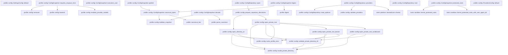
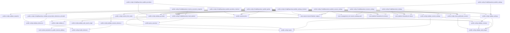
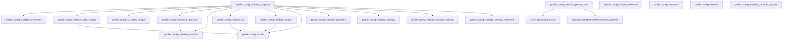

# profile::config

[Package atlas](index.md) · [Source](../../src/config.rs)

## Declarations

Visibility is the declaration spelling; trait members and reexports require their enclosing interface. `cfg` is not evaluated.

| Symbol | Kind | Visibility | Test / cfg |
|---|---|---|---|
| [profile::config::FORMAT](../../src/config.rs#L14) | const_item | `private` |  |
| [profile::config::MAX_SAFE_INTEGER](../../src/config.rs#L15) | const_item | `private` |  |
| [profile::config::ExecutionPolicy](../../src/config.rs#L19) | struct_item | `pub` |  |
| [profile::config::Model](../../src/config.rs#L37) | struct_item | `pub` |  |
| [profile::config::Provider](../../src/config.rs#L47) | struct_item | `pub` |  |
| [profile::config::WebSearch](../../src/config.rs#L66) | struct_item | `pub` |  |
| [profile::config::ProvidersConfig](../../src/config.rs#L74) | struct_item | `pub` |  |
| [profile::config::ProvidersConfig::default](../../src/config.rs#L83) | function_item | `private` |  |
| [profile::config::Limits](../../src/config.rs#L95) | struct_item | `pub` |  |
| [profile::config::SettingsConfig](../../src/config.rs#L104) | struct_item | `pub` |  |
| [profile::config::SessionSettings](../../src/config.rs#L117) | struct_item | `pub` |  |
| [profile::config::SettingsConfig::default](../../src/config.rs#L127) | function_item | `private` |  |
| [profile::config::ResolvedExecution](../../src/config.rs#L140) | struct_item | `pub` |  |
| [profile::config::RevisionVector](../../src/config.rs#L148) | struct_item | `pub` |  |
| [profile::config::ConfigSnapshot](../../src/config.rs#L157) | struct_item | `pub` |  |
| [profile::config::ConfigSnapshot::protected_roots](../../src/config.rs#L173) | function_item | `pub` |  |
| [profile::config::ConfigSnapshot::execution_cwd](../../src/config.rs#L181) | function_item | `pub` |  |
| [profile::config::ConfigSnapshot::canonical_bytes](../../src/config.rs#L185) | function_item | `pub` |  |
| [profile::config::ConfigSnapshot::digest](../../src/config.rs#L190) | function_item | `pub` |  |
| [profile::config::ConfigSnapshot::decode](../../src/config.rs#L194) | function_item | `pub` |  |
| [profile::config::ConfigSnapshot::publish](../../src/config.rs#L206) | function_item | `pub` |  |
| [profile::config::ConfigSnapshot::requires_respawn_from](../../src/config.rs#L220) | function_item | `pub` |  |
| [profile::config::config_document](../../src/config.rs#L244) | macro_definition | `private` |  |
| [profile::config::ConfigRepository](../../src/config.rs#L270) | struct_item | `pub` |  |
| [profile::config::invalid_private_directory](../../src/config.rs#L274) | function_item | `private` |  |
| [profile::config::validate_private_directory_fd](../../src/config.rs#L281) | function_item | `private` |  |
| [profile::config::rustix_profile_error](../../src/config.rs#L311) | function_item | `private` |  |
| [profile::config::open_directory_at](../../src/config.rs#L315) | function_item | `private` |  |
| [profile::config::open_private_root](../../src/config.rs#L349) | function_item | `private` |  |
| [profile::config::open_private_root_darwin](../../src/config.rs#L446) | function_item | `private` | #[cfg(target_os = "macos")] |
| [profile::config::open_private_root_sandboxed](../../src/config.rs#L511) | function_item | `private` | #[cfg(target_os = "macos")] |
| [profile::config::prepare_repository_directories](../../src/config.rs#L529) | function_item | `private` |  |
| [profile::config::ConfigRepository::open](../../src/config.rs#L543) | function_item | `pub` |  |
| [profile::config::ConfigRepository::root](../../src/config.rs#L550) | function_item | `pub` |  |
| [profile::config::ConfigRepository::providers](../../src/config.rs#L556) | function_item | `pub` |  |
| [profile::config::ConfigRepository::settings](../../src/config.rs#L565) | function_item | `pub` |  |
| [profile::config::ConfigRepository::publish_providers](../../src/config.rs#L573) | function_item | `pub` |  |
| [profile::config::ConfigRepository::publish_providers_checked](../../src/config.rs#L588) | function_item | `pub` |  |
| [profile::config::ConfigRepository::publish_settings](../../src/config.rs#L619) | function_item | `pub` |  |
| [profile::config::ConfigRepository::publish_settings_checked](../../src/config.rs#L632) | function_item | `pub` |  |
| [profile::config::ConfigRepository::publish_session_settings](../../src/config.rs#L655) | function_item | `pub` |  |
| [profile::config::ConfigRepository::session_settings](../../src/config.rs#L680) | function_item | `pub` |  |
| [profile::config::ConfigRepository::publish_global](../../src/config.rs#L693) | function_item | `private` |  |
| [profile::config::ConfigRepository::resolve_execution_snapshot](../../src/config.rs#L717) | function_item | `pub(crate)` |  |
| [profile::config::ConfigRepository::read_optional](../../src/config.rs#L775) | function_item | `private` |  |
| [profile::config::ConfigRepository::validate_all_provider_references_unlocked](../../src/config.rs#L786) | function_item | `private` |  |
| [profile::config::check_publication_revision](../../src/config.rs#L795) | function_item | `private` |  |
| [profile::config::revision_from_value](../../src/config.rs#L817) | function_item | `private` |  |
| [profile::config::revision_from_value::RevisionOnly](../../src/config.rs#L819) | struct_item | `private` |  |
| [profile::config::validate_common](../../src/config.rs#L834) | function_item | `private` |  |
| [profile::config::validate_providers](../../src/config.rs#L856) | function_item | `private` |  |
| [profile::config::validate_web_search_origin](../../src/config.rs#L918) | function_item | `private` |  |
| [profile::config::validate_settings](../../src/config.rs#L953) | function_item | `private` |  |
| [profile::config::validate_session_settings](../../src/config.rs#L975) | function_item | `private` |  |
| [profile::config::validate_session_reference](../../src/config.rs#L989) | function_item | `private` |  |
| [profile::config::validate_references](../../src/config.rs#L1015) | function_item | `private` |  |
| [profile::config::session_preset_tools](../../src/config.rs#L1047) | function_item | `private` |  |
| [profile::config::validate_snapshot](../../src/config.rs#L1071) | function_item | `private` |  |
| [profile::config::validate_safe_integer](../../src/config.rs#L1163) | function_item | `private` |  |
| [profile::config::is_sorted_unique](../../src/config.rs#L1174) | function_item | `private` |  |
| [profile::config::canonical_directory](../../src/config.rs#L1178) | function_item | `private` |  |
| [profile::config::validate_absolute](../../src/config.rs#L1199) | function_item | `private` |  |
| [profile::config::validate_id](../../src/config.rs#L1209) | function_item | `private` |  |
| [profile::config::validate_unique](../../src/config.rs#L1220) | function_item | `private` |  |
| [profile::config::invalid](../../src/config.rs#L1229) | function_item | `private` |  |
| [profile::config::invalid_reference](../../src/config.rs#L1236) | function_item | `private` |  |
| [profile::config::removed](../../src/config.rs#L1243) | function_item | `private` |  |
| [profile::config::lowered](../../src/config.rs#L1248) | function_item | `private` |  |
| [profile::config::enabled_provider_models](../../src/config.rs#L1256) | function_item | `private` |  |
| [profile::config::private_directory_tests::private_directory_rejects_wrong_owner](../../src/config.rs#L1281) | function_item | `private` | test; #[cfg(test)] |
| [profile::config::private_directory_tests::sandbox_fallback_rejects_a_symlinked_path](../../src/config.rs#L1293) | function_item | `private` | test; #[cfg(test)] #[cfg(target_os = "macos")] |

## Imports / reexports

| Local name | Source path | Visibility |
|---|---|---|
| `BTreeSet` | `std::collections::BTreeSet` | `private` |
| `fs` | `std::fs` | `private` |
| `OwnedFd` | `std::os::fd::OwnedFd` | `private` |
| `OpenOptionsExt` | `std::os::unix::fs::OpenOptionsExt` | `private` |
| `Path` | `std::path::Path` | `private` |
| `PathBuf` | `std::path::PathBuf` | `private` |
| `Mode` | `rustix::fs::Mode` | `private` |
| `OFlags` | `rustix::fs::OFlags` | `private` |
| `fchmod` | `rustix::fs::fchmod` | `private` |
| `fstat` | `rustix::fs::fstat` | `private` |
| `mkdirat` | `rustix::fs::mkdirat` | `private` |
| `open` | `rustix::fs::open` | `private` |
| `openat` | `rustix::fs::openat` | `private` |
| `Deserialize` | `serde::Deserialize` | `private` |
| `Serialize` | `serde::Serialize` | `private` |
| `AssetRef` | `store::AssetRef` | `private` |
| `AssetStore` | `store::AssetStore` | `private` |
| `AtomicPublisher` | `store::AtomicPublisher` | `private` |
| `NamedLock` | `store::NamedLock` | `private` |
| `ProfileError` | `crate::ProfileError` | `private` |
| `canonical_line` | `crate::canonical_line` | `private` |
| `digest` | `crate::digest` | `private` |
| `parse_canonical` | `crate::parse_canonical` | `private` |
| `open_private_root` | `super::open_private_root` | `private` |
| `validate_private_directory_fd` | `super::validate_private_directory_fd` | `private` |
| `open_private_root_sandboxed` | `super::open_private_root_sandboxed` | `private` |
| `OFlags` | `rustix::fs::OFlags` | `private` |

## Module declarations

| Module | Visibility | Attributes |
|---|---|---|
| `profile::config::private_directory_tests` | `private` | #[cfg(test)] |

## Function call graphs

Edges below are syntactically resolved calls only, including private functions. Graphs partition callers into groups of 20; they are not execution order. All unresolved sites are listed below and in the JSON inventory.

Functions 1–20: 32 direct edges

```mermaid
flowchart TD
  n0["profile::config::validate_snapshot"]
  n1["profile::config::removed"]
  n2["profile::config::lowered"]
  n3["profile::config::enabled_provider_models"]
  n4["profile::config::SettingsConfig::default"]
  n5["profile::config::ConfigSnapshot::protected_roots"]
  n6["profile::config::ConfigSnapshot::execution_cwd"]
  n7["profile::config::ConfigSnapshot::canonical_bytes"]
  n8["profile::config::ConfigSnapshot::digest"]
  n9["profile::config::ConfigSnapshot::decode"]
  n10["profile::config::ConfigSnapshot::publish"]
  n11["profile::config::ConfigSnapshot::requires_respawn_from"]
  n12["profile::config::invalid_private_directory"]
  n13["profile::config::validate_private_directory_fd"]
  n14["profile::config::rustix_profile_error"]
  n15["profile::config::open_directory_at"]
  n16["profile::config::open_private_root"]
  n17["profile::config::open_private_root_darwin"]
  n18["profile::config::open_private_root_sandboxed"]
  n19["profile::config::prepare_repository_directories"]
  n20["profile::config::ConfigRepository::open"]
  n21["profile::config::ConfigRepository::root"]
  n22["profile::config::ConfigRepository::providers"]
  n23["profile::config::ConfigRepository::read_optional"]
  n24["profile::config::ProvidersConfig::default"]
  n25["profile::config::validate_providers"]
  n26["profile::canonical_line"]
  n27["profile::digest"]
  n28["profile::parse_canonical"]
  n29["store::platform::NamedLock::shared"]
  n30["tools::sandbox::kernel_protected_roots"]
  n31["tools::sandbox::kernel_protected_roots_with_user_agent_dir"]
  n5 --> n30
  n5 --> n31
  n7 --> n0
  n7 --> n26
  n8 --> n7
  n8 --> n27
  n9 --> n0
  n9 --> n28
  n10 --> n7
  n11 --> n1
  n11 --> n2
  n11 --> n3
  n13 --> n12
  n15 --> n12
  n15 --> n13
  n15 --> n14
  n16 --> n12
  n16 --> n13
  n16 --> n14
  n16 --> n17
  n16 --> n18
  n17 --> n12
  n17 --> n13
  n17 --> n14
  n18 --> n12
  n18 --> n13
  n19 --> n15
  n19 --> n16
  n20 --> n19
  n22 --> n23
  n22 --> n25
  n22 --> n29
```

Functions 21–40: 64 direct edges

```mermaid
flowchart TD
  n0["profile::config::validate_references"]
  n1["profile::config::validate_snapshot"]
  n2["profile::config::validate_safe_integer"]
  n3["profile::config::validate_id"]
  n4["profile::config::invalid"]
  n5["profile::config::invalid_reference"]
  n6["profile::config::ConfigRepository::settings"]
  n7["profile::config::ConfigRepository::publish_providers"]
  n8["profile::config::ConfigRepository::publish_providers_checked"]
  n9["profile::config::ConfigRepository::publish_settings"]
  n10["profile::config::ConfigRepository::publish_settings_checked"]
  n11["profile::config::ConfigRepository::publish_session_settings"]
  n12["profile::config::ConfigRepository::session_settings"]
  n13["profile::config::ConfigRepository::publish_global"]
  n14["profile::config::ConfigRepository::resolve_execution_snapshot"]
  n15["profile::config::ConfigRepository::read_optional"]
  n16["profile::config::ConfigRepository::validate_all_provider_references_unlocked"]
  n17["profile::config::check_publication_revision"]
  n18["profile::config::revision_from_value"]
  n19["profile::config::validate_common"]
  n20["profile::config::validate_providers"]
  n21["profile::config::validate_web_search_origin"]
  n22["profile::config::validate_settings"]
  n23["profile::config::validate_session_settings"]
  n24["profile::config::validate_session_reference"]
  n25["profile::canonical_line"]
  n26["profile::parse_canonical"]
  n27["store::atomic::AtomicPublisher::replace"]
  n28["store::management_root::session_settings_path"]
  n29["store::platform::NamedLock::exclusive"]
  n30["store::platform::NamedLock::shared"]
  n31["tools::runtime_backends::is_public_internet_address"]
  n0 --> n5
  n6 --> n15
  n6 --> n22
  n6 --> n30
  n7 --> n13
  n7 --> n20
  n8 --> n15
  n8 --> n16
  n8 --> n17
  n8 --> n20
  n8 --> n25
  n8 --> n27
  n8 --> n29
  n8 --> n30
  n9 --> n13
  n9 --> n22
  n10 --> n0
  n10 --> n15
  n10 --> n17
  n10 --> n20
  n10 --> n22
  n10 --> n25
  n10 --> n27
  n10 --> n29
  n11 --> n15
  n11 --> n17
  n11 --> n20
  n11 --> n23
  n11 --> n24
  n11 --> n25
  n11 --> n27
  n11 --> n28
  n11 --> n29
  n12 --> n15
  n12 --> n23
  n12 --> n28
  n12 --> n30
  n13 --> n17
  n13 --> n18
  n13 --> n25
  n13 --> n26
  n13 --> n27
  n13 --> n29
  n14 --> n1
  n14 --> n15
  n14 --> n30
  n15 --> n26
  n16 --> n0
  n17 --> n2
  n19 --> n2
  n20 --> n2
  n20 --> n3
  n20 --> n4
  n20 --> n19
  n20 --> n21
  n21 --> n4
  n21 --> n31
  n22 --> n2
  n22 --> n4
  n22 --> n19
  n23 --> n3
  n23 --> n4
  n23 --> n19
  n24 --> n5
```

Functions 41–53: 18 direct edges

```mermaid
flowchart TD
  n0["profile::config::validate_references"]
  n1["profile::config::session_preset_tools"]
  n2["profile::config::validate_snapshot"]
  n3["profile::config::validate_safe_integer"]
  n4["profile::config::is_sorted_unique"]
  n5["profile::config::canonical_directory"]
  n6["profile::config::validate_absolute"]
  n7["profile::config::validate_id"]
  n8["profile::config::validate_unique"]
  n9["profile::config::invalid"]
  n10["profile::config::invalid_reference"]
  n11["profile::config::removed"]
  n12["profile::config::lowered"]
  n13["profile::config::enabled_provider_models"]
  n14["profile::config::validate_providers"]
  n15["profile::config::validate_settings"]
  n16["profile::config::validate_session_settings"]
  n17["profile::config::validate_session_reference"]
  n18["store::tail::read_genesis"]
  n19["tools::preset::ResolvedPreset::from_genesis"]
  n1 --> n18
  n1 --> n19
  n2 --> n0
  n2 --> n3
  n2 --> n4
  n2 --> n5
  n2 --> n6
  n2 --> n7
  n2 --> n8
  n2 --> n9
  n2 --> n14
  n2 --> n15
  n2 --> n16
  n2 --> n17
  n3 --> n9
  n5 --> n6
  n7 --> n9
  n8 --> n9
```

## Call sites

Includes test functions (marked in declarations). Receiver-type-required sites need type analysis/manual tracing. Calls in closures are attributed to their enclosing function; their occurrence here does not mean the closure executes immediately.

| Caller | Callee expression | Source lines | Target / classification |
|---|---|---|---|
| `default` | `Vec::new` | [87](../../src/config.rs#L87) | external-constructor-callback-or-unresolved |
| `protected_roots` | `self.user_agent_dir.as_deref().map_or_else` | [174](../../src/config.rs#L174) | receiver-type-required |
| `protected_roots` | `self.user_agent_dir.as_deref` | [174](../../src/config.rs#L174) | receiver-type-required |
| `protected_roots` | `tools::kernel_protected_roots` | [175](../../src/config.rs#L175) | [tools::sandbox::kernel_protected_roots](../../../tools/src/sandbox.rs#L179) |
| `protected_roots` | `tools::kernel_protected_roots_with_user_agent_dir` | [176](../../src/config.rs#L176) | [tools::sandbox::kernel_protected_roots_with_user_agent_dir](../../../tools/src/sandbox.rs#L200) |
| `protected_roots` | `Path::new` | [176](../../src/config.rs#L176) | external-constructor-callback-or-unresolved |
| `execution_cwd` | `self.execution.cwd.first().map` | [182](../../src/config.rs#L182) | receiver-type-required |
| `execution_cwd` | `self.execution.cwd.first` | [182](../../src/config.rs#L182) | receiver-type-required |
| `canonical_bytes` | `validate_snapshot` | [186](../../src/config.rs#L186) | [profile::config::validate_snapshot](../../src/config.rs#L1071) |
| `canonical_bytes` | `canonical_line` | [187](../../src/config.rs#L187) | [profile::canonical_line](../../src/lib.rs#L114) |
| `digest` | `Ok` | [191](../../src/config.rs#L191) | external-constructor-callback-or-unresolved |
| `digest` | `digest` | [191](../../src/config.rs#L191) | [profile::digest](../../src/lib.rs#L128) |
| `digest` | `self.canonical_bytes` | [191](../../src/config.rs#L191) | [profile::config::ConfigSnapshot::canonical_bytes](../../src/config.rs#L185) |
| `decode` | `parse_canonical` | [195](../../src/config.rs#L195) | [profile::parse_canonical](../../src/lib.rs#L69) |
| `decode` | `Err` | [197](../../src/config.rs#L197) | external-constructor-callback-or-unresolved |
| `decode` | `PathBuf::from` | [198](../../src/config.rs#L198) | external-constructor-callback-or-unresolved |
| `decode` | `validate_snapshot` | [202](../../src/config.rs#L202) | [profile::config::validate_snapshot](../../src/config.rs#L1071) |
| `decode` | `Ok` | [203](../../src/config.rs#L203) | external-constructor-callback-or-unresolved |
| `publish` | `self.canonical_bytes` | [207](../../src/config.rs#L207) | [profile::config::ConfigSnapshot::canonical_bytes](../../src/config.rs#L185) |
| `publish` | `digest` | [208](../../src/config.rs#L208) | external-constructor-callback-or-unresolved |
| `publish` | `assets.publish` | [209](../../src/config.rs#L209) | receiver-type-required |
| `publish` | `Err` | [211](../../src/config.rs#L211) | external-constructor-callback-or-unresolved |
| `publish` | `Ok` | [216](../../src/config.rs#L216) | external-constructor-callback-or-unresolved |
| `requires_respawn_from` | `removed` | [224](../../src/config.rs#L224), [226](../../src/config.rs#L226) | [profile::config::removed](../../src/config.rs#L1243) |
| `requires_respawn_from` | `lowered` | [227](../../src/config.rs#L227) | [profile::config::lowered](../../src/config.rs#L1248) |
| `requires_respawn_from` | `enabled_provider_models` | [233](../../src/config.rs#L233), [234](../../src/config.rs#L234) | [profile::config::enabled_provider_models](../../src/config.rs#L1256) |
| `requires_respawn_from` | `old_providers.is_subset` | [235](../../src/config.rs#L235) | receiver-type-required |
| `requires_respawn_from` | `previous                 .providers                 .web_search                 .as_ref()                 .is_some_and` | [236](../../src/config.rs#L236) | receiver-type-required |
| `requires_respawn_from` | `previous                 .providers                 .web_search                 .as_ref` | [236](../../src/config.rs#L236) | receiver-type-required |
| `requires_respawn_from` | `self.providers.web_search.as_ref` | [240](../../src/config.rs#L240) | receiver-type-required |
| `requires_respawn_from` | `Some` | [240](../../src/config.rs#L240) | external-constructor-callback-or-unresolved |
| `invalid_private_directory` | `path.to_path_buf` | [276](../../src/config.rs#L276) | receiver-type-required |
| `invalid_private_directory` | `reason.to_owned` | [277](../../src/config.rs#L277) | receiver-type-required |
| `validate_private_directory_fd` | `fstat(descriptor).map_err` | [286](../../src/config.rs#L286) | receiver-type-required |
| `validate_private_directory_fd` | `fstat` | [286](../../src/config.rs#L286) | external-constructor-callback-or-unresolved |
| `validate_private_directory_fd` | `Err` | [288](../../src/config.rs#L288), [294](../../src/config.rs#L294), [300](../../src/config.rs#L300) | external-constructor-callback-or-unresolved |
| `validate_private_directory_fd` | `invalid_private_directory` | [288](../../src/config.rs#L288), [294](../../src/config.rs#L294), [300](../../src/config.rs#L300) | [profile::config::invalid_private_directory](../../src/config.rs#L274) |
| `validate_private_directory_fd` | `fchmod(descriptor, Mode::RWXU).map_err` | [307](../../src/config.rs#L307) | receiver-type-required |
| `validate_private_directory_fd` | `fchmod` | [307](../../src/config.rs#L307) | external-constructor-callback-or-unresolved |
| `validate_private_directory_fd` | `Ok` | [308](../../src/config.rs#L308) | external-constructor-callback-or-unresolved |
| `rustix_profile_error` | `std::io::Error::from_raw_os_error(error.raw_os_error()).into` | [312](../../src/config.rs#L312) | receiver-type-required |
| `rustix_profile_error` | `std::io::Error::from_raw_os_error` | [312](../../src/config.rs#L312) | external-constructor-callback-or-unresolved |
| `rustix_profile_error` | `error.raw_os_error` | [312](../../src/config.rs#L312) | receiver-type-required |
| `open_directory_at` | `openat` | [323](../../src/config.rs#L323), [333](../../src/config.rs#L333) | external-constructor-callback-or-unresolved |
| `open_directory_at` | `Mode::empty` | [323](../../src/config.rs#L323), [333](../../src/config.rs#L333) | external-constructor-callback-or-unresolved |
| `open_directory_at` | `result         .as_ref()         .is_err_and` | [324](../../src/config.rs#L324) | receiver-type-required |
| `open_directory_at` | `result         .as_ref` | [324](../../src/config.rs#L324) | receiver-type-required |
| `open_directory_at` | `mkdirat` | [329](../../src/config.rs#L329) | external-constructor-callback-or-unresolved |
| `open_directory_at` | `Err` | [331](../../src/config.rs#L331), [338](../../src/config.rs#L338), [343](../../src/config.rs#L343) | external-constructor-callback-or-unresolved |
| `open_directory_at` | `rustix_profile_error` | [331](../../src/config.rs#L331), [343](../../src/config.rs#L343) | [profile::config::rustix_profile_error](../../src/config.rs#L311) |
| `open_directory_at` | `invalid_private_directory` | [338](../../src/config.rs#L338) | [profile::config::invalid_private_directory](../../src/config.rs#L274) |
| `open_directory_at` | `validate_private_directory_fd` | [345](../../src/config.rs#L345) | [profile::config::validate_private_directory_fd](../../src/config.rs#L281) |
| `open_directory_at` | `Ok` | [346](../../src/config.rs#L346) | external-constructor-callback-or-unresolved |
| `open_private_root` | `path.is_absolute` | [355](../../src/config.rs#L355), [366](../../src/config.rs#L366), [403](../../src/config.rs#L403) | receiver-type-required |
| `open_private_root` | `open_private_root_darwin` | [356](../../src/config.rs#L356) | [profile::config::open_private_root_darwin](../../src/config.rs#L446) |
| `open_private_root` | `path.strip_prefix("/var").map_or_else` | [359](../../src/config.rs#L359) | receiver-type-required |
| `open_private_root` | `path.strip_prefix` | [359](../../src/config.rs#L359) | receiver-type-required |
| `open_private_root` | `path.to_path_buf` | [360](../../src/config.rs#L360), [364](../../src/config.rs#L364) | receiver-type-required |
| `open_private_root` | `Path::new("/private/var").join` | [361](../../src/config.rs#L361) | receiver-type-required |
| `open_private_root` | `Path::new` | [361](../../src/config.rs#L361) | external-constructor-callback-or-unresolved |
| `open_private_root` | `open` | [367](../../src/config.rs#L367), [376](../../src/config.rs#L376) | external-constructor-callback-or-unresolved |
| `open_private_root` | `Mode::empty` | [367](../../src/config.rs#L367), [376](../../src/config.rs#L376), [411](../../src/config.rs#L411), [422](../../src/config.rs#L422) | external-constructor-callback-or-unresolved |
| `open_private_root` | `open_private_root_sandboxed` | [371](../../src/config.rs#L371), [428](../../src/config.rs#L428) | [profile::config::open_private_root_sandboxed](../../src/config.rs#L511) |
| `open_private_root` | `Err` | [373](../../src/config.rs#L373), [389](../../src/config.rs#L389), [397](../../src/config.rs#L397), [420](../../src/config.rs#L420), [433](../../src/config.rs#L433), [438](../../src/config.rs#L438) | external-constructor-callback-or-unresolved |
| `open_private_root` | `rustix_profile_error` | [373](../../src/config.rs#L373), [420](../../src/config.rs#L420), [438](../../src/config.rs#L438) | [profile::config::rustix_profile_error](../../src/config.rs#L311) |
| `open_private_root` | `open(".", flags, Mode::empty()).map_err` | [376](../../src/config.rs#L376) | receiver-type-required |
| `open_private_root` | `Vec::new` | [378](../../src/config.rs#L378) | external-constructor-callback-or-unresolved |
| `open_private_root` | `traversal_path.components` | [379](../../src/config.rs#L379) | receiver-type-required |
| `open_private_root` | `value.to_str().ok_or_else` | [383](../../src/config.rs#L383) | receiver-type-required |
| `open_private_root` | `value.to_str` | [383](../../src/config.rs#L383) | receiver-type-required |
| `open_private_root` | `invalid_private_directory` | [384](../../src/config.rs#L384), [389](../../src/config.rs#L389), [397](../../src/config.rs#L397), [433](../../src/config.rs#L433) | [profile::config::invalid_private_directory](../../src/config.rs#L274) |
| `open_private_root` | `components.push` | [386](../../src/config.rs#L386) | receiver-type-required |
| `open_private_root` | `value.to_owned` | [386](../../src/config.rs#L386) | receiver-type-required |
| `open_private_root` | `components.is_empty` | [396](../../src/config.rs#L396) | receiver-type-required |
| `open_private_root` | `PathBuf::from` | [404](../../src/config.rs#L404), [406](../../src/config.rs#L406) | external-constructor-callback-or-unresolved |
| `open_private_root` | `components.len` | [408](../../src/config.rs#L408) | receiver-type-required |
| `open_private_root` | `components.into_iter().enumerate` | [409](../../src/config.rs#L409) | receiver-type-required |
| `open_private_root` | `components.into_iter` | [409](../../src/config.rs#L409) | receiver-type-required |
| `open_private_root` | `traversed.push` | [410](../../src/config.rs#L410) | receiver-type-required |
| `open_private_root` | `openat` | [411](../../src/config.rs#L411), [422](../../src/config.rs#L422) | external-constructor-callback-or-unresolved |
| `open_private_root` | `result             .as_ref()             .is_err_and` | [412](../../src/config.rs#L412) | receiver-type-required |
| `open_private_root` | `result             .as_ref` | [412](../../src/config.rs#L412) | receiver-type-required |
| `open_private_root` | `mkdirat` | [418](../../src/config.rs#L418) | external-constructor-callback-or-unresolved |
| `open_private_root` | `validate_private_directory_fd` | [441](../../src/config.rs#L441) | [profile::config::validate_private_directory_fd](../../src/config.rs#L281) |
| `open_private_root` | `Ok` | [442](../../src/config.rs#L442) | external-constructor-callback-or-unresolved |
| `open_private_root_darwin` | `path.strip_prefix("/var").map_or_else` | [451](../../src/config.rs#L451) | receiver-type-required |
| `open_private_root_darwin` | `path.strip_prefix` | [451](../../src/config.rs#L451) | receiver-type-required |
| `open_private_root_darwin` | `path.to_path_buf` | [452](../../src/config.rs#L452) | receiver-type-required |
| `open_private_root_darwin` | `Path::new("/private/var").join` | [453](../../src/config.rs#L453) | receiver-type-required |
| `open_private_root_darwin` | `Path::new` | [453](../../src/config.rs#L453) | external-constructor-callback-or-unresolved |
| `open_private_root_darwin` | `path.components().any` | [455](../../src/config.rs#L455) | receiver-type-required |
| `open_private_root_darwin` | `path.components` | [455](../../src/config.rs#L455) | receiver-type-required |
| `open_private_root_darwin` | `Err` | [461](../../src/config.rs#L461), [467](../../src/config.rs#L467), [494](../../src/config.rs#L494), [499](../../src/config.rs#L499), [504](../../src/config.rs#L504) | external-constructor-callback-or-unresolved |
| `open_private_root_darwin` | `invalid_private_directory` | [461](../../src/config.rs#L461), [467](../../src/config.rs#L467), [486](../../src/config.rs#L486), [491](../../src/config.rs#L491), [499](../../src/config.rs#L499) | [profile::config::invalid_private_directory](../../src/config.rs#L274) |
| `open_private_root_darwin` | `path.file_name().is_none` | [466](../../src/config.rs#L466) | receiver-type-required |
| `open_private_root_darwin` | `path.file_name` | [466](../../src/config.rs#L466) | receiver-type-required |
| `open_private_root_darwin` | `fs::OpenOptions::new()             .read(true)             .custom_flags(libc::O_DIRECTORY &#124; libc::O_NOFOLLOW_ANY &#124; libc::O_CLOEXEC)             .open` | [476](../../src/config.rs#L476) | receiver-type-required |
| `open_private_root_darwin` | `fs::OpenOptions::new()             .read(true)             .custom_flags` | [476](../../src/config.rs#L476) | receiver-type-required |
| `open_private_root_darwin` | `fs::OpenOptions::new()             .read` | [476](../../src/config.rs#L476) | receiver-type-required |
| `open_private_root_darwin` | `fs::OpenOptions::new` | [476](../../src/config.rs#L476) | external-constructor-callback-or-unresolved |
| `open_private_root_darwin` | `Ok` | [480](../../src/config.rs#L480), [507](../../src/config.rs#L507) | external-constructor-callback-or-unresolved |
| `open_private_root_darwin` | `file.into` | [480](../../src/config.rs#L480) | receiver-type-required |
| `open_private_root_darwin` | `open_directory` | [482](../../src/config.rs#L482), [488](../../src/config.rs#L488), [496](../../src/config.rs#L496) | external-constructor-callback-or-unresolved |
| `open_private_root_darwin` | `error.kind` | [484](../../src/config.rs#L484) | receiver-type-required |
| `open_private_root_darwin` | `path.parent().ok_or_else` | [485](../../src/config.rs#L485) | receiver-type-required |
| `open_private_root_darwin` | `path.parent` | [485](../../src/config.rs#L485) | receiver-type-required |
| `open_private_root_darwin` | `open_directory(parent_path).map_err` | [488](../../src/config.rs#L488) | receiver-type-required |
| `open_private_root_darwin` | `path                 .file_name()                 .ok_or_else` | [489](../../src/config.rs#L489) | receiver-type-required |
| `open_private_root_darwin` | `path                 .file_name` | [489](../../src/config.rs#L489) | receiver-type-required |
| `open_private_root_darwin` | `mkdirat` | [492](../../src/config.rs#L492) | external-constructor-callback-or-unresolved |
| `open_private_root_darwin` | `rustix_profile_error` | [494](../../src/config.rs#L494) | [profile::config::rustix_profile_error](../../src/config.rs#L311) |
| `open_private_root_darwin` | `open_directory(&path).map_err` | [496](../../src/config.rs#L496) | receiver-type-required |
| `open_private_root_darwin` | `error.raw_os_error` | [498](../../src/config.rs#L498) | receiver-type-required |
| `open_private_root_darwin` | `Some` | [498](../../src/config.rs#L498) | external-constructor-callback-or-unresolved |
| `open_private_root_darwin` | `ProfileError::from` | [504](../../src/config.rs#L504) | external-constructor-callback-or-unresolved |
| `open_private_root_darwin` | `validate_private_directory_fd` | [506](../../src/config.rs#L506) | [profile::config::validate_private_directory_fd](../../src/config.rs#L281) |
| `open_private_root_sandboxed` | `fs::canonicalize` | [517](../../src/config.rs#L517) | external-constructor-callback-or-unresolved |
| `open_private_root_sandboxed` | `Err` | [519](../../src/config.rs#L519) | external-constructor-callback-or-unresolved |
| `open_private_root_sandboxed` | `invalid_private_directory` | [519](../../src/config.rs#L519) | [profile::config::invalid_private_directory](../../src/config.rs#L274) |
| `open_private_root_sandboxed` | `open(&canonical, flags, Mode::empty()).map_err` | [524](../../src/config.rs#L524) | receiver-type-required |
| `open_private_root_sandboxed` | `open` | [524](../../src/config.rs#L524) | external-constructor-callback-or-unresolved |
| `open_private_root_sandboxed` | `Mode::empty` | [524](../../src/config.rs#L524) | external-constructor-callback-or-unresolved |
| `open_private_root_sandboxed` | `validate_private_directory_fd` | [525](../../src/config.rs#L525) | [profile::config::validate_private_directory_fd](../../src/config.rs#L281) |
| `open_private_root_sandboxed` | `Ok` | [526](../../src/config.rs#L526) | external-constructor-callback-or-unresolved |
| `prepare_repository_directories` | `rustix::process::geteuid().as_raw` | [530](../../src/config.rs#L530) | receiver-type-required |
| `prepare_repository_directories` | `rustix::process::geteuid` | [530](../../src/config.rs#L530) | external-constructor-callback-or-unresolved |
| `prepare_repository_directories` | `open_private_root` | [531](../../src/config.rs#L531) | [profile::config::open_private_root](../../src/config.rs#L349) |
| `prepare_repository_directories` | `open_directory_at` | [532](../../src/config.rs#L532) | [profile::config::open_directory_at](../../src/config.rs#L315) |
| `prepare_repository_directories` | `root.join` | [535](../../src/config.rs#L535) | receiver-type-required |
| `prepare_repository_directories` | `Ok` | [539](../../src/config.rs#L539) | external-constructor-callback-or-unresolved |
| `open` | `root.as_ref().to_path_buf` | [544](../../src/config.rs#L544) | receiver-type-required |
| `open` | `root.as_ref` | [544](../../src/config.rs#L544) | receiver-type-required |
| `open` | `prepare_repository_directories` | [545](../../src/config.rs#L545) | [profile::config::prepare_repository_directories](../../src/config.rs#L529) |
| `open` | `Ok` | [546](../../src/config.rs#L546) | external-constructor-callback-or-unresolved |
| `providers` | `NamedLock::shared` | [557](../../src/config.rs#L557) | [store::platform::NamedLock::shared](../../../store/src/platform.rs#L99) |
| `providers` | `self.root.join` | [557](../../src/config.rs#L557), [558](../../src/config.rs#L558) | receiver-type-required |
| `providers` | `self.read_optional(&path)?.unwrap_or_default` | [559](../../src/config.rs#L559) | receiver-type-required |
| `providers` | `self.read_optional` | [559](../../src/config.rs#L559) | [profile::config::ConfigRepository::read_optional](../../src/config.rs#L775) |
| `providers` | `validate_providers` | [560](../../src/config.rs#L560) | [profile::config::validate_providers](../../src/config.rs#L856) |
| `providers` | `Ok` | [561](../../src/config.rs#L561) | external-constructor-callback-or-unresolved |
| `settings` | `NamedLock::shared` | [566](../../src/config.rs#L566) | [store::platform::NamedLock::shared](../../../store/src/platform.rs#L99) |
| `settings` | `self.root.join` | [566](../../src/config.rs#L566), [567](../../src/config.rs#L567) | receiver-type-required |
| `settings` | `self.read_optional(&path)?.unwrap_or_default` | [568](../../src/config.rs#L568) | receiver-type-required |
| `settings` | `self.read_optional` | [568](../../src/config.rs#L568) | [profile::config::ConfigRepository::read_optional](../../src/config.rs#L775) |
| `settings` | `validate_settings` | [569](../../src/config.rs#L569) | [profile::config::validate_settings](../../src/config.rs#L953) |
| `settings` | `Ok` | [570](../../src/config.rs#L570) | external-constructor-callback-or-unresolved |
| `publish_providers` | `self.root.join` | [578](../../src/config.rs#L578) | receiver-type-required |
| `publish_providers` | `self.publish_global` | [579](../../src/config.rs#L579) | [profile::config::ConfigRepository::publish_global](../../src/config.rs#L693) |
| `publish_providers` | `validate_providers` | [580](../../src/config.rs#L580) | [profile::config::validate_providers](../../src/config.rs#L856) |
| `publish_providers_checked` | `self.root.join` | [593](../../src/config.rs#L593), [597](../../src/config.rs#L597), [602](../../src/config.rs#L602), [612](../../src/config.rs#L612) | receiver-type-required |
| `publish_providers_checked` | `management_path             .exists()             .then(&#124;&#124; NamedLock::shared(&management_path))             .transpose` | [598](../../src/config.rs#L598) | receiver-type-required |
| `publish_providers_checked` | `management_path             .exists()             .then` | [598](../../src/config.rs#L598) | receiver-type-required |
| `publish_providers_checked` | `management_path             .exists` | [598](../../src/config.rs#L598) | receiver-type-required |
| `publish_providers_checked` | `NamedLock::shared` | [600](../../src/config.rs#L600) | [store::platform::NamedLock::shared](../../../store/src/platform.rs#L99) |
| `publish_providers_checked` | `NamedLock::exclusive` | [602](../../src/config.rs#L602) | [store::platform::NamedLock::exclusive](../../../store/src/platform.rs#L103) |
| `publish_providers_checked` | `self             .read_optional::<ProvidersConfig>(&path)?             .unwrap_or_default` | [603](../../src/config.rs#L603) | receiver-type-required |
| `publish_providers_checked` | `self             .read_optional::<ProvidersConfig>` | [603](../../src/config.rs#L603) | [profile::config::ConfigRepository::read_optional](../../src/config.rs#L775) |
| `publish_providers_checked` | `validate_providers` | [606](../../src/config.rs#L606), [608](../../src/config.rs#L608) | [profile::config::validate_providers](../../src/config.rs#L856) |
| `publish_providers_checked` | `check_publication_revision` | [607](../../src/config.rs#L607) | [profile::config::check_publication_revision](../../src/config.rs#L795) |
| `publish_providers_checked` | `self.validate_all_provider_references_unlocked` | [609](../../src/config.rs#L609) | [profile::config::ConfigRepository::validate_all_provider_references_unlocked](../../src/config.rs#L786) |
| `publish_providers_checked` | `self                 .read_optional::<SettingsConfig>(&self.root.join("config/settings.json"))?                 .unwrap_or_default` | [611](../../src/config.rs#L611) | receiver-type-required |
| `publish_providers_checked` | `self                 .read_optional::<SettingsConfig>` | [611](../../src/config.rs#L611) | [profile::config::ConfigRepository::read_optional](../../src/config.rs#L775) |
| `publish_providers_checked` | `AtomicPublisher::replace` | [615](../../src/config.rs#L615) | [store::atomic::AtomicPublisher::replace](../../../store/src/atomic.rs#L16) |
| `publish_providers_checked` | `canonical_line` | [615](../../src/config.rs#L615) | [profile::canonical_line](../../src/lib.rs#L114) |
| `publish_providers_checked` | `Ok` | [616](../../src/config.rs#L616) | external-constructor-callback-or-unresolved |
| `publish_settings` | `self.root.join` | [624](../../src/config.rs#L624) | receiver-type-required |
| `publish_settings` | `self.publish_global` | [625](../../src/config.rs#L625) | [profile::config::ConfigRepository::publish_global](../../src/config.rs#L693) |
| `publish_settings` | `validate_settings` | [626](../../src/config.rs#L626) | [profile::config::validate_settings](../../src/config.rs#L953) |
| `publish_settings_checked` | `self.root.join` | [637](../../src/config.rs#L637), [638](../../src/config.rs#L638), [639](../../src/config.rs#L639) | receiver-type-required |
| `publish_settings_checked` | `NamedLock::exclusive` | [639](../../src/config.rs#L639) | [store::platform::NamedLock::exclusive](../../../store/src/platform.rs#L103) |
| `publish_settings_checked` | `self             .read_optional::<SettingsConfig>(&path)?             .unwrap_or_default` | [640](../../src/config.rs#L640) | receiver-type-required |
| `publish_settings_checked` | `self             .read_optional::<SettingsConfig>` | [640](../../src/config.rs#L640) | [profile::config::ConfigRepository::read_optional](../../src/config.rs#L775) |
| `publish_settings_checked` | `validate_settings` | [643](../../src/config.rs#L643), [645](../../src/config.rs#L645) | [profile::config::validate_settings](../../src/config.rs#L953) |
| `publish_settings_checked` | `check_publication_revision` | [644](../../src/config.rs#L644) | [profile::config::check_publication_revision](../../src/config.rs#L795) |
| `publish_settings_checked` | `self             .read_optional::<ProvidersConfig>(&providers_path)?             .unwrap_or_default` | [646](../../src/config.rs#L646) | receiver-type-required |
| `publish_settings_checked` | `self             .read_optional::<ProvidersConfig>` | [646](../../src/config.rs#L646) | [profile::config::ConfigRepository::read_optional](../../src/config.rs#L775) |
| `publish_settings_checked` | `validate_providers` | [649](../../src/config.rs#L649) | [profile::config::validate_providers](../../src/config.rs#L856) |
| `publish_settings_checked` | `validate_references` | [650](../../src/config.rs#L650) | [profile::config::validate_references](../../src/config.rs#L1015) |
| `publish_settings_checked` | `AtomicPublisher::replace` | [651](../../src/config.rs#L651) | [store::atomic::AtomicPublisher::replace](../../../store/src/atomic.rs#L16) |
| `publish_settings_checked` | `canonical_line` | [651](../../src/config.rs#L651) | [profile::canonical_line](../../src/lib.rs#L114) |
| `publish_settings_checked` | `Ok` | [652](../../src/config.rs#L652) | external-constructor-callback-or-unresolved |
| `publish_session_settings` | `store::session_settings_path` | [661](../../src/config.rs#L661) | [store::management_root::session_settings_path](../../../store/src/management_root.rs#L44) |
| `publish_session_settings` | `session_folder.as_ref` | [661](../../src/config.rs#L661) | receiver-type-required |
| `publish_session_settings` | `NamedLock::exclusive` | [662](../../src/config.rs#L662) | [store::platform::NamedLock::exclusive](../../../store/src/platform.rs#L103) |
| `publish_session_settings` | `self.root.join` | [662](../../src/config.rs#L662), [672](../../src/config.rs#L672) | receiver-type-required |
| `publish_session_settings` | `self.read_optional::<SessionSettings>` | [663](../../src/config.rs#L663) | [profile::config::ConfigRepository::read_optional](../../src/config.rs#L775) |
| `publish_session_settings` | `validate_session_settings` | [665](../../src/config.rs#L665), [671](../../src/config.rs#L671) | [profile::config::validate_session_settings](../../src/config.rs#L975) |
| `publish_session_settings` | `check_publication_revision` | [670](../../src/config.rs#L670) | [profile::config::check_publication_revision](../../src/config.rs#L795) |
| `publish_session_settings` | `self.read_optional(&providers_path)?.unwrap_or_default` | [673](../../src/config.rs#L673) | receiver-type-required |
| `publish_session_settings` | `self.read_optional` | [673](../../src/config.rs#L673) | [profile::config::ConfigRepository::read_optional](../../src/config.rs#L775) |
| `publish_session_settings` | `validate_providers` | [674](../../src/config.rs#L674) | [profile::config::validate_providers](../../src/config.rs#L856) |
| `publish_session_settings` | `validate_session_reference` | [675](../../src/config.rs#L675) | [profile::config::validate_session_reference](../../src/config.rs#L989) |
| `publish_session_settings` | `Some` | [675](../../src/config.rs#L675) | external-constructor-callback-or-unresolved |
| `publish_session_settings` | `value.clone` | [675](../../src/config.rs#L675) | receiver-type-required |
| `publish_session_settings` | `AtomicPublisher::replace` | [676](../../src/config.rs#L676) | [store::atomic::AtomicPublisher::replace](../../../store/src/atomic.rs#L16) |
| `publish_session_settings` | `canonical_line` | [676](../../src/config.rs#L676) | [profile::canonical_line](../../src/lib.rs#L114) |
| `publish_session_settings` | `Ok` | [677](../../src/config.rs#L677) | external-constructor-callback-or-unresolved |
| `session_settings` | `NamedLock::shared` | [684](../../src/config.rs#L684) | [store::platform::NamedLock::shared](../../../store/src/platform.rs#L99) |
| `session_settings` | `self.root.join` | [684](../../src/config.rs#L684) | receiver-type-required |
| `session_settings` | `store::session_settings_path` | [685](../../src/config.rs#L685) | [store::management_root::session_settings_path](../../../store/src/management_root.rs#L44) |
| `session_settings` | `session_folder.as_ref` | [685](../../src/config.rs#L685) | receiver-type-required |
| `session_settings` | `self.read_optional::<SessionSettings>` | [686](../../src/config.rs#L686) | [profile::config::ConfigRepository::read_optional](../../src/config.rs#L775) |
| `session_settings` | `validate_session_settings` | [688](../../src/config.rs#L688) | [profile::config::validate_session_settings](../../src/config.rs#L975) |
| `session_settings` | `Ok` | [690](../../src/config.rs#L690) | external-constructor-callback-or-unresolved |
| `publish_global` | `NamedLock::exclusive` | [701](../../src/config.rs#L701) | [store::platform::NamedLock::exclusive](../../../store/src/platform.rs#L103) |
| `publish_global` | `self.root.join` | [701](../../src/config.rs#L701) | receiver-type-required |
| `publish_global` | `fs::read` | [702](../../src/config.rs#L702) | external-constructor-callback-or-unresolved |
| `publish_global` | `parse_canonical` | [704](../../src/config.rs#L704) | [profile::parse_canonical](../../src/lib.rs#L69) |
| `publish_global` | `validate` | [705](../../src/config.rs#L705), [712](../../src/config.rs#L712) | external-constructor-callback-or-unresolved |
| `publish_global` | `revision_from_value` | [706](../../src/config.rs#L706) | [profile::config::revision_from_value](../../src/config.rs#L817) |
| `publish_global` | `error.kind` | [708](../../src/config.rs#L708) | receiver-type-required |
| `publish_global` | `Err` | [709](../../src/config.rs#L709) | external-constructor-callback-or-unresolved |
| `publish_global` | `error.into` | [709](../../src/config.rs#L709) | receiver-type-required |
| `publish_global` | `check_publication_revision` | [711](../../src/config.rs#L711) | [profile::config::check_publication_revision](../../src/config.rs#L795) |
| `publish_global` | `AtomicPublisher::replace` | [713](../../src/config.rs#L713) | [store::atomic::AtomicPublisher::replace](../../../store/src/atomic.rs#L16) |
| `publish_global` | `canonical_line` | [713](../../src/config.rs#L713) | [profile::canonical_line](../../src/lib.rs#L114) |
| `publish_global` | `Ok` | [714](../../src/config.rs#L714) | external-constructor-callback-or-unresolved |
| `resolve_execution_snapshot` | `NamedLock::shared` | [723](../../src/config.rs#L723) | [store::platform::NamedLock::shared](../../../store/src/platform.rs#L99) |
| `resolve_execution_snapshot` | `self.root.join` | [723](../../src/config.rs#L723), [725](../../src/config.rs#L725), [728](../../src/config.rs#L728) | receiver-type-required |
| `resolve_execution_snapshot` | `self             .read_optional(&self.root.join("config/providers.json"))?             .unwrap_or_default` | [724](../../src/config.rs#L724) | receiver-type-required |
| `resolve_execution_snapshot` | `self             .read_optional` | [724](../../src/config.rs#L724), [727](../../src/config.rs#L727) | [profile::config::ConfigRepository::read_optional](../../src/config.rs#L775) |
| `resolve_execution_snapshot` | `self             .read_optional(&self.root.join("config/settings.json"))?             .unwrap_or_default` | [727](../../src/config.rs#L727) | receiver-type-required |
| `resolve_execution_snapshot` | `session_folder             .map(store::session_settings_path)             .transpose()?             .map(&#124;path&#124; self.read_optional::<SessionSettings>(&path))             .transpose()?             .flatten` | [730](../../src/config.rs#L730) | receiver-type-required |
| `resolve_execution_snapshot` | `session_folder             .map(store::session_settings_path)             .transpose()?             .map(&#124;path&#124; self.read_optional::<SessionSettings>(&path))             .transpose` | [730](../../src/config.rs#L730) | receiver-type-required |
| `resolve_execution_snapshot` | `session_folder             .map(store::session_settings_path)             .transpose()?             .map` | [730](../../src/config.rs#L730) | receiver-type-required |
| `resolve_execution_snapshot` | `session_folder             .map(store::session_settings_path)             .transpose` | [730](../../src/config.rs#L730) | receiver-type-required |
| `resolve_execution_snapshot` | `session_folder             .map` | [730](../../src/config.rs#L730), [737](../../src/config.rs#L737) | receiver-type-required |
| `resolve_execution_snapshot` | `self.read_optional::<SessionSettings>` | [733](../../src/config.rs#L733) | [profile::config::ConfigRepository::read_optional](../../src/config.rs#L775) |
| `resolve_execution_snapshot` | `execution.allowed_tools.clone` | [736](../../src/config.rs#L736) | receiver-type-required |
| `resolve_execution_snapshot` | `session_folder             .map(session_preset_tools)             .transpose()?             .flatten` | [737](../../src/config.rs#L737) | receiver-type-required |
| `resolve_execution_snapshot` | `session_folder             .map(session_preset_tools)             .transpose` | [737](../../src/config.rs#L737) | receiver-type-required |
| `resolve_execution_snapshot` | `allowed_tools.retain` | [742](../../src/config.rs#L742) | receiver-type-required |
| `resolve_execution_snapshot` | `selection.contains` | [742](../../src/config.rs#L742) | receiver-type-required |
| `resolve_execution_snapshot` | `session_id.to_owned` | [748](../../src/config.rs#L748) | receiver-type-required |
| `resolve_execution_snapshot` | `std::iter::once(&execution.cwd)                     .chain(&execution.read_roots)                     .cloned()                     .collect` | [750](../../src/config.rs#L750) | receiver-type-required |
| `resolve_execution_snapshot` | `std::iter::once(&execution.cwd)                     .chain(&execution.read_roots)                     .cloned` | [750](../../src/config.rs#L750) | receiver-type-required |
| `resolve_execution_snapshot` | `std::iter::once(&execution.cwd)                     .chain` | [750](../../src/config.rs#L750) | receiver-type-required |
| `resolve_execution_snapshot` | `std::iter::once` | [750](../../src/config.rs#L750) | external-constructor-callback-or-unresolved |
| `resolve_execution_snapshot` | `execution.writable_roots.clone` | [755](../../src/config.rs#L755) | receiver-type-required |
| `resolve_execution_snapshot` | `execution.toolchain_roots.clone` | [756](../../src/config.rs#L756) | receiver-type-required |
| `resolve_execution_snapshot` | `session_settings.as_ref().map` | [765](../../src/config.rs#L765) | receiver-type-required |
| `resolve_execution_snapshot` | `session_settings.as_ref` | [765](../../src/config.rs#L765) | receiver-type-required |
| `resolve_execution_snapshot` | `validate_snapshot` | [771](../../src/config.rs#L771) | [profile::config::validate_snapshot](../../src/config.rs#L1071) |
| `resolve_execution_snapshot` | `Ok` | [772](../../src/config.rs#L772) | external-constructor-callback-or-unresolved |
| `read_optional` | `fs::read` | [779](../../src/config.rs#L779) | external-constructor-callback-or-unresolved |
| `read_optional` | `Ok` | [780](../../src/config.rs#L780), [781](../../src/config.rs#L781) | external-constructor-callback-or-unresolved |
| `read_optional` | `Some` | [780](../../src/config.rs#L780) | external-constructor-callback-or-unresolved |
| `read_optional` | `parse_canonical` | [780](../../src/config.rs#L780) | [profile::parse_canonical](../../src/lib.rs#L69) |
| `read_optional` | `error.kind` | [781](../../src/config.rs#L781) | receiver-type-required |
| `read_optional` | `Err` | [782](../../src/config.rs#L782) | external-constructor-callback-or-unresolved |
| `read_optional` | `error.into` | [782](../../src/config.rs#L782) | receiver-type-required |
| `validate_all_provider_references_unlocked` | `validate_references` | [791](../../src/config.rs#L791) | [profile::config::validate_references](../../src/config.rs#L1015) |
| `validate_all_provider_references_unlocked` | `Path::new` | [791](../../src/config.rs#L791) | external-constructor-callback-or-unresolved |
| `check_publication_revision` | `validate_safe_integer` | [796](../../src/config.rs#L796), [797](../../src/config.rs#L797), [798](../../src/config.rs#L798) | [profile::config::validate_safe_integer](../../src/config.rs#L1163) |
| `check_publication_revision` | `Path::new` | [796](../../src/config.rs#L796), [797](../../src/config.rs#L797), [798](../../src/config.rs#L798) | external-constructor-callback-or-unresolved |
| `check_publication_revision` | `Err` | [800](../../src/config.rs#L800), [809](../../src/config.rs#L809) | external-constructor-callback-or-unresolved |
| `check_publication_revision` | `actual         .checked_add(1)         .ok_or_else` | [802](../../src/config.rs#L802) | receiver-type-required |
| `check_publication_revision` | `actual         .checked_add` | [802](../../src/config.rs#L802) | receiver-type-required |
| `check_publication_revision` | `PathBuf::from` | [805](../../src/config.rs#L805), [810](../../src/config.rs#L810) | external-constructor-callback-or-unresolved |
| `check_publication_revision` | `"revision cannot advance beyond the I-JSON safe-integer range".to_owned` | [806](../../src/config.rs#L806) | receiver-type-required |
| `check_publication_revision` | `Ok` | [814](../../src/config.rs#L814) | external-constructor-callback-or-unresolved |
| `revision_from_value` | `serde_json::to_value(value).map_err` | [822](../../src/config.rs#L822) | receiver-type-required |
| `revision_from_value` | `serde_json::to_value` | [822](../../src/config.rs#L822) | external-constructor-callback-or-unresolved |
| `revision_from_value` | `path.to_path_buf` | [823](../../src/config.rs#L823), [829](../../src/config.rs#L829) | receiver-type-required |
| `revision_from_value` | `error.to_string` | [824](../../src/config.rs#L824), [830](../../src/config.rs#L830) | receiver-type-required |
| `revision_from_value` | `serde_json::from_value::<RevisionOnly>(value)         .map(&#124;value&#124; value.revision)         .map_err` | [826](../../src/config.rs#L826) | receiver-type-required |
| `revision_from_value` | `serde_json::from_value::<RevisionOnly>(value)         .map` | [826](../../src/config.rs#L826) | receiver-type-required |
| `revision_from_value` | `serde_json::from_value::<RevisionOnly>` | [826](../../src/config.rs#L826) | external-constructor-callback-or-unresolved |
| `validate_common` | `Err` | [841](../../src/config.rs#L841), [847](../../src/config.rs#L847) | external-constructor-callback-or-unresolved |
| `validate_common` | `path.to_path_buf` | [842](../../src/config.rs#L842), [848](../../src/config.rs#L848) | receiver-type-required |
| `validate_common` | `"stored revision must be at least 1".to_owned` | [849](../../src/config.rs#L849) | receiver-type-required |
| `validate_common` | `validate_safe_integer` | [852](../../src/config.rs#L852) | [profile::config::validate_safe_integer](../../src/config.rs#L1163) |
| `validate_common` | `Ok` | [853](../../src/config.rs#L853) | external-constructor-callback-or-unresolved |
| `validate_providers` | `validate_common` | [861](../../src/config.rs#L861) | [profile::config::validate_common](../../src/config.rs#L834) |
| `validate_providers` | `BTreeSet::new` | [862](../../src/config.rs#L862), [888](../../src/config.rs#L888) | external-constructor-callback-or-unresolved |
| `validate_providers` | `validate_id` | [864](../../src/config.rs#L864), [866](../../src/config.rs#L866), [868](../../src/config.rs#L868), [869](../../src/config.rs#L869), [870](../../src/config.rs#L870), [871](../../src/config.rs#L871), [876](../../src/config.rs#L876), [881](../../src/config.rs#L881), [886](../../src/config.rs#L886), [890](../../src/config.rs#L890), [891](../../src/config.rs#L891), [912](../../src/config.rs#L912) | [profile::config::validate_id](../../src/config.rs#L1209) |
| `validate_providers` | `ids.insert` | [882](../../src/config.rs#L882) | receiver-type-required |
| `validate_providers` | `provider.id.as_str` | [882](../../src/config.rs#L882) | receiver-type-required |
| `validate_providers` | `invalid` | [883](../../src/config.rs#L883), [898](../../src/config.rs#L898), [904](../../src/config.rs#L904), [910](../../src/config.rs#L910) | [profile::config::invalid](../../src/config.rs#L1229) |
| `validate_providers` | `validate_safe_integer` | [892](../../src/config.rs#L892), [893](../../src/config.rs#L893) | [profile::config::validate_safe_integer](../../src/config.rs#L1163) |
| `validate_providers` | `models.insert` | [903](../../src/config.rs#L903) | receiver-type-required |
| `validate_providers` | `model.id.as_str` | [903](../../src/config.rs#L903) | receiver-type-required |
| `validate_providers` | `validate_web_search_origin` | [913](../../src/config.rs#L913) | [profile::config::validate_web_search_origin](../../src/config.rs#L918) |
| `validate_providers` | `Ok` | [915](../../src/config.rs#L915) | external-constructor-callback-or-unresolved |
| `validate_web_search_origin` | `url::Url::parse(value).map_err` | [919](../../src/config.rs#L919) | receiver-type-required |
| `validate_web_search_origin` | `url::Url::parse` | [919](../../src/config.rs#L919) | external-constructor-callback-or-unresolved |
| `validate_web_search_origin` | `path.to_path_buf` | [920](../../src/config.rs#L920) | receiver-type-required |
| `validate_web_search_origin` | `"web_search endpoint is not an absolute URL".to_owned` | [921](../../src/config.rs#L921) | receiver-type-required |
| `validate_web_search_origin` | `parsed.scheme` | [923](../../src/config.rs#L923) | receiver-type-required |
| `validate_web_search_origin` | `parsed.username` | [924](../../src/config.rs#L924) | receiver-type-required |
| `validate_web_search_origin` | `parsed.password().is_some` | [925](../../src/config.rs#L925) | receiver-type-required |
| `validate_web_search_origin` | `parsed.password` | [925](../../src/config.rs#L925) | receiver-type-required |
| `validate_web_search_origin` | `parsed.query().is_some` | [926](../../src/config.rs#L926) | receiver-type-required |
| `validate_web_search_origin` | `parsed.query` | [926](../../src/config.rs#L926) | receiver-type-required |
| `validate_web_search_origin` | `parsed.fragment().is_some` | [927](../../src/config.rs#L927) | receiver-type-required |
| `validate_web_search_origin` | `parsed.fragment` | [927](../../src/config.rs#L927) | receiver-type-required |
| `validate_web_search_origin` | `parsed.path` | [928](../../src/config.rs#L928) | receiver-type-required |
| `validate_web_search_origin` | `parsed.host_str().is_none` | [929](../../src/config.rs#L929) | receiver-type-required |
| `validate_web_search_origin` | `parsed.host_str` | [929](../../src/config.rs#L929), [937](../../src/config.rs#L937) | receiver-type-required |
| `validate_web_search_origin` | `value.ends_with` | [930](../../src/config.rs#L930) | receiver-type-required |
| `validate_web_search_origin` | `invalid` | [932](../../src/config.rs#L932), [948](../../src/config.rs#L948) | [profile::config::invalid](../../src/config.rs#L1229) |
| `validate_web_search_origin` | `parsed.host_str().expect` | [937](../../src/config.rs#L937) | receiver-type-required |
| `validate_web_search_origin` | `host         .strip_prefix('[')         .and_then(&#124;value&#124; value.strip_suffix(']'))         .unwrap_or` | [938](../../src/config.rs#L938) | receiver-type-required |
| `validate_web_search_origin` | `host         .strip_prefix('[')         .and_then` | [938](../../src/config.rs#L938) | receiver-type-required |
| `validate_web_search_origin` | `host         .strip_prefix` | [938](../../src/config.rs#L938) | receiver-type-required |
| `validate_web_search_origin` | `value.strip_suffix` | [940](../../src/config.rs#L940) | receiver-type-required |
| `validate_web_search_origin` | `host.eq_ignore_ascii_case` | [942](../../src/config.rs#L942) | receiver-type-required |
| `validate_web_search_origin` | `host.ends_with` | [943](../../src/config.rs#L943) | receiver-type-required |
| `validate_web_search_origin` | `address_literal             .parse::<std::net::IpAddr>()             .is_ok_and` | [944](../../src/config.rs#L944) | receiver-type-required |
| `validate_web_search_origin` | `address_literal             .parse::<std::net::IpAddr>` | [944](../../src/config.rs#L944) | receiver-type-required |
| `validate_web_search_origin` | `tools::is_public_internet_address` | [946](../../src/config.rs#L946) | [tools::runtime_backends::is_public_internet_address](../../../tools/src/runtime_backends.rs#L1744) |
| `validate_web_search_origin` | `Ok` | [950](../../src/config.rs#L950) | external-constructor-callback-or-unresolved |
| `validate_settings` | `validate_common` | [958](../../src/config.rs#L958) | [profile::config::validate_common](../../src/config.rs#L834) |
| `validate_settings` | `Some` | [960](../../src/config.rs#L960) | external-constructor-callback-or-unresolved |
| `validate_settings` | `invalid` | [961](../../src/config.rs#L961) | [profile::config::invalid](../../src/config.rs#L1229) |
| `validate_settings` | `validate_safe_integer` | [968](../../src/config.rs#L968) | [profile::config::validate_safe_integer](../../src/config.rs#L1163) |
| `validate_settings` | `Ok` | [972](../../src/config.rs#L972) | external-constructor-callback-or-unresolved |
| `validate_session_settings` | `validate_common` | [980](../../src/config.rs#L980) | [profile::config::validate_common](../../src/config.rs#L834) |
| `validate_session_settings` | `validate_id` | [981](../../src/config.rs#L981), [982](../../src/config.rs#L982) | [profile::config::validate_id](../../src/config.rs#L1209) |
| `validate_session_settings` | `value.reasoning_effort.as_deref().is_some_and` | [983](../../src/config.rs#L983) | receiver-type-required |
| `validate_session_settings` | `value.reasoning_effort.as_deref` | [983](../../src/config.rs#L983) | receiver-type-required |
| `validate_session_settings` | `invalid` | [984](../../src/config.rs#L984) | [profile::config::invalid](../../src/config.rs#L1229) |
| `validate_session_settings` | `Ok` | [986](../../src/config.rs#L986) | external-constructor-callback-or-unresolved |
| `validate_session_reference` | `Ok` | [995](../../src/config.rs#L995), [1012](../../src/config.rs#L1012) | external-constructor-callback-or-unresolved |
| `validate_session_reference` | `providers         .providers         .iter()         .find(&#124;provider&#124; provider.id == settings.provider)         .ok_or_else` | [997](../../src/config.rs#L997) | receiver-type-required |
| `validate_session_reference` | `providers         .providers         .iter()         .find` | [997](../../src/config.rs#L997) | receiver-type-required |
| `validate_session_reference` | `providers         .providers         .iter` | [997](../../src/config.rs#L997) | receiver-type-required |
| `validate_session_reference` | `path.to_path_buf` | [1002](../../src/config.rs#L1002) | receiver-type-required |
| `validate_session_reference` | `provider         .models         .iter()         .any` | [1005](../../src/config.rs#L1005) | receiver-type-required |
| `validate_session_reference` | `provider         .models         .iter` | [1005](../../src/config.rs#L1005) | receiver-type-required |
| `validate_session_reference` | `invalid_reference` | [1010](../../src/config.rs#L1010) | [profile::config::invalid_reference](../../src/config.rs#L1236) |
| `validate_references` | `settings.default_provider.as_deref` | [1020](../../src/config.rs#L1020) | receiver-type-required |
| `validate_references` | `settings.default_model.is_some` | [1021](../../src/config.rs#L1021) | receiver-type-required |
| `validate_references` | `invalid_reference` | [1022](../../src/config.rs#L1022), [1041](../../src/config.rs#L1041) | [profile::config::invalid_reference](../../src/config.rs#L1236) |
| `validate_references` | `Ok` | [1024](../../src/config.rs#L1024), [1043](../../src/config.rs#L1043) | external-constructor-callback-or-unresolved |
| `validate_references` | `providers         .providers         .iter()         .find(&#124;provider&#124; provider.id == id)         .ok_or_else` | [1027](../../src/config.rs#L1027) | receiver-type-required |
| `validate_references` | `providers         .providers         .iter()         .find` | [1027](../../src/config.rs#L1027) | receiver-type-required |
| `validate_references` | `providers         .providers         .iter` | [1027](../../src/config.rs#L1027) | receiver-type-required |
| `validate_references` | `path.to_owned` | [1032](../../src/config.rs#L1032) | receiver-type-required |
| `validate_references` | `settings.default_model.as_deref` | [1035](../../src/config.rs#L1035) | receiver-type-required |
| `validate_references` | `provider             .models             .iter()             .any` | [1036](../../src/config.rs#L1036) | receiver-type-required |
| `validate_references` | `provider             .models             .iter` | [1036](../../src/config.rs#L1036) | receiver-type-required |
| `session_preset_tools` | `session_folder.join` | [1048](../../src/config.rs#L1048) | receiver-type-required |
| `session_preset_tools` | `ledger.is_file` | [1049](../../src/config.rs#L1049) | receiver-type-required |
| `session_preset_tools` | `Ok` | [1050](../../src/config.rs#L1050), [1053](../../src/config.rs#L1053), [1060](../../src/config.rs#L1060), [1068](../../src/config.rs#L1068) | external-constructor-callback-or-unresolved |
| `session_preset_tools` | `store::read_genesis` | [1052](../../src/config.rs#L1052) | [store::tail::read_genesis](../../../store/src/tail.rs#L86) |
| `session_preset_tools` | `serde_json::to_value(genesis.raw()).map_err` | [1055](../../src/config.rs#L1055) | receiver-type-required |
| `session_preset_tools` | `serde_json::to_value` | [1055](../../src/config.rs#L1055) | external-constructor-callback-or-unresolved |
| `session_preset_tools` | `genesis.raw` | [1055](../../src/config.rs#L1055) | receiver-type-required |
| `session_preset_tools` | `ledger.clone` | [1056](../../src/config.rs#L1056) | receiver-type-required |
| `session_preset_tools` | `error.to_string` | [1057](../../src/config.rs#L1057) | receiver-type-required |
| `session_preset_tools` | `raw.get` | [1059](../../src/config.rs#L1059) | receiver-type-required |
| `session_preset_tools` | `tools::ResolvedPreset::from_genesis(preset).map_err` | [1062](../../src/config.rs#L1062) | receiver-type-required |
| `session_preset_tools` | `tools::ResolvedPreset::from_genesis` | [1062](../../src/config.rs#L1062) | [tools::preset::ResolvedPreset::from_genesis](../../../tools/src/preset.rs#L855) |
| `validate_snapshot` | `Path::new` | [1072](../../src/config.rs#L1072), [1117](../../src/config.rs#L1117) | external-constructor-callback-or-unresolved |
| `validate_snapshot` | `validate_absolute` | [1074](../../src/config.rs#L1074), [1088](../../src/config.rs#L1088), [1100](../../src/config.rs#L1100), [1109](../../src/config.rs#L1109) | [profile::config::validate_absolute](../../src/config.rs#L1199) |
| `validate_snapshot` | `Err` | [1077](../../src/config.rs#L1077) | external-constructor-callback-or-unresolved |
| `validate_snapshot` | `path.to_path_buf` | [1078](../../src/config.rs#L1078) | receiver-type-required |
| `validate_snapshot` | `validate_id` | [1082](../../src/config.rs#L1082) | [profile::config::validate_id](../../src/config.rs#L1209) |
| `validate_snapshot` | `snapshot.execution.cwd.is_empty` | [1083](../../src/config.rs#L1083) | receiver-type-required |
| `validate_snapshot` | `invalid` | [1084](../../src/config.rs#L1084), [1090](../../src/config.rs#L1090), [1097](../../src/config.rs#L1097), [1102](../../src/config.rs#L1102), [1111](../../src/config.rs#L1111), [1119](../../src/config.rs#L1119), [1124](../../src/config.rs#L1124), [1134](../../src/config.rs#L1134), [1140](../../src/config.rs#L1140), [1155](../../src/config.rs#L1155) | [profile::config::invalid](../../src/config.rs#L1229) |
| `validate_snapshot` | `validate_unique` | [1086](../../src/config.rs#L1086) | [profile::config::validate_unique](../../src/config.rs#L1220) |
| `validate_snapshot` | `canonical_directory` | [1089](../../src/config.rs#L1089), [1101](../../src/config.rs#L1101), [1110](../../src/config.rs#L1110) | [profile::config::canonical_directory](../../src/config.rs#L1178) |
| `validate_snapshot` | `is_sorted_unique` | [1093](../../src/config.rs#L1093), [1094](../../src/config.rs#L1094), [1095](../../src/config.rs#L1095) | [profile::config::is_sorted_unique](../../src/config.rs#L1174) |
| `validate_snapshot` | `root.contains` | [1101](../../src/config.rs#L1101) | receiver-type-required |
| `validate_snapshot` | `snapshot             .execution             .cwd             .iter()             .any` | [1113](../../src/config.rs#L1113) | receiver-type-required |
| `validate_snapshot` | `snapshot             .execution             .cwd             .iter` | [1113](../../src/config.rs#L1113) | receiver-type-required |
| `validate_snapshot` | `Path::new(root).starts_with` | [1117](../../src/config.rs#L1117) | receiver-type-required |
| `validate_snapshot` | `validate_safe_integer` | [1126](../../src/config.rs#L1126) | [profile::config::validate_safe_integer](../../src/config.rs#L1163) |
| `validate_snapshot` | `validate_providers` | [1128](../../src/config.rs#L1128) | [profile::config::validate_providers](../../src/config.rs#L856) |
| `validate_snapshot` | `validate_settings` | [1129](../../src/config.rs#L1129) | [profile::config::validate_settings](../../src/config.rs#L953) |
| `validate_snapshot` | `validate_session_settings` | [1131](../../src/config.rs#L1131) | [profile::config::validate_session_settings](../../src/config.rs#L975) |
| `validate_snapshot` | `ProvidersConfig::default` | [1133](../../src/config.rs#L1133) | external-constructor-callback-or-unresolved |
| `validate_snapshot` | `SettingsConfig::default` | [1139](../../src/config.rs#L1139) | external-constructor-callback-or-unresolved |
| `validate_snapshot` | `validate_references` | [1145](../../src/config.rs#L1145) | [profile::config::validate_references](../../src/config.rs#L1015) |
| `validate_snapshot` | `validate_session_reference` | [1146](../../src/config.rs#L1146) | [profile::config::validate_session_reference](../../src/config.rs#L989) |
| `validate_snapshot` | `snapshot                 .session_settings                 .as_ref()                 .map` | [1150](../../src/config.rs#L1150) | receiver-type-required |
| `validate_snapshot` | `snapshot                 .session_settings                 .as_ref` | [1150](../../src/config.rs#L1150) | receiver-type-required |
| `validate_snapshot` | `Ok` | [1160](../../src/config.rs#L1160) | external-constructor-callback-or-unresolved |
| `validate_safe_integer` | `Ok` | [1165](../../src/config.rs#L1165) | external-constructor-callback-or-unresolved |
| `validate_safe_integer` | `invalid` | [1167](../../src/config.rs#L1167) | [profile::config::invalid](../../src/config.rs#L1229) |
| `is_sorted_unique` | `values.windows(2).all` | [1175](../../src/config.rs#L1175) | receiver-type-required |
| `is_sorted_unique` | `values.windows` | [1175](../../src/config.rs#L1175) | receiver-type-required |
| `canonical_directory` | `validate_absolute` | [1179](../../src/config.rs#L1179) | [profile::config::validate_absolute](../../src/config.rs#L1199) |
| `canonical_directory` | `fs::canonicalize(value).map_err` | [1180](../../src/config.rs#L1180) | receiver-type-required |
| `canonical_directory` | `fs::canonicalize` | [1180](../../src/config.rs#L1180) | external-constructor-callback-or-unresolved |
| `canonical_directory` | `PathBuf::from` | [1181](../../src/config.rs#L1181) | external-constructor-callback-or-unresolved |
| `canonical_directory` | `error.to_string` | [1182](../../src/config.rs#L1182) | receiver-type-required |
| `canonical_directory` | `canonical.is_dir` | [1184](../../src/config.rs#L1184) | receiver-type-required |
| `canonical_directory` | `Err` | [1185](../../src/config.rs#L1185) | external-constructor-callback-or-unresolved |
| `canonical_directory` | `"expected a directory".to_owned` | [1187](../../src/config.rs#L1187) | receiver-type-required |
| `canonical_directory` | `canonical         .to_str()         .map(ToOwned::to_owned)         .ok_or_else` | [1190](../../src/config.rs#L1190) | receiver-type-required |
| `canonical_directory` | `canonical         .to_str()         .map` | [1190](../../src/config.rs#L1190) | receiver-type-required |
| `canonical_directory` | `canonical         .to_str` | [1190](../../src/config.rs#L1190) | receiver-type-required |
| `canonical_directory` | `"path is not UTF-8".to_owned` | [1195](../../src/config.rs#L1195) | receiver-type-required |
| `validate_absolute` | `value.contains` | [1200](../../src/config.rs#L1200) | receiver-type-required |
| `validate_absolute` | `Path::new(value).is_absolute` | [1200](../../src/config.rs#L1200) | receiver-type-required |
| `validate_absolute` | `Path::new` | [1200](../../src/config.rs#L1200) | external-constructor-callback-or-unresolved |
| `validate_absolute` | `Err` | [1201](../../src/config.rs#L1201) | external-constructor-callback-or-unresolved |
| `validate_absolute` | `source.to_path_buf` | [1202](../../src/config.rs#L1202) | receiver-type-required |
| `validate_absolute` | `Ok` | [1206](../../src/config.rs#L1206) | external-constructor-callback-or-unresolved |
| `validate_id` | `value.is_empty` | [1210](../../src/config.rs#L1210) | receiver-type-required |
| `validate_id` | `value.chars().any` | [1210](../../src/config.rs#L1210) | receiver-type-required |
| `validate_id` | `value.chars` | [1210](../../src/config.rs#L1210) | receiver-type-required |
| `validate_id` | `invalid` | [1211](../../src/config.rs#L1211) | [profile::config::invalid](../../src/config.rs#L1229) |
| `validate_id` | `Ok` | [1216](../../src/config.rs#L1216) | external-constructor-callback-or-unresolved |
| `validate_unique` | `values.iter().collect::<BTreeSet<_>>` | [1221](../../src/config.rs#L1221) | receiver-type-required |
| `validate_unique` | `values.iter` | [1221](../../src/config.rs#L1221) | receiver-type-required |
| `validate_unique` | `unique.len` | [1222](../../src/config.rs#L1222) | receiver-type-required |
| `validate_unique` | `values.len` | [1222](../../src/config.rs#L1222) | receiver-type-required |
| `validate_unique` | `Ok` | [1223](../../src/config.rs#L1223) | external-constructor-callback-or-unresolved |
| `validate_unique` | `invalid` | [1225](../../src/config.rs#L1225) | [profile::config::invalid](../../src/config.rs#L1229) |
| `invalid` | `Err` | [1230](../../src/config.rs#L1230) | external-constructor-callback-or-unresolved |
| `invalid` | `path.to_path_buf` | [1231](../../src/config.rs#L1231) | receiver-type-required |
| `invalid` | `reason.to_owned` | [1232](../../src/config.rs#L1232) | receiver-type-required |
| `invalid_reference` | `Err` | [1237](../../src/config.rs#L1237) | external-constructor-callback-or-unresolved |
| `invalid_reference` | `path.to_path_buf` | [1238](../../src/config.rs#L1238) | receiver-type-required |
| `invalid_reference` | `reason.to_owned` | [1239](../../src/config.rs#L1239) | receiver-type-required |
| `removed` | `current.iter().collect::<BTreeSet<_>>` | [1244](../../src/config.rs#L1244) | receiver-type-required |
| `removed` | `current.iter` | [1244](../../src/config.rs#L1244) | receiver-type-required |
| `removed` | `previous.iter().any` | [1245](../../src/config.rs#L1245) | receiver-type-required |
| `removed` | `previous.iter` | [1245](../../src/config.rs#L1245) | receiver-type-required |
| `removed` | `current.contains` | [1245](../../src/config.rs#L1245) | receiver-type-required |
| `enabled_provider_models` | `providers         .providers         .iter()         .flat_map(&#124;provider&#124; {             provider                 .models                 .iter()                 .filter(&#124;model&#124; model.enabled)                 .map(move &#124;model&#124; (provider.id.as_str(), model.id.as_str()))         })         .collect` | [1257](../../src/config.rs#L1257) | receiver-type-required |
| `enabled_provider_models` | `providers         .providers         .iter()         .flat_map` | [1257](../../src/config.rs#L1257) | receiver-type-required |
| `enabled_provider_models` | `providers         .providers         .iter` | [1257](../../src/config.rs#L1257) | receiver-type-required |
| `enabled_provider_models` | `provider                 .models                 .iter()                 .filter(&#124;model&#124; model.enabled)                 .map` | [1261](../../src/config.rs#L1261) | receiver-type-required |
| `enabled_provider_models` | `provider                 .models                 .iter()                 .filter` | [1261](../../src/config.rs#L1261) | receiver-type-required |
| `enabled_provider_models` | `provider                 .models                 .iter` | [1261](../../src/config.rs#L1261) | receiver-type-required |
| `enabled_provider_models` | `provider.id.as_str` | [1265](../../src/config.rs#L1265) | receiver-type-required |
| `enabled_provider_models` | `model.id.as_str` | [1265](../../src/config.rs#L1265) | receiver-type-required |
| `private_directory_rejects_wrong_owner` | `tempfile::tempdir().expect` | [1282](../../src/config.rs#L1282) | receiver-type-required |
| `private_directory_rejects_wrong_owner` | `tempfile::tempdir` | [1282](../../src/config.rs#L1282) | external-constructor-callback-or-unresolved |
| `private_directory_rejects_wrong_owner` | `rustix::process::geteuid().as_raw` | [1283](../../src/config.rs#L1283) | receiver-type-required |
| `private_directory_rejects_wrong_owner` | `rustix::process::geteuid` | [1283](../../src/config.rs#L1283) | external-constructor-callback-or-unresolved |
| `private_directory_rejects_wrong_owner` | `open_private_root(root.path(), actual_uid, false).expect` | [1284](../../src/config.rs#L1284) | receiver-type-required |
| `private_directory_rejects_wrong_owner` | `open_private_root` | [1284](../../src/config.rs#L1284) | [profile::config::open_private_root](../../src/config.rs#L349) |
| `private_directory_rejects_wrong_owner` | `root.path` | [1284](../../src/config.rs#L1284), [1286](../../src/config.rs#L1286) | receiver-type-required |
| `private_directory_rejects_wrong_owner` | `validate_private_directory_fd(&descriptor, root.path(), actual_uid.wrapping_add(1))                 .expect_err` | [1286](../../src/config.rs#L1286) | receiver-type-required |
| `private_directory_rejects_wrong_owner` | `validate_private_directory_fd` | [1286](../../src/config.rs#L1286) | [profile::config::validate_private_directory_fd](../../src/config.rs#L281) |
| `private_directory_rejects_wrong_owner` | `actual_uid.wrapping_add` | [1286](../../src/config.rs#L1286) | receiver-type-required |
| `sandbox_fallback_rejects_a_symlinked_path` | `tempfile::tempdir().expect` | [1294](../../src/config.rs#L1294) | receiver-type-required |
| `sandbox_fallback_rejects_a_symlinked_path` | `tempfile::tempdir` | [1294](../../src/config.rs#L1294) | external-constructor-callback-or-unresolved |
| `sandbox_fallback_rejects_a_symlinked_path` | `root.path().join` | [1295](../../src/config.rs#L1295), [1297](../../src/config.rs#L1297) | receiver-type-required |
| `sandbox_fallback_rejects_a_symlinked_path` | `root.path` | [1295](../../src/config.rs#L1295), [1297](../../src/config.rs#L1297) | receiver-type-required |
| `sandbox_fallback_rejects_a_symlinked_path` | `std::fs::create_dir(&directory).expect` | [1296](../../src/config.rs#L1296) | receiver-type-required |
| `sandbox_fallback_rejects_a_symlinked_path` | `std::fs::create_dir` | [1296](../../src/config.rs#L1296) | external-constructor-callback-or-unresolved |
| `sandbox_fallback_rejects_a_symlinked_path` | `std::os::unix::fs::symlink(&directory, &alias).expect` | [1298](../../src/config.rs#L1298) | receiver-type-required |
| `sandbox_fallback_rejects_a_symlinked_path` | `std::os::unix::fs::symlink` | [1298](../../src/config.rs#L1298) | external-constructor-callback-or-unresolved |
| `sandbox_fallback_rejects_a_symlinked_path` | `open_private_root_sandboxed(             &alias,             &alias,             OFlags::RDONLY &#124; OFlags::DIRECTORY &#124; OFlags::CLOEXEC &#124; OFlags::NOFOLLOW,             rustix::process::geteuid().as_raw(),         )         .expect_err` | [1299](../../src/config.rs#L1299) | receiver-type-required |
| `sandbox_fallback_rejects_a_symlinked_path` | `open_private_root_sandboxed` | [1299](../../src/config.rs#L1299) | [profile::config::open_private_root_sandboxed](../../src/config.rs#L511) |
| `sandbox_fallback_rejects_a_symlinked_path` | `rustix::process::geteuid().as_raw` | [1303](../../src/config.rs#L1303) | receiver-type-required |
| `sandbox_fallback_rejects_a_symlinked_path` | `rustix::process::geteuid` | [1303](../../src/config.rs#L1303) | external-constructor-callback-or-unresolved |
