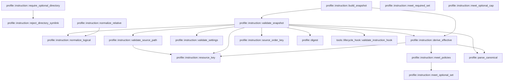

# profile::instruction

[Package atlas](index.md) · [Source](../../src/instruction.rs)

## Declarations

Visibility is the declaration spelling; trait members and reexports require their enclosing interface. `cfg` is not evaluated.

| Symbol | Kind | Visibility | Test / cfg |
|---|---|---|---|
| [profile::instruction::FORMAT](../../src/instruction.rs#L14) | const_item | `private` |  |
| [profile::instruction::MAX_FILES](../../src/instruction.rs#L15) | const_item | `private` |  |
| [profile::instruction::MAX_FILE_BYTES](../../src/instruction.rs#L16) | const_item | `private` |  |
| [profile::instruction::MAX_TOTAL_BYTES](../../src/instruction.rs#L17) | const_item | `private` |  |
| [profile::instruction::MAX_SCANS](../../src/instruction.rs#L18) | const_item | `private` |  |
| [profile::instruction::MAX_SAFE_INTEGER](../../src/instruction.rs#L19) | const_item | `private` |  |
| [profile::instruction::InstructionPolicy](../../src/instruction.rs#L23) | struct_item | `pub` |  |
| [profile::instruction::InstructionSettings](../../src/instruction.rs#L36) | struct_item | `pub` |  |
| [profile::instruction::InstructionSettings::decode](../../src/instruction.rs#L43) | function_item | `pub` |  |
| [profile::instruction::InstructionSettings::canonical_bytes](../../src/instruction.rs#L49) | function_item | `pub` |  |
| [profile::instruction::InstructionKind](../../src/instruction.rs#L57) | enum_item | `pub` |  |
| [profile::instruction::InstructionOrigin](../../src/instruction.rs#L67) | enum_item | `pub` |  |
| [profile::instruction::InstructionSource](../../src/instruction.rs#L75) | struct_item | `pub` |  |
| [profile::instruction::EffectiveInstructions](../../src/instruction.rs#L85) | struct_item | `pub` |  |
| [profile::instruction::InstructionSnapshot](../../src/instruction.rs#L95) | struct_item | `pub` |  |
| [profile::instruction::EffectivePolicy](../../src/instruction.rs#L103) | struct_item | `pub` |  |
| [profile::instruction::EffectivePolicy::digest](../../src/instruction.rs#L111) | function_item | `pub` |  |
| [profile::instruction::LaunchProfile](../../src/instruction.rs#L117) | struct_item | `pub` |  |
| [profile::instruction::LaunchProfile::resolve_and_publish_for_binding](../../src/instruction.rs#L131) | function_item | `pub` |  |
| [profile::instruction::InstructionSnapshot::canonical_bytes](../../src/instruction.rs#L174) | function_item | `pub` |  |
| [profile::instruction::InstructionSnapshot::digest](../../src/instruction.rs#L179) | function_item | `pub` |  |
| [profile::instruction::InstructionSnapshot::decode](../../src/instruction.rs#L183) | function_item | `pub` |  |
| [profile::instruction::InstructionSnapshot::publish](../../src/instruction.rs#L189) | function_item | `pub` |  |
| [profile::instruction::InstructionSnapshot::validate_against_config](../../src/instruction.rs#L202) | function_item | `pub` |  |
| [profile::instruction::InstructionSnapshot::meet_workspace_policy](../../src/instruction.rs#L256) | function_item | `pub` |  |
| [profile::instruction::InstructionResolver](../../src/instruction.rs#L277) | struct_item | `pub` |  |
| [profile::instruction::InstructionResolver::new](../../src/instruction.rs#L285) | function_item | `pub` |  |
| [profile::instruction::InstructionResolver::new_scoped](../../src/instruction.rs#L300) | function_item | `pub` |  |
| [profile::instruction::InstructionResolver::capture](../../src/instruction.rs#L315) | function_item | `pub` |  |
| [profile::instruction::InstructionResolver::capture_with_hook](../../src/instruction.rs#L319) | function_item | `pub` |  |
| [profile::instruction::InstructionResolver::scan](../../src/instruction.rs#L345) | function_item | `private` |  |
| [profile::instruction::scan_origin](../../src/instruction.rs#L406) | function_item | `private` |  |
| [profile::instruction::skill_text_resource](../../src/instruction.rs#L494) | function_item | `private` |  |
| [profile::instruction::collect_files](../../src/instruction.rs#L522) | function_item | `private` |  |
| [profile::instruction::maybe_source](../../src/instruction.rs#L554) | function_item | `private` |  |
| [profile::instruction::read_stable_file](../../src/instruction.rs#L599) | function_item | `private` |  |
| [profile::instruction::reject_directory_symlink](../../src/instruction.rs#L632) | function_item | `private` |  |
| [profile::instruction::require_optional_directory](../../src/instruction.rs#L646) | function_item | `private` |  |
| [profile::instruction::normalize_relative](../../src/instruction.rs#L657) | function_item | `private` |  |
| [profile::instruction::normalize_logical](../../src/instruction.rs#L679) | function_item | `private` |  |
| [profile::instruction::build_snapshot](../../src/instruction.rs#L694) | function_item | `private` |  |
| [profile::instruction::derive_effective](../../src/instruction.rs#L705) | function_item | `private` |  |
| [profile::instruction::resource_key](../../src/instruction.rs#L740) | function_item | `private` |  |
| [profile::instruction::meet_policies](../../src/instruction.rs#L751) | function_item | `private` |  |
| [profile::instruction::meet_optional_set](../../src/instruction.rs#L774) | function_item | `private` |  |
| [profile::instruction::meet_required_set](../../src/instruction.rs#L785) | function_item | `private` |  |
| [profile::instruction::meet_optional_cap](../../src/instruction.rs#L796) | function_item | `private` |  |
| [profile::instruction::validate_settings](../../src/instruction.rs#L804) | function_item | `private` |  |
| [profile::instruction::validate_snapshot](../../src/instruction.rs#L850) | function_item | `private` |  |
| [profile::instruction::validate_source_path](../../src/instruction.rs#L953) | function_item | `private` |  |
| [profile::instruction::source_order_key](../../src/instruction.rs#L973) | function_item | `private` |  |

## Imports / reexports

| Local name | Source path | Visibility |
|---|---|---|
| `BTreeMap` | `std::collections::BTreeMap` | `private` |
| `BTreeSet` | `std::collections::BTreeSet` | `private` |
| `fs` | `std::fs` | `private` |
| `OpenOptions` | `std::fs::OpenOptions` | `private` |
| `Read` | `std::io::Read` | `private` |
| `MetadataExt` | `std::os::unix::fs::MetadataExt` | `private` |
| `OpenOptionsExt` | `std::os::unix::fs::OpenOptionsExt` | `private` |
| `Component` | `std::path::Component` | `private` |
| `Path` | `std::path::Path` | `private` |
| `PathBuf` | `std::path::PathBuf` | `private` |
| `Deserialize` | `serde::Deserialize` | `private` |
| `Serialize` | `serde::Serialize` | `private` |
| `AssetRef` | `store::AssetRef` | `private` |
| `AssetStore` | `store::AssetStore` | `private` |
| `UnicodeNormalization` | `unicode_normalization::UnicodeNormalization` | `private` |
| `WorkspacePolicy` | `crate::config::WorkspacePolicy` | `private` |
| `ProfileError` | `crate::ProfileError` | `private` |
| `canonical_line` | `crate::canonical_line` | `private` |
| `digest` | `crate::digest` | `private` |
| `parse_canonical` | `crate::parse_canonical` | `private` |

## Module declarations

| Module | Visibility | Attributes |
|---|---|---|

## Function call graphs

Edges below are syntactically resolved calls only, including private functions. Graphs partition callers into groups of 20; they are not execution order. All unresolved sites are listed below and in the JSON inventory.

```mermaid
flowchart TD
  n0["profile::instruction::EffectivePolicy::digest"]
  n1["profile::instruction::LaunchProfile::resolve_and_publish_for_binding"]
  n2["profile::instruction::InstructionSnapshot::canonical_bytes"]
  n3["profile::instruction::InstructionSnapshot::digest"]
  n4["profile::instruction::InstructionSnapshot::decode"]
  n5["profile::instruction::InstructionSnapshot::publish"]
  n6["profile::instruction::InstructionSnapshot::validate_against_config"]
  n7["profile::instruction::InstructionSnapshot::meet_workspace_policy"]
  n8["profile::instruction::InstructionResolver::new"]
  n9["profile::instruction::InstructionResolver::new_scoped"]
  n10["profile::instruction::InstructionResolver::capture"]
  n11["profile::instruction::InstructionResolver::capture_with_hook"]
  n12["profile::instruction::InstructionResolver::scan"]
  n13["profile::instruction::scan_origin"]
  n14["profile::instruction::InstructionSettings::decode"]
  n15["profile::instruction::skill_text_resource"]
  n16["profile::instruction::InstructionSettings::canonical_bytes"]
  n17["profile::instruction::collect_files"]
  n18["profile::instruction::maybe_source"]
  n19["profile::instruction::read_stable_file"]
  n20["profile::instruction::require_optional_directory"]
  n21["profile::instruction::normalize_relative"]
  n22["profile::instruction::normalize_logical"]
  n23["profile::instruction::build_snapshot"]
  n24["profile::instruction::meet_required_set"]
  n25["profile::instruction::meet_optional_cap"]
  n26["profile::instruction::validate_settings"]
  n27["profile::instruction::validate_snapshot"]
  n28["profile::canonical_line"]
  n29["profile::digest"]
  n30["profile::parse_canonical"]
  n0 --> n28
  n0 --> n29
  n1 --> n9
  n2 --> n27
  n2 --> n28
  n3 --> n2
  n3 --> n29
  n4 --> n27
  n4 --> n30
  n5 --> n2
  n7 --> n24
  n7 --> n25
  n10 --> n11
  n11 --> n12
  n11 --> n23
  n12 --> n13
  n13 --> n15
  n13 --> n17
  n13 --> n18
  n13 --> n20
  n14 --> n26
  n14 --> n30
  n16 --> n26
  n16 --> n28
  n17 --> n17
  n17 --> n20
  n17 --> n21
  n18 --> n19
  n18 --> n22
  n18 --> n26
  n18 --> n29
  n18 --> n30
```

Functions 1–20: 32 direct edges

Functions 21–35: 18 direct edges

## Call sites

Includes test functions (marked in declarations). Receiver-type-required sites need type analysis/manual tracing. Calls in closures are attributed to their enclosing function; their occurrence here does not mean the closure executes immediately.

| Caller | Callee expression | Source lines | Target / classification |
|---|---|---|---|
| `decode` | `parse_canonical` | [44](../../src/instruction.rs#L44) | [profile::parse_canonical](../../src/lib.rs#L64) |
| `decode` | `validate_settings` | [45](../../src/instruction.rs#L45) | [profile::instruction::validate_settings](../../src/instruction.rs#L804) |
| `decode` | `Path::new` | [45](../../src/instruction.rs#L45) | external-constructor-callback-or-unresolved |
| `decode` | `Ok` | [46](../../src/instruction.rs#L46) | external-constructor-callback-or-unresolved |
| `canonical_bytes` | `validate_settings` | [50](../../src/instruction.rs#L50) | [profile::instruction::validate_settings](../../src/instruction.rs#L804) |
| `canonical_bytes` | `Path::new` | [50](../../src/instruction.rs#L50) | external-constructor-callback-or-unresolved |
| `canonical_bytes` | `canonical_line` | [51](../../src/instruction.rs#L51) | [profile::canonical_line](../../src/lib.rs#L109) |
| `digest` | `Ok` | [112](../../src/instruction.rs#L112) | external-constructor-callback-or-unresolved |
| `digest` | `digest` | [112](../../src/instruction.rs#L112) | [profile::digest](../../src/lib.rs#L123) |
| `digest` | `canonical_line` | [112](../../src/instruction.rs#L112) | [profile::canonical_line](../../src/lib.rs#L109) |
| `resolve_and_publish_for_binding` | `assets             .root()             .parent()             .ok_or_else` | [138](../../src/instruction.rs#L138) | receiver-type-required |
| `resolve_and_publish_for_binding` | `assets             .root()             .parent` | [138](../../src/instruction.rs#L138) | receiver-type-required |
| `resolve_and_publish_for_binding` | `assets             .root` | [138](../../src/instruction.rs#L138) | receiver-type-required |
| `resolve_and_publish_for_binding` | `assets.root().to_path_buf` | [142](../../src/instruction.rs#L142) | receiver-type-required |
| `resolve_and_publish_for_binding` | `assets.root` | [142](../../src/instruction.rs#L142) | receiver-type-required |
| `resolve_and_publish_for_binding` | `"thread asset directory has no session folder".to_owned` | [143](../../src/instruction.rs#L143) | receiver-type-required |
| `resolve_and_publish_for_binding` | `repository.resolve_for_session_binding` | [147](../../src/instruction.rs#L147) | receiver-type-required |
| `resolve_and_publish_for_binding` | `repository.resolve_for_session` | [149](../../src/instruction.rs#L149) | receiver-type-required |
| `resolve_and_publish_for_binding` | `InstructionResolver::new_scoped` | [151](../../src/instruction.rs#L151) | [profile::instruction::InstructionResolver::new_scoped](../../src/instruction.rs#L300) |
| `resolve_and_publish_for_binding` | `user_agent_dir.as_ref` | [152](../../src/instruction.rs#L152) | receiver-type-required |
| `resolve_and_publish_for_binding` | `repository.workspace_data_dir` | [153](../../src/instruction.rs#L153) | receiver-type-required |
| `resolve_and_publish_for_binding` | `config.workspace.cwd.iter().map` | [154](../../src/instruction.rs#L154) | receiver-type-required |
| `resolve_and_publish_for_binding` | `config.workspace.cwd.iter` | [154](../../src/instruction.rs#L154) | receiver-type-required |
| `resolve_and_publish_for_binding` | `resolver.capture` | [156](../../src/instruction.rs#L156) | receiver-type-required |
| `resolve_and_publish_for_binding` | `instruction.validate_against_config` | [157](../../src/instruction.rs#L157) | receiver-type-required |
| `resolve_and_publish_for_binding` | `instruction.meet_workspace_policy` | [158](../../src/instruction.rs#L158) | receiver-type-required |
| `resolve_and_publish_for_binding` | `config.publish` | [159](../../src/instruction.rs#L159) | receiver-type-required |
| `resolve_and_publish_for_binding` | `instruction.publish` | [160](../../src/instruction.rs#L160) | receiver-type-required |
| `resolve_and_publish_for_binding` | `Ok` | [161](../../src/instruction.rs#L161) | external-constructor-callback-or-unresolved |
| `canonical_bytes` | `validate_snapshot` | [175](../../src/instruction.rs#L175) | [profile::instruction::validate_snapshot](../../src/instruction.rs#L850) |
| `canonical_bytes` | `canonical_line` | [176](../../src/instruction.rs#L176) | [profile::canonical_line](../../src/lib.rs#L109) |
| `digest` | `Ok` | [180](../../src/instruction.rs#L180) | external-constructor-callback-or-unresolved |
| `digest` | `digest` | [180](../../src/instruction.rs#L180) | [profile::digest](../../src/lib.rs#L123) |
| `digest` | `self.canonical_bytes` | [180](../../src/instruction.rs#L180) | [profile::instruction::InstructionSnapshot::canonical_bytes](../../src/instruction.rs#L174) |
| `decode` | `parse_canonical` | [184](../../src/instruction.rs#L184) | [profile::parse_canonical](../../src/lib.rs#L64) |
| `decode` | `validate_snapshot` | [185](../../src/instruction.rs#L185) | [profile::instruction::validate_snapshot](../../src/instruction.rs#L850) |
| `decode` | `Ok` | [186](../../src/instruction.rs#L186) | external-constructor-callback-or-unresolved |
| `publish` | `self.canonical_bytes` | [190](../../src/instruction.rs#L190) | [profile::instruction::InstructionSnapshot::canonical_bytes](../../src/instruction.rs#L174) |
| `publish` | `digest` | [191](../../src/instruction.rs#L191) | external-constructor-callback-or-unresolved |
| `publish` | `assets.publish` | [192](../../src/instruction.rs#L192) | receiver-type-required |
| `publish` | `Err` | [194](../../src/instruction.rs#L194) | external-constructor-callback-or-unresolved |
| `publish` | `Ok` | [199](../../src/instruction.rs#L199) | external-constructor-callback-or-unresolved |
| `validate_against_config` | `usize::try_from(workspace_index).map_err` | [208](../../src/instruction.rs#L208) | receiver-type-required |
| `validate_against_config` | `usize::try_from` | [208](../../src/instruction.rs#L208) | external-constructor-callback-or-unresolved |
| `validate_against_config` | `PathBuf::from` | [210](../../src/instruction.rs#L210), [218](../../src/instruction.rs#L218), [230](../../src/instruction.rs#L230), [235](../../src/instruction.rs#L235), [246](../../src/instruction.rs#L246) | external-constructor-callback-or-unresolved |
| `validate_against_config` | `config.workspace.cwd.len` | [216](../../src/instruction.rs#L216) | receiver-type-required |
| `validate_against_config` | `Err` | [217](../../src/instruction.rs#L217), [234](../../src/instruction.rs#L234), [245](../../src/instruction.rs#L245) | external-constructor-callback-or-unresolved |
| `validate_against_config` | `fs::canonicalize(root).map_err` | [229](../../src/instruction.rs#L229) | receiver-type-required |
| `validate_against_config` | `fs::canonicalize` | [229](../../src/instruction.rs#L229) | external-constructor-callback-or-unresolved |
| `validate_against_config` | `error.to_string` | [231](../../src/instruction.rs#L231) | receiver-type-required |
| `validate_against_config` | `canonical.to_str` | [233](../../src/instruction.rs#L233) | receiver-type-required |
| `validate_against_config` | `Some` | [233](../../src/instruction.rs#L233) | external-constructor-callback-or-unresolved |
| `validate_against_config` | `root.as_str` | [233](../../src/instruction.rs#L233) | receiver-type-required |
| `validate_against_config` | `"instruction writable root is not canonical".to_owned` | [236](../../src/instruction.rs#L236) | receiver-type-required |
| `validate_against_config` | `config                     .workspace                     .cwd                     .iter()                     .any` | [239](../../src/instruction.rs#L239) | receiver-type-required |
| `validate_against_config` | `config                     .workspace                     .cwd                     .iter` | [239](../../src/instruction.rs#L239) | receiver-type-required |
| `validate_against_config` | `canonical.starts_with` | [243](../../src/instruction.rs#L243) | receiver-type-required |
| `validate_against_config` | `Ok` | [252](../../src/instruction.rs#L252) | external-constructor-callback-or-unresolved |
| `meet_workspace_policy` | `instruction.network.unwrap_or` | [259](../../src/instruction.rs#L259) | receiver-type-required |
| `meet_workspace_policy` | `meet_required_set` | [260](../../src/instruction.rs#L260), [264](../../src/instruction.rs#L264) | [profile::instruction::meet_required_set](../../src/instruction.rs#L785) |
| `meet_workspace_policy` | `instruction.allowed_tools.as_deref` | [262](../../src/instruction.rs#L262) | receiver-type-required |
| `meet_workspace_policy` | `instruction.writable_roots.as_deref` | [266](../../src/instruction.rs#L266) | receiver-type-required |
| `meet_workspace_policy` | `meet_optional_cap` | [268](../../src/instruction.rs#L268) | [profile::instruction::meet_optional_cap](../../src/instruction.rs#L796) |
| `new` | `user_agent_dir.as_ref().to_path_buf` | [290](../../src/instruction.rs#L290) | receiver-type-required |
| `new` | `user_agent_dir.as_ref` | [290](../../src/instruction.rs#L290) | receiver-type-required |
| `new` | `cwd                 .into_iter()                 .map(&#124;value&#124; value.as_ref().to_path_buf())                 .collect` | [292](../../src/instruction.rs#L292) | receiver-type-required |
| `new` | `cwd                 .into_iter()                 .map` | [292](../../src/instruction.rs#L292) | receiver-type-required |
| `new` | `cwd                 .into_iter` | [292](../../src/instruction.rs#L292) | receiver-type-required |
| `new` | `value.as_ref().to_path_buf` | [294](../../src/instruction.rs#L294) | receiver-type-required |
| `new` | `value.as_ref` | [294](../../src/instruction.rs#L294) | receiver-type-required |
| `new_scoped` | `user_data_dir.as_ref().to_path_buf` | [306](../../src/instruction.rs#L306) | receiver-type-required |
| `new_scoped` | `user_data_dir.as_ref` | [306](../../src/instruction.rs#L306) | receiver-type-required |
| `new_scoped` | `Some` | [307](../../src/instruction.rs#L307) | external-constructor-callback-or-unresolved |
| `new_scoped` | `workspace_data_dir.as_ref().to_path_buf` | [307](../../src/instruction.rs#L307) | receiver-type-required |
| `new_scoped` | `workspace_data_dir.as_ref` | [307](../../src/instruction.rs#L307) | receiver-type-required |
| `new_scoped` | `cwd                 .into_iter()                 .map(&#124;value&#124; value.as_ref().to_path_buf())                 .collect` | [308](../../src/instruction.rs#L308) | receiver-type-required |
| `new_scoped` | `cwd                 .into_iter()                 .map` | [308](../../src/instruction.rs#L308) | receiver-type-required |
| `new_scoped` | `cwd                 .into_iter` | [308](../../src/instruction.rs#L308) | receiver-type-required |
| `new_scoped` | `value.as_ref().to_path_buf` | [310](../../src/instruction.rs#L310) | receiver-type-required |
| `new_scoped` | `value.as_ref` | [310](../../src/instruction.rs#L310) | receiver-type-required |
| `capture` | `self.capture_with_hook` | [316](../../src/instruction.rs#L316) | [profile::instruction::InstructionResolver::capture_with_hook](../../src/instruction.rs#L319) |
| `capture_with_hook` | `self.scan` | [325](../../src/instruction.rs#L325) | [profile::instruction::InstructionResolver::scan](../../src/instruction.rs#L345) |
| `capture_with_hook` | `after_scan` | [328](../../src/instruction.rs#L328), [334](../../src/instruction.rs#L334) | external-constructor-callback-or-unresolved |
| `capture_with_hook` | `Err` | [332](../../src/instruction.rs#L332), [340](../../src/instruction.rs#L340) | external-constructor-callback-or-unresolved |
| `capture_with_hook` | `previous.as_ref` | [335](../../src/instruction.rs#L335) | receiver-type-required |
| `capture_with_hook` | `Some` | [335](../../src/instruction.rs#L335), [338](../../src/instruction.rs#L338) | external-constructor-callback-or-unresolved |
| `capture_with_hook` | `build_snapshot` | [336](../../src/instruction.rs#L336) | [profile::instruction::build_snapshot](../../src/instruction.rs#L694) |
| `scan` | `Vec::new` | [346](../../src/instruction.rs#L346) | external-constructor-callback-or-unresolved |
| `scan` | `scan_origin` | [347](../../src/instruction.rs#L347), [354](../../src/instruction.rs#L354), [367](../../src/instruction.rs#L367) | [profile::instruction::scan_origin](../../src/instruction.rs#L406) |
| `scan` | `self.cwd.iter().enumerate` | [356](../../src/instruction.rs#L356) | receiver-type-required |
| `scan` | `self.cwd.iter` | [356](../../src/instruction.rs#L356) | receiver-type-required |
| `scan` | `fs::canonicalize(cwd).map_err` | [357](../../src/instruction.rs#L357) | receiver-type-required |
| `scan` | `fs::canonicalize` | [357](../../src/instruction.rs#L357) | external-constructor-callback-or-unresolved |
| `scan` | `cwd.clone` | [358](../../src/instruction.rs#L358) | receiver-type-required |
| `scan` | `error.to_string` | [359](../../src/instruction.rs#L359) | receiver-type-required |
| `scan` | `canonical.is_dir` | [361](../../src/instruction.rs#L361) | receiver-type-required |
| `scan` | `Err` | [362](../../src/instruction.rs#L362), [377](../../src/instruction.rs#L377), [384](../../src/instruction.rs#L384), [395](../../src/instruction.rs#L395) | external-constructor-callback-or-unresolved |
| `scan` | `"workspace cwd is not a directory".to_owned` | [364](../../src/instruction.rs#L364) | receiver-type-required |
| `scan` | `sources.len` | [376](../../src/instruction.rs#L376) | receiver-type-required |
| `scan` | `ProfileError::LimitExceeded` | [377](../../src/instruction.rs#L377), [384](../../src/instruction.rs#L384) | external-constructor-callback-or-unresolved |
| `scan` | `sources             .iter()             .map(&#124;source&#124; source.content.len() as u64)             .sum::<u64>` | [379](../../src/instruction.rs#L379) | receiver-type-required |
| `scan` | `sources             .iter()             .map` | [379](../../src/instruction.rs#L379) | receiver-type-required |
| `scan` | `sources             .iter` | [379](../../src/instruction.rs#L379) | receiver-type-required |
| `scan` | `source.content.len` | [381](../../src/instruction.rs#L381) | receiver-type-required |
| `scan` | `BTreeSet::new` | [388](../../src/instruction.rs#L388) | external-constructor-callback-or-unresolved |
| `scan` | `identities.insert` | [390](../../src/instruction.rs#L390) | receiver-type-required |
| `scan` | `source.origin.clone` | [391](../../src/instruction.rs#L391) | receiver-type-required |
| `scan` | `source.kind.clone` | [392](../../src/instruction.rs#L392) | receiver-type-required |
| `scan` | `source.path.clone` | [393](../../src/instruction.rs#L393) | receiver-type-required |
| `scan` | `PathBuf::from` | [396](../../src/instruction.rs#L396) | external-constructor-callback-or-unresolved |
| `scan` | `"instruction paths collide after NFC normalization".to_owned` | [397](../../src/instruction.rs#L397) | receiver-type-required |
| `scan` | `sources.sort_by_key` | [401](../../src/instruction.rs#L401) | receiver-type-required |
| `scan` | `Ok` | [402](../../src/instruction.rs#L402) | external-constructor-callback-or-unresolved |
| `scan_origin` | `require_optional_directory` | [412](../../src/instruction.rs#L412), [427](../../src/instruction.rs#L427), [431](../../src/instruction.rs#L431), [438](../../src/instruction.rs#L438) | [profile::instruction::require_optional_directory](../../src/instruction.rs#L646) |
| `scan_origin` | `Ok` | [413](../../src/instruction.rs#L413), [439](../../src/instruction.rs#L439), [491](../../src/instruction.rs#L491) | external-constructor-callback-or-unresolved |
| `scan_origin` | `root.join` | [415](../../src/instruction.rs#L415), [426](../../src/instruction.rs#L426), [430](../../src/instruction.rs#L430), [434](../../src/instruction.rs#L434) | receiver-type-required |
| `scan_origin` | `maybe_source` | [416](../../src/instruction.rs#L416), [441](../../src/instruction.rs#L441), [461](../../src/instruction.rs#L461), [481](../../src/instruction.rs#L481) | [profile::instruction::maybe_source](../../src/instruction.rs#L554) |
| `scan_origin` | `root.to_path_buf` | [424](../../src/instruction.rs#L424) | receiver-type-required |
| `scan_origin` | `agent.join` | [442](../../src/instruction.rs#L442), [453](../../src/instruction.rs#L453), [476](../../src/instruction.rs#L476) | receiver-type-required |
| `scan_origin` | `Vec::new` | [454](../../src/instruction.rs#L454), [477](../../src/instruction.rs#L477) | external-constructor-callback-or-unresolved |
| `scan_origin` | `collect_files` | [455](../../src/instruction.rs#L455), [478](../../src/instruction.rs#L478) | [profile::instruction::collect_files](../../src/instruction.rs#L522) |
| `scan_origin` | `files.sort_by` | [456](../../src/instruction.rs#L456), [479](../../src/instruction.rs#L479) | receiver-type-required |
| `scan_origin` | `left.0.as_bytes().cmp` | [456](../../src/instruction.rs#L456), [479](../../src/instruction.rs#L479) | receiver-type-required |
| `scan_origin` | `left.0.as_bytes` | [456](../../src/instruction.rs#L456), [479](../../src/instruction.rs#L479) | receiver-type-required |
| `scan_origin` | `right.0.as_bytes` | [456](../../src/instruction.rs#L456), [479](../../src/instruction.rs#L479) | receiver-type-required |
| `scan_origin` | `skill_text_resource` | [458](../../src/instruction.rs#L458) | [profile::instruction::skill_text_resource](../../src/instruction.rs#L494) |
| `scan_origin` | `kind.clone` | [464](../../src/instruction.rs#L464) | receiver-type-required |
| `scan_origin` | `agent             .file_name()             .is_some_and` | [471](../../src/instruction.rs#L471) | receiver-type-required |
| `scan_origin` | `agent             .file_name` | [471](../../src/instruction.rs#L471) | receiver-type-required |
| `skill_text_resource` | `relative.split('/').any` | [495](../../src/instruction.rs#L495) | receiver-type-required |
| `skill_text_resource` | `relative.split` | [495](../../src/instruction.rs#L495) | receiver-type-required |
| `skill_text_resource` | `part.starts_with` | [495](../../src/instruction.rs#L495) | receiver-type-required |
| `collect_files` | `require_optional_directory` | [527](../../src/instruction.rs#L527) | [profile::instruction::require_optional_directory](../../src/instruction.rs#L646) |
| `collect_files` | `Ok` | [528](../../src/instruction.rs#L528), [551](../../src/instruction.rs#L551) | external-constructor-callback-or-unresolved |
| `collect_files` | `fs::read_dir` | [530](../../src/instruction.rs#L530) | external-constructor-callback-or-unresolved |
| `collect_files` | `entry.path` | [532](../../src/instruction.rs#L532) | receiver-type-required |
| `collect_files` | `fs::symlink_metadata` | [533](../../src/instruction.rs#L533) | external-constructor-callback-or-unresolved |
| `collect_files` | `metadata.file_type().is_symlink` | [534](../../src/instruction.rs#L534) | receiver-type-required |
| `collect_files` | `metadata.file_type` | [534](../../src/instruction.rs#L534) | receiver-type-required |
| `collect_files` | `Err` | [535](../../src/instruction.rs#L535), [548](../../src/instruction.rs#L548) | external-constructor-callback-or-unresolved |
| `collect_files` | `ProfileError::Symlink` | [535](../../src/instruction.rs#L535) | external-constructor-callback-or-unresolved |
| `collect_files` | `metadata.is_dir` | [537](../../src/instruction.rs#L537) | receiver-type-required |
| `collect_files` | `collect_files` | [538](../../src/instruction.rs#L538) | [profile::instruction::collect_files](../../src/instruction.rs#L522) |
| `collect_files` | `metadata.is_file` | [539](../../src/instruction.rs#L539) | receiver-type-required |
| `collect_files` | `path                 .strip_prefix(root)                 .map_err` | [540](../../src/instruction.rs#L540) | receiver-type-required |
| `collect_files` | `path                 .strip_prefix` | [540](../../src/instruction.rs#L540) | receiver-type-required |
| `collect_files` | `path.clone` | [543](../../src/instruction.rs#L543) | receiver-type-required |
| `collect_files` | `"instruction path escaped its kind directory".to_owned` | [544](../../src/instruction.rs#L544) | receiver-type-required |
| `collect_files` | `output.push` | [546](../../src/instruction.rs#L546) | receiver-type-required |
| `collect_files` | `normalize_relative` | [546](../../src/instruction.rs#L546) | [profile::instruction::normalize_relative](../../src/instruction.rs#L657) |
| `collect_files` | `ProfileError::NotRegular` | [548](../../src/instruction.rs#L548) | external-constructor-callback-or-unresolved |
| `maybe_source` | `fs::symlink_metadata` | [561](../../src/instruction.rs#L561) | external-constructor-callback-or-unresolved |
| `maybe_source` | `metadata.file_type().is_symlink` | [563](../../src/instruction.rs#L563) | receiver-type-required |
| `maybe_source` | `metadata.file_type` | [563](../../src/instruction.rs#L563) | receiver-type-required |
| `maybe_source` | `Err` | [564](../../src/instruction.rs#L564), [567](../../src/instruction.rs#L567), [571](../../src/instruction.rs#L571), [579](../../src/instruction.rs#L579) | external-constructor-callback-or-unresolved |
| `maybe_source` | `ProfileError::Symlink` | [564](../../src/instruction.rs#L564) | external-constructor-callback-or-unresolved |
| `maybe_source` | `file.to_path_buf` | [564](../../src/instruction.rs#L564), [567](../../src/instruction.rs#L567), [575](../../src/instruction.rs#L575), [580](../../src/instruction.rs#L580) | receiver-type-required |
| `maybe_source` | `metadata.is_file` | [566](../../src/instruction.rs#L566) | receiver-type-required |
| `maybe_source` | `ProfileError::NotRegular` | [567](../../src/instruction.rs#L567) | external-constructor-callback-or-unresolved |
| `maybe_source` | `error.kind` | [570](../../src/instruction.rs#L570) | receiver-type-required |
| `maybe_source` | `Ok` | [570](../../src/instruction.rs#L570), [596](../../src/instruction.rs#L596) | external-constructor-callback-or-unresolved |
| `maybe_source` | `error.into` | [571](../../src/instruction.rs#L571) | receiver-type-required |
| `maybe_source` | `read_stable_file` | [573](../../src/instruction.rs#L573) | [profile::instruction::read_stable_file](../../src/instruction.rs#L599) |
| `maybe_source` | `String::from_utf8(bytes.clone()).map_err` | [574](../../src/instruction.rs#L574) | receiver-type-required |
| `maybe_source` | `String::from_utf8` | [574](../../src/instruction.rs#L574) | external-constructor-callback-or-unresolved |
| `maybe_source` | `bytes.clone` | [574](../../src/instruction.rs#L574) | receiver-type-required |
| `maybe_source` | `"instruction content is not UTF-8".to_owned` | [576](../../src/instruction.rs#L576) | receiver-type-required |
| `maybe_source` | `content.contains` | [578](../../src/instruction.rs#L578) | receiver-type-required |
| `maybe_source` | `"instruction content contains NUL".to_owned` | [581](../../src/instruction.rs#L581) | receiver-type-required |
| `maybe_source` | `parse_canonical` | [585](../../src/instruction.rs#L585) | [profile::parse_canonical](../../src/lib.rs#L64) |
| `maybe_source` | `validate_settings` | [586](../../src/instruction.rs#L586) | [profile::instruction::validate_settings](../../src/instruction.rs#L804) |
| `maybe_source` | `normalize_logical` | [588](../../src/instruction.rs#L588) | [profile::instruction::normalize_logical](../../src/instruction.rs#L679) |
| `maybe_source` | `sources.push` | [589](../../src/instruction.rs#L589) | receiver-type-required |
| `maybe_source` | `origin.clone` | [590](../../src/instruction.rs#L590) | receiver-type-required |
| `maybe_source` | `digest` | [594](../../src/instruction.rs#L594) | [profile::digest](../../src/lib.rs#L123) |
| `read_stable_file` | `OpenOptions::new()         .read(true)         .custom_flags(libc::O_CLOEXEC &#124; libc::O_NOFOLLOW)         .open` | [600](../../src/instruction.rs#L600) | receiver-type-required |
| `read_stable_file` | `OpenOptions::new()         .read(true)         .custom_flags` | [600](../../src/instruction.rs#L600) | receiver-type-required |
| `read_stable_file` | `OpenOptions::new()         .read` | [600](../../src/instruction.rs#L600) | receiver-type-required |
| `read_stable_file` | `OpenOptions::new` | [600](../../src/instruction.rs#L600) | external-constructor-callback-or-unresolved |
| `read_stable_file` | `file.metadata` | [604](../../src/instruction.rs#L604), [615](../../src/instruction.rs#L615) | receiver-type-required |
| `read_stable_file` | `before.is_file` | [605](../../src/instruction.rs#L605) | receiver-type-required |
| `read_stable_file` | `Err` | [606](../../src/instruction.rs#L606), [609](../../src/instruction.rs#L609), [618](../../src/instruction.rs#L618), [627](../../src/instruction.rs#L627) | external-constructor-callback-or-unresolved |
| `read_stable_file` | `ProfileError::NotRegular` | [606](../../src/instruction.rs#L606) | external-constructor-callback-or-unresolved |
| `read_stable_file` | `path.to_path_buf` | [606](../../src/instruction.rs#L606) | receiver-type-required |
| `read_stable_file` | `before.len` | [608](../../src/instruction.rs#L608), [613](../../src/instruction.rs#L613), [622](../../src/instruction.rs#L622) | receiver-type-required |
| `read_stable_file` | `ProfileError::LimitExceeded` | [609](../../src/instruction.rs#L609) | external-constructor-callback-or-unresolved |
| `read_stable_file` | `Vec::with_capacity` | [613](../../src/instruction.rs#L613) | external-constructor-callback-or-unresolved |
| `read_stable_file` | `file.read_to_end` | [614](../../src/instruction.rs#L614) | receiver-type-required |
| `read_stable_file` | `fs::symlink_metadata` | [616](../../src/instruction.rs#L616) | external-constructor-callback-or-unresolved |
| `read_stable_file` | `named.file_type().is_symlink` | [617](../../src/instruction.rs#L617) | receiver-type-required |
| `read_stable_file` | `named.file_type` | [617](../../src/instruction.rs#L617) | receiver-type-required |
| `read_stable_file` | `before.dev` | [620](../../src/instruction.rs#L620) | receiver-type-required |
| `read_stable_file` | `after.dev` | [620](../../src/instruction.rs#L620), [624](../../src/instruction.rs#L624) | receiver-type-required |
| `read_stable_file` | `before.ino` | [621](../../src/instruction.rs#L621) | receiver-type-required |
| `read_stable_file` | `after.ino` | [621](../../src/instruction.rs#L621), [625](../../src/instruction.rs#L625) | receiver-type-required |
| `read_stable_file` | `after.len` | [622](../../src/instruction.rs#L622) | receiver-type-required |
| `read_stable_file` | `before.modified` | [623](../../src/instruction.rs#L623) | receiver-type-required |
| `read_stable_file` | `after.modified` | [623](../../src/instruction.rs#L623) | receiver-type-required |
| `read_stable_file` | `named.dev` | [624](../../src/instruction.rs#L624) | receiver-type-required |
| `read_stable_file` | `named.ino` | [625](../../src/instruction.rs#L625) | receiver-type-required |
| `read_stable_file` | `Ok` | [629](../../src/instruction.rs#L629) | external-constructor-callback-or-unresolved |
| `reject_directory_symlink` | `fs::symlink_metadata` | [633](../../src/instruction.rs#L633) | external-constructor-callback-or-unresolved |
| `reject_directory_symlink` | `metadata.file_type().is_symlink` | [634](../../src/instruction.rs#L634) | receiver-type-required |
| `reject_directory_symlink` | `metadata.file_type` | [634](../../src/instruction.rs#L634) | receiver-type-required |
| `reject_directory_symlink` | `Err` | [635](../../src/instruction.rs#L635), [637](../../src/instruction.rs#L637) | external-constructor-callback-or-unresolved |
| `reject_directory_symlink` | `ProfileError::Symlink` | [635](../../src/instruction.rs#L635) | external-constructor-callback-or-unresolved |
| `reject_directory_symlink` | `path.to_path_buf` | [635](../../src/instruction.rs#L635), [638](../../src/instruction.rs#L638) | receiver-type-required |
| `reject_directory_symlink` | `metadata.is_dir` | [636](../../src/instruction.rs#L636) | receiver-type-required |
| `reject_directory_symlink` | `"expected instruction directory".to_owned` | [639](../../src/instruction.rs#L639) | receiver-type-required |
| `reject_directory_symlink` | `Ok` | [642](../../src/instruction.rs#L642) | external-constructor-callback-or-unresolved |
| `require_optional_directory` | `fs::symlink_metadata` | [647](../../src/instruction.rs#L647) | external-constructor-callback-or-unresolved |
| `require_optional_directory` | `reject_directory_symlink` | [649](../../src/instruction.rs#L649) | [profile::instruction::reject_directory_symlink](../../src/instruction.rs#L632) |
| `require_optional_directory` | `Ok` | [650](../../src/instruction.rs#L650), [652](../../src/instruction.rs#L652) | external-constructor-callback-or-unresolved |
| `require_optional_directory` | `error.kind` | [652](../../src/instruction.rs#L652) | receiver-type-required |
| `require_optional_directory` | `Err` | [653](../../src/instruction.rs#L653) | external-constructor-callback-or-unresolved |
| `require_optional_directory` | `error.into` | [653](../../src/instruction.rs#L653) | receiver-type-required |
| `normalize_relative` | `Vec::new` | [658](../../src/instruction.rs#L658) | external-constructor-callback-or-unresolved |
| `normalize_relative` | `path.components` | [659](../../src/instruction.rs#L659) | receiver-type-required |
| `normalize_relative` | `value.to_str().ok_or_else` | [662](../../src/instruction.rs#L662) | receiver-type-required |
| `normalize_relative` | `value.to_str` | [662](../../src/instruction.rs#L662) | receiver-type-required |
| `normalize_relative` | `path.to_path_buf` | [663](../../src/instruction.rs#L663), [670](../../src/instruction.rs#L670) | receiver-type-required |
| `normalize_relative` | `"instruction path is not UTF-8".to_owned` | [664](../../src/instruction.rs#L664) | receiver-type-required |
| `normalize_relative` | `values.push` | [666](../../src/instruction.rs#L666) | receiver-type-required |
| `normalize_relative` | `value.nfc().collect::<String>` | [666](../../src/instruction.rs#L666) | receiver-type-required |
| `normalize_relative` | `value.nfc` | [666](../../src/instruction.rs#L666) | receiver-type-required |
| `normalize_relative` | `Err` | [669](../../src/instruction.rs#L669) | external-constructor-callback-or-unresolved |
| `normalize_relative` | `"instruction path contains a non-normal component".to_owned` | [671](../../src/instruction.rs#L671) | receiver-type-required |
| `normalize_relative` | `normalize_logical` | [676](../../src/instruction.rs#L676) | [profile::instruction::normalize_logical](../../src/instruction.rs#L679) |
| `normalize_relative` | `values.join` | [676](../../src/instruction.rs#L676) | receiver-type-required |
| `normalize_logical` | `path.is_empty` | [680](../../src/instruction.rs#L680) | receiver-type-required |
| `normalize_logical` | `path.contains` | [681](../../src/instruction.rs#L681) | receiver-type-required |
| `normalize_logical` | `path             .split('/')             .any` | [682](../../src/instruction.rs#L682) | receiver-type-required |
| `normalize_logical` | `path             .split` | [682](../../src/instruction.rs#L682) | receiver-type-required |
| `normalize_logical` | `part.is_empty` | [684](../../src/instruction.rs#L684) | receiver-type-required |
| `normalize_logical` | `Err` | [686](../../src/instruction.rs#L686) | external-constructor-callback-or-unresolved |
| `normalize_logical` | `PathBuf::from` | [687](../../src/instruction.rs#L687) | external-constructor-callback-or-unresolved |
| `normalize_logical` | `"invalid logical instruction path".to_owned` | [688](../../src/instruction.rs#L688) | receiver-type-required |
| `normalize_logical` | `Ok` | [691](../../src/instruction.rs#L691) | external-constructor-callback-or-unresolved |
| `normalize_logical` | `path.nfc().collect` | [691](../../src/instruction.rs#L691) | receiver-type-required |
| `normalize_logical` | `path.nfc` | [691](../../src/instruction.rs#L691) | receiver-type-required |
| `build_snapshot` | `derive_effective` | [695](../../src/instruction.rs#L695) | [profile::instruction::derive_effective](../../src/instruction.rs#L705) |
| `build_snapshot` | `validate_snapshot` | [701](../../src/instruction.rs#L701) | [profile::instruction::validate_snapshot](../../src/instruction.rs#L850) |
| `build_snapshot` | `Ok` | [702](../../src/instruction.rs#L702) | external-constructor-callback-or-unresolved |
| `derive_effective` | `EffectiveInstructions::default` | [706](../../src/instruction.rs#L706) | external-constructor-callback-or-unresolved |
| `derive_effective` | `Vec::new` | [707](../../src/instruction.rs#L707) | external-constructor-callback-or-unresolved |
| `derive_effective` | `sources.iter().enumerate` | [708](../../src/instruction.rs#L708) | receiver-type-required |
| `derive_effective` | `sources.iter` | [708](../../src/instruction.rs#L708) | receiver-type-required |
| `derive_effective` | `effective.agents.push` | [711](../../src/instruction.rs#L711) | receiver-type-required |
| `derive_effective` | `effective                     .skills                     .insert` | [713](../../src/instruction.rs#L713) | receiver-type-required |
| `derive_effective` | `resource_key` | [715](../../src/instruction.rs#L715), [720](../../src/instruction.rs#L720), [725](../../src/instruction.rs#L725) | [profile::instruction::resource_key](../../src/instruction.rs#L740) |
| `derive_effective` | `effective                     .commands                     .insert` | [718](../../src/instruction.rs#L718) | receiver-type-required |
| `derive_effective` | `effective                     .hooks                     .insert` | [723](../../src/instruction.rs#L723) | receiver-type-required |
| `derive_effective` | `parse_canonical` | [729](../../src/instruction.rs#L729) | [profile::parse_canonical](../../src/lib.rs#L64) |
| `derive_effective` | `PathBuf::from` | [729](../../src/instruction.rs#L729) | external-constructor-callback-or-unresolved |
| `derive_effective` | `source.content.as_bytes` | [729](../../src/instruction.rs#L729) | receiver-type-required |
| `derive_effective` | `policies.push` | [731](../../src/instruction.rs#L731) | receiver-type-required |
| `derive_effective` | `meet_policies` | [736](../../src/instruction.rs#L736) | [profile::instruction::meet_policies](../../src/instruction.rs#L751) |
| `derive_effective` | `Ok` | [737](../../src/instruction.rs#L737) | external-constructor-callback-or-unresolved |
| `resource_key` | `source         .path         .strip_prefix(prefix)         .map(ToOwned::to_owned)         .ok_or_else` | [741](../../src/instruction.rs#L741) | receiver-type-required |
| `resource_key` | `source         .path         .strip_prefix(prefix)         .map` | [741](../../src/instruction.rs#L741) | receiver-type-required |
| `resource_key` | `source         .path         .strip_prefix` | [741](../../src/instruction.rs#L741) | receiver-type-required |
| `resource_key` | `PathBuf::from` | [746](../../src/instruction.rs#L746) | external-constructor-callback-or-unresolved |
| `meet_policies` | `Some` | [758](../../src/instruction.rs#L758), [763](../../src/instruction.rs#L763) | external-constructor-callback-or-unresolved |
| `meet_policies` | `network.unwrap_or` | [758](../../src/instruction.rs#L758) | receiver-type-required |
| `meet_policies` | `meet_optional_set` | [760](../../src/instruction.rs#L760), [761](../../src/instruction.rs#L761) | [profile::instruction::meet_optional_set](../../src/instruction.rs#L774) |
| `meet_policies` | `cap.map_or` | [763](../../src/instruction.rs#L763) | receiver-type-required |
| `meet_policies` | `current.min` | [763](../../src/instruction.rs#L763) | receiver-type-required |
| `meet_policies` | `tools.map` | [768](../../src/instruction.rs#L768) | receiver-type-required |
| `meet_policies` | `value.into_iter().collect` | [768](../../src/instruction.rs#L768), [769](../../src/instruction.rs#L769) | receiver-type-required |
| `meet_policies` | `value.into_iter` | [768](../../src/instruction.rs#L768), [769](../../src/instruction.rs#L769) | receiver-type-required |
| `meet_policies` | `roots.map` | [769](../../src/instruction.rs#L769) | receiver-type-required |
| `meet_optional_set` | `value.into_iter().collect::<BTreeSet<_>>` | [778](../../src/instruction.rs#L778) | receiver-type-required |
| `meet_optional_set` | `value.into_iter` | [778](../../src/instruction.rs#L778) | receiver-type-required |
| `meet_optional_set` | `Some` | [779](../../src/instruction.rs#L779) | external-constructor-callback-or-unresolved |
| `meet_optional_set` | `target.take` | [779](../../src/instruction.rs#L779) | receiver-type-required |
| `meet_optional_set` | `current.intersection(&value).cloned().collect` | [780](../../src/instruction.rs#L780) | receiver-type-required |
| `meet_optional_set` | `current.intersection(&value).cloned` | [780](../../src/instruction.rs#L780) | receiver-type-required |
| `meet_optional_set` | `current.intersection` | [780](../../src/instruction.rs#L780) | receiver-type-required |
| `meet_required_set` | `required.iter().cloned().collect::<BTreeSet<_>>` | [786](../../src/instruction.rs#L786) | receiver-type-required |
| `meet_required_set` | `required.iter().cloned` | [786](../../src/instruction.rs#L786) | receiver-type-required |
| `meet_required_set` | `required.iter` | [786](../../src/instruction.rs#L786) | receiver-type-required |
| `meet_required_set` | `constraint.iter().cloned().collect::<BTreeSet<_>>` | [789](../../src/instruction.rs#L789) | receiver-type-required |
| `meet_required_set` | `constraint.iter().cloned` | [789](../../src/instruction.rs#L789) | receiver-type-required |
| `meet_required_set` | `constraint.iter` | [789](../../src/instruction.rs#L789) | receiver-type-required |
| `meet_required_set` | `required.intersection(&constraint).cloned().collect` | [790](../../src/instruction.rs#L790) | receiver-type-required |
| `meet_required_set` | `required.intersection(&constraint).cloned` | [790](../../src/instruction.rs#L790) | receiver-type-required |
| `meet_required_set` | `required.intersection` | [790](../../src/instruction.rs#L790) | receiver-type-required |
| `meet_required_set` | `required.into_iter().collect` | [792](../../src/instruction.rs#L792) | receiver-type-required |
| `meet_required_set` | `required.into_iter` | [792](../../src/instruction.rs#L792) | receiver-type-required |
| `meet_optional_cap` | `Some` | [798](../../src/instruction.rs#L798), [799](../../src/instruction.rs#L799) | external-constructor-callback-or-unresolved |
| `meet_optional_cap` | `left.min` | [798](../../src/instruction.rs#L798) | receiver-type-required |
| `validate_settings` | `Err` | [806](../../src/instruction.rs#L806), [813](../../src/instruction.rs#L813), [822](../../src/instruction.rs#L822), [832](../../src/instruction.rs#L832), [840](../../src/instruction.rs#L840) | external-constructor-callback-or-unresolved |
| `validate_settings` | `path.to_path_buf` | [807](../../src/instruction.rs#L807), [814](../../src/instruction.rs#L814), [823](../../src/instruction.rs#L823), [833](../../src/instruction.rs#L833), [841](../../src/instruction.rs#L841) | receiver-type-required |
| `validate_settings` | `Some` | [812](../../src/instruction.rs#L812) | external-constructor-callback-or-unresolved |
| `validate_settings` | `"max_wall_seconds must be at least 1".to_owned` | [815](../../src/instruction.rs#L815) | receiver-type-required |
| `validate_settings` | `policy             .max_wall_seconds             .is_some_and` | [818](../../src/instruction.rs#L818) | receiver-type-required |
| `validate_settings` | `"max_wall_seconds exceeds the I-JSON safe-integer range".to_owned` | [824](../../src/instruction.rs#L824) | receiver-type-required |
| `validate_settings` | `[&policy.allowed_tools, &policy.writable_roots]             .into_iter()             .flatten` | [827](../../src/instruction.rs#L827) | receiver-type-required |
| `validate_settings` | `[&policy.allowed_tools, &policy.writable_roots]             .into_iter` | [827](../../src/instruction.rs#L827) | receiver-type-required |
| `validate_settings` | `values.iter().collect::<BTreeSet<_>>().len` | [831](../../src/instruction.rs#L831) | receiver-type-required |
| `validate_settings` | `values.iter().collect::<BTreeSet<_>>` | [831](../../src/instruction.rs#L831) | receiver-type-required |
| `validate_settings` | `values.iter` | [831](../../src/instruction.rs#L831) | receiver-type-required |
| `validate_settings` | `values.len` | [831](../../src/instruction.rs#L831) | receiver-type-required |
| `validate_settings` | `"instruction policy set contains duplicates".to_owned` | [834](../../src/instruction.rs#L834) | receiver-type-required |
| `validate_settings` | `policy.writable_roots.as_deref().unwrap_or_default` | [838](../../src/instruction.rs#L838) | receiver-type-required |
| `validate_settings` | `policy.writable_roots.as_deref` | [838](../../src/instruction.rs#L838) | receiver-type-required |
| `validate_settings` | `root.contains` | [839](../../src/instruction.rs#L839) | receiver-type-required |
| `validate_settings` | `Path::new(root).is_absolute` | [839](../../src/instruction.rs#L839) | receiver-type-required |
| `validate_settings` | `Path::new` | [839](../../src/instruction.rs#L839) | external-constructor-callback-or-unresolved |
| `validate_settings` | `"instruction writable root must be absolute".to_owned` | [842](../../src/instruction.rs#L842) | receiver-type-required |
| `validate_settings` | `Ok` | [847](../../src/instruction.rs#L847) | external-constructor-callback-or-unresolved |
| `validate_snapshot` | `Path::new` | [851](../../src/instruction.rs#L851), [931](../../src/instruction.rs#L931) | external-constructor-callback-or-unresolved |
| `validate_snapshot` | `Err` | [853](../../src/instruction.rs#L853), [859](../../src/instruction.rs#L859), [867](../../src/instruction.rs#L867), [874](../../src/instruction.rs#L874), [879](../../src/instruction.rs#L879), [890](../../src/instruction.rs#L890), [897](../../src/instruction.rs#L897), [903](../../src/instruction.rs#L903), [911](../../src/instruction.rs#L911), [922](../../src/instruction.rs#L922), [945](../../src/instruction.rs#L945) | external-constructor-callback-or-unresolved |
| `validate_snapshot` | `path.to_path_buf` | [854](../../src/instruction.rs#L854), [891](../../src/instruction.rs#L891), [912](../../src/instruction.rs#L912), [923](../../src/instruction.rs#L923), [946](../../src/instruction.rs#L946) | receiver-type-required |
| `validate_snapshot` | `snapshot.sources.len` | [858](../../src/instruction.rs#L858) | receiver-type-required |
| `validate_snapshot` | `ProfileError::LimitExceeded` | [859](../../src/instruction.rs#L859), [867](../../src/instruction.rs#L867), [874](../../src/instruction.rs#L874) | external-constructor-callback-or-unresolved |
| `validate_snapshot` | `snapshot         .sources         .iter()         .map(&#124;source&#124; source.content.len() as u64)         .sum::<u64>` | [861](../../src/instruction.rs#L861) | receiver-type-required |
| `validate_snapshot` | `snapshot         .sources         .iter()         .map` | [861](../../src/instruction.rs#L861) | receiver-type-required |
| `validate_snapshot` | `snapshot         .sources         .iter` | [861](../../src/instruction.rs#L861) | receiver-type-required |
| `validate_snapshot` | `source.content.len` | [864](../../src/instruction.rs#L864), [873](../../src/instruction.rs#L873) | receiver-type-required |
| `validate_snapshot` | `snapshot.sources.iter().enumerate` | [872](../../src/instruction.rs#L872) | receiver-type-required |
| `validate_snapshot` | `snapshot.sources.iter` | [872](../../src/instruction.rs#L872) | receiver-type-required |
| `validate_snapshot` | `source.content.contains` | [878](../../src/instruction.rs#L878) | receiver-type-required |
| `validate_snapshot` | `PathBuf::from` | [880](../../src/instruction.rs#L880), [904](../../src/instruction.rs#L904), [930](../../src/instruction.rs#L930), [937](../../src/instruction.rs#L937) | external-constructor-callback-or-unresolved |
| `validate_snapshot` | `"instruction content contains NUL".to_owned` | [881](../../src/instruction.rs#L881) | receiver-type-required |
| `validate_snapshot` | `source.content_sha256.len` | [884](../../src/instruction.rs#L884) | receiver-type-required |
| `validate_snapshot` | `source                 .content_sha256                 .bytes()                 .all` | [885](../../src/instruction.rs#L885) | receiver-type-required |
| `validate_snapshot` | `source                 .content_sha256                 .bytes` | [885](../../src/instruction.rs#L885) | receiver-type-required |
| `validate_snapshot` | `byte.is_ascii_hexdigit` | [888](../../src/instruction.rs#L888) | receiver-type-required |
| `validate_snapshot` | `byte.is_ascii_uppercase` | [888](../../src/instruction.rs#L888) | receiver-type-required |
| `validate_snapshot` | `digest` | [895](../../src/instruction.rs#L895) | [profile::digest](../../src/lib.rs#L123) |
| `validate_snapshot` | `source.content.as_bytes` | [895](../../src/instruction.rs#L895), [930](../../src/instruction.rs#L930), [935](../../src/instruction.rs#L935) | receiver-type-required |
| `validate_snapshot` | `source.content_sha256.clone` | [898](../../src/instruction.rs#L898) | receiver-type-required |
| `validate_snapshot` | `normalize_logical` | [902](../../src/instruction.rs#L902) | [profile::instruction::normalize_logical](../../src/instruction.rs#L679) |
| `validate_snapshot` | `"logical path is not NFC-normalized".to_owned` | [905](../../src/instruction.rs#L905) | receiver-type-required |
| `validate_snapshot` | `validate_source_path` | [908](../../src/instruction.rs#L908) | [profile::instruction::validate_source_path](../../src/instruction.rs#L953) |
| `validate_snapshot` | `source_order_key` | [917](../../src/instruction.rs#L917) | [profile::instruction::source_order_key](../../src/instruction.rs#L973) |
| `validate_snapshot` | `previous_key             .as_ref()             .is_some_and` | [918](../../src/instruction.rs#L918) | receiver-type-required |
| `validate_snapshot` | `previous_key             .as_ref` | [918](../../src/instruction.rs#L918) | receiver-type-required |
| `validate_snapshot` | `"sources are not in the deterministic discovery order".to_owned` | [924](../../src/instruction.rs#L924) | receiver-type-required |
| `validate_snapshot` | `Some` | [927](../../src/instruction.rs#L927) | external-constructor-callback-or-unresolved |
| `validate_snapshot` | `parse_canonical` | [930](../../src/instruction.rs#L930) | [profile::parse_canonical](../../src/lib.rs#L64) |
| `validate_snapshot` | `validate_settings` | [931](../../src/instruction.rs#L931) | [profile::instruction::validate_settings](../../src/instruction.rs#L804) |
| `validate_snapshot` | `resource_key` | [934](../../src/instruction.rs#L934) | [profile::instruction::resource_key](../../src/instruction.rs#L740) |
| `validate_snapshot` | `tools::validate_instruction_hook(source.content.as_bytes(), &logical).map_err` | [935](../../src/instruction.rs#L935) | receiver-type-required |
| `validate_snapshot` | `tools::validate_instruction_hook` | [935](../../src/instruction.rs#L935) | [tools::lifecycle_hook::validate_instruction_hook](../../../tools/src/lifecycle_hook.rs#L76) |
| `validate_snapshot` | `error.to_string` | [938](../../src/instruction.rs#L938) | receiver-type-required |
| `validate_snapshot` | `derive_effective` | [943](../../src/instruction.rs#L943) | [profile::instruction::derive_effective](../../src/instruction.rs#L705) |
| `validate_snapshot` | `"effective projection does not equal the deterministic source fold".to_owned` | [947](../../src/instruction.rs#L947) | receiver-type-required |
| `validate_snapshot` | `Ok` | [950](../../src/instruction.rs#L950) | external-constructor-callback-or-unresolved |
| `validate_source_path` | `source.path.starts_with` | [957](../../src/instruction.rs#L957), [958](../../src/instruction.rs#L958) | receiver-type-required |
| `validate_source_path` | `Ok` | [960](../../src/instruction.rs#L960), [962](../../src/instruction.rs#L962) | external-constructor-callback-or-unresolved |
| `validate_source_path` | `resource_key(source, "skills/").map` | [963](../../src/instruction.rs#L963) | receiver-type-required |
| `validate_source_path` | `resource_key` | [963](../../src/instruction.rs#L963), [964](../../src/instruction.rs#L964), [965](../../src/instruction.rs#L965) | [profile::instruction::resource_key](../../src/instruction.rs#L740) |
| `validate_source_path` | `resource_key(source, "commands/").map` | [964](../../src/instruction.rs#L964) | receiver-type-required |
| `validate_source_path` | `resource_key(source, "hooks/").map` | [965](../../src/instruction.rs#L965) | receiver-type-required |
| `validate_source_path` | `Err` | [966](../../src/instruction.rs#L966) | external-constructor-callback-or-unresolved |
| `validate_source_path` | `PathBuf::from` | [967](../../src/instruction.rs#L967) | external-constructor-callback-or-unresolved |
| `validate_source_path` | `"source kind does not match its logical path".to_owned` | [968](../../src/instruction.rs#L968) | receiver-type-required |
| `source_order_key` | `source.path.as_bytes().to_vec` | [986](../../src/instruction.rs#L986) | receiver-type-required |
| `source_order_key` | `source.path.as_bytes` | [986](../../src/instruction.rs#L986) | receiver-type-required |
