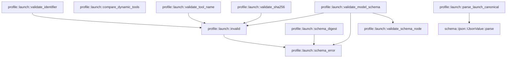

# profile::launch

[Package atlas](index.md) · [Source](../../src/launch.rs)

## Declarations

Visibility is the declaration spelling; trait members and reexports require their enclosing interface. `cfg` is not evaluated.

| Symbol | Kind | Visibility | Test / cfg |
|---|---|---|---|
| [profile::launch::MAX_DYNAMIC_DESCRIPTION_BYTES](../../src/launch.rs#L5) | const_item | `pub` |  |
| [profile::launch::FORMAT](../../src/launch.rs#L17) | const_item | `private` |  |
| [profile::launch::DynamicToolSource](../../src/launch.rs#L23) | struct_item | `pub` |  |
| [profile::launch::DynamicToolSourceKind](../../src/launch.rs#L30) | enum_item | `pub` |  |
| [profile::launch::DynamicToolEffect](../../src/launch.rs#L39) | enum_item | `pub` |  |
| [profile::launch::ExternalEffectBinding](../../src/launch.rs#L55) | struct_item | `pub` |  |
| [profile::launch::ExternalEffectProtocol](../../src/launch.rs#L62) | enum_item | `pub` |  |
| [profile::launch::DynamicTool](../../src/launch.rs#L68) | struct_item | `pub` |  |
| [profile::launch::DynamicTool::declared](../../src/launch.rs#L87) | function_item | `pub` |  |
| [profile::launch::DynamicToolCatalog](../../src/launch.rs#L113) | struct_item | `pub` |  |
| [profile::launch::DynamicToolCatalog::default](../../src/launch.rs#L119) | function_item | `private` |  |
| [profile::launch::DynamicToolCatalog::resolve](../../src/launch.rs#L128) | function_item | `pub` |  |
| [profile::launch::DynamicToolCatalog::decode](../../src/launch.rs#L138) | function_item | `pub` |  |
| [profile::launch::DynamicToolCatalog::canonical_bytes](../../src/launch.rs#L144) | function_item | `pub` |  |
| [profile::launch::DynamicToolCatalog::digest](../../src/launch.rs#L149) | function_item | `pub` |  |
| [profile::launch::LaunchBindings](../../src/launch.rs#L160) | struct_item | `pub` |  |
| [profile::launch::LaunchBindings::bind](../../src/launch.rs#L170) | function_item | `pub` |  |
| [profile::launch::LaunchBindings::decode](../../src/launch.rs#L186) | function_item | `pub` |  |
| [profile::launch::LaunchBindings::decode_verified](../../src/launch.rs#L198) | function_item | `pub` |  |
| [profile::launch::LaunchBindings::canonical_bytes](../../src/launch.rs#L213) | function_item | `pub` |  |
| [profile::launch::LaunchBindings::digest](../../src/launch.rs#L218) | function_item | `pub` |  |
| [profile::launch::LaunchBindings::publish](../../src/launch.rs#L222) | function_item | `pub` |  |
| [profile::launch::LaunchBindings::validate_against](../../src/launch.rs#L235) | function_item | `pub` |  |
| [profile::launch::validate_launch_bindings](../../src/launch.rs#L275) | function_item | `private` |  |
| [profile::launch::validate_dynamic_catalog](../../src/launch.rs#L290) | function_item | `private` |  |
| [profile::launch::DYNAMIC_SCHEMA_KEYWORDS](../../src/launch.rs#L330) | const_item | `private` |  |
| [profile::launch::SchemaWalk](../../src/launch.rs#L370) | struct_item | `private` |  |
| [profile::launch::SchemaWalk::invalid](../../src/launch.rs#L378) | function_item | `private` |  |
| [profile::launch::validate_schema_node](../../src/launch.rs#L383) | function_item | `private` |  |
| [profile::launch::SchemaWalk::node](../../src/launch.rs#L416) | function_item | `private` |  |
| [profile::launch::SchemaWalk::object_node](../../src/launch.rs#L526) | function_item | `private` |  |
| [profile::launch::validate_dynamic_tool](../../src/launch.rs#L576) | function_item | `private` |  |
| [profile::launch::validate_model_schema](../../src/launch.rs#L615) | function_item | `private` |  |
| [profile::launch::compare_dynamic_tools](../../src/launch.rs#L671) | function_item | `private` |  |
| [profile::launch::schema_digest](../../src/launch.rs#L677) | function_item | `private` |  |
| [profile::launch::validate_sha256](../../src/launch.rs#L684) | function_item | `private` |  |
| [profile::launch::validate_tool_name](../../src/launch.rs#L699) | function_item | `private` |  |
| [profile::launch::validate_identifier](../../src/launch.rs#L713) | function_item | `private` |  |
| [profile::launch::schema_error](../../src/launch.rs#L732) | function_item | `private` |  |
| [profile::launch::invalid](../../src/launch.rs#L739) | function_item | `private` |  |
| [profile::launch::parse_launch_canonical](../../src/launch.rs#L745) | function_item | `private` |  |

## Imports / reexports

| Local name | Source path | Visibility |
|---|---|---|
| `BTreeSet` | `std::collections::BTreeSet` | `private` |
| `Path` | `std::path::Path` | `private` |
| `PathBuf` | `std::path::PathBuf` | `private` |
| `IJsonValue` | `schema::IJsonValue` | `private` |
| `DeserializeOwned` | `serde::de::DeserializeOwned` | `private` |
| `Deserialize` | `serde::Deserialize` | `private` |
| `Serialize` | `serde::Serialize` | `private` |
| `Value` | `serde_json::Value` | `private` |
| `Digest` | `sha2::Digest` | `private` |
| `Sha256` | `sha2::Sha256` | `private` |
| `AssetRef` | `store::AssetRef` | `private` |
| `AssetStore` | `store::AssetStore` | `private` |
| `BuiltinManifest` | `tools::BuiltinManifest` | `private` |
| `ConfigSnapshot` | `crate::ConfigSnapshot` | `private` |
| `ProfileError` | `crate::ProfileError` | `private` |
| `canonical_line` | `crate::canonical_line` | `private` |

## Module declarations

| Module | Visibility | Attributes |
|---|---|---|

## Function call graphs

Edges below are syntactically resolved calls only, including private functions. Graphs partition callers into groups of 20; they are not execution order. All unresolved sites are listed below and in the JSON inventory.

```mermaid
flowchart TD
  n0["profile::launch::DynamicToolCatalog::default"]
  n1["profile::launch::DynamicToolCatalog::resolve"]
  n2["profile::launch::DynamicToolCatalog::decode"]
  n3["profile::launch::DynamicToolCatalog::canonical_bytes"]
  n4["profile::launch::DynamicToolCatalog::digest"]
  n5["profile::launch::LaunchBindings::bind"]
  n6["profile::launch::LaunchBindings::decode"]
  n7["profile::launch::LaunchBindings::decode_verified"]
  n8["profile::launch::LaunchBindings::canonical_bytes"]
  n9["profile::launch::LaunchBindings::digest"]
  n10["profile::launch::LaunchBindings::publish"]
  n11["profile::launch::LaunchBindings::validate_against"]
  n12["profile::launch::validate_launch_bindings"]
  n13["profile::launch::validate_dynamic_catalog"]
  n14["profile::launch::SchemaWalk::invalid"]
  n15["profile::launch::validate_schema_node"]
  n16["profile::launch::SchemaWalk::node"]
  n17["profile::launch::SchemaWalk::object_node"]
  n18["profile::launch::validate_dynamic_tool"]
  n19["profile::launch::validate_model_schema"]
  n20["profile::launch::compare_dynamic_tools"]
  n21["profile::launch::schema_digest"]
  n22["profile::launch::validate_sha256"]
  n23["profile::launch::validate_tool_name"]
  n24["profile::launch::validate_identifier"]
  n25["profile::launch::schema_error"]
  n26["profile::launch::invalid"]
  n27["profile::launch::parse_launch_canonical"]
  n28["profile::launch::DynamicTool::declared"]
  n29["profile::canonical_line"]
  n30["tools::builtin::BuiltinManifest::compiled"]
  n1 --> n13
  n2 --> n13
  n2 --> n27
  n3 --> n13
  n3 --> n29
  n6 --> n26
  n6 --> n27
  n7 --> n6
  n8 --> n12
  n8 --> n29
  n10 --> n8
  n11 --> n12
  n11 --> n26
  n11 --> n30
  n12 --> n13
  n12 --> n22
  n12 --> n24
  n13 --> n18
  n13 --> n20
  n13 --> n26
  n13 --> n30
  n14 --> n26
  n15 --> n25
  n15 --> n26
  n16 --> n14
  n16 --> n16
  n16 --> n17
  n16 --> n25
  n17 --> n14
  n17 --> n16
  n18 --> n19
  n18 --> n21
  n18 --> n23
  n18 --> n24
  n18 --> n26
  n28 --> n18
  n28 --> n21
```

Functions 1–20: 37 direct edges

Functions 21–29: 9 direct edges

## Call sites

Includes test functions (marked in declarations). Receiver-type-required sites need type analysis/manual tracing. Calls in closures are attributed to their enclosing function; their occurrence here does not mean the closure executes immediately.

| Caller | Callee expression | Source lines | Target / classification |
|---|---|---|---|
| `declared` | `name.into` | [96](../../src/launch.rs#L96) | receiver-type-required |
| `declared` | `String::new` | [103](../../src/launch.rs#L103) | external-constructor-callback-or-unresolved |
| `declared` | `schema_digest` | [105](../../src/launch.rs#L105) | [profile::launch::schema_digest](../../src/launch.rs#L677) |
| `declared` | `validate_dynamic_tool` | [106](../../src/launch.rs#L106) | [profile::launch::validate_dynamic_tool](../../src/launch.rs#L576) |
| `declared` | `Path::new` | [106](../../src/launch.rs#L106) | external-constructor-callback-or-unresolved |
| `declared` | `Ok` | [107](../../src/launch.rs#L107) | external-constructor-callback-or-unresolved |
| `default` | `Vec::new` | [122](../../src/launch.rs#L122) | external-constructor-callback-or-unresolved |
| `resolve` | `tools.sort_by` | [129](../../src/launch.rs#L129) | receiver-type-required |
| `resolve` | `validate_dynamic_catalog` | [134](../../src/launch.rs#L134) | [profile::launch::validate_dynamic_catalog](../../src/launch.rs#L290) |
| `resolve` | `Path::new` | [134](../../src/launch.rs#L134) | external-constructor-callback-or-unresolved |
| `resolve` | `Ok` | [135](../../src/launch.rs#L135) | external-constructor-callback-or-unresolved |
| `decode` | `parse_launch_canonical` | [139](../../src/launch.rs#L139) | [profile::launch::parse_launch_canonical](../../src/launch.rs#L745) |
| `decode` | `validate_dynamic_catalog` | [140](../../src/launch.rs#L140) | [profile::launch::validate_dynamic_catalog](../../src/launch.rs#L290) |
| `decode` | `Path::new` | [140](../../src/launch.rs#L140) | external-constructor-callback-or-unresolved |
| `decode` | `Ok` | [141](../../src/launch.rs#L141) | external-constructor-callback-or-unresolved |
| `canonical_bytes` | `validate_dynamic_catalog` | [145](../../src/launch.rs#L145) | [profile::launch::validate_dynamic_catalog](../../src/launch.rs#L290) |
| `canonical_bytes` | `Path::new` | [145](../../src/launch.rs#L145) | external-constructor-callback-or-unresolved |
| `canonical_bytes` | `canonical_line` | [146](../../src/launch.rs#L146) | [profile::canonical_line](../../src/lib.rs#L109) |
| `digest` | `Ok` | [150](../../src/launch.rs#L150) | external-constructor-callback-or-unresolved |
| `bind` | `config.workspace.id.clone` | [177](../../src/launch.rs#L177) | receiver-type-required |
| `bind` | `config.digest` | [178](../../src/launch.rs#L178) | receiver-type-required |
| `bind` | `value.validate_against` | [182](../../src/launch.rs#L182) | receiver-type-required |
| `bind` | `Ok` | [183](../../src/launch.rs#L183) | external-constructor-callback-or-unresolved |
| `decode` | `parse_launch_canonical` | [187](../../src/launch.rs#L187) | [profile::launch::parse_launch_canonical](../../src/launch.rs#L745) |
| `decode` | `raw.get("goal_id").is_some_and` | [188](../../src/launch.rs#L188) | receiver-type-required |
| `decode` | `raw.get` | [188](../../src/launch.rs#L188) | receiver-type-required |
| `decode` | `invalid` | [189](../../src/launch.rs#L189) | [profile::launch::invalid](../../src/launch.rs#L739) |
| `decode` | `Path::new` | [190](../../src/launch.rs#L190) | external-constructor-callback-or-unresolved |
| `decode` | `value.validate_against` | [194](../../src/launch.rs#L194) | receiver-type-required |
| `decode` | `Ok` | [195](../../src/launch.rs#L195) | external-constructor-callback-or-unresolved |
| `decode_verified` | `Err` | [205](../../src/launch.rs#L205) | external-constructor-callback-or-unresolved |
| `decode_verified` | `expected_digest.to_owned` | [206](../../src/launch.rs#L206) | receiver-type-required |
| `decode_verified` | `Self::decode` | [210](../../src/launch.rs#L210) | [profile::launch::LaunchBindings::decode](../../src/launch.rs#L186) |
| `canonical_bytes` | `validate_launch_bindings` | [214](../../src/launch.rs#L214) | [profile::launch::validate_launch_bindings](../../src/launch.rs#L275) |
| `canonical_bytes` | `Path::new` | [214](../../src/launch.rs#L214) | external-constructor-callback-or-unresolved |
| `canonical_bytes` | `canonical_line` | [215](../../src/launch.rs#L215) | [profile::canonical_line](../../src/lib.rs#L109) |
| `digest` | `Ok` | [219](../../src/launch.rs#L219) | external-constructor-callback-or-unresolved |
| `publish` | `self.canonical_bytes` | [223](../../src/launch.rs#L223) | [profile::launch::LaunchBindings::canonical_bytes](../../src/launch.rs#L213) |
| `publish` | `assets.publish` | [225](../../src/launch.rs#L225) | receiver-type-required |
| `publish` | `Err` | [227](../../src/launch.rs#L227) | external-constructor-callback-or-unresolved |
| `publish` | `Ok` | [232](../../src/launch.rs#L232) | external-constructor-callback-or-unresolved |
| `validate_against` | `Path::new` | [236](../../src/launch.rs#L236) | external-constructor-callback-or-unresolved |
| `validate_against` | `validate_launch_bindings` | [237](../../src/launch.rs#L237) | [profile::launch::validate_launch_bindings](../../src/launch.rs#L275) |
| `validate_against` | `invalid` | [239](../../src/launch.rs#L239), [242](../../src/launch.rs#L242) | [profile::launch::invalid](../../src/launch.rs#L739) |
| `validate_against` | `config.digest` | [241](../../src/launch.rs#L241) | receiver-type-required |
| `validate_against` | `BuiltinManifest::compiled()             .tools             .into_iter()             .map(&#124;tool&#124; tool.name)             .chain(                 self.dynamic_catalog                     .tools                     .iter()                     .map(&#124;tool&#124; tool.name.clone()),             )             .collect::<BTreeSet<_>>` | [245](../../src/launch.rs#L245) | receiver-type-required |
| `validate_against` | `BuiltinManifest::compiled()             .tools             .into_iter()             .map(&#124;tool&#124; tool.name)             .chain` | [245](../../src/launch.rs#L245) | receiver-type-required |
| `validate_against` | `BuiltinManifest::compiled()             .tools             .into_iter()             .map` | [245](../../src/launch.rs#L245) | receiver-type-required |
| `validate_against` | `BuiltinManifest::compiled()             .tools             .into_iter` | [245](../../src/launch.rs#L245) | receiver-type-required |
| `validate_against` | `BuiltinManifest::compiled` | [245](../../src/launch.rs#L245) | [tools::builtin::BuiltinManifest::compiled](../../../tools/src/builtin.rs#L315) |
| `validate_against` | `self.dynamic_catalog                     .tools                     .iter()                     .map` | [250](../../src/launch.rs#L250) | receiver-type-required |
| `validate_against` | `self.dynamic_catalog                     .tools                     .iter` | [250](../../src/launch.rs#L250) | receiver-type-required |
| `validate_against` | `tool.name.clone` | [253](../../src/launch.rs#L253) | receiver-type-required |
| `validate_against` | `effective_names.contains` | [262](../../src/launch.rs#L262) | receiver-type-required |
| `validate_against` | `Err` | [263](../../src/launch.rs#L263) | external-constructor-callback-or-unresolved |
| `validate_against` | `path.to_path_buf` | [264](../../src/launch.rs#L264) | receiver-type-required |
| `validate_against` | `Ok` | [271](../../src/launch.rs#L271) | external-constructor-callback-or-unresolved |
| `validate_launch_bindings` | `Err` | [277](../../src/launch.rs#L277) | external-constructor-callback-or-unresolved |
| `validate_launch_bindings` | `path.to_path_buf` | [278](../../src/launch.rs#L278) | receiver-type-required |
| `validate_launch_bindings` | `validate_identifier` | [282](../../src/launch.rs#L282), [285](../../src/launch.rs#L285) | [profile::launch::validate_identifier](../../src/launch.rs#L713) |
| `validate_launch_bindings` | `validate_sha256` | [283](../../src/launch.rs#L283) | [profile::launch::validate_sha256](../../src/launch.rs#L684) |
| `validate_launch_bindings` | `validate_dynamic_catalog` | [287](../../src/launch.rs#L287) | [profile::launch::validate_dynamic_catalog](../../src/launch.rs#L290) |
| `validate_dynamic_catalog` | `Err` | [292](../../src/launch.rs#L292) | external-constructor-callback-or-unresolved |
| `validate_dynamic_catalog` | `path.to_path_buf` | [293](../../src/launch.rs#L293) | receiver-type-required |
| `validate_dynamic_catalog` | `BuiltinManifest::compiled()         .tools         .into_iter()         .map(&#124;tool&#124; tool.name)         .collect::<BTreeSet<_>>` | [297](../../src/launch.rs#L297) | receiver-type-required |
| `validate_dynamic_catalog` | `BuiltinManifest::compiled()         .tools         .into_iter()         .map` | [297](../../src/launch.rs#L297) | receiver-type-required |
| `validate_dynamic_catalog` | `BuiltinManifest::compiled()         .tools         .into_iter` | [297](../../src/launch.rs#L297) | receiver-type-required |
| `validate_dynamic_catalog` | `BuiltinManifest::compiled` | [297](../../src/launch.rs#L297) | [tools::builtin::BuiltinManifest::compiled](../../../tools/src/builtin.rs#L315) |
| `validate_dynamic_catalog` | `BTreeSet::new` | [302](../../src/launch.rs#L302) | external-constructor-callback-or-unresolved |
| `validate_dynamic_catalog` | `validate_dynamic_tool` | [304](../../src/launch.rs#L304) | [profile::launch::validate_dynamic_tool](../../src/launch.rs#L576) |
| `validate_dynamic_catalog` | `fixed.contains` | [305](../../src/launch.rs#L305) | receiver-type-required |
| `validate_dynamic_catalog` | `invalid` | [306](../../src/launch.rs#L306), [309](../../src/launch.rs#L309), [317](../../src/launch.rs#L317) | [profile::launch::invalid](../../src/launch.rs#L739) |
| `validate_dynamic_catalog` | `names.insert` | [308](../../src/launch.rs#L308) | receiver-type-required |
| `validate_dynamic_catalog` | `tool.name.as_str` | [308](../../src/launch.rs#L308) | receiver-type-required |
| `validate_dynamic_catalog` | `value         .tools         .windows(2)         .any` | [312](../../src/launch.rs#L312) | receiver-type-required |
| `validate_dynamic_catalog` | `value         .tools         .windows` | [312](../../src/launch.rs#L312) | receiver-type-required |
| `validate_dynamic_catalog` | `compare_dynamic_tools(&pair[0], &pair[1]).is_gt` | [315](../../src/launch.rs#L315) | receiver-type-required |
| `validate_dynamic_catalog` | `compare_dynamic_tools` | [315](../../src/launch.rs#L315) | [profile::launch::compare_dynamic_tools](../../src/launch.rs#L671) |
| `validate_dynamic_catalog` | `Ok` | [319](../../src/launch.rs#L319) | external-constructor-callback-or-unresolved |
| `invalid` | `invalid` | [379](../../src/launch.rs#L379) | [profile::launch::invalid](../../src/launch.rs#L739) |
| `validate_schema_node` | `schema         .as_object()         .ok_or_else` | [384](../../src/launch.rs#L384) | receiver-type-required |
| `validate_schema_node` | `schema         .as_object` | [384](../../src/launch.rs#L384) | receiver-type-required |
| `validate_schema_node` | `schema_error` | [386](../../src/launch.rs#L386) | [profile::launch::schema_error](../../src/launch.rs#L732) |
| `validate_schema_node` | `BTreeSet::new` | [387](../../src/launch.rs#L387) | external-constructor-callback-or-unresolved |
| `validate_schema_node` | `root.get` | [389](../../src/launch.rs#L389), [406](../../src/launch.rs#L406) | receiver-type-required |
| `validate_schema_node` | `entries.as_object` | [390](../../src/launch.rs#L390) | receiver-type-required |
| `validate_schema_node` | `invalid` | [391](../../src/launch.rs#L391) | [profile::launch::invalid](../../src/launch.rs#L739) |
| `validate_schema_node` | `definitions.extend` | [396](../../src/launch.rs#L396) | receiver-type-required |
| `validate_schema_node` | `entries.keys().map` | [396](../../src/launch.rs#L396) | receiver-type-required |
| `validate_schema_node` | `entries.keys` | [396](../../src/launch.rs#L396) | receiver-type-required |
| `validate_schema_node` | `walk.node` | [404](../../src/launch.rs#L404), [408](../../src/launch.rs#L408) | receiver-type-required |
| `validate_schema_node` | `root.get(container).and_then` | [406](../../src/launch.rs#L406) | receiver-type-required |
| `validate_schema_node` | `Ok` | [412](../../src/launch.rs#L412) | external-constructor-callback-or-unresolved |
| `node` | `schema.as_object().ok_or_else` | [417](../../src/launch.rs#L417) | receiver-type-required |
| `node` | `schema.as_object` | [417](../../src/launch.rs#L417) | receiver-type-required |
| `node` | `schema_error` | [418](../../src/launch.rs#L418) | [profile::launch::schema_error](../../src/launch.rs#L732) |
| `node` | `object.keys` | [423](../../src/launch.rs#L423) | receiver-type-required |
| `node` | `DYNAMIC_SCHEMA_KEYWORDS.contains` | [424](../../src/launch.rs#L424) | receiver-type-required |
| `node` | `key.as_str` | [424](../../src/launch.rs#L424) | receiver-type-required |
| `node` | `self.invalid` | [425](../../src/launch.rs#L425), [430](../../src/launch.rs#L430), [441](../../src/launch.rs#L441), [445](../../src/launch.rs#L445), [448](../../src/launch.rs#L448), [456](../../src/launch.rs#L456), [462](../../src/launch.rs#L462), [469](../../src/launch.rs#L469), [477](../../src/launch.rs#L477), [480](../../src/launch.rs#L480), [491](../../src/launch.rs#L491), [497](../../src/launch.rs#L497), [501](../../src/launch.rs#L501), [506](../../src/launch.rs#L506), [520](../../src/launch.rs#L520) | [profile::launch::SchemaWalk::invalid](../../src/launch.rs#L378) |
| `node` | `object.get("$schema").is_some_and` | [438](../../src/launch.rs#L438) | receiver-type-required |
| `node` | `object.get` | [438](../../src/launch.rs#L438), [443](../../src/launch.rs#L443), [454](../../src/launch.rs#L454), [468](../../src/launch.rs#L468), [475](../../src/launch.rs#L475), [500](../../src/launch.rs#L500), [505](../../src/launch.rs#L505), [519](../../src/launch.rs#L519) | receiver-type-required |
| `node` | `dialect.as_str` | [439](../../src/launch.rs#L439) | receiver-type-required |
| `node` | `Some` | [439](../../src/launch.rs#L439) | external-constructor-callback-or-unresolved |
| `node` | `reference.as_str` | [444](../../src/launch.rs#L444) | receiver-type-required |
| `node` | `self.definitions.contains` | [447](../../src/launch.rs#L447) | receiver-type-required |
| `node` | `kind.as_str` | [455](../../src/launch.rs#L455) | receiver-type-required |
| `node` | `self.object_node` | [465](../../src/launch.rs#L465) | [profile::launch::SchemaWalk::object_node](../../src/launch.rs#L526) |
| `node` | `self.node` | [471](../../src/launch.rs#L471), [483](../../src/launch.rs#L483) | [profile::launch::SchemaWalk::node](../../src/launch.rs#L416) |
| `node` | `branches.as_array` | [476](../../src/launch.rs#L476) | receiver-type-required |
| `node` | `branches.is_empty` | [479](../../src/launch.rs#L479) | receiver-type-required |
| `node` | `branches.iter().enumerate` | [482](../../src/launch.rs#L482) | receiver-type-required |
| `node` | `branches.iter` | [482](../../src/launch.rs#L482) | receiver-type-required |
| `node` | `object             .get("enum")             .is_some_and` | [487](../../src/launch.rs#L487) | receiver-type-required |
| `node` | `object             .get` | [487](../../src/launch.rs#L487), [493](../../src/launch.rs#L493) | receiver-type-required |
| `node` | `value.as_array().is_none_or` | [489](../../src/launch.rs#L489) | receiver-type-required |
| `node` | `value.as_array` | [489](../../src/launch.rs#L489) | receiver-type-required |
| `node` | `object             .get("examples")             .is_some_and` | [493](../../src/launch.rs#L493) | receiver-type-required |
| `node` | `value.is_array` | [495](../../src/launch.rs#L495) | receiver-type-required |
| `node` | `object.get(keyword).is_some_and` | [500](../../src/launch.rs#L500), [505](../../src/launch.rs#L505), [519](../../src/launch.rs#L519) | receiver-type-required |
| `node` | `value.is_string` | [500](../../src/launch.rs#L500) | receiver-type-required |
| `node` | `value.is_boolean` | [505](../../src/launch.rs#L505) | receiver-type-required |
| `node` | `value.is_number` | [519](../../src/launch.rs#L519) | receiver-type-required |
| `node` | `Ok` | [523](../../src/launch.rs#L523) | external-constructor-callback-or-unresolved |
| `object_node` | `serde_json::Map::new` | [536](../../src/launch.rs#L536) | external-constructor-callback-or-unresolved |
| `object_node` | `object.get` | [537](../../src/launch.rs#L537), [543](../../src/launch.rs#L543), [548](../../src/launch.rs#L548) | receiver-type-required |
| `object_node` | `self.invalid` | [540](../../src/launch.rs#L540), [546](../../src/launch.rs#L546), [558](../../src/launch.rs#L558), [563](../../src/launch.rs#L563), [566](../../src/launch.rs#L566) | [profile::launch::SchemaWalk::invalid](../../src/launch.rs#L378) |
| `object_node` | `Vec::new` | [542](../../src/launch.rs#L542) | external-constructor-callback-or-unresolved |
| `object_node` | `self.node` | [552](../../src/launch.rs#L552), [570](../../src/launch.rs#L570) | [profile::launch::SchemaWalk::node](../../src/launch.rs#L416) |
| `object_node` | `BTreeSet::new` | [560](../../src/launch.rs#L560) | external-constructor-callback-or-unresolved |
| `object_node` | `item.as_str` | [562](../../src/launch.rs#L562) | receiver-type-required |
| `object_node` | `properties.contains_key` | [565](../../src/launch.rs#L565) | receiver-type-required |
| `object_node` | `names.insert` | [565](../../src/launch.rs#L565) | receiver-type-required |
| `object_node` | `Ok` | [572](../../src/launch.rs#L572) | external-constructor-callback-or-unresolved |
| `validate_dynamic_tool` | `validate_tool_name` | [577](../../src/launch.rs#L577) | [profile::launch::validate_tool_name](../../src/launch.rs#L699) |
| `validate_dynamic_tool` | `validate_identifier` | [578](../../src/launch.rs#L578), [581](../../src/launch.rs#L581), [587](../../src/launch.rs#L587) | [profile::launch::validate_identifier](../../src/launch.rs#L713) |
| `validate_dynamic_tool` | `BTreeSet::new` | [579](../../src/launch.rs#L579) | external-constructor-callback-or-unresolved |
| `validate_dynamic_tool` | `aliases.insert` | [582](../../src/launch.rs#L582) | receiver-type-required |
| `validate_dynamic_tool` | `alias.as_str` | [582](../../src/launch.rs#L582) | receiver-type-required |
| `validate_dynamic_tool` | `invalid` | [583](../../src/launch.rs#L583), [597](../../src/launch.rs#L597), [605](../../src/launch.rs#L605) | [profile::launch::invalid](../../src/launch.rs#L739) |
| `validate_dynamic_tool` | `schema_digest` | [603](../../src/launch.rs#L603) | [profile::launch::schema_digest](../../src/launch.rs#L677) |
| `validate_dynamic_tool` | `validate_model_schema` | [607](../../src/launch.rs#L607) | [profile::launch::validate_model_schema](../../src/launch.rs#L615) |
| `validate_model_schema` | `serde_json::to_value(schema).map_err` | [621](../../src/launch.rs#L621) | receiver-type-required |
| `validate_model_schema` | `serde_json::to_value` | [621](../../src/launch.rs#L621) | external-constructor-callback-or-unresolved |
| `validate_model_schema` | `path.to_path_buf` | [622](../../src/launch.rs#L622) | receiver-type-required |
| `validate_model_schema` | `error.to_string` | [623](../../src/launch.rs#L623) | receiver-type-required |
| `validate_model_schema` | `value         .as_object()         .ok_or_else` | [625](../../src/launch.rs#L625) | receiver-type-required |
| `validate_model_schema` | `value         .as_object` | [625](../../src/launch.rs#L625) | receiver-type-required |
| `validate_model_schema` | `schema_error` | [627](../../src/launch.rs#L627), [659](../../src/launch.rs#L659) | [profile::launch::schema_error](../../src/launch.rs#L732) |
| `validate_model_schema` | `object.keys().map(String::as_str).collect::<BTreeSet<_>>` | [628](../../src/launch.rs#L628) | receiver-type-required |
| `validate_model_schema` | `object.keys().map` | [628](../../src/launch.rs#L628) | receiver-type-required |
| `validate_model_schema` | `object.keys` | [628](../../src/launch.rs#L628) | receiver-type-required |
| `validate_model_schema` | `BTreeSet::from` | [629](../../src/launch.rs#L629) | external-constructor-callback-or-unresolved |
| `validate_model_schema` | `invalid` | [630](../../src/launch.rs#L630), [636](../../src/launch.rs#L636), [651](../../src/launch.rs#L651), [666](../../src/launch.rs#L666) | [profile::launch::invalid](../../src/launch.rs#L739) |
| `validate_model_schema` | `object.get("name").and_then` | [635](../../src/launch.rs#L635) | receiver-type-required |
| `validate_model_schema` | `object.get` | [635](../../src/launch.rs#L635) | receiver-type-required |
| `validate_model_schema` | `Some` | [635](../../src/launch.rs#L635), [660](../../src/launch.rs#L660) | external-constructor-callback-or-unresolved |
| `validate_model_schema` | `object         .get("description")         .and_then(Value::as_str)         .unwrap_or_default` | [638](../../src/launch.rs#L638) | receiver-type-required |
| `validate_model_schema` | `object         .get("description")         .and_then` | [638](../../src/launch.rs#L638) | receiver-type-required |
| `validate_model_schema` | `object         .get` | [638](../../src/launch.rs#L638), [656](../../src/launch.rs#L656) | receiver-type-required |
| `validate_model_schema` | `description.trim().is_empty` | [645](../../src/launch.rs#L645) | receiver-type-required |
| `validate_model_schema` | `description.trim` | [645](../../src/launch.rs#L645) | receiver-type-required |
| `validate_model_schema` | `description.len` | [646](../../src/launch.rs#L646) | receiver-type-required |
| `validate_model_schema` | `description             .bytes()             .any` | [647](../../src/launch.rs#L647) | receiver-type-required |
| `validate_model_schema` | `description             .bytes` | [647](../../src/launch.rs#L647) | receiver-type-required |
| `validate_model_schema` | `byte.is_ascii_control` | [649](../../src/launch.rs#L649) | receiver-type-required |
| `validate_model_schema` | `object         .get("parameters")         .and_then(Value::as_object)         .ok_or_else` | [656](../../src/launch.rs#L656) | receiver-type-required |
| `validate_model_schema` | `object         .get("parameters")         .and_then` | [656](../../src/launch.rs#L656) | receiver-type-required |
| `validate_model_schema` | `parameters.get("type").and_then` | [660](../../src/launch.rs#L660) | receiver-type-required |
| `validate_model_schema` | `parameters.get` | [660](../../src/launch.rs#L660) | receiver-type-required |
| `validate_model_schema` | `parameters             .get("properties")             .and_then(Value::as_object)             .is_none` | [661](../../src/launch.rs#L661) | receiver-type-required |
| `validate_model_schema` | `parameters             .get("properties")             .and_then` | [661](../../src/launch.rs#L661) | receiver-type-required |
| `validate_model_schema` | `parameters             .get` | [661](../../src/launch.rs#L661) | receiver-type-required |
| `validate_model_schema` | `validate_schema_node` | [668](../../src/launch.rs#L668) | [profile::launch::validate_schema_node](../../src/launch.rs#L383) |
| `validate_model_schema` | `Value::Object` | [668](../../src/launch.rs#L668) | external-constructor-callback-or-unresolved |
| `validate_model_schema` | `parameters.clone` | [668](../../src/launch.rs#L668) | receiver-type-required |
| `compare_dynamic_tools` | `left.source         .cmp(&right.source)         .then_with` | [672](../../src/launch.rs#L672) | receiver-type-required |
| `compare_dynamic_tools` | `left.source         .cmp` | [672](../../src/launch.rs#L672) | receiver-type-required |
| `compare_dynamic_tools` | `left.name.as_bytes().cmp` | [674](../../src/launch.rs#L674) | receiver-type-required |
| `compare_dynamic_tools` | `left.name.as_bytes` | [674](../../src/launch.rs#L674) | receiver-type-required |
| `compare_dynamic_tools` | `right.name.as_bytes` | [674](../../src/launch.rs#L674) | receiver-type-required |
| `schema_digest` | `schema         .canonical_bytes()         .map_err` | [678](../../src/launch.rs#L678) | receiver-type-required |
| `schema_digest` | `schema         .canonical_bytes` | [678](../../src/launch.rs#L678) | receiver-type-required |
| `schema_digest` | `schema_error` | [680](../../src/launch.rs#L680) | [profile::launch::schema_error](../../src/launch.rs#L732) |
| `schema_digest` | `Path::new` | [680](../../src/launch.rs#L680) | external-constructor-callback-or-unresolved |
| `schema_digest` | `error.to_string` | [680](../../src/launch.rs#L680) | receiver-type-required |
| `schema_digest` | `Ok` | [681](../../src/launch.rs#L681) | external-constructor-callback-or-unresolved |
| `validate_sha256` | `value.len` | [685](../../src/launch.rs#L685) | receiver-type-required |
| `validate_sha256` | `value             .bytes()             .all` | [686](../../src/launch.rs#L686) | receiver-type-required |
| `validate_sha256` | `value             .bytes` | [686](../../src/launch.rs#L686) | receiver-type-required |
| `validate_sha256` | `byte.is_ascii_hexdigit` | [688](../../src/launch.rs#L688) | receiver-type-required |
| `validate_sha256` | `byte.is_ascii_uppercase` | [688](../../src/launch.rs#L688) | receiver-type-required |
| `validate_sha256` | `Ok` | [690](../../src/launch.rs#L690) | external-constructor-callback-or-unresolved |
| `validate_sha256` | `invalid` | [692](../../src/launch.rs#L692) | [profile::launch::invalid](../../src/launch.rs#L739) |
| `validate_tool_name` | `value.is_empty` | [700](../../src/launch.rs#L700) | receiver-type-required |
| `validate_tool_name` | `value.len` | [701](../../src/launch.rs#L701) | receiver-type-required |
| `validate_tool_name` | `value.chars().any` | [702](../../src/launch.rs#L702) | receiver-type-required |
| `validate_tool_name` | `value.chars` | [702](../../src/launch.rs#L702) | receiver-type-required |
| `validate_tool_name` | `character.is_ascii_control` | [702](../../src/launch.rs#L702) | receiver-type-required |
| `validate_tool_name` | `Ok` | [704](../../src/launch.rs#L704) | external-constructor-callback-or-unresolved |
| `validate_tool_name` | `invalid` | [706](../../src/launch.rs#L706) | [profile::launch::invalid](../../src/launch.rs#L739) |
| `validate_identifier` | `value.is_empty` | [719](../../src/launch.rs#L719) | receiver-type-required |
| `validate_identifier` | `value.len` | [720](../../src/launch.rs#L720) | receiver-type-required |
| `validate_identifier` | `value.chars().any` | [721](../../src/launch.rs#L721) | receiver-type-required |
| `validate_identifier` | `value.chars` | [721](../../src/launch.rs#L721) | receiver-type-required |
| `validate_identifier` | `character.is_ascii_control` | [721](../../src/launch.rs#L721) | receiver-type-required |
| `validate_identifier` | `Ok` | [723](../../src/launch.rs#L723) | external-constructor-callback-or-unresolved |
| `validate_identifier` | `invalid` | [725](../../src/launch.rs#L725) | [profile::launch::invalid](../../src/launch.rs#L739) |
| `schema_error` | `path.to_path_buf` | [734](../../src/launch.rs#L734) | receiver-type-required |
| `schema_error` | `reason.to_owned` | [735](../../src/launch.rs#L735) | receiver-type-required |
| `invalid` | `Err` | [740](../../src/launch.rs#L740) | external-constructor-callback-or-unresolved |
| `invalid` | `schema_error` | [740](../../src/launch.rs#L740) | [profile::launch::schema_error](../../src/launch.rs#L732) |
| `parse_launch_canonical` | `path.into` | [749](../../src/launch.rs#L749) | receiver-type-required |
| `parse_launch_canonical` | `bytes.ends_with` | [750](../../src/launch.rs#L750) | receiver-type-required |
| `parse_launch_canonical` | `bytes.len` | [750](../../src/launch.rs#L750), [756](../../src/launch.rs#L756) | receiver-type-required |
| `parse_launch_canonical` | `bytes[..bytes.len() - 1].ends_with` | [750](../../src/launch.rs#L750) | receiver-type-required |
| `parse_launch_canonical` | `Err` | [751](../../src/launch.rs#L751), [769](../../src/launch.rs#L769) | external-constructor-callback-or-unresolved |
| `parse_launch_canonical` | `"expected one canonical JSON object followed by exactly one LF".to_owned` | [753](../../src/launch.rs#L753) | receiver-type-required |
| `parse_launch_canonical` | `IJsonValue::parse(body).map_err` | [757](../../src/launch.rs#L757) | receiver-type-required |
| `parse_launch_canonical` | `IJsonValue::parse` | [757](../../src/launch.rs#L757) | [schema::ijson::IJsonValue::parse](../../../schema/src/ijson.rs#L16) |
| `parse_launch_canonical` | `path.clone` | [758](../../src/launch.rs#L758), [764](../../src/launch.rs#L764), [775](../../src/launch.rs#L775) | receiver-type-required |
| `parse_launch_canonical` | `error.to_string` | [759](../../src/launch.rs#L759), [765](../../src/launch.rs#L765), [776](../../src/launch.rs#L776), [781](../../src/launch.rs#L781) | receiver-type-required |
| `parse_launch_canonical` | `ijson         .canonical_bytes()         .map_err` | [761](../../src/launch.rs#L761) | receiver-type-required |
| `parse_launch_canonical` | `ijson         .canonical_bytes` | [761](../../src/launch.rs#L761) | receiver-type-required |
| `parse_launch_canonical` | `"bytes are not RFC-8785 canonical".to_owned` | [771](../../src/launch.rs#L771) | receiver-type-required |
| `parse_launch_canonical` | `serde_json::from_slice(body).map_err` | [774](../../src/launch.rs#L774) | receiver-type-required |
| `parse_launch_canonical` | `serde_json::from_slice` | [774](../../src/launch.rs#L774) | external-constructor-callback-or-unresolved |
| `parse_launch_canonical` | `serde_json::from_value(raw.clone()).map_err` | [779](../../src/launch.rs#L779) | receiver-type-required |
| `parse_launch_canonical` | `serde_json::from_value` | [779](../../src/launch.rs#L779) | external-constructor-callback-or-unresolved |
| `parse_launch_canonical` | `raw.clone` | [779](../../src/launch.rs#L779) | receiver-type-required |
| `parse_launch_canonical` | `Ok` | [783](../../src/launch.rs#L783) | external-constructor-callback-or-unresolved |
