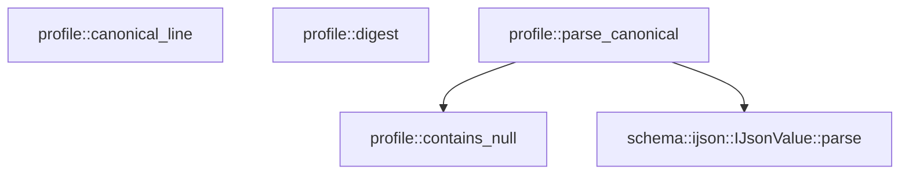

# profile

[Package atlas](index.md) · [Source](../../src/lib.rs)

## Declarations

Visibility is the declaration spelling; trait members and reexports require their enclosing interface. `cfg` is not evaluated.

| Symbol | Kind | Visibility | Test / cfg |
|---|---|---|---|
| [profile::ProfileError](../../src/lib.rs#L35) | enum_item | `pub` |  |
| [profile::parse_canonical](../../src/lib.rs#L64) | function_item | `pub(crate)` |  |
| [profile::canonical_line](../../src/lib.rs#L109) | function_item | `pub(crate)` |  |
| [profile::digest](../../src/lib.rs#L123) | function_item | `pub(crate)` |  |
| [profile::contains_null](../../src/lib.rs#L127) | function_item | `private` |  |

## Imports / reexports

| Local name | Source path | Visibility |
|---|---|---|
| `ConfigRepository` | `config::ConfigRepository` | `pub` |
| `ConfigSnapshot` | `config::ConfigSnapshot` | `pub` |
| `Limits` | `config::Limits` | `pub` |
| `Model` | `config::Model` | `pub` |
| `Provider` | `config::Provider` | `pub` |
| `ProvidersConfig` | `config::ProvidersConfig` | `pub` |
| `ResolvedWorkspace` | `config::ResolvedWorkspace` | `pub` |
| `RevisionVector` | `config::RevisionVector` | `pub` |
| `SessionSettings` | `config::SessionSettings` | `pub` |
| `SettingsConfig` | `config::SettingsConfig` | `pub` |
| `WebSearch` | `config::WebSearch` | `pub` |
| `WorkspaceConfig` | `config::WorkspaceConfig` | `pub` |
| `WorkspaceFolder` | `config::WorkspaceFolder` | `pub` |
| `WorkspacePolicy` | `config::WorkspacePolicy` | `pub` |
| `EffectiveInstructions` | `instruction::EffectiveInstructions` | `pub` |
| `EffectivePolicy` | `instruction::EffectivePolicy` | `pub` |
| `InstructionKind` | `instruction::InstructionKind` | `pub` |
| `InstructionOrigin` | `instruction::InstructionOrigin` | `pub` |
| `InstructionPolicy` | `instruction::InstructionPolicy` | `pub` |
| `InstructionResolver` | `instruction::InstructionResolver` | `pub` |
| `InstructionSettings` | `instruction::InstructionSettings` | `pub` |
| `InstructionSnapshot` | `instruction::InstructionSnapshot` | `pub` |
| `InstructionSource` | `instruction::InstructionSource` | `pub` |
| `LaunchProfile` | `instruction::LaunchProfile` | `pub` |
| `DynamicTool` | `launch::DynamicTool` | `pub` |
| `DynamicToolCatalog` | `launch::DynamicToolCatalog` | `pub` |
| `DynamicToolEffect` | `launch::DynamicToolEffect` | `pub` |
| `DynamicToolSource` | `launch::DynamicToolSource` | `pub` |
| `DynamicToolSourceKind` | `launch::DynamicToolSourceKind` | `pub` |
| `ExternalEffectBinding` | `launch::ExternalEffectBinding` | `pub` |
| `ExternalEffectProtocol` | `launch::ExternalEffectProtocol` | `pub` |
| `LaunchBindings` | `launch::LaunchBindings` | `pub` |
| `CommandCatalogEntry` | `resources::CommandCatalogEntry` | `pub` |
| `CommandExpansion` | `resources::CommandExpansion` | `pub` |
| `CommandSummary` | `resources::CommandSummary` | `pub` |
| `ResourceCatalog` | `resources::ResourceCatalog` | `pub` |
| `ResourceError` | `resources::ResourceError` | `pub` |
| `SkillPackage` | `resources::SkillPackage` | `pub` |
| `SkillResource` | `resources::SkillResource` | `pub` |
| `SkillSummary` | `resources::SkillSummary` | `pub` |
| `PathBuf` | `std::path::PathBuf` | `private` |
| `Serialize` | `serde::Serialize` | `private` |
| `DeserializeOwned` | `serde::de::DeserializeOwned` | `private` |
| `Digest` | `sha2::Digest` | `private` |
| `Sha256` | `sha2::Sha256` | `private` |
| `Error` | `thiserror::Error` | `private` |

## Module declarations

| Module | Visibility | Attributes |
|---|---|---|
| `profile::config` | `private` |  |
| `profile::instruction` | `private` |  |
| `profile::launch` | `private` |  |
| `profile::resources` | `private` |  |

## Function call graphs

Edges below are syntactically resolved calls only, including private functions. Graphs partition callers into groups of 20; they are not execution order. All unresolved sites are listed below and in the JSON inventory.

Functions 1–4: 2 direct edges

## Call sites

Includes test functions (marked in declarations). Receiver-type-required sites need type analysis/manual tracing. Calls in closures are attributed to their enclosing function; their occurrence here does not mean the closure executes immediately.

| Caller | Callee expression | Source lines | Target / classification |
|---|---|---|---|
| `parse_canonical` | `path.into` | [68](../../src/lib.rs#L68) | receiver-type-required |
| `parse_canonical` | `bytes.ends_with` | [69](../../src/lib.rs#L69) | receiver-type-required |
| `parse_canonical` | `bytes.len` | [69](../../src/lib.rs#L69), [75](../../src/lib.rs#L75) | receiver-type-required |
| `parse_canonical` | `bytes[..bytes.len() - 1].ends_with` | [69](../../src/lib.rs#L69) | receiver-type-required |
| `parse_canonical` | `Err` | [70](../../src/lib.rs#L70), [87](../../src/lib.rs#L87), [98](../../src/lib.rs#L98) | external-constructor-callback-or-unresolved |
| `parse_canonical` | `"expected one canonical JSON object followed by exactly one LF".to_owned` | [72](../../src/lib.rs#L72) | receiver-type-required |
| `parse_canonical` | `schema::IJsonValue::parse(body).map_err` | [76](../../src/lib.rs#L76) | receiver-type-required |
| `parse_canonical` | `schema::IJsonValue::parse` | [76](../../src/lib.rs#L76) | [schema::ijson::IJsonValue::parse](../../../schema/src/ijson.rs#L16) |
| `parse_canonical` | `path.clone` | [77](../../src/lib.rs#L77), [83](../../src/lib.rs#L83), [94](../../src/lib.rs#L94) | receiver-type-required |
| `parse_canonical` | `error.to_string` | [78](../../src/lib.rs#L78), [84](../../src/lib.rs#L84), [95](../../src/lib.rs#L95), [105](../../src/lib.rs#L105) | receiver-type-required |
| `parse_canonical` | `value         .canonical_bytes()         .map_err` | [80](../../src/lib.rs#L80) | receiver-type-required |
| `parse_canonical` | `value         .canonical_bytes` | [80](../../src/lib.rs#L80) | receiver-type-required |
| `parse_canonical` | `"bytes are not RFC-8785 canonical".to_owned` | [89](../../src/lib.rs#L89) | receiver-type-required |
| `parse_canonical` | `serde_json::from_slice(body).map_err` | [93](../../src/lib.rs#L93) | receiver-type-required |
| `parse_canonical` | `serde_json::from_slice` | [93](../../src/lib.rs#L93) | external-constructor-callback-or-unresolved |
| `parse_canonical` | `contains_null` | [97](../../src/lib.rs#L97) | [profile::contains_null](../../src/lib.rs#L127) |
| `parse_canonical` | `"JSON null is not a substitute for an absent optional field".to_owned` | [100](../../src/lib.rs#L100) | receiver-type-required |
| `parse_canonical` | `serde_json::from_value(json).map_err` | [103](../../src/lib.rs#L103) | receiver-type-required |
| `parse_canonical` | `serde_json::from_value` | [103](../../src/lib.rs#L103) | external-constructor-callback-or-unresolved |
| `canonical_line` | `path.into` | [113](../../src/lib.rs#L113) | receiver-type-required |
| `canonical_line` | `serde_json_canonicalizer::to_vec(value).map_err` | [115](../../src/lib.rs#L115) | receiver-type-required |
| `canonical_line` | `serde_json_canonicalizer::to_vec` | [115](../../src/lib.rs#L115) | external-constructor-callback-or-unresolved |
| `canonical_line` | `error.to_string` | [117](../../src/lib.rs#L117) | receiver-type-required |
| `canonical_line` | `bytes.push` | [119](../../src/lib.rs#L119) | receiver-type-required |
| `canonical_line` | `Ok` | [120](../../src/lib.rs#L120) | external-constructor-callback-or-unresolved |
| `contains_null` | `values.iter().any` | [130](../../src/lib.rs#L130) | receiver-type-required |
| `contains_null` | `values.iter` | [130](../../src/lib.rs#L130) | receiver-type-required |
| `contains_null` | `values.values().any` | [131](../../src/lib.rs#L131) | receiver-type-required |
| `contains_null` | `values.values` | [131](../../src/lib.rs#L131) | receiver-type-required |
