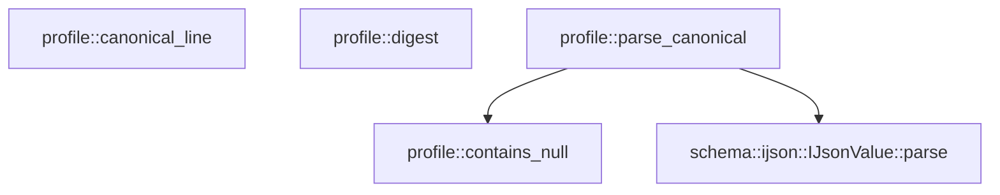

# profile

[Package atlas](index.md) · [Source](../../src/lib.rs)

## Declarations

Visibility is the declaration spelling; trait members and reexports require their enclosing interface. `cfg` is not evaluated.

| Symbol | Kind | Visibility | Test / cfg |
|---|---|---|---|
| [profile::ProfileError](../../src/lib.rs#L40) | enum_item | `pub` |  |
| [profile::parse_canonical](../../src/lib.rs#L69) | function_item | `pub(crate)` |  |
| [profile::canonical_line](../../src/lib.rs#L114) | function_item | `pub(crate)` |  |
| [profile::digest](../../src/lib.rs#L128) | function_item | `pub(crate)` |  |
| [profile::contains_null](../../src/lib.rs#L132) | function_item | `private` |  |

## Imports / reexports

| Local name | Source path | Visibility |
|---|---|---|
| `ConfigRepository` | `config::ConfigRepository` | `pub` |
| `ConfigSnapshot` | `config::ConfigSnapshot` | `pub` |
| `ExecutionPolicy` | `config::ExecutionPolicy` | `pub` |
| `Limits` | `config::Limits` | `pub` |
| `Model` | `config::Model` | `pub` |
| `Provider` | `config::Provider` | `pub` |
| `ProvidersConfig` | `config::ProvidersConfig` | `pub` |
| `ResolvedExecution` | `config::ResolvedExecution` | `pub` |
| `RevisionVector` | `config::RevisionVector` | `pub` |
| `SessionSettings` | `config::SessionSettings` | `pub` |
| `SettingsConfig` | `config::SettingsConfig` | `pub` |
| `WebSearch` | `config::WebSearch` | `pub` |
| `ExecutionConfig` | `execution::ExecutionConfig` | `pub` |
| `EffectiveInstructions` | `instruction::EffectiveInstructions` | `pub` |
| `EffectivePolicy` | `instruction::EffectivePolicy` | `pub` |
| `InstructionKind` | `instruction::InstructionKind` | `pub` |
| `InstructionOrigin` | `instruction::InstructionOrigin` | `pub` |
| `InstructionPolicy` | `instruction::InstructionPolicy` | `pub` |
| `InstructionResolver` | `instruction::InstructionResolver` | `pub` |
| `InstructionSettings` | `instruction::InstructionSettings` | `pub` |
| `InstructionSnapshot` | `instruction::InstructionSnapshot` | `pub` |
| `InstructionSource` | `instruction::InstructionSource` | `pub` |
| `LaunchProfile` | `instruction::LaunchProfile` | `pub` |
| `DynamicTool` | `launch::DynamicTool` | `pub` |
| `DynamicToolCatalog` | `launch::DynamicToolCatalog` | `pub` |
| `DynamicToolEffect` | `launch::DynamicToolEffect` | `pub` |
| `DynamicToolSource` | `launch::DynamicToolSource` | `pub` |
| `DynamicToolSourceKind` | `launch::DynamicToolSourceKind` | `pub` |
| `ExternalEffectBinding` | `launch::ExternalEffectBinding` | `pub` |
| `ExternalEffectProtocol` | `launch::ExternalEffectProtocol` | `pub` |
| `LaunchBindings` | `launch::LaunchBindings` | `pub` |
| `MAX_UNAVAILABLE_TOOLS` | `launch::MAX_UNAVAILABLE_TOOLS` | `pub` |
| `SchemaRefusal` | `launch::SchemaRefusal` | `pub` |
| `is_dynamic_tool_name` | `launch::is_dynamic_tool_name` | `pub` |
| `CommandCatalogEntry` | `resources::CommandCatalogEntry` | `pub` |
| `CommandExpansion` | `resources::CommandExpansion` | `pub` |
| `CommandSummary` | `resources::CommandSummary` | `pub` |
| `ResourceCatalog` | `resources::ResourceCatalog` | `pub` |
| `ResourceError` | `resources::ResourceError` | `pub` |
| `SkillPackage` | `resources::SkillPackage` | `pub` |
| `SkillResource` | `resources::SkillResource` | `pub` |
| `SkillSummary` | `resources::SkillSummary` | `pub` |
| `SessionScope` | `scope::SessionScope` | `pub` |
| `PathBuf` | `std::path::PathBuf` | `private` |
| `Serialize` | `serde::Serialize` | `private` |
| `DeserializeOwned` | `serde::de::DeserializeOwned` | `private` |
| `Digest` | `sha2::Digest` | `private` |
| `Sha256` | `sha2::Sha256` | `private` |
| `Error` | `thiserror::Error` | `private` |

## Module declarations

| Module | Visibility | Attributes |
|---|---|---|
| `profile::config` | `private` |  |
| `profile::execution` | `private` |  |
| `profile::instruction` | `private` |  |
| `profile::launch` | `private` |  |
| `profile::resources` | `private` |  |
| `profile::scope` | `private` |  |

## Function call graphs

Edges below are syntactically resolved calls only, including private functions. Graphs partition callers into groups of 20; they are not execution order. All unresolved sites are listed below and in the JSON inventory.

Functions 1–4: 2 direct edges

```mermaid
flowchart TD
  n0["profile::canonical_line"]
  n1["profile::digest"]
  n2["profile::contains_null"]
  n3["profile::parse_canonical"]
  n4["schema::ijson::IJsonValue::parse"]
  n3 --> n2
  n3 --> n4
```

## Call sites

Includes test functions (marked in declarations). Receiver-type-required sites need type analysis/manual tracing. Calls in closures are attributed to their enclosing function; their occurrence here does not mean the closure executes immediately.

| Caller | Callee expression | Source lines | Target / classification |
|---|---|---|---|
| `parse_canonical` | `path.into` | [73](../../src/lib.rs#L73) | receiver-type-required |
| `parse_canonical` | `bytes.ends_with` | [74](../../src/lib.rs#L74) | receiver-type-required |
| `parse_canonical` | `bytes.len` | [74](../../src/lib.rs#L74), [80](../../src/lib.rs#L80) | receiver-type-required |
| `parse_canonical` | `bytes[..bytes.len() - 1].ends_with` | [74](../../src/lib.rs#L74) | receiver-type-required |
| `parse_canonical` | `Err` | [75](../../src/lib.rs#L75), [92](../../src/lib.rs#L92), [103](../../src/lib.rs#L103) | external-constructor-callback-or-unresolved |
| `parse_canonical` | `"expected one canonical JSON object followed by exactly one LF".to_owned` | [77](../../src/lib.rs#L77) | receiver-type-required |
| `parse_canonical` | `schema::IJsonValue::parse(body).map_err` | [81](../../src/lib.rs#L81) | receiver-type-required |
| `parse_canonical` | `schema::IJsonValue::parse` | [81](../../src/lib.rs#L81) | [schema::ijson::IJsonValue::parse](../../../schema/src/ijson.rs#L16) |
| `parse_canonical` | `path.clone` | [82](../../src/lib.rs#L82), [88](../../src/lib.rs#L88), [99](../../src/lib.rs#L99) | receiver-type-required |
| `parse_canonical` | `error.to_string` | [83](../../src/lib.rs#L83), [89](../../src/lib.rs#L89), [100](../../src/lib.rs#L100), [110](../../src/lib.rs#L110) | receiver-type-required |
| `parse_canonical` | `value         .canonical_bytes()         .map_err` | [85](../../src/lib.rs#L85) | receiver-type-required |
| `parse_canonical` | `value         .canonical_bytes` | [85](../../src/lib.rs#L85) | receiver-type-required |
| `parse_canonical` | `"bytes are not RFC-8785 canonical".to_owned` | [94](../../src/lib.rs#L94) | receiver-type-required |
| `parse_canonical` | `serde_json::from_slice(body).map_err` | [98](../../src/lib.rs#L98) | receiver-type-required |
| `parse_canonical` | `serde_json::from_slice` | [98](../../src/lib.rs#L98) | external-constructor-callback-or-unresolved |
| `parse_canonical` | `contains_null` | [102](../../src/lib.rs#L102) | [profile::contains_null](../../src/lib.rs#L132) |
| `parse_canonical` | `"JSON null is not a substitute for an absent optional field".to_owned` | [105](../../src/lib.rs#L105) | receiver-type-required |
| `parse_canonical` | `serde_json::from_value(json).map_err` | [108](../../src/lib.rs#L108) | receiver-type-required |
| `parse_canonical` | `serde_json::from_value` | [108](../../src/lib.rs#L108) | external-constructor-callback-or-unresolved |
| `canonical_line` | `path.into` | [118](../../src/lib.rs#L118) | receiver-type-required |
| `canonical_line` | `serde_json_canonicalizer::to_vec(value).map_err` | [120](../../src/lib.rs#L120) | receiver-type-required |
| `canonical_line` | `serde_json_canonicalizer::to_vec` | [120](../../src/lib.rs#L120) | external-constructor-callback-or-unresolved |
| `canonical_line` | `error.to_string` | [122](../../src/lib.rs#L122) | receiver-type-required |
| `canonical_line` | `bytes.push` | [124](../../src/lib.rs#L124) | receiver-type-required |
| `canonical_line` | `Ok` | [125](../../src/lib.rs#L125) | external-constructor-callback-or-unresolved |
| `contains_null` | `values.iter().any` | [135](../../src/lib.rs#L135) | receiver-type-required |
| `contains_null` | `values.iter` | [135](../../src/lib.rs#L135) | receiver-type-required |
| `contains_null` | `values.values().any` | [136](../../src/lib.rs#L136) | receiver-type-required |
| `contains_null` | `values.values` | [136](../../src/lib.rs#L136) | receiver-type-required |
