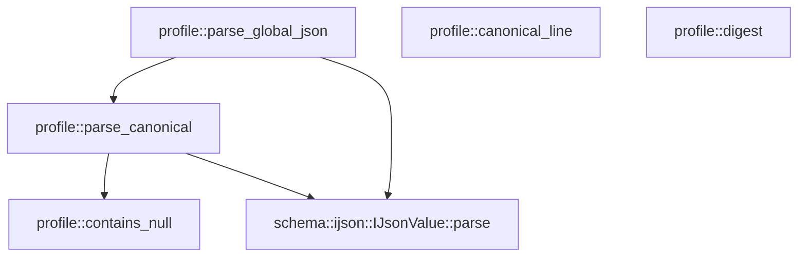

# profile

[Package atlas](index.md) · [Source](../../src/lib.rs)

## Declarations

Visibility is the declaration spelling; trait members and reexports require their enclosing interface. `cfg` is not evaluated.

| Symbol | Kind | Visibility | Test / cfg |
|---|---|---|---|
| [profile::ProfileError](../../src/lib.rs#L42) | enum_item | `pub` |  |
| [profile::parse_canonical](../../src/lib.rs#L71) | function_item | `pub(crate)` |  |
| [profile::parse_global_json](../../src/lib.rs#L121) | function_item | `pub(crate)` |  |
| [profile::canonical_line](../../src/lib.rs#L140) | function_item | `pub(crate)` |  |
| [profile::digest](../../src/lib.rs#L154) | function_item | `pub(crate)` |  |
| [profile::contains_null](../../src/lib.rs#L158) | function_item | `private` |  |

## Imports / reexports

| Local name | Source path | Visibility |
|---|---|---|
| `AutomaticTitleMode` | `config::AutomaticTitleMode` | `pub` |
| `AutomaticTitleSettings` | `config::AutomaticTitleSettings` | `pub` |
| `ConfigRepository` | `config::ConfigRepository` | `pub` |
| `ConfigSnapshot` | `config::ConfigSnapshot` | `pub` |
| `DEFAULT_AUTOMATIC_TITLE_MAX_INPUT_CHARS` | `config::DEFAULT_AUTOMATIC_TITLE_MAX_INPUT_CHARS` | `pub` |
| `ExecutionPolicy` | `config::ExecutionPolicy` | `pub` |
| `Limits` | `config::Limits` | `pub` |
| `MAX_AUTOMATIC_TITLE_MAX_INPUT_CHARS` | `config::MAX_AUTOMATIC_TITLE_MAX_INPUT_CHARS` | `pub` |
| `Model` | `config::Model` | `pub` |
| `Provider` | `config::Provider` | `pub` |
| `ProvidersConfig` | `config::ProvidersConfig` | `pub` |
| `ResolvedExecution` | `config::ResolvedExecution` | `pub` |
| `RevisionVector` | `config::RevisionVector` | `pub` |
| `SessionSettings` | `config::SessionSettings` | `pub` |
| `SettingsConfig` | `config::SettingsConfig` | `pub` |
| `WebSearch` | `config::WebSearch` | `pub` |
| `ExecutionConfig` | `execution::ExecutionConfig` | `pub` |
| `EffectiveInstructions` | `instruction::EffectiveInstructions` | `pub` |
| `EffectivePolicy` | `instruction::EffectivePolicy` | `pub` |
| `InstructionKind` | `instruction::InstructionKind` | `pub` |
| `InstructionOrigin` | `instruction::InstructionOrigin` | `pub` |
| `InstructionPolicy` | `instruction::InstructionPolicy` | `pub` |
| `InstructionResolver` | `instruction::InstructionResolver` | `pub` |
| `InstructionSettings` | `instruction::InstructionSettings` | `pub` |
| `InstructionSnapshot` | `instruction::InstructionSnapshot` | `pub` |
| `InstructionSource` | `instruction::InstructionSource` | `pub` |
| `LaunchProfile` | `instruction::LaunchProfile` | `pub` |
| `DynamicTool` | `launch::DynamicTool` | `pub` |
| `DynamicToolCatalog` | `launch::DynamicToolCatalog` | `pub` |
| `DynamicToolEffect` | `launch::DynamicToolEffect` | `pub` |
| `DynamicToolSource` | `launch::DynamicToolSource` | `pub` |
| `DynamicToolSourceKind` | `launch::DynamicToolSourceKind` | `pub` |
| `ExternalEffectBinding` | `launch::ExternalEffectBinding` | `pub` |
| `ExternalEffectProtocol` | `launch::ExternalEffectProtocol` | `pub` |
| `LaunchBindings` | `launch::LaunchBindings` | `pub` |
| `MAX_UNAVAILABLE_TOOLS` | `launch::MAX_UNAVAILABLE_TOOLS` | `pub` |
| `SchemaRefusal` | `launch::SchemaRefusal` | `pub` |
| `is_dynamic_tool_name` | `launch::is_dynamic_tool_name` | `pub` |
| `CommandCatalogEntry` | `resources::CommandCatalogEntry` | `pub` |
| `CommandExpansion` | `resources::CommandExpansion` | `pub` |
| `CommandSummary` | `resources::CommandSummary` | `pub` |
| `ResourceCatalog` | `resources::ResourceCatalog` | `pub` |
| `ResourceError` | `resources::ResourceError` | `pub` |
| `SkillPackage` | `resources::SkillPackage` | `pub` |
| `SkillResource` | `resources::SkillResource` | `pub` |
| `SkillSummary` | `resources::SkillSummary` | `pub` |
| `SessionScope` | `scope::SessionScope` | `pub` |
| `PathBuf` | `std::path::PathBuf` | `private` |
| `Serialize` | `serde::Serialize` | `private` |
| `DeserializeOwned` | `serde::de::DeserializeOwned` | `private` |
| `Digest` | `sha2::Digest` | `private` |
| `Sha256` | `sha2::Sha256` | `private` |
| `Error` | `thiserror::Error` | `private` |

## Module declarations

| Module | Visibility | Attributes |
|---|---|---|
| `profile::config` | `private` |  |
| `profile::execution` | `private` |  |
| `profile::instruction` | `private` |  |
| `profile::launch` | `private` |  |
| `profile::resources` | `private` |  |
| `profile::scope` | `private` |  |

## Function call graphs

Edges below are syntactically resolved calls only, including private functions. Graphs partition callers into groups of 20; they are not execution order. All unresolved sites are listed below and in the JSON inventory.

Functions 1–5: 4 direct edges

```mermaid
flowchart TD
  n0["profile::parse_global_json"]
  n1["profile::canonical_line"]
  n2["profile::digest"]
  n3["profile::contains_null"]
  n4["profile::parse_canonical"]
  n5["schema::ijson::IJsonValue::parse"]
  n0 --> n4
  n0 --> n5
  n4 --> n3
  n4 --> n5
```

## Call sites

Includes test functions (marked in declarations). Receiver-type-required sites need type analysis/manual tracing. Calls in closures are attributed to their enclosing function; their occurrence here does not mean the closure executes immediately.

| Caller | Callee expression | Source lines | Target / classification |
|---|---|---|---|
| `parse_canonical` | `path.into` | [75](../../src/lib.rs#L75) | receiver-type-required |
| `parse_canonical` | `bytes.ends_with` | [76](../../src/lib.rs#L76) | receiver-type-required |
| `parse_canonical` | `bytes.len` | [76](../../src/lib.rs#L76), [82](../../src/lib.rs#L82) | receiver-type-required |
| `parse_canonical` | `bytes[..bytes.len() - 1].ends_with` | [76](../../src/lib.rs#L76) | receiver-type-required |
| `parse_canonical` | `Err` | [77](../../src/lib.rs#L77), [94](../../src/lib.rs#L94), [105](../../src/lib.rs#L105) | external-constructor-callback-or-unresolved |
| `parse_canonical` | `"expected one canonical JSON object followed by exactly one LF".to_owned` | [79](../../src/lib.rs#L79) | receiver-type-required |
| `parse_canonical` | `schema::IJsonValue::parse(body).map_err` | [83](../../src/lib.rs#L83) | receiver-type-required |
| `parse_canonical` | `schema::IJsonValue::parse` | [83](../../src/lib.rs#L83) | [schema::ijson::IJsonValue::parse](../../../schema/src/ijson.rs#L16) |
| `parse_canonical` | `path.clone` | [84](../../src/lib.rs#L84), [90](../../src/lib.rs#L90), [101](../../src/lib.rs#L101) | receiver-type-required |
| `parse_canonical` | `error.to_string` | [85](../../src/lib.rs#L85), [91](../../src/lib.rs#L91), [102](../../src/lib.rs#L102), [112](../../src/lib.rs#L112) | receiver-type-required |
| `parse_canonical` | `value         .canonical_bytes()         .map_err` | [87](../../src/lib.rs#L87) | receiver-type-required |
| `parse_canonical` | `value         .canonical_bytes` | [87](../../src/lib.rs#L87) | receiver-type-required |
| `parse_canonical` | `"bytes are not RFC-8785 canonical".to_owned` | [96](../../src/lib.rs#L96) | receiver-type-required |
| `parse_canonical` | `serde_json::from_slice(body).map_err` | [100](../../src/lib.rs#L100) | receiver-type-required |
| `parse_canonical` | `serde_json::from_slice` | [100](../../src/lib.rs#L100) | external-constructor-callback-or-unresolved |
| `parse_canonical` | `contains_null` | [104](../../src/lib.rs#L104) | [profile::contains_null](../../src/lib.rs#L158) |
| `parse_canonical` | `"JSON null is not a substitute for an absent optional field".to_owned` | [107](../../src/lib.rs#L107) | receiver-type-required |
| `parse_canonical` | `serde_json::from_value(json).map_err` | [110](../../src/lib.rs#L110) | receiver-type-required |
| `parse_canonical` | `serde_json::from_value` | [110](../../src/lib.rs#L110) | external-constructor-callback-or-unresolved |
| `parse_global_json` | `path.into` | [125](../../src/lib.rs#L125) | receiver-type-required |
| `parse_global_json` | `schema::IJsonValue::parse(bytes).map_err` | [126](../../src/lib.rs#L126) | receiver-type-required |
| `parse_global_json` | `schema::IJsonValue::parse` | [126](../../src/lib.rs#L126) | [schema::ijson::IJsonValue::parse](../../../schema/src/ijson.rs#L16) |
| `parse_global_json` | `path.clone` | [127](../../src/lib.rs#L127), [133](../../src/lib.rs#L133) | receiver-type-required |
| `parse_global_json` | `error.to_string` | [128](../../src/lib.rs#L128), [134](../../src/lib.rs#L134) | receiver-type-required |
| `parse_global_json` | `value         .canonical_bytes()         .map_err` | [130](../../src/lib.rs#L130) | receiver-type-required |
| `parse_global_json` | `value         .canonical_bytes` | [130](../../src/lib.rs#L130) | receiver-type-required |
| `parse_global_json` | `canonical.push` | [136](../../src/lib.rs#L136) | receiver-type-required |
| `parse_global_json` | `parse_canonical` | [137](../../src/lib.rs#L137) | [profile::parse_canonical](../../src/lib.rs#L71) |
| `canonical_line` | `path.into` | [144](../../src/lib.rs#L144) | receiver-type-required |
| `canonical_line` | `serde_json_canonicalizer::to_vec(value).map_err` | [146](../../src/lib.rs#L146) | receiver-type-required |
| `canonical_line` | `serde_json_canonicalizer::to_vec` | [146](../../src/lib.rs#L146) | external-constructor-callback-or-unresolved |
| `canonical_line` | `error.to_string` | [148](../../src/lib.rs#L148) | receiver-type-required |
| `canonical_line` | `bytes.push` | [150](../../src/lib.rs#L150) | receiver-type-required |
| `canonical_line` | `Ok` | [151](../../src/lib.rs#L151) | external-constructor-callback-or-unresolved |
| `contains_null` | `values.iter().any` | [161](../../src/lib.rs#L161) | receiver-type-required |
| `contains_null` | `values.iter` | [161](../../src/lib.rs#L161) | receiver-type-required |
| `contains_null` | `values.values().any` | [162](../../src/lib.rs#L162) | receiver-type-required |
| `contains_null` | `values.values` | [162](../../src/lib.rs#L162) | receiver-type-required |
