# profile::resources

[Package atlas](index.md) · [Source](../../src/resources.rs)

## Declarations

Visibility is the declaration spelling; trait members and reexports require their enclosing interface. `cfg` is not evaluated.

| Symbol | Kind | Visibility | Test / cfg |
|---|---|---|---|
| [profile::resources::MAX_NAME_BYTES](../../src/resources.rs#L15) | const_item | `private` |  |
| [profile::resources::MAX_ARGUMENT_BYTES](../../src/resources.rs#L16) | const_item | `private` |  |
| [profile::resources::MAX_EXPANDED_BYTES](../../src/resources.rs#L17) | const_item | `private` |  |
| [profile::resources::SkillResource](../../src/resources.rs#L21) | struct_item | `pub` |  |
| [profile::resources::SkillSummary](../../src/resources.rs#L29) | struct_item | `pub` |  |
| [profile::resources::SkillPackage](../../src/resources.rs#L39) | struct_item | `pub` |  |
| [profile::resources::CommandSummary](../../src/resources.rs#L47) | struct_item | `pub` |  |
| [profile::resources::CommandCatalogEntry](../../src/resources.rs#L59) | struct_item | `pub` |  |
| [profile::resources::CommandExpansion](../../src/resources.rs#L65) | struct_item | `pub` |  |
| [profile::resources::ResourceCatalog](../../src/resources.rs#L72) | struct_item | `pub` |  |
| [profile::resources::ResourceError](../../src/resources.rs#L78) | enum_item | `pub` |  |
| [profile::resources::ResourceCatalog::from_snapshot](../../src/resources.rs#L98) | function_item | `pub` |  |
| [profile::resources::ResourceCatalog::skill_summaries](../../src/resources.rs#L105) | function_item | `pub` |  |
| [profile::resources::ResourceCatalog::skill](../../src/resources.rs#L112) | function_item | `pub` |  |
| [profile::resources::ResourceCatalog::skill_packages](../../src/resources.rs#L121) | function_item | `pub` |  |
| [profile::resources::ResourceCatalog::skill_resource](../../src/resources.rs#L125) | function_item | `pub` |  |
| [profile::resources::ResourceCatalog::command_summaries](../../src/resources.rs#L139) | function_item | `pub` |  |
| [profile::resources::ResourceCatalog::command](../../src/resources.rs#L146) | function_item | `pub` |  |
| [profile::resources::ResourceCatalog::expand_command](../../src/resources.rs#L152) | function_item | `pub` |  |
| [profile::resources::PackageCandidate](../../src/resources.rs#L179) | struct_item | `private` |  |
| [profile::resources::build_skills](../../src/resources.rs#L184) | function_item | `private` |  |
| [profile::resources::build_commands](../../src/resources.rs#L291) | function_item | `private` |  |
| [profile::resources::ParsedDocument](../../src/resources.rs#L333) | struct_item | `private` |  |
| [profile::resources::ParsedSkill](../../src/resources.rs#L338) | struct_item | `private` |  |
| [profile::resources::parse_skill_manifest](../../src/resources.rs#L344) | function_item | `private` |  |
| [profile::resources::parse_command](../../src/resources.rs#L374) | function_item | `private` |  |
| [profile::resources::parse_front_matter](../../src/resources.rs#L390) | function_item | `private` |  |
| [profile::resources::parse_arguments](../../src/resources.rs#L462) | function_item | `private` |  |
| [profile::resources::substitute_arguments](../../src/resources.rs#L518) | function_item | `private` |  |
| [profile::resources::push_expansion](../../src/resources.rs#L576) | function_item | `private` |  |
| [profile::resources::push_expansion_char](../../src/resources.rs#L586) | function_item | `private` |  |
| [profile::resources::source_label](../../src/resources.rs#L591) | function_item | `private` |  |
| [profile::resources::validate_name](../../src/resources.rs#L601) | function_item | `private` |  |
| [profile::resources::validate_relative](../../src/resources.rs#L615) | function_item | `private` |  |
| [profile::resources::hex_digest](../../src/resources.rs#L628) | function_item | `private` |  |
| [profile::resources::tests::shared_skill_plain_description_accepts_embedded_colon](../../src/resources.rs#L635) | function_item | `private` | test; #[cfg(test)] |
| [profile::resources::tests::source](../../src/resources.rs#L654) | function_item | `private` | test; #[cfg(test)] |
| [profile::resources::tests::cross_scope_skill_collision_is_explicit_instead_of_silent_precedence](../../src/resources.rs#L670) | function_item | `private` | test; #[cfg(test)] |
| [profile::resources::tests::command_expansion_has_closed_quoting_and_escape_rules](../../src/resources.rs#L713) | function_item | `private` | test; #[cfg(test)] |
| [profile::resources::tests::invalid_winner_and_out_of_range_positionals_fail_closed](../../src/resources.rs#L740) | function_item | `private` | test; #[cfg(test)] |

## Imports / reexports

| Local name | Source path | Visibility |
|---|---|---|
| `BTreeMap` | `std::collections::BTreeMap` | `private` |
| `Deserialize` | `serde::Deserialize` | `private` |
| `Serialize` | `serde::Serialize` | `private` |
| `json` | `serde_json::json` | `private` |
| `Digest` | `sha2::Digest` | `private` |
| `Sha256` | `sha2::Sha256` | `private` |
| `Error` | `thiserror::Error` | `private` |
| `InstructionKind` | `crate::InstructionKind` | `private` |
| `InstructionOrigin` | `crate::InstructionOrigin` | `private` |
| `InstructionSnapshot` | `crate::InstructionSnapshot` | `private` |
| `InstructionSource` | `crate::InstructionSource` | `private` |
| `*` | `super::*` | `private` |
| `EffectiveInstructions` | `crate::EffectiveInstructions` | `private` |
| `InstructionSource` | `crate::InstructionSource` | `private` |

## Module declarations

| Module | Visibility | Attributes |
|---|---|---|
| `profile::resources::tests` | `private` | #[cfg(test)] |

## Function call graphs

Edges below are syntactically resolved calls only, including private functions. Graphs partition callers into groups of 20; they are not execution order. All unresolved sites are listed below and in the JSON inventory.

```mermaid
flowchart TD
  n0["profile::resources::ResourceCatalog::skill_summaries"]
  n1["profile::resources::ResourceCatalog::skill"]
  n2["profile::resources::ResourceCatalog::skill_packages"]
  n3["profile::resources::ResourceCatalog::skill_resource"]
  n4["profile::resources::ResourceCatalog::command_summaries"]
  n5["profile::resources::ResourceCatalog::command"]
  n6["profile::resources::ResourceCatalog::expand_command"]
  n7["profile::resources::build_skills"]
  n8["profile::resources::build_commands"]
  n9["profile::resources::parse_skill_manifest"]
  n10["profile::resources::parse_command"]
  n11["profile::resources::parse_front_matter"]
  n12["profile::resources::parse_arguments"]
  n13["profile::resources::substitute_arguments"]
  n14["profile::resources::push_expansion"]
  n15["profile::resources::push_expansion_char"]
  n16["profile::resources::source_label"]
  n17["profile::resources::validate_name"]
  n18["profile::resources::validate_relative"]
  n19["profile::resources::hex_digest"]
  n20["profile::resources::ResourceCatalog::from_snapshot"]
  n3 --> n1
  n3 --> n18
  n6 --> n5
  n6 --> n12
  n6 --> n13
  n7 --> n9
  n7 --> n16
  n7 --> n17
  n7 --> n18
  n7 --> n19
  n8 --> n10
  n8 --> n16
  n8 --> n17
  n9 --> n11
  n9 --> n17
  n10 --> n11
  n13 --> n14
  n13 --> n15
  n15 --> n14
  n20 --> n7
  n20 --> n8
```

Functions 1–20: 21 direct edges

Functions 21–21: 0 direct edges

## Call sites

Includes test functions (marked in declarations). Receiver-type-required sites need type analysis/manual tracing. Calls in closures are attributed to their enclosing function; their occurrence here does not mean the closure executes immediately.

| Caller | Callee expression | Source lines | Target / classification |
|---|---|---|---|
| `from_snapshot` | `build_skills` | [99](../../src/resources.rs#L99) | [profile::resources::build_skills](../../src/resources.rs#L184) |
| `from_snapshot` | `build_commands` | [100](../../src/resources.rs#L100) | [profile::resources::build_commands](../../src/resources.rs#L291) |
| `from_snapshot` | `Ok` | [101](../../src/resources.rs#L101) | external-constructor-callback-or-unresolved |
| `skill_summaries` | `self.skills             .values()             .map(&#124;package&#124; package.summary.clone())             .collect` | [106](../../src/resources.rs#L106) | receiver-type-required |
| `skill_summaries` | `self.skills             .values()             .map` | [106](../../src/resources.rs#L106) | receiver-type-required |
| `skill_summaries` | `self.skills             .values` | [106](../../src/resources.rs#L106) | receiver-type-required |
| `skill_summaries` | `package.summary.clone` | [108](../../src/resources.rs#L108) | receiver-type-required |
| `skill` | `self.skills             .get(name)             .ok_or_else` | [113](../../src/resources.rs#L113) | receiver-type-required |
| `skill` | `self.skills             .get` | [113](../../src/resources.rs#L113) | receiver-type-required |
| `skill` | `ResourceError::SkillNotFound` | [115](../../src/resources.rs#L115) | external-constructor-callback-or-unresolved |
| `skill` | `name.to_owned` | [115](../../src/resources.rs#L115) | receiver-type-required |
| `skill_packages` | `self.skills.values` | [122](../../src/resources.rs#L122) | receiver-type-required |
| `skill_resource` | `validate_relative` | [126](../../src/resources.rs#L126) | [profile::resources::validate_relative](../../src/resources.rs#L615) |
| `skill_resource` | `self.skill(skill)?             .resources             .iter()             .find(&#124;resource&#124; resource.path == path)             .map(&#124;resource&#124; resource.content.as_str())             .ok_or_else` | [127](../../src/resources.rs#L127) | receiver-type-required |
| `skill_resource` | `self.skill(skill)?             .resources             .iter()             .find(&#124;resource&#124; resource.path == path)             .map` | [127](../../src/resources.rs#L127) | receiver-type-required |
| `skill_resource` | `self.skill(skill)?             .resources             .iter()             .find` | [127](../../src/resources.rs#L127) | receiver-type-required |
| `skill_resource` | `self.skill(skill)?             .resources             .iter` | [127](../../src/resources.rs#L127) | receiver-type-required |
| `skill_resource` | `self.skill` | [127](../../src/resources.rs#L127) | [profile::resources::ResourceCatalog::skill](../../src/resources.rs#L112) |
| `skill_resource` | `resource.content.as_str` | [131](../../src/resources.rs#L131) | receiver-type-required |
| `skill_resource` | `skill.to_owned` | [133](../../src/resources.rs#L133) | receiver-type-required |
| `skill_resource` | `path.to_owned` | [134](../../src/resources.rs#L134) | receiver-type-required |
| `command_summaries` | `self.commands             .values()             .map(&#124;command&#124; command.summary.clone())             .collect` | [140](../../src/resources.rs#L140) | receiver-type-required |
| `command_summaries` | `self.commands             .values()             .map` | [140](../../src/resources.rs#L140) | receiver-type-required |
| `command_summaries` | `self.commands             .values` | [140](../../src/resources.rs#L140) | receiver-type-required |
| `command_summaries` | `command.summary.clone` | [142](../../src/resources.rs#L142) | receiver-type-required |
| `command` | `self.commands             .get(name)             .ok_or_else` | [147](../../src/resources.rs#L147) | receiver-type-required |
| `command` | `self.commands             .get` | [147](../../src/resources.rs#L147) | receiver-type-required |
| `command` | `ResourceError::CommandNotFound` | [149](../../src/resources.rs#L149) | external-constructor-callback-or-unresolved |
| `command` | `name.to_owned` | [149](../../src/resources.rs#L149) | receiver-type-required |
| `expand_command` | `self.command` | [157](../../src/resources.rs#L157) | [profile::resources::ResourceCatalog::command](../../src/resources.rs#L146) |
| `expand_command` | `parse_arguments` | [158](../../src/resources.rs#L158) | [profile::resources::parse_arguments](../../src/resources.rs#L462) |
| `expand_command` | `substitute_arguments` | [159](../../src/resources.rs#L159) | [profile::resources::substitute_arguments](../../src/resources.rs#L518) |
| `expand_command` | `text.trim().is_empty` | [160](../../src/resources.rs#L160) | receiver-type-required |
| `expand_command` | `text.trim` | [160](../../src/resources.rs#L160) | receiver-type-required |
| `expand_command` | `Err` | [161](../../src/resources.rs#L161), [166](../../src/resources.rs#L166) | external-constructor-callback-or-unresolved |
| `expand_command` | `ResourceError::InvalidCommand` | [161](../../src/resources.rs#L161) | external-constructor-callback-or-unresolved |
| `expand_command` | `text.len` | [165](../../src/resources.rs#L165) | receiver-type-required |
| `expand_command` | `ResourceError::InvalidArguments` | [166](../../src/resources.rs#L166) | external-constructor-callback-or-unresolved |
| `expand_command` | `"expanded command exceeds 1 MiB".to_owned` | [167](../../src/resources.rs#L167) | receiver-type-required |
| `expand_command` | `Ok` | [170](../../src/resources.rs#L170) | external-constructor-callback-or-unresolved |
| `expand_command` | `name.to_owned` | [171](../../src/resources.rs#L171) | receiver-type-required |
| `expand_command` | `command.summary.content_digest.clone` | [173](../../src/resources.rs#L173) | receiver-type-required |
| `build_skills` | `BTreeMap::new` | [187](../../src/resources.rs#L187), [225](../../src/resources.rs#L225) | external-constructor-callback-or-unresolved |
| `build_skills` | `snapshot         .sources         .iter()         .filter` | [188](../../src/resources.rs#L188) | receiver-type-required |
| `build_skills` | `snapshot         .sources         .iter` | [188](../../src/resources.rs#L188) | receiver-type-required |
| `build_skills` | `source             .path             .strip_prefix("skills/")             .ok_or_else` | [193](../../src/resources.rs#L193) | receiver-type-required |
| `build_skills` | `source             .path             .strip_prefix` | [193](../../src/resources.rs#L193) | receiver-type-required |
| `build_skills` | `ResourceError::InvalidPath` | [196](../../src/resources.rs#L196) | external-constructor-callback-or-unresolved |
| `build_skills` | `source.path.clone` | [196](../../src/resources.rs#L196) | receiver-type-required |
| `build_skills` | `relative.split_once` | [197](../../src/resources.rs#L197) | receiver-type-required |
| `build_skills` | `validate_name` | [200](../../src/resources.rs#L200) | [profile::resources::validate_name](../../src/resources.rs#L601) |
| `build_skills` | `validate_relative` | [201](../../src/resources.rs#L201) | [profile::resources::validate_relative](../../src/resources.rs#L615) |
| `build_skills` | `candidates.get_mut` | [202](../../src/resources.rs#L202) | receiver-type-required |
| `build_skills` | `candidate.sources.push` | [204](../../src/resources.rs#L204) | receiver-type-required |
| `build_skills` | `Err` | [207](../../src/resources.rs#L207), [235](../../src/resources.rs#L235), [247](../../src/resources.rs#L247) | external-constructor-callback-or-unresolved |
| `build_skills` | `ResourceError::InvalidSkill` | [207](../../src/resources.rs#L207), [235](../../src/resources.rs#L235), [240](../../src/resources.rs#L240), [247](../../src/resources.rs#L247), [270](../../src/resources.rs#L270) | external-constructor-callback-or-unresolved |
| `build_skills` | `candidates.insert` | [214](../../src/resources.rs#L214) | receiver-type-required |
| `build_skills` | `name.to_owned` | [215](../../src/resources.rs#L215) | receiver-type-required |
| `build_skills` | `source.origin.clone` | [217](../../src/resources.rs#L217) | receiver-type-required |
| `build_skills` | `candidate             .sources             .sort_by` | [227](../../src/resources.rs#L227) | receiver-type-required |
| `build_skills` | `left.0.as_bytes().cmp` | [229](../../src/resources.rs#L229) | receiver-type-required |
| `build_skills` | `left.0.as_bytes` | [229](../../src/resources.rs#L229) | receiver-type-required |
| `build_skills` | `right.0.as_bytes` | [229](../../src/resources.rs#L229) | receiver-type-required |
| `build_skills` | `candidate             .sources             .iter()             .find` | [230](../../src/resources.rs#L230) | receiver-type-required |
| `build_skills` | `candidate             .sources             .iter` | [230](../../src/resources.rs#L230), [252](../../src/resources.rs#L252) | receiver-type-required |
| `build_skills` | `parse_skill_manifest(&manifest.content).map_err` | [239](../../src/resources.rs#L239) | receiver-type-required |
| `build_skills` | `parse_skill_manifest` | [239](../../src/resources.rs#L239) | [profile::resources::parse_skill_manifest](../../src/resources.rs#L344) |
| `build_skills` | `candidate             .sources             .iter()             .map(&#124;(path, source)&#124; SkillResource {                 path: (*path).to_owned(),                 content: source.content.clone(),                 content_sha256: source.content_sha256.clone(),             })             .collect::<Vec<_>>` | [252](../../src/resources.rs#L252) | receiver-type-required |
| `build_skills` | `candidate             .sources             .iter()             .map` | [252](../../src/resources.rs#L252) | receiver-type-required |
| `build_skills` | `(*path).to_owned` | [256](../../src/resources.rs#L256) | receiver-type-required |
| `build_skills` | `source.content.clone` | [257](../../src/resources.rs#L257) | receiver-type-required |
| `build_skills` | `source.content_sha256.clone` | [258](../../src/resources.rs#L258) | receiver-type-required |
| `build_skills` | `serde_json_canonicalizer::to_vec(&digest_value)             .map_err` | [269](../../src/resources.rs#L269) | receiver-type-required |
| `build_skills` | `serde_json_canonicalizer::to_vec` | [269](../../src/resources.rs#L269) | external-constructor-callback-or-unresolved |
| `build_skills` | `error.to_string` | [270](../../src/resources.rs#L270) | receiver-type-required |
| `build_skills` | `hex_digest` | [271](../../src/resources.rs#L271) | [profile::resources::hex_digest](../../src/resources.rs#L628) |
| `build_skills` | `directory_name.clone` | [273](../../src/resources.rs#L273), [274](../../src/resources.rs#L274) | receiver-type-required |
| `build_skills` | `source_label` | [276](../../src/resources.rs#L276) | [profile::resources::source_label](../../src/resources.rs#L591) |
| `build_skills` | `packages.insert` | [279](../../src/resources.rs#L279) | receiver-type-required |
| `build_skills` | `Ok` | [288](../../src/resources.rs#L288) | external-constructor-callback-or-unresolved |
| `build_commands` | `BTreeMap::new` | [294](../../src/resources.rs#L294) | external-constructor-callback-or-unresolved |
| `build_commands` | `logical.contains` | [296](../../src/resources.rs#L296) | receiver-type-required |
| `build_commands` | `logical.ends_with` | [296](../../src/resources.rs#L296) | receiver-type-required |
| `build_commands` | `logical             .strip_suffix(".md")             .ok_or_else` | [299](../../src/resources.rs#L299) | receiver-type-required |
| `build_commands` | `logical             .strip_suffix` | [299](../../src/resources.rs#L299) | receiver-type-required |
| `build_commands` | `ResourceError::InvalidPath` | [301](../../src/resources.rs#L301) | external-constructor-callback-or-unresolved |
| `build_commands` | `logical.clone` | [301](../../src/resources.rs#L301) | receiver-type-required |
| `build_commands` | `validate_name` | [302](../../src/resources.rs#L302) | [profile::resources::validate_name](../../src/resources.rs#L601) |
| `build_commands` | `snapshot.sources.get(*index as usize).ok_or_else` | [303](../../src/resources.rs#L303) | receiver-type-required |
| `build_commands` | `snapshot.sources.get` | [303](../../src/resources.rs#L303) | receiver-type-required |
| `build_commands` | `ResourceError::InvalidCommand` | [304](../../src/resources.rs#L304) | external-constructor-callback-or-unresolved |
| `build_commands` | `parse_command` | [306](../../src/resources.rs#L306) | [profile::resources::parse_command](../../src/resources.rs#L374) |
| `build_commands` | `commands.insert` | [307](../../src/resources.rs#L307) | receiver-type-required |
| `build_commands` | `name.to_owned` | [308](../../src/resources.rs#L308), [311](../../src/resources.rs#L311) | receiver-type-required |
| `build_commands` | `parsed                         .fields                         .get("description")                         .cloned()                         .unwrap_or_default` | [312](../../src/resources.rs#L312) | receiver-type-required |
| `build_commands` | `parsed                         .fields                         .get("description")                         .cloned` | [312](../../src/resources.rs#L312) | receiver-type-required |
| `build_commands` | `parsed                         .fields                         .get` | [312](../../src/resources.rs#L312), [317](../../src/resources.rs#L317) | receiver-type-required |
| `build_commands` | `parsed                         .fields                         .get("argument-hint")                         .or_else(&#124;&#124; parsed.fields.get("argument_hint"))                         .cloned` | [317](../../src/resources.rs#L317) | receiver-type-required |
| `build_commands` | `parsed                         .fields                         .get("argument-hint")                         .or_else` | [317](../../src/resources.rs#L317) | receiver-type-required |
| `build_commands` | `parsed.fields.get` | [320](../../src/resources.rs#L320), [322](../../src/resources.rs#L322) | receiver-type-required |
| `build_commands` | `parsed.fields.get("model").cloned` | [322](../../src/resources.rs#L322) | receiver-type-required |
| `build_commands` | `source_label` | [323](../../src/resources.rs#L323) | [profile::resources::source_label](../../src/resources.rs#L591) |
| `build_commands` | `source.content_sha256.clone` | [324](../../src/resources.rs#L324) | receiver-type-required |
| `build_commands` | `Ok` | [330](../../src/resources.rs#L330) | external-constructor-callback-or-unresolved |
| `parse_skill_manifest` | `parse_front_matter(content, true)         .map_err` | [345](../../src/resources.rs#L345) | receiver-type-required |
| `parse_skill_manifest` | `parse_front_matter` | [345](../../src/resources.rs#L345) | [profile::resources::parse_front_matter](../../src/resources.rs#L390) |
| `parse_skill_manifest` | `ResourceError::InvalidSkill` | [346](../../src/resources.rs#L346), [349](../../src/resources.rs#L349), [359](../../src/resources.rs#L359), [366](../../src/resources.rs#L366) | external-constructor-callback-or-unresolved |
| `parse_skill_manifest` | `error.to_string` | [346](../../src/resources.rs#L346) | receiver-type-required |
| `parse_skill_manifest` | `parsed.fields.get` | [347](../../src/resources.rs#L347) | receiver-type-required |
| `parse_skill_manifest` | `Err` | [349](../../src/resources.rs#L349) | external-constructor-callback-or-unresolved |
| `parse_skill_manifest` | `"schema_version must be 1".to_owned` | [350](../../src/resources.rs#L350) | receiver-type-required |
| `parse_skill_manifest` | `parsed         .fields         .get("name")         .filter(&#124;value&#124; !value.is_empty())         .cloned()         .ok_or_else` | [354](../../src/resources.rs#L354) | receiver-type-required |
| `parse_skill_manifest` | `parsed         .fields         .get("name")         .filter(&#124;value&#124; !value.is_empty())         .cloned` | [354](../../src/resources.rs#L354) | receiver-type-required |
| `parse_skill_manifest` | `parsed         .fields         .get("name")         .filter` | [354](../../src/resources.rs#L354) | receiver-type-required |
| `parse_skill_manifest` | `parsed         .fields         .get` | [354](../../src/resources.rs#L354), [361](../../src/resources.rs#L361) | receiver-type-required |
| `parse_skill_manifest` | `value.is_empty` | [357](../../src/resources.rs#L357), [364](../../src/resources.rs#L364) | receiver-type-required |
| `parse_skill_manifest` | `"front matter lacks name".to_owned` | [359](../../src/resources.rs#L359) | receiver-type-required |
| `parse_skill_manifest` | `validate_name` | [360](../../src/resources.rs#L360) | [profile::resources::validate_name](../../src/resources.rs#L601) |
| `parse_skill_manifest` | `parsed         .fields         .get("description")         .filter(&#124;value&#124; !value.is_empty())         .cloned()         .ok_or_else` | [361](../../src/resources.rs#L361) | receiver-type-required |
| `parse_skill_manifest` | `parsed         .fields         .get("description")         .filter(&#124;value&#124; !value.is_empty())         .cloned` | [361](../../src/resources.rs#L361) | receiver-type-required |
| `parse_skill_manifest` | `parsed         .fields         .get("description")         .filter` | [361](../../src/resources.rs#L361) | receiver-type-required |
| `parse_skill_manifest` | `"front matter lacks description".to_owned` | [366](../../src/resources.rs#L366) | receiver-type-required |
| `parse_skill_manifest` | `Ok` | [367](../../src/resources.rs#L367) | external-constructor-callback-or-unresolved |
| `parse_command` | `parse_front_matter(content, false)         .map_err` | [375](../../src/resources.rs#L375) | receiver-type-required |
| `parse_command` | `parse_front_matter` | [375](../../src/resources.rs#L375) | [profile::resources::parse_front_matter](../../src/resources.rs#L390) |
| `parse_command` | `ResourceError::InvalidCommand` | [376](../../src/resources.rs#L376), [378](../../src/resources.rs#L378), [383](../../src/resources.rs#L383) | external-constructor-callback-or-unresolved |
| `parse_command` | `error.to_string` | [376](../../src/resources.rs#L376) | receiver-type-required |
| `parse_command` | `parsed.fields.contains_key` | [377](../../src/resources.rs#L377) | receiver-type-required |
| `parse_command` | `Err` | [378](../../src/resources.rs#L378), [383](../../src/resources.rs#L383) | external-constructor-callback-or-unresolved |
| `parse_command` | `"argument-hint and argument_hint cannot both be present".to_owned` | [379](../../src/resources.rs#L379) | receiver-type-required |
| `parse_command` | `parsed.body.trim().is_empty` | [382](../../src/resources.rs#L382) | receiver-type-required |
| `parse_command` | `parsed.body.trim` | [382](../../src/resources.rs#L382) | receiver-type-required |
| `parse_command` | `"command body must not be empty".to_owned` | [384](../../src/resources.rs#L384) | receiver-type-required |
| `parse_command` | `Ok` | [387](../../src/resources.rs#L387) | external-constructor-callback-or-unresolved |
| `parse_front_matter` | `content.replace` | [391](../../src/resources.rs#L391) | receiver-type-required |
| `parse_front_matter` | `normalized.starts_with` | [392](../../src/resources.rs#L392) | receiver-type-required |
| `parse_front_matter` | `Err` | [394](../../src/resources.rs#L394), [404](../../src/resources.rs#L404), [432](../../src/resources.rs#L432) | external-constructor-callback-or-unresolved |
| `parse_front_matter` | `Ok` | [396](../../src/resources.rs#L396), [456](../../src/resources.rs#L456) | external-constructor-callback-or-unresolved |
| `parse_front_matter` | `BTreeMap::new` | [397](../../src/resources.rs#L397), [438](../../src/resources.rs#L438) | external-constructor-callback-or-unresolved |
| `parse_front_matter` | `normalized.trim().to_owned` | [398](../../src/resources.rs#L398) | receiver-type-required |
| `parse_front_matter` | `normalized.trim` | [398](../../src/resources.rs#L398) | receiver-type-required |
| `parse_front_matter` | `normalized.split('\n').collect::<Vec<_>>` | [402](../../src/resources.rs#L402) | receiver-type-required |
| `parse_front_matter` | `normalized.split` | [402](../../src/resources.rs#L402) | receiver-type-required |
| `parse_front_matter` | `lines.iter().skip(1).position` | [403](../../src/resources.rs#L403) | receiver-type-required |
| `parse_front_matter` | `lines.iter().skip` | [403](../../src/resources.rs#L403) | receiver-type-required |
| `parse_front_matter` | `lines.iter` | [403](../../src/resources.rs#L403) | receiver-type-required |
| `parse_front_matter` | `lines[1..closing].join` | [410](../../src/resources.rs#L410) | receiver-type-required |
| `parse_front_matter` | `serde_yaml::from_str(&header)         .or_else(&#124;original&#124; {             let repaired = lines[1..closing]                 .iter()                 .map(&#124;line&#124; {                     if let Some(value) = line.strip_prefix("description:") {                         let value = value.trim();                         if value.contains(": ")                             && !value.starts_with(['\'', '"', '&#124;', '>', '{', '['])                         {                             return format!(                                 "description: {}",                                 serde_json::to_string(value).expect("string serialization")                             );                         }                     }                     (*line).to_owned()                 })                 .collect::<Vec<_>>()                 .join("\n");             if repaired == header {                 Err(original)             } else {                 serde_yaml::from_str(&repaired)             }         })         .map_err` | [411](../../src/resources.rs#L411) | receiver-type-required |
| `parse_front_matter` | `serde_yaml::from_str(&header)         .or_else` | [411](../../src/resources.rs#L411) | receiver-type-required |
| `parse_front_matter` | `serde_yaml::from_str` | [411](../../src/resources.rs#L411), [434](../../src/resources.rs#L434) | external-constructor-callback-or-unresolved |
| `parse_front_matter` | `lines[1..closing]                 .iter()                 .map(&#124;line&#124; {                     if let Some(value) = line.strip_prefix("description:") {                         let value = value.trim();                         if value.contains(": ")                             && !value.starts_with(['\'', '"', '&#124;', '>', '{', '['])                         {                             return format!(                                 "description: {}",                                 serde_json::to_string(value).expect("string serialization")                             );                         }                     }                     (*line).to_owned()                 })                 .collect::<Vec<_>>()                 .join` | [413](../../src/resources.rs#L413) | receiver-type-required |
| `parse_front_matter` | `lines[1..closing]                 .iter()                 .map(&#124;line&#124; {                     if let Some(value) = line.strip_prefix("description:") {                         let value = value.trim();                         if value.contains(": ")                             && !value.starts_with(['\'', '"', '&#124;', '>', '{', '['])                         {                             return format!(                                 "description: {}",                                 serde_json::to_string(value).expect("string serialization")                             );                         }                     }                     (*line).to_owned()                 })                 .collect::<Vec<_>>` | [413](../../src/resources.rs#L413) | receiver-type-required |
| `parse_front_matter` | `lines[1..closing]                 .iter()                 .map` | [413](../../src/resources.rs#L413) | receiver-type-required |
| `parse_front_matter` | `lines[1..closing]                 .iter` | [413](../../src/resources.rs#L413) | receiver-type-required |
| `parse_front_matter` | `line.strip_prefix` | [416](../../src/resources.rs#L416) | receiver-type-required |
| `parse_front_matter` | `value.trim` | [417](../../src/resources.rs#L417) | receiver-type-required |
| `parse_front_matter` | `value.contains` | [418](../../src/resources.rs#L418) | receiver-type-required |
| `parse_front_matter` | `value.starts_with` | [419](../../src/resources.rs#L419) | receiver-type-required |
| `parse_front_matter` | `(*line).to_owned` | [427](../../src/resources.rs#L427) | receiver-type-required |
| `parse_front_matter` | `key             .as_str()             .filter(&#124;key&#124; !key.is_empty())             .ok_or` | [440](../../src/resources.rs#L440) | receiver-type-required |
| `parse_front_matter` | `key             .as_str()             .filter` | [440](../../src/resources.rs#L440) | receiver-type-required |
| `parse_front_matter` | `key             .as_str` | [440](../../src/resources.rs#L440) | receiver-type-required |
| `parse_front_matter` | `key.is_empty` | [442](../../src/resources.rs#L442) | receiver-type-required |
| `parse_front_matter` | `Some` | [445](../../src/resources.rs#L445), [446](../../src/resources.rs#L446), [447](../../src/resources.rs#L447) | external-constructor-callback-or-unresolved |
| `parse_front_matter` | `value.to_string` | [446](../../src/resources.rs#L446), [447](../../src/resources.rs#L447) | receiver-type-required |
| `parse_front_matter` | `fields.insert` | [453](../../src/resources.rs#L453) | receiver-type-required |
| `parse_front_matter` | `key.to_owned` | [453](../../src/resources.rs#L453) | receiver-type-required |
| `parse_front_matter` | `lines[closing + 1..].join("\n").trim().to_owned` | [458](../../src/resources.rs#L458) | receiver-type-required |
| `parse_front_matter` | `lines[closing + 1..].join("\n").trim` | [458](../../src/resources.rs#L458) | receiver-type-required |
| `parse_front_matter` | `lines[closing + 1..].join` | [458](../../src/resources.rs#L458) | receiver-type-required |
| `parse_arguments` | `arguments.len` | [463](../../src/resources.rs#L463) | receiver-type-required |
| `parse_arguments` | `Err` | [464](../../src/resources.rs#L464), [508](../../src/resources.rs#L508) | external-constructor-callback-or-unresolved |
| `parse_arguments` | `ResourceError::InvalidArguments` | [464](../../src/resources.rs#L464), [508](../../src/resources.rs#L508) | external-constructor-callback-or-unresolved |
| `parse_arguments` | `"arguments exceed 64 KiB".to_owned` | [465](../../src/resources.rs#L465) | receiver-type-required |
| `parse_arguments` | `Vec::new` | [468](../../src/resources.rs#L468) | external-constructor-callback-or-unresolved |
| `parse_arguments` | `String::new` | [469](../../src/resources.rs#L469) | external-constructor-callback-or-unresolved |
| `parse_arguments` | `arguments.chars` | [473](../../src/resources.rs#L473) | receiver-type-required |
| `parse_arguments` | `token.push` | [475](../../src/resources.rs#L475), [483](../../src/resources.rs#L483), [485](../../src/resources.rs#L485), [501](../../src/resources.rs#L501) | receiver-type-required |
| `parse_arguments` | `Some` | [487](../../src/resources.rs#L487) | external-constructor-callback-or-unresolved |
| `parse_arguments` | `character.is_whitespace` | [494](../../src/resources.rs#L494) | receiver-type-required |
| `parse_arguments` | `tokens.push` | [496](../../src/resources.rs#L496), [513](../../src/resources.rs#L513) | receiver-type-required |
| `parse_arguments` | `std::mem::take` | [496](../../src/resources.rs#L496) | external-constructor-callback-or-unresolved |
| `parse_arguments` | `quote.is_some` | [507](../../src/resources.rs#L507) | receiver-type-required |
| `parse_arguments` | `"arguments contain an unterminated quote or escape".to_owned` | [509](../../src/resources.rs#L509) | receiver-type-required |
| `parse_arguments` | `Ok` | [515](../../src/resources.rs#L515) | external-constructor-callback-or-unresolved |
| `substitute_arguments` | `body.chars().collect::<Vec<_>>` | [519](../../src/resources.rs#L519) | receiver-type-required |
| `substitute_arguments` | `body.chars` | [519](../../src/resources.rs#L519) | receiver-type-required |
| `substitute_arguments` | `String::new` | [520](../../src/resources.rs#L520) | external-constructor-callback-or-unresolved |
| `substitute_arguments` | `chars.len` | [522](../../src/resources.rs#L522), [545](../../src/resources.rs#L545) | receiver-type-required |
| `substitute_arguments` | `chars.get` | [523](../../src/resources.rs#L523), [533](../../src/resources.rs#L533), [549](../../src/resources.rs#L549) | receiver-type-required |
| `substitute_arguments` | `Some` | [523](../../src/resources.rs#L523), [533](../../src/resources.rs#L533) | external-constructor-callback-or-unresolved |
| `substitute_arguments` | `push_expansion_char` | [524](../../src/resources.rs#L524), [529](../../src/resources.rs#L529), [534](../../src/resources.rs#L534), [570](../../src/resources.rs#L570) | [profile::resources::push_expansion_char](../../src/resources.rs#L586) |
| `substitute_arguments` | `chars[index..].iter().collect::<String>` | [538](../../src/resources.rs#L538) | receiver-type-required |
| `substitute_arguments` | `chars[index..].iter` | [538](../../src/resources.rs#L538) | receiver-type-required |
| `substitute_arguments` | `suffix.starts_with` | [539](../../src/resources.rs#L539) | receiver-type-required |
| `substitute_arguments` | `push_expansion` | [540](../../src/resources.rs#L540), [565](../../src/resources.rs#L565) | [profile::resources::push_expansion](../../src/resources.rs#L576) |
| `substitute_arguments` | `"$ARGUMENTS".chars().count` | [541](../../src/resources.rs#L541) | receiver-type-required |
| `substitute_arguments` | `"$ARGUMENTS".chars` | [541](../../src/resources.rs#L541) | receiver-type-required |
| `substitute_arguments` | `chars[end].is_ascii_digit` | [545](../../src/resources.rs#L545) | receiver-type-required |
| `substitute_arguments` | `chars.get(end).is_some_and` | [549](../../src/resources.rs#L549) | receiver-type-required |
| `substitute_arguments` | `Err` | [550](../../src/resources.rs#L550), [560](../../src/resources.rs#L560) | external-constructor-callback-or-unresolved |
| `substitute_arguments` | `ResourceError::InvalidArguments` | [550](../../src/resources.rs#L550), [558](../../src/resources.rs#L558), [560](../../src/resources.rs#L560) | external-constructor-callback-or-unresolved |
| `substitute_arguments` | `"positionals are limited to $1 through $99".to_owned` | [551](../../src/resources.rs#L551) | receiver-type-required |
| `substitute_arguments` | `chars[index + 1..end]                 .iter()                 .collect::<String>()                 .parse::<usize>()                 .map_err` | [554](../../src/resources.rs#L554) | receiver-type-required |
| `substitute_arguments` | `chars[index + 1..end]                 .iter()                 .collect::<String>()                 .parse::<usize>` | [554](../../src/resources.rs#L554) | receiver-type-required |
| `substitute_arguments` | `chars[index + 1..end]                 .iter()                 .collect::<String>` | [554](../../src/resources.rs#L554) | receiver-type-required |
| `substitute_arguments` | `chars[index + 1..end]                 .iter` | [554](../../src/resources.rs#L554) | receiver-type-required |
| `substitute_arguments` | `"invalid positional".to_owned` | [558](../../src/resources.rs#L558) | receiver-type-required |
| `substitute_arguments` | `"$0 is not a valid positional".to_owned` | [561](../../src/resources.rs#L561) | receiver-type-required |
| `substitute_arguments` | `tokens.get` | [564](../../src/resources.rs#L564) | receiver-type-required |
| `substitute_arguments` | `Ok` | [573](../../src/resources.rs#L573) | external-constructor-callback-or-unresolved |
| `push_expansion` | `value.len` | [577](../../src/resources.rs#L577) | receiver-type-required |
| `push_expansion` | `MAX_EXPANDED_BYTES.saturating_sub` | [577](../../src/resources.rs#L577) | receiver-type-required |
| `push_expansion` | `output.len` | [577](../../src/resources.rs#L577) | receiver-type-required |
| `push_expansion` | `Err` | [578](../../src/resources.rs#L578) | external-constructor-callback-or-unresolved |
| `push_expansion` | `ResourceError::InvalidArguments` | [578](../../src/resources.rs#L578) | external-constructor-callback-or-unresolved |
| `push_expansion` | `"expanded command exceeds 1 MiB".to_owned` | [579](../../src/resources.rs#L579) | receiver-type-required |
| `push_expansion` | `output.push_str` | [582](../../src/resources.rs#L582) | receiver-type-required |
| `push_expansion` | `Ok` | [583](../../src/resources.rs#L583) | external-constructor-callback-or-unresolved |
| `push_expansion_char` | `push_expansion` | [588](../../src/resources.rs#L588) | [profile::resources::push_expansion](../../src/resources.rs#L576) |
| `push_expansion_char` | `value.encode_utf8` | [588](../../src/resources.rs#L588) | receiver-type-required |
| `source_label` | `"user".to_owned` | [593](../../src/resources.rs#L593) | receiver-type-required |
| `source_label` | `"workspace".to_owned` | [594](../../src/resources.rs#L594) | receiver-type-required |
| `validate_name` | `name.is_empty` | [602](../../src/resources.rs#L602) | receiver-type-required |
| `validate_name` | `name.len` | [603](../../src/resources.rs#L603) | receiver-type-required |
| `validate_name` | `name.bytes().enumerate().all` | [604](../../src/resources.rs#L604) | receiver-type-required |
| `validate_name` | `name.bytes().enumerate` | [604](../../src/resources.rs#L604) | receiver-type-required |
| `validate_name` | `name.bytes` | [604](../../src/resources.rs#L604) | receiver-type-required |
| `validate_name` | `byte.is_ascii_lowercase` | [605](../../src/resources.rs#L605) | receiver-type-required |
| `validate_name` | `byte.is_ascii_digit` | [606](../../src/resources.rs#L606) | receiver-type-required |
| `validate_name` | `Err` | [610](../../src/resources.rs#L610) | external-constructor-callback-or-unresolved |
| `validate_name` | `ResourceError::InvalidName` | [610](../../src/resources.rs#L610) | external-constructor-callback-or-unresolved |
| `validate_name` | `name.to_owned` | [610](../../src/resources.rs#L610) | receiver-type-required |
| `validate_name` | `Ok` | [612](../../src/resources.rs#L612) | external-constructor-callback-or-unresolved |
| `validate_relative` | `path.is_empty` | [616](../../src/resources.rs#L616) | receiver-type-required |
| `validate_relative` | `path.starts_with` | [617](../../src/resources.rs#L617) | receiver-type-required |
| `validate_relative` | `path.contains` | [618](../../src/resources.rs#L618) | receiver-type-required |
| `validate_relative` | `path             .split('/')             .any` | [619](../../src/resources.rs#L619) | receiver-type-required |
| `validate_relative` | `path             .split` | [619](../../src/resources.rs#L619) | receiver-type-required |
| `validate_relative` | `component.is_empty` | [621](../../src/resources.rs#L621) | receiver-type-required |
| `validate_relative` | `Err` | [623](../../src/resources.rs#L623) | external-constructor-callback-or-unresolved |
| `validate_relative` | `ResourceError::InvalidPath` | [623](../../src/resources.rs#L623) | external-constructor-callback-or-unresolved |
| `validate_relative` | `path.to_owned` | [623](../../src/resources.rs#L623) | receiver-type-required |
| `validate_relative` | `Ok` | [625](../../src/resources.rs#L625) | external-constructor-callback-or-unresolved |
| `shared_skill_plain_description_accepts_embedded_colon` | `super::parse_front_matter("---\nname: example\ndescription: Set up a project: scan and validate.\nreferences:\n  - guide\n---\nBody", true).unwrap` | [636](../../src/resources.rs#L636) | receiver-type-required |
| `shared_skill_plain_description_accepts_embedded_colon` | `super::parse_front_matter` | [636](../../src/resources.rs#L636) | [profile::resources::parse_front_matter](../../src/resources.rs#L390) |
| `source` | `path.to_owned` | [662](../../src/resources.rs#L662) | receiver-type-required |
| `source` | `content.to_owned` | [664](../../src/resources.rs#L664) | receiver-type-required |
| `source` | `hex_digest` | [665](../../src/resources.rs#L665) | external-constructor-callback-or-unresolved |
| `source` | `content.as_bytes` | [665](../../src/resources.rs#L665) | receiver-type-required |
| `cross_scope_skill_collision_is_explicit_instead_of_silent_precedence` | `EffectiveInstructions::default` | [702](../../src/resources.rs#L702) | external-constructor-callback-or-unresolved |
| `cross_scope_skill_collision_is_explicit_instead_of_silent_precedence` | `ResourceCatalog::from_snapshot(&snapshot).expect_err` | [704](../../src/resources.rs#L704) | receiver-type-required |
| `cross_scope_skill_collision_is_explicit_instead_of_silent_precedence` | `ResourceCatalog::from_snapshot` | [704](../../src/resources.rs#L704) | external-constructor-callback-or-unresolved |
| `command_expansion_has_closed_quoting_and_escape_rules` | `source` | [715](../../src/resources.rs#L715) | external-constructor-callback-or-unresolved |
| `command_expansion_has_closed_quoting_and_escape_rules` | `EffectiveInstructions::default` | [721](../../src/resources.rs#L721) | external-constructor-callback-or-unresolved |
| `command_expansion_has_closed_quoting_and_escape_rules` | `effective.commands.insert` | [722](../../src/resources.rs#L722) | receiver-type-required |
| `command_expansion_has_closed_quoting_and_escape_rules` | `"review.md".to_owned` | [722](../../src/resources.rs#L722) | receiver-type-required |
| `command_expansion_has_closed_quoting_and_escape_rules` | `ResourceCatalog::from_snapshot(&snapshot).expect` | [728](../../src/resources.rs#L728) | receiver-type-required |
| `command_expansion_has_closed_quoting_and_escape_rules` | `ResourceCatalog::from_snapshot` | [728](../../src/resources.rs#L728) | external-constructor-callback-or-unresolved |
| `command_expansion_has_closed_quoting_and_escape_rules` | `catalog             .expand_command("review", "'a b' strict")             .expect` | [729](../../src/resources.rs#L729) | receiver-type-required |
| `command_expansion_has_closed_quoting_and_escape_rules` | `catalog             .expand_command` | [729](../../src/resources.rs#L729) | receiver-type-required |
| `invalid_winner_and_out_of_range_positionals_fail_closed` | `EffectiveInstructions::default` | [749](../../src/resources.rs#L749), [762](../../src/resources.rs#L762), [782](../../src/resources.rs#L782) | external-constructor-callback-or-unresolved |
| `invalid_winner_and_out_of_range_positionals_fail_closed` | `source` | [756](../../src/resources.rs#L756), [776](../../src/resources.rs#L776) | [profile::resources::tests::source](../../src/resources.rs#L654) |
| `invalid_winner_and_out_of_range_positionals_fail_closed` | `effective.commands.insert` | [763](../../src/resources.rs#L763), [783](../../src/resources.rs#L783) | receiver-type-required |
| `invalid_winner_and_out_of_range_positionals_fail_closed` | `"position.md".to_owned` | [763](../../src/resources.rs#L763) | receiver-type-required |
| `invalid_winner_and_out_of_range_positionals_fail_closed` | `ResourceCatalog::from_snapshot(&InstructionSnapshot {             format: 1,             sources: vec![command],             effective,         })         .expect` | [764](../../src/resources.rs#L764) | receiver-type-required |
| `invalid_winner_and_out_of_range_positionals_fail_closed` | `ResourceCatalog::from_snapshot` | [764](../../src/resources.rs#L764), [784](../../src/resources.rs#L784) | external-constructor-callback-or-unresolved |
| `invalid_winner_and_out_of_range_positionals_fail_closed` | `"$ARGUMENTS".repeat` | [775](../../src/resources.rs#L775) | receiver-type-required |
| `invalid_winner_and_out_of_range_positionals_fail_closed` | `"expand.md".to_owned` | [783](../../src/resources.rs#L783) | receiver-type-required |
| `invalid_winner_and_out_of_range_positionals_fail_closed` | `ResourceCatalog::from_snapshot(&InstructionSnapshot {             format: 1,             sources: vec![expanding],             effective,         })         .expect` | [784](../../src/resources.rs#L784) | receiver-type-required |
