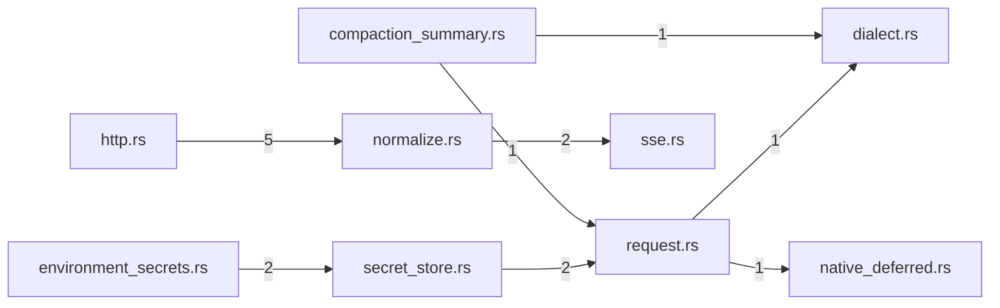

# provider — generated atlas

[All packages](../../../../docs/architecture/generated/index.md) · [Maintained explanation](../README.md)

## Cargo targets

| Target | Kind | Entry |
|---|---|---|
| `provider` | lib | [crates/provider/src/lib.rs](../../src/lib.rs) |
| `anthropic_messages_alignment` | test | [crates/provider/tests/anthropic_messages_alignment.rs](../../tests/anthropic_messages_alignment.rs) |
| `dialect_profiles` | test | [crates/provider/tests/dialect_profiles.rs](../../tests/dialect_profiles.rs) |
| `live_anthropic_thinking` | test | [crates/provider/tests/live_anthropic_thinking.rs](../../tests/live_anthropic_thinking.rs) |
| `live_cache` | test | [crates/provider/tests/live_cache.rs](../../tests/live_cache.rs) |
| `live_chat_layout` | test | [crates/provider/tests/live_chat_layout.rs](../../tests/live_chat_layout.rs) |
| `live_compaction_summary` | test | [crates/provider/tests/live_compaction_summary.rs](../../tests/live_compaction_summary.rs) |
| `live_deepseek_continuation` | test | [crates/provider/tests/live_deepseek_continuation.rs](../../tests/live_deepseek_continuation.rs) |
| `live_f2_causality` | test | [crates/provider/tests/live_f2_causality.rs](../../tests/live_f2_causality.rs) |
| `live_google_schema` | test | [crates/provider/tests/live_google_schema.rs](../../tests/live_google_schema.rs) |
| `live_kimi_schema` | test | [crates/provider/tests/live_kimi_schema.rs](../../tests/live_kimi_schema.rs) |
| `live_native_deferred` | test | [crates/provider/tests/live_native_deferred.rs](../../tests/live_native_deferred.rs) |
| `live_parallel_tools` | test | [crates/provider/tests/live_parallel_tools.rs](../../tests/live_parallel_tools.rs) |
| `live_responses_relocation` | test | [crates/provider/tests/live_responses_relocation.rs](../../tests/live_responses_relocation.rs) |
| `live_schema_probe` | test | [crates/provider/tests/live_schema_probe.rs](../../tests/live_schema_probe.rs) |
| `native_deferred_routing` | test | [crates/provider/tests/native_deferred_routing.rs](../../tests/native_deferred_routing.rs) |
| `slice7_gates` | test | [crates/provider/tests/slice7_gates.rs](../../tests/slice7_gates.rs) |
| `turn_finality` | test | [crates/provider/tests/turn_finality.rs](../../tests/turn_finality.rs) |

## Direct workspace dependencies

| Dependency | Kind | Target cfg |
|---|---|---|
| `profile` | normal | all |
| `schema` | normal | all |
| `engine` | dev | all |
| `test-support` | dev | all |

[Public/restricted API and direct callers](api.md)

## Source files / lexical modules

`src` files have full symbol/call tables and partitioned function graphs. Integration tests and examples remain in the JSON inventory.
File-derived paths below are lexical navigation, not a compiler-resolved module tree; inline module declarations are listed separately.

| File | Symbols | Call sites | Detail |
|---|---:|---:|---|
| [crates/provider/src/compaction_summary.rs](../../src/compaction_summary.rs) | 3 | 40 | [Symbols and calls](src--compaction_summary.md) |
| [crates/provider/src/credential.rs](../../src/credential.rs) | 52 | 390 | [Symbols and calls](src--credential.md) |
| [crates/provider/src/dialect.rs](../../src/dialect.rs) | 57 | 209 | [Symbols and calls](src--dialect.md) |
| [crates/provider/src/environment_secrets.rs](../../src/environment_secrets.rs) | 6 | 39 | [Symbols and calls](src--environment_secrets.md) |
| [crates/provider/src/http.rs](../../src/http.rs) | 23 | 297 | [Symbols and calls](src--http.md) |
| [crates/provider/src/lib.rs](../../src/lib.rs) | 0 | 0 | [Symbols and calls](src--lib.md) |
| [crates/provider/src/native_deferred.rs](../../src/native_deferred.rs) | 11 | 170 | [Symbols and calls](src--native_deferred.md) |
| [crates/provider/src/normalize.rs](../../src/normalize.rs) | 92 | 1767 | [Symbols and calls](src--normalize.md) |
| [crates/provider/src/oauth.rs](../../src/oauth.rs) | 27 | 294 | [Symbols and calls](src--oauth.md) |
| [crates/provider/src/request.rs](../../src/request.rs) | 72 | 847 | [Symbols and calls](src--request.md) |
| [crates/provider/src/secret_store.rs](../../src/secret_store.rs) | 35 | 130 | [Symbols and calls](src--secret_store.md) |
| [crates/provider/src/sse.rs](../../src/sse.rs) | 15 | 92 | [Symbols and calls](src--sse.md) |
| [crates/provider/tests/anthropic_messages_alignment.rs](../../tests/anthropic_messages_alignment.rs) | 21 | 176 | `inventory.json` |
| [crates/provider/tests/dialect_profiles.rs](../../tests/dialect_profiles.rs) | 33 | 729 | `inventory.json` |
| [crates/provider/tests/live_anthropic_thinking.rs](../../tests/live_anthropic_thinking.rs) | 2 | 153 | `inventory.json` |
| [crates/provider/tests/live_cache.rs](../../tests/live_cache.rs) | 5 | 107 | `inventory.json` |
| [crates/provider/tests/live_chat_layout.rs](../../tests/live_chat_layout.rs) | 1 | 57 | `inventory.json` |
| [crates/provider/tests/live_compaction_summary.rs](../../tests/live_compaction_summary.rs) | 1 | 85 | `inventory.json` |
| [crates/provider/tests/live_deepseek_continuation.rs](../../tests/live_deepseek_continuation.rs) | 1 | 82 | `inventory.json` |
| [crates/provider/tests/live_f2_causality.rs](../../tests/live_f2_causality.rs) | 2 | 141 | `inventory.json` |
| [crates/provider/tests/live_google_schema.rs](../../tests/live_google_schema.rs) | 2 | 138 | `inventory.json` |
| [crates/provider/tests/live_kimi_schema.rs](../../tests/live_kimi_schema.rs) | 1 | 77 | `inventory.json` |
| [crates/provider/tests/live_native_deferred.rs](../../tests/live_native_deferred.rs) | 4 | 77 | `inventory.json` |
| [crates/provider/tests/live_parallel_tools.rs](../../tests/live_parallel_tools.rs) | 1 | 61 | `inventory.json` |
| [crates/provider/tests/live_responses_relocation.rs](../../tests/live_responses_relocation.rs) | 3 | 236 | `inventory.json` |
| [crates/provider/tests/live_schema_probe.rs](../../tests/live_schema_probe.rs) | 1 | 55 | `inventory.json` |
| [crates/provider/tests/native_deferred_routing.rs](../../tests/native_deferred_routing.rs) | 2 | 14 | `inventory.json` |
| [crates/provider/tests/slice7_gates.rs](../../tests/slice7_gates.rs) | 23 | 494 | `inventory.json` |
| [crates/provider/tests/turn_finality.rs](../../tests/turn_finality.rs) | 20 | 135 | `inventory.json` |

## Cross-file direct calls

Source files stand in for out-of-line modules; see declarations for inline modules. Counts are syntactic call sites, not runtime frequency.

