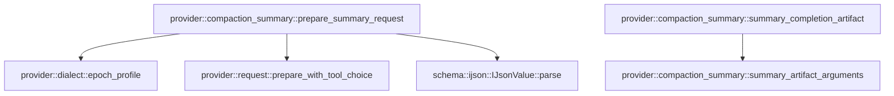

# provider::compaction_summary

[Package atlas](index.md) · [Source](../../src/compaction_summary.rs)

## Declarations

Visibility is the declaration spelling; trait members and reexports require their enclosing interface. `cfg` is not evaluated.

| Symbol | Kind | Visibility | Test / cfg |
|---|---|---|---|
| [provider::compaction_summary::prepare_summary_request](../../src/compaction_summary.rs#L14) | function_item | `pub` |  |
| [provider::compaction_summary::summary_completion_artifact](../../src/compaction_summary.rs#L62) | function_item | `pub` |  |
| [provider::compaction_summary::summary_artifact_arguments](../../src/compaction_summary.rs#L90) | function_item | `pub` |  |

## Imports / reexports

| Local name | Source path | Visibility |
|---|---|---|
| `IJsonValue` | `schema::IJsonValue` | `private` |
| `Value` | `serde_json::Value` | `private` |
| `json` | `serde_json::json` | `private` |
| `ContentBlock` | `crate::ContentBlock` | `private` |
| `DialectId` | `crate::DialectId` | `private` |
| `PrepareInput` | `crate::PrepareInput` | `private` |
| `PreparedRequest` | `crate::PreparedRequest` | `private` |
| `ProviderTerminal` | `crate::ProviderTerminal` | `private` |
| `ResolvedDialectProfile` | `crate::ResolvedDialectProfile` | `private` |
| `ToolChoice` | `crate::ToolChoice` | `private` |
| `prepare_with_tool_choice` | `crate::prepare_with_tool_choice` | `private` |

## Module declarations

| Module | Visibility | Attributes |
|---|---|---|

## Function call graphs

Edges below are syntactically resolved calls only, including private functions. Graphs partition callers into groups of 20; they are not execution order. All unresolved sites are listed below and in the JSON inventory.

Functions 1–3: 4 direct edges

## Call sites

Includes test functions (marked in declarations). Receiver-type-required sites need type analysis/manual tracing. Calls in closures are attributed to their enclosing function; their occurrence here does not mean the closure executes immediately.

| Caller | Callee expression | Source lines | Target / classification |
|---|---|---|---|
| `prepare_summary_request` | `IJsonValue::parse(             &serde_json_canonicalizer::to_vec(value).map_err(&#124;error&#124; format!("{what}: {error}"))?,         )         .map_err` | [23](../../src/compaction_summary.rs#L23) | receiver-type-required |
| `prepare_summary_request` | `IJsonValue::parse` | [23](../../src/compaction_summary.rs#L23) | [schema::ijson::IJsonValue::parse](../../../schema/src/ijson.rs#L16) |
| `prepare_summary_request` | `serde_json_canonicalizer::to_vec(value).map_err` | [24](../../src/compaction_summary.rs#L24) | receiver-type-required |
| `prepare_summary_request` | `serde_json_canonicalizer::to_vec` | [24](../../src/compaction_summary.rs#L24) | external-constructor-callback-or-unresolved |
| `prepare_summary_request` | `crate::epoch_profile(resolved, system, None)         .map_err` | [28](../../src/compaction_summary.rs#L28) | receiver-type-required |
| `prepare_summary_request` | `crate::epoch_profile` | [28](../../src/compaction_summary.rs#L28) | [provider::dialect::epoch_profile](../../src/dialect.rs#L782) |
| `prepare_summary_request` | `canonical` | [30](../../src/compaction_summary.rs#L30) | external-constructor-callback-or-unresolved |
| `prepare_summary_request` | `Some` | [39](../../src/compaction_summary.rs#L39), [41](../../src/compaction_summary.rs#L41) | external-constructor-callback-or-unresolved |
| `prepare_summary_request` | `prepare_with_tool_choice(         &PrepareInput {             attempt_id,             target: resolved.target.clone(),             endpoint: endpoint.to_owned(),             epoch_profile,             continuation_id: None,             rendered_items: vec![rendered],             tool_catalog,             stream: false,         },         choice,     )     .map_err` | [43](../../src/compaction_summary.rs#L43) | receiver-type-required |
| `prepare_summary_request` | `prepare_with_tool_choice` | [43](../../src/compaction_summary.rs#L43) | [provider::request::prepare_with_tool_choice](../../src/request.rs#L137) |
| `prepare_summary_request` | `resolved.target.clone` | [46](../../src/compaction_summary.rs#L46) | receiver-type-required |
| `prepare_summary_request` | `endpoint.to_owned` | [47](../../src/compaction_summary.rs#L47) | receiver-type-required |
| `summary_completion_artifact` | `terminal                 .usage                 .as_ref()                 .and_then` | [67](../../src/compaction_summary.rs#L67) | receiver-type-required |
| `summary_completion_artifact` | `terminal                 .usage                 .as_ref` | [67](../../src/compaction_summary.rs#L67) | receiver-type-required |
| `summary_completion_artifact` | `serde_json::to_value(usage).ok` | [70](../../src/compaction_summary.rs#L70) | receiver-type-required |
| `summary_completion_artifact` | `serde_json::to_value` | [70](../../src/compaction_summary.rs#L70) | external-constructor-callback-or-unresolved |
| `summary_completion_artifact` | `summary_artifact_arguments(&terminal).ok_or_else` | [71](../../src/compaction_summary.rs#L71) | receiver-type-required |
| `summary_completion_artifact` | `summary_artifact_arguments` | [71](../../src/compaction_summary.rs#L71) | [provider::compaction_summary::summary_artifact_arguments](../../src/compaction_summary.rs#L90) |
| `summary_completion_artifact` | `Err` | [80](../../src/compaction_summary.rs#L80), [82](../../src/compaction_summary.rs#L82) | external-constructor-callback-or-unresolved |
| `summary_artifact_arguments` | `terminal         .tool_calls         .iter()         .find` | [91](../../src/compaction_summary.rs#L91) | receiver-type-required |
| `summary_artifact_arguments` | `terminal         .tool_calls         .iter` | [91](../../src/compaction_summary.rs#L91) | receiver-type-required |
| `summary_artifact_arguments` | `Some` | [96](../../src/compaction_summary.rs#L96), [102](../../src/compaction_summary.rs#L102) | external-constructor-callback-or-unresolved |
| `summary_artifact_arguments` | `call.arguments.clone` | [96](../../src/compaction_summary.rs#L96) | receiver-type-required |
| `summary_artifact_arguments` | `terminal         .content         .iter()         .filter_map(&#124;block&#124; match block {             ContentBlock::Text(text) => Some(text.as_str()),             ContentBlock::Reasoning(_) => None,         })         .collect::<Vec<_>>()         .join` | [98](../../src/compaction_summary.rs#L98) | receiver-type-required |
| `summary_artifact_arguments` | `terminal         .content         .iter()         .filter_map(&#124;block&#124; match block {             ContentBlock::Text(text) => Some(text.as_str()),             ContentBlock::Reasoning(_) => None,         })         .collect::<Vec<_>>` | [98](../../src/compaction_summary.rs#L98) | receiver-type-required |
| `summary_artifact_arguments` | `terminal         .content         .iter()         .filter_map` | [98](../../src/compaction_summary.rs#L98) | receiver-type-required |
| `summary_artifact_arguments` | `terminal         .content         .iter` | [98](../../src/compaction_summary.rs#L98) | receiver-type-required |
| `summary_artifact_arguments` | `text.as_str` | [102](../../src/compaction_summary.rs#L102) | receiver-type-required |
| `summary_artifact_arguments` | `text.find` | [107](../../src/compaction_summary.rs#L107) | receiver-type-required |
| `summary_artifact_arguments` | `text.rfind` | [108](../../src/compaction_summary.rs#L108) | receiver-type-required |
| `summary_artifact_arguments` | `serde_json::from_str::<Value>(&text[start..=end])         .ok()         .filter` | [112](../../src/compaction_summary.rs#L112) | receiver-type-required |
| `summary_artifact_arguments` | `serde_json::from_str::<Value>(&text[start..=end])         .ok` | [112](../../src/compaction_summary.rs#L112) | receiver-type-required |
| `summary_artifact_arguments` | `serde_json::from_str::<Value>` | [112](../../src/compaction_summary.rs#L112) | external-constructor-callback-or-unresolved |
| `summary_artifact_arguments` | `value.get("continuation").is_some` | [114](../../src/compaction_summary.rs#L114) | receiver-type-required |
| `summary_artifact_arguments` | `value.get` | [114](../../src/compaction_summary.rs#L114) | receiver-type-required |
| `summary_artifact_arguments` | `value.get("evidence_refs").is_some` | [114](../../src/compaction_summary.rs#L114) | receiver-type-required |
