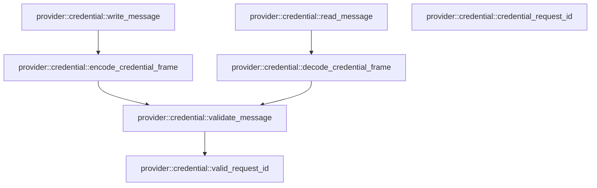

# provider::credential

[Package atlas](index.md) · [Source](../../src/credential.rs)

## Declarations

Visibility is the declaration spelling; trait members and reexports require their enclosing interface. `cfg` is not evaluated.

| Symbol | Kind | Visibility | Test / cfg |
|---|---|---|---|
| [provider::credential::MAX_BODY](../../src/credential.rs#L14) | const_item | `private` |  |
| [provider::credential::CredentialGet](../../src/credential.rs#L18) | struct_item | `pub` |  |
| [provider::credential::CredentialMaterial](../../src/credential.rs#L33) | struct_item | `pub` |  |
| [provider::credential::CredentialMaterial::fmt](../../src/credential.rs#L40) | function_item | `private` |  |
| [provider::credential::CredentialMaterial::drop](../../src/credential.rs#L51) | function_item | `private` |  |
| [provider::credential::CredentialError](../../src/credential.rs#L58) | struct_item | `pub` |  |
| [provider::credential::CredentialMessage](../../src/credential.rs#L65) | enum_item | `pub` |  |
| [provider::credential::CredentialFrameError](../../src/credential.rs#L72) | enum_item | `pub` |  |
| [provider::credential::CredentialDecoder](../../src/credential.rs#L80) | struct_item | `pub` |  |
| [provider::credential::CredentialDecoder::new](../../src/credential.rs#L86) | function_item | `pub` |  |
| [provider::credential::CredentialDecoder::push](../../src/credential.rs#L90) | function_item | `pub` |  |
| [provider::credential::CredentialDecoder::finish](../../src/credential.rs#L114) | function_item | `pub` |  |
| [provider::credential::CredentialScope](../../src/credential.rs#L124) | struct_item | `pub` |  |
| [provider::credential::CredentialScope::fmt](../../src/credential.rs#L134) | function_item | `private` |  |
| [provider::credential::CredentialScope::drop](../../src/credential.rs#L148) | function_item | `private` |  |
| [provider::credential::RevokedCredentialScope](../../src/credential.rs#L154) | struct_item | `pub` |  |
| [provider::credential::BrokerDecision](../../src/credential.rs#L163) | enum_item | `pub` |  |
| [provider::credential::BrokerError](../../src/credential.rs#L169) | enum_item | `pub` |  |
| [provider::credential::CredentialClientError](../../src/credential.rs#L177) | enum_item | `pub` |  |
| [provider::credential::CredentialControlError](../../src/credential.rs#L191) | enum_item | `pub` |  |
| [provider::credential::BrokerCommand](../../src/credential.rs#L198) | enum_item | `private` |  |
| [provider::credential::CredentialBrokerControl](../../src/credential.rs#L214) | struct_item | `pub` |  |
| [provider::credential::CredentialBrokerControl::rotate](../../src/credential.rs#L222) | function_item | `pub` |  |
| [provider::credential::CredentialBrokerControl::revoke](../../src/credential.rs#L245) | function_item | `pub` |  |
| [provider::credential::CredentialClient](../../src/credential.rs#L265) | struct_item | `pub` |  |
| [provider::credential::CredentialClient::new](../../src/credential.rs#L271) | function_item | `pub` |  |
| [provider::credential::CredentialClient::from_inherited_fd](../../src/credential.rs#L275) | function_item | `pub` |  |
| [provider::credential::CredentialClient::get](../../src/credential.rs#L324) | function_item | `pub` |  |
| [provider::credential::CredentialBroker](../../src/credential.rs#L347) | struct_item | `pub` |  |
| [provider::credential::CredentialBroker::new](../../src/credential.rs#L355) | function_item | `pub` |  |
| [provider::credential::CredentialBroker::with_revoked](../../src/credential.rs#L360) | function_item | `pub` |  |
| [provider::credential::CredentialBroker::get](../../src/credential.rs#L385) | function_item | `pub` |  |
| [provider::credential::CredentialBroker::rotate](../../src/credential.rs#L446) | function_item | `pub` |  |
| [provider::credential::CredentialBroker::revoke](../../src/credential.rs#L484) | function_item | `pub` |  |
| [provider::credential::serve_credential_channel](../../src/credential.rs#L509) | function_item | `pub` |  |
| [provider::credential::start_credential_channel](../../src/credential.rs#L519) | function_item | `pub` |  |
| [provider::credential::serve_credential_channel_inner](../../src/credential.rs#L534) | function_item | `private` |  |
| [provider::credential::write_message](../../src/credential.rs#L610) | function_item | `private` |  |
| [provider::credential::read_message](../../src/credential.rs#L618) | function_item | `private` |  |
| [provider::credential::encode_credential_frame](../../src/credential.rs#L632) | function_item | `pub` |  |
| [provider::credential::decode_credential_frame](../../src/credential.rs#L648) | function_item | `pub` |  |
| [provider::credential::validate_message](../../src/credential.rs#L665) | function_item | `private` |  |
| [provider::credential::valid_request_id](../../src/credential.rs#L701) | function_item | `private` |  |
| [provider::credential::credential_request_id](../../src/credential.rs#L709) | function_item | `pub` |  |
| [provider::credential::tests::frame_round_trip_is_exact](../../src/credential.rs#L725) | function_item | `private` | test; #[cfg(test)] |
| [provider::credential::tests::decoder_handles_partial_and_coalesced_frames](../../src/credential.rs#L735) | function_item | `private` | test; #[cfg(test)] |
| [provider::credential::tests::broker_deduplicates_and_rotates](../../src/credential.rs#L756) | function_item | `private` | test; #[cfg(test)] |
| [provider::credential::tests::private_socket_channel_round_trips](../../src/credential.rs#L803) | function_item | `private` | test; #[cfg(test)] |
| [provider::credential::tests::live_rotation_and_revocation_reach_the_next_request](../../src/credential.rs#L831) | function_item | `private` | test; #[cfg(test)] |
| [provider::credential::tests::shared_key_keeps_every_exact_scope_and_rotates_them_together](../../src/credential.rs#L876) | function_item | `private` | test; #[cfg(test)] |
| [provider::credential::tests::wire_rejects_unknown_fields_and_open_string_unions](../../src/credential.rs#L926) | function_item | `private` | test; #[cfg(test)] |
| [provider::credential::tests::wire_rejects_unknown_fields_and_open_string_unions::frame](../../src/credential.rs#L927) | function_item | `private` | test; #[cfg(test)] |

## Imports / reexports

| Local name | Source path | Visibility |
|---|---|---|
| `BTreeMap` | `std::collections::BTreeMap` | `private` |
| `io` | `std::io` | `private` |
| `Read` | `std::io::Read` | `private` |
| `Write` | `std::io::Write` | `private` |
| `FromRawFd` | `std::os::fd::FromRawFd` | `private` |
| `RawFd` | `std::os::fd::RawFd` | `private` |
| `UnixStream` | `std::os::unix::net::UnixStream` | `private` |
| `mpsc` | `std::sync::mpsc` | `private` |
| `Receiver` | `std::sync::mpsc::Receiver` | `private` |
| `Sender` | `std::sync::mpsc::Sender` | `private` |
| `SyncSender` | `std::sync::mpsc::SyncSender` | `private` |
| `JoinHandle` | `std::thread::JoinHandle` | `private` |
| `Duration` | `std::time::Duration` | `private` |
| `Deserialize` | `serde::Deserialize` | `private` |
| `Serialize` | `serde::Serialize` | `private` |
| `Digest` | `sha2::Digest` | `private` |
| `Sha256` | `sha2::Sha256` | `private` |
| `Error` | `thiserror::Error` | `private` |
| `Zeroize` | `zeroize::Zeroize` | `private` |
| `*` | `super::*` | `private` |

## Module declarations

| Module | Visibility | Attributes |
|---|---|---|
| `provider::credential::tests` | `private` | #[cfg(test)] |

## Function call graphs

Edges below are syntactically resolved calls only, including private functions. Graphs partition callers into groups of 20; they are not execution order. All unresolved sites are listed below and in the JSON inventory.

Functions 1–20: 10 direct edges

Functions 21–27: 5 direct edges

## Call sites

Includes test functions (marked in declarations). Receiver-type-required sites need type analysis/manual tracing. Calls in closures are attributed to their enclosing function; their occurrence here does not mean the closure executes immediately.

| Caller | Callee expression | Source lines | Target / classification |
|---|---|---|---|
| `fmt` | `formatter             .debug_struct("CredentialMaterial")             .field("request_id", &self.request_id)             .field("material", &"<redacted>")             .field("generation", &self.generation)             .finish` | [41](../../src/credential.rs#L41) | receiver-type-required |
| `fmt` | `formatter             .debug_struct("CredentialMaterial")             .field("request_id", &self.request_id)             .field("material", &"<redacted>")             .field` | [41](../../src/credential.rs#L41) | receiver-type-required |
| `fmt` | `formatter             .debug_struct("CredentialMaterial")             .field("request_id", &self.request_id)             .field` | [41](../../src/credential.rs#L41) | receiver-type-required |
| `fmt` | `formatter             .debug_struct("CredentialMaterial")             .field` | [41](../../src/credential.rs#L41) | receiver-type-required |
| `fmt` | `formatter             .debug_struct` | [41](../../src/credential.rs#L41) | receiver-type-required |
| `drop` | `self.material.zeroize` | [52](../../src/credential.rs#L52) | receiver-type-required |
| `new` | `Self::default` | [87](../../src/credential.rs#L87) | external-constructor-callback-or-unresolved |
| `push` | `self.bytes.extend_from_slice` | [91](../../src/credential.rs#L91) | receiver-type-required |
| `push` | `Vec::new` | [92](../../src/credential.rs#L92) | external-constructor-callback-or-unresolved |
| `push` | `self.bytes.len` | [94](../../src/credential.rs#L94), [105](../../src/credential.rs#L105) | receiver-type-required |
| `push` | `u32::from_be_bytes` | [97](../../src/credential.rs#L97) | external-constructor-callback-or-unresolved |
| `push` | `self.bytes[..4]                     .try_into()                     .map_err` | [98](../../src/credential.rs#L98) | receiver-type-required |
| `push` | `self.bytes[..4]                     .try_into` | [98](../../src/credential.rs#L98) | receiver-type-required |
| `push` | `Err` | [103](../../src/credential.rs#L103) | external-constructor-callback-or-unresolved |
| `push` | `self.bytes.drain(..length + 4).collect::<Vec<_>>` | [108](../../src/credential.rs#L108) | receiver-type-required |
| `push` | `self.bytes.drain` | [108](../../src/credential.rs#L108) | receiver-type-required |
| `push` | `messages.push` | [109](../../src/credential.rs#L109) | receiver-type-required |
| `push` | `decode_credential_frame` | [109](../../src/credential.rs#L109) | [provider::credential::decode_credential_frame](../../src/credential.rs#L648) |
| `push` | `Ok` | [111](../../src/credential.rs#L111) | external-constructor-callback-or-unresolved |
| `finish` | `self.bytes.is_empty` | [115](../../src/credential.rs#L115) | receiver-type-required |
| `finish` | `Ok` | [116](../../src/credential.rs#L116) | external-constructor-callback-or-unresolved |
| `finish` | `Err` | [118](../../src/credential.rs#L118) | external-constructor-callback-or-unresolved |
| `fmt` | `formatter             .debug_struct("CredentialScope")             .field("credential_id", &self.credential_id)             .field("adapter", &self.adapter)             .field("endpoint_origin", &self.endpoint_origin)             .field("purpose", &self.purpose)             .field("generation", &self.generation)             .field("material", &"<redacted>")             .finish` | [135](../../src/credential.rs#L135) | receiver-type-required |
| `fmt` | `formatter             .debug_struct("CredentialScope")             .field("credential_id", &self.credential_id)             .field("adapter", &self.adapter)             .field("endpoint_origin", &self.endpoint_origin)             .field("purpose", &self.purpose)             .field("generation", &self.generation)             .field` | [135](../../src/credential.rs#L135) | receiver-type-required |
| `fmt` | `formatter             .debug_struct("CredentialScope")             .field("credential_id", &self.credential_id)             .field("adapter", &self.adapter)             .field("endpoint_origin", &self.endpoint_origin)             .field("purpose", &self.purpose)             .field` | [135](../../src/credential.rs#L135) | receiver-type-required |
| `fmt` | `formatter             .debug_struct("CredentialScope")             .field("credential_id", &self.credential_id)             .field("adapter", &self.adapter)             .field("endpoint_origin", &self.endpoint_origin)             .field` | [135](../../src/credential.rs#L135) | receiver-type-required |
| `fmt` | `formatter             .debug_struct("CredentialScope")             .field("credential_id", &self.credential_id)             .field("adapter", &self.adapter)             .field` | [135](../../src/credential.rs#L135) | receiver-type-required |
| `fmt` | `formatter             .debug_struct("CredentialScope")             .field("credential_id", &self.credential_id)             .field` | [135](../../src/credential.rs#L135) | receiver-type-required |
| `fmt` | `formatter             .debug_struct("CredentialScope")             .field` | [135](../../src/credential.rs#L135) | receiver-type-required |
| `fmt` | `formatter             .debug_struct` | [135](../../src/credential.rs#L135) | receiver-type-required |
| `drop` | `self.material.zeroize` | [149](../../src/credential.rs#L149) | receiver-type-required |
| `rotate` | `mpsc::sync_channel` | [228](../../src/credential.rs#L228) | external-constructor-callback-or-unresolved |
| `rotate` | `self.commands             .send(BrokerCommand::Rotate {                 credential_id: credential_id.into(),                 generation: generation.into(),                 material: material.into(),                 reply,             })             .map_err` | [229](../../src/credential.rs#L229) | receiver-type-required |
| `rotate` | `self.commands             .send` | [229](../../src/credential.rs#L229) | receiver-type-required |
| `rotate` | `credential_id.into` | [231](../../src/credential.rs#L231) | receiver-type-required |
| `rotate` | `generation.into` | [232](../../src/credential.rs#L232) | receiver-type-required |
| `rotate` | `material.into` | [233](../../src/credential.rs#L233) | receiver-type-required |
| `rotate` | `result             .recv()             .map_err(&#124;_&#124; CredentialControlError::Closed)?             .map_err` | [237](../../src/credential.rs#L237) | receiver-type-required |
| `rotate` | `result             .recv()             .map_err` | [237](../../src/credential.rs#L237) | receiver-type-required |
| `rotate` | `result             .recv` | [237](../../src/credential.rs#L237) | receiver-type-required |
| `revoke` | `mpsc::sync_channel` | [250](../../src/credential.rs#L250) | external-constructor-callback-or-unresolved |
| `revoke` | `self.commands             .send(BrokerCommand::Revoke {                 credential_id: credential_id.into(),                 generation: generation.into(),                 reply,             })             .map_err` | [251](../../src/credential.rs#L251) | receiver-type-required |
| `revoke` | `self.commands             .send` | [251](../../src/credential.rs#L251) | receiver-type-required |
| `revoke` | `credential_id.into` | [253](../../src/credential.rs#L253) | receiver-type-required |
| `revoke` | `generation.into` | [254](../../src/credential.rs#L254) | receiver-type-required |
| `revoke` | `result             .recv()             .map_err(&#124;_&#124; CredentialControlError::Closed)?             .map_err` | [258](../../src/credential.rs#L258) | receiver-type-required |
| `revoke` | `result             .recv()             .map_err` | [258](../../src/credential.rs#L258) | receiver-type-required |
| `revoke` | `result             .recv` | [258](../../src/credential.rs#L258) | receiver-type-required |
| `from_inherited_fd` | `Err` | [277](../../src/credential.rs#L277), [295](../../src/credential.rs#L295), [305](../../src/credential.rs#L305), [319](../../src/credential.rs#L319) | external-constructor-callback-or-unresolved |
| `from_inherited_fd` | `io::Error::new(io::ErrorKind::InvalidInput, "negative descriptor").into` | [277](../../src/credential.rs#L277) | receiver-type-required |
| `from_inherited_fd` | `io::Error::new` | [277](../../src/credential.rs#L277), [305](../../src/credential.rs#L305) | external-constructor-callback-or-unresolved |
| `from_inherited_fd` | `std::mem::size_of::<libc::c_int>` | [280](../../src/credential.rs#L280) | external-constructor-callback-or-unresolved |
| `from_inherited_fd` | `libc::getsockopt` | [285](../../src/credential.rs#L285) | external-constructor-callback-or-unresolved |
| `from_inherited_fd` | `(&raw mut socket_type).cast` | [289](../../src/credential.rs#L289) | receiver-type-required |
| `from_inherited_fd` | `io::Error::last_os_error().into` | [295](../../src/credential.rs#L295), [319](../../src/credential.rs#L319) | receiver-type-required |
| `from_inherited_fd` | `io::Error::last_os_error` | [295](../../src/credential.rs#L295), [319](../../src/credential.rs#L319) | external-constructor-callback-or-unresolved |
| `from_inherited_fd` | `std::mem::zeroed` | [297](../../src/credential.rs#L297) | external-constructor-callback-or-unresolved |
| `from_inherited_fd` | `std::mem::size_of::<libc::sockaddr_storage>` | [298](../../src/credential.rs#L298) | external-constructor-callback-or-unresolved |
| `from_inherited_fd` | `libc::getpeername` | [302](../../src/credential.rs#L302) | external-constructor-callback-or-unresolved |
| `from_inherited_fd` | `(&raw mut peer).cast` | [302](../../src/credential.rs#L302) | receiver-type-required |
| `from_inherited_fd` | `i32::from` | [303](../../src/credential.rs#L303) | external-constructor-callback-or-unresolved |
| `from_inherited_fd` | `io::Error::new(                 io::ErrorKind::InvalidInput,                 "credential descriptor is not a connected AF_UNIX socket",             )             .into` | [305](../../src/credential.rs#L305) | receiver-type-required |
| `from_inherited_fd` | `UnixStream::from_raw_fd` | [314](../../src/credential.rs#L314) | external-constructor-callback-or-unresolved |
| `from_inherited_fd` | `libc::fcntl` | [315](../../src/credential.rs#L315), [317](../../src/credential.rs#L317) | external-constructor-callback-or-unresolved |
| `from_inherited_fd` | `Ok` | [321](../../src/credential.rs#L321) | external-constructor-callback-or-unresolved |
| `from_inherited_fd` | `Self::new` | [321](../../src/credential.rs#L321) | [provider::credential::CredentialClient::new](../../src/credential.rs#L271) |
| `get` | `write_message` | [328](../../src/credential.rs#L328) | [provider::credential::write_message](../../src/credential.rs#L610) |
| `get` | `CredentialMessage::CredentialGet` | [330](../../src/credential.rs#L330) | external-constructor-callback-or-unresolved |
| `get` | `request.clone` | [330](../../src/credential.rs#L330) | receiver-type-required |
| `get` | `read_message` | [332](../../src/credential.rs#L332) | [provider::credential::read_message](../../src/credential.rs#L618) |
| `get` | `Ok` | [336](../../src/credential.rs#L336) | external-constructor-callback-or-unresolved |
| `get` | `Err` | [339](../../src/credential.rs#L339), [341](../../src/credential.rs#L341) | external-constructor-callback-or-unresolved |
| `get` | `CredentialClientError::Rejected` | [339](../../src/credential.rs#L339) | external-constructor-callback-or-unresolved |
| `new` | `Self::with_revoked` | [356](../../src/credential.rs#L356) | [provider::credential::CredentialBroker::with_revoked](../../src/credential.rs#L360) |
| `with_revoked` | `BTreeMap::<String, Vec<CredentialScope>>::new` | [364](../../src/credential.rs#L364) | external-constructor-callback-or-unresolved |
| `with_revoked` | `active                 .entry(scope.credential_id.clone())                 .or_default()                 .push` | [366](../../src/credential.rs#L366) | receiver-type-required |
| `with_revoked` | `active                 .entry(scope.credential_id.clone())                 .or_default` | [366](../../src/credential.rs#L366) | receiver-type-required |
| `with_revoked` | `active                 .entry` | [366](../../src/credential.rs#L366) | receiver-type-required |
| `with_revoked` | `scope.credential_id.clone` | [367](../../src/credential.rs#L367), [374](../../src/credential.rs#L374) | receiver-type-required |
| `with_revoked` | `BTreeMap::<String, Vec<RevokedCredentialScope>>::new` | [371](../../src/credential.rs#L371) | external-constructor-callback-or-unresolved |
| `with_revoked` | `revoked                 .entry(scope.credential_id.clone())                 .or_default()                 .push` | [373](../../src/credential.rs#L373) | receiver-type-required |
| `with_revoked` | `revoked                 .entry(scope.credential_id.clone())                 .or_default` | [373](../../src/credential.rs#L373) | receiver-type-required |
| `with_revoked` | `revoked                 .entry` | [373](../../src/credential.rs#L373) | receiver-type-required |
| `with_revoked` | `Self::default` | [381](../../src/credential.rs#L381) | external-constructor-callback-or-unresolved |
| `get` | `credential_request_id` | [386](../../src/credential.rs#L386) | [provider::credential::credential_request_id](../../src/credential.rs#L709) |
| `get` | `Err` | [392](../../src/credential.rs#L392), [398](../../src/credential.rs#L398) | external-constructor-callback-or-unresolved |
| `get` | `self.requests.get` | [394](../../src/credential.rs#L394) | receiver-type-required |
| `get` | `Ok` | [396](../../src/credential.rs#L396), [441](../../src/credential.rs#L441) | external-constructor-callback-or-unresolved |
| `get` | `decision.clone` | [396](../../src/credential.rs#L396), [440](../../src/credential.rs#L440) | receiver-type-required |
| `get` | `self.scopes.get(&request.credential_id).and_then` | [401](../../src/credential.rs#L401) | receiver-type-required |
| `get` | `self.scopes.get` | [401](../../src/credential.rs#L401) | receiver-type-required |
| `get` | `scopes.iter().find` | [402](../../src/credential.rs#L402), [412](../../src/credential.rs#L412) | receiver-type-required |
| `get` | `scopes.iter` | [402](../../src/credential.rs#L402), [412](../../src/credential.rs#L412) | receiver-type-required |
| `get` | `self             .revoked_scopes             .get(&request.credential_id)             .and_then` | [408](../../src/credential.rs#L408) | receiver-type-required |
| `get` | `self             .revoked_scopes             .get` | [408](../../src/credential.rs#L408) | receiver-type-required |
| `get` | `self.scopes.contains_key` | [418](../../src/credential.rs#L418) | receiver-type-required |
| `get` | `self.revoked_scopes.contains_key` | [419](../../src/credential.rs#L419) | receiver-type-required |
| `get` | `BrokerDecision::Material` | [421](../../src/credential.rs#L421) | external-constructor-callback-or-unresolved |
| `get` | `request.request_id.clone` | [422](../../src/credential.rs#L422), [427](../../src/credential.rs#L427), [431](../../src/credential.rs#L431), [435](../../src/credential.rs#L435), [440](../../src/credential.rs#L440) | receiver-type-required |
| `get` | `scope.material.clone` | [423](../../src/credential.rs#L423) | receiver-type-required |
| `get` | `scope.generation.clone` | [424](../../src/credential.rs#L424) | receiver-type-required |
| `get` | `BrokerDecision::Error` | [426](../../src/credential.rs#L426), [430](../../src/credential.rs#L430), [434](../../src/credential.rs#L434) | external-constructor-callback-or-unresolved |
| `get` | `"revoked".to_owned` | [428](../../src/credential.rs#L428) | receiver-type-required |
| `get` | `"scope_mismatch".to_owned` | [432](../../src/credential.rs#L432) | receiver-type-required |
| `get` | `"not_found".to_owned` | [436](../../src/credential.rs#L436) | receiver-type-required |
| `get` | `self.requests             .insert` | [439](../../src/credential.rs#L439) | receiver-type-required |
| `rotate` | `generation.into` | [452](../../src/credential.rs#L452) | receiver-type-required |
| `rotate` | `material.into` | [453](../../src/credential.rs#L453) | receiver-type-required |
| `rotate` | `self.scopes.get_mut` | [455](../../src/credential.rs#L455) | receiver-type-required |
| `rotate` | `scope.generation.clone_from` | [458](../../src/credential.rs#L458) | receiver-type-required |
| `rotate` | `scope.material.clone_from` | [459](../../src/credential.rs#L459) | receiver-type-required |
| `rotate` | `self.revoked_scopes.remove` | [462](../../src/credential.rs#L462) | receiver-type-required |
| `rotate` | `self.scopes                 .entry(credential_id.to_owned())                 .or_default()                 .extend` | [464](../../src/credential.rs#L464) | receiver-type-required |
| `rotate` | `self.scopes                 .entry(credential_id.to_owned())                 .or_default` | [464](../../src/credential.rs#L464) | receiver-type-required |
| `rotate` | `self.scopes                 .entry` | [464](../../src/credential.rs#L464) | receiver-type-required |
| `rotate` | `credential_id.to_owned` | [465](../../src/credential.rs#L465) | receiver-type-required |
| `rotate` | `revoked.into_iter().map` | [467](../../src/credential.rs#L467) | receiver-type-required |
| `rotate` | `revoked.into_iter` | [467](../../src/credential.rs#L467) | receiver-type-required |
| `rotate` | `generation.clone` | [472](../../src/credential.rs#L472) | receiver-type-required |
| `rotate` | `material.clone` | [473](../../src/credential.rs#L473) | receiver-type-required |
| `rotate` | `self.requests.clear` | [477](../../src/credential.rs#L477) | receiver-type-required |
| `revoke` | `generation.into` | [485](../../src/credential.rs#L485) | receiver-type-required |
| `revoke` | `self.scopes.remove` | [486](../../src/credential.rs#L486) | receiver-type-required |
| `revoke` | `self.revoked_scopes                 .entry(credential_id.to_owned())                 .or_default()                 .extend` | [487](../../src/credential.rs#L487) | receiver-type-required |
| `revoke` | `self.revoked_scopes                 .entry(credential_id.to_owned())                 .or_default` | [487](../../src/credential.rs#L487) | receiver-type-required |
| `revoke` | `self.revoked_scopes                 .entry` | [487](../../src/credential.rs#L487) | receiver-type-required |
| `revoke` | `credential_id.to_owned` | [488](../../src/credential.rs#L488) | receiver-type-required |
| `revoke` | `active.into_iter().map` | [490](../../src/credential.rs#L490) | receiver-type-required |
| `revoke` | `active.into_iter` | [490](../../src/credential.rs#L490) | receiver-type-required |
| `revoke` | `scope.credential_id.clone` | [491](../../src/credential.rs#L491) | receiver-type-required |
| `revoke` | `scope.adapter.clone` | [492](../../src/credential.rs#L492) | receiver-type-required |
| `revoke` | `scope.endpoint_origin.clone` | [493](../../src/credential.rs#L493) | receiver-type-required |
| `revoke` | `scope.purpose.clone` | [494](../../src/credential.rs#L494) | receiver-type-required |
| `revoke` | `generation.clone` | [495](../../src/credential.rs#L495) | receiver-type-required |
| `revoke` | `self.revoked_scopes.get_mut` | [497](../../src/credential.rs#L497) | receiver-type-required |
| `revoke` | `scope.generation.clone_from` | [499](../../src/credential.rs#L499) | receiver-type-required |
| `revoke` | `self.requests.clear` | [504](../../src/credential.rs#L504) | receiver-type-required |
| `serve_credential_channel` | `serve_credential_channel_inner` | [513](../../src/credential.rs#L513) | [provider::credential::serve_credential_channel_inner](../../src/credential.rs#L534) |
| `start_credential_channel` | `mpsc::channel` | [526](../../src/credential.rs#L526) | external-constructor-callback-or-unresolved |
| `start_credential_channel` | `std::thread::spawn` | [528](../../src/credential.rs#L528) | external-constructor-callback-or-unresolved |
| `start_credential_channel` | `serve_credential_channel_inner` | [529](../../src/credential.rs#L529) | [provider::credential::serve_credential_channel_inner](../../src/credential.rs#L534) |
| `start_credential_channel` | `Some` | [529](../../src/credential.rs#L529) | external-constructor-callback-or-unresolved |
| `serve_credential_channel_inner` | `stream.set_read_timeout` | [539](../../src/credential.rs#L539) | receiver-type-required |
| `serve_credential_channel_inner` | `Some` | [539](../../src/credential.rs#L539) | external-constructor-callback-or-unresolved |
| `serve_credential_channel_inner` | `Duration::from_millis` | [539](../../src/credential.rs#L539) | external-constructor-callback-or-unresolved |
| `serve_credential_channel_inner` | `CredentialDecoder::new` | [540](../../src/credential.rs#L540) | [provider::credential::CredentialDecoder::new](../../src/credential.rs#L86) |
| `serve_credential_channel_inner` | `commands.try_recv` | [544](../../src/credential.rs#L544) | receiver-type-required |
| `serve_credential_channel_inner` | `broker.rotate` | [552](../../src/credential.rs#L552) | receiver-type-required |
| `serve_credential_channel_inner` | `reply.send` | [553](../../src/credential.rs#L553), [561](../../src/credential.rs#L561) | receiver-type-required |
| `serve_credential_channel_inner` | `Ok` | [553](../../src/credential.rs#L553), [561](../../src/credential.rs#L561), [569](../../src/credential.rs#L569), [603](../../src/credential.rs#L603) | external-constructor-callback-or-unresolved |
| `serve_credential_channel_inner` | `broker.revoke` | [560](../../src/credential.rs#L560) | receiver-type-required |
| `serve_credential_channel_inner` | `stream.read` | [566](../../src/credential.rs#L566) | receiver-type-required |
| `serve_credential_channel_inner` | `decoder.finish` | [568](../../src/credential.rs#L568) | receiver-type-required |
| `serve_credential_channel_inner` | `decoder.push` | [572](../../src/credential.rs#L572) | receiver-type-required |
| `serve_credential_channel_inner` | `broker.get` | [575](../../src/credential.rs#L575) | receiver-type-required |
| `serve_credential_channel_inner` | `CredentialMessage::Credential` | [577](../../src/credential.rs#L577) | external-constructor-callback-or-unresolved |
| `serve_credential_channel_inner` | `CredentialMessage::CredentialError` | [580](../../src/credential.rs#L580) | external-constructor-callback-or-unresolved |
| `serve_credential_channel_inner` | `write_message` | [583](../../src/credential.rs#L583) | [provider::credential::write_message](../../src/credential.rs#L610) |
| `serve_credential_channel_inner` | `Err` | [587](../../src/credential.rs#L587), [605](../../src/credential.rs#L605) | external-constructor-callback-or-unresolved |
| `serve_credential_channel_inner` | `error.into` | [605](../../src/credential.rs#L605) | receiver-type-required |
| `write_message` | `stream.write_all` | [614](../../src/credential.rs#L614) | receiver-type-required |
| `write_message` | `encode_credential_frame` | [614](../../src/credential.rs#L614) | [provider::credential::encode_credential_frame](../../src/credential.rs#L632) |
| `write_message` | `Ok` | [615](../../src/credential.rs#L615) | external-constructor-callback-or-unresolved |
| `read_message` | `stream.read_exact` | [620](../../src/credential.rs#L620), [626](../../src/credential.rs#L626) | receiver-type-required |
| `read_message` | `u32::from_be_bytes` | [621](../../src/credential.rs#L621) | external-constructor-callback-or-unresolved |
| `read_message` | `Err` | [623](../../src/credential.rs#L623) | external-constructor-callback-or-unresolved |
| `read_message` | `CredentialFrameError::InvalidLength.into` | [623](../../src/credential.rs#L623) | receiver-type-required |
| `read_message` | `length.to_vec` | [627](../../src/credential.rs#L627) | receiver-type-required |
| `read_message` | `frame.extend` | [628](../../src/credential.rs#L628) | receiver-type-required |
| `read_message` | `Ok` | [629](../../src/credential.rs#L629) | external-constructor-callback-or-unresolved |
| `read_message` | `decode_credential_frame` | [629](../../src/credential.rs#L629) | [provider::credential::decode_credential_frame](../../src/credential.rs#L648) |
| `encode_credential_frame` | `validate_message` | [635](../../src/credential.rs#L635) | [provider::credential::validate_message](../../src/credential.rs#L665) |
| `encode_credential_frame` | `serde_json_canonicalizer::to_vec(message)         .map_err` | [636](../../src/credential.rs#L636) | receiver-type-required |
| `encode_credential_frame` | `serde_json_canonicalizer::to_vec` | [636](../../src/credential.rs#L636) | external-constructor-callback-or-unresolved |
| `encode_credential_frame` | `CredentialFrameError::InvalidJson` | [637](../../src/credential.rs#L637) | external-constructor-callback-or-unresolved |
| `encode_credential_frame` | `error.to_string` | [637](../../src/credential.rs#L637) | receiver-type-required |
| `encode_credential_frame` | `body.is_empty` | [638](../../src/credential.rs#L638) | receiver-type-required |
| `encode_credential_frame` | `body.len` | [638](../../src/credential.rs#L638), [641](../../src/credential.rs#L641), [642](../../src/credential.rs#L642) | receiver-type-required |
| `encode_credential_frame` | `Err` | [639](../../src/credential.rs#L639) | external-constructor-callback-or-unresolved |
| `encode_credential_frame` | `u32::try_from(body.len()).map_err` | [641](../../src/credential.rs#L641) | receiver-type-required |
| `encode_credential_frame` | `u32::try_from` | [641](../../src/credential.rs#L641) | external-constructor-callback-or-unresolved |
| `encode_credential_frame` | `Vec::with_capacity` | [642](../../src/credential.rs#L642) | external-constructor-callback-or-unresolved |
| `encode_credential_frame` | `frame.extend_from_slice` | [643](../../src/credential.rs#L643), [644](../../src/credential.rs#L644) | receiver-type-required |
| `encode_credential_frame` | `length.to_be_bytes` | [643](../../src/credential.rs#L643) | receiver-type-required |
| `encode_credential_frame` | `Ok` | [645](../../src/credential.rs#L645) | external-constructor-callback-or-unresolved |
| `decode_credential_frame` | `frame         .get(..4)         .ok_or(CredentialFrameError::InvalidLength)?         .try_into()         .map_err` | [649](../../src/credential.rs#L649) | receiver-type-required |
| `decode_credential_frame` | `frame         .get(..4)         .ok_or(CredentialFrameError::InvalidLength)?         .try_into` | [649](../../src/credential.rs#L649) | receiver-type-required |
| `decode_credential_frame` | `frame         .get(..4)         .ok_or` | [649](../../src/credential.rs#L649) | receiver-type-required |
| `decode_credential_frame` | `frame         .get` | [649](../../src/credential.rs#L649) | receiver-type-required |
| `decode_credential_frame` | `usize::try_from(u32::from_be_bytes(length_bytes))         .map_err` | [654](../../src/credential.rs#L654) | receiver-type-required |
| `decode_credential_frame` | `usize::try_from` | [654](../../src/credential.rs#L654) | external-constructor-callback-or-unresolved |
| `decode_credential_frame` | `u32::from_be_bytes` | [654](../../src/credential.rs#L654) | external-constructor-callback-or-unresolved |
| `decode_credential_frame` | `frame.len` | [656](../../src/credential.rs#L656) | receiver-type-required |
| `decode_credential_frame` | `Err` | [657](../../src/credential.rs#L657) | external-constructor-callback-or-unresolved |
| `decode_credential_frame` | `serde_json::from_slice(&frame[4..])         .map_err` | [659](../../src/credential.rs#L659) | receiver-type-required |
| `decode_credential_frame` | `serde_json::from_slice` | [659](../../src/credential.rs#L659) | external-constructor-callback-or-unresolved |
| `decode_credential_frame` | `CredentialFrameError::InvalidJson` | [660](../../src/credential.rs#L660) | external-constructor-callback-or-unresolved |
| `decode_credential_frame` | `error.to_string` | [660](../../src/credential.rs#L660) | receiver-type-required |
| `decode_credential_frame` | `validate_message` | [661](../../src/credential.rs#L661) | [provider::credential::validate_message](../../src/credential.rs#L665) |
| `decode_credential_frame` | `Ok` | [662](../../src/credential.rs#L662) | external-constructor-callback-or-unresolved |
| `validate_message` | `CredentialFrameError::InvalidJson` | [666](../../src/credential.rs#L666) | external-constructor-callback-or-unresolved |
| `validate_message` | `"credential value is outside v1".into` | [666](../../src/credential.rs#L666) | receiver-type-required |
| `validate_message` | `valid_request_id` | [669](../../src/credential.rs#L669), [680](../../src/credential.rs#L680), [688](../../src/credential.rs#L688) | [provider::credential::valid_request_id](../../src/credential.rs#L701) |
| `validate_message` | `value.attempt.is_empty` | [670](../../src/credential.rs#L670) | receiver-type-required |
| `validate_message` | `value.credential_id.is_empty` | [671](../../src/credential.rs#L671) | receiver-type-required |
| `validate_message` | `value.adapter.is_empty` | [673](../../src/credential.rs#L673) | receiver-type-required |
| `validate_message` | `value.endpoint_origin.is_empty` | [674](../../src/credential.rs#L674) | receiver-type-required |
| `validate_message` | `Err` | [676](../../src/credential.rs#L676), [684](../../src/credential.rs#L684), [694](../../src/credential.rs#L694) | external-constructor-callback-or-unresolved |
| `validate_message` | `invalid` | [676](../../src/credential.rs#L676), [684](../../src/credential.rs#L684), [694](../../src/credential.rs#L694) | external-constructor-callback-or-unresolved |
| `validate_message` | `value.material.is_empty` | [681](../../src/credential.rs#L681) | receiver-type-required |
| `validate_message` | `value.generation.is_empty` | [682](../../src/credential.rs#L682) | receiver-type-required |
| `validate_message` | `Ok` | [698](../../src/credential.rs#L698) | external-constructor-callback-or-unresolved |
| `valid_request_id` | `value.len` | [702](../../src/credential.rs#L702) | receiver-type-required |
| `valid_request_id` | `value             .bytes()             .all` | [703](../../src/credential.rs#L703) | receiver-type-required |
| `valid_request_id` | `value             .bytes` | [703](../../src/credential.rs#L703) | receiver-type-required |
| `valid_request_id` | `byte.is_ascii_hexdigit` | [705](../../src/credential.rs#L705) | receiver-type-required |
| `valid_request_id` | `byte.is_ascii_uppercase` | [705](../../src/credential.rs#L705) | receiver-type-required |
| `credential_request_id` | `Sha256::new` | [710](../../src/credential.rs#L710) | external-constructor-callback-or-unresolved |
| `credential_request_id` | `hasher.update` | [711](../../src/credential.rs#L711), [712](../../src/credential.rs#L712), [713](../../src/credential.rs#L713), [714](../../src/credential.rs#L714), [715](../../src/credential.rs#L715), [716](../../src/credential.rs#L716) | receiver-type-required |
| `credential_request_id` | `attempt.as_bytes` | [712](../../src/credential.rs#L712) | receiver-type-required |
| `credential_request_id` | `credential_id.as_bytes` | [714](../../src/credential.rs#L714) | receiver-type-required |
| `credential_request_id` | `endpoint_origin.as_bytes` | [716](../../src/credential.rs#L716) | receiver-type-required |
| `frame_round_trip_is_exact` | `CredentialMessage::CredentialError` | [726](../../src/credential.rs#L726) | external-constructor-callback-or-unresolved |
| `frame_round_trip_is_exact` | `"0".repeat` | [727](../../src/credential.rs#L727) | receiver-type-required |
| `frame_round_trip_is_exact` | `"revoked".to_owned` | [728](../../src/credential.rs#L728) | receiver-type-required |
| `frame_round_trip_is_exact` | `encode_credential_frame(&message).expect` | [730](../../src/credential.rs#L730) | receiver-type-required |
| `frame_round_trip_is_exact` | `encode_credential_frame` | [730](../../src/credential.rs#L730) | external-constructor-callback-or-unresolved |
| `decoder_handles_partial_and_coalesced_frames` | `CredentialMessage::CredentialError` | [736](../../src/credential.rs#L736), [740](../../src/credential.rs#L740) | external-constructor-callback-or-unresolved |
| `decoder_handles_partial_and_coalesced_frames` | `"1".repeat` | [737](../../src/credential.rs#L737) | receiver-type-required |
| `decoder_handles_partial_and_coalesced_frames` | `"not_found".to_owned` | [738](../../src/credential.rs#L738) | receiver-type-required |
| `decoder_handles_partial_and_coalesced_frames` | `"2".repeat` | [741](../../src/credential.rs#L741) | receiver-type-required |
| `decoder_handles_partial_and_coalesced_frames` | `"revoked".to_owned` | [742](../../src/credential.rs#L742) | receiver-type-required |
| `decoder_handles_partial_and_coalesced_frames` | `encode_credential_frame(&first).expect` | [744](../../src/credential.rs#L744) | receiver-type-required |
| `decoder_handles_partial_and_coalesced_frames` | `encode_credential_frame` | [744](../../src/credential.rs#L744), [745](../../src/credential.rs#L745) | external-constructor-callback-or-unresolved |
| `decoder_handles_partial_and_coalesced_frames` | `bytes.extend` | [745](../../src/credential.rs#L745) | receiver-type-required |
| `decoder_handles_partial_and_coalesced_frames` | `encode_credential_frame(&second).expect` | [745](../../src/credential.rs#L745) | receiver-type-required |
| `decoder_handles_partial_and_coalesced_frames` | `bytes.len` | [746](../../src/credential.rs#L746) | receiver-type-required |
| `decoder_handles_partial_and_coalesced_frames` | `CredentialDecoder::new` | [747](../../src/credential.rs#L747) | external-constructor-callback-or-unresolved |
| `decoder_handles_partial_and_coalesced_frames` | `decoder.push(&bytes[..split]).expect` | [748](../../src/credential.rs#L748) | receiver-type-required |
| `decoder_handles_partial_and_coalesced_frames` | `decoder.push` | [748](../../src/credential.rs#L748), [749](../../src/credential.rs#L749) | receiver-type-required |
| `decoder_handles_partial_and_coalesced_frames` | `messages.extend` | [749](../../src/credential.rs#L749) | receiver-type-required |
| `decoder_handles_partial_and_coalesced_frames` | `decoder.push(&bytes[split..]).expect` | [749](../../src/credential.rs#L749) | receiver-type-required |
| `decoder_handles_partial_and_coalesced_frames` | `decoder.finish().expect` | [751](../../src/credential.rs#L751) | receiver-type-required |
| `decoder_handles_partial_and_coalesced_frames` | `decoder.finish` | [751](../../src/credential.rs#L751) | receiver-type-required |
| `broker_deduplicates_and_rotates` | `"provider-main".to_owned` | [758](../../src/credential.rs#L758), [770](../../src/credential.rs#L770), [791](../../src/credential.rs#L791) | receiver-type-required |
| `broker_deduplicates_and_rotates` | `"responses".to_owned` | [759](../../src/credential.rs#L759), [772](../../src/credential.rs#L772), [793](../../src/credential.rs#L793) | receiver-type-required |
| `broker_deduplicates_and_rotates` | `"https://api.example:443".to_owned` | [760](../../src/credential.rs#L760), [773](../../src/credential.rs#L773), [794](../../src/credential.rs#L794) | receiver-type-required |
| `broker_deduplicates_and_rotates` | `"provider".to_owned` | [761](../../src/credential.rs#L761), [771](../../src/credential.rs#L771), [792](../../src/credential.rs#L792) | receiver-type-required |
| `broker_deduplicates_and_rotates` | `"g1".to_owned` | [762](../../src/credential.rs#L762) | receiver-type-required |
| `broker_deduplicates_and_rotates` | `"secret".to_owned` | [763](../../src/credential.rs#L763) | receiver-type-required |
| `broker_deduplicates_and_rotates` | `CredentialBroker::new` | [765](../../src/credential.rs#L765) | external-constructor-callback-or-unresolved |
| `broker_deduplicates_and_rotates` | `credential_request_id` | [766](../../src/credential.rs#L766), [789](../../src/credential.rs#L789) | external-constructor-callback-or-unresolved |
| `broker_deduplicates_and_rotates` | `"a1".to_owned` | [769](../../src/credential.rs#L769) | receiver-type-required |
| `broker_deduplicates_and_rotates` | `broker.get(request.clone()).expect` | [775](../../src/credential.rs#L775) | receiver-type-required |
| `broker_deduplicates_and_rotates` | `broker.get` | [775](../../src/credential.rs#L775), [780](../../src/credential.rs#L780) | receiver-type-required |
| `broker_deduplicates_and_rotates` | `request.clone` | [775](../../src/credential.rs#L775) | receiver-type-required |
| `broker_deduplicates_and_rotates` | `broker.get(request).expect` | [780](../../src/credential.rs#L780) | receiver-type-required |
| `broker_deduplicates_and_rotates` | `"a2".to_owned` | [790](../../src/credential.rs#L790) | receiver-type-required |
| `private_socket_channel_round_trips` | `UnixStream::pair().expect` | [804](../../src/credential.rs#L804) | receiver-type-required |
| `private_socket_channel_round_trips` | `UnixStream::pair` | [804](../../src/credential.rs#L804) | external-constructor-callback-or-unresolved |
| `private_socket_channel_round_trips` | `CredentialBroker::new` | [805](../../src/credential.rs#L805) | external-constructor-callback-or-unresolved |
| `private_socket_channel_round_trips` | `"main".to_owned` | [806](../../src/credential.rs#L806), [819](../../src/credential.rs#L819) | receiver-type-required |
| `private_socket_channel_round_trips` | `"responses".to_owned` | [807](../../src/credential.rs#L807), [821](../../src/credential.rs#L821) | receiver-type-required |
| `private_socket_channel_round_trips` | `"https://api.example:443".to_owned` | [808](../../src/credential.rs#L808), [822](../../src/credential.rs#L822) | receiver-type-required |
| `private_socket_channel_round_trips` | `"provider".to_owned` | [809](../../src/credential.rs#L809), [820](../../src/credential.rs#L820) | receiver-type-required |
| `private_socket_channel_round_trips` | `"g1".to_owned` | [810](../../src/credential.rs#L810) | receiver-type-required |
| `private_socket_channel_round_trips` | `"secret".to_owned` | [811](../../src/credential.rs#L811) | receiver-type-required |
| `private_socket_channel_round_trips` | `std::thread::spawn` | [814](../../src/credential.rs#L814) | external-constructor-callback-or-unresolved |
| `private_socket_channel_round_trips` | `serve_credential_channel(server, broker).expect` | [814](../../src/credential.rs#L814) | receiver-type-required |
| `private_socket_channel_round_trips` | `serve_credential_channel` | [814](../../src/credential.rs#L814) | external-constructor-callback-or-unresolved |
| `private_socket_channel_round_trips` | `CredentialClient::new` | [815](../../src/credential.rs#L815) | external-constructor-callback-or-unresolved |
| `private_socket_channel_round_trips` | `credential_request_id` | [817](../../src/credential.rs#L817) | external-constructor-callback-or-unresolved |
| `private_socket_channel_round_trips` | `"a1".to_owned` | [818](../../src/credential.rs#L818) | receiver-type-required |
| `private_socket_channel_round_trips` | `client.get(request).expect` | [824](../../src/credential.rs#L824) | receiver-type-required |
| `private_socket_channel_round_trips` | `client.get` | [824](../../src/credential.rs#L824) | receiver-type-required |
| `private_socket_channel_round_trips` | `drop` | [826](../../src/credential.rs#L826) | external-constructor-callback-or-unresolved |
| `private_socket_channel_round_trips` | `server_thread.join().expect` | [827](../../src/credential.rs#L827) | receiver-type-required |
| `private_socket_channel_round_trips` | `server_thread.join` | [827](../../src/credential.rs#L827) | receiver-type-required |
| `live_rotation_and_revocation_reach_the_next_request` | `UnixStream::pair().expect` | [832](../../src/credential.rs#L832) | receiver-type-required |
| `live_rotation_and_revocation_reach_the_next_request` | `UnixStream::pair` | [832](../../src/credential.rs#L832) | external-constructor-callback-or-unresolved |
| `live_rotation_and_revocation_reach_the_next_request` | `CredentialBroker::new` | [833](../../src/credential.rs#L833) | external-constructor-callback-or-unresolved |
| `live_rotation_and_revocation_reach_the_next_request` | `"main".to_owned` | [834](../../src/credential.rs#L834), [846](../../src/credential.rs#L846) | receiver-type-required |
| `live_rotation_and_revocation_reach_the_next_request` | `"responses".to_owned` | [835](../../src/credential.rs#L835), [848](../../src/credential.rs#L848) | receiver-type-required |
| `live_rotation_and_revocation_reach_the_next_request` | `"https://api.example:443".to_owned` | [836](../../src/credential.rs#L836), [849](../../src/credential.rs#L849) | receiver-type-required |
| `live_rotation_and_revocation_reach_the_next_request` | `"provider".to_owned` | [837](../../src/credential.rs#L837), [847](../../src/credential.rs#L847) | receiver-type-required |
| `live_rotation_and_revocation_reach_the_next_request` | `"g1".to_owned` | [838](../../src/credential.rs#L838) | receiver-type-required |
| `live_rotation_and_revocation_reach_the_next_request` | `"secret".to_owned` | [839](../../src/credential.rs#L839) | receiver-type-required |
| `live_rotation_and_revocation_reach_the_next_request` | `start_credential_channel` | [841](../../src/credential.rs#L841) | external-constructor-callback-or-unresolved |
| `live_rotation_and_revocation_reach_the_next_request` | `CredentialClient::new` | [842](../../src/credential.rs#L842) | external-constructor-callback-or-unresolved |
| `live_rotation_and_revocation_reach_the_next_request` | `credential_request_id` | [844](../../src/credential.rs#L844) | external-constructor-callback-or-unresolved |
| `live_rotation_and_revocation_reach_the_next_request` | `attempt.to_owned` | [845](../../src/credential.rs#L845) | receiver-type-required |
| `live_rotation_and_revocation_reach_the_next_request` | `client.get(get("a1")).expect` | [851](../../src/credential.rs#L851) | receiver-type-required |
| `live_rotation_and_revocation_reach_the_next_request` | `client.get` | [851](../../src/credential.rs#L851), [857](../../src/credential.rs#L857) | receiver-type-required |
| `live_rotation_and_revocation_reach_the_next_request` | `get` | [851](../../src/credential.rs#L851), [857](../../src/credential.rs#L857) | external-constructor-callback-or-unresolved |
| `live_rotation_and_revocation_reach_the_next_request` | `control.rotate("main", "g2", "rotated").expect` | [856](../../src/credential.rs#L856) | receiver-type-required |
| `live_rotation_and_revocation_reach_the_next_request` | `control.rotate` | [856](../../src/credential.rs#L856) | receiver-type-required |
| `live_rotation_and_revocation_reach_the_next_request` | `client.get(get("a2")).expect` | [857](../../src/credential.rs#L857) | receiver-type-required |
| `live_rotation_and_revocation_reach_the_next_request` | `control.revoke("main", "g3").expect` | [866](../../src/credential.rs#L866) | receiver-type-required |
| `live_rotation_and_revocation_reach_the_next_request` | `control.revoke` | [866](../../src/credential.rs#L866) | receiver-type-required |
| `live_rotation_and_revocation_reach_the_next_request` | `drop` | [871](../../src/credential.rs#L871) | external-constructor-callback-or-unresolved |
| `live_rotation_and_revocation_reach_the_next_request` | `service.join().expect("join").expect` | [872](../../src/credential.rs#L872) | receiver-type-required |
| `live_rotation_and_revocation_reach_the_next_request` | `service.join().expect` | [872](../../src/credential.rs#L872) | receiver-type-required |
| `live_rotation_and_revocation_reach_the_next_request` | `service.join` | [872](../../src/credential.rs#L872) | receiver-type-required |
| `shared_key_keeps_every_exact_scope_and_rotates_them_together` | `definitions.map` | [882](../../src/credential.rs#L882) | receiver-type-required |
| `shared_key_keeps_every_exact_scope_and_rotates_them_together` | `"shared".to_owned` | [883](../../src/credential.rs#L883), [912](../../src/credential.rs#L912) | receiver-type-required |
| `shared_key_keeps_every_exact_scope_and_rotates_them_together` | `adapter.to_owned` | [884](../../src/credential.rs#L884) | receiver-type-required |
| `shared_key_keeps_every_exact_scope_and_rotates_them_together` | `endpoint_origin.to_owned` | [885](../../src/credential.rs#L885) | receiver-type-required |
| `shared_key_keeps_every_exact_scope_and_rotates_them_together` | `purpose.to_owned` | [886](../../src/credential.rs#L886) | receiver-type-required |
| `shared_key_keeps_every_exact_scope_and_rotates_them_together` | `"1".to_owned` | [887](../../src/credential.rs#L887) | receiver-type-required |
| `shared_key_keeps_every_exact_scope_and_rotates_them_together` | `"fixture-secret-never-log".to_owned` | [888](../../src/credential.rs#L888) | receiver-type-required |
| `shared_key_keeps_every_exact_scope_and_rotates_them_together` | `CredentialBroker::new` | [890](../../src/credential.rs#L890) | external-constructor-callback-or-unresolved |
| `shared_key_keeps_every_exact_scope_and_rotates_them_together` | `definitions.into_iter().enumerate` | [891](../../src/credential.rs#L891) | receiver-type-required |
| `shared_key_keeps_every_exact_scope_and_rotates_them_together` | `definitions.into_iter` | [891](../../src/credential.rs#L891) | receiver-type-required |
| `shared_key_keeps_every_exact_scope_and_rotates_them_together` | `broker             .get(CredentialGet {                 request_id: credential_request_id("wrong", "shared", mismatch_origin),                 attempt: "wrong".to_owned(),                 credential_id: "shared".to_owned(),                 purpose: "provider".to_owned(),                 adapter: "responses".to_owned(),                 endpoint_origin: mismatch_origin.to_owned(),             })             .expect` | [908](../../src/credential.rs#L908) | receiver-type-required |
| `shared_key_keeps_every_exact_scope_and_rotates_them_together` | `broker             .get` | [908](../../src/credential.rs#L908) | receiver-type-required |
| `shared_key_keeps_every_exact_scope_and_rotates_them_together` | `credential_request_id` | [910](../../src/credential.rs#L910) | external-constructor-callback-or-unresolved |
| `shared_key_keeps_every_exact_scope_and_rotates_them_together` | `"wrong".to_owned` | [911](../../src/credential.rs#L911) | receiver-type-required |
| `shared_key_keeps_every_exact_scope_and_rotates_them_together` | `"provider".to_owned` | [913](../../src/credential.rs#L913) | receiver-type-required |
| `shared_key_keeps_every_exact_scope_and_rotates_them_together` | `"responses".to_owned` | [914](../../src/credential.rs#L914) | receiver-type-required |
| `shared_key_keeps_every_exact_scope_and_rotates_them_together` | `mismatch_origin.to_owned` | [915](../../src/credential.rs#L915) | receiver-type-required |
| `wire_rejects_unknown_fields_and_open_string_unions` | `"0".repeat` | [932](../../src/credential.rs#L932) | receiver-type-required |
| `frame` | `(body.len() as u32).to_be_bytes().to_vec` | [928](../../src/credential.rs#L928) | receiver-type-required |
| `frame` | `(body.len() as u32).to_be_bytes` | [928](../../src/credential.rs#L928) | receiver-type-required |
| `frame` | `body.len` | [928](../../src/credential.rs#L928) | receiver-type-required |
| `frame` | `frame.extend_from_slice` | [929](../../src/credential.rs#L929) | receiver-type-required |
