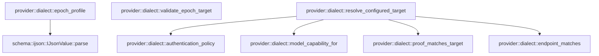

```mermaid
flowchart TD
  n0["provider::dialect::authentication_policy"]
  n1["provider::dialect::ResolvedDialectProfile::default_reasoning_effort"]
  n2["provider::dialect::ResolvedDialectProfile::thinking_wire"]
  n3["provider::dialect::ResolvedDialectProfile::forced_tool_choice"]
  n4["provider::dialect::ResolvedDialectProfile::refusal_fallback"]
  n5["provider::dialect::ResolvedDialectProfile::max_output_tokens"]
  n6["provider::dialect::definition_for"]
  n7["provider::dialect::target_matches_definition"]
  n8["provider::dialect::load_proof_registry"]
  n9["provider::dialect::load_model_capabilities"]
  n10["provider::dialect::model_capability_for"]
  n11["provider::dialect::dialect_uniform_capability"]
  n12["provider::dialect::proof_matches_target"]
  n13["provider::dialect::endpoint_matches"]
  n14["provider::dialect::proof_matches_endpoint"]
  n15["provider::dialect::proof_matches_provider_route"]
  n16["provider::dialect::validate_endpoint"]
  n17["provider::dialect::configured_route_is_verified"]
  n18["provider::dialect::advertised_dialect_proofs"]
  n19["provider::dialect::resolve_profile"]
  n20["provider::dialect::validate_target"]
  n21["provider::dialect::resolve_configured_target"]
  n8 --> n6
  n8 --> n7
  n10 --> n11
  n14 --> n12
  n14 --> n13
  n15 --> n13
  n16 --> n14
  n17 --> n0
  n17 --> n6
  n17 --> n15
  n19 --> n6
  n19 --> n21
  n20 --> n6
  n20 --> n7
  n20 --> n21
```

# provider::dialect

[Package atlas](index.md) · [Source](../../src/dialect.rs)

## Declarations

Visibility is the declaration spelling; trait members and reexports require their enclosing interface. `cfg` is not evaluated.

| Symbol | Kind | Visibility | Test / cfg |
|---|---|---|---|
| [provider::dialect::DialectId](../../src/dialect.rs#L16) | enum_item | `pub` |  |
| [provider::dialect::DialectId::as_str](../../src/dialect.rs#L33) | function_item | `pub` |  |
| [provider::dialect::DialectId::family](../../src/dialect.rs#L51) | function_item | `pub` |  |
| [provider::dialect::DialectId::server_managed](../../src/dialect.rs#L67) | function_item | `pub` |  |
| [provider::dialect::DialectId::input_blocks](../../src/dialect.rs#L72) | function_item | `pub` |  |
| [provider::dialect::DialectId::supports_reasoning_blocks](../../src/dialect.rs#L92) | function_item | `pub` |  |
| [provider::dialect::DialectId::cache_policy](../../src/dialect.rs#L104) | function_item | `pub` |  |
| [provider::dialect::DialectId::sampling_policy](../../src/dialect.rs#L114) | function_item | `pub` |  |
| [provider::dialect::DialectId::schema_policy](../../src/dialect.rs#L119) | function_item | `pub` |  |
| [provider::dialect::DialectId::tool_choice_modes](../../src/dialect.rs#L128) | function_item | `pub` |  |
| [provider::dialect::DialectId::tool_choice_wire](../../src/dialect.rs#L133) | function_item | `pub` |  |
| [provider::dialect::DialectId::repair_id](../../src/dialect.rs#L138) | function_item | `pub` |  |
| [provider::dialect::Err](../../src/dialect.rs#L148) | type_item | `private` |  |
| [provider::dialect::DialectId::from_str](../../src/dialect.rs#L150) | function_item | `private` |  |
| [provider::dialect::RouteEvidence](../../src/dialect.rs#L171) | struct_item | `pub` |  |
| [provider::dialect::ProviderTarget](../../src/dialect.rs#L180) | struct_item | `pub` |  |
| [provider::dialect::ProviderTarget::dialect](../../src/dialect.rs#L188) | function_item | `pub` |  |
| [provider::dialect::ProviderTarget::family](../../src/dialect.rs#L192) | function_item | `pub` |  |
| [provider::dialect::Definition](../../src/dialect.rs#L207) | struct_item | `private` |  |
| [provider::dialect::AdvertisedDialectProof](../../src/dialect.rs#L218) | struct_item | `pub` |  |
| [provider::dialect::PROOF_ORACLE](../../src/dialect.rs#L232) | const_item | `private` |  |
| [provider::dialect::PROOF_ORACLE_SHA256](../../src/dialect.rs#L235) | const_item | `private` |  |
| [provider::dialect::MODEL_CAPABILITY_CATALOG](../../src/dialect.rs#L238) | const_item | `private` |  |
| [provider::dialect::MODEL_CAPABILITY_CATALOG_SHA256](../../src/dialect.rs#L240) | const_item | `private` |  |
| [provider::dialect::ModelReasoningCapability](../../src/dialect.rs#L245) | struct_item | `private` |  |
| [provider::dialect::ThinkingWire](../../src/dialect.rs#L258) | enum_item | `pub` |  |
| [provider::dialect::NativeDeferredMode](../../src/dialect.rs#L271) | enum_item | `pub` |  |
| [provider::dialect::NativeDeferredMode::dialect](../../src/dialect.rs#L283) | function_item | `pub` |  |
| [provider::dialect::NativeDeferredRoute](../../src/dialect.rs#L293) | struct_item | `private` |  |
| [provider::dialect::NativeDeferredCapability](../../src/dialect.rs#L300) | struct_item | `private` |  |
| [provider::dialect::ModelCapabilityProfile](../../src/dialect.rs#L307) | struct_item | `private` |  |
| [provider::dialect::default_true](../../src/dialect.rs#L334) | function_item | `private` |  |
| [provider::dialect::ModelCapabilityCatalog](../../src/dialect.rs#L340) | struct_item | `private` |  |
| [provider::dialect::MODEL_CAPABILITIES](../../src/dialect.rs#L345) | static_item | `private` |  |
| [provider::dialect::ProofRegistry](../../src/dialect.rs#L347) | struct_item | `private` |  |
| [provider::dialect::PROOF_REGISTRY](../../src/dialect.rs#L352) | static_item | `private` |  |
| [provider::dialect::DEFINITIONS](../../src/dialect.rs#L354) | const_item | `private` |  |
| [provider::dialect::ResolvedDialectProfile](../../src/dialect.rs#L418) | struct_item | `pub` |  |
| [provider::dialect::ResolvedDialectProfile::wire_model](../../src/dialect.rs#L442) | function_item | `pub` |  |
| [provider::dialect::ResolvedDialectProfile::pro_reasoning](../../src/dialect.rs#L448) | function_item | `pub` |  |
| [provider::dialect::ResolvedDialectProfile::native_deferred_tools](../../src/dialect.rs#L455) | function_item | `pub` |  |
| [provider::dialect::ResolvedDialectProfile::reasoning_efforts](../../src/dialect.rs#L460) | function_item | `pub` |  |
| [provider::dialect::ResolvedDialectProfile::default_reasoning_effort](../../src/dialect.rs#L465) | function_item | `pub` |  |
| [provider::dialect::ResolvedDialectProfile::thinking_wire](../../src/dialect.rs#L471) | function_item | `pub` |  |
| [provider::dialect::ResolvedDialectProfile::forced_tool_choice](../../src/dialect.rs#L477) | function_item | `pub` |  |
| [provider::dialect::ResolvedDialectProfile::refusal_fallback](../../src/dialect.rs#L483) | function_item | `pub` |  |
| [provider::dialect::ResolvedDialectProfile::max_output_tokens](../../src/dialect.rs#L489) | function_item | `pub` |  |
| [provider::dialect::DialectError](../../src/dialect.rs#L495) | enum_item | `pub` |  |
| [provider::dialect::definition_for](../../src/dialect.rs#L514) | function_item | `private` |  |
| [provider::dialect::target_matches_definition](../../src/dialect.rs#L521) | function_item | `private` |  |
| [provider::dialect::load_proof_registry](../../src/dialect.rs#L525) | function_item | `private` |  |
| [provider::dialect::load_model_capabilities](../../src/dialect.rs#L641) | function_item | `private` |  |
| [provider::dialect::model_capability_for](../../src/dialect.rs#L730) | function_item | `private` |  |
| [provider::dialect::dialect_uniform_capability](../../src/dialect.rs#L756) | function_item | `private` |  |
| [provider::dialect::proof_matches_target](../../src/dialect.rs#L786) | function_item | `private` |  |
| [provider::dialect::endpoint_matches](../../src/dialect.rs#L796) | function_item | `private` |  |
| [provider::dialect::proof_matches_endpoint](../../src/dialect.rs#L818) | function_item | `private` |  |
| [provider::dialect::proof_matches_provider_route](../../src/dialect.rs#L826) | function_item | `private` |  |
| [provider::dialect::validate_endpoint](../../src/dialect.rs#L835) | function_item | `pub` |  |
| [provider::dialect::configured_route_is_verified](../../src/dialect.rs#L853) | function_item | `pub` |  |
| [provider::dialect::advertised_dialect_proofs](../../src/dialect.rs#L880) | function_item | `pub` |  |
| [provider::dialect::resolve_profile](../../src/dialect.rs#L888) | function_item | `pub` |  |
| [provider::dialect::validate_target](../../src/dialect.rs#L911) | function_item | `pub` |  |
| [provider::dialect::resolve_configured_target](../../src/dialect.rs#L920) | function_item | `private` |  |
| [provider::dialect::authentication_policy](../../src/dialect.rs#L1001) | function_item | `private` |  |
| [provider::dialect::epoch_profile](../../src/dialect.rs#L1028) | function_item | `pub` |  |
| [provider::dialect::validate_epoch_target](../../src/dialect.rs#L1059) | function_item | `pub` |  |
| [provider::dialect::tests::unlisted_sku_inherits_a_dialect_uniform_reasoning_capability](../../src/dialect.rs#L1085) | function_item | `private` | test; #[cfg(test)] |
| [provider::dialect::tests::endpoint_patterns_match_opaque_configured_path_segments_only](../../src/dialect.rs#L1110) | function_item | `private` | test; #[cfg(test)] |

## Imports / reexports

| Local name | Source path | Visibility |
|---|---|---|
| `BTreeSet` | `std::collections::BTreeSet` | `private` |
| `FromStr` | `std::str::FromStr` | `private` |
| `OnceLock` | `std::sync::OnceLock` | `private` |
| `Model` | `profile::Model` | `private` |
| `Provider` | `profile::Provider` | `private` |
| `SessionSettings` | `profile::SessionSettings` | `private` |
| `IJsonValue` | `schema::IJsonValue` | `private` |
| `Deserialize` | `serde::Deserialize` | `private` |
| `Serialize` | `serde::Serialize` | `private` |
| `Value` | `serde_json::Value` | `private` |
| `json` | `serde_json::json` | `private` |
| `Digest` | `sha2::Digest` | `private` |
| `Sha256` | `sha2::Sha256` | `private` |
| `Error` | `thiserror::Error` | `private` |
| `AdapterId` | `crate::AdapterId` | `private` |
| `endpoint_matches` | `super::endpoint_matches` | `private` |

## Module declarations

| Module | Visibility | Attributes |
|---|---|---|
| `provider::dialect::tests` | `private` | #[cfg(test)] |

## Function call graphs

Edges below are syntactically resolved calls only, including private functions. Graphs partition callers into groups of 20; they are not execution order. All unresolved sites are listed below and in the JSON inventory.

Functions 1–20: 1 direct edges

Functions 21–40: 15 direct edges

Functions 41–44: 5 direct edges

## Call sites

Includes test functions (marked in declarations). Receiver-type-required sites need type analysis/manual tracing. Calls in closures are attributed to their enclosing function; their occurrence here does not mean the closure executes immediately.

| Caller | Callee expression | Source lines | Target / classification |
|---|---|---|---|
| `from_str` | `Ok` | [152](../../src/dialect.rs#L152), [153](../../src/dialect.rs#L153), [154](../../src/dialect.rs#L154), [155](../../src/dialect.rs#L155), [156](../../src/dialect.rs#L156), [157](../../src/dialect.rs#L157), [158](../../src/dialect.rs#L158), [159](../../src/dialect.rs#L159), [160](../../src/dialect.rs#L160), [161](../../src/dialect.rs#L161), [162](../../src/dialect.rs#L162), [163](../../src/dialect.rs#L163) | external-constructor-callback-or-unresolved |
| `from_str` | `Err` | [164](../../src/dialect.rs#L164) | external-constructor-callback-or-unresolved |
| `from_str` | `DialectError::UnknownDialect` | [164](../../src/dialect.rs#L164) | external-constructor-callback-or-unresolved |
| `from_str` | `other.to_owned` | [164](../../src/dialect.rs#L164) | receiver-type-required |
| `dialect` | `DialectId::from_str` | [189](../../src/dialect.rs#L189) | external-constructor-callback-or-unresolved |
| `family` | `self.dialect` | [193](../../src/dialect.rs#L193) | [provider::dialect::ProviderTarget::dialect](../../src/dialect.rs#L188) |
| `family` | `self.protocol_family.as_str` | [194](../../src/dialect.rs#L194) | receiver-type-required |
| `family` | `AdapterId::from_str(other)                 .map_err` | [197](../../src/dialect.rs#L197) | receiver-type-required |
| `family` | `AdapterId::from_str` | [197](../../src/dialect.rs#L197) | external-constructor-callback-or-unresolved |
| `family` | `DialectError::UnknownFamily` | [198](../../src/dialect.rs#L198) | external-constructor-callback-or-unresolved |
| `family` | `self.protocol_family.clone` | [198](../../src/dialect.rs#L198) | receiver-type-required |
| `family` | `dialect.family` | [200](../../src/dialect.rs#L200) | receiver-type-required |
| `family` | `Err` | [201](../../src/dialect.rs#L201) | external-constructor-callback-or-unresolved |
| `family` | `Ok` | [203](../../src/dialect.rs#L203) | external-constructor-callback-or-unresolved |
| `MODEL_CAPABILITIES` | `OnceLock::new` | [345](../../src/dialect.rs#L345) | external-constructor-callback-or-unresolved |
| `PROOF_REGISTRY` | `OnceLock::new` | [352](../../src/dialect.rs#L352) | external-constructor-callback-or-unresolved |
| `wire_model` | `self.wire_model             .as_deref()             .unwrap_or` | [443](../../src/dialect.rs#L443) | receiver-type-required |
| `wire_model` | `self.wire_model             .as_deref` | [443](../../src/dialect.rs#L443) | receiver-type-required |
| `default_reasoning_effort` | `self.default_reasoning_effort.as_deref` | [466](../../src/dialect.rs#L466) | receiver-type-required |
| `definition_for` | `DEFINITIONS         .iter()         .find(&#124;definition&#124; definition.dialect == dialect)         .ok_or_else` | [515](../../src/dialect.rs#L515) | receiver-type-required |
| `definition_for` | `DEFINITIONS         .iter()         .find` | [515](../../src/dialect.rs#L515) | receiver-type-required |
| `definition_for` | `DEFINITIONS         .iter` | [515](../../src/dialect.rs#L515) | receiver-type-required |
| `definition_for` | `DialectError::UnknownDialect` | [518](../../src/dialect.rs#L518) | external-constructor-callback-or-unresolved |
| `definition_for` | `dialect.as_str().to_owned` | [518](../../src/dialect.rs#L518) | receiver-type-required |
| `definition_for` | `dialect.as_str` | [518](../../src/dialect.rs#L518) | receiver-type-required |
| `load_proof_registry` | `Err` | [528](../../src/dialect.rs#L528), [553](../../src/dialect.rs#L553), [569](../../src/dialect.rs#L569), [579](../../src/dialect.rs#L579), [586](../../src/dialect.rs#L586), [597](../../src/dialect.rs#L597), [604](../../src/dialect.rs#L604), [615](../../src/dialect.rs#L615) | external-constructor-callback-or-unresolved |
| `load_proof_registry` | `serde_json::from_slice(PROOF_ORACLE)         .map_err` | [532](../../src/dialect.rs#L532) | receiver-type-required |
| `load_proof_registry` | `serde_json::from_slice` | [532](../../src/dialect.rs#L532) | external-constructor-callback-or-unresolved |
| `load_proof_registry` | `root         .get("required_proof_arms")         .and_then(Value::as_array)         .ok_or` | [534](../../src/dialect.rs#L534) | receiver-type-required |
| `load_proof_registry` | `root         .get("required_proof_arms")         .and_then` | [534](../../src/dialect.rs#L534) | receiver-type-required |
| `load_proof_registry` | `root         .get` | [534](../../src/dialect.rs#L534), [538](../../src/dialect.rs#L538) | receiver-type-required |
| `load_proof_registry` | `root         .get("profiles")         .and_then(Value::as_array)         .ok_or` | [538](../../src/dialect.rs#L538) | receiver-type-required |
| `load_proof_registry` | `root         .get("profiles")         .and_then` | [538](../../src/dialect.rs#L538) | receiver-type-required |
| `load_proof_registry` | `Vec::new` | [542](../../src/dialect.rs#L542), [543](../../src/dialect.rs#L543) | external-constructor-callback-or-unresolved |
| `load_proof_registry` | `BTreeSet::new` | [544](../../src/dialect.rs#L544) | external-constructor-callback-or-unresolved |
| `load_proof_registry` | `profile.get("advertised").and_then` | [546](../../src/dialect.rs#L546) | receiver-type-required |
| `load_proof_registry` | `profile.get` | [546](../../src/dialect.rs#L546), [552](../../src/dialect.rs#L552), [601](../../src/dialect.rs#L601), [614](../../src/dialect.rs#L614) | receiver-type-required |
| `load_proof_registry` | `Some` | [546](../../src/dialect.rs#L546), [602](../../src/dialect.rs#L602), [614](../../src/dialect.rs#L614) | external-constructor-callback-or-unresolved |
| `load_proof_registry` | `arm                     .as_str()                     .ok_or` | [549](../../src/dialect.rs#L549) | receiver-type-required |
| `load_proof_registry` | `arm                     .as_str` | [549](../../src/dialect.rs#L549) | receiver-type-required |
| `load_proof_registry` | `profile.get(name).is_none_or` | [552](../../src/dialect.rs#L552) | receiver-type-required |
| `load_proof_registry` | `serde_json::from_value(             profile                 .get("target")                 .cloned()                 .ok_or("provider proof lacks target")?,         )         .map_err` | [557](../../src/dialect.rs#L557) | receiver-type-required |
| `load_proof_registry` | `serde_json::from_value` | [557](../../src/dialect.rs#L557) | external-constructor-callback-or-unresolved |
| `load_proof_registry` | `profile                 .get("target")                 .cloned()                 .ok_or` | [558](../../src/dialect.rs#L558) | receiver-type-required |
| `load_proof_registry` | `profile                 .get("target")                 .cloned` | [558](../../src/dialect.rs#L558) | receiver-type-required |
| `load_proof_registry` | `profile                 .get` | [558](../../src/dialect.rs#L558) | receiver-type-required |
| `load_proof_registry` | `target             .dialect()             .map_err` | [564](../../src/dialect.rs#L564) | receiver-type-required |
| `load_proof_registry` | `target             .dialect` | [564](../../src/dialect.rs#L564) | receiver-type-required |
| `load_proof_registry` | `definition_for(dialect).map_err` | [567](../../src/dialect.rs#L567) | receiver-type-required |
| `load_proof_registry` | `definition_for` | [567](../../src/dialect.rs#L567) | [provider::dialect::definition_for](../../src/dialect.rs#L514) |
| `load_proof_registry` | `error.to_string` | [567](../../src/dialect.rs#L567) | receiver-type-required |
| `load_proof_registry` | `target_matches_definition` | [568](../../src/dialect.rs#L568) | [provider::dialect::target_matches_definition](../../src/dialect.rs#L521) |
| `load_proof_registry` | `profile             .get("proof_id")             .and_then(Value::as_str)             .ok_or` | [574](../../src/dialect.rs#L574) | receiver-type-required |
| `load_proof_registry` | `profile             .get("proof_id")             .and_then` | [574](../../src/dialect.rs#L574) | receiver-type-required |
| `load_proof_registry` | `profile             .get` | [574](../../src/dialect.rs#L574), [581](../../src/dialect.rs#L581), [588](../../src/dialect.rs#L588), [592](../../src/dialect.rs#L592) | receiver-type-required |
| `load_proof_registry` | `proof_id.is_empty` | [578](../../src/dialect.rs#L578) | receiver-type-required |
| `load_proof_registry` | `proof_ids.insert` | [578](../../src/dialect.rs#L578) | receiver-type-required |
| `load_proof_registry` | `proof_id.to_owned` | [578](../../src/dialect.rs#L578), [621](../../src/dialect.rs#L621) | receiver-type-required |
| `load_proof_registry` | `profile             .get("endpoint")             .and_then(Value::as_str)             .ok_or` | [581](../../src/dialect.rs#L581) | receiver-type-required |
| `load_proof_registry` | `profile             .get("endpoint")             .and_then` | [581](../../src/dialect.rs#L581) | receiver-type-required |
| `load_proof_registry` | `endpoint.is_empty` | [585](../../src/dialect.rs#L585) | receiver-type-required |
| `load_proof_registry` | `profile             .get("credential_header")             .and_then(Value::as_str)             .ok_or` | [588](../../src/dialect.rs#L588) | receiver-type-required |
| `load_proof_registry` | `profile             .get("credential_header")             .and_then` | [588](../../src/dialect.rs#L588) | receiver-type-required |
| `load_proof_registry` | `profile             .get("credential_prefix")             .and_then(Value::as_str)             .ok_or` | [592](../../src/dialect.rs#L592) | receiver-type-required |
| `load_proof_registry` | `profile             .get("credential_prefix")             .and_then` | [592](../../src/dialect.rs#L592) | receiver-type-required |
| `load_proof_registry` | `credential_header.is_empty` | [596](../../src/dialect.rs#L596) | receiver-type-required |
| `load_proof_registry` | `profile.get("serializer_revision").and_then` | [601](../../src/dialect.rs#L601) | receiver-type-required |
| `load_proof_registry` | `dialect.server_managed` | [609](../../src/dialect.rs#L609) | receiver-type-required |
| `load_proof_registry` | `profile.get("continuation").and_then` | [614](../../src/dialect.rs#L614) | receiver-type-required |
| `load_proof_registry` | `endpoint.to_owned` | [627](../../src/dialect.rs#L627) | receiver-type-required |
| `load_proof_registry` | `credential_header.to_owned` | [630](../../src/dialect.rs#L630) | receiver-type-required |
| `load_proof_registry` | `credential_prefix.to_owned` | [631](../../src/dialect.rs#L631) | receiver-type-required |
| `load_proof_registry` | `all.push` | [633](../../src/dialect.rs#L633) | receiver-type-required |
| `load_proof_registry` | `proof.clone` | [633](../../src/dialect.rs#L633) | receiver-type-required |
| `load_proof_registry` | `advertised.push` | [635](../../src/dialect.rs#L635) | receiver-type-required |
| `load_proof_registry` | `Ok` | [638](../../src/dialect.rs#L638) | external-constructor-callback-or-unresolved |
| `load_model_capabilities` | `Err` | [644](../../src/dialect.rs#L644), [651](../../src/dialect.rs#L651), [664](../../src/dialect.rs#L664), [672](../../src/dialect.rs#L672), [680](../../src/dialect.rs#L680), [694](../../src/dialect.rs#L694), [700](../../src/dialect.rs#L700), [711](../../src/dialect.rs#L711), [721](../../src/dialect.rs#L721) | external-constructor-callback-or-unresolved |
| `load_model_capabilities` | `serde_json::from_slice(MODEL_CAPABILITY_CATALOG)         .map_err` | [648](../../src/dialect.rs#L648) | receiver-type-required |
| `load_model_capabilities` | `serde_json::from_slice` | [648](../../src/dialect.rs#L648) | external-constructor-callback-or-unresolved |
| `load_model_capabilities` | `BTreeSet::new` | [656](../../src/dialect.rs#L656), [674](../../src/dialect.rs#L674) | external-constructor-callback-or-unresolved |
| `load_model_capabilities` | `profile.dialect_id.as_str` | [659](../../src/dialect.rs#L659) | receiver-type-required |
| `load_model_capabilities` | `profile.model_profile_id.as_str` | [660](../../src/dialect.rs#L660) | receiver-type-required |
| `load_model_capabilities` | `profile.exact_sku.as_str` | [661](../../src/dialect.rs#L661) | receiver-type-required |
| `load_model_capabilities` | `identities.insert` | [663](../../src/dialect.rs#L663) | receiver-type-required |
| `load_model_capabilities` | `DialectId::from_str(&profile.dialect_id)             .map_err` | [669](../../src/dialect.rs#L669) | receiver-type-required |
| `load_model_capabilities` | `DialectId::from_str` | [669](../../src/dialect.rs#L669), [686](../../src/dialect.rs#L686) | external-constructor-callback-or-unresolved |
| `load_model_capabilities` | `profile.model_profile_id.is_empty` | [671](../../src/dialect.rs#L671) | receiver-type-required |
| `load_model_capabilities` | `profile.exact_sku.is_empty` | [671](../../src/dialect.rs#L671) | receiver-type-required |
| `load_model_capabilities` | `"model capability identity must be nonempty".to_owned` | [672](../../src/dialect.rs#L672) | receiver-type-required |
| `load_model_capabilities` | `level.is_empty` | [676](../../src/dialect.rs#L676) | receiver-type-required |
| `load_model_capabilities` | `level.as_bytes().iter().all` | [677](../../src/dialect.rs#L677) | receiver-type-required |
| `load_model_capabilities` | `level.as_bytes().iter` | [677](../../src/dialect.rs#L677) | receiver-type-required |
| `load_model_capabilities` | `level.as_bytes` | [677](../../src/dialect.rs#L677) | receiver-type-required |
| `load_model_capabilities` | `levels.insert` | [678](../../src/dialect.rs#L678) | receiver-type-required |
| `load_model_capabilities` | `level.as_str` | [678](../../src/dialect.rs#L678) | receiver-type-required |
| `load_model_capabilities` | `DialectId::from_str(&profile.dialect_id).expect` | [686](../../src/dialect.rs#L686) | receiver-type-required |
| `load_model_capabilities` | `profile             .wire_model             .as_ref()             .is_some_and` | [687](../../src/dialect.rs#L687) | receiver-type-required |
| `load_model_capabilities` | `profile             .wire_model             .as_ref` | [687](../../src/dialect.rs#L687) | receiver-type-required |
| `load_model_capabilities` | `model.is_empty` | [690](../../src/dialect.rs#L690) | receiver-type-required |
| `load_model_capabilities` | `profile.wire_model.is_none` | [692](../../src/dialect.rs#L692) | receiver-type-required |
| `load_model_capabilities` | `"invalid model wire variant capability".to_owned` | [694](../../src/dialect.rs#L694) | receiver-type-required |
| `load_model_capabilities` | `dialect.family` | [696](../../src/dialect.rs#L696) | receiver-type-required |
| `load_model_capabilities` | `profile.reasoning.levels.is_empty` | [697](../../src/dialect.rs#L697) | receiver-type-required |
| `load_model_capabilities` | `profile.reasoning.thinking.is_none` | [698](../../src/dialect.rs#L698) | receiver-type-required |
| `load_model_capabilities` | `profile             .reasoning             .default             .as_ref()             .is_some_and` | [705](../../src/dialect.rs#L705) | receiver-type-required |
| `load_model_capabilities` | `profile             .reasoning             .default             .as_ref` | [705](../../src/dialect.rs#L705) | receiver-type-required |
| `load_model_capabilities` | `levels.contains` | [709](../../src/dialect.rs#L709) | receiver-type-required |
| `load_model_capabilities` | `value.as_str` | [709](../../src/dialect.rs#L709) | receiver-type-required |
| `load_model_capabilities` | `profile             .evidence_url             .as_ref()             .is_some_and` | [716](../../src/dialect.rs#L716) | receiver-type-required |
| `load_model_capabilities` | `profile             .evidence_url             .as_ref` | [716](../../src/dialect.rs#L716) | receiver-type-required |
| `load_model_capabilities` | `url.starts_with` | [719](../../src/dialect.rs#L719) | receiver-type-required |
| `load_model_capabilities` | `Ok` | [727](../../src/dialect.rs#L727) | external-constructor-callback-or-unresolved |
| `model_capability_for` | `MODEL_CAPABILITIES.get_or_init` | [733](../../src/dialect.rs#L733) | receiver-type-required |
| `model_capability_for` | `catalog         .as_ref()         .map_err` | [734](../../src/dialect.rs#L734) | receiver-type-required |
| `model_capability_for` | `catalog         .as_ref` | [734](../../src/dialect.rs#L734) | receiver-type-required |
| `model_capability_for` | `DialectError::UnprovedProfile` | [736](../../src/dialect.rs#L736) | external-constructor-callback-or-unresolved |
| `model_capability_for` | `error.clone` | [736](../../src/dialect.rs#L736) | receiver-type-required |
| `model_capability_for` | `catalog.iter().find` | [737](../../src/dialect.rs#L737) | receiver-type-required |
| `model_capability_for` | `catalog.iter` | [737](../../src/dialect.rs#L737) | receiver-type-required |
| `model_capability_for` | `Ok` | [742](../../src/dialect.rs#L742), [744](../../src/dialect.rs#L744) | external-constructor-callback-or-unresolved |
| `model_capability_for` | `Some` | [742](../../src/dialect.rs#L742) | external-constructor-callback-or-unresolved |
| `model_capability_for` | `exact.clone` | [742](../../src/dialect.rs#L742) | receiver-type-required |
| `model_capability_for` | `dialect_uniform_capability` | [744](../../src/dialect.rs#L744) | [provider::dialect::dialect_uniform_capability](../../src/dialect.rs#L756) |
| `dialect_uniform_capability` | `catalog         .iter()         .filter` | [761](../../src/dialect.rs#L761) | receiver-type-required |
| `dialect_uniform_capability` | `catalog         .iter` | [761](../../src/dialect.rs#L761) | receiver-type-required |
| `dialect_uniform_capability` | `family.next` | [764](../../src/dialect.rs#L764) | receiver-type-required |
| `dialect_uniform_capability` | `family.any` | [765](../../src/dialect.rs#L765) | receiver-type-required |
| `dialect_uniform_capability` | `Some` | [771](../../src/dialect.rs#L771) | external-constructor-callback-or-unresolved |
| `dialect_uniform_capability` | `dialect_id.to_owned` | [772](../../src/dialect.rs#L772) | receiver-type-required |
| `dialect_uniform_capability` | `exact_sku.to_owned` | [774](../../src/dialect.rs#L774) | receiver-type-required |
| `dialect_uniform_capability` | `first.reasoning.clone` | [777](../../src/dialect.rs#L777) | receiver-type-required |
| `endpoint_matches` | `pattern.trim_end_matches` | [797](../../src/dialect.rs#L797) | receiver-type-required |
| `endpoint_matches` | `endpoint.trim_end_matches` | [798](../../src/dialect.rs#L798) | receiver-type-required |
| `endpoint_matches` | `pattern.split('/').collect::<Vec<_>>` | [799](../../src/dialect.rs#L799) | receiver-type-required |
| `endpoint_matches` | `pattern.split` | [799](../../src/dialect.rs#L799) | receiver-type-required |
| `endpoint_matches` | `endpoint.split('/').collect::<Vec<_>>` | [800](../../src/dialect.rs#L800) | receiver-type-required |
| `endpoint_matches` | `endpoint.split` | [800](../../src/dialect.rs#L800) | receiver-type-required |
| `endpoint_matches` | `pattern_parts.len` | [801](../../src/dialect.rs#L801) | receiver-type-required |
| `endpoint_matches` | `endpoint_parts.len` | [801](../../src/dialect.rs#L801) | receiver-type-required |
| `endpoint_matches` | `pattern_parts             .iter()             .zip(endpoint_parts)             .all` | [802](../../src/dialect.rs#L802) | receiver-type-required |
| `endpoint_matches` | `pattern_parts             .iter()             .zip` | [802](../../src/dialect.rs#L802) | receiver-type-required |
| `endpoint_matches` | `pattern_parts             .iter` | [802](../../src/dialect.rs#L802) | receiver-type-required |
| `endpoint_matches` | `expected.starts_with` | [806](../../src/dialect.rs#L806) | receiver-type-required |
| `endpoint_matches` | `expected.ends_with` | [806](../../src/dialect.rs#L806) | receiver-type-required |
| `endpoint_matches` | `expected.len` | [807](../../src/dialect.rs#L807) | receiver-type-required |
| `endpoint_matches` | `actual.is_empty` | [808](../../src/dialect.rs#L808) | receiver-type-required |
| `endpoint_matches` | `actual.contains` | [811](../../src/dialect.rs#L811) | receiver-type-required |
| `proof_matches_endpoint` | `proof_matches_target` | [823](../../src/dialect.rs#L823) | [provider::dialect::proof_matches_target](../../src/dialect.rs#L786) |
| `proof_matches_endpoint` | `endpoint_matches` | [823](../../src/dialect.rs#L823) | [provider::dialect::endpoint_matches](../../src/dialect.rs#L796) |
| `proof_matches_provider_route` | `endpoint_matches` | [832](../../src/dialect.rs#L832) | [provider::dialect::endpoint_matches](../../src/dialect.rs#L796) |
| `validate_endpoint` | `PROOF_REGISTRY.get_or_init` | [836](../../src/dialect.rs#L836) | receiver-type-required |
| `validate_endpoint` | `registry                 .all                 .iter()                 .any` | [839](../../src/dialect.rs#L839) | receiver-type-required |
| `validate_endpoint` | `registry                 .all                 .iter` | [839](../../src/dialect.rs#L839) | receiver-type-required |
| `validate_endpoint` | `proof_matches_endpoint` | [842](../../src/dialect.rs#L842) | [provider::dialect::proof_matches_endpoint](../../src/dialect.rs#L818) |
| `validate_endpoint` | `Ok` | [844](../../src/dialect.rs#L844) | external-constructor-callback-or-unresolved |
| `validate_endpoint` | `Err` | [846](../../src/dialect.rs#L846), [847](../../src/dialect.rs#L847) | external-constructor-callback-or-unresolved |
| `validate_endpoint` | `DialectError::UnprovedProfile` | [847](../../src/dialect.rs#L847) | external-constructor-callback-or-unresolved |
| `validate_endpoint` | `error.clone` | [847](../../src/dialect.rs#L847) | receiver-type-required |
| `configured_route_is_verified` | `DialectId::from_str` | [854](../../src/dialect.rs#L854) | external-constructor-callback-or-unresolved |
| `configured_route_is_verified` | `definition_for` | [855](../../src/dialect.rs#L855) | [provider::dialect::definition_for](../../src/dialect.rs#L514) |
| `configured_route_is_verified` | `Err` | [857](../../src/dialect.rs#L857), [868](../../src/dialect.rs#L868) | external-constructor-callback-or-unresolved |
| `configured_route_is_verified` | `PROOF_REGISTRY.get_or_init` | [859](../../src/dialect.rs#L859) | receiver-type-required |
| `configured_route_is_verified` | `registry         .as_ref()         .map_err` | [860](../../src/dialect.rs#L860) | receiver-type-required |
| `configured_route_is_verified` | `registry         .as_ref` | [860](../../src/dialect.rs#L860) | receiver-type-required |
| `configured_route_is_verified` | `DialectError::UnprovedProfile` | [862](../../src/dialect.rs#L862), [868](../../src/dialect.rs#L868) | external-constructor-callback-or-unresolved |
| `configured_route_is_verified` | `error.clone` | [862](../../src/dialect.rs#L862) | receiver-type-required |
| `configured_route_is_verified` | `registry         .advertised         .iter()         .any` | [863](../../src/dialect.rs#L863), [871](../../src/dialect.rs#L871) | receiver-type-required |
| `configured_route_is_verified` | `registry         .advertised         .iter` | [863](../../src/dialect.rs#L863), [871](../../src/dialect.rs#L871) | receiver-type-required |
| `configured_route_is_verified` | `dialect.as_str` | [866](../../src/dialect.rs#L866), [868](../../src/dialect.rs#L868) | receiver-type-required |
| `configured_route_is_verified` | `dialect.as_str().to_owned` | [868](../../src/dialect.rs#L868) | receiver-type-required |
| `configured_route_is_verified` | `authentication_policy` | [870](../../src/dialect.rs#L870) | [provider::dialect::authentication_policy](../../src/dialect.rs#L1001) |
| `configured_route_is_verified` | `Ok` | [871](../../src/dialect.rs#L871) | external-constructor-callback-or-unresolved |
| `configured_route_is_verified` | `proof_matches_provider_route` | [874](../../src/dialect.rs#L874) | [provider::dialect::proof_matches_provider_route](../../src/dialect.rs#L826) |
| `advertised_dialect_proofs` | `PROOF_REGISTRY.get_or_init` | [881](../../src/dialect.rs#L881) | receiver-type-required |
| `advertised_dialect_proofs` | `registry         .as_ref()         .map_err` | [882](../../src/dialect.rs#L882) | receiver-type-required |
| `advertised_dialect_proofs` | `registry         .as_ref` | [882](../../src/dialect.rs#L882) | receiver-type-required |
| `advertised_dialect_proofs` | `DialectError::UnprovedProfile` | [884](../../src/dialect.rs#L884) | external-constructor-callback-or-unresolved |
| `advertised_dialect_proofs` | `error.clone` | [884](../../src/dialect.rs#L884) | receiver-type-required |
| `advertised_dialect_proofs` | `Ok` | [885](../../src/dialect.rs#L885) | external-constructor-callback-or-unresolved |
| `advertised_dialect_proofs` | `registry.advertised.clone` | [885](../../src/dialect.rs#L885) | receiver-type-required |
| `resolve_profile` | `DialectId::from_str` | [892](../../src/dialect.rs#L892) | external-constructor-callback-or-unresolved |
| `resolve_profile` | `definition_for` | [893](../../src/dialect.rs#L893) | [provider::dialect::definition_for](../../src/dialect.rs#L514) |
| `resolve_profile` | `Err` | [895](../../src/dialect.rs#L895) | external-constructor-callback-or-unresolved |
| `resolve_profile` | `provider.adapter.clone` | [898](../../src/dialect.rs#L898) | receiver-type-required |
| `resolve_profile` | `provider.dialect.clone` | [899](../../src/dialect.rs#L899) | receiver-type-required |
| `resolve_profile` | `model.profile.clone` | [900](../../src/dialect.rs#L900) | receiver-type-required |
| `resolve_profile` | `provider.endpoint_owner.clone` | [902](../../src/dialect.rs#L902) | receiver-type-required |
| `resolve_profile` | `provider.gateway_translation.clone` | [903](../../src/dialect.rs#L903) | receiver-type-required |
| `resolve_profile` | `model.id.clone` | [904](../../src/dialect.rs#L904) | receiver-type-required |
| `resolve_profile` | `provider.evidence_revision.clone` | [905](../../src/dialect.rs#L905) | receiver-type-required |
| `resolve_profile` | `resolve_configured_target` | [908](../../src/dialect.rs#L908) | [provider::dialect::resolve_configured_target](../../src/dialect.rs#L920) |
| `resolve_profile` | `Some` | [908](../../src/dialect.rs#L908) | external-constructor-callback-or-unresolved |
| `validate_target` | `target.dialect` | [912](../../src/dialect.rs#L912) | receiver-type-required |
| `validate_target` | `definition_for` | [913](../../src/dialect.rs#L913) | [provider::dialect::definition_for](../../src/dialect.rs#L514) |
| `validate_target` | `target_matches_definition` | [914](../../src/dialect.rs#L914) | [provider::dialect::target_matches_definition](../../src/dialect.rs#L521) |
| `validate_target` | `Err` | [915](../../src/dialect.rs#L915) | external-constructor-callback-or-unresolved |
| `validate_target` | `resolve_configured_target` | [917](../../src/dialect.rs#L917) | [provider::dialect::resolve_configured_target](../../src/dialect.rs#L920) |
| `validate_target` | `target.clone` | [917](../../src/dialect.rs#L917) | receiver-type-required |
| `resolve_configured_target` | `PROOF_REGISTRY.get_or_init` | [926](../../src/dialect.rs#L926) | receiver-type-required |
| `resolve_configured_target` | `registry         .as_ref()         .map_err` | [927](../../src/dialect.rs#L927) | receiver-type-required |
| `resolve_configured_target` | `registry         .as_ref` | [927](../../src/dialect.rs#L927) | receiver-type-required |
| `resolve_configured_target` | `DialectError::UnprovedProfile` | [929](../../src/dialect.rs#L929) | external-constructor-callback-or-unresolved |
| `resolve_configured_target` | `error.clone` | [929](../../src/dialect.rs#L929) | receiver-type-required |
| `resolve_configured_target` | `registry         .advertised         .iter()         .find` | [930](../../src/dialect.rs#L930) | receiver-type-required |
| `resolve_configured_target` | `registry         .advertised         .iter` | [930](../../src/dialect.rs#L930) | receiver-type-required |
| `resolve_configured_target` | `proof_matches_target` | [933](../../src/dialect.rs#L933) | [provider::dialect::proof_matches_target](../../src/dialect.rs#L786) |
| `resolve_configured_target` | `proof.credential_header.clone` | [936](../../src/dialect.rs#L936) | receiver-type-required |
| `resolve_configured_target` | `proof.credential_prefix.clone` | [937](../../src/dialect.rs#L937) | receiver-type-required |
| `resolve_configured_target` | `authentication_policy` | [939](../../src/dialect.rs#L939) | [provider::dialect::authentication_policy](../../src/dialect.rs#L1001) |
| `resolve_configured_target` | `"cf-aig-authorization".to_owned` | [945](../../src/dialect.rs#L945) | receiver-type-required |
| `resolve_configured_target` | `"Bearer ".to_owned` | [946](../../src/dialect.rs#L946) | receiver-type-required |
| `resolve_configured_target` | `exact.is_some_and` | [948](../../src/dialect.rs#L948) | receiver-type-required |
| `resolve_configured_target` | `configured_endpoint.is_none_or` | [949](../../src/dialect.rs#L949) | receiver-type-required |
| `resolve_configured_target` | `endpoint_matches` | [949](../../src/dialect.rs#L949) | [provider::dialect::endpoint_matches](../../src/dialect.rs#L796) |
| `resolve_configured_target` | `model_capability_for` | [951](../../src/dialect.rs#L951) | [provider::dialect::model_capability_for](../../src/dialect.rs#L730) |
| `resolve_configured_target` | `capability         .as_ref()         .and_then(&#124;value&#124; value.native_deferred_tools.as_ref())         .filter(&#124;native&#124; {             native.mode.dialect() == dialect                 && native.routes.iter().any(&#124;route&#124; {                     route.endpoint_owner == target.route.endpoint_owner                         && route.gateway_translation == target.route.gateway_translation                 })         })         .map` | [952](../../src/dialect.rs#L952) | receiver-type-required |
| `resolve_configured_target` | `capability         .as_ref()         .and_then(&#124;value&#124; value.native_deferred_tools.as_ref())         .filter` | [952](../../src/dialect.rs#L952) | receiver-type-required |
| `resolve_configured_target` | `capability         .as_ref()         .and_then` | [952](../../src/dialect.rs#L952) | receiver-type-required |
| `resolve_configured_target` | `capability         .as_ref` | [952](../../src/dialect.rs#L952) | receiver-type-required |
| `resolve_configured_target` | `value.native_deferred_tools.as_ref` | [954](../../src/dialect.rs#L954) | receiver-type-required |
| `resolve_configured_target` | `native.mode.dialect` | [956](../../src/dialect.rs#L956) | receiver-type-required |
| `resolve_configured_target` | `native.routes.iter().any` | [957](../../src/dialect.rs#L957) | receiver-type-required |
| `resolve_configured_target` | `native.routes.iter` | [957](../../src/dialect.rs#L957) | receiver-type-required |
| `resolve_configured_target` | `Ok` | [963](../../src/dialect.rs#L963) | external-constructor-callback-or-unresolved |
| `resolve_configured_target` | `exact.map` | [970](../../src/dialect.rs#L970) | receiver-type-required |
| `resolve_configured_target` | `proof.endpoint.clone` | [970](../../src/dialect.rs#L970) | receiver-type-required |
| `resolve_configured_target` | `capability             .as_ref()             .map(&#124;value&#124; value.reasoning.levels.clone())             .unwrap_or_default` | [971](../../src/dialect.rs#L971) | receiver-type-required |
| `resolve_configured_target` | `capability             .as_ref()             .map` | [971](../../src/dialect.rs#L971) | receiver-type-required |
| `resolve_configured_target` | `capability             .as_ref` | [971](../../src/dialect.rs#L971), [975](../../src/dialect.rs#L975), [978](../../src/dialect.rs#L978), [981](../../src/dialect.rs#L981), [984](../../src/dialect.rs#L984), [987](../../src/dialect.rs#L987), [990](../../src/dialect.rs#L990) | receiver-type-required |
| `resolve_configured_target` | `value.reasoning.levels.clone` | [973](../../src/dialect.rs#L973) | receiver-type-required |
| `resolve_configured_target` | `capability             .as_ref()             .and_then` | [975](../../src/dialect.rs#L975), [978](../../src/dialect.rs#L978), [987](../../src/dialect.rs#L987), [990](../../src/dialect.rs#L990) | receiver-type-required |
| `resolve_configured_target` | `value.reasoning.default.clone` | [977](../../src/dialect.rs#L977) | receiver-type-required |
| `resolve_configured_target` | `capability             .as_ref()             .is_none_or` | [981](../../src/dialect.rs#L981) | receiver-type-required |
| `resolve_configured_target` | `capability             .as_ref()             .is_some_and` | [984](../../src/dialect.rs#L984) | receiver-type-required |
| `resolve_configured_target` | `value.wire_model.clone` | [992](../../src/dialect.rs#L992) | receiver-type-required |
| `resolve_configured_target` | `capability.as_ref().is_some_and` | [993](../../src/dialect.rs#L993) | receiver-type-required |
| `resolve_configured_target` | `capability.as_ref` | [993](../../src/dialect.rs#L993) | receiver-type-required |
| `authentication_policy` | `registry         .all         .iter()         .filter(&#124;proof&#124; proof.dialect_id == dialect.as_str())         .map(&#124;proof&#124; {             (                 proof.credential_header.clone(),                 proof.credential_prefix.clone(),             )         })         .collect::<BTreeSet<_>>` | [1005](../../src/dialect.rs#L1005) | receiver-type-required |
| `authentication_policy` | `registry         .all         .iter()         .filter(&#124;proof&#124; proof.dialect_id == dialect.as_str())         .map` | [1005](../../src/dialect.rs#L1005) | receiver-type-required |
| `authentication_policy` | `registry         .all         .iter()         .filter` | [1005](../../src/dialect.rs#L1005) | receiver-type-required |
| `authentication_policy` | `registry         .all         .iter` | [1005](../../src/dialect.rs#L1005) | receiver-type-required |
| `authentication_policy` | `dialect.as_str` | [1008](../../src/dialect.rs#L1008) | receiver-type-required |
| `authentication_policy` | `proof.credential_header.clone` | [1011](../../src/dialect.rs#L1011) | receiver-type-required |
| `authentication_policy` | `proof.credential_prefix.clone` | [1012](../../src/dialect.rs#L1012) | receiver-type-required |
| `authentication_policy` | `policies.len` | [1016](../../src/dialect.rs#L1016) | receiver-type-required |
| `authentication_policy` | `Ok` | [1017](../../src/dialect.rs#L1017) | external-constructor-callback-or-unresolved |
| `authentication_policy` | `policies             .into_iter()             .next()             .expect` | [1017](../../src/dialect.rs#L1017) | receiver-type-required |
| `authentication_policy` | `policies             .into_iter()             .next` | [1017](../../src/dialect.rs#L1017) | receiver-type-required |
| `authentication_policy` | `policies             .into_iter` | [1017](../../src/dialect.rs#L1017) | receiver-type-required |
| `authentication_policy` | `Err` | [1022](../../src/dialect.rs#L1022) | external-constructor-callback-or-unresolved |
| `authentication_policy` | `DialectError::UnprovedProfile` | [1022](../../src/dialect.rs#L1022) | external-constructor-callback-or-unresolved |
| `epoch_profile` | `settings.and_then` | [1033](../../src/dialect.rs#L1033) | receiver-type-required |
| `epoch_profile` | `settings.reasoning_effort.as_deref` | [1033](../../src/dialect.rs#L1033) | receiver-type-required |
| `epoch_profile` | `requested.or_else` | [1034](../../src/dialect.rs#L1034) | receiver-type-required |
| `epoch_profile` | `profile.default_reasoning_effort` | [1034](../../src/dialect.rs#L1034) | receiver-type-required |
| `epoch_profile` | `effort.is_some_and` | [1035](../../src/dialect.rs#L1035) | receiver-type-required |
| `epoch_profile` | `profile.reasoning_efforts().iter().any` | [1035](../../src/dialect.rs#L1035) | receiver-type-required |
| `epoch_profile` | `profile.reasoning_efforts().iter` | [1035](../../src/dialect.rs#L1035) | receiver-type-required |
| `epoch_profile` | `profile.reasoning_efforts` | [1035](../../src/dialect.rs#L1035) | receiver-type-required |
| `epoch_profile` | `Err` | [1036](../../src/dialect.rs#L1036) | external-constructor-callback-or-unresolved |
| `epoch_profile` | `DialectError::UnsupportedControl` | [1036](../../src/dialect.rs#L1036) | external-constructor-callback-or-unresolved |
| `epoch_profile` | `"reasoning_effort".to_owned` | [1037](../../src/dialect.rs#L1037), [1043](../../src/dialect.rs#L1043) | receiver-type-required |
| `epoch_profile` | `serde_json::Map::new` | [1040](../../src/dialect.rs#L1040) | external-constructor-callback-or-unresolved |
| `epoch_profile` | `controls.insert` | [1042](../../src/dialect.rs#L1042) | receiver-type-required |
| `epoch_profile` | `Value::String` | [1044](../../src/dialect.rs#L1044) | external-constructor-callback-or-unresolved |
| `epoch_profile` | `value.to_owned` | [1044](../../src/dialect.rs#L1044) | receiver-type-required |
| `epoch_profile` | `IJsonValue::parse(         &serde_json_canonicalizer::to_vec(&json!({             "controls": controls,             "serializer_revision": profile.serializer_revision,             "system": system,             "target": profile.target,         }))         .map_err(&#124;error&#124; DialectError::InvalidEpoch(error.to_string()))?,     )     .map_err` | [1047](../../src/dialect.rs#L1047) | receiver-type-required |
| `epoch_profile` | `IJsonValue::parse` | [1047](../../src/dialect.rs#L1047) | [schema::ijson::IJsonValue::parse](../../../schema/src/ijson.rs#L16) |
| `epoch_profile` | `serde_json_canonicalizer::to_vec(&json!({             "controls": controls,             "serializer_revision": profile.serializer_revision,             "system": system,             "target": profile.target,         }))         .map_err` | [1048](../../src/dialect.rs#L1048) | receiver-type-required |
| `epoch_profile` | `serde_json_canonicalizer::to_vec` | [1048](../../src/dialect.rs#L1048) | external-constructor-callback-or-unresolved |
| `epoch_profile` | `DialectError::InvalidEpoch` | [1054](../../src/dialect.rs#L1054), [1056](../../src/dialect.rs#L1056) | external-constructor-callback-or-unresolved |
| `epoch_profile` | `error.to_string` | [1054](../../src/dialect.rs#L1054), [1056](../../src/dialect.rs#L1056) | receiver-type-required |
| `validate_epoch_target` | `serde_json::to_value(epoch)         .map_err` | [1063](../../src/dialect.rs#L1063) | receiver-type-required |
| `validate_epoch_target` | `serde_json::to_value` | [1063](../../src/dialect.rs#L1063), [1068](../../src/dialect.rs#L1068) | external-constructor-callback-or-unresolved |
| `validate_epoch_target` | `DialectError::InvalidEpoch` | [1064](../../src/dialect.rs#L1064), [1069](../../src/dialect.rs#L1069) | external-constructor-callback-or-unresolved |
| `validate_epoch_target` | `error.to_string` | [1064](../../src/dialect.rs#L1064), [1069](../../src/dialect.rs#L1069) | receiver-type-required |
| `validate_epoch_target` | `value         .get("target")         .ok_or` | [1065](../../src/dialect.rs#L1065) | receiver-type-required |
| `validate_epoch_target` | `value         .get` | [1065](../../src/dialect.rs#L1065) | receiver-type-required |
| `validate_epoch_target` | `serde_json::to_value(&profile.target)         .map_err` | [1068](../../src/dialect.rs#L1068) | receiver-type-required |
| `validate_epoch_target` | `Err` | [1071](../../src/dialect.rs#L1071), [1075](../../src/dialect.rs#L1075) | external-constructor-callback-or-unresolved |
| `validate_epoch_target` | `value.get("serializer_revision").and_then` | [1073](../../src/dialect.rs#L1073) | receiver-type-required |
| `validate_epoch_target` | `value.get` | [1073](../../src/dialect.rs#L1073) | receiver-type-required |
| `validate_epoch_target` | `Some` | [1073](../../src/dialect.rs#L1073) | external-constructor-callback-or-unresolved |
| `validate_epoch_target` | `Ok` | [1077](../../src/dialect.rs#L1077) | external-constructor-callback-or-unresolved |
| `unlisted_sku_inherits_a_dialect_uniform_reasoning_capability` | `super::MODEL_CAPABILITIES             .get_or_init(super::load_model_capabilities)             .as_ref()             .expect` | [1086](../../src/dialect.rs#L1086) | receiver-type-required |
| `unlisted_sku_inherits_a_dialect_uniform_reasoning_capability` | `super::MODEL_CAPABILITIES             .get_or_init(super::load_model_capabilities)             .as_ref` | [1086](../../src/dialect.rs#L1086) | receiver-type-required |
| `unlisted_sku_inherits_a_dialect_uniform_reasoning_capability` | `super::MODEL_CAPABILITIES             .get_or_init` | [1086](../../src/dialect.rs#L1086) | receiver-type-required |
| `unlisted_sku_inherits_a_dialect_uniform_reasoning_capability` | `super::dialect_uniform_capability(catalog, "deepseek_chat_v1", "deepseek-flash")                 .expect` | [1091](../../src/dialect.rs#L1091) | receiver-type-required |
| `unlisted_sku_inherits_a_dialect_uniform_reasoning_capability` | `super::dialect_uniform_capability` | [1091](../../src/dialect.rs#L1091), [1102](../../src/dialect.rs#L1102) | [provider::dialect::dialect_uniform_capability](../../src/dialect.rs#L756) |
| `unlisted_sku_inherits_a_dialect_uniform_reasoning_capability` | `super::dialect_uniform_capability(catalog, "deepseek_responses_v1", "unlisted")                 .expect` | [1102](../../src/dialect.rs#L1102) | receiver-type-required |
