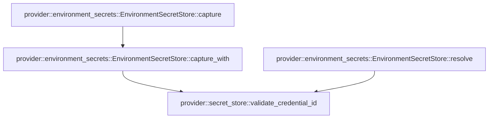

# provider::environment_secrets

[Package atlas](index.md) · [Source](../../src/environment_secrets.rs)

## Declarations

Visibility is the declaration spelling; trait members and reexports require their enclosing interface. `cfg` is not evaluated.

| Symbol | Kind | Visibility | Test / cfg |
|---|---|---|---|
| [provider::environment_secrets::EnvironmentSecretStore](../../src/environment_secrets.rs#L9) | struct_item | `pub` |  |
| [provider::environment_secrets::EnvironmentSecretStore::capture](../../src/environment_secrets.rs#L14) | function_item | `pub` |  |
| [provider::environment_secrets::EnvironmentSecretStore::capture_with](../../src/environment_secrets.rs#L20) | function_item | `private` |  |
| [provider::environment_secrets::EnvironmentSecretStore::resolve](../../src/environment_secrets.rs#L49) | function_item | `private` |  |
| [provider::environment_secrets::tests::captures_only_explicit_bindings_and_never_falls_back](../../src/environment_secrets.rs#L64) | function_item | `private` | test; #[cfg(test)] |
| [provider::environment_secrets::tests::missing_or_malformed_launch_credentials_fail_closed](../../src/environment_secrets.rs#L84) | function_item | `private` | test; #[cfg(test)] |

## Imports / reexports

| Local name | Source path | Visibility |
|---|---|---|
| `BTreeMap` | `std::collections::BTreeMap` | `private` |
| `Zeroize` | `zeroize::Zeroize` | `private` |
| `SecretRecord` | `crate::SecretRecord` | `private` |
| `SecretResolution` | `crate::SecretResolution` | `private` |
| `SecretStore` | `crate::SecretStore` | `private` |
| `SecretStoreError` | `crate::SecretStoreError` | `private` |
| `*` | `super::*` | `private` |

## Module declarations

| Module | Visibility | Attributes |
|---|---|---|
| `provider::environment_secrets::tests` | `private` | #[cfg(test)] |

## Function call graphs

Edges below are syntactically resolved calls only, including private functions. Graphs partition callers into groups of 20; they are not execution order. All unresolved sites are listed below and in the JSON inventory.

Functions 1–3: 3 direct edges

## Call sites

Includes test functions (marked in declarations). Receiver-type-required sites need type analysis/manual tracing. Calls in closures are attributed to their enclosing function; their occurrence here does not mean the closure executes immediately.

| Caller | Callee expression | Source lines | Target / classification |
|---|---|---|---|
| `capture` | `Self::capture_with` | [15](../../src/environment_secrets.rs#L15) | [provider::environment_secrets::EnvironmentSecretStore::capture_with](../../src/environment_secrets.rs#L20) |
| `capture` | `std::env::var(name).map_err` | [16](../../src/environment_secrets.rs#L16) | receiver-type-required |
| `capture` | `std::env::var` | [16](../../src/environment_secrets.rs#L16) | external-constructor-callback-or-unresolved |
| `capture_with` | `BTreeMap::new` | [24](../../src/environment_secrets.rs#L24) | external-constructor-callback-or-unresolved |
| `capture_with` | `super::secret_store::validate_credential_id` | [26](../../src/environment_secrets.rs#L26) | [provider::secret_store::validate_credential_id](../../src/secret_store.rs#L433) |
| `capture_with` | `name.is_empty` | [27](../../src/environment_secrets.rs#L27) | receiver-type-required |
| `capture_with` | `name.bytes().enumerate().all` | [28](../../src/environment_secrets.rs#L28) | receiver-type-required |
| `capture_with` | `name.bytes().enumerate` | [28](../../src/environment_secrets.rs#L28) | receiver-type-required |
| `capture_with` | `name.bytes` | [28](../../src/environment_secrets.rs#L28) | receiver-type-required |
| `capture_with` | `byte.is_ascii_alphabetic` | [30](../../src/environment_secrets.rs#L30) | receiver-type-required |
| `capture_with` | `byte.is_ascii_digit` | [31](../../src/environment_secrets.rs#L31) | receiver-type-required |
| `capture_with` | `Err` | [34](../../src/environment_secrets.rs#L34) | external-constructor-callback-or-unresolved |
| `capture_with` | `read` | [38](../../src/environment_secrets.rs#L38) | external-constructor-callback-or-unresolved |
| `capture_with` | `record.encode` | [40](../../src/environment_secrets.rs#L40) | receiver-type-required |
| `capture_with` | `encoded.zeroize` | [41](../../src/environment_secrets.rs#L41) | receiver-type-required |
| `capture_with` | `records.insert` | [42](../../src/environment_secrets.rs#L42) | receiver-type-required |
| `capture_with` | `id.clone` | [42](../../src/environment_secrets.rs#L42) | receiver-type-required |
| `capture_with` | `Ok` | [44](../../src/environment_secrets.rs#L44) | external-constructor-callback-or-unresolved |
| `resolve` | `super::secret_store::validate_credential_id` | [50](../../src/environment_secrets.rs#L50) | [provider::secret_store::validate_credential_id](../../src/secret_store.rs#L433) |
| `resolve` | `Ok` | [51](../../src/environment_secrets.rs#L51) | external-constructor-callback-or-unresolved |
| `resolve` | `self             .records             .get(credential_id)             .cloned()             .map_or` | [51](../../src/environment_secrets.rs#L51) | receiver-type-required |
| `resolve` | `self             .records             .get(credential_id)             .cloned` | [51](../../src/environment_secrets.rs#L51) | receiver-type-required |
| `resolve` | `self             .records             .get` | [51](../../src/environment_secrets.rs#L51) | receiver-type-required |
| `captures_only_explicit_bindings_and_never_falls_back` | `[("provider-key".into(), "TEKES_TEST_KEY".into())].into` | [65](../../src/environment_secrets.rs#L65) | receiver-type-required |
| `captures_only_explicit_bindings_and_never_falls_back` | `"provider-key".into` | [65](../../src/environment_secrets.rs#L65) | receiver-type-required |
| `captures_only_explicit_bindings_and_never_falls_back` | `"TEKES_TEST_KEY".into` | [65](../../src/environment_secrets.rs#L65) | receiver-type-required |
| `captures_only_explicit_bindings_and_never_falls_back` | `Vec::new` | [66](../../src/environment_secrets.rs#L66) | external-constructor-callback-or-unresolved |
| `captures_only_explicit_bindings_and_never_falls_back` | `EnvironmentSecretStore::capture_with(&bindings, &#124;name&#124; {             reads.push(name.to_owned());             Ok("synthetic-secret".into())         })         .unwrap` | [67](../../src/environment_secrets.rs#L67) | receiver-type-required |
| `captures_only_explicit_bindings_and_never_falls_back` | `EnvironmentSecretStore::capture_with` | [67](../../src/environment_secrets.rs#L67) | external-constructor-callback-or-unresolved |
| `captures_only_explicit_bindings_and_never_falls_back` | `reads.push` | [68](../../src/environment_secrets.rs#L68) | receiver-type-required |
| `captures_only_explicit_bindings_and_never_falls_back` | `name.to_owned` | [68](../../src/environment_secrets.rs#L68) | receiver-type-required |
| `captures_only_explicit_bindings_and_never_falls_back` | `Ok` | [69](../../src/environment_secrets.rs#L69) | external-constructor-callback-or-unresolved |
| `captures_only_explicit_bindings_and_never_falls_back` | `"synthetic-secret".into` | [69](../../src/environment_secrets.rs#L69) | receiver-type-required |
| `missing_or_malformed_launch_credentials_fail_closed` | `[("provider-key".into(), "TEKES_TEST_KEY".into())].into` | [85](../../src/environment_secrets.rs#L85) | receiver-type-required |
| `missing_or_malformed_launch_credentials_fail_closed` | `"provider-key".into` | [85](../../src/environment_secrets.rs#L85), [91](../../src/environment_secrets.rs#L91) | receiver-type-required |
| `missing_or_malformed_launch_credentials_fail_closed` | `"TEKES_TEST_KEY".into` | [85](../../src/environment_secrets.rs#L85) | receiver-type-required |
| `missing_or_malformed_launch_credentials_fail_closed` | `[("provider-key".into(), "1INVALID".into())].into` | [91](../../src/environment_secrets.rs#L91) | receiver-type-required |
| `missing_or_malformed_launch_credentials_fail_closed` | `"1INVALID".into` | [91](../../src/environment_secrets.rs#L91) | receiver-type-required |
