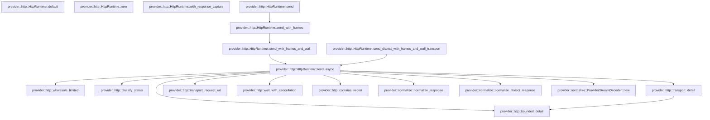

# provider::http

[Package atlas](index.md) · [Source](../../src/http.rs)

## Declarations

Visibility is the declaration spelling; trait members and reexports require their enclosing interface. `cfg` is not evaluated.

| Symbol | Kind | Visibility | Test / cfg |
|---|---|---|---|
| [provider::http::MAX_RESPONSE](../../src/http.rs#L16) | const_item | `private` |  |
| [provider::http::RESPONSE_IDLE](../../src/http.rs#L17) | const_item | `private` |  |
| [provider::http::HttpStatusClass](../../src/http.rs#L20) | enum_item | `pub` |  |
| [provider::http::wholesale_limited](../../src/http.rs#L32) | function_item | `pub` |  |
| [provider::http::classify_status](../../src/http.rs#L36) | function_item | `pub` |  |
| [provider::http::HttpRuntimeError](../../src/http.rs#L46) | enum_item | `pub` |  |
| [provider::http::HttpRuntime](../../src/http.rs#L55) | struct_item | `pub` |  |
| [provider::http::HttpRuntime::new](../../src/http.rs#L62) | function_item | `pub` |  |
| [provider::http::HttpRuntime::with_response_capture](../../src/http.rs#L83) | function_item | `pub` |  |
| [provider::http::HttpRuntime::send](../../src/http.rs#L88) | function_item | `pub` |  |
| [provider::http::HttpRuntime::send_with_frames](../../src/http.rs#L98) | function_item | `pub` |  |
| [provider::http::HttpRuntime::send_with_frames_and_wall](../../src/http.rs#L116) | function_item | `pub` |  |
| [provider::http::HttpRuntime::send_dialect_with_frames_and_wall_transport](../../src/http.rs#L142) | function_item | `pub` |  |
| [provider::http::HttpRuntime::send_async](../../src/http.rs#L165) | function_item | `private` |  |
| [provider::http::HttpRuntime::send_async::MAX_FAILURE_BODY](../../src/http.rs#L247) | const_item | `private` |  |
| [provider::http::transport_detail](../../src/http.rs#L506) | function_item | `private` |  |
| [provider::http::bounded_detail](../../src/http.rs#L529) | function_item | `private` |  |
| [provider::http::transport_request_url](../../src/http.rs#L543) | function_item | `private` |  |
| [provider::http::WaitResult](../../src/http.rs#L570) | enum_item | `private` |  |
| [provider::http::wait_with_cancellation](../../src/http.rs#L576) | function_item | `private` |  |
| [provider::http::contains_secret](../../src/http.rs#L597) | function_item | `private` |  |
| [provider::http::HttpRuntime::default](../../src/http.rs#L614) | function_item | `private` |  |
| [provider::http::wholesale_tests::cloudflare_wholesale_402_is_an_admission_limit_not_a_terminal_verdict](../../src/http.rs#L624) | function_item | `private` | test; #[cfg(test)] |

## Imports / reexports

| Local name | Source path | Visibility |
|---|---|---|
| `Arc` | `std::sync::Arc` | `private` |
| `AtomicBool` | `std::sync::atomic::AtomicBool` | `private` |
| `Ordering` | `std::sync::atomic::Ordering` | `private` |
| `Duration` | `std::time::Duration` | `private` |
| `Instant` | `std::time::Instant` | `private` |
| `StreamExt` | `futures_util::StreamExt` | `private` |
| `Client` | `reqwest::Client` | `private` |
| `StatusCode` | `reqwest::StatusCode` | `private` |
| `Policy` | `reqwest::redirect::Policy` | `private` |
| `Error` | `thiserror::Error` | `private` |
| `AdapterId` | `crate::AdapterId` | `private` |
| `DialectId` | `crate::DialectId` | `private` |
| `PreparedRequest` | `crate::PreparedRequest` | `private` |
| `ProviderCompletion` | `crate::ProviderCompletion` | `private` |
| `ProviderFailure` | `crate::ProviderFailure` | `private` |
| `ProviderFrame` | `crate::ProviderFrame` | `private` |
| `ProviderStreamDecoder` | `crate::ProviderStreamDecoder` | `private` |
| `normalize_dialect_response` | `crate::normalize_dialect_response` | `private` |
| `normalize_response` | `crate::normalize_response` | `private` |
| `HttpStatusClass` | `super::HttpStatusClass` | `private` |
| `classify_status` | `super::classify_status` | `private` |
| `wholesale_limited` | `super::wholesale_limited` | `private` |

## Module declarations

| Module | Visibility | Attributes |
|---|---|---|
| `provider::http::wholesale_tests` | `private` | #[cfg(test)] |

## Function call graphs

Edges below are syntactically resolved calls only, including private functions. Graphs partition callers into groups of 20; they are not execution order. All unresolved sites are listed below and in the JSON inventory.

Functions 1–15: 15 direct edges

## Call sites

Includes test functions (marked in declarations). Receiver-type-required sites need type analysis/manual tracing. Calls in closures are attributed to their enclosing function; their occurrence here does not mean the closure executes immediately.

| Caller | Callee expression | Source lines | Target / classification |
|---|---|---|---|
| `RESPONSE_IDLE` | `Duration::from_secs` | [17](../../src/http.rs#L17) | external-constructor-callback-or-unresolved |
| `wholesale_limited` | `body.to_ascii_lowercase().contains` | [33](../../src/http.rs#L33) | receiver-type-required |
| `wholesale_limited` | `body.to_ascii_lowercase` | [33](../../src/http.rs#L33) | receiver-type-required |
| `new` | `Client::builder()             .connect_timeout(Duration::from_secs(30))             .redirect(Policy::none())             .build()             .map_err` | [63](../../src/http.rs#L63) | receiver-type-required |
| `new` | `Client::builder()             .connect_timeout(Duration::from_secs(30))             .redirect(Policy::none())             .build` | [63](../../src/http.rs#L63) | receiver-type-required |
| `new` | `Client::builder()             .connect_timeout(Duration::from_secs(30))             .redirect` | [63](../../src/http.rs#L63) | receiver-type-required |
| `new` | `Client::builder()             .connect_timeout` | [63](../../src/http.rs#L63) | receiver-type-required |
| `new` | `Client::builder` | [63](../../src/http.rs#L63) | external-constructor-callback-or-unresolved |
| `new` | `Duration::from_secs` | [64](../../src/http.rs#L64) | external-constructor-callback-or-unresolved |
| `new` | `Policy::none` | [65](../../src/http.rs#L65) | external-constructor-callback-or-unresolved |
| `new` | `HttpRuntimeError::Request` | [67](../../src/http.rs#L67), [72](../../src/http.rs#L72) | external-constructor-callback-or-unresolved |
| `new` | `error.to_string` | [67](../../src/http.rs#L67), [72](../../src/http.rs#L72) | receiver-type-required |
| `new` | `tokio::runtime::Builder::new_current_thread()             .enable_io()             .enable_time()             .build()             .map_err` | [68](../../src/http.rs#L68) | receiver-type-required |
| `new` | `tokio::runtime::Builder::new_current_thread()             .enable_io()             .enable_time()             .build` | [68](../../src/http.rs#L68) | receiver-type-required |
| `new` | `tokio::runtime::Builder::new_current_thread()             .enable_io()             .enable_time` | [68](../../src/http.rs#L68) | receiver-type-required |
| `new` | `tokio::runtime::Builder::new_current_thread()             .enable_io` | [68](../../src/http.rs#L68) | receiver-type-required |
| `new` | `tokio::runtime::Builder::new_current_thread` | [68](../../src/http.rs#L68) | external-constructor-callback-or-unresolved |
| `new` | `Ok` | [73](../../src/http.rs#L73) | external-constructor-callback-or-unresolved |
| `with_response_capture` | `Some` | [84](../../src/http.rs#L84) | external-constructor-callback-or-unresolved |
| `send` | `self.send_with_frames` | [95](../../src/http.rs#L95) | [provider::http::HttpRuntime::send_with_frames](../../src/http.rs#L98) |
| `send` | `Ok` | [95](../../src/http.rs#L95) | external-constructor-callback-or-unresolved |
| `send_with_frames` | `self.send_with_frames_and_wall` | [106](../../src/http.rs#L106) | [provider::http::HttpRuntime::send_with_frames_and_wall](../../src/http.rs#L116) |
| `send_with_frames_and_wall` | `self.runtime.block_on` | [125](../../src/http.rs#L125) | receiver-type-required |
| `send_with_frames_and_wall` | `self.send_async` | [125](../../src/http.rs#L125) | [provider::http::HttpRuntime::send_async](../../src/http.rs#L165) |
| `send_dialect_with_frames_and_wall_transport` | `self.runtime.block_on` | [152](../../src/http.rs#L152) | receiver-type-required |
| `send_dialect_with_frames_and_wall_transport` | `self.send_async` | [152](../../src/http.rs#L152) | [provider::http::HttpRuntime::send_async](../../src/http.rs#L165) |
| `send_dialect_with_frames_and_wall_transport` | `dialect.family` | [153](../../src/http.rs#L153) | receiver-type-required |
| `send_dialect_with_frames_and_wall_transport` | `Some` | [154](../../src/http.rs#L154) | external-constructor-callback-or-unresolved |
| `send_async` | `capture                 .lock()                 .map_err(&#124;_&#124; HttpRuntimeError::Request("response capture lock poisoned".into()))?                 .clear` | [177](../../src/http.rs#L177) | receiver-type-required |
| `send_async` | `capture                 .lock()                 .map_err` | [177](../../src/http.rs#L177) | receiver-type-required |
| `send_async` | `capture                 .lock` | [177](../../src/http.rs#L177) | receiver-type-required |
| `send_async` | `HttpRuntimeError::Request` | [179](../../src/http.rs#L179), [189](../../src/http.rs#L189), [269](../../src/http.rs#L269), [436](../../src/http.rs#L436), [449](../../src/http.rs#L449) | external-constructor-callback-or-unresolved |
| `send_async` | `"response capture lock poisoned".into` | [179](../../src/http.rs#L179), [269](../../src/http.rs#L269), [436](../../src/http.rs#L436), [449](../../src/http.rs#L449) | receiver-type-required |
| `send_async` | `cancelled.load` | [182](../../src/http.rs#L182), [224](../../src/http.rs#L224), [381](../../src/http.rs#L381) | receiver-type-required |
| `send_async` | `Ok` | [183](../../src/http.rs#L183), [191](../../src/http.rs#L191), [214](../../src/http.rs#L214), [217](../../src/http.rs#L217), [237](../../src/http.rs#L237), [263](../../src/http.rs#L263), [281](../../src/http.rs#L281), [326](../../src/http.rs#L326), [382](../../src/http.rs#L382), [399](../../src/http.rs#L399), [409](../../src/http.rs#L409), [416](../../src/http.rs#L416), [423](../../src/http.rs#L423), [427](../../src/http.rs#L427), [440](../../src/http.rs#L440), [458](../../src/http.rs#L458), [478](../../src/http.rs#L478), [491](../../src/http.rs#L491), [498](../../src/http.rs#L498), [499](../../src/http.rs#L499) | external-constructor-callback-or-unresolved |
| `send_async` | `ProviderCompletion::Failure` | [183](../../src/http.rs#L183), [214](../../src/http.rs#L214), [217](../../src/http.rs#L217), [237](../../src/http.rs#L237), [263](../../src/http.rs#L263), [281](../../src/http.rs#L281), [339](../../src/http.rs#L339), [382](../../src/http.rs#L382), [399](../../src/http.rs#L399), [409](../../src/http.rs#L409), [416](../../src/http.rs#L416), [423](../../src/http.rs#L423), [427](../../src/http.rs#L427), [440](../../src/http.rs#L440), [458](../../src/http.rs#L458), [478](../../src/http.rs#L478), [499](../../src/http.rs#L499) | external-constructor-callback-or-unresolved |
| `send_async` | `wall.map` | [185](../../src/http.rs#L185) | receiver-type-required |
| `send_async` | `tokio::time::Instant::now` | [185](../../src/http.rs#L185), [386](../../src/http.rs#L386) | external-constructor-callback-or-unresolved |
| `send_async` | `prepared             .method             .parse()             .map_err` | [186](../../src/http.rs#L186) | receiver-type-required |
| `send_async` | `prepared             .method             .parse` | [186](../../src/http.rs#L186) | receiver-type-required |
| `send_async` | `transport_endpoint.map_or_else` | [190](../../src/http.rs#L190) | receiver-type-required |
| `send_async` | `prepared.url.clone` | [191](../../src/http.rs#L191) | receiver-type-required |
| `send_async` | `transport_request_url` | [192](../../src/http.rs#L192) | [provider::http::transport_request_url](../../src/http.rs#L543) |
| `send_async` | `self.client.request` | [194](../../src/http.rs#L194) | receiver-type-required |
| `send_async` | `request.header` | [196](../../src/http.rs#L196), [199](../../src/http.rs#L199), [202](../../src/http.rs#L202) | receiver-type-required |
| `send_async` | `credential.is_empty` | [201](../../src/http.rs#L201), [271](../../src/http.rs#L271), [316](../../src/http.rs#L316) | receiver-type-required |
| `send_async` | `request.body` | [207](../../src/http.rs#L207) | receiver-type-required |
| `send_async` | `prepared.body.clone` | [207](../../src/http.rs#L207) | receiver-type-required |
| `send_async` | `wall             .map(&#124;duration&#124; duration.min(RESPONSE_IDLE))             .unwrap_or` | [208](../../src/http.rs#L208) | receiver-type-required |
| `send_async` | `wall             .map` | [208](../../src/http.rs#L208) | receiver-type-required |
| `send_async` | `duration.min` | [209](../../src/http.rs#L209), [252](../../src/http.rs#L252) | receiver-type-required |
| `send_async` | `wait_with_cancellation` | [211](../../src/http.rs#L211), [254](../../src/http.rs#L254), [405](../../src/http.rs#L405) | [provider::http::wait_with_cancellation](../../src/http.rs#L576) |
| `send_async` | `request.send` | [211](../../src/http.rs#L211) | receiver-type-required |
| `send_async` | `"provider response header timed out".to_owned` | [219](../../src/http.rs#L219) | receiver-type-required |
| `send_async` | `error.is_builder` | [226](../../src/http.rs#L226) | receiver-type-required |
| `send_async` | `"provider request could not be constructed".to_owned` | [228](../../src/http.rs#L228) | receiver-type-required |
| `send_async` | `error.status().map` | [232](../../src/http.rs#L232) | receiver-type-required |
| `send_async` | `error.status` | [232](../../src/http.rs#L232) | receiver-type-required |
| `send_async` | `status.as_u16` | [232](../../src/http.rs#L232), [282](../../src/http.rs#L282), [284](../../src/http.rs#L284), [291](../../src/http.rs#L291), [297](../../src/http.rs#L297), [300](../../src/http.rs#L300), [328](../../src/http.rs#L328), [350](../../src/http.rs#L350) | receiver-type-required |
| `send_async` | `transport_detail` | [233](../../src/http.rs#L233), [411](../../src/http.rs#L411) | [provider::http::transport_detail](../../src/http.rs#L506) |
| `send_async` | `response.status` | [240](../../src/http.rs#L240) | receiver-type-required |
| `send_async` | `status.is_success` | [241](../../src/http.rs#L241) | receiver-type-required |
| `send_async` | `response                 .headers()                 .get(reqwest::header::RETRY_AFTER)                 .and_then(&#124;value&#124; value.to_str().ok())                 .and_then` | [242](../../src/http.rs#L242) | receiver-type-required |
| `send_async` | `response                 .headers()                 .get(reqwest::header::RETRY_AFTER)                 .and_then` | [242](../../src/http.rs#L242) | receiver-type-required |
| `send_async` | `response                 .headers()                 .get` | [242](../../src/http.rs#L242) | receiver-type-required |
| `send_async` | `response                 .headers` | [242](../../src/http.rs#L242) | receiver-type-required |
| `send_async` | `value.to_str().ok` | [245](../../src/http.rs#L245), [367](../../src/http.rs#L367) | receiver-type-required |
| `send_async` | `value.to_str` | [245](../../src/http.rs#L245), [367](../../src/http.rs#L367) | receiver-type-required |
| `send_async` | `value.parse::<u64>().ok` | [246](../../src/http.rs#L246) | receiver-type-required |
| `send_async` | `value.parse::<u64>` | [246](../../src/http.rs#L246) | receiver-type-required |
| `send_async` | `Vec::new` | [248](../../src/http.rs#L248), [375](../../src/http.rs#L375), [378](../../src/http.rs#L378) | external-constructor-callback-or-unresolved |
| `send_async` | `response.bytes_stream` | [249](../../src/http.rs#L249), [379](../../src/http.rs#L379) | receiver-type-required |
| `send_async` | `failure_body.len` | [250](../../src/http.rs#L250), [256](../../src/http.rs#L256) | receiver-type-required |
| `send_async` | `wall                     .map(&#124;duration&#124; duration.min(RESPONSE_IDLE))                     .unwrap_or` | [251](../../src/http.rs#L251) | receiver-type-required |
| `send_async` | `wall                     .map` | [251](../../src/http.rs#L251) | receiver-type-required |
| `send_async` | `body.next` | [254](../../src/http.rs#L254), [405](../../src/http.rs#L405) | receiver-type-required |
| `send_async` | `failure_body.extend_from_slice` | [257](../../src/http.rs#L257) | receiver-type-required |
| `send_async` | `chunk.len().min` | [257](../../src/http.rs#L257) | receiver-type-required |
| `send_async` | `chunk.len` | [257](../../src/http.rs#L257), [426](../../src/http.rs#L426) | receiver-type-required |
| `send_async` | `capture.lock().map_err` | [268](../../src/http.rs#L268) | receiver-type-required |
| `send_async` | `capture.lock` | [268](../../src/http.rs#L268) | receiver-type-required |
| `send_async` | `failure_body                         .windows(credential.len())                         .any` | [272](../../src/http.rs#L272) | receiver-type-required |
| `send_async` | `failure_body                         .windows` | [272](../../src/http.rs#L272) | receiver-type-required |
| `send_async` | `credential.len` | [273](../../src/http.rs#L273) | receiver-type-required |
| `send_async` | `credential.as_bytes` | [274](../../src/http.rs#L274), [377](../../src/http.rs#L377) | receiver-type-required |
| `send_async` | `captured.extend_from_slice` | [276](../../src/http.rs#L276) | receiver-type-required |
| `send_async` | `String::from_utf8_lossy(&failure_body).into_owned` | [279](../../src/http.rs#L279) | receiver-type-required |
| `send_async` | `String::from_utf8_lossy` | [279](../../src/http.rs#L279) | external-constructor-callback-or-unresolved |
| `send_async` | `bounded_detail` | [280](../../src/http.rs#L280), [459](../../src/http.rs#L459), [479](../../src/http.rs#L479), [500](../../src/http.rs#L500) | [provider::http::bounded_detail](../../src/http.rs#L529) |
| `send_async` | `classify_status` | [282](../../src/http.rs#L282) | [provider::http::classify_status](../../src/http.rs#L36) |
| `send_async` | `(!detail.is_empty()).then_some` | [285](../../src/http.rs#L285), [292](../../src/http.rs#L292), [301](../../src/http.rs#L301) | receiver-type-required |
| `send_async` | `detail.is_empty` | [285](../../src/http.rs#L285), [292](../../src/http.rs#L292), [301](../../src/http.rs#L301), [351](../../src/http.rs#L351) | receiver-type-required |
| `send_async` | `wholesale_limited` | [297](../../src/http.rs#L297) | [provider::http::wholesale_limited](../../src/http.rs#L32) |
| `send_async` | `status.is_redirection` | [305](../../src/http.rs#L305) | receiver-type-required |
| `send_async` | `body.contains` | [316](../../src/http.rs#L316) | receiver-type-required |
| `send_async` | `body.replace(credential, "[REDACTED]").into_bytes` | [317](../../src/http.rs#L317) | receiver-type-required |
| `send_async` | `body.replace` | [317](../../src/http.rs#L317) | receiver-type-required |
| `send_async` | `redacted.as_slice` | [318](../../src/http.rs#L318) | receiver-type-required |
| `send_async` | `failure_body.as_slice` | [320](../../src/http.rs#L320) | receiver-type-required |
| `send_async` | `dialect.map_or_else` | [322](../../src/http.rs#L322), [370](../../src/http.rs#L370), [493](../../src/http.rs#L493) | receiver-type-required |
| `send_async` | `normalize_response` | [323](../../src/http.rs#L323), [494](../../src/http.rs#L494) | [provider::normalize::normalize_response](../../src/normalize.rs#L182) |
| `send_async` | `normalize_dialect_response` | [324](../../src/http.rs#L324), [495](../../src/http.rs#L495) | [provider::normalize::normalize_dialect_response](../../src/normalize.rs#L216) |
| `send_async` | `Some` | [328](../../src/http.rs#L328), [350](../../src/http.rs#L350), [368](../../src/http.rs#L368) | external-constructor-callback-or-unresolved |
| `send_async` | `ProviderCompletion::Terminal` | [337](../../src/http.rs#L337), [491](../../src/http.rs#L491), [498](../../src/http.rs#L498) | external-constructor-callback-or-unresolved |
| `send_async` | `response             .headers()             .get(reqwest::header::CONTENT_TYPE)             .and_then(&#124;value&#124; value.to_str().ok())             .is_some_and` | [364](../../src/http.rs#L364) | receiver-type-required |
| `send_async` | `response             .headers()             .get(reqwest::header::CONTENT_TYPE)             .and_then` | [364](../../src/http.rs#L364) | receiver-type-required |
| `send_async` | `response             .headers()             .get` | [364](../../src/http.rs#L364) | receiver-type-required |
| `send_async` | `response             .headers` | [364](../../src/http.rs#L364) | receiver-type-required |
| `send_async` | `value.split(';').next` | [368](../../src/http.rs#L368) | receiver-type-required |
| `send_async` | `value.split` | [368](../../src/http.rs#L368) | receiver-type-required |
| `send_async` | `is_sse.then` | [369](../../src/http.rs#L369) | receiver-type-required |
| `send_async` | `ProviderStreamDecoder::new` | [371](../../src/http.rs#L371) | [provider::normalize::ProviderStreamDecoder::new](../../src/normalize.rs#L641) |
| `send_async` | `Instant::now` | [376](../../src/http.rs#L376), [467](../../src/http.rs#L467) | external-constructor-callback-or-unresolved |
| `send_async` | `RESPONSE_IDLE.saturating_sub` | [384](../../src/http.rs#L384) | receiver-type-required |
| `send_async` | `since_frame.elapsed` | [384](../../src/http.rs#L384) | receiver-type-required |
| `send_async` | `wall_deadline                 .map` | [385](../../src/http.rs#L385) | receiver-type-required |
| `send_async` | `deadline.saturating_duration_since` | [386](../../src/http.rs#L386) | receiver-type-required |
| `send_async` | `wall_remaining                 .map(&#124;remaining&#124; remaining.min(idle_remaining))                 .unwrap_or` | [387](../../src/http.rs#L387) | receiver-type-required |
| `send_async` | `wall_remaining                 .map` | [387](../../src/http.rs#L387) | receiver-type-required |
| `send_async` | `remaining.min` | [388](../../src/http.rs#L388) | receiver-type-required |
| `send_async` | `stream                     .as_ref()                     .and_then` | [394](../../src/http.rs#L394) | receiver-type-required |
| `send_async` | `stream                     .as_ref` | [394](../../src/http.rs#L394) | receiver-type-required |
| `send_async` | `wait.is_zero` | [398](../../src/http.rs#L398) | receiver-type-required |
| `send_async` | `"provider response exceeded its idle or wall deadline".to_owned` | [401](../../src/http.rs#L401) | receiver-type-required |
| `send_async` | `partial_fragments` | [402](../../src/http.rs#L402), [412](../../src/http.rs#L412), [419](../../src/http.rs#L419) | external-constructor-callback-or-unresolved |
| `send_async` | `"provider response stream timed out".to_owned` | [418](../../src/http.rs#L418) | receiver-type-required |
| `send_async` | `bytes.len().saturating_add` | [426](../../src/http.rs#L426) | receiver-type-required |
| `send_async` | `bytes.len` | [426](../../src/http.rs#L426) | receiver-type-required |
| `send_async` | `"provider response exceeded the byte limit".to_owned` | [428](../../src/http.rs#L428) | receiver-type-required |
| `send_async` | `secret.is_empty` | [431](../../src/http.rs#L431) | receiver-type-required |
| `send_async` | `contains_secret` | [431](../../src/http.rs#L431) | [provider::http::contains_secret](../../src/http.rs#L597) |
| `send_async` | `capture                         .lock()                         .map_err(&#124;_&#124; {                             HttpRuntimeError::Request("response capture lock poisoned".into())                         })?                         .clear` | [433](../../src/http.rs#L433) | receiver-type-required |
| `send_async` | `capture                         .lock()                         .map_err` | [433](../../src/http.rs#L433) | receiver-type-required |
| `send_async` | `capture                         .lock` | [433](../../src/http.rs#L433) | receiver-type-required |
| `send_async` | `"provider response contained credential material".to_owned` | [441](../../src/http.rs#L441) | receiver-type-required |
| `send_async` | `bytes.extend_from_slice` | [444](../../src/http.rs#L444) | receiver-type-required |
| `send_async` | `capture                     .lock()                     .map_err(&#124;_&#124; {                         HttpRuntimeError::Request("response capture lock poisoned".into())                     })?                     .extend_from_slice` | [446](../../src/http.rs#L446) | receiver-type-required |
| `send_async` | `capture                     .lock()                     .map_err` | [446](../../src/http.rs#L446) | receiver-type-required |
| `send_async` | `capture                     .lock` | [446](../../src/http.rs#L446) | receiver-type-required |
| `send_async` | `decoder.completed_events` | [454](../../src/http.rs#L454), [466](../../src/http.rs#L466) | receiver-type-required |
| `send_async` | `decoder.push` | [455](../../src/http.rs#L455) | receiver-type-required |
| `send_async` | `on_frame` | [470](../../src/http.rs#L470), [489](../../src/http.rs#L489) | external-constructor-callback-or-unresolved |
| `send_async` | `decoder.finish` | [475](../../src/http.rs#L475) | receiver-type-required |
| `transport_detail` | `Vec::new` | [510](../../src/http.rs#L510) | external-constructor-callback-or-unresolved |
| `transport_detail` | `error.source` | [511](../../src/http.rs#L511) | receiver-type-required |
| `transport_detail` | `causes.push` | [513](../../src/http.rs#L513) | receiver-type-required |
| `transport_detail` | `cause.to_string` | [513](../../src/http.rs#L513) | receiver-type-required |
| `transport_detail` | `causes.len` | [514](../../src/http.rs#L514) | receiver-type-required |
| `transport_detail` | `cause.source` | [517](../../src/http.rs#L517) | receiver-type-required |
| `transport_detail` | `error.is_timeout` | [519](../../src/http.rs#L519) | receiver-type-required |
| `transport_detail` | `error.is_connect` | [521](../../src/http.rs#L521) | receiver-type-required |
| `transport_detail` | `bounded_detail` | [526](../../src/http.rs#L526) | [provider::http::bounded_detail](../../src/http.rs#L529) |
| `bounded_detail` | `value         .replace(['\r', '\n', '\t'], " ")         .replace` | [530](../../src/http.rs#L530) | receiver-type-required |
| `bounded_detail` | `value         .replace` | [530](../../src/http.rs#L530) | receiver-type-required |
| `bounded_detail` | `secret.is_empty` | [533](../../src/http.rs#L533) | receiver-type-required |
| `bounded_detail` | `sanitized.replace` | [534](../../src/http.rs#L534) | receiver-type-required |
| `bounded_detail` | `sanitized.len().min` | [536](../../src/http.rs#L536) | receiver-type-required |
| `bounded_detail` | `sanitized.len` | [536](../../src/http.rs#L536) | receiver-type-required |
| `bounded_detail` | `sanitized.is_char_boundary` | [537](../../src/http.rs#L537) | receiver-type-required |
| `bounded_detail` | `sanitized[..end].to_owned` | [540](../../src/http.rs#L540) | receiver-type-required |
| `transport_request_url` | `reqwest::Url::parse(logical_url)         .map_err` | [547](../../src/http.rs#L547) | receiver-type-required |
| `transport_request_url` | `reqwest::Url::parse` | [547](../../src/http.rs#L547), [549](../../src/http.rs#L549) | external-constructor-callback-or-unresolved |
| `transport_request_url` | `HttpRuntimeError::Request` | [548](../../src/http.rs#L548), [550](../../src/http.rs#L550), [553](../../src/http.rs#L553), [562](../../src/http.rs#L562) | external-constructor-callback-or-unresolved |
| `transport_request_url` | `reqwest::Url::parse(endpoint).map_err` | [549](../../src/http.rs#L549) | receiver-type-required |
| `transport_request_url` | `transport.scheme` | [552](../../src/http.rs#L552) | receiver-type-required |
| `transport_request_url` | `transport.host_str` | [552](../../src/http.rs#L552) | receiver-type-required |
| `transport_request_url` | `Some` | [552](../../src/http.rs#L552), [567](../../src/http.rs#L567) | external-constructor-callback-or-unresolved |
| `transport_request_url` | `Err` | [553](../../src/http.rs#L553) | external-constructor-callback-or-unresolved |
| `transport_request_url` | `"transport override must be an http://127.0.0.1 endpoint".to_owned` | [554](../../src/http.rs#L554) | receiver-type-required |
| `transport_request_url` | `transport.set_path` | [557](../../src/http.rs#L557) | receiver-type-required |
| `transport_request_url` | `logical.path` | [557](../../src/http.rs#L557) | receiver-type-required |
| `transport_request_url` | `transport.set_query` | [558](../../src/http.rs#L558) | receiver-type-required |
| `transport_request_url` | `logical.query` | [558](../../src/http.rs#L558) | receiver-type-required |
| `transport_request_url` | `transport.set_fragment` | [559](../../src/http.rs#L559) | receiver-type-required |
| `transport_request_url` | `logical         .host_str()         .ok_or_else` | [560](../../src/http.rs#L560) | receiver-type-required |
| `transport_request_url` | `logical         .host_str` | [560](../../src/http.rs#L560) | receiver-type-required |
| `transport_request_url` | `"logical URL lacks host".to_owned` | [562](../../src/http.rs#L562) | receiver-type-required |
| `transport_request_url` | `logical.port` | [563](../../src/http.rs#L563) | receiver-type-required |
| `transport_request_url` | `host.to_owned` | [565](../../src/http.rs#L565) | receiver-type-required |
| `transport_request_url` | `Ok` | [567](../../src/http.rs#L567) | external-constructor-callback-or-unresolved |
| `transport_request_url` | `transport.to_string` | [567](../../src/http.rs#L567) | receiver-type-required |
| `wait_with_cancellation` | `tokio::time::sleep` | [582](../../src/http.rs#L582) | external-constructor-callback-or-unresolved |
| `contains_secret` | `secret.is_empty` | [598](../../src/http.rs#L598) | receiver-type-required |
| `contains_secret` | `Vec::with_capacity` | [601](../../src/http.rs#L601) | external-constructor-callback-or-unresolved |
| `contains_secret` | `tail.len` | [601](../../src/http.rs#L601) | receiver-type-required |
| `contains_secret` | `chunk.len` | [601](../../src/http.rs#L601) | receiver-type-required |
| `contains_secret` | `candidate.extend_from_slice` | [602](../../src/http.rs#L602), [603](../../src/http.rs#L603) | receiver-type-required |
| `contains_secret` | `candidate         .windows(secret.len())         .any` | [604](../../src/http.rs#L604) | receiver-type-required |
| `contains_secret` | `candidate         .windows` | [604](../../src/http.rs#L604) | receiver-type-required |
| `contains_secret` | `secret.len` | [605](../../src/http.rs#L605), [607](../../src/http.rs#L607) | receiver-type-required |
| `contains_secret` | `secret.len().saturating_sub(1).min` | [607](../../src/http.rs#L607) | receiver-type-required |
| `contains_secret` | `secret.len().saturating_sub` | [607](../../src/http.rs#L607) | receiver-type-required |
| `contains_secret` | `candidate.len` | [607](../../src/http.rs#L607), [609](../../src/http.rs#L609) | receiver-type-required |
| `contains_secret` | `tail.clear` | [608](../../src/http.rs#L608) | receiver-type-required |
| `contains_secret` | `tail.extend_from_slice` | [609](../../src/http.rs#L609) | receiver-type-required |
| `default` | `Self::new().expect` | [615](../../src/http.rs#L615) | receiver-type-required |
| `default` | `Self::new` | [615](../../src/http.rs#L615) | external-constructor-callback-or-unresolved |
