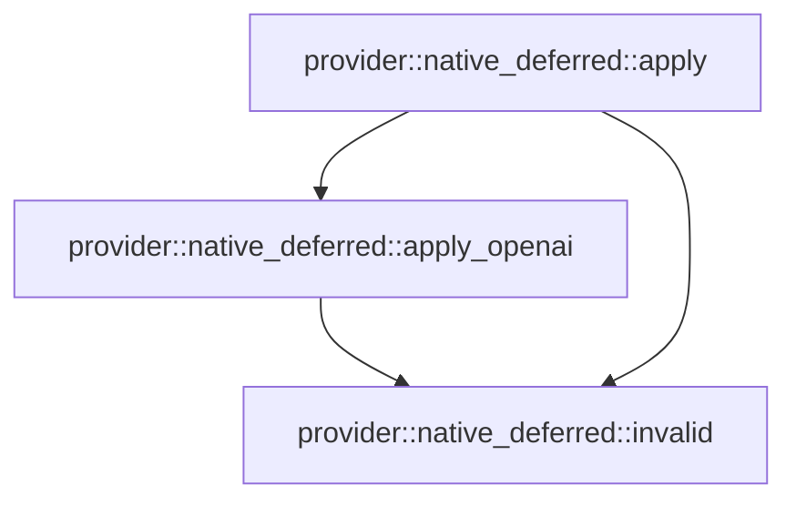

# provider::native_deferred

[Package atlas](index.md) · [Source](../../src/native_deferred.rs)

## Declarations

Visibility is the declaration spelling; trait members and reexports require their enclosing interface. `cfg` is not evaluated.

| Symbol | Kind | Visibility | Test / cfg |
|---|---|---|---|
| [provider::native_deferred::DeferredToolDefinition](../../src/native_deferred.rs#L9) | struct_item | `pub` |  |
| [provider::native_deferred::DeferredToolReference](../../src/native_deferred.rs#L15) | struct_item | `pub` |  |
| [provider::native_deferred::NativeDeferredTools](../../src/native_deferred.rs#L25) | struct_item | `pub` |  |
| [provider::native_deferred::invalid](../../src/native_deferred.rs#L32) | function_item | `private` |  |
| [provider::native_deferred::apply](../../src/native_deferred.rs#L36) | function_item | `pub(crate)` |  |
| [provider::native_deferred::apply_openai](../../src/native_deferred.rs#L188) | function_item | `private` |  |
| [provider::native_deferred::tests::fixture](../../src/native_deferred.rs#L276) | function_item | `private` | test; #[cfg(test)] |
| [provider::native_deferred::tests::custom_reference_preserves_call_identity_and_binds_declared_schema](../../src/native_deferred.rs#L301) | function_item | `private` | test; #[cfg(test)] |
| [provider::native_deferred::tests::references_reject_stale_catalog_digest_and_call_binding](../../src/native_deferred.rs#L312) | function_item | `private` | test; #[cfg(test)] |
| [provider::native_deferred::tests::openai_client_search_uses_native_output_and_rejects_unbound_replay](../../src/native_deferred.rs#L344) | function_item | `private` | test; #[cfg(test)] |
| [provider::native_deferred::tests::initial_catalog_defers_without_fabricating_references](../../src/native_deferred.rs#L388) | function_item | `private` | test; #[cfg(test)] |

## Imports / reexports

| Local name | Source path | Visibility |
|---|---|---|
| `DialectId` | `crate::DialectId` | `private` |
| `PrepareError` | `crate::PrepareError` | `private` |
| `IJsonValue` | `schema::IJsonValue` | `private` |
| `Value` | `serde_json::Value` | `private` |
| `json` | `serde_json::json` | `private` |
| `Digest` | `sha2::Digest` | `private` |
| `Sha256` | `sha2::Sha256` | `private` |
| `BTreeMap` | `std::collections::BTreeMap` | `private` |
| `BTreeSet` | `std::collections::BTreeSet` | `private` |
| `*` | `super::*` | `private` |

## Module declarations

| Module | Visibility | Attributes |
|---|---|---|
| `provider::native_deferred::tests` | `private` | #[cfg(test)] |

## Function call graphs

Edges below are syntactically resolved calls only, including private functions. Graphs partition callers into groups of 20; they are not execution order. All unresolved sites are listed below and in the JSON inventory.

Functions 1–3: 3 direct edges

## Call sites

Includes test functions (marked in declarations). Receiver-type-required sites need type analysis/manual tracing. Calls in closures are attributed to their enclosing function; their occurrence here does not mean the closure executes immediately.

| Caller | Callee expression | Source lines | Target / classification |
|---|---|---|---|
| `invalid` | `PrepareError::InvalidJson` | [33](../../src/native_deferred.rs#L33) | external-constructor-callback-or-unresolved |
| `apply` | `Err` | [46](../../src/native_deferred.rs#L46), [51](../../src/native_deferred.rs#L51), [64](../../src/native_deferred.rs#L64), [93](../../src/native_deferred.rs#L93), [104](../../src/native_deferred.rs#L104), [125](../../src/native_deferred.rs#L125), [152](../../src/native_deferred.rs#L152), [158](../../src/native_deferred.rs#L158), [167](../../src/native_deferred.rs#L167), [174](../../src/native_deferred.rs#L174) | external-constructor-callback-or-unresolved |
| `apply` | `invalid` | [46](../../src/native_deferred.rs#L46), [51](../../src/native_deferred.rs#L51), [57](../../src/native_deferred.rs#L57), [62](../../src/native_deferred.rs#L62), [64](../../src/native_deferred.rs#L64), [70](../../src/native_deferred.rs#L70), [73](../../src/native_deferred.rs#L73), [93](../../src/native_deferred.rs#L93), [104](../../src/native_deferred.rs#L104), [108](../../src/native_deferred.rs#L108), [125](../../src/native_deferred.rs#L125), [139](../../src/native_deferred.rs#L139), [152](../../src/native_deferred.rs#L152), [158](../../src/native_deferred.rs#L158), [167](../../src/native_deferred.rs#L167), [174](../../src/native_deferred.rs#L174) | [provider::native_deferred::invalid](../../src/native_deferred.rs#L32) |
| `apply` | `native.catalog_revision.is_empty` | [50](../../src/native_deferred.rs#L50) | receiver-type-required |
| `apply` | `native.search_tool_name.is_empty` | [50](../../src/native_deferred.rs#L50) | receiver-type-required |
| `apply` | `catalog         .as_array()         .ok_or_else` | [55](../../src/native_deferred.rs#L55) | receiver-type-required |
| `apply` | `catalog         .as_array` | [55](../../src/native_deferred.rs#L55) | receiver-type-required |
| `apply` | `BTreeSet::new` | [58](../../src/native_deferred.rs#L58), [118](../../src/native_deferred.rs#L118) | external-constructor-callback-or-unresolved |
| `apply` | `schema["name"]             .as_str()             .ok_or_else` | [60](../../src/native_deferred.rs#L60), [71](../../src/native_deferred.rs#L71) | receiver-type-required |
| `apply` | `schema["name"]             .as_str` | [60](../../src/native_deferred.rs#L60), [71](../../src/native_deferred.rs#L71) | receiver-type-required |
| `apply` | `catalog_names.insert` | [63](../../src/native_deferred.rs#L63) | receiver-type-required |
| `apply` | `BTreeMap::new` | [67](../../src/native_deferred.rs#L67), [117](../../src/native_deferred.rs#L117) | external-constructor-callback-or-unresolved |
| `apply` | `serde_json::to_value(&definition.schema).map_err` | [70](../../src/native_deferred.rs#L70) | receiver-type-required |
| `apply` | `serde_json::to_value` | [70](../../src/native_deferred.rs#L70) | external-constructor-callback-or-unresolved |
| `apply` | `schema["name"]             .as_str()             .ok_or_else(&#124;&#124; invalid("schema has no name"))?             .to_owned` | [71](../../src/native_deferred.rs#L71) | receiver-type-required |
| `apply` | `schemas                 .iter()                 .filter(&#124;candidate&#124; **candidate == schema)                 .count` | [86](../../src/native_deferred.rs#L86) | receiver-type-required |
| `apply` | `schemas                 .iter()                 .filter` | [86](../../src/native_deferred.rs#L86) | receiver-type-required |
| `apply` | `schemas                 .iter` | [86](../../src/native_deferred.rs#L86) | receiver-type-required |
| `apply` | `definitions.insert(name, digest).is_some` | [91](../../src/native_deferred.rs#L91) | receiver-type-required |
| `apply` | `definitions.insert` | [91](../../src/native_deferred.rs#L91) | receiver-type-required |
| `apply` | `schemas         .iter()         .filter(&#124;s&#124; s["name"] == native.search_tool_name)         .count` | [98](../../src/native_deferred.rs#L98) | receiver-type-required |
| `apply` | `schemas         .iter()         .filter` | [98](../../src/native_deferred.rs#L98) | receiver-type-required |
| `apply` | `schemas         .iter` | [98](../../src/native_deferred.rs#L98) | receiver-type-required |
| `apply` | `body["tools"]         .as_array_mut()         .ok_or_else` | [106](../../src/native_deferred.rs#L106) | receiver-type-required |
| `apply` | `body["tools"]         .as_array_mut` | [106](../../src/native_deferred.rs#L106) | receiver-type-required |
| `apply` | `tool["name"]             .as_str()             .is_some_and` | [110](../../src/native_deferred.rs#L110) | receiver-type-required |
| `apply` | `tool["name"]             .as_str` | [110](../../src/native_deferred.rs#L110) | receiver-type-required |
| `apply` | `definitions.contains_key` | [112](../../src/native_deferred.rs#L112) | receiver-type-required |
| `apply` | `Value::Bool` | [114](../../src/native_deferred.rs#L114) | external-constructor-callback-or-unresolved |
| `apply` | `definitions.get` | [121](../../src/native_deferred.rs#L121) | receiver-type-required |
| `apply` | `Some` | [121](../../src/native_deferred.rs#L121) | external-constructor-callback-or-unresolved |
| `apply` | `reference.source_search_call_id.is_empty` | [122](../../src/native_deferred.rs#L122) | receiver-type-required |
| `apply` | `seen.insert` | [123](../../src/native_deferred.rs#L123) | receiver-type-required |
| `apply` | `grouped             .entry(&reference.source_search_call_id)             .or_default()             .push` | [129](../../src/native_deferred.rs#L129) | receiver-type-required |
| `apply` | `grouped             .entry(&reference.source_search_call_id)             .or_default` | [129](../../src/native_deferred.rs#L129) | receiver-type-required |
| `apply` | `grouped             .entry` | [129](../../src/native_deferred.rs#L129) | receiver-type-required |
| `apply` | `apply_openai` | [135](../../src/native_deferred.rs#L135) | [provider::native_deferred::apply_openai](../../src/native_deferred.rs#L188) |
| `apply` | `body["messages"]         .as_array_mut()         .ok_or_else` | [137](../../src/native_deferred.rs#L137) | receiver-type-required |
| `apply` | `body["messages"]         .as_array_mut` | [137](../../src/native_deferred.rs#L137) | receiver-type-required |
| `apply` | `Vec::new` | [141](../../src/native_deferred.rs#L141), [142](../../src/native_deferred.rs#L142) | external-constructor-callback-or-unresolved |
| `apply` | `messages.iter().enumerate` | [143](../../src/native_deferred.rs#L143) | receiver-type-required |
| `apply` | `messages.iter` | [143](../../src/native_deferred.rs#L143) | receiver-type-required |
| `apply` | `message["content"]                 .as_array()                 .into_iter()                 .flatten()                 .enumerate` | [144](../../src/native_deferred.rs#L144) | receiver-type-required |
| `apply` | `message["content"]                 .as_array()                 .into_iter()                 .flatten` | [144](../../src/native_deferred.rs#L144) | receiver-type-required |
| `apply` | `message["content"]                 .as_array()                 .into_iter` | [144](../../src/native_deferred.rs#L144) | receiver-type-required |
| `apply` | `message["content"]                 .as_array` | [144](../../src/native_deferred.rs#L144) | receiver-type-required |
| `apply` | `calls.push` | [154](../../src/native_deferred.rs#L154) | receiver-type-required |
| `apply` | `results.push` | [162](../../src/native_deferred.rs#L162) | receiver-type-required |
| `apply` | `calls.len` | [166](../../src/native_deferred.rs#L166) | receiver-type-required |
| `apply` | `results.len` | [166](../../src/native_deferred.rs#L166) | receiver-type-required |
| `apply` | `result["content"].is_string` | [173](../../src/native_deferred.rs#L173) | receiver-type-required |
| `apply` | `Value::Array` | [178](../../src/native_deferred.rs#L178) | external-constructor-callback-or-unresolved |
| `apply` | `names                 .into_iter()                 .map(&#124;name&#124; json!({"type":"tool_reference","tool_name":name}))                 .collect` | [179](../../src/native_deferred.rs#L179) | receiver-type-required |
| `apply` | `names                 .into_iter()                 .map` | [179](../../src/native_deferred.rs#L179) | receiver-type-required |
| `apply` | `names                 .into_iter` | [179](../../src/native_deferred.rs#L179) | receiver-type-required |
| `apply` | `Ok` | [185](../../src/native_deferred.rs#L185) | external-constructor-callback-or-unresolved |
| `apply_openai` | `body.get("previous_response_id").is_some` | [194](../../src/native_deferred.rs#L194) | receiver-type-required |
| `apply_openai` | `body.get` | [194](../../src/native_deferred.rs#L194) | receiver-type-required |
| `apply_openai` | `Err` | [195](../../src/native_deferred.rs#L195), [241](../../src/native_deferred.rs#L241), [250](../../src/native_deferred.rs#L250) | external-constructor-callback-or-unresolved |
| `apply_openai` | `invalid` | [195](../../src/native_deferred.rs#L195), [202](../../src/native_deferred.rs#L202), [220](../../src/native_deferred.rs#L220), [224](../../src/native_deferred.rs#L224), [241](../../src/native_deferred.rs#L241), [250](../../src/native_deferred.rs#L250) | [provider::native_deferred::invalid](../../src/native_deferred.rs#L32) |
| `apply_openai` | `body["tools"]         .as_array_mut()         .ok_or_else` | [200](../../src/native_deferred.rs#L200) | receiver-type-required |
| `apply_openai` | `body["tools"]         .as_array_mut` | [200](../../src/native_deferred.rs#L200) | receiver-type-required |
| `apply_openai` | `BTreeMap::new` | [203](../../src/native_deferred.rs#L203) | external-constructor-callback-or-unresolved |
| `apply_openai` | `tools.iter` | [204](../../src/native_deferred.rs#L204) | receiver-type-required |
| `apply_openai` | `tool["name"]             .as_str()             .is_some_and` | [205](../../src/native_deferred.rs#L205), [213](../../src/native_deferred.rs#L213) | receiver-type-required |
| `apply_openai` | `tool["name"]             .as_str` | [205](../../src/native_deferred.rs#L205), [213](../../src/native_deferred.rs#L213) | receiver-type-required |
| `apply_openai` | `definitions.contains_key` | [207](../../src/native_deferred.rs#L207), [215](../../src/native_deferred.rs#L215) | receiver-type-required |
| `apply_openai` | `loaded.insert` | [209](../../src/native_deferred.rs#L209) | receiver-type-required |
| `apply_openai` | `tool["name"].as_str().unwrap().to_owned` | [209](../../src/native_deferred.rs#L209) | receiver-type-required |
| `apply_openai` | `tool["name"].as_str().unwrap` | [209](../../src/native_deferred.rs#L209) | receiver-type-required |
| `apply_openai` | `tool["name"].as_str` | [209](../../src/native_deferred.rs#L209) | receiver-type-required |
| `apply_openai` | `tool.clone` | [209](../../src/native_deferred.rs#L209) | receiver-type-required |
| `apply_openai` | `tools.retain` | [212](../../src/native_deferred.rs#L212) | receiver-type-required |
| `apply_openai` | `tools         .iter_mut()         .find(&#124;tool&#124; tool["name"] == native.search_tool_name)         .ok_or_else` | [217](../../src/native_deferred.rs#L217) | receiver-type-required |
| `apply_openai` | `tools         .iter_mut()         .find` | [217](../../src/native_deferred.rs#L217) | receiver-type-required |
| `apply_openai` | `tools         .iter_mut` | [217](../../src/native_deferred.rs#L217) | receiver-type-required |
| `apply_openai` | `body["input"]         .as_array_mut()         .ok_or_else` | [222](../../src/native_deferred.rs#L222) | receiver-type-required |
| `apply_openai` | `body["input"]         .as_array_mut` | [222](../../src/native_deferred.rs#L222) | receiver-type-required |
| `apply_openai` | `items             .iter()             .enumerate()             .filter(&#124;(_, item)&#124; item["type"] == "tool_search_call" && item["call_id"] == call_id)             .map(&#124;(i, _)&#124; i)             .collect::<Vec<_>>` | [226](../../src/native_deferred.rs#L226) | receiver-type-required |
| `apply_openai` | `items             .iter()             .enumerate()             .filter(&#124;(_, item)&#124; item["type"] == "tool_search_call" && item["call_id"] == call_id)             .map` | [226](../../src/native_deferred.rs#L226) | receiver-type-required |
| `apply_openai` | `items             .iter()             .enumerate()             .filter` | [226](../../src/native_deferred.rs#L226), [232](../../src/native_deferred.rs#L232) | receiver-type-required |
| `apply_openai` | `items             .iter()             .enumerate` | [226](../../src/native_deferred.rs#L226), [232](../../src/native_deferred.rs#L232) | receiver-type-required |
| `apply_openai` | `items             .iter` | [226](../../src/native_deferred.rs#L226), [232](../../src/native_deferred.rs#L232) | receiver-type-required |
| `apply_openai` | `items             .iter()             .enumerate()             .filter(&#124;(_, item)&#124; {                 item["type"] == "function_call_output" && item["call_id"] == call_id             })             .map(&#124;(i, _)&#124; i)             .collect::<Vec<_>>` | [232](../../src/native_deferred.rs#L232) | receiver-type-required |
| `apply_openai` | `items             .iter()             .enumerate()             .filter(&#124;(_, item)&#124; {                 item["type"] == "function_call_output" && item["call_id"] == call_id             })             .map` | [232](../../src/native_deferred.rs#L232) | receiver-type-required |
| `apply_openai` | `calls.len` | [240](../../src/native_deferred.rs#L240) | receiver-type-required |
| `apply_openai` | `results.len` | [240](../../src/native_deferred.rs#L240) | receiver-type-required |
| `apply_openai` | `call["arguments"].is_object` | [248](../../src/native_deferred.rs#L248) | receiver-type-required |
| `apply_openai` | `items         .iter()         .filter(&#124;item&#124; item["type"] == "tool_search_call")         .map(&#124;item&#124; item["call_id"].clone())         .collect::<Vec<_>>` | [257](../../src/native_deferred.rs#L257) | receiver-type-required |
| `apply_openai` | `items         .iter()         .filter(&#124;item&#124; item["type"] == "tool_search_call")         .map` | [257](../../src/native_deferred.rs#L257) | receiver-type-required |
| `apply_openai` | `items         .iter()         .filter` | [257](../../src/native_deferred.rs#L257) | receiver-type-required |
| `apply_openai` | `items         .iter` | [257](../../src/native_deferred.rs#L257) | receiver-type-required |
| `apply_openai` | `item["call_id"].clone` | [260](../../src/native_deferred.rs#L260) | receiver-type-required |
| `apply_openai` | `items         .iter_mut()         .filter` | [262](../../src/native_deferred.rs#L262) | receiver-type-required |
| `apply_openai` | `items         .iter_mut` | [262](../../src/native_deferred.rs#L262) | receiver-type-required |
| `apply_openai` | `searched.contains` | [266](../../src/native_deferred.rs#L266) | receiver-type-required |
| `apply_openai` | `Ok` | [270](../../src/native_deferred.rs#L270) | external-constructor-callback-or-unresolved |
| `fixture` | `IJsonValue::parse_str(r#"{"description":"Shipping ETA","name":"get_shipping_eta","parameters":{"additionalProperties":false,"properties":{"order_id":{"type":"string"}},"required":["order_id"],"type":"object"}}"#).unwrap` | [277](../../src/native_deferred.rs#L277) | receiver-type-required |
| `fixture` | `IJsonValue::parse_str` | [277](../../src/native_deferred.rs#L277) | external-constructor-callback-or-unresolved |
| `fixture` | `"catalog-v1".into` | [283](../../src/native_deferred.rs#L283) | receiver-type-required |
| `fixture` | `"tool_search".into` | [284](../../src/native_deferred.rs#L284) | receiver-type-required |
| `custom_reference_preserves_call_identity_and_binds_declared_schema` | `fixture` | [302](../../src/native_deferred.rs#L302) | [provider::native_deferred::tests::fixture](../../src/native_deferred.rs#L276) |
| `custom_reference_preserves_call_identity_and_binds_declared_schema` | `apply(DialectId::AnthropicMessagesV1, &catalog, &mut body, &native).unwrap` | [303](../../src/native_deferred.rs#L303) | receiver-type-required |
| `custom_reference_preserves_call_identity_and_binds_declared_schema` | `apply` | [303](../../src/native_deferred.rs#L303) | external-constructor-callback-or-unresolved |
| `references_reject_stale_catalog_digest_and_call_binding` | `fixture` | [324](../../src/native_deferred.rs#L324) | [provider::native_deferred::tests::fixture](../../src/native_deferred.rs#L276) |
| `references_reject_stale_catalog_digest_and_call_binding` | `"stale".into` | [326](../../src/native_deferred.rs#L326), [327](../../src/native_deferred.rs#L327) | receiver-type-required |
| `references_reject_stale_catalog_digest_and_call_binding` | `"other".into` | [328](../../src/native_deferred.rs#L328), [329](../../src/native_deferred.rs#L329) | receiver-type-required |
| `references_reject_stale_catalog_digest_and_call_binding` | `native.references.push` | [330](../../src/native_deferred.rs#L330) | receiver-type-required |
| `references_reject_stale_catalog_digest_and_call_binding` | `native.references[0].clone` | [330](../../src/native_deferred.rs#L330) | receiver-type-required |
| `references_reject_stale_catalog_digest_and_call_binding` | `body["messages"].as_array_mut().unwrap().swap` | [334](../../src/native_deferred.rs#L334) | receiver-type-required |
| `references_reject_stale_catalog_digest_and_call_binding` | `body["messages"].as_array_mut().unwrap` | [334](../../src/native_deferred.rs#L334) | receiver-type-required |
| `references_reject_stale_catalog_digest_and_call_binding` | `body["messages"].as_array_mut` | [334](../../src/native_deferred.rs#L334) | receiver-type-required |
| `openai_client_search_uses_native_output_and_rejects_unbound_replay` | `fixture` | [345](../../src/native_deferred.rs#L345) | [provider::native_deferred::tests::fixture](../../src/native_deferred.rs#L276) |
| `openai_client_search_uses_native_output_and_rejects_unbound_replay` | `original.clone` | [347](../../src/native_deferred.rs#L347), [363](../../src/native_deferred.rs#L363), [377](../../src/native_deferred.rs#L377) | receiver-type-required |
| `openai_client_search_uses_native_output_and_rejects_unbound_replay` | `apply(DialectId::OpenaiResponsesV1, &catalog, &mut body, &native).unwrap` | [348](../../src/native_deferred.rs#L348) | receiver-type-required |
| `openai_client_search_uses_native_output_and_rejects_unbound_replay` | `apply` | [348](../../src/native_deferred.rs#L348), [380](../../src/native_deferred.rs#L380) | external-constructor-callback-or-unresolved |
| `openai_client_search_uses_native_output_and_rejects_unbound_replay` | `native.clone` | [378](../../src/native_deferred.rs#L378) | receiver-type-required |
| `openai_client_search_uses_native_output_and_rejects_unbound_replay` | `unbound.references.clear` | [379](../../src/native_deferred.rs#L379) | receiver-type-required |
| `openai_client_search_uses_native_output_and_rejects_unbound_replay` | `apply(DialectId::OpenaiResponsesV1, &catalog, &mut body, &unbound).unwrap` | [380](../../src/native_deferred.rs#L380) | receiver-type-required |
| `initial_catalog_defers_without_fabricating_references` | `fixture` | [389](../../src/native_deferred.rs#L389) | [provider::native_deferred::tests::fixture](../../src/native_deferred.rs#L276) |
| `initial_catalog_defers_without_fabricating_references` | `native.references.clear` | [390](../../src/native_deferred.rs#L390) | receiver-type-required |
| `initial_catalog_defers_without_fabricating_references` | `apply(DialectId::AnthropicMessagesV1, &catalog, &mut body, &native).unwrap` | [392](../../src/native_deferred.rs#L392) | receiver-type-required |
| `initial_catalog_defers_without_fabricating_references` | `apply` | [392](../../src/native_deferred.rs#L392) | external-constructor-callback-or-unresolved |
