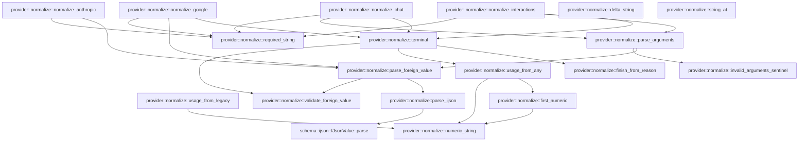

```mermaid
flowchart TD
  n0["provider::normalize::StreamAccumulator::interactions"]
  n1["provider::normalize::StreamAccumulator::record_native_search_call"]
  n2["provider::normalize::StreamAccumulator::anthropic"]
  n3["provider::normalize::StreamAccumulator::chat"]
  n4["provider::normalize::StreamAccumulator::google"]
  n5["provider::normalize::StreamAccumulator::push_text"]
  n6["provider::normalize::StreamAccumulator::push_reasoning"]
  n7["provider::normalize::append_string_field"]
  n8["provider::normalize::append_map_string"]
  n9["provider::normalize::append_interaction_content"]
  n10["provider::normalize::merge_delta_fields"]
  n11["provider::normalize::merge_chat_tool_delta"]
  n12["provider::normalize::upsert_response_part"]
  n13["provider::normalize::append_response_part_text"]
  n14["provider::normalize::optional_usize"]
  n15["provider::normalize::required_index"]
  n16["provider::normalize::merge_usage"]
  n17["provider::normalize::finish_from_reason"]
  n18["provider::normalize::native_search_call"]
  n19["provider::normalize::usage_from_any"]
  n20["provider::normalize::parse_ijson"]
  n21["provider::normalize::validate_foreign_value"]
  n22["provider::normalize::delta_string"]
  n23["provider::normalize::required_string"]
  n24["provider::normalize::repair_tool_arguments"]
  n25["provider::normalize::is_context_overflow"]
  n26["provider::normalize::ProviderStreamDecoder::completed_events"]
  n27["provider::normalize::ProviderStreamDecoder::completed_fragments"]
  n28["provider::normalize::ProviderStreamDecoder::push"]
  n29["provider::normalize::ProviderStreamDecoder::finish"]
  n30["provider::normalize::ProviderStreamDecoder::consume"]
  n31["provider::normalize::validate_completed_response_call"]
  n32["provider::normalize::invalid_arguments_sentinel"]
  n33["provider::normalize::invalid_arguments_detail"]
  n34["provider::normalize::resolve_call_arguments_or_sentinel"]
  n35["provider::normalize::resolve_call_arguments"]
  n36["provider::normalize::StreamAccumulator::mark_call_ready"]
  n37["provider::normalize::StreamAccumulator::completed_fragments"]
  n38["provider::normalize::StreamAccumulator::consume"]
  n39["provider::normalize::StreamAccumulator::responses"]
  n0 --> n5
  n0 --> n6
  n0 --> n9
  n0 --> n10
  n0 --> n15
  n0 --> n17
  n0 --> n19
  n0 --> n22
  n0 --> n23
  n0 --> n25
  n0 --> n36
  n1 --> n18
  n2 --> n5
  n2 --> n6
  n2 --> n7
  n2 --> n10
  n2 --> n15
  n2 --> n16
  n2 --> n17
  n2 --> n19
  n2 --> n22
  n2 --> n23
  n2 --> n36
  n3 --> n5
  n3 --> n6
  n3 --> n8
  n3 --> n11
  n3 --> n17
  n3 --> n19
  n3 --> n36
  n4 --> n5
  n4 --> n6
  n4 --> n17
  n4 --> n19
  n4 --> n23
  n4 --> n36
  n28 --> n30
  n29 --> n30
  n30 --> n20
  n31 --> n20
  n31 --> n23
  n34 --> n32
  n34 --> n35
  n35 --> n20
  n35 --> n21
  n35 --> n24
  n36 --> n34
  n37 --> n34
  n38 --> n0
  n38 --> n2
  n38 --> n3
  n38 --> n4
  n38 --> n19
  n38 --> n39
  n39 --> n1
  n39 --> n5
  n39 --> n6
  n39 --> n12
  n39 --> n13
  n39 --> n14
  n39 --> n17
  n39 --> n19
  n39 --> n22
  n39 --> n23
  n39 --> n31
  n39 --> n36
```

# provider::normalize

[Package atlas](index.md) · [Source](../../src/normalize.rs)

## Declarations

Visibility is the declaration spelling; trait members and reexports require their enclosing interface. `cfg` is not evaluated.

| Symbol | Kind | Visibility | Test / cfg |
|---|---|---|---|
| [provider::normalize::ContentBlock](../../src/normalize.rs#L10) | enum_item | `pub` |  |
| [provider::normalize::ToolCall](../../src/normalize.rs#L16) | struct_item | `pub` |  |
| [provider::normalize::Usage](../../src/normalize.rs#L23) | struct_item | `pub` |  |
| [provider::normalize::FinishReason](../../src/normalize.rs#L39) | enum_item | `pub` |  |
| [provider::normalize::ProviderTerminal](../../src/normalize.rs#L52) | struct_item | `pub` |  |
| [provider::normalize::ProviderTerminal::is_final_answer](../../src/normalize.rs#L81) | function_item | `pub` |  |
| [provider::normalize::ProviderFailure](../../src/normalize.rs#L129) | enum_item | `pub` |  |
| [provider::normalize::ProviderCompletion](../../src/normalize.rs#L160) | enum_item | `pub` |  |
| [provider::normalize::ProviderFrame](../../src/normalize.rs#L166) | enum_item | `pub` |  |
| [provider::normalize::normalize_response](../../src/normalize.rs#L182) | function_item | `pub` |  |
| [provider::normalize::normalize_dialect_response](../../src/normalize.rs#L216) | function_item | `pub` |  |
| [provider::normalize::validate_responses_output_container](../../src/normalize.rs#L290) | function_item | `private` |  |
| [provider::normalize::validate_exact_anthropic_payload](../../src/normalize.rs#L297) | function_item | `private` |  |
| [provider::normalize::repair_response_argument_strings](../../src/normalize.rs#L310) | function_item | `private` |  |
| [provider::normalize::repair_tool_arguments](../../src/normalize.rs#L347) | function_item | `pub` |  |
| [provider::normalize::repair_bare_object_values](../../src/normalize.rs#L370) | function_item | `private` |  |
| [provider::normalize::repair_bare_object_values::skip_whitespace](../../src/normalize.rs#L375) | function_item | `private` |  |
| [provider::normalize::repair_bare_object_values::copy_quoted](../../src/normalize.rs#L382) | function_item | `private` |  |
| [provider::normalize::repair_bare_object_values::starts_next_field](../../src/normalize.rs#L404) | function_item | `private` |  |
| [provider::normalize::repair_bare_object_values::only_whitespace_after](../../src/normalize.rs#L429) | function_item | `private` |  |
| [provider::normalize::repair_bare_object_values::scan_balanced](../../src/normalize.rs#L435) | function_item | `private` |  |
| [provider::normalize::repair_bare_object_values::consume_value](../../src/normalize.rs#L470) | function_item | `private` |  |
| [provider::normalize::repair_terminal_tool_arguments](../../src/normalize.rs#L571) | function_item | `private` |  |
| [provider::normalize::is_context_overflow](../../src/normalize.rs#L592) | function_item | `private` |  |
| [provider::normalize::normalize_sse_stream](../../src/normalize.rs#L608) | function_item | `pub` |  |
| [provider::normalize::normalize_dialect_sse_stream](../../src/normalize.rs#L619) | function_item | `pub` |  |
| [provider::normalize::ProviderStreamDecoder](../../src/normalize.rs#L630) | struct_item | `pub` |  |
| [provider::normalize::ProviderStreamDecoder::new](../../src/normalize.rs#L641) | function_item | `pub` |  |
| [provider::normalize::ProviderStreamDecoder::for_dialect](../../src/normalize.rs#L653) | function_item | `pub` |  |
| [provider::normalize::ProviderStreamDecoder::completed_events](../../src/normalize.rs#L665) | function_item | `pub` |  |
| [provider::normalize::ProviderStreamDecoder::completed_fragments](../../src/normalize.rs#L676) | function_item | `pub` |  |
| [provider::normalize::ProviderStreamDecoder::push](../../src/normalize.rs#L681) | function_item | `pub` |  |
| [provider::normalize::ProviderStreamDecoder::finish](../../src/normalize.rs#L688) | function_item | `pub` |  |
| [provider::normalize::ProviderStreamDecoder::consume](../../src/normalize.rs#L700) | function_item | `private` |  |
| [provider::normalize::StreamAccumulator](../../src/normalize.rs#L716) | struct_item | `private` |  |
| [provider::normalize::PartialCall](../../src/normalize.rs#L741) | struct_item | `private` |  |
| [provider::normalize::validate_completed_response_call](../../src/normalize.rs#L749) | function_item | `private` |  |
| [provider::normalize::INVALID_ARGUMENTS_KEY](../../src/normalize.rs#L775) | const_item | `pub` |  |
| [provider::normalize::invalid_arguments_sentinel](../../src/normalize.rs#L777) | function_item | `pub` |  |
| [provider::normalize::invalid_arguments_detail](../../src/normalize.rs#L788) | function_item | `pub` |  |
| [provider::normalize::resolve_call_arguments_or_sentinel](../../src/normalize.rs#L801) | function_item | `private` |  |
| [provider::normalize::resolve_call_arguments](../../src/normalize.rs#L808) | function_item | `private` |  |
| [provider::normalize::StreamAccumulator::mark_call_ready](../../src/normalize.rs#L831) | function_item | `private` |  |
| [provider::normalize::StreamAccumulator::completed_fragments](../../src/normalize.rs#L857) | function_item | `private` |  |
| [provider::normalize::StreamAccumulator::consume](../../src/normalize.rs#L893) | function_item | `private` |  |
| [provider::normalize::StreamAccumulator::responses](../../src/normalize.rs#L949) | function_item | `private` |  |
| [provider::normalize::StreamAccumulator::interactions](../../src/normalize.rs#L1182) | function_item | `private` |  |
| [provider::normalize::StreamAccumulator::record_native_search_call](../../src/normalize.rs#L1355) | function_item | `private` |  |
| [provider::normalize::StreamAccumulator::anthropic](../../src/normalize.rs#L1380) | function_item | `private` |  |
| [provider::normalize::StreamAccumulator::chat](../../src/normalize.rs#L1512) | function_item | `private` |  |
| [provider::normalize::StreamAccumulator::google](../../src/normalize.rs#L1625) | function_item | `private` |  |
| [provider::normalize::StreamAccumulator::push_text](../../src/normalize.rs#L1677) | function_item | `private` |  |
| [provider::normalize::StreamAccumulator::push_reasoning](../../src/normalize.rs#L1682) | function_item | `private` |  |
| [provider::normalize::StreamAccumulator::finish](../../src/normalize.rs#L1687) | function_item | `private` |  |
| [provider::normalize::sealed_from_normalized](../../src/normalize.rs#L1857) | function_item | `private` |  |
| [provider::normalize::complete_responses_fragments](../../src/normalize.rs#L1917) | function_item | `private` |  |
| [provider::normalize::append_string_field](../../src/normalize.rs#L1967) | function_item | `private` |  |
| [provider::normalize::append_map_string](../../src/normalize.rs#L1977) | function_item | `private` |  |
| [provider::normalize::append_interaction_content](../../src/normalize.rs#L1996) | function_item | `private` |  |
| [provider::normalize::merge_delta_fields](../../src/normalize.rs#L2015) | function_item | `private` |  |
| [provider::normalize::merge_object_delta](../../src/normalize.rs#L2039) | function_item | `private` |  |
| [provider::normalize::merge_chat_tool_delta](../../src/normalize.rs#L2056) | function_item | `private` |  |
| [provider::normalize::upsert_response_part](../../src/normalize.rs#L2093) | function_item | `private` |  |
| [provider::normalize::append_response_part_text](../../src/normalize.rs#L2120) | function_item | `private` |  |
| [provider::normalize::required_usize](../../src/normalize.rs#L2144) | function_item | `private` |  |
| [provider::normalize::optional_usize](../../src/normalize.rs#L2152) | function_item | `private` |  |
| [provider::normalize::required_index](../../src/normalize.rs#L2163) | function_item | `private` |  |
| [provider::normalize::merge_usage](../../src/normalize.rs#L2167) | function_item | `private` |  |
| [provider::normalize::finish_from_reason](../../src/normalize.rs#L2186) | function_item | `private` |  |
| [provider::normalize::normalize_legacy_result](../../src/normalize.rs#L2205) | function_item | `private` |  |
| [provider::normalize::native_search_call](../../src/normalize.rs#L2275) | function_item | `private` |  |
| [provider::normalize::normalize_responses](../../src/normalize.rs#L2298) | function_item | `private` |  |
| [provider::normalize::normalize_interactions](../../src/normalize.rs#L2360) | function_item | `private` |  |
| [provider::normalize::normalize_anthropic](../../src/normalize.rs#L2414) | function_item | `private` |  |
| [provider::normalize::normalize_chat](../../src/normalize.rs#L2470) | function_item | `private` |  |
| [provider::normalize::normalize_google](../../src/normalize.rs#L2518) | function_item | `private` |  |
| [provider::normalize::terminal](../../src/normalize.rs#L2583) | function_item | `private` |  |
| [provider::normalize::usage_from_legacy](../../src/normalize.rs#L2618) | function_item | `private` |  |
| [provider::normalize::usage_from_any](../../src/normalize.rs#L2629) | function_item | `private` |  |
| [provider::normalize::first_numeric](../../src/normalize.rs#L2675) | function_item | `private` |  |
| [provider::normalize::reasoning_usage_tests::streaming_usage_follows_content_and_keeps_zero_and_partial_reports](../../src/normalize.rs#L2685) | function_item | `private` | test; #[cfg(test)] |
| [provider::normalize::reasoning_usage_tests::reported_reasoning_survives_partial_usage_without_inventing_missing_values](../../src/normalize.rs#L2708) | function_item | `private` | test; #[cfg(test)] |
| [provider::normalize::numeric_string](../../src/normalize.rs#L2746) | function_item | `private` |  |
| [provider::normalize::parse_arguments](../../src/normalize.rs#L2754) | function_item | `private` |  |
| [provider::normalize::parse_ijson](../../src/normalize.rs#L2768) | function_item | `private` |  |
| [provider::normalize::parse_foreign_value](../../src/normalize.rs#L2773) | function_item | `private` |  |
| [provider::normalize::validate_foreign_value](../../src/normalize.rs#L2779) | function_item | `private` |  |
| [provider::normalize::delta_string](../../src/normalize.rs#L2792) | function_item | `private` |  |
| [provider::normalize::required_string](../../src/normalize.rs#L2800) | function_item | `private` |  |
| [provider::normalize::string_at](../../src/normalize.rs#L2809) | function_item | `private` |  |
| [provider::normalize::deepseek_cache_usage_tests::top_level_cache_hits_are_retained_and_take_precedence](../../src/normalize.rs#L2821) | function_item | `private` | test; #[cfg(test)] |
| [provider::normalize::deepseek_cache_usage_tests::nested_cache_fallback_does_not_invent_missing_hits](../../src/normalize.rs#L2836) | function_item | `private` | test; #[cfg(test)] |

## Imports / reexports

| Local name | Source path | Visibility |
|---|---|---|
| `IJsonValue` | `schema::IJsonValue` | `private` |
| `Deserialize` | `serde::Deserialize` | `private` |
| `Serialize` | `serde::Serialize` | `private` |
| `Value` | `serde_json::Value` | `private` |
| `SseDecoder` | `crate::SseDecoder` | `private` |
| `AdapterId` | `crate::AdapterId` | `private` |
| `DialectId` | `crate::DialectId` | `private` |
| `*` | `super::*` | `private` |
| `json` | `serde_json::json` | `private` |
| `*` | `super::*` | `private` |

## Module declarations

| Module | Visibility | Attributes |
|---|---|---|
| `provider::normalize::reasoning_usage_tests` | `private` | #[cfg(test)] |
| `provider::normalize::deepseek_cache_usage_tests` | `private` | #[cfg(test)] |

## Function call graphs

Edges below are syntactically resolved calls only, including private functions. Graphs partition callers into groups of 20; they are not execution order. All unresolved sites are listed below and in the JSON inventory.

```mermaid
flowchart TD
  n0["provider::normalize::normalize_response"]
  n1["provider::normalize::normalize_dialect_response"]
  n2["provider::normalize::normalize_legacy_result"]
  n3["provider::normalize::normalize_responses"]
  n4["provider::normalize::normalize_interactions"]
  n5["provider::normalize::normalize_anthropic"]
  n6["provider::normalize::normalize_chat"]
  n7["provider::normalize::normalize_google"]
  n8["provider::normalize::usage_from_any"]
  n9["provider::normalize::parse_ijson"]
  n10["provider::normalize::parse_foreign_value"]
  n11["provider::normalize::validate_foreign_value"]
  n12["provider::normalize::validate_responses_output_container"]
  n13["provider::normalize::validate_exact_anthropic_payload"]
  n14["provider::normalize::repair_response_argument_strings"]
  n15["provider::normalize::repair_tool_arguments"]
  n16["provider::normalize::repair_bare_object_values"]
  n17["provider::normalize::repair_bare_object_values::skip_whitespace"]
  n18["provider::normalize::repair_bare_object_values::copy_quoted"]
  n19["provider::normalize::repair_bare_object_values::starts_next_field"]
  n20["provider::normalize::repair_bare_object_values::only_whitespace_after"]
  n21["provider::normalize::repair_bare_object_values::scan_balanced"]
  n22["provider::normalize::repair_bare_object_values::consume_value"]
  n23["provider::normalize::repair_terminal_tool_arguments"]
  n24["provider::normalize::is_context_overflow"]
  n25["provider::normalize::normalize_sse_stream"]
  n26["provider::normalize::normalize_dialect_sse_stream"]
  n27["provider::normalize::ProviderStreamDecoder::new"]
  n28["provider::normalize::ProviderStreamDecoder::for_dialect"]
  n29["provider::normalize::ProviderTerminal::is_final_answer"]
  n30["provider::sse::SseDecoder::new"]
  n0 --> n2
  n0 --> n3
  n0 --> n4
  n0 --> n5
  n0 --> n6
  n0 --> n7
  n0 --> n8
  n0 --> n9
  n0 --> n24
  n1 --> n0
  n1 --> n3
  n1 --> n6
  n1 --> n9
  n1 --> n12
  n1 --> n13
  n1 --> n14
  n1 --> n23
  n14 --> n15
  n15 --> n10
  n15 --> n11
  n15 --> n16
  n22 --> n18
  n22 --> n19
  n22 --> n20
  n22 --> n21
  n23 --> n15
  n25 --> n27
  n26 --> n28
  n27 --> n30
  n28 --> n30
```

Functions 1–20: 30 direct edges

Functions 21–40: 66 direct edges

Functions 41–60: 21 direct edges

Functions 61–76: 23 direct edges

## Call sites

Includes test functions (marked in declarations). Receiver-type-required sites need type analysis/manual tracing. Calls in closures are attributed to their enclosing function; their occurrence here does not mean the closure executes immediately.

| Caller | Callee expression | Source lines | Target / classification |
|---|---|---|---|
| `is_final_answer` | `self             .http_status             .is_some_and` | [82](../../src/normalize.rs#L82) | receiver-type-required |
| `is_final_answer` | `(200..300).contains` | [84](../../src/normalize.rs#L84) | receiver-type-required |
| `is_final_answer` | `self.tool_calls.is_empty` | [86](../../src/normalize.rs#L86) | receiver-type-required |
| `is_final_answer` | `self                 .content                 .iter()                 .any` | [87](../../src/normalize.rs#L87) | receiver-type-required |
| `is_final_answer` | `self                 .content                 .iter` | [87](../../src/normalize.rs#L87) | receiver-type-required |
| `is_final_answer` | `self             .sealed_fragments             .get("isFinalAnswer")             .and_then` | [94](../../src/normalize.rs#L94) | receiver-type-required |
| `is_final_answer` | `self             .sealed_fragments             .get` | [94](../../src/normalize.rs#L94) | receiver-type-required |
| `is_final_answer` | `self.sealed_fragments.as_array` | [101](../../src/normalize.rs#L101) | receiver-type-required |
| `is_final_answer` | `items                 .iter()                 .filter(&#124;item&#124; item.get("type").and_then(Value::as_str) == Some("message"))                 .collect::<Vec<_>>` | [102](../../src/normalize.rs#L102) | receiver-type-required |
| `is_final_answer` | `items                 .iter()                 .filter` | [102](../../src/normalize.rs#L102) | receiver-type-required |
| `is_final_answer` | `items                 .iter` | [102](../../src/normalize.rs#L102) | receiver-type-required |
| `is_final_answer` | `item.get("type").and_then` | [104](../../src/normalize.rs#L104) | receiver-type-required |
| `is_final_answer` | `item.get` | [104](../../src/normalize.rs#L104), [106](../../src/normalize.rs#L106), [108](../../src/normalize.rs#L108), [109](../../src/normalize.rs#L109) | receiver-type-required |
| `is_final_answer` | `Some` | [104](../../src/normalize.rs#L104), [108](../../src/normalize.rs#L108), [109](../../src/normalize.rs#L109) | external-constructor-callback-or-unresolved |
| `is_final_answer` | `messages.iter().any` | [106](../../src/normalize.rs#L106), [107](../../src/normalize.rs#L107) | receiver-type-required |
| `is_final_answer` | `messages.iter` | [106](../../src/normalize.rs#L106), [107](../../src/normalize.rs#L107) | receiver-type-required |
| `is_final_answer` | `item.get("phase").is_some` | [106](../../src/normalize.rs#L106) | receiver-type-required |
| `is_final_answer` | `item.get("phase").and_then` | [108](../../src/normalize.rs#L108) | receiver-type-required |
| `is_final_answer` | `item.get("status").and_then` | [109](../../src/normalize.rs#L109) | receiver-type-required |
| `is_final_answer` | `item                             .get("content")                             .and_then(Value::as_array)                             .is_some_and` | [110](../../src/normalize.rs#L110) | receiver-type-required |
| `is_final_answer` | `item                             .get("content")                             .and_then` | [110](../../src/normalize.rs#L110) | receiver-type-required |
| `is_final_answer` | `item                             .get` | [110](../../src/normalize.rs#L110) | receiver-type-required |
| `is_final_answer` | `parts.iter().any` | [114](../../src/normalize.rs#L114) | receiver-type-required |
| `is_final_answer` | `parts.iter` | [114](../../src/normalize.rs#L114) | receiver-type-required |
| `is_final_answer` | `part.get("text")                                         .and_then(Value::as_str)                                         .is_some_and` | [115](../../src/normalize.rs#L115) | receiver-type-required |
| `is_final_answer` | `part.get("text")                                         .and_then` | [115](../../src/normalize.rs#L115) | receiver-type-required |
| `is_final_answer` | `part.get` | [115](../../src/normalize.rs#L115) | receiver-type-required |
| `is_final_answer` | `text.trim().is_empty` | [117](../../src/normalize.rs#L117) | receiver-type-required |
| `is_final_answer` | `text.trim` | [117](../../src/normalize.rs#L117) | receiver-type-required |
| `normalize_response` | `parse_ijson` | [183](../../src/normalize.rs#L183) | [provider::normalize::parse_ijson](../../src/normalize.rs#L2768) |
| `normalize_response` | `value.get("error").is_some_and` | [184](../../src/normalize.rs#L184) | receiver-type-required |
| `normalize_response` | `value.get` | [184](../../src/normalize.rs#L184), [190](../../src/normalize.rs#L190), [197](../../src/normalize.rs#L197), [204](../../src/normalize.rs#L204) | receiver-type-required |
| `normalize_response` | `error.is_null` | [184](../../src/normalize.rs#L184) | receiver-type-required |
| `normalize_response` | `Ok` | [185](../../src/normalize.rs#L185) | external-constructor-callback-or-unresolved |
| `normalize_response` | `Vec::new` | [186](../../src/normalize.rs#L186), [187](../../src/normalize.rs#L187), [188](../../src/normalize.rs#L188) | external-constructor-callback-or-unresolved |
| `normalize_response` | `Value::Array` | [188](../../src/normalize.rs#L188) | external-constructor-callback-or-unresolved |
| `normalize_response` | `usage_from_any` | [190](../../src/normalize.rs#L190) | [provider::normalize::usage_from_any](../../src/normalize.rs#L2629) |
| `normalize_response` | `is_context_overflow` | [191](../../src/normalize.rs#L191) | [provider::normalize::is_context_overflow](../../src/normalize.rs#L592) |
| `normalize_response` | `value.get("error").cloned` | [197](../../src/normalize.rs#L197) | receiver-type-required |
| `normalize_response` | `bytes.to_vec` | [201](../../src/normalize.rs#L201) | receiver-type-required |
| `normalize_response` | `value.get("functionCalls").is_some` | [204](../../src/normalize.rs#L204) | receiver-type-required |
| `normalize_response` | `value.get("isFinalAnswer").is_some` | [204](../../src/normalize.rs#L204) | receiver-type-required |
| `normalize_response` | `normalize_legacy_result` | [205](../../src/normalize.rs#L205) | [provider::normalize::normalize_legacy_result](../../src/normalize.rs#L2205) |
| `normalize_response` | `normalize_responses` | [208](../../src/normalize.rs#L208) | [provider::normalize::normalize_responses](../../src/normalize.rs#L2298) |
| `normalize_response` | `normalize_interactions` | [209](../../src/normalize.rs#L209) | [provider::normalize::normalize_interactions](../../src/normalize.rs#L2360) |
| `normalize_response` | `normalize_anthropic` | [210](../../src/normalize.rs#L210) | [provider::normalize::normalize_anthropic](../../src/normalize.rs#L2414) |
| `normalize_response` | `normalize_chat` | [211](../../src/normalize.rs#L211) | [provider::normalize::normalize_chat](../../src/normalize.rs#L2470) |
| `normalize_response` | `normalize_google` | [212](../../src/normalize.rs#L212) | [provider::normalize::normalize_google](../../src/normalize.rs#L2518) |
| `normalize_dialect_response` | `parse_ijson` | [224](../../src/normalize.rs#L224), [281](../../src/normalize.rs#L281) | [provider::normalize::parse_ijson](../../src/normalize.rs#L2768) |
| `normalize_dialect_response` | `value.get("error").is_some_and` | [227](../../src/normalize.rs#L227) | receiver-type-required |
| `normalize_dialect_response` | `value.get` | [227](../../src/normalize.rs#L227), [243](../../src/normalize.rs#L243) | receiver-type-required |
| `normalize_dialect_response` | `error.is_null` | [227](../../src/normalize.rs#L227) | receiver-type-required |
| `normalize_dialect_response` | `normalize_response` | [228](../../src/normalize.rs#L228), [284](../../src/normalize.rs#L284) | [provider::normalize::normalize_response](../../src/normalize.rs#L182) |
| `normalize_dialect_response` | `dialect.family` | [228](../../src/normalize.rs#L228), [284](../../src/normalize.rs#L284) | receiver-type-required |
| `normalize_dialect_response` | `value             .get("output")             .and_then(Value::as_array)             .is_some_and` | [230](../../src/normalize.rs#L230) | receiver-type-required |
| `normalize_dialect_response` | `value             .get("output")             .and_then` | [230](../../src/normalize.rs#L230) | receiver-type-required |
| `normalize_dialect_response` | `value             .get` | [230](../../src/normalize.rs#L230) | receiver-type-required |
| `normalize_dialect_response` | `items.iter().any` | [233](../../src/normalize.rs#L233) | receiver-type-required |
| `normalize_dialect_response` | `items.iter` | [233](../../src/normalize.rs#L233) | receiver-type-required |
| `normalize_dialect_response` | `Err` | [235](../../src/normalize.rs#L235), [256](../../src/normalize.rs#L256), [271](../../src/normalize.rs#L271), [272](../../src/normalize.rs#L272) | external-constructor-callback-or-unresolved |
| `normalize_dialect_response` | `"native client tool search requires OpenAI Responses".into` | [235](../../src/normalize.rs#L235) | receiver-type-required |
| `normalize_dialect_response` | `repair_response_argument_strings` | [237](../../src/normalize.rs#L237) | [provider::normalize::repair_response_argument_strings](../../src/normalize.rs#L310) |
| `normalize_dialect_response` | `normalize_chat` | [239](../../src/normalize.rs#L239) | [provider::normalize::normalize_chat](../../src/normalize.rs#L2470) |
| `normalize_dialect_response` | `validate_responses_output_container` | [241](../../src/normalize.rs#L241) | [provider::normalize::validate_responses_output_container](../../src/normalize.rs#L290) |
| `normalize_dialect_response` | `normalize_responses` | [242](../../src/normalize.rs#L242) | [provider::normalize::normalize_responses](../../src/normalize.rs#L2298) |
| `normalize_dialect_response` | `value.get("status").and_then` | [243](../../src/normalize.rs#L243) | receiver-type-required |
| `normalize_dialect_response` | `value                         .get("incomplete_details")                         .and_then(&#124;details&#124; details.get("reason"))                         .and_then(Value::as_str)                         .ok_or` | [246](../../src/normalize.rs#L246) | receiver-type-required |
| `normalize_dialect_response` | `value                         .get("incomplete_details")                         .and_then(&#124;details&#124; details.get("reason"))                         .and_then` | [246](../../src/normalize.rs#L246) | receiver-type-required |
| `normalize_dialect_response` | `value                         .get("incomplete_details")                         .and_then` | [246](../../src/normalize.rs#L246) | receiver-type-required |
| `normalize_dialect_response` | `value                         .get` | [246](../../src/normalize.rs#L246), [263](../../src/normalize.rs#L263) | receiver-type-required |
| `normalize_dialect_response` | `details.get` | [248](../../src/normalize.rs#L248) | receiver-type-required |
| `normalize_dialect_response` | `Some` | [251](../../src/normalize.rs#L251), [268](../../src/normalize.rs#L268) | external-constructor-callback-or-unresolved |
| `normalize_dialect_response` | `reason.to_owned` | [251](../../src/normalize.rs#L251) | receiver-type-required |
| `normalize_dialect_response` | `value                         .get("error")                         .filter(&#124;error&#124; error.is_object())                         .cloned()                         .ok_or` | [263](../../src/normalize.rs#L263) | receiver-type-required |
| `normalize_dialect_response` | `value                         .get("error")                         .filter(&#124;error&#124; error.is_object())                         .cloned` | [263](../../src/normalize.rs#L263) | receiver-type-required |
| `normalize_dialect_response` | `value                         .get("error")                         .filter` | [263](../../src/normalize.rs#L263) | receiver-type-required |
| `normalize_dialect_response` | `error.is_object` | [265](../../src/normalize.rs#L265) | receiver-type-required |
| `normalize_dialect_response` | `"DeepSeek Responses terminal lacks status".to_owned` | [272](../../src/normalize.rs#L272) | receiver-type-required |
| `normalize_dialect_response` | `validate_exact_anthropic_payload` | [282](../../src/normalize.rs#L282) | [provider::normalize::validate_exact_anthropic_payload](../../src/normalize.rs#L297) |
| `normalize_dialect_response` | `repair_terminal_tool_arguments` | [286](../../src/normalize.rs#L286) | [provider::normalize::repair_terminal_tool_arguments](../../src/normalize.rs#L571) |
| `normalize_dialect_response` | `Ok` | [287](../../src/normalize.rs#L287) | external-constructor-callback-or-unresolved |
| `validate_responses_output_container` | `value.get("output").is_some_and` | [291](../../src/normalize.rs#L291) | receiver-type-required |
| `validate_responses_output_container` | `value.get` | [291](../../src/normalize.rs#L291) | receiver-type-required |
| `validate_responses_output_container` | `output.is_array` | [291](../../src/normalize.rs#L291) | receiver-type-required |
| `validate_responses_output_container` | `Err` | [292](../../src/normalize.rs#L292) | external-constructor-callback-or-unresolved |
| `validate_responses_output_container` | `"Responses output must be an array".to_owned` | [292](../../src/normalize.rs#L292) | receiver-type-required |
| `validate_responses_output_container` | `Ok` | [294](../../src/normalize.rs#L294) | external-constructor-callback-or-unresolved |
| `validate_exact_anthropic_payload` | `value         .get("content")         .and_then(Value::as_array)         .ok_or` | [298](../../src/normalize.rs#L298) | receiver-type-required |
| `validate_exact_anthropic_payload` | `value         .get("content")         .and_then` | [298](../../src/normalize.rs#L298) | receiver-type-required |
| `validate_exact_anthropic_payload` | `value         .get` | [298](../../src/normalize.rs#L298) | receiver-type-required |
| `validate_exact_anthropic_payload` | `part.is_object` | [303](../../src/normalize.rs#L303) | receiver-type-required |
| `validate_exact_anthropic_payload` | `part.get("type").and_then(Value::as_str).is_none` | [303](../../src/normalize.rs#L303) | receiver-type-required |
| `validate_exact_anthropic_payload` | `part.get("type").and_then` | [303](../../src/normalize.rs#L303) | receiver-type-required |
| `validate_exact_anthropic_payload` | `part.get` | [303](../../src/normalize.rs#L303) | receiver-type-required |
| `validate_exact_anthropic_payload` | `Err` | [304](../../src/normalize.rs#L304) | external-constructor-callback-or-unresolved |
| `validate_exact_anthropic_payload` | `"Anthropic content block lacks type".to_owned` | [304](../../src/normalize.rs#L304) | receiver-type-required |
| `validate_exact_anthropic_payload` | `Ok` | [307](../../src/normalize.rs#L307) | external-constructor-callback-or-unresolved |
| `repair_response_argument_strings` | `value             .get_mut("output")             .and_then(Value::as_array_mut)             .into_iter()             .flatten()             .filter_map(&#124;item&#124; item.get_mut("arguments"))             .collect::<Vec<_>>` | [312](../../src/normalize.rs#L312) | receiver-type-required |
| `repair_response_argument_strings` | `value             .get_mut("output")             .and_then(Value::as_array_mut)             .into_iter()             .flatten()             .filter_map` | [312](../../src/normalize.rs#L312) | receiver-type-required |
| `repair_response_argument_strings` | `value             .get_mut("output")             .and_then(Value::as_array_mut)             .into_iter()             .flatten` | [312](../../src/normalize.rs#L312) | receiver-type-required |
| `repair_response_argument_strings` | `value             .get_mut("output")             .and_then(Value::as_array_mut)             .into_iter` | [312](../../src/normalize.rs#L312) | receiver-type-required |
| `repair_response_argument_strings` | `value             .get_mut("output")             .and_then` | [312](../../src/normalize.rs#L312) | receiver-type-required |
| `repair_response_argument_strings` | `value             .get_mut` | [312](../../src/normalize.rs#L312), [320](../../src/normalize.rs#L320) | receiver-type-required |
| `repair_response_argument_strings` | `item.get_mut` | [317](../../src/normalize.rs#L317) | receiver-type-required |
| `repair_response_argument_strings` | `value             .get_mut("choices")             .and_then(Value::as_array_mut)             .into_iter()             .flatten()             .filter_map(&#124;choice&#124; choice.pointer_mut("/message/tool_calls"))             .filter_map(Value::as_array_mut)             .flatten()             .filter_map(&#124;call&#124; call.pointer_mut("/function/arguments"))             .collect::<Vec<_>>` | [320](../../src/normalize.rs#L320) | receiver-type-required |
| `repair_response_argument_strings` | `value             .get_mut("choices")             .and_then(Value::as_array_mut)             .into_iter()             .flatten()             .filter_map(&#124;choice&#124; choice.pointer_mut("/message/tool_calls"))             .filter_map(Value::as_array_mut)             .flatten()             .filter_map` | [320](../../src/normalize.rs#L320) | receiver-type-required |
| `repair_response_argument_strings` | `value             .get_mut("choices")             .and_then(Value::as_array_mut)             .into_iter()             .flatten()             .filter_map(&#124;choice&#124; choice.pointer_mut("/message/tool_calls"))             .filter_map(Value::as_array_mut)             .flatten` | [320](../../src/normalize.rs#L320) | receiver-type-required |
| `repair_response_argument_strings` | `value             .get_mut("choices")             .and_then(Value::as_array_mut)             .into_iter()             .flatten()             .filter_map(&#124;choice&#124; choice.pointer_mut("/message/tool_calls"))             .filter_map` | [320](../../src/normalize.rs#L320) | receiver-type-required |
| `repair_response_argument_strings` | `value             .get_mut("choices")             .and_then(Value::as_array_mut)             .into_iter()             .flatten()             .filter_map` | [320](../../src/normalize.rs#L320) | receiver-type-required |
| `repair_response_argument_strings` | `value             .get_mut("choices")             .and_then(Value::as_array_mut)             .into_iter()             .flatten` | [320](../../src/normalize.rs#L320) | receiver-type-required |
| `repair_response_argument_strings` | `value             .get_mut("choices")             .and_then(Value::as_array_mut)             .into_iter` | [320](../../src/normalize.rs#L320) | receiver-type-required |
| `repair_response_argument_strings` | `value             .get_mut("choices")             .and_then` | [320](../../src/normalize.rs#L320) | receiver-type-required |
| `repair_response_argument_strings` | `choice.pointer_mut` | [325](../../src/normalize.rs#L325) | receiver-type-required |
| `repair_response_argument_strings` | `call.pointer_mut` | [328](../../src/normalize.rs#L328) | receiver-type-required |
| `repair_response_argument_strings` | `argument             .as_str()             .ok_or_else` | [332](../../src/normalize.rs#L332) | receiver-type-required |
| `repair_response_argument_strings` | `argument             .as_str` | [332](../../src/normalize.rs#L332) | receiver-type-required |
| `repair_response_argument_strings` | `"DeepSeek tool arguments must be a string".to_owned` | [334](../../src/normalize.rs#L334) | receiver-type-required |
| `repair_response_argument_strings` | `repair_tool_arguments` | [337](../../src/normalize.rs#L337) | [provider::normalize::repair_tool_arguments](../../src/normalize.rs#L347) |
| `repair_response_argument_strings` | `raw.as_bytes` | [337](../../src/normalize.rs#L337) | receiver-type-required |
| `repair_response_argument_strings` | `Value::String` | [340](../../src/normalize.rs#L340) | external-constructor-callback-or-unresolved |
| `repair_response_argument_strings` | `serde_json_canonicalizer::to_string(&repaired).map_err` | [341](../../src/normalize.rs#L341) | receiver-type-required |
| `repair_response_argument_strings` | `serde_json_canonicalizer::to_string` | [341](../../src/normalize.rs#L341) | external-constructor-callback-or-unresolved |
| `repair_response_argument_strings` | `error.to_string` | [341](../../src/normalize.rs#L341) | receiver-type-required |
| `repair_response_argument_strings` | `Ok` | [344](../../src/normalize.rs#L344) | external-constructor-callback-or-unresolved |
| `repair_tool_arguments` | `bytes.len` | [348](../../src/normalize.rs#L348) | receiver-type-required |
| `repair_tool_arguments` | `Err` | [349](../../src/normalize.rs#L349), [364](../../src/normalize.rs#L364) | external-constructor-callback-or-unresolved |
| `repair_tool_arguments` | `"provider tool arguments exceed the 65536-byte repair bound".to_owned` | [349](../../src/normalize.rs#L349) | receiver-type-required |
| `repair_tool_arguments` | `parse_foreign_value` | [355](../../src/normalize.rs#L355), [359](../../src/normalize.rs#L359), [362](../../src/normalize.rs#L362) | [provider::normalize::parse_foreign_value](../../src/normalize.rs#L2773) |
| `repair_tool_arguments` | `String::from_utf8(bytes.to_vec())         .map_err` | [357](../../src/normalize.rs#L357) | receiver-type-required |
| `repair_tool_arguments` | `String::from_utf8` | [357](../../src/normalize.rs#L357) | external-constructor-callback-or-unresolved |
| `repair_tool_arguments` | `bytes.to_vec` | [357](../../src/normalize.rs#L357) | receiver-type-required |
| `repair_tool_arguments` | `"provider tool arguments are not UTF-8".to_owned` | [358](../../src/normalize.rs#L358) | receiver-type-required |
| `repair_tool_arguments` | `parse_foreign_value(repaired.as_bytes(), "tool arguments").is_err` | [359](../../src/normalize.rs#L359) | receiver-type-required |
| `repair_tool_arguments` | `repaired.as_bytes` | [359](../../src/normalize.rs#L359), [362](../../src/normalize.rs#L362) | receiver-type-required |
| `repair_tool_arguments` | `repair_bare_object_values` | [360](../../src/normalize.rs#L360) | [provider::normalize::repair_bare_object_values](../../src/normalize.rs#L370) |
| `repair_tool_arguments` | `value.is_object` | [363](../../src/normalize.rs#L363) | receiver-type-required |
| `repair_tool_arguments` | `"provider tool arguments must be an object".to_owned` | [364](../../src/normalize.rs#L364) | receiver-type-required |
| `repair_tool_arguments` | `validate_foreign_value` | [366](../../src/normalize.rs#L366) | [provider::normalize::validate_foreign_value](../../src/normalize.rs#L2779) |
| `repair_tool_arguments` | `Ok` | [367](../../src/normalize.rs#L367) | external-constructor-callback-or-unresolved |
| `repair_bare_object_values` | `input.chars().collect::<Vec<_>>` | [371](../../src/normalize.rs#L371) | receiver-type-required |
| `repair_bare_object_values` | `input.chars` | [371](../../src/normalize.rs#L371) | receiver-type-required |
| `repair_bare_object_values` | `String::with_capacity` | [373](../../src/normalize.rs#L373) | external-constructor-callback-or-unresolved |
| `repair_bare_object_values` | `input.len` | [373](../../src/normalize.rs#L373) | receiver-type-required |
| `repair_bare_object_values` | `skip_whitespace` | [530](../../src/normalize.rs#L530), [536](../../src/normalize.rs#L536), [542](../../src/normalize.rs#L542), [546](../../src/normalize.rs#L546), [552](../../src/normalize.rs#L552), [556](../../src/normalize.rs#L556) | external-constructor-callback-or-unresolved |
| `repair_bare_object_values` | `chars.get` | [531](../../src/normalize.rs#L531), [537](../../src/normalize.rs#L537), [547](../../src/normalize.rs#L547), [557](../../src/normalize.rs#L557) | receiver-type-required |
| `repair_bare_object_values` | `Some` | [531](../../src/normalize.rs#L531), [537](../../src/normalize.rs#L537), [547](../../src/normalize.rs#L547) | external-constructor-callback-or-unresolved |
| `repair_bare_object_values` | `input.to_owned` | [532](../../src/normalize.rs#L532), [544](../../src/normalize.rs#L544), [548](../../src/normalize.rs#L548), [554](../../src/normalize.rs#L554), [566](../../src/normalize.rs#L566) | receiver-type-required |
| `repair_bare_object_values` | `output.push` | [534](../../src/normalize.rs#L534), [550](../../src/normalize.rs#L550), [559](../../src/normalize.rs#L559) | receiver-type-required |
| `repair_bare_object_values` | `output.extend` | [538](../../src/normalize.rs#L538), [563](../../src/normalize.rs#L563) | receiver-type-required |
| `repair_bare_object_values` | `chars[index..].iter` | [538](../../src/normalize.rs#L538), [563](../../src/normalize.rs#L563) | receiver-type-required |
| `repair_bare_object_values` | `copy_quoted` | [543](../../src/normalize.rs#L543) | external-constructor-callback-or-unresolved |
| `repair_bare_object_values` | `consume_value` | [553](../../src/normalize.rs#L553) | external-constructor-callback-or-unresolved |
| `skip_whitespace` | `chars.get(*index).is_some_and` | [376](../../src/normalize.rs#L376) | receiver-type-required |
| `skip_whitespace` | `chars.get` | [376](../../src/normalize.rs#L376) | receiver-type-required |
| `skip_whitespace` | `value.is_whitespace` | [376](../../src/normalize.rs#L376) | receiver-type-required |
| `skip_whitespace` | `output.push` | [377](../../src/normalize.rs#L377) | receiver-type-required |
| `copy_quoted` | `chars.get` | [383](../../src/normalize.rs#L383), [388](../../src/normalize.rs#L388), [392](../../src/normalize.rs#L392) | receiver-type-required |
| `copy_quoted` | `Some` | [383](../../src/normalize.rs#L383) | external-constructor-callback-or-unresolved |
| `copy_quoted` | `output.push` | [386](../../src/normalize.rs#L386), [389](../../src/normalize.rs#L389), [395](../../src/normalize.rs#L395) | receiver-type-required |
| `copy_quoted` | `chars.get(*index).copied` | [388](../../src/normalize.rs#L388), [392](../../src/normalize.rs#L392) | receiver-type-required |
| `starts_next_field` | `chars.get(index).is_some_and` | [405](../../src/normalize.rs#L405), [423](../../src/normalize.rs#L423) | receiver-type-required |
| `starts_next_field` | `chars.get` | [405](../../src/normalize.rs#L405), [408](../../src/normalize.rs#L408), [412](../../src/normalize.rs#L412), [423](../../src/normalize.rs#L423), [426](../../src/normalize.rs#L426) | receiver-type-required |
| `starts_next_field` | `value.is_whitespace` | [405](../../src/normalize.rs#L405), [423](../../src/normalize.rs#L423) | receiver-type-required |
| `starts_next_field` | `Some` | [408](../../src/normalize.rs#L408), [426](../../src/normalize.rs#L426) | external-constructor-callback-or-unresolved |
| `starts_next_field` | `chars.get(index).copied` | [412](../../src/normalize.rs#L412) | receiver-type-required |
| `only_whitespace_after` | `chars[index.saturating_add(1)..]             .iter()             .all` | [430](../../src/normalize.rs#L430) | receiver-type-required |
| `only_whitespace_after` | `chars[index.saturating_add(1)..]             .iter` | [430](../../src/normalize.rs#L430) | receiver-type-required |
| `only_whitespace_after` | `index.saturating_add` | [430](../../src/normalize.rs#L430) | receiver-type-required |
| `only_whitespace_after` | `value.is_whitespace` | [432](../../src/normalize.rs#L432) | receiver-type-required |
| `scan_balanced` | `chars.get(*index).copied` | [441](../../src/normalize.rs#L441), [444](../../src/normalize.rs#L444) | receiver-type-required |
| `scan_balanced` | `chars.get` | [441](../../src/normalize.rs#L441), [444](../../src/normalize.rs#L444) | receiver-type-required |
| `scan_balanced` | `depth.checked_sub` | [459](../../src/normalize.rs#L459) | receiver-type-required |
| `scan_balanced` | `Some` | [462](../../src/normalize.rs#L462) | external-constructor-callback-or-unresolved |
| `scan_balanced` | `chars[start..*index].iter().collect` | [462](../../src/normalize.rs#L462) | receiver-type-required |
| `scan_balanced` | `chars[start..*index].iter` | [462](../../src/normalize.rs#L462) | receiver-type-required |
| `consume_value` | `chars.get` | [471](../../src/normalize.rs#L471), [500](../../src/normalize.rs#L500) | receiver-type-required |
| `consume_value` | `copy_quoted` | [472](../../src/normalize.rs#L472) | [provider::normalize::repair_bare_object_values::copy_quoted](../../src/normalize.rs#L382) |
| `consume_value` | `scan_balanced` | [474](../../src/normalize.rs#L474) | [provider::normalize::repair_bare_object_values::scan_balanced](../../src/normalize.rs#L435) |
| `consume_value` | `serde_json::from_str::<Value>(&fragment).is_ok` | [477](../../src/normalize.rs#L477) | receiver-type-required |
| `consume_value` | `serde_json::from_str::<Value>` | [477](../../src/normalize.rs#L477) | external-constructor-callback-or-unresolved |
| `consume_value` | `output.push_str` | [478](../../src/normalize.rs#L478), [487](../../src/normalize.rs#L487), [491](../../src/normalize.rs#L491), [523](../../src/normalize.rs#L523), [525](../../src/normalize.rs#L525) | receiver-type-required |
| `consume_value` | `fragment[1..fragment.len() - 1].trim` | [481](../../src/normalize.rs#L481) | receiver-type-required |
| `consume_value` | `fragment.len` | [481](../../src/normalize.rs#L481) | receiver-type-required |
| `consume_value` | `fragment.starts_with` | [482](../../src/normalize.rs#L482) | receiver-type-required |
| `consume_value` | `inner.is_empty` | [483](../../src/normalize.rs#L483) | receiver-type-required |
| `consume_value` | `inner.contains` | [484](../../src/normalize.rs#L484) | receiver-type-required |
| `consume_value` | `output.push` | [486](../../src/normalize.rs#L486), [488](../../src/normalize.rs#L488) | receiver-type-required |
| `consume_value` | `serde_json::to_string(inner).expect` | [487](../../src/normalize.rs#L487) | receiver-type-required |
| `consume_value` | `serde_json::to_string` | [487](../../src/normalize.rs#L487), [525](../../src/normalize.rs#L525) | external-constructor-callback-or-unresolved |
| `consume_value` | `chars.get(*index).copied` | [500](../../src/normalize.rs#L500) | receiver-type-required |
| `consume_value` | `starts_next_field` | [501](../../src/normalize.rs#L501) | [provider::normalize::repair_bare_object_values::starts_next_field](../../src/normalize.rs#L404) |
| `consume_value` | `Some` | [502](../../src/normalize.rs#L502), [506](../../src/normalize.rs#L506) | external-constructor-callback-or-unresolved |
| `consume_value` | `only_whitespace_after` | [505](../../src/normalize.rs#L505) | [provider::normalize::repair_bare_object_values::only_whitespace_after](../../src/normalize.rs#L429) |
| `consume_value` | `chars[start..end]             .iter()             .collect::<String>()             .trim()             .to_owned` | [514](../../src/normalize.rs#L514) | receiver-type-required |
| `consume_value` | `chars[start..end]             .iter()             .collect::<String>()             .trim` | [514](../../src/normalize.rs#L514) | receiver-type-required |
| `consume_value` | `chars[start..end]             .iter()             .collect::<String>` | [514](../../src/normalize.rs#L514) | receiver-type-required |
| `consume_value` | `chars[start..end]             .iter` | [514](../../src/normalize.rs#L514) | receiver-type-required |
| `consume_value` | `bare.is_empty` | [519](../../src/normalize.rs#L519) | receiver-type-required |
| `consume_value` | `bare.parse::<f64>().is_ok` | [522](../../src/normalize.rs#L522) | receiver-type-required |
| `consume_value` | `bare.parse::<f64>` | [522](../../src/normalize.rs#L522) | receiver-type-required |
| `consume_value` | `serde_json::to_string(&bare).expect` | [525](../../src/normalize.rs#L525) | receiver-type-required |
| `repair_terminal_tool_arguments` | `Ok` | [579](../../src/normalize.rs#L579), [589](../../src/normalize.rs#L589) | external-constructor-callback-or-unresolved |
| `repair_terminal_tool_arguments` | `call.arguments.get(INVALID_ARGUMENTS_KEY).is_some` | [582](../../src/normalize.rs#L582) | receiver-type-required |
| `repair_terminal_tool_arguments` | `call.arguments.get` | [582](../../src/normalize.rs#L582) | receiver-type-required |
| `repair_terminal_tool_arguments` | `serde_json_canonicalizer::to_vec(&call.arguments).map_err` | [586](../../src/normalize.rs#L586) | receiver-type-required |
| `repair_terminal_tool_arguments` | `serde_json_canonicalizer::to_vec` | [586](../../src/normalize.rs#L586) | external-constructor-callback-or-unresolved |
| `repair_terminal_tool_arguments` | `error.to_string` | [586](../../src/normalize.rs#L586) | receiver-type-required |
| `repair_terminal_tool_arguments` | `repair_tool_arguments` | [587](../../src/normalize.rs#L587) | [provider::normalize::repair_tool_arguments](../../src/normalize.rs#L347) |
| `is_context_overflow` | `value.get("error").unwrap_or` | [593](../../src/normalize.rs#L593) | receiver-type-required |
| `is_context_overflow` | `value.get` | [593](../../src/normalize.rs#L593) | receiver-type-required |
| `is_context_overflow` | `["code", "type", "status"]         .into_iter()         .filter_map(&#124;field&#124; error.get(field).and_then(Value::as_str))         .any` | [594](../../src/normalize.rs#L594) | receiver-type-required |
| `is_context_overflow` | `["code", "type", "status"]         .into_iter()         .filter_map` | [594](../../src/normalize.rs#L594) | receiver-type-required |
| `is_context_overflow` | `["code", "type", "status"]         .into_iter` | [594](../../src/normalize.rs#L594) | receiver-type-required |
| `is_context_overflow` | `error.get(field).and_then` | [596](../../src/normalize.rs#L596) | receiver-type-required |
| `is_context_overflow` | `error.get` | [596](../../src/normalize.rs#L596) | receiver-type-required |
| `normalize_sse_stream` | `ProviderStreamDecoder::new` | [612](../../src/normalize.rs#L612) | [provider::normalize::ProviderStreamDecoder::new](../../src/normalize.rs#L641) |
| `normalize_sse_stream` | `decoder.push` | [613](../../src/normalize.rs#L613) | receiver-type-required |
| `normalize_sse_stream` | `decoder.finish` | [614](../../src/normalize.rs#L614) | receiver-type-required |
| `normalize_sse_stream` | `frames.extend` | [615](../../src/normalize.rs#L615) | receiver-type-required |
| `normalize_sse_stream` | `Ok` | [616](../../src/normalize.rs#L616) | external-constructor-callback-or-unresolved |
| `normalize_dialect_sse_stream` | `ProviderStreamDecoder::for_dialect` | [623](../../src/normalize.rs#L623) | [provider::normalize::ProviderStreamDecoder::for_dialect](../../src/normalize.rs#L653) |
| `normalize_dialect_sse_stream` | `decoder.push` | [624](../../src/normalize.rs#L624) | receiver-type-required |
| `normalize_dialect_sse_stream` | `decoder.finish` | [625](../../src/normalize.rs#L625) | receiver-type-required |
| `normalize_dialect_sse_stream` | `frames.extend` | [626](../../src/normalize.rs#L626) | receiver-type-required |
| `normalize_dialect_sse_stream` | `Ok` | [627](../../src/normalize.rs#L627) | external-constructor-callback-or-unresolved |
| `new` | `SseDecoder::new` | [645](../../src/normalize.rs#L645) | [provider::sse::SseDecoder::new](../../src/sse.rs#L31) |
| `new` | `StreamAccumulator::default` | [646](../../src/normalize.rs#L646) | external-constructor-callback-or-unresolved |
| `new` | `Vec::new` | [647](../../src/normalize.rs#L647) | external-constructor-callback-or-unresolved |
| `for_dialect` | `dialect.family` | [655](../../src/normalize.rs#L655) | receiver-type-required |
| `for_dialect` | `Some` | [656](../../src/normalize.rs#L656) | external-constructor-callback-or-unresolved |
| `for_dialect` | `SseDecoder::new` | [657](../../src/normalize.rs#L657) | [provider::sse::SseDecoder::new](../../src/sse.rs#L31) |
| `for_dialect` | `StreamAccumulator::default` | [658](../../src/normalize.rs#L658) | external-constructor-callback-or-unresolved |
| `for_dialect` | `Vec::new` | [659](../../src/normalize.rs#L659) | external-constructor-callback-or-unresolved |
| `completed_fragments` | `self.accumulator             .completed_fragments` | [677](../../src/normalize.rs#L677) | receiver-type-required |
| `push` | `self.raw.extend_from_slice` | [682](../../src/normalize.rs#L682) | receiver-type-required |
| `push` | `self.sse.push(bytes).map_err` | [683](../../src/normalize.rs#L683) | receiver-type-required |
| `push` | `self.sse.push` | [683](../../src/normalize.rs#L683) | receiver-type-required |
| `push` | `error.to_string` | [683](../../src/normalize.rs#L683) | receiver-type-required |
| `push` | `self.consume` | [684](../../src/normalize.rs#L684) | [provider::normalize::ProviderStreamDecoder::consume](../../src/normalize.rs#L700) |
| `push` | `Ok` | [685](../../src/normalize.rs#L685) | external-constructor-callback-or-unresolved |
| `push` | `std::mem::take` | [685](../../src/normalize.rs#L685) | external-constructor-callback-or-unresolved |
| `finish` | `std::mem::take(&mut self.sse)             .finish_events()             .map_err` | [689](../../src/normalize.rs#L689) | receiver-type-required |
| `finish` | `std::mem::take(&mut self.sse)             .finish_events` | [689](../../src/normalize.rs#L689) | receiver-type-required |
| `finish` | `std::mem::take` | [689](../../src/normalize.rs#L689), [693](../../src/normalize.rs#L693) | external-constructor-callback-or-unresolved |
| `finish` | `error.to_string` | [691](../../src/normalize.rs#L691) | receiver-type-required |
| `finish` | `self.consume` | [692](../../src/normalize.rs#L692) | [provider::normalize::ProviderStreamDecoder::consume](../../src/normalize.rs#L700) |
| `finish` | `self             .accumulator             .finish` | [694](../../src/normalize.rs#L694) | receiver-type-required |
| `finish` | `Ok` | [697](../../src/normalize.rs#L697) | external-constructor-callback-or-unresolved |
| `consume` | `self.completed_events.saturating_add` | [702](../../src/normalize.rs#L702) | receiver-type-required |
| `consume` | `parse_ijson` | [707](../../src/normalize.rs#L707) | [provider::normalize::parse_ijson](../../src/normalize.rs#L2768) |
| `consume` | `event.data.as_bytes` | [707](../../src/normalize.rs#L707) | receiver-type-required |
| `consume` | `self.accumulator                 .consume` | [708](../../src/normalize.rs#L708) | receiver-type-required |
| `consume` | `Ok` | [711](../../src/normalize.rs#L711) | external-constructor-callback-or-unresolved |
| `validate_completed_response_call` | `Err` | [751](../../src/normalize.rs#L751), [765](../../src/normalize.rs#L765) | external-constructor-callback-or-unresolved |
| `validate_completed_response_call` | `"completed tool identity differs from response manifest".to_owned` | [751](../../src/normalize.rs#L751) | receiver-type-required |
| `validate_completed_response_call` | `required_string` | [753](../../src/normalize.rs#L753) | [provider::normalize::required_string](../../src/normalize.rs#L2800) |
| `validate_completed_response_call` | `parse_ijson` | [755](../../src/normalize.rs#L755), [756](../../src/normalize.rs#L756) | [provider::normalize::parse_ijson](../../src/normalize.rs#L2768) |
| `validate_completed_response_call` | `arguments.as_bytes` | [755](../../src/normalize.rs#L755) | receiver-type-required |
| `validate_completed_response_call` | `call.arguments.as_bytes` | [756](../../src/normalize.rs#L756) | receiver-type-required |
| `validate_completed_response_call` | `"completed tool arguments differ from response manifest".to_owned` | [765](../../src/normalize.rs#L765) | receiver-type-required |
| `validate_completed_response_call` | `Ok` | [767](../../src/normalize.rs#L767) | external-constructor-callback-or-unresolved |
| `invalid_arguments_sentinel` | `raw.len().min` | [778](../../src/normalize.rs#L778) | receiver-type-required |
| `invalid_arguments_sentinel` | `raw.len` | [778](../../src/normalize.rs#L778) | receiver-type-required |
| `invalid_arguments_sentinel` | `raw.is_char_boundary` | [779](../../src/normalize.rs#L779) | receiver-type-required |
| `invalid_arguments_detail` | `arguments         .get(INVALID_ARGUMENTS_KEY)?         .get` | [789](../../src/normalize.rs#L789) | receiver-type-required |
| `invalid_arguments_detail` | `arguments         .get` | [789](../../src/normalize.rs#L789) | receiver-type-required |
| `invalid_arguments_detail` | `Some` | [792](../../src/normalize.rs#L792) | external-constructor-callback-or-unresolved |
| `resolve_call_arguments_or_sentinel` | `resolve_call_arguments(call, dialect)         .unwrap_or_else` | [802](../../src/normalize.rs#L802) | receiver-type-required |
| `resolve_call_arguments_or_sentinel` | `resolve_call_arguments` | [802](../../src/normalize.rs#L802) | [provider::normalize::resolve_call_arguments](../../src/normalize.rs#L808) |
| `resolve_call_arguments_or_sentinel` | `invalid_arguments_sentinel` | [803](../../src/normalize.rs#L803) | [provider::normalize::invalid_arguments_sentinel](../../src/normalize.rs#L777) |
| `resolve_call_arguments` | `call.value_arguments.as_ref` | [809](../../src/normalize.rs#L809) | receiver-type-required |
| `resolve_call_arguments` | `call.arguments.is_empty` | [810](../../src/normalize.rs#L810) | receiver-type-required |
| `resolve_call_arguments` | `value.clone` | [811](../../src/normalize.rs#L811) | receiver-type-required |
| `resolve_call_arguments` | `repair_tool_arguments` | [813](../../src/normalize.rs#L813), [818](../../src/normalize.rs#L818) | [provider::normalize::repair_tool_arguments](../../src/normalize.rs#L347) |
| `resolve_call_arguments` | `call.arguments.as_bytes` | [813](../../src/normalize.rs#L813), [815](../../src/normalize.rs#L815), [818](../../src/normalize.rs#L818), [820](../../src/normalize.rs#L820) | receiver-type-required |
| `resolve_call_arguments` | `parse_ijson` | [815](../../src/normalize.rs#L815), [820](../../src/normalize.rs#L820) | [provider::normalize::parse_ijson](../../src/normalize.rs#L2768) |
| `resolve_call_arguments` | `validate_foreign_value` | [822](../../src/normalize.rs#L822) | [provider::normalize::validate_foreign_value](../../src/normalize.rs#L2779) |
| `resolve_call_arguments` | `Ok` | [823](../../src/normalize.rs#L823) | external-constructor-callback-or-unresolved |
| `mark_call_ready` | `self.calls.get_mut` | [832](../../src/normalize.rs#L832) | receiver-type-required |
| `mark_call_ready` | `Ok` | [833](../../src/normalize.rs#L833), [836](../../src/normalize.rs#L836), [849](../../src/normalize.rs#L849) | external-constructor-callback-or-unresolved |
| `mark_call_ready` | `call.id.is_empty` | [838](../../src/normalize.rs#L838) | receiver-type-required |
| `mark_call_ready` | `call.name.is_empty` | [838](../../src/normalize.rs#L838) | receiver-type-required |
| `mark_call_ready` | `Err` | [839](../../src/normalize.rs#L839) | external-constructor-callback-or-unresolved |
| `mark_call_ready` | `"completed tool arguments lack identity".to_owned` | [839](../../src/normalize.rs#L839) | receiver-type-required |
| `mark_call_ready` | `resolve_call_arguments_or_sentinel` | [841](../../src/normalize.rs#L841) | [provider::normalize::resolve_call_arguments_or_sentinel](../../src/normalize.rs#L801) |
| `mark_call_ready` | `call.id.clone` | [844](../../src/normalize.rs#L844) | receiver-type-required |
| `mark_call_ready` | `call.name.clone` | [845](../../src/normalize.rs#L845) | receiver-type-required |
| `mark_call_ready` | `self.frames.push` | [848](../../src/normalize.rs#L848) | receiver-type-required |
| `mark_call_ready` | `ProviderFrame::ToolCallReady` | [848](../../src/normalize.rs#L848) | external-constructor-callback-or-unresolved |
| `completed_fragments` | `Vec::new` | [867](../../src/normalize.rs#L867) | external-constructor-callback-or-unresolved |
| `completed_fragments` | `self.calls.get(index).filter` | [869](../../src/normalize.rs#L869) | receiver-type-required |
| `completed_fragments` | `self.calls.get` | [869](../../src/normalize.rs#L869) | receiver-type-required |
| `completed_fragments` | `self.completed_items.contains` | [870](../../src/normalize.rs#L870) | receiver-type-required |
| `completed_fragments` | `call.is_none` | [870](../../src/normalize.rs#L870) | receiver-type-required |
| `completed_fragments` | `item.clone` | [873](../../src/normalize.rs#L873) | receiver-type-required |
| `completed_fragments` | `resolve_call_arguments_or_sentinel` | [875](../../src/normalize.rs#L875) | [provider::normalize::resolve_call_arguments_or_sentinel](../../src/normalize.rs#L801) |
| `completed_fragments` | `item.as_object_mut` | [876](../../src/normalize.rs#L876) | receiver-type-required |
| `completed_fragments` | `object.insert` | [878](../../src/normalize.rs#L878), [882](../../src/normalize.rs#L882), [883](../../src/normalize.rs#L883), [885](../../src/normalize.rs#L885) | receiver-type-required |
| `completed_fragments` | `"arguments".to_owned` | [879](../../src/normalize.rs#L879) | receiver-type-required |
| `completed_fragments` | `Value::String` | [880](../../src/normalize.rs#L880), [882](../../src/normalize.rs#L882), [883](../../src/normalize.rs#L883) | external-constructor-callback-or-unresolved |
| `completed_fragments` | `serde_json_canonicalizer::to_string(&arguments).ok` | [880](../../src/normalize.rs#L880) | receiver-type-required |
| `completed_fragments` | `serde_json_canonicalizer::to_string` | [880](../../src/normalize.rs#L880) | external-constructor-callback-or-unresolved |
| `completed_fragments` | `"call_id".to_owned` | [882](../../src/normalize.rs#L882) | receiver-type-required |
| `completed_fragments` | `call.id.clone` | [882](../../src/normalize.rs#L882) | receiver-type-required |
| `completed_fragments` | `"name".to_owned` | [883](../../src/normalize.rs#L883) | receiver-type-required |
| `completed_fragments` | `call.name.clone` | [883](../../src/normalize.rs#L883) | receiver-type-required |
| `completed_fragments` | `"input".to_owned` | [885](../../src/normalize.rs#L885) | receiver-type-required |
| `completed_fragments` | `fragments.push` | [888](../../src/normalize.rs#L888) | receiver-type-required |
| `completed_fragments` | `(!fragments.is_empty()).then_some` | [890](../../src/normalize.rs#L890) | receiver-type-required |
| `completed_fragments` | `fragments.is_empty` | [890](../../src/normalize.rs#L890) | receiver-type-required |
| `completed_fragments` | `Value::Array` | [890](../../src/normalize.rs#L890) | external-constructor-callback-or-unresolved |
| `consume` | `Err` | [900](../../src/normalize.rs#L900) | external-constructor-callback-or-unresolved |
| `consume` | `"provider data follows terminal".to_owned` | [900](../../src/normalize.rs#L900) | receiver-type-required |
| `consume` | `self.responses` | [903](../../src/normalize.rs#L903) | [provider::normalize::StreamAccumulator::responses](../../src/normalize.rs#L949) |
| `consume` | `self.interactions` | [904](../../src/normalize.rs#L904) | [provider::normalize::StreamAccumulator::interactions](../../src/normalize.rs#L1182) |
| `consume` | `self.anthropic` | [905](../../src/normalize.rs#L905) | [provider::normalize::StreamAccumulator::anthropic](../../src/normalize.rs#L1380) |
| `consume` | `self.chat` | [906](../../src/normalize.rs#L906) | [provider::normalize::StreamAccumulator::chat](../../src/normalize.rs#L1512) |
| `consume` | `self.google` | [907](../../src/normalize.rs#L907) | [provider::normalize::StreamAccumulator::google](../../src/normalize.rs#L1625) |
| `consume` | `value.get("type").and_then` | [911](../../src/normalize.rs#L911) | receiver-type-required |
| `consume` | `value.get` | [911](../../src/normalize.rs#L911), [924](../../src/normalize.rs#L924), [929](../../src/normalize.rs#L929), [933](../../src/normalize.rs#L933), [936](../../src/normalize.rs#L936), [938](../../src/normalize.rs#L938), [939](../../src/normalize.rs#L939), [940](../../src/normalize.rs#L940) | receiver-type-required |
| `consume` | `value.get("response").and_then` | [924](../../src/normalize.rs#L924) | receiver-type-required |
| `consume` | `v.get` | [924](../../src/normalize.rs#L924), [933](../../src/normalize.rs#L933), [936](../../src/normalize.rs#L936) | receiver-type-required |
| `consume` | `value                     .get("event_type")                     .or_else(&#124;&#124; value.get("type"))                     .and_then` | [927](../../src/normalize.rs#L927) | receiver-type-required |
| `consume` | `value                     .get("event_type")                     .or_else` | [927](../../src/normalize.rs#L927) | receiver-type-required |
| `consume` | `value                     .get` | [927](../../src/normalize.rs#L927) | receiver-type-required |
| `consume` | `Some` | [931](../../src/normalize.rs#L931), [935](../../src/normalize.rs#L935), [938](../../src/normalize.rs#L938) | external-constructor-callback-or-unresolved |
| `consume` | `value.get("interaction").and_then` | [933](../../src/normalize.rs#L933) | receiver-type-required |
| `consume` | `value.get("message").and_then` | [936](../../src/normalize.rs#L936) | receiver-type-required |
| `consume` | `usage_from_any` | [943](../../src/normalize.rs#L943) | [provider::normalize::usage_from_any](../../src/normalize.rs#L2629) |
| `consume` | `self.frames.push` | [944](../../src/normalize.rs#L944) | receiver-type-required |
| `consume` | `ProviderFrame::UsageDelta` | [944](../../src/normalize.rs#L944) | external-constructor-callback-or-unresolved |
| `consume` | `Ok` | [946](../../src/normalize.rs#L946) | external-constructor-callback-or-unresolved |
| `responses` | `value.get("type").and_then` | [950](../../src/normalize.rs#L950) | receiver-type-required |
| `responses` | `value.get` | [950](../../src/normalize.rs#L950), [975](../../src/normalize.rs#L975), [981](../../src/normalize.rs#L981), [996](../../src/normalize.rs#L996), [1122](../../src/normalize.rs#L1122), [1151](../../src/normalize.rs#L1151), [1158](../../src/normalize.rs#L1158) | receiver-type-required |
| `responses` | `delta_string` | [952](../../src/normalize.rs#L952), [957](../../src/normalize.rs#L957), [962](../../src/normalize.rs#L962), [987](../../src/normalize.rs#L987) | [provider::normalize::delta_string](../../src/normalize.rs#L2792) |
| `responses` | `append_response_part_text` | [953](../../src/normalize.rs#L953), [958](../../src/normalize.rs#L958), [963](../../src/normalize.rs#L963) | [provider::normalize::append_response_part_text](../../src/normalize.rs#L2120) |
| `responses` | `self.push_text` | [954](../../src/normalize.rs#L954) | [provider::normalize::StreamAccumulator::push_text](../../src/normalize.rs#L1677) |
| `responses` | `self.push_reasoning` | [959](../../src/normalize.rs#L959), [964](../../src/normalize.rs#L964) | [provider::normalize::StreamAccumulator::push_reasoning](../../src/normalize.rs#L1682) |
| `responses` | `value                     .get("output_index")                     .and_then(Value::as_u64)                     .unwrap_or` | [967](../../src/normalize.rs#L967), [1115](../../src/normalize.rs#L1115) | receiver-type-required |
| `responses` | `value                     .get("output_index")                     .and_then` | [967](../../src/normalize.rs#L967), [1115](../../src/normalize.rs#L1115) | receiver-type-required |
| `responses` | `value                     .get` | [967](../../src/normalize.rs#L967), [1028](../../src/normalize.rs#L1028), [1062](../../src/normalize.rs#L1062), [1115](../../src/normalize.rs#L1115) | receiver-type-required |
| `responses` | `self.calls.entry(index).or_default` | [971](../../src/normalize.rs#L971), [1003](../../src/normalize.rs#L1003), [1012](../../src/normalize.rs#L1012), [1119](../../src/normalize.rs#L1119) | receiver-type-required |
| `responses` | `self.calls.entry` | [971](../../src/normalize.rs#L971), [1003](../../src/normalize.rs#L1003), [1012](../../src/normalize.rs#L1012), [1119](../../src/normalize.rs#L1119) | receiver-type-required |
| `responses` | `Err` | [973](../../src/normalize.rs#L973), [977](../../src/normalize.rs#L977), [983](../../src/normalize.rs#L983), [998](../../src/normalize.rs#L998), [1010](../../src/normalize.rs#L1010), [1015](../../src/normalize.rs#L1015), [1026](../../src/normalize.rs#L1026), [1033](../../src/normalize.rs#L1033), [1074](../../src/normalize.rs#L1074), [1089](../../src/normalize.rs#L1089), [1124](../../src/normalize.rs#L1124), [1130](../../src/normalize.rs#L1130), [1153](../../src/normalize.rs#L1153), [1160](../../src/normalize.rs#L1160), [1177](../../src/normalize.rs#L1177) | external-constructor-callback-or-unresolved |
| `responses` | `"tool arguments delta follows arguments.done".to_owned` | [973](../../src/normalize.rs#L973) | receiver-type-required |
| `responses` | `value.get("call_id").and_then` | [975](../../src/normalize.rs#L975) | receiver-type-required |
| `responses` | `call.id.is_empty` | [976](../../src/normalize.rs#L976), [1014](../../src/normalize.rs#L1014) | receiver-type-required |
| `responses` | `"tool identity changed during arguments stream".to_owned` | [977](../../src/normalize.rs#L977) | receiver-type-required |
| `responses` | `id.to_owned` | [979](../../src/normalize.rs#L979) | receiver-type-required |
| `responses` | `value.get("name").and_then` | [981](../../src/normalize.rs#L981), [1122](../../src/normalize.rs#L1122) | receiver-type-required |
| `responses` | `call.name.is_empty` | [982](../../src/normalize.rs#L982), [991](../../src/normalize.rs#L991), [1123](../../src/normalize.rs#L1123), [1137](../../src/normalize.rs#L1137) | receiver-type-required |
| `responses` | `"tool name changed during arguments stream".to_owned` | [983](../../src/normalize.rs#L983), [1124](../../src/normalize.rs#L1124) | receiver-type-required |
| `responses` | `name.to_owned` | [985](../../src/normalize.rs#L985), [1126](../../src/normalize.rs#L1126) | receiver-type-required |
| `responses` | `call.arguments.push_str` | [988](../../src/normalize.rs#L988) | receiver-type-required |
| `responses` | `self.frames.push` | [989](../../src/normalize.rs#L989), [1135](../../src/normalize.rs#L1135) | receiver-type-required |
| `responses` | `call.id.clone` | [990](../../src/normalize.rs#L990), [1136](../../src/normalize.rs#L1136) | receiver-type-required |
| `responses` | `(!call.name.is_empty()).then` | [991](../../src/normalize.rs#L991), [1137](../../src/normalize.rs#L1137) | receiver-type-required |
| `responses` | `call.name.clone` | [991](../../src/normalize.rs#L991), [1137](../../src/normalize.rs#L1137) | receiver-type-required |
| `responses` | `value.get("item").ok_or` | [996](../../src/normalize.rs#L996), [1158](../../src/normalize.rs#L1158) | receiver-type-required |
| `responses` | `item.is_object` | [997](../../src/normalize.rs#L997), [1159](../../src/normalize.rs#L1159) | receiver-type-required |
| `responses` | `item.get("type").and_then(Value::as_str).is_none` | [997](../../src/normalize.rs#L997), [1159](../../src/normalize.rs#L1159) | receiver-type-required |
| `responses` | `item.get("type").and_then` | [997](../../src/normalize.rs#L997), [1002](../../src/normalize.rs#L1002), [1159](../../src/normalize.rs#L1159) | receiver-type-required |
| `responses` | `item.get` | [997](../../src/normalize.rs#L997), [1002](../../src/normalize.rs#L1002), [1159](../../src/normalize.rs#L1159) | receiver-type-required |
| `responses` | `"output_item.added has an invalid item".to_owned` | [998](../../src/normalize.rs#L998) | receiver-type-required |
| `responses` | `optional_usize(value, "output_index")?.unwrap_or` | [1000](../../src/normalize.rs#L1000), [1162](../../src/normalize.rs#L1162) | receiver-type-required |
| `responses` | `optional_usize` | [1000](../../src/normalize.rs#L1000), [1162](../../src/normalize.rs#L1162) | [provider::normalize::optional_usize](../../src/normalize.rs#L2152) |
| `responses` | `self.response_items.insert` | [1001](../../src/normalize.rs#L1001), [1166](../../src/normalize.rs#L1166) | receiver-type-required |
| `responses` | `item.clone` | [1001](../../src/normalize.rs#L1001), [1166](../../src/normalize.rs#L1166) | receiver-type-required |
| `responses` | `Some` | [1002](../../src/normalize.rs#L1002), [1055](../../src/normalize.rs#L1055), [1073](../../src/normalize.rs#L1073), [1077](../../src/normalize.rs#L1077), [1084](../../src/normalize.rs#L1084), [1096](../../src/normalize.rs#L1096) | external-constructor-callback-or-unresolved |
| `responses` | `required_string` | [1004](../../src/normalize.rs#L1004), [1005](../../src/normalize.rs#L1005), [1013](../../src/normalize.rs#L1013), [1128](../../src/normalize.rs#L1128) | [provider::normalize::required_string](../../src/normalize.rs#L2800) |
| `responses` | `dialect.is_some_and` | [1007](../../src/normalize.rs#L1007) | receiver-type-required |
| `responses` | `"native client tool search requires OpenAI Responses".into` | [1010](../../src/normalize.rs#L1010) | receiver-type-required |
| `responses` | `id.is_empty` | [1014](../../src/normalize.rs#L1014) | receiver-type-required |
| `responses` | `"native search call changed identity".into` | [1015](../../src/normalize.rs#L1015) | receiver-type-required |
| `responses` | `"tool_search".into` | [1018](../../src/normalize.rs#L1018) | receiver-type-required |
| `responses` | `"duplicate provider terminal".to_owned` | [1026](../../src/normalize.rs#L1026) | receiver-type-required |
| `responses` | `value                     .get("response")                     .ok_or` | [1028](../../src/normalize.rs#L1028) | receiver-type-required |
| `responses` | `response.get` | [1031](../../src/normalize.rs#L1031), [1061](../../src/normalize.rs#L1061), [1073](../../src/normalize.rs#L1073), [1108](../../src/normalize.rs#L1108) | receiver-type-required |
| `responses` | `output.is_array` | [1032](../../src/normalize.rs#L1032) | receiver-type-required |
| `responses` | `"Responses terminal output must be an array".to_owned` | [1033](../../src/normalize.rs#L1033) | receiver-type-required |
| `responses` | `output                                 .as_array()                                 .expect("validated output")                                 .get(*index)                                 .ok_or` | [1037](../../src/normalize.rs#L1037) | receiver-type-required |
| `responses` | `output                                 .as_array()                                 .expect("validated output")                                 .get` | [1037](../../src/normalize.rs#L1037) | receiver-type-required |
| `responses` | `output                                 .as_array()                                 .expect` | [1037](../../src/normalize.rs#L1037) | receiver-type-required |
| `responses` | `output                                 .as_array` | [1037](../../src/normalize.rs#L1037) | receiver-type-required |
| `responses` | `validate_completed_response_call` | [1042](../../src/normalize.rs#L1042), [1164](../../src/normalize.rs#L1164) | [provider::normalize::validate_completed_response_call](../../src/normalize.rs#L749) |
| `responses` | `output                         .as_array()                         .expect("validated output")                         .iter()                         .enumerate` | [1045](../../src/normalize.rs#L1045) | receiver-type-required |
| `responses` | `output                         .as_array()                         .expect("validated output")                         .iter` | [1045](../../src/normalize.rs#L1045) | receiver-type-required |
| `responses` | `output                         .as_array()                         .expect` | [1045](../../src/normalize.rs#L1045) | receiver-type-required |
| `responses` | `output                         .as_array` | [1045](../../src/normalize.rs#L1045) | receiver-type-required |
| `responses` | `self.record_native_search_call` | [1052](../../src/normalize.rs#L1052), [1169](../../src/normalize.rs#L1169) | [provider::normalize::StreamAccumulator::record_native_search_call](../../src/normalize.rs#L1355) |
| `responses` | `output.clone` | [1055](../../src/normalize.rs#L1055) | receiver-type-required |
| `responses` | `response                     .get("id")                     .and_then(Value::as_str)                     .map` | [1057](../../src/normalize.rs#L1057) | receiver-type-required |
| `responses` | `response                     .get("id")                     .and_then` | [1057](../../src/normalize.rs#L1057) | receiver-type-required |
| `responses` | `response                     .get` | [1057](../../src/normalize.rs#L1057) | receiver-type-required |
| `responses` | `usage_from_any` | [1061](../../src/normalize.rs#L1061) | [provider::normalize::usage_from_any](../../src/normalize.rs#L2629) |
| `responses` | `value                     .get("type")                     .and_then(Value::as_str)                     .unwrap_or_default` | [1062](../../src/normalize.rs#L1062) | receiver-type-required |
| `responses` | `value                     .get("type")                     .and_then` | [1062](../../src/normalize.rs#L1062) | receiver-type-required |
| `responses` | `response.get("status").and_then` | [1073](../../src/normalize.rs#L1073), [1108](../../src/normalize.rs#L1108) | receiver-type-required |
| `responses` | `response                             .get("incomplete_details")                             .and_then(&#124;details&#124; details.get("reason"))                             .and_then(Value::as_str)                             .ok_or` | [1079](../../src/normalize.rs#L1079) | receiver-type-required |
| `responses` | `response                             .get("incomplete_details")                             .and_then(&#124;details&#124; details.get("reason"))                             .and_then` | [1079](../../src/normalize.rs#L1079) | receiver-type-required |
| `responses` | `response                             .get("incomplete_details")                             .and_then` | [1079](../../src/normalize.rs#L1079) | receiver-type-required |
| `responses` | `response                             .get` | [1079](../../src/normalize.rs#L1079) | receiver-type-required |
| `responses` | `details.get` | [1081](../../src/normalize.rs#L1081) | receiver-type-required |
| `responses` | `reason.to_owned` | [1084](../../src/normalize.rs#L1084) | receiver-type-required |
| `responses` | `response                                 .get("error")                                 .filter(&#124;error&#124; error.is_object())                                 .cloned()                                 .ok_or` | [1097](../../src/normalize.rs#L1097) | receiver-type-required |
| `responses` | `response                                 .get("error")                                 .filter(&#124;error&#124; error.is_object())                                 .cloned` | [1097](../../src/normalize.rs#L1097) | receiver-type-required |
| `responses` | `response                                 .get("error")                                 .filter` | [1097](../../src/normalize.rs#L1097) | receiver-type-required |
| `responses` | `response                                 .get` | [1097](../../src/normalize.rs#L1097) | receiver-type-required |
| `responses` | `error.is_object` | [1099](../../src/normalize.rs#L1099) | receiver-type-required |
| `responses` | `finish_from_reason` | [1107](../../src/normalize.rs#L1107) | [provider::normalize::finish_from_reason](../../src/normalize.rs#L2186) |
| `responses` | `self.calls.is_empty` | [1109](../../src/normalize.rs#L1109) | receiver-type-required |
| `responses` | `call.arguments.is_empty` | [1129](../../src/normalize.rs#L1129), [1134](../../src/normalize.rs#L1134) | receiver-type-required |
| `responses` | `"arguments.done differs from streamed tool arguments".to_owned` | [1130](../../src/normalize.rs#L1130) | receiver-type-required |
| `responses` | `arguments.is_empty` | [1134](../../src/normalize.rs#L1134) | receiver-type-required |
| `responses` | `arguments.clone` | [1138](../../src/normalize.rs#L1138) | receiver-type-required |
| `responses` | `self.mark_call_ready` | [1145](../../src/normalize.rs#L1145) | [provider::normalize::StreamAccumulator::mark_call_ready](../../src/normalize.rs#L831) |
| `responses` | `value.get("part").ok_or` | [1151](../../src/normalize.rs#L1151) | receiver-type-required |
| `responses` | `part.is_object` | [1152](../../src/normalize.rs#L1152) | receiver-type-required |
| `responses` | `part.get("type").and_then(Value::as_str).is_none` | [1152](../../src/normalize.rs#L1152) | receiver-type-required |
| `responses` | `part.get("type").and_then` | [1152](../../src/normalize.rs#L1152) | receiver-type-required |
| `responses` | `part.get` | [1152](../../src/normalize.rs#L1152) | receiver-type-required |
| `responses` | `"content_part event has an invalid part".to_owned` | [1153](../../src/normalize.rs#L1153) | receiver-type-required |
| `responses` | `upsert_response_part` | [1155](../../src/normalize.rs#L1155) | [provider::normalize::upsert_response_part](../../src/normalize.rs#L2093) |
| `responses` | `part.clone` | [1155](../../src/normalize.rs#L1155) | receiver-type-required |
| `responses` | `"output_item.done has an invalid item".to_owned` | [1160](../../src/normalize.rs#L1160) | receiver-type-required |
| `responses` | `self.calls.get(&index).filter` | [1163](../../src/normalize.rs#L1163) | receiver-type-required |
| `responses` | `self.calls.get` | [1163](../../src/normalize.rs#L1163) | receiver-type-required |
| `responses` | `self.completed_items.insert` | [1167](../../src/normalize.rs#L1167) | receiver-type-required |
| `responses` | `"provider event lacks type".to_owned` | [1177](../../src/normalize.rs#L1177) | receiver-type-required |
| `responses` | `Ok` | [1179](../../src/normalize.rs#L1179) | external-constructor-callback-or-unresolved |
| `interactions` | `value             .get("event_type")             .or_else(&#124;&#124; value.get("type"))             .and_then` | [1183](../../src/normalize.rs#L1183) | receiver-type-required |
| `interactions` | `value             .get("event_type")             .or_else` | [1183](../../src/normalize.rs#L1183) | receiver-type-required |
| `interactions` | `value             .get` | [1183](../../src/normalize.rs#L1183) | receiver-type-required |
| `interactions` | `value.get` | [1185](../../src/normalize.rs#L1185), [1207](../../src/normalize.rs#L1207), [1221](../../src/normalize.rs#L1221) | receiver-type-required |
| `interactions` | `value                     .get("interaction")                     .ok_or` | [1189](../../src/normalize.rs#L1189), [1320](../../src/normalize.rs#L1320) | receiver-type-required |
| `interactions` | `value                     .get` | [1189](../../src/normalize.rs#L1189), [1320](../../src/normalize.rs#L1320) | receiver-type-required |
| `interactions` | `Some` | [1192](../../src/normalize.rs#L1192), [1212](../../src/normalize.rs#L1212), [1247](../../src/normalize.rs#L1247), [1291](../../src/normalize.rs#L1291), [1332](../../src/normalize.rs#L1332), [1335](../../src/normalize.rs#L1335), [1342](../../src/normalize.rs#L1342) | external-constructor-callback-or-unresolved |
| `interactions` | `required_string` | [1192](../../src/normalize.rs#L1192), [1202](../../src/normalize.rs#L1202), [1214](../../src/normalize.rs#L1214), [1215](../../src/normalize.rs#L1215), [1248](../../src/normalize.rs#L1248), [1259](../../src/normalize.rs#L1259), [1296](../../src/normalize.rs#L1296) | [provider::normalize::required_string](../../src/normalize.rs#L2800) |
| `interactions` | `self.frames.push` | [1193](../../src/normalize.rs#L1193), [1203](../../src/normalize.rs#L1203), [1285](../../src/normalize.rs#L1285) | receiver-type-required |
| `interactions` | `ProviderFrame::Status` | [1193](../../src/normalize.rs#L1193), [1203](../../src/normalize.rs#L1203) | external-constructor-callback-or-unresolved |
| `interactions` | `interaction                         .get("status")                         .and_then(Value::as_str)                         .unwrap_or("in_progress")                         .to_owned` | [1194](../../src/normalize.rs#L1194) | receiver-type-required |
| `interactions` | `interaction                         .get("status")                         .and_then(Value::as_str)                         .unwrap_or` | [1194](../../src/normalize.rs#L1194) | receiver-type-required |
| `interactions` | `interaction                         .get("status")                         .and_then` | [1194](../../src/normalize.rs#L1194) | receiver-type-required |
| `interactions` | `interaction                         .get` | [1194](../../src/normalize.rs#L1194) | receiver-type-required |
| `interactions` | `required_index` | [1206](../../src/normalize.rs#L1206), [1220](../../src/normalize.rs#L1220), [1313](../../src/normalize.rs#L1313) | [provider::normalize::required_index](../../src/normalize.rs#L2163) |
| `interactions` | `value.get("step").ok_or` | [1207](../../src/normalize.rs#L1207) | receiver-type-required |
| `interactions` | `step.is_object` | [1208](../../src/normalize.rs#L1208) | receiver-type-required |
| `interactions` | `step.get("type").and_then(Value::as_str).is_none` | [1208](../../src/normalize.rs#L1208) | receiver-type-required |
| `interactions` | `step.get("type").and_then` | [1208](../../src/normalize.rs#L1208), [1212](../../src/normalize.rs#L1212) | receiver-type-required |
| `interactions` | `step.get` | [1208](../../src/normalize.rs#L1208), [1212](../../src/normalize.rs#L1212), [1216](../../src/normalize.rs#L1216) | receiver-type-required |
| `interactions` | `Err` | [1209](../../src/normalize.rs#L1209), [1309](../../src/normalize.rs#L1309), [1318](../../src/normalize.rs#L1318), [1330](../../src/normalize.rs#L1330), [1350](../../src/normalize.rs#L1350) | external-constructor-callback-or-unresolved |
| `interactions` | `"step.start has an invalid step".to_owned` | [1209](../../src/normalize.rs#L1209) | receiver-type-required |
| `interactions` | `self.interaction_steps.insert` | [1211](../../src/normalize.rs#L1211) | receiver-type-required |
| `interactions` | `step.clone` | [1211](../../src/normalize.rs#L1211) | receiver-type-required |
| `interactions` | `self.calls.entry(index).or_default` | [1213](../../src/normalize.rs#L1213), [1269](../../src/normalize.rs#L1269) | receiver-type-required |
| `interactions` | `self.calls.entry` | [1213](../../src/normalize.rs#L1213), [1269](../../src/normalize.rs#L1269) | receiver-type-required |
| `interactions` | `step.get("arguments").cloned` | [1216](../../src/normalize.rs#L1216) | receiver-type-required |
| `interactions` | `value.get("delta").ok_or` | [1221](../../src/normalize.rs#L1221) | receiver-type-required |
| `interactions` | `delta.get("type").and_then` | [1222](../../src/normalize.rs#L1222) | receiver-type-required |
| `interactions` | `delta.get` | [1222](../../src/normalize.rs#L1222), [1270](../../src/normalize.rs#L1270), [1274](../../src/normalize.rs#L1274), [1281](../../src/normalize.rs#L1281) | receiver-type-required |
| `interactions` | `delta_string` | [1224](../../src/normalize.rs#L1224), [1234](../../src/normalize.rs#L1234) | [provider::normalize::delta_string](../../src/normalize.rs#L2792) |
| `interactions` | `append_interaction_content` | [1225](../../src/normalize.rs#L1225), [1235](../../src/normalize.rs#L1235), [1249](../../src/normalize.rs#L1249) | [provider::normalize::append_interaction_content](../../src/normalize.rs#L1996) |
| `interactions` | `self.interaction_steps.entry(index).or_insert_with` | [1226](../../src/normalize.rs#L1226), [1236](../../src/normalize.rs#L1236), [1250](../../src/normalize.rs#L1250) | receiver-type-required |
| `interactions` | `self.interaction_steps.entry` | [1226](../../src/normalize.rs#L1226), [1236](../../src/normalize.rs#L1236), [1250](../../src/normalize.rs#L1250) | receiver-type-required |
| `interactions` | `self.push_text` | [1231](../../src/normalize.rs#L1231) | [provider::normalize::StreamAccumulator::push_text](../../src/normalize.rs#L1677) |
| `interactions` | `self.push_reasoning` | [1241](../../src/normalize.rs#L1241), [1255](../../src/normalize.rs#L1255) | [provider::normalize::StreamAccumulator::push_reasoning](../../src/normalize.rs#L1682) |
| `interactions` | `delta                             .get("content")                             .ok_or` | [1244](../../src/normalize.rs#L1244) | receiver-type-required |
| `interactions` | `delta                             .get` | [1244](../../src/normalize.rs#L1244) | receiver-type-required |
| `interactions` | `content.get("type").and_then` | [1247](../../src/normalize.rs#L1247) | receiver-type-required |
| `interactions` | `content.get` | [1247](../../src/normalize.rs#L1247) | receiver-type-required |
| `interactions` | `content.clone` | [1253](../../src/normalize.rs#L1253) | receiver-type-required |
| `interactions` | `self                             .interaction_steps                             .entry(index)                             .or_insert_with` | [1260](../../src/normalize.rs#L1260) | receiver-type-required |
| `interactions` | `self                             .interaction_steps                             .entry` | [1260](../../src/normalize.rs#L1260) | receiver-type-required |
| `interactions` | `step.as_object_mut()                             .ok_or("interaction step must be an object")?                             .insert` | [1264](../../src/normalize.rs#L1264) | receiver-type-required |
| `interactions` | `step.as_object_mut()                             .ok_or` | [1264](../../src/normalize.rs#L1264) | receiver-type-required |
| `interactions` | `step.as_object_mut` | [1264](../../src/normalize.rs#L1264) | receiver-type-required |
| `interactions` | `"signature".to_owned` | [1266](../../src/normalize.rs#L1266) | receiver-type-required |
| `interactions` | `Value::String` | [1266](../../src/normalize.rs#L1266) | external-constructor-callback-or-unresolved |
| `interactions` | `delta.get("id").and_then` | [1270](../../src/normalize.rs#L1270) | receiver-type-required |
| `interactions` | `id.to_owned` | [1271](../../src/normalize.rs#L1271) | receiver-type-required |
| `interactions` | `call.name.is_empty` | [1273](../../src/normalize.rs#L1273) | receiver-type-required |
| `interactions` | `delta.get("name").and_then(Value::as_str).map` | [1274](../../src/normalize.rs#L1274) | receiver-type-required |
| `interactions` | `delta.get("name").and_then` | [1274](../../src/normalize.rs#L1274) | receiver-type-required |
| `interactions` | `name.clone` | [1279](../../src/normalize.rs#L1279) | receiver-type-required |
| `interactions` | `call.arguments.push_str` | [1284](../../src/normalize.rs#L1284) | receiver-type-required |
| `interactions` | `call.id.clone` | [1286](../../src/normalize.rs#L1286) | receiver-type-required |
| `interactions` | `piece.clone` | [1288](../../src/normalize.rs#L1288) | receiver-type-required |
| `interactions` | `value.clone` | [1291](../../src/normalize.rs#L1291) | receiver-type-required |
| `interactions` | `self.calls                             .entry(index)                             .or_default()                             .arguments                             .push_str` | [1297](../../src/normalize.rs#L1297) | receiver-type-required |
| `interactions` | `self.calls                             .entry(index)                             .or_default` | [1297](../../src/normalize.rs#L1297) | receiver-type-required |
| `interactions` | `self.calls                             .entry` | [1297](../../src/normalize.rs#L1297) | receiver-type-required |
| `interactions` | `merge_delta_fields` | [1303](../../src/normalize.rs#L1303) | [provider::normalize::merge_delta_fields](../../src/normalize.rs#L2015) |
| `interactions` | `self.interaction_steps                             .entry(index)                             .or_insert_with` | [1304](../../src/normalize.rs#L1304) | receiver-type-required |
| `interactions` | `self.interaction_steps                             .entry` | [1304](../../src/normalize.rs#L1304) | receiver-type-required |
| `interactions` | `"interactions delta lacks type".to_owned` | [1309](../../src/normalize.rs#L1309) | receiver-type-required |
| `interactions` | `self.mark_call_ready` | [1314](../../src/normalize.rs#L1314) | [provider::normalize::StreamAccumulator::mark_call_ready](../../src/normalize.rs#L831) |
| `interactions` | `"duplicate provider terminal".to_owned` | [1318](../../src/normalize.rs#L1318) | receiver-type-required |
| `interactions` | `interaction                     .get("id")                     .and_then(Value::as_str)                     .map(str::to_owned)                     .or` | [1323](../../src/normalize.rs#L1323) | receiver-type-required |
| `interactions` | `interaction                     .get("id")                     .and_then(Value::as_str)                     .map` | [1323](../../src/normalize.rs#L1323) | receiver-type-required |
| `interactions` | `interaction                     .get("id")                     .and_then` | [1323](../../src/normalize.rs#L1323) | receiver-type-required |
| `interactions` | `interaction                     .get` | [1323](../../src/normalize.rs#L1323) | receiver-type-required |
| `interactions` | `self.response_identity.take` | [1327](../../src/normalize.rs#L1327) | receiver-type-required |
| `interactions` | `interaction.get` | [1328](../../src/normalize.rs#L1328), [1334](../../src/normalize.rs#L1334), [1336](../../src/normalize.rs#L1336) | receiver-type-required |
| `interactions` | `steps.is_array` | [1329](../../src/normalize.rs#L1329) | receiver-type-required |
| `interactions` | `"completed interaction steps must be an array".to_owned` | [1330](../../src/normalize.rs#L1330) | receiver-type-required |
| `interactions` | `steps.clone` | [1332](../../src/normalize.rs#L1332) | receiver-type-required |
| `interactions` | `usage_from_any` | [1334](../../src/normalize.rs#L1334) | [provider::normalize::usage_from_any](../../src/normalize.rs#L2629) |
| `interactions` | `finish_from_reason` | [1335](../../src/normalize.rs#L1335) | [provider::normalize::finish_from_reason](../../src/normalize.rs#L2186) |
| `interactions` | `interaction.get("status").and_then` | [1336](../../src/normalize.rs#L1336) | receiver-type-required |
| `interactions` | `self.calls.is_empty` | [1337](../../src/normalize.rs#L1337) | receiver-type-required |
| `interactions` | `is_context_overflow` | [1342](../../src/normalize.rs#L1342) | [provider::normalize::is_context_overflow](../../src/normalize.rs#L592) |
| `interactions` | `"provider event lacks event_type/type".to_owned` | [1350](../../src/normalize.rs#L1350) | receiver-type-required |
| `interactions` | `Ok` | [1352](../../src/normalize.rs#L1352) | external-constructor-callback-or-unresolved |
| `record_native_search_call` | `dialect.is_some_and` | [1361](../../src/normalize.rs#L1361) | receiver-type-required |
| `record_native_search_call` | `Err` | [1362](../../src/normalize.rs#L1362), [1372](../../src/normalize.rs#L1372) | external-constructor-callback-or-unresolved |
| `record_native_search_call` | `"native client tool search requires OpenAI Responses".into` | [1362](../../src/normalize.rs#L1362) | receiver-type-required |
| `record_native_search_call` | `native_search_call` | [1364](../../src/normalize.rs#L1364) | [provider::normalize::native_search_call](../../src/normalize.rs#L2275) |
| `record_native_search_call` | `serde_json_canonicalizer::to_string(&native.arguments).map_err` | [1366](../../src/normalize.rs#L1366) | receiver-type-required |
| `record_native_search_call` | `serde_json_canonicalizer::to_string` | [1366](../../src/normalize.rs#L1366) | external-constructor-callback-or-unresolved |
| `record_native_search_call` | `e.to_string` | [1366](../../src/normalize.rs#L1366) | receiver-type-required |
| `record_native_search_call` | `self.calls.entry(index).or_default` | [1367](../../src/normalize.rs#L1367) | receiver-type-required |
| `record_native_search_call` | `self.calls.entry` | [1367](../../src/normalize.rs#L1367) | receiver-type-required |
| `record_native_search_call` | `call.id.is_empty` | [1368](../../src/normalize.rs#L1368) | receiver-type-required |
| `record_native_search_call` | `call.name.is_empty` | [1369](../../src/normalize.rs#L1369) | receiver-type-required |
| `record_native_search_call` | `call.arguments.is_empty` | [1370](../../src/normalize.rs#L1370) | receiver-type-required |
| `record_native_search_call` | `"native search call changed identity or arguments".into` | [1372](../../src/normalize.rs#L1372) | receiver-type-required |
| `record_native_search_call` | `Ok` | [1377](../../src/normalize.rs#L1377) | external-constructor-callback-or-unresolved |
| `anthropic` | `value.get("type").and_then` | [1382](../../src/normalize.rs#L1382) | receiver-type-required |
| `anthropic` | `value.get` | [1382](../../src/normalize.rs#L1382), [1384](../../src/normalize.rs#L1384), [1395](../../src/normalize.rs#L1395), [1427](../../src/normalize.rs#L1427), [1486](../../src/normalize.rs#L1486), [1496](../../src/normalize.rs#L1496), [1501](../../src/normalize.rs#L1501) | receiver-type-required |
| `anthropic` | `value.get("message").ok_or` | [1384](../../src/normalize.rs#L1384) | receiver-type-required |
| `anthropic` | `message.get("id").and_then(Value::as_str).map` | [1386](../../src/normalize.rs#L1386) | receiver-type-required |
| `anthropic` | `message.get("id").and_then` | [1386](../../src/normalize.rs#L1386) | receiver-type-required |
| `anthropic` | `message.get` | [1386](../../src/normalize.rs#L1386), [1387](../../src/normalize.rs#L1387) | receiver-type-required |
| `anthropic` | `usage_from_any` | [1387](../../src/normalize.rs#L1387), [1501](../../src/normalize.rs#L1501) | [provider::normalize::usage_from_any](../../src/normalize.rs#L2629) |
| `anthropic` | `message                     .get("input_transformations")                     .filter(&#124;v&#124; v.is_array())                     .cloned` | [1388](../../src/normalize.rs#L1388) | receiver-type-required |
| `anthropic` | `message                     .get("input_transformations")                     .filter` | [1388](../../src/normalize.rs#L1388) | receiver-type-required |
| `anthropic` | `message                     .get` | [1388](../../src/normalize.rs#L1388) | receiver-type-required |
| `anthropic` | `v.is_array` | [1390](../../src/normalize.rs#L1390), [1497](../../src/normalize.rs#L1497) | receiver-type-required |
| `anthropic` | `required_index` | [1394](../../src/normalize.rs#L1394), [1426](../../src/normalize.rs#L1426), [1474](../../src/normalize.rs#L1474) | [provider::normalize::required_index](../../src/normalize.rs#L2163) |
| `anthropic` | `value.get("content_block").ok_or` | [1395](../../src/normalize.rs#L1395) | receiver-type-required |
| `anthropic` | `block.is_object` | [1396](../../src/normalize.rs#L1396) | receiver-type-required |
| `anthropic` | `block.get("type").and_then(Value::as_str).is_none` | [1396](../../src/normalize.rs#L1396) | receiver-type-required |
| `anthropic` | `block.get("type").and_then` | [1396](../../src/normalize.rs#L1396), [1400](../../src/normalize.rs#L1400) | receiver-type-required |
| `anthropic` | `block.get` | [1396](../../src/normalize.rs#L1396), [1400](../../src/normalize.rs#L1400), [1419](../../src/normalize.rs#L1419) | receiver-type-required |
| `anthropic` | `Err` | [1397](../../src/normalize.rs#L1397), [1422](../../src/normalize.rs#L1422), [1455](../../src/normalize.rs#L1455), [1470](../../src/normalize.rs#L1470), [1507](../../src/normalize.rs#L1507) | external-constructor-callback-or-unresolved |
| `anthropic` | `"anthropic content block lacks type".to_owned` | [1397](../../src/normalize.rs#L1397), [1422](../../src/normalize.rs#L1422) | receiver-type-required |
| `anthropic` | `self.anthropic_blocks.insert` | [1399](../../src/normalize.rs#L1399) | receiver-type-required |
| `anthropic` | `block.clone` | [1399](../../src/normalize.rs#L1399) | receiver-type-required |
| `anthropic` | `self.push_text` | [1401](../../src/normalize.rs#L1401), [1432](../../src/normalize.rs#L1432) | [provider::normalize::StreamAccumulator::push_text](../../src/normalize.rs#L1677) |
| `anthropic` | `block                             .get("text")                             .and_then(Value::as_str)                             .unwrap_or("")                             .to_owned` | [1402](../../src/normalize.rs#L1402) | receiver-type-required |
| `anthropic` | `block                             .get("text")                             .and_then(Value::as_str)                             .unwrap_or` | [1402](../../src/normalize.rs#L1402) | receiver-type-required |
| `anthropic` | `block                             .get("text")                             .and_then` | [1402](../../src/normalize.rs#L1402) | receiver-type-required |
| `anthropic` | `block                             .get` | [1402](../../src/normalize.rs#L1402), [1409](../../src/normalize.rs#L1409) | receiver-type-required |
| `anthropic` | `self.push_reasoning` | [1408](../../src/normalize.rs#L1408), [1441](../../src/normalize.rs#L1441) | [provider::normalize::StreamAccumulator::push_reasoning](../../src/normalize.rs#L1682) |
| `anthropic` | `block                             .get("thinking")                             .and_then(Value::as_str)                             .unwrap_or("")                             .to_owned` | [1409](../../src/normalize.rs#L1409) | receiver-type-required |
| `anthropic` | `block                             .get("thinking")                             .and_then(Value::as_str)                             .unwrap_or` | [1409](../../src/normalize.rs#L1409) | receiver-type-required |
| `anthropic` | `block                             .get("thinking")                             .and_then` | [1409](../../src/normalize.rs#L1409) | receiver-type-required |
| `anthropic` | `self.calls.entry(index).or_default` | [1416](../../src/normalize.rs#L1416), [1453](../../src/normalize.rs#L1453) | receiver-type-required |
| `anthropic` | `self.calls.entry` | [1416](../../src/normalize.rs#L1416), [1453](../../src/normalize.rs#L1453) | receiver-type-required |
| `anthropic` | `required_string` | [1417](../../src/normalize.rs#L1417), [1418](../../src/normalize.rs#L1418), [1444](../../src/normalize.rs#L1444) | [provider::normalize::required_string](../../src/normalize.rs#L2800) |
| `anthropic` | `block.get("input").cloned` | [1419](../../src/normalize.rs#L1419) | receiver-type-required |
| `anthropic` | `value.get("delta").ok_or` | [1427](../../src/normalize.rs#L1427), [1486](../../src/normalize.rs#L1486) | receiver-type-required |
| `anthropic` | `delta.get("type").and_then` | [1428](../../src/normalize.rs#L1428) | receiver-type-required |
| `anthropic` | `delta.get` | [1428](../../src/normalize.rs#L1428), [1488](../../src/normalize.rs#L1488), [1491](../../src/normalize.rs#L1491) | receiver-type-required |
| `anthropic` | `delta_string` | [1430](../../src/normalize.rs#L1430), [1435](../../src/normalize.rs#L1435), [1452](../../src/normalize.rs#L1452) | [provider::normalize::delta_string](../../src/normalize.rs#L2792) |
| `anthropic` | `append_string_field` | [1431](../../src/normalize.rs#L1431), [1436](../../src/normalize.rs#L1436), [1445](../../src/normalize.rs#L1445) | [provider::normalize::append_string_field](../../src/normalize.rs#L1967) |
| `anthropic` | `self.anthropic_blocks.get_mut` | [1431](../../src/normalize.rs#L1431), [1437](../../src/normalize.rs#L1437), [1446](../../src/normalize.rs#L1446) | receiver-type-required |
| `anthropic` | `"tool arguments changed after the block stopped".to_owned` | [1455](../../src/normalize.rs#L1455) | receiver-type-required |
| `anthropic` | `call.arguments.push_str` | [1457](../../src/normalize.rs#L1457) | receiver-type-required |
| `anthropic` | `self.frames.push` | [1458](../../src/normalize.rs#L1458) | receiver-type-required |
| `anthropic` | `call.id.clone` | [1459](../../src/normalize.rs#L1459) | receiver-type-required |
| `anthropic` | `(!call.name.is_empty()).then` | [1460](../../src/normalize.rs#L1460) | receiver-type-required |
| `anthropic` | `call.name.is_empty` | [1460](../../src/normalize.rs#L1460) | receiver-type-required |
| `anthropic` | `call.name.clone` | [1460](../../src/normalize.rs#L1460) | receiver-type-required |
| `anthropic` | `merge_delta_fields` | [1464](../../src/normalize.rs#L1464) | [provider::normalize::merge_delta_fields](../../src/normalize.rs#L2015) |
| `anthropic` | `self.anthropic_blocks                             .get_mut(&index)                             .ok_or` | [1465](../../src/normalize.rs#L1465) | receiver-type-required |
| `anthropic` | `self.anthropic_blocks                             .get_mut` | [1465](../../src/normalize.rs#L1465) | receiver-type-required |
| `anthropic` | `"anthropic delta lacks type".to_owned` | [1470](../../src/normalize.rs#L1470) | receiver-type-required |
| `anthropic` | `self.mark_call_ready` | [1475](../../src/normalize.rs#L1475), [1481](../../src/normalize.rs#L1481) | [provider::normalize::StreamAccumulator::mark_call_ready](../../src/normalize.rs#L831) |
| `anthropic` | `self.completed_items.insert` | [1476](../../src/normalize.rs#L1476) | receiver-type-required |
| `anthropic` | `self.calls.keys().copied().collect::<Vec<_>>` | [1479](../../src/normalize.rs#L1479) | receiver-type-required |
| `anthropic` | `self.calls.keys().copied` | [1479](../../src/normalize.rs#L1479) | receiver-type-required |
| `anthropic` | `self.calls.keys` | [1479](../../src/normalize.rs#L1479) | receiver-type-required |
| `anthropic` | `Some` | [1487](../../src/normalize.rs#L1487), [1492](../../src/normalize.rs#L1492), [1499](../../src/normalize.rs#L1499) | external-constructor-callback-or-unresolved |
| `anthropic` | `finish_from_reason` | [1487](../../src/normalize.rs#L1487) | [provider::normalize::finish_from_reason](../../src/normalize.rs#L2186) |
| `anthropic` | `delta.get("stop_reason").and_then` | [1488](../../src/normalize.rs#L1488) | receiver-type-required |
| `anthropic` | `self.calls.is_empty` | [1489](../../src/normalize.rs#L1489) | receiver-type-required |
| `anthropic` | `delta.get("stop_details").filter` | [1491](../../src/normalize.rs#L1491) | receiver-type-required |
| `anthropic` | `value.is_null` | [1491](../../src/normalize.rs#L1491) | receiver-type-required |
| `anthropic` | `details.clone` | [1492](../../src/normalize.rs#L1492) | receiver-type-required |
| `anthropic` | `delta                     .get("input_transformations")                     .or_else(&#124;&#124; value.get("input_transformations"))                     .filter` | [1494](../../src/normalize.rs#L1494) | receiver-type-required |
| `anthropic` | `delta                     .get("input_transformations")                     .or_else` | [1494](../../src/normalize.rs#L1494) | receiver-type-required |
| `anthropic` | `delta                     .get` | [1494](../../src/normalize.rs#L1494) | receiver-type-required |
| `anthropic` | `changes.clone` | [1499](../../src/normalize.rs#L1499) | receiver-type-required |
| `anthropic` | `merge_usage` | [1502](../../src/normalize.rs#L1502) | [provider::normalize::merge_usage](../../src/normalize.rs#L2167) |
| `anthropic` | `"provider event lacks type".to_owned` | [1507](../../src/normalize.rs#L1507) | receiver-type-required |
| `anthropic` | `Ok` | [1509](../../src/normalize.rs#L1509) | external-constructor-callback-or-unresolved |
| `chat` | `self             .response_identity             .take()             .or_else` | [1513](../../src/normalize.rs#L1513) | receiver-type-required |
| `chat` | `self             .response_identity             .take` | [1513](../../src/normalize.rs#L1513) | receiver-type-required |
| `chat` | `value.get("id").and_then(Value::as_str).map` | [1516](../../src/normalize.rs#L1516) | receiver-type-required |
| `chat` | `value.get("id").and_then` | [1516](../../src/normalize.rs#L1516) | receiver-type-required |
| `chat` | `value.get` | [1516](../../src/normalize.rs#L1516), [1517](../../src/normalize.rs#L1517), [1531](../../src/normalize.rs#L1531) | receiver-type-required |
| `chat` | `usage_from_any` | [1517](../../src/normalize.rs#L1517), [1531](../../src/normalize.rs#L1531), [1533](../../src/normalize.rs#L1533) | [provider::normalize::usage_from_any](../../src/normalize.rs#L2629) |
| `chat` | `Some` | [1518](../../src/normalize.rs#L1518), [1529](../../src/normalize.rs#L1529), [1530](../../src/normalize.rs#L1530), [1534](../../src/normalize.rs#L1534), [1613](../../src/normalize.rs#L1613) | external-constructor-callback-or-unresolved |
| `chat` | `value             .get("choices")             .and_then(Value::as_array)             .into_iter()             .flatten` | [1520](../../src/normalize.rs#L1520) | receiver-type-required |
| `chat` | `value             .get("choices")             .and_then(Value::as_array)             .into_iter` | [1520](../../src/normalize.rs#L1520) | receiver-type-required |
| `chat` | `value             .get("choices")             .and_then` | [1520](../../src/normalize.rs#L1520) | receiver-type-required |
| `chat` | `value             .get` | [1520](../../src/normalize.rs#L1520) | receiver-type-required |
| `chat` | `choice.get("index").and_then` | [1530](../../src/normalize.rs#L1530) | receiver-type-required |
| `chat` | `choice.get` | [1530](../../src/normalize.rs#L1530), [1533](../../src/normalize.rs#L1533), [1537](../../src/normalize.rs#L1537), [1611](../../src/normalize.rs#L1611) | receiver-type-required |
| `chat` | `usage_from_any(value.get("usage")).is_none` | [1531](../../src/normalize.rs#L1531) | receiver-type-required |
| `chat` | `delta                     .as_object()                     .ok_or` | [1538](../../src/normalize.rs#L1538) | receiver-type-required |
| `chat` | `delta                     .as_object` | [1538](../../src/normalize.rs#L1538) | receiver-type-required |
| `chat` | `self.finish_reason.is_some` | [1541](../../src/normalize.rs#L1541) | receiver-type-required |
| `chat` | `delta_object.values().any` | [1542](../../src/normalize.rs#L1542) | receiver-type-required |
| `chat` | `delta_object.values` | [1542](../../src/normalize.rs#L1542) | receiver-type-required |
| `chat` | `value.is_null` | [1542](../../src/normalize.rs#L1542) | receiver-type-required |
| `chat` | `Err` | [1544](../../src/normalize.rs#L1544) | external-constructor-callback-or-unresolved |
| `chat` | `"chat content follows finish_reason".to_owned` | [1544](../../src/normalize.rs#L1544) | receiver-type-required |
| `chat` | `self.chat_message.insert` | [1553](../../src/normalize.rs#L1553) | receiver-type-required |
| `chat` | `key.clone` | [1553](../../src/normalize.rs#L1553) | receiver-type-required |
| `chat` | `value.clone` | [1553](../../src/normalize.rs#L1553) | receiver-type-required |
| `chat` | `delta.get("content").and_then` | [1555](../../src/normalize.rs#L1555) | receiver-type-required |
| `chat` | `delta.get` | [1555](../../src/normalize.rs#L1555), [1559](../../src/normalize.rs#L1559), [1564](../../src/normalize.rs#L1564) | receiver-type-required |
| `chat` | `append_map_string` | [1556](../../src/normalize.rs#L1556), [1565](../../src/normalize.rs#L1565) | [provider::normalize::append_map_string](../../src/normalize.rs#L1977) |
| `chat` | `self.push_text` | [1557](../../src/normalize.rs#L1557) | [provider::normalize::StreamAccumulator::push_text](../../src/normalize.rs#L1677) |
| `chat` | `text.to_owned` | [1557](../../src/normalize.rs#L1557) | receiver-type-required |
| `chat` | `delta.get("reasoning_content").is_some` | [1559](../../src/normalize.rs#L1559) | receiver-type-required |
| `chat` | `delta.get(reasoning_field).and_then` | [1564](../../src/normalize.rs#L1564) | receiver-type-required |
| `chat` | `self.push_reasoning` | [1566](../../src/normalize.rs#L1566) | [provider::normalize::StreamAccumulator::push_reasoning](../../src/normalize.rs#L1682) |
| `chat` | `reasoning.to_owned` | [1566](../../src/normalize.rs#L1566) | receiver-type-required |
| `chat` | `delta                     .get("tool_calls")                     .and_then(Value::as_array)                     .into_iter()                     .flatten` | [1568](../../src/normalize.rs#L1568) | receiver-type-required |
| `chat` | `delta                     .get("tool_calls")                     .and_then(Value::as_array)                     .into_iter` | [1568](../../src/normalize.rs#L1568) | receiver-type-required |
| `chat` | `delta                     .get("tool_calls")                     .and_then` | [1568](../../src/normalize.rs#L1568) | receiver-type-required |
| `chat` | `delta                     .get` | [1568](../../src/normalize.rs#L1568) | receiver-type-required |
| `chat` | `item.get("index").and_then(Value::as_u64).unwrap_or` | [1574](../../src/normalize.rs#L1574) | receiver-type-required |
| `chat` | `item.get("index").and_then` | [1574](../../src/normalize.rs#L1574) | receiver-type-required |
| `chat` | `item.get` | [1574](../../src/normalize.rs#L1574), [1582](../../src/normalize.rs#L1582), [1585](../../src/normalize.rs#L1585) | receiver-type-required |
| `chat` | `merge_chat_tool_delta` | [1575](../../src/normalize.rs#L1575) | [provider::normalize::merge_chat_tool_delta](../../src/normalize.rs#L2056) |
| `chat` | `self.chat_tool_calls                             .entry(index)                             .or_insert_with` | [1576](../../src/normalize.rs#L1576) | receiver-type-required |
| `chat` | `self.chat_tool_calls                             .entry` | [1576](../../src/normalize.rs#L1576) | receiver-type-required |
| `chat` | `self.calls.entry(index).or_default` | [1581](../../src/normalize.rs#L1581) | receiver-type-required |
| `chat` | `self.calls.entry` | [1581](../../src/normalize.rs#L1581) | receiver-type-required |
| `chat` | `item.get("id").and_then` | [1582](../../src/normalize.rs#L1582) | receiver-type-required |
| `chat` | `id.to_owned` | [1583](../../src/normalize.rs#L1583) | receiver-type-required |
| `chat` | `call.name.is_empty` | [1586](../../src/normalize.rs#L1586) | receiver-type-required |
| `chat` | `function                                 .get("name")                                 .and_then(Value::as_str)                                 .map` | [1587](../../src/normalize.rs#L1587) | receiver-type-required |
| `chat` | `function                                 .get("name")                                 .and_then` | [1587](../../src/normalize.rs#L1587) | receiver-type-required |
| `chat` | `function                                 .get` | [1587](../../src/normalize.rs#L1587) | receiver-type-required |
| `chat` | `name.clone` | [1595](../../src/normalize.rs#L1595) | receiver-type-required |
| `chat` | `function                             .get("arguments")                             .and_then(Value::as_str)                             .unwrap_or("")                             .to_owned` | [1597](../../src/normalize.rs#L1597) | receiver-type-required |
| `chat` | `function                             .get("arguments")                             .and_then(Value::as_str)                             .unwrap_or` | [1597](../../src/normalize.rs#L1597) | receiver-type-required |
| `chat` | `function                             .get("arguments")                             .and_then` | [1597](../../src/normalize.rs#L1597) | receiver-type-required |
| `chat` | `function                             .get` | [1597](../../src/normalize.rs#L1597) | receiver-type-required |
| `chat` | `call.arguments.push_str` | [1602](../../src/normalize.rs#L1602) | receiver-type-required |
| `chat` | `self.frames.push` | [1603](../../src/normalize.rs#L1603) | receiver-type-required |
| `chat` | `call.id.clone` | [1604](../../src/normalize.rs#L1604) | receiver-type-required |
| `chat` | `choice.get("finish_reason").and_then` | [1611](../../src/normalize.rs#L1611) | receiver-type-required |
| `chat` | `finish_from_reason` | [1613](../../src/normalize.rs#L1613) | [provider::normalize::finish_from_reason](../../src/normalize.rs#L2186) |
| `chat` | `self.calls.is_empty` | [1613](../../src/normalize.rs#L1613) | receiver-type-required |
| `chat` | `self.calls.keys().copied().collect::<Vec<_>>` | [1616](../../src/normalize.rs#L1616) | receiver-type-required |
| `chat` | `self.calls.keys().copied` | [1616](../../src/normalize.rs#L1616) | receiver-type-required |
| `chat` | `self.calls.keys` | [1616](../../src/normalize.rs#L1616) | receiver-type-required |
| `chat` | `self.mark_call_ready` | [1618](../../src/normalize.rs#L1618) | [provider::normalize::StreamAccumulator::mark_call_ready](../../src/normalize.rs#L831) |
| `chat` | `Ok` | [1622](../../src/normalize.rs#L1622) | external-constructor-callback-or-unresolved |
| `google` | `self.response_identity.take().or_else` | [1626](../../src/normalize.rs#L1626) | receiver-type-required |
| `google` | `self.response_identity.take` | [1626](../../src/normalize.rs#L1626) | receiver-type-required |
| `google` | `value                 .get("responseId")                 .and_then(Value::as_str)                 .map` | [1627](../../src/normalize.rs#L1627) | receiver-type-required |
| `google` | `value                 .get("responseId")                 .and_then` | [1627](../../src/normalize.rs#L1627) | receiver-type-required |
| `google` | `value                 .get` | [1627](../../src/normalize.rs#L1627) | receiver-type-required |
| `google` | `usage_from_any` | [1632](../../src/normalize.rs#L1632) | [provider::normalize::usage_from_any](../../src/normalize.rs#L2629) |
| `google` | `value.get` | [1632](../../src/normalize.rs#L1632) | receiver-type-required |
| `google` | `Some` | [1633](../../src/normalize.rs#L1633), [1670](../../src/normalize.rs#L1670) | external-constructor-callback-or-unresolved |
| `google` | `value             .get("candidates")             .and_then(Value::as_array)             .into_iter()             .flatten` | [1635](../../src/normalize.rs#L1635) | receiver-type-required |
| `google` | `value             .get("candidates")             .and_then(Value::as_array)             .into_iter` | [1635](../../src/normalize.rs#L1635) | receiver-type-required |
| `google` | `value             .get("candidates")             .and_then` | [1635](../../src/normalize.rs#L1635) | receiver-type-required |
| `google` | `value             .get` | [1635](../../src/normalize.rs#L1635) | receiver-type-required |
| `google` | `candidate                 .pointer("/content/parts")                 .and_then(Value::as_array)                 .into_iter()                 .flatten` | [1641](../../src/normalize.rs#L1641) | receiver-type-required |
| `google` | `candidate                 .pointer("/content/parts")                 .and_then(Value::as_array)                 .into_iter` | [1641](../../src/normalize.rs#L1641) | receiver-type-required |
| `google` | `candidate                 .pointer("/content/parts")                 .and_then` | [1641](../../src/normalize.rs#L1641) | receiver-type-required |
| `google` | `candidate                 .pointer` | [1641](../../src/normalize.rs#L1641) | receiver-type-required |
| `google` | `self.google_parts.push` | [1647](../../src/normalize.rs#L1647) | receiver-type-required |
| `google` | `part.clone` | [1647](../../src/normalize.rs#L1647) | receiver-type-required |
| `google` | `part.get("text").and_then` | [1648](../../src/normalize.rs#L1648) | receiver-type-required |
| `google` | `part.get` | [1648](../../src/normalize.rs#L1648), [1659](../../src/normalize.rs#L1659) | receiver-type-required |
| `google` | `part                         .get("thought")                         .and_then(Value::as_bool)                         .unwrap_or` | [1649](../../src/normalize.rs#L1649) | receiver-type-required |
| `google` | `part                         .get("thought")                         .and_then` | [1649](../../src/normalize.rs#L1649) | receiver-type-required |
| `google` | `part                         .get` | [1649](../../src/normalize.rs#L1649) | receiver-type-required |
| `google` | `self.push_reasoning` | [1654](../../src/normalize.rs#L1654) | [provider::normalize::StreamAccumulator::push_reasoning](../../src/normalize.rs#L1682) |
| `google` | `text.to_owned` | [1654](../../src/normalize.rs#L1654), [1656](../../src/normalize.rs#L1656) | receiver-type-required |
| `google` | `self.push_text` | [1656](../../src/normalize.rs#L1656) | [provider::normalize::StreamAccumulator::push_text](../../src/normalize.rs#L1677) |
| `google` | `self.calls.len` | [1660](../../src/normalize.rs#L1660) | receiver-type-required |
| `google` | `self.calls.entry(index).or_default` | [1661](../../src/normalize.rs#L1661) | receiver-type-required |
| `google` | `self.calls.entry` | [1661](../../src/normalize.rs#L1661) | receiver-type-required |
| `google` | `required_string` | [1662](../../src/normalize.rs#L1662), [1663](../../src/normalize.rs#L1663) | [provider::normalize::required_string](../../src/normalize.rs#L2800) |
| `google` | `function.get("args").cloned` | [1664](../../src/normalize.rs#L1664) | receiver-type-required |
| `google` | `function.get` | [1664](../../src/normalize.rs#L1664) | receiver-type-required |
| `google` | `self.mark_call_ready` | [1665](../../src/normalize.rs#L1665) | [provider::normalize::StreamAccumulator::mark_call_ready](../../src/normalize.rs#L831) |
| `google` | `candidate.get("finishReason").and_then` | [1668](../../src/normalize.rs#L1668) | receiver-type-required |
| `google` | `candidate.get` | [1668](../../src/normalize.rs#L1668) | receiver-type-required |
| `google` | `finish_from_reason` | [1670](../../src/normalize.rs#L1670) | [provider::normalize::finish_from_reason](../../src/normalize.rs#L2186) |
| `google` | `self.calls.is_empty` | [1670](../../src/normalize.rs#L1670) | receiver-type-required |
| `google` | `Ok` | [1674](../../src/normalize.rs#L1674) | external-constructor-callback-or-unresolved |
| `push_text` | `self.text.push_str` | [1678](../../src/normalize.rs#L1678) | receiver-type-required |
| `push_text` | `self.frames.push` | [1679](../../src/normalize.rs#L1679) | receiver-type-required |
| `push_text` | `ProviderFrame::TextDelta` | [1679](../../src/normalize.rs#L1679) | external-constructor-callback-or-unresolved |
| `push_reasoning` | `self.reasoning.push_str` | [1683](../../src/normalize.rs#L1683) | receiver-type-required |
| `push_reasoning` | `self.frames.push` | [1684](../../src/normalize.rs#L1684) | receiver-type-required |
| `push_reasoning` | `ProviderFrame::ReasoningDelta` | [1684](../../src/normalize.rs#L1684) | external-constructor-callback-or-unresolved |
| `finish` | `Err` | [1694](../../src/normalize.rs#L1694), [1708](../../src/normalize.rs#L1708), [1754](../../src/normalize.rs#L1754) | external-constructor-callback-or-unresolved |
| `finish` | `"provider stream ended without terminal".to_owned` | [1694](../../src/normalize.rs#L1694) | receiver-type-required |
| `finish` | `Vec::new` | [1696](../../src/normalize.rs#L1696), [1705](../../src/normalize.rs#L1705) | external-constructor-callback-or-unresolved |
| `finish` | `self.reasoning.is_empty` | [1697](../../src/normalize.rs#L1697) | receiver-type-required |
| `finish` | `content.push` | [1698](../../src/normalize.rs#L1698), [1703](../../src/normalize.rs#L1703) | receiver-type-required |
| `finish` | `ContentBlock::Reasoning` | [1698](../../src/normalize.rs#L1698) | external-constructor-callback-or-unresolved |
| `finish` | `self.reasoning.trim_end().to_owned` | [1699](../../src/normalize.rs#L1699) | receiver-type-required |
| `finish` | `self.reasoning.trim_end` | [1699](../../src/normalize.rs#L1699) | receiver-type-required |
| `finish` | `self.text.is_empty` | [1702](../../src/normalize.rs#L1702) | receiver-type-required |
| `finish` | `ContentBlock::Text` | [1703](../../src/normalize.rs#L1703) | external-constructor-callback-or-unresolved |
| `finish` | `call.id.is_empty` | [1707](../../src/normalize.rs#L1707) | receiver-type-required |
| `finish` | `call.name.is_empty` | [1707](../../src/normalize.rs#L1707) | receiver-type-required |
| `finish` | `"missing tool call identity".to_owned` | [1708](../../src/normalize.rs#L1708) | receiver-type-required |
| `finish` | `resolve_call_arguments_or_sentinel` | [1710](../../src/normalize.rs#L1710) | [provider::normalize::resolve_call_arguments_or_sentinel](../../src/normalize.rs#L801) |
| `finish` | `self.anthropic_blocks.get_mut` | [1711](../../src/normalize.rs#L1711) | receiver-type-required |
| `finish` | `block                     .as_object_mut()                     .ok_or("anthropic content block must be an object")?                     .insert` | [1712](../../src/normalize.rs#L1712) | receiver-type-required |
| `finish` | `block                     .as_object_mut()                     .ok_or` | [1712](../../src/normalize.rs#L1712) | receiver-type-required |
| `finish` | `block                     .as_object_mut` | [1712](../../src/normalize.rs#L1712) | receiver-type-required |
| `finish` | `"input".to_owned` | [1715](../../src/normalize.rs#L1715) | receiver-type-required |
| `finish` | `arguments.clone` | [1715](../../src/normalize.rs#L1715), [1720](../../src/normalize.rs#L1720) | receiver-type-required |
| `finish` | `self.interaction_steps.get_mut` | [1717](../../src/normalize.rs#L1717) | receiver-type-required |
| `finish` | `step.as_object_mut()                     .ok_or("interaction step must be an object")?                     .insert` | [1718](../../src/normalize.rs#L1718) | receiver-type-required |
| `finish` | `step.as_object_mut()                     .ok_or` | [1718](../../src/normalize.rs#L1718) | receiver-type-required |
| `finish` | `step.as_object_mut` | [1718](../../src/normalize.rs#L1718) | receiver-type-required |
| `finish` | `"arguments".to_owned` | [1720](../../src/normalize.rs#L1720), [1727](../../src/normalize.rs#L1727), [1774](../../src/normalize.rs#L1774) | receiver-type-required |
| `finish` | `self.response_items.get_mut` | [1722](../../src/normalize.rs#L1722) | receiver-type-required |
| `finish` | `item                     .as_object_mut()                     .ok_or` | [1723](../../src/normalize.rs#L1723) | receiver-type-required |
| `finish` | `item                     .as_object_mut` | [1723](../../src/normalize.rs#L1723) | receiver-type-required |
| `finish` | `object.insert` | [1726](../../src/normalize.rs#L1726), [1733](../../src/normalize.rs#L1733), [1734](../../src/normalize.rs#L1734), [1763](../../src/normalize.rs#L1763) | receiver-type-required |
| `finish` | `Value::String` | [1728](../../src/normalize.rs#L1728), [1733](../../src/normalize.rs#L1733), [1734](../../src/normalize.rs#L1734), [1763](../../src/normalize.rs#L1763), [1766](../../src/normalize.rs#L1766), [1772](../../src/normalize.rs#L1772), [1775](../../src/normalize.rs#L1775), [1788](../../src/normalize.rs#L1788) | external-constructor-callback-or-unresolved |
| `finish` | `serde_json_canonicalizer::to_string(&arguments)                             .map_err` | [1729](../../src/normalize.rs#L1729) | receiver-type-required |
| `finish` | `serde_json_canonicalizer::to_string` | [1729](../../src/normalize.rs#L1729), [1776](../../src/normalize.rs#L1776) | external-constructor-callback-or-unresolved |
| `finish` | `error.to_string` | [1730](../../src/normalize.rs#L1730), [1777](../../src/normalize.rs#L1777) | receiver-type-required |
| `finish` | `"call_id".to_owned` | [1733](../../src/normalize.rs#L1733) | receiver-type-required |
| `finish` | `call.id.clone` | [1733](../../src/normalize.rs#L1733) | receiver-type-required |
| `finish` | `"name".to_owned` | [1734](../../src/normalize.rs#L1734), [1772](../../src/normalize.rs#L1772) | receiver-type-required |
| `finish` | `call.name.clone` | [1734](../../src/normalize.rs#L1734), [1772](../../src/normalize.rs#L1772) | receiver-type-required |
| `finish` | `tool_calls.push` | [1736](../../src/normalize.rs#L1736) | receiver-type-required |
| `finish` | `self.finish_reason.unwrap_or` | [1742](../../src/normalize.rs#L1742) | receiver-type-required |
| `finish` | `tool_calls.is_empty` | [1743](../../src/normalize.rs#L1743), [1756](../../src/normalize.rs#L1756) | receiver-type-required |
| `finish` | `std::collections::BTreeSet::new` | [1749](../../src/normalize.rs#L1749) | external-constructor-callback-or-unresolved |
| `finish` | `tool_calls             .iter()             .any` | [1750](../../src/normalize.rs#L1750) | receiver-type-required |
| `finish` | `tool_calls             .iter` | [1750](../../src/normalize.rs#L1750) | receiver-type-required |
| `finish` | `ids.insert` | [1752](../../src/normalize.rs#L1752) | receiver-type-required |
| `finish` | `call.call_id.clone` | [1752](../../src/normalize.rs#L1752), [1763](../../src/normalize.rs#L1763) | receiver-type-required |
| `finish` | `"duplicate tool call identity".to_owned` | [1754](../../src/normalize.rs#L1754) | receiver-type-required |
| `finish` | `native_calls.values_mut().zip` | [1758](../../src/normalize.rs#L1758) | receiver-type-required |
| `finish` | `native_calls.values_mut` | [1758](../../src/normalize.rs#L1758) | receiver-type-required |
| `finish` | `tool_calls.iter` | [1758](../../src/normalize.rs#L1758) | receiver-type-required |
| `finish` | `native                     .as_object_mut()                     .ok_or` | [1759](../../src/normalize.rs#L1759) | receiver-type-required |
| `finish` | `native                     .as_object_mut` | [1759](../../src/normalize.rs#L1759) | receiver-type-required |
| `finish` | `object.remove` | [1762](../../src/normalize.rs#L1762) | receiver-type-required |
| `finish` | `"id".to_owned` | [1763](../../src/normalize.rs#L1763) | receiver-type-required |
| `finish` | `object                     .entry("type".to_owned())                     .or_insert_with` | [1764](../../src/normalize.rs#L1764) | receiver-type-required |
| `finish` | `object                     .entry` | [1764](../../src/normalize.rs#L1764), [1767](../../src/normalize.rs#L1767) | receiver-type-required |
| `finish` | `"type".to_owned` | [1765](../../src/normalize.rs#L1765) | receiver-type-required |
| `finish` | `"function".to_owned` | [1766](../../src/normalize.rs#L1766), [1768](../../src/normalize.rs#L1768) | receiver-type-required |
| `finish` | `object                     .entry("function".to_owned())                     .or_insert_with(&#124;&#124; serde_json::json!({}))                     .as_object_mut()                     .ok_or` | [1767](../../src/normalize.rs#L1767) | receiver-type-required |
| `finish` | `object                     .entry("function".to_owned())                     .or_insert_with(&#124;&#124; serde_json::json!({}))                     .as_object_mut` | [1767](../../src/normalize.rs#L1767) | receiver-type-required |
| `finish` | `object                     .entry("function".to_owned())                     .or_insert_with` | [1767](../../src/normalize.rs#L1767) | receiver-type-required |
| `finish` | `function.insert` | [1772](../../src/normalize.rs#L1772), [1773](../../src/normalize.rs#L1773) | receiver-type-required |
| `finish` | `serde_json_canonicalizer::to_string(&call.arguments)                             .map_err` | [1776](../../src/normalize.rs#L1776) | receiver-type-required |
| `finish` | `self.chat_message.insert` | [1781](../../src/normalize.rs#L1781) | receiver-type-required |
| `finish` | `"tool_calls".to_owned` | [1782](../../src/normalize.rs#L1782) | receiver-type-required |
| `finish` | `Value::Array` | [1783](../../src/normalize.rs#L1783), [1795](../../src/normalize.rs#L1795), [1798](../../src/normalize.rs#L1798), [1801](../../src/normalize.rs#L1801) | external-constructor-callback-or-unresolved |
| `finish` | `native_calls.into_values().collect` | [1783](../../src/normalize.rs#L1783) | receiver-type-required |
| `finish` | `native_calls.into_values` | [1783](../../src/normalize.rs#L1783) | receiver-type-required |
| `finish` | `self.chat_message.contains_key` | [1786](../../src/normalize.rs#L1786) | receiver-type-required |
| `finish` | `self.chat_message                 .insert` | [1787](../../src/normalize.rs#L1787) | receiver-type-required |
| `finish` | `"role".to_owned` | [1788](../../src/normalize.rs#L1788) | receiver-type-required |
| `finish` | `"assistant".to_owned` | [1788](../../src/normalize.rs#L1788) | receiver-type-required |
| `finish` | `self             .terminal_fragments             .take()             .unwrap_or_else` | [1790](../../src/normalize.rs#L1790) | receiver-type-required |
| `finish` | `self             .terminal_fragments             .take` | [1790](../../src/normalize.rs#L1790) | receiver-type-required |
| `finish` | `self.response_items.is_empty` | [1794](../../src/normalize.rs#L1794) | receiver-type-required |
| `finish` | `self.response_items.into_values().collect` | [1795](../../src/normalize.rs#L1795) | receiver-type-required |
| `finish` | `self.response_items.into_values` | [1795](../../src/normalize.rs#L1795) | receiver-type-required |
| `finish` | `self.anthropic_blocks.is_empty` | [1797](../../src/normalize.rs#L1797) | receiver-type-required |
| `finish` | `self.anthropic_blocks.into_values().collect` | [1798](../../src/normalize.rs#L1798) | receiver-type-required |
| `finish` | `self.anthropic_blocks.into_values` | [1798](../../src/normalize.rs#L1798) | receiver-type-required |
| `finish` | `self.interaction_steps.is_empty` | [1800](../../src/normalize.rs#L1800) | receiver-type-required |
| `finish` | `self.interaction_steps.into_values().collect` | [1801](../../src/normalize.rs#L1801) | receiver-type-required |
| `finish` | `self.interaction_steps.into_values` | [1801](../../src/normalize.rs#L1801) | receiver-type-required |
| `finish` | `self.chat_message.is_empty` | [1803](../../src/normalize.rs#L1803) | receiver-type-required |
| `finish` | `Value::Object` | [1804](../../src/normalize.rs#L1804) | external-constructor-callback-or-unresolved |
| `finish` | `self.google_parts.is_empty` | [1806](../../src/normalize.rs#L1806) | receiver-type-required |
| `finish` | `sealed_from_normalized` | [1810](../../src/normalize.rs#L1810) | [provider::normalize::sealed_from_normalized](../../src/normalize.rs#L1857) |
| `finish` | `complete_responses_fragments` | [1813](../../src/normalize.rs#L1813) | [provider::normalize::complete_responses_fragments](../../src/normalize.rs#L1917) |
| `finish` | `content                 .iter()                 .any` | [1820](../../src/normalize.rs#L1820) | receiver-type-required |
| `finish` | `content                 .iter` | [1820](../../src/normalize.rs#L1820) | receiver-type-required |
| `finish` | `normalize_responses` | [1824](../../src/normalize.rs#L1824) | [provider::normalize::normalize_responses](../../src/normalize.rs#L2298) |
| `finish` | `content.extend` | [1830](../../src/normalize.rs#L1830) | receiver-type-required |
| `finish` | `terminal_output                     .content                     .into_iter()                     .filter` | [1831](../../src/normalize.rs#L1831) | receiver-type-required |
| `finish` | `terminal_output                     .content                     .into_iter` | [1831](../../src/normalize.rs#L1831) | receiver-type-required |
| `finish` | `Ok` | [1837](../../src/normalize.rs#L1837) | external-constructor-callback-or-unresolved |
| `finish` | `bytes.to_vec` | [1851](../../src/normalize.rs#L1851) | receiver-type-required |
| `sealed_from_normalized` | `content.iter().filter_map` | [1863](../../src/normalize.rs#L1863), [1867](../../src/normalize.rs#L1867) | receiver-type-required |
| `sealed_from_normalized` | `content.iter` | [1863](../../src/normalize.rs#L1863), [1867](../../src/normalize.rs#L1867) | receiver-type-required |
| `sealed_from_normalized` | `Some` | [1864](../../src/normalize.rs#L1864), [1868](../../src/normalize.rs#L1868), [1872](../../src/normalize.rs#L1872) | external-constructor-callback-or-unresolved |
| `sealed_from_normalized` | `text.as_str` | [1864](../../src/normalize.rs#L1864), [1868](../../src/normalize.rs#L1868) | receiver-type-required |
| `sealed_from_normalized` | `Value::Array` | [1872](../../src/normalize.rs#L1872), [1879](../../src/normalize.rs#L1879), [1886](../../src/normalize.rs#L1886), [1907](../../src/normalize.rs#L1907) | external-constructor-callback-or-unresolved |
| `sealed_from_normalized` | `reasoning_parts                 .map(&#124;text&#124; serde_json::json!({"content":[{"text":text,"type":"reasoning_text"}],"type":"reasoning"}))                 .chain(text_parts.map(&#124;text&#124; serde_json::json!({"content":[{"text":text,"type":"output_text"}],"role":"assistant","type":"message"})))                 .chain(calls.iter().map(&#124;call&#124; serde_json::json!({"arguments":serde_json_canonicalizer::to_string(&call.arguments).expect("validated I-JSON"),"call_id":call.call_id,"name":call.name,"type":"function_call"})))                 .collect` | [1873](../../src/normalize.rs#L1873) | receiver-type-required |
| `sealed_from_normalized` | `reasoning_parts                 .map(&#124;text&#124; serde_json::json!({"content":[{"text":text,"type":"reasoning_text"}],"type":"reasoning"}))                 .chain(text_parts.map(&#124;text&#124; serde_json::json!({"content":[{"text":text,"type":"output_text"}],"role":"assistant","type":"message"})))                 .chain` | [1873](../../src/normalize.rs#L1873) | receiver-type-required |
| `sealed_from_normalized` | `reasoning_parts                 .map(&#124;text&#124; serde_json::json!({"content":[{"text":text,"type":"reasoning_text"}],"type":"reasoning"}))                 .chain` | [1873](../../src/normalize.rs#L1873) | receiver-type-required |
| `sealed_from_normalized` | `reasoning_parts                 .map` | [1873](../../src/normalize.rs#L1873), [1880](../../src/normalize.rs#L1880), [1887](../../src/normalize.rs#L1887), [1908](../../src/normalize.rs#L1908) | receiver-type-required |
| `sealed_from_normalized` | `text_parts.map` | [1875](../../src/normalize.rs#L1875), [1882](../../src/normalize.rs#L1882), [1889](../../src/normalize.rs#L1889), [1910](../../src/normalize.rs#L1910) | receiver-type-required |
| `sealed_from_normalized` | `calls.iter().map` | [1876](../../src/normalize.rs#L1876), [1883](../../src/normalize.rs#L1883), [1890](../../src/normalize.rs#L1890), [1911](../../src/normalize.rs#L1911) | receiver-type-required |
| `sealed_from_normalized` | `calls.iter` | [1876](../../src/normalize.rs#L1876), [1883](../../src/normalize.rs#L1883), [1890](../../src/normalize.rs#L1890), [1911](../../src/normalize.rs#L1911) | receiver-type-required |
| `sealed_from_normalized` | `reasoning_parts                 .map(&#124;text&#124; serde_json::json!({"summary":[{"text":text,"type":"summary_text"}],"type":"reasoning"}))                 .chain(text_parts.map(&#124;text&#124; serde_json::json!({"content":[{"text":text,"type":"output_text"}],"role":"assistant","type":"message"})))                 .chain(calls.iter().map(&#124;call&#124; serde_json::json!({"arguments":serde_json_canonicalizer::to_string(&call.arguments).expect("validated I-JSON"),"call_id":call.call_id,"name":call.name,"type":"function_call"})))                 .collect` | [1880](../../src/normalize.rs#L1880) | receiver-type-required |
| `sealed_from_normalized` | `reasoning_parts                 .map(&#124;text&#124; serde_json::json!({"summary":[{"text":text,"type":"summary_text"}],"type":"reasoning"}))                 .chain(text_parts.map(&#124;text&#124; serde_json::json!({"content":[{"text":text,"type":"output_text"}],"role":"assistant","type":"message"})))                 .chain` | [1880](../../src/normalize.rs#L1880) | receiver-type-required |
| `sealed_from_normalized` | `reasoning_parts                 .map(&#124;text&#124; serde_json::json!({"summary":[{"text":text,"type":"summary_text"}],"type":"reasoning"}))                 .chain` | [1880](../../src/normalize.rs#L1880) | receiver-type-required |
| `sealed_from_normalized` | `reasoning_parts                 .map(&#124;text&#124; serde_json::json!({"thinking":text,"type":"thinking"}))                 .chain(text_parts.map(&#124;text&#124; serde_json::json!({"text":text,"type":"text"})))                 .chain(calls.iter().map(&#124;call&#124; serde_json::json!({"id":call.call_id,"input":call.arguments,"name":call.name,"type":"tool_use"})))                 .collect` | [1887](../../src/normalize.rs#L1887) | receiver-type-required |
| `sealed_from_normalized` | `reasoning_parts                 .map(&#124;text&#124; serde_json::json!({"thinking":text,"type":"thinking"}))                 .chain(text_parts.map(&#124;text&#124; serde_json::json!({"text":text,"type":"text"})))                 .chain` | [1887](../../src/normalize.rs#L1887) | receiver-type-required |
| `sealed_from_normalized` | `reasoning_parts                 .map(&#124;text&#124; serde_json::json!({"thinking":text,"type":"thinking"}))                 .chain` | [1887](../../src/normalize.rs#L1887) | receiver-type-required |
| `sealed_from_normalized` | `reasoning_parts                 .map(&#124;text&#124; serde_json::json!({"content":[{"text":text,"type":"thought"}],"type":"model_output"}))                 .chain(text_parts.map(&#124;text&#124; serde_json::json!({"content":[{"text":text,"type":"text"}],"type":"model_output"})))                 .chain(calls.iter().map(&#124;call&#124; serde_json::json!({"arguments":call.arguments,"id":call.call_id,"name":call.name,"type":"function_call"})))                 .collect` | [1908](../../src/normalize.rs#L1908) | receiver-type-required |
| `sealed_from_normalized` | `reasoning_parts                 .map(&#124;text&#124; serde_json::json!({"content":[{"text":text,"type":"thought"}],"type":"model_output"}))                 .chain(text_parts.map(&#124;text&#124; serde_json::json!({"content":[{"text":text,"type":"text"}],"type":"model_output"})))                 .chain` | [1908](../../src/normalize.rs#L1908) | receiver-type-required |
| `sealed_from_normalized` | `reasoning_parts                 .map(&#124;text&#124; serde_json::json!({"content":[{"text":text,"type":"thought"}],"type":"model_output"}))                 .chain` | [1908](../../src/normalize.rs#L1908) | receiver-type-required |
| `complete_responses_fragments` | `fragments         .iter()         .any` | [1926](../../src/normalize.rs#L1926), [1929](../../src/normalize.rs#L1929) | receiver-type-required |
| `complete_responses_fragments` | `fragments         .iter` | [1926](../../src/normalize.rs#L1926), [1929](../../src/normalize.rs#L1929), [1932](../../src/normalize.rs#L1932) | receiver-type-required |
| `complete_responses_fragments` | `item.get("type").and_then` | [1928](../../src/normalize.rs#L1928), [1931](../../src/normalize.rs#L1931), [1949](../../src/normalize.rs#L1949) | receiver-type-required |
| `complete_responses_fragments` | `item.get` | [1928](../../src/normalize.rs#L1928), [1931](../../src/normalize.rs#L1931), [1940](../../src/normalize.rs#L1940), [1949](../../src/normalize.rs#L1949) | receiver-type-required |
| `complete_responses_fragments` | `Some` | [1928](../../src/normalize.rs#L1928), [1931](../../src/normalize.rs#L1931) | external-constructor-callback-or-unresolved |
| `complete_responses_fragments` | `fragments         .iter()         .filter(&#124;item&#124; {             matches!(                 item.get("type").and_then(Value::as_str),                 Some("function_call" &#124; "tool_search_call")             )         })         .filter_map(&#124;item&#124; item.get("call_id").and_then(Value::as_str))         .collect::<std::collections::BTreeSet<_>>` | [1932](../../src/normalize.rs#L1932) | receiver-type-required |
| `complete_responses_fragments` | `fragments         .iter()         .filter(&#124;item&#124; {             matches!(                 item.get("type").and_then(Value::as_str),                 Some("function_call" &#124; "tool_search_call")             )         })         .filter_map` | [1932](../../src/normalize.rs#L1932) | receiver-type-required |
| `complete_responses_fragments` | `fragments         .iter()         .filter` | [1932](../../src/normalize.rs#L1932) | receiver-type-required |
| `complete_responses_fragments` | `item.get("call_id").and_then` | [1940](../../src/normalize.rs#L1940) | receiver-type-required |
| `complete_responses_fragments` | `sealed_from_normalized` | [1943](../../src/normalize.rs#L1943) | [provider::normalize::sealed_from_normalized](../../src/normalize.rs#L1857) |
| `complete_responses_fragments` | `Vec::new` | [1947](../../src/normalize.rs#L1947) | external-constructor-callback-or-unresolved |
| `complete_responses_fragments` | `missing.push` | [1950](../../src/normalize.rs#L1950), [1951](../../src/normalize.rs#L1951), [1958](../../src/normalize.rs#L1958) | receiver-type-required |
| `complete_responses_fragments` | `item                     .get("call_id")                     .and_then(Value::as_str)                     .is_some_and` | [1953](../../src/normalize.rs#L1953) | receiver-type-required |
| `complete_responses_fragments` | `item                     .get("call_id")                     .and_then` | [1953](../../src/normalize.rs#L1953) | receiver-type-required |
| `complete_responses_fragments` | `item                     .get` | [1953](../../src/normalize.rs#L1953) | receiver-type-required |
| `complete_responses_fragments` | `call_ids.contains` | [1956](../../src/normalize.rs#L1956) | receiver-type-required |
| `complete_responses_fragments` | `missing.append` | [1963](../../src/normalize.rs#L1963) | receiver-type-required |
| `complete_responses_fragments` | `Value::Array` | [1964](../../src/normalize.rs#L1964) | external-constructor-callback-or-unresolved |
| `append_string_field` | `Ok` | [1969](../../src/normalize.rs#L1969) | external-constructor-callback-or-unresolved |
| `append_string_field` | `value         .as_object_mut()         .ok_or_else` | [1971](../../src/normalize.rs#L1971) | receiver-type-required |
| `append_string_field` | `value         .as_object_mut` | [1971](../../src/normalize.rs#L1971) | receiver-type-required |
| `append_string_field` | `"provider native fragment must be an object".to_owned` | [1973](../../src/normalize.rs#L1973) | receiver-type-required |
| `append_string_field` | `append_map_string` | [1974](../../src/normalize.rs#L1974) | [provider::normalize::append_map_string](../../src/normalize.rs#L1977) |
| `append_map_string` | `object.get_mut` | [1982](../../src/normalize.rs#L1982) | receiver-type-required |
| `append_map_string` | `value.push_str` | [1983](../../src/normalize.rs#L1983) | receiver-type-required |
| `append_map_string` | `Err` | [1985](../../src/normalize.rs#L1985) | external-constructor-callback-or-unresolved |
| `append_map_string` | `object.insert` | [1990](../../src/normalize.rs#L1990) | receiver-type-required |
| `append_map_string` | `field.to_owned` | [1990](../../src/normalize.rs#L1990) | receiver-type-required |
| `append_map_string` | `Value::String` | [1990](../../src/normalize.rs#L1990) | external-constructor-callback-or-unresolved |
| `append_map_string` | `piece.to_owned` | [1990](../../src/normalize.rs#L1990) | receiver-type-required |
| `append_map_string` | `Ok` | [1993](../../src/normalize.rs#L1993) | external-constructor-callback-or-unresolved |
| `append_interaction_content` | `step         .as_object_mut()         .ok_or_else` | [1997](../../src/normalize.rs#L1997) | receiver-type-required |
| `append_interaction_content` | `step         .as_object_mut` | [1997](../../src/normalize.rs#L1997) | receiver-type-required |
| `append_interaction_content` | `"interaction step must be an object".to_owned` | [1999](../../src/normalize.rs#L1999) | receiver-type-required |
| `append_interaction_content` | `object.get("type").and_then` | [2000](../../src/normalize.rs#L2000) | receiver-type-required |
| `append_interaction_content` | `object.get` | [2000](../../src/normalize.rs#L2000) | receiver-type-required |
| `append_interaction_content` | `Some` | [2000](../../src/normalize.rs#L2000) | external-constructor-callback-or-unresolved |
| `append_interaction_content` | `object         .entry(field.to_owned())         .or_insert_with` | [2005](../../src/normalize.rs#L2005) | receiver-type-required |
| `append_interaction_content` | `object         .entry` | [2005](../../src/normalize.rs#L2005) | receiver-type-required |
| `append_interaction_content` | `field.to_owned` | [2006](../../src/normalize.rs#L2006) | receiver-type-required |
| `append_interaction_content` | `Value::Array` | [2007](../../src/normalize.rs#L2007) | external-constructor-callback-or-unresolved |
| `append_interaction_content` | `Vec::new` | [2007](../../src/normalize.rs#L2007) | external-constructor-callback-or-unresolved |
| `append_interaction_content` | `parts.push` | [2009](../../src/normalize.rs#L2009) | receiver-type-required |
| `append_interaction_content` | `Err` | [2010](../../src/normalize.rs#L2010) | external-constructor-callback-or-unresolved |
| `append_interaction_content` | `Ok` | [2012](../../src/normalize.rs#L2012) | external-constructor-callback-or-unresolved |
| `merge_delta_fields` | `target         .as_object_mut()         .ok_or_else` | [2016](../../src/normalize.rs#L2016) | receiver-type-required |
| `merge_delta_fields` | `target         .as_object_mut` | [2016](../../src/normalize.rs#L2016) | receiver-type-required |
| `merge_delta_fields` | `"provider native fragment must be an object".to_owned` | [2018](../../src/normalize.rs#L2018) | receiver-type-required |
| `merge_delta_fields` | `delta         .as_object()         .ok_or_else` | [2019](../../src/normalize.rs#L2019) | receiver-type-required |
| `merge_delta_fields` | `delta         .as_object` | [2019](../../src/normalize.rs#L2019) | receiver-type-required |
| `merge_delta_fields` | `"provider delta must be an object".to_owned` | [2021](../../src/normalize.rs#L2021) | receiver-type-required |
| `merge_delta_fields` | `target.get_mut` | [2026](../../src/normalize.rs#L2026) | receiver-type-required |
| `merge_delta_fields` | `existing.push_str` | [2027](../../src/normalize.rs#L2027) | receiver-type-required |
| `merge_delta_fields` | `merge_object_delta` | [2029](../../src/normalize.rs#L2029) | [provider::normalize::merge_object_delta](../../src/normalize.rs#L2039) |
| `merge_delta_fields` | `target.insert` | [2032](../../src/normalize.rs#L2032) | receiver-type-required |
| `merge_delta_fields` | `key.clone` | [2032](../../src/normalize.rs#L2032) | receiver-type-required |
| `merge_delta_fields` | `value.clone` | [2032](../../src/normalize.rs#L2032) | receiver-type-required |
| `merge_delta_fields` | `Ok` | [2036](../../src/normalize.rs#L2036) | external-constructor-callback-or-unresolved |
| `merge_object_delta` | `target.get_mut` | [2044](../../src/normalize.rs#L2044) | receiver-type-required |
| `merge_object_delta` | `existing.push_str` | [2045](../../src/normalize.rs#L2045) | receiver-type-required |
| `merge_object_delta` | `merge_object_delta` | [2047](../../src/normalize.rs#L2047) | [provider::normalize::merge_object_delta](../../src/normalize.rs#L2039) |
| `merge_object_delta` | `target.insert` | [2050](../../src/normalize.rs#L2050) | receiver-type-required |
| `merge_object_delta` | `key.clone` | [2050](../../src/normalize.rs#L2050) | receiver-type-required |
| `merge_object_delta` | `value.clone` | [2050](../../src/normalize.rs#L2050) | receiver-type-required |
| `merge_chat_tool_delta` | `target         .as_object_mut()         .ok_or_else` | [2057](../../src/normalize.rs#L2057) | receiver-type-required |
| `merge_chat_tool_delta` | `target         .as_object_mut` | [2057](../../src/normalize.rs#L2057) | receiver-type-required |
| `merge_chat_tool_delta` | `"chat tool call must be an object".to_owned` | [2059](../../src/normalize.rs#L2059) | receiver-type-required |
| `merge_chat_tool_delta` | `item         .as_object()         .ok_or_else` | [2060](../../src/normalize.rs#L2060) | receiver-type-required |
| `merge_chat_tool_delta` | `item         .as_object` | [2060](../../src/normalize.rs#L2060) | receiver-type-required |
| `merge_chat_tool_delta` | `"chat tool call delta must be an object".to_owned` | [2062](../../src/normalize.rs#L2062) | receiver-type-required |
| `merge_chat_tool_delta` | `value                 .as_object()                 .ok_or_else` | [2068](../../src/normalize.rs#L2068) | receiver-type-required |
| `merge_chat_tool_delta` | `value                 .as_object` | [2068](../../src/normalize.rs#L2068) | receiver-type-required |
| `merge_chat_tool_delta` | `"chat tool call function must be an object".to_owned` | [2070](../../src/normalize.rs#L2070), [2075](../../src/normalize.rs#L2075) | receiver-type-required |
| `merge_chat_tool_delta` | `target                 .entry(key.clone())                 .or_insert_with(&#124;&#124; serde_json::json!({}))                 .as_object_mut()                 .ok_or_else` | [2071](../../src/normalize.rs#L2071) | receiver-type-required |
| `merge_chat_tool_delta` | `target                 .entry(key.clone())                 .or_insert_with(&#124;&#124; serde_json::json!({}))                 .as_object_mut` | [2071](../../src/normalize.rs#L2071) | receiver-type-required |
| `merge_chat_tool_delta` | `target                 .entry(key.clone())                 .or_insert_with` | [2071](../../src/normalize.rs#L2071) | receiver-type-required |
| `merge_chat_tool_delta` | `target                 .entry` | [2071](../../src/normalize.rs#L2071) | receiver-type-required |
| `merge_chat_tool_delta` | `key.clone` | [2072](../../src/normalize.rs#L2072), [2087](../../src/normalize.rs#L2087) | receiver-type-required |
| `merge_chat_tool_delta` | `value                         .as_str()                         .ok_or_else` | [2078](../../src/normalize.rs#L2078) | receiver-type-required |
| `merge_chat_tool_delta` | `value                         .as_str` | [2078](../../src/normalize.rs#L2078) | receiver-type-required |
| `merge_chat_tool_delta` | `"chat tool arguments delta must be a string".to_owned` | [2080](../../src/normalize.rs#L2080) | receiver-type-required |
| `merge_chat_tool_delta` | `append_map_string` | [2081](../../src/normalize.rs#L2081) | [provider::normalize::append_map_string](../../src/normalize.rs#L1977) |
| `merge_chat_tool_delta` | `native.insert` | [2083](../../src/normalize.rs#L2083) | receiver-type-required |
| `merge_chat_tool_delta` | `field.clone` | [2083](../../src/normalize.rs#L2083) | receiver-type-required |
| `merge_chat_tool_delta` | `value.clone` | [2083](../../src/normalize.rs#L2083), [2087](../../src/normalize.rs#L2087) | receiver-type-required |
| `merge_chat_tool_delta` | `target.insert` | [2087](../../src/normalize.rs#L2087) | receiver-type-required |
| `merge_chat_tool_delta` | `Ok` | [2090](../../src/normalize.rs#L2090) | external-constructor-callback-or-unresolved |
| `upsert_response_part` | `optional_usize(event, "output_index")?.unwrap_or` | [2098](../../src/normalize.rs#L2098) | receiver-type-required |
| `upsert_response_part` | `optional_usize` | [2098](../../src/normalize.rs#L2098), [2099](../../src/normalize.rs#L2099) | [provider::normalize::optional_usize](../../src/normalize.rs#L2152) |
| `upsert_response_part` | `optional_usize(event, "content_index")?.unwrap_or` | [2099](../../src/normalize.rs#L2099) | receiver-type-required |
| `upsert_response_part` | `items         .entry(output_index)         .or_insert_with` | [2100](../../src/normalize.rs#L2100) | receiver-type-required |
| `upsert_response_part` | `items         .entry` | [2100](../../src/normalize.rs#L2100) | receiver-type-required |
| `upsert_response_part` | `item         .as_object_mut()         .ok_or_else(&#124;&#124; "Responses output item must be an object".to_owned())?         .entry("content".to_owned())         .or_insert_with(&#124;&#124; Value::Array(Vec::new()))         .as_array_mut()         .ok_or_else` | [2103](../../src/normalize.rs#L2103) | receiver-type-required |
| `upsert_response_part` | `item         .as_object_mut()         .ok_or_else(&#124;&#124; "Responses output item must be an object".to_owned())?         .entry("content".to_owned())         .or_insert_with(&#124;&#124; Value::Array(Vec::new()))         .as_array_mut` | [2103](../../src/normalize.rs#L2103) | receiver-type-required |
| `upsert_response_part` | `item         .as_object_mut()         .ok_or_else(&#124;&#124; "Responses output item must be an object".to_owned())?         .entry("content".to_owned())         .or_insert_with` | [2103](../../src/normalize.rs#L2103) | receiver-type-required |
| `upsert_response_part` | `item         .as_object_mut()         .ok_or_else(&#124;&#124; "Responses output item must be an object".to_owned())?         .entry` | [2103](../../src/normalize.rs#L2103) | receiver-type-required |
| `upsert_response_part` | `item         .as_object_mut()         .ok_or_else` | [2103](../../src/normalize.rs#L2103) | receiver-type-required |
| `upsert_response_part` | `item         .as_object_mut` | [2103](../../src/normalize.rs#L2103) | receiver-type-required |
| `upsert_response_part` | `"Responses output item must be an object".to_owned` | [2105](../../src/normalize.rs#L2105) | receiver-type-required |
| `upsert_response_part` | `"content".to_owned` | [2106](../../src/normalize.rs#L2106) | receiver-type-required |
| `upsert_response_part` | `Value::Array` | [2107](../../src/normalize.rs#L2107) | external-constructor-callback-or-unresolved |
| `upsert_response_part` | `Vec::new` | [2107](../../src/normalize.rs#L2107) | external-constructor-callback-or-unresolved |
| `upsert_response_part` | `"Responses message content must be an array".to_owned` | [2109](../../src/normalize.rs#L2109) | receiver-type-required |
| `upsert_response_part` | `content_index.cmp` | [2110](../../src/normalize.rs#L2110) | receiver-type-required |
| `upsert_response_part` | `content.len` | [2110](../../src/normalize.rs#L2110) | receiver-type-required |
| `upsert_response_part` | `content.push` | [2112](../../src/normalize.rs#L2112) | receiver-type-required |
| `upsert_response_part` | `Err` | [2114](../../src/normalize.rs#L2114) | external-constructor-callback-or-unresolved |
| `upsert_response_part` | `"Responses content part index is not contiguous".to_owned` | [2114](../../src/normalize.rs#L2114) | receiver-type-required |
| `upsert_response_part` | `Ok` | [2117](../../src/normalize.rs#L2117) | external-constructor-callback-or-unresolved |
| `append_response_part_text` | `event.get("output_index").and_then` | [2127](../../src/normalize.rs#L2127) | receiver-type-required |
| `append_response_part_text` | `event.get` | [2127](../../src/normalize.rs#L2127), [2128](../../src/normalize.rs#L2128) | receiver-type-required |
| `append_response_part_text` | `event.get("content_index").and_then` | [2128](../../src/normalize.rs#L2128) | receiver-type-required |
| `append_response_part_text` | `Ok` | [2130](../../src/normalize.rs#L2130), [2133](../../src/normalize.rs#L2133), [2136](../../src/normalize.rs#L2136), [2139](../../src/normalize.rs#L2139) | external-constructor-callback-or-unresolved |
| `append_response_part_text` | `items.get_mut` | [2132](../../src/normalize.rs#L2132) | receiver-type-required |
| `append_response_part_text` | `item.get_mut(field).and_then` | [2135](../../src/normalize.rs#L2135) | receiver-type-required |
| `append_response_part_text` | `item.get_mut` | [2135](../../src/normalize.rs#L2135) | receiver-type-required |
| `append_response_part_text` | `parts.get_mut` | [2138](../../src/normalize.rs#L2138) | receiver-type-required |
| `append_response_part_text` | `append_string_field` | [2141](../../src/normalize.rs#L2141) | [provider::normalize::append_string_field](../../src/normalize.rs#L1967) |
| `append_response_part_text` | `Some` | [2141](../../src/normalize.rs#L2141) | external-constructor-callback-or-unresolved |
| `required_usize` | `value         .get(field)         .and_then(Value::as_u64)         .and_then(&#124;value&#124; usize::try_from(value).ok())         .ok_or_else` | [2145](../../src/normalize.rs#L2145) | receiver-type-required |
| `required_usize` | `value         .get(field)         .and_then(Value::as_u64)         .and_then` | [2145](../../src/normalize.rs#L2145) | receiver-type-required |
| `required_usize` | `value         .get(field)         .and_then` | [2145](../../src/normalize.rs#L2145) | receiver-type-required |
| `required_usize` | `value         .get` | [2145](../../src/normalize.rs#L2145) | receiver-type-required |
| `required_usize` | `usize::try_from(value).ok` | [2148](../../src/normalize.rs#L2148) | receiver-type-required |
| `required_usize` | `usize::try_from` | [2148](../../src/normalize.rs#L2148) | external-constructor-callback-or-unresolved |
| `optional_usize` | `value.get` | [2153](../../src/normalize.rs#L2153) | receiver-type-required |
| `optional_usize` | `value             .as_u64()             .and_then(&#124;value&#124; usize::try_from(value).ok())             .map(Some)             .ok_or_else` | [2154](../../src/normalize.rs#L2154) | receiver-type-required |
| `optional_usize` | `value             .as_u64()             .and_then(&#124;value&#124; usize::try_from(value).ok())             .map` | [2154](../../src/normalize.rs#L2154) | receiver-type-required |
| `optional_usize` | `value             .as_u64()             .and_then` | [2154](../../src/normalize.rs#L2154) | receiver-type-required |
| `optional_usize` | `value             .as_u64` | [2154](../../src/normalize.rs#L2154) | receiver-type-required |
| `optional_usize` | `usize::try_from(value).ok` | [2156](../../src/normalize.rs#L2156) | receiver-type-required |
| `optional_usize` | `usize::try_from` | [2156](../../src/normalize.rs#L2156) | external-constructor-callback-or-unresolved |
| `optional_usize` | `Ok` | [2159](../../src/normalize.rs#L2159) | external-constructor-callback-or-unresolved |
| `required_index` | `required_usize` | [2164](../../src/normalize.rs#L2164) | [provider::normalize::required_usize](../../src/normalize.rs#L2144) |
| `merge_usage` | `target.get_or_insert_with` | [2168](../../src/normalize.rs#L2168) | receiver-type-required |
| `merge_usage` | `incoming.input_tokens.is_some` | [2169](../../src/normalize.rs#L2169) | receiver-type-required |
| `merge_usage` | `incoming.output_tokens.is_some` | [2172](../../src/normalize.rs#L2172) | receiver-type-required |
| `merge_usage` | `incoming.cache_write.is_some` | [2175](../../src/normalize.rs#L2175) | receiver-type-required |
| `merge_usage` | `incoming.cache_read.is_some` | [2178](../../src/normalize.rs#L2178) | receiver-type-required |
| `merge_usage` | `incoming.reasoning_tokens.is_some` | [2181](../../src/normalize.rs#L2181) | receiver-type-required |
| `finish_from_reason` | `reason.unwrap_or("completed").to_ascii_lowercase().as_str` | [2187](../../src/normalize.rs#L2187) | receiver-type-required |
| `finish_from_reason` | `reason.unwrap_or("completed").to_ascii_lowercase` | [2187](../../src/normalize.rs#L2187) | receiver-type-required |
| `finish_from_reason` | `reason.unwrap_or` | [2187](../../src/normalize.rs#L2187) | receiver-type-required |
| `finish_from_reason` | `Ok` | [2188](../../src/normalize.rs#L2188), [2193](../../src/normalize.rs#L2193), [2194](../../src/normalize.rs#L2194), [2195](../../src/normalize.rs#L2195), [2197](../../src/normalize.rs#L2197), [2199](../../src/normalize.rs#L2199), [2200](../../src/normalize.rs#L2200) | external-constructor-callback-or-unresolved |
| `finish_from_reason` | `Err` | [2201](../../src/normalize.rs#L2201) | external-constructor-callback-or-unresolved |
| `normalize_legacy_result` | `value.get("error").and_then` | [2206](../../src/normalize.rs#L2206) | receiver-type-required |
| `normalize_legacy_result` | `value.get` | [2206](../../src/normalize.rs#L2206), [2212](../../src/normalize.rs#L2212), [2227](../../src/normalize.rs#L2227), [2232](../../src/normalize.rs#L2232), [2264](../../src/normalize.rs#L2264) | receiver-type-required |
| `normalize_legacy_result` | `Ok` | [2207](../../src/normalize.rs#L2207), [2247](../../src/normalize.rs#L2247), [2259](../../src/normalize.rs#L2259) | external-constructor-callback-or-unresolved |
| `normalize_legacy_result` | `Vec::new` | [2208](../../src/normalize.rs#L2208), [2209](../../src/normalize.rs#L2209), [2226](../../src/normalize.rs#L2226) | external-constructor-callback-or-unresolved |
| `normalize_legacy_result` | `value.clone` | [2210](../../src/normalize.rs#L2210), [2262](../../src/normalize.rs#L2262) | receiver-type-required |
| `normalize_legacy_result` | `string_at` | [2211](../../src/normalize.rs#L2211), [2263](../../src/normalize.rs#L2263) | [provider::normalize::string_at](../../src/normalize.rs#L2809) |
| `normalize_legacy_result` | `usage_from_legacy` | [2212](../../src/normalize.rs#L2212), [2264](../../src/normalize.rs#L2264) | [provider::normalize::usage_from_legacy](../../src/normalize.rs#L2618) |
| `normalize_legacy_result` | `error.contains` | [2213](../../src/normalize.rs#L2213) | receiver-type-required |
| `normalize_legacy_result` | `Some` | [2219](../../src/normalize.rs#L2219) | external-constructor-callback-or-unresolved |
| `normalize_legacy_result` | `Value::String` | [2219](../../src/normalize.rs#L2219) | external-constructor-callback-or-unresolved |
| `normalize_legacy_result` | `error.to_owned` | [2219](../../src/normalize.rs#L2219) | receiver-type-required |
| `normalize_legacy_result` | `bytes.to_vec` | [2223](../../src/normalize.rs#L2223), [2271](../../src/normalize.rs#L2271) | receiver-type-required |
| `normalize_legacy_result` | `value.get("reasoningData").and_then` | [2227](../../src/normalize.rs#L2227) | receiver-type-required |
| `normalize_legacy_result` | `reasoning.is_empty` | [2228](../../src/normalize.rs#L2228) | receiver-type-required |
| `normalize_legacy_result` | `content.push` | [2229](../../src/normalize.rs#L2229), [2234](../../src/normalize.rs#L2234) | receiver-type-required |
| `normalize_legacy_result` | `ContentBlock::Reasoning` | [2229](../../src/normalize.rs#L2229) | external-constructor-callback-or-unresolved |
| `normalize_legacy_result` | `reasoning.to_owned` | [2229](../../src/normalize.rs#L2229) | receiver-type-required |
| `normalize_legacy_result` | `value.get("text").and_then` | [2232](../../src/normalize.rs#L2232) | receiver-type-required |
| `normalize_legacy_result` | `text.is_empty` | [2233](../../src/normalize.rs#L2233) | receiver-type-required |
| `normalize_legacy_result` | `ContentBlock::Text` | [2234](../../src/normalize.rs#L2234) | external-constructor-callback-or-unresolved |
| `normalize_legacy_result` | `text.to_owned` | [2234](../../src/normalize.rs#L2234) | receiver-type-required |
| `normalize_legacy_result` | `value         .get("functionCalls")         .and_then(Value::as_array)         .into_iter()         .flatten()         .map(&#124;call&#124; {             let arguments = call                 .get("arguments")                 .and_then(Value::as_str)                 .ok_or_else(&#124;&#124; "tool arguments missing".to_owned())?;             Ok(ToolCall {                 call_id: required_string(call, "id")?,                 name: required_string(call, "name")?,                 arguments: parse_foreign_value(arguments.as_bytes(), "tool arguments")?,             })         })         .collect::<Result<Vec<_>, String>>` | [2237](../../src/normalize.rs#L2237) | receiver-type-required |
| `normalize_legacy_result` | `value         .get("functionCalls")         .and_then(Value::as_array)         .into_iter()         .flatten()         .map` | [2237](../../src/normalize.rs#L2237) | receiver-type-required |
| `normalize_legacy_result` | `value         .get("functionCalls")         .and_then(Value::as_array)         .into_iter()         .flatten` | [2237](../../src/normalize.rs#L2237) | receiver-type-required |
| `normalize_legacy_result` | `value         .get("functionCalls")         .and_then(Value::as_array)         .into_iter` | [2237](../../src/normalize.rs#L2237) | receiver-type-required |
| `normalize_legacy_result` | `value         .get("functionCalls")         .and_then` | [2237](../../src/normalize.rs#L2237) | receiver-type-required |
| `normalize_legacy_result` | `value         .get` | [2237](../../src/normalize.rs#L2237) | receiver-type-required |
| `normalize_legacy_result` | `call                 .get("arguments")                 .and_then(Value::as_str)                 .ok_or_else` | [2243](../../src/normalize.rs#L2243) | receiver-type-required |
| `normalize_legacy_result` | `call                 .get("arguments")                 .and_then` | [2243](../../src/normalize.rs#L2243) | receiver-type-required |
| `normalize_legacy_result` | `call                 .get` | [2243](../../src/normalize.rs#L2243) | receiver-type-required |
| `normalize_legacy_result` | `"tool arguments missing".to_owned` | [2246](../../src/normalize.rs#L2246) | receiver-type-required |
| `normalize_legacy_result` | `required_string` | [2248](../../src/normalize.rs#L2248), [2249](../../src/normalize.rs#L2249) | [provider::normalize::required_string](../../src/normalize.rs#L2800) |
| `normalize_legacy_result` | `parse_foreign_value` | [2250](../../src/normalize.rs#L2250) | [provider::normalize::parse_foreign_value](../../src/normalize.rs#L2773) |
| `normalize_legacy_result` | `arguments.as_bytes` | [2250](../../src/normalize.rs#L2250) | receiver-type-required |
| `normalize_legacy_result` | `tool_calls.is_empty` | [2254](../../src/normalize.rs#L2254) | receiver-type-required |
| `native_search_call` | `Err` | [2277](../../src/normalize.rs#L2277), [2280](../../src/normalize.rs#L2280), [2284](../../src/normalize.rs#L2284) | external-constructor-callback-or-unresolved |
| `native_search_call` | `"native search call must be a completed client execution".into` | [2277](../../src/normalize.rs#L2277) | receiver-type-required |
| `native_search_call` | `item.get("name").is_some_and` | [2279](../../src/normalize.rs#L2279) | receiver-type-required |
| `native_search_call` | `item.get` | [2279](../../src/normalize.rs#L2279) | receiver-type-required |
| `native_search_call` | `"native search call has an unexpected name".into` | [2280](../../src/normalize.rs#L2280) | receiver-type-required |
| `native_search_call` | `required_string` | [2282](../../src/normalize.rs#L2282) | [provider::normalize::required_string](../../src/normalize.rs#L2800) |
| `native_search_call` | `call_id.is_empty` | [2283](../../src/normalize.rs#L2283) | receiver-type-required |
| `native_search_call` | `"native search call lacks call identity".into` | [2284](../../src/normalize.rs#L2284) | receiver-type-required |
| `native_search_call` | `item         .get("arguments")         .filter(&#124;v&#124; v.is_object())         .ok_or("native search arguments must be an object")?         .clone` | [2286](../../src/normalize.rs#L2286) | receiver-type-required |
| `native_search_call` | `item         .get("arguments")         .filter(&#124;v&#124; v.is_object())         .ok_or` | [2286](../../src/normalize.rs#L2286) | receiver-type-required |
| `native_search_call` | `item         .get("arguments")         .filter` | [2286](../../src/normalize.rs#L2286) | receiver-type-required |
| `native_search_call` | `item         .get` | [2286](../../src/normalize.rs#L2286) | receiver-type-required |
| `native_search_call` | `v.is_object` | [2288](../../src/normalize.rs#L2288) | receiver-type-required |
| `native_search_call` | `Ok` | [2291](../../src/normalize.rs#L2291) | external-constructor-callback-or-unresolved |
| `native_search_call` | `"tool_search".into` | [2293](../../src/normalize.rs#L2293) | receiver-type-required |
| `normalize_responses` | `Vec::new` | [2299](../../src/normalize.rs#L2299), [2300](../../src/normalize.rs#L2300), [2353](../../src/normalize.rs#L2353) | external-constructor-callback-or-unresolved |
| `normalize_responses` | `value         .get("output")         .and_then(Value::as_array)         .into_iter()         .flatten` | [2301](../../src/normalize.rs#L2301) | receiver-type-required |
| `normalize_responses` | `value         .get("output")         .and_then(Value::as_array)         .into_iter` | [2301](../../src/normalize.rs#L2301) | receiver-type-required |
| `normalize_responses` | `value         .get("output")         .and_then` | [2301](../../src/normalize.rs#L2301) | receiver-type-required |
| `normalize_responses` | `value         .get` | [2301](../../src/normalize.rs#L2301) | receiver-type-required |
| `normalize_responses` | `item.get("type").and_then` | [2307](../../src/normalize.rs#L2307) | receiver-type-required |
| `normalize_responses` | `item.get` | [2307](../../src/normalize.rs#L2307), [2322](../../src/normalize.rs#L2322), [2340](../../src/normalize.rs#L2340) | receiver-type-required |
| `normalize_responses` | `item                     .get("content")                     .and_then(Value::as_array)                     .ok_or_else` | [2309](../../src/normalize.rs#L2309) | receiver-type-required |
| `normalize_responses` | `item                     .get("content")                     .and_then` | [2309](../../src/normalize.rs#L2309) | receiver-type-required |
| `normalize_responses` | `item                     .get` | [2309](../../src/normalize.rs#L2309) | receiver-type-required |
| `normalize_responses` | `"Responses message lacks content array".to_owned` | [2312](../../src/normalize.rs#L2312) | receiver-type-required |
| `normalize_responses` | `part.is_object` | [2314](../../src/normalize.rs#L2314), [2326](../../src/normalize.rs#L2326) | receiver-type-required |
| `normalize_responses` | `part.get("type").and_then(Value::as_str).is_none` | [2314](../../src/normalize.rs#L2314), [2326](../../src/normalize.rs#L2326) | receiver-type-required |
| `normalize_responses` | `part.get("type").and_then` | [2314](../../src/normalize.rs#L2314), [2326](../../src/normalize.rs#L2326) | receiver-type-required |
| `normalize_responses` | `part.get` | [2314](../../src/normalize.rs#L2314), [2317](../../src/normalize.rs#L2317), [2326](../../src/normalize.rs#L2326), [2329](../../src/normalize.rs#L2329) | receiver-type-required |
| `normalize_responses` | `Err` | [2315](../../src/normalize.rs#L2315), [2327](../../src/normalize.rs#L2327), [2343](../../src/normalize.rs#L2343) | external-constructor-callback-or-unresolved |
| `normalize_responses` | `"Responses message part lacks type".to_owned` | [2315](../../src/normalize.rs#L2315) | receiver-type-required |
| `normalize_responses` | `part.get("text").and_then` | [2317](../../src/normalize.rs#L2317), [2329](../../src/normalize.rs#L2329) | receiver-type-required |
| `normalize_responses` | `content.push` | [2318](../../src/normalize.rs#L2318), [2323](../../src/normalize.rs#L2323), [2330](../../src/normalize.rs#L2330) | receiver-type-required |
| `normalize_responses` | `ContentBlock::Text` | [2318](../../src/normalize.rs#L2318) | external-constructor-callback-or-unresolved |
| `normalize_responses` | `text.to_owned` | [2318](../../src/normalize.rs#L2318), [2330](../../src/normalize.rs#L2330) | receiver-type-required |
| `normalize_responses` | `item.get("summary").or_else` | [2322](../../src/normalize.rs#L2322) | receiver-type-required |
| `normalize_responses` | `ContentBlock::Reasoning` | [2323](../../src/normalize.rs#L2323), [2330](../../src/normalize.rs#L2330) | external-constructor-callback-or-unresolved |
| `normalize_responses` | `text.clone` | [2323](../../src/normalize.rs#L2323) | receiver-type-required |
| `normalize_responses` | `"Responses reasoning part lacks type".to_owned` | [2327](../../src/normalize.rs#L2327) | receiver-type-required |
| `normalize_responses` | `tool_calls.push` | [2336](../../src/normalize.rs#L2336), [2337](../../src/normalize.rs#L2337) | receiver-type-required |
| `normalize_responses` | `native_search_call` | [2336](../../src/normalize.rs#L2336) | [provider::normalize::native_search_call](../../src/normalize.rs#L2275) |
| `normalize_responses` | `required_string` | [2338](../../src/normalize.rs#L2338), [2339](../../src/normalize.rs#L2339) | [provider::normalize::required_string](../../src/normalize.rs#L2800) |
| `normalize_responses` | `parse_arguments` | [2340](../../src/normalize.rs#L2340) | [provider::normalize::parse_arguments](../../src/normalize.rs#L2754) |
| `normalize_responses` | `"Responses output item lacks type".to_owned` | [2343](../../src/normalize.rs#L2343) | receiver-type-required |
| `normalize_responses` | `terminal` | [2346](../../src/normalize.rs#L2346) | [provider::normalize::terminal](../../src/normalize.rs#L2583) |
| `normalize_responses` | `value             .get("output")             .cloned()             .unwrap_or` | [2350](../../src/normalize.rs#L2350) | receiver-type-required |
| `normalize_responses` | `value             .get("output")             .cloned` | [2350](../../src/normalize.rs#L2350) | receiver-type-required |
| `normalize_responses` | `value             .get` | [2350](../../src/normalize.rs#L2350) | receiver-type-required |
| `normalize_responses` | `Value::Array` | [2353](../../src/normalize.rs#L2353) | external-constructor-callback-or-unresolved |
| `normalize_responses` | `value.get("id").and_then` | [2354](../../src/normalize.rs#L2354) | receiver-type-required |
| `normalize_responses` | `value.get` | [2354](../../src/normalize.rs#L2354), [2355](../../src/normalize.rs#L2355), [2356](../../src/normalize.rs#L2356) | receiver-type-required |
| `normalize_responses` | `value.get("status").and_then` | [2356](../../src/normalize.rs#L2356) | receiver-type-required |
| `normalize_interactions` | `value.get("object").and_then` | [2361](../../src/normalize.rs#L2361) | receiver-type-required |
| `normalize_interactions` | `value.get` | [2361](../../src/normalize.rs#L2361), [2408](../../src/normalize.rs#L2408), [2409](../../src/normalize.rs#L2409), [2410](../../src/normalize.rs#L2410) | receiver-type-required |
| `normalize_interactions` | `Some` | [2361](../../src/normalize.rs#L2361) | external-constructor-callback-or-unresolved |
| `normalize_interactions` | `Err` | [2362](../../src/normalize.rs#L2362), [2387](../../src/normalize.rs#L2387), [2397](../../src/normalize.rs#L2397) | external-constructor-callback-or-unresolved |
| `normalize_interactions` | `"interactions response lacks object=interaction".to_owned` | [2362](../../src/normalize.rs#L2362) | receiver-type-required |
| `normalize_interactions` | `Vec::new` | [2364](../../src/normalize.rs#L2364), [2365](../../src/normalize.rs#L2365), [2407](../../src/normalize.rs#L2407) | external-constructor-callback-or-unresolved |
| `normalize_interactions` | `value         .get("steps")         .and_then(Value::as_array)         .ok_or_else` | [2366](../../src/normalize.rs#L2366) | receiver-type-required |
| `normalize_interactions` | `value         .get("steps")         .and_then` | [2366](../../src/normalize.rs#L2366) | receiver-type-required |
| `normalize_interactions` | `value         .get` | [2366](../../src/normalize.rs#L2366) | receiver-type-required |
| `normalize_interactions` | `"interactions response lacks steps".to_owned` | [2369](../../src/normalize.rs#L2369) | receiver-type-required |
| `normalize_interactions` | `step.get("type").and_then` | [2371](../../src/normalize.rs#L2371) | receiver-type-required |
| `normalize_interactions` | `step.get` | [2371](../../src/normalize.rs#L2371), [2394](../../src/normalize.rs#L2394) | receiver-type-required |
| `normalize_interactions` | `step                     .get("content")                     .and_then(Value::as_array)                     .into_iter()                     .flatten` | [2373](../../src/normalize.rs#L2373) | receiver-type-required |
| `normalize_interactions` | `step                     .get("content")                     .and_then(Value::as_array)                     .into_iter` | [2373](../../src/normalize.rs#L2373) | receiver-type-required |
| `normalize_interactions` | `step                     .get("content")                     .and_then` | [2373](../../src/normalize.rs#L2373) | receiver-type-required |
| `normalize_interactions` | `step                     .get` | [2373](../../src/normalize.rs#L2373) | receiver-type-required |
| `normalize_interactions` | `part.get("type").and_then` | [2379](../../src/normalize.rs#L2379) | receiver-type-required |
| `normalize_interactions` | `part.get` | [2379](../../src/normalize.rs#L2379) | receiver-type-required |
| `normalize_interactions` | `content.push` | [2381](../../src/normalize.rs#L2381), [2384](../../src/normalize.rs#L2384) | receiver-type-required |
| `normalize_interactions` | `ContentBlock::Text` | [2381](../../src/normalize.rs#L2381) | external-constructor-callback-or-unresolved |
| `normalize_interactions` | `required_string` | [2381](../../src/normalize.rs#L2381), [2384](../../src/normalize.rs#L2384), [2392](../../src/normalize.rs#L2392), [2393](../../src/normalize.rs#L2393) | [provider::normalize::required_string](../../src/normalize.rs#L2800) |
| `normalize_interactions` | `ContentBlock::Reasoning` | [2384](../../src/normalize.rs#L2384) | external-constructor-callback-or-unresolved |
| `normalize_interactions` | `"interactions content lacks type".to_owned` | [2387](../../src/normalize.rs#L2387) | receiver-type-required |
| `normalize_interactions` | `calls.push` | [2391](../../src/normalize.rs#L2391) | receiver-type-required |
| `normalize_interactions` | `parse_arguments` | [2394](../../src/normalize.rs#L2394) | [provider::normalize::parse_arguments](../../src/normalize.rs#L2754) |
| `normalize_interactions` | `"interactions step lacks type".to_owned` | [2397](../../src/normalize.rs#L2397) | receiver-type-required |
| `normalize_interactions` | `terminal` | [2400](../../src/normalize.rs#L2400) | [provider::normalize::terminal](../../src/normalize.rs#L2583) |
| `normalize_interactions` | `value             .get("steps")             .cloned()             .unwrap_or` | [2404](../../src/normalize.rs#L2404) | receiver-type-required |
| `normalize_interactions` | `value             .get("steps")             .cloned` | [2404](../../src/normalize.rs#L2404) | receiver-type-required |
| `normalize_interactions` | `value             .get` | [2404](../../src/normalize.rs#L2404) | receiver-type-required |
| `normalize_interactions` | `Value::Array` | [2407](../../src/normalize.rs#L2407) | external-constructor-callback-or-unresolved |
| `normalize_interactions` | `value.get("id").and_then` | [2408](../../src/normalize.rs#L2408) | receiver-type-required |
| `normalize_interactions` | `value.get("status").and_then` | [2410](../../src/normalize.rs#L2410) | receiver-type-required |
| `normalize_anthropic` | `Vec::new` | [2415](../../src/normalize.rs#L2415), [2416](../../src/normalize.rs#L2416), [2454](../../src/normalize.rs#L2454) | external-constructor-callback-or-unresolved |
| `normalize_anthropic` | `value         .get("content")         .and_then(Value::as_array)         .ok_or_else` | [2417](../../src/normalize.rs#L2417) | receiver-type-required |
| `normalize_anthropic` | `value         .get("content")         .and_then` | [2417](../../src/normalize.rs#L2417) | receiver-type-required |
| `normalize_anthropic` | `value         .get` | [2417](../../src/normalize.rs#L2417), [2459](../../src/normalize.rs#L2459), [2463](../../src/normalize.rs#L2463) | receiver-type-required |
| `normalize_anthropic` | `"Anthropic response lacks content array".to_owned` | [2420](../../src/normalize.rs#L2420) | receiver-type-required |
| `normalize_anthropic` | `part.get("type").and_then` | [2422](../../src/normalize.rs#L2422) | receiver-type-required |
| `normalize_anthropic` | `part.get` | [2422](../../src/normalize.rs#L2422), [2425](../../src/normalize.rs#L2425), [2436](../../src/normalize.rs#L2436) | receiver-type-required |
| `normalize_anthropic` | `content.push` | [2423](../../src/normalize.rs#L2423), [2427](../../src/normalize.rs#L2427) | receiver-type-required |
| `normalize_anthropic` | `ContentBlock::Text` | [2423](../../src/normalize.rs#L2423) | external-constructor-callback-or-unresolved |
| `normalize_anthropic` | `required_string` | [2423](../../src/normalize.rs#L2423), [2432](../../src/normalize.rs#L2432), [2433](../../src/normalize.rs#L2433) | [provider::normalize::required_string](../../src/normalize.rs#L2800) |
| `normalize_anthropic` | `part.get("thinking").and_then` | [2425](../../src/normalize.rs#L2425) | receiver-type-required |
| `normalize_anthropic` | `thinking.is_empty` | [2426](../../src/normalize.rs#L2426) | receiver-type-required |
| `normalize_anthropic` | `ContentBlock::Reasoning` | [2427](../../src/normalize.rs#L2427) | external-constructor-callback-or-unresolved |
| `normalize_anthropic` | `thinking.to_owned` | [2427](../../src/normalize.rs#L2427) | receiver-type-required |
| `normalize_anthropic` | `calls.push` | [2431](../../src/normalize.rs#L2431) | receiver-type-required |
| `normalize_anthropic` | `parse_foreign_value` | [2434](../../src/normalize.rs#L2434) | [provider::normalize::parse_foreign_value](../../src/normalize.rs#L2773) |
| `normalize_anthropic` | `serde_json::to_vec(                         part.get("input")                             .unwrap_or(&Value::Object(Default::default())),                     )                     .map_err` | [2435](../../src/normalize.rs#L2435) | receiver-type-required |
| `normalize_anthropic` | `serde_json::to_vec` | [2435](../../src/normalize.rs#L2435) | external-constructor-callback-or-unresolved |
| `normalize_anthropic` | `part.get("input")                             .unwrap_or` | [2436](../../src/normalize.rs#L2436) | receiver-type-required |
| `normalize_anthropic` | `Value::Object` | [2437](../../src/normalize.rs#L2437) | external-constructor-callback-or-unresolved |
| `normalize_anthropic` | `Default::default` | [2437](../../src/normalize.rs#L2437) | external-constructor-callback-or-unresolved |
| `normalize_anthropic` | `error.to_string` | [2439](../../src/normalize.rs#L2439) | receiver-type-required |
| `normalize_anthropic` | `Err` | [2444](../../src/normalize.rs#L2444) | external-constructor-callback-or-unresolved |
| `normalize_anthropic` | `"Anthropic content block lacks type".to_owned` | [2444](../../src/normalize.rs#L2444) | receiver-type-required |
| `normalize_anthropic` | `terminal` | [2447](../../src/normalize.rs#L2447) | external-constructor-callback-or-unresolved |
| `normalize_anthropic` | `value             .get("content")             .cloned()             .unwrap_or` | [2451](../../src/normalize.rs#L2451) | receiver-type-required |
| `normalize_anthropic` | `value             .get("content")             .cloned` | [2451](../../src/normalize.rs#L2451) | receiver-type-required |
| `normalize_anthropic` | `value             .get` | [2451](../../src/normalize.rs#L2451) | receiver-type-required |
| `normalize_anthropic` | `Value::Array` | [2454](../../src/normalize.rs#L2454) | external-constructor-callback-or-unresolved |
| `normalize_anthropic` | `value.get("id").and_then` | [2455](../../src/normalize.rs#L2455) | receiver-type-required |
| `normalize_anthropic` | `value.get` | [2455](../../src/normalize.rs#L2455), [2456](../../src/normalize.rs#L2456), [2457](../../src/normalize.rs#L2457) | receiver-type-required |
| `normalize_anthropic` | `value.get("stop_reason").and_then` | [2457](../../src/normalize.rs#L2457) | receiver-type-required |
| `normalize_anthropic` | `value         .get("stop_details")         .filter(&#124;value&#124; !value.is_null())         .cloned` | [2459](../../src/normalize.rs#L2459) | receiver-type-required |
| `normalize_anthropic` | `value         .get("stop_details")         .filter` | [2459](../../src/normalize.rs#L2459) | receiver-type-required |
| `normalize_anthropic` | `value.is_null` | [2461](../../src/normalize.rs#L2461) | receiver-type-required |
| `normalize_anthropic` | `value         .get("input_transformations")         .filter(&#124;v&#124; v.is_array())         .cloned` | [2463](../../src/normalize.rs#L2463) | receiver-type-required |
| `normalize_anthropic` | `value         .get("input_transformations")         .filter` | [2463](../../src/normalize.rs#L2463) | receiver-type-required |
| `normalize_anthropic` | `v.is_array` | [2465](../../src/normalize.rs#L2465) | receiver-type-required |
| `normalize_anthropic` | `Ok` | [2467](../../src/normalize.rs#L2467) | external-constructor-callback-or-unresolved |
| `normalize_chat` | `value         .get("choices")         .and_then(Value::as_array)         .and_then(&#124;values&#124; values.first())         .ok_or_else` | [2471](../../src/normalize.rs#L2471) | receiver-type-required |
| `normalize_chat` | `value         .get("choices")         .and_then(Value::as_array)         .and_then` | [2471](../../src/normalize.rs#L2471) | receiver-type-required |
| `normalize_chat` | `value         .get("choices")         .and_then` | [2471](../../src/normalize.rs#L2471) | receiver-type-required |
| `normalize_chat` | `value         .get` | [2471](../../src/normalize.rs#L2471) | receiver-type-required |
| `normalize_chat` | `values.first` | [2474](../../src/normalize.rs#L2474) | receiver-type-required |
| `normalize_chat` | `"chat response has no choice".to_owned` | [2475](../../src/normalize.rs#L2475) | receiver-type-required |
| `normalize_chat` | `choice         .get("message")         .ok_or_else` | [2476](../../src/normalize.rs#L2476) | receiver-type-required |
| `normalize_chat` | `choice         .get` | [2476](../../src/normalize.rs#L2476) | receiver-type-required |
| `normalize_chat` | `"chat choice has no message".to_owned` | [2478](../../src/normalize.rs#L2478) | receiver-type-required |
| `normalize_chat` | `message.is_object` | [2479](../../src/normalize.rs#L2479) | receiver-type-required |
| `normalize_chat` | `Err` | [2480](../../src/normalize.rs#L2480) | external-constructor-callback-or-unresolved |
| `normalize_chat` | `"chat choice message must be an object".to_owned` | [2480](../../src/normalize.rs#L2480) | receiver-type-required |
| `normalize_chat` | `Vec::new` | [2482](../../src/normalize.rs#L2482) | external-constructor-callback-or-unresolved |
| `normalize_chat` | `message.get("reasoning_content").and_then` | [2483](../../src/normalize.rs#L2483) | receiver-type-required |
| `normalize_chat` | `message.get` | [2483](../../src/normalize.rs#L2483), [2486](../../src/normalize.rs#L2486) | receiver-type-required |
| `normalize_chat` | `content.push` | [2484](../../src/normalize.rs#L2484), [2488](../../src/normalize.rs#L2488) | receiver-type-required |
| `normalize_chat` | `ContentBlock::Reasoning` | [2484](../../src/normalize.rs#L2484) | external-constructor-callback-or-unresolved |
| `normalize_chat` | `reasoning.to_owned` | [2484](../../src/normalize.rs#L2484) | receiver-type-required |
| `normalize_chat` | `message.get("content").and_then` | [2486](../../src/normalize.rs#L2486) | receiver-type-required |
| `normalize_chat` | `text.is_empty` | [2487](../../src/normalize.rs#L2487) | receiver-type-required |
| `normalize_chat` | `ContentBlock::Text` | [2488](../../src/normalize.rs#L2488) | external-constructor-callback-or-unresolved |
| `normalize_chat` | `text.to_owned` | [2488](../../src/normalize.rs#L2488) | receiver-type-required |
| `normalize_chat` | `message         .get("tool_calls")         .and_then(Value::as_array)         .into_iter()         .flatten()         .map(&#124;call&#124; {             let function = call                 .get("function")                 .ok_or_else(&#124;&#124; "chat tool call has no function".to_owned())?;             Ok(ToolCall {                 call_id: required_string(call, "id")?,                 name: required_string(function, "name")?,                 arguments: parse_arguments(function.get("arguments"))?,             })         })         .collect::<Result<Vec<_>, String>>` | [2491](../../src/normalize.rs#L2491) | receiver-type-required |
| `normalize_chat` | `message         .get("tool_calls")         .and_then(Value::as_array)         .into_iter()         .flatten()         .map` | [2491](../../src/normalize.rs#L2491) | receiver-type-required |
| `normalize_chat` | `message         .get("tool_calls")         .and_then(Value::as_array)         .into_iter()         .flatten` | [2491](../../src/normalize.rs#L2491) | receiver-type-required |
| `normalize_chat` | `message         .get("tool_calls")         .and_then(Value::as_array)         .into_iter` | [2491](../../src/normalize.rs#L2491) | receiver-type-required |
| `normalize_chat` | `message         .get("tool_calls")         .and_then` | [2491](../../src/normalize.rs#L2491) | receiver-type-required |
| `normalize_chat` | `message         .get` | [2491](../../src/normalize.rs#L2491) | receiver-type-required |
| `normalize_chat` | `call                 .get("function")                 .ok_or_else` | [2497](../../src/normalize.rs#L2497) | receiver-type-required |
| `normalize_chat` | `call                 .get` | [2497](../../src/normalize.rs#L2497) | receiver-type-required |
| `normalize_chat` | `"chat tool call has no function".to_owned` | [2499](../../src/normalize.rs#L2499) | receiver-type-required |
| `normalize_chat` | `Ok` | [2500](../../src/normalize.rs#L2500) | external-constructor-callback-or-unresolved |
| `normalize_chat` | `required_string` | [2501](../../src/normalize.rs#L2501), [2502](../../src/normalize.rs#L2502) | [provider::normalize::required_string](../../src/normalize.rs#L2800) |
| `normalize_chat` | `parse_arguments` | [2503](../../src/normalize.rs#L2503) | [provider::normalize::parse_arguments](../../src/normalize.rs#L2754) |
| `normalize_chat` | `function.get` | [2503](../../src/normalize.rs#L2503) | receiver-type-required |
| `normalize_chat` | `terminal` | [2507](../../src/normalize.rs#L2507) | [provider::normalize::terminal](../../src/normalize.rs#L2583) |
| `normalize_chat` | `message.clone` | [2511](../../src/normalize.rs#L2511) | receiver-type-required |
| `normalize_chat` | `value.get("id").and_then` | [2512](../../src/normalize.rs#L2512) | receiver-type-required |
| `normalize_chat` | `value.get` | [2512](../../src/normalize.rs#L2512), [2513](../../src/normalize.rs#L2513) | receiver-type-required |
| `normalize_chat` | `choice.get("finish_reason").and_then` | [2514](../../src/normalize.rs#L2514) | receiver-type-required |
| `normalize_chat` | `choice.get` | [2514](../../src/normalize.rs#L2514) | receiver-type-required |
| `normalize_google` | `value.get("promptFeedback").is_some` | [2519](../../src/normalize.rs#L2519) | receiver-type-required |
| `normalize_google` | `value.get` | [2519](../../src/normalize.rs#L2519), [2526](../../src/normalize.rs#L2526), [2577](../../src/normalize.rs#L2577), [2578](../../src/normalize.rs#L2578) | receiver-type-required |
| `normalize_google` | `value.get("candidates").is_none` | [2519](../../src/normalize.rs#L2519) | receiver-type-required |
| `normalize_google` | `terminal` | [2520](../../src/normalize.rs#L2520), [2569](../../src/normalize.rs#L2569) | [provider::normalize::terminal](../../src/normalize.rs#L2583) |
| `normalize_google` | `Vec::new` | [2522](../../src/normalize.rs#L2522), [2523](../../src/normalize.rs#L2523), [2524](../../src/normalize.rs#L2524), [2535](../../src/normalize.rs#L2535), [2536](../../src/normalize.rs#L2536) | external-constructor-callback-or-unresolved |
| `normalize_google` | `Value::Array` | [2524](../../src/normalize.rs#L2524) | external-constructor-callback-or-unresolved |
| `normalize_google` | `Some` | [2527](../../src/normalize.rs#L2527) | external-constructor-callback-or-unresolved |
| `normalize_google` | `value         .get("candidates")         .and_then(Value::as_array)         .and_then(&#124;values&#124; values.first())         .ok_or_else` | [2530](../../src/normalize.rs#L2530) | receiver-type-required |
| `normalize_google` | `value         .get("candidates")         .and_then(Value::as_array)         .and_then` | [2530](../../src/normalize.rs#L2530) | receiver-type-required |
| `normalize_google` | `value         .get("candidates")         .and_then` | [2530](../../src/normalize.rs#L2530) | receiver-type-required |
| `normalize_google` | `value         .get` | [2530](../../src/normalize.rs#L2530) | receiver-type-required |
| `normalize_google` | `values.first` | [2533](../../src/normalize.rs#L2533) | receiver-type-required |
| `normalize_google` | `"google response has no candidate".to_owned` | [2534](../../src/normalize.rs#L2534) | receiver-type-required |
| `normalize_google` | `candidate         .pointer("/content/parts")         .and_then(Value::as_array)         .into_iter()         .flatten` | [2537](../../src/normalize.rs#L2537) | receiver-type-required |
| `normalize_google` | `candidate         .pointer("/content/parts")         .and_then(Value::as_array)         .into_iter` | [2537](../../src/normalize.rs#L2537) | receiver-type-required |
| `normalize_google` | `candidate         .pointer("/content/parts")         .and_then` | [2537](../../src/normalize.rs#L2537) | receiver-type-required |
| `normalize_google` | `candidate         .pointer` | [2537](../../src/normalize.rs#L2537) | receiver-type-required |
| `normalize_google` | `part.get("text").and_then` | [2543](../../src/normalize.rs#L2543) | receiver-type-required |
| `normalize_google` | `part.get` | [2543](../../src/normalize.rs#L2543), [2554](../../src/normalize.rs#L2554) | receiver-type-required |
| `normalize_google` | `part                 .get("thought")                 .and_then(Value::as_bool)                 .unwrap_or` | [2544](../../src/normalize.rs#L2544) | receiver-type-required |
| `normalize_google` | `part                 .get("thought")                 .and_then` | [2544](../../src/normalize.rs#L2544) | receiver-type-required |
| `normalize_google` | `part                 .get` | [2544](../../src/normalize.rs#L2544) | receiver-type-required |
| `normalize_google` | `content.push` | [2549](../../src/normalize.rs#L2549), [2551](../../src/normalize.rs#L2551) | receiver-type-required |
| `normalize_google` | `ContentBlock::Reasoning` | [2549](../../src/normalize.rs#L2549) | external-constructor-callback-or-unresolved |
| `normalize_google` | `text.to_owned` | [2549](../../src/normalize.rs#L2549), [2551](../../src/normalize.rs#L2551) | receiver-type-required |
| `normalize_google` | `ContentBlock::Text` | [2551](../../src/normalize.rs#L2551) | external-constructor-callback-or-unresolved |
| `normalize_google` | `calls.push` | [2555](../../src/normalize.rs#L2555) | receiver-type-required |
| `normalize_google` | `required_string` | [2556](../../src/normalize.rs#L2556), [2557](../../src/normalize.rs#L2557) | [provider::normalize::required_string](../../src/normalize.rs#L2800) |
| `normalize_google` | `parse_foreign_value` | [2558](../../src/normalize.rs#L2558) | [provider::normalize::parse_foreign_value](../../src/normalize.rs#L2773) |
| `normalize_google` | `serde_json::to_vec(                         call.get("args")                             .unwrap_or(&Value::Object(Default::default())),                     )                     .map_err` | [2559](../../src/normalize.rs#L2559) | receiver-type-required |
| `normalize_google` | `serde_json::to_vec` | [2559](../../src/normalize.rs#L2559) | external-constructor-callback-or-unresolved |
| `normalize_google` | `call.get("args")                             .unwrap_or` | [2560](../../src/normalize.rs#L2560) | receiver-type-required |
| `normalize_google` | `call.get` | [2560](../../src/normalize.rs#L2560) | receiver-type-required |
| `normalize_google` | `Value::Object` | [2561](../../src/normalize.rs#L2561), [2576](../../src/normalize.rs#L2576) | external-constructor-callback-or-unresolved |
| `normalize_google` | `Default::default` | [2561](../../src/normalize.rs#L2561), [2576](../../src/normalize.rs#L2576) | external-constructor-callback-or-unresolved |
| `normalize_google` | `error.to_string` | [2563](../../src/normalize.rs#L2563) | receiver-type-required |
| `normalize_google` | `candidate             .get("content")             .cloned()             .unwrap_or` | [2573](../../src/normalize.rs#L2573) | receiver-type-required |
| `normalize_google` | `candidate             .get("content")             .cloned` | [2573](../../src/normalize.rs#L2573) | receiver-type-required |
| `normalize_google` | `candidate             .get` | [2573](../../src/normalize.rs#L2573) | receiver-type-required |
| `normalize_google` | `value.get("responseId").and_then` | [2577](../../src/normalize.rs#L2577) | receiver-type-required |
| `normalize_google` | `candidate.get("finishReason").and_then` | [2579](../../src/normalize.rs#L2579) | receiver-type-required |
| `normalize_google` | `candidate.get` | [2579](../../src/normalize.rs#L2579) | receiver-type-required |
| `terminal` | `std::collections::BTreeSet::new` | [2592](../../src/normalize.rs#L2592) | external-constructor-callback-or-unresolved |
| `terminal` | `tool_calls.iter().any` | [2593](../../src/normalize.rs#L2593) | receiver-type-required |
| `terminal` | `tool_calls.iter` | [2593](../../src/normalize.rs#L2593) | receiver-type-required |
| `terminal` | `call.call_id.is_empty` | [2594](../../src/normalize.rs#L2594) | receiver-type-required |
| `terminal` | `call.name.is_empty` | [2594](../../src/normalize.rs#L2594) | receiver-type-required |
| `terminal` | `ids.insert` | [2594](../../src/normalize.rs#L2594) | receiver-type-required |
| `terminal` | `call.call_id.clone` | [2594](../../src/normalize.rs#L2594) | receiver-type-required |
| `terminal` | `Err` | [2596](../../src/normalize.rs#L2596) | external-constructor-callback-or-unresolved |
| `terminal` | `"missing or duplicate tool call identity".to_owned` | [2596](../../src/normalize.rs#L2596) | receiver-type-required |
| `terminal` | `validate_foreign_value` | [2599](../../src/normalize.rs#L2599) | [provider::normalize::validate_foreign_value](../../src/normalize.rs#L2779) |
| `terminal` | `finish_from_reason` | [2601](../../src/normalize.rs#L2601) | [provider::normalize::finish_from_reason](../../src/normalize.rs#L2186) |
| `terminal` | `tool_calls.is_empty` | [2601](../../src/normalize.rs#L2601) | receiver-type-required |
| `terminal` | `Ok` | [2602](../../src/normalize.rs#L2602) | external-constructor-callback-or-unresolved |
| `terminal` | `id.map` | [2606](../../src/normalize.rs#L2606) | receiver-type-required |
| `terminal` | `usage_from_any` | [2607](../../src/normalize.rs#L2607) | [provider::normalize::usage_from_any](../../src/normalize.rs#L2629) |
| `terminal` | `bytes.to_vec` | [2614](../../src/normalize.rs#L2614) | receiver-type-required |
| `usage_from_legacy` | `value.filter(&#124;value&#124; !value.is_null()).map` | [2619](../../src/normalize.rs#L2619) | receiver-type-required |
| `usage_from_legacy` | `value.filter` | [2619](../../src/normalize.rs#L2619) | receiver-type-required |
| `usage_from_legacy` | `value.is_null` | [2619](../../src/normalize.rs#L2619) | receiver-type-required |
| `usage_from_legacy` | `numeric_string` | [2620](../../src/normalize.rs#L2620), [2621](../../src/normalize.rs#L2621), [2622](../../src/normalize.rs#L2622), [2624](../../src/normalize.rs#L2624), [2625](../../src/normalize.rs#L2625) | [provider::normalize::numeric_string](../../src/normalize.rs#L2746) |
| `usage_from_legacy` | `value.get` | [2620](../../src/normalize.rs#L2620), [2621](../../src/normalize.rs#L2621), [2622](../../src/normalize.rs#L2622), [2624](../../src/normalize.rs#L2624), [2625](../../src/normalize.rs#L2625) | receiver-type-required |
| `usage_from_any` | `value.filter(&#124;value&#124; !value.is_null()).map` | [2630](../../src/normalize.rs#L2630) | receiver-type-required |
| `usage_from_any` | `value.filter` | [2630](../../src/normalize.rs#L2630) | receiver-type-required |
| `usage_from_any` | `value.is_null` | [2630](../../src/normalize.rs#L2630) | receiver-type-required |
| `usage_from_any` | `first_numeric` | [2631](../../src/normalize.rs#L2631), [2641](../../src/normalize.rs#L2641), [2651](../../src/normalize.rs#L2651), [2665](../../src/normalize.rs#L2665) | [provider::normalize::first_numeric](../../src/normalize.rs#L2675) |
| `usage_from_any` | `first_numeric(             value,             &[                 "prompt_cache_hit_tokens",                 "cached_tokens",                 "cache_read_input_tokens",                 "cachedContentTokenCount",                 "total_cached_tokens",             ],         )         .or_else(&#124;&#124; numeric_string(value.pointer("/input_tokens_details/cached_tokens")))         .or_else` | [2651](../../src/normalize.rs#L2651) | receiver-type-required |
| `usage_from_any` | `first_numeric(             value,             &[                 "prompt_cache_hit_tokens",                 "cached_tokens",                 "cache_read_input_tokens",                 "cachedContentTokenCount",                 "total_cached_tokens",             ],         )         .or_else` | [2651](../../src/normalize.rs#L2651) | receiver-type-required |
| `usage_from_any` | `numeric_string` | [2661](../../src/normalize.rs#L2661), [2662](../../src/normalize.rs#L2662), [2663](../../src/normalize.rs#L2663), [2664](../../src/normalize.rs#L2664), [2669](../../src/normalize.rs#L2669), [2670](../../src/normalize.rs#L2670), [2671](../../src/normalize.rs#L2671) | [provider::normalize::numeric_string](../../src/normalize.rs#L2746) |
| `usage_from_any` | `value.pointer` | [2661](../../src/normalize.rs#L2661), [2662](../../src/normalize.rs#L2662), [2669](../../src/normalize.rs#L2669), [2670](../../src/normalize.rs#L2670), [2671](../../src/normalize.rs#L2671) | receiver-type-required |
| `usage_from_any` | `value.get` | [2663](../../src/normalize.rs#L2663), [2664](../../src/normalize.rs#L2664) | receiver-type-required |
| `usage_from_any` | `first_numeric(             value,             &["reasoningTokens", "thoughtsTokenCount", "reasoning_tokens"],         )         .or_else(&#124;&#124; numeric_string(value.pointer("/output_tokens_details/reasoning_tokens")))         .or_else(&#124;&#124; numeric_string(value.pointer("/output_tokens_details/thinking_tokens")))         .or_else` | [2665](../../src/normalize.rs#L2665) | receiver-type-required |
| `usage_from_any` | `first_numeric(             value,             &["reasoningTokens", "thoughtsTokenCount", "reasoning_tokens"],         )         .or_else(&#124;&#124; numeric_string(value.pointer("/output_tokens_details/reasoning_tokens")))         .or_else` | [2665](../../src/normalize.rs#L2665) | receiver-type-required |
| `usage_from_any` | `first_numeric(             value,             &["reasoningTokens", "thoughtsTokenCount", "reasoning_tokens"],         )         .or_else` | [2665](../../src/normalize.rs#L2665) | receiver-type-required |
| `first_numeric` | `keys.iter().find_map` | [2676](../../src/normalize.rs#L2676) | receiver-type-required |
| `first_numeric` | `keys.iter` | [2676](../../src/normalize.rs#L2676) | receiver-type-required |
| `first_numeric` | `numeric_string` | [2676](../../src/normalize.rs#L2676) | [provider::normalize::numeric_string](../../src/normalize.rs#L2746) |
| `first_numeric` | `value.get` | [2676](../../src/normalize.rs#L2676) | receiver-type-required |
| `streaming_usage_follows_content_and_keeps_zero_and_partial_reports` | `ProviderStreamDecoder::new` | [2686](../../src/normalize.rs#L2686) | external-constructor-callback-or-unresolved |
| `streaming_usage_follows_content_and_keeps_zero_and_partial_reports` | `Some` | [2688](../../src/normalize.rs#L2688), [2689](../../src/normalize.rs#L2689) | external-constructor-callback-or-unresolved |
| `streaming_usage_follows_content_and_keeps_zero_and_partial_reports` | `decoder.push(bytes.as_bytes()).unwrap` | [2696](../../src/normalize.rs#L2696) | receiver-type-required |
| `streaming_usage_follows_content_and_keeps_zero_and_partial_reports` | `decoder.push` | [2696](../../src/normalize.rs#L2696) | receiver-type-required |
| `streaming_usage_follows_content_and_keeps_zero_and_partial_reports` | `bytes.as_bytes` | [2696](../../src/normalize.rs#L2696) | receiver-type-required |
| `streaming_usage_follows_content_and_keeps_zero_and_partial_reports` | `frames.last().unwrap` | [2697](../../src/normalize.rs#L2697) | receiver-type-required |
| `streaming_usage_follows_content_and_keeps_zero_and_partial_reports` | `frames.last` | [2697](../../src/normalize.rs#L2697) | receiver-type-required |
| `streaming_usage_follows_content_and_keeps_zero_and_partial_reports` | `text.is_empty` | [2701](../../src/normalize.rs#L2701) | receiver-type-required |
| `reported_reasoning_survives_partial_usage_without_inventing_missing_values` | `usage_from_any` | [2715](../../src/normalize.rs#L2715), [2722](../../src/normalize.rs#L2722) | external-constructor-callback-or-unresolved |
| `reported_reasoning_survives_partial_usage_without_inventing_missing_values` | `Some` | [2715](../../src/normalize.rs#L2715), [2722](../../src/normalize.rs#L2722) | external-constructor-callback-or-unresolved |
| `reported_reasoning_survives_partial_usage_without_inventing_missing_values` | `merge_usage` | [2720](../../src/normalize.rs#L2720) | external-constructor-callback-or-unresolved |
| `reported_reasoning_survives_partial_usage_without_inventing_missing_values` | `usage_from_any(Some(&json!({"output_tokens":12}))).unwrap` | [2722](../../src/normalize.rs#L2722) | receiver-type-required |
| `numeric_string` | `Some` | [2748](../../src/normalize.rs#L2748), [2749](../../src/normalize.rs#L2749) | external-constructor-callback-or-unresolved |
| `numeric_string` | `value.clone` | [2748](../../src/normalize.rs#L2748) | receiver-type-required |
| `numeric_string` | `value.to_string` | [2749](../../src/normalize.rs#L2749) | receiver-type-required |
| `parse_arguments` | `Ok` | [2758](../../src/normalize.rs#L2758) | external-constructor-callback-or-unresolved |
| `parse_arguments` | `parse_foreign_value(value.as_bytes(), "tool arguments")             .unwrap_or_else` | [2758](../../src/normalize.rs#L2758) | receiver-type-required |
| `parse_arguments` | `parse_foreign_value` | [2758](../../src/normalize.rs#L2758), [2760](../../src/normalize.rs#L2760) | [provider::normalize::parse_foreign_value](../../src/normalize.rs#L2773) |
| `parse_arguments` | `value.as_bytes` | [2758](../../src/normalize.rs#L2758) | receiver-type-required |
| `parse_arguments` | `invalid_arguments_sentinel` | [2759](../../src/normalize.rs#L2759) | [provider::normalize::invalid_arguments_sentinel](../../src/normalize.rs#L777) |
| `parse_arguments` | `serde_json::to_vec(value).map_err` | [2761](../../src/normalize.rs#L2761) | receiver-type-required |
| `parse_arguments` | `serde_json::to_vec` | [2761](../../src/normalize.rs#L2761) | external-constructor-callback-or-unresolved |
| `parse_arguments` | `error.to_string` | [2761](../../src/normalize.rs#L2761) | receiver-type-required |
| `parse_arguments` | `Err` | [2764](../../src/normalize.rs#L2764) | external-constructor-callback-or-unresolved |
| `parse_arguments` | `"tool arguments missing".to_owned` | [2764](../../src/normalize.rs#L2764) | receiver-type-required |
| `parse_ijson` | `IJsonValue::parse(bytes).map_err` | [2769](../../src/normalize.rs#L2769) | receiver-type-required |
| `parse_ijson` | `IJsonValue::parse` | [2769](../../src/normalize.rs#L2769) | [schema::ijson::IJsonValue::parse](../../../schema/src/ijson.rs#L16) |
| `parse_ijson` | `error.to_string` | [2769](../../src/normalize.rs#L2769), [2770](../../src/normalize.rs#L2770) | receiver-type-required |
| `parse_ijson` | `serde_json::to_value(value).map_err` | [2770](../../src/normalize.rs#L2770) | receiver-type-required |
| `parse_ijson` | `serde_json::to_value` | [2770](../../src/normalize.rs#L2770) | external-constructor-callback-or-unresolved |
| `parse_foreign_value` | `parse_ijson` | [2774](../../src/normalize.rs#L2774) | [provider::normalize::parse_ijson](../../src/normalize.rs#L2768) |
| `parse_foreign_value` | `validate_foreign_value` | [2775](../../src/normalize.rs#L2775) | [provider::normalize::validate_foreign_value](../../src/normalize.rs#L2779) |
| `parse_foreign_value` | `Ok` | [2776](../../src/normalize.rs#L2776) | external-constructor-callback-or-unresolved |
| `validate_foreign_value` | `value         .as_object()         .is_some_and` | [2780](../../src/normalize.rs#L2780) | receiver-type-required |
| `validate_foreign_value` | `value         .as_object` | [2780](../../src/normalize.rs#L2780) | receiver-type-required |
| `validate_foreign_value` | `object.len` | [2782](../../src/normalize.rs#L2782) | receiver-type-required |
| `validate_foreign_value` | `object.contains_key` | [2782](../../src/normalize.rs#L2782) | receiver-type-required |
| `validate_foreign_value` | `Err` | [2784](../../src/normalize.rs#L2784) | external-constructor-callback-or-unresolved |
| `validate_foreign_value` | `Ok` | [2788](../../src/normalize.rs#L2788) | external-constructor-callback-or-unresolved |
| `delta_string` | `value         .get(key)         .and_then(Value::as_str)         .map(str::to_owned)         .ok_or_else` | [2793](../../src/normalize.rs#L2793) | receiver-type-required |
| `delta_string` | `value         .get(key)         .and_then(Value::as_str)         .map` | [2793](../../src/normalize.rs#L2793) | receiver-type-required |
| `delta_string` | `value         .get(key)         .and_then` | [2793](../../src/normalize.rs#L2793) | receiver-type-required |
| `delta_string` | `value         .get` | [2793](../../src/normalize.rs#L2793) | receiver-type-required |
| `required_string` | `value         .get(key)         .and_then(Value::as_str)         .filter(&#124;value&#124; !value.is_empty())         .map(str::to_owned)         .ok_or_else` | [2801](../../src/normalize.rs#L2801) | receiver-type-required |
| `required_string` | `value         .get(key)         .and_then(Value::as_str)         .filter(&#124;value&#124; !value.is_empty())         .map` | [2801](../../src/normalize.rs#L2801) | receiver-type-required |
| `required_string` | `value         .get(key)         .and_then(Value::as_str)         .filter` | [2801](../../src/normalize.rs#L2801) | receiver-type-required |
| `required_string` | `value         .get(key)         .and_then` | [2801](../../src/normalize.rs#L2801) | receiver-type-required |
| `required_string` | `value         .get` | [2801](../../src/normalize.rs#L2801) | receiver-type-required |
| `required_string` | `value.is_empty` | [2804](../../src/normalize.rs#L2804) | receiver-type-required |
| `string_at` | `path.iter()         .try_fold(value, &#124;value, key&#124; value.get(*key))         .and_then(Value::as_str)         .map` | [2810](../../src/normalize.rs#L2810) | receiver-type-required |
| `string_at` | `path.iter()         .try_fold(value, &#124;value, key&#124; value.get(*key))         .and_then` | [2810](../../src/normalize.rs#L2810) | receiver-type-required |
| `string_at` | `path.iter()         .try_fold` | [2810](../../src/normalize.rs#L2810) | receiver-type-required |
| `string_at` | `path.iter` | [2810](../../src/normalize.rs#L2810) | receiver-type-required |
| `string_at` | `value.get` | [2811](../../src/normalize.rs#L2811) | receiver-type-required |
| `top_level_cache_hits_are_retained_and_take_precedence` | `usage_from_any(Some(&serde_json::json!({                 "prompt_tokens":256,"completion_tokens":8,                 "prompt_cache_hit_tokens":hit,"prompt_cache_miss_tokens":256-hit,                 "prompt_tokens_details":{"cached_tokens":64}             })))             .unwrap` | [2823](../../src/normalize.rs#L2823) | receiver-type-required |
| `top_level_cache_hits_are_retained_and_take_precedence` | `usage_from_any` | [2823](../../src/normalize.rs#L2823) | external-constructor-callback-or-unresolved |
| `top_level_cache_hits_are_retained_and_take_precedence` | `Some` | [2823](../../src/normalize.rs#L2823) | external-constructor-callback-or-unresolved |
| `nested_cache_fallback_does_not_invent_missing_hits` | `usage_from_any(Some(&serde_json::json!({             "input_tokens":256,"input_tokens_details":{"cached_tokens":64}         })))         .unwrap` | [2837](../../src/normalize.rs#L2837) | receiver-type-required |
| `nested_cache_fallback_does_not_invent_missing_hits` | `usage_from_any` | [2837](../../src/normalize.rs#L2837), [2846](../../src/normalize.rs#L2846) | external-constructor-callback-or-unresolved |
| `nested_cache_fallback_does_not_invent_missing_hits` | `Some` | [2837](../../src/normalize.rs#L2837), [2846](../../src/normalize.rs#L2846) | external-constructor-callback-or-unresolved |
| `nested_cache_fallback_does_not_invent_missing_hits` | `usage_from_any(Some(&serde_json::json!({"input_tokens":256}))).unwrap` | [2846](../../src/normalize.rs#L2846) | receiver-type-required |
