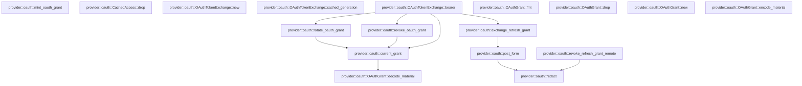

# provider::oauth

[Package atlas](index.md) · [Source](../../src/oauth.rs)

## Declarations

Visibility is the declaration spelling; trait members and reexports require their enclosing interface. `cfg` is not evaluated.

| Symbol | Kind | Visibility | Test / cfg |
|---|---|---|---|
| [provider::oauth::OAUTH_GRANT_KIND](../../src/oauth.rs#L19) | const_item | `pub` |  |
| [provider::oauth::OAuthGrant](../../src/oauth.rs#L25) | struct_item | `pub` |  |
| [provider::oauth::OAuthGrant::fmt](../../src/oauth.rs#L39) | function_item | `private` |  |
| [provider::oauth::OAuthGrant::drop](../../src/oauth.rs#L56) | function_item | `private` |  |
| [provider::oauth::OAuthGrant::new](../../src/oauth.rs#L65) | function_item | `pub` |  |
| [provider::oauth::OAuthGrant::encode_material](../../src/oauth.rs#L81) | function_item | `pub` |  |
| [provider::oauth::OAuthGrant::decode_material](../../src/oauth.rs#L97) | function_item | `pub` |  |
| [provider::oauth::current_grant](../../src/oauth.rs#L106) | function_item | `private` |  |
| [provider::oauth::mint_oauth_grant](../../src/oauth.rs#L122) | function_item | `pub` |  |
| [provider::oauth::rotate_oauth_grant](../../src/oauth.rs#L144) | function_item | `pub` |  |
| [provider::oauth::revoke_oauth_grant](../../src/oauth.rs#L167) | function_item | `pub` |  |
| [provider::oauth::OAuthExchangeError](../../src/oauth.rs#L185) | enum_item | `pub` |  |
| [provider::oauth::CachedAccess](../../src/oauth.rs#L198) | struct_item | `private` |  |
| [provider::oauth::CachedAccess::drop](../../src/oauth.rs#L205) | function_item | `private` |  |
| [provider::oauth::OAuthTokenExchange](../../src/oauth.rs#L214) | struct_item | `pub` |  |
| [provider::oauth::TokenResponse](../../src/oauth.rs#L227) | struct_item | `private` |  |
| [provider::oauth::OAuthTokenExchange::new](../../src/oauth.rs#L236) | function_item | `pub` |  |
| [provider::oauth::OAuthTokenExchange::cached_generation](../../src/oauth.rs#L253) | function_item | `pub` |  |
| [provider::oauth::OAuthTokenExchange::bearer](../../src/oauth.rs#L262) | function_item | `pub` |  |
| [provider::oauth::exchange_refresh_grant](../../src/oauth.rs#L334) | function_item | `private` |  |
| [provider::oauth::post_form](../../src/oauth.rs#L379) | function_item | `private` |  |
| [provider::oauth::revoke_refresh_grant_remote](../../src/oauth.rs#L436) | function_item | `pub` |  |
| [provider::oauth::redact](../../src/oauth.rs#L485) | function_item | `private` |  |
| [provider::oauth::tests::token_endpoint](../../src/oauth.rs#L501) | function_item | `private` | test; #[cfg(test)] |
| [provider::oauth::tests::grant_material_is_closed_and_only_kernel_minted_records_rotate](../../src/oauth.rs#L545) | function_item | `private` | test; #[cfg(test)] |
| [provider::oauth::tests::exchange_honours_retry_after_on_429_before_failing](../../src/oauth.rs#L619) | function_item | `private` | test; #[cfg(test)] |
| [provider::oauth::tests::exchange_caches_rotates_and_revokes_on_invalid_grant](../../src/oauth.rs#L643) | function_item | `private` | test; #[cfg(test)] |

## Imports / reexports

| Local name | Source path | Visibility |
|---|---|---|
| `Arc` | `std::sync::Arc` | `private` |
| `Mutex` | `std::sync::Mutex` | `private` |
| `Duration` | `std::time::Duration` | `private` |
| `Instant` | `std::time::Instant` | `private` |
| `Deserialize` | `serde::Deserialize` | `private` |
| `Serialize` | `serde::Serialize` | `private` |
| `Zeroize` | `zeroize::Zeroize` | `private` |
| `SecretMutationAuthority` | `crate::SecretMutationAuthority` | `private` |
| `SecretRecord` | `crate::SecretRecord` | `private` |
| `SecretResolution` | `crate::SecretResolution` | `private` |
| `SecretStore` | `crate::SecretStore` | `private` |
| `SecretStoreError` | `crate::SecretStoreError` | `private` |
| `*` | `super::*` | `private` |
| `MemorySecretStore` | `crate::MemorySecretStore` | `private` |
| `Read` | `std::io::Read` | `private` |
| `Write` | `std::io::Write` | `private` |
| `TcpListener` | `std::net::TcpListener` | `private` |

## Module declarations

| Module | Visibility | Attributes |
|---|---|---|
| `provider::oauth::tests` | `private` | #[cfg(test)] |

## Function call graphs

Edges below are syntactically resolved calls only, including private functions. Graphs partition callers into groups of 20; they are not execution order. All unresolved sites are listed below and in the JSON inventory.

Functions 1–17: 10 direct edges

## Call sites

Includes test functions (marked in declarations). Receiver-type-required sites need type analysis/manual tracing. Calls in closures are attributed to their enclosing function; their occurrence here does not mean the closure executes immediately.

| Caller | Callee expression | Source lines | Target / classification |
|---|---|---|---|
| `fmt` | `formatter             .debug_struct("OAuthGrant")             .field("token_endpoint", &self.token_endpoint)             .field("client_id", &self.client_id)             .field(                 "client_secret",                 &self.client_secret.as_ref().map(&#124;_&#124; "<redacted>"),             )             .field("refresh_token", &"<redacted>")             .field("resource", &self.resource)             .field("scope", &self.scope)             .finish` | [40](../../src/oauth.rs#L40) | receiver-type-required |
| `fmt` | `formatter             .debug_struct("OAuthGrant")             .field("token_endpoint", &self.token_endpoint)             .field("client_id", &self.client_id)             .field(                 "client_secret",                 &self.client_secret.as_ref().map(&#124;_&#124; "<redacted>"),             )             .field("refresh_token", &"<redacted>")             .field("resource", &self.resource)             .field` | [40](../../src/oauth.rs#L40) | receiver-type-required |
| `fmt` | `formatter             .debug_struct("OAuthGrant")             .field("token_endpoint", &self.token_endpoint)             .field("client_id", &self.client_id)             .field(                 "client_secret",                 &self.client_secret.as_ref().map(&#124;_&#124; "<redacted>"),             )             .field("refresh_token", &"<redacted>")             .field` | [40](../../src/oauth.rs#L40) | receiver-type-required |
| `fmt` | `formatter             .debug_struct("OAuthGrant")             .field("token_endpoint", &self.token_endpoint)             .field("client_id", &self.client_id)             .field(                 "client_secret",                 &self.client_secret.as_ref().map(&#124;_&#124; "<redacted>"),             )             .field` | [40](../../src/oauth.rs#L40) | receiver-type-required |
| `fmt` | `formatter             .debug_struct("OAuthGrant")             .field("token_endpoint", &self.token_endpoint)             .field("client_id", &self.client_id)             .field` | [40](../../src/oauth.rs#L40) | receiver-type-required |
| `fmt` | `formatter             .debug_struct("OAuthGrant")             .field("token_endpoint", &self.token_endpoint)             .field` | [40](../../src/oauth.rs#L40) | receiver-type-required |
| `fmt` | `formatter             .debug_struct("OAuthGrant")             .field` | [40](../../src/oauth.rs#L40) | receiver-type-required |
| `fmt` | `formatter             .debug_struct` | [40](../../src/oauth.rs#L40) | receiver-type-required |
| `fmt` | `self.client_secret.as_ref().map` | [46](../../src/oauth.rs#L46) | receiver-type-required |
| `fmt` | `self.client_secret.as_ref` | [46](../../src/oauth.rs#L46) | receiver-type-required |
| `drop` | `self.refresh_token.zeroize` | [57](../../src/oauth.rs#L57) | receiver-type-required |
| `drop` | `secret.zeroize` | [59](../../src/oauth.rs#L59) | receiver-type-required |
| `new` | `OAUTH_GRANT_KIND.to_owned` | [71](../../src/oauth.rs#L71) | receiver-type-required |
| `new` | `token_endpoint.into` | [72](../../src/oauth.rs#L72) | receiver-type-required |
| `new` | `client_id.into` | [73](../../src/oauth.rs#L73) | receiver-type-required |
| `new` | `refresh_token.into` | [75](../../src/oauth.rs#L75) | receiver-type-required |
| `encode_material` | `self.refresh_token.is_empty` | [83](../../src/oauth.rs#L83) | receiver-type-required |
| `encode_material` | `self.client_id.is_empty` | [84](../../src/oauth.rs#L84) | receiver-type-required |
| `encode_material` | `self.token_endpoint.starts_with` | [85](../../src/oauth.rs#L85), [86](../../src/oauth.rs#L86) | receiver-type-required |
| `encode_material` | `Err` | [88](../../src/oauth.rs#L88) | external-constructor-callback-or-unresolved |
| `encode_material` | `serde_json_canonicalizer::to_vec(self).map_err` | [91](../../src/oauth.rs#L91) | receiver-type-required |
| `encode_material` | `serde_json_canonicalizer::to_vec` | [91](../../src/oauth.rs#L91) | external-constructor-callback-or-unresolved |
| `encode_material` | `String::from_utf8(bytes).map_err` | [92](../../src/oauth.rs#L92) | receiver-type-required |
| `encode_material` | `String::from_utf8` | [92](../../src/oauth.rs#L92) | external-constructor-callback-or-unresolved |
| `decode_material` | `material.starts_with` | [98](../../src/oauth.rs#L98) | receiver-type-required |
| `decode_material` | `serde_json::from_str(material).ok` | [101](../../src/oauth.rs#L101) | receiver-type-required |
| `decode_material` | `serde_json::from_str` | [101](../../src/oauth.rs#L101) | external-constructor-callback-or-unresolved |
| `decode_material` | `(grant.kind == OAUTH_GRANT_KIND && !grant.refresh_token.is_empty()).then_some` | [102](../../src/oauth.rs#L102) | receiver-type-required |
| `decode_material` | `grant.refresh_token.is_empty` | [102](../../src/oauth.rs#L102) | receiver-type-required |
| `current_grant` | `store.resolve` | [110](../../src/oauth.rs#L110) | receiver-type-required |
| `current_grant` | `OAuthGrant::decode_material(material)             .map(&#124;grant&#124; (grant, *generation))             .ok_or` | [114](../../src/oauth.rs#L114) | receiver-type-required |
| `current_grant` | `OAuthGrant::decode_material(material)             .map` | [114](../../src/oauth.rs#L114) | receiver-type-required |
| `current_grant` | `OAuthGrant::decode_material` | [114](../../src/oauth.rs#L114) | [provider::oauth::OAuthGrant::decode_material](../../src/oauth.rs#L97) |
| `current_grant` | `Err` | [117](../../src/oauth.rs#L117) | external-constructor-callback-or-unresolved |
| `mint_oauth_grant` | `Err` | [129](../../src/oauth.rs#L129) | external-constructor-callback-or-unresolved |
| `mint_oauth_grant` | `authority.publish_record` | [131](../../src/oauth.rs#L131) | receiver-type-required |
| `mint_oauth_grant` | `grant.encode_material` | [136](../../src/oauth.rs#L136) | receiver-type-required |
| `mint_oauth_grant` | `Ok` | [139](../../src/oauth.rs#L139) | external-constructor-callback-or-unresolved |
| `rotate_oauth_grant` | `current_grant` | [150](../../src/oauth.rs#L150) | [provider::oauth::current_grant](../../src/oauth.rs#L106) |
| `rotate_oauth_grant` | `refresh_token.to_owned` | [151](../../src/oauth.rs#L151) | receiver-type-required |
| `rotate_oauth_grant` | `generation         .checked_add(1)         .ok_or` | [152](../../src/oauth.rs#L152) | receiver-type-required |
| `rotate_oauth_grant` | `generation         .checked_add` | [152](../../src/oauth.rs#L152) | receiver-type-required |
| `rotate_oauth_grant` | `authority.publish_record` | [155](../../src/oauth.rs#L155) | receiver-type-required |
| `rotate_oauth_grant` | `Some` | [157](../../src/oauth.rs#L157) | external-constructor-callback-or-unresolved |
| `rotate_oauth_grant` | `grant.encode_material` | [160](../../src/oauth.rs#L160) | receiver-type-required |
| `rotate_oauth_grant` | `Ok` | [163](../../src/oauth.rs#L163) | external-constructor-callback-or-unresolved |
| `revoke_oauth_grant` | `current_grant` | [172](../../src/oauth.rs#L172) | [provider::oauth::current_grant](../../src/oauth.rs#L106) |
| `revoke_oauth_grant` | `generation         .checked_add(1)         .ok_or` | [173](../../src/oauth.rs#L173) | receiver-type-required |
| `revoke_oauth_grant` | `generation         .checked_add` | [173](../../src/oauth.rs#L173) | receiver-type-required |
| `revoke_oauth_grant` | `authority.publish_record` | [176](../../src/oauth.rs#L176) | receiver-type-required |
| `revoke_oauth_grant` | `Some` | [178](../../src/oauth.rs#L178) | external-constructor-callback-or-unresolved |
| `revoke_oauth_grant` | `Ok` | [181](../../src/oauth.rs#L181) | external-constructor-callback-or-unresolved |
| `drop` | `self.token.zeroize` | [206](../../src/oauth.rs#L206) | receiver-type-required |
| `new` | `credential_id.into` | [242](../../src/oauth.rs#L242) | receiver-type-required |
| `new` | `Mutex::new` | [245](../../src/oauth.rs#L245) | external-constructor-callback-or-unresolved |
| `new` | `std::sync::atomic::AtomicBool::new` | [246](../../src/oauth.rs#L246) | external-constructor-callback-or-unresolved |
| `new` | `Duration::from_secs` | [247](../../src/oauth.rs#L247) | external-constructor-callback-or-unresolved |
| `cached_generation` | `self.cache             .lock()             .unwrap_or_else(std::sync::PoisonError::into_inner)             .as_ref()             .map` | [254](../../src/oauth.rs#L254) | receiver-type-required |
| `cached_generation` | `self.cache             .lock()             .unwrap_or_else(std::sync::PoisonError::into_inner)             .as_ref` | [254](../../src/oauth.rs#L254) | receiver-type-required |
| `cached_generation` | `self.cache             .lock()             .unwrap_or_else` | [254](../../src/oauth.rs#L254) | receiver-type-required |
| `cached_generation` | `self.cache             .lock` | [254](../../src/oauth.rs#L254) | receiver-type-required |
| `bearer` | `self.revoked.load` | [263](../../src/oauth.rs#L263) | receiver-type-required |
| `bearer` | `Err` | [264](../../src/oauth.rs#L264), [294](../../src/oauth.rs#L294), [296](../../src/oauth.rs#L296) | external-constructor-callback-or-unresolved |
| `bearer` | `current_grant(self.store.as_ref(), &self.credential_id)             .map_err` | [266](../../src/oauth.rs#L266) | receiver-type-required |
| `bearer` | `current_grant` | [266](../../src/oauth.rs#L266) | [provider::oauth::current_grant](../../src/oauth.rs#L106) |
| `bearer` | `self.store.as_ref` | [266](../../src/oauth.rs#L266), [288](../../src/oauth.rs#L288), [305](../../src/oauth.rs#L305) | receiver-type-required |
| `bearer` | `OAuthExchangeError::Unavailable` | [267](../../src/oauth.rs#L267) | external-constructor-callback-or-unresolved |
| `bearer` | `self.credential_id.clone` | [267](../../src/oauth.rs#L267) | receiver-type-required |
| `bearer` | `self                 .cache                 .lock()                 .unwrap_or_else` | [270](../../src/oauth.rs#L270) | receiver-type-required |
| `bearer` | `self                 .cache                 .lock` | [270](../../src/oauth.rs#L270) | receiver-type-required |
| `bearer` | `cache.as_ref` | [274](../../src/oauth.rs#L274) | receiver-type-required |
| `bearer` | `cached.expires_at.is_none_or` | [275](../../src/oauth.rs#L275) | receiver-type-required |
| `bearer` | `Instant::now` | [275](../../src/oauth.rs#L275), [318](../../src/oauth.rs#L318) | external-constructor-callback-or-unresolved |
| `bearer` | `Ok` | [277](../../src/oauth.rs#L277), [328](../../src/oauth.rs#L328) | external-constructor-callback-or-unresolved |
| `bearer` | `cached.token.clone` | [277](../../src/oauth.rs#L277) | receiver-type-required |
| `bearer` | `exchange_refresh_grant` | [281](../../src/oauth.rs#L281) | [provider::oauth::exchange_refresh_grant](../../src/oauth.rs#L334) |
| `bearer` | `revoke_oauth_grant` | [287](../../src/oauth.rs#L287) | [provider::oauth::revoke_oauth_grant](../../src/oauth.rs#L167) |
| `bearer` | `self.authority.as_ref` | [289](../../src/oauth.rs#L289), [306](../../src/oauth.rs#L306) | receiver-type-required |
| `bearer` | `self.revoked                     .store` | [292](../../src/oauth.rs#L292) | receiver-type-required |
| `bearer` | `response             .refresh_token             .as_deref()             .filter` | [299](../../src/oauth.rs#L299) | receiver-type-required |
| `bearer` | `response             .refresh_token             .as_deref` | [299](../../src/oauth.rs#L299) | receiver-type-required |
| `bearer` | `rotate_oauth_grant(                 self.store.as_ref(),                 self.authority.as_ref(),                 &self.credential_id,                 rotated,             )             .map_err` | [304](../../src/oauth.rs#L304) | receiver-type-required |
| `bearer` | `rotate_oauth_grant` | [304](../../src/oauth.rs#L304) | [provider::oauth::rotate_oauth_grant](../../src/oauth.rs#L144) |
| `bearer` | `OAuthExchangeError::Transport` | [311](../../src/oauth.rs#L311) | external-constructor-callback-or-unresolved |
| `bearer` | `response             .expires_in             .map` | [316](../../src/oauth.rs#L316) | receiver-type-required |
| `bearer` | `Duration::from_secs` | [318](../../src/oauth.rs#L318) | external-constructor-callback-or-unresolved |
| `bearer` | `seconds.saturating_sub(30).max` | [318](../../src/oauth.rs#L318) | receiver-type-required |
| `bearer` | `seconds.saturating_sub` | [318](../../src/oauth.rs#L318) | receiver-type-required |
| `bearer` | `response.access_token.clone` | [319](../../src/oauth.rs#L319), [324](../../src/oauth.rs#L324) | receiver-type-required |
| `bearer` | `self             .cache             .lock()             .unwrap_or_else` | [320](../../src/oauth.rs#L320) | receiver-type-required |
| `bearer` | `self             .cache             .lock` | [320](../../src/oauth.rs#L320) | receiver-type-required |
| `bearer` | `Some` | [323](../../src/oauth.rs#L323) | external-constructor-callback-or-unresolved |
| `exchange_refresh_grant` | `form.push` | [344](../../src/oauth.rs#L344), [347](../../src/oauth.rs#L347) | receiver-type-required |
| `exchange_refresh_grant` | `"client_secret".to_owned` | [344](../../src/oauth.rs#L344) | receiver-type-required |
| `exchange_refresh_grant` | `secret.clone` | [344](../../src/oauth.rs#L344) | receiver-type-required |
| `exchange_refresh_grant` | `"resource".to_owned` | [347](../../src/oauth.rs#L347) | receiver-type-required |
| `exchange_refresh_grant` | `resource.clone` | [347](../../src/oauth.rs#L347) | receiver-type-required |
| `exchange_refresh_grant` | `post_form` | [357](../../src/oauth.rs#L357) | [provider::oauth::post_form](../../src/oauth.rs#L379) |
| `exchange_refresh_grant` | `serde_json::from_slice::<TokenResponse>(&body).map_err` | [359](../../src/oauth.rs#L359) | receiver-type-required |
| `exchange_refresh_grant` | `serde_json::from_slice::<TokenResponse>` | [359](../../src/oauth.rs#L359) | external-constructor-callback-or-unresolved |
| `exchange_refresh_grant` | `OAuthExchangeError::Transport` | [360](../../src/oauth.rs#L360) | external-constructor-callback-or-unresolved |
| `exchange_refresh_grant` | `"token endpoint returned a malformed token response".to_owned` | [361](../../src/oauth.rs#L361) | receiver-type-required |
| `exchange_refresh_grant` | `Err` | [364](../../src/oauth.rs#L364), [370](../../src/oauth.rs#L370) | external-constructor-callback-or-unresolved |
| `exchange_refresh_grant` | `body.zeroize` | [366](../../src/oauth.rs#L366), [372](../../src/oauth.rs#L372) | receiver-type-required |
| `exchange_refresh_grant` | `std::thread::sleep` | [367](../../src/oauth.rs#L367) | external-constructor-callback-or-unresolved |
| `exchange_refresh_grant` | `Duration::from_secs` | [367](../../src/oauth.rs#L367) | external-constructor-callback-or-unresolved |
| `exchange_refresh_grant` | `retry_after.unwrap_or(5).clamp` | [367](../../src/oauth.rs#L367) | receiver-type-required |
| `exchange_refresh_grant` | `retry_after.unwrap_or` | [367](../../src/oauth.rs#L367) | receiver-type-required |
| `exchange_refresh_grant` | `OAuthExchangeError::Status` | [370](../../src/oauth.rs#L370) | external-constructor-callback-or-unresolved |
| `post_form` | `endpoint.to_owned` | [384](../../src/oauth.rs#L384) | receiver-type-required |
| `post_form` | `form.to_vec` | [385](../../src/oauth.rs#L385) | receiver-type-required |
| `post_form` | `std::thread::scope` | [386](../../src/oauth.rs#L386) | external-constructor-callback-or-unresolved |
| `post_form` | `scope             .spawn(                 move &#124;&#124; -> Result<(u16, Option<u64>, Vec<u8>), OAuthExchangeError> {                     let runtime = tokio::runtime::Builder::new_current_thread()                         .enable_all()                         .build()                         .map_err(&#124;error&#124; OAuthExchangeError::Transport(error.to_string()))?;                     runtime.block_on(async move {                         let client = reqwest::Client::builder()                             .connect_timeout(Duration::from_secs(30))                             .timeout(timeout)                             .redirect(reqwest::redirect::Policy::none())                             .build()                             .map_err(&#124;error&#124; OAuthExchangeError::Transport(error.to_string()))?;                         let response = client                             .post(&endpoint)                             .header("accept", "application/json")                             .form(&form)                             .send()                             .await                             .map_err(&#124;error&#124; {                                 OAuthExchangeError::Transport(redact(&error.to_string()))                             })?;                         let status = response.status().as_u16();                         let retry_after = response                             .headers()                             .get("retry-after")                             .and_then(&#124;value&#124; value.to_str().ok())                             .and_then(&#124;value&#124; value.trim().parse::<u64>().ok());                         let body = response.bytes().await.map_err(&#124;error&#124; {                             OAuthExchangeError::Transport(redact(&error.to_string()))                         })?;                         Ok((status, retry_after, body.to_vec()))                     })                 },             )             .join()             .unwrap_or_else` | [387](../../src/oauth.rs#L387) | receiver-type-required |
| `post_form` | `scope             .spawn(                 move &#124;&#124; -> Result<(u16, Option<u64>, Vec<u8>), OAuthExchangeError> {                     let runtime = tokio::runtime::Builder::new_current_thread()                         .enable_all()                         .build()                         .map_err(&#124;error&#124; OAuthExchangeError::Transport(error.to_string()))?;                     runtime.block_on(async move {                         let client = reqwest::Client::builder()                             .connect_timeout(Duration::from_secs(30))                             .timeout(timeout)                             .redirect(reqwest::redirect::Policy::none())                             .build()                             .map_err(&#124;error&#124; OAuthExchangeError::Transport(error.to_string()))?;                         let response = client                             .post(&endpoint)                             .header("accept", "application/json")                             .form(&form)                             .send()                             .await                             .map_err(&#124;error&#124; {                                 OAuthExchangeError::Transport(redact(&error.to_string()))                             })?;                         let status = response.status().as_u16();                         let retry_after = response                             .headers()                             .get("retry-after")                             .and_then(&#124;value&#124; value.to_str().ok())                             .and_then(&#124;value&#124; value.trim().parse::<u64>().ok());                         let body = response.bytes().await.map_err(&#124;error&#124; {                             OAuthExchangeError::Transport(redact(&error.to_string()))                         })?;                         Ok((status, retry_after, body.to_vec()))                     })                 },             )             .join` | [387](../../src/oauth.rs#L387) | receiver-type-required |
| `post_form` | `scope             .spawn` | [387](../../src/oauth.rs#L387) | receiver-type-required |
| `post_form` | `tokio::runtime::Builder::new_current_thread()                         .enable_all()                         .build()                         .map_err` | [390](../../src/oauth.rs#L390) | receiver-type-required |
| `post_form` | `tokio::runtime::Builder::new_current_thread()                         .enable_all()                         .build` | [390](../../src/oauth.rs#L390) | receiver-type-required |
| `post_form` | `tokio::runtime::Builder::new_current_thread()                         .enable_all` | [390](../../src/oauth.rs#L390) | receiver-type-required |
| `post_form` | `tokio::runtime::Builder::new_current_thread` | [390](../../src/oauth.rs#L390) | external-constructor-callback-or-unresolved |
| `post_form` | `OAuthExchangeError::Transport` | [393](../../src/oauth.rs#L393), [400](../../src/oauth.rs#L400), [408](../../src/oauth.rs#L408), [417](../../src/oauth.rs#L417), [425](../../src/oauth.rs#L425) | external-constructor-callback-or-unresolved |
| `post_form` | `error.to_string` | [393](../../src/oauth.rs#L393), [400](../../src/oauth.rs#L400), [408](../../src/oauth.rs#L408), [417](../../src/oauth.rs#L417) | receiver-type-required |
| `post_form` | `runtime.block_on` | [394](../../src/oauth.rs#L394) | receiver-type-required |
| `post_form` | `reqwest::Client::builder()                             .connect_timeout(Duration::from_secs(30))                             .timeout(timeout)                             .redirect(reqwest::redirect::Policy::none())                             .build()                             .map_err` | [395](../../src/oauth.rs#L395) | receiver-type-required |
| `post_form` | `reqwest::Client::builder()                             .connect_timeout(Duration::from_secs(30))                             .timeout(timeout)                             .redirect(reqwest::redirect::Policy::none())                             .build` | [395](../../src/oauth.rs#L395) | receiver-type-required |
| `post_form` | `reqwest::Client::builder()                             .connect_timeout(Duration::from_secs(30))                             .timeout(timeout)                             .redirect` | [395](../../src/oauth.rs#L395) | receiver-type-required |
| `post_form` | `reqwest::Client::builder()                             .connect_timeout(Duration::from_secs(30))                             .timeout` | [395](../../src/oauth.rs#L395) | receiver-type-required |
| `post_form` | `reqwest::Client::builder()                             .connect_timeout` | [395](../../src/oauth.rs#L395) | receiver-type-required |
| `post_form` | `reqwest::Client::builder` | [395](../../src/oauth.rs#L395) | external-constructor-callback-or-unresolved |
| `post_form` | `Duration::from_secs` | [396](../../src/oauth.rs#L396) | external-constructor-callback-or-unresolved |
| `post_form` | `reqwest::redirect::Policy::none` | [398](../../src/oauth.rs#L398) | external-constructor-callback-or-unresolved |
| `post_form` | `client                             .post(&endpoint)                             .header("accept", "application/json")                             .form(&form)                             .send()                             .await                             .map_err` | [401](../../src/oauth.rs#L401) | receiver-type-required |
| `post_form` | `client                             .post(&endpoint)                             .header("accept", "application/json")                             .form(&form)                             .send` | [401](../../src/oauth.rs#L401) | receiver-type-required |
| `post_form` | `client                             .post(&endpoint)                             .header("accept", "application/json")                             .form` | [401](../../src/oauth.rs#L401) | receiver-type-required |
| `post_form` | `client                             .post(&endpoint)                             .header` | [401](../../src/oauth.rs#L401) | receiver-type-required |
| `post_form` | `client                             .post` | [401](../../src/oauth.rs#L401) | receiver-type-required |
| `post_form` | `redact` | [408](../../src/oauth.rs#L408), [417](../../src/oauth.rs#L417) | [provider::oauth::redact](../../src/oauth.rs#L485) |
| `post_form` | `response.status().as_u16` | [410](../../src/oauth.rs#L410) | receiver-type-required |
| `post_form` | `response.status` | [410](../../src/oauth.rs#L410) | receiver-type-required |
| `post_form` | `response                             .headers()                             .get("retry-after")                             .and_then(&#124;value&#124; value.to_str().ok())                             .and_then` | [411](../../src/oauth.rs#L411) | receiver-type-required |
| `post_form` | `response                             .headers()                             .get("retry-after")                             .and_then` | [411](../../src/oauth.rs#L411) | receiver-type-required |
| `post_form` | `response                             .headers()                             .get` | [411](../../src/oauth.rs#L411) | receiver-type-required |
| `post_form` | `response                             .headers` | [411](../../src/oauth.rs#L411) | receiver-type-required |
| `post_form` | `value.to_str().ok` | [414](../../src/oauth.rs#L414) | receiver-type-required |
| `post_form` | `value.to_str` | [414](../../src/oauth.rs#L414) | receiver-type-required |
| `post_form` | `value.trim().parse::<u64>().ok` | [415](../../src/oauth.rs#L415) | receiver-type-required |
| `post_form` | `value.trim().parse::<u64>` | [415](../../src/oauth.rs#L415) | receiver-type-required |
| `post_form` | `value.trim` | [415](../../src/oauth.rs#L415) | receiver-type-required |
| `post_form` | `response.bytes().await.map_err` | [416](../../src/oauth.rs#L416) | receiver-type-required |
| `post_form` | `response.bytes` | [416](../../src/oauth.rs#L416) | receiver-type-required |
| `post_form` | `Ok` | [419](../../src/oauth.rs#L419) | external-constructor-callback-or-unresolved |
| `post_form` | `body.to_vec` | [419](../../src/oauth.rs#L419) | receiver-type-required |
| `post_form` | `Err` | [425](../../src/oauth.rs#L425) | external-constructor-callback-or-unresolved |
| `post_form` | `"token exchange thread panicked".to_owned` | [426](../../src/oauth.rs#L426) | receiver-type-required |
| `revoke_refresh_grant_remote` | `form.push` | [447](../../src/oauth.rs#L447) | receiver-type-required |
| `revoke_refresh_grant_remote` | `"client_secret".to_owned` | [447](../../src/oauth.rs#L447) | receiver-type-required |
| `revoke_refresh_grant_remote` | `secret.clone` | [447](../../src/oauth.rs#L447) | receiver-type-required |
| `revoke_refresh_grant_remote` | `revocation_endpoint.to_owned` | [449](../../src/oauth.rs#L449) | receiver-type-required |
| `revoke_refresh_grant_remote` | `std::thread::scope` | [450](../../src/oauth.rs#L450) | external-constructor-callback-or-unresolved |
| `revoke_refresh_grant_remote` | `scope             .spawn(move &#124;&#124; -> Result<u16, OAuthExchangeError> {                 let runtime = tokio::runtime::Builder::new_current_thread()                     .enable_all()                     .build()                     .map_err(&#124;error&#124; OAuthExchangeError::Transport(error.to_string()))?;                 runtime.block_on(async move {                     let client = reqwest::Client::builder()                         .connect_timeout(Duration::from_secs(30))                         .timeout(timeout)                         .redirect(reqwest::redirect::Policy::none())                         .build()                         .map_err(&#124;error&#124; OAuthExchangeError::Transport(error.to_string()))?;                     let response =                         client                             .post(&endpoint)                             .form(&form)                             .send()                             .await                             .map_err(&#124;error&#124; {                                 OAuthExchangeError::Transport(redact(&error.to_string()))                             })?;                     Ok(response.status().as_u16())                 })             })             .join()             .unwrap_or_else` | [451](../../src/oauth.rs#L451) | receiver-type-required |
| `revoke_refresh_grant_remote` | `scope             .spawn(move &#124;&#124; -> Result<u16, OAuthExchangeError> {                 let runtime = tokio::runtime::Builder::new_current_thread()                     .enable_all()                     .build()                     .map_err(&#124;error&#124; OAuthExchangeError::Transport(error.to_string()))?;                 runtime.block_on(async move {                     let client = reqwest::Client::builder()                         .connect_timeout(Duration::from_secs(30))                         .timeout(timeout)                         .redirect(reqwest::redirect::Policy::none())                         .build()                         .map_err(&#124;error&#124; OAuthExchangeError::Transport(error.to_string()))?;                     let response =                         client                             .post(&endpoint)                             .form(&form)                             .send()                             .await                             .map_err(&#124;error&#124; {                                 OAuthExchangeError::Transport(redact(&error.to_string()))                             })?;                     Ok(response.status().as_u16())                 })             })             .join` | [451](../../src/oauth.rs#L451) | receiver-type-required |
| `revoke_refresh_grant_remote` | `scope             .spawn` | [451](../../src/oauth.rs#L451) | receiver-type-required |
| `revoke_refresh_grant_remote` | `tokio::runtime::Builder::new_current_thread()                     .enable_all()                     .build()                     .map_err` | [453](../../src/oauth.rs#L453) | receiver-type-required |
| `revoke_refresh_grant_remote` | `tokio::runtime::Builder::new_current_thread()                     .enable_all()                     .build` | [453](../../src/oauth.rs#L453) | receiver-type-required |
| `revoke_refresh_grant_remote` | `tokio::runtime::Builder::new_current_thread()                     .enable_all` | [453](../../src/oauth.rs#L453) | receiver-type-required |
| `revoke_refresh_grant_remote` | `tokio::runtime::Builder::new_current_thread` | [453](../../src/oauth.rs#L453) | external-constructor-callback-or-unresolved |
| `revoke_refresh_grant_remote` | `OAuthExchangeError::Transport` | [456](../../src/oauth.rs#L456), [463](../../src/oauth.rs#L463), [471](../../src/oauth.rs#L471), [478](../../src/oauth.rs#L478) | external-constructor-callback-or-unresolved |
| `revoke_refresh_grant_remote` | `error.to_string` | [456](../../src/oauth.rs#L456), [463](../../src/oauth.rs#L463), [471](../../src/oauth.rs#L471) | receiver-type-required |
| `revoke_refresh_grant_remote` | `runtime.block_on` | [457](../../src/oauth.rs#L457) | receiver-type-required |
| `revoke_refresh_grant_remote` | `reqwest::Client::builder()                         .connect_timeout(Duration::from_secs(30))                         .timeout(timeout)                         .redirect(reqwest::redirect::Policy::none())                         .build()                         .map_err` | [458](../../src/oauth.rs#L458) | receiver-type-required |
| `revoke_refresh_grant_remote` | `reqwest::Client::builder()                         .connect_timeout(Duration::from_secs(30))                         .timeout(timeout)                         .redirect(reqwest::redirect::Policy::none())                         .build` | [458](../../src/oauth.rs#L458) | receiver-type-required |
| `revoke_refresh_grant_remote` | `reqwest::Client::builder()                         .connect_timeout(Duration::from_secs(30))                         .timeout(timeout)                         .redirect` | [458](../../src/oauth.rs#L458) | receiver-type-required |
| `revoke_refresh_grant_remote` | `reqwest::Client::builder()                         .connect_timeout(Duration::from_secs(30))                         .timeout` | [458](../../src/oauth.rs#L458) | receiver-type-required |
| `revoke_refresh_grant_remote` | `reqwest::Client::builder()                         .connect_timeout` | [458](../../src/oauth.rs#L458) | receiver-type-required |
| `revoke_refresh_grant_remote` | `reqwest::Client::builder` | [458](../../src/oauth.rs#L458) | external-constructor-callback-or-unresolved |
| `revoke_refresh_grant_remote` | `Duration::from_secs` | [459](../../src/oauth.rs#L459) | external-constructor-callback-or-unresolved |
| `revoke_refresh_grant_remote` | `reqwest::redirect::Policy::none` | [461](../../src/oauth.rs#L461) | external-constructor-callback-or-unresolved |
| `revoke_refresh_grant_remote` | `client                             .post(&endpoint)                             .form(&form)                             .send()                             .await                             .map_err` | [465](../../src/oauth.rs#L465) | receiver-type-required |
| `revoke_refresh_grant_remote` | `client                             .post(&endpoint)                             .form(&form)                             .send` | [465](../../src/oauth.rs#L465) | receiver-type-required |
| `revoke_refresh_grant_remote` | `client                             .post(&endpoint)                             .form` | [465](../../src/oauth.rs#L465) | receiver-type-required |
| `revoke_refresh_grant_remote` | `client                             .post` | [465](../../src/oauth.rs#L465) | receiver-type-required |
| `revoke_refresh_grant_remote` | `redact` | [471](../../src/oauth.rs#L471) | [provider::oauth::redact](../../src/oauth.rs#L485) |
| `revoke_refresh_grant_remote` | `Ok` | [473](../../src/oauth.rs#L473) | external-constructor-callback-or-unresolved |
| `revoke_refresh_grant_remote` | `response.status().as_u16` | [473](../../src/oauth.rs#L473) | receiver-type-required |
| `revoke_refresh_grant_remote` | `response.status` | [473](../../src/oauth.rs#L473) | receiver-type-required |
| `revoke_refresh_grant_remote` | `Err` | [478](../../src/oauth.rs#L478) | external-constructor-callback-or-unresolved |
| `revoke_refresh_grant_remote` | `"revocation thread panicked".to_owned` | [479](../../src/oauth.rs#L479) | receiver-type-required |
| `redact` | `message         .split(':')         .next()         .unwrap_or("request failed")         .to_owned` | [487](../../src/oauth.rs#L487) | receiver-type-required |
| `redact` | `message         .split(':')         .next()         .unwrap_or` | [487](../../src/oauth.rs#L487) | receiver-type-required |
| `redact` | `message         .split(':')         .next` | [487](../../src/oauth.rs#L487) | receiver-type-required |
| `redact` | `message         .split` | [487](../../src/oauth.rs#L487) | receiver-type-required |
| `token_endpoint` | `TcpListener::bind("127.0.0.1:0").unwrap` | [504](../../src/oauth.rs#L504) | receiver-type-required |
| `token_endpoint` | `TcpListener::bind` | [504](../../src/oauth.rs#L504) | external-constructor-callback-or-unresolved |
| `token_endpoint` | `std::thread::spawn` | [506](../../src/oauth.rs#L506) | external-constructor-callback-or-unresolved |
| `token_endpoint` | `Vec::new` | [507](../../src/oauth.rs#L507), [510](../../src/oauth.rs#L510) | external-constructor-callback-or-unresolved |
| `token_endpoint` | `listener.accept().unwrap` | [509](../../src/oauth.rs#L509) | receiver-type-required |
| `token_endpoint` | `listener.accept` | [509](../../src/oauth.rs#L509) | receiver-type-required |
| `token_endpoint` | `stream.read(&mut chunk).unwrap` | [513](../../src/oauth.rs#L513) | receiver-type-required |
| `token_endpoint` | `stream.read` | [513](../../src/oauth.rs#L513) | receiver-type-required |
| `token_endpoint` | `request.extend_from_slice` | [514](../../src/oauth.rs#L514) | receiver-type-required |
| `token_endpoint` | `request.windows(4).position` | [515](../../src/oauth.rs#L515) | receiver-type-required |
| `token_endpoint` | `request.windows` | [515](../../src/oauth.rs#L515) | receiver-type-required |
| `token_endpoint` | `String::from_utf8_lossy(&request[..end + 4]).to_ascii_lowercase` | [517](../../src/oauth.rs#L517) | receiver-type-required |
| `token_endpoint` | `String::from_utf8_lossy` | [517](../../src/oauth.rs#L517), [524](../../src/oauth.rs#L524) | external-constructor-callback-or-unresolved |
| `token_endpoint` | `headers                             .lines()                             .find_map(&#124;l&#124; l.strip_prefix("content-length: "))                             .and_then(&#124;v&#124; v.trim().parse::<usize>().ok())                             .unwrap_or` | [518](../../src/oauth.rs#L518) | receiver-type-required |
| `token_endpoint` | `headers                             .lines()                             .find_map(&#124;l&#124; l.strip_prefix("content-length: "))                             .and_then` | [518](../../src/oauth.rs#L518) | receiver-type-required |
| `token_endpoint` | `headers                             .lines()                             .find_map` | [518](../../src/oauth.rs#L518) | receiver-type-required |
| `token_endpoint` | `headers                             .lines` | [518](../../src/oauth.rs#L518) | receiver-type-required |
| `token_endpoint` | `l.strip_prefix` | [520](../../src/oauth.rs#L520) | receiver-type-required |
| `token_endpoint` | `v.trim().parse::<usize>().ok` | [521](../../src/oauth.rs#L521) | receiver-type-required |
| `token_endpoint` | `v.trim().parse::<usize>` | [521](../../src/oauth.rs#L521) | receiver-type-required |
| `token_endpoint` | `v.trim` | [521](../../src/oauth.rs#L521) | receiver-type-required |
| `token_endpoint` | `request.len` | [523](../../src/oauth.rs#L523) | receiver-type-required |
| `token_endpoint` | `bodies.push` | [524](../../src/oauth.rs#L524) | receiver-type-required |
| `token_endpoint` | `String::from_utf8_lossy(&request[end + 4..]).into_owned` | [524](../../src/oauth.rs#L524) | receiver-type-required |
| `token_endpoint` | `write!(stream, "HTTP/1.1 {status} X\r\ncontent-type: application/json\r\n{retry}content-length: {}\r\nconnection: close\r\n\r\n{body}", body.len()).unwrap` | [537](../../src/oauth.rs#L537) | receiver-type-required |
| `grant_material_is_closed_and_only_kernel_minted_records_rotate` | `Arc::new` | [546](../../src/oauth.rs#L546) | external-constructor-callback-or-unresolved |
| `grant_material_is_closed_and_only_kernel_minted_records_rotate` | `MemorySecretStore::new` | [546](../../src/oauth.rs#L546) | [provider::secret_store::MemorySecretStore::new](../../src/secret_store.rs#L179) |
| `grant_material_is_closed_and_only_kernel_minted_records_rotate` | `OAuthGrant::new` | [547](../../src/oauth.rs#L547) | external-constructor-callback-or-unresolved |
| `grant_material_is_closed_and_only_kernel_minted_records_rotate` | `grant.encode_material().unwrap` | [548](../../src/oauth.rs#L548) | receiver-type-required |
| `grant_material_is_closed_and_only_kernel_minted_records_rotate` | `grant.encode_material` | [548](../../src/oauth.rs#L548) | receiver-type-required |
| `grant_material_is_closed_and_only_kernel_minted_records_rotate` | `store.resolve("oauth-cf").unwrap` | [577](../../src/oauth.rs#L577) | receiver-type-required |
| `grant_material_is_closed_and_only_kernel_minted_records_rotate` | `store.resolve` | [577](../../src/oauth.rs#L577) | receiver-type-required |
| `grant_material_is_closed_and_only_kernel_minted_records_rotate` | `store             .publish(                 "platform-token",                 SecretRecord::Active {                     generation: 1,                     material: "installed-by-the-app".to_owned(),                 },             )             .unwrap` | [590](../../src/oauth.rs#L590) | receiver-type-required |
| `grant_material_is_closed_and_only_kernel_minted_records_rotate` | `store             .publish` | [590](../../src/oauth.rs#L590) | receiver-type-required |
| `grant_material_is_closed_and_only_kernel_minted_records_rotate` | `"installed-by-the-app".to_owned` | [595](../../src/oauth.rs#L595) | receiver-type-required |
| `exchange_honours_retry_after_on_429_before_failing` | `token_endpoint` | [620](../../src/oauth.rs#L620) | [provider::oauth::tests::token_endpoint](../../src/oauth.rs#L501) |
| `exchange_honours_retry_after_on_429_before_failing` | `Arc::new` | [624](../../src/oauth.rs#L624) | external-constructor-callback-or-unresolved |
| `exchange_honours_retry_after_on_429_before_failing` | `MemorySecretStore::new` | [624](../../src/oauth.rs#L624) | [provider::secret_store::MemorySecretStore::new](../../src/secret_store.rs#L179) |
| `exchange_honours_retry_after_on_429_before_failing` | `mint_oauth_grant(             store.as_ref(),             store.as_ref(),             "oauth-cf",             &OAuthGrant::new(endpoint, "client-1", "refresh-1"),         )         .unwrap` | [625](../../src/oauth.rs#L625) | receiver-type-required |
| `exchange_honours_retry_after_on_429_before_failing` | `mint_oauth_grant` | [625](../../src/oauth.rs#L625) | external-constructor-callback-or-unresolved |
| `exchange_honours_retry_after_on_429_before_failing` | `store.as_ref` | [626](../../src/oauth.rs#L626), [627](../../src/oauth.rs#L627) | receiver-type-required |
| `exchange_honours_retry_after_on_429_before_failing` | `OAuthGrant::new` | [629](../../src/oauth.rs#L629) | external-constructor-callback-or-unresolved |
| `exchange_honours_retry_after_on_429_before_failing` | `OAuthTokenExchange::new` | [632](../../src/oauth.rs#L632) | external-constructor-callback-or-unresolved |
| `exchange_honours_retry_after_on_429_before_failing` | `store.clone` | [632](../../src/oauth.rs#L632) | receiver-type-required |
| `exchange_honours_retry_after_on_429_before_failing` | `Instant::now` | [633](../../src/oauth.rs#L633) | external-constructor-callback-or-unresolved |
| `exchange_caches_rotates_and_revokes_on_invalid_grant` | `token_endpoint` | [644](../../src/oauth.rs#L644) | [provider::oauth::tests::token_endpoint](../../src/oauth.rs#L501) |
| `exchange_caches_rotates_and_revokes_on_invalid_grant` | `Arc::new` | [649](../../src/oauth.rs#L649) | external-constructor-callback-or-unresolved |
| `exchange_caches_rotates_and_revokes_on_invalid_grant` | `MemorySecretStore::new` | [649](../../src/oauth.rs#L649) | [provider::secret_store::MemorySecretStore::new](../../src/secret_store.rs#L179) |
| `exchange_caches_rotates_and_revokes_on_invalid_grant` | `OAuthGrant::new` | [650](../../src/oauth.rs#L650) | external-constructor-callback-or-unresolved |
| `exchange_caches_rotates_and_revokes_on_invalid_grant` | `Some` | [651](../../src/oauth.rs#L651) | external-constructor-callback-or-unresolved |
| `exchange_caches_rotates_and_revokes_on_invalid_grant` | `"https://mcp.example/mcp".to_owned` | [651](../../src/oauth.rs#L651) | receiver-type-required |
| `exchange_caches_rotates_and_revokes_on_invalid_grant` | `mint_oauth_grant(store.as_ref(), store.as_ref(), "oauth-cf", &grant).unwrap` | [652](../../src/oauth.rs#L652) | receiver-type-required |
| `exchange_caches_rotates_and_revokes_on_invalid_grant` | `mint_oauth_grant` | [652](../../src/oauth.rs#L652) | external-constructor-callback-or-unresolved |
| `exchange_caches_rotates_and_revokes_on_invalid_grant` | `store.as_ref` | [652](../../src/oauth.rs#L652) | receiver-type-required |
| `exchange_caches_rotates_and_revokes_on_invalid_grant` | `OAuthTokenExchange::new` | [653](../../src/oauth.rs#L653), [666](../../src/oauth.rs#L666), [674](../../src/oauth.rs#L674), [687](../../src/oauth.rs#L687) | external-constructor-callback-or-unresolved |
| `exchange_caches_rotates_and_revokes_on_invalid_grant` | `store.clone` | [653](../../src/oauth.rs#L653), [666](../../src/oauth.rs#L666), [674](../../src/oauth.rs#L674), [687](../../src/oauth.rs#L687) | receiver-type-required |
| `exchange_caches_rotates_and_revokes_on_invalid_grant` | `exchange.bearer().unwrap` | [654](../../src/oauth.rs#L654) | receiver-type-required |
| `exchange_caches_rotates_and_revokes_on_invalid_grant` | `exchange.bearer` | [654](../../src/oauth.rs#L654) | receiver-type-required |
| `exchange_caches_rotates_and_revokes_on_invalid_grant` | `restarted.bearer().unwrap` | [667](../../src/oauth.rs#L667) | receiver-type-required |
| `exchange_caches_rotates_and_revokes_on_invalid_grant` | `restarted.bearer` | [667](../../src/oauth.rs#L667) | receiver-type-required |
| `exchange_caches_rotates_and_revokes_on_invalid_grant` | `revoked.bearer().unwrap_err` | [675](../../src/oauth.rs#L675) | receiver-type-required |
| `exchange_caches_rotates_and_revokes_on_invalid_grant` | `revoked.bearer` | [675](../../src/oauth.rs#L675) | receiver-type-required |
| `exchange_caches_rotates_and_revokes_on_invalid_grant` | `server.join().unwrap` | [693](../../src/oauth.rs#L693) | receiver-type-required |
| `exchange_caches_rotates_and_revokes_on_invalid_grant` | `server.join` | [693](../../src/oauth.rs#L693) | receiver-type-required |
