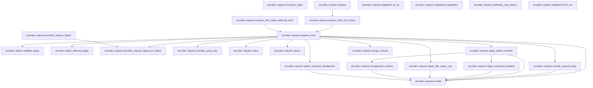
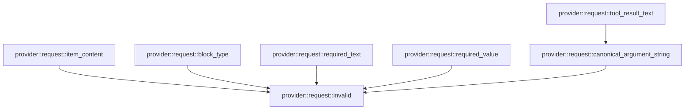

```mermaid
flowchart TD
  n0["provider::request::render_google"]
  n1["provider::request::google_function_response"]
  n2["provider::request::render_interactions"]
  n3["provider::request::render_tools"]
  n4["provider::request::normalize_tool_parameters"]
  n5["provider::request::anthropic_strict_subset"]
  n6["provider::request::anthropic_root_conditional"]
  n7["provider::request::kimi_nullable_constraints"]
  n8["provider::request::contains_composition_constraints"]
  n9["provider::request::contains_non_strict_object"]
  n10["provider::request::validate_tool_schema"]
  n11["provider::request::item_role"]
  n12["provider::request::sealed_fragments"]
  n13["provider::request::sealed_fragment_value"]
  n14["provider::request::degraded_file_text"]
  n15["provider::request::data_url"]
  n16["provider::request::item_content"]
  n17["provider::request::block_type"]
  n18["provider::request::required_text"]
  n19["provider::request::required_value"]
  n20["provider::request::invalid"]
  n21["provider::request::merge_controls"]
  n22["provider::request::render_responses"]
  n23["provider::request::render_anthropic"]
  n24["provider::request::render_chat"]
  n0 --> n11
  n0 --> n13
  n0 --> n16
  n0 --> n17
  n0 --> n18
  n0 --> n20
  n2 --> n11
  n2 --> n12
  n2 --> n16
  n2 --> n17
  n2 --> n18
  n2 --> n20
  n3 --> n4
  n3 --> n5
  n3 --> n7
  n3 --> n8
  n3 --> n9
  n3 --> n10
  n3 --> n18
  n3 --> n19
  n3 --> n20
  n5 --> n5
  n7 --> n7
  n7 --> n20
  n8 --> n8
  n10 --> n20
  n11 --> n20
  n12 --> n13
  n12 --> n20
  n13 --> n20
  n14 --> n18
  n14 --> n20
  n22 --> n11
  n22 --> n12
  n22 --> n16
  n22 --> n17
  n22 --> n18
  n22 --> n20
  n23 --> n11
  n23 --> n12
  n23 --> n16
  n23 --> n17
  n23 --> n18
  n23 --> n20
  n24 --> n11
  n24 --> n13
  n24 --> n16
  n24 --> n17
  n24 --> n18
  n24 --> n20
```

# provider::request

[Package atlas](index.md) · [Source](../../src/request.rs)

## Declarations

Visibility is the declaration spelling; trait members and reexports require their enclosing interface. `cfg` is not evaluated.

| Symbol | Kind | Visibility | Test / cfg |
|---|---|---|---|
| [provider::request::AdapterId](../../src/request.rs#L14) | enum_item | `pub` |  |
| [provider::request::AdapterId::as_str](../../src/request.rs#L24) | function_item | `pub` |  |
| [provider::request::AdapterId::capabilities](../../src/request.rs#L35) | function_item | `pub` |  |
| [provider::request::Err](../../src/request.rs#L54) | type_item | `private` |  |
| [provider::request::AdapterId::from_str](../../src/request.rs#L56) | function_item | `private` |  |
| [provider::request::ProviderCapabilities](../../src/request.rs#L69) | struct_item | `pub` |  |
| [provider::request::PrepareInput](../../src/request.rs#L76) | struct_item | `pub` |  |
| [provider::request::PreparedRequest](../../src/request.rs#L88) | struct_item | `pub` |  |
| [provider::request::PrepareError](../../src/request.rs#L102) | enum_item | `pub` |  |
| [provider::request::endpoint_origin](../../src/request.rs#L113) | function_item | `pub` |  |
| [provider::request::ToolChoice](../../src/request.rs#L126) | enum_item | `pub` |  |
| [provider::request::prepare](../../src/request.rs#L132) | function_item | `pub` |  |
| [provider::request::prepare_with_tool_choice](../../src/request.rs#L137) | function_item | `pub` |  |
| [provider::request::prepare_with_native_deferred_tools](../../src/request.rs#L144) | function_item | `pub` |  |
| [provider::request::prepare_inner](../../src/request.rs#L152) | function_item | `private` |  |
| [provider::request::encode_request_body](../../src/request.rs#L424) | function_item | `private` |  |
| [provider::request::provider_request_digest](../../src/request.rs#L477) | function_item | `pub` |  |
| [provider::request::provider_request_digest_for_dialect](../../src/request.rs#L488) | function_item | `pub` |  |
| [provider::request::provider_query_key](../../src/request.rs#L523) | function_item | `pub` |  |
| [provider::request::value](../../src/request.rs#L530) | function_item | `private` |  |
| [provider::request::values](../../src/request.rs#L534) | function_item | `private` |  |
| [provider::request::anthropic_max_tokens](../../src/request.rs#L543) | function_item | `private` |  |
| [provider::request::apply_dialect_controls](../../src/request.rs#L554) | function_item | `private` |  |
| [provider::request::apply_reasoning_disabled](../../src/request.rs#L671) | function_item | `private` |  |
| [provider::request::apply_title_output_cap](../../src/request.rs#L703) | function_item | `private` |  |
| [provider::request::unsupported_controls](../../src/request.rs#L732) | function_item | `private` |  |
| [provider::request::attach_anthropic_breakpoints](../../src/request.rs#L755) | function_item | `private` |  |
| [provider::request::merge_controls](../../src/request.rs#L788) | function_item | `private` |  |
| [provider::request::render_responses](../../src/request.rs#L806) | function_item | `private` |  |
| [provider::request::render_anthropic](../../src/request.rs#L866) | function_item | `private` |  |
| [provider::request::render_chat](../../src/request.rs#L959) | function_item | `private` |  |
| [provider::request::render_google](../../src/request.rs#L1053) | function_item | `private` |  |
| [provider::request::google_function_response](../../src/request.rs#L1113) | function_item | `private` |  |
| [provider::request::render_interactions](../../src/request.rs#L1130) | function_item | `private` |  |
| [provider::request::render_tools](../../src/request.rs#L1232) | function_item | `private` |  |
| [provider::request::normalize_tool_parameters](../../src/request.rs#L1282) | function_item | `private` |  |
| [provider::request::ANTHROPIC_STRICT_UNSUPPORTED](../../src/request.rs#L1299) | const_item | `private` |  |
| [provider::request::anthropic_strict_subset](../../src/request.rs#L1311) | function_item | `private` |  |
| [provider::request::anthropic_root_conditional](../../src/request.rs#L1338) | function_item | `private` |  |
| [provider::request::kimi_nullable_constraints](../../src/request.rs#L1377) | function_item | `private` |  |
| [provider::request::anthropic_conditional_tests::kimi_nullable_bounds_preserve_null_enum_and_reject_composition_collision](../../src/request.rs#L1452) | function_item | `private` | test; #[cfg(test)] |
| [provider::request::anthropic_conditional_tests::only_isolated_single_conditional_is_hoisted_without_losing_constraints](../../src/request.rs#L1471) | function_item | `private` | test; #[cfg(test)] |
| [provider::request::contains_composition_constraints](../../src/request.rs#L1494) | function_item | `private` |  |
| [provider::request::contains_non_strict_object](../../src/request.rs#L1509) | function_item | `private` |  |
| [provider::request::strict_optional_tests::mcp_schema_metadata_and_omitted_empty_required_render_without_losing_constraints](../../src/request.rs#L1544) | function_item | `private` | test; #[cfg(test)] |
| [provider::request::strict_optional_tests::unique_items_in_nullable_array_preserves_constraints_without_strict_mode](../../src/request.rs#L1565) | function_item | `private` | test; #[cfg(test)] |
| [provider::request::strict_optional_tests::optional_fields_keep_their_schema_and_disable_strict_mode](../../src/request.rs#L1582) | function_item | `private` | test; #[cfg(test)] |
| [provider::request::validate_tool_schema](../../src/request.rs#L1607) | function_item | `private` |  |
| [provider::request::item_role](../../src/request.rs#L1651) | function_item | `private` |  |
| [provider::request::sealed_fragments](../../src/request.rs#L1658) | function_item | `private` |  |
| [provider::request::sealed_fragment_value](../../src/request.rs#L1669) | function_item | `private` |  |
| [provider::request::DEGRADED_FILE_TEXT_LIMIT](../../src/request.rs#L1684) | const_item | `private` |  |
| [provider::request::degraded_file_text](../../src/request.rs#L1691) | function_item | `private` |  |
| [provider::request::data_url](../../src/request.rs#L1720) | function_item | `private` |  |
| [provider::request::item_content](../../src/request.rs#L1728) | function_item | `private` |  |
| [provider::request::block_type](../../src/request.rs#L1735) | function_item | `private` |  |
| [provider::request::required_text](../../src/request.rs#L1742) | function_item | `private` |  |
| [provider::request::required_value](../../src/request.rs#L1751) | function_item | `private` |  |
| [provider::request::tool_result_text](../../src/request.rs#L1761) | function_item | `private` |  |
| [provider::request::canonical_argument_string](../../src/request.rs#L1773) | function_item | `private` |  |
| [provider::request::invalid](../../src/request.rs#L1779) | function_item | `private` |  |
| [provider::request::file_degradation_tests::user](../../src/request.rs#L1788) | function_item | `private` | test; #[cfg(test)] |
| [provider::request::file_degradation_tests::file](../../src/request.rs#L1792) | function_item | `private` | test; #[cfg(test)] |
| [provider::request::file_degradation_tests::pdf_on_anthropic_is_still_a_document](../../src/request.rs#L1800) | function_item | `private` | test; #[cfg(test)] |
| [provider::request::file_degradation_tests::text_file_on_anthropic_degrades_to_fenced_text](../../src/request.rs#L1814) | function_item | `private` | test; #[cfg(test)] |
| [provider::request::file_degradation_tests::binary_file_on_chat_completions_degrades_to_the_stub](../../src/request.rs#L1827) | function_item | `private` | test; #[cfg(test)] |
| [provider::request::file_degradation_tests::oversized_utf8_file_degrades_to_the_stub](../../src/request.rs#L1845) | function_item | `private` | test; #[cfg(test)] |
| [provider::request::file_degradation_tests::text_file_on_responses_is_delivered_as_input_file](../../src/request.rs#L1873) | function_item | `private` | test; #[cfg(test)] |
| [provider::request::file_degradation_tests::google_and_interactions_degrade_in_their_native_text_forms](../../src/request.rs#L1898) | function_item | `private` | test; #[cfg(test)] |
| [provider::request::file_degradation_tests::image_files_are_never_degraded](../../src/request.rs#L1921) | function_item | `private` | test; #[cfg(test)] |
| [provider::request::anthropic_tool_adjacency_tests::a_bounded_schema_is_offered_to_anthropic_without_the_strict_claim](../../src/request.rs#L1945) | function_item | `private` | test; #[cfg(test)] |
| [provider::request::anthropic_tool_adjacency_tests::host_state_between_call_and_result_does_not_break_anthropic_adjacency](../../src/request.rs#L1984) | function_item | `private` | test; #[cfg(test)] |

## Imports / reexports

| Local name | Source path | Visibility |
|---|---|---|
| `BTreeMap` | `std::collections::BTreeMap` | `private` |
| `FromStr` | `std::str::FromStr` | `private` |
| `IJsonValue` | `schema::IJsonValue` | `private` |
| `Deserialize` | `serde::Deserialize` | `private` |
| `Serialize` | `serde::Serialize` | `private` |
| `Value` | `serde_json::Value` | `private` |
| `json` | `serde_json::json` | `private` |
| `Digest` | `sha2::Digest` | `private` |
| `Sha256` | `sha2::Sha256` | `private` |
| `Error` | `thiserror::Error` | `private` |
| `DialectId` | `crate::DialectId` | `private` |
| `ProviderTarget` | `crate::ProviderTarget` | `private` |
| `validate_target` | `crate::validate_target` | `private` |
| `*` | `super::*` | `private` |
| `*` | `super::*` | `private` |
| `*` | `super::*` | `private` |
| `_` | `base64::Engine` | `private` |
| `*` | `super::*` | `private` |

## Module declarations

| Module | Visibility | Attributes |
|---|---|---|
| `provider::request::anthropic_conditional_tests` | `private` | #[cfg(test)] |
| `provider::request::strict_optional_tests` | `private` | #[cfg(test)] |
| `provider::request::file_degradation_tests` | `private` | #[cfg(test)] |
| `provider::request::anthropic_tool_adjacency_tests` | `private` | #[cfg(test)] |

## Function call graphs

Edges below are syntactically resolved calls only, including private functions. Graphs partition callers into groups of 20; they are not execution order. All unresolved sites are listed below and in the JSON inventory.

Functions 1–20: 24 direct edges

Functions 21–40: 50 direct edges

Functions 41–47: 6 direct edges

## Call sites

Includes test functions (marked in declarations). Receiver-type-required sites need type analysis/manual tracing. Calls in closures are attributed to their enclosing function; their occurrence here does not mean the closure executes immediately.

| Caller | Callee expression | Source lines | Target / classification |
|---|---|---|---|
| `from_str` | `Ok` | [58](../../src/request.rs#L58), [59](../../src/request.rs#L59), [60](../../src/request.rs#L60), [61](../../src/request.rs#L61), [62](../../src/request.rs#L62) | external-constructor-callback-or-unresolved |
| `from_str` | `Err` | [63](../../src/request.rs#L63) | external-constructor-callback-or-unresolved |
| `from_str` | `PrepareError::UnknownAdapter` | [63](../../src/request.rs#L63) | external-constructor-callback-or-unresolved |
| `from_str` | `other.to_owned` | [63](../../src/request.rs#L63) | receiver-type-required |
| `endpoint_origin` | `reqwest::Url::parse(endpoint)         .map_err` | [114](../../src/request.rs#L114) | receiver-type-required |
| `endpoint_origin` | `reqwest::Url::parse` | [114](../../src/request.rs#L114) | external-constructor-callback-or-unresolved |
| `endpoint_origin` | `PrepareError::InvalidEndpoint` | [115](../../src/request.rs#L115), [118](../../src/request.rs#L118), [121](../../src/request.rs#L121) | external-constructor-callback-or-unresolved |
| `endpoint_origin` | `error.to_string` | [115](../../src/request.rs#L115) | receiver-type-required |
| `endpoint_origin` | `url         .host_str()         .ok_or_else` | [116](../../src/request.rs#L116) | receiver-type-required |
| `endpoint_origin` | `url         .host_str` | [116](../../src/request.rs#L116) | receiver-type-required |
| `endpoint_origin` | `"endpoint has no host".to_owned` | [118](../../src/request.rs#L118) | receiver-type-required |
| `endpoint_origin` | `url         .port_or_known_default()         .ok_or_else` | [119](../../src/request.rs#L119) | receiver-type-required |
| `endpoint_origin` | `url         .port_or_known_default` | [119](../../src/request.rs#L119) | receiver-type-required |
| `endpoint_origin` | `"endpoint has no known port".to_owned` | [121](../../src/request.rs#L121) | receiver-type-required |
| `endpoint_origin` | `Ok` | [122](../../src/request.rs#L122) | external-constructor-callback-or-unresolved |
| `prepare` | `prepare_with_tool_choice` | [133](../../src/request.rs#L133) | [provider::request::prepare_with_tool_choice](../../src/request.rs#L137) |
| `prepare_with_tool_choice` | `prepare_inner` | [141](../../src/request.rs#L141) | [provider::request::prepare_inner](../../src/request.rs#L152) |
| `prepare_with_native_deferred_tools` | `prepare_inner` | [149](../../src/request.rs#L149) | [provider::request::prepare_inner](../../src/request.rs#L152) |
| `prepare_with_native_deferred_tools` | `Some` | [149](../../src/request.rs#L149) | external-constructor-callback-or-unresolved |
| `prepare_inner` | `input.endpoint.trim_end_matches` | [157](../../src/request.rs#L157) | receiver-type-required |
| `prepare_inner` | `configured_base.starts_with` | [158](../../src/request.rs#L158), [159](../../src/request.rs#L159) | receiver-type-required |
| `prepare_inner` | `Err` | [161](../../src/request.rs#L161), [175](../../src/request.rs#L175), [182](../../src/request.rs#L182), [201](../../src/request.rs#L201), [222](../../src/request.rs#L222), [308](../../src/request.rs#L308), [337](../../src/request.rs#L337), [358](../../src/request.rs#L358) | external-constructor-callback-or-unresolved |
| `prepare_inner` | `PrepareError::InvalidEndpoint` | [161](../../src/request.rs#L161) | external-constructor-callback-or-unresolved |
| `prepare_inner` | `input.endpoint.clone` | [161](../../src/request.rs#L161) | receiver-type-required |
| `prepare_inner` | `validate_target(&input.target)         .map_err` | [163](../../src/request.rs#L163) | receiver-type-required |
| `prepare_inner` | `validate_target` | [163](../../src/request.rs#L163) | [provider::dialect::validate_target](../../src/dialect.rs#L714) |
| `prepare_inner` | `PrepareError::InvalidTarget` | [164](../../src/request.rs#L164), [175](../../src/request.rs#L175), [182](../../src/request.rs#L182) | external-constructor-callback-or-unresolved |
| `prepare_inner` | `error.to_string` | [164](../../src/request.rs#L164), [172](../../src/request.rs#L172) | receiver-type-required |
| `prepare_inner` | `dialect.family` | [166](../../src/request.rs#L166) | receiver-type-required |
| `prepare_inner` | `resolved.wire_model` | [167](../../src/request.rs#L167) | receiver-type-required |
| `prepare_inner` | `value` | [168](../../src/request.rs#L168), [196](../../src/request.rs#L196) | [provider::request::value](../../src/request.rs#L530) |
| `prepare_inner` | `profile.get` | [169](../../src/request.rs#L169), [179](../../src/request.rs#L179) | receiver-type-required |
| `prepare_inner` | `Some` | [170](../../src/request.rs#L170), [180](../../src/request.rs#L180) | external-constructor-callback-or-unresolved |
| `prepare_inner` | `serde_json::to_value(&input.target)                 .map_err` | [171](../../src/request.rs#L171) | receiver-type-required |
| `prepare_inner` | `serde_json::to_value` | [171](../../src/request.rs#L171) | external-constructor-callback-or-unresolved |
| `prepare_inner` | `PrepareError::InvalidJson` | [172](../../src/request.rs#L172), [222](../../src/request.rs#L222) | external-constructor-callback-or-unresolved |
| `prepare_inner` | `"epoch target does not match request target".to_owned` | [176](../../src/request.rs#L176) | receiver-type-required |
| `prepare_inner` | `profile.get("serializer_revision").and_then` | [179](../../src/request.rs#L179) | receiver-type-required |
| `prepare_inner` | `"epoch serializer revision does not match request target".to_owned` | [183](../../src/request.rs#L183) | receiver-type-required |
| `prepare_inner` | `profile         .get("system")         .and_then(Value::as_str)         .unwrap_or_default` | [186](../../src/request.rs#L186) | receiver-type-required |
| `prepare_inner` | `profile         .get("system")         .and_then` | [186](../../src/request.rs#L186) | receiver-type-required |
| `prepare_inner` | `profile         .get` | [186](../../src/request.rs#L186), [190](../../src/request.rs#L190) | receiver-type-required |
| `prepare_inner` | `profile         .get("controls")         .and_then(Value::as_object)         .cloned()         .unwrap_or_default` | [190](../../src/request.rs#L190) | receiver-type-required |
| `prepare_inner` | `profile         .get("controls")         .and_then(Value::as_object)         .cloned` | [190](../../src/request.rs#L190) | receiver-type-required |
| `prepare_inner` | `profile         .get("controls")         .and_then` | [190](../../src/request.rs#L190) | receiver-type-required |
| `prepare_inner` | `values` | [195](../../src/request.rs#L195) | [provider::request::values](../../src/request.rs#L534) |
| `prepare_inner` | `controls.remove` | [197](../../src/request.rs#L197), [198](../../src/request.rs#L198) | receiver-type-required |
| `prepare_inner` | `invalid` | [201](../../src/request.rs#L201), [211](../../src/request.rs#L211), [308](../../src/request.rs#L308), [337](../../src/request.rs#L337), [358](../../src/request.rs#L358) | [provider::request::invalid](../../src/request.rs#L1779) |
| `prepare_inner` | `controls         .remove("title_max_output_tokens")         .map(&#124;value&#124; {             value                 .as_u64()                 .filter(&#124;cap&#124; *cap > 0)                 .ok_or_else(&#124;&#124; invalid("title_max_output_tokens must be a positive integer"))         })         .transpose` | [205](../../src/request.rs#L205) | receiver-type-required |
| `prepare_inner` | `controls         .remove("title_max_output_tokens")         .map` | [205](../../src/request.rs#L205) | receiver-type-required |
| `prepare_inner` | `controls         .remove` | [205](../../src/request.rs#L205) | receiver-type-required |
| `prepare_inner` | `value                 .as_u64()                 .filter(&#124;cap&#124; *cap > 0)                 .ok_or_else` | [208](../../src/request.rs#L208) | receiver-type-required |
| `prepare_inner` | `value                 .as_u64()                 .filter` | [208](../../src/request.rs#L208) | receiver-type-required |
| `prepare_inner` | `value                 .as_u64` | [208](../../src/request.rs#L208) | receiver-type-required |
| `prepare_inner` | `apply_dialect_controls` | [214](../../src/request.rs#L214) | [provider::request::apply_dialect_controls](../../src/request.rs#L554) |
| `prepare_inner` | `Value::from` | [220](../../src/request.rs#L220), [259](../../src/request.rs#L259) | external-constructor-callback-or-unresolved |
| `prepare_inner` | `anthropic_max_tokens` | [220](../../src/request.rs#L220) | external-constructor-callback-or-unresolved |
| `prepare_inner` | `input.continuation_id.is_some` | [221](../../src/request.rs#L221) | receiver-type-required |
| `prepare_inner` | `dialect.server_managed` | [221](../../src/request.rs#L221) | receiver-type-required |
| `prepare_inner` | `"stateless adapter cannot receive continuation_id".to_owned` | [223](../../src/request.rs#L223) | receiver-type-required |
| `prepare_inner` | `"/responses".to_owned` | [228](../../src/request.rs#L228) | receiver-type-required |
| `prepare_inner` | `"/messages".to_owned` | [232](../../src/request.rs#L232) | receiver-type-required |
| `prepare_inner` | `"/interactions".to_owned` | [247](../../src/request.rs#L247) | receiver-type-required |
| `prepare_inner` | `"/chat/completions".to_owned` | [251](../../src/request.rs#L251) | receiver-type-required |
| `prepare_inner` | `resolved.max_output_tokens` | [256](../../src/request.rs#L256) | receiver-type-required |
| `prepare_inner` | `body.as_object_mut()                 .expect("chat body is an object")                 .insert` | [257](../../src/request.rs#L257) | receiver-type-required |
| `prepare_inner` | `body.as_object_mut()                 .expect` | [257](../../src/request.rs#L257) | receiver-type-required |
| `prepare_inner` | `body.as_object_mut` | [257](../../src/request.rs#L257), [263](../../src/request.rs#L263), [268](../../src/request.rs#L268), [274](../../src/request.rs#L274), [287](../../src/request.rs#L287) | receiver-type-required |
| `prepare_inner` | `"max_tokens".to_owned` | [259](../../src/request.rs#L259) | receiver-type-required |
| `prepare_inner` | `body.as_object_mut()             .expect("chat body is an object")             .insert` | [263](../../src/request.rs#L263) | receiver-type-required |
| `prepare_inner` | `body.as_object_mut()             .expect` | [263](../../src/request.rs#L263), [268](../../src/request.rs#L268), [287](../../src/request.rs#L287) | receiver-type-required |
| `prepare_inner` | `"stream_options".to_owned` | [265](../../src/request.rs#L265) | receiver-type-required |
| `prepare_inner` | `body.as_object_mut()             .expect("Responses body is an object")             .insert` | [268](../../src/request.rs#L268) | receiver-type-required |
| `prepare_inner` | `"store".to_owned` | [270](../../src/request.rs#L270) | receiver-type-required |
| `prepare_inner` | `Value::Bool` | [270](../../src/request.rs#L270) | external-constructor-callback-or-unresolved |
| `prepare_inner` | `attach_anthropic_breakpoints` | [273](../../src/request.rs#L273) | [provider::request::attach_anthropic_breakpoints](../../src/request.rs#L755) |
| `prepare_inner` | `body.as_object_mut().expect` | [274](../../src/request.rs#L274) | receiver-type-required |
| `prepare_inner` | `resolved.refusal_fallback` | [275](../../src/request.rs#L275), [381](../../src/request.rs#L381) | receiver-type-required |
| `prepare_inner` | `object.insert` | [276](../../src/request.rs#L276) | receiver-type-required |
| `prepare_inner` | `"fallbacks".to_owned` | [276](../../src/request.rs#L276) | receiver-type-required |
| `prepare_inner` | `Value::String` | [276](../../src/request.rs#L276), [289](../../src/request.rs#L289) | external-constructor-callback-or-unresolved |
| `prepare_inner` | `"default".to_owned` | [276](../../src/request.rs#L276) | receiver-type-required |
| `prepare_inner` | `body.as_object_mut()             .expect("adapter request bodies are objects")             .insert` | [287](../../src/request.rs#L287) | receiver-type-required |
| `prepare_inner` | `field.to_owned` | [289](../../src/request.rs#L289) | receiver-type-required |
| `prepare_inner` | `continuation.clone` | [289](../../src/request.rs#L289) | receiver-type-required |
| `prepare_inner` | `merge_controls` | [291](../../src/request.rs#L291) | [provider::request::merge_controls](../../src/request.rs#L788) |
| `prepare_inner` | `apply_title_output_cap` | [293](../../src/request.rs#L293) | [provider::request::apply_title_output_cap](../../src/request.rs#L703) |
| `prepare_inner` | `tools.as_array().is_none_or` | [307](../../src/request.rs#L307) | receiver-type-required |
| `prepare_inner` | `tools.as_array` | [307](../../src/request.rs#L307) | receiver-type-required |
| `prepare_inner` | `resolved.forced_tool_choice` | [322](../../src/request.rs#L322) | receiver-type-required |
| `prepare_inner` | `item                 .get("content")                 .and_then(Value::as_array)                 .into_iter()                 .flatten` | [345](../../src/request.rs#L345) | receiver-type-required |
| `prepare_inner` | `item                 .get("content")                 .and_then(Value::as_array)                 .into_iter` | [345](../../src/request.rs#L345) | receiver-type-required |
| `prepare_inner` | `item                 .get("content")                 .and_then` | [345](../../src/request.rs#L345) | receiver-type-required |
| `prepare_inner` | `item                 .get` | [345](../../src/request.rs#L345) | receiver-type-required |
| `prepare_inner` | `native                         .references                         .iter()                         .any` | [353](../../src/request.rs#L353) | receiver-type-required |
| `prepare_inner` | `native                         .references                         .iter` | [353](../../src/request.rs#L353) | receiver-type-required |
| `prepare_inner` | `crate::native_deferred::apply` | [364](../../src/request.rs#L364) | [provider::native_deferred::apply](../../src/native_deferred.rs#L36) |
| `prepare_inner` | `encode_request_body` | [366](../../src/request.rs#L366) | [provider::request::encode_request_body](../../src/request.rs#L424) |
| `prepare_inner` | `BTreeMap::from` | [367](../../src/request.rs#L367) | external-constructor-callback-or-unresolved |
| `prepare_inner` | `"accept".to_owned` | [369](../../src/request.rs#L369) | receiver-type-required |
| `prepare_inner` | `if input.stream {                 "text/event-stream"             } else {                 "application/json"             }             .to_owned` | [370](../../src/request.rs#L370) | receiver-type-required |
| `prepare_inner` | `"content-type".to_owned` | [377](../../src/request.rs#L377) | receiver-type-required |
| `prepare_inner` | `"application/json".to_owned` | [377](../../src/request.rs#L377) | receiver-type-required |
| `prepare_inner` | `headers_without_secret.insert` | [380](../../src/request.rs#L380), [382](../../src/request.rs#L382) | receiver-type-required |
| `prepare_inner` | `"anthropic-version".to_owned` | [380](../../src/request.rs#L380) | receiver-type-required |
| `prepare_inner` | `"2023-06-01".to_owned` | [380](../../src/request.rs#L380) | receiver-type-required |
| `prepare_inner` | `"anthropic-beta".to_owned` | [383](../../src/request.rs#L383), [391](../../src/request.rs#L391) | receiver-type-required |
| `prepare_inner` | `"server-side-fallback-2026-07-01".to_owned` | [384](../../src/request.rs#L384) | receiver-type-required |
| `prepare_inner` | `headers_without_secret             .entry("anthropic-beta".to_owned())             .or_default` | [390](../../src/request.rs#L390) | receiver-type-required |
| `prepare_inner` | `headers_without_secret             .entry` | [390](../../src/request.rs#L390) | receiver-type-required |
| `prepare_inner` | `beta.is_empty` | [393](../../src/request.rs#L393) | receiver-type-required |
| `prepare_inner` | `beta.push` | [394](../../src/request.rs#L394) | receiver-type-required |
| `prepare_inner` | `beta.push_str` | [396](../../src/request.rs#L396) | receiver-type-required |
| `prepare_inner` | `provider_request_digest_for_dialect` | [398](../../src/request.rs#L398) | [provider::request::provider_request_digest_for_dialect](../../src/request.rs#L488) |
| `prepare_inner` | `dialect.as_str` | [399](../../src/request.rs#L399) | receiver-type-required |
| `prepare_inner` | `adapter.capabilities` | [406](../../src/request.rs#L406) | receiver-type-required |
| `prepare_inner` | `capabilities         .query_by_identity         .then` | [407](../../src/request.rs#L407) | receiver-type-required |
| `prepare_inner` | `provider_query_key` | [409](../../src/request.rs#L409) | [provider::request::provider_query_key](../../src/request.rs#L523) |
| `prepare_inner` | `Ok` | [410](../../src/request.rs#L410) | external-constructor-callback-or-unresolved |
| `prepare_inner` | `"POST".to_owned` | [411](../../src/request.rs#L411) | receiver-type-required |
| `prepare_inner` | `u64::try_from(body.len()).unwrap_or` | [416](../../src/request.rs#L416) | receiver-type-required |
| `prepare_inner` | `u64::try_from` | [416](../../src/request.rs#L416) | external-constructor-callback-or-unresolved |
| `prepare_inner` | `body.len` | [416](../../src/request.rs#L416) | receiver-type-required |
| `encode_request_body` | `serde_json_canonicalizer::to_vec(body)             .map_err` | [429](../../src/request.rs#L429) | receiver-type-required |
| `encode_request_body` | `serde_json_canonicalizer::to_vec` | [429](../../src/request.rs#L429), [469](../../src/request.rs#L469) | external-constructor-callback-or-unresolved |
| `encode_request_body` | `PrepareError::InvalidJson` | [430](../../src/request.rs#L430), [465](../../src/request.rs#L465), [470](../../src/request.rs#L470) | external-constructor-callback-or-unresolved |
| `encode_request_body` | `error.to_string` | [430](../../src/request.rs#L430), [465](../../src/request.rs#L465), [470](../../src/request.rs#L470) | receiver-type-required |
| `encode_request_body` | `body         .as_object()         .ok_or_else` | [432](../../src/request.rs#L432) | receiver-type-required |
| `encode_request_body` | `body         .as_object` | [432](../../src/request.rs#L432) | receiver-type-required |
| `encode_request_body` | `invalid` | [434](../../src/request.rs#L434), [448](../../src/request.rs#L448) | [provider::request::invalid](../../src/request.rs#L1779) |
| `encode_request_body` | `object.keys().any` | [447](../../src/request.rs#L447) | receiver-type-required |
| `encode_request_body` | `object.keys` | [447](../../src/request.rs#L447) | receiver-type-required |
| `encode_request_body` | `order.contains` | [447](../../src/request.rs#L447) | receiver-type-required |
| `encode_request_body` | `key.as_str` | [447](../../src/request.rs#L447) | receiver-type-required |
| `encode_request_body` | `Err` | [448](../../src/request.rs#L448) | external-constructor-callback-or-unresolved |
| `encode_request_body` | `object.get` | [456](../../src/request.rs#L456) | receiver-type-required |
| `encode_request_body` | `bytes.push` | [460](../../src/request.rs#L460), [467](../../src/request.rs#L467), [473](../../src/request.rs#L473) | receiver-type-required |
| `encode_request_body` | `bytes.extend_from_slice` | [463](../../src/request.rs#L463), [468](../../src/request.rs#L468) | receiver-type-required |
| `encode_request_body` | `serde_json::to_vec(key)                 .map_err` | [464](../../src/request.rs#L464) | receiver-type-required |
| `encode_request_body` | `serde_json::to_vec` | [464](../../src/request.rs#L464) | external-constructor-callback-or-unresolved |
| `encode_request_body` | `serde_json_canonicalizer::to_vec(value)                 .map_err` | [469](../../src/request.rs#L469) | receiver-type-required |
| `encode_request_body` | `Ok` | [474](../../src/request.rs#L474) | external-constructor-callback-or-unresolved |
| `provider_request_digest` | `provider_request_digest_for_dialect` | [485](../../src/request.rs#L485) | [provider::request::provider_request_digest_for_dialect](../../src/request.rs#L488) |
| `provider_request_digest` | `adapter.as_str` | [485](../../src/request.rs#L485) | receiver-type-required |
| `provider_request_digest_for_dialect` | `headers         .keys()         .any` | [496](../../src/request.rs#L496) | receiver-type-required |
| `provider_request_digest_for_dialect` | `headers         .keys` | [496](../../src/request.rs#L496) | receiver-type-required |
| `provider_request_digest_for_dialect` | `name.to_ascii_lowercase` | [498](../../src/request.rs#L498) | receiver-type-required |
| `provider_request_digest_for_dialect` | `Err` | [500](../../src/request.rs#L500) | external-constructor-callback-or-unresolved |
| `provider_request_digest_for_dialect` | `PrepareError::InvalidJson` | [500](../../src/request.rs#L500), [505](../../src/request.rs#L505) | external-constructor-callback-or-unresolved |
| `provider_request_digest_for_dialect` | `"header names must be lowercase".to_owned` | [501](../../src/request.rs#L501) | receiver-type-required |
| `provider_request_digest_for_dialect` | `serde_json_canonicalizer::to_vec(headers)         .map_err` | [504](../../src/request.rs#L504) | receiver-type-required |
| `provider_request_digest_for_dialect` | `serde_json_canonicalizer::to_vec` | [504](../../src/request.rs#L504) | external-constructor-callback-or-unresolved |
| `provider_request_digest_for_dialect` | `error.to_string` | [505](../../src/request.rs#L505) | receiver-type-required |
| `provider_request_digest_for_dialect` | `Sha256::new` | [506](../../src/request.rs#L506) | external-constructor-callback-or-unresolved |
| `provider_request_digest_for_dialect` | `hasher.update` | [507](../../src/request.rs#L507), [508](../../src/request.rs#L508), [509](../../src/request.rs#L509), [510](../../src/request.rs#L510), [511](../../src/request.rs#L511), [512](../../src/request.rs#L512), [513](../../src/request.rs#L513), [514](../../src/request.rs#L514), [515](../../src/request.rs#L515), [516](../../src/request.rs#L516), [517](../../src/request.rs#L517), [518](../../src/request.rs#L518) | receiver-type-required |
| `provider_request_digest_for_dialect` | `dialect_id.as_bytes` | [508](../../src/request.rs#L508) | receiver-type-required |
| `provider_request_digest_for_dialect` | `method.to_ascii_uppercase().as_bytes` | [510](../../src/request.rs#L510) | receiver-type-required |
| `provider_request_digest_for_dialect` | `method.to_ascii_uppercase` | [510](../../src/request.rs#L510) | receiver-type-required |
| `provider_request_digest_for_dialect` | `final_url.as_bytes` | [512](../../src/request.rs#L512) | receiver-type-required |
| `provider_request_digest_for_dialect` | `model.as_bytes` | [514](../../src/request.rs#L514) | receiver-type-required |
| `provider_request_digest_for_dialect` | `Ok` | [519](../../src/request.rs#L519) | external-constructor-callback-or-unresolved |
| `provider_query_key` | `Sha256::new` | [524](../../src/request.rs#L524) | external-constructor-callback-or-unresolved |
| `provider_query_key` | `hasher.update` | [525](../../src/request.rs#L525), [526](../../src/request.rs#L526) | receiver-type-required |
| `provider_query_key` | `attempt_id.as_bytes` | [526](../../src/request.rs#L526) | receiver-type-required |
| `value` | `serde_json::to_value(value).expect` | [531](../../src/request.rs#L531) | receiver-type-required |
| `value` | `serde_json::to_value` | [531](../../src/request.rs#L531) | external-constructor-callback-or-unresolved |
| `values` | `values.iter().map(value).collect` | [535](../../src/request.rs#L535) | receiver-type-required |
| `values` | `values.iter().map` | [535](../../src/request.rs#L535) | receiver-type-required |
| `values` | `values.iter` | [535](../../src/request.rs#L535) | receiver-type-required |
| `anthropic_max_tokens` | `profile.max_output_tokens` | [544](../../src/request.rs#L544) | receiver-type-required |
| `apply_dialect_controls` | `controls.is_empty` | [564](../../src/request.rs#L564) | receiver-type-required |
| `apply_dialect_controls` | `unsupported_controls` | [565](../../src/request.rs#L565) | [provider::request::unsupported_controls](../../src/request.rs#L732) |
| `apply_dialect_controls` | `apply_reasoning_disabled` | [568](../../src/request.rs#L568) | [provider::request::apply_reasoning_disabled](../../src/request.rs#L671) |
| `apply_dialect_controls` | `reasoning_effort.is_some` | [568](../../src/request.rs#L568) | receiver-type-required |
| `apply_dialect_controls` | `reasoning_effort         .as_ref()         .map(&#124;value&#124; {             let value = value                 .as_str()                 .ok_or_else(&#124;&#124; invalid("reasoning_effort must be a string"))?;             profile                 .reasoning_efforts()                 .iter()                 .any(&#124;item&#124; item == value)                 .then_some(value)                 .ok_or_else(&#124;&#124; {                     invalid(format!(                         "reasoning_effort {value} is unsupported by exact dialect {}",                         dialect.as_str()                     ))                 })         })         .transpose` | [570](../../src/request.rs#L570) | receiver-type-required |
| `apply_dialect_controls` | `reasoning_effort         .as_ref()         .map` | [570](../../src/request.rs#L570) | receiver-type-required |
| `apply_dialect_controls` | `reasoning_effort         .as_ref` | [570](../../src/request.rs#L570) | receiver-type-required |
| `apply_dialect_controls` | `value                 .as_str()                 .ok_or_else` | [573](../../src/request.rs#L573) | receiver-type-required |
| `apply_dialect_controls` | `value                 .as_str` | [573](../../src/request.rs#L573) | receiver-type-required |
| `apply_dialect_controls` | `invalid` | [575](../../src/request.rs#L575), [582](../../src/request.rs#L582), [641](../../src/request.rs#L641) | [provider::request::invalid](../../src/request.rs#L1779) |
| `apply_dialect_controls` | `profile                 .reasoning_efforts()                 .iter()                 .any(&#124;item&#124; item == value)                 .then_some(value)                 .ok_or_else` | [576](../../src/request.rs#L576) | receiver-type-required |
| `apply_dialect_controls` | `profile                 .reasoning_efforts()                 .iter()                 .any(&#124;item&#124; item == value)                 .then_some` | [576](../../src/request.rs#L576) | receiver-type-required |
| `apply_dialect_controls` | `profile                 .reasoning_efforts()                 .iter()                 .any` | [576](../../src/request.rs#L576) | receiver-type-required |
| `apply_dialect_controls` | `profile                 .reasoning_efforts()                 .iter` | [576](../../src/request.rs#L576) | receiver-type-required |
| `apply_dialect_controls` | `profile                 .reasoning_efforts` | [576](../../src/request.rs#L576) | receiver-type-required |
| `apply_dialect_controls` | `effort.is_some` | [590](../../src/request.rs#L590), [593](../../src/request.rs#L593), [597](../../src/request.rs#L597), [600](../../src/request.rs#L600), [622](../../src/request.rs#L622), [631](../../src/request.rs#L631), [652](../../src/request.rs#L652) | receiver-type-required |
| `apply_dialect_controls` | `controls.insert` | [591](../../src/request.rs#L591), [594](../../src/request.rs#L594), [595](../../src/request.rs#L595), [598](../../src/request.rs#L598), [601](../../src/request.rs#L601), [602](../../src/request.rs#L602), [614](../../src/request.rs#L614), [619](../../src/request.rs#L619), [623](../../src/request.rs#L623), [647](../../src/request.rs#L647), [653](../../src/request.rs#L653) | receiver-type-required |
| `apply_dialect_controls` | `"reasoning".to_owned` | [591](../../src/request.rs#L591) | receiver-type-required |
| `apply_dialect_controls` | `"reasoning_effort".to_owned` | [594](../../src/request.rs#L594), [598](../../src/request.rs#L598), [601](../../src/request.rs#L601) | receiver-type-required |
| `apply_dialect_controls` | `"thinking".to_owned` | [595](../../src/request.rs#L595), [603](../../src/request.rs#L603), [615](../../src/request.rs#L615), [624](../../src/request.rs#L624) | receiver-type-required |
| `apply_dialect_controls` | `profile.thinking_wire` | [608](../../src/request.rs#L608) | receiver-type-required |
| `apply_dialect_controls` | `"output_config".to_owned` | [619](../../src/request.rs#L619) | receiver-type-required |
| `apply_dialect_controls` | `Err` | [641](../../src/request.rs#L641) | external-constructor-callback-or-unresolved |
| `apply_dialect_controls` | `"generationConfig".to_owned` | [648](../../src/request.rs#L648) | receiver-type-required |
| `apply_dialect_controls` | `"generation_config".to_owned` | [654](../../src/request.rs#L654) | receiver-type-required |
| `apply_dialect_controls` | `profile.pro_reasoning` | [660](../../src/request.rs#L660) | receiver-type-required |
| `apply_dialect_controls` | `controls.entry("reasoning").or_insert_with` | [661](../../src/request.rs#L661) | receiver-type-required |
| `apply_dialect_controls` | `controls.entry` | [661](../../src/request.rs#L661) | receiver-type-required |
| `apply_dialect_controls` | `Ok` | [663](../../src/request.rs#L663) | external-constructor-callback-or-unresolved |
| `apply_reasoning_disabled` | `Err` | [677](../../src/request.rs#L677), [689](../../src/request.rs#L689) | external-constructor-callback-or-unresolved |
| `apply_reasoning_disabled` | `invalid` | [677](../../src/request.rs#L677), [689](../../src/request.rs#L689) | [provider::request::invalid](../../src/request.rs#L1779) |
| `apply_reasoning_disabled` | `controls.insert` | [683](../../src/request.rs#L683), [686](../../src/request.rs#L686) | receiver-type-required |
| `apply_reasoning_disabled` | `"reasoning".to_owned` | [683](../../src/request.rs#L683) | receiver-type-required |
| `apply_reasoning_disabled` | `"thinking".to_owned` | [686](../../src/request.rs#L686) | receiver-type-required |
| `apply_reasoning_disabled` | `Ok` | [695](../../src/request.rs#L695) | external-constructor-callback-or-unresolved |
| `apply_title_output_cap` | `body         .as_object_mut()         .ok_or_else` | [708](../../src/request.rs#L708) | receiver-type-required |
| `apply_title_output_cap` | `body         .as_object_mut` | [708](../../src/request.rs#L708) | receiver-type-required |
| `apply_title_output_cap` | `invalid` | [710](../../src/request.rs#L710), [723](../../src/request.rs#L723) | [provider::request::invalid](../../src/request.rs#L1779) |
| `apply_title_output_cap` | `object.insert` | [713](../../src/request.rs#L713), [720](../../src/request.rs#L720) | receiver-type-required |
| `apply_title_output_cap` | `"max_output_tokens".to_owned` | [713](../../src/request.rs#L713) | receiver-type-required |
| `apply_title_output_cap` | `Value::from` | [713](../../src/request.rs#L713), [720](../../src/request.rs#L720) | external-constructor-callback-or-unresolved |
| `apply_title_output_cap` | `object                 .get("max_tokens")                 .and_then(Value::as_u64)                 .map_or` | [716](../../src/request.rs#L716) | receiver-type-required |
| `apply_title_output_cap` | `object                 .get("max_tokens")                 .and_then` | [716](../../src/request.rs#L716) | receiver-type-required |
| `apply_title_output_cap` | `object                 .get` | [716](../../src/request.rs#L716) | receiver-type-required |
| `apply_title_output_cap` | `c.min` | [719](../../src/request.rs#L719) | receiver-type-required |
| `apply_title_output_cap` | `"max_tokens".to_owned` | [720](../../src/request.rs#L720) | receiver-type-required |
| `apply_title_output_cap` | `Err` | [723](../../src/request.rs#L723) | external-constructor-callback-or-unresolved |
| `apply_title_output_cap` | `Ok` | [729](../../src/request.rs#L729) | external-constructor-callback-or-unresolved |
| `unsupported_controls` | `Err` | [736](../../src/request.rs#L736) | external-constructor-callback-or-unresolved |
| `unsupported_controls` | `invalid` | [736](../../src/request.rs#L736) | [provider::request::invalid](../../src/request.rs#L1779) |
| `attach_anthropic_breakpoints` | `body         .get_mut("tools")         .and_then(Value::as_array_mut)         .and_then` | [757](../../src/request.rs#L757) | receiver-type-required |
| `attach_anthropic_breakpoints` | `body         .get_mut("tools")         .and_then` | [757](../../src/request.rs#L757) | receiver-type-required |
| `attach_anthropic_breakpoints` | `body         .get_mut` | [757](../../src/request.rs#L757), [766](../../src/request.rs#L766) | receiver-type-required |
| `attach_anthropic_breakpoints` | `tools.last_mut` | [760](../../src/request.rs#L760) | receiver-type-required |
| `attach_anthropic_breakpoints` | `tool.as_object_mut()             .ok_or_else(&#124;&#124; invalid("tool declaration must be an object"))?             .insert` | [762](../../src/request.rs#L762) | receiver-type-required |
| `attach_anthropic_breakpoints` | `tool.as_object_mut()             .ok_or_else` | [762](../../src/request.rs#L762) | receiver-type-required |
| `attach_anthropic_breakpoints` | `tool.as_object_mut` | [762](../../src/request.rs#L762) | receiver-type-required |
| `attach_anthropic_breakpoints` | `invalid` | [763](../../src/request.rs#L763), [781](../../src/request.rs#L781) | [provider::request::invalid](../../src/request.rs#L1779) |
| `attach_anthropic_breakpoints` | `"cache_control".to_owned` | [764](../../src/request.rs#L764), [782](../../src/request.rs#L782) | receiver-type-required |
| `attach_anthropic_breakpoints` | `marker.clone` | [764](../../src/request.rs#L764) | receiver-type-required |
| `attach_anthropic_breakpoints` | `body         .get_mut("messages")         .and_then(Value::as_array_mut)         .and_then(&#124;messages&#124; messages.last_mut())         .and_then(&#124;message&#124; message.get_mut("content"))         .and_then(Value::as_array_mut)         .and_then` | [766](../../src/request.rs#L766) | receiver-type-required |
| `attach_anthropic_breakpoints` | `body         .get_mut("messages")         .and_then(Value::as_array_mut)         .and_then(&#124;messages&#124; messages.last_mut())         .and_then(&#124;message&#124; message.get_mut("content"))         .and_then` | [766](../../src/request.rs#L766) | receiver-type-required |
| `attach_anthropic_breakpoints` | `body         .get_mut("messages")         .and_then(Value::as_array_mut)         .and_then(&#124;messages&#124; messages.last_mut())         .and_then` | [766](../../src/request.rs#L766) | receiver-type-required |
| `attach_anthropic_breakpoints` | `body         .get_mut("messages")         .and_then(Value::as_array_mut)         .and_then` | [766](../../src/request.rs#L766) | receiver-type-required |
| `attach_anthropic_breakpoints` | `body         .get_mut("messages")         .and_then` | [766](../../src/request.rs#L766) | receiver-type-required |
| `attach_anthropic_breakpoints` | `messages.last_mut` | [769](../../src/request.rs#L769) | receiver-type-required |
| `attach_anthropic_breakpoints` | `message.get_mut` | [770](../../src/request.rs#L770) | receiver-type-required |
| `attach_anthropic_breakpoints` | `content.last_mut` | [772](../../src/request.rs#L772) | receiver-type-required |
| `attach_anthropic_breakpoints` | `block                 .as_object_mut()                 .ok_or_else(&#124;&#124; invalid("content block must be an object"))?                 .insert` | [779](../../src/request.rs#L779) | receiver-type-required |
| `attach_anthropic_breakpoints` | `block                 .as_object_mut()                 .ok_or_else` | [779](../../src/request.rs#L779) | receiver-type-required |
| `attach_anthropic_breakpoints` | `block                 .as_object_mut` | [779](../../src/request.rs#L779) | receiver-type-required |
| `attach_anthropic_breakpoints` | `Ok` | [785](../../src/request.rs#L785) | external-constructor-callback-or-unresolved |
| `merge_controls` | `body         .as_object_mut()         .ok_or_else` | [792](../../src/request.rs#L792) | receiver-type-required |
| `merge_controls` | `body         .as_object_mut` | [792](../../src/request.rs#L792) | receiver-type-required |
| `merge_controls` | `PrepareError::InvalidJson` | [794](../../src/request.rs#L794), [797](../../src/request.rs#L797) | external-constructor-callback-or-unresolved |
| `merge_controls` | `"request body is not an object".to_owned` | [794](../../src/request.rs#L794) | receiver-type-required |
| `merge_controls` | `object.contains_key` | [796](../../src/request.rs#L796) | receiver-type-required |
| `merge_controls` | `Err` | [797](../../src/request.rs#L797) | external-constructor-callback-or-unresolved |
| `merge_controls` | `object.insert` | [801](../../src/request.rs#L801) | receiver-type-required |
| `merge_controls` | `Ok` | [803](../../src/request.rs#L803) | external-constructor-callback-or-unresolved |
| `render_responses` | `Vec::new` | [807](../../src/request.rs#L807), [815](../../src/request.rs#L815) | external-constructor-callback-or-unresolved |
| `render_responses` | `sealed_fragments` | [809](../../src/request.rs#L809) | [provider::request::sealed_fragments](../../src/request.rs#L1658) |
| `render_responses` | `output.extend` | [810](../../src/request.rs#L810) | receiver-type-required |
| `render_responses` | `item_role` | [813](../../src/request.rs#L813) | [provider::request::item_role](../../src/request.rs#L1651) |
| `render_responses` | `item_content` | [814](../../src/request.rs#L814) | [provider::request::item_content](../../src/request.rs#L1728) |
| `render_responses` | `block_type` | [817](../../src/request.rs#L817) | [provider::request::block_type](../../src/request.rs#L1735) |
| `render_responses` | `blocks.push` | [818](../../src/request.rs#L818), [833](../../src/request.rs#L833), [841](../../src/request.rs#L841), [846](../../src/request.rs#L846), [852](../../src/request.rs#L852) | receiver-type-required |
| `render_responses` | `output.push` | [822](../../src/request.rs#L822), [828](../../src/request.rs#L828), [860](../../src/request.rs#L860) | receiver-type-required |
| `render_responses` | `required_text(block, "mime")?.starts_with` | [838](../../src/request.rs#L838) | receiver-type-required |
| `render_responses` | `required_text` | [838](../../src/request.rs#L838) | [provider::request::required_text](../../src/request.rs#L1742) |
| `render_responses` | `dialect.input_blocks().contains` | [839](../../src/request.rs#L839), [846](../../src/request.rs#L846) | receiver-type-required |
| `render_responses` | `dialect.input_blocks` | [839](../../src/request.rs#L839), [846](../../src/request.rs#L846) | receiver-type-required |
| `render_responses` | `Err` | [856](../../src/request.rs#L856) | external-constructor-callback-or-unresolved |
| `render_responses` | `invalid` | [856](../../src/request.rs#L856) | [provider::request::invalid](../../src/request.rs#L1779) |
| `render_responses` | `blocks.is_empty` | [859](../../src/request.rs#L859) | receiver-type-required |
| `render_responses` | `Ok` | [863](../../src/request.rs#L863) | external-constructor-callback-or-unresolved |
| `render_anthropic` | `Vec::new` | [867](../../src/request.rs#L867), [874](../../src/request.rs#L874), [937](../../src/request.rs#L937) | external-constructor-callback-or-unresolved |
| `render_anthropic` | `sealed_fragments` | [869](../../src/request.rs#L869) | [provider::request::sealed_fragments](../../src/request.rs#L1658) |
| `render_anthropic` | `messages.push` | [870](../../src/request.rs#L870), [931](../../src/request.rs#L931) | receiver-type-required |
| `render_anthropic` | `item_role` | [873](../../src/request.rs#L873) | [provider::request::item_role](../../src/request.rs#L1651) |
| `render_anthropic` | `item_content` | [875](../../src/request.rs#L875) | [provider::request::item_content](../../src/request.rs#L1728) |
| `render_anthropic` | `block_type` | [876](../../src/request.rs#L876) | [provider::request::block_type](../../src/request.rs#L1735) |
| `render_anthropic` | `blocks.push` | [878](../../src/request.rs#L878), [880](../../src/request.rs#L880), [898](../../src/request.rs#L898), [904](../../src/request.rs#L904), [909](../../src/request.rs#L909), [915](../../src/request.rs#L915), [921](../../src/request.rs#L921) | receiver-type-required |
| `render_anthropic` | `dialect.supports_reasoning_blocks` | [880](../../src/request.rs#L880) | receiver-type-required |
| `render_anthropic` | `Err` | [884](../../src/request.rs#L884), [893](../../src/request.rs#L893), [927](../../src/request.rs#L927) | external-constructor-callback-or-unresolved |
| `render_anthropic` | `invalid` | [884](../../src/request.rs#L884), [893](../../src/request.rs#L893), [927](../../src/request.rs#L927) | [provider::request::invalid](../../src/request.rs#L1779) |
| `render_anthropic` | `required_text` | [890](../../src/request.rs#L890) | [provider::request::required_text](../../src/request.rs#L1742) |
| `render_anthropic` | `mime.starts_with` | [891](../../src/request.rs#L891) | receiver-type-required |
| `render_anthropic` | `dialect.input_blocks().contains` | [892](../../src/request.rs#L892), [902](../../src/request.rs#L902) | receiver-type-required |
| `render_anthropic` | `dialect.input_blocks` | [892](../../src/request.rs#L892), [902](../../src/request.rs#L902) | receiver-type-required |
| `render_anthropic` | `merged.last().is_some_and` | [939](../../src/request.rs#L939) | receiver-type-required |
| `render_anthropic` | `merged.last` | [939](../../src/request.rs#L939) | receiver-type-required |
| `render_anthropic` | `merged.last_mut().unwrap()["content"]                 .as_array_mut()                 .unwrap()                 .extend` | [940](../../src/request.rs#L940) | receiver-type-required |
| `render_anthropic` | `merged.last_mut().unwrap()["content"]                 .as_array_mut()                 .unwrap` | [940](../../src/request.rs#L940) | receiver-type-required |
| `render_anthropic` | `merged.last_mut().unwrap()["content"]                 .as_array_mut` | [940](../../src/request.rs#L940) | receiver-type-required |
| `render_anthropic` | `merged.last_mut().unwrap` | [940](../../src/request.rs#L940) | receiver-type-required |
| `render_anthropic` | `merged.last_mut` | [940](../../src/request.rs#L940) | receiver-type-required |
| `render_anthropic` | `message["content"].as_array().unwrap().iter().cloned` | [943](../../src/request.rs#L943) | receiver-type-required |
| `render_anthropic` | `message["content"].as_array().unwrap().iter` | [943](../../src/request.rs#L943) | receiver-type-required |
| `render_anthropic` | `message["content"].as_array().unwrap` | [943](../../src/request.rs#L943) | receiver-type-required |
| `render_anthropic` | `message["content"].as_array` | [943](../../src/request.rs#L943) | receiver-type-required |
| `render_anthropic` | `merged.push` | [945](../../src/request.rs#L945) | receiver-type-required |
| `render_anthropic` | `message["content"]                 .as_array_mut()                 .unwrap()                 .sort_by_key` | [950](../../src/request.rs#L950) | receiver-type-required |
| `render_anthropic` | `message["content"]                 .as_array_mut()                 .unwrap` | [950](../../src/request.rs#L950) | receiver-type-required |
| `render_anthropic` | `message["content"]                 .as_array_mut` | [950](../../src/request.rs#L950) | receiver-type-required |
| `render_anthropic` | `Ok` | [956](../../src/request.rs#L956) | external-constructor-callback-or-unresolved |
| `render_chat` | `Vec::new` | [964](../../src/request.rs#L964) | external-constructor-callback-or-unresolved |
| `render_chat` | `system.is_empty` | [965](../../src/request.rs#L965) | receiver-type-required |
| `render_chat` | `messages.push` | [966](../../src/request.rs#L966), [970](../../src/request.rs#L970), [1007](../../src/request.rs#L1007), [1013](../../src/request.rs#L1013), [1015](../../src/request.rs#L1015), [1023](../../src/request.rs#L1023), [1026](../../src/request.rs#L1026), [1029](../../src/request.rs#L1029), [1041](../../src/request.rs#L1041) | receiver-type-required |
| `render_chat` | `sealed_fragment_value` | [969](../../src/request.rs#L969) | [provider::request::sealed_fragment_value](../../src/request.rs#L1669) |
| `render_chat` | `item_role` | [973](../../src/request.rs#L973) | [provider::request::item_role](../../src/request.rs#L1651) |
| `render_chat` | `item_content` | [974](../../src/request.rs#L974) | [provider::request::item_content](../../src/request.rs#L1728) |
| `render_chat` | `content             .iter()             .all` | [975](../../src/request.rs#L975) | receiver-type-required |
| `render_chat` | `content             .iter` | [975](../../src/request.rs#L975) | receiver-type-required |
| `render_chat` | `content                 .iter()                 .filter(&#124;block&#124; block_type(block).ok() == Some("text"))                 .map(&#124;block&#124; required_text(block, "text"))                 .collect::<Result<Vec<_>, _>>()?                 .join` | [979](../../src/request.rs#L979) | receiver-type-required |
| `render_chat` | `content                 .iter()                 .filter(&#124;block&#124; block_type(block).ok() == Some("text"))                 .map(&#124;block&#124; required_text(block, "text"))                 .collect::<Result<Vec<_>, _>>` | [979](../../src/request.rs#L979) | receiver-type-required |
| `render_chat` | `content                 .iter()                 .filter(&#124;block&#124; block_type(block).ok() == Some("text"))                 .map` | [979](../../src/request.rs#L979) | receiver-type-required |
| `render_chat` | `content                 .iter()                 .filter` | [979](../../src/request.rs#L979), [985](../../src/request.rs#L985) | receiver-type-required |
| `render_chat` | `content                 .iter` | [979](../../src/request.rs#L979), [985](../../src/request.rs#L985) | receiver-type-required |
| `render_chat` | `block_type(block).ok` | [981](../../src/request.rs#L981), [987](../../src/request.rs#L987) | receiver-type-required |
| `render_chat` | `block_type` | [981](../../src/request.rs#L981), [987](../../src/request.rs#L987), [1011](../../src/request.rs#L1011) | [provider::request::block_type](../../src/request.rs#L1735) |
| `render_chat` | `Some` | [981](../../src/request.rs#L981), [987](../../src/request.rs#L987) | external-constructor-callback-or-unresolved |
| `render_chat` | `required_text` | [982](../../src/request.rs#L982), [988](../../src/request.rs#L988), [1022](../../src/request.rs#L1022) | [provider::request::required_text](../../src/request.rs#L1742) |
| `render_chat` | `content                 .iter()                 .filter(&#124;block&#124; block_type(block).ok() == Some("reasoning"))                 .map(&#124;block&#124; required_text(block, "text"))                 .collect::<Result<Vec<_>, _>>()?                 .join` | [985](../../src/request.rs#L985) | receiver-type-required |
| `render_chat` | `content                 .iter()                 .filter(&#124;block&#124; block_type(block).ok() == Some("reasoning"))                 .map(&#124;block&#124; required_text(block, "text"))                 .collect::<Result<Vec<_>, _>>` | [985](../../src/request.rs#L985) | receiver-type-required |
| `render_chat` | `content                 .iter()                 .filter(&#124;block&#124; block_type(block).ok() == Some("reasoning"))                 .map` | [985](../../src/request.rs#L985) | receiver-type-required |
| `render_chat` | `reasoning.is_empty` | [992](../../src/request.rs#L992) | receiver-type-required |
| `render_chat` | `dialect.supports_reasoning_blocks` | [993](../../src/request.rs#L993), [1015](../../src/request.rs#L1015) | receiver-type-required |
| `render_chat` | `Err` | [994](../../src/request.rs#L994), [1000](../../src/request.rs#L1000), [1018](../../src/request.rs#L1018), [1046](../../src/request.rs#L1046) | external-constructor-callback-or-unresolved |
| `render_chat` | `invalid` | [994](../../src/request.rs#L994), [1000](../../src/request.rs#L1000), [1018](../../src/request.rs#L1018), [1046](../../src/request.rs#L1046) | [provider::request::invalid](../../src/request.rs#L1779) |
| `render_chat` | `message                     .as_object_mut()                     .expect("chat message object")                     .insert` | [1002](../../src/request.rs#L1002) | receiver-type-required |
| `render_chat` | `message                     .as_object_mut()                     .expect` | [1002](../../src/request.rs#L1002) | receiver-type-required |
| `render_chat` | `message                     .as_object_mut` | [1002](../../src/request.rs#L1002) | receiver-type-required |
| `render_chat` | `"reasoning_content".to_owned` | [1005](../../src/request.rs#L1005) | receiver-type-required |
| `render_chat` | `Value::String` | [1005](../../src/request.rs#L1005) | external-constructor-callback-or-unresolved |
| `render_chat` | `required_text(block, "mime")?.starts_with` | [1022](../../src/request.rs#L1022) | receiver-type-required |
| `render_chat` | `dialect.input_blocks().contains` | [1023](../../src/request.rs#L1023) | receiver-type-required |
| `render_chat` | `dialect.input_blocks` | [1023](../../src/request.rs#L1023) | receiver-type-required |
| `render_chat` | `Ok` | [1050](../../src/request.rs#L1050) | external-constructor-callback-or-unresolved |
| `render_google` | `Vec::new` | [1054](../../src/request.rs#L1054), [1061](../../src/request.rs#L1061) | external-constructor-callback-or-unresolved |
| `render_google` | `sealed_fragment_value` | [1056](../../src/request.rs#L1056) | [provider::request::sealed_fragment_value](../../src/request.rs#L1669) |
| `render_google` | `contents.push` | [1057](../../src/request.rs#L1057), [1106](../../src/request.rs#L1106) | receiver-type-required |
| `render_google` | `item_role` | [1060](../../src/request.rs#L1060) | [provider::request::item_role](../../src/request.rs#L1651) |
| `render_google` | `item_content` | [1062](../../src/request.rs#L1062) | [provider::request::item_content](../../src/request.rs#L1728) |
| `render_google` | `block_type` | [1063](../../src/request.rs#L1063) | [provider::request::block_type](../../src/request.rs#L1735) |
| `render_google` | `parts.push` | [1065](../../src/request.rs#L1065), [1068](../../src/request.rs#L1068), [1084](../../src/request.rs#L1084), [1086](../../src/request.rs#L1086), [1088](../../src/request.rs#L1088), [1093](../../src/request.rs#L1093), [1098](../../src/request.rs#L1098) | receiver-type-required |
| `render_google` | `dialect.supports_reasoning_blocks` | [1067](../../src/request.rs#L1067) | receiver-type-required |
| `render_google` | `Err` | [1071](../../src/request.rs#L1071), [1103](../../src/request.rs#L1103) | external-constructor-callback-or-unresolved |
| `render_google` | `invalid` | [1071](../../src/request.rs#L1071), [1103](../../src/request.rs#L1103) | [provider::request::invalid](../../src/request.rs#L1779) |
| `render_google` | `required_text` | [1077](../../src/request.rs#L1077) | [provider::request::required_text](../../src/request.rs#L1742) |
| `render_google` | `mime.starts_with` | [1078](../../src/request.rs#L1078) | receiver-type-required |
| `render_google` | `dialect.input_blocks().contains` | [1079](../../src/request.rs#L1079), [1081](../../src/request.rs#L1081) | receiver-type-required |
| `render_google` | `dialect.input_blocks` | [1079](../../src/request.rs#L1079), [1081](../../src/request.rs#L1081) | receiver-type-required |
| `render_google` | `block.get("data").and_then` | [1085](../../src/request.rs#L1085) | receiver-type-required |
| `render_google` | `block.get` | [1085](../../src/request.rs#L1085) | receiver-type-required |
| `render_google` | `Ok` | [1110](../../src/request.rs#L1110) | external-constructor-callback-or-unresolved |
| `google_function_response` | `result.is_object` | [1114](../../src/request.rs#L1114) | receiver-type-required |
| `render_interactions` | `Vec::new` | [1135](../../src/request.rs#L1135) | external-constructor-callback-or-unresolved |
| `render_interactions` | `sealed_fragments` | [1137](../../src/request.rs#L1137) | [provider::request::sealed_fragments](../../src/request.rs#L1658) |
| `render_interactions` | `steps.extend` | [1138](../../src/request.rs#L1138) | receiver-type-required |
| `render_interactions` | `item_role` | [1141](../../src/request.rs#L1141) | [provider::request::item_role](../../src/request.rs#L1651) |
| `render_interactions` | `item_content` | [1142](../../src/request.rs#L1142) | [provider::request::item_content](../../src/request.rs#L1728) |
| `render_interactions` | `block_type` | [1143](../../src/request.rs#L1143) | [provider::request::block_type](../../src/request.rs#L1735) |
| `render_interactions` | `steps.push` | [1146](../../src/request.rs#L1146), [1150](../../src/request.rs#L1150), [1155](../../src/request.rs#L1155), [1165](../../src/request.rs#L1165), [1170](../../src/request.rs#L1170), [1178](../../src/request.rs#L1178) | receiver-type-required |
| `render_interactions` | `dialect.supports_reasoning_blocks` | [1155](../../src/request.rs#L1155) | receiver-type-required |
| `render_interactions` | `Err` | [1160](../../src/request.rs#L1160), [1187](../../src/request.rs#L1187), [1203](../../src/request.rs#L1203) | external-constructor-callback-or-unresolved |
| `render_interactions` | `invalid` | [1160](../../src/request.rs#L1160), [1187](../../src/request.rs#L1187), [1203](../../src/request.rs#L1203) | [provider::request::invalid](../../src/request.rs#L1779) |
| `render_interactions` | `steps             .iter()             .filter(&#124;step&#124; step["type"] == "function_call")             .map(&#124;step&#124; required_text(step, "id"))             .collect::<Result<std::collections::BTreeSet<_>, _>>` | [1192](../../src/request.rs#L1192) | receiver-type-required |
| `render_interactions` | `steps             .iter()             .filter(&#124;step&#124; step["type"] == "function_call")             .map` | [1192](../../src/request.rs#L1192) | receiver-type-required |
| `render_interactions` | `steps             .iter()             .filter` | [1192](../../src/request.rs#L1192), [1197](../../src/request.rs#L1197) | receiver-type-required |
| `render_interactions` | `steps             .iter` | [1192](../../src/request.rs#L1192), [1197](../../src/request.rs#L1197) | receiver-type-required |
| `render_interactions` | `required_text` | [1195](../../src/request.rs#L1195), [1200](../../src/request.rs#L1200) | [provider::request::required_text](../../src/request.rs#L1742) |
| `render_interactions` | `steps             .iter()             .filter(&#124;step&#124; step["type"] == "function_result")             .map(&#124;step&#124; required_text(step, "call_id"))             .collect::<Result<std::collections::BTreeSet<_>, _>>` | [1197](../../src/request.rs#L1197) | receiver-type-required |
| `render_interactions` | `steps             .iter()             .filter(&#124;step&#124; step["type"] == "function_result")             .map` | [1197](../../src/request.rs#L1197) | receiver-type-required |
| `render_interactions` | `step["type"].as_str` | [1208](../../src/request.rs#L1208) | receiver-type-required |
| `render_interactions` | `Ok` | [1229](../../src/request.rs#L1229) | external-constructor-callback-or-unresolved |
| `render_tools` | `dialect.family` | [1233](../../src/request.rs#L1233) | receiver-type-required |
| `render_tools` | `tools         .as_array()         .ok_or_else` | [1234](../../src/request.rs#L1234) | receiver-type-required |
| `render_tools` | `tools         .as_array` | [1234](../../src/request.rs#L1234) | receiver-type-required |
| `render_tools` | `invalid` | [1236](../../src/request.rs#L1236) | [provider::request::invalid](../../src/request.rs#L1779) |
| `render_tools` | `Vec::new` | [1237](../../src/request.rs#L1237) | external-constructor-callback-or-unresolved |
| `render_tools` | `required_text` | [1239](../../src/request.rs#L1239), [1240](../../src/request.rs#L1240) | [provider::request::required_text](../../src/request.rs#L1742) |
| `render_tools` | `normalize_tool_parameters` | [1241](../../src/request.rs#L1241) | [provider::request::normalize_tool_parameters](../../src/request.rs#L1282) |
| `render_tools` | `required_value` | [1241](../../src/request.rs#L1241) | [provider::request::required_value](../../src/request.rs#L1751) |
| `render_tools` | `kimi_nullable_constraints` | [1243](../../src/request.rs#L1243) | [provider::request::kimi_nullable_constraints](../../src/request.rs#L1377) |
| `render_tools` | `validate_tool_schema` | [1247](../../src/request.rs#L1247) | [provider::request::validate_tool_schema](../../src/request.rs#L1607) |
| `render_tools` | `contains_composition_constraints` | [1251](../../src/request.rs#L1251) | [provider::request::contains_composition_constraints](../../src/request.rs#L1494) |
| `render_tools` | `contains_non_strict_object` | [1252](../../src/request.rs#L1252) | [provider::request::contains_non_strict_object](../../src/request.rs#L1509) |
| `render_tools` | `rendered.push` | [1253](../../src/request.rs#L1253) | receiver-type-required |
| `render_tools` | `anthropic_strict_subset` | [1259](../../src/request.rs#L1259) | [provider::request::anthropic_strict_subset](../../src/request.rs#L1311) |
| `render_tools` | `Ok` | [1270](../../src/request.rs#L1270) | external-constructor-callback-or-unresolved |
| `render_tools` | `rendered.is_empty` | [1271](../../src/request.rs#L1271) | receiver-type-required |
| `render_tools` | `Value::Array` | [1274](../../src/request.rs#L1274) | external-constructor-callback-or-unresolved |
| `normalize_tool_parameters` | `schema.remove` | [1286](../../src/request.rs#L1286), [1287](../../src/request.rs#L1287) | receiver-type-required |
| `normalize_tool_parameters` | `schema.entry("properties").or_insert_with` | [1288](../../src/request.rs#L1288) | receiver-type-required |
| `normalize_tool_parameters` | `schema.entry` | [1288](../../src/request.rs#L1288), [1289](../../src/request.rs#L1289) | receiver-type-required |
| `normalize_tool_parameters` | `schema.entry("required").or_insert_with` | [1289](../../src/request.rs#L1289) | receiver-type-required |
| `normalize_tool_parameters` | `Value::Object` | [1290](../../src/request.rs#L1290) | external-constructor-callback-or-unresolved |
| `anthropic_strict_subset` | `items.iter().all` | [1313](../../src/request.rs#L1313) | receiver-type-required |
| `anthropic_strict_subset` | `items.iter` | [1313](../../src/request.rs#L1313) | receiver-type-required |
| `anthropic_strict_subset` | `object                 .keys()                 .any` | [1315](../../src/request.rs#L1315) | receiver-type-required |
| `anthropic_strict_subset` | `object                 .keys` | [1315](../../src/request.rs#L1315) | receiver-type-required |
| `anthropic_strict_subset` | `ANTHROPIC_STRICT_UNSUPPORTED.contains` | [1317](../../src/request.rs#L1317) | receiver-type-required |
| `anthropic_strict_subset` | `key.as_str` | [1317](../../src/request.rs#L1317), [1321](../../src/request.rs#L1321) | receiver-type-required |
| `anthropic_strict_subset` | `object.iter().all` | [1321](../../src/request.rs#L1321) | receiver-type-required |
| `anthropic_strict_subset` | `object.iter` | [1321](../../src/request.rs#L1321) | receiver-type-required |
| `anthropic_strict_subset` | `value                     .as_object()                     .is_none_or` | [1324](../../src/request.rs#L1324) | receiver-type-required |
| `anthropic_strict_subset` | `value                     .as_object` | [1324](../../src/request.rs#L1324) | receiver-type-required |
| `anthropic_strict_subset` | `members.values().all` | [1326](../../src/request.rs#L1326) | receiver-type-required |
| `anthropic_strict_subset` | `members.values` | [1326](../../src/request.rs#L1326) | receiver-type-required |
| `anthropic_strict_subset` | `anthropic_strict_subset` | [1327](../../src/request.rs#L1327) | [provider::request::anthropic_strict_subset](../../src/request.rs#L1311) |
| `anthropic_root_conditional` | `schema.as_object_mut` | [1339](../../src/request.rs#L1339) | receiver-type-required |
| `anthropic_root_conditional` | `root         .get("allOf")         .and_then(Value::as_array)         .filter(&#124;branches&#124; branches.len() == 1)         .and_then(&#124;branches&#124; branches[0].as_object())         .filter(&#124;branch&#124; {             branch.contains_key("if")                 && branch.contains_key("then")                 && branch                     .keys()                     .all(&#124;key&#124; matches!(key.as_str(), "if" &#124; "then" &#124; "else"))                 && ["if", "then", "else"]                     .iter()                     .all(&#124;key&#124; !root.contains_key(*key))         })         .cloned` | [1342](../../src/request.rs#L1342) | receiver-type-required |
| `anthropic_root_conditional` | `root         .get("allOf")         .and_then(Value::as_array)         .filter(&#124;branches&#124; branches.len() == 1)         .and_then(&#124;branches&#124; branches[0].as_object())         .filter` | [1342](../../src/request.rs#L1342) | receiver-type-required |
| `anthropic_root_conditional` | `root         .get("allOf")         .and_then(Value::as_array)         .filter(&#124;branches&#124; branches.len() == 1)         .and_then` | [1342](../../src/request.rs#L1342) | receiver-type-required |
| `anthropic_root_conditional` | `root         .get("allOf")         .and_then(Value::as_array)         .filter` | [1342](../../src/request.rs#L1342) | receiver-type-required |
| `anthropic_root_conditional` | `root         .get("allOf")         .and_then` | [1342](../../src/request.rs#L1342) | receiver-type-required |
| `anthropic_root_conditional` | `root         .get` | [1342](../../src/request.rs#L1342) | receiver-type-required |
| `anthropic_root_conditional` | `branches.len` | [1345](../../src/request.rs#L1345) | receiver-type-required |
| `anthropic_root_conditional` | `branches[0].as_object` | [1346](../../src/request.rs#L1346) | receiver-type-required |
| `anthropic_root_conditional` | `branch.contains_key` | [1348](../../src/request.rs#L1348), [1349](../../src/request.rs#L1349) | receiver-type-required |
| `anthropic_root_conditional` | `branch                     .keys()                     .all` | [1350](../../src/request.rs#L1350) | receiver-type-required |
| `anthropic_root_conditional` | `branch                     .keys` | [1350](../../src/request.rs#L1350) | receiver-type-required |
| `anthropic_root_conditional` | `["if", "then", "else"]                     .iter()                     .all` | [1353](../../src/request.rs#L1353) | receiver-type-required |
| `anthropic_root_conditional` | `["if", "then", "else"]                     .iter` | [1353](../../src/request.rs#L1353) | receiver-type-required |
| `anthropic_root_conditional` | `root.contains_key` | [1355](../../src/request.rs#L1355), [1363](../../src/request.rs#L1363) | receiver-type-required |
| `anthropic_root_conditional` | `root.remove` | [1359](../../src/request.rs#L1359), [1367](../../src/request.rs#L1367) | receiver-type-required |
| `anthropic_root_conditional` | `root.extend` | [1360](../../src/request.rs#L1360) | receiver-type-required |
| `anthropic_root_conditional` | `["allOf", "oneOf", "anyOf"]         .iter()         .any` | [1361](../../src/request.rs#L1361) | receiver-type-required |
| `anthropic_root_conditional` | `["allOf", "oneOf", "anyOf"]         .iter` | [1361](../../src/request.rs#L1361) | receiver-type-required |
| `anthropic_root_conditional` | `serde_json::Map::new` | [1365](../../src/request.rs#L1365) | external-constructor-callback-or-unresolved |
| `anthropic_root_conditional` | `constraints.insert` | [1368](../../src/request.rs#L1368) | receiver-type-required |
| `anthropic_root_conditional` | `key.to_owned` | [1368](../../src/request.rs#L1368) | receiver-type-required |
| `anthropic_root_conditional` | `root.insert` | [1371](../../src/request.rs#L1371), [1372](../../src/request.rs#L1372) | receiver-type-required |
| `anthropic_root_conditional` | `"if".to_owned` | [1371](../../src/request.rs#L1371) | receiver-type-required |
| `anthropic_root_conditional` | `"then".to_owned` | [1372](../../src/request.rs#L1372) | receiver-type-required |
| `anthropic_root_conditional` | `Value::Object` | [1372](../../src/request.rs#L1372) | external-constructor-callback-or-unresolved |
| `kimi_nullable_constraints` | `kimi_nullable_constraints` | [1381](../../src/request.rs#L1381), [1386](../../src/request.rs#L1386) | [provider::request::kimi_nullable_constraints](../../src/request.rs#L1377) |
| `kimi_nullable_constraints` | `item.take` | [1381](../../src/request.rs#L1381) | receiver-type-required |
| `kimi_nullable_constraints` | `object.values_mut` | [1385](../../src/request.rs#L1385) | receiver-type-required |
| `kimi_nullable_constraints` | `child.take` | [1386](../../src/request.rs#L1386) | receiver-type-required |
| `kimi_nullable_constraints` | `object                 .get("type")                 .and_then(Value::as_array)                 .filter(&#124;types&#124; types.len() == 2 && types.iter().any(&#124;t&#124; t == "null"))                 .and_then(&#124;types&#124; types.iter().find(&#124;t&#124; *t != "null"))                 .and_then(Value::as_str)                 .map` | [1388](../../src/request.rs#L1388) | receiver-type-required |
| `kimi_nullable_constraints` | `object                 .get("type")                 .and_then(Value::as_array)                 .filter(&#124;types&#124; types.len() == 2 && types.iter().any(&#124;t&#124; t == "null"))                 .and_then(&#124;types&#124; types.iter().find(&#124;t&#124; *t != "null"))                 .and_then` | [1388](../../src/request.rs#L1388) | receiver-type-required |
| `kimi_nullable_constraints` | `object                 .get("type")                 .and_then(Value::as_array)                 .filter(&#124;types&#124; types.len() == 2 && types.iter().any(&#124;t&#124; t == "null"))                 .and_then` | [1388](../../src/request.rs#L1388) | receiver-type-required |
| `kimi_nullable_constraints` | `object                 .get("type")                 .and_then(Value::as_array)                 .filter` | [1388](../../src/request.rs#L1388) | receiver-type-required |
| `kimi_nullable_constraints` | `object                 .get("type")                 .and_then` | [1388](../../src/request.rs#L1388) | receiver-type-required |
| `kimi_nullable_constraints` | `object                 .get` | [1388](../../src/request.rs#L1388) | receiver-type-required |
| `kimi_nullable_constraints` | `types.len` | [1391](../../src/request.rs#L1391) | receiver-type-required |
| `kimi_nullable_constraints` | `types.iter().any` | [1391](../../src/request.rs#L1391) | receiver-type-required |
| `kimi_nullable_constraints` | `types.iter` | [1391](../../src/request.rs#L1391), [1392](../../src/request.rs#L1392) | receiver-type-required |
| `kimi_nullable_constraints` | `types.iter().find` | [1392](../../src/request.rs#L1392) | receiver-type-required |
| `kimi_nullable_constraints` | `concrete.as_deref` | [1395](../../src/request.rs#L1395) | receiver-type-required |
| `kimi_nullable_constraints` | `keys.iter().any` | [1425](../../src/request.rs#L1425) | receiver-type-required |
| `kimi_nullable_constraints` | `keys.iter` | [1425](../../src/request.rs#L1425) | receiver-type-required |
| `kimi_nullable_constraints` | `object.contains_key` | [1425](../../src/request.rs#L1425), [1426](../../src/request.rs#L1426) | receiver-type-required |
| `kimi_nullable_constraints` | `Err` | [1427](../../src/request.rs#L1427) | external-constructor-callback-or-unresolved |
| `kimi_nullable_constraints` | `invalid` | [1427](../../src/request.rs#L1427) | [provider::request::invalid](../../src/request.rs#L1779) |
| `kimi_nullable_constraints` | `serde_json::Map::new` | [1431](../../src/request.rs#L1431) | external-constructor-callback-or-unresolved |
| `kimi_nullable_constraints` | `branch.insert` | [1432](../../src/request.rs#L1432), [1435](../../src/request.rs#L1435) | receiver-type-required |
| `kimi_nullable_constraints` | `"type".into` | [1432](../../src/request.rs#L1432) | receiver-type-required |
| `kimi_nullable_constraints` | `object.remove` | [1434](../../src/request.rs#L1434), [1438](../../src/request.rs#L1438) | receiver-type-required |
| `kimi_nullable_constraints` | `(*key).into` | [1435](../../src/request.rs#L1435) | receiver-type-required |
| `kimi_nullable_constraints` | `object.insert` | [1439](../../src/request.rs#L1439) | receiver-type-required |
| `kimi_nullable_constraints` | `"anyOf".into` | [1439](../../src/request.rs#L1439) | receiver-type-required |
| `kimi_nullable_constraints` | `Ok` | [1444](../../src/request.rs#L1444) | external-constructor-callback-or-unresolved |
| `kimi_nullable_bounds_preserve_null_enum_and_reject_composition_collision` | `kimi_nullable_constraints(input).unwrap` | [1454](../../src/request.rs#L1454) | receiver-type-required |
| `kimi_nullable_bounds_preserve_null_enum_and_reject_composition_collision` | `kimi_nullable_constraints` | [1454](../../src/request.rs#L1454) | external-constructor-callback-or-unresolved |
| `only_isolated_single_conditional_is_hoisted_without_losing_constraints` | `anthropic_root_conditional` | [1474](../../src/request.rs#L1474), [1488](../../src/request.rs#L1488) | external-constructor-callback-or-unresolved |
| `only_isolated_single_conditional_is_hoisted_without_losing_constraints` | `schema.clone` | [1474](../../src/request.rs#L1474) | receiver-type-required |
| `only_isolated_single_conditional_is_hoisted_without_losing_constraints` | `unsafe_schema.clone` | [1488](../../src/request.rs#L1488) | receiver-type-required |
| `contains_composition_constraints` | `object.iter().any` | [1496](../../src/request.rs#L1496) | receiver-type-required |
| `contains_composition_constraints` | `object.iter` | [1496](../../src/request.rs#L1496) | receiver-type-required |
| `contains_composition_constraints` | `contains_composition_constraints` | [1500](../../src/request.rs#L1500) | [provider::request::contains_composition_constraints](../../src/request.rs#L1494) |
| `contains_composition_constraints` | `values.iter().any` | [1502](../../src/request.rs#L1502) | receiver-type-required |
| `contains_composition_constraints` | `values.iter` | [1502](../../src/request.rs#L1502) | receiver-type-required |
| `contains_non_strict_object` | `object.get("type").and_then` | [1512](../../src/request.rs#L1512) | receiver-type-required |
| `contains_non_strict_object` | `object.get` | [1512](../../src/request.rs#L1512), [1515](../../src/request.rs#L1515), [1516](../../src/request.rs#L1516), [1517](../../src/request.rs#L1517) | receiver-type-required |
| `contains_non_strict_object` | `Some` | [1512](../../src/request.rs#L1512), [1517](../../src/request.rs#L1517), [1525](../../src/request.rs#L1525) | external-constructor-callback-or-unresolved |
| `contains_non_strict_object` | `object.contains_key` | [1513](../../src/request.rs#L1513) | receiver-type-required |
| `contains_non_strict_object` | `object.get("properties").and_then` | [1515](../../src/request.rs#L1515) | receiver-type-required |
| `contains_non_strict_object` | `object.get("required").and_then` | [1516](../../src/request.rs#L1516) | receiver-type-required |
| `contains_non_strict_object` | `Value::Bool` | [1517](../../src/request.rs#L1517) | external-constructor-callback-or-unresolved |
| `contains_non_strict_object` | `properties                         .zip(required)                         .is_none_or` | [1518](../../src/request.rs#L1518) | receiver-type-required |
| `contains_non_strict_object` | `properties                         .zip` | [1518](../../src/request.rs#L1518) | receiver-type-required |
| `contains_non_strict_object` | `properties.len` | [1521](../../src/request.rs#L1521) | receiver-type-required |
| `contains_non_strict_object` | `required.len` | [1521](../../src/request.rs#L1521) | receiver-type-required |
| `contains_non_strict_object` | `properties.keys().any` | [1522](../../src/request.rs#L1522) | receiver-type-required |
| `contains_non_strict_object` | `properties.keys` | [1522](../../src/request.rs#L1522) | receiver-type-required |
| `contains_non_strict_object` | `required                                         .iter()                                         .any` | [1523](../../src/request.rs#L1523) | receiver-type-required |
| `contains_non_strict_object` | `required                                         .iter` | [1523](../../src/request.rs#L1523) | receiver-type-required |
| `contains_non_strict_object` | `value.as_str` | [1525](../../src/request.rs#L1525) | receiver-type-required |
| `contains_non_strict_object` | `key.as_str` | [1525](../../src/request.rs#L1525) | receiver-type-required |
| `contains_non_strict_object` | `object.values().any` | [1532](../../src/request.rs#L1532) | receiver-type-required |
| `contains_non_strict_object` | `object.values` | [1532](../../src/request.rs#L1532) | receiver-type-required |
| `contains_non_strict_object` | `values.iter().any` | [1534](../../src/request.rs#L1534) | receiver-type-required |
| `contains_non_strict_object` | `values.iter` | [1534](../../src/request.rs#L1534) | receiver-type-required |
| `mcp_schema_metadata_and_omitted_empty_required_render_without_losing_constraints` | `render_tools(             DialectId::OpenaiResponsesV1,             &json!([{"name":"mcp__fixture__get_capabilities","description":"Inspect",                 "parameters":schema}]),         )         .expect` | [1551](../../src/request.rs#L1551) | receiver-type-required |
| `mcp_schema_metadata_and_omitted_empty_required_render_without_losing_constraints` | `render_tools` | [1551](../../src/request.rs#L1551) | external-constructor-callback-or-unresolved |
| `unique_items_in_nullable_array_preserves_constraints_without_strict_mode` | `render_tools(                 dialect,                 &json!([{"name":"ask_user_questions","description":"ask","parameters":parameters}]),             )             .unwrap` | [1570](../../src/request.rs#L1570) | receiver-type-required |
| `unique_items_in_nullable_array_preserves_constraints_without_strict_mode` | `render_tools` | [1570](../../src/request.rs#L1570) | external-constructor-callback-or-unresolved |
| `unique_items_in_nullable_array_preserves_constraints_without_strict_mode` | `rendered[0].get("function").unwrap_or` | [1575](../../src/request.rs#L1575) | receiver-type-required |
| `unique_items_in_nullable_array_preserves_constraints_without_strict_mode` | `rendered[0].get` | [1575](../../src/request.rs#L1575) | receiver-type-required |
| `optional_fields_keep_their_schema_and_disable_strict_mode` | `render_tools(                 dialect,                 &json!([{"name":"context_get","description":"read", "parameters":optional}]),             )             .unwrap` | [1587](../../src/request.rs#L1587) | receiver-type-required |
| `optional_fields_keep_their_schema_and_disable_strict_mode` | `render_tools` | [1587](../../src/request.rs#L1587) | external-constructor-callback-or-unresolved |
| `optional_fields_keep_their_schema_and_disable_strict_mode` | `rendered[0].get("function").unwrap_or` | [1592](../../src/request.rs#L1592) | receiver-type-required |
| `optional_fields_keep_their_schema_and_disable_strict_mode` | `rendered[0].get` | [1592](../../src/request.rs#L1592) | receiver-type-required |
| `optional_fields_keep_their_schema_and_disable_strict_mode` | `optional.clone` | [1599](../../src/request.rs#L1599) | receiver-type-required |
| `validate_tool_schema` | `schema         .as_object()         .ok_or_else` | [1608](../../src/request.rs#L1608) | receiver-type-required |
| `validate_tool_schema` | `schema         .as_object` | [1608](../../src/request.rs#L1608) | receiver-type-required |
| `validate_tool_schema` | `invalid` | [1610](../../src/request.rs#L1610), [1612](../../src/request.rs#L1612), [1617](../../src/request.rs#L1617), [1621](../../src/request.rs#L1621), [1626](../../src/request.rs#L1626), [1636](../../src/request.rs#L1636), [1643](../../src/request.rs#L1643) | [provider::request::invalid](../../src/request.rs#L1779) |
| `validate_tool_schema` | `object.get("type").and_then` | [1611](../../src/request.rs#L1611) | receiver-type-required |
| `validate_tool_schema` | `object.get` | [1611](../../src/request.rs#L1611), [1638](../../src/request.rs#L1638) | receiver-type-required |
| `validate_tool_schema` | `Some` | [1611](../../src/request.rs#L1611) | external-constructor-callback-or-unresolved |
| `validate_tool_schema` | `Err` | [1612](../../src/request.rs#L1612), [1626](../../src/request.rs#L1626), [1636](../../src/request.rs#L1636), [1643](../../src/request.rs#L1643) | external-constructor-callback-or-unresolved |
| `validate_tool_schema` | `object         .get("properties")         .and_then(Value::as_object)         .ok_or_else` | [1614](../../src/request.rs#L1614) | receiver-type-required |
| `validate_tool_schema` | `object         .get("properties")         .and_then` | [1614](../../src/request.rs#L1614) | receiver-type-required |
| `validate_tool_schema` | `object         .get` | [1614](../../src/request.rs#L1614), [1618](../../src/request.rs#L1618) | receiver-type-required |
| `validate_tool_schema` | `object         .get("required")         .and_then(Value::as_array)         .ok_or_else` | [1618](../../src/request.rs#L1618) | receiver-type-required |
| `validate_tool_schema` | `object         .get("required")         .and_then` | [1618](../../src/request.rs#L1618) | receiver-type-required |
| `validate_tool_schema` | `required.iter().any` | [1622](../../src/request.rs#L1622) | receiver-type-required |
| `validate_tool_schema` | `required.iter` | [1622](../../src/request.rs#L1622) | receiver-type-required |
| `validate_tool_schema` | `name.as_str()             .is_none_or` | [1623](../../src/request.rs#L1623) | receiver-type-required |
| `validate_tool_schema` | `name.as_str` | [1623](../../src/request.rs#L1623) | receiver-type-required |
| `validate_tool_schema` | `name.is_empty` | [1624](../../src/request.rs#L1624) | receiver-type-required |
| `validate_tool_schema` | `properties.contains_key` | [1624](../../src/request.rs#L1624) | receiver-type-required |
| `validate_tool_schema` | `object.keys().any` | [1630](../../src/request.rs#L1630) | receiver-type-required |
| `validate_tool_schema` | `object.keys` | [1630](../../src/request.rs#L1630) | receiver-type-required |
| `validate_tool_schema` | `rules             .as_array()             .is_some_and` | [1639](../../src/request.rs#L1639) | receiver-type-required |
| `validate_tool_schema` | `rules             .as_array` | [1639](../../src/request.rs#L1639) | receiver-type-required |
| `validate_tool_schema` | `rules.is_empty` | [1641](../../src/request.rs#L1641) | receiver-type-required |
| `validate_tool_schema` | `rules.iter().all` | [1641](../../src/request.rs#L1641) | receiver-type-required |
| `validate_tool_schema` | `rules.iter` | [1641](../../src/request.rs#L1641) | receiver-type-required |
| `validate_tool_schema` | `Ok` | [1648](../../src/request.rs#L1648) | external-constructor-callback-or-unresolved |
| `item_role` | `item.get("role")         .and_then(Value::as_str)         .filter(&#124;role&#124; matches!(*role, "user" &#124; "assistant" &#124; "tool"))         .ok_or_else` | [1652](../../src/request.rs#L1652) | receiver-type-required |
| `item_role` | `item.get("role")         .and_then(Value::as_str)         .filter` | [1652](../../src/request.rs#L1652) | receiver-type-required |
| `item_role` | `item.get("role")         .and_then` | [1652](../../src/request.rs#L1652) | receiver-type-required |
| `item_role` | `item.get` | [1652](../../src/request.rs#L1652) | receiver-type-required |
| `item_role` | `invalid` | [1655](../../src/request.rs#L1655) | [provider::request::invalid](../../src/request.rs#L1779) |
| `sealed_fragments` | `sealed_fragment_value` | [1659](../../src/request.rs#L1659) | [provider::request::sealed_fragment_value](../../src/request.rs#L1669) |
| `sealed_fragments` | `Ok` | [1660](../../src/request.rs#L1660) | external-constructor-callback-or-unresolved |
| `sealed_fragments` | `value         .as_array()         .cloned()         .map(Some)         .ok_or_else` | [1662](../../src/request.rs#L1662) | receiver-type-required |
| `sealed_fragments` | `value         .as_array()         .cloned()         .map` | [1662](../../src/request.rs#L1662) | receiver-type-required |
| `sealed_fragments` | `value         .as_array()         .cloned` | [1662](../../src/request.rs#L1662) | receiver-type-required |
| `sealed_fragments` | `value         .as_array` | [1662](../../src/request.rs#L1662) | receiver-type-required |
| `sealed_fragments` | `invalid` | [1666](../../src/request.rs#L1666) | [provider::request::invalid](../../src/request.rs#L1779) |
| `sealed_fragment_value` | `item.get("role").and_then` | [1670](../../src/request.rs#L1670) | receiver-type-required |
| `sealed_fragment_value` | `item.get` | [1670](../../src/request.rs#L1670), [1673](../../src/request.rs#L1673), [1676](../../src/request.rs#L1676) | receiver-type-required |
| `sealed_fragment_value` | `Some` | [1670](../../src/request.rs#L1670), [1673](../../src/request.rs#L1673) | external-constructor-callback-or-unresolved |
| `sealed_fragment_value` | `Ok` | [1671](../../src/request.rs#L1671) | external-constructor-callback-or-unresolved |
| `sealed_fragment_value` | `item.get("adapter").and_then` | [1673](../../src/request.rs#L1673) | receiver-type-required |
| `sealed_fragment_value` | `dialect.as_str` | [1673](../../src/request.rs#L1673) | receiver-type-required |
| `sealed_fragment_value` | `Err` | [1674](../../src/request.rs#L1674) | external-constructor-callback-or-unresolved |
| `sealed_fragment_value` | `invalid` | [1674](../../src/request.rs#L1674), [1679](../../src/request.rs#L1679) | [provider::request::invalid](../../src/request.rs#L1779) |
| `sealed_fragment_value` | `item.get("fragments")         .cloned()         .map(Some)         .ok_or_else` | [1676](../../src/request.rs#L1676) | receiver-type-required |
| `sealed_fragment_value` | `item.get("fragments")         .cloned()         .map` | [1676](../../src/request.rs#L1676) | receiver-type-required |
| `sealed_fragment_value` | `item.get("fragments")         .cloned` | [1676](../../src/request.rs#L1676) | receiver-type-required |
| `degraded_file_text` | `required_text` | [1693](../../src/request.rs#L1693), [1700](../../src/request.rs#L1700), [1702](../../src/request.rs#L1702) | [provider::request::required_text](../../src/request.rs#L1742) |
| `degraded_file_text` | `mime.starts_with` | [1694](../../src/request.rs#L1694) | receiver-type-required |
| `degraded_file_text` | `Err` | [1695](../../src/request.rs#L1695) | external-constructor-callback-or-unresolved |
| `degraded_file_text` | `invalid` | [1695](../../src/request.rs#L1695), [1703](../../src/request.rs#L1703) | [provider::request::invalid](../../src/request.rs#L1779) |
| `degraded_file_text` | `required_text(block, "name").unwrap_or_else` | [1700](../../src/request.rs#L1700) | receiver-type-required |
| `degraded_file_text` | `"attachment".to_owned` | [1700](../../src/request.rs#L1700) | receiver-type-required |
| `degraded_file_text` | `base64::engine::general_purpose::STANDARD         .decode(required_text(block, "data")?)         .map_err` | [1701](../../src/request.rs#L1701) | receiver-type-required |
| `degraded_file_text` | `base64::engine::general_purpose::STANDARD         .decode` | [1701](../../src/request.rs#L1701) | receiver-type-required |
| `degraded_file_text` | `block         .get("bytes")         .and_then(Value::as_u64)         .unwrap_or` | [1704](../../src/request.rs#L1704) | receiver-type-required |
| `degraded_file_text` | `block         .get("bytes")         .and_then` | [1704](../../src/request.rs#L1704) | receiver-type-required |
| `degraded_file_text` | `block         .get` | [1704](../../src/request.rs#L1704) | receiver-type-required |
| `degraded_file_text` | `decoded.len` | [1707](../../src/request.rs#L1707), [1708](../../src/request.rs#L1708) | receiver-type-required |
| `degraded_file_text` | `std::str::from_utf8` | [1709](../../src/request.rs#L1709) | external-constructor-callback-or-unresolved |
| `degraded_file_text` | `Ok` | [1710](../../src/request.rs#L1710), [1715](../../src/request.rs#L1715) | external-constructor-callback-or-unresolved |
| `data_url` | `Ok` | [1721](../../src/request.rs#L1721) | external-constructor-callback-or-unresolved |
| `item_content` | `item.get("content")         .and_then(Value::as_array)         .map(Vec::as_slice)         .ok_or_else` | [1729](../../src/request.rs#L1729) | receiver-type-required |
| `item_content` | `item.get("content")         .and_then(Value::as_array)         .map` | [1729](../../src/request.rs#L1729) | receiver-type-required |
| `item_content` | `item.get("content")         .and_then` | [1729](../../src/request.rs#L1729) | receiver-type-required |
| `item_content` | `item.get` | [1729](../../src/request.rs#L1729) | receiver-type-required |
| `item_content` | `invalid` | [1732](../../src/request.rs#L1732) | [provider::request::invalid](../../src/request.rs#L1779) |
| `block_type` | `block         .get("type")         .and_then(Value::as_str)         .ok_or_else` | [1736](../../src/request.rs#L1736) | receiver-type-required |
| `block_type` | `block         .get("type")         .and_then` | [1736](../../src/request.rs#L1736) | receiver-type-required |
| `block_type` | `block         .get` | [1736](../../src/request.rs#L1736) | receiver-type-required |
| `block_type` | `invalid` | [1739](../../src/request.rs#L1739) | [provider::request::invalid](../../src/request.rs#L1779) |
| `required_text` | `value         .get(field)         .and_then(Value::as_str)         .filter(&#124;value&#124; !value.is_empty())         .map(str::to_owned)         .ok_or_else` | [1743](../../src/request.rs#L1743) | receiver-type-required |
| `required_text` | `value         .get(field)         .and_then(Value::as_str)         .filter(&#124;value&#124; !value.is_empty())         .map` | [1743](../../src/request.rs#L1743) | receiver-type-required |
| `required_text` | `value         .get(field)         .and_then(Value::as_str)         .filter` | [1743](../../src/request.rs#L1743) | receiver-type-required |
| `required_text` | `value         .get(field)         .and_then` | [1743](../../src/request.rs#L1743) | receiver-type-required |
| `required_text` | `value         .get` | [1743](../../src/request.rs#L1743) | receiver-type-required |
| `required_text` | `value.is_empty` | [1746](../../src/request.rs#L1746) | receiver-type-required |
| `required_text` | `invalid` | [1748](../../src/request.rs#L1748) | [provider::request::invalid](../../src/request.rs#L1779) |
| `required_value` | `value         .get(field)         .cloned()         .ok_or_else` | [1752](../../src/request.rs#L1752) | receiver-type-required |
| `required_value` | `value         .get(field)         .cloned` | [1752](../../src/request.rs#L1752) | receiver-type-required |
| `required_value` | `value         .get` | [1752](../../src/request.rs#L1752) | receiver-type-required |
| `required_value` | `invalid` | [1755](../../src/request.rs#L1755) | [provider::request::invalid](../../src/request.rs#L1779) |
| `tool_result_text` | `block.get` | [1762](../../src/request.rs#L1762) | receiver-type-required |
| `tool_result_text` | `result.and_then(Value::as_array).map` | [1763](../../src/request.rs#L1763) | receiver-type-required |
| `tool_result_text` | `result.and_then` | [1763](../../src/request.rs#L1763) | receiver-type-required |
| `tool_result_text` | `only.get("type").and_then` | [1764](../../src/request.rs#L1764) | receiver-type-required |
| `tool_result_text` | `only.get` | [1764](../../src/request.rs#L1764), [1765](../../src/request.rs#L1765) | receiver-type-required |
| `tool_result_text` | `Some` | [1764](../../src/request.rs#L1764) | external-constructor-callback-or-unresolved |
| `tool_result_text` | `only.get("text").and_then` | [1765](../../src/request.rs#L1765) | receiver-type-required |
| `tool_result_text` | `Ok` | [1766](../../src/request.rs#L1766) | external-constructor-callback-or-unresolved |
| `tool_result_text` | `text.to_owned` | [1766](../../src/request.rs#L1766) | receiver-type-required |
| `tool_result_text` | `canonical_argument_string` | [1770](../../src/request.rs#L1770) | [provider::request::canonical_argument_string](../../src/request.rs#L1773) |
| `canonical_argument_string` | `value.ok_or_else` | [1774](../../src/request.rs#L1774) | receiver-type-required |
| `canonical_argument_string` | `invalid` | [1774](../../src/request.rs#L1774) | [provider::request::invalid](../../src/request.rs#L1779) |
| `canonical_argument_string` | `serde_json_canonicalizer::to_string(value)         .map_err` | [1775](../../src/request.rs#L1775) | receiver-type-required |
| `canonical_argument_string` | `serde_json_canonicalizer::to_string` | [1775](../../src/request.rs#L1775) | external-constructor-callback-or-unresolved |
| `canonical_argument_string` | `PrepareError::InvalidJson` | [1776](../../src/request.rs#L1776) | external-constructor-callback-or-unresolved |
| `canonical_argument_string` | `error.to_string` | [1776](../../src/request.rs#L1776) | receiver-type-required |
| `invalid` | `PrepareError::InvalidJson` | [1780](../../src/request.rs#L1780) | external-constructor-callback-or-unresolved |
| `invalid` | `message.into` | [1780](../../src/request.rs#L1780) | receiver-type-required |
| `pdf_on_anthropic_is_still_a_document` | `render_anthropic(             &user(file("application/pdf", "x.pdf", b"%PDF")),             DialectId::AnthropicMessagesV1,         )         .unwrap` | [1801](../../src/request.rs#L1801) | receiver-type-required |
| `pdf_on_anthropic_is_still_a_document` | `render_anthropic` | [1801](../../src/request.rs#L1801) | external-constructor-callback-or-unresolved |
| `pdf_on_anthropic_is_still_a_document` | `user` | [1802](../../src/request.rs#L1802) | [provider::request::file_degradation_tests::user](../../src/request.rs#L1788) |
| `pdf_on_anthropic_is_still_a_document` | `file` | [1802](../../src/request.rs#L1802) | [provider::request::file_degradation_tests::file](../../src/request.rs#L1792) |
| `text_file_on_anthropic_degrades_to_fenced_text` | `render_anthropic(             &user(file("text/plain", "notes.txt", b"line one\nline two")),             DialectId::AnthropicMessagesV1,         )         .unwrap` | [1815](../../src/request.rs#L1815) | receiver-type-required |
| `text_file_on_anthropic_degrades_to_fenced_text` | `render_anthropic` | [1815](../../src/request.rs#L1815) | external-constructor-callback-or-unresolved |
| `text_file_on_anthropic_degrades_to_fenced_text` | `user` | [1816](../../src/request.rs#L1816) | [provider::request::file_degradation_tests::user](../../src/request.rs#L1788) |
| `text_file_on_anthropic_degrades_to_fenced_text` | `file` | [1816](../../src/request.rs#L1816) | [provider::request::file_degradation_tests::file](../../src/request.rs#L1792) |
| `binary_file_on_chat_completions_degrades_to_the_stub` | `render_chat(             &user(file(                 "application/octet-stream",                 "blob.bin",                 &[0xff, 0xfe, 0x00],             )),             "",             DialectId::OpenaiChatV1,         )         .unwrap` | [1828](../../src/request.rs#L1828) | receiver-type-required |
| `binary_file_on_chat_completions_degrades_to_the_stub` | `render_chat` | [1828](../../src/request.rs#L1828) | external-constructor-callback-or-unresolved |
| `binary_file_on_chat_completions_degrades_to_the_stub` | `user` | [1829](../../src/request.rs#L1829) | [provider::request::file_degradation_tests::user](../../src/request.rs#L1788) |
| `binary_file_on_chat_completions_degrades_to_the_stub` | `file` | [1829](../../src/request.rs#L1829) | [provider::request::file_degradation_tests::file](../../src/request.rs#L1792) |
| `oversized_utf8_file_degrades_to_the_stub` | `render_chat(             &user(file("text/plain", "big.txt", &big)),             "",             DialectId::DeepseekChatV1,         )         .unwrap` | [1847](../../src/request.rs#L1847) | receiver-type-required |
| `oversized_utf8_file_degrades_to_the_stub` | `render_chat` | [1847](../../src/request.rs#L1847), [1858](../../src/request.rs#L1858) | external-constructor-callback-or-unresolved |
| `oversized_utf8_file_degrades_to_the_stub` | `user` | [1848](../../src/request.rs#L1848), [1859](../../src/request.rs#L1859) | [provider::request::file_degradation_tests::user](../../src/request.rs#L1788) |
| `oversized_utf8_file_degrades_to_the_stub` | `file` | [1848](../../src/request.rs#L1848), [1859](../../src/request.rs#L1859) | [provider::request::file_degradation_tests::file](../../src/request.rs#L1792) |
| `oversized_utf8_file_degrades_to_the_stub` | `render_chat(             &user(file("text/plain", "max.txt", &exact)),             "",             DialectId::DeepseekChatV1,         )         .unwrap` | [1858](../../src/request.rs#L1858) | receiver-type-required |
| `text_file_on_responses_is_delivered_as_input_file` | `render_responses(             &user(file("text/plain", "notes.txt", b"hi")),             DialectId::OpenaiResponsesV1,         )         .unwrap` | [1874](../../src/request.rs#L1874) | receiver-type-required |
| `text_file_on_responses_is_delivered_as_input_file` | `render_responses` | [1874](../../src/request.rs#L1874), [1886](../../src/request.rs#L1886) | external-constructor-callback-or-unresolved |
| `text_file_on_responses_is_delivered_as_input_file` | `user` | [1875](../../src/request.rs#L1875), [1887](../../src/request.rs#L1887) | [provider::request::file_degradation_tests::user](../../src/request.rs#L1788) |
| `text_file_on_responses_is_delivered_as_input_file` | `file` | [1875](../../src/request.rs#L1875), [1887](../../src/request.rs#L1887) | [provider::request::file_degradation_tests::file](../../src/request.rs#L1792) |
| `text_file_on_responses_is_delivered_as_input_file` | `render_responses(             &user(file("text/plain", "notes.txt", b"hi")),             DialectId::DeepseekResponsesV1,         )         .unwrap` | [1886](../../src/request.rs#L1886) | receiver-type-required |
| `google_and_interactions_degrade_in_their_native_text_forms` | `render_google(             &user(file("text/csv", "t.csv", b"a,b")),             DialectId::GoogleGenerationV1,         )         .unwrap` | [1899](../../src/request.rs#L1899) | receiver-type-required |
| `google_and_interactions_degrade_in_their_native_text_forms` | `render_google` | [1899](../../src/request.rs#L1899) | external-constructor-callback-or-unresolved |
| `google_and_interactions_degrade_in_their_native_text_forms` | `user` | [1900](../../src/request.rs#L1900), [1909](../../src/request.rs#L1909) | [provider::request::file_degradation_tests::user](../../src/request.rs#L1788) |
| `google_and_interactions_degrade_in_their_native_text_forms` | `file` | [1900](../../src/request.rs#L1900), [1909](../../src/request.rs#L1909) | [provider::request::file_degradation_tests::file](../../src/request.rs#L1792) |
| `google_and_interactions_degrade_in_their_native_text_forms` | `render_interactions(             &user(file("text/csv", "t.csv", b"a,b")),             DialectId::GoogleInteractionsV1,             true,         )         .unwrap` | [1908](../../src/request.rs#L1908) | receiver-type-required |
| `google_and_interactions_degrade_in_their_native_text_forms` | `render_interactions` | [1908](../../src/request.rs#L1908) | external-constructor-callback-or-unresolved |
| `image_files_are_never_degraded` | `render_chat(             &user(file("image/png", "p.png", b"\x89PNG")),             "",             DialectId::DeepseekChatV1,         )         .unwrap_err` | [1922](../../src/request.rs#L1922) | receiver-type-required |
| `image_files_are_never_degraded` | `render_chat` | [1922](../../src/request.rs#L1922) | external-constructor-callback-or-unresolved |
| `image_files_are_never_degraded` | `user` | [1923](../../src/request.rs#L1923) | [provider::request::file_degradation_tests::user](../../src/request.rs#L1788) |
| `image_files_are_never_degraded` | `file` | [1923](../../src/request.rs#L1923) | [provider::request::file_degradation_tests::file](../../src/request.rs#L1792) |
| `a_bounded_schema_is_offered_to_anthropic_without_the_strict_claim` | `render_tools(             DialectId::AnthropicMessagesV1,             &json!([                 {"name":"apply_patch","description":"d","parameters":bounded},                 {"name":"think","description":"d","parameters":plain}             ]),         )         .expect` | [1964](../../src/request.rs#L1964) | receiver-type-required |
| `a_bounded_schema_is_offered_to_anthropic_without_the_strict_claim` | `render_tools` | [1964](../../src/request.rs#L1964) | external-constructor-callback-or-unresolved |
| `host_state_between_call_and_result_does_not_break_anthropic_adjacency` | `render_anthropic(&[             json!({"role":"assistant","content":[{"type":"tool_call","call_id":"task-1","name":"task","arguments":{}}]}),             json!({"role":"user","content":[{"type":"text","text":"delegation state"}]}),             json!({"role":"tool","content":[{"type":"tool_result","call_id":"task-1","result":{"outcome":"completed"}}]}),             json!({"role":"assistant","content":[{"type":"text","text":"done"}]}),             json!({"role":"user","content":[{"type":"text","text":"next turn"}]}),         ], DialectId::AnthropicMessagesV1).unwrap` | [1985](../../src/request.rs#L1985) | receiver-type-required |
| `host_state_between_call_and_result_does_not_break_anthropic_adjacency` | `render_anthropic` | [1985](../../src/request.rs#L1985) | external-constructor-callback-or-unresolved |
