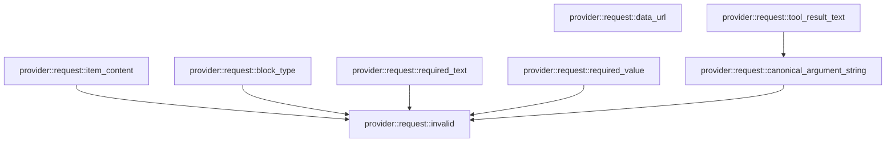

```mermaid
flowchart TD
  n0["provider::request::render_google"]
  n1["provider::request::google_function_response"]
  n2["provider::request::render_interactions"]
  n3["provider::request::render_tools"]
  n4["provider::request::normalize_tool_parameters"]
  n5["provider::request::anthropic_strict_subset"]
  n6["provider::request::anthropic_root_conditional"]
  n7["provider::request::kimi_nullable_constraints"]
  n8["provider::request::contains_composition_constraints"]
  n9["provider::request::contains_non_strict_object"]
  n10["provider::request::validate_tool_schema"]
  n11["provider::request::item_role"]
  n12["provider::request::sealed_fragments"]
  n13["provider::request::sealed_fragment_value"]
  n14["provider::request::degraded_file_text"]
  n15["provider::request::item_content"]
  n16["provider::request::block_type"]
  n17["provider::request::required_text"]
  n18["provider::request::required_value"]
  n19["provider::request::invalid"]
  n20["provider::request::attach_anthropic_breakpoints"]
  n21["provider::request::merge_controls"]
  n22["provider::request::render_responses"]
  n23["provider::request::render_anthropic"]
  n24["provider::request::render_chat"]
  n0 --> n11
  n0 --> n13
  n0 --> n15
  n0 --> n16
  n0 --> n17
  n0 --> n19
  n2 --> n11
  n2 --> n12
  n2 --> n15
  n2 --> n16
  n2 --> n17
  n2 --> n19
  n3 --> n4
  n3 --> n5
  n3 --> n7
  n3 --> n8
  n3 --> n9
  n3 --> n10
  n3 --> n17
  n3 --> n18
  n3 --> n19
  n5 --> n5
  n7 --> n7
  n7 --> n19
  n8 --> n8
  n10 --> n19
  n11 --> n19
  n12 --> n13
  n12 --> n19
  n13 --> n19
  n14 --> n17
  n14 --> n19
  n20 --> n19
  n22 --> n11
  n22 --> n12
  n22 --> n15
  n22 --> n16
  n22 --> n17
  n22 --> n19
  n23 --> n11
  n23 --> n12
  n23 --> n15
  n23 --> n16
  n23 --> n17
  n23 --> n19
  n24 --> n11
  n24 --> n13
  n24 --> n15
  n24 --> n16
  n24 --> n17
  n24 --> n19
```

# provider::request

[Package atlas](index.md) · [Source](../../src/request.rs)

## Declarations

Visibility is the declaration spelling; trait members and reexports require their enclosing interface. `cfg` is not evaluated.

| Symbol | Kind | Visibility | Test / cfg |
|---|---|---|---|
| [provider::request::AdapterId](../../src/request.rs#L14) | enum_item | `pub` |  |
| [provider::request::AdapterId::as_str](../../src/request.rs#L24) | function_item | `pub` |  |
| [provider::request::AdapterId::capabilities](../../src/request.rs#L35) | function_item | `pub` |  |
| [provider::request::Err](../../src/request.rs#L54) | type_item | `private` |  |
| [provider::request::AdapterId::from_str](../../src/request.rs#L56) | function_item | `private` |  |
| [provider::request::ProviderCapabilities](../../src/request.rs#L69) | struct_item | `pub` |  |
| [provider::request::PrepareInput](../../src/request.rs#L76) | struct_item | `pub` |  |
| [provider::request::PreparedRequest](../../src/request.rs#L88) | struct_item | `pub` |  |
| [provider::request::PrepareError](../../src/request.rs#L102) | enum_item | `pub` |  |
| [provider::request::endpoint_origin](../../src/request.rs#L113) | function_item | `pub` |  |
| [provider::request::ToolChoice](../../src/request.rs#L126) | enum_item | `pub` |  |
| [provider::request::prepare](../../src/request.rs#L132) | function_item | `pub` |  |
| [provider::request::prepare_with_tool_choice](../../src/request.rs#L137) | function_item | `pub` |  |
| [provider::request::prepare_with_native_deferred_tools](../../src/request.rs#L144) | function_item | `pub` |  |
| [provider::request::prepare_inner](../../src/request.rs#L152) | function_item | `private` |  |
| [provider::request::request_base](../../src/request.rs#L428) | function_item | `private` |  |
| [provider::request::encode_request_body](../../src/request.rs#L455) | function_item | `private` |  |
| [provider::request::provider_request_digest](../../src/request.rs#L508) | function_item | `pub` |  |
| [provider::request::provider_request_digest_for_dialect](../../src/request.rs#L519) | function_item | `pub` |  |
| [provider::request::provider_query_key](../../src/request.rs#L554) | function_item | `pub` |  |
| [provider::request::value](../../src/request.rs#L561) | function_item | `private` |  |
| [provider::request::values](../../src/request.rs#L565) | function_item | `private` |  |
| [provider::request::anthropic_max_tokens](../../src/request.rs#L574) | function_item | `private` |  |
| [provider::request::apply_dialect_controls](../../src/request.rs#L585) | function_item | `private` |  |
| [provider::request::apply_reasoning_disabled](../../src/request.rs#L702) | function_item | `private` |  |
| [provider::request::apply_title_output_cap](../../src/request.rs#L734) | function_item | `private` |  |
| [provider::request::unsupported_controls](../../src/request.rs#L763) | function_item | `private` |  |
| [provider::request::attach_anthropic_breakpoints](../../src/request.rs#L786) | function_item | `private` |  |
| [provider::request::merge_controls](../../src/request.rs#L819) | function_item | `private` |  |
| [provider::request::render_responses](../../src/request.rs#L837) | function_item | `private` |  |
| [provider::request::render_anthropic](../../src/request.rs#L897) | function_item | `private` |  |
| [provider::request::render_chat](../../src/request.rs#L990) | function_item | `private` |  |
| [provider::request::render_google](../../src/request.rs#L1084) | function_item | `private` |  |
| [provider::request::google_function_response](../../src/request.rs#L1144) | function_item | `private` |  |
| [provider::request::render_interactions](../../src/request.rs#L1161) | function_item | `private` |  |
| [provider::request::render_tools](../../src/request.rs#L1263) | function_item | `private` |  |
| [provider::request::normalize_tool_parameters](../../src/request.rs#L1313) | function_item | `private` |  |
| [provider::request::ANTHROPIC_STRICT_UNSUPPORTED](../../src/request.rs#L1330) | const_item | `private` |  |
| [provider::request::anthropic_strict_subset](../../src/request.rs#L1342) | function_item | `private` |  |
| [provider::request::anthropic_root_conditional](../../src/request.rs#L1369) | function_item | `private` |  |
| [provider::request::kimi_nullable_constraints](../../src/request.rs#L1408) | function_item | `private` |  |
| [provider::request::anthropic_conditional_tests::kimi_nullable_bounds_preserve_null_enum_and_reject_composition_collision](../../src/request.rs#L1483) | function_item | `private` | test; #[cfg(test)] |
| [provider::request::anthropic_conditional_tests::only_isolated_single_conditional_is_hoisted_without_losing_constraints](../../src/request.rs#L1502) | function_item | `private` | test; #[cfg(test)] |
| [provider::request::contains_composition_constraints](../../src/request.rs#L1525) | function_item | `private` |  |
| [provider::request::contains_non_strict_object](../../src/request.rs#L1540) | function_item | `private` |  |
| [provider::request::strict_optional_tests::mcp_schema_metadata_and_omitted_empty_required_render_without_losing_constraints](../../src/request.rs#L1575) | function_item | `private` | test; #[cfg(test)] |
| [provider::request::strict_optional_tests::unique_items_in_nullable_array_preserves_constraints_without_strict_mode](../../src/request.rs#L1596) | function_item | `private` | test; #[cfg(test)] |
| [provider::request::strict_optional_tests::optional_fields_keep_their_schema_and_disable_strict_mode](../../src/request.rs#L1613) | function_item | `private` | test; #[cfg(test)] |
| [provider::request::validate_tool_schema](../../src/request.rs#L1638) | function_item | `private` |  |
| [provider::request::item_role](../../src/request.rs#L1682) | function_item | `private` |  |
| [provider::request::sealed_fragments](../../src/request.rs#L1689) | function_item | `private` |  |
| [provider::request::sealed_fragment_value](../../src/request.rs#L1700) | function_item | `private` |  |
| [provider::request::DEGRADED_FILE_TEXT_LIMIT](../../src/request.rs#L1715) | const_item | `private` |  |
| [provider::request::degraded_file_text](../../src/request.rs#L1722) | function_item | `private` |  |
| [provider::request::data_url](../../src/request.rs#L1751) | function_item | `private` |  |
| [provider::request::item_content](../../src/request.rs#L1759) | function_item | `private` |  |
| [provider::request::block_type](../../src/request.rs#L1766) | function_item | `private` |  |
| [provider::request::required_text](../../src/request.rs#L1773) | function_item | `private` |  |
| [provider::request::required_value](../../src/request.rs#L1782) | function_item | `private` |  |
| [provider::request::tool_result_text](../../src/request.rs#L1792) | function_item | `private` |  |
| [provider::request::canonical_argument_string](../../src/request.rs#L1804) | function_item | `private` |  |
| [provider::request::invalid](../../src/request.rs#L1810) | function_item | `private` |  |
| [provider::request::file_degradation_tests::user](../../src/request.rs#L1819) | function_item | `private` | test; #[cfg(test)] |
| [provider::request::file_degradation_tests::file](../../src/request.rs#L1823) | function_item | `private` | test; #[cfg(test)] |
| [provider::request::file_degradation_tests::pdf_on_anthropic_is_still_a_document](../../src/request.rs#L1831) | function_item | `private` | test; #[cfg(test)] |
| [provider::request::file_degradation_tests::text_file_on_anthropic_degrades_to_fenced_text](../../src/request.rs#L1845) | function_item | `private` | test; #[cfg(test)] |
| [provider::request::file_degradation_tests::binary_file_on_chat_completions_degrades_to_the_stub](../../src/request.rs#L1858) | function_item | `private` | test; #[cfg(test)] |
| [provider::request::file_degradation_tests::oversized_utf8_file_degrades_to_the_stub](../../src/request.rs#L1876) | function_item | `private` | test; #[cfg(test)] |
| [provider::request::file_degradation_tests::text_file_on_responses_is_delivered_as_input_file](../../src/request.rs#L1904) | function_item | `private` | test; #[cfg(test)] |
| [provider::request::file_degradation_tests::google_and_interactions_degrade_in_their_native_text_forms](../../src/request.rs#L1929) | function_item | `private` | test; #[cfg(test)] |
| [provider::request::file_degradation_tests::image_files_are_never_degraded](../../src/request.rs#L1952) | function_item | `private` | test; #[cfg(test)] |
| [provider::request::tests::exact_proof_can_supply_a_missing_path_prefix_on_the_same_origin](../../src/request.rs#L1973) | function_item | `private` | test; #[cfg(test)] |
| [provider::request::anthropic_tool_adjacency_tests::a_bounded_schema_is_offered_to_anthropic_without_the_strict_claim](../../src/request.rs#L1999) | function_item | `private` | test; #[cfg(test)] |
| [provider::request::anthropic_tool_adjacency_tests::host_state_between_call_and_result_does_not_break_anthropic_adjacency](../../src/request.rs#L2038) | function_item | `private` | test; #[cfg(test)] |

## Imports / reexports

| Local name | Source path | Visibility |
|---|---|---|
| `BTreeMap` | `std::collections::BTreeMap` | `private` |
| `FromStr` | `std::str::FromStr` | `private` |
| `IJsonValue` | `schema::IJsonValue` | `private` |
| `Deserialize` | `serde::Deserialize` | `private` |
| `Serialize` | `serde::Serialize` | `private` |
| `Value` | `serde_json::Value` | `private` |
| `json` | `serde_json::json` | `private` |
| `Digest` | `sha2::Digest` | `private` |
| `Sha256` | `sha2::Sha256` | `private` |
| `Error` | `thiserror::Error` | `private` |
| `DialectId` | `crate::DialectId` | `private` |
| `ProviderTarget` | `crate::ProviderTarget` | `private` |
| `validate_target` | `crate::validate_target` | `private` |
| `*` | `super::*` | `private` |
| `*` | `super::*` | `private` |
| `*` | `super::*` | `private` |
| `_` | `base64::Engine` | `private` |
| `request_base` | `super::request_base` | `private` |
| `*` | `super::*` | `private` |

## Module declarations

| Module | Visibility | Attributes |
|---|---|---|
| `provider::request::anthropic_conditional_tests` | `private` | #[cfg(test)] |
| `provider::request::strict_optional_tests` | `private` | #[cfg(test)] |
| `provider::request::file_degradation_tests` | `private` | #[cfg(test)] |
| `provider::request::tests` | `private` | #[cfg(test)] |
| `provider::request::anthropic_tool_adjacency_tests` | `private` | #[cfg(test)] |

## Function call graphs

Edges below are syntactically resolved calls only, including private functions. Graphs partition callers into groups of 20; they are not execution order. All unresolved sites are listed below and in the JSON inventory.

```mermaid
flowchart TD
  n0["provider::dialect::validate_target"]
  n1["provider::native_deferred::apply"]
  n2["provider::request::endpoint_origin"]
  n3["provider::request::prepare"]
  n4["provider::request::prepare_with_tool_choice"]
  n5["provider::request::prepare_with_native_deferred_tools"]
  n6["provider::request::prepare_inner"]
  n7["provider::request::invalid"]
  n8["provider::request::AdapterId::as_str"]
  n9["provider::request::AdapterId::capabilities"]
  n10["provider::request::request_base"]
  n11["provider::request::encode_request_body"]
  n12["provider::request::provider_request_digest"]
  n13["provider::request::provider_request_digest_for_dialect"]
  n14["provider::request::provider_query_key"]
  n15["provider::request::value"]
  n16["provider::request::values"]
  n17["provider::request::AdapterId::from_str"]
  n18["provider::request::anthropic_max_tokens"]
  n19["provider::request::apply_dialect_controls"]
  n20["provider::request::apply_reasoning_disabled"]
  n21["provider::request::apply_title_output_cap"]
  n22["provider::request::unsupported_controls"]
  n23["provider::request::attach_anthropic_breakpoints"]
  n24["provider::request::merge_controls"]
  n3 --> n4
  n4 --> n6
  n5 --> n6
  n6 --> n0
  n6 --> n1
  n6 --> n7
  n6 --> n10
  n6 --> n11
  n6 --> n13
  n6 --> n14
  n6 --> n15
  n6 --> n16
  n6 --> n19
  n6 --> n21
  n6 --> n23
  n6 --> n24
  n11 --> n7
  n12 --> n13
  n19 --> n7
  n19 --> n20
  n19 --> n22
  n20 --> n7
  n21 --> n7
  n22 --> n7
```

Functions 1–20: 24 direct edges

Functions 21–40: 51 direct edges

Functions 41–48: 6 direct edges

## Call sites

Includes test functions (marked in declarations). Receiver-type-required sites need type analysis/manual tracing. Calls in closures are attributed to their enclosing function; their occurrence here does not mean the closure executes immediately.

| Caller | Callee expression | Source lines | Target / classification |
|---|---|---|---|
| `from_str` | `Ok` | [58](../../src/request.rs#L58), [59](../../src/request.rs#L59), [60](../../src/request.rs#L60), [61](../../src/request.rs#L61), [62](../../src/request.rs#L62) | external-constructor-callback-or-unresolved |
| `from_str` | `Err` | [63](../../src/request.rs#L63) | external-constructor-callback-or-unresolved |
| `from_str` | `PrepareError::UnknownAdapter` | [63](../../src/request.rs#L63) | external-constructor-callback-or-unresolved |
| `from_str` | `other.to_owned` | [63](../../src/request.rs#L63) | receiver-type-required |
| `endpoint_origin` | `reqwest::Url::parse(endpoint)         .map_err` | [114](../../src/request.rs#L114) | receiver-type-required |
| `endpoint_origin` | `reqwest::Url::parse` | [114](../../src/request.rs#L114) | external-constructor-callback-or-unresolved |
| `endpoint_origin` | `PrepareError::InvalidEndpoint` | [115](../../src/request.rs#L115), [118](../../src/request.rs#L118), [121](../../src/request.rs#L121) | external-constructor-callback-or-unresolved |
| `endpoint_origin` | `error.to_string` | [115](../../src/request.rs#L115) | receiver-type-required |
| `endpoint_origin` | `url         .host_str()         .ok_or_else` | [116](../../src/request.rs#L116) | receiver-type-required |
| `endpoint_origin` | `url         .host_str` | [116](../../src/request.rs#L116) | receiver-type-required |
| `endpoint_origin` | `"endpoint has no host".to_owned` | [118](../../src/request.rs#L118) | receiver-type-required |
| `endpoint_origin` | `url         .port_or_known_default()         .ok_or_else` | [119](../../src/request.rs#L119) | receiver-type-required |
| `endpoint_origin` | `url         .port_or_known_default` | [119](../../src/request.rs#L119) | receiver-type-required |
| `endpoint_origin` | `"endpoint has no known port".to_owned` | [121](../../src/request.rs#L121) | receiver-type-required |
| `endpoint_origin` | `Ok` | [122](../../src/request.rs#L122) | external-constructor-callback-or-unresolved |
| `prepare` | `prepare_with_tool_choice` | [133](../../src/request.rs#L133) | [provider::request::prepare_with_tool_choice](../../src/request.rs#L137) |
| `prepare_with_tool_choice` | `prepare_inner` | [141](../../src/request.rs#L141) | [provider::request::prepare_inner](../../src/request.rs#L152) |
| `prepare_with_native_deferred_tools` | `prepare_inner` | [149](../../src/request.rs#L149) | [provider::request::prepare_inner](../../src/request.rs#L152) |
| `prepare_with_native_deferred_tools` | `Some` | [149](../../src/request.rs#L149) | external-constructor-callback-or-unresolved |
| `prepare_inner` | `input.endpoint.trim_end_matches` | [157](../../src/request.rs#L157) | receiver-type-required |
| `prepare_inner` | `configured_base.starts_with` | [158](../../src/request.rs#L158), [159](../../src/request.rs#L159) | receiver-type-required |
| `prepare_inner` | `Err` | [161](../../src/request.rs#L161), [176](../../src/request.rs#L176), [183](../../src/request.rs#L183), [202](../../src/request.rs#L202), [223](../../src/request.rs#L223), [309](../../src/request.rs#L309), [338](../../src/request.rs#L338), [359](../../src/request.rs#L359) | external-constructor-callback-or-unresolved |
| `prepare_inner` | `PrepareError::InvalidEndpoint` | [161](../../src/request.rs#L161) | external-constructor-callback-or-unresolved |
| `prepare_inner` | `input.endpoint.clone` | [161](../../src/request.rs#L161) | receiver-type-required |
| `prepare_inner` | `validate_target(&input.target)         .map_err` | [163](../../src/request.rs#L163) | receiver-type-required |
| `prepare_inner` | `validate_target` | [163](../../src/request.rs#L163) | [provider::dialect::validate_target](../../src/dialect.rs#L911) |
| `prepare_inner` | `PrepareError::InvalidTarget` | [164](../../src/request.rs#L164), [176](../../src/request.rs#L176), [183](../../src/request.rs#L183) | external-constructor-callback-or-unresolved |
| `prepare_inner` | `error.to_string` | [164](../../src/request.rs#L164), [173](../../src/request.rs#L173) | receiver-type-required |
| `prepare_inner` | `request_base` | [166](../../src/request.rs#L166) | [provider::request::request_base](../../src/request.rs#L428) |
| `prepare_inner` | `resolved.proved_endpoint.as_deref` | [166](../../src/request.rs#L166) | receiver-type-required |
| `prepare_inner` | `dialect.family` | [167](../../src/request.rs#L167) | receiver-type-required |
| `prepare_inner` | `resolved.wire_model` | [168](../../src/request.rs#L168) | receiver-type-required |
| `prepare_inner` | `value` | [169](../../src/request.rs#L169), [197](../../src/request.rs#L197) | [provider::request::value](../../src/request.rs#L561) |
| `prepare_inner` | `profile.get` | [170](../../src/request.rs#L170), [180](../../src/request.rs#L180) | receiver-type-required |
| `prepare_inner` | `Some` | [171](../../src/request.rs#L171), [181](../../src/request.rs#L181) | external-constructor-callback-or-unresolved |
| `prepare_inner` | `serde_json::to_value(&input.target)                 .map_err` | [172](../../src/request.rs#L172) | receiver-type-required |
| `prepare_inner` | `serde_json::to_value` | [172](../../src/request.rs#L172) | external-constructor-callback-or-unresolved |
| `prepare_inner` | `PrepareError::InvalidJson` | [173](../../src/request.rs#L173), [223](../../src/request.rs#L223) | external-constructor-callback-or-unresolved |
| `prepare_inner` | `"epoch target does not match request target".to_owned` | [177](../../src/request.rs#L177) | receiver-type-required |
| `prepare_inner` | `profile.get("serializer_revision").and_then` | [180](../../src/request.rs#L180) | receiver-type-required |
| `prepare_inner` | `"epoch serializer revision does not match request target".to_owned` | [184](../../src/request.rs#L184) | receiver-type-required |
| `prepare_inner` | `profile         .get("system")         .and_then(Value::as_str)         .unwrap_or_default` | [187](../../src/request.rs#L187) | receiver-type-required |
| `prepare_inner` | `profile         .get("system")         .and_then` | [187](../../src/request.rs#L187) | receiver-type-required |
| `prepare_inner` | `profile         .get` | [187](../../src/request.rs#L187), [191](../../src/request.rs#L191) | receiver-type-required |
| `prepare_inner` | `profile         .get("controls")         .and_then(Value::as_object)         .cloned()         .unwrap_or_default` | [191](../../src/request.rs#L191) | receiver-type-required |
| `prepare_inner` | `profile         .get("controls")         .and_then(Value::as_object)         .cloned` | [191](../../src/request.rs#L191) | receiver-type-required |
| `prepare_inner` | `profile         .get("controls")         .and_then` | [191](../../src/request.rs#L191) | receiver-type-required |
| `prepare_inner` | `values` | [196](../../src/request.rs#L196) | [provider::request::values](../../src/request.rs#L565) |
| `prepare_inner` | `controls.remove` | [198](../../src/request.rs#L198), [199](../../src/request.rs#L199) | receiver-type-required |
| `prepare_inner` | `invalid` | [202](../../src/request.rs#L202), [212](../../src/request.rs#L212), [309](../../src/request.rs#L309), [338](../../src/request.rs#L338), [359](../../src/request.rs#L359) | [provider::request::invalid](../../src/request.rs#L1810) |
| `prepare_inner` | `controls         .remove("title_max_output_tokens")         .map(&#124;value&#124; {             value                 .as_u64()                 .filter(&#124;cap&#124; *cap > 0)                 .ok_or_else(&#124;&#124; invalid("title_max_output_tokens must be a positive integer"))         })         .transpose` | [206](../../src/request.rs#L206) | receiver-type-required |
| `prepare_inner` | `controls         .remove("title_max_output_tokens")         .map` | [206](../../src/request.rs#L206) | receiver-type-required |
| `prepare_inner` | `controls         .remove` | [206](../../src/request.rs#L206) | receiver-type-required |
| `prepare_inner` | `value                 .as_u64()                 .filter(&#124;cap&#124; *cap > 0)                 .ok_or_else` | [209](../../src/request.rs#L209) | receiver-type-required |
| `prepare_inner` | `value                 .as_u64()                 .filter` | [209](../../src/request.rs#L209) | receiver-type-required |
| `prepare_inner` | `value                 .as_u64` | [209](../../src/request.rs#L209) | receiver-type-required |
| `prepare_inner` | `apply_dialect_controls` | [215](../../src/request.rs#L215) | [provider::request::apply_dialect_controls](../../src/request.rs#L585) |
| `prepare_inner` | `Value::from` | [221](../../src/request.rs#L221), [260](../../src/request.rs#L260) | external-constructor-callback-or-unresolved |
| `prepare_inner` | `anthropic_max_tokens` | [221](../../src/request.rs#L221) | external-constructor-callback-or-unresolved |
| `prepare_inner` | `input.continuation_id.is_some` | [222](../../src/request.rs#L222) | receiver-type-required |
| `prepare_inner` | `dialect.server_managed` | [222](../../src/request.rs#L222) | receiver-type-required |
| `prepare_inner` | `"stateless adapter cannot receive continuation_id".to_owned` | [224](../../src/request.rs#L224) | receiver-type-required |
| `prepare_inner` | `"/responses".to_owned` | [229](../../src/request.rs#L229) | receiver-type-required |
| `prepare_inner` | `"/messages".to_owned` | [233](../../src/request.rs#L233) | receiver-type-required |
| `prepare_inner` | `"/interactions".to_owned` | [248](../../src/request.rs#L248) | receiver-type-required |
| `prepare_inner` | `"/chat/completions".to_owned` | [252](../../src/request.rs#L252) | receiver-type-required |
| `prepare_inner` | `resolved.max_output_tokens` | [257](../../src/request.rs#L257) | receiver-type-required |
| `prepare_inner` | `body.as_object_mut()                 .expect("chat body is an object")                 .insert` | [258](../../src/request.rs#L258) | receiver-type-required |
| `prepare_inner` | `body.as_object_mut()                 .expect` | [258](../../src/request.rs#L258) | receiver-type-required |
| `prepare_inner` | `body.as_object_mut` | [258](../../src/request.rs#L258), [264](../../src/request.rs#L264), [269](../../src/request.rs#L269), [275](../../src/request.rs#L275), [288](../../src/request.rs#L288) | receiver-type-required |
| `prepare_inner` | `"max_tokens".to_owned` | [260](../../src/request.rs#L260) | receiver-type-required |
| `prepare_inner` | `body.as_object_mut()             .expect("chat body is an object")             .insert` | [264](../../src/request.rs#L264) | receiver-type-required |
| `prepare_inner` | `body.as_object_mut()             .expect` | [264](../../src/request.rs#L264), [269](../../src/request.rs#L269), [288](../../src/request.rs#L288) | receiver-type-required |
| `prepare_inner` | `"stream_options".to_owned` | [266](../../src/request.rs#L266) | receiver-type-required |
| `prepare_inner` | `body.as_object_mut()             .expect("Responses body is an object")             .insert` | [269](../../src/request.rs#L269) | receiver-type-required |
| `prepare_inner` | `"store".to_owned` | [271](../../src/request.rs#L271) | receiver-type-required |
| `prepare_inner` | `Value::Bool` | [271](../../src/request.rs#L271) | external-constructor-callback-or-unresolved |
| `prepare_inner` | `attach_anthropic_breakpoints` | [274](../../src/request.rs#L274) | [provider::request::attach_anthropic_breakpoints](../../src/request.rs#L786) |
| `prepare_inner` | `body.as_object_mut().expect` | [275](../../src/request.rs#L275) | receiver-type-required |
| `prepare_inner` | `resolved.refusal_fallback` | [276](../../src/request.rs#L276), [382](../../src/request.rs#L382) | receiver-type-required |
| `prepare_inner` | `object.insert` | [277](../../src/request.rs#L277) | receiver-type-required |
| `prepare_inner` | `"fallbacks".to_owned` | [277](../../src/request.rs#L277) | receiver-type-required |
| `prepare_inner` | `Value::String` | [277](../../src/request.rs#L277), [290](../../src/request.rs#L290) | external-constructor-callback-or-unresolved |
| `prepare_inner` | `"default".to_owned` | [277](../../src/request.rs#L277) | receiver-type-required |
| `prepare_inner` | `body.as_object_mut()             .expect("adapter request bodies are objects")             .insert` | [288](../../src/request.rs#L288) | receiver-type-required |
| `prepare_inner` | `field.to_owned` | [290](../../src/request.rs#L290) | receiver-type-required |
| `prepare_inner` | `continuation.clone` | [290](../../src/request.rs#L290) | receiver-type-required |
| `prepare_inner` | `merge_controls` | [292](../../src/request.rs#L292) | [provider::request::merge_controls](../../src/request.rs#L819) |
| `prepare_inner` | `apply_title_output_cap` | [294](../../src/request.rs#L294) | [provider::request::apply_title_output_cap](../../src/request.rs#L734) |
| `prepare_inner` | `tools.as_array().is_none_or` | [308](../../src/request.rs#L308) | receiver-type-required |
| `prepare_inner` | `tools.as_array` | [308](../../src/request.rs#L308) | receiver-type-required |
| `prepare_inner` | `resolved.forced_tool_choice` | [323](../../src/request.rs#L323) | receiver-type-required |
| `prepare_inner` | `item                 .get("content")                 .and_then(Value::as_array)                 .into_iter()                 .flatten` | [346](../../src/request.rs#L346) | receiver-type-required |
| `prepare_inner` | `item                 .get("content")                 .and_then(Value::as_array)                 .into_iter` | [346](../../src/request.rs#L346) | receiver-type-required |
| `prepare_inner` | `item                 .get("content")                 .and_then` | [346](../../src/request.rs#L346) | receiver-type-required |
| `prepare_inner` | `item                 .get` | [346](../../src/request.rs#L346) | receiver-type-required |
| `prepare_inner` | `native                         .references                         .iter()                         .any` | [354](../../src/request.rs#L354) | receiver-type-required |
| `prepare_inner` | `native                         .references                         .iter` | [354](../../src/request.rs#L354) | receiver-type-required |
| `prepare_inner` | `crate::native_deferred::apply` | [365](../../src/request.rs#L365) | [provider::native_deferred::apply](../../src/native_deferred.rs#L36) |
| `prepare_inner` | `encode_request_body` | [367](../../src/request.rs#L367) | [provider::request::encode_request_body](../../src/request.rs#L455) |
| `prepare_inner` | `BTreeMap::from` | [368](../../src/request.rs#L368) | external-constructor-callback-or-unresolved |
| `prepare_inner` | `"accept".to_owned` | [370](../../src/request.rs#L370) | receiver-type-required |
| `prepare_inner` | `if input.stream {                 "text/event-stream"             } else {                 "application/json"             }             .to_owned` | [371](../../src/request.rs#L371) | receiver-type-required |
| `prepare_inner` | `"content-type".to_owned` | [378](../../src/request.rs#L378) | receiver-type-required |
| `prepare_inner` | `"application/json".to_owned` | [378](../../src/request.rs#L378) | receiver-type-required |
| `prepare_inner` | `headers_without_secret.insert` | [381](../../src/request.rs#L381), [383](../../src/request.rs#L383) | receiver-type-required |
| `prepare_inner` | `"anthropic-version".to_owned` | [381](../../src/request.rs#L381) | receiver-type-required |
| `prepare_inner` | `"2023-06-01".to_owned` | [381](../../src/request.rs#L381) | receiver-type-required |
| `prepare_inner` | `"anthropic-beta".to_owned` | [384](../../src/request.rs#L384), [392](../../src/request.rs#L392) | receiver-type-required |
| `prepare_inner` | `"server-side-fallback-2026-07-01".to_owned` | [385](../../src/request.rs#L385) | receiver-type-required |
| `prepare_inner` | `headers_without_secret             .entry("anthropic-beta".to_owned())             .or_default` | [391](../../src/request.rs#L391) | receiver-type-required |
| `prepare_inner` | `headers_without_secret             .entry` | [391](../../src/request.rs#L391) | receiver-type-required |
| `prepare_inner` | `beta.is_empty` | [394](../../src/request.rs#L394) | receiver-type-required |
| `prepare_inner` | `beta.push` | [395](../../src/request.rs#L395) | receiver-type-required |
| `prepare_inner` | `beta.push_str` | [397](../../src/request.rs#L397) | receiver-type-required |
| `prepare_inner` | `provider_request_digest_for_dialect` | [399](../../src/request.rs#L399) | [provider::request::provider_request_digest_for_dialect](../../src/request.rs#L519) |
| `prepare_inner` | `dialect.as_str` | [400](../../src/request.rs#L400) | receiver-type-required |
| `prepare_inner` | `adapter.capabilities` | [407](../../src/request.rs#L407) | receiver-type-required |
| `prepare_inner` | `capabilities         .query_by_identity         .then` | [408](../../src/request.rs#L408) | receiver-type-required |
| `prepare_inner` | `provider_query_key` | [410](../../src/request.rs#L410) | [provider::request::provider_query_key](../../src/request.rs#L554) |
| `prepare_inner` | `Ok` | [411](../../src/request.rs#L411) | external-constructor-callback-or-unresolved |
| `prepare_inner` | `"POST".to_owned` | [412](../../src/request.rs#L412) | receiver-type-required |
| `prepare_inner` | `u64::try_from(body.len()).unwrap_or` | [417](../../src/request.rs#L417) | receiver-type-required |
| `prepare_inner` | `u64::try_from` | [417](../../src/request.rs#L417) | external-constructor-callback-or-unresolved |
| `prepare_inner` | `body.len` | [417](../../src/request.rs#L417) | receiver-type-required |
| `request_base` | `proved.filter` | [429](../../src/request.rs#L429) | receiver-type-required |
| `request_base` | `value.contains` | [429](../../src/request.rs#L429) | receiver-type-required |
| `request_base` | `configured.to_owned` | [430](../../src/request.rs#L430), [435](../../src/request.rs#L435), [441](../../src/request.rs#L441), [451](../../src/request.rs#L451) | receiver-type-required |
| `request_base` | `reqwest::Url::parse` | [433](../../src/request.rs#L433) | external-constructor-callback-or-unresolved |
| `request_base` | `configured_url.scheme` | [437](../../src/request.rs#L437) | receiver-type-required |
| `request_base` | `proved_url.scheme` | [437](../../src/request.rs#L437) | receiver-type-required |
| `request_base` | `configured_url.host_str` | [438](../../src/request.rs#L438) | receiver-type-required |
| `request_base` | `proved_url.host_str` | [438](../../src/request.rs#L438) | receiver-type-required |
| `request_base` | `configured_url.port_or_known_default` | [439](../../src/request.rs#L439) | receiver-type-required |
| `request_base` | `proved_url.port_or_known_default` | [439](../../src/request.rs#L439) | receiver-type-required |
| `request_base` | `configured_url.path().trim_end_matches` | [443](../../src/request.rs#L443) | receiver-type-required |
| `request_base` | `configured_url.path` | [443](../../src/request.rs#L443) | receiver-type-required |
| `request_base` | `proved_url.path().trim_end_matches` | [444](../../src/request.rs#L444) | receiver-type-required |
| `request_base` | `proved_url.path` | [444](../../src/request.rs#L444) | receiver-type-required |
| `request_base` | `configured_path.is_empty` | [445](../../src/request.rs#L445) | receiver-type-required |
| `request_base` | `proved_path.starts_with` | [447](../../src/request.rs#L447) | receiver-type-required |
| `request_base` | `proved.trim_end_matches('/').to_owned` | [449](../../src/request.rs#L449) | receiver-type-required |
| `request_base` | `proved.trim_end_matches` | [449](../../src/request.rs#L449) | receiver-type-required |
| `encode_request_body` | `serde_json_canonicalizer::to_vec(body)             .map_err` | [460](../../src/request.rs#L460) | receiver-type-required |
| `encode_request_body` | `serde_json_canonicalizer::to_vec` | [460](../../src/request.rs#L460), [500](../../src/request.rs#L500) | external-constructor-callback-or-unresolved |
| `encode_request_body` | `PrepareError::InvalidJson` | [461](../../src/request.rs#L461), [496](../../src/request.rs#L496), [501](../../src/request.rs#L501) | external-constructor-callback-or-unresolved |
| `encode_request_body` | `error.to_string` | [461](../../src/request.rs#L461), [496](../../src/request.rs#L496), [501](../../src/request.rs#L501) | receiver-type-required |
| `encode_request_body` | `body         .as_object()         .ok_or_else` | [463](../../src/request.rs#L463) | receiver-type-required |
| `encode_request_body` | `body         .as_object` | [463](../../src/request.rs#L463) | receiver-type-required |
| `encode_request_body` | `invalid` | [465](../../src/request.rs#L465), [479](../../src/request.rs#L479) | [provider::request::invalid](../../src/request.rs#L1810) |
| `encode_request_body` | `object.keys().any` | [478](../../src/request.rs#L478) | receiver-type-required |
| `encode_request_body` | `object.keys` | [478](../../src/request.rs#L478) | receiver-type-required |
| `encode_request_body` | `order.contains` | [478](../../src/request.rs#L478) | receiver-type-required |
| `encode_request_body` | `key.as_str` | [478](../../src/request.rs#L478) | receiver-type-required |
| `encode_request_body` | `Err` | [479](../../src/request.rs#L479) | external-constructor-callback-or-unresolved |
| `encode_request_body` | `object.get` | [487](../../src/request.rs#L487) | receiver-type-required |
| `encode_request_body` | `bytes.push` | [491](../../src/request.rs#L491), [498](../../src/request.rs#L498), [504](../../src/request.rs#L504) | receiver-type-required |
| `encode_request_body` | `bytes.extend_from_slice` | [494](../../src/request.rs#L494), [499](../../src/request.rs#L499) | receiver-type-required |
| `encode_request_body` | `serde_json::to_vec(key)                 .map_err` | [495](../../src/request.rs#L495) | receiver-type-required |
| `encode_request_body` | `serde_json::to_vec` | [495](../../src/request.rs#L495) | external-constructor-callback-or-unresolved |
| `encode_request_body` | `serde_json_canonicalizer::to_vec(value)                 .map_err` | [500](../../src/request.rs#L500) | receiver-type-required |
| `encode_request_body` | `Ok` | [505](../../src/request.rs#L505) | external-constructor-callback-or-unresolved |
| `provider_request_digest` | `provider_request_digest_for_dialect` | [516](../../src/request.rs#L516) | [provider::request::provider_request_digest_for_dialect](../../src/request.rs#L519) |
| `provider_request_digest` | `adapter.as_str` | [516](../../src/request.rs#L516) | receiver-type-required |
| `provider_request_digest_for_dialect` | `headers         .keys()         .any` | [527](../../src/request.rs#L527) | receiver-type-required |
| `provider_request_digest_for_dialect` | `headers         .keys` | [527](../../src/request.rs#L527) | receiver-type-required |
| `provider_request_digest_for_dialect` | `name.to_ascii_lowercase` | [529](../../src/request.rs#L529) | receiver-type-required |
| `provider_request_digest_for_dialect` | `Err` | [531](../../src/request.rs#L531) | external-constructor-callback-or-unresolved |
| `provider_request_digest_for_dialect` | `PrepareError::InvalidJson` | [531](../../src/request.rs#L531), [536](../../src/request.rs#L536) | external-constructor-callback-or-unresolved |
| `provider_request_digest_for_dialect` | `"header names must be lowercase".to_owned` | [532](../../src/request.rs#L532) | receiver-type-required |
| `provider_request_digest_for_dialect` | `serde_json_canonicalizer::to_vec(headers)         .map_err` | [535](../../src/request.rs#L535) | receiver-type-required |
| `provider_request_digest_for_dialect` | `serde_json_canonicalizer::to_vec` | [535](../../src/request.rs#L535) | external-constructor-callback-or-unresolved |
| `provider_request_digest_for_dialect` | `error.to_string` | [536](../../src/request.rs#L536) | receiver-type-required |
| `provider_request_digest_for_dialect` | `Sha256::new` | [537](../../src/request.rs#L537) | external-constructor-callback-or-unresolved |
| `provider_request_digest_for_dialect` | `hasher.update` | [538](../../src/request.rs#L538), [539](../../src/request.rs#L539), [540](../../src/request.rs#L540), [541](../../src/request.rs#L541), [542](../../src/request.rs#L542), [543](../../src/request.rs#L543), [544](../../src/request.rs#L544), [545](../../src/request.rs#L545), [546](../../src/request.rs#L546), [547](../../src/request.rs#L547), [548](../../src/request.rs#L548), [549](../../src/request.rs#L549) | receiver-type-required |
| `provider_request_digest_for_dialect` | `dialect_id.as_bytes` | [539](../../src/request.rs#L539) | receiver-type-required |
| `provider_request_digest_for_dialect` | `method.to_ascii_uppercase().as_bytes` | [541](../../src/request.rs#L541) | receiver-type-required |
| `provider_request_digest_for_dialect` | `method.to_ascii_uppercase` | [541](../../src/request.rs#L541) | receiver-type-required |
| `provider_request_digest_for_dialect` | `final_url.as_bytes` | [543](../../src/request.rs#L543) | receiver-type-required |
| `provider_request_digest_for_dialect` | `model.as_bytes` | [545](../../src/request.rs#L545) | receiver-type-required |
| `provider_request_digest_for_dialect` | `Ok` | [550](../../src/request.rs#L550) | external-constructor-callback-or-unresolved |
| `provider_query_key` | `Sha256::new` | [555](../../src/request.rs#L555) | external-constructor-callback-or-unresolved |
| `provider_query_key` | `hasher.update` | [556](../../src/request.rs#L556), [557](../../src/request.rs#L557) | receiver-type-required |
| `provider_query_key` | `attempt_id.as_bytes` | [557](../../src/request.rs#L557) | receiver-type-required |
| `value` | `serde_json::to_value(value).expect` | [562](../../src/request.rs#L562) | receiver-type-required |
| `value` | `serde_json::to_value` | [562](../../src/request.rs#L562) | external-constructor-callback-or-unresolved |
| `values` | `values.iter().map(value).collect` | [566](../../src/request.rs#L566) | receiver-type-required |
| `values` | `values.iter().map` | [566](../../src/request.rs#L566) | receiver-type-required |
| `values` | `values.iter` | [566](../../src/request.rs#L566) | receiver-type-required |
| `anthropic_max_tokens` | `profile.max_output_tokens` | [575](../../src/request.rs#L575) | receiver-type-required |
| `apply_dialect_controls` | `controls.is_empty` | [595](../../src/request.rs#L595) | receiver-type-required |
| `apply_dialect_controls` | `unsupported_controls` | [596](../../src/request.rs#L596) | [provider::request::unsupported_controls](../../src/request.rs#L763) |
| `apply_dialect_controls` | `apply_reasoning_disabled` | [599](../../src/request.rs#L599) | [provider::request::apply_reasoning_disabled](../../src/request.rs#L702) |
| `apply_dialect_controls` | `reasoning_effort.is_some` | [599](../../src/request.rs#L599) | receiver-type-required |
| `apply_dialect_controls` | `reasoning_effort         .as_ref()         .map(&#124;value&#124; {             let value = value                 .as_str()                 .ok_or_else(&#124;&#124; invalid("reasoning_effort must be a string"))?;             profile                 .reasoning_efforts()                 .iter()                 .any(&#124;item&#124; item == value)                 .then_some(value)                 .ok_or_else(&#124;&#124; {                     invalid(format!(                         "reasoning_effort {value} is unsupported by exact dialect {}",                         dialect.as_str()                     ))                 })         })         .transpose` | [601](../../src/request.rs#L601) | receiver-type-required |
| `apply_dialect_controls` | `reasoning_effort         .as_ref()         .map` | [601](../../src/request.rs#L601) | receiver-type-required |
| `apply_dialect_controls` | `reasoning_effort         .as_ref` | [601](../../src/request.rs#L601) | receiver-type-required |
| `apply_dialect_controls` | `value                 .as_str()                 .ok_or_else` | [604](../../src/request.rs#L604) | receiver-type-required |
| `apply_dialect_controls` | `value                 .as_str` | [604](../../src/request.rs#L604) | receiver-type-required |
| `apply_dialect_controls` | `invalid` | [606](../../src/request.rs#L606), [613](../../src/request.rs#L613), [672](../../src/request.rs#L672) | [provider::request::invalid](../../src/request.rs#L1810) |
| `apply_dialect_controls` | `profile                 .reasoning_efforts()                 .iter()                 .any(&#124;item&#124; item == value)                 .then_some(value)                 .ok_or_else` | [607](../../src/request.rs#L607) | receiver-type-required |
| `apply_dialect_controls` | `profile                 .reasoning_efforts()                 .iter()                 .any(&#124;item&#124; item == value)                 .then_some` | [607](../../src/request.rs#L607) | receiver-type-required |
| `apply_dialect_controls` | `profile                 .reasoning_efforts()                 .iter()                 .any` | [607](../../src/request.rs#L607) | receiver-type-required |
| `apply_dialect_controls` | `profile                 .reasoning_efforts()                 .iter` | [607](../../src/request.rs#L607) | receiver-type-required |
| `apply_dialect_controls` | `profile                 .reasoning_efforts` | [607](../../src/request.rs#L607) | receiver-type-required |
| `apply_dialect_controls` | `effort.is_some` | [621](../../src/request.rs#L621), [624](../../src/request.rs#L624), [628](../../src/request.rs#L628), [631](../../src/request.rs#L631), [653](../../src/request.rs#L653), [662](../../src/request.rs#L662), [683](../../src/request.rs#L683) | receiver-type-required |
| `apply_dialect_controls` | `controls.insert` | [622](../../src/request.rs#L622), [625](../../src/request.rs#L625), [626](../../src/request.rs#L626), [629](../../src/request.rs#L629), [632](../../src/request.rs#L632), [633](../../src/request.rs#L633), [645](../../src/request.rs#L645), [650](../../src/request.rs#L650), [654](../../src/request.rs#L654), [678](../../src/request.rs#L678), [684](../../src/request.rs#L684) | receiver-type-required |
| `apply_dialect_controls` | `"reasoning".to_owned` | [622](../../src/request.rs#L622) | receiver-type-required |
| `apply_dialect_controls` | `"reasoning_effort".to_owned` | [625](../../src/request.rs#L625), [629](../../src/request.rs#L629), [632](../../src/request.rs#L632) | receiver-type-required |
| `apply_dialect_controls` | `"thinking".to_owned` | [626](../../src/request.rs#L626), [634](../../src/request.rs#L634), [646](../../src/request.rs#L646), [655](../../src/request.rs#L655) | receiver-type-required |
| `apply_dialect_controls` | `profile.thinking_wire` | [639](../../src/request.rs#L639) | receiver-type-required |
| `apply_dialect_controls` | `"output_config".to_owned` | [650](../../src/request.rs#L650) | receiver-type-required |
| `apply_dialect_controls` | `Err` | [672](../../src/request.rs#L672) | external-constructor-callback-or-unresolved |
| `apply_dialect_controls` | `"generationConfig".to_owned` | [679](../../src/request.rs#L679) | receiver-type-required |
| `apply_dialect_controls` | `"generation_config".to_owned` | [685](../../src/request.rs#L685) | receiver-type-required |
| `apply_dialect_controls` | `profile.pro_reasoning` | [691](../../src/request.rs#L691) | receiver-type-required |
| `apply_dialect_controls` | `controls.entry("reasoning").or_insert_with` | [692](../../src/request.rs#L692) | receiver-type-required |
| `apply_dialect_controls` | `controls.entry` | [692](../../src/request.rs#L692) | receiver-type-required |
| `apply_dialect_controls` | `Ok` | [694](../../src/request.rs#L694) | external-constructor-callback-or-unresolved |
| `apply_reasoning_disabled` | `Err` | [708](../../src/request.rs#L708), [720](../../src/request.rs#L720) | external-constructor-callback-or-unresolved |
| `apply_reasoning_disabled` | `invalid` | [708](../../src/request.rs#L708), [720](../../src/request.rs#L720) | [provider::request::invalid](../../src/request.rs#L1810) |
| `apply_reasoning_disabled` | `controls.insert` | [714](../../src/request.rs#L714), [717](../../src/request.rs#L717) | receiver-type-required |
| `apply_reasoning_disabled` | `"reasoning".to_owned` | [714](../../src/request.rs#L714) | receiver-type-required |
| `apply_reasoning_disabled` | `"thinking".to_owned` | [717](../../src/request.rs#L717) | receiver-type-required |
| `apply_reasoning_disabled` | `Ok` | [726](../../src/request.rs#L726) | external-constructor-callback-or-unresolved |
| `apply_title_output_cap` | `body         .as_object_mut()         .ok_or_else` | [739](../../src/request.rs#L739) | receiver-type-required |
| `apply_title_output_cap` | `body         .as_object_mut` | [739](../../src/request.rs#L739) | receiver-type-required |
| `apply_title_output_cap` | `invalid` | [741](../../src/request.rs#L741), [754](../../src/request.rs#L754) | [provider::request::invalid](../../src/request.rs#L1810) |
| `apply_title_output_cap` | `object.insert` | [744](../../src/request.rs#L744), [751](../../src/request.rs#L751) | receiver-type-required |
| `apply_title_output_cap` | `"max_output_tokens".to_owned` | [744](../../src/request.rs#L744) | receiver-type-required |
| `apply_title_output_cap` | `Value::from` | [744](../../src/request.rs#L744), [751](../../src/request.rs#L751) | external-constructor-callback-or-unresolved |
| `apply_title_output_cap` | `object                 .get("max_tokens")                 .and_then(Value::as_u64)                 .map_or` | [747](../../src/request.rs#L747) | receiver-type-required |
| `apply_title_output_cap` | `object                 .get("max_tokens")                 .and_then` | [747](../../src/request.rs#L747) | receiver-type-required |
| `apply_title_output_cap` | `object                 .get` | [747](../../src/request.rs#L747) | receiver-type-required |
| `apply_title_output_cap` | `c.min` | [750](../../src/request.rs#L750) | receiver-type-required |
| `apply_title_output_cap` | `"max_tokens".to_owned` | [751](../../src/request.rs#L751) | receiver-type-required |
| `apply_title_output_cap` | `Err` | [754](../../src/request.rs#L754) | external-constructor-callback-or-unresolved |
| `apply_title_output_cap` | `Ok` | [760](../../src/request.rs#L760) | external-constructor-callback-or-unresolved |
| `unsupported_controls` | `Err` | [767](../../src/request.rs#L767) | external-constructor-callback-or-unresolved |
| `unsupported_controls` | `invalid` | [767](../../src/request.rs#L767) | [provider::request::invalid](../../src/request.rs#L1810) |
| `attach_anthropic_breakpoints` | `body         .get_mut("tools")         .and_then(Value::as_array_mut)         .and_then` | [788](../../src/request.rs#L788) | receiver-type-required |
| `attach_anthropic_breakpoints` | `body         .get_mut("tools")         .and_then` | [788](../../src/request.rs#L788) | receiver-type-required |
| `attach_anthropic_breakpoints` | `body         .get_mut` | [788](../../src/request.rs#L788), [797](../../src/request.rs#L797) | receiver-type-required |
| `attach_anthropic_breakpoints` | `tools.last_mut` | [791](../../src/request.rs#L791) | receiver-type-required |
| `attach_anthropic_breakpoints` | `tool.as_object_mut()             .ok_or_else(&#124;&#124; invalid("tool declaration must be an object"))?             .insert` | [793](../../src/request.rs#L793) | receiver-type-required |
| `attach_anthropic_breakpoints` | `tool.as_object_mut()             .ok_or_else` | [793](../../src/request.rs#L793) | receiver-type-required |
| `attach_anthropic_breakpoints` | `tool.as_object_mut` | [793](../../src/request.rs#L793) | receiver-type-required |
| `attach_anthropic_breakpoints` | `invalid` | [794](../../src/request.rs#L794), [812](../../src/request.rs#L812) | [provider::request::invalid](../../src/request.rs#L1810) |
| `attach_anthropic_breakpoints` | `"cache_control".to_owned` | [795](../../src/request.rs#L795), [813](../../src/request.rs#L813) | receiver-type-required |
| `attach_anthropic_breakpoints` | `marker.clone` | [795](../../src/request.rs#L795) | receiver-type-required |
| `attach_anthropic_breakpoints` | `body         .get_mut("messages")         .and_then(Value::as_array_mut)         .and_then(&#124;messages&#124; messages.last_mut())         .and_then(&#124;message&#124; message.get_mut("content"))         .and_then(Value::as_array_mut)         .and_then` | [797](../../src/request.rs#L797) | receiver-type-required |
| `attach_anthropic_breakpoints` | `body         .get_mut("messages")         .and_then(Value::as_array_mut)         .and_then(&#124;messages&#124; messages.last_mut())         .and_then(&#124;message&#124; message.get_mut("content"))         .and_then` | [797](../../src/request.rs#L797) | receiver-type-required |
| `attach_anthropic_breakpoints` | `body         .get_mut("messages")         .and_then(Value::as_array_mut)         .and_then(&#124;messages&#124; messages.last_mut())         .and_then` | [797](../../src/request.rs#L797) | receiver-type-required |
| `attach_anthropic_breakpoints` | `body         .get_mut("messages")         .and_then(Value::as_array_mut)         .and_then` | [797](../../src/request.rs#L797) | receiver-type-required |
| `attach_anthropic_breakpoints` | `body         .get_mut("messages")         .and_then` | [797](../../src/request.rs#L797) | receiver-type-required |
| `attach_anthropic_breakpoints` | `messages.last_mut` | [800](../../src/request.rs#L800) | receiver-type-required |
| `attach_anthropic_breakpoints` | `message.get_mut` | [801](../../src/request.rs#L801) | receiver-type-required |
| `attach_anthropic_breakpoints` | `content.last_mut` | [803](../../src/request.rs#L803) | receiver-type-required |
| `attach_anthropic_breakpoints` | `block                 .as_object_mut()                 .ok_or_else(&#124;&#124; invalid("content block must be an object"))?                 .insert` | [810](../../src/request.rs#L810) | receiver-type-required |
| `attach_anthropic_breakpoints` | `block                 .as_object_mut()                 .ok_or_else` | [810](../../src/request.rs#L810) | receiver-type-required |
| `attach_anthropic_breakpoints` | `block                 .as_object_mut` | [810](../../src/request.rs#L810) | receiver-type-required |
| `attach_anthropic_breakpoints` | `Ok` | [816](../../src/request.rs#L816) | external-constructor-callback-or-unresolved |
| `merge_controls` | `body         .as_object_mut()         .ok_or_else` | [823](../../src/request.rs#L823) | receiver-type-required |
| `merge_controls` | `body         .as_object_mut` | [823](../../src/request.rs#L823) | receiver-type-required |
| `merge_controls` | `PrepareError::InvalidJson` | [825](../../src/request.rs#L825), [828](../../src/request.rs#L828) | external-constructor-callback-or-unresolved |
| `merge_controls` | `"request body is not an object".to_owned` | [825](../../src/request.rs#L825) | receiver-type-required |
| `merge_controls` | `object.contains_key` | [827](../../src/request.rs#L827) | receiver-type-required |
| `merge_controls` | `Err` | [828](../../src/request.rs#L828) | external-constructor-callback-or-unresolved |
| `merge_controls` | `object.insert` | [832](../../src/request.rs#L832) | receiver-type-required |
| `merge_controls` | `Ok` | [834](../../src/request.rs#L834) | external-constructor-callback-or-unresolved |
| `render_responses` | `Vec::new` | [838](../../src/request.rs#L838), [846](../../src/request.rs#L846) | external-constructor-callback-or-unresolved |
| `render_responses` | `sealed_fragments` | [840](../../src/request.rs#L840) | [provider::request::sealed_fragments](../../src/request.rs#L1689) |
| `render_responses` | `output.extend` | [841](../../src/request.rs#L841) | receiver-type-required |
| `render_responses` | `item_role` | [844](../../src/request.rs#L844) | [provider::request::item_role](../../src/request.rs#L1682) |
| `render_responses` | `item_content` | [845](../../src/request.rs#L845) | [provider::request::item_content](../../src/request.rs#L1759) |
| `render_responses` | `block_type` | [848](../../src/request.rs#L848) | [provider::request::block_type](../../src/request.rs#L1766) |
| `render_responses` | `blocks.push` | [849](../../src/request.rs#L849), [864](../../src/request.rs#L864), [872](../../src/request.rs#L872), [877](../../src/request.rs#L877), [883](../../src/request.rs#L883) | receiver-type-required |
| `render_responses` | `output.push` | [853](../../src/request.rs#L853), [859](../../src/request.rs#L859), [891](../../src/request.rs#L891) | receiver-type-required |
| `render_responses` | `required_text(block, "mime")?.starts_with` | [869](../../src/request.rs#L869) | receiver-type-required |
| `render_responses` | `required_text` | [869](../../src/request.rs#L869) | [provider::request::required_text](../../src/request.rs#L1773) |
| `render_responses` | `dialect.input_blocks().contains` | [870](../../src/request.rs#L870), [877](../../src/request.rs#L877) | receiver-type-required |
| `render_responses` | `dialect.input_blocks` | [870](../../src/request.rs#L870), [877](../../src/request.rs#L877) | receiver-type-required |
| `render_responses` | `Err` | [887](../../src/request.rs#L887) | external-constructor-callback-or-unresolved |
| `render_responses` | `invalid` | [887](../../src/request.rs#L887) | [provider::request::invalid](../../src/request.rs#L1810) |
| `render_responses` | `blocks.is_empty` | [890](../../src/request.rs#L890) | receiver-type-required |
| `render_responses` | `Ok` | [894](../../src/request.rs#L894) | external-constructor-callback-or-unresolved |
| `render_anthropic` | `Vec::new` | [898](../../src/request.rs#L898), [905](../../src/request.rs#L905), [968](../../src/request.rs#L968) | external-constructor-callback-or-unresolved |
| `render_anthropic` | `sealed_fragments` | [900](../../src/request.rs#L900) | [provider::request::sealed_fragments](../../src/request.rs#L1689) |
| `render_anthropic` | `messages.push` | [901](../../src/request.rs#L901), [962](../../src/request.rs#L962) | receiver-type-required |
| `render_anthropic` | `item_role` | [904](../../src/request.rs#L904) | [provider::request::item_role](../../src/request.rs#L1682) |
| `render_anthropic` | `item_content` | [906](../../src/request.rs#L906) | [provider::request::item_content](../../src/request.rs#L1759) |
| `render_anthropic` | `block_type` | [907](../../src/request.rs#L907) | [provider::request::block_type](../../src/request.rs#L1766) |
| `render_anthropic` | `blocks.push` | [909](../../src/request.rs#L909), [911](../../src/request.rs#L911), [929](../../src/request.rs#L929), [935](../../src/request.rs#L935), [940](../../src/request.rs#L940), [946](../../src/request.rs#L946), [952](../../src/request.rs#L952) | receiver-type-required |
| `render_anthropic` | `dialect.supports_reasoning_blocks` | [911](../../src/request.rs#L911) | receiver-type-required |
| `render_anthropic` | `Err` | [915](../../src/request.rs#L915), [924](../../src/request.rs#L924), [958](../../src/request.rs#L958) | external-constructor-callback-or-unresolved |
| `render_anthropic` | `invalid` | [915](../../src/request.rs#L915), [924](../../src/request.rs#L924), [958](../../src/request.rs#L958) | [provider::request::invalid](../../src/request.rs#L1810) |
| `render_anthropic` | `required_text` | [921](../../src/request.rs#L921) | [provider::request::required_text](../../src/request.rs#L1773) |
| `render_anthropic` | `mime.starts_with` | [922](../../src/request.rs#L922) | receiver-type-required |
| `render_anthropic` | `dialect.input_blocks().contains` | [923](../../src/request.rs#L923), [933](../../src/request.rs#L933) | receiver-type-required |
| `render_anthropic` | `dialect.input_blocks` | [923](../../src/request.rs#L923), [933](../../src/request.rs#L933) | receiver-type-required |
| `render_anthropic` | `merged.last().is_some_and` | [970](../../src/request.rs#L970) | receiver-type-required |
| `render_anthropic` | `merged.last` | [970](../../src/request.rs#L970) | receiver-type-required |
| `render_anthropic` | `merged.last_mut().unwrap()["content"]                 .as_array_mut()                 .unwrap()                 .extend` | [971](../../src/request.rs#L971) | receiver-type-required |
| `render_anthropic` | `merged.last_mut().unwrap()["content"]                 .as_array_mut()                 .unwrap` | [971](../../src/request.rs#L971) | receiver-type-required |
| `render_anthropic` | `merged.last_mut().unwrap()["content"]                 .as_array_mut` | [971](../../src/request.rs#L971) | receiver-type-required |
| `render_anthropic` | `merged.last_mut().unwrap` | [971](../../src/request.rs#L971) | receiver-type-required |
| `render_anthropic` | `merged.last_mut` | [971](../../src/request.rs#L971) | receiver-type-required |
| `render_anthropic` | `message["content"].as_array().unwrap().iter().cloned` | [974](../../src/request.rs#L974) | receiver-type-required |
| `render_anthropic` | `message["content"].as_array().unwrap().iter` | [974](../../src/request.rs#L974) | receiver-type-required |
| `render_anthropic` | `message["content"].as_array().unwrap` | [974](../../src/request.rs#L974) | receiver-type-required |
| `render_anthropic` | `message["content"].as_array` | [974](../../src/request.rs#L974) | receiver-type-required |
| `render_anthropic` | `merged.push` | [976](../../src/request.rs#L976) | receiver-type-required |
| `render_anthropic` | `message["content"]                 .as_array_mut()                 .unwrap()                 .sort_by_key` | [981](../../src/request.rs#L981) | receiver-type-required |
| `render_anthropic` | `message["content"]                 .as_array_mut()                 .unwrap` | [981](../../src/request.rs#L981) | receiver-type-required |
| `render_anthropic` | `message["content"]                 .as_array_mut` | [981](../../src/request.rs#L981) | receiver-type-required |
| `render_anthropic` | `Ok` | [987](../../src/request.rs#L987) | external-constructor-callback-or-unresolved |
| `render_chat` | `Vec::new` | [995](../../src/request.rs#L995) | external-constructor-callback-or-unresolved |
| `render_chat` | `system.is_empty` | [996](../../src/request.rs#L996) | receiver-type-required |
| `render_chat` | `messages.push` | [997](../../src/request.rs#L997), [1001](../../src/request.rs#L1001), [1038](../../src/request.rs#L1038), [1044](../../src/request.rs#L1044), [1046](../../src/request.rs#L1046), [1054](../../src/request.rs#L1054), [1057](../../src/request.rs#L1057), [1060](../../src/request.rs#L1060), [1072](../../src/request.rs#L1072) | receiver-type-required |
| `render_chat` | `sealed_fragment_value` | [1000](../../src/request.rs#L1000) | [provider::request::sealed_fragment_value](../../src/request.rs#L1700) |
| `render_chat` | `item_role` | [1004](../../src/request.rs#L1004) | [provider::request::item_role](../../src/request.rs#L1682) |
| `render_chat` | `item_content` | [1005](../../src/request.rs#L1005) | [provider::request::item_content](../../src/request.rs#L1759) |
| `render_chat` | `content             .iter()             .all` | [1006](../../src/request.rs#L1006) | receiver-type-required |
| `render_chat` | `content             .iter` | [1006](../../src/request.rs#L1006) | receiver-type-required |
| `render_chat` | `content                 .iter()                 .filter(&#124;block&#124; block_type(block).ok() == Some("text"))                 .map(&#124;block&#124; required_text(block, "text"))                 .collect::<Result<Vec<_>, _>>()?                 .join` | [1010](../../src/request.rs#L1010) | receiver-type-required |
| `render_chat` | `content                 .iter()                 .filter(&#124;block&#124; block_type(block).ok() == Some("text"))                 .map(&#124;block&#124; required_text(block, "text"))                 .collect::<Result<Vec<_>, _>>` | [1010](../../src/request.rs#L1010) | receiver-type-required |
| `render_chat` | `content                 .iter()                 .filter(&#124;block&#124; block_type(block).ok() == Some("text"))                 .map` | [1010](../../src/request.rs#L1010) | receiver-type-required |
| `render_chat` | `content                 .iter()                 .filter` | [1010](../../src/request.rs#L1010), [1016](../../src/request.rs#L1016) | receiver-type-required |
| `render_chat` | `content                 .iter` | [1010](../../src/request.rs#L1010), [1016](../../src/request.rs#L1016) | receiver-type-required |
| `render_chat` | `block_type(block).ok` | [1012](../../src/request.rs#L1012), [1018](../../src/request.rs#L1018) | receiver-type-required |
| `render_chat` | `block_type` | [1012](../../src/request.rs#L1012), [1018](../../src/request.rs#L1018), [1042](../../src/request.rs#L1042) | [provider::request::block_type](../../src/request.rs#L1766) |
| `render_chat` | `Some` | [1012](../../src/request.rs#L1012), [1018](../../src/request.rs#L1018) | external-constructor-callback-or-unresolved |
| `render_chat` | `required_text` | [1013](../../src/request.rs#L1013), [1019](../../src/request.rs#L1019), [1053](../../src/request.rs#L1053) | [provider::request::required_text](../../src/request.rs#L1773) |
| `render_chat` | `content                 .iter()                 .filter(&#124;block&#124; block_type(block).ok() == Some("reasoning"))                 .map(&#124;block&#124; required_text(block, "text"))                 .collect::<Result<Vec<_>, _>>()?                 .join` | [1016](../../src/request.rs#L1016) | receiver-type-required |
| `render_chat` | `content                 .iter()                 .filter(&#124;block&#124; block_type(block).ok() == Some("reasoning"))                 .map(&#124;block&#124; required_text(block, "text"))                 .collect::<Result<Vec<_>, _>>` | [1016](../../src/request.rs#L1016) | receiver-type-required |
| `render_chat` | `content                 .iter()                 .filter(&#124;block&#124; block_type(block).ok() == Some("reasoning"))                 .map` | [1016](../../src/request.rs#L1016) | receiver-type-required |
| `render_chat` | `reasoning.is_empty` | [1023](../../src/request.rs#L1023) | receiver-type-required |
| `render_chat` | `dialect.supports_reasoning_blocks` | [1024](../../src/request.rs#L1024), [1046](../../src/request.rs#L1046) | receiver-type-required |
| `render_chat` | `Err` | [1025](../../src/request.rs#L1025), [1031](../../src/request.rs#L1031), [1049](../../src/request.rs#L1049), [1077](../../src/request.rs#L1077) | external-constructor-callback-or-unresolved |
| `render_chat` | `invalid` | [1025](../../src/request.rs#L1025), [1031](../../src/request.rs#L1031), [1049](../../src/request.rs#L1049), [1077](../../src/request.rs#L1077) | [provider::request::invalid](../../src/request.rs#L1810) |
| `render_chat` | `message                     .as_object_mut()                     .expect("chat message object")                     .insert` | [1033](../../src/request.rs#L1033) | receiver-type-required |
| `render_chat` | `message                     .as_object_mut()                     .expect` | [1033](../../src/request.rs#L1033) | receiver-type-required |
| `render_chat` | `message                     .as_object_mut` | [1033](../../src/request.rs#L1033) | receiver-type-required |
| `render_chat` | `"reasoning_content".to_owned` | [1036](../../src/request.rs#L1036) | receiver-type-required |
| `render_chat` | `Value::String` | [1036](../../src/request.rs#L1036) | external-constructor-callback-or-unresolved |
| `render_chat` | `required_text(block, "mime")?.starts_with` | [1053](../../src/request.rs#L1053) | receiver-type-required |
| `render_chat` | `dialect.input_blocks().contains` | [1054](../../src/request.rs#L1054) | receiver-type-required |
| `render_chat` | `dialect.input_blocks` | [1054](../../src/request.rs#L1054) | receiver-type-required |
| `render_chat` | `Ok` | [1081](../../src/request.rs#L1081) | external-constructor-callback-or-unresolved |
| `render_google` | `Vec::new` | [1085](../../src/request.rs#L1085), [1092](../../src/request.rs#L1092) | external-constructor-callback-or-unresolved |
| `render_google` | `sealed_fragment_value` | [1087](../../src/request.rs#L1087) | [provider::request::sealed_fragment_value](../../src/request.rs#L1700) |
| `render_google` | `contents.push` | [1088](../../src/request.rs#L1088), [1137](../../src/request.rs#L1137) | receiver-type-required |
| `render_google` | `item_role` | [1091](../../src/request.rs#L1091) | [provider::request::item_role](../../src/request.rs#L1682) |
| `render_google` | `item_content` | [1093](../../src/request.rs#L1093) | [provider::request::item_content](../../src/request.rs#L1759) |
| `render_google` | `block_type` | [1094](../../src/request.rs#L1094) | [provider::request::block_type](../../src/request.rs#L1766) |
| `render_google` | `parts.push` | [1096](../../src/request.rs#L1096), [1099](../../src/request.rs#L1099), [1115](../../src/request.rs#L1115), [1117](../../src/request.rs#L1117), [1119](../../src/request.rs#L1119), [1124](../../src/request.rs#L1124), [1129](../../src/request.rs#L1129) | receiver-type-required |
| `render_google` | `dialect.supports_reasoning_blocks` | [1098](../../src/request.rs#L1098) | receiver-type-required |
| `render_google` | `Err` | [1102](../../src/request.rs#L1102), [1134](../../src/request.rs#L1134) | external-constructor-callback-or-unresolved |
| `render_google` | `invalid` | [1102](../../src/request.rs#L1102), [1134](../../src/request.rs#L1134) | [provider::request::invalid](../../src/request.rs#L1810) |
| `render_google` | `required_text` | [1108](../../src/request.rs#L1108) | [provider::request::required_text](../../src/request.rs#L1773) |
| `render_google` | `mime.starts_with` | [1109](../../src/request.rs#L1109) | receiver-type-required |
| `render_google` | `dialect.input_blocks().contains` | [1110](../../src/request.rs#L1110), [1112](../../src/request.rs#L1112) | receiver-type-required |
| `render_google` | `dialect.input_blocks` | [1110](../../src/request.rs#L1110), [1112](../../src/request.rs#L1112) | receiver-type-required |
| `render_google` | `block.get("data").and_then` | [1116](../../src/request.rs#L1116) | receiver-type-required |
| `render_google` | `block.get` | [1116](../../src/request.rs#L1116) | receiver-type-required |
| `render_google` | `Ok` | [1141](../../src/request.rs#L1141) | external-constructor-callback-or-unresolved |
| `google_function_response` | `result.is_object` | [1145](../../src/request.rs#L1145) | receiver-type-required |
| `render_interactions` | `Vec::new` | [1166](../../src/request.rs#L1166) | external-constructor-callback-or-unresolved |
| `render_interactions` | `sealed_fragments` | [1168](../../src/request.rs#L1168) | [provider::request::sealed_fragments](../../src/request.rs#L1689) |
| `render_interactions` | `steps.extend` | [1169](../../src/request.rs#L1169) | receiver-type-required |
| `render_interactions` | `item_role` | [1172](../../src/request.rs#L1172) | [provider::request::item_role](../../src/request.rs#L1682) |
| `render_interactions` | `item_content` | [1173](../../src/request.rs#L1173) | [provider::request::item_content](../../src/request.rs#L1759) |
| `render_interactions` | `block_type` | [1174](../../src/request.rs#L1174) | [provider::request::block_type](../../src/request.rs#L1766) |
| `render_interactions` | `steps.push` | [1177](../../src/request.rs#L1177), [1181](../../src/request.rs#L1181), [1186](../../src/request.rs#L1186), [1196](../../src/request.rs#L1196), [1201](../../src/request.rs#L1201), [1209](../../src/request.rs#L1209) | receiver-type-required |
| `render_interactions` | `dialect.supports_reasoning_blocks` | [1186](../../src/request.rs#L1186) | receiver-type-required |
| `render_interactions` | `Err` | [1191](../../src/request.rs#L1191), [1218](../../src/request.rs#L1218), [1234](../../src/request.rs#L1234) | external-constructor-callback-or-unresolved |
| `render_interactions` | `invalid` | [1191](../../src/request.rs#L1191), [1218](../../src/request.rs#L1218), [1234](../../src/request.rs#L1234) | [provider::request::invalid](../../src/request.rs#L1810) |
| `render_interactions` | `steps             .iter()             .filter(&#124;step&#124; step["type"] == "function_call")             .map(&#124;step&#124; required_text(step, "id"))             .collect::<Result<std::collections::BTreeSet<_>, _>>` | [1223](../../src/request.rs#L1223) | receiver-type-required |
| `render_interactions` | `steps             .iter()             .filter(&#124;step&#124; step["type"] == "function_call")             .map` | [1223](../../src/request.rs#L1223) | receiver-type-required |
| `render_interactions` | `steps             .iter()             .filter` | [1223](../../src/request.rs#L1223), [1228](../../src/request.rs#L1228) | receiver-type-required |
| `render_interactions` | `steps             .iter` | [1223](../../src/request.rs#L1223), [1228](../../src/request.rs#L1228) | receiver-type-required |
| `render_interactions` | `required_text` | [1226](../../src/request.rs#L1226), [1231](../../src/request.rs#L1231) | [provider::request::required_text](../../src/request.rs#L1773) |
| `render_interactions` | `steps             .iter()             .filter(&#124;step&#124; step["type"] == "function_result")             .map(&#124;step&#124; required_text(step, "call_id"))             .collect::<Result<std::collections::BTreeSet<_>, _>>` | [1228](../../src/request.rs#L1228) | receiver-type-required |
| `render_interactions` | `steps             .iter()             .filter(&#124;step&#124; step["type"] == "function_result")             .map` | [1228](../../src/request.rs#L1228) | receiver-type-required |
| `render_interactions` | `step["type"].as_str` | [1239](../../src/request.rs#L1239) | receiver-type-required |
| `render_interactions` | `Ok` | [1260](../../src/request.rs#L1260) | external-constructor-callback-or-unresolved |
| `render_tools` | `dialect.family` | [1264](../../src/request.rs#L1264) | receiver-type-required |
| `render_tools` | `tools         .as_array()         .ok_or_else` | [1265](../../src/request.rs#L1265) | receiver-type-required |
| `render_tools` | `tools         .as_array` | [1265](../../src/request.rs#L1265) | receiver-type-required |
| `render_tools` | `invalid` | [1267](../../src/request.rs#L1267) | [provider::request::invalid](../../src/request.rs#L1810) |
| `render_tools` | `Vec::new` | [1268](../../src/request.rs#L1268) | external-constructor-callback-or-unresolved |
| `render_tools` | `required_text` | [1270](../../src/request.rs#L1270), [1271](../../src/request.rs#L1271) | [provider::request::required_text](../../src/request.rs#L1773) |
| `render_tools` | `normalize_tool_parameters` | [1272](../../src/request.rs#L1272) | [provider::request::normalize_tool_parameters](../../src/request.rs#L1313) |
| `render_tools` | `required_value` | [1272](../../src/request.rs#L1272) | [provider::request::required_value](../../src/request.rs#L1782) |
| `render_tools` | `kimi_nullable_constraints` | [1274](../../src/request.rs#L1274) | [provider::request::kimi_nullable_constraints](../../src/request.rs#L1408) |
| `render_tools` | `validate_tool_schema` | [1278](../../src/request.rs#L1278) | [provider::request::validate_tool_schema](../../src/request.rs#L1638) |
| `render_tools` | `contains_composition_constraints` | [1282](../../src/request.rs#L1282) | [provider::request::contains_composition_constraints](../../src/request.rs#L1525) |
| `render_tools` | `contains_non_strict_object` | [1283](../../src/request.rs#L1283) | [provider::request::contains_non_strict_object](../../src/request.rs#L1540) |
| `render_tools` | `rendered.push` | [1284](../../src/request.rs#L1284) | receiver-type-required |
| `render_tools` | `anthropic_strict_subset` | [1290](../../src/request.rs#L1290) | [provider::request::anthropic_strict_subset](../../src/request.rs#L1342) |
| `render_tools` | `Ok` | [1301](../../src/request.rs#L1301) | external-constructor-callback-or-unresolved |
| `render_tools` | `rendered.is_empty` | [1302](../../src/request.rs#L1302) | receiver-type-required |
| `render_tools` | `Value::Array` | [1305](../../src/request.rs#L1305) | external-constructor-callback-or-unresolved |
| `normalize_tool_parameters` | `schema.remove` | [1317](../../src/request.rs#L1317), [1318](../../src/request.rs#L1318) | receiver-type-required |
| `normalize_tool_parameters` | `schema.entry("properties").or_insert_with` | [1319](../../src/request.rs#L1319) | receiver-type-required |
| `normalize_tool_parameters` | `schema.entry` | [1319](../../src/request.rs#L1319), [1320](../../src/request.rs#L1320) | receiver-type-required |
| `normalize_tool_parameters` | `schema.entry("required").or_insert_with` | [1320](../../src/request.rs#L1320) | receiver-type-required |
| `normalize_tool_parameters` | `Value::Object` | [1321](../../src/request.rs#L1321) | external-constructor-callback-or-unresolved |
| `anthropic_strict_subset` | `items.iter().all` | [1344](../../src/request.rs#L1344) | receiver-type-required |
| `anthropic_strict_subset` | `items.iter` | [1344](../../src/request.rs#L1344) | receiver-type-required |
| `anthropic_strict_subset` | `object                 .keys()                 .any` | [1346](../../src/request.rs#L1346) | receiver-type-required |
| `anthropic_strict_subset` | `object                 .keys` | [1346](../../src/request.rs#L1346) | receiver-type-required |
| `anthropic_strict_subset` | `ANTHROPIC_STRICT_UNSUPPORTED.contains` | [1348](../../src/request.rs#L1348) | receiver-type-required |
| `anthropic_strict_subset` | `key.as_str` | [1348](../../src/request.rs#L1348), [1352](../../src/request.rs#L1352) | receiver-type-required |
| `anthropic_strict_subset` | `object.iter().all` | [1352](../../src/request.rs#L1352) | receiver-type-required |
| `anthropic_strict_subset` | `object.iter` | [1352](../../src/request.rs#L1352) | receiver-type-required |
| `anthropic_strict_subset` | `value                     .as_object()                     .is_none_or` | [1355](../../src/request.rs#L1355) | receiver-type-required |
| `anthropic_strict_subset` | `value                     .as_object` | [1355](../../src/request.rs#L1355) | receiver-type-required |
| `anthropic_strict_subset` | `members.values().all` | [1357](../../src/request.rs#L1357) | receiver-type-required |
| `anthropic_strict_subset` | `members.values` | [1357](../../src/request.rs#L1357) | receiver-type-required |
| `anthropic_strict_subset` | `anthropic_strict_subset` | [1358](../../src/request.rs#L1358) | [provider::request::anthropic_strict_subset](../../src/request.rs#L1342) |
| `anthropic_root_conditional` | `schema.as_object_mut` | [1370](../../src/request.rs#L1370) | receiver-type-required |
| `anthropic_root_conditional` | `root         .get("allOf")         .and_then(Value::as_array)         .filter(&#124;branches&#124; branches.len() == 1)         .and_then(&#124;branches&#124; branches[0].as_object())         .filter(&#124;branch&#124; {             branch.contains_key("if")                 && branch.contains_key("then")                 && branch                     .keys()                     .all(&#124;key&#124; matches!(key.as_str(), "if" &#124; "then" &#124; "else"))                 && ["if", "then", "else"]                     .iter()                     .all(&#124;key&#124; !root.contains_key(*key))         })         .cloned` | [1373](../../src/request.rs#L1373) | receiver-type-required |
| `anthropic_root_conditional` | `root         .get("allOf")         .and_then(Value::as_array)         .filter(&#124;branches&#124; branches.len() == 1)         .and_then(&#124;branches&#124; branches[0].as_object())         .filter` | [1373](../../src/request.rs#L1373) | receiver-type-required |
| `anthropic_root_conditional` | `root         .get("allOf")         .and_then(Value::as_array)         .filter(&#124;branches&#124; branches.len() == 1)         .and_then` | [1373](../../src/request.rs#L1373) | receiver-type-required |
| `anthropic_root_conditional` | `root         .get("allOf")         .and_then(Value::as_array)         .filter` | [1373](../../src/request.rs#L1373) | receiver-type-required |
| `anthropic_root_conditional` | `root         .get("allOf")         .and_then` | [1373](../../src/request.rs#L1373) | receiver-type-required |
| `anthropic_root_conditional` | `root         .get` | [1373](../../src/request.rs#L1373) | receiver-type-required |
| `anthropic_root_conditional` | `branches.len` | [1376](../../src/request.rs#L1376) | receiver-type-required |
| `anthropic_root_conditional` | `branches[0].as_object` | [1377](../../src/request.rs#L1377) | receiver-type-required |
| `anthropic_root_conditional` | `branch.contains_key` | [1379](../../src/request.rs#L1379), [1380](../../src/request.rs#L1380) | receiver-type-required |
| `anthropic_root_conditional` | `branch                     .keys()                     .all` | [1381](../../src/request.rs#L1381) | receiver-type-required |
| `anthropic_root_conditional` | `branch                     .keys` | [1381](../../src/request.rs#L1381) | receiver-type-required |
| `anthropic_root_conditional` | `["if", "then", "else"]                     .iter()                     .all` | [1384](../../src/request.rs#L1384) | receiver-type-required |
| `anthropic_root_conditional` | `["if", "then", "else"]                     .iter` | [1384](../../src/request.rs#L1384) | receiver-type-required |
| `anthropic_root_conditional` | `root.contains_key` | [1386](../../src/request.rs#L1386), [1394](../../src/request.rs#L1394) | receiver-type-required |
| `anthropic_root_conditional` | `root.remove` | [1390](../../src/request.rs#L1390), [1398](../../src/request.rs#L1398) | receiver-type-required |
| `anthropic_root_conditional` | `root.extend` | [1391](../../src/request.rs#L1391) | receiver-type-required |
| `anthropic_root_conditional` | `["allOf", "oneOf", "anyOf"]         .iter()         .any` | [1392](../../src/request.rs#L1392) | receiver-type-required |
| `anthropic_root_conditional` | `["allOf", "oneOf", "anyOf"]         .iter` | [1392](../../src/request.rs#L1392) | receiver-type-required |
| `anthropic_root_conditional` | `serde_json::Map::new` | [1396](../../src/request.rs#L1396) | external-constructor-callback-or-unresolved |
| `anthropic_root_conditional` | `constraints.insert` | [1399](../../src/request.rs#L1399) | receiver-type-required |
| `anthropic_root_conditional` | `key.to_owned` | [1399](../../src/request.rs#L1399) | receiver-type-required |
| `anthropic_root_conditional` | `root.insert` | [1402](../../src/request.rs#L1402), [1403](../../src/request.rs#L1403) | receiver-type-required |
| `anthropic_root_conditional` | `"if".to_owned` | [1402](../../src/request.rs#L1402) | receiver-type-required |
| `anthropic_root_conditional` | `"then".to_owned` | [1403](../../src/request.rs#L1403) | receiver-type-required |
| `anthropic_root_conditional` | `Value::Object` | [1403](../../src/request.rs#L1403) | external-constructor-callback-or-unresolved |
| `kimi_nullable_constraints` | `kimi_nullable_constraints` | [1412](../../src/request.rs#L1412), [1417](../../src/request.rs#L1417) | [provider::request::kimi_nullable_constraints](../../src/request.rs#L1408) |
| `kimi_nullable_constraints` | `item.take` | [1412](../../src/request.rs#L1412) | receiver-type-required |
| `kimi_nullable_constraints` | `object.values_mut` | [1416](../../src/request.rs#L1416) | receiver-type-required |
| `kimi_nullable_constraints` | `child.take` | [1417](../../src/request.rs#L1417) | receiver-type-required |
| `kimi_nullable_constraints` | `object                 .get("type")                 .and_then(Value::as_array)                 .filter(&#124;types&#124; types.len() == 2 && types.iter().any(&#124;t&#124; t == "null"))                 .and_then(&#124;types&#124; types.iter().find(&#124;t&#124; *t != "null"))                 .and_then(Value::as_str)                 .map` | [1419](../../src/request.rs#L1419) | receiver-type-required |
| `kimi_nullable_constraints` | `object                 .get("type")                 .and_then(Value::as_array)                 .filter(&#124;types&#124; types.len() == 2 && types.iter().any(&#124;t&#124; t == "null"))                 .and_then(&#124;types&#124; types.iter().find(&#124;t&#124; *t != "null"))                 .and_then` | [1419](../../src/request.rs#L1419) | receiver-type-required |
| `kimi_nullable_constraints` | `object                 .get("type")                 .and_then(Value::as_array)                 .filter(&#124;types&#124; types.len() == 2 && types.iter().any(&#124;t&#124; t == "null"))                 .and_then` | [1419](../../src/request.rs#L1419) | receiver-type-required |
| `kimi_nullable_constraints` | `object                 .get("type")                 .and_then(Value::as_array)                 .filter` | [1419](../../src/request.rs#L1419) | receiver-type-required |
| `kimi_nullable_constraints` | `object                 .get("type")                 .and_then` | [1419](../../src/request.rs#L1419) | receiver-type-required |
| `kimi_nullable_constraints` | `object                 .get` | [1419](../../src/request.rs#L1419) | receiver-type-required |
| `kimi_nullable_constraints` | `types.len` | [1422](../../src/request.rs#L1422) | receiver-type-required |
| `kimi_nullable_constraints` | `types.iter().any` | [1422](../../src/request.rs#L1422) | receiver-type-required |
| `kimi_nullable_constraints` | `types.iter` | [1422](../../src/request.rs#L1422), [1423](../../src/request.rs#L1423) | receiver-type-required |
| `kimi_nullable_constraints` | `types.iter().find` | [1423](../../src/request.rs#L1423) | receiver-type-required |
| `kimi_nullable_constraints` | `concrete.as_deref` | [1426](../../src/request.rs#L1426) | receiver-type-required |
| `kimi_nullable_constraints` | `keys.iter().any` | [1456](../../src/request.rs#L1456) | receiver-type-required |
| `kimi_nullable_constraints` | `keys.iter` | [1456](../../src/request.rs#L1456) | receiver-type-required |
| `kimi_nullable_constraints` | `object.contains_key` | [1456](../../src/request.rs#L1456), [1457](../../src/request.rs#L1457) | receiver-type-required |
| `kimi_nullable_constraints` | `Err` | [1458](../../src/request.rs#L1458) | external-constructor-callback-or-unresolved |
| `kimi_nullable_constraints` | `invalid` | [1458](../../src/request.rs#L1458) | [provider::request::invalid](../../src/request.rs#L1810) |
| `kimi_nullable_constraints` | `serde_json::Map::new` | [1462](../../src/request.rs#L1462) | external-constructor-callback-or-unresolved |
| `kimi_nullable_constraints` | `branch.insert` | [1463](../../src/request.rs#L1463), [1466](../../src/request.rs#L1466) | receiver-type-required |
| `kimi_nullable_constraints` | `"type".into` | [1463](../../src/request.rs#L1463) | receiver-type-required |
| `kimi_nullable_constraints` | `object.remove` | [1465](../../src/request.rs#L1465), [1469](../../src/request.rs#L1469) | receiver-type-required |
| `kimi_nullable_constraints` | `(*key).into` | [1466](../../src/request.rs#L1466) | receiver-type-required |
| `kimi_nullable_constraints` | `object.insert` | [1470](../../src/request.rs#L1470) | receiver-type-required |
| `kimi_nullable_constraints` | `"anyOf".into` | [1470](../../src/request.rs#L1470) | receiver-type-required |
| `kimi_nullable_constraints` | `Ok` | [1475](../../src/request.rs#L1475) | external-constructor-callback-or-unresolved |
| `kimi_nullable_bounds_preserve_null_enum_and_reject_composition_collision` | `kimi_nullable_constraints(input).unwrap` | [1485](../../src/request.rs#L1485) | receiver-type-required |
| `kimi_nullable_bounds_preserve_null_enum_and_reject_composition_collision` | `kimi_nullable_constraints` | [1485](../../src/request.rs#L1485) | external-constructor-callback-or-unresolved |
| `only_isolated_single_conditional_is_hoisted_without_losing_constraints` | `anthropic_root_conditional` | [1505](../../src/request.rs#L1505), [1519](../../src/request.rs#L1519) | external-constructor-callback-or-unresolved |
| `only_isolated_single_conditional_is_hoisted_without_losing_constraints` | `schema.clone` | [1505](../../src/request.rs#L1505) | receiver-type-required |
| `only_isolated_single_conditional_is_hoisted_without_losing_constraints` | `unsafe_schema.clone` | [1519](../../src/request.rs#L1519) | receiver-type-required |
| `contains_composition_constraints` | `object.iter().any` | [1527](../../src/request.rs#L1527) | receiver-type-required |
| `contains_composition_constraints` | `object.iter` | [1527](../../src/request.rs#L1527) | receiver-type-required |
| `contains_composition_constraints` | `contains_composition_constraints` | [1531](../../src/request.rs#L1531) | [provider::request::contains_composition_constraints](../../src/request.rs#L1525) |
| `contains_composition_constraints` | `values.iter().any` | [1533](../../src/request.rs#L1533) | receiver-type-required |
| `contains_composition_constraints` | `values.iter` | [1533](../../src/request.rs#L1533) | receiver-type-required |
| `contains_non_strict_object` | `object.get("type").and_then` | [1543](../../src/request.rs#L1543) | receiver-type-required |
| `contains_non_strict_object` | `object.get` | [1543](../../src/request.rs#L1543), [1546](../../src/request.rs#L1546), [1547](../../src/request.rs#L1547), [1548](../../src/request.rs#L1548) | receiver-type-required |
| `contains_non_strict_object` | `Some` | [1543](../../src/request.rs#L1543), [1548](../../src/request.rs#L1548), [1556](../../src/request.rs#L1556) | external-constructor-callback-or-unresolved |
| `contains_non_strict_object` | `object.contains_key` | [1544](../../src/request.rs#L1544) | receiver-type-required |
| `contains_non_strict_object` | `object.get("properties").and_then` | [1546](../../src/request.rs#L1546) | receiver-type-required |
| `contains_non_strict_object` | `object.get("required").and_then` | [1547](../../src/request.rs#L1547) | receiver-type-required |
| `contains_non_strict_object` | `Value::Bool` | [1548](../../src/request.rs#L1548) | external-constructor-callback-or-unresolved |
| `contains_non_strict_object` | `properties                         .zip(required)                         .is_none_or` | [1549](../../src/request.rs#L1549) | receiver-type-required |
| `contains_non_strict_object` | `properties                         .zip` | [1549](../../src/request.rs#L1549) | receiver-type-required |
| `contains_non_strict_object` | `properties.len` | [1552](../../src/request.rs#L1552) | receiver-type-required |
| `contains_non_strict_object` | `required.len` | [1552](../../src/request.rs#L1552) | receiver-type-required |
| `contains_non_strict_object` | `properties.keys().any` | [1553](../../src/request.rs#L1553) | receiver-type-required |
| `contains_non_strict_object` | `properties.keys` | [1553](../../src/request.rs#L1553) | receiver-type-required |
| `contains_non_strict_object` | `required                                         .iter()                                         .any` | [1554](../../src/request.rs#L1554) | receiver-type-required |
| `contains_non_strict_object` | `required                                         .iter` | [1554](../../src/request.rs#L1554) | receiver-type-required |
| `contains_non_strict_object` | `value.as_str` | [1556](../../src/request.rs#L1556) | receiver-type-required |
| `contains_non_strict_object` | `key.as_str` | [1556](../../src/request.rs#L1556) | receiver-type-required |
| `contains_non_strict_object` | `object.values().any` | [1563](../../src/request.rs#L1563) | receiver-type-required |
| `contains_non_strict_object` | `object.values` | [1563](../../src/request.rs#L1563) | receiver-type-required |
| `contains_non_strict_object` | `values.iter().any` | [1565](../../src/request.rs#L1565) | receiver-type-required |
| `contains_non_strict_object` | `values.iter` | [1565](../../src/request.rs#L1565) | receiver-type-required |
| `mcp_schema_metadata_and_omitted_empty_required_render_without_losing_constraints` | `render_tools(             DialectId::OpenaiResponsesV1,             &json!([{"name":"mcp__fixture__get_capabilities","description":"Inspect",                 "parameters":schema}]),         )         .expect` | [1582](../../src/request.rs#L1582) | receiver-type-required |
| `mcp_schema_metadata_and_omitted_empty_required_render_without_losing_constraints` | `render_tools` | [1582](../../src/request.rs#L1582) | external-constructor-callback-or-unresolved |
| `unique_items_in_nullable_array_preserves_constraints_without_strict_mode` | `render_tools(                 dialect,                 &json!([{"name":"ask_user_questions","description":"ask","parameters":parameters}]),             )             .unwrap` | [1601](../../src/request.rs#L1601) | receiver-type-required |
| `unique_items_in_nullable_array_preserves_constraints_without_strict_mode` | `render_tools` | [1601](../../src/request.rs#L1601) | external-constructor-callback-or-unresolved |
| `unique_items_in_nullable_array_preserves_constraints_without_strict_mode` | `rendered[0].get("function").unwrap_or` | [1606](../../src/request.rs#L1606) | receiver-type-required |
| `unique_items_in_nullable_array_preserves_constraints_without_strict_mode` | `rendered[0].get` | [1606](../../src/request.rs#L1606) | receiver-type-required |
| `optional_fields_keep_their_schema_and_disable_strict_mode` | `render_tools(                 dialect,                 &json!([{"name":"context_get","description":"read", "parameters":optional}]),             )             .unwrap` | [1618](../../src/request.rs#L1618) | receiver-type-required |
| `optional_fields_keep_their_schema_and_disable_strict_mode` | `render_tools` | [1618](../../src/request.rs#L1618) | external-constructor-callback-or-unresolved |
| `optional_fields_keep_their_schema_and_disable_strict_mode` | `rendered[0].get("function").unwrap_or` | [1623](../../src/request.rs#L1623) | receiver-type-required |
| `optional_fields_keep_their_schema_and_disable_strict_mode` | `rendered[0].get` | [1623](../../src/request.rs#L1623) | receiver-type-required |
| `optional_fields_keep_their_schema_and_disable_strict_mode` | `optional.clone` | [1630](../../src/request.rs#L1630) | receiver-type-required |
| `validate_tool_schema` | `schema         .as_object()         .ok_or_else` | [1639](../../src/request.rs#L1639) | receiver-type-required |
| `validate_tool_schema` | `schema         .as_object` | [1639](../../src/request.rs#L1639) | receiver-type-required |
| `validate_tool_schema` | `invalid` | [1641](../../src/request.rs#L1641), [1643](../../src/request.rs#L1643), [1648](../../src/request.rs#L1648), [1652](../../src/request.rs#L1652), [1657](../../src/request.rs#L1657), [1667](../../src/request.rs#L1667), [1674](../../src/request.rs#L1674) | [provider::request::invalid](../../src/request.rs#L1810) |
| `validate_tool_schema` | `object.get("type").and_then` | [1642](../../src/request.rs#L1642) | receiver-type-required |
| `validate_tool_schema` | `object.get` | [1642](../../src/request.rs#L1642), [1669](../../src/request.rs#L1669) | receiver-type-required |
| `validate_tool_schema` | `Some` | [1642](../../src/request.rs#L1642) | external-constructor-callback-or-unresolved |
| `validate_tool_schema` | `Err` | [1643](../../src/request.rs#L1643), [1657](../../src/request.rs#L1657), [1667](../../src/request.rs#L1667), [1674](../../src/request.rs#L1674) | external-constructor-callback-or-unresolved |
| `validate_tool_schema` | `object         .get("properties")         .and_then(Value::as_object)         .ok_or_else` | [1645](../../src/request.rs#L1645) | receiver-type-required |
| `validate_tool_schema` | `object         .get("properties")         .and_then` | [1645](../../src/request.rs#L1645) | receiver-type-required |
| `validate_tool_schema` | `object         .get` | [1645](../../src/request.rs#L1645), [1649](../../src/request.rs#L1649) | receiver-type-required |
| `validate_tool_schema` | `object         .get("required")         .and_then(Value::as_array)         .ok_or_else` | [1649](../../src/request.rs#L1649) | receiver-type-required |
| `validate_tool_schema` | `object         .get("required")         .and_then` | [1649](../../src/request.rs#L1649) | receiver-type-required |
| `validate_tool_schema` | `required.iter().any` | [1653](../../src/request.rs#L1653) | receiver-type-required |
| `validate_tool_schema` | `required.iter` | [1653](../../src/request.rs#L1653) | receiver-type-required |
| `validate_tool_schema` | `name.as_str()             .is_none_or` | [1654](../../src/request.rs#L1654) | receiver-type-required |
| `validate_tool_schema` | `name.as_str` | [1654](../../src/request.rs#L1654) | receiver-type-required |
| `validate_tool_schema` | `name.is_empty` | [1655](../../src/request.rs#L1655) | receiver-type-required |
| `validate_tool_schema` | `properties.contains_key` | [1655](../../src/request.rs#L1655) | receiver-type-required |
| `validate_tool_schema` | `object.keys().any` | [1661](../../src/request.rs#L1661) | receiver-type-required |
| `validate_tool_schema` | `object.keys` | [1661](../../src/request.rs#L1661) | receiver-type-required |
| `validate_tool_schema` | `rules             .as_array()             .is_some_and` | [1670](../../src/request.rs#L1670) | receiver-type-required |
| `validate_tool_schema` | `rules             .as_array` | [1670](../../src/request.rs#L1670) | receiver-type-required |
| `validate_tool_schema` | `rules.is_empty` | [1672](../../src/request.rs#L1672) | receiver-type-required |
| `validate_tool_schema` | `rules.iter().all` | [1672](../../src/request.rs#L1672) | receiver-type-required |
| `validate_tool_schema` | `rules.iter` | [1672](../../src/request.rs#L1672) | receiver-type-required |
| `validate_tool_schema` | `Ok` | [1679](../../src/request.rs#L1679) | external-constructor-callback-or-unresolved |
| `item_role` | `item.get("role")         .and_then(Value::as_str)         .filter(&#124;role&#124; matches!(*role, "user" &#124; "assistant" &#124; "tool"))         .ok_or_else` | [1683](../../src/request.rs#L1683) | receiver-type-required |
| `item_role` | `item.get("role")         .and_then(Value::as_str)         .filter` | [1683](../../src/request.rs#L1683) | receiver-type-required |
| `item_role` | `item.get("role")         .and_then` | [1683](../../src/request.rs#L1683) | receiver-type-required |
| `item_role` | `item.get` | [1683](../../src/request.rs#L1683) | receiver-type-required |
| `item_role` | `invalid` | [1686](../../src/request.rs#L1686) | [provider::request::invalid](../../src/request.rs#L1810) |
| `sealed_fragments` | `sealed_fragment_value` | [1690](../../src/request.rs#L1690) | [provider::request::sealed_fragment_value](../../src/request.rs#L1700) |
| `sealed_fragments` | `Ok` | [1691](../../src/request.rs#L1691) | external-constructor-callback-or-unresolved |
| `sealed_fragments` | `value         .as_array()         .cloned()         .map(Some)         .ok_or_else` | [1693](../../src/request.rs#L1693) | receiver-type-required |
| `sealed_fragments` | `value         .as_array()         .cloned()         .map` | [1693](../../src/request.rs#L1693) | receiver-type-required |
| `sealed_fragments` | `value         .as_array()         .cloned` | [1693](../../src/request.rs#L1693) | receiver-type-required |
| `sealed_fragments` | `value         .as_array` | [1693](../../src/request.rs#L1693) | receiver-type-required |
| `sealed_fragments` | `invalid` | [1697](../../src/request.rs#L1697) | [provider::request::invalid](../../src/request.rs#L1810) |
| `sealed_fragment_value` | `item.get("role").and_then` | [1701](../../src/request.rs#L1701) | receiver-type-required |
| `sealed_fragment_value` | `item.get` | [1701](../../src/request.rs#L1701), [1704](../../src/request.rs#L1704), [1707](../../src/request.rs#L1707) | receiver-type-required |
| `sealed_fragment_value` | `Some` | [1701](../../src/request.rs#L1701), [1704](../../src/request.rs#L1704) | external-constructor-callback-or-unresolved |
| `sealed_fragment_value` | `Ok` | [1702](../../src/request.rs#L1702) | external-constructor-callback-or-unresolved |
| `sealed_fragment_value` | `item.get("adapter").and_then` | [1704](../../src/request.rs#L1704) | receiver-type-required |
| `sealed_fragment_value` | `dialect.as_str` | [1704](../../src/request.rs#L1704) | receiver-type-required |
| `sealed_fragment_value` | `Err` | [1705](../../src/request.rs#L1705) | external-constructor-callback-or-unresolved |
| `sealed_fragment_value` | `invalid` | [1705](../../src/request.rs#L1705), [1710](../../src/request.rs#L1710) | [provider::request::invalid](../../src/request.rs#L1810) |
| `sealed_fragment_value` | `item.get("fragments")         .cloned()         .map(Some)         .ok_or_else` | [1707](../../src/request.rs#L1707) | receiver-type-required |
| `sealed_fragment_value` | `item.get("fragments")         .cloned()         .map` | [1707](../../src/request.rs#L1707) | receiver-type-required |
| `sealed_fragment_value` | `item.get("fragments")         .cloned` | [1707](../../src/request.rs#L1707) | receiver-type-required |
| `degraded_file_text` | `required_text` | [1724](../../src/request.rs#L1724), [1731](../../src/request.rs#L1731), [1733](../../src/request.rs#L1733) | [provider::request::required_text](../../src/request.rs#L1773) |
| `degraded_file_text` | `mime.starts_with` | [1725](../../src/request.rs#L1725) | receiver-type-required |
| `degraded_file_text` | `Err` | [1726](../../src/request.rs#L1726) | external-constructor-callback-or-unresolved |
| `degraded_file_text` | `invalid` | [1726](../../src/request.rs#L1726), [1734](../../src/request.rs#L1734) | [provider::request::invalid](../../src/request.rs#L1810) |
| `degraded_file_text` | `required_text(block, "name").unwrap_or_else` | [1731](../../src/request.rs#L1731) | receiver-type-required |
| `degraded_file_text` | `"attachment".to_owned` | [1731](../../src/request.rs#L1731) | receiver-type-required |
| `degraded_file_text` | `base64::engine::general_purpose::STANDARD         .decode(required_text(block, "data")?)         .map_err` | [1732](../../src/request.rs#L1732) | receiver-type-required |
| `degraded_file_text` | `base64::engine::general_purpose::STANDARD         .decode` | [1732](../../src/request.rs#L1732) | receiver-type-required |
| `degraded_file_text` | `block         .get("bytes")         .and_then(Value::as_u64)         .unwrap_or` | [1735](../../src/request.rs#L1735) | receiver-type-required |
| `degraded_file_text` | `block         .get("bytes")         .and_then` | [1735](../../src/request.rs#L1735) | receiver-type-required |
| `degraded_file_text` | `block         .get` | [1735](../../src/request.rs#L1735) | receiver-type-required |
| `degraded_file_text` | `decoded.len` | [1738](../../src/request.rs#L1738), [1739](../../src/request.rs#L1739) | receiver-type-required |
| `degraded_file_text` | `std::str::from_utf8` | [1740](../../src/request.rs#L1740) | external-constructor-callback-or-unresolved |
| `degraded_file_text` | `Ok` | [1741](../../src/request.rs#L1741), [1746](../../src/request.rs#L1746) | external-constructor-callback-or-unresolved |
| `data_url` | `Ok` | [1752](../../src/request.rs#L1752) | external-constructor-callback-or-unresolved |
| `item_content` | `item.get("content")         .and_then(Value::as_array)         .map(Vec::as_slice)         .ok_or_else` | [1760](../../src/request.rs#L1760) | receiver-type-required |
| `item_content` | `item.get("content")         .and_then(Value::as_array)         .map` | [1760](../../src/request.rs#L1760) | receiver-type-required |
| `item_content` | `item.get("content")         .and_then` | [1760](../../src/request.rs#L1760) | receiver-type-required |
| `item_content` | `item.get` | [1760](../../src/request.rs#L1760) | receiver-type-required |
| `item_content` | `invalid` | [1763](../../src/request.rs#L1763) | [provider::request::invalid](../../src/request.rs#L1810) |
| `block_type` | `block         .get("type")         .and_then(Value::as_str)         .ok_or_else` | [1767](../../src/request.rs#L1767) | receiver-type-required |
| `block_type` | `block         .get("type")         .and_then` | [1767](../../src/request.rs#L1767) | receiver-type-required |
| `block_type` | `block         .get` | [1767](../../src/request.rs#L1767) | receiver-type-required |
| `block_type` | `invalid` | [1770](../../src/request.rs#L1770) | [provider::request::invalid](../../src/request.rs#L1810) |
| `required_text` | `value         .get(field)         .and_then(Value::as_str)         .filter(&#124;value&#124; !value.is_empty())         .map(str::to_owned)         .ok_or_else` | [1774](../../src/request.rs#L1774) | receiver-type-required |
| `required_text` | `value         .get(field)         .and_then(Value::as_str)         .filter(&#124;value&#124; !value.is_empty())         .map` | [1774](../../src/request.rs#L1774) | receiver-type-required |
| `required_text` | `value         .get(field)         .and_then(Value::as_str)         .filter` | [1774](../../src/request.rs#L1774) | receiver-type-required |
| `required_text` | `value         .get(field)         .and_then` | [1774](../../src/request.rs#L1774) | receiver-type-required |
| `required_text` | `value         .get` | [1774](../../src/request.rs#L1774) | receiver-type-required |
| `required_text` | `value.is_empty` | [1777](../../src/request.rs#L1777) | receiver-type-required |
| `required_text` | `invalid` | [1779](../../src/request.rs#L1779) | [provider::request::invalid](../../src/request.rs#L1810) |
| `required_value` | `value         .get(field)         .cloned()         .ok_or_else` | [1783](../../src/request.rs#L1783) | receiver-type-required |
| `required_value` | `value         .get(field)         .cloned` | [1783](../../src/request.rs#L1783) | receiver-type-required |
| `required_value` | `value         .get` | [1783](../../src/request.rs#L1783) | receiver-type-required |
| `required_value` | `invalid` | [1786](../../src/request.rs#L1786) | [provider::request::invalid](../../src/request.rs#L1810) |
| `tool_result_text` | `block.get` | [1793](../../src/request.rs#L1793) | receiver-type-required |
| `tool_result_text` | `result.and_then(Value::as_array).map` | [1794](../../src/request.rs#L1794) | receiver-type-required |
| `tool_result_text` | `result.and_then` | [1794](../../src/request.rs#L1794) | receiver-type-required |
| `tool_result_text` | `only.get("type").and_then` | [1795](../../src/request.rs#L1795) | receiver-type-required |
| `tool_result_text` | `only.get` | [1795](../../src/request.rs#L1795), [1796](../../src/request.rs#L1796) | receiver-type-required |
| `tool_result_text` | `Some` | [1795](../../src/request.rs#L1795) | external-constructor-callback-or-unresolved |
| `tool_result_text` | `only.get("text").and_then` | [1796](../../src/request.rs#L1796) | receiver-type-required |
| `tool_result_text` | `Ok` | [1797](../../src/request.rs#L1797) | external-constructor-callback-or-unresolved |
| `tool_result_text` | `text.to_owned` | [1797](../../src/request.rs#L1797) | receiver-type-required |
| `tool_result_text` | `canonical_argument_string` | [1801](../../src/request.rs#L1801) | [provider::request::canonical_argument_string](../../src/request.rs#L1804) |
| `canonical_argument_string` | `value.ok_or_else` | [1805](../../src/request.rs#L1805) | receiver-type-required |
| `canonical_argument_string` | `invalid` | [1805](../../src/request.rs#L1805) | [provider::request::invalid](../../src/request.rs#L1810) |
| `canonical_argument_string` | `serde_json_canonicalizer::to_string(value)         .map_err` | [1806](../../src/request.rs#L1806) | receiver-type-required |
| `canonical_argument_string` | `serde_json_canonicalizer::to_string` | [1806](../../src/request.rs#L1806) | external-constructor-callback-or-unresolved |
| `canonical_argument_string` | `PrepareError::InvalidJson` | [1807](../../src/request.rs#L1807) | external-constructor-callback-or-unresolved |
| `canonical_argument_string` | `error.to_string` | [1807](../../src/request.rs#L1807) | receiver-type-required |
| `invalid` | `PrepareError::InvalidJson` | [1811](../../src/request.rs#L1811) | external-constructor-callback-or-unresolved |
| `invalid` | `message.into` | [1811](../../src/request.rs#L1811) | receiver-type-required |
| `pdf_on_anthropic_is_still_a_document` | `render_anthropic(             &user(file("application/pdf", "x.pdf", b"%PDF")),             DialectId::AnthropicMessagesV1,         )         .unwrap` | [1832](../../src/request.rs#L1832) | receiver-type-required |
| `pdf_on_anthropic_is_still_a_document` | `render_anthropic` | [1832](../../src/request.rs#L1832) | external-constructor-callback-or-unresolved |
| `pdf_on_anthropic_is_still_a_document` | `user` | [1833](../../src/request.rs#L1833) | [provider::request::file_degradation_tests::user](../../src/request.rs#L1819) |
| `pdf_on_anthropic_is_still_a_document` | `file` | [1833](../../src/request.rs#L1833) | [provider::request::file_degradation_tests::file](../../src/request.rs#L1823) |
| `text_file_on_anthropic_degrades_to_fenced_text` | `render_anthropic(             &user(file("text/plain", "notes.txt", b"line one\nline two")),             DialectId::AnthropicMessagesV1,         )         .unwrap` | [1846](../../src/request.rs#L1846) | receiver-type-required |
| `text_file_on_anthropic_degrades_to_fenced_text` | `render_anthropic` | [1846](../../src/request.rs#L1846) | external-constructor-callback-or-unresolved |
| `text_file_on_anthropic_degrades_to_fenced_text` | `user` | [1847](../../src/request.rs#L1847) | [provider::request::file_degradation_tests::user](../../src/request.rs#L1819) |
| `text_file_on_anthropic_degrades_to_fenced_text` | `file` | [1847](../../src/request.rs#L1847) | [provider::request::file_degradation_tests::file](../../src/request.rs#L1823) |
| `binary_file_on_chat_completions_degrades_to_the_stub` | `render_chat(             &user(file(                 "application/octet-stream",                 "blob.bin",                 &[0xff, 0xfe, 0x00],             )),             "",             DialectId::OpenaiChatV1,         )         .unwrap` | [1859](../../src/request.rs#L1859) | receiver-type-required |
| `binary_file_on_chat_completions_degrades_to_the_stub` | `render_chat` | [1859](../../src/request.rs#L1859) | external-constructor-callback-or-unresolved |
| `binary_file_on_chat_completions_degrades_to_the_stub` | `user` | [1860](../../src/request.rs#L1860) | [provider::request::file_degradation_tests::user](../../src/request.rs#L1819) |
| `binary_file_on_chat_completions_degrades_to_the_stub` | `file` | [1860](../../src/request.rs#L1860) | [provider::request::file_degradation_tests::file](../../src/request.rs#L1823) |
| `oversized_utf8_file_degrades_to_the_stub` | `render_chat(             &user(file("text/plain", "big.txt", &big)),             "",             DialectId::DeepseekChatV1,         )         .unwrap` | [1878](../../src/request.rs#L1878) | receiver-type-required |
| `oversized_utf8_file_degrades_to_the_stub` | `render_chat` | [1878](../../src/request.rs#L1878), [1889](../../src/request.rs#L1889) | external-constructor-callback-or-unresolved |
| `oversized_utf8_file_degrades_to_the_stub` | `user` | [1879](../../src/request.rs#L1879), [1890](../../src/request.rs#L1890) | [provider::request::file_degradation_tests::user](../../src/request.rs#L1819) |
| `oversized_utf8_file_degrades_to_the_stub` | `file` | [1879](../../src/request.rs#L1879), [1890](../../src/request.rs#L1890) | [provider::request::file_degradation_tests::file](../../src/request.rs#L1823) |
| `oversized_utf8_file_degrades_to_the_stub` | `render_chat(             &user(file("text/plain", "max.txt", &exact)),             "",             DialectId::DeepseekChatV1,         )         .unwrap` | [1889](../../src/request.rs#L1889) | receiver-type-required |
| `text_file_on_responses_is_delivered_as_input_file` | `render_responses(             &user(file("text/plain", "notes.txt", b"hi")),             DialectId::OpenaiResponsesV1,         )         .unwrap` | [1905](../../src/request.rs#L1905) | receiver-type-required |
| `text_file_on_responses_is_delivered_as_input_file` | `render_responses` | [1905](../../src/request.rs#L1905), [1917](../../src/request.rs#L1917) | external-constructor-callback-or-unresolved |
| `text_file_on_responses_is_delivered_as_input_file` | `user` | [1906](../../src/request.rs#L1906), [1918](../../src/request.rs#L1918) | [provider::request::file_degradation_tests::user](../../src/request.rs#L1819) |
| `text_file_on_responses_is_delivered_as_input_file` | `file` | [1906](../../src/request.rs#L1906), [1918](../../src/request.rs#L1918) | [provider::request::file_degradation_tests::file](../../src/request.rs#L1823) |
| `text_file_on_responses_is_delivered_as_input_file` | `render_responses(             &user(file("text/plain", "notes.txt", b"hi")),             DialectId::DeepseekResponsesV1,         )         .unwrap` | [1917](../../src/request.rs#L1917) | receiver-type-required |
| `google_and_interactions_degrade_in_their_native_text_forms` | `render_google(             &user(file("text/csv", "t.csv", b"a,b")),             DialectId::GoogleGenerationV1,         )         .unwrap` | [1930](../../src/request.rs#L1930) | receiver-type-required |
| `google_and_interactions_degrade_in_their_native_text_forms` | `render_google` | [1930](../../src/request.rs#L1930) | external-constructor-callback-or-unresolved |
| `google_and_interactions_degrade_in_their_native_text_forms` | `user` | [1931](../../src/request.rs#L1931), [1940](../../src/request.rs#L1940) | [provider::request::file_degradation_tests::user](../../src/request.rs#L1819) |
| `google_and_interactions_degrade_in_their_native_text_forms` | `file` | [1931](../../src/request.rs#L1931), [1940](../../src/request.rs#L1940) | [provider::request::file_degradation_tests::file](../../src/request.rs#L1823) |
| `google_and_interactions_degrade_in_their_native_text_forms` | `render_interactions(             &user(file("text/csv", "t.csv", b"a,b")),             DialectId::GoogleInteractionsV1,             true,         )         .unwrap` | [1939](../../src/request.rs#L1939) | receiver-type-required |
| `google_and_interactions_degrade_in_their_native_text_forms` | `render_interactions` | [1939](../../src/request.rs#L1939) | external-constructor-callback-or-unresolved |
| `image_files_are_never_degraded` | `render_chat(             &user(file("image/png", "p.png", b"\x89PNG")),             "",             DialectId::DeepseekChatV1,         )         .unwrap_err` | [1953](../../src/request.rs#L1953) | receiver-type-required |
| `image_files_are_never_degraded` | `render_chat` | [1953](../../src/request.rs#L1953) | external-constructor-callback-or-unresolved |
| `image_files_are_never_degraded` | `user` | [1954](../../src/request.rs#L1954) | [provider::request::file_degradation_tests::user](../../src/request.rs#L1819) |
| `image_files_are_never_degraded` | `file` | [1954](../../src/request.rs#L1954) | [provider::request::file_degradation_tests::file](../../src/request.rs#L1823) |
| `a_bounded_schema_is_offered_to_anthropic_without_the_strict_claim` | `render_tools(             DialectId::AnthropicMessagesV1,             &json!([                 {"name":"apply_patch","description":"d","parameters":bounded},                 {"name":"think","description":"d","parameters":plain}             ]),         )         .expect` | [2018](../../src/request.rs#L2018) | receiver-type-required |
| `a_bounded_schema_is_offered_to_anthropic_without_the_strict_claim` | `render_tools` | [2018](../../src/request.rs#L2018) | external-constructor-callback-or-unresolved |
| `host_state_between_call_and_result_does_not_break_anthropic_adjacency` | `render_anthropic(&[             json!({"role":"assistant","content":[{"type":"tool_call","call_id":"task-1","name":"task","arguments":{}}]}),             json!({"role":"user","content":[{"type":"text","text":"delegation state"}]}),             json!({"role":"tool","content":[{"type":"tool_result","call_id":"task-1","result":{"outcome":"completed"}}]}),             json!({"role":"assistant","content":[{"type":"text","text":"done"}]}),             json!({"role":"user","content":[{"type":"text","text":"next turn"}]}),         ], DialectId::AnthropicMessagesV1).unwrap` | [2039](../../src/request.rs#L2039) | receiver-type-required |
| `host_state_between_call_and_result_does_not_break_anthropic_adjacency` | `render_anthropic` | [2039](../../src/request.rs#L2039) | external-constructor-callback-or-unresolved |
