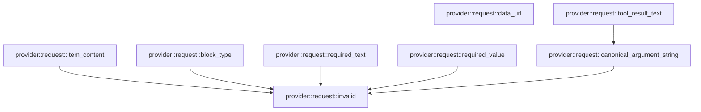

# provider::request

[Package atlas](index.md) · [Source](../../src/request.rs)

## Declarations

Visibility is the declaration spelling; trait members and reexports require their enclosing interface. `cfg` is not evaluated.

| Symbol | Kind | Visibility | Test / cfg |
|---|---|---|---|
| [provider::request::AdapterId](../../src/request.rs#L14) | enum_item | `pub` |  |
| [provider::request::AdapterId::as_str](../../src/request.rs#L24) | function_item | `pub` |  |
| [provider::request::AdapterId::capabilities](../../src/request.rs#L35) | function_item | `pub` |  |
| [provider::request::Err](../../src/request.rs#L54) | type_item | `private` |  |
| [provider::request::AdapterId::from_str](../../src/request.rs#L56) | function_item | `private` |  |
| [provider::request::ProviderCapabilities](../../src/request.rs#L69) | struct_item | `pub` |  |
| [provider::request::PrepareInput](../../src/request.rs#L76) | struct_item | `pub` |  |
| [provider::request::PreparedRequest](../../src/request.rs#L88) | struct_item | `pub` |  |
| [provider::request::PrepareError](../../src/request.rs#L102) | enum_item | `pub` |  |
| [provider::request::endpoint_origin](../../src/request.rs#L113) | function_item | `pub` |  |
| [provider::request::ToolChoice](../../src/request.rs#L126) | enum_item | `pub` |  |
| [provider::request::prepare](../../src/request.rs#L132) | function_item | `pub` |  |
| [provider::request::prepare_with_tool_choice](../../src/request.rs#L137) | function_item | `pub` |  |
| [provider::request::prepare_with_native_deferred_tools](../../src/request.rs#L144) | function_item | `pub` |  |
| [provider::request::prepare_inner](../../src/request.rs#L152) | function_item | `private` |  |
| [provider::request::encode_request_body](../../src/request.rs#L451) | function_item | `private` |  |
| [provider::request::provider_request_digest](../../src/request.rs#L504) | function_item | `pub` |  |
| [provider::request::provider_request_digest_for_dialect](../../src/request.rs#L515) | function_item | `pub` |  |
| [provider::request::provider_query_key](../../src/request.rs#L550) | function_item | `pub` |  |
| [provider::request::value](../../src/request.rs#L557) | function_item | `private` |  |
| [provider::request::values](../../src/request.rs#L561) | function_item | `private` |  |
| [provider::request::anthropic_max_tokens](../../src/request.rs#L571) | function_item | `private` |  |
| [provider::request::anthropic_budget_for_effort](../../src/request.rs#L591) | function_item | `private` |  |
| [provider::request::apply_dialect_controls](../../src/request.rs#L603) | function_item | `private` |  |
| [provider::request::apply_reasoning_disabled](../../src/request.rs#L743) | function_item | `private` |  |
| [provider::request::apply_title_output_cap](../../src/request.rs#L775) | function_item | `private` |  |
| [provider::request::unsupported_controls](../../src/request.rs#L804) | function_item | `private` |  |
| [provider::request::attach_anthropic_breakpoints](../../src/request.rs#L827) | function_item | `private` |  |
| [provider::request::merge_controls](../../src/request.rs#L860) | function_item | `private` |  |
| [provider::request::render_responses](../../src/request.rs#L878) | function_item | `private` |  |
| [provider::request::render_anthropic](../../src/request.rs#L938) | function_item | `private` |  |
| [provider::request::render_chat](../../src/request.rs#L1031) | function_item | `private` |  |
| [provider::request::render_google](../../src/request.rs#L1177) | function_item | `private` |  |
| [provider::request::google_function_response](../../src/request.rs#L1258) | function_item | `private` |  |
| [provider::request::render_interactions](../../src/request.rs#L1275) | function_item | `private` |  |
| [provider::request::render_tools](../../src/request.rs#L1400) | function_item | `private` |  |
| [provider::request::normalize_tool_parameters](../../src/request.rs#L1450) | function_item | `private` |  |
| [provider::request::ANTHROPIC_STRICT_UNSUPPORTED](../../src/request.rs#L1467) | const_item | `private` |  |
| [provider::request::anthropic_strict_subset](../../src/request.rs#L1479) | function_item | `private` |  |
| [provider::request::anthropic_root_conditional](../../src/request.rs#L1506) | function_item | `private` |  |
| [provider::request::kimi_nullable_constraints](../../src/request.rs#L1545) | function_item | `private` |  |
| [provider::request::anthropic_conditional_tests::kimi_nullable_bounds_preserve_null_enum_and_reject_composition_collision](../../src/request.rs#L1620) | function_item | `private` | test; #[cfg(test)] |
| [provider::request::anthropic_conditional_tests::only_isolated_single_conditional_is_hoisted_without_losing_constraints](../../src/request.rs#L1639) | function_item | `private` | test; #[cfg(test)] |
| [provider::request::contains_composition_constraints](../../src/request.rs#L1662) | function_item | `private` |  |
| [provider::request::contains_non_strict_object](../../src/request.rs#L1677) | function_item | `private` |  |
| [provider::request::strict_optional_tests::mcp_schema_metadata_and_omitted_empty_required_render_without_losing_constraints](../../src/request.rs#L1712) | function_item | `private` | test; #[cfg(test)] |
| [provider::request::strict_optional_tests::unique_items_in_nullable_array_preserves_constraints_without_strict_mode](../../src/request.rs#L1733) | function_item | `private` | test; #[cfg(test)] |
| [provider::request::strict_optional_tests::optional_fields_keep_their_schema_and_disable_strict_mode](../../src/request.rs#L1750) | function_item | `private` | test; #[cfg(test)] |
| [provider::request::validate_tool_schema](../../src/request.rs#L1775) | function_item | `private` |  |
| [provider::request::item_role](../../src/request.rs#L1818) | function_item | `private` |  |
| [provider::request::sealed_fragments](../../src/request.rs#L1825) | function_item | `private` |  |
| [provider::request::sealed_fragment_value](../../src/request.rs#L1836) | function_item | `private` |  |
| [provider::request::DEGRADED_FILE_TEXT_LIMIT](../../src/request.rs#L1851) | const_item | `private` |  |
| [provider::request::degraded_file_text](../../src/request.rs#L1858) | function_item | `private` |  |
| [provider::request::data_url](../../src/request.rs#L1887) | function_item | `private` |  |
| [provider::request::item_content](../../src/request.rs#L1895) | function_item | `private` |  |
| [provider::request::block_type](../../src/request.rs#L1902) | function_item | `private` |  |
| [provider::request::required_text](../../src/request.rs#L1909) | function_item | `private` |  |
| [provider::request::required_value](../../src/request.rs#L1918) | function_item | `private` |  |
| [provider::request::tool_result_text](../../src/request.rs#L1928) | function_item | `private` |  |
| [provider::request::canonical_argument_string](../../src/request.rs#L1939) | function_item | `private` |  |
| [provider::request::invalid](../../src/request.rs#L1945) | function_item | `private` |  |
| [provider::request::file_degradation_tests::user](../../src/request.rs#L1954) | function_item | `private` | test; #[cfg(test)] |
| [provider::request::file_degradation_tests::file](../../src/request.rs#L1958) | function_item | `private` | test; #[cfg(test)] |
| [provider::request::file_degradation_tests::pdf_on_anthropic_is_still_a_document](../../src/request.rs#L1966) | function_item | `private` | test; #[cfg(test)] |
| [provider::request::file_degradation_tests::text_file_on_anthropic_degrades_to_fenced_text](../../src/request.rs#L1980) | function_item | `private` | test; #[cfg(test)] |
| [provider::request::file_degradation_tests::binary_file_on_chat_completions_degrades_to_the_stub](../../src/request.rs#L1993) | function_item | `private` | test; #[cfg(test)] |
| [provider::request::file_degradation_tests::oversized_utf8_file_degrades_to_the_stub](../../src/request.rs#L2011) | function_item | `private` | test; #[cfg(test)] |
| [provider::request::file_degradation_tests::text_file_on_responses_is_delivered_as_input_file](../../src/request.rs#L2039) | function_item | `private` | test; #[cfg(test)] |
| [provider::request::file_degradation_tests::google_and_interactions_degrade_in_their_native_text_forms](../../src/request.rs#L2064) | function_item | `private` | test; #[cfg(test)] |
| [provider::request::file_degradation_tests::image_files_are_never_degraded](../../src/request.rs#L2087) | function_item | `private` | test; #[cfg(test)] |
| [provider::request::anthropic_tool_adjacency_tests::a_bounded_schema_is_offered_to_anthropic_without_the_strict_claim](../../src/request.rs#L2127) | function_item | `private` | test; #[cfg(test)] |
| [provider::request::anthropic_tool_adjacency_tests::host_state_between_call_and_result_does_not_break_anthropic_adjacency](../../src/request.rs#L2166) | function_item | `private` | test; #[cfg(test)] |

## Imports / reexports

| Local name | Source path | Visibility |
|---|---|---|
| `BTreeMap` | `std::collections::BTreeMap` | `private` |
| `FromStr` | `std::str::FromStr` | `private` |
| `IJsonValue` | `schema::IJsonValue` | `private` |
| `Deserialize` | `serde::Deserialize` | `private` |
| `Serialize` | `serde::Serialize` | `private` |
| `Value` | `serde_json::Value` | `private` |
| `json` | `serde_json::json` | `private` |
| `Digest` | `sha2::Digest` | `private` |
| `Sha256` | `sha2::Sha256` | `private` |
| `Error` | `thiserror::Error` | `private` |
| `DialectId` | `crate::DialectId` | `private` |
| `ProviderTarget` | `crate::ProviderTarget` | `private` |
| `validate_target` | `crate::validate_target` | `private` |
| `*` | `super::*` | `private` |
| `*` | `super::*` | `private` |
| `*` | `super::*` | `private` |
| `_` | `base64::Engine` | `private` |
| `*` | `super::*` | `private` |

## Module declarations

| Module | Visibility | Attributes |
|---|---|---|
| `provider::request::anthropic_conditional_tests` | `private` | #[cfg(test)] |
| `provider::request::strict_optional_tests` | `private` | #[cfg(test)] |
| `provider::request::file_degradation_tests` | `private` | #[cfg(test)] |
| `provider::request::anthropic_tool_adjacency_tests` | `private` | #[cfg(test)] |

## Function call graphs

Edges below are syntactically resolved calls only, including private functions. Graphs partition callers into groups of 20; they are not execution order. All unresolved sites are listed below and in the JSON inventory.

Functions 1–20: 25 direct edges

```mermaid
flowchart TD
  n0["provider::dialect::validate_target"]
  n1["provider::native_deferred::apply"]
  n2["provider::request::endpoint_origin"]
  n3["provider::request::prepare"]
  n4["provider::request::prepare_with_tool_choice"]
  n5["provider::request::prepare_with_native_deferred_tools"]
  n6["provider::request::prepare_inner"]
  n7["provider::request::invalid"]
  n8["provider::request::AdapterId::as_str"]
  n9["provider::request::AdapterId::capabilities"]
  n10["provider::request::encode_request_body"]
  n11["provider::request::provider_request_digest"]
  n12["provider::request::provider_request_digest_for_dialect"]
  n13["provider::request::provider_query_key"]
  n14["provider::request::value"]
  n15["provider::request::values"]
  n16["provider::request::AdapterId::from_str"]
  n17["provider::request::anthropic_max_tokens"]
  n18["provider::request::anthropic_budget_for_effort"]
  n19["provider::request::apply_dialect_controls"]
  n20["provider::request::apply_reasoning_disabled"]
  n21["provider::request::apply_title_output_cap"]
  n22["provider::request::unsupported_controls"]
  n23["provider::request::attach_anthropic_breakpoints"]
  n24["provider::request::merge_controls"]
  n3 --> n4
  n4 --> n6
  n5 --> n6
  n6 --> n0
  n6 --> n1
  n6 --> n7
  n6 --> n10
  n6 --> n12
  n6 --> n13
  n6 --> n14
  n6 --> n15
  n6 --> n19
  n6 --> n21
  n6 --> n23
  n6 --> n24
  n10 --> n7
  n11 --> n12
  n18 --> n7
  n19 --> n7
  n19 --> n18
  n19 --> n20
  n19 --> n22
  n20 --> n7
  n21 --> n7
  n22 --> n7
```

Functions 21–40: 52 direct edges

```mermaid
flowchart TD
  n0["provider::request::render_chat"]
  n1["provider::request::render_google"]
  n2["provider::request::google_function_response"]
  n3["provider::request::render_interactions"]
  n4["provider::request::render_tools"]
  n5["provider::request::normalize_tool_parameters"]
  n6["provider::request::anthropic_strict_subset"]
  n7["provider::request::anthropic_root_conditional"]
  n8["provider::request::kimi_nullable_constraints"]
  n9["provider::request::contains_composition_constraints"]
  n10["provider::request::contains_non_strict_object"]
  n11["provider::request::validate_tool_schema"]
  n12["provider::request::item_role"]
  n13["provider::request::sealed_fragments"]
  n14["provider::request::sealed_fragment_value"]
  n15["provider::request::degraded_file_text"]
  n16["provider::request::item_content"]
  n17["provider::request::block_type"]
  n18["provider::request::required_text"]
  n19["provider::request::required_value"]
  n20["provider::request::invalid"]
  n21["provider::request::attach_anthropic_breakpoints"]
  n22["provider::request::merge_controls"]
  n23["provider::request::render_responses"]
  n24["provider::request::render_anthropic"]
  n0 --> n12
  n0 --> n14
  n0 --> n15
  n0 --> n16
  n0 --> n17
  n0 --> n18
  n0 --> n20
  n1 --> n12
  n1 --> n14
  n1 --> n16
  n1 --> n17
  n1 --> n18
  n1 --> n20
  n3 --> n12
  n3 --> n13
  n3 --> n16
  n3 --> n17
  n3 --> n18
  n3 --> n20
  n4 --> n5
  n4 --> n6
  n4 --> n8
  n4 --> n9
  n4 --> n10
  n4 --> n11
  n4 --> n18
  n4 --> n19
  n4 --> n20
  n6 --> n6
  n8 --> n8
  n8 --> n20
  n9 --> n9
  n11 --> n20
  n12 --> n20
  n13 --> n14
  n13 --> n20
  n14 --> n20
  n15 --> n18
  n15 --> n20
  n21 --> n20
  n23 --> n12
  n23 --> n13
  n23 --> n16
  n23 --> n17
  n23 --> n18
  n23 --> n20
  n24 --> n12
  n24 --> n13
  n24 --> n16
  n24 --> n17
  n24 --> n18
  n24 --> n20
```

Functions 41–48: 6 direct edges

```mermaid
flowchart TD
  n0["provider::request::data_url"]
  n1["provider::request::item_content"]
  n2["provider::request::block_type"]
  n3["provider::request::required_text"]
  n4["provider::request::required_value"]
  n5["provider::request::tool_result_text"]
  n6["provider::request::canonical_argument_string"]
  n7["provider::request::invalid"]
  n1 --> n7
  n2 --> n7
  n3 --> n7
  n4 --> n7
  n5 --> n6
  n6 --> n7
```

## Call sites

Includes test functions (marked in declarations). Receiver-type-required sites need type analysis/manual tracing. Calls in closures are attributed to their enclosing function; their occurrence here does not mean the closure executes immediately.

| Caller | Callee expression | Source lines | Target / classification |
|---|---|---|---|
| `from_str` | `Ok` | [58](../../src/request.rs#L58), [59](../../src/request.rs#L59), [60](../../src/request.rs#L60), [61](../../src/request.rs#L61), [62](../../src/request.rs#L62) | external-constructor-callback-or-unresolved |
| `from_str` | `Err` | [63](../../src/request.rs#L63) | external-constructor-callback-or-unresolved |
| `from_str` | `PrepareError::UnknownAdapter` | [63](../../src/request.rs#L63) | external-constructor-callback-or-unresolved |
| `from_str` | `other.to_owned` | [63](../../src/request.rs#L63) | receiver-type-required |
| `endpoint_origin` | `reqwest::Url::parse(endpoint)         .map_err` | [114](../../src/request.rs#L114) | receiver-type-required |
| `endpoint_origin` | `reqwest::Url::parse` | [114](../../src/request.rs#L114) | external-constructor-callback-or-unresolved |
| `endpoint_origin` | `PrepareError::InvalidEndpoint` | [115](../../src/request.rs#L115), [118](../../src/request.rs#L118), [121](../../src/request.rs#L121) | external-constructor-callback-or-unresolved |
| `endpoint_origin` | `error.to_string` | [115](../../src/request.rs#L115) | receiver-type-required |
| `endpoint_origin` | `url         .host_str()         .ok_or_else` | [116](../../src/request.rs#L116) | receiver-type-required |
| `endpoint_origin` | `url         .host_str` | [116](../../src/request.rs#L116) | receiver-type-required |
| `endpoint_origin` | `"endpoint has no host".to_owned` | [118](../../src/request.rs#L118) | receiver-type-required |
| `endpoint_origin` | `url         .port_or_known_default()         .ok_or_else` | [119](../../src/request.rs#L119) | receiver-type-required |
| `endpoint_origin` | `url         .port_or_known_default` | [119](../../src/request.rs#L119) | receiver-type-required |
| `endpoint_origin` | `"endpoint has no known port".to_owned` | [121](../../src/request.rs#L121) | receiver-type-required |
| `endpoint_origin` | `Ok` | [122](../../src/request.rs#L122) | external-constructor-callback-or-unresolved |
| `prepare` | `prepare_with_tool_choice` | [133](../../src/request.rs#L133) | [provider::request::prepare_with_tool_choice](../../src/request.rs#L137) |
| `prepare_with_tool_choice` | `prepare_inner` | [141](../../src/request.rs#L141) | [provider::request::prepare_inner](../../src/request.rs#L152) |
| `prepare_with_native_deferred_tools` | `prepare_inner` | [149](../../src/request.rs#L149) | [provider::request::prepare_inner](../../src/request.rs#L152) |
| `prepare_with_native_deferred_tools` | `Some` | [149](../../src/request.rs#L149) | external-constructor-callback-or-unresolved |
| `prepare_inner` | `input.endpoint.trim_end_matches` | [157](../../src/request.rs#L157) | receiver-type-required |
| `prepare_inner` | `configured_base.starts_with` | [158](../../src/request.rs#L158), [159](../../src/request.rs#L159) | receiver-type-required |
| `prepare_inner` | `Err` | [161](../../src/request.rs#L161), [175](../../src/request.rs#L175), [182](../../src/request.rs#L182), [201](../../src/request.rs#L201), [227](../../src/request.rs#L227), [321](../../src/request.rs#L321), [385](../../src/request.rs#L385) | external-constructor-callback-or-unresolved |
| `prepare_inner` | `PrepareError::InvalidEndpoint` | [161](../../src/request.rs#L161) | external-constructor-callback-or-unresolved |
| `prepare_inner` | `input.endpoint.clone` | [161](../../src/request.rs#L161) | receiver-type-required |
| `prepare_inner` | `validate_target(&input.target)         .map_err` | [163](../../src/request.rs#L163) | receiver-type-required |
| `prepare_inner` | `validate_target` | [163](../../src/request.rs#L163) | [provider::dialect::validate_target](../../src/dialect.rs#L737) |
| `prepare_inner` | `PrepareError::InvalidTarget` | [164](../../src/request.rs#L164), [175](../../src/request.rs#L175), [182](../../src/request.rs#L182) | external-constructor-callback-or-unresolved |
| `prepare_inner` | `error.to_string` | [164](../../src/request.rs#L164), [172](../../src/request.rs#L172) | receiver-type-required |
| `prepare_inner` | `dialect.family` | [166](../../src/request.rs#L166) | receiver-type-required |
| `prepare_inner` | `resolved.wire_model` | [167](../../src/request.rs#L167) | receiver-type-required |
| `prepare_inner` | `value` | [168](../../src/request.rs#L168), [196](../../src/request.rs#L196) | [provider::request::value](../../src/request.rs#L557) |
| `prepare_inner` | `profile.get` | [169](../../src/request.rs#L169), [179](../../src/request.rs#L179) | receiver-type-required |
| `prepare_inner` | `Some` | [170](../../src/request.rs#L170), [180](../../src/request.rs#L180), [337](../../src/request.rs#L337) | external-constructor-callback-or-unresolved |
| `prepare_inner` | `serde_json::to_value(&input.target)                 .map_err` | [171](../../src/request.rs#L171) | receiver-type-required |
| `prepare_inner` | `serde_json::to_value` | [171](../../src/request.rs#L171) | external-constructor-callback-or-unresolved |
| `prepare_inner` | `PrepareError::InvalidJson` | [172](../../src/request.rs#L172), [227](../../src/request.rs#L227) | external-constructor-callback-or-unresolved |
| `prepare_inner` | `"epoch target does not match request target".to_owned` | [176](../../src/request.rs#L176) | receiver-type-required |
| `prepare_inner` | `profile.get("serializer_revision").and_then` | [179](../../src/request.rs#L179) | receiver-type-required |
| `prepare_inner` | `"epoch serializer revision does not match request target".to_owned` | [183](../../src/request.rs#L183) | receiver-type-required |
| `prepare_inner` | `profile         .get("system")         .and_then(Value::as_str)         .unwrap_or_default` | [186](../../src/request.rs#L186) | receiver-type-required |
| `prepare_inner` | `profile         .get("system")         .and_then` | [186](../../src/request.rs#L186) | receiver-type-required |
| `prepare_inner` | `profile         .get` | [186](../../src/request.rs#L186), [190](../../src/request.rs#L190) | receiver-type-required |
| `prepare_inner` | `profile         .get("controls")         .and_then(Value::as_object)         .cloned()         .unwrap_or_default` | [190](../../src/request.rs#L190) | receiver-type-required |
| `prepare_inner` | `profile         .get("controls")         .and_then(Value::as_object)         .cloned` | [190](../../src/request.rs#L190) | receiver-type-required |
| `prepare_inner` | `profile         .get("controls")         .and_then` | [190](../../src/request.rs#L190) | receiver-type-required |
| `prepare_inner` | `values` | [195](../../src/request.rs#L195) | [provider::request::values](../../src/request.rs#L561) |
| `prepare_inner` | `controls.remove` | [197](../../src/request.rs#L197), [198](../../src/request.rs#L198) | receiver-type-required |
| `prepare_inner` | `invalid` | [201](../../src/request.rs#L201), [211](../../src/request.rs#L211), [321](../../src/request.rs#L321), [365](../../src/request.rs#L365), [385](../../src/request.rs#L385) | [provider::request::invalid](../../src/request.rs#L1945) |
| `prepare_inner` | `controls         .remove("title_max_output_tokens")         .map(&#124;value&#124; {             value                 .as_u64()                 .filter(&#124;cap&#124; *cap > 0)                 .ok_or_else(&#124;&#124; invalid("title_max_output_tokens must be a positive integer"))         })         .transpose` | [205](../../src/request.rs#L205) | receiver-type-required |
| `prepare_inner` | `controls         .remove("title_max_output_tokens")         .map` | [205](../../src/request.rs#L205) | receiver-type-required |
| `prepare_inner` | `controls         .remove` | [205](../../src/request.rs#L205) | receiver-type-required |
| `prepare_inner` | `value                 .as_u64()                 .filter(&#124;cap&#124; *cap > 0)                 .ok_or_else` | [208](../../src/request.rs#L208) | receiver-type-required |
| `prepare_inner` | `value                 .as_u64()                 .filter` | [208](../../src/request.rs#L208) | receiver-type-required |
| `prepare_inner` | `value                 .as_u64` | [208](../../src/request.rs#L208) | receiver-type-required |
| `prepare_inner` | `apply_dialect_controls` | [214](../../src/request.rs#L214) | [provider::request::apply_dialect_controls](../../src/request.rs#L603) |
| `prepare_inner` | `controls         .get("thinking")         .and_then(&#124;thinking&#124; thinking.get("budget_tokens"))         .and_then` | [220](../../src/request.rs#L220) | receiver-type-required |
| `prepare_inner` | `controls         .get("thinking")         .and_then` | [220](../../src/request.rs#L220) | receiver-type-required |
| `prepare_inner` | `controls         .get` | [220](../../src/request.rs#L220) | receiver-type-required |
| `prepare_inner` | `thinking.get` | [222](../../src/request.rs#L222) | receiver-type-required |
| `prepare_inner` | `Value::from` | [225](../../src/request.rs#L225), [265](../../src/request.rs#L265) | external-constructor-callback-or-unresolved |
| `prepare_inner` | `anthropic_max_tokens` | [225](../../src/request.rs#L225) | external-constructor-callback-or-unresolved |
| `prepare_inner` | `input.continuation_id.is_some` | [226](../../src/request.rs#L226) | receiver-type-required |
| `prepare_inner` | `dialect.server_managed` | [226](../../src/request.rs#L226) | receiver-type-required |
| `prepare_inner` | `"stateless adapter cannot receive continuation_id".to_owned` | [228](../../src/request.rs#L228) | receiver-type-required |
| `prepare_inner` | `"/responses".to_owned` | [233](../../src/request.rs#L233) | receiver-type-required |
| `prepare_inner` | `"/messages".to_owned` | [237](../../src/request.rs#L237) | receiver-type-required |
| `prepare_inner` | `"/interactions".to_owned` | [252](../../src/request.rs#L252) | receiver-type-required |
| `prepare_inner` | `"/chat/completions".to_owned` | [256](../../src/request.rs#L256) | receiver-type-required |
| `prepare_inner` | `resolved.max_output_tokens` | [261](../../src/request.rs#L261) | receiver-type-required |
| `prepare_inner` | `body.as_object_mut()             .expect("chat body is an object")             .insert` | [263](../../src/request.rs#L263), [268](../../src/request.rs#L268) | receiver-type-required |
| `prepare_inner` | `body.as_object_mut()             .expect` | [263](../../src/request.rs#L263), [268](../../src/request.rs#L268), [273](../../src/request.rs#L273), [295](../../src/request.rs#L295) | receiver-type-required |
| `prepare_inner` | `body.as_object_mut` | [263](../../src/request.rs#L263), [268](../../src/request.rs#L268), [273](../../src/request.rs#L273), [282](../../src/request.rs#L282), [295](../../src/request.rs#L295) | receiver-type-required |
| `prepare_inner` | `"max_tokens".to_owned` | [265](../../src/request.rs#L265) | receiver-type-required |
| `prepare_inner` | `"stream_options".to_owned` | [270](../../src/request.rs#L270) | receiver-type-required |
| `prepare_inner` | `body.as_object_mut()             .expect("Responses body is an object")             .insert` | [273](../../src/request.rs#L273) | receiver-type-required |
| `prepare_inner` | `"store".to_owned` | [275](../../src/request.rs#L275) | receiver-type-required |
| `prepare_inner` | `Value::Bool` | [275](../../src/request.rs#L275) | external-constructor-callback-or-unresolved |
| `prepare_inner` | `attach_anthropic_breakpoints` | [281](../../src/request.rs#L281) | [provider::request::attach_anthropic_breakpoints](../../src/request.rs#L827) |
| `prepare_inner` | `body.as_object_mut().expect` | [282](../../src/request.rs#L282) | receiver-type-required |
| `prepare_inner` | `resolved.refusal_fallback` | [283](../../src/request.rs#L283), [408](../../src/request.rs#L408) | receiver-type-required |
| `prepare_inner` | `object.insert` | [284](../../src/request.rs#L284) | receiver-type-required |
| `prepare_inner` | `"fallbacks".to_owned` | [284](../../src/request.rs#L284) | receiver-type-required |
| `prepare_inner` | `Value::String` | [284](../../src/request.rs#L284), [297](../../src/request.rs#L297) | external-constructor-callback-or-unresolved |
| `prepare_inner` | `"default".to_owned` | [284](../../src/request.rs#L284) | receiver-type-required |
| `prepare_inner` | `body.as_object_mut()             .expect("adapter request bodies are objects")             .insert` | [295](../../src/request.rs#L295) | receiver-type-required |
| `prepare_inner` | `field.to_owned` | [297](../../src/request.rs#L297) | receiver-type-required |
| `prepare_inner` | `continuation.clone` | [297](../../src/request.rs#L297) | receiver-type-required |
| `prepare_inner` | `merge_controls` | [299](../../src/request.rs#L299) | [provider::request::merge_controls](../../src/request.rs#L860) |
| `prepare_inner` | `apply_title_output_cap` | [301](../../src/request.rs#L301) | [provider::request::apply_title_output_cap](../../src/request.rs#L775) |
| `prepare_inner` | `tools.as_array().is_none_or` | [320](../../src/request.rs#L320) | receiver-type-required |
| `prepare_inner` | `tools.as_array` | [320](../../src/request.rs#L320) | receiver-type-required |
| `prepare_inner` | `body.pointer("/thinking/type").and_then` | [337](../../src/request.rs#L337) | receiver-type-required |
| `prepare_inner` | `body.pointer` | [337](../../src/request.rs#L337) | receiver-type-required |
| `prepare_inner` | `resolved.forced_tool_choice` | [338](../../src/request.rs#L338) | receiver-type-required |
| `prepare_inner` | `body                     .as_object_mut()                     .expect("Interactions body is an object")                     .entry("generation_config".to_owned())                     .or_insert_with` | [358](../../src/request.rs#L358) | receiver-type-required |
| `prepare_inner` | `body                     .as_object_mut()                     .expect("Interactions body is an object")                     .entry` | [358](../../src/request.rs#L358) | receiver-type-required |
| `prepare_inner` | `body                     .as_object_mut()                     .expect` | [358](../../src/request.rs#L358) | receiver-type-required |
| `prepare_inner` | `body                     .as_object_mut` | [358](../../src/request.rs#L358) | receiver-type-required |
| `prepare_inner` | `"generation_config".to_owned` | [361](../../src/request.rs#L361) | receiver-type-required |
| `prepare_inner` | `config                     .as_object_mut()                     .ok_or_else(&#124;&#124; invalid("generation_config must be an object"))?                     .insert` | [363](../../src/request.rs#L363) | receiver-type-required |
| `prepare_inner` | `config                     .as_object_mut()                     .ok_or_else` | [363](../../src/request.rs#L363) | receiver-type-required |
| `prepare_inner` | `config                     .as_object_mut` | [363](../../src/request.rs#L363) | receiver-type-required |
| `prepare_inner` | `"tool_choice".to_owned` | [366](../../src/request.rs#L366) | receiver-type-required |
| `prepare_inner` | `item                 .get("content")                 .and_then(Value::as_array)                 .into_iter()                 .flatten` | [372](../../src/request.rs#L372) | receiver-type-required |
| `prepare_inner` | `item                 .get("content")                 .and_then(Value::as_array)                 .into_iter` | [372](../../src/request.rs#L372) | receiver-type-required |
| `prepare_inner` | `item                 .get("content")                 .and_then` | [372](../../src/request.rs#L372) | receiver-type-required |
| `prepare_inner` | `item                 .get` | [372](../../src/request.rs#L372) | receiver-type-required |
| `prepare_inner` | `native                         .references                         .iter()                         .any` | [380](../../src/request.rs#L380) | receiver-type-required |
| `prepare_inner` | `native                         .references                         .iter` | [380](../../src/request.rs#L380) | receiver-type-required |
| `prepare_inner` | `crate::native_deferred::apply` | [391](../../src/request.rs#L391) | [provider::native_deferred::apply](../../src/native_deferred.rs#L36) |
| `prepare_inner` | `encode_request_body` | [393](../../src/request.rs#L393) | [provider::request::encode_request_body](../../src/request.rs#L451) |
| `prepare_inner` | `BTreeMap::from` | [394](../../src/request.rs#L394) | external-constructor-callback-or-unresolved |
| `prepare_inner` | `"accept".to_owned` | [396](../../src/request.rs#L396) | receiver-type-required |
| `prepare_inner` | `if input.stream {                 "text/event-stream"             } else {                 "application/json"             }             .to_owned` | [397](../../src/request.rs#L397) | receiver-type-required |
| `prepare_inner` | `"content-type".to_owned` | [404](../../src/request.rs#L404) | receiver-type-required |
| `prepare_inner` | `"application/json".to_owned` | [404](../../src/request.rs#L404) | receiver-type-required |
| `prepare_inner` | `headers_without_secret.insert` | [407](../../src/request.rs#L407), [409](../../src/request.rs#L409) | receiver-type-required |
| `prepare_inner` | `"anthropic-version".to_owned` | [407](../../src/request.rs#L407) | receiver-type-required |
| `prepare_inner` | `"2023-06-01".to_owned` | [407](../../src/request.rs#L407) | receiver-type-required |
| `prepare_inner` | `"anthropic-beta".to_owned` | [410](../../src/request.rs#L410), [418](../../src/request.rs#L418) | receiver-type-required |
| `prepare_inner` | `"server-side-fallback-2026-07-01".to_owned` | [411](../../src/request.rs#L411) | receiver-type-required |
| `prepare_inner` | `headers_without_secret             .entry("anthropic-beta".to_owned())             .or_default` | [417](../../src/request.rs#L417) | receiver-type-required |
| `prepare_inner` | `headers_without_secret             .entry` | [417](../../src/request.rs#L417) | receiver-type-required |
| `prepare_inner` | `beta.is_empty` | [420](../../src/request.rs#L420) | receiver-type-required |
| `prepare_inner` | `beta.push` | [421](../../src/request.rs#L421) | receiver-type-required |
| `prepare_inner` | `beta.push_str` | [423](../../src/request.rs#L423) | receiver-type-required |
| `prepare_inner` | `provider_request_digest_for_dialect` | [425](../../src/request.rs#L425) | [provider::request::provider_request_digest_for_dialect](../../src/request.rs#L515) |
| `prepare_inner` | `dialect.as_str` | [426](../../src/request.rs#L426) | receiver-type-required |
| `prepare_inner` | `adapter.capabilities` | [433](../../src/request.rs#L433) | receiver-type-required |
| `prepare_inner` | `capabilities         .query_by_identity         .then` | [434](../../src/request.rs#L434) | receiver-type-required |
| `prepare_inner` | `provider_query_key` | [436](../../src/request.rs#L436) | [provider::request::provider_query_key](../../src/request.rs#L550) |
| `prepare_inner` | `Ok` | [437](../../src/request.rs#L437) | external-constructor-callback-or-unresolved |
| `prepare_inner` | `"POST".to_owned` | [438](../../src/request.rs#L438) | receiver-type-required |
| `prepare_inner` | `u64::try_from(body.len()).unwrap_or` | [443](../../src/request.rs#L443) | receiver-type-required |
| `prepare_inner` | `u64::try_from` | [443](../../src/request.rs#L443) | external-constructor-callback-or-unresolved |
| `prepare_inner` | `body.len` | [443](../../src/request.rs#L443) | receiver-type-required |
| `encode_request_body` | `serde_json_canonicalizer::to_vec(body)             .map_err` | [456](../../src/request.rs#L456) | receiver-type-required |
| `encode_request_body` | `serde_json_canonicalizer::to_vec` | [456](../../src/request.rs#L456), [496](../../src/request.rs#L496) | external-constructor-callback-or-unresolved |
| `encode_request_body` | `PrepareError::InvalidJson` | [457](../../src/request.rs#L457), [492](../../src/request.rs#L492), [497](../../src/request.rs#L497) | external-constructor-callback-or-unresolved |
| `encode_request_body` | `error.to_string` | [457](../../src/request.rs#L457), [492](../../src/request.rs#L492), [497](../../src/request.rs#L497) | receiver-type-required |
| `encode_request_body` | `body         .as_object()         .ok_or_else` | [459](../../src/request.rs#L459) | receiver-type-required |
| `encode_request_body` | `body         .as_object` | [459](../../src/request.rs#L459) | receiver-type-required |
| `encode_request_body` | `invalid` | [461](../../src/request.rs#L461), [475](../../src/request.rs#L475) | [provider::request::invalid](../../src/request.rs#L1945) |
| `encode_request_body` | `object.keys().any` | [474](../../src/request.rs#L474) | receiver-type-required |
| `encode_request_body` | `object.keys` | [474](../../src/request.rs#L474) | receiver-type-required |
| `encode_request_body` | `order.contains` | [474](../../src/request.rs#L474) | receiver-type-required |
| `encode_request_body` | `key.as_str` | [474](../../src/request.rs#L474) | receiver-type-required |
| `encode_request_body` | `Err` | [475](../../src/request.rs#L475) | external-constructor-callback-or-unresolved |
| `encode_request_body` | `object.get` | [483](../../src/request.rs#L483) | receiver-type-required |
| `encode_request_body` | `bytes.push` | [487](../../src/request.rs#L487), [494](../../src/request.rs#L494), [500](../../src/request.rs#L500) | receiver-type-required |
| `encode_request_body` | `bytes.extend_from_slice` | [490](../../src/request.rs#L490), [495](../../src/request.rs#L495) | receiver-type-required |
| `encode_request_body` | `serde_json::to_vec(key)                 .map_err` | [491](../../src/request.rs#L491) | receiver-type-required |
| `encode_request_body` | `serde_json::to_vec` | [491](../../src/request.rs#L491) | external-constructor-callback-or-unresolved |
| `encode_request_body` | `serde_json_canonicalizer::to_vec(value)                 .map_err` | [496](../../src/request.rs#L496) | receiver-type-required |
| `encode_request_body` | `Ok` | [501](../../src/request.rs#L501) | external-constructor-callback-or-unresolved |
| `provider_request_digest` | `provider_request_digest_for_dialect` | [512](../../src/request.rs#L512) | [provider::request::provider_request_digest_for_dialect](../../src/request.rs#L515) |
| `provider_request_digest` | `adapter.as_str` | [512](../../src/request.rs#L512) | receiver-type-required |
| `provider_request_digest_for_dialect` | `headers         .keys()         .any` | [523](../../src/request.rs#L523) | receiver-type-required |
| `provider_request_digest_for_dialect` | `headers         .keys` | [523](../../src/request.rs#L523) | receiver-type-required |
| `provider_request_digest_for_dialect` | `name.to_ascii_lowercase` | [525](../../src/request.rs#L525) | receiver-type-required |
| `provider_request_digest_for_dialect` | `Err` | [527](../../src/request.rs#L527) | external-constructor-callback-or-unresolved |
| `provider_request_digest_for_dialect` | `PrepareError::InvalidJson` | [527](../../src/request.rs#L527), [532](../../src/request.rs#L532) | external-constructor-callback-or-unresolved |
| `provider_request_digest_for_dialect` | `"header names must be lowercase".to_owned` | [528](../../src/request.rs#L528) | receiver-type-required |
| `provider_request_digest_for_dialect` | `serde_json_canonicalizer::to_vec(headers)         .map_err` | [531](../../src/request.rs#L531) | receiver-type-required |
| `provider_request_digest_for_dialect` | `serde_json_canonicalizer::to_vec` | [531](../../src/request.rs#L531) | external-constructor-callback-or-unresolved |
| `provider_request_digest_for_dialect` | `error.to_string` | [532](../../src/request.rs#L532) | receiver-type-required |
| `provider_request_digest_for_dialect` | `Sha256::new` | [533](../../src/request.rs#L533) | external-constructor-callback-or-unresolved |
| `provider_request_digest_for_dialect` | `hasher.update` | [534](../../src/request.rs#L534), [535](../../src/request.rs#L535), [536](../../src/request.rs#L536), [537](../../src/request.rs#L537), [538](../../src/request.rs#L538), [539](../../src/request.rs#L539), [540](../../src/request.rs#L540), [541](../../src/request.rs#L541), [542](../../src/request.rs#L542), [543](../../src/request.rs#L543), [544](../../src/request.rs#L544), [545](../../src/request.rs#L545) | receiver-type-required |
| `provider_request_digest_for_dialect` | `dialect_id.as_bytes` | [535](../../src/request.rs#L535) | receiver-type-required |
| `provider_request_digest_for_dialect` | `method.to_ascii_uppercase().as_bytes` | [537](../../src/request.rs#L537) | receiver-type-required |
| `provider_request_digest_for_dialect` | `method.to_ascii_uppercase` | [537](../../src/request.rs#L537) | receiver-type-required |
| `provider_request_digest_for_dialect` | `final_url.as_bytes` | [539](../../src/request.rs#L539) | receiver-type-required |
| `provider_request_digest_for_dialect` | `model.as_bytes` | [541](../../src/request.rs#L541) | receiver-type-required |
| `provider_request_digest_for_dialect` | `Ok` | [546](../../src/request.rs#L546) | external-constructor-callback-or-unresolved |
| `provider_query_key` | `Sha256::new` | [551](../../src/request.rs#L551) | external-constructor-callback-or-unresolved |
| `provider_query_key` | `hasher.update` | [552](../../src/request.rs#L552), [553](../../src/request.rs#L553) | receiver-type-required |
| `provider_query_key` | `attempt_id.as_bytes` | [553](../../src/request.rs#L553) | receiver-type-required |
| `value` | `serde_json::to_value(value).expect` | [558](../../src/request.rs#L558) | receiver-type-required |
| `value` | `serde_json::to_value` | [558](../../src/request.rs#L558) | external-constructor-callback-or-unresolved |
| `values` | `values.iter().map(value).collect` | [562](../../src/request.rs#L562) | receiver-type-required |
| `values` | `values.iter().map` | [562](../../src/request.rs#L562) | receiver-type-required |
| `values` | `values.iter` | [562](../../src/request.rs#L562) | receiver-type-required |
| `anthropic_max_tokens` | `profile.max_output_tokens` | [576](../../src/request.rs#L576) | receiver-type-required |
| `anthropic_max_tokens` | `base.max` | [586](../../src/request.rs#L586) | receiver-type-required |
| `anthropic_max_tokens` | `budget.saturating_add` | [586](../../src/request.rs#L586) | receiver-type-required |
| `anthropic_budget_for_effort` | `Ok` | [593](../../src/request.rs#L593), [594](../../src/request.rs#L594), [595](../../src/request.rs#L595), [596](../../src/request.rs#L596) | external-constructor-callback-or-unresolved |
| `anthropic_budget_for_effort` | `Err` | [597](../../src/request.rs#L597) | external-constructor-callback-or-unresolved |
| `anthropic_budget_for_effort` | `invalid` | [597](../../src/request.rs#L597) | [provider::request::invalid](../../src/request.rs#L1945) |
| `apply_dialect_controls` | `controls.is_empty` | [613](../../src/request.rs#L613) | receiver-type-required |
| `apply_dialect_controls` | `unsupported_controls` | [614](../../src/request.rs#L614) | [provider::request::unsupported_controls](../../src/request.rs#L804) |
| `apply_dialect_controls` | `apply_reasoning_disabled` | [617](../../src/request.rs#L617) | [provider::request::apply_reasoning_disabled](../../src/request.rs#L743) |
| `apply_dialect_controls` | `reasoning_effort.is_some` | [617](../../src/request.rs#L617) | receiver-type-required |
| `apply_dialect_controls` | `reasoning_effort         .as_ref()         .map(&#124;value&#124; {             let value = value                 .as_str()                 .ok_or_else(&#124;&#124; invalid("reasoning_effort must be a string"))?;             profile                 .reasoning_efforts()                 .iter()                 .any(&#124;item&#124; item == value)                 .then_some(value)                 .ok_or_else(&#124;&#124; {                     invalid(format!(                         "reasoning_effort {value} is unsupported by exact dialect {}",                         dialect.as_str()                     ))                 })         })         .transpose` | [619](../../src/request.rs#L619) | receiver-type-required |
| `apply_dialect_controls` | `reasoning_effort         .as_ref()         .map` | [619](../../src/request.rs#L619) | receiver-type-required |
| `apply_dialect_controls` | `reasoning_effort         .as_ref` | [619](../../src/request.rs#L619) | receiver-type-required |
| `apply_dialect_controls` | `value                 .as_str()                 .ok_or_else` | [622](../../src/request.rs#L622) | receiver-type-required |
| `apply_dialect_controls` | `value                 .as_str` | [622](../../src/request.rs#L622) | receiver-type-required |
| `apply_dialect_controls` | `invalid` | [624](../../src/request.rs#L624), [631](../../src/request.rs#L631), [706](../../src/request.rs#L706), [714](../../src/request.rs#L714) | [provider::request::invalid](../../src/request.rs#L1945) |
| `apply_dialect_controls` | `profile                 .reasoning_efforts()                 .iter()                 .any(&#124;item&#124; item == value)                 .then_some(value)                 .ok_or_else` | [625](../../src/request.rs#L625) | receiver-type-required |
| `apply_dialect_controls` | `profile                 .reasoning_efforts()                 .iter()                 .any(&#124;item&#124; item == value)                 .then_some` | [625](../../src/request.rs#L625) | receiver-type-required |
| `apply_dialect_controls` | `profile                 .reasoning_efforts()                 .iter()                 .any` | [625](../../src/request.rs#L625) | receiver-type-required |
| `apply_dialect_controls` | `profile                 .reasoning_efforts()                 .iter` | [625](../../src/request.rs#L625) | receiver-type-required |
| `apply_dialect_controls` | `profile                 .reasoning_efforts` | [625](../../src/request.rs#L625) | receiver-type-required |
| `apply_dialect_controls` | `effort.is_some` | [639](../../src/request.rs#L639), [642](../../src/request.rs#L642), [646](../../src/request.rs#L646), [649](../../src/request.rs#L649), [690](../../src/request.rs#L690), [724](../../src/request.rs#L724) | receiver-type-required |
| `apply_dialect_controls` | `controls.insert` | [640](../../src/request.rs#L640), [643](../../src/request.rs#L643), [644](../../src/request.rs#L644), [647](../../src/request.rs#L647), [650](../../src/request.rs#L650), [651](../../src/request.rs#L651), [663](../../src/request.rs#L663), [668](../../src/request.rs#L668), [674](../../src/request.rs#L674), [682](../../src/request.rs#L682), [683](../../src/request.rs#L683), [719](../../src/request.rs#L719), [725](../../src/request.rs#L725) | receiver-type-required |
| `apply_dialect_controls` | `"reasoning".to_owned` | [640](../../src/request.rs#L640) | receiver-type-required |
| `apply_dialect_controls` | `"reasoning_effort".to_owned` | [643](../../src/request.rs#L643), [647](../../src/request.rs#L647), [650](../../src/request.rs#L650) | receiver-type-required |
| `apply_dialect_controls` | `"thinking".to_owned` | [644](../../src/request.rs#L644), [652](../../src/request.rs#L652), [664](../../src/request.rs#L664), [675](../../src/request.rs#L675), [682](../../src/request.rs#L682) | receiver-type-required |
| `apply_dialect_controls` | `profile.thinking_wire` | [657](../../src/request.rs#L657), [692](../../src/request.rs#L692) | receiver-type-required |
| `apply_dialect_controls` | `"output_config".to_owned` | [668](../../src/request.rs#L668), [683](../../src/request.rs#L683) | receiver-type-required |
| `apply_dialect_controls` | `anthropic_budget_for_effort` | [673](../../src/request.rs#L673) | [provider::request::anthropic_budget_for_effort](../../src/request.rs#L591) |
| `apply_dialect_controls` | `effort.expect` | [691](../../src/request.rs#L691) | receiver-type-required |
| `apply_dialect_controls` | `Err` | [706](../../src/request.rs#L706), [714](../../src/request.rs#L714) | external-constructor-callback-or-unresolved |
| `apply_dialect_controls` | `"generationConfig".to_owned` | [720](../../src/request.rs#L720) | receiver-type-required |
| `apply_dialect_controls` | `"generation_config".to_owned` | [726](../../src/request.rs#L726) | receiver-type-required |
| `apply_dialect_controls` | `profile.pro_reasoning` | [732](../../src/request.rs#L732) | receiver-type-required |
| `apply_dialect_controls` | `controls.entry("reasoning").or_insert_with` | [733](../../src/request.rs#L733) | receiver-type-required |
| `apply_dialect_controls` | `controls.entry` | [733](../../src/request.rs#L733) | receiver-type-required |
| `apply_dialect_controls` | `Ok` | [735](../../src/request.rs#L735) | external-constructor-callback-or-unresolved |
| `apply_reasoning_disabled` | `Err` | [749](../../src/request.rs#L749), [761](../../src/request.rs#L761) | external-constructor-callback-or-unresolved |
| `apply_reasoning_disabled` | `invalid` | [749](../../src/request.rs#L749), [761](../../src/request.rs#L761) | [provider::request::invalid](../../src/request.rs#L1945) |
| `apply_reasoning_disabled` | `controls.insert` | [755](../../src/request.rs#L755), [758](../../src/request.rs#L758) | receiver-type-required |
| `apply_reasoning_disabled` | `"reasoning".to_owned` | [755](../../src/request.rs#L755) | receiver-type-required |
| `apply_reasoning_disabled` | `"thinking".to_owned` | [758](../../src/request.rs#L758) | receiver-type-required |
| `apply_reasoning_disabled` | `Ok` | [767](../../src/request.rs#L767) | external-constructor-callback-or-unresolved |
| `apply_title_output_cap` | `body         .as_object_mut()         .ok_or_else` | [780](../../src/request.rs#L780) | receiver-type-required |
| `apply_title_output_cap` | `body         .as_object_mut` | [780](../../src/request.rs#L780) | receiver-type-required |
| `apply_title_output_cap` | `invalid` | [782](../../src/request.rs#L782), [795](../../src/request.rs#L795) | [provider::request::invalid](../../src/request.rs#L1945) |
| `apply_title_output_cap` | `object.insert` | [785](../../src/request.rs#L785), [792](../../src/request.rs#L792) | receiver-type-required |
| `apply_title_output_cap` | `"max_output_tokens".to_owned` | [785](../../src/request.rs#L785) | receiver-type-required |
| `apply_title_output_cap` | `Value::from` | [785](../../src/request.rs#L785), [792](../../src/request.rs#L792) | external-constructor-callback-or-unresolved |
| `apply_title_output_cap` | `object                 .get("max_tokens")                 .and_then(Value::as_u64)                 .map_or` | [788](../../src/request.rs#L788) | receiver-type-required |
| `apply_title_output_cap` | `object                 .get("max_tokens")                 .and_then` | [788](../../src/request.rs#L788) | receiver-type-required |
| `apply_title_output_cap` | `object                 .get` | [788](../../src/request.rs#L788) | receiver-type-required |
| `apply_title_output_cap` | `c.min` | [791](../../src/request.rs#L791) | receiver-type-required |
| `apply_title_output_cap` | `"max_tokens".to_owned` | [792](../../src/request.rs#L792) | receiver-type-required |
| `apply_title_output_cap` | `Err` | [795](../../src/request.rs#L795) | external-constructor-callback-or-unresolved |
| `apply_title_output_cap` | `Ok` | [801](../../src/request.rs#L801) | external-constructor-callback-or-unresolved |
| `unsupported_controls` | `Err` | [808](../../src/request.rs#L808) | external-constructor-callback-or-unresolved |
| `unsupported_controls` | `invalid` | [808](../../src/request.rs#L808) | [provider::request::invalid](../../src/request.rs#L1945) |
| `attach_anthropic_breakpoints` | `body         .get_mut("tools")         .and_then(Value::as_array_mut)         .and_then` | [829](../../src/request.rs#L829) | receiver-type-required |
| `attach_anthropic_breakpoints` | `body         .get_mut("tools")         .and_then` | [829](../../src/request.rs#L829) | receiver-type-required |
| `attach_anthropic_breakpoints` | `body         .get_mut` | [829](../../src/request.rs#L829), [838](../../src/request.rs#L838) | receiver-type-required |
| `attach_anthropic_breakpoints` | `tools.last_mut` | [832](../../src/request.rs#L832) | receiver-type-required |
| `attach_anthropic_breakpoints` | `tool.as_object_mut()             .ok_or_else(&#124;&#124; invalid("tool declaration must be an object"))?             .insert` | [834](../../src/request.rs#L834) | receiver-type-required |
| `attach_anthropic_breakpoints` | `tool.as_object_mut()             .ok_or_else` | [834](../../src/request.rs#L834) | receiver-type-required |
| `attach_anthropic_breakpoints` | `tool.as_object_mut` | [834](../../src/request.rs#L834) | receiver-type-required |
| `attach_anthropic_breakpoints` | `invalid` | [835](../../src/request.rs#L835), [853](../../src/request.rs#L853) | [provider::request::invalid](../../src/request.rs#L1945) |
| `attach_anthropic_breakpoints` | `"cache_control".to_owned` | [836](../../src/request.rs#L836), [854](../../src/request.rs#L854) | receiver-type-required |
| `attach_anthropic_breakpoints` | `marker.clone` | [836](../../src/request.rs#L836) | receiver-type-required |
| `attach_anthropic_breakpoints` | `body         .get_mut("messages")         .and_then(Value::as_array_mut)         .and_then(&#124;messages&#124; messages.last_mut())         .and_then(&#124;message&#124; message.get_mut("content"))         .and_then(Value::as_array_mut)         .and_then` | [838](../../src/request.rs#L838) | receiver-type-required |
| `attach_anthropic_breakpoints` | `body         .get_mut("messages")         .and_then(Value::as_array_mut)         .and_then(&#124;messages&#124; messages.last_mut())         .and_then(&#124;message&#124; message.get_mut("content"))         .and_then` | [838](../../src/request.rs#L838) | receiver-type-required |
| `attach_anthropic_breakpoints` | `body         .get_mut("messages")         .and_then(Value::as_array_mut)         .and_then(&#124;messages&#124; messages.last_mut())         .and_then` | [838](../../src/request.rs#L838) | receiver-type-required |
| `attach_anthropic_breakpoints` | `body         .get_mut("messages")         .and_then(Value::as_array_mut)         .and_then` | [838](../../src/request.rs#L838) | receiver-type-required |
| `attach_anthropic_breakpoints` | `body         .get_mut("messages")         .and_then` | [838](../../src/request.rs#L838) | receiver-type-required |
| `attach_anthropic_breakpoints` | `messages.last_mut` | [841](../../src/request.rs#L841) | receiver-type-required |
| `attach_anthropic_breakpoints` | `message.get_mut` | [842](../../src/request.rs#L842) | receiver-type-required |
| `attach_anthropic_breakpoints` | `content.last_mut` | [844](../../src/request.rs#L844) | receiver-type-required |
| `attach_anthropic_breakpoints` | `block                 .as_object_mut()                 .ok_or_else(&#124;&#124; invalid("content block must be an object"))?                 .insert` | [851](../../src/request.rs#L851) | receiver-type-required |
| `attach_anthropic_breakpoints` | `block                 .as_object_mut()                 .ok_or_else` | [851](../../src/request.rs#L851) | receiver-type-required |
| `attach_anthropic_breakpoints` | `block                 .as_object_mut` | [851](../../src/request.rs#L851) | receiver-type-required |
| `attach_anthropic_breakpoints` | `Ok` | [857](../../src/request.rs#L857) | external-constructor-callback-or-unresolved |
| `merge_controls` | `body         .as_object_mut()         .ok_or_else` | [864](../../src/request.rs#L864) | receiver-type-required |
| `merge_controls` | `body         .as_object_mut` | [864](../../src/request.rs#L864) | receiver-type-required |
| `merge_controls` | `PrepareError::InvalidJson` | [866](../../src/request.rs#L866), [869](../../src/request.rs#L869) | external-constructor-callback-or-unresolved |
| `merge_controls` | `"request body is not an object".to_owned` | [866](../../src/request.rs#L866) | receiver-type-required |
| `merge_controls` | `object.contains_key` | [868](../../src/request.rs#L868) | receiver-type-required |
| `merge_controls` | `Err` | [869](../../src/request.rs#L869) | external-constructor-callback-or-unresolved |
| `merge_controls` | `object.insert` | [873](../../src/request.rs#L873) | receiver-type-required |
| `merge_controls` | `Ok` | [875](../../src/request.rs#L875) | external-constructor-callback-or-unresolved |
| `render_responses` | `Vec::new` | [879](../../src/request.rs#L879), [887](../../src/request.rs#L887) | external-constructor-callback-or-unresolved |
| `render_responses` | `sealed_fragments` | [881](../../src/request.rs#L881) | [provider::request::sealed_fragments](../../src/request.rs#L1825) |
| `render_responses` | `output.extend` | [882](../../src/request.rs#L882) | receiver-type-required |
| `render_responses` | `item_role` | [885](../../src/request.rs#L885) | [provider::request::item_role](../../src/request.rs#L1818) |
| `render_responses` | `item_content` | [886](../../src/request.rs#L886) | [provider::request::item_content](../../src/request.rs#L1895) |
| `render_responses` | `block_type` | [889](../../src/request.rs#L889) | [provider::request::block_type](../../src/request.rs#L1902) |
| `render_responses` | `blocks.push` | [890](../../src/request.rs#L890), [905](../../src/request.rs#L905), [913](../../src/request.rs#L913), [918](../../src/request.rs#L918), [924](../../src/request.rs#L924) | receiver-type-required |
| `render_responses` | `output.push` | [894](../../src/request.rs#L894), [900](../../src/request.rs#L900), [932](../../src/request.rs#L932) | receiver-type-required |
| `render_responses` | `required_text(block, "mime")?.starts_with` | [910](../../src/request.rs#L910) | receiver-type-required |
| `render_responses` | `required_text` | [910](../../src/request.rs#L910) | [provider::request::required_text](../../src/request.rs#L1909) |
| `render_responses` | `dialect.input_blocks().contains` | [911](../../src/request.rs#L911), [918](../../src/request.rs#L918) | receiver-type-required |
| `render_responses` | `dialect.input_blocks` | [911](../../src/request.rs#L911), [918](../../src/request.rs#L918) | receiver-type-required |
| `render_responses` | `Err` | [928](../../src/request.rs#L928) | external-constructor-callback-or-unresolved |
| `render_responses` | `invalid` | [928](../../src/request.rs#L928) | [provider::request::invalid](../../src/request.rs#L1945) |
| `render_responses` | `blocks.is_empty` | [931](../../src/request.rs#L931) | receiver-type-required |
| `render_responses` | `Ok` | [935](../../src/request.rs#L935) | external-constructor-callback-or-unresolved |
| `render_anthropic` | `Vec::new` | [939](../../src/request.rs#L939), [946](../../src/request.rs#L946), [1009](../../src/request.rs#L1009) | external-constructor-callback-or-unresolved |
| `render_anthropic` | `sealed_fragments` | [941](../../src/request.rs#L941) | [provider::request::sealed_fragments](../../src/request.rs#L1825) |
| `render_anthropic` | `messages.push` | [942](../../src/request.rs#L942), [1003](../../src/request.rs#L1003) | receiver-type-required |
| `render_anthropic` | `item_role` | [945](../../src/request.rs#L945) | [provider::request::item_role](../../src/request.rs#L1818) |
| `render_anthropic` | `item_content` | [947](../../src/request.rs#L947) | [provider::request::item_content](../../src/request.rs#L1895) |
| `render_anthropic` | `block_type` | [948](../../src/request.rs#L948) | [provider::request::block_type](../../src/request.rs#L1902) |
| `render_anthropic` | `blocks.push` | [950](../../src/request.rs#L950), [952](../../src/request.rs#L952), [970](../../src/request.rs#L970), [976](../../src/request.rs#L976), [981](../../src/request.rs#L981), [987](../../src/request.rs#L987), [993](../../src/request.rs#L993) | receiver-type-required |
| `render_anthropic` | `dialect.supports_reasoning_blocks` | [952](../../src/request.rs#L952) | receiver-type-required |
| `render_anthropic` | `Err` | [956](../../src/request.rs#L956), [965](../../src/request.rs#L965), [999](../../src/request.rs#L999) | external-constructor-callback-or-unresolved |
| `render_anthropic` | `invalid` | [956](../../src/request.rs#L956), [965](../../src/request.rs#L965), [999](../../src/request.rs#L999) | [provider::request::invalid](../../src/request.rs#L1945) |
| `render_anthropic` | `required_text` | [962](../../src/request.rs#L962) | [provider::request::required_text](../../src/request.rs#L1909) |
| `render_anthropic` | `mime.starts_with` | [963](../../src/request.rs#L963) | receiver-type-required |
| `render_anthropic` | `dialect.input_blocks().contains` | [964](../../src/request.rs#L964), [974](../../src/request.rs#L974) | receiver-type-required |
| `render_anthropic` | `dialect.input_blocks` | [964](../../src/request.rs#L964), [974](../../src/request.rs#L974) | receiver-type-required |
| `render_anthropic` | `merged.last().is_some_and` | [1011](../../src/request.rs#L1011) | receiver-type-required |
| `render_anthropic` | `merged.last` | [1011](../../src/request.rs#L1011) | receiver-type-required |
| `render_anthropic` | `merged.last_mut().unwrap()["content"]                 .as_array_mut()                 .unwrap()                 .extend` | [1012](../../src/request.rs#L1012) | receiver-type-required |
| `render_anthropic` | `merged.last_mut().unwrap()["content"]                 .as_array_mut()                 .unwrap` | [1012](../../src/request.rs#L1012) | receiver-type-required |
| `render_anthropic` | `merged.last_mut().unwrap()["content"]                 .as_array_mut` | [1012](../../src/request.rs#L1012) | receiver-type-required |
| `render_anthropic` | `merged.last_mut().unwrap` | [1012](../../src/request.rs#L1012) | receiver-type-required |
| `render_anthropic` | `merged.last_mut` | [1012](../../src/request.rs#L1012) | receiver-type-required |
| `render_anthropic` | `message["content"].as_array().unwrap().iter().cloned` | [1015](../../src/request.rs#L1015) | receiver-type-required |
| `render_anthropic` | `message["content"].as_array().unwrap().iter` | [1015](../../src/request.rs#L1015) | receiver-type-required |
| `render_anthropic` | `message["content"].as_array().unwrap` | [1015](../../src/request.rs#L1015) | receiver-type-required |
| `render_anthropic` | `message["content"].as_array` | [1015](../../src/request.rs#L1015) | receiver-type-required |
| `render_anthropic` | `merged.push` | [1017](../../src/request.rs#L1017) | receiver-type-required |
| `render_anthropic` | `message["content"]                 .as_array_mut()                 .unwrap()                 .sort_by_key` | [1022](../../src/request.rs#L1022) | receiver-type-required |
| `render_anthropic` | `message["content"]                 .as_array_mut()                 .unwrap` | [1022](../../src/request.rs#L1022) | receiver-type-required |
| `render_anthropic` | `message["content"]                 .as_array_mut` | [1022](../../src/request.rs#L1022) | receiver-type-required |
| `render_anthropic` | `Ok` | [1028](../../src/request.rs#L1028) | external-constructor-callback-or-unresolved |
| `render_chat` | `Vec::new` | [1036](../../src/request.rs#L1036), [1050](../../src/request.rs#L1050), [1091](../../src/request.rs#L1091) | external-constructor-callback-or-unresolved |
| `render_chat` | `system.is_empty` | [1037](../../src/request.rs#L1037) | receiver-type-required |
| `render_chat` | `messages.push` | [1038](../../src/request.rs#L1038), [1042](../../src/request.rs#L1042), [1088](../../src/request.rs#L1088), [1099](../../src/request.rs#L1099), [1109](../../src/request.rs#L1109), [1114](../../src/request.rs#L1114), [1148](../../src/request.rs#L1148), [1163](../../src/request.rs#L1163) | receiver-type-required |
| `render_chat` | `sealed_fragment_value` | [1041](../../src/request.rs#L1041) | [provider::request::sealed_fragment_value](../../src/request.rs#L1836) |
| `render_chat` | `item_role` | [1045](../../src/request.rs#L1045) | [provider::request::item_role](../../src/request.rs#L1818) |
| `render_chat` | `item_content` | [1046](../../src/request.rs#L1046) | [provider::request::item_content](../../src/request.rs#L1895) |
| `render_chat` | `String::new` | [1048](../../src/request.rs#L1048), [1049](../../src/request.rs#L1049) | external-constructor-callback-or-unresolved |
| `render_chat` | `block_type` | [1052](../../src/request.rs#L1052), [1118](../../src/request.rs#L1118) | [provider::request::block_type](../../src/request.rs#L1902) |
| `render_chat` | `text.push_str` | [1053](../../src/request.rs#L1053), [1071](../../src/request.rs#L1071) | receiver-type-required |
| `render_chat` | `required_text` | [1053](../../src/request.rs#L1053), [1061](../../src/request.rs#L1061), [1133](../../src/request.rs#L1133) | [provider::request::required_text](../../src/request.rs#L1909) |
| `render_chat` | `dialect.supports_reasoning_blocks` | [1055](../../src/request.rs#L1055), [1124](../../src/request.rs#L1124) | receiver-type-required |
| `render_chat` | `Err` | [1056](../../src/request.rs#L1056), [1072](../../src/request.rs#L1072), [1125](../../src/request.rs#L1125), [1130](../../src/request.rs#L1130), [1169](../../src/request.rs#L1169) | external-constructor-callback-or-unresolved |
| `render_chat` | `invalid` | [1056](../../src/request.rs#L1056), [1072](../../src/request.rs#L1072), [1125](../../src/request.rs#L1125), [1130](../../src/request.rs#L1130), [1169](../../src/request.rs#L1169) | [provider::request::invalid](../../src/request.rs#L1945) |
| `render_chat` | `reasoning.push_str` | [1061](../../src/request.rs#L1061) | receiver-type-required |
| `render_chat` | `tool_calls.push` | [1063](../../src/request.rs#L1063) | receiver-type-required |
| `render_chat` | `degraded_file_text` | [1071](../../src/request.rs#L1071) | [provider::request::degraded_file_text](../../src/request.rs#L1858) |
| `render_chat` | `text.is_empty` | [1075](../../src/request.rs#L1075) | receiver-type-required |
| `render_chat` | `tool_calls.is_empty` | [1075](../../src/request.rs#L1075), [1085](../../src/request.rs#L1085) | receiver-type-required |
| `render_chat` | `Value::String` | [1078](../../src/request.rs#L1078), [1083](../../src/request.rs#L1083) | external-constructor-callback-or-unresolved |
| `render_chat` | `message.as_object_mut().expect` | [1081](../../src/request.rs#L1081) | receiver-type-required |
| `render_chat` | `message.as_object_mut` | [1081](../../src/request.rs#L1081) | receiver-type-required |
| `render_chat` | `reasoning.is_empty` | [1082](../../src/request.rs#L1082) | receiver-type-required |
| `render_chat` | `object.insert` | [1083](../../src/request.rs#L1083), [1086](../../src/request.rs#L1086) | receiver-type-required |
| `render_chat` | `"reasoning_content".to_owned` | [1083](../../src/request.rs#L1083) | receiver-type-required |
| `render_chat` | `"tool_calls".to_owned` | [1086](../../src/request.rs#L1086) | receiver-type-required |
| `render_chat` | `Value::Array` | [1086](../../src/request.rs#L1086) | external-constructor-callback-or-unresolved |
| `render_chat` | `parts.is_empty` | [1095](../../src/request.rs#L1095) | receiver-type-required |
| `render_chat` | `parts                         .drain(..)                         .filter_map(&#124;p&#124; p.get("text").and_then(Value::as_str).map(str::to_owned))                         .collect::<Vec<_>>()                         .join` | [1104](../../src/request.rs#L1104) | receiver-type-required |
| `render_chat` | `parts                         .drain(..)                         .filter_map(&#124;p&#124; p.get("text").and_then(Value::as_str).map(str::to_owned))                         .collect::<Vec<_>>` | [1104](../../src/request.rs#L1104) | receiver-type-required |
| `render_chat` | `parts                         .drain(..)                         .filter_map` | [1104](../../src/request.rs#L1104) | receiver-type-required |
| `render_chat` | `parts                         .drain` | [1104](../../src/request.rs#L1104) | receiver-type-required |
| `render_chat` | `p.get("text").and_then(Value::as_str).map` | [1106](../../src/request.rs#L1106) | receiver-type-required |
| `render_chat` | `p.get("text").and_then` | [1106](../../src/request.rs#L1106) | receiver-type-required |
| `render_chat` | `p.get` | [1106](../../src/request.rs#L1106) | receiver-type-required |
| `render_chat` | `content.is_empty` | [1113](../../src/request.rs#L1113) | receiver-type-required |
| `render_chat` | `user_parts.push` | [1119](../../src/request.rs#L1119), [1137](../../src/request.rs#L1137), [1142](../../src/request.rs#L1142) | receiver-type-required |
| `render_chat` | `required_text(block, "mime")?.starts_with` | [1133](../../src/request.rs#L1133) | receiver-type-required |
| `render_chat` | `dialect.input_blocks().contains` | [1134](../../src/request.rs#L1134) | receiver-type-required |
| `render_chat` | `dialect.input_blocks` | [1134](../../src/request.rs#L1134) | receiver-type-required |
| `render_chat` | `flush_user_parts` | [1147](../../src/request.rs#L1147), [1162](../../src/request.rs#L1162), [1172](../../src/request.rs#L1172) | external-constructor-callback-or-unresolved |
| `render_chat` | `Ok` | [1174](../../src/request.rs#L1174) | external-constructor-callback-or-unresolved |
| `render_google` | `Vec::new` | [1178](../../src/request.rs#L1178), [1185](../../src/request.rs#L1185), [1236](../../src/request.rs#L1236) | external-constructor-callback-or-unresolved |
| `render_google` | `sealed_fragment_value` | [1180](../../src/request.rs#L1180) | [provider::request::sealed_fragment_value](../../src/request.rs#L1836) |
| `render_google` | `contents.push` | [1181](../../src/request.rs#L1181), [1230](../../src/request.rs#L1230) | receiver-type-required |
| `render_google` | `item_role` | [1184](../../src/request.rs#L1184) | [provider::request::item_role](../../src/request.rs#L1818) |
| `render_google` | `item_content` | [1186](../../src/request.rs#L1186) | [provider::request::item_content](../../src/request.rs#L1895) |
| `render_google` | `block_type` | [1187](../../src/request.rs#L1187) | [provider::request::block_type](../../src/request.rs#L1902) |
| `render_google` | `parts.push` | [1189](../../src/request.rs#L1189), [1192](../../src/request.rs#L1192), [1208](../../src/request.rs#L1208), [1210](../../src/request.rs#L1210), [1212](../../src/request.rs#L1212), [1217](../../src/request.rs#L1217), [1222](../../src/request.rs#L1222) | receiver-type-required |
| `render_google` | `dialect.supports_reasoning_blocks` | [1191](../../src/request.rs#L1191) | receiver-type-required |
| `render_google` | `Err` | [1195](../../src/request.rs#L1195), [1227](../../src/request.rs#L1227) | external-constructor-callback-or-unresolved |
| `render_google` | `invalid` | [1195](../../src/request.rs#L1195), [1227](../../src/request.rs#L1227) | [provider::request::invalid](../../src/request.rs#L1945) |
| `render_google` | `required_text` | [1201](../../src/request.rs#L1201) | [provider::request::required_text](../../src/request.rs#L1909) |
| `render_google` | `mime.starts_with` | [1202](../../src/request.rs#L1202) | receiver-type-required |
| `render_google` | `dialect.input_blocks().contains` | [1203](../../src/request.rs#L1203), [1205](../../src/request.rs#L1205) | receiver-type-required |
| `render_google` | `dialect.input_blocks` | [1203](../../src/request.rs#L1203), [1205](../../src/request.rs#L1205) | receiver-type-required |
| `render_google` | `block.get("data").and_then` | [1209](../../src/request.rs#L1209) | receiver-type-required |
| `render_google` | `block.get` | [1209](../../src/request.rs#L1209) | receiver-type-required |
| `render_google` | `merged.last().is_some_and` | [1238](../../src/request.rs#L1238) | receiver-type-required |
| `render_google` | `merged.last` | [1238](../../src/request.rs#L1238) | receiver-type-required |
| `render_google` | `merged.last_mut().unwrap()["parts"]                 .as_array_mut()                 .unwrap()                 .extend` | [1239](../../src/request.rs#L1239) | receiver-type-required |
| `render_google` | `merged.last_mut().unwrap()["parts"]                 .as_array_mut()                 .unwrap` | [1239](../../src/request.rs#L1239) | receiver-type-required |
| `render_google` | `merged.last_mut().unwrap()["parts"]                 .as_array_mut` | [1239](../../src/request.rs#L1239) | receiver-type-required |
| `render_google` | `merged.last_mut().unwrap` | [1239](../../src/request.rs#L1239) | receiver-type-required |
| `render_google` | `merged.last_mut` | [1239](../../src/request.rs#L1239) | receiver-type-required |
| `render_google` | `entry["parts"].as_array().unwrap().iter().cloned` | [1242](../../src/request.rs#L1242) | receiver-type-required |
| `render_google` | `entry["parts"].as_array().unwrap().iter` | [1242](../../src/request.rs#L1242) | receiver-type-required |
| `render_google` | `entry["parts"].as_array().unwrap` | [1242](../../src/request.rs#L1242) | receiver-type-required |
| `render_google` | `entry["parts"].as_array` | [1242](../../src/request.rs#L1242) | receiver-type-required |
| `render_google` | `merged.push` | [1244](../../src/request.rs#L1244) | receiver-type-required |
| `render_google` | `entry["parts"]                 .as_array_mut()                 .unwrap()                 .sort_by_key` | [1249](../../src/request.rs#L1249) | receiver-type-required |
| `render_google` | `entry["parts"]                 .as_array_mut()                 .unwrap` | [1249](../../src/request.rs#L1249) | receiver-type-required |
| `render_google` | `entry["parts"]                 .as_array_mut` | [1249](../../src/request.rs#L1249) | receiver-type-required |
| `render_google` | `part.get("functionResponse").is_none` | [1252](../../src/request.rs#L1252) | receiver-type-required |
| `render_google` | `part.get` | [1252](../../src/request.rs#L1252) | receiver-type-required |
| `render_google` | `Ok` | [1255](../../src/request.rs#L1255) | external-constructor-callback-or-unresolved |
| `google_function_response` | `result.is_object` | [1259](../../src/request.rs#L1259) | receiver-type-required |
| `render_interactions` | `Vec::new` | [1280](../../src/request.rs#L1280) | external-constructor-callback-or-unresolved |
| `render_interactions` | `sealed_fragments` | [1282](../../src/request.rs#L1282) | [provider::request::sealed_fragments](../../src/request.rs#L1825) |
| `render_interactions` | `steps.extend` | [1283](../../src/request.rs#L1283) | receiver-type-required |
| `render_interactions` | `item_role` | [1286](../../src/request.rs#L1286) | [provider::request::item_role](../../src/request.rs#L1818) |
| `render_interactions` | `item_content` | [1287](../../src/request.rs#L1287) | [provider::request::item_content](../../src/request.rs#L1895) |
| `render_interactions` | `block_type` | [1288](../../src/request.rs#L1288) | [provider::request::block_type](../../src/request.rs#L1902) |
| `render_interactions` | `steps.push` | [1291](../../src/request.rs#L1291), [1295](../../src/request.rs#L1295), [1299](../../src/request.rs#L1299), [1327](../../src/request.rs#L1327), [1332](../../src/request.rs#L1332), [1338](../../src/request.rs#L1338), [1346](../../src/request.rs#L1346) | receiver-type-required |
| `render_interactions` | `dialect.supports_reasoning_blocks` | [1299](../../src/request.rs#L1299) | receiver-type-required |
| `render_interactions` | `Err` | [1304](../../src/request.rs#L1304), [1355](../../src/request.rs#L1355), [1371](../../src/request.rs#L1371) | external-constructor-callback-or-unresolved |
| `render_interactions` | `invalid` | [1304](../../src/request.rs#L1304), [1355](../../src/request.rs#L1355), [1371](../../src/request.rs#L1371) | [provider::request::invalid](../../src/request.rs#L1945) |
| `render_interactions` | `required_text` | [1310](../../src/request.rs#L1310), [1363](../../src/request.rs#L1363), [1368](../../src/request.rs#L1368) | [provider::request::required_text](../../src/request.rs#L1909) |
| `render_interactions` | `mime.starts_with` | [1311](../../src/request.rs#L1311) | receiver-type-required |
| `render_interactions` | `dialect.input_blocks().contains` | [1312](../../src/request.rs#L1312), [1315](../../src/request.rs#L1315) | receiver-type-required |
| `render_interactions` | `dialect.input_blocks` | [1312](../../src/request.rs#L1312), [1315](../../src/request.rs#L1315) | receiver-type-required |
| `render_interactions` | `Some` | [1314](../../src/request.rs#L1314), [1317](../../src/request.rs#L1317) | external-constructor-callback-or-unresolved |
| `render_interactions` | `block.get("data").and_then` | [1322](../../src/request.rs#L1322) | receiver-type-required |
| `render_interactions` | `block.get` | [1322](../../src/request.rs#L1322) | receiver-type-required |
| `render_interactions` | `steps             .iter()             .filter(&#124;step&#124; step["type"] == "function_call")             .map(&#124;step&#124; required_text(step, "id"))             .collect::<Result<std::collections::BTreeSet<_>, _>>` | [1360](../../src/request.rs#L1360) | receiver-type-required |
| `render_interactions` | `steps             .iter()             .filter(&#124;step&#124; step["type"] == "function_call")             .map` | [1360](../../src/request.rs#L1360) | receiver-type-required |
| `render_interactions` | `steps             .iter()             .filter` | [1360](../../src/request.rs#L1360), [1365](../../src/request.rs#L1365) | receiver-type-required |
| `render_interactions` | `steps             .iter` | [1360](../../src/request.rs#L1360), [1365](../../src/request.rs#L1365) | receiver-type-required |
| `render_interactions` | `steps             .iter()             .filter(&#124;step&#124; step["type"] == "function_result")             .map(&#124;step&#124; required_text(step, "call_id"))             .collect::<Result<std::collections::BTreeSet<_>, _>>` | [1365](../../src/request.rs#L1365) | receiver-type-required |
| `render_interactions` | `steps             .iter()             .filter(&#124;step&#124; step["type"] == "function_result")             .map` | [1365](../../src/request.rs#L1365) | receiver-type-required |
| `render_interactions` | `step["type"].as_str` | [1376](../../src/request.rs#L1376) | receiver-type-required |
| `render_interactions` | `Ok` | [1397](../../src/request.rs#L1397) | external-constructor-callback-or-unresolved |
| `render_tools` | `dialect.family` | [1401](../../src/request.rs#L1401) | receiver-type-required |
| `render_tools` | `tools         .as_array()         .ok_or_else` | [1402](../../src/request.rs#L1402) | receiver-type-required |
| `render_tools` | `tools         .as_array` | [1402](../../src/request.rs#L1402) | receiver-type-required |
| `render_tools` | `invalid` | [1404](../../src/request.rs#L1404) | [provider::request::invalid](../../src/request.rs#L1945) |
| `render_tools` | `Vec::new` | [1405](../../src/request.rs#L1405) | external-constructor-callback-or-unresolved |
| `render_tools` | `required_text` | [1407](../../src/request.rs#L1407), [1408](../../src/request.rs#L1408) | [provider::request::required_text](../../src/request.rs#L1909) |
| `render_tools` | `normalize_tool_parameters` | [1409](../../src/request.rs#L1409) | [provider::request::normalize_tool_parameters](../../src/request.rs#L1450) |
| `render_tools` | `required_value` | [1409](../../src/request.rs#L1409) | [provider::request::required_value](../../src/request.rs#L1918) |
| `render_tools` | `kimi_nullable_constraints` | [1411](../../src/request.rs#L1411) | [provider::request::kimi_nullable_constraints](../../src/request.rs#L1545) |
| `render_tools` | `validate_tool_schema` | [1415](../../src/request.rs#L1415) | [provider::request::validate_tool_schema](../../src/request.rs#L1775) |
| `render_tools` | `contains_composition_constraints` | [1419](../../src/request.rs#L1419) | [provider::request::contains_composition_constraints](../../src/request.rs#L1662) |
| `render_tools` | `contains_non_strict_object` | [1420](../../src/request.rs#L1420) | [provider::request::contains_non_strict_object](../../src/request.rs#L1677) |
| `render_tools` | `rendered.push` | [1421](../../src/request.rs#L1421) | receiver-type-required |
| `render_tools` | `anthropic_strict_subset` | [1427](../../src/request.rs#L1427) | [provider::request::anthropic_strict_subset](../../src/request.rs#L1479) |
| `render_tools` | `Ok` | [1438](../../src/request.rs#L1438) | external-constructor-callback-or-unresolved |
| `render_tools` | `rendered.is_empty` | [1439](../../src/request.rs#L1439) | receiver-type-required |
| `render_tools` | `Value::Array` | [1442](../../src/request.rs#L1442) | external-constructor-callback-or-unresolved |
| `normalize_tool_parameters` | `schema.remove` | [1454](../../src/request.rs#L1454), [1455](../../src/request.rs#L1455) | receiver-type-required |
| `normalize_tool_parameters` | `schema.entry("properties").or_insert_with` | [1456](../../src/request.rs#L1456) | receiver-type-required |
| `normalize_tool_parameters` | `schema.entry` | [1456](../../src/request.rs#L1456), [1457](../../src/request.rs#L1457) | receiver-type-required |
| `normalize_tool_parameters` | `schema.entry("required").or_insert_with` | [1457](../../src/request.rs#L1457) | receiver-type-required |
| `normalize_tool_parameters` | `Value::Object` | [1458](../../src/request.rs#L1458) | external-constructor-callback-or-unresolved |
| `anthropic_strict_subset` | `items.iter().all` | [1481](../../src/request.rs#L1481) | receiver-type-required |
| `anthropic_strict_subset` | `items.iter` | [1481](../../src/request.rs#L1481) | receiver-type-required |
| `anthropic_strict_subset` | `object                 .keys()                 .any` | [1483](../../src/request.rs#L1483) | receiver-type-required |
| `anthropic_strict_subset` | `object                 .keys` | [1483](../../src/request.rs#L1483) | receiver-type-required |
| `anthropic_strict_subset` | `ANTHROPIC_STRICT_UNSUPPORTED.contains` | [1485](../../src/request.rs#L1485) | receiver-type-required |
| `anthropic_strict_subset` | `key.as_str` | [1485](../../src/request.rs#L1485), [1489](../../src/request.rs#L1489) | receiver-type-required |
| `anthropic_strict_subset` | `object.iter().all` | [1489](../../src/request.rs#L1489) | receiver-type-required |
| `anthropic_strict_subset` | `object.iter` | [1489](../../src/request.rs#L1489) | receiver-type-required |
| `anthropic_strict_subset` | `value                     .as_object()                     .is_none_or` | [1492](../../src/request.rs#L1492) | receiver-type-required |
| `anthropic_strict_subset` | `value                     .as_object` | [1492](../../src/request.rs#L1492) | receiver-type-required |
| `anthropic_strict_subset` | `members.values().all` | [1494](../../src/request.rs#L1494) | receiver-type-required |
| `anthropic_strict_subset` | `members.values` | [1494](../../src/request.rs#L1494) | receiver-type-required |
| `anthropic_strict_subset` | `anthropic_strict_subset` | [1495](../../src/request.rs#L1495) | [provider::request::anthropic_strict_subset](../../src/request.rs#L1479) |
| `anthropic_root_conditional` | `schema.as_object_mut` | [1507](../../src/request.rs#L1507) | receiver-type-required |
| `anthropic_root_conditional` | `root         .get("allOf")         .and_then(Value::as_array)         .filter(&#124;branches&#124; branches.len() == 1)         .and_then(&#124;branches&#124; branches[0].as_object())         .filter(&#124;branch&#124; {             branch.contains_key("if")                 && branch.contains_key("then")                 && branch                     .keys()                     .all(&#124;key&#124; matches!(key.as_str(), "if" &#124; "then" &#124; "else"))                 && ["if", "then", "else"]                     .iter()                     .all(&#124;key&#124; !root.contains_key(*key))         })         .cloned` | [1510](../../src/request.rs#L1510) | receiver-type-required |
| `anthropic_root_conditional` | `root         .get("allOf")         .and_then(Value::as_array)         .filter(&#124;branches&#124; branches.len() == 1)         .and_then(&#124;branches&#124; branches[0].as_object())         .filter` | [1510](../../src/request.rs#L1510) | receiver-type-required |
| `anthropic_root_conditional` | `root         .get("allOf")         .and_then(Value::as_array)         .filter(&#124;branches&#124; branches.len() == 1)         .and_then` | [1510](../../src/request.rs#L1510) | receiver-type-required |
| `anthropic_root_conditional` | `root         .get("allOf")         .and_then(Value::as_array)         .filter` | [1510](../../src/request.rs#L1510) | receiver-type-required |
| `anthropic_root_conditional` | `root         .get("allOf")         .and_then` | [1510](../../src/request.rs#L1510) | receiver-type-required |
| `anthropic_root_conditional` | `root         .get` | [1510](../../src/request.rs#L1510) | receiver-type-required |
| `anthropic_root_conditional` | `branches.len` | [1513](../../src/request.rs#L1513) | receiver-type-required |
| `anthropic_root_conditional` | `branches[0].as_object` | [1514](../../src/request.rs#L1514) | receiver-type-required |
| `anthropic_root_conditional` | `branch.contains_key` | [1516](../../src/request.rs#L1516), [1517](../../src/request.rs#L1517) | receiver-type-required |
| `anthropic_root_conditional` | `branch                     .keys()                     .all` | [1518](../../src/request.rs#L1518) | receiver-type-required |
| `anthropic_root_conditional` | `branch                     .keys` | [1518](../../src/request.rs#L1518) | receiver-type-required |
| `anthropic_root_conditional` | `["if", "then", "else"]                     .iter()                     .all` | [1521](../../src/request.rs#L1521) | receiver-type-required |
| `anthropic_root_conditional` | `["if", "then", "else"]                     .iter` | [1521](../../src/request.rs#L1521) | receiver-type-required |
| `anthropic_root_conditional` | `root.contains_key` | [1523](../../src/request.rs#L1523), [1531](../../src/request.rs#L1531) | receiver-type-required |
| `anthropic_root_conditional` | `root.remove` | [1527](../../src/request.rs#L1527), [1535](../../src/request.rs#L1535) | receiver-type-required |
| `anthropic_root_conditional` | `root.extend` | [1528](../../src/request.rs#L1528) | receiver-type-required |
| `anthropic_root_conditional` | `["allOf", "oneOf", "anyOf"]         .iter()         .any` | [1529](../../src/request.rs#L1529) | receiver-type-required |
| `anthropic_root_conditional` | `["allOf", "oneOf", "anyOf"]         .iter` | [1529](../../src/request.rs#L1529) | receiver-type-required |
| `anthropic_root_conditional` | `serde_json::Map::new` | [1533](../../src/request.rs#L1533) | external-constructor-callback-or-unresolved |
| `anthropic_root_conditional` | `constraints.insert` | [1536](../../src/request.rs#L1536) | receiver-type-required |
| `anthropic_root_conditional` | `key.to_owned` | [1536](../../src/request.rs#L1536) | receiver-type-required |
| `anthropic_root_conditional` | `root.insert` | [1539](../../src/request.rs#L1539), [1540](../../src/request.rs#L1540) | receiver-type-required |
| `anthropic_root_conditional` | `"if".to_owned` | [1539](../../src/request.rs#L1539) | receiver-type-required |
| `anthropic_root_conditional` | `"then".to_owned` | [1540](../../src/request.rs#L1540) | receiver-type-required |
| `anthropic_root_conditional` | `Value::Object` | [1540](../../src/request.rs#L1540) | external-constructor-callback-or-unresolved |
| `kimi_nullable_constraints` | `kimi_nullable_constraints` | [1549](../../src/request.rs#L1549), [1554](../../src/request.rs#L1554) | [provider::request::kimi_nullable_constraints](../../src/request.rs#L1545) |
| `kimi_nullable_constraints` | `item.take` | [1549](../../src/request.rs#L1549) | receiver-type-required |
| `kimi_nullable_constraints` | `object.values_mut` | [1553](../../src/request.rs#L1553) | receiver-type-required |
| `kimi_nullable_constraints` | `child.take` | [1554](../../src/request.rs#L1554) | receiver-type-required |
| `kimi_nullable_constraints` | `object                 .get("type")                 .and_then(Value::as_array)                 .filter(&#124;types&#124; types.len() == 2 && types.iter().any(&#124;t&#124; t == "null"))                 .and_then(&#124;types&#124; types.iter().find(&#124;t&#124; *t != "null"))                 .and_then(Value::as_str)                 .map` | [1556](../../src/request.rs#L1556) | receiver-type-required |
| `kimi_nullable_constraints` | `object                 .get("type")                 .and_then(Value::as_array)                 .filter(&#124;types&#124; types.len() == 2 && types.iter().any(&#124;t&#124; t == "null"))                 .and_then(&#124;types&#124; types.iter().find(&#124;t&#124; *t != "null"))                 .and_then` | [1556](../../src/request.rs#L1556) | receiver-type-required |
| `kimi_nullable_constraints` | `object                 .get("type")                 .and_then(Value::as_array)                 .filter(&#124;types&#124; types.len() == 2 && types.iter().any(&#124;t&#124; t == "null"))                 .and_then` | [1556](../../src/request.rs#L1556) | receiver-type-required |
| `kimi_nullable_constraints` | `object                 .get("type")                 .and_then(Value::as_array)                 .filter` | [1556](../../src/request.rs#L1556) | receiver-type-required |
| `kimi_nullable_constraints` | `object                 .get("type")                 .and_then` | [1556](../../src/request.rs#L1556) | receiver-type-required |
| `kimi_nullable_constraints` | `object                 .get` | [1556](../../src/request.rs#L1556) | receiver-type-required |
| `kimi_nullable_constraints` | `types.len` | [1559](../../src/request.rs#L1559) | receiver-type-required |
| `kimi_nullable_constraints` | `types.iter().any` | [1559](../../src/request.rs#L1559) | receiver-type-required |
| `kimi_nullable_constraints` | `types.iter` | [1559](../../src/request.rs#L1559), [1560](../../src/request.rs#L1560) | receiver-type-required |
| `kimi_nullable_constraints` | `types.iter().find` | [1560](../../src/request.rs#L1560) | receiver-type-required |
| `kimi_nullable_constraints` | `concrete.as_deref` | [1563](../../src/request.rs#L1563) | receiver-type-required |
| `kimi_nullable_constraints` | `keys.iter().any` | [1593](../../src/request.rs#L1593) | receiver-type-required |
| `kimi_nullable_constraints` | `keys.iter` | [1593](../../src/request.rs#L1593) | receiver-type-required |
| `kimi_nullable_constraints` | `object.contains_key` | [1593](../../src/request.rs#L1593), [1594](../../src/request.rs#L1594) | receiver-type-required |
| `kimi_nullable_constraints` | `Err` | [1595](../../src/request.rs#L1595) | external-constructor-callback-or-unresolved |
| `kimi_nullable_constraints` | `invalid` | [1595](../../src/request.rs#L1595) | [provider::request::invalid](../../src/request.rs#L1945) |
| `kimi_nullable_constraints` | `serde_json::Map::new` | [1599](../../src/request.rs#L1599) | external-constructor-callback-or-unresolved |
| `kimi_nullable_constraints` | `branch.insert` | [1600](../../src/request.rs#L1600), [1603](../../src/request.rs#L1603) | receiver-type-required |
| `kimi_nullable_constraints` | `"type".into` | [1600](../../src/request.rs#L1600) | receiver-type-required |
| `kimi_nullable_constraints` | `object.remove` | [1602](../../src/request.rs#L1602), [1606](../../src/request.rs#L1606) | receiver-type-required |
| `kimi_nullable_constraints` | `(*key).into` | [1603](../../src/request.rs#L1603) | receiver-type-required |
| `kimi_nullable_constraints` | `object.insert` | [1607](../../src/request.rs#L1607) | receiver-type-required |
| `kimi_nullable_constraints` | `"anyOf".into` | [1607](../../src/request.rs#L1607) | receiver-type-required |
| `kimi_nullable_constraints` | `Ok` | [1612](../../src/request.rs#L1612) | external-constructor-callback-or-unresolved |
| `kimi_nullable_bounds_preserve_null_enum_and_reject_composition_collision` | `kimi_nullable_constraints(input).unwrap` | [1622](../../src/request.rs#L1622) | receiver-type-required |
| `kimi_nullable_bounds_preserve_null_enum_and_reject_composition_collision` | `kimi_nullable_constraints` | [1622](../../src/request.rs#L1622) | external-constructor-callback-or-unresolved |
| `only_isolated_single_conditional_is_hoisted_without_losing_constraints` | `anthropic_root_conditional` | [1642](../../src/request.rs#L1642), [1656](../../src/request.rs#L1656) | external-constructor-callback-or-unresolved |
| `only_isolated_single_conditional_is_hoisted_without_losing_constraints` | `schema.clone` | [1642](../../src/request.rs#L1642) | receiver-type-required |
| `only_isolated_single_conditional_is_hoisted_without_losing_constraints` | `unsafe_schema.clone` | [1656](../../src/request.rs#L1656) | receiver-type-required |
| `contains_composition_constraints` | `object.iter().any` | [1664](../../src/request.rs#L1664) | receiver-type-required |
| `contains_composition_constraints` | `object.iter` | [1664](../../src/request.rs#L1664) | receiver-type-required |
| `contains_composition_constraints` | `contains_composition_constraints` | [1668](../../src/request.rs#L1668) | [provider::request::contains_composition_constraints](../../src/request.rs#L1662) |
| `contains_composition_constraints` | `values.iter().any` | [1670](../../src/request.rs#L1670) | receiver-type-required |
| `contains_composition_constraints` | `values.iter` | [1670](../../src/request.rs#L1670) | receiver-type-required |
| `contains_non_strict_object` | `object.get("type").and_then` | [1680](../../src/request.rs#L1680) | receiver-type-required |
| `contains_non_strict_object` | `object.get` | [1680](../../src/request.rs#L1680), [1683](../../src/request.rs#L1683), [1684](../../src/request.rs#L1684), [1685](../../src/request.rs#L1685) | receiver-type-required |
| `contains_non_strict_object` | `Some` | [1680](../../src/request.rs#L1680), [1685](../../src/request.rs#L1685), [1693](../../src/request.rs#L1693) | external-constructor-callback-or-unresolved |
| `contains_non_strict_object` | `object.contains_key` | [1681](../../src/request.rs#L1681) | receiver-type-required |
| `contains_non_strict_object` | `object.get("properties").and_then` | [1683](../../src/request.rs#L1683) | receiver-type-required |
| `contains_non_strict_object` | `object.get("required").and_then` | [1684](../../src/request.rs#L1684) | receiver-type-required |
| `contains_non_strict_object` | `Value::Bool` | [1685](../../src/request.rs#L1685) | external-constructor-callback-or-unresolved |
| `contains_non_strict_object` | `properties                         .zip(required)                         .is_none_or` | [1686](../../src/request.rs#L1686) | receiver-type-required |
| `contains_non_strict_object` | `properties                         .zip` | [1686](../../src/request.rs#L1686) | receiver-type-required |
| `contains_non_strict_object` | `properties.len` | [1689](../../src/request.rs#L1689) | receiver-type-required |
| `contains_non_strict_object` | `required.len` | [1689](../../src/request.rs#L1689) | receiver-type-required |
| `contains_non_strict_object` | `properties.keys().any` | [1690](../../src/request.rs#L1690) | receiver-type-required |
| `contains_non_strict_object` | `properties.keys` | [1690](../../src/request.rs#L1690) | receiver-type-required |
| `contains_non_strict_object` | `required                                         .iter()                                         .any` | [1691](../../src/request.rs#L1691) | receiver-type-required |
| `contains_non_strict_object` | `required                                         .iter` | [1691](../../src/request.rs#L1691) | receiver-type-required |
| `contains_non_strict_object` | `value.as_str` | [1693](../../src/request.rs#L1693) | receiver-type-required |
| `contains_non_strict_object` | `key.as_str` | [1693](../../src/request.rs#L1693) | receiver-type-required |
| `contains_non_strict_object` | `object.values().any` | [1700](../../src/request.rs#L1700) | receiver-type-required |
| `contains_non_strict_object` | `object.values` | [1700](../../src/request.rs#L1700) | receiver-type-required |
| `contains_non_strict_object` | `values.iter().any` | [1702](../../src/request.rs#L1702) | receiver-type-required |
| `contains_non_strict_object` | `values.iter` | [1702](../../src/request.rs#L1702) | receiver-type-required |
| `mcp_schema_metadata_and_omitted_empty_required_render_without_losing_constraints` | `render_tools(             DialectId::OpenaiResponsesV1,             &json!([{"name":"mcp__fixture__get_capabilities","description":"Inspect",                 "parameters":schema}]),         )         .expect` | [1719](../../src/request.rs#L1719) | receiver-type-required |
| `mcp_schema_metadata_and_omitted_empty_required_render_without_losing_constraints` | `render_tools` | [1719](../../src/request.rs#L1719) | external-constructor-callback-or-unresolved |
| `unique_items_in_nullable_array_preserves_constraints_without_strict_mode` | `render_tools(                 dialect,                 &json!([{"name":"ask_user_questions","description":"ask","parameters":parameters}]),             )             .unwrap` | [1738](../../src/request.rs#L1738) | receiver-type-required |
| `unique_items_in_nullable_array_preserves_constraints_without_strict_mode` | `render_tools` | [1738](../../src/request.rs#L1738) | external-constructor-callback-or-unresolved |
| `unique_items_in_nullable_array_preserves_constraints_without_strict_mode` | `rendered[0].get("function").unwrap_or` | [1743](../../src/request.rs#L1743) | receiver-type-required |
| `unique_items_in_nullable_array_preserves_constraints_without_strict_mode` | `rendered[0].get` | [1743](../../src/request.rs#L1743) | receiver-type-required |
| `optional_fields_keep_their_schema_and_disable_strict_mode` | `render_tools(                 dialect,                 &json!([{"name":"context_get","description":"read", "parameters":optional}]),             )             .unwrap` | [1755](../../src/request.rs#L1755) | receiver-type-required |
| `optional_fields_keep_their_schema_and_disable_strict_mode` | `render_tools` | [1755](../../src/request.rs#L1755) | external-constructor-callback-or-unresolved |
| `optional_fields_keep_their_schema_and_disable_strict_mode` | `rendered[0].get("function").unwrap_or` | [1760](../../src/request.rs#L1760) | receiver-type-required |
| `optional_fields_keep_their_schema_and_disable_strict_mode` | `rendered[0].get` | [1760](../../src/request.rs#L1760) | receiver-type-required |
| `optional_fields_keep_their_schema_and_disable_strict_mode` | `optional.clone` | [1767](../../src/request.rs#L1767) | receiver-type-required |
| `validate_tool_schema` | `schema         .as_object()         .ok_or_else` | [1776](../../src/request.rs#L1776) | receiver-type-required |
| `validate_tool_schema` | `schema         .as_object` | [1776](../../src/request.rs#L1776) | receiver-type-required |
| `validate_tool_schema` | `invalid` | [1778](../../src/request.rs#L1778), [1780](../../src/request.rs#L1780), [1785](../../src/request.rs#L1785), [1789](../../src/request.rs#L1789), [1794](../../src/request.rs#L1794), [1804](../../src/request.rs#L1804), [1811](../../src/request.rs#L1811) | [provider::request::invalid](../../src/request.rs#L1945) |
| `validate_tool_schema` | `object.get("type").and_then` | [1779](../../src/request.rs#L1779) | receiver-type-required |
| `validate_tool_schema` | `object.get` | [1779](../../src/request.rs#L1779), [1806](../../src/request.rs#L1806) | receiver-type-required |
| `validate_tool_schema` | `Some` | [1779](../../src/request.rs#L1779) | external-constructor-callback-or-unresolved |
| `validate_tool_schema` | `Err` | [1780](../../src/request.rs#L1780), [1794](../../src/request.rs#L1794), [1804](../../src/request.rs#L1804), [1811](../../src/request.rs#L1811) | external-constructor-callback-or-unresolved |
| `validate_tool_schema` | `object         .get("properties")         .and_then(Value::as_object)         .ok_or_else` | [1782](../../src/request.rs#L1782) | receiver-type-required |
| `validate_tool_schema` | `object         .get("properties")         .and_then` | [1782](../../src/request.rs#L1782) | receiver-type-required |
| `validate_tool_schema` | `object         .get` | [1782](../../src/request.rs#L1782), [1786](../../src/request.rs#L1786) | receiver-type-required |
| `validate_tool_schema` | `object         .get("required")         .and_then(Value::as_array)         .ok_or_else` | [1786](../../src/request.rs#L1786) | receiver-type-required |
| `validate_tool_schema` | `object         .get("required")         .and_then` | [1786](../../src/request.rs#L1786) | receiver-type-required |
| `validate_tool_schema` | `required.iter().any` | [1790](../../src/request.rs#L1790) | receiver-type-required |
| `validate_tool_schema` | `required.iter` | [1790](../../src/request.rs#L1790) | receiver-type-required |
| `validate_tool_schema` | `name.as_str()             .is_none_or` | [1791](../../src/request.rs#L1791) | receiver-type-required |
| `validate_tool_schema` | `name.as_str` | [1791](../../src/request.rs#L1791) | receiver-type-required |
| `validate_tool_schema` | `name.is_empty` | [1792](../../src/request.rs#L1792) | receiver-type-required |
| `validate_tool_schema` | `properties.contains_key` | [1792](../../src/request.rs#L1792) | receiver-type-required |
| `validate_tool_schema` | `object.keys().any` | [1798](../../src/request.rs#L1798) | receiver-type-required |
| `validate_tool_schema` | `object.keys` | [1798](../../src/request.rs#L1798) | receiver-type-required |
| `validate_tool_schema` | `rules             .as_array()             .is_some_and` | [1807](../../src/request.rs#L1807) | receiver-type-required |
| `validate_tool_schema` | `rules             .as_array` | [1807](../../src/request.rs#L1807) | receiver-type-required |
| `validate_tool_schema` | `rules.is_empty` | [1809](../../src/request.rs#L1809) | receiver-type-required |
| `validate_tool_schema` | `rules.iter().all` | [1809](../../src/request.rs#L1809) | receiver-type-required |
| `validate_tool_schema` | `rules.iter` | [1809](../../src/request.rs#L1809) | receiver-type-required |
| `validate_tool_schema` | `Ok` | [1815](../../src/request.rs#L1815) | external-constructor-callback-or-unresolved |
| `item_role` | `item.get("role")         .and_then(Value::as_str)         .filter(&#124;role&#124; matches!(*role, "user" &#124; "assistant" &#124; "tool"))         .ok_or_else` | [1819](../../src/request.rs#L1819) | receiver-type-required |
| `item_role` | `item.get("role")         .and_then(Value::as_str)         .filter` | [1819](../../src/request.rs#L1819) | receiver-type-required |
| `item_role` | `item.get("role")         .and_then` | [1819](../../src/request.rs#L1819) | receiver-type-required |
| `item_role` | `item.get` | [1819](../../src/request.rs#L1819) | receiver-type-required |
| `item_role` | `invalid` | [1822](../../src/request.rs#L1822) | [provider::request::invalid](../../src/request.rs#L1945) |
| `sealed_fragments` | `sealed_fragment_value` | [1826](../../src/request.rs#L1826) | [provider::request::sealed_fragment_value](../../src/request.rs#L1836) |
| `sealed_fragments` | `Ok` | [1827](../../src/request.rs#L1827) | external-constructor-callback-or-unresolved |
| `sealed_fragments` | `value         .as_array()         .cloned()         .map(Some)         .ok_or_else` | [1829](../../src/request.rs#L1829) | receiver-type-required |
| `sealed_fragments` | `value         .as_array()         .cloned()         .map` | [1829](../../src/request.rs#L1829) | receiver-type-required |
| `sealed_fragments` | `value         .as_array()         .cloned` | [1829](../../src/request.rs#L1829) | receiver-type-required |
| `sealed_fragments` | `value         .as_array` | [1829](../../src/request.rs#L1829) | receiver-type-required |
| `sealed_fragments` | `invalid` | [1833](../../src/request.rs#L1833) | [provider::request::invalid](../../src/request.rs#L1945) |
| `sealed_fragment_value` | `item.get("role").and_then` | [1837](../../src/request.rs#L1837) | receiver-type-required |
| `sealed_fragment_value` | `item.get` | [1837](../../src/request.rs#L1837), [1840](../../src/request.rs#L1840), [1843](../../src/request.rs#L1843) | receiver-type-required |
| `sealed_fragment_value` | `Some` | [1837](../../src/request.rs#L1837), [1840](../../src/request.rs#L1840) | external-constructor-callback-or-unresolved |
| `sealed_fragment_value` | `Ok` | [1838](../../src/request.rs#L1838) | external-constructor-callback-or-unresolved |
| `sealed_fragment_value` | `item.get("adapter").and_then` | [1840](../../src/request.rs#L1840) | receiver-type-required |
| `sealed_fragment_value` | `dialect.as_str` | [1840](../../src/request.rs#L1840) | receiver-type-required |
| `sealed_fragment_value` | `Err` | [1841](../../src/request.rs#L1841) | external-constructor-callback-or-unresolved |
| `sealed_fragment_value` | `invalid` | [1841](../../src/request.rs#L1841), [1846](../../src/request.rs#L1846) | [provider::request::invalid](../../src/request.rs#L1945) |
| `sealed_fragment_value` | `item.get("fragments")         .cloned()         .map(Some)         .ok_or_else` | [1843](../../src/request.rs#L1843) | receiver-type-required |
| `sealed_fragment_value` | `item.get("fragments")         .cloned()         .map` | [1843](../../src/request.rs#L1843) | receiver-type-required |
| `sealed_fragment_value` | `item.get("fragments")         .cloned` | [1843](../../src/request.rs#L1843) | receiver-type-required |
| `degraded_file_text` | `required_text` | [1860](../../src/request.rs#L1860), [1867](../../src/request.rs#L1867), [1869](../../src/request.rs#L1869) | [provider::request::required_text](../../src/request.rs#L1909) |
| `degraded_file_text` | `mime.starts_with` | [1861](../../src/request.rs#L1861) | receiver-type-required |
| `degraded_file_text` | `Err` | [1862](../../src/request.rs#L1862) | external-constructor-callback-or-unresolved |
| `degraded_file_text` | `invalid` | [1862](../../src/request.rs#L1862), [1870](../../src/request.rs#L1870) | [provider::request::invalid](../../src/request.rs#L1945) |
| `degraded_file_text` | `required_text(block, "name").unwrap_or_else` | [1867](../../src/request.rs#L1867) | receiver-type-required |
| `degraded_file_text` | `"attachment".to_owned` | [1867](../../src/request.rs#L1867) | receiver-type-required |
| `degraded_file_text` | `base64::engine::general_purpose::STANDARD         .decode(required_text(block, "data")?)         .map_err` | [1868](../../src/request.rs#L1868) | receiver-type-required |
| `degraded_file_text` | `base64::engine::general_purpose::STANDARD         .decode` | [1868](../../src/request.rs#L1868) | receiver-type-required |
| `degraded_file_text` | `block         .get("bytes")         .and_then(Value::as_u64)         .unwrap_or` | [1871](../../src/request.rs#L1871) | receiver-type-required |
| `degraded_file_text` | `block         .get("bytes")         .and_then` | [1871](../../src/request.rs#L1871) | receiver-type-required |
| `degraded_file_text` | `block         .get` | [1871](../../src/request.rs#L1871) | receiver-type-required |
| `degraded_file_text` | `decoded.len` | [1874](../../src/request.rs#L1874), [1875](../../src/request.rs#L1875) | receiver-type-required |
| `degraded_file_text` | `std::str::from_utf8` | [1876](../../src/request.rs#L1876) | external-constructor-callback-or-unresolved |
| `degraded_file_text` | `Ok` | [1878](../../src/request.rs#L1878), [1882](../../src/request.rs#L1882) | external-constructor-callback-or-unresolved |
| `data_url` | `Ok` | [1888](../../src/request.rs#L1888) | external-constructor-callback-or-unresolved |
| `item_content` | `item.get("content")         .and_then(Value::as_array)         .map(Vec::as_slice)         .ok_or_else` | [1896](../../src/request.rs#L1896) | receiver-type-required |
| `item_content` | `item.get("content")         .and_then(Value::as_array)         .map` | [1896](../../src/request.rs#L1896) | receiver-type-required |
| `item_content` | `item.get("content")         .and_then` | [1896](../../src/request.rs#L1896) | receiver-type-required |
| `item_content` | `item.get` | [1896](../../src/request.rs#L1896) | receiver-type-required |
| `item_content` | `invalid` | [1899](../../src/request.rs#L1899) | [provider::request::invalid](../../src/request.rs#L1945) |
| `block_type` | `block         .get("type")         .and_then(Value::as_str)         .ok_or_else` | [1903](../../src/request.rs#L1903) | receiver-type-required |
| `block_type` | `block         .get("type")         .and_then` | [1903](../../src/request.rs#L1903) | receiver-type-required |
| `block_type` | `block         .get` | [1903](../../src/request.rs#L1903) | receiver-type-required |
| `block_type` | `invalid` | [1906](../../src/request.rs#L1906) | [provider::request::invalid](../../src/request.rs#L1945) |
| `required_text` | `value         .get(field)         .and_then(Value::as_str)         .filter(&#124;value&#124; !value.is_empty())         .map(str::to_owned)         .ok_or_else` | [1910](../../src/request.rs#L1910) | receiver-type-required |
| `required_text` | `value         .get(field)         .and_then(Value::as_str)         .filter(&#124;value&#124; !value.is_empty())         .map` | [1910](../../src/request.rs#L1910) | receiver-type-required |
| `required_text` | `value         .get(field)         .and_then(Value::as_str)         .filter` | [1910](../../src/request.rs#L1910) | receiver-type-required |
| `required_text` | `value         .get(field)         .and_then` | [1910](../../src/request.rs#L1910) | receiver-type-required |
| `required_text` | `value         .get` | [1910](../../src/request.rs#L1910) | receiver-type-required |
| `required_text` | `value.is_empty` | [1913](../../src/request.rs#L1913) | receiver-type-required |
| `required_text` | `invalid` | [1915](../../src/request.rs#L1915) | [provider::request::invalid](../../src/request.rs#L1945) |
| `required_value` | `value         .get(field)         .cloned()         .ok_or_else` | [1919](../../src/request.rs#L1919) | receiver-type-required |
| `required_value` | `value         .get(field)         .cloned` | [1919](../../src/request.rs#L1919) | receiver-type-required |
| `required_value` | `value         .get` | [1919](../../src/request.rs#L1919) | receiver-type-required |
| `required_value` | `invalid` | [1922](../../src/request.rs#L1922) | [provider::request::invalid](../../src/request.rs#L1945) |
| `tool_result_text` | `block.get` | [1929](../../src/request.rs#L1929) | receiver-type-required |
| `tool_result_text` | `result.and_then(Value::as_array).map` | [1930](../../src/request.rs#L1930) | receiver-type-required |
| `tool_result_text` | `result.and_then` | [1930](../../src/request.rs#L1930) | receiver-type-required |
| `tool_result_text` | `only.get("type").and_then` | [1931](../../src/request.rs#L1931) | receiver-type-required |
| `tool_result_text` | `only.get` | [1931](../../src/request.rs#L1931), [1932](../../src/request.rs#L1932) | receiver-type-required |
| `tool_result_text` | `Some` | [1931](../../src/request.rs#L1931) | external-constructor-callback-or-unresolved |
| `tool_result_text` | `only.get("text").and_then` | [1932](../../src/request.rs#L1932) | receiver-type-required |
| `tool_result_text` | `Ok` | [1934](../../src/request.rs#L1934) | external-constructor-callback-or-unresolved |
| `tool_result_text` | `text.to_owned` | [1934](../../src/request.rs#L1934) | receiver-type-required |
| `tool_result_text` | `canonical_argument_string` | [1936](../../src/request.rs#L1936) | [provider::request::canonical_argument_string](../../src/request.rs#L1939) |
| `canonical_argument_string` | `value.ok_or_else` | [1940](../../src/request.rs#L1940) | receiver-type-required |
| `canonical_argument_string` | `invalid` | [1940](../../src/request.rs#L1940) | [provider::request::invalid](../../src/request.rs#L1945) |
| `canonical_argument_string` | `serde_json_canonicalizer::to_string(value)         .map_err` | [1941](../../src/request.rs#L1941) | receiver-type-required |
| `canonical_argument_string` | `serde_json_canonicalizer::to_string` | [1941](../../src/request.rs#L1941) | external-constructor-callback-or-unresolved |
| `canonical_argument_string` | `PrepareError::InvalidJson` | [1942](../../src/request.rs#L1942) | external-constructor-callback-or-unresolved |
| `canonical_argument_string` | `error.to_string` | [1942](../../src/request.rs#L1942) | receiver-type-required |
| `invalid` | `PrepareError::InvalidJson` | [1946](../../src/request.rs#L1946) | external-constructor-callback-or-unresolved |
| `invalid` | `message.into` | [1946](../../src/request.rs#L1946) | receiver-type-required |
| `pdf_on_anthropic_is_still_a_document` | `render_anthropic(             &user(file("application/pdf", "x.pdf", b"%PDF")),             DialectId::AnthropicMessagesV1,         )         .unwrap` | [1967](../../src/request.rs#L1967) | receiver-type-required |
| `pdf_on_anthropic_is_still_a_document` | `render_anthropic` | [1967](../../src/request.rs#L1967) | external-constructor-callback-or-unresolved |
| `pdf_on_anthropic_is_still_a_document` | `user` | [1968](../../src/request.rs#L1968) | [provider::request::file_degradation_tests::user](../../src/request.rs#L1954) |
| `pdf_on_anthropic_is_still_a_document` | `file` | [1968](../../src/request.rs#L1968) | [provider::request::file_degradation_tests::file](../../src/request.rs#L1958) |
| `text_file_on_anthropic_degrades_to_fenced_text` | `render_anthropic(             &user(file("text/plain", "notes.txt", b"line one\nline two")),             DialectId::AnthropicMessagesV1,         )         .unwrap` | [1981](../../src/request.rs#L1981) | receiver-type-required |
| `text_file_on_anthropic_degrades_to_fenced_text` | `render_anthropic` | [1981](../../src/request.rs#L1981) | external-constructor-callback-or-unresolved |
| `text_file_on_anthropic_degrades_to_fenced_text` | `user` | [1982](../../src/request.rs#L1982) | [provider::request::file_degradation_tests::user](../../src/request.rs#L1954) |
| `text_file_on_anthropic_degrades_to_fenced_text` | `file` | [1982](../../src/request.rs#L1982) | [provider::request::file_degradation_tests::file](../../src/request.rs#L1958) |
| `binary_file_on_chat_completions_degrades_to_the_stub` | `render_chat(             &user(file(                 "application/octet-stream",                 "blob.bin",                 &[0xff, 0xfe, 0x00],             )),             "",             DialectId::OpenaiChatV1,         )         .unwrap` | [1994](../../src/request.rs#L1994) | receiver-type-required |
| `binary_file_on_chat_completions_degrades_to_the_stub` | `render_chat` | [1994](../../src/request.rs#L1994) | external-constructor-callback-or-unresolved |
| `binary_file_on_chat_completions_degrades_to_the_stub` | `user` | [1995](../../src/request.rs#L1995) | [provider::request::file_degradation_tests::user](../../src/request.rs#L1954) |
| `binary_file_on_chat_completions_degrades_to_the_stub` | `file` | [1995](../../src/request.rs#L1995) | [provider::request::file_degradation_tests::file](../../src/request.rs#L1958) |
| `oversized_utf8_file_degrades_to_the_stub` | `render_chat(             &user(file("text/plain", "big.txt", &big)),             "",             DialectId::DeepseekChatV1,         )         .unwrap` | [2013](../../src/request.rs#L2013) | receiver-type-required |
| `oversized_utf8_file_degrades_to_the_stub` | `render_chat` | [2013](../../src/request.rs#L2013), [2024](../../src/request.rs#L2024) | external-constructor-callback-or-unresolved |
| `oversized_utf8_file_degrades_to_the_stub` | `user` | [2014](../../src/request.rs#L2014), [2025](../../src/request.rs#L2025) | [provider::request::file_degradation_tests::user](../../src/request.rs#L1954) |
| `oversized_utf8_file_degrades_to_the_stub` | `file` | [2014](../../src/request.rs#L2014), [2025](../../src/request.rs#L2025) | [provider::request::file_degradation_tests::file](../../src/request.rs#L1958) |
| `oversized_utf8_file_degrades_to_the_stub` | `render_chat(             &user(file("text/plain", "max.txt", &exact)),             "",             DialectId::DeepseekChatV1,         )         .unwrap` | [2024](../../src/request.rs#L2024) | receiver-type-required |
| `text_file_on_responses_is_delivered_as_input_file` | `render_responses(             &user(file("text/plain", "notes.txt", b"hi")),             DialectId::OpenaiResponsesV1,         )         .unwrap` | [2040](../../src/request.rs#L2040) | receiver-type-required |
| `text_file_on_responses_is_delivered_as_input_file` | `render_responses` | [2040](../../src/request.rs#L2040), [2052](../../src/request.rs#L2052) | external-constructor-callback-or-unresolved |
| `text_file_on_responses_is_delivered_as_input_file` | `user` | [2041](../../src/request.rs#L2041), [2053](../../src/request.rs#L2053) | [provider::request::file_degradation_tests::user](../../src/request.rs#L1954) |
| `text_file_on_responses_is_delivered_as_input_file` | `file` | [2041](../../src/request.rs#L2041), [2053](../../src/request.rs#L2053) | [provider::request::file_degradation_tests::file](../../src/request.rs#L1958) |
| `text_file_on_responses_is_delivered_as_input_file` | `render_responses(             &user(file("text/plain", "notes.txt", b"hi")),             DialectId::DeepseekResponsesV1,         )         .unwrap` | [2052](../../src/request.rs#L2052) | receiver-type-required |
| `google_and_interactions_degrade_in_their_native_text_forms` | `render_google(             &user(file("text/csv", "t.csv", b"a,b")),             DialectId::GoogleGenerationV1,         )         .unwrap` | [2065](../../src/request.rs#L2065) | receiver-type-required |
| `google_and_interactions_degrade_in_their_native_text_forms` | `render_google` | [2065](../../src/request.rs#L2065) | external-constructor-callback-or-unresolved |
| `google_and_interactions_degrade_in_their_native_text_forms` | `user` | [2066](../../src/request.rs#L2066), [2075](../../src/request.rs#L2075) | [provider::request::file_degradation_tests::user](../../src/request.rs#L1954) |
| `google_and_interactions_degrade_in_their_native_text_forms` | `file` | [2066](../../src/request.rs#L2066), [2075](../../src/request.rs#L2075) | [provider::request::file_degradation_tests::file](../../src/request.rs#L1958) |
| `google_and_interactions_degrade_in_their_native_text_forms` | `render_interactions(             &user(file("text/csv", "t.csv", b"a,b")),             DialectId::GoogleInteractionsV1,             true,         )         .unwrap` | [2074](../../src/request.rs#L2074) | receiver-type-required |
| `google_and_interactions_degrade_in_their_native_text_forms` | `render_interactions` | [2074](../../src/request.rs#L2074) | external-constructor-callback-or-unresolved |
| `image_files_are_never_degraded` | `render_chat(             &user(file("image/png", "p.png", b"\x89PNG")),             "",             DialectId::OllamaChatV1,         )         .unwrap_err` | [2088](../../src/request.rs#L2088) | receiver-type-required |
| `image_files_are_never_degraded` | `render_chat` | [2088](../../src/request.rs#L2088), [2100](../../src/request.rs#L2100) | external-constructor-callback-or-unresolved |
| `image_files_are_never_degraded` | `user` | [2089](../../src/request.rs#L2089), [2101](../../src/request.rs#L2101) | [provider::request::file_degradation_tests::user](../../src/request.rs#L1954) |
| `image_files_are_never_degraded` | `file` | [2089](../../src/request.rs#L2089), [2101](../../src/request.rs#L2101) | [provider::request::file_degradation_tests::file](../../src/request.rs#L1958) |
| `image_files_are_never_degraded` | `render_chat(             &user(file("image/png", "p.png", b"\x89PNG")),             "",             DialectId::DeepseekChatV1,         )         .unwrap` | [2100](../../src/request.rs#L2100) | receiver-type-required |
| `a_bounded_schema_is_offered_to_anthropic_without_the_strict_claim` | `render_tools(             DialectId::AnthropicMessagesV1,             &json!([                 {"name":"apply_patch","description":"d","parameters":bounded},                 {"name":"think","description":"d","parameters":plain}             ]),         )         .expect` | [2146](../../src/request.rs#L2146) | receiver-type-required |
| `a_bounded_schema_is_offered_to_anthropic_without_the_strict_claim` | `render_tools` | [2146](../../src/request.rs#L2146) | external-constructor-callback-or-unresolved |
| `host_state_between_call_and_result_does_not_break_anthropic_adjacency` | `render_anthropic(&[             json!({"role":"assistant","content":[{"type":"tool_call","call_id":"task-1","name":"task","arguments":{}}]}),             json!({"role":"user","content":[{"type":"text","text":"delegation state"}]}),             json!({"role":"tool","content":[{"type":"tool_result","call_id":"task-1","result":{"outcome":"completed"}}]}),             json!({"role":"assistant","content":[{"type":"text","text":"done"}]}),             json!({"role":"user","content":[{"type":"text","text":"next turn"}]}),         ], DialectId::AnthropicMessagesV1).unwrap` | [2167](../../src/request.rs#L2167) | receiver-type-required |
| `host_state_between_call_and_result_does_not_break_anthropic_adjacency` | `render_anthropic` | [2167](../../src/request.rs#L2167) | external-constructor-callback-or-unresolved |
