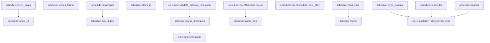

# schedule

[Package atlas](index.md) · [Source](../../src/lib.rs)

## Declarations

Visibility is the declaration spelling; trait members and reexports require their enclosing interface. `cfg` is not evaluated.

| Symbol | Kind | Visibility | Test / cfg |
|---|---|---|---|
| [schedule::FORMAT](../../src/lib.rs#L22) | const_item | `private` |  |
| [schedule::LOG_NAME](../../src/lib.rs#L23) | const_item | `private` |  |
| [schedule::LOCK_NAME](../../src/lib.rs#L24) | const_item | `private` |  |
| [schedule::LEGACY_LOG_NAME](../../src/lib.rs#L27) | const_item | `private` |  |
| [schedule::LEGACY_LOCK_NAME](../../src/lib.rs#L28) | const_item | `private` |  |
| [schedule::MAX_TEXT_BYTES](../../src/lib.rs#L29) | const_item | `private` |  |
| [schedule::TEN_YEARS_MINUTES](../../src/lib.rs#L30) | const_item | `private` |  |
| [schedule::OriginTuple](../../src/lib.rs#L34) | struct_item | `pub` |  |
| [schedule::MissedPolicy](../../src/lib.rs#L41) | enum_item | `pub` |  |
| [schedule::ScheduleDefinition](../../src/lib.rs#L47) | struct_item | `pub` |  |
| [schedule::RunStatus](../../src/lib.rs#L63) | enum_item | `pub` |  |
| [schedule::RunStatus::is_active](../../src/lib.rs#L75) | function_item | `pub` |  |
| [schedule::ClaimReason](../../src/lib.rs#L82) | enum_item | `pub` |  |
| [schedule::LaunchClaim](../../src/lib.rs#L89) | struct_item | `pub` |  |
| [schedule::ScheduleView](../../src/lib.rs#L99) | struct_item | `pub` |  |
| [schedule::MutationResult](../../src/lib.rs#L117) | enum_item | `private` |  |
| [schedule::LogOperation](../../src/lib.rs#L125) | enum_item | `private` |  |
| [schedule::LogOperation::seq](../../src/lib.rs#L185) | function_item | `private` |  |
| [schedule::OriginRecord](../../src/lib.rs#L198) | struct_item | `private` |  |
| [schedule::State](../../src/lib.rs#L204) | struct_item | `private` |  |
| [schedule::ScheduleAuthority](../../src/lib.rs#L211) | struct_item | `pub` |  |
| [schedule::ScheduleAuthority::open](../../src/lib.rs#L216) | function_item | `pub` |  |
| [schedule::ScheduleAuthority::list](../../src/lib.rs#L227) | function_item | `pub` |  |
| [schedule::ScheduleAuthority::save](../../src/lib.rs#L240) | function_item | `pub` |  |
| [schedule::ScheduleAuthority::delete](../../src/lib.rs#L295) | function_item | `pub` |  |
| [schedule::ScheduleAuthority::run_now](../../src/lib.rs#L340) | function_item | `pub` |  |
| [schedule::ScheduleAuthority::poll_due](../../src/lib.rs#L390) | function_item | `pub` |  |
| [schedule::ScheduleAuthority::recover](../../src/lib.rs#L447) | function_item | `pub` |  |
| [schedule::ScheduleAuthority::bind_launch](../../src/lib.rs#L480) | function_item | `pub` |  |
| [schedule::ScheduleAuthority::record_status](../../src/lib.rs#L526) | function_item | `pub` |  |
| [schedule::ScheduleAuthority::log_path](../../src/lib.rs#L579) | function_item | `pub` |  |
| [schedule::validate_definition](../../src/lib.rs#L584) | function_item | `private` |  |
| [schedule::validate_origin](../../src/lib.rs#L611) | function_item | `private` |  |
| [schedule::validate_workspace](../../src/lib.rs#L623) | function_item | `private` |  |
| [schedule::validate_uuid](../../src/lib.rs#L636) | function_item | `private` |  |
| [schedule::claim_from_state](../../src/lib.rs#L646) | function_item | `private` |  |
| [schedule::pending_unbound](../../src/lib.rs#L674) | function_item | `private` |  |
| [schedule::apply](../../src/lib.rs#L693) | function_item | `private` |  |
| [schedule::active_task](../../src/lib.rs#L905) | function_item | `private` |  |
| [schedule::insert_origin](../../src/lib.rs#L920) | function_item | `private` |  |
| [schedule::load_state](../../src/lib.rs#L942) | function_item | `private` |  |
| [schedule::repair_tail](../../src/lib.rs#L971) | function_item | `private` |  |
| [schedule::append](../../src/lib.rs#L983) | function_item | `private` |  |
| [schedule::sync_existing](../../src/lib.rs#L1005) | function_item | `private` |  |
| [schedule::check_format](../../src/lib.rs#L1016) | function_item | `private` |  |
| [schedule::origin_id](../../src/lib.rs#L1026) | function_item | `private` |  |
| [schedule::fingerprint](../../src/lib.rs#L1030) | function_item | `private` |  |
| [schedule::claim_id](../../src/lib.rs#L1034) | function_item | `private` |  |
| [schedule::hex_digest](../../src/lib.rs#L1055) | function_item | `private` |  |
| [schedule::timestamp](../../src/lib.rs#L1066) | function_item | `private` |  |
| [schedule::parse_timestamp](../../src/lib.rs#L1070) | function_item | `private` |  |
| [schedule::validate_optional_timestamp](../../src/lib.rs#L1080) | function_item | `private` |  |
| [schedule::CronSchedule](../../src/lib.rs#L1088) | struct_item | `pub` |  |
| [schedule::Field](../../src/lib.rs#L1097) | struct_item | `private` |  |
| [schedule::CronSchedule::parse](../../src/lib.rs#L1103) | function_item | `pub` |  |
| [schedule::CronSchedule::next_after](../../src/lib.rs#L1124) | function_item | `pub` |  |
| [schedule::parse_field](../../src/lib.rs#L1163) | function_item | `private` |  |
| [schedule::ScheduleError](../../src/lib.rs#L1230) | enum_item | `pub` |  |

## Imports / reexports

| Local name | Source path | Visibility |
|---|---|---|
| `BTreeMap` | `std::collections::BTreeMap` | `private` |
| `BTreeSet` | `std::collections::BTreeSet` | `private` |
| `_` | `std::fmt::Write` | `private` |
| `fs` | `std::fs` | `private` |
| `File` | `std::fs::File` | `private` |
| `OpenOptions` | `std::fs::OpenOptions` | `private` |
| `_` | `std::io::Write` | `private` |
| `_` | `std::os::unix::fs::OpenOptionsExt` | `private` |
| `Path` | `std::path::Path` | `private` |
| `PathBuf` | `std::path::PathBuf` | `private` |
| `DateTime` | `chrono::DateTime` | `private` |
| `Datelike` | `chrono::Datelike` | `private` |
| `Duration` | `chrono::Duration` | `private` |
| `Timelike` | `chrono::Timelike` | `private` |
| `Utc` | `chrono::Utc` | `private` |
| `Tz` | `chrono_tz::Tz` | `private` |
| `Deserialize` | `serde::Deserialize` | `private` |
| `Serialize` | `serde::Serialize` | `private` |
| `Value` | `serde_json::Value` | `private` |
| `Digest` | `sha2::Digest` | `private` |
| `Sha256` | `sha2::Sha256` | `private` |
| `FullSync` | `store::FullSync` | `private` |
| `NamedLock` | `store::NamedLock` | `private` |
| `StoreError` | `store::StoreError` | `private` |
| `Error` | `thiserror::Error` | `private` |
| `Uuid` | `uuid::Uuid` | `private` |

## Module declarations

| Module | Visibility | Attributes |
|---|---|---|

## Function call graphs

Edges below are syntactically resolved calls only, including private functions. Graphs partition callers into groups of 20; they are not execution order. All unresolved sites are listed below and in the JSON inventory.

```mermaid
flowchart TD
  n0["schedule::sync_existing"]
  n1["schedule::check_format"]
  n2["schedule::origin_id"]
  n3["schedule::claim_id"]
  n4["schedule::timestamp"]
  n5["schedule::parse_timestamp"]
  n6["schedule::validate_optional_timestamp"]
  n7["schedule::CronSchedule::parse"]
  n8["schedule::LogOperation::seq"]
  n9["schedule::ScheduleAuthority::open"]
  n10["schedule::ScheduleAuthority::list"]
  n11["schedule::ScheduleAuthority::save"]
  n12["schedule::ScheduleAuthority::delete"]
  n13["schedule::ScheduleAuthority::run_now"]
  n14["schedule::ScheduleAuthority::poll_due"]
  n15["schedule::ScheduleAuthority::recover"]
  n16["schedule::ScheduleAuthority::bind_launch"]
  n17["schedule::ScheduleAuthority::record_status"]
  n18["schedule::ScheduleAuthority::log_path"]
  n19["schedule::validate_definition"]
  n20["schedule::validate_origin"]
  n21["schedule::validate_workspace"]
  n22["schedule::validate_uuid"]
  n23["schedule::claim_from_state"]
  n24["schedule::pending_unbound"]
  n25["schedule::apply"]
  n26["schedule::RunStatus::is_active"]
  n27["schedule::active_task"]
  n28["schedule::insert_origin"]
  n29["schedule::load_state"]
  n30["schedule::repair_tail"]
  n31["schedule::append"]
  n32["store::management_root::retire_legacy_name"]
  n33["store::platform::NamedLock::exclusive"]
  n34["store::platform::NamedLock::shared"]
  n9 --> n32
  n10 --> n21
  n10 --> n29
  n10 --> n34
  n11 --> n0
  n11 --> n2
  n11 --> n4
  n11 --> n7
  n11 --> n19
  n11 --> n20
  n11 --> n25
  n11 --> n29
  n11 --> n30
  n11 --> n31
  n11 --> n33
  n12 --> n0
  n12 --> n2
  n12 --> n4
  n12 --> n20
  n12 --> n22
  n12 --> n25
  n12 --> n29
  n12 --> n30
  n12 --> n31
  n12 --> n33
  n13 --> n0
  n13 --> n2
  n13 --> n4
  n13 --> n20
  n13 --> n22
  n13 --> n23
  n13 --> n25
  n13 --> n29
  n13 --> n30
  n13 --> n31
  n13 --> n33
  n14 --> n0
  n14 --> n3
  n14 --> n4
  n14 --> n5
  n14 --> n7
  n14 --> n23
  n14 --> n24
  n14 --> n25
  n14 --> n29
  n14 --> n30
  n14 --> n31
  n14 --> n33
  n15 --> n0
  n15 --> n4
  n15 --> n5
  n15 --> n7
  n15 --> n24
  n15 --> n25
  n15 --> n29
  n15 --> n30
  n15 --> n31
  n15 --> n33
  n16 --> n0
  n16 --> n4
  n16 --> n22
  n16 --> n25
  n16 --> n29
  n16 --> n30
  n16 --> n31
  n16 --> n33
  n17 --> n0
  n17 --> n4
  n17 --> n25
  n17 --> n29
  n17 --> n30
  n17 --> n31
  n17 --> n33
  n19 --> n7
  n19 --> n21
  n19 --> n22
  n24 --> n23
  n25 --> n1
  n25 --> n5
  n25 --> n6
  n25 --> n19
  n25 --> n20
  n25 --> n22
  n25 --> n27
  n25 --> n28
```

Functions 1–20: 85 direct edges

Functions 21–36: 9 direct edges

## Call sites

Includes test functions (marked in declarations). Receiver-type-required sites need type analysis/manual tracing. Calls in closures are attributed to their enclosing function; their occurrence here does not mean the closure executes immediately.

| Caller | Callee expression | Source lines | Target / classification |
|---|---|---|---|
| `open` | `root.as_ref().to_path_buf` | [217](../../src/lib.rs#L217) | receiver-type-required |
| `open` | `root.as_ref` | [217](../../src/lib.rs#L217) | receiver-type-required |
| `open` | `fs::create_dir_all` | [218](../../src/lib.rs#L218) | external-constructor-callback-or-unresolved |
| `open` | `store::retire_legacy_name` | [219](../../src/lib.rs#L219) | [store::management_root::retire_legacy_name](../../../store/src/management_root.rs#L21) |
| `open` | `root.join` | [220](../../src/lib.rs#L220) | receiver-type-required |
| `open` | `legacy_lock.exists` | [221](../../src/lib.rs#L221) | receiver-type-required |
| `open` | `fs::remove_file` | [222](../../src/lib.rs#L222) | external-constructor-callback-or-unresolved |
| `open` | `Ok` | [224](../../src/lib.rs#L224) | external-constructor-callback-or-unresolved |
| `list` | `validate_workspace` | [229](../../src/lib.rs#L229) | [schedule::validate_workspace](../../src/lib.rs#L623) |
| `list` | `NamedLock::shared` | [231](../../src/lib.rs#L231) | [store::platform::NamedLock::shared](../../../store/src/platform.rs#L99) |
| `list` | `self.root.join` | [231](../../src/lib.rs#L231), [232](../../src/lib.rs#L232) | receiver-type-required |
| `list` | `load_state` | [232](../../src/lib.rs#L232) | [schedule::load_state](../../src/lib.rs#L942) |
| `list` | `Ok` | [233](../../src/lib.rs#L233) | external-constructor-callback-or-unresolved |
| `list` | `state             .tasks             .into_values()             .filter(&#124;task&#124; workspace_id.is_none_or(&#124;id&#124; task.definition.workspace_id == id))             .collect` | [233](../../src/lib.rs#L233) | receiver-type-required |
| `list` | `state             .tasks             .into_values()             .filter` | [233](../../src/lib.rs#L233) | receiver-type-required |
| `list` | `state             .tasks             .into_values` | [233](../../src/lib.rs#L233) | receiver-type-required |
| `list` | `workspace_id.is_none_or` | [236](../../src/lib.rs#L236) | receiver-type-required |
| `save` | `validate_origin` | [246](../../src/lib.rs#L246) | [schedule::validate_origin](../../src/lib.rs#L611) |
| `save` | `validate_definition` | [247](../../src/lib.rs#L247) | [schedule::validate_definition](../../src/lib.rs#L584) |
| `save` | `fingerprint` | [248](../../src/lib.rs#L248) | external-constructor-callback-or-unresolved |
| `save` | `NamedLock::exclusive` | [249](../../src/lib.rs#L249) | [store::platform::NamedLock::exclusive](../../../store/src/platform.rs#L103) |
| `save` | `self.root.join` | [249](../../src/lib.rs#L249), [250](../../src/lib.rs#L250) | receiver-type-required |
| `save` | `load_state` | [251](../../src/lib.rs#L251) | [schedule::load_state](../../src/lib.rs#L942) |
| `save` | `repair_tail` | [252](../../src/lib.rs#L252) | [schedule::repair_tail](../../src/lib.rs#L971) |
| `save` | `sync_existing` | [253](../../src/lib.rs#L253) | [schedule::sync_existing](../../src/lib.rs#L1005) |
| `save` | `state.origins.get` | [254](../../src/lib.rs#L254) | receiver-type-required |
| `save` | `origin_id` | [254](../../src/lib.rs#L254) | [schedule::origin_id](../../src/lib.rs#L1026) |
| `save` | `Err` | [256](../../src/lib.rs#L256), [259](../../src/lib.rs#L259), [268](../../src/lib.rs#L268) | external-constructor-callback-or-unresolved |
| `save` | `Ok` | [261](../../src/lib.rs#L261) | external-constructor-callback-or-unresolved |
| `save` | `task.clone` | [261](../../src/lib.rs#L261) | receiver-type-required |
| `save` | `state             .tasks             .get(&definition.id)             .is_some_and` | [263](../../src/lib.rs#L263) | receiver-type-required |
| `save` | `state             .tasks             .get` | [263](../../src/lib.rs#L263) | receiver-type-required |
| `save` | `task.last_status.is_active` | [266](../../src/lib.rs#L266) | receiver-type-required |
| `save` | `ScheduleError::Active` | [268](../../src/lib.rs#L268) | external-constructor-callback-or-unresolved |
| `save` | `Some` | [271](../../src/lib.rs#L271) | external-constructor-callback-or-unresolved |
| `save` | `CronSchedule::parse(&definition.cron)?.next_after` | [271](../../src/lib.rs#L271) | receiver-type-required |
| `save` | `CronSchedule::parse` | [271](../../src/lib.rs#L271) | [schedule::CronSchedule::parse](../../src/lib.rs#L1103) |
| `save` | `timestamp` | [278](../../src/lib.rs#L278) | [schedule::timestamp](../../src/lib.rs#L1066) |
| `save` | `next_run_at.map` | [282](../../src/lib.rs#L282) | receiver-type-required |
| `save` | `append` | [284](../../src/lib.rs#L284) | [schedule::append](../../src/lib.rs#L983) |
| `save` | `apply` | [285](../../src/lib.rs#L285) | [schedule::apply](../../src/lib.rs#L693) |
| `save` | `state.tasks.get(id).cloned().ok_or` | [290](../../src/lib.rs#L290) | receiver-type-required |
| `save` | `state.tasks.get(id).cloned` | [290](../../src/lib.rs#L290) | receiver-type-required |
| `save` | `state.tasks.get` | [290](../../src/lib.rs#L290) | receiver-type-required |
| `save` | `ScheduleError::Corrupt` | [290](../../src/lib.rs#L290) | external-constructor-callback-or-unresolved |
| `save` | `"saved task missing after replay".to_owned` | [291](../../src/lib.rs#L291) | receiver-type-required |
| `delete` | `validate_origin` | [301](../../src/lib.rs#L301) | [schedule::validate_origin](../../src/lib.rs#L611) |
| `delete` | `validate_uuid` | [302](../../src/lib.rs#L302) | [schedule::validate_uuid](../../src/lib.rs#L636) |
| `delete` | `fingerprint` | [303](../../src/lib.rs#L303) | external-constructor-callback-or-unresolved |
| `delete` | `NamedLock::exclusive` | [304](../../src/lib.rs#L304) | [store::platform::NamedLock::exclusive](../../../store/src/platform.rs#L103) |
| `delete` | `self.root.join` | [304](../../src/lib.rs#L304), [305](../../src/lib.rs#L305) | receiver-type-required |
| `delete` | `load_state` | [306](../../src/lib.rs#L306) | [schedule::load_state](../../src/lib.rs#L942) |
| `delete` | `repair_tail` | [307](../../src/lib.rs#L307) | [schedule::repair_tail](../../src/lib.rs#L971) |
| `delete` | `sync_existing` | [308](../../src/lib.rs#L308) | [schedule::sync_existing](../../src/lib.rs#L1005) |
| `delete` | `state.origins.get` | [309](../../src/lib.rs#L309) | receiver-type-required |
| `delete` | `origin_id` | [309](../../src/lib.rs#L309) | [schedule::origin_id](../../src/lib.rs#L1026) |
| `delete` | `Err` | [311](../../src/lib.rs#L311), [314](../../src/lib.rs#L314), [323](../../src/lib.rs#L323) | external-constructor-callback-or-unresolved |
| `delete` | `Ok` | [316](../../src/lib.rs#L316), [337](../../src/lib.rs#L337) | external-constructor-callback-or-unresolved |
| `delete` | `state             .tasks             .get(task_id)             .is_some_and` | [318](../../src/lib.rs#L318) | receiver-type-required |
| `delete` | `state             .tasks             .get` | [318](../../src/lib.rs#L318) | receiver-type-required |
| `delete` | `task.last_status.is_active` | [321](../../src/lib.rs#L321) | receiver-type-required |
| `delete` | `ScheduleError::Active` | [323](../../src/lib.rs#L323) | external-constructor-callback-or-unresolved |
| `delete` | `task_id.to_owned` | [323](../../src/lib.rs#L323), [332](../../src/lib.rs#L332) | receiver-type-required |
| `delete` | `state.tasks.contains_key` | [325](../../src/lib.rs#L325) | receiver-type-required |
| `delete` | `timestamp` | [329](../../src/lib.rs#L329) | [schedule::timestamp](../../src/lib.rs#L1066) |
| `delete` | `append` | [335](../../src/lib.rs#L335) | [schedule::append](../../src/lib.rs#L983) |
| `delete` | `apply` | [336](../../src/lib.rs#L336) | [schedule::apply](../../src/lib.rs#L693) |
| `run_now` | `validate_origin` | [346](../../src/lib.rs#L346) | [schedule::validate_origin](../../src/lib.rs#L611) |
| `run_now` | `validate_uuid` | [347](../../src/lib.rs#L347) | [schedule::validate_uuid](../../src/lib.rs#L636) |
| `run_now` | `fingerprint` | [348](../../src/lib.rs#L348) | external-constructor-callback-or-unresolved |
| `run_now` | `NamedLock::exclusive` | [349](../../src/lib.rs#L349) | [store::platform::NamedLock::exclusive](../../../store/src/platform.rs#L103) |
| `run_now` | `self.root.join` | [349](../../src/lib.rs#L349), [350](../../src/lib.rs#L350) | receiver-type-required |
| `run_now` | `load_state` | [351](../../src/lib.rs#L351) | [schedule::load_state](../../src/lib.rs#L942) |
| `run_now` | `repair_tail` | [352](../../src/lib.rs#L352) | [schedule::repair_tail](../../src/lib.rs#L971) |
| `run_now` | `sync_existing` | [353](../../src/lib.rs#L353) | [schedule::sync_existing](../../src/lib.rs#L1005) |
| `run_now` | `state.origins.get` | [354](../../src/lib.rs#L354) | receiver-type-required |
| `run_now` | `origin_id` | [354](../../src/lib.rs#L354) | [schedule::origin_id](../../src/lib.rs#L1026) |
| `run_now` | `Err` | [356](../../src/lib.rs#L356), [359](../../src/lib.rs#L359), [368](../../src/lib.rs#L368) | external-constructor-callback-or-unresolved |
| `run_now` | `Ok` | [361](../../src/lib.rs#L361) | external-constructor-callback-or-unresolved |
| `run_now` | `claim.clone` | [361](../../src/lib.rs#L361) | receiver-type-required |
| `run_now` | `state             .tasks             .get(task_id)             .ok_or_else` | [363](../../src/lib.rs#L363) | receiver-type-required |
| `run_now` | `state             .tasks             .get` | [363](../../src/lib.rs#L363) | receiver-type-required |
| `run_now` | `ScheduleError::NotFound` | [366](../../src/lib.rs#L366) | external-constructor-callback-or-unresolved |
| `run_now` | `task_id.to_owned` | [366](../../src/lib.rs#L366), [368](../../src/lib.rs#L368), [377](../../src/lib.rs#L377) | receiver-type-required |
| `run_now` | `task.last_status.is_active` | [367](../../src/lib.rs#L367) | receiver-type-required |
| `run_now` | `ScheduleError::Active` | [368](../../src/lib.rs#L368) | external-constructor-callback-or-unresolved |
| `run_now` | `claim_id` | [370](../../src/lib.rs#L370) | external-constructor-callback-or-unresolved |
| `run_now` | `timestamp` | [370](../../src/lib.rs#L370), [374](../../src/lib.rs#L374), [379](../../src/lib.rs#L379) | [schedule::timestamp](../../src/lib.rs#L1066) |
| `run_now` | `Some` | [370](../../src/lib.rs#L370), [375](../../src/lib.rs#L375), [376](../../src/lib.rs#L376) | external-constructor-callback-or-unresolved |
| `run_now` | `claim_id.clone` | [378](../../src/lib.rs#L378) | receiver-type-required |
| `run_now` | `task.next_run_at.clone` | [380](../../src/lib.rs#L380) | receiver-type-required |
| `run_now` | `append` | [383](../../src/lib.rs#L383) | [schedule::append](../../src/lib.rs#L983) |
| `run_now` | `apply` | [384](../../src/lib.rs#L384) | [schedule::apply](../../src/lib.rs#L693) |
| `run_now` | `claim_from_state` | [385](../../src/lib.rs#L385) | [schedule::claim_from_state](../../src/lib.rs#L646) |
| `poll_due` | `NamedLock::exclusive` | [391](../../src/lib.rs#L391) | [store::platform::NamedLock::exclusive](../../../store/src/platform.rs#L103) |
| `poll_due` | `self.root.join` | [391](../../src/lib.rs#L391), [392](../../src/lib.rs#L392) | receiver-type-required |
| `poll_due` | `load_state` | [393](../../src/lib.rs#L393) | [schedule::load_state](../../src/lib.rs#L942) |
| `poll_due` | `repair_tail` | [394](../../src/lib.rs#L394) | [schedule::repair_tail](../../src/lib.rs#L971) |
| `poll_due` | `sync_existing` | [395](../../src/lib.rs#L395) | [schedule::sync_existing](../../src/lib.rs#L1005) |
| `poll_due` | `pending_unbound` | [396](../../src/lib.rs#L396) | [schedule::pending_unbound](../../src/lib.rs#L674) |
| `poll_due` | `state.tasks.keys().cloned().collect::<Vec<_>>` | [397](../../src/lib.rs#L397) | receiver-type-required |
| `poll_due` | `state.tasks.keys().cloned` | [397](../../src/lib.rs#L397) | receiver-type-required |
| `poll_due` | `state.tasks.keys` | [397](../../src/lib.rs#L397) | receiver-type-required |
| `poll_due` | `state.tasks.get(&task_id).cloned().expect` | [399](../../src/lib.rs#L399) | receiver-type-required |
| `poll_due` | `state.tasks.get(&task_id).cloned` | [399](../../src/lib.rs#L399) | receiver-type-required |
| `poll_due` | `state.tasks.get` | [399](../../src/lib.rs#L399) | receiver-type-required |
| `poll_due` | `parse_timestamp` | [403](../../src/lib.rs#L403) | [schedule::parse_timestamp](../../src/lib.rs#L1070) |
| `poll_due` | `CronSchedule::parse(&task.definition.cron)?                 .next_after` | [407](../../src/lib.rs#L407) | receiver-type-required |
| `poll_due` | `CronSchedule::parse` | [407](../../src/lib.rs#L407) | [schedule::CronSchedule::parse](../../src/lib.rs#L1103) |
| `poll_due` | `task.last_status.is_active` | [409](../../src/lib.rs#L409) | receiver-type-required |
| `poll_due` | `timestamp` | [413](../../src/lib.rs#L413), [415](../../src/lib.rs#L415), [416](../../src/lib.rs#L416), [422](../../src/lib.rs#L422), [427](../../src/lib.rs#L427), [433](../../src/lib.rs#L433) | [schedule::timestamp](../../src/lib.rs#L1066) |
| `poll_due` | `task_id.clone` | [414](../../src/lib.rs#L414), [430](../../src/lib.rs#L430) | receiver-type-required |
| `poll_due` | `append` | [418](../../src/lib.rs#L418), [436](../../src/lib.rs#L436) | [schedule::append](../../src/lib.rs#L983) |
| `poll_due` | `apply` | [419](../../src/lib.rs#L419), [437](../../src/lib.rs#L437) | [schedule::apply](../../src/lib.rs#L693) |
| `poll_due` | `claim_id` | [423](../../src/lib.rs#L423) | [schedule::claim_id](../../src/lib.rs#L1034) |
| `poll_due` | `id.clone` | [431](../../src/lib.rs#L431) | receiver-type-required |
| `poll_due` | `Some` | [433](../../src/lib.rs#L433) | external-constructor-callback-or-unresolved |
| `poll_due` | `claims.push` | [438](../../src/lib.rs#L438) | receiver-type-required |
| `poll_due` | `claim_from_state` | [438](../../src/lib.rs#L438) | [schedule::claim_from_state](../../src/lib.rs#L646) |
| `poll_due` | `claims.sort_by` | [440](../../src/lib.rs#L440) | receiver-type-required |
| `poll_due` | `left.claim_id.as_bytes().cmp` | [440](../../src/lib.rs#L440) | receiver-type-required |
| `poll_due` | `left.claim_id.as_bytes` | [440](../../src/lib.rs#L440) | receiver-type-required |
| `poll_due` | `right.claim_id.as_bytes` | [440](../../src/lib.rs#L440) | receiver-type-required |
| `poll_due` | `claims.dedup_by` | [441](../../src/lib.rs#L441) | receiver-type-required |
| `poll_due` | `Ok` | [442](../../src/lib.rs#L442) | external-constructor-callback-or-unresolved |
| `recover` | `NamedLock::exclusive` | [448](../../src/lib.rs#L448) | [store::platform::NamedLock::exclusive](../../../store/src/platform.rs#L103) |
| `recover` | `self.root.join` | [448](../../src/lib.rs#L448), [449](../../src/lib.rs#L449) | receiver-type-required |
| `recover` | `load_state` | [450](../../src/lib.rs#L450) | [schedule::load_state](../../src/lib.rs#L942) |
| `recover` | `repair_tail` | [451](../../src/lib.rs#L451) | [schedule::repair_tail](../../src/lib.rs#L971) |
| `recover` | `sync_existing` | [452](../../src/lib.rs#L452) | [schedule::sync_existing](../../src/lib.rs#L1005) |
| `recover` | `pending_unbound` | [453](../../src/lib.rs#L453) | [schedule::pending_unbound](../../src/lib.rs#L674) |
| `recover` | `state.tasks.keys().cloned().collect::<Vec<_>>` | [454](../../src/lib.rs#L454) | receiver-type-required |
| `recover` | `state.tasks.keys().cloned` | [454](../../src/lib.rs#L454) | receiver-type-required |
| `recover` | `state.tasks.keys` | [454](../../src/lib.rs#L454) | receiver-type-required |
| `recover` | `state.tasks.get(&task_id).cloned().expect` | [456](../../src/lib.rs#L456) | receiver-type-required |
| `recover` | `state.tasks.get(&task_id).cloned` | [456](../../src/lib.rs#L456) | receiver-type-required |
| `recover` | `state.tasks.get` | [456](../../src/lib.rs#L456) | receiver-type-required |
| `recover` | `parse_timestamp` | [460](../../src/lib.rs#L460) | [schedule::parse_timestamp](../../src/lib.rs#L1070) |
| `recover` | `task.last_status.is_active` | [461](../../src/lib.rs#L461) | receiver-type-required |
| `recover` | `CronSchedule::parse(&task.definition.cron)?                 .next_after` | [464](../../src/lib.rs#L464) | receiver-type-required |
| `recover` | `CronSchedule::parse` | [464](../../src/lib.rs#L464) | [schedule::CronSchedule::parse](../../src/lib.rs#L1103) |
| `recover` | `timestamp` | [469](../../src/lib.rs#L469), [471](../../src/lib.rs#L471), [472](../../src/lib.rs#L472) | [schedule::timestamp](../../src/lib.rs#L1066) |
| `recover` | `task_id.clone` | [470](../../src/lib.rs#L470) | receiver-type-required |
| `recover` | `append` | [474](../../src/lib.rs#L474) | [schedule::append](../../src/lib.rs#L983) |
| `recover` | `apply` | [475](../../src/lib.rs#L475) | [schedule::apply](../../src/lib.rs#L693) |
| `recover` | `Ok` | [477](../../src/lib.rs#L477) | external-constructor-callback-or-unresolved |
| `bind_launch` | `validate_uuid` | [488](../../src/lib.rs#L488) | [schedule::validate_uuid](../../src/lib.rs#L636) |
| `bind_launch` | `Err` | [490](../../src/lib.rs#L490), [502](../../src/lib.rs#L502), [510](../../src/lib.rs#L510) | external-constructor-callback-or-unresolved |
| `bind_launch` | `ScheduleError::Invalid` | [490](../../src/lib.rs#L490) | external-constructor-callback-or-unresolved |
| `bind_launch` | `NamedLock::exclusive` | [492](../../src/lib.rs#L492) | [store::platform::NamedLock::exclusive](../../../store/src/platform.rs#L103) |
| `bind_launch` | `self.root.join` | [492](../../src/lib.rs#L492), [493](../../src/lib.rs#L493) | receiver-type-required |
| `bind_launch` | `load_state` | [494](../../src/lib.rs#L494) | [schedule::load_state](../../src/lib.rs#L942) |
| `bind_launch` | `repair_tail` | [495](../../src/lib.rs#L495) | [schedule::repair_tail](../../src/lib.rs#L971) |
| `bind_launch` | `sync_existing` | [496](../../src/lib.rs#L496) | [schedule::sync_existing](../../src/lib.rs#L1005) |
| `bind_launch` | `state             .tasks             .get(task_id)             .ok_or_else` | [497](../../src/lib.rs#L497) | receiver-type-required |
| `bind_launch` | `state             .tasks             .get` | [497](../../src/lib.rs#L497) | receiver-type-required |
| `bind_launch` | `ScheduleError::NotFound` | [500](../../src/lib.rs#L500) | external-constructor-callback-or-unresolved |
| `bind_launch` | `task_id.to_owned` | [500](../../src/lib.rs#L500), [516](../../src/lib.rs#L516) | receiver-type-required |
| `bind_launch` | `task.active_claim_id.as_deref` | [501](../../src/lib.rs#L501) | receiver-type-required |
| `bind_launch` | `Some` | [501](../../src/lib.rs#L501) | external-constructor-callback-or-unresolved |
| `bind_launch` | `Ok` | [508](../../src/lib.rs#L508), [523](../../src/lib.rs#L523) | external-constructor-callback-or-unresolved |
| `bind_launch` | `task.clone` | [508](../../src/lib.rs#L508) | receiver-type-required |
| `bind_launch` | `timestamp` | [515](../../src/lib.rs#L515) | [schedule::timestamp](../../src/lib.rs#L1066) |
| `bind_launch` | `claim_id.to_owned` | [517](../../src/lib.rs#L517) | receiver-type-required |
| `bind_launch` | `session_id.to_owned` | [518](../../src/lib.rs#L518) | receiver-type-required |
| `bind_launch` | `append` | [521](../../src/lib.rs#L521) | [schedule::append](../../src/lib.rs#L983) |
| `bind_launch` | `apply` | [522](../../src/lib.rs#L522) | [schedule::apply](../../src/lib.rs#L693) |
| `bind_launch` | `state.tasks.get(task_id).expect("bound task").clone` | [523](../../src/lib.rs#L523) | receiver-type-required |
| `bind_launch` | `state.tasks.get(task_id).expect` | [523](../../src/lib.rs#L523) | receiver-type-required |
| `bind_launch` | `state.tasks.get` | [523](../../src/lib.rs#L523) | receiver-type-required |
| `record_status` | `Err` | [535](../../src/lib.rs#L535), [541](../../src/lib.rs#L541), [553](../../src/lib.rs#L553), [559](../../src/lib.rs#L559), [562](../../src/lib.rs#L562) | external-constructor-callback-or-unresolved |
| `record_status` | `ScheduleError::Invalid` | [535](../../src/lib.rs#L535), [541](../../src/lib.rs#L541) | external-constructor-callback-or-unresolved |
| `record_status` | `error             .as_ref()             .is_some_and` | [537](../../src/lib.rs#L537) | receiver-type-required |
| `record_status` | `error             .as_ref` | [537](../../src/lib.rs#L537) | receiver-type-required |
| `record_status` | `value.len` | [539](../../src/lib.rs#L539) | receiver-type-required |
| `record_status` | `NamedLock::exclusive` | [543](../../src/lib.rs#L543) | [store::platform::NamedLock::exclusive](../../../store/src/platform.rs#L103) |
| `record_status` | `self.root.join` | [543](../../src/lib.rs#L543), [544](../../src/lib.rs#L544) | receiver-type-required |
| `record_status` | `load_state` | [545](../../src/lib.rs#L545) | [schedule::load_state](../../src/lib.rs#L942) |
| `record_status` | `repair_tail` | [546](../../src/lib.rs#L546) | [schedule::repair_tail](../../src/lib.rs#L971) |
| `record_status` | `sync_existing` | [547](../../src/lib.rs#L547) | [schedule::sync_existing](../../src/lib.rs#L1005) |
| `record_status` | `state             .tasks             .get(task_id)             .ok_or_else` | [548](../../src/lib.rs#L548) | receiver-type-required |
| `record_status` | `state             .tasks             .get` | [548](../../src/lib.rs#L548) | receiver-type-required |
| `record_status` | `ScheduleError::NotFound` | [551](../../src/lib.rs#L551) | external-constructor-callback-or-unresolved |
| `record_status` | `task_id.to_owned` | [551](../../src/lib.rs#L551), [568](../../src/lib.rs#L568) | receiver-type-required |
| `record_status` | `task.active_claim_id.as_deref` | [552](../../src/lib.rs#L552) | receiver-type-required |
| `record_status` | `Some` | [552](../../src/lib.rs#L552) | external-constructor-callback-or-unresolved |
| `record_status` | `Ok` | [556](../../src/lib.rs#L556), [575](../../src/lib.rs#L575) | external-constructor-callback-or-unresolved |
| `record_status` | `task.clone` | [556](../../src/lib.rs#L556) | receiver-type-required |
| `record_status` | `task.last_status.is_active` | [561](../../src/lib.rs#L561) | receiver-type-required |
| `record_status` | `timestamp` | [567](../../src/lib.rs#L567) | [schedule::timestamp](../../src/lib.rs#L1066) |
| `record_status` | `claim_id.to_owned` | [569](../../src/lib.rs#L569) | receiver-type-required |
| `record_status` | `append` | [573](../../src/lib.rs#L573) | [schedule::append](../../src/lib.rs#L983) |
| `record_status` | `apply` | [574](../../src/lib.rs#L574) | [schedule::apply](../../src/lib.rs#L693) |
| `record_status` | `state.tasks.get(task_id).expect("status task").clone` | [575](../../src/lib.rs#L575) | receiver-type-required |
| `record_status` | `state.tasks.get(task_id).expect` | [575](../../src/lib.rs#L575) | receiver-type-required |
| `record_status` | `state.tasks.get` | [575](../../src/lib.rs#L575) | receiver-type-required |
| `log_path` | `self.root.join` | [580](../../src/lib.rs#L580) | receiver-type-required |
| `validate_definition` | `validate_uuid` | [585](../../src/lib.rs#L585) | [schedule::validate_uuid](../../src/lib.rs#L636) |
| `validate_definition` | `validate_workspace` | [586](../../src/lib.rs#L586) | [schedule::validate_workspace](../../src/lib.rs#L623) |
| `validate_definition` | `value.trim().is_empty` | [592](../../src/lib.rs#L592) | receiver-type-required |
| `validate_definition` | `value.trim` | [592](../../src/lib.rs#L592) | receiver-type-required |
| `validate_definition` | `value.len` | [592](../../src/lib.rs#L592), [599](../../src/lib.rs#L599) | receiver-type-required |
| `validate_definition` | `Err` | [593](../../src/lib.rs#L593), [601](../../src/lib.rs#L601) | external-constructor-callback-or-unresolved |
| `validate_definition` | `ScheduleError::Invalid` | [593](../../src/lib.rs#L593), [601](../../src/lib.rs#L601) | external-constructor-callback-or-unresolved |
| `validate_definition` | `definition         .model_id         .as_ref()         .is_some_and` | [596](../../src/lib.rs#L596) | receiver-type-required |
| `validate_definition` | `definition         .model_id         .as_ref` | [596](../../src/lib.rs#L596) | receiver-type-required |
| `validate_definition` | `value.is_empty` | [599](../../src/lib.rs#L599) | receiver-type-required |
| `validate_definition` | `definition         .time_zone         .parse()         .map_err` | [603](../../src/lib.rs#L603) | receiver-type-required |
| `validate_definition` | `definition         .time_zone         .parse` | [603](../../src/lib.rs#L603) | receiver-type-required |
| `validate_definition` | `ScheduleError::InvalidTimeZone` | [606](../../src/lib.rs#L606) | external-constructor-callback-or-unresolved |
| `validate_definition` | `definition.time_zone.clone` | [606](../../src/lib.rs#L606) | receiver-type-required |
| `validate_definition` | `CronSchedule::parse` | [607](../../src/lib.rs#L607) | [schedule::CronSchedule::parse](../../src/lib.rs#L1103) |
| `validate_definition` | `Ok` | [608](../../src/lib.rs#L608) | external-constructor-callback-or-unresolved |
| `validate_origin` | `value.is_empty` | [616](../../src/lib.rs#L616) | receiver-type-required |
| `validate_origin` | `value.len` | [616](../../src/lib.rs#L616) | receiver-type-required |
| `validate_origin` | `value.chars().any` | [616](../../src/lib.rs#L616) | receiver-type-required |
| `validate_origin` | `value.chars` | [616](../../src/lib.rs#L616) | receiver-type-required |
| `validate_origin` | `Err` | [617](../../src/lib.rs#L617) | external-constructor-callback-or-unresolved |
| `validate_origin` | `ScheduleError::Invalid` | [617](../../src/lib.rs#L617) | external-constructor-callback-or-unresolved |
| `validate_origin` | `Ok` | [620](../../src/lib.rs#L620) | external-constructor-callback-or-unresolved |
| `validate_workspace` | `value.is_empty` | [624](../../src/lib.rs#L624) | receiver-type-required |
| `validate_workspace` | `value.len` | [625](../../src/lib.rs#L625) | receiver-type-required |
| `validate_workspace` | `value.starts_with` | [626](../../src/lib.rs#L626) | receiver-type-required |
| `validate_workspace` | `value             .bytes()             .all` | [627](../../src/lib.rs#L627) | receiver-type-required |
| `validate_workspace` | `value             .bytes` | [627](../../src/lib.rs#L627) | receiver-type-required |
| `validate_workspace` | `byte.is_ascii_alphanumeric` | [629](../../src/lib.rs#L629) | receiver-type-required |
| `validate_workspace` | `Err` | [631](../../src/lib.rs#L631) | external-constructor-callback-or-unresolved |
| `validate_workspace` | `ScheduleError::Invalid` | [631](../../src/lib.rs#L631) | external-constructor-callback-or-unresolved |
| `validate_workspace` | `Ok` | [633](../../src/lib.rs#L633) | external-constructor-callback-or-unresolved |
| `validate_uuid` | `Uuid::parse_str(value).map_err` | [637](../../src/lib.rs#L637) | receiver-type-required |
| `validate_uuid` | `Uuid::parse_str` | [637](../../src/lib.rs#L637) | external-constructor-callback-or-unresolved |
| `validate_uuid` | `ScheduleError::Invalid` | [637](../../src/lib.rs#L637), [641](../../src/lib.rs#L641) | external-constructor-callback-or-unresolved |
| `validate_uuid` | `parsed.hyphenated().to_string` | [638](../../src/lib.rs#L638) | receiver-type-required |
| `validate_uuid` | `parsed.hyphenated` | [638](../../src/lib.rs#L638) | receiver-type-required |
| `validate_uuid` | `value.bytes().any` | [639](../../src/lib.rs#L639) | receiver-type-required |
| `validate_uuid` | `value.bytes` | [639](../../src/lib.rs#L639) | receiver-type-required |
| `validate_uuid` | `byte.is_ascii_uppercase` | [639](../../src/lib.rs#L639) | receiver-type-required |
| `validate_uuid` | `Err` | [641](../../src/lib.rs#L641) | external-constructor-callback-or-unresolved |
| `validate_uuid` | `Ok` | [643](../../src/lib.rs#L643) | external-constructor-callback-or-unresolved |
| `claim_from_state` | `state         .tasks         .get(task_id)         .ok_or_else` | [651](../../src/lib.rs#L651) | receiver-type-required |
| `claim_from_state` | `state         .tasks         .get` | [651](../../src/lib.rs#L651) | receiver-type-required |
| `claim_from_state` | `ScheduleError::NotFound` | [654](../../src/lib.rs#L654) | external-constructor-callback-or-unresolved |
| `claim_from_state` | `task_id.to_owned` | [654](../../src/lib.rs#L654), [662](../../src/lib.rs#L662) | receiver-type-required |
| `claim_from_state` | `task.active_claim_id.as_deref` | [655](../../src/lib.rs#L655) | receiver-type-required |
| `claim_from_state` | `Some` | [655](../../src/lib.rs#L655) | external-constructor-callback-or-unresolved |
| `claim_from_state` | `Err` | [656](../../src/lib.rs#L656) | external-constructor-callback-or-unresolved |
| `claim_from_state` | `task.last_scheduled_at.clone().ok_or_else` | [658](../../src/lib.rs#L658) | receiver-type-required |
| `claim_from_state` | `task.last_scheduled_at.clone` | [658](../../src/lib.rs#L658) | receiver-type-required |
| `claim_from_state` | `ScheduleError::Corrupt` | [659](../../src/lib.rs#L659) | external-constructor-callback-or-unresolved |
| `claim_from_state` | `"active claim has no scheduled timestamp".to_owned` | [659](../../src/lib.rs#L659) | receiver-type-required |
| `claim_from_state` | `Ok` | [661](../../src/lib.rs#L661) | external-constructor-callback-or-unresolved |
| `claim_from_state` | `claim_id.to_owned` | [663](../../src/lib.rs#L663) | receiver-type-required |
| `claim_from_state` | `claim_id.starts_with` | [665](../../src/lib.rs#L665) | receiver-type-required |
| `claim_from_state` | `task.definition.clone` | [670](../../src/lib.rs#L670) | receiver-type-required |
| `pending_unbound` | `state         .tasks         .values()         .filter(&#124;task&#124; {             task.last_status == RunStatus::Claimed                 && task.active_claim_id.is_some()                 && task.last_session_id.is_none()         })         .map(&#124;task&#124; {             claim_from_state(                 state,                 &task.definition.id,                 task.active_claim_id.as_deref().expect("filtered claim"),             )         })         .collect` | [675](../../src/lib.rs#L675) | receiver-type-required |
| `pending_unbound` | `state         .tasks         .values()         .filter(&#124;task&#124; {             task.last_status == RunStatus::Claimed                 && task.active_claim_id.is_some()                 && task.last_session_id.is_none()         })         .map` | [675](../../src/lib.rs#L675) | receiver-type-required |
| `pending_unbound` | `state         .tasks         .values()         .filter` | [675](../../src/lib.rs#L675) | receiver-type-required |
| `pending_unbound` | `state         .tasks         .values` | [675](../../src/lib.rs#L675) | receiver-type-required |
| `pending_unbound` | `task.active_claim_id.is_some` | [680](../../src/lib.rs#L680) | receiver-type-required |
| `pending_unbound` | `task.last_session_id.is_none` | [681](../../src/lib.rs#L681) | receiver-type-required |
| `pending_unbound` | `claim_from_state` | [684](../../src/lib.rs#L684) | [schedule::claim_from_state](../../src/lib.rs#L646) |
| `pending_unbound` | `task.active_claim_id.as_deref().expect` | [687](../../src/lib.rs#L687) | receiver-type-required |
| `pending_unbound` | `task.active_claim_id.as_deref` | [687](../../src/lib.rs#L687) | receiver-type-required |
| `apply` | `operation.seq` | [694](../../src/lib.rs#L694), [901](../../src/lib.rs#L901) | receiver-type-required |
| `apply` | `Err` | [695](../../src/lib.rs#L695), [715](../../src/lib.rs#L715), [757](../../src/lib.rs#L757), [764](../../src/lib.rs#L764), [796](../../src/lib.rs#L796), [828](../../src/lib.rs#L828), [847](../../src/lib.rs#L847), [866](../../src/lib.rs#L866), [870](../../src/lib.rs#L870) | external-constructor-callback-or-unresolved |
| `apply` | `ScheduleError::Corrupt` | [695](../../src/lib.rs#L695), [715](../../src/lib.rs#L715), [757](../../src/lib.rs#L757), [764](../../src/lib.rs#L764), [793](../../src/lib.rs#L793), [796](../../src/lib.rs#L796), [828](../../src/lib.rs#L828), [847](../../src/lib.rs#L847), [866](../../src/lib.rs#L866), [870](../../src/lib.rs#L870), [894](../../src/lib.rs#L894) | external-constructor-callback-or-unresolved |
| `apply` | `"non-contiguous schedule sequence".to_owned` | [696](../../src/lib.rs#L696) | receiver-type-required |
| `apply` | `check_format` | [709](../../src/lib.rs#L709), [754](../../src/lib.rs#L754), [789](../../src/lib.rs#L789), [843](../../src/lib.rs#L843), [864](../../src/lib.rs#L864), [890](../../src/lib.rs#L890) | [schedule::check_format](../../src/lib.rs#L1016) |
| `apply` | `validate_origin` | [710](../../src/lib.rs#L710), [755](../../src/lib.rs#L755) | [schedule::validate_origin](../../src/lib.rs#L611) |
| `apply` | `validate_definition` | [711](../../src/lib.rs#L711) | [schedule::validate_definition](../../src/lib.rs#L584) |
| `apply` | `validate_optional_timestamp` | [712](../../src/lib.rs#L712), [791](../../src/lib.rs#L791) | [schedule::validate_optional_timestamp](../../src/lib.rs#L1080) |
| `apply` | `state.tasks.get` | [713](../../src/lib.rs#L713) | receiver-type-required |
| `apply` | `existing.is_some_and` | [714](../../src/lib.rs#L714) | receiver-type-required |
| `apply` | `task.last_status.is_active` | [714](../../src/lib.rs#L714), [762](../../src/lib.rs#L762), [795](../../src/lib.rs#L795) | receiver-type-required |
| `apply` | `"save replaced active task".to_owned` | [716](../../src/lib.rs#L716) | receiver-type-required |
| `apply` | `existing.map_or_else` | [719](../../src/lib.rs#L719) | receiver-type-required |
| `apply` | `at.clone` | [719](../../src/lib.rs#L719), [733](../../src/lib.rs#L733), [737](../../src/lib.rs#L737), [809](../../src/lib.rs#L809), [851](../../src/lib.rs#L851), [853](../../src/lib.rs#L853), [876](../../src/lib.rs#L876), [878](../../src/lib.rs#L878), [898](../../src/lib.rs#L898) | receiver-type-required |
| `apply` | `task.created_at.clone` | [719](../../src/lib.rs#L719) | receiver-type-required |
| `apply` | `existing.cloned().unwrap_or_else` | [720](../../src/lib.rs#L720) | receiver-type-required |
| `apply` | `existing.cloned` | [720](../../src/lib.rs#L720) | receiver-type-required |
| `apply` | `definition.clone` | [721](../../src/lib.rs#L721), [735](../../src/lib.rs#L735) | receiver-type-required |
| `apply` | `created_at.clone` | [732](../../src/lib.rs#L732) | receiver-type-required |
| `apply` | `next_run_at.clone` | [736](../../src/lib.rs#L736), [800](../../src/lib.rs#L800), [897](../../src/lib.rs#L897) | receiver-type-required |
| `apply` | `state.tasks.insert` | [738](../../src/lib.rs#L738) | receiver-type-required |
| `apply` | `definition.id.clone` | [738](../../src/lib.rs#L738) | receiver-type-required |
| `apply` | `view.clone` | [738](../../src/lib.rs#L738) | receiver-type-required |
| `apply` | `insert_origin` | [739](../../src/lib.rs#L739), [767](../../src/lib.rs#L767), [818](../../src/lib.rs#L818) | [schedule::insert_origin](../../src/lib.rs#L920) |
| `apply` | `state.tasks.contains_key` | [756](../../src/lib.rs#L756) | receiver-type-required |
| `apply` | `"delete result mismatch".to_owned` | [757](../../src/lib.rs#L757) | receiver-type-required |
| `apply` | `state                 .tasks                 .get(task_id)                 .is_some_and` | [759](../../src/lib.rs#L759) | receiver-type-required |
| `apply` | `state                 .tasks                 .get` | [759](../../src/lib.rs#L759) | receiver-type-required |
| `apply` | `"deleted active task".to_owned` | [764](../../src/lib.rs#L764) | receiver-type-required |
| `apply` | `state.tasks.remove` | [766](../../src/lib.rs#L766) | receiver-type-required |
| `apply` | `task_id.clone` | [772](../../src/lib.rs#L772), [811](../../src/lib.rs#L811) | receiver-type-required |
| `apply` | `parse_timestamp` | [790](../../src/lib.rs#L790), [891](../../src/lib.rs#L891), [892](../../src/lib.rs#L892) | [schedule::parse_timestamp](../../src/lib.rs#L1070) |
| `apply` | `state.tasks.get_mut(task_id).ok_or_else` | [792](../../src/lib.rs#L792), [893](../../src/lib.rs#L893) | receiver-type-required |
| `apply` | `state.tasks.get_mut` | [792](../../src/lib.rs#L792), [893](../../src/lib.rs#L893) | receiver-type-required |
| `apply` | `"claim references missing task".to_owned` | [793](../../src/lib.rs#L793) | receiver-type-required |
| `apply` | `"claim overlaps active run".to_owned` | [797](../../src/lib.rs#L797) | receiver-type-required |
| `apply` | `Some` | [801](../../src/lib.rs#L801), [808](../../src/lib.rs#L808), [849](../../src/lib.rs#L849), [850](../../src/lib.rs#L850), [851](../../src/lib.rs#L851), [878](../../src/lib.rs#L878), [896](../../src/lib.rs#L896), [897](../../src/lib.rs#L897) | external-constructor-callback-or-unresolved |
| `apply` | `scheduled_for.clone` | [801](../../src/lib.rs#L801), [813](../../src/lib.rs#L813) | receiver-type-required |
| `apply` | `claim_id.clone` | [808](../../src/lib.rs#L808), [812](../../src/lib.rs#L812) | receiver-type-required |
| `apply` | `task.definition.clone` | [815](../../src/lib.rs#L815) | receiver-type-required |
| `apply` | `"claim origin does not match reason".to_owned` | [829](../../src/lib.rs#L829) | receiver-type-required |
| `apply` | `validate_uuid` | [844](../../src/lib.rs#L844) | [schedule::validate_uuid](../../src/lib.rs#L636) |
| `apply` | `active_task` | [845](../../src/lib.rs#L845), [868](../../src/lib.rs#L868) | [schedule::active_task](../../src/lib.rs#L905) |
| `apply` | `task.last_session_id.is_some` | [846](../../src/lib.rs#L846) | receiver-type-required |
| `apply` | `task.last_input_seq.is_some` | [846](../../src/lib.rs#L846) | receiver-type-required |
| `apply` | `"claim bound twice".to_owned` | [847](../../src/lib.rs#L847) | receiver-type-required |
| `apply` | `session_id.clone` | [849](../../src/lib.rs#L849) | receiver-type-required |
| `apply` | `"invalid observed status".to_owned` | [866](../../src/lib.rs#L866) | receiver-type-required |
| `apply` | `"status observed before launch binding".to_owned` | [871](../../src/lib.rs#L871) | receiver-type-required |
| `apply` | `error.clone` | [875](../../src/lib.rs#L875) | receiver-type-required |
| `apply` | `status.is_active` | [877](../../src/lib.rs#L877) | receiver-type-required |
| `apply` | `"missed references missing task".to_owned` | [894](../../src/lib.rs#L894) | receiver-type-required |
| `apply` | `missed_at.clone` | [896](../../src/lib.rs#L896) | receiver-type-required |
| `apply` | `Ok` | [902](../../src/lib.rs#L902) | external-constructor-callback-or-unresolved |
| `active_task` | `state         .tasks         .get_mut(task_id)         .ok_or_else` | [910](../../src/lib.rs#L910) | receiver-type-required |
| `active_task` | `state         .tasks         .get_mut` | [910](../../src/lib.rs#L910) | receiver-type-required |
| `active_task` | `ScheduleError::Corrupt` | [913](../../src/lib.rs#L913), [915](../../src/lib.rs#L915) | external-constructor-callback-or-unresolved |
| `active_task` | `"run references missing task".to_owned` | [913](../../src/lib.rs#L913) | receiver-type-required |
| `active_task` | `task.last_status.is_active` | [914](../../src/lib.rs#L914) | receiver-type-required |
| `active_task` | `task.active_claim_id.as_deref` | [914](../../src/lib.rs#L914) | receiver-type-required |
| `active_task` | `Some` | [914](../../src/lib.rs#L914) | external-constructor-callback-or-unresolved |
| `active_task` | `Err` | [915](../../src/lib.rs#L915) | external-constructor-callback-or-unresolved |
| `active_task` | `"run claim mismatch".to_owned` | [915](../../src/lib.rs#L915) | receiver-type-required |
| `active_task` | `Ok` | [917](../../src/lib.rs#L917) | external-constructor-callback-or-unresolved |
| `insert_origin` | `origin_id` | [926](../../src/lib.rs#L926) | [schedule::origin_id](../../src/lib.rs#L1026) |
| `insert_origin` | `state.origins.contains_key` | [927](../../src/lib.rs#L927) | receiver-type-required |
| `insert_origin` | `Err` | [928](../../src/lib.rs#L928) | external-constructor-callback-or-unresolved |
| `insert_origin` | `ScheduleError::Corrupt` | [928](../../src/lib.rs#L928) | external-constructor-callback-or-unresolved |
| `insert_origin` | `"origin tuple appears twice".to_owned` | [929](../../src/lib.rs#L929) | receiver-type-required |
| `insert_origin` | `state.origins.insert` | [932](../../src/lib.rs#L932) | receiver-type-required |
| `insert_origin` | `fingerprint.to_owned` | [935](../../src/lib.rs#L935) | receiver-type-required |
| `insert_origin` | `Ok` | [939](../../src/lib.rs#L939) | external-constructor-callback-or-unresolved |
| `load_state` | `fs::read` | [943](../../src/lib.rs#L943) | external-constructor-callback-or-unresolved |
| `load_state` | `error.kind` | [945](../../src/lib.rs#L945) | receiver-type-required |
| `load_state` | `Ok` | [946](../../src/lib.rs#L946), [968](../../src/lib.rs#L968) | external-constructor-callback-or-unresolved |
| `load_state` | `State::default` | [946](../../src/lib.rs#L946), [954](../../src/lib.rs#L954) | external-constructor-callback-or-unresolved |
| `load_state` | `Err` | [948](../../src/lib.rs#L948), [962](../../src/lib.rs#L962) | external-constructor-callback-or-unresolved |
| `load_state` | `error.into` | [948](../../src/lib.rs#L948) | receiver-type-required |
| `load_state` | `bytes         .iter()         .rposition(&#124;byte&#124; *byte == b'\n')         .map_or` | [950](../../src/lib.rs#L950) | receiver-type-required |
| `load_state` | `bytes         .iter()         .rposition` | [950](../../src/lib.rs#L950) | receiver-type-required |
| `load_state` | `bytes         .iter` | [950](../../src/lib.rs#L950) | receiver-type-required |
| `load_state` | `bytes[..valid_len].split` | [955](../../src/lib.rs#L955) | receiver-type-required |
| `load_state` | `raw.is_empty` | [956](../../src/lib.rs#L956) | receiver-type-required |
| `load_state` | `serde_json::from_slice(raw)             .map_err` | [959](../../src/lib.rs#L959) | receiver-type-required |
| `load_state` | `serde_json::from_slice` | [959](../../src/lib.rs#L959) | external-constructor-callback-or-unresolved |
| `load_state` | `ScheduleError::Corrupt` | [960](../../src/lib.rs#L960), [962](../../src/lib.rs#L962) | external-constructor-callback-or-unresolved |
| `load_state` | `serde_json_canonicalizer::to_vec` | [961](../../src/lib.rs#L961) | external-constructor-callback-or-unresolved |
| `load_state` | `"noncanonical complete line".to_owned` | [963](../../src/lib.rs#L963) | receiver-type-required |
| `load_state` | `apply` | [966](../../src/lib.rs#L966) | [schedule::apply](../../src/lib.rs#L693) |
| `repair_tail` | `fs::metadata` | [972](../../src/lib.rs#L972) | external-constructor-callback-or-unresolved |
| `repair_tail` | `Ok` | [973](../../src/lib.rs#L973), [980](../../src/lib.rs#L980) | external-constructor-callback-or-unresolved |
| `repair_tail` | `metadata.len` | [975](../../src/lib.rs#L975) | receiver-type-required |
| `repair_tail` | `OpenOptions::new().write(true).open` | [976](../../src/lib.rs#L976) | receiver-type-required |
| `repair_tail` | `OpenOptions::new().write` | [976](../../src/lib.rs#L976) | receiver-type-required |
| `repair_tail` | `OpenOptions::new` | [976](../../src/lib.rs#L976) | external-constructor-callback-or-unresolved |
| `repair_tail` | `file.set_len` | [977](../../src/lib.rs#L977) | receiver-type-required |
| `repair_tail` | `FullSync::full_sync` | [978](../../src/lib.rs#L978) | [store::platform::FullSync::full_sync](../../../store/src/platform.rs#L31) |
| `append` | `serde_json_canonicalizer::to_vec` | [984](../../src/lib.rs#L984) | external-constructor-callback-or-unresolved |
| `append` | `bytes.push` | [985](../../src/lib.rs#L985) | receiver-type-required |
| `append` | `path.exists` | [986](../../src/lib.rs#L986) | receiver-type-required |
| `append` | `OpenOptions::new()         .create(true)         .append(true)         .mode(0o600)         .custom_flags(libc::O_CLOEXEC &#124; libc::O_NOFOLLOW)         .open` | [987](../../src/lib.rs#L987) | receiver-type-required |
| `append` | `OpenOptions::new()         .create(true)         .append(true)         .mode(0o600)         .custom_flags` | [987](../../src/lib.rs#L987) | receiver-type-required |
| `append` | `OpenOptions::new()         .create(true)         .append(true)         .mode` | [987](../../src/lib.rs#L987) | receiver-type-required |
| `append` | `OpenOptions::new()         .create(true)         .append` | [987](../../src/lib.rs#L987) | receiver-type-required |
| `append` | `OpenOptions::new()         .create` | [987](../../src/lib.rs#L987) | receiver-type-required |
| `append` | `OpenOptions::new` | [987](../../src/lib.rs#L987) | external-constructor-callback-or-unresolved |
| `append` | `file.write_all` | [993](../../src/lib.rs#L993) | receiver-type-required |
| `append` | `FullSync::full_sync` | [994](../../src/lib.rs#L994) | [store::platform::FullSync::full_sync](../../../store/src/platform.rs#L31) |
| `append` | `File::open(             path.parent()                 .ok_or(ScheduleError::Invalid("schedule root"))?,         )?         .sync_all` | [996](../../src/lib.rs#L996) | receiver-type-required |
| `append` | `File::open` | [996](../../src/lib.rs#L996) | external-constructor-callback-or-unresolved |
| `append` | `path.parent()                 .ok_or` | [997](../../src/lib.rs#L997) | receiver-type-required |
| `append` | `path.parent` | [997](../../src/lib.rs#L997) | receiver-type-required |
| `append` | `ScheduleError::Invalid` | [998](../../src/lib.rs#L998) | external-constructor-callback-or-unresolved |
| `append` | `Ok` | [1002](../../src/lib.rs#L1002) | external-constructor-callback-or-unresolved |
| `sync_existing` | `OpenOptions::new().read(true).write(true).open` | [1006](../../src/lib.rs#L1006) | receiver-type-required |
| `sync_existing` | `OpenOptions::new().read(true).write` | [1006](../../src/lib.rs#L1006) | receiver-type-required |
| `sync_existing` | `OpenOptions::new().read` | [1006](../../src/lib.rs#L1006) | receiver-type-required |
| `sync_existing` | `OpenOptions::new` | [1006](../../src/lib.rs#L1006) | external-constructor-callback-or-unresolved |
| `sync_existing` | `FullSync::full_sync` | [1008](../../src/lib.rs#L1008) | [store::platform::FullSync::full_sync](../../../store/src/platform.rs#L31) |
| `sync_existing` | `Ok` | [1009](../../src/lib.rs#L1009), [1011](../../src/lib.rs#L1011) | external-constructor-callback-or-unresolved |
| `sync_existing` | `error.kind` | [1011](../../src/lib.rs#L1011) | receiver-type-required |
| `sync_existing` | `Err` | [1012](../../src/lib.rs#L1012) | external-constructor-callback-or-unresolved |
| `sync_existing` | `error.into` | [1012](../../src/lib.rs#L1012) | receiver-type-required |
| `check_format` | `Ok` | [1018](../../src/lib.rs#L1018) | external-constructor-callback-or-unresolved |
| `check_format` | `Err` | [1020](../../src/lib.rs#L1020) | external-constructor-callback-or-unresolved |
| `check_format` | `ScheduleError::Corrupt` | [1020](../../src/lib.rs#L1020) | external-constructor-callback-or-unresolved |
| `check_format` | `"unsupported schedule format".to_owned` | [1021](../../src/lib.rs#L1021) | receiver-type-required |
| `fingerprint` | `Ok` | [1031](../../src/lib.rs#L1031) | external-constructor-callback-or-unresolved |
| `fingerprint` | `hex_digest` | [1031](../../src/lib.rs#L1031) | [schedule::hex_digest](../../src/lib.rs#L1055) |
| `fingerprint` | `serde_json_canonicalizer::to_vec` | [1031](../../src/lib.rs#L1031) | external-constructor-callback-or-unresolved |
| `claim_id` | `serde_json_canonicalizer::to_vec(&value).expect` | [1046](../../src/lib.rs#L1046) | receiver-type-required |
| `claim_id` | `serde_json_canonicalizer::to_vec` | [1046](../../src/lib.rs#L1046) | external-constructor-callback-or-unresolved |
| `hex_digest` | `Sha256::digest` | [1056](../../src/lib.rs#L1056) | external-constructor-callback-or-unresolved |
| `hex_digest` | `digest.iter().fold` | [1057](../../src/lib.rs#L1057) | receiver-type-required |
| `hex_digest` | `digest.iter` | [1057](../../src/lib.rs#L1057) | receiver-type-required |
| `hex_digest` | `String::with_capacity` | [1058](../../src/lib.rs#L1058) | external-constructor-callback-or-unresolved |
| `hex_digest` | `digest.len` | [1058](../../src/lib.rs#L1058) | receiver-type-required |
| `hex_digest` | `write!(output, "{byte:02x}").expect` | [1060](../../src/lib.rs#L1060) | receiver-type-required |
| `timestamp` | `value.to_rfc3339_opts` | [1067](../../src/lib.rs#L1067) | receiver-type-required |
| `parse_timestamp` | `DateTime::parse_from_rfc3339(value)         .map_err(&#124;_&#124; ScheduleError::Corrupt("invalid timestamp".to_owned()))?         .with_timezone` | [1071](../../src/lib.rs#L1071) | receiver-type-required |
| `parse_timestamp` | `DateTime::parse_from_rfc3339(value)         .map_err` | [1071](../../src/lib.rs#L1071) | receiver-type-required |
| `parse_timestamp` | `DateTime::parse_from_rfc3339` | [1071](../../src/lib.rs#L1071) | external-constructor-callback-or-unresolved |
| `parse_timestamp` | `ScheduleError::Corrupt` | [1072](../../src/lib.rs#L1072), [1075](../../src/lib.rs#L1075) | external-constructor-callback-or-unresolved |
| `parse_timestamp` | `"invalid timestamp".to_owned` | [1072](../../src/lib.rs#L1072) | receiver-type-required |
| `parse_timestamp` | `timestamp` | [1074](../../src/lib.rs#L1074) | [schedule::timestamp](../../src/lib.rs#L1066) |
| `parse_timestamp` | `Err` | [1075](../../src/lib.rs#L1075) | external-constructor-callback-or-unresolved |
| `parse_timestamp` | `"noncanonical timestamp".to_owned` | [1075](../../src/lib.rs#L1075) | receiver-type-required |
| `parse_timestamp` | `Ok` | [1077](../../src/lib.rs#L1077) | external-constructor-callback-or-unresolved |
| `validate_optional_timestamp` | `parse_timestamp` | [1082](../../src/lib.rs#L1082) | [schedule::parse_timestamp](../../src/lib.rs#L1070) |
| `validate_optional_timestamp` | `Ok` | [1084](../../src/lib.rs#L1084) | external-constructor-callback-or-unresolved |
| `parse` | `expression.is_ascii` | [1104](../../src/lib.rs#L1104) | receiver-type-required |
| `parse` | `expression.trim` | [1104](../../src/lib.rs#L1104) | receiver-type-required |
| `parse` | `Err` | [1105](../../src/lib.rs#L1105), [1109](../../src/lib.rs#L1109) | external-constructor-callback-or-unresolved |
| `parse` | `expression.split(' ').collect::<Vec<_>>` | [1107](../../src/lib.rs#L1107) | receiver-type-required |
| `parse` | `expression.split` | [1107](../../src/lib.rs#L1107) | receiver-type-required |
| `parse` | `fields.len` | [1108](../../src/lib.rs#L1108) | receiver-type-required |
| `parse` | `fields.iter().any` | [1108](../../src/lib.rs#L1108) | receiver-type-required |
| `parse` | `fields.iter` | [1108](../../src/lib.rs#L1108) | receiver-type-required |
| `parse` | `field.is_empty` | [1108](../../src/lib.rs#L1108) | receiver-type-required |
| `parse` | `parse_field` | [1111](../../src/lib.rs#L1111), [1113](../../src/lib.rs#L1113), [1114](../../src/lib.rs#L1114), [1115](../../src/lib.rs#L1115), [1116](../../src/lib.rs#L1116) | [schedule::parse_field](../../src/lib.rs#L1163) |
| `parse` | `Ok` | [1112](../../src/lib.rs#L1112) | external-constructor-callback-or-unresolved |
| `parse` | `weekday.values.into_iter().map(&#124;value&#124; value % 7).collect` | [1118](../../src/lib.rs#L1118) | receiver-type-required |
| `parse` | `weekday.values.into_iter().map` | [1118](../../src/lib.rs#L1118) | receiver-type-required |
| `parse` | `weekday.values.into_iter` | [1118](../../src/lib.rs#L1118) | receiver-type-required |
| `next_after` | `time_zone             .parse()             .map_err` | [1129](../../src/lib.rs#L1129) | receiver-type-required |
| `next_after` | `time_zone             .parse` | [1129](../../src/lib.rs#L1129) | receiver-type-required |
| `next_after` | `ScheduleError::InvalidTimeZone` | [1131](../../src/lib.rs#L1131) | external-constructor-callback-or-unresolved |
| `next_after` | `time_zone.to_owned` | [1131](../../src/lib.rs#L1131) | receiver-type-required |
| `next_after` | `after             .with_second(0)             .and_then(&#124;value&#124; value.with_nanosecond(0))             .ok_or` | [1132](../../src/lib.rs#L1132) | receiver-type-required |
| `next_after` | `after             .with_second(0)             .and_then` | [1132](../../src/lib.rs#L1132) | receiver-type-required |
| `next_after` | `after             .with_second` | [1132](../../src/lib.rs#L1132) | receiver-type-required |
| `next_after` | `value.with_nanosecond` | [1134](../../src/lib.rs#L1134) | receiver-type-required |
| `next_after` | `Duration::minutes` | [1136](../../src/lib.rs#L1136), [1157](../../src/lib.rs#L1157) | external-constructor-callback-or-unresolved |
| `next_after` | `candidate.with_timezone` | [1138](../../src/lib.rs#L1138) | receiver-type-required |
| `next_after` | `self.day_of_month.values.contains` | [1139](../../src/lib.rs#L1139) | receiver-type-required |
| `next_after` | `local.day` | [1139](../../src/lib.rs#L1139) | receiver-type-required |
| `next_after` | `self                 .weekday                 .values                 .contains` | [1140](../../src/lib.rs#L1140) | receiver-type-required |
| `next_after` | `local.weekday().num_days_from_sunday` | [1143](../../src/lib.rs#L1143) | receiver-type-required |
| `next_after` | `local.weekday` | [1143](../../src/lib.rs#L1143) | receiver-type-required |
| `next_after` | `self.minute.values.contains` | [1150](../../src/lib.rs#L1150) | receiver-type-required |
| `next_after` | `local.minute` | [1150](../../src/lib.rs#L1150) | receiver-type-required |
| `next_after` | `self.hour.values.contains` | [1151](../../src/lib.rs#L1151) | receiver-type-required |
| `next_after` | `local.hour` | [1151](../../src/lib.rs#L1151) | receiver-type-required |
| `next_after` | `self.month.values.contains` | [1152](../../src/lib.rs#L1152) | receiver-type-required |
| `next_after` | `local.month` | [1152](../../src/lib.rs#L1152) | receiver-type-required |
| `next_after` | `Ok` | [1155](../../src/lib.rs#L1155) | external-constructor-callback-or-unresolved |
| `next_after` | `Err` | [1159](../../src/lib.rs#L1159) | external-constructor-callback-or-unresolved |
| `parse_field` | `BTreeSet::new` | [1164](../../src/lib.rs#L1164) | external-constructor-callback-or-unresolved |
| `parse_field` | `raw.split` | [1165](../../src/lib.rs#L1165) | receiver-type-required |
| `parse_field` | `component.is_empty` | [1166](../../src/lib.rs#L1166) | receiver-type-required |
| `parse_field` | `Err` | [1167](../../src/lib.rs#L1167), [1178](../../src/lib.rs#L1178), [1203](../../src/lib.rs#L1203), [1218](../../src/lib.rs#L1218) | external-constructor-callback-or-unresolved |
| `parse_field` | `component.split` | [1169](../../src/lib.rs#L1169) | receiver-type-required |
| `parse_field` | `pieces.next().ok_or` | [1170](../../src/lib.rs#L1170) | receiver-type-required |
| `parse_field` | `pieces.next` | [1170](../../src/lib.rs#L1170), [1177](../../src/lib.rs#L1177) | receiver-type-required |
| `parse_field` | `pieces             .next()             .map(&#124;value&#124; value.parse::<u32>().ok())             .unwrap_or(Some(1))             .filter(&#124;value&#124; *value > 0)             .ok_or` | [1171](../../src/lib.rs#L1171) | receiver-type-required |
| `parse_field` | `pieces             .next()             .map(&#124;value&#124; value.parse::<u32>().ok())             .unwrap_or(Some(1))             .filter` | [1171](../../src/lib.rs#L1171) | receiver-type-required |
| `parse_field` | `pieces             .next()             .map(&#124;value&#124; value.parse::<u32>().ok())             .unwrap_or` | [1171](../../src/lib.rs#L1171) | receiver-type-required |
| `parse_field` | `pieces             .next()             .map` | [1171](../../src/lib.rs#L1171) | receiver-type-required |
| `parse_field` | `pieces             .next` | [1171](../../src/lib.rs#L1171) | receiver-type-required |
| `parse_field` | `value.parse::<u32>().ok` | [1173](../../src/lib.rs#L1173) | receiver-type-required |
| `parse_field` | `value.parse::<u32>` | [1173](../../src/lib.rs#L1173) | receiver-type-required |
| `parse_field` | `Some` | [1174](../../src/lib.rs#L1174) | external-constructor-callback-or-unresolved |
| `parse_field` | `pieces.next().is_some` | [1177](../../src/lib.rs#L1177) | receiver-type-required |
| `parse_field` | `base.split_once` | [1182](../../src/lib.rs#L1182) | receiver-type-required |
| `parse_field` | `start                     .parse::<u32>()                     .map_err` | [1184](../../src/lib.rs#L1184) | receiver-type-required |
| `parse_field` | `start                     .parse::<u32>` | [1184](../../src/lib.rs#L1184) | receiver-type-required |
| `parse_field` | `end.parse::<u32>().map_err` | [1187](../../src/lib.rs#L1187) | receiver-type-required |
| `parse_field` | `end.parse::<u32>` | [1187](../../src/lib.rs#L1187) | receiver-type-required |
| `parse_field` | `base                 .parse::<u32>()                 .map_err` | [1190](../../src/lib.rs#L1190) | receiver-type-required |
| `parse_field` | `base                 .parse::<u32>` | [1190](../../src/lib.rs#L1190) | receiver-type-required |
| `parse_field` | `component.contains` | [1195](../../src/lib.rs#L1195) | receiver-type-required |
| `parse_field` | `values.insert` | [1207](../../src/lib.rs#L1207) | receiver-type-required |
| `parse_field` | `value.checked_add` | [1208](../../src/lib.rs#L1208) | receiver-type-required |
| `parse_field` | `values.is_empty` | [1217](../../src/lib.rs#L1217) | receiver-type-required |
| `parse_field` | `values.len` | [1220](../../src/lib.rs#L1220) | receiver-type-required |
| `parse_field` | `usize::try_from(upper - lower + 1).expect` | [1220](../../src/lib.rs#L1220) | receiver-type-required |
| `parse_field` | `usize::try_from` | [1220](../../src/lib.rs#L1220) | external-constructor-callback-or-unresolved |
| `parse_field` | `Ok` | [1221](../../src/lib.rs#L1221) | external-constructor-callback-or-unresolved |
