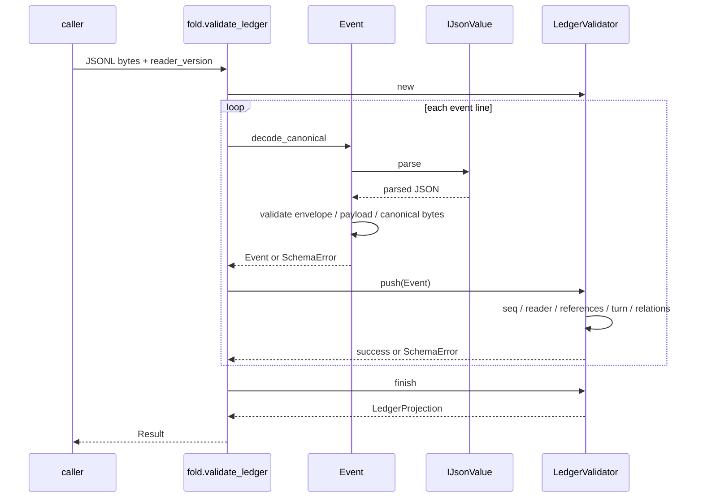

# schema — event formats, log validation and state folding

[Four-layer architecture](../../../docs/architecture/README.md) · [All crates](../../../docs/architecture/crates.md) · [Complete source index](generated/index.md)

Provides shared event and content types across the repository and derives lifecycle facts from ordered events; it owns neither disk writes nor process scheduling.

## Modules and responsibilities

| Module / file group | Responsibility |
|---|---|
| `event` | Event decoding, payload validation and visibility |
| `fold` | Incremental LedgerValidator checks, LedgerProjection and LifecycleFacts |
| `ijson` | Constrained JSON and canonical bytes |
| `types` | Block, OriginTuple, SeqRange, ResumePolicy |
| `checkpoint` | CheckpointStateV1 and validation |

## Interfaces and calls

Main entry points: Event, LedgerValidator, validate_ledger, IJsonValue, SchemaError.

validate_ledger → Event::decode_canonical → LedgerValidator::push → finish; push also checks reader gates, historical references, turn allocation, event relationships, supersedes and origin identity.

For complete declarations (including private functions), pub/re-export paths and call sites, see the [generated index](generated/index.md). Each src page contains grouped function call graphs; cross-file graphs live in the package index.

## Boundary

The following diagram shows one `validate_ledger` invocation. Participants are functions/objects in the same process, not threads or processes.
Checks inside `push` incrementally update validator state; `finish` produces the projection at the end.

Any error returned through `?` ends the operation immediately; later steps in the diagram do not execute.
For exact source locations of entry points and internal functions, see [fold call sites](generated/src--fold.md).

schema::Event is a re-export path through lib.rs; pub(crate) SchemaError constructors are used only within this crate. terminal_tail describes the log's terminal state and cannot prove process exit.

`compact` accepts an optional `shadow` object (compaction v5 telemetry): the
mode, the frozen bundle (`covers` ranges, non-empty `sha256`) and the boolean
verdict are validated; the artifact fields are open.

`LifecycleFacts` carries `continuation_wait_until` (latest `poll_after` of a
parked, unpaired tool continuation) and `admission_wait_until` (the
`next_attempt_at` of the latest provider-admission wait not yet followed by an
attempt or settle); `durable_wait_until` is the later of the two.

Behavior contract: [event.md](../../../spec/event.md).

These are static descriptions of the worktree source. An unresolved method in a diagram does not imply no calls; runtime outcomes require separate evidence.
