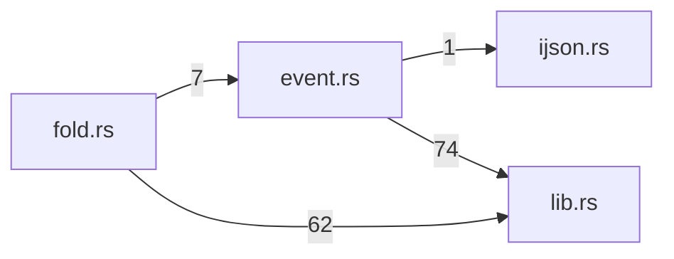

# schema — generated atlas

[All packages](../../../../docs/architecture/generated/index.md) · [Maintained explanation](../README.md)

## Cargo targets

| Target | Kind | Entry |
|---|---|---|
| `schema` | lib | [crates/schema/src/lib.rs](../../src/lib.rs) |
| `approval_batch_wait` | test | [crates/schema/tests/approval_batch_wait.rs](../../tests/approval_batch_wait.rs) |
| `attempt_request` | test | [crates/schema/tests/attempt_request.rs](../../tests/attempt_request.rs) |
| `compact_summary_request` | test | [crates/schema/tests/compact_summary_request.rs](../../tests/compact_summary_request.rs) |
| `file_block` | test | [crates/schema/tests/file_block.rs](../../tests/file_block.rs) |
| `slice8_launch_bindings` | test | [crates/schema/tests/slice8_launch_bindings.rs](../../tests/slice8_launch_bindings.rs) |
| `tool_result_replacement` | test | [crates/schema/tests/tool_result_replacement.rs](../../tests/tool_result_replacement.rs) |
| `usage` | test | [crates/schema/tests/usage.rs](../../tests/usage.rs) |
| `validation_settlement` | test | [crates/schema/tests/validation_settlement.rs](../../tests/validation_settlement.rs) |

## Direct workspace dependencies

| Dependency | Kind | Target cfg |
|---|---|---|

[Public/restricted API and direct callers](api.md)

## Source files / lexical modules

`src` files have full symbol/call tables and partitioned function graphs. Integration tests and examples remain in the JSON inventory.
File-derived paths below are lexical navigation, not a compiler-resolved module tree; inline module declarations are listed separately.

| File | Symbols | Call sites | Detail |
|---|---:|---:|---|
| [crates/schema/src/event.rs](../../src/event.rs) | 84 | 847 | [Symbols and calls](src--event.md) |
| [crates/schema/src/fold.rs](../../src/fold.rs) | 33 | 552 | [Symbols and calls](src--fold.md) |
| [crates/schema/src/ijson.rs](../../src/ijson.rs) | 26 | 61 | [Symbols and calls](src--ijson.md) |
| [crates/schema/src/lib.rs](../../src/lib.rs) | 4 | 3 | [Symbols and calls](src--lib.md) |
| [crates/schema/src/types.rs](../../src/types.rs) | 9 | 13 | [Symbols and calls](src--types.md) |
| [crates/schema/tests/approval_batch_wait.rs](../../tests/approval_batch_wait.rs) | 3 | 30 | `inventory.json` |
| [crates/schema/tests/attempt_request.rs](../../tests/attempt_request.rs) | 1 | 8 | `inventory.json` |
| [crates/schema/tests/compact_summary_request.rs](../../tests/compact_summary_request.rs) | 2 | 24 | `inventory.json` |
| [crates/schema/tests/file_block.rs](../../tests/file_block.rs) | 7 | 20 | `inventory.json` |
| [crates/schema/tests/slice8_launch_bindings.rs](../../tests/slice8_launch_bindings.rs) | 2 | 8 | `inventory.json` |
| [crates/schema/tests/tool_result_replacement.rs](../../tests/tool_result_replacement.rs) | 4 | 23 | `inventory.json` |
| [crates/schema/tests/usage.rs](../../tests/usage.rs) | 2 | 20 | `inventory.json` |
| [crates/schema/tests/validation_settlement.rs](../../tests/validation_settlement.rs) | 1 | 15 | `inventory.json` |

## Cross-file direct calls

Source files stand in for out-of-line modules; see declarations for inline modules. Counts are syntactic call sites, not runtime frequency.

