```mermaid
flowchart TD
  n0["schema::event::validate_blocks_or_spill"]
  n1["schema::event::validate_string_or_spill"]
  n2["schema::event::validate_json_or_spill"]
  n3["schema::event::validate_resume"]
  n4["schema::event::validate_origin_tuple"]
  n5["schema::event::required"]
  n6["schema::event::required_str"]
  n7["schema::event::required_id"]
  n8["schema::event::optional_str"]
  n9["schema::event::required_u64"]
  n10["schema::event::optional_u64"]
  n11["schema::event::required_bool"]
  n12["schema::event::optional_bool"]
  n13["schema::event::required_object"]
  n14["schema::event::optional_object"]
  n15["schema::event::required_array"]
  n16["schema::event::optional_array"]
  n17["schema::event::required_enum"]
  n18["schema::event::optional_json_value"]
  n19["schema::event::ranges"]
  n20["schema::event::validate_ranges_required_from_envelope"]
  n21["schema::event::validate_ranges_required_from_payload"]
  n22["schema::event::validate_u64_array"]
  n23["schema::event::validate_strictly_increasing_u64"]
  n24["schema::event::Event::origin_tuple"]
  n25["schema::event::Event::supersedes"]
  n26["schema::event::Event::object"]
  n27["schema::event::validate_payload"]
  n28["schema::event::validate_lower_sha256"]
  n29["schema::event::validate_genesis"]
  n30["schema::event::validate_epoch"]
  n31["schema::event::validate_input"]
  n32["schema::event::validate_turn_open"]
  n33["schema::event::validate_output"]
  n34["schema::event::validate_tool_call"]
  n35["schema::event::validate_tool_result"]
  n36["schema::event::validate_spawn"]
  n37["schema::event::validate_child_result"]
  n38["schema::event::validate_attempt"]
  n39["schema::event::validate_attempt_recovery"]
  n40["schema::event::validate_usage"]
  n41["schema::event::validate_error"]
  n42["schema::event::validate_settle"]
  n43["schema::event::validate_checkpoint"]
  n44["schema::event::validate_compact"]
  n45["schema::event::validate_meta"]
  n46["schema::event::validate_blocks"]
  n47["schema::SchemaError::event"]
  n24 --> n26
  n25 --> n19
  n25 --> n26
  n27 --> n1
  n27 --> n2
  n27 --> n4
  n27 --> n5
  n27 --> n6
  n27 --> n7
  n27 --> n8
  n27 --> n9
  n27 --> n11
  n27 --> n13
  n27 --> n17
  n27 --> n18
  n27 --> n20
  n27 --> n28
  n27 --> n29
  n27 --> n30
  n27 --> n31
  n27 --> n32
  n27 --> n33
  n27 --> n34
  n27 --> n35
  n27 --> n36
  n27 --> n37
  n27 --> n38
  n27 --> n39
  n27 --> n41
  n27 --> n42
  n27 --> n43
  n27 --> n44
  n27 --> n45
  n27 --> n47
  n28 --> n47
  n29 --> n3
  n29 --> n4
  n29 --> n5
  n29 --> n6
  n29 --> n7
  n29 --> n9
  n29 --> n12
  n29 --> n13
  n29 --> n14
  n29 --> n15
  n29 --> n47
  n30 --> n6
  n30 --> n7
  n30 --> n9
  n30 --> n13
  n30 --> n14
  n30 --> n15
  n30 --> n22
  n31 --> n4
  n31 --> n6
  n31 --> n12
  n31 --> n13
  n31 --> n15
  n31 --> n46
  n31 --> n47
  n32 --> n5
  n32 --> n7
  n32 --> n15
  n32 --> n23
  n32 --> n47
  n33 --> n1
  n33 --> n5
  n33 --> n6
  n33 --> n7
  n33 --> n9
  n33 --> n12
  n33 --> n13
  n33 --> n14
  n33 --> n15
  n33 --> n40
  n33 --> n46
  n34 --> n2
  n34 --> n5
  n34 --> n6
  n34 --> n7
  n34 --> n12
  n34 --> n17
  n35 --> n0
  n35 --> n5
  n35 --> n6
  n35 --> n7
  n35 --> n17
  n35 --> n18
  n35 --> n47
  n36 --> n3
  n36 --> n5
  n36 --> n6
  n36 --> n7
  n36 --> n13
  n36 --> n15
  n36 --> n47
  n37 --> n6
  n37 --> n7
  n37 --> n8
  n37 --> n16
  n37 --> n17
  n37 --> n47
  n38 --> n6
  n38 --> n7
  n38 --> n9
  n38 --> n13
  n38 --> n21
  n38 --> n47
  n39 --> n6
  n39 --> n7
  n39 --> n13
  n39 --> n15
  n39 --> n17
  n39 --> n47
  n40 --> n8
  n40 --> n17
  n40 --> n47
  n41 --> n1
  n41 --> n5
  n41 --> n6
  n41 --> n8
  n41 --> n9
  n41 --> n11
  n41 --> n13
  n41 --> n14
  n41 --> n17
  n41 --> n40
  n41 --> n47
  n42 --> n9
  n42 --> n10
  n42 --> n14
  n42 --> n17
  n42 --> n47
  n43 --> n1
  n43 --> n5
  n43 --> n9
```

```mermaid
flowchart TD
  n0["schema::event::validate_blocks_or_spill"]
  n1["schema::event::validate_string_or_spill"]
  n2["schema::event::validate_json_or_spill"]
  n3["schema::event::validate_inline_size"]
  n4["schema::event::is_spill"]
  n5["schema::event::validate_spill"]
  n6["schema::event::validate_resume"]
  n7["schema::event::validate_origin_equality"]
  n8["schema::event::validate_origin_tuple"]
  n9["schema::event::validate_timestamp"]
  n10["schema::event::parse_decimal"]
  n11["schema::event::days_in_month"]
  n12["schema::event::is_leap_year"]
  n13["schema::event::divisible_by"]
  n14["schema::event::required"]
  n15["schema::event::required_str"]
  n16["schema::event::required_id"]
  n17["schema::event::optional_str"]
  n18["schema::event::required_u64"]
  n19["schema::event::optional_u64"]
  n20["schema::event::required_bool"]
  n21["schema::event::optional_bool"]
  n22["schema::event::required_object"]
  n23["schema::event::optional_object"]
  n24["schema::event::required_array"]
  n25["schema::event::optional_array"]
  n26["schema::event::required_enum"]
  n27["schema::event::validate_ranges_required_from_payload"]
  n28["schema::event::validate_compact"]
  n29["schema::event::validate_meta"]
  n30["schema::event::validate_session_notice"]
  n31["schema::event::validate_blocks"]
  n32["schema::SchemaError::event"]
  n33["schema::SchemaError::constraint"]
  n0 --> n3
  n0 --> n4
  n0 --> n5
  n0 --> n31
  n0 --> n32
  n1 --> n3
  n1 --> n4
  n1 --> n5
  n1 --> n32
  n2 --> n3
  n2 --> n4
  n2 --> n5
  n3 --> n32
  n5 --> n15
  n5 --> n18
  n5 --> n32
  n6 --> n18
  n6 --> n32
  n7 --> n15
  n7 --> n32
  n7 --> n33
  n8 --> n15
  n8 --> n32
  n9 --> n10
  n9 --> n11
  n9 --> n32
  n11 --> n12
  n12 --> n13
  n14 --> n32
  n15 --> n32
  n28 --> n1
  n28 --> n8
  n28 --> n14
  n28 --> n15
  n28 --> n20
  n28 --> n22
  n28 --> n23
  n28 --> n27
  n28 --> n32
  n29 --> n8
  n29 --> n17
  n29 --> n18
  n29 --> n19
  n29 --> n23
  n29 --> n25
  n29 --> n30
  n29 --> n32
  n30 --> n15
  n30 --> n32
  n31 --> n14
  n31 --> n15
  n31 --> n16
  n31 --> n17
  n31 --> n18
  n31 --> n21
  n31 --> n24
  n31 --> n26
  n31 --> n31
  n31 --> n32
```

# schema::event

[Package atlas](index.md) · [Source](../../src/event.rs)

## Declarations

Visibility is the declaration spelling; trait members and reexports require their enclosing interface. `cfg` is not evaluated.

| Symbol | Kind | Visibility | Test / cfg |
|---|---|---|---|
| [schema::event::MAX_SAFE_INTEGER](../../src/event.rs#L8) | const_item | `private` |  |
| [schema::event::SPILL_THRESHOLD](../../src/event.rs#L9) | const_item | `private` |  |
| [schema::event::EventKind](../../src/event.rs#L12) | enum_item | `pub` |  |
| [schema::event::EventKind::parse](../../src/event.rs#L44) | function_item | `pub` |  |
| [schema::event::EventKind::as_str](../../src/event.rs#L77) | function_item | `pub` |  |
| [schema::event::EventKind::is_turn_bound](../../src/event.rs#L110) | function_item | `pub` |  |
| [schema::event::Visibility](../../src/event.rs#L144) | enum_item | `pub` |  |
| [schema::event::Event](../../src/event.rs#L152) | struct_item | `pub` |  |
| [schema::event::Event::decode](../../src/event.rs#L163) | function_item | `pub` |  |
| [schema::event::Event::decode_canonical](../../src/event.rs#L168) | function_item | `pub` |  |
| [schema::event::Event::from_value](../../src/event.rs#L178) | function_item | `pub` |  |
| [schema::event::Event::seq](../../src/event.rs#L229) | function_item | `pub` |  |
| [schema::event::Event::turn](../../src/event.rs#L234) | function_item | `pub` |  |
| [schema::event::Event::kind](../../src/event.rs#L239) | function_item | `pub` |  |
| [schema::event::Event::min_reader](../../src/event.rs#L244) | function_item | `pub` |  |
| [schema::event::Event::origin_key](../../src/event.rs#L249) | function_item | `pub` |  |
| [schema::event::Event::effective_visibility](../../src/event.rs#L254) | function_item | `pub` |  |
| [schema::event::Event::default_visibility](../../src/event.rs#L265) | function_item | `pub` |  |
| [schema::event::Event::canonical_bytes](../../src/event.rs#L285) | function_item | `pub` |  |
| [schema::event::Event::raw](../../src/event.rs#L290) | function_item | `pub` |  |
| [schema::event::Event::string_field](../../src/event.rs#L295) | function_item | `pub` |  |
| [schema::event::Event::integer_field](../../src/event.rs#L300) | function_item | `pub` |  |
| [schema::event::Event::has_field](../../src/event.rs#L305) | function_item | `pub` |  |
| [schema::event::Event::is_ephemeral_genesis](../../src/event.rs#L311) | function_item | `pub` |  |
| [schema::event::Event::usage](../../src/event.rs#L318) | function_item | `pub` |  |
| [schema::event::Event::origin_tuple](../../src/event.rs#L322) | function_item | `pub` |  |
| [schema::event::Event::supersedes](../../src/event.rs#L333) | function_item | `pub` |  |
| [schema::event::Event::object](../../src/event.rs#L345) | function_item | `pub(crate)` |  |
| [schema::event::validate_payload](../../src/event.rs#L353) | function_item | `private` |  |
| [schema::event::validate_lower_sha256](../../src/event.rs#L436) | function_item | `private` |  |
| [schema::event::validate_genesis](../../src/event.rs#L451) | function_item | `private` |  |
| [schema::event::validate_epoch](../../src/event.rs#L517) | function_item | `private` |  |
| [schema::event::validate_input](../../src/event.rs#L547) | function_item | `private` |  |
| [schema::event::validate_turn_open](../../src/event.rs#L570) | function_item | `private` |  |
| [schema::event::validate_output](../../src/event.rs#L597) | function_item | `private` |  |
| [schema::event::validate_tool_call](../../src/event.rs#L612) | function_item | `private` |  |
| [schema::event::validate_tool_result](../../src/event.rs#L625) | function_item | `private` |  |
| [schema::event::validate_spawn](../../src/event.rs#L648) | function_item | `private` |  |
| [schema::event::validate_child_result](../../src/event.rs#L665) | function_item | `private` |  |
| [schema::event::validate_attempt](../../src/event.rs#L688) | function_item | `private` |  |
| [schema::event::validate_attempt_recovery](../../src/event.rs#L713) | function_item | `private` |  |
| [schema::event::validate_usage](../../src/event.rs#L750) | function_item | `private` |  |
| [schema::event::validate_error](../../src/event.rs#L774) | function_item | `private` |  |
| [schema::event::validate_settle](../../src/event.rs#L819) | function_item | `private` |  |
| [schema::event::validate_checkpoint](../../src/event.rs#L899) | function_item | `private` |  |
| [schema::event::validate_compact](../../src/event.rs#L905) | function_item | `private` |  |
| [schema::event::validate_meta](../../src/event.rs#L927) | function_item | `private` |  |
| [schema::event::validate_session_notice](../../src/event.rs#L969) | function_item | `private` |  |
| [schema::event::validate_blocks](../../src/event.rs#L988) | function_item | `private` |  |
| [schema::event::validate_blocks_or_spill](../../src/event.rs#L1055) | function_item | `private` |  |
| [schema::event::validate_string_or_spill](../../src/event.rs#L1067) | function_item | `private` |  |
| [schema::event::validate_json_or_spill](../../src/event.rs#L1081) | function_item | `private` |  |
| [schema::event::validate_inline_size](../../src/event.rs#L1089) | function_item | `private` |  |
| [schema::event::is_spill](../../src/event.rs#L1101) | function_item | `private` |  |
| [schema::event::validate_spill](../../src/event.rs#L1107) | function_item | `private` |  |
| [schema::event::validate_resume](../../src/event.rs#L1124) | function_item | `private` |  |
| [schema::event::validate_origin_equality](../../src/event.rs#L1138) | function_item | `private` |  |
| [schema::event::validate_origin_tuple](../../src/event.rs#L1160) | function_item | `private` |  |
| [schema::event::validate_timestamp](../../src/event.rs#L1172) | function_item | `private` |  |
| [schema::event::parse_decimal](../../src/event.rs#L1204) | function_item | `private` |  |
| [schema::event::days_in_month](../../src/event.rs#L1211) | function_item | `private` |  |
| [schema::event::is_leap_year](../../src/event.rs#L1221) | function_item | `private` |  |
| [schema::event::divisible_by](../../src/event.rs#L1225) | function_item | `private` |  |
| [schema::event::required](../../src/event.rs#L1229) | function_item | `private` |  |
| [schema::event::required_str](../../src/event.rs#L1242) | function_item | `private` |  |
| [schema::event::required_id](../../src/event.rs#L1254) | function_item | `private` |  |
| [schema::event::optional_str](../../src/event.rs#L1269) | function_item | `private` |  |
| [schema::event::required_u64](../../src/event.rs#L1284) | function_item | `private` |  |
| [schema::event::optional_u64](../../src/event.rs#L1300) | function_item | `private` |  |
| [schema::event::required_bool](../../src/event.rs#L1321) | function_item | `private` |  |
| [schema::event::optional_bool](../../src/event.rs#L1328) | function_item | `private` |  |
| [schema::event::required_object](../../src/event.rs#L1343) | function_item | `private` |  |
| [schema::event::optional_object](../../src/event.rs#L1353) | function_item | `private` |  |
| [schema::event::required_array](../../src/event.rs#L1368) | function_item | `private` |  |
| [schema::event::optional_array](../../src/event.rs#L1379) | function_item | `private` |  |
| [schema::event::required_enum](../../src/event.rs#L1395) | function_item | `private` |  |
| [schema::event::optional_json_value](../../src/event.rs#L1411) | function_item | `private` |  |
| [schema::event::optional_visibility](../../src/event.rs#L1419) | function_item | `private` |  |
| [schema::event::ranges](../../src/event.rs#L1435) | function_item | `pub(crate)` |  |
| [schema::event::validate_ranges_optional](../../src/event.rs#L1460) | function_item | `private` |  |
| [schema::event::validate_ranges_required_from_envelope](../../src/event.rs#L1471) | function_item | `private` |  |
| [schema::event::validate_ranges_required_from_payload](../../src/event.rs#L1479) | function_item | `private` |  |
| [schema::event::validate_u64_array](../../src/event.rs#L1487) | function_item | `private` |  |
| [schema::event::validate_strictly_increasing_u64](../../src/event.rs#L1503) | function_item | `private` |  |

## Imports / reexports

| Local name | Source path | Visibility |
|---|---|---|
| `BTreeSet` | `std::collections::BTreeSet` | `private` |
| `Map` | `serde_json::Map` | `private` |
| `Value` | `serde_json::Value` | `private` |
| `Uuid` | `uuid::Uuid` | `private` |
| `IJsonValue` | `crate::IJsonValue` | `private` |
| `OriginTuple` | `crate::OriginTuple` | `private` |
| `SchemaError` | `crate::SchemaError` | `private` |
| `SeqRange` | `crate::SeqRange` | `private` |

## Module declarations

| Module | Visibility | Attributes |
|---|---|---|

## Function call graphs

Edges below are syntactically resolved calls only, including private functions. Graphs partition callers into groups of 20; they are not execution order. All unresolved sites are listed below and in the JSON inventory.

```mermaid
flowchart TD
  n0["schema::event::EventKind::is_turn_bound"]
  n1["schema::event::validate_origin_equality"]
  n2["schema::event::validate_timestamp"]
  n3["schema::event::required_str"]
  n4["schema::event::optional_str"]
  n5["schema::event::required_u64"]
  n6["schema::event::optional_u64"]
  n7["schema::event::optional_bool"]
  n8["schema::event::optional_visibility"]
  n9["schema::event::validate_ranges_optional"]
  n10["schema::event::Event::decode"]
  n11["schema::event::Event::decode_canonical"]
  n12["schema::event::Event::from_value"]
  n13["schema::event::Event::seq"]
  n14["schema::event::Event::turn"]
  n15["schema::event::Event::kind"]
  n16["schema::event::Event::min_reader"]
  n17["schema::event::Event::origin_key"]
  n18["schema::event::Event::effective_visibility"]
  n19["schema::event::Event::default_visibility"]
  n20["schema::event::Event::canonical_bytes"]
  n21["schema::event::Event::raw"]
  n22["schema::event::Event::string_field"]
  n23["schema::event::Event::integer_field"]
  n24["schema::event::Event::has_field"]
  n25["schema::event::Event::is_ephemeral_genesis"]
  n26["schema::event::Event::usage"]
  n27["schema::event::Event::object"]
  n28["schema::event::validate_payload"]
  n29["schema::event::EventKind::parse"]
  n30["schema::event::EventKind::as_str"]
  n31["schema::ijson::IJsonValue::parse"]
  n32["schema::SchemaError::event"]
  n10 --> n12
  n10 --> n31
  n11 --> n10
  n12 --> n1
  n12 --> n2
  n12 --> n3
  n12 --> n4
  n12 --> n5
  n12 --> n6
  n12 --> n7
  n12 --> n8
  n12 --> n9
  n12 --> n28
  n12 --> n29
  n12 --> n32
  n18 --> n19
  n22 --> n27
  n23 --> n27
  n24 --> n27
  n25 --> n27
  n26 --> n27
```

Functions 1–20: 21 direct edges

Functions 21–40: 136 direct edges

Functions 41–60: 59 direct edges

Functions 61–79: 25 direct edges

```mermaid
flowchart TD
  n0["schema::event::required"]
  n1["schema::event::required_str"]
  n2["schema::event::required_id"]
  n3["schema::event::optional_str"]
  n4["schema::event::required_u64"]
  n5["schema::event::optional_u64"]
  n6["schema::event::required_bool"]
  n7["schema::event::optional_bool"]
  n8["schema::event::required_object"]
  n9["schema::event::optional_object"]
  n10["schema::event::required_array"]
  n11["schema::event::optional_array"]
  n12["schema::event::required_enum"]
  n13["schema::event::optional_json_value"]
  n14["schema::event::optional_visibility"]
  n15["schema::event::ranges"]
  n16["schema::event::validate_ranges_optional"]
  n17["schema::event::validate_ranges_required_from_envelope"]
  n18["schema::event::validate_ranges_required_from_payload"]
  n19["schema::event::validate_u64_array"]
  n20["schema::event::validate_strictly_increasing_u64"]
  n21["schema::SchemaError::event"]
  n2 --> n1
  n2 --> n21
  n3 --> n21
  n4 --> n21
  n5 --> n21
  n6 --> n21
  n7 --> n21
  n8 --> n0
  n8 --> n21
  n9 --> n21
  n10 --> n0
  n10 --> n21
  n11 --> n21
  n12 --> n1
  n12 --> n21
  n14 --> n3
  n14 --> n21
  n15 --> n4
  n15 --> n10
  n15 --> n21
  n16 --> n15
  n17 --> n15
  n18 --> n15
  n19 --> n21
  n20 --> n21
```

## Call sites

Includes test functions (marked in declarations). Receiver-type-required sites need type analysis/manual tracing. Calls in closures are attributed to their enclosing function; their occurrence here does not mean the closure executes immediately.

| Caller | Callee expression | Source lines | Target / classification |
|---|---|---|---|
| `parse` | `Self::Extension` | [72](../../src/event.rs#L72) | external-constructor-callback-or-unresolved |
| `parse` | `other.to_owned` | [72](../../src/event.rs#L72) | receiver-type-required |
| `is_turn_bound` | `Some` | [128](../../src/event.rs#L128), [137](../../src/event.rs#L137) | external-constructor-callback-or-unresolved |
| `decode` | `IJsonValue::parse` | [164](../../src/event.rs#L164) | [schema::ijson::IJsonValue::parse](../../src/ijson.rs#L16) |
| `decode` | `Self::from_value` | [165](../../src/event.rs#L165) | [schema::event::Event::from_value](../../src/event.rs#L178) |
| `decode_canonical` | `Self::decode` | [169](../../src/event.rs#L169) | [schema::event::Event::decode](../../src/event.rs#L163) |
| `decode_canonical` | `event.canonical_bytes` | [170](../../src/event.rs#L170) | receiver-type-required |
| `decode_canonical` | `Err` | [171](../../src/event.rs#L171) | external-constructor-callback-or-unresolved |
| `decode_canonical` | `SchemaError::Canonical` | [171](../../src/event.rs#L171) | external-constructor-callback-or-unresolved |
| `decode_canonical` | `"event bytes are not RFC 8785 canonical".to_owned` | [172](../../src/event.rs#L172) | receiver-type-required |
| `decode_canonical` | `Ok` | [175](../../src/event.rs#L175) | external-constructor-callback-or-unresolved |
| `from_value` | `raw             .value()             .as_object()             .ok_or_else` | [179](../../src/event.rs#L179) | receiver-type-required |
| `from_value` | `raw             .value()             .as_object` | [179](../../src/event.rs#L179) | receiver-type-required |
| `from_value` | `raw             .value` | [179](../../src/event.rs#L179) | receiver-type-required |
| `from_value` | `SchemaError::event` | [182](../../src/event.rs#L182), [186](../../src/event.rs#L186), [190](../../src/event.rs#L190), [197](../../src/event.rs#L197), [203](../../src/event.rs#L203) | [schema::SchemaError::event](../../src/lib.rs#L28) |
| `from_value` | `required_u64` | [183](../../src/event.rs#L183), [184](../../src/event.rs#L184) | [schema::event::required_u64](../../src/event.rs#L1284) |
| `from_value` | `Some` | [184](../../src/event.rs#L184), [186](../../src/event.rs#L186), [188](../../src/event.rs#L188), [190](../../src/event.rs#L190), [193](../../src/event.rs#L193), [198](../../src/event.rs#L198), [204](../../src/event.rs#L204) | external-constructor-callback-or-unresolved |
| `from_value` | `Err` | [186](../../src/event.rs#L186), [190](../../src/event.rs#L190), [197](../../src/event.rs#L197), [203](../../src/event.rs#L203) | external-constructor-callback-or-unresolved |
| `from_value` | `required_str` | [188](../../src/event.rs#L188), [193](../../src/event.rs#L193) | [schema::event::required_str](../../src/event.rs#L1242) |
| `from_value` | `kind_text.is_empty` | [189](../../src/event.rs#L189) | receiver-type-required |
| `from_value` | `EventKind::parse` | [192](../../src/event.rs#L192) | [schema::event::EventKind::parse](../../src/event.rs#L44) |
| `from_value` | `validate_timestamp` | [193](../../src/event.rs#L193) | [schema::event::validate_timestamp](../../src/event.rs#L1172) |
| `from_value` | `optional_u64` | [194](../../src/event.rs#L194), [210](../../src/event.rs#L210) | [schema::event::optional_u64](../../src/event.rs#L1300) |
| `from_value` | `kind.is_turn_bound` | [195](../../src/event.rs#L195) | receiver-type-required |
| `from_value` | `turn.is_none` | [196](../../src/event.rs#L196) | receiver-type-required |
| `from_value` | `turn.is_some` | [202](../../src/event.rs#L202) | receiver-type-required |
| `from_value` | `optional_visibility` | [211](../../src/event.rs#L211) | [schema::event::optional_visibility](../../src/event.rs#L1419) |
| `from_value` | `optional_bool` | [212](../../src/event.rs#L212) | [schema::event::optional_bool](../../src/event.rs#L1328) |
| `from_value` | `validate_ranges_optional` | [213](../../src/event.rs#L213) | [schema::event::validate_ranges_optional](../../src/event.rs#L1460) |
| `from_value` | `optional_str(object, "origin_key", seq)?.map` | [214](../../src/event.rs#L214) | receiver-type-required |
| `from_value` | `optional_str` | [214](../../src/event.rs#L214) | [schema::event::optional_str](../../src/event.rs#L1269) |
| `from_value` | `validate_payload` | [215](../../src/event.rs#L215) | [schema::event::validate_payload](../../src/event.rs#L353) |
| `from_value` | `validate_origin_equality` | [216](../../src/event.rs#L216) | [schema::event::validate_origin_equality](../../src/event.rs#L1138) |
| `from_value` | `origin_key.as_deref` | [216](../../src/event.rs#L216) | receiver-type-required |
| `from_value` | `Ok` | [217](../../src/event.rs#L217) | external-constructor-callback-or-unresolved |
| `origin_key` | `self.origin_key.as_deref` | [250](../../src/event.rs#L250) | receiver-type-required |
| `effective_visibility` | `self.default_visibility` | [256](../../src/event.rs#L256), [261](../../src/event.rs#L261) | [schema::event::Event::default_visibility](../../src/event.rs#L265) |
| `canonical_bytes` | `self.raw.canonical_bytes` | [286](../../src/event.rs#L286) | receiver-type-required |
| `string_field` | `self.object().get(field).and_then` | [296](../../src/event.rs#L296) | receiver-type-required |
| `string_field` | `self.object().get` | [296](../../src/event.rs#L296) | receiver-type-required |
| `string_field` | `self.object` | [296](../../src/event.rs#L296) | [schema::event::Event::object](../../src/event.rs#L345) |
| `integer_field` | `self.object().get(field).and_then` | [301](../../src/event.rs#L301) | receiver-type-required |
| `integer_field` | `self.object().get` | [301](../../src/event.rs#L301) | receiver-type-required |
| `integer_field` | `self.object` | [301](../../src/event.rs#L301) | [schema::event::Event::object](../../src/event.rs#L345) |
| `has_field` | `self.object().contains_key` | [306](../../src/event.rs#L306) | receiver-type-required |
| `has_field` | `self.object` | [306](../../src/event.rs#L306) | [schema::event::Event::object](../../src/event.rs#L345) |
| `is_ephemeral_genesis` | `self.object().get("ephemeral").and_then` | [313](../../src/event.rs#L313) | receiver-type-required |
| `is_ephemeral_genesis` | `self.object().get` | [313](../../src/event.rs#L313) | receiver-type-required |
| `is_ephemeral_genesis` | `self.object` | [313](../../src/event.rs#L313) | [schema::event::Event::object](../../src/event.rs#L345) |
| `is_ephemeral_genesis` | `Some` | [313](../../src/event.rs#L313) | external-constructor-callback-or-unresolved |
| `usage` | `self.object().get("usage").and_then` | [319](../../src/event.rs#L319) | receiver-type-required |
| `usage` | `self.object().get` | [319](../../src/event.rs#L319) | receiver-type-required |
| `usage` | `self.object` | [319](../../src/event.rs#L319) | [schema::event::Event::object](../../src/event.rs#L345) |
| `origin_tuple` | `self.object()             .get("origin_tuple")             .cloned()             .map(serde_json::from_value)             .transpose()             .map_err` | [323](../../src/event.rs#L323) | receiver-type-required |
| `origin_tuple` | `self.object()             .get("origin_tuple")             .cloned()             .map(serde_json::from_value)             .transpose` | [323](../../src/event.rs#L323) | receiver-type-required |
| `origin_tuple` | `self.object()             .get("origin_tuple")             .cloned()             .map` | [323](../../src/event.rs#L323) | receiver-type-required |
| `origin_tuple` | `self.object()             .get("origin_tuple")             .cloned` | [323](../../src/event.rs#L323) | receiver-type-required |
| `origin_tuple` | `self.object()             .get` | [323](../../src/event.rs#L323) | receiver-type-required |
| `origin_tuple` | `self.object` | [323](../../src/event.rs#L323) | [schema::event::Event::object](../../src/event.rs#L345) |
| `supersedes` | `self.object().contains_key` | [334](../../src/event.rs#L334) | receiver-type-required |
| `supersedes` | `self.object` | [334](../../src/event.rs#L334), [337](../../src/event.rs#L337) | [schema::event::Event::object](../../src/event.rs#L345) |
| `supersedes` | `Ok` | [335](../../src/event.rs#L335) | external-constructor-callback-or-unresolved |
| `supersedes` | `Vec::new` | [335](../../src/event.rs#L335) | external-constructor-callback-or-unresolved |
| `supersedes` | `ranges(self.object(), "supersedes", self.seq).map` | [337](../../src/event.rs#L337) | receiver-type-required |
| `supersedes` | `ranges` | [337](../../src/event.rs#L337) | [schema::event::ranges](../../src/event.rs#L1435) |
| `supersedes` | `values                 .into_iter()                 .map(&#124;(from, to)&#124; SeqRange { from, to })                 .collect` | [338](../../src/event.rs#L338) | receiver-type-required |
| `supersedes` | `values                 .into_iter()                 .map` | [338](../../src/event.rs#L338) | receiver-type-required |
| `supersedes` | `values                 .into_iter` | [338](../../src/event.rs#L338) | receiver-type-required |
| `object` | `self.raw             .value()             .as_object()             .expect` | [346](../../src/event.rs#L346) | receiver-type-required |
| `object` | `self.raw             .value()             .as_object` | [346](../../src/event.rs#L346) | receiver-type-required |
| `object` | `self.raw             .value` | [346](../../src/event.rs#L346) | receiver-type-required |
| `validate_payload` | `validate_genesis` | [359](../../src/event.rs#L359) | [schema::event::validate_genesis](../../src/event.rs#L451) |
| `validate_payload` | `required_id` | [361](../../src/event.rs#L361), [390](../../src/event.rs#L390), [394](../../src/event.rs#L394), [396](../../src/event.rs#L396), [401](../../src/event.rs#L401), [407](../../src/event.rs#L407), [416](../../src/event.rs#L416) | [schema::event::required_id](../../src/event.rs#L1254) |
| `validate_payload` | `required_enum` | [362](../../src/event.rs#L362) | [schema::event::required_enum](../../src/event.rs#L1395) |
| `validate_payload` | `required_u64` | [363](../../src/event.rs#L363), [423](../../src/event.rs#L423) | [schema::event::required_u64](../../src/event.rs#L1284) |
| `validate_payload` | `Some` | [363](../../src/event.rs#L363), [364](../../src/event.rs#L364), [365](../../src/event.rs#L365), [366](../../src/event.rs#L366), [370](../../src/event.rs#L370), [382](../../src/event.rs#L382), [402](../../src/event.rs#L402), [423](../../src/event.rs#L423), [428](../../src/event.rs#L428) | external-constructor-callback-or-unresolved |
| `validate_payload` | `required_str` | [364](../../src/event.rs#L364), [365](../../src/event.rs#L365), [366](../../src/event.rs#L366), [370](../../src/event.rs#L370), [402](../../src/event.rs#L402), [428](../../src/event.rs#L428) | [schema::event::required_str](../../src/event.rs#L1242) |
| `validate_payload` | `optional_str` | [367](../../src/event.rs#L367), [409](../../src/event.rs#L409) | [schema::event::optional_str](../../src/event.rs#L1269) |
| `validate_payload` | `validate_lower_sha256` | [368](../../src/event.rs#L368) | [schema::event::validate_lower_sha256](../../src/event.rs#L436) |
| `validate_payload` | `Ok` | [371](../../src/event.rs#L371), [386](../../src/event.rs#L386), [404](../../src/event.rs#L404), [430](../../src/event.rs#L430), [432](../../src/event.rs#L432) | external-constructor-callback-or-unresolved |
| `validate_payload` | `validate_epoch` | [373](../../src/event.rs#L373) | [schema::event::validate_epoch](../../src/event.rs#L517) |
| `validate_payload` | `validate_input` | [374](../../src/event.rs#L374) | [schema::event::validate_input](../../src/event.rs#L547) |
| `validate_payload` | `validate_turn_open` | [375](../../src/event.rs#L375) | [schema::event::validate_turn_open](../../src/event.rs#L570) |
| `validate_payload` | `required_object(object, "origin_tuple", seq)                 .and_then` | [377](../../src/event.rs#L377) | receiver-type-required |
| `validate_payload` | `required_object` | [377](../../src/event.rs#L377), [411](../../src/event.rs#L411), [424](../../src/event.rs#L424) | [schema::event::required_object](../../src/event.rs#L1343) |
| `validate_payload` | `validate_origin_tuple` | [378](../../src/event.rs#L378), [411](../../src/event.rs#L411), [424](../../src/event.rs#L424) | [schema::event::validate_origin_tuple](../../src/event.rs#L1160) |
| `validate_payload` | `validate_ranges_required_from_envelope` | [379](../../src/event.rs#L379) | [schema::event::validate_ranges_required_from_envelope](../../src/event.rs#L1471) |
| `validate_payload` | `ranges.is_empty` | [380](../../src/event.rs#L380) | receiver-type-required |
| `validate_payload` | `Err` | [381](../../src/event.rs#L381) | external-constructor-callback-or-unresolved |
| `validate_payload` | `SchemaError::event` | [381](../../src/event.rs#L381) | [schema::SchemaError::event](../../src/lib.rs#L28) |
| `validate_payload` | `validate_output` | [388](../../src/event.rs#L388) | [schema::event::validate_output](../../src/event.rs#L597) |
| `validate_payload` | `validate_string_or_spill` | [391](../../src/event.rs#L391) | [schema::event::validate_string_or_spill](../../src/event.rs#L1067) |
| `validate_payload` | `required` | [391](../../src/event.rs#L391), [397](../../src/event.rs#L397), [429](../../src/event.rs#L429) | [schema::event::required](../../src/event.rs#L1229) |
| `validate_payload` | `validate_tool_call` | [393](../../src/event.rs#L393) | [schema::event::validate_tool_call](../../src/event.rs#L612) |
| `validate_payload` | `required_id(object, "call", seq).map` | [394](../../src/event.rs#L394) | receiver-type-required |
| `validate_payload` | `validate_json_or_spill` | [397](../../src/event.rs#L397) | [schema::event::validate_json_or_spill](../../src/event.rs#L1081) |
| `validate_payload` | `validate_tool_result` | [399](../../src/event.rs#L399) | [schema::event::validate_tool_result](../../src/event.rs#L625) |
| `validate_payload` | `optional_json_value` | [403](../../src/event.rs#L403), [410](../../src/event.rs#L410) | [schema::event::optional_json_value](../../src/event.rs#L1411) |
| `validate_payload` | `required_bool` | [408](../../src/event.rs#L408) | [schema::event::required_bool](../../src/event.rs#L1321) |
| `validate_payload` | `validate_spawn` | [413](../../src/event.rs#L413) | [schema::event::validate_spawn](../../src/event.rs#L648) |
| `validate_payload` | `validate_child_result` | [414](../../src/event.rs#L414) | [schema::event::validate_child_result](../../src/event.rs#L665) |
| `validate_payload` | `validate_attempt` | [415](../../src/event.rs#L415) | [schema::event::validate_attempt](../../src/event.rs#L688) |
| `validate_payload` | `required_id(object, "attempt", seq).map` | [416](../../src/event.rs#L416) | receiver-type-required |
| `validate_payload` | `validate_attempt_recovery` | [417](../../src/event.rs#L417) | [schema::event::validate_attempt_recovery](../../src/event.rs#L713) |
| `validate_payload` | `validate_error` | [418](../../src/event.rs#L418) | [schema::event::validate_error](../../src/event.rs#L774) |
| `validate_payload` | `validate_settle` | [419](../../src/event.rs#L419) | [schema::event::validate_settle](../../src/event.rs#L819) |
| `validate_payload` | `validate_checkpoint` | [420](../../src/event.rs#L420) | [schema::event::validate_checkpoint](../../src/event.rs#L899) |
| `validate_payload` | `validate_compact` | [421](../../src/event.rs#L421) | [schema::event::validate_compact](../../src/event.rs#L905) |
| `validate_payload` | `validate_meta` | [426](../../src/event.rs#L426) | [schema::event::validate_meta](../../src/event.rs#L927) |
| `validate_lower_sha256` | `value.len` | [437](../../src/event.rs#L437) | receiver-type-required |
| `validate_lower_sha256` | `value             .bytes()             .all` | [438](../../src/event.rs#L438) | receiver-type-required |
| `validate_lower_sha256` | `value             .bytes` | [438](../../src/event.rs#L438) | receiver-type-required |
| `validate_lower_sha256` | `byte.is_ascii_hexdigit` | [440](../../src/event.rs#L440) | receiver-type-required |
| `validate_lower_sha256` | `byte.is_ascii_uppercase` | [440](../../src/event.rs#L440) | receiver-type-required |
| `validate_lower_sha256` | `Ok` | [442](../../src/event.rs#L442) | external-constructor-callback-or-unresolved |
| `validate_lower_sha256` | `Err` | [444](../../src/event.rs#L444) | external-constructor-callback-or-unresolved |
| `validate_lower_sha256` | `SchemaError::event` | [444](../../src/event.rs#L444) | [schema::SchemaError::event](../../src/lib.rs#L28) |
| `validate_lower_sha256` | `Some` | [445](../../src/event.rs#L445) | external-constructor-callback-or-unresolved |
| `validate_genesis` | `Err` | [453](../../src/event.rs#L453), [462](../../src/event.rs#L462), [473](../../src/event.rs#L473), [498](../../src/event.rs#L498) | external-constructor-callback-or-unresolved |
| `validate_genesis` | `SchemaError::event` | [453](../../src/event.rs#L453), [460](../../src/event.rs#L460), [462](../../src/event.rs#L462), [473](../../src/event.rs#L473), [496](../../src/event.rs#L496), [498](../../src/event.rs#L498) | [schema::SchemaError::event](../../src/lib.rs#L28) |
| `validate_genesis` | `Some` | [453](../../src/event.rs#L453), [455](../../src/event.rs#L455), [456](../../src/event.rs#L456), [457](../../src/event.rs#L457), [458](../../src/event.rs#L458), [460](../../src/event.rs#L460), [463](../../src/event.rs#L463), [467](../../src/event.rs#L467), [473](../../src/event.rs#L473), [480](../../src/event.rs#L480), [484](../../src/event.rs#L484), [485](../../src/event.rs#L485), [489](../../src/event.rs#L489), [496](../../src/event.rs#L496), [499](../../src/event.rs#L499), [503](../../src/event.rs#L503), [506](../../src/event.rs#L506), [507](../../src/event.rs#L507), [510](../../src/event.rs#L510), [512](../../src/event.rs#L512) | external-constructor-callback-or-unresolved |
| `validate_genesis` | `required_u64` | [455](../../src/event.rs#L455), [456](../../src/event.rs#L456), [457](../../src/event.rs#L457), [485](../../src/event.rs#L485) | [schema::event::required_u64](../../src/event.rs#L1284) |
| `validate_genesis` | `required_str` | [458](../../src/event.rs#L458), [467](../../src/event.rs#L467), [480](../../src/event.rs#L480), [484](../../src/event.rs#L484), [489](../../src/event.rs#L489), [506](../../src/event.rs#L506), [507](../../src/event.rs#L507), [510](../../src/event.rs#L510), [512](../../src/event.rs#L512) | [schema::event::required_str](../../src/event.rs#L1242) |
| `validate_genesis` | `Uuid::parse_str(thread)         .map_err` | [459](../../src/event.rs#L459) | receiver-type-required |
| `validate_genesis` | `Uuid::parse_str` | [459](../../src/event.rs#L459) | external-constructor-callback-or-unresolved |
| `validate_genesis` | `parsed.hyphenated().to_string` | [461](../../src/event.rs#L461) | receiver-type-required |
| `validate_genesis` | `parsed.hyphenated` | [461](../../src/event.rs#L461) | receiver-type-required |
| `validate_genesis` | `thread.to_ascii_lowercase` | [461](../../src/event.rs#L461) | receiver-type-required |
| `validate_genesis` | `object.contains_key` | [468](../../src/event.rs#L468) | receiver-type-required |
| `validate_genesis` | `required_id` | [469](../../src/event.rs#L469), [486](../../src/event.rs#L486) | [schema::event::required_id](../../src/event.rs#L1254) |
| `validate_genesis` | `object.get` | [471](../../src/event.rs#L471) | receiver-type-required |
| `validate_genesis` | `optional_bool` | [479](../../src/event.rs#L479) | [schema::event::optional_bool](../../src/event.rs#L1328) |
| `validate_genesis` | `validate_origin_tuple` | [481](../../src/event.rs#L481) | [schema::event::validate_origin_tuple](../../src/event.rs#L1160) |
| `validate_genesis` | `required_object` | [481](../../src/event.rs#L481), [505](../../src/event.rs#L505), [509](../../src/event.rs#L509) | [schema::event::required_object](../../src/event.rs#L1343) |
| `validate_genesis` | `validate_resume` | [482](../../src/event.rs#L482) | [schema::event::validate_resume](../../src/event.rs#L1124) |
| `validate_genesis` | `required` | [482](../../src/event.rs#L482) | [schema::event::required](../../src/event.rs#L1229) |
| `validate_genesis` | `optional_object` | [483](../../src/event.rs#L483), [488](../../src/event.rs#L488), [511](../../src/event.rs#L511) | [schema::event::optional_object](../../src/event.rs#L1353) |
| `validate_genesis` | `required_array` | [490](../../src/event.rs#L490) | [schema::event::required_array](../../src/event.rs#L1368) |
| `validate_genesis` | `BTreeSet::new` | [492](../../src/event.rs#L492) | external-constructor-callback-or-unresolved |
| `validate_genesis` | `value                 .as_str()                 .ok_or_else` | [494](../../src/event.rs#L494) | receiver-type-required |
| `validate_genesis` | `value                 .as_str` | [494](../../src/event.rs#L494) | receiver-type-required |
| `validate_genesis` | `previous.is_some_and` | [497](../../src/event.rs#L497) | receiver-type-required |
| `validate_genesis` | `seen.insert` | [497](../../src/event.rs#L497) | receiver-type-required |
| `validate_genesis` | `Ok` | [514](../../src/event.rs#L514) | external-constructor-callback-or-unresolved |
| `validate_epoch` | `required_id` | [518](../../src/event.rs#L518) | [schema::event::required_id](../../src/event.rs#L1254) |
| `validate_epoch` | `required_str` | [519](../../src/event.rs#L519), [520](../../src/event.rs#L520), [521](../../src/event.rs#L521), [523](../../src/event.rs#L523), [524](../../src/event.rs#L524), [529](../../src/event.rs#L529), [530](../../src/event.rs#L530) | [schema::event::required_str](../../src/event.rs#L1242) |
| `validate_epoch` | `Some` | [519](../../src/event.rs#L519), [520](../../src/event.rs#L520), [521](../../src/event.rs#L521), [523](../../src/event.rs#L523), [524](../../src/event.rs#L524), [529](../../src/event.rs#L529), [530](../../src/event.rs#L530), [531](../../src/event.rs#L531) | external-constructor-callback-or-unresolved |
| `validate_epoch` | `required_object` | [522](../../src/event.rs#L522), [528](../../src/event.rs#L528) | [schema::event::required_object](../../src/event.rs#L1343) |
| `validate_epoch` | `required_u64` | [531](../../src/event.rs#L531) | [schema::event::required_u64](../../src/event.rs#L1284) |
| `validate_epoch` | `optional_object` | [532](../../src/event.rs#L532) | [schema::event::optional_object](../../src/event.rs#L1353) |
| `validate_epoch` | `validate_u64_array` | [533](../../src/event.rs#L533), [538](../../src/event.rs#L538) | [schema::event::validate_u64_array](../../src/event.rs#L1487) |
| `validate_epoch` | `required_array` | [534](../../src/event.rs#L534), [539](../../src/event.rs#L539) | [schema::event::required_array](../../src/event.rs#L1368) |
| `validate_epoch` | `Ok` | [544](../../src/event.rs#L544) | external-constructor-callback-or-unresolved |
| `validate_input` | `required_array` | [548](../../src/event.rs#L548) | [schema::event::required_array](../../src/event.rs#L1368) |
| `validate_input` | `content.is_empty` | [549](../../src/event.rs#L549) | receiver-type-required |
| `validate_input` | `Err` | [550](../../src/event.rs#L550), [564](../../src/event.rs#L564) | external-constructor-callback-or-unresolved |
| `validate_input` | `SchemaError::event` | [550](../../src/event.rs#L550), [564](../../src/event.rs#L564) | [schema::SchemaError::event](../../src/lib.rs#L28) |
| `validate_input` | `Some` | [551](../../src/event.rs#L551), [562](../../src/event.rs#L562), [564](../../src/event.rs#L564) | external-constructor-callback-or-unresolved |
| `validate_input` | `validate_blocks` | [555](../../src/event.rs#L555) | [schema::event::validate_blocks](../../src/event.rs#L988) |
| `validate_input` | `optional_bool` | [556](../../src/event.rs#L556) | [schema::event::optional_bool](../../src/event.rs#L1328) |
| `validate_input` | `validate_origin_tuple` | [557](../../src/event.rs#L557) | [schema::event::validate_origin_tuple](../../src/event.rs#L1160) |
| `validate_input` | `required_object` | [557](../../src/event.rs#L557) | [schema::event::required_object](../../src/event.rs#L1343) |
| `validate_input` | `object.get` | [558](../../src/event.rs#L558) | receiver-type-required |
| `validate_input` | `required_str` | [562](../../src/event.rs#L562) | [schema::event::required_str](../../src/event.rs#L1242) |
| `validate_input` | `Ok` | [567](../../src/event.rs#L567) | external-constructor-callback-or-unresolved |
| `validate_turn_open` | `required` | [571](../../src/event.rs#L571) | [schema::event::required](../../src/event.rs#L1229) |
| `validate_turn_open` | `Ok` | [572](../../src/event.rs#L572), [582](../../src/event.rs#L582) | external-constructor-callback-or-unresolved |
| `validate_turn_open` | `value.contains_key` | [574](../../src/event.rs#L574) | receiver-type-required |
| `validate_turn_open` | `value.len` | [575](../../src/event.rs#L575) | receiver-type-required |
| `validate_turn_open` | `Err` | [576](../../src/event.rs#L576), [586](../../src/event.rs#L586), [593](../../src/event.rs#L593) | external-constructor-callback-or-unresolved |
| `validate_turn_open` | `SchemaError::event` | [576](../../src/event.rs#L576), [586](../../src/event.rs#L586), [593](../../src/event.rs#L593) | [schema::SchemaError::event](../../src/lib.rs#L28) |
| `validate_turn_open` | `Some` | [577](../../src/event.rs#L577), [587](../../src/event.rs#L587), [593](../../src/event.rs#L593) | external-constructor-callback-or-unresolved |
| `validate_turn_open` | `required_id` | [581](../../src/event.rs#L581) | [schema::event::required_id](../../src/event.rs#L1254) |
| `validate_turn_open` | `required_array` | [584](../../src/event.rs#L584) | [schema::event::required_array](../../src/event.rs#L1368) |
| `validate_turn_open` | `inputs.is_empty` | [585](../../src/event.rs#L585) | receiver-type-required |
| `validate_turn_open` | `validate_strictly_increasing_u64` | [591](../../src/event.rs#L591) | [schema::event::validate_strictly_increasing_u64](../../src/event.rs#L1503) |
| `validate_output` | `required_id` | [598](../../src/event.rs#L598), [607](../../src/event.rs#L607) | [schema::event::required_id](../../src/event.rs#L1254) |
| `validate_output` | `validate_usage` | [599](../../src/event.rs#L599) | [schema::event::validate_usage](../../src/event.rs#L750) |
| `validate_output` | `required_object` | [599](../../src/event.rs#L599), [602](../../src/event.rs#L602) | [schema::event::required_object](../../src/event.rs#L1343) |
| `validate_output` | `optional_bool` | [600](../../src/event.rs#L600) | [schema::event::optional_bool](../../src/event.rs#L1328) |
| `validate_output` | `validate_blocks` | [601](../../src/event.rs#L601) | [schema::event::validate_blocks](../../src/event.rs#L988) |
| `validate_output` | `required_array` | [601](../../src/event.rs#L601) | [schema::event::required_array](../../src/event.rs#L1368) |
| `validate_output` | `required_u64` | [603](../../src/event.rs#L603) | [schema::event::required_u64](../../src/event.rs#L1284) |
| `validate_output` | `Some` | [603](../../src/event.rs#L603), [604](../../src/event.rs#L604) | external-constructor-callback-or-unresolved |
| `validate_output` | `required_str` | [604](../../src/event.rs#L604) | [schema::event::required_str](../../src/event.rs#L1242) |
| `validate_output` | `validate_string_or_spill` | [605](../../src/event.rs#L605) | [schema::event::validate_string_or_spill](../../src/event.rs#L1067) |
| `validate_output` | `required` | [605](../../src/event.rs#L605) | [schema::event::required](../../src/event.rs#L1229) |
| `validate_output` | `optional_object` | [606](../../src/event.rs#L606) | [schema::event::optional_object](../../src/event.rs#L1353) |
| `validate_output` | `Ok` | [609](../../src/event.rs#L609) | external-constructor-callback-or-unresolved |
| `validate_tool_call` | `optional_bool` | [613](../../src/event.rs#L613) | [schema::event::optional_bool](../../src/event.rs#L1328) |
| `validate_tool_call` | `object.contains_key` | [614](../../src/event.rs#L614) | receiver-type-required |
| `validate_tool_call` | `required_id` | [615](../../src/event.rs#L615), [617](../../src/event.rs#L617), [621](../../src/event.rs#L621) | [schema::event::required_id](../../src/event.rs#L1254) |
| `validate_tool_call` | `required_str` | [618](../../src/event.rs#L618) | [schema::event::required_str](../../src/event.rs#L1242) |
| `validate_tool_call` | `Some` | [618](../../src/event.rs#L618) | external-constructor-callback-or-unresolved |
| `validate_tool_call` | `validate_json_or_spill` | [619](../../src/event.rs#L619) | [schema::event::validate_json_or_spill](../../src/event.rs#L1081) |
| `validate_tool_call` | `required` | [619](../../src/event.rs#L619) | [schema::event::required](../../src/event.rs#L1229) |
| `validate_tool_call` | `required_enum` | [620](../../src/event.rs#L620) | [schema::event::required_enum](../../src/event.rs#L1395) |
| `validate_tool_call` | `Ok` | [622](../../src/event.rs#L622) | external-constructor-callback-or-unresolved |
| `validate_tool_result` | `required_id` | [626](../../src/event.rs#L626) | [schema::event::required_id](../../src/event.rs#L1254) |
| `validate_tool_result` | `required` | [627](../../src/event.rs#L627) | [schema::event::required](../../src/event.rs#L1229) |
| `validate_tool_result` | `value.len` | [630](../../src/event.rs#L630), [633](../../src/event.rs#L633), [636](../../src/event.rs#L636) | receiver-type-required |
| `validate_tool_result` | `value.contains_key` | [630](../../src/event.rs#L630), [633](../../src/event.rs#L633), [636](../../src/event.rs#L636) | receiver-type-required |
| `validate_tool_result` | `required_enum` | [631](../../src/event.rs#L631), [637](../../src/event.rs#L637) | [schema::event::required_enum](../../src/event.rs#L1395) |
| `validate_tool_result` | `required_str` | [634](../../src/event.rs#L634) | [schema::event::required_str](../../src/event.rs#L1242) |
| `validate_tool_result` | `Some` | [634](../../src/event.rs#L634), [639](../../src/event.rs#L639) | external-constructor-callback-or-unresolved |
| `validate_tool_result` | `Err` | [639](../../src/event.rs#L639) | external-constructor-callback-or-unresolved |
| `validate_tool_result` | `SchemaError::event` | [639](../../src/event.rs#L639) | [schema::SchemaError::event](../../src/lib.rs#L28) |
| `validate_tool_result` | `object.get` | [641](../../src/event.rs#L641) | receiver-type-required |
| `validate_tool_result` | `validate_blocks_or_spill` | [642](../../src/event.rs#L642) | [schema::event::validate_blocks_or_spill](../../src/event.rs#L1055) |
| `validate_tool_result` | `optional_json_value` | [644](../../src/event.rs#L644) | [schema::event::optional_json_value](../../src/event.rs#L1411) |
| `validate_tool_result` | `Ok` | [645](../../src/event.rs#L645) | external-constructor-callback-or-unresolved |
| `validate_spawn` | `required_str` | [649](../../src/event.rs#L649) | [schema::event::required_str](../../src/event.rs#L1242) |
| `validate_spawn` | `Some` | [649](../../src/event.rs#L649), [657](../../src/event.rs#L657) | external-constructor-callback-or-unresolved |
| `validate_spawn` | `required_id` | [650](../../src/event.rs#L650), [651](../../src/event.rs#L651) | [schema::event::required_id](../../src/event.rs#L1254) |
| `validate_spawn` | `validate_resume` | [652](../../src/event.rs#L652) | [schema::event::validate_resume](../../src/event.rs#L1124) |
| `validate_spawn` | `required` | [652](../../src/event.rs#L652) | [schema::event::required](../../src/event.rs#L1229) |
| `validate_spawn` | `required_object` | [653](../../src/event.rs#L653) | [schema::event::required_object](../../src/event.rs#L1343) |
| `validate_spawn` | `required_array` | [654](../../src/event.rs#L654) | [schema::event::required_array](../../src/event.rs#L1368) |
| `validate_spawn` | `kind.as_str().is_none` | [655](../../src/event.rs#L655) | receiver-type-required |
| `validate_spawn` | `kind.as_str` | [655](../../src/event.rs#L655) | receiver-type-required |
| `validate_spawn` | `Err` | [656](../../src/event.rs#L656) | external-constructor-callback-or-unresolved |
| `validate_spawn` | `SchemaError::event` | [656](../../src/event.rs#L656) | [schema::SchemaError::event](../../src/lib.rs#L28) |
| `validate_spawn` | `Ok` | [662](../../src/event.rs#L662) | external-constructor-callback-or-unresolved |
| `validate_child_result` | `required_str` | [666](../../src/event.rs#L666), [681](../../src/event.rs#L681), [682](../../src/event.rs#L682) | [schema::event::required_str](../../src/event.rs#L1242) |
| `validate_child_result` | `Some` | [666](../../src/event.rs#L666), [679](../../src/event.rs#L679), [681](../../src/event.rs#L681), [682](../../src/event.rs#L682) | external-constructor-callback-or-unresolved |
| `validate_child_result` | `required_id` | [667](../../src/event.rs#L667), [668](../../src/event.rs#L668) | [schema::event::required_id](../../src/event.rs#L1254) |
| `validate_child_result` | `required_enum` | [669](../../src/event.rs#L669) | [schema::event::required_enum](../../src/event.rs#L1395) |
| `validate_child_result` | `optional_str` | [675](../../src/event.rs#L675) | [schema::event::optional_str](../../src/event.rs#L1269) |
| `validate_child_result` | `optional_array` | [676](../../src/event.rs#L676) | [schema::event::optional_array](../../src/event.rs#L1379) |
| `validate_child_result` | `artifact.as_object().ok_or_else` | [678](../../src/event.rs#L678) | receiver-type-required |
| `validate_child_result` | `artifact.as_object` | [678](../../src/event.rs#L678) | receiver-type-required |
| `validate_child_result` | `SchemaError::event` | [679](../../src/event.rs#L679) | [schema::SchemaError::event](../../src/lib.rs#L28) |
| `validate_child_result` | `Ok` | [685](../../src/event.rs#L685) | external-constructor-callback-or-unresolved |
| `validate_attempt` | `required_id` | [689](../../src/event.rs#L689), [690](../../src/event.rs#L690) | [schema::event::required_id](../../src/event.rs#L1254) |
| `validate_attempt` | `required_str` | [691](../../src/event.rs#L691), [702](../../src/event.rs#L702) | [schema::event::required_str](../../src/event.rs#L1242) |
| `validate_attempt` | `Some` | [691](../../src/event.rs#L691), [698](../../src/event.rs#L698), [702](../../src/event.rs#L702), [703](../../src/event.rs#L703), [705](../../src/event.rs#L705) | external-constructor-callback-or-unresolved |
| `validate_attempt` | `required_object` | [695](../../src/event.rs#L695) | [schema::event::required_object](../../src/event.rs#L1343) |
| `validate_attempt` | `request.len` | [696](../../src/event.rs#L696) | receiver-type-required |
| `validate_attempt` | `Err` | [697](../../src/event.rs#L697), [704](../../src/event.rs#L704) | external-constructor-callback-or-unresolved |
| `validate_attempt` | `SchemaError::event` | [697](../../src/event.rs#L697), [704](../../src/event.rs#L704) | [schema::SchemaError::event](../../src/lib.rs#L28) |
| `validate_attempt` | `required_u64` | [703](../../src/event.rs#L703) | [schema::event::required_u64](../../src/event.rs#L1284) |
| `validate_attempt` | `validate_ranges_required_from_payload` | [709](../../src/event.rs#L709) | [schema::event::validate_ranges_required_from_payload](../../src/event.rs#L1479) |
| `validate_attempt` | `Ok` | [710](../../src/event.rs#L710) | external-constructor-callback-or-unresolved |
| `validate_attempt_recovery` | `required_id` | [714](../../src/event.rs#L714) | [schema::event::required_id](../../src/event.rs#L1254) |
| `validate_attempt_recovery` | `required_enum` | [715](../../src/event.rs#L715) | [schema::event::required_enum](../../src/event.rs#L1395) |
| `validate_attempt_recovery` | `required_array` | [728](../../src/event.rs#L728) | [schema::event::required_array](../../src/event.rs#L1368) |
| `validate_attempt_recovery` | `call.as_str().is_none` | [730](../../src/event.rs#L730) | receiver-type-required |
| `validate_attempt_recovery` | `call.as_str` | [730](../../src/event.rs#L730) | receiver-type-required |
| `validate_attempt_recovery` | `Err` | [731](../../src/event.rs#L731), [740](../../src/event.rs#L740) | external-constructor-callback-or-unresolved |
| `validate_attempt_recovery` | `SchemaError::event` | [731](../../src/event.rs#L731), [740](../../src/event.rs#L740) | [schema::SchemaError::event](../../src/lib.rs#L28) |
| `validate_attempt_recovery` | `Some` | [732](../../src/event.rs#L732), [738](../../src/event.rs#L738), [741](../../src/event.rs#L741) | external-constructor-callback-or-unresolved |
| `validate_attempt_recovery` | `required_object` | [737](../../src/event.rs#L737) | [schema::event::required_object](../../src/event.rs#L1343) |
| `validate_attempt_recovery` | `required_str` | [738](../../src/event.rs#L738) | [schema::event::required_str](../../src/event.rs#L1242) |
| `validate_attempt_recovery` | `object.contains_key` | [739](../../src/event.rs#L739) | receiver-type-required |
| `validate_attempt_recovery` | `Ok` | [745](../../src/event.rs#L745) | external-constructor-callback-or-unresolved |
| `validate_usage` | `required_enum` | [751](../../src/event.rs#L751) | [schema::event::required_enum](../../src/event.rs#L1395) |
| `validate_usage` | `optional_str` | [763](../../src/event.rs#L763) | [schema::event::optional_str](../../src/event.rs#L1269) |
| `validate_usage` | `figures.into_iter().any` | [765](../../src/event.rs#L765) | receiver-type-required |
| `validate_usage` | `figures.into_iter` | [765](../../src/event.rs#L765) | receiver-type-required |
| `validate_usage` | `object.contains_key` | [765](../../src/event.rs#L765) | receiver-type-required |
| `validate_usage` | `Err` | [766](../../src/event.rs#L766) | external-constructor-callback-or-unresolved |
| `validate_usage` | `SchemaError::event` | [766](../../src/event.rs#L766) | [schema::SchemaError::event](../../src/lib.rs#L28) |
| `validate_usage` | `Some` | [767](../../src/event.rs#L767) | external-constructor-callback-or-unresolved |
| `validate_usage` | `Ok` | [771](../../src/event.rs#L771) | external-constructor-callback-or-unresolved |
| `validate_error` | `required_bool` | [775](../../src/event.rs#L775) | [schema::event::required_bool](../../src/event.rs#L1321) |
| `validate_error` | `required_enum` | [776](../../src/event.rs#L776) | [schema::event::required_enum](../../src/event.rs#L1395) |
| `validate_error` | `optional_str` | [789](../../src/event.rs#L789), [798](../../src/event.rs#L798) | [schema::event::optional_str](../../src/event.rs#L1269) |
| `validate_error` | `object.contains_key` | [790](../../src/event.rs#L790), [792](../../src/event.rs#L792), [803](../../src/event.rs#L803) | receiver-type-required |
| `validate_error` | `validate_usage` | [791](../../src/event.rs#L791) | [schema::event::validate_usage](../../src/event.rs#L750) |
| `validate_error` | `required_object` | [791](../../src/event.rs#L791) | [schema::event::required_object](../../src/event.rs#L1343) |
| `validate_error` | `Err` | [793](../../src/event.rs#L793), [807](../../src/event.rs#L807) | external-constructor-callback-or-unresolved |
| `validate_error` | `SchemaError::event` | [793](../../src/event.rs#L793), [807](../../src/event.rs#L807) | [schema::SchemaError::event](../../src/lib.rs#L28) |
| `validate_error` | `Some` | [794](../../src/event.rs#L794), [804](../../src/event.rs#L804), [805](../../src/event.rs#L805), [808](../../src/event.rs#L808), [812](../../src/event.rs#L812), [813](../../src/event.rs#L813) | external-constructor-callback-or-unresolved |
| `validate_error` | `optional_object` | [802](../../src/event.rs#L802) | [schema::event::optional_object](../../src/event.rs#L1353) |
| `validate_error` | `object.get` | [804](../../src/event.rs#L804), [805](../../src/event.rs#L805) | receiver-type-required |
| `validate_error` | `Value::Bool` | [804](../../src/event.rs#L804) | external-constructor-callback-or-unresolved |
| `validate_error` | `object.get("classification").and_then` | [805](../../src/event.rs#L805) | receiver-type-required |
| `validate_error` | `required_u64` | [812](../../src/event.rs#L812) | [schema::event::required_u64](../../src/event.rs#L1284) |
| `validate_error` | `required_str` | [813](../../src/event.rs#L813) | [schema::event::required_str](../../src/event.rs#L1242) |
| `validate_error` | `validate_string_or_spill` | [814](../../src/event.rs#L814) | [schema::event::validate_string_or_spill](../../src/event.rs#L1067) |
| `validate_error` | `required` | [814](../../src/event.rs#L814) | [schema::event::required](../../src/event.rs#L1229) |
| `validate_error` | `Ok` | [816](../../src/event.rs#L816) | external-constructor-callback-or-unresolved |
| `validate_settle` | `optional_u64` | [820](../../src/event.rs#L820) | [schema::event::optional_u64](../../src/event.rs#L1300) |
| `validate_settle` | `object.get("outcome").and_then` | [821](../../src/event.rs#L821), [833](../../src/event.rs#L833) | receiver-type-required |
| `validate_settle` | `object.get` | [821](../../src/event.rs#L821), [833](../../src/event.rs#L833) | receiver-type-required |
| `validate_settle` | `Some` | [821](../../src/event.rs#L821), [827](../../src/event.rs#L827), [833](../../src/event.rs#L833), [835](../../src/event.rs#L835), [845](../../src/event.rs#L845), [846](../../src/event.rs#L846), [847](../../src/event.rs#L847), [850](../../src/event.rs#L850), [864](../../src/event.rs#L864), [878](../../src/event.rs#L878), [891](../../src/event.rs#L891) | external-constructor-callback-or-unresolved |
| `validate_settle` | `object.contains_key` | [822](../../src/event.rs#L822), [862](../../src/event.rs#L862), [876](../../src/event.rs#L876), [890](../../src/event.rs#L890) | receiver-type-required |
| `validate_settle` | `Err` | [826](../../src/event.rs#L826), [834](../../src/event.rs#L834), [849](../../src/event.rs#L849), [863](../../src/event.rs#L863), [877](../../src/event.rs#L877), [891](../../src/event.rs#L891) | external-constructor-callback-or-unresolved |
| `validate_settle` | `SchemaError::event` | [826](../../src/event.rs#L826), [834](../../src/event.rs#L834), [849](../../src/event.rs#L849), [863](../../src/event.rs#L863), [877](../../src/event.rs#L877), [891](../../src/event.rs#L891) | [schema::SchemaError::event](../../src/lib.rs#L28) |
| `validate_settle` | `optional_object` | [832](../../src/event.rs#L832) | [schema::event::optional_object](../../src/event.rs#L1353) |
| `validate_settle` | `required_enum` | [839](../../src/event.rs#L839), [855](../../src/event.rs#L855), [870](../../src/event.rs#L870), [884](../../src/event.rs#L884) | [schema::event::required_enum](../../src/event.rs#L1395) |
| `validate_settle` | `required_u64` | [845](../../src/event.rs#L845), [846](../../src/event.rs#L846), [847](../../src/event.rs#L847) | [schema::event::required_u64](../../src/event.rs#L1284) |
| `validate_settle` | `Ok` | [896](../../src/event.rs#L896) | external-constructor-callback-or-unresolved |
| `validate_checkpoint` | `required_u64` | [900](../../src/event.rs#L900) | [schema::event::required_u64](../../src/event.rs#L1284) |
| `validate_checkpoint` | `Some` | [900](../../src/event.rs#L900) | external-constructor-callback-or-unresolved |
| `validate_checkpoint` | `validate_string_or_spill` | [901](../../src/event.rs#L901) | [schema::event::validate_string_or_spill](../../src/event.rs#L1067) |
| `validate_checkpoint` | `required` | [901](../../src/event.rs#L901) | [schema::event::required](../../src/event.rs#L1229) |
| `validate_checkpoint` | `Ok` | [902](../../src/event.rs#L902) | external-constructor-callback-or-unresolved |
| `validate_compact` | `validate_ranges_required_from_payload` | [906](../../src/event.rs#L906), [915](../../src/event.rs#L915) | [schema::event::validate_ranges_required_from_payload](../../src/event.rs#L1479) |
| `validate_compact` | `validate_string_or_spill` | [907](../../src/event.rs#L907) | [schema::event::validate_string_or_spill](../../src/event.rs#L1067) |
| `validate_compact` | `required` | [907](../../src/event.rs#L907) | [schema::event::required](../../src/event.rs#L1229) |
| `validate_compact` | `optional_object` | [908](../../src/event.rs#L908), [911](../../src/event.rs#L911) | [schema::event::optional_object](../../src/event.rs#L1353) |
| `validate_compact` | `validate_origin_tuple` | [909](../../src/event.rs#L909) | [schema::event::validate_origin_tuple](../../src/event.rs#L1160) |
| `validate_compact` | `required_object` | [914](../../src/event.rs#L914) | [schema::event::required_object](../../src/event.rs#L1343) |
| `validate_compact` | `required_str(bundle, "sha256", Some(seq))?.is_empty` | [916](../../src/event.rs#L916) | receiver-type-required |
| `validate_compact` | `required_str` | [916](../../src/event.rs#L916) | [schema::event::required_str](../../src/event.rs#L1242) |
| `validate_compact` | `Some` | [916](../../src/event.rs#L916), [918](../../src/event.rs#L918) | external-constructor-callback-or-unresolved |
| `validate_compact` | `Err` | [917](../../src/event.rs#L917) | external-constructor-callback-or-unresolved |
| `validate_compact` | `SchemaError::event` | [917](../../src/event.rs#L917) | [schema::SchemaError::event](../../src/lib.rs#L28) |
| `validate_compact` | `required_bool` | [922](../../src/event.rs#L922) | [schema::event::required_bool](../../src/event.rs#L1321) |
| `validate_compact` | `Ok` | [924](../../src/event.rs#L924) | external-constructor-callback-or-unresolved |
| `validate_meta` | `optional_str` | [928](../../src/event.rs#L928) | [schema::event::optional_str](../../src/event.rs#L1269) |
| `validate_meta` | `optional_array` | [929](../../src/event.rs#L929) | [schema::event::optional_array](../../src/event.rs#L1379) |
| `validate_meta` | `label.as_str().is_none` | [931](../../src/event.rs#L931) | receiver-type-required |
| `validate_meta` | `label.as_str` | [931](../../src/event.rs#L931) | receiver-type-required |
| `validate_meta` | `Err` | [932](../../src/event.rs#L932), [944](../../src/event.rs#L944), [959](../../src/event.rs#L959) | external-constructor-callback-or-unresolved |
| `validate_meta` | `SchemaError::event` | [932](../../src/event.rs#L932), [944](../../src/event.rs#L944), [959](../../src/event.rs#L959) | [schema::SchemaError::event](../../src/lib.rs#L28) |
| `validate_meta` | `Some` | [932](../../src/event.rs#L932), [938](../../src/event.rs#L938), [939](../../src/event.rs#L939), [945](../../src/event.rs#L945), [959](../../src/event.rs#L959) | external-constructor-callback-or-unresolved |
| `validate_meta` | `optional_u64` | [936](../../src/event.rs#L936) | [schema::event::optional_u64](../../src/event.rs#L1300) |
| `validate_meta` | `optional_object` | [937](../../src/event.rs#L937), [941](../../src/event.rs#L941), [950](../../src/event.rs#L950) | [schema::event::optional_object](../../src/event.rs#L1353) |
| `validate_meta` | `required_u64` | [938](../../src/event.rs#L938), [939](../../src/event.rs#L939) | [schema::event::required_u64](../../src/event.rs#L1284) |
| `validate_meta` | `validate_origin_tuple` | [942](../../src/event.rs#L942) | [schema::event::validate_origin_tuple](../../src/event.rs#L1160) |
| `validate_meta` | `object.contains_key` | [943](../../src/event.rs#L943) | receiver-type-required |
| `validate_meta` | `validate_session_notice` | [951](../../src/event.rs#L951) | [schema::event::validate_session_notice](../../src/event.rs#L969) |
| `validate_meta` | `object.keys().any` | [953](../../src/event.rs#L953) | receiver-type-required |
| `validate_meta` | `object.keys` | [953](../../src/event.rs#L953) | receiver-type-required |
| `validate_meta` | `Ok` | [961](../../src/event.rs#L961) | external-constructor-callback-or-unresolved |
| `validate_session_notice` | `required_str` | [970](../../src/event.rs#L970), [978](../../src/event.rs#L978) | [schema::event::required_str](../../src/event.rs#L1242) |
| `validate_session_notice` | `Some` | [970](../../src/event.rs#L970), [973](../../src/event.rs#L973), [978](../../src/event.rs#L978), [980](../../src/event.rs#L980) | external-constructor-callback-or-unresolved |
| `validate_session_notice` | `Err` | [972](../../src/event.rs#L972), [979](../../src/event.rs#L979) | external-constructor-callback-or-unresolved |
| `validate_session_notice` | `SchemaError::event` | [972](../../src/event.rs#L972), [979](../../src/event.rs#L979) | [schema::SchemaError::event](../../src/lib.rs#L28) |
| `validate_session_notice` | `required_str(notice, field, Some(seq))?.is_empty` | [978](../../src/event.rs#L978) | receiver-type-required |
| `validate_session_notice` | `Ok` | [985](../../src/event.rs#L985) | external-constructor-callback-or-unresolved |
| `validate_blocks` | `value             .as_object()             .ok_or_else` | [990](../../src/event.rs#L990) | receiver-type-required |
| `validate_blocks` | `value             .as_object` | [990](../../src/event.rs#L990) | receiver-type-required |
| `validate_blocks` | `SchemaError::event` | [992](../../src/event.rs#L992), [1014](../../src/event.rs#L1014), [1030](../../src/event.rs#L1030), [1036](../../src/event.rs#L1036) | [schema::SchemaError::event](../../src/lib.rs#L28) |
| `validate_blocks` | `Some` | [992](../../src/event.rs#L992), [1007](../../src/event.rs#L1007), [1010](../../src/event.rs#L1010), [1011](../../src/event.rs#L1011), [1015](../../src/event.rs#L1015), [1022](../../src/event.rs#L1022), [1023](../../src/event.rs#L1023), [1024](../../src/event.rs#L1024), [1031](../../src/event.rs#L1031), [1035](../../src/event.rs#L1035), [1036](../../src/event.rs#L1036), [1041](../../src/event.rs#L1041) | external-constructor-callback-or-unresolved |
| `validate_blocks` | `required_enum` | [993](../../src/event.rs#L993) | [schema::event::required_enum](../../src/event.rs#L1395) |
| `validate_blocks` | `required_str` | [1007](../../src/event.rs#L1007), [1010](../../src/event.rs#L1010), [1011](../../src/event.rs#L1011), [1022](../../src/event.rs#L1022), [1023](../../src/event.rs#L1023), [1024](../../src/event.rs#L1024), [1041](../../src/event.rs#L1041) | [schema::event::required_str](../../src/event.rs#L1242) |
| `validate_blocks` | `optional_str` | [1012](../../src/event.rs#L1012) | [schema::event::optional_str](../../src/event.rs#L1269) |
| `validate_blocks` | `name.is_empty` | [1013](../../src/event.rs#L1013), [1025](../../src/event.rs#L1025) | receiver-type-required |
| `validate_blocks` | `name.len` | [1013](../../src/event.rs#L1013), [1026](../../src/event.rs#L1026) | receiver-type-required |
| `validate_blocks` | `name.chars().any` | [1013](../../src/event.rs#L1013), [1027](../../src/event.rs#L1027) | receiver-type-required |
| `validate_blocks` | `name.chars` | [1013](../../src/event.rs#L1013), [1027](../../src/event.rs#L1027) | receiver-type-required |
| `validate_blocks` | `Err` | [1014](../../src/event.rs#L1014), [1030](../../src/event.rs#L1030), [1036](../../src/event.rs#L1036) | external-constructor-callback-or-unresolved |
| `validate_blocks` | `name.contains` | [1028](../../src/event.rs#L1028) | receiver-type-required |
| `validate_blocks` | `required_u64` | [1035](../../src/event.rs#L1035) | [schema::event::required_u64](../../src/event.rs#L1284) |
| `validate_blocks` | `required_id` | [1040](../../src/event.rs#L1040), [1045](../../src/event.rs#L1045) | [schema::event::required_id](../../src/event.rs#L1254) |
| `validate_blocks` | `required` | [1042](../../src/event.rs#L1042) | [schema::event::required](../../src/event.rs#L1229) |
| `validate_blocks` | `validate_blocks` | [1046](../../src/event.rs#L1046) | [schema::event::validate_blocks](../../src/event.rs#L988) |
| `validate_blocks` | `required_array` | [1046](../../src/event.rs#L1046) | [schema::event::required_array](../../src/event.rs#L1368) |
| `validate_blocks` | `optional_bool` | [1047](../../src/event.rs#L1047) | [schema::event::optional_bool](../../src/event.rs#L1328) |
| `validate_blocks` | `Ok` | [1052](../../src/event.rs#L1052) | external-constructor-callback-or-unresolved |
| `validate_blocks_or_spill` | `is_spill` | [1056](../../src/event.rs#L1056) | [schema::event::is_spill](../../src/event.rs#L1101) |
| `validate_blocks_or_spill` | `validate_spill` | [1057](../../src/event.rs#L1057) | [schema::event::validate_spill](../../src/event.rs#L1107) |
| `validate_blocks_or_spill` | `value             .as_array()             .ok_or_else` | [1059](../../src/event.rs#L1059) | receiver-type-required |
| `validate_blocks_or_spill` | `value             .as_array` | [1059](../../src/event.rs#L1059) | receiver-type-required |
| `validate_blocks_or_spill` | `SchemaError::event` | [1061](../../src/event.rs#L1061) | [schema::SchemaError::event](../../src/lib.rs#L28) |
| `validate_blocks_or_spill` | `Some` | [1061](../../src/event.rs#L1061) | external-constructor-callback-or-unresolved |
| `validate_blocks_or_spill` | `validate_inline_size` | [1062](../../src/event.rs#L1062) | [schema::event::validate_inline_size](../../src/event.rs#L1089) |
| `validate_blocks_or_spill` | `validate_blocks` | [1063](../../src/event.rs#L1063) | [schema::event::validate_blocks](../../src/event.rs#L988) |
| `validate_string_or_spill` | `is_spill` | [1068](../../src/event.rs#L1068) | [schema::event::is_spill](../../src/event.rs#L1101) |
| `validate_string_or_spill` | `validate_spill` | [1069](../../src/event.rs#L1069) | [schema::event::validate_spill](../../src/event.rs#L1107) |
| `validate_string_or_spill` | `value.as_str().is_none` | [1071](../../src/event.rs#L1071) | receiver-type-required |
| `validate_string_or_spill` | `value.as_str` | [1071](../../src/event.rs#L1071) | receiver-type-required |
| `validate_string_or_spill` | `Err` | [1072](../../src/event.rs#L1072) | external-constructor-callback-or-unresolved |
| `validate_string_or_spill` | `SchemaError::event` | [1072](../../src/event.rs#L1072) | [schema::SchemaError::event](../../src/lib.rs#L28) |
| `validate_string_or_spill` | `Some` | [1073](../../src/event.rs#L1073) | external-constructor-callback-or-unresolved |
| `validate_string_or_spill` | `validate_inline_size` | [1077](../../src/event.rs#L1077) | [schema::event::validate_inline_size](../../src/event.rs#L1089) |
| `validate_json_or_spill` | `is_spill` | [1082](../../src/event.rs#L1082) | [schema::event::is_spill](../../src/event.rs#L1101) |
| `validate_json_or_spill` | `validate_spill` | [1083](../../src/event.rs#L1083) | [schema::event::validate_spill](../../src/event.rs#L1107) |
| `validate_json_or_spill` | `validate_inline_size` | [1085](../../src/event.rs#L1085) | [schema::event::validate_inline_size](../../src/event.rs#L1089) |
| `validate_inline_size` | `serde_json_canonicalizer::to_vec(value)         .map_err` | [1090](../../src/event.rs#L1090) | receiver-type-required |
| `validate_inline_size` | `serde_json_canonicalizer::to_vec` | [1090](../../src/event.rs#L1090) | external-constructor-callback-or-unresolved |
| `validate_inline_size` | `SchemaError::event` | [1091](../../src/event.rs#L1091), [1093](../../src/event.rs#L1093) | [schema::SchemaError::event](../../src/lib.rs#L28) |
| `validate_inline_size` | `Some` | [1091](../../src/event.rs#L1091), [1094](../../src/event.rs#L1094) | external-constructor-callback-or-unresolved |
| `validate_inline_size` | `error.to_string` | [1091](../../src/event.rs#L1091) | receiver-type-required |
| `validate_inline_size` | `bytes.len` | [1092](../../src/event.rs#L1092) | receiver-type-required |
| `validate_inline_size` | `Err` | [1093](../../src/event.rs#L1093) | external-constructor-callback-or-unresolved |
| `validate_inline_size` | `Ok` | [1098](../../src/event.rs#L1098) | external-constructor-callback-or-unresolved |
| `is_spill` | `value         .as_object()         .is_some_and` | [1102](../../src/event.rs#L1102) | receiver-type-required |
| `is_spill` | `value         .as_object` | [1102](../../src/event.rs#L1102) | receiver-type-required |
| `is_spill` | `object.len` | [1104](../../src/event.rs#L1104) | receiver-type-required |
| `is_spill` | `object.contains_key` | [1104](../../src/event.rs#L1104) | receiver-type-required |
| `validate_spill` | `value         .as_object()         .and_then(&#124;object&#124; object.get("$spill"))         .and_then(Value::as_object)         .ok_or_else` | [1108](../../src/event.rs#L1108) | receiver-type-required |
| `validate_spill` | `value         .as_object()         .and_then(&#124;object&#124; object.get("$spill"))         .and_then` | [1108](../../src/event.rs#L1108) | receiver-type-required |
| `validate_spill` | `value         .as_object()         .and_then` | [1108](../../src/event.rs#L1108) | receiver-type-required |
| `validate_spill` | `value         .as_object` | [1108](../../src/event.rs#L1108) | receiver-type-required |
| `validate_spill` | `object.get` | [1110](../../src/event.rs#L1110) | receiver-type-required |
| `validate_spill` | `SchemaError::event` | [1112](../../src/event.rs#L1112), [1116](../../src/event.rs#L1116) | [schema::SchemaError::event](../../src/lib.rs#L28) |
| `validate_spill` | `Some` | [1112](../../src/event.rs#L1112), [1113](../../src/event.rs#L1113), [1114](../../src/event.rs#L1114), [1117](../../src/event.rs#L1117) | external-constructor-callback-or-unresolved |
| `validate_spill` | `required_str` | [1113](../../src/event.rs#L1113) | [schema::event::required_str](../../src/event.rs#L1242) |
| `validate_spill` | `required_u64` | [1114](../../src/event.rs#L1114) | [schema::event::required_u64](../../src/event.rs#L1284) |
| `validate_spill` | `Err` | [1116](../../src/event.rs#L1116) | external-constructor-callback-or-unresolved |
| `validate_spill` | `Ok` | [1121](../../src/event.rs#L1121) | external-constructor-callback-or-unresolved |
| `validate_resume` | `Ok` | [1126](../../src/event.rs#L1126), [1129](../../src/event.rs#L1129) | external-constructor-callback-or-unresolved |
| `validate_resume` | `value.len` | [1127](../../src/event.rs#L1127) | receiver-type-required |
| `validate_resume` | `required_u64` | [1128](../../src/event.rs#L1128) | [schema::event::required_u64](../../src/event.rs#L1284) |
| `validate_resume` | `Some` | [1128](../../src/event.rs#L1128), [1132](../../src/event.rs#L1132) | external-constructor-callback-or-unresolved |
| `validate_resume` | `Err` | [1131](../../src/event.rs#L1131) | external-constructor-callback-or-unresolved |
| `validate_resume` | `SchemaError::event` | [1131](../../src/event.rs#L1131) | [schema::SchemaError::event](../../src/lib.rs#L28) |
| `validate_origin_equality` | `object.get` | [1143](../../src/event.rs#L1143) | receiver-type-required |
| `validate_origin_equality` | `Ok` | [1144](../../src/event.rs#L1144), [1157](../../src/event.rs#L1157) | external-constructor-callback-or-unresolved |
| `validate_origin_equality` | `origin         .as_object()         .ok_or_else` | [1146](../../src/event.rs#L1146) | receiver-type-required |
| `validate_origin_equality` | `origin         .as_object` | [1146](../../src/event.rs#L1146) | receiver-type-required |
| `validate_origin_equality` | `SchemaError::event` | [1148](../../src/event.rs#L1148) | [schema::SchemaError::event](../../src/lib.rs#L28) |
| `validate_origin_equality` | `Some` | [1148](../../src/event.rs#L1148), [1149](../../src/event.rs#L1149), [1150](../../src/event.rs#L1150) | external-constructor-callback-or-unresolved |
| `validate_origin_equality` | `required_str` | [1149](../../src/event.rs#L1149) | [schema::event::required_str](../../src/event.rs#L1242) |
| `validate_origin_equality` | `Err` | [1151](../../src/event.rs#L1151) | external-constructor-callback-or-unresolved |
| `validate_origin_equality` | `SchemaError::constraint` | [1151](../../src/event.rs#L1151) | [schema::SchemaError::constraint](../../src/lib.rs#L35) |
| `validate_origin_tuple` | `required_str(value, field, Some(seq))?.is_empty` | [1162](../../src/event.rs#L1162) | receiver-type-required |
| `validate_origin_tuple` | `required_str` | [1162](../../src/event.rs#L1162) | [schema::event::required_str](../../src/event.rs#L1242) |
| `validate_origin_tuple` | `Some` | [1162](../../src/event.rs#L1162), [1164](../../src/event.rs#L1164) | external-constructor-callback-or-unresolved |
| `validate_origin_tuple` | `Err` | [1163](../../src/event.rs#L1163) | external-constructor-callback-or-unresolved |
| `validate_origin_tuple` | `SchemaError::event` | [1163](../../src/event.rs#L1163) | [schema::SchemaError::event](../../src/lib.rs#L28) |
| `validate_origin_tuple` | `Ok` | [1169](../../src/event.rs#L1169) | external-constructor-callback-or-unresolved |
| `validate_timestamp` | `value.as_bytes` | [1173](../../src/event.rs#L1173) | receiver-type-required |
| `validate_timestamp` | `bytes.len` | [1174](../../src/event.rs#L1174) | receiver-type-required |
| `validate_timestamp` | `bytes.iter().enumerate().all` | [1182](../../src/event.rs#L1182) | receiver-type-required |
| `validate_timestamp` | `bytes.iter().enumerate` | [1182](../../src/event.rs#L1182) | receiver-type-required |
| `validate_timestamp` | `bytes.iter` | [1182](../../src/event.rs#L1182) | receiver-type-required |
| `validate_timestamp` | `byte.is_ascii_digit` | [1183](../../src/event.rs#L1183) | receiver-type-required |
| `validate_timestamp` | `parse_decimal(&bytes[5..7]).is_some_and` | [1186](../../src/event.rs#L1186) | receiver-type-required |
| `validate_timestamp` | `parse_decimal` | [1186](../../src/event.rs#L1186), [1187](../../src/event.rs#L1187), [1188](../../src/event.rs#L1188), [1189](../../src/event.rs#L1189), [1192](../../src/event.rs#L1192), [1193](../../src/event.rs#L1193), [1194](../../src/event.rs#L1194) | [schema::event::parse_decimal](../../src/event.rs#L1204) |
| `validate_timestamp` | `(1..=12).contains` | [1186](../../src/event.rs#L1186) | receiver-type-required |
| `validate_timestamp` | `parse_decimal(&bytes[8..10]).is_some_and` | [1187](../../src/event.rs#L1187) | receiver-type-required |
| `validate_timestamp` | `parse_decimal(&bytes[0..4]).expect` | [1188](../../src/event.rs#L1188) | receiver-type-required |
| `validate_timestamp` | `parse_decimal(&bytes[5..7]).expect` | [1189](../../src/event.rs#L1189) | receiver-type-required |
| `validate_timestamp` | `(1..=days_in_month(year, month)).contains` | [1190](../../src/event.rs#L1190) | receiver-type-required |
| `validate_timestamp` | `days_in_month` | [1190](../../src/event.rs#L1190) | [schema::event::days_in_month](../../src/event.rs#L1211) |
| `validate_timestamp` | `parse_decimal(&bytes[11..13]).is_some_and` | [1192](../../src/event.rs#L1192) | receiver-type-required |
| `validate_timestamp` | `parse_decimal(&bytes[14..16]).is_some_and` | [1193](../../src/event.rs#L1193) | receiver-type-required |
| `validate_timestamp` | `parse_decimal(&bytes[17..19]).is_some_and` | [1194](../../src/event.rs#L1194) | receiver-type-required |
| `validate_timestamp` | `Err` | [1196](../../src/event.rs#L1196) | external-constructor-callback-or-unresolved |
| `validate_timestamp` | `SchemaError::event` | [1196](../../src/event.rs#L1196) | [schema::SchemaError::event](../../src/lib.rs#L28) |
| `validate_timestamp` | `Some` | [1197](../../src/event.rs#L1197) | external-constructor-callback-or-unresolved |
| `validate_timestamp` | `Ok` | [1201](../../src/event.rs#L1201) | external-constructor-callback-or-unresolved |
| `parse_decimal` | `bytes.iter().try_fold` | [1205](../../src/event.rs#L1205) | receiver-type-required |
| `parse_decimal` | `bytes.iter` | [1205](../../src/event.rs#L1205) | receiver-type-required |
| `parse_decimal` | `byte.is_ascii_digit()             .then_some` | [1206](../../src/event.rs#L1206) | receiver-type-required |
| `parse_decimal` | `byte.is_ascii_digit` | [1206](../../src/event.rs#L1206) | receiver-type-required |
| `parse_decimal` | `u32::from` | [1207](../../src/event.rs#L1207) | external-constructor-callback-or-unresolved |
| `days_in_month` | `is_leap_year` | [1215](../../src/event.rs#L1215) | [schema::event::is_leap_year](../../src/event.rs#L1221) |
| `is_leap_year` | `divisible_by` | [1222](../../src/event.rs#L1222) | [schema::event::divisible_by](../../src/event.rs#L1225) |
| `required` | `object         .get(field)         .filter(&#124;value&#124; !value.is_null())         .ok_or_else` | [1234](../../src/event.rs#L1234) | receiver-type-required |
| `required` | `object         .get(field)         .filter` | [1234](../../src/event.rs#L1234) | receiver-type-required |
| `required` | `object         .get` | [1234](../../src/event.rs#L1234) | receiver-type-required |
| `required` | `value.is_null` | [1236](../../src/event.rs#L1236) | receiver-type-required |
| `required` | `SchemaError::event` | [1238](../../src/event.rs#L1238) | [schema::SchemaError::event](../../src/lib.rs#L28) |
| `required` | `Some` | [1238](../../src/event.rs#L1238) | external-constructor-callback-or-unresolved |
| `required_str` | `object         .get(field)         .filter(&#124;value&#124; !value.is_null())         .and_then(Value::as_str)         .ok_or_else` | [1247](../../src/event.rs#L1247) | receiver-type-required |
| `required_str` | `object         .get(field)         .filter(&#124;value&#124; !value.is_null())         .and_then` | [1247](../../src/event.rs#L1247) | receiver-type-required |
| `required_str` | `object         .get(field)         .filter` | [1247](../../src/event.rs#L1247) | receiver-type-required |
| `required_str` | `object         .get` | [1247](../../src/event.rs#L1247) | receiver-type-required |
| `required_str` | `value.is_null` | [1249](../../src/event.rs#L1249) | receiver-type-required |
| `required_str` | `SchemaError::event` | [1251](../../src/event.rs#L1251) | [schema::SchemaError::event](../../src/lib.rs#L28) |
| `required_id` | `required_str` | [1259](../../src/event.rs#L1259) | [schema::event::required_str](../../src/event.rs#L1242) |
| `required_id` | `Some` | [1259](../../src/event.rs#L1259), [1262](../../src/event.rs#L1262) | external-constructor-callback-or-unresolved |
| `required_id` | `value.is_empty` | [1260](../../src/event.rs#L1260) | receiver-type-required |
| `required_id` | `Err` | [1261](../../src/event.rs#L1261) | external-constructor-callback-or-unresolved |
| `required_id` | `SchemaError::event` | [1261](../../src/event.rs#L1261) | [schema::SchemaError::event](../../src/lib.rs#L28) |
| `required_id` | `Ok` | [1266](../../src/event.rs#L1266) | external-constructor-callback-or-unresolved |
| `optional_str` | `object         .get(field)         .map(&#124;value&#124; {             value                 .as_str()                 .ok_or_else(&#124;&#124; SchemaError::event(Some(seq), format!("{field} must be a string")))         })         .transpose` | [1274](../../src/event.rs#L1274) | receiver-type-required |
| `optional_str` | `object         .get(field)         .map` | [1274](../../src/event.rs#L1274) | receiver-type-required |
| `optional_str` | `object         .get` | [1274](../../src/event.rs#L1274) | receiver-type-required |
| `optional_str` | `value                 .as_str()                 .ok_or_else` | [1277](../../src/event.rs#L1277) | receiver-type-required |
| `optional_str` | `value                 .as_str` | [1277](../../src/event.rs#L1277) | receiver-type-required |
| `optional_str` | `SchemaError::event` | [1279](../../src/event.rs#L1279) | [schema::SchemaError::event](../../src/lib.rs#L28) |
| `optional_str` | `Some` | [1279](../../src/event.rs#L1279) | external-constructor-callback-or-unresolved |
| `required_u64` | `object         .get(field)         .filter(&#124;value&#124; !value.is_null())         .and_then(Value::as_u64)         .filter(&#124;value&#124; *value <= MAX_SAFE_INTEGER)         .ok_or_else` | [1289](../../src/event.rs#L1289) | receiver-type-required |
| `required_u64` | `object         .get(field)         .filter(&#124;value&#124; !value.is_null())         .and_then(Value::as_u64)         .filter` | [1289](../../src/event.rs#L1289) | receiver-type-required |
| `required_u64` | `object         .get(field)         .filter(&#124;value&#124; !value.is_null())         .and_then` | [1289](../../src/event.rs#L1289) | receiver-type-required |
| `required_u64` | `object         .get(field)         .filter` | [1289](../../src/event.rs#L1289) | receiver-type-required |
| `required_u64` | `object         .get` | [1289](../../src/event.rs#L1289) | receiver-type-required |
| `required_u64` | `value.is_null` | [1291](../../src/event.rs#L1291) | receiver-type-required |
| `required_u64` | `SchemaError::event` | [1295](../../src/event.rs#L1295) | [schema::SchemaError::event](../../src/lib.rs#L28) |
| `required_u64` | `Ok` | [1297](../../src/event.rs#L1297) | external-constructor-callback-or-unresolved |
| `optional_u64` | `object         .get(field)         .map(&#124;value&#124; {             value                 .as_u64()                 .filter(&#124;value&#124; *value <= MAX_SAFE_INTEGER)                 .ok_or_else(&#124;&#124; {                     SchemaError::event(                         Some(seq),                         format!("{field} must be a nonnegative safe integer"),                     )                 })         })         .transpose` | [1305](../../src/event.rs#L1305) | receiver-type-required |
| `optional_u64` | `object         .get(field)         .map` | [1305](../../src/event.rs#L1305) | receiver-type-required |
| `optional_u64` | `object         .get` | [1305](../../src/event.rs#L1305) | receiver-type-required |
| `optional_u64` | `value                 .as_u64()                 .filter(&#124;value&#124; *value <= MAX_SAFE_INTEGER)                 .ok_or_else` | [1308](../../src/event.rs#L1308) | receiver-type-required |
| `optional_u64` | `value                 .as_u64()                 .filter` | [1308](../../src/event.rs#L1308) | receiver-type-required |
| `optional_u64` | `value                 .as_u64` | [1308](../../src/event.rs#L1308) | receiver-type-required |
| `optional_u64` | `SchemaError::event` | [1312](../../src/event.rs#L1312) | [schema::SchemaError::event](../../src/lib.rs#L28) |
| `optional_u64` | `Some` | [1313](../../src/event.rs#L1313) | external-constructor-callback-or-unresolved |
| `required_bool` | `object         .get(field)         .and_then(Value::as_bool)         .ok_or_else` | [1322](../../src/event.rs#L1322) | receiver-type-required |
| `required_bool` | `object         .get(field)         .and_then` | [1322](../../src/event.rs#L1322) | receiver-type-required |
| `required_bool` | `object         .get` | [1322](../../src/event.rs#L1322) | receiver-type-required |
| `required_bool` | `SchemaError::event` | [1325](../../src/event.rs#L1325) | [schema::SchemaError::event](../../src/lib.rs#L28) |
| `required_bool` | `Some` | [1325](../../src/event.rs#L1325) | external-constructor-callback-or-unresolved |
| `optional_bool` | `object         .get(field)         .map(&#124;value&#124; {             value                 .as_bool()                 .ok_or_else(&#124;&#124; SchemaError::event(Some(seq), format!("{field} must be boolean")))         })         .transpose` | [1333](../../src/event.rs#L1333) | receiver-type-required |
| `optional_bool` | `object         .get(field)         .map` | [1333](../../src/event.rs#L1333) | receiver-type-required |
| `optional_bool` | `object         .get` | [1333](../../src/event.rs#L1333) | receiver-type-required |
| `optional_bool` | `value                 .as_bool()                 .ok_or_else` | [1336](../../src/event.rs#L1336) | receiver-type-required |
| `optional_bool` | `value                 .as_bool` | [1336](../../src/event.rs#L1336) | receiver-type-required |
| `optional_bool` | `SchemaError::event` | [1338](../../src/event.rs#L1338) | [schema::SchemaError::event](../../src/lib.rs#L28) |
| `optional_bool` | `Some` | [1338](../../src/event.rs#L1338) | external-constructor-callback-or-unresolved |
| `required_object` | `required(object, field, seq)?         .as_object()         .ok_or_else` | [1348](../../src/event.rs#L1348) | receiver-type-required |
| `required_object` | `required(object, field, seq)?         .as_object` | [1348](../../src/event.rs#L1348) | receiver-type-required |
| `required_object` | `required` | [1348](../../src/event.rs#L1348) | [schema::event::required](../../src/event.rs#L1229) |
| `required_object` | `SchemaError::event` | [1350](../../src/event.rs#L1350) | [schema::SchemaError::event](../../src/lib.rs#L28) |
| `required_object` | `Some` | [1350](../../src/event.rs#L1350) | external-constructor-callback-or-unresolved |
| `optional_object` | `object         .get(field)         .map(&#124;value&#124; {             value                 .as_object()                 .ok_or_else(&#124;&#124; SchemaError::event(Some(seq), format!("{field} must be an object")))         })         .transpose` | [1358](../../src/event.rs#L1358) | receiver-type-required |
| `optional_object` | `object         .get(field)         .map` | [1358](../../src/event.rs#L1358) | receiver-type-required |
| `optional_object` | `object         .get` | [1358](../../src/event.rs#L1358) | receiver-type-required |
| `optional_object` | `value                 .as_object()                 .ok_or_else` | [1361](../../src/event.rs#L1361) | receiver-type-required |
| `optional_object` | `value                 .as_object` | [1361](../../src/event.rs#L1361) | receiver-type-required |
| `optional_object` | `SchemaError::event` | [1363](../../src/event.rs#L1363) | [schema::SchemaError::event](../../src/lib.rs#L28) |
| `optional_object` | `Some` | [1363](../../src/event.rs#L1363) | external-constructor-callback-or-unresolved |
| `required_array` | `required(object, field, seq)?         .as_array()         .map(Vec::as_slice)         .ok_or_else` | [1373](../../src/event.rs#L1373) | receiver-type-required |
| `required_array` | `required(object, field, seq)?         .as_array()         .map` | [1373](../../src/event.rs#L1373) | receiver-type-required |
| `required_array` | `required(object, field, seq)?         .as_array` | [1373](../../src/event.rs#L1373) | receiver-type-required |
| `required_array` | `required` | [1373](../../src/event.rs#L1373) | [schema::event::required](../../src/event.rs#L1229) |
| `required_array` | `SchemaError::event` | [1376](../../src/event.rs#L1376) | [schema::SchemaError::event](../../src/lib.rs#L28) |
| `required_array` | `Some` | [1376](../../src/event.rs#L1376) | external-constructor-callback-or-unresolved |
| `optional_array` | `object         .get(field)         .map(&#124;value&#124; {             value                 .as_array()                 .map(Vec::as_slice)                 .ok_or_else(&#124;&#124; SchemaError::event(Some(seq), format!("{field} must be an array")))         })         .transpose` | [1384](../../src/event.rs#L1384) | receiver-type-required |
| `optional_array` | `object         .get(field)         .map` | [1384](../../src/event.rs#L1384) | receiver-type-required |
| `optional_array` | `object         .get` | [1384](../../src/event.rs#L1384) | receiver-type-required |
| `optional_array` | `value                 .as_array()                 .map(Vec::as_slice)                 .ok_or_else` | [1387](../../src/event.rs#L1387) | receiver-type-required |
| `optional_array` | `value                 .as_array()                 .map` | [1387](../../src/event.rs#L1387) | receiver-type-required |
| `optional_array` | `value                 .as_array` | [1387](../../src/event.rs#L1387) | receiver-type-required |
| `optional_array` | `SchemaError::event` | [1390](../../src/event.rs#L1390) | [schema::SchemaError::event](../../src/lib.rs#L28) |
| `optional_array` | `Some` | [1390](../../src/event.rs#L1390) | external-constructor-callback-or-unresolved |
| `required_enum` | `required_str` | [1401](../../src/event.rs#L1401) | [schema::event::required_str](../../src/event.rs#L1242) |
| `required_enum` | `Some` | [1401](../../src/event.rs#L1401), [1404](../../src/event.rs#L1404) | external-constructor-callback-or-unresolved |
| `required_enum` | `allowed.contains` | [1402](../../src/event.rs#L1402) | receiver-type-required |
| `required_enum` | `Err` | [1403](../../src/event.rs#L1403) | external-constructor-callback-or-unresolved |
| `required_enum` | `SchemaError::event` | [1403](../../src/event.rs#L1403) | [schema::SchemaError::event](../../src/lib.rs#L28) |
| `required_enum` | `Ok` | [1408](../../src/event.rs#L1408) | external-constructor-callback-or-unresolved |
| `optional_json_value` | `object.get` | [1412](../../src/event.rs#L1412) | receiver-type-required |
| `optional_json_value` | `serde_json_canonicalizer::to_vec(value)             .map_err` | [1413](../../src/event.rs#L1413) | receiver-type-required |
| `optional_json_value` | `serde_json_canonicalizer::to_vec` | [1413](../../src/event.rs#L1413) | external-constructor-callback-or-unresolved |
| `optional_json_value` | `SchemaError::Canonical` | [1414](../../src/event.rs#L1414) | external-constructor-callback-or-unresolved |
| `optional_json_value` | `error.to_string` | [1414](../../src/event.rs#L1414) | receiver-type-required |
| `optional_json_value` | `Ok` | [1416](../../src/event.rs#L1416) | external-constructor-callback-or-unresolved |
| `optional_visibility` | `optional_str(object, "visibility", seq)?         .map(&#124;value&#124; match value {             "model" => Ok(Visibility::Model),             "runtime" => Ok(Visibility::Runtime),             _ => Err(SchemaError::event(                 Some(seq),                 "visibility must be model or runtime",             )),         })         .transpose` | [1423](../../src/event.rs#L1423) | receiver-type-required |
| `optional_visibility` | `optional_str(object, "visibility", seq)?         .map` | [1423](../../src/event.rs#L1423) | receiver-type-required |
| `optional_visibility` | `optional_str` | [1423](../../src/event.rs#L1423) | [schema::event::optional_str](../../src/event.rs#L1269) |
| `optional_visibility` | `Ok` | [1425](../../src/event.rs#L1425), [1426](../../src/event.rs#L1426) | external-constructor-callback-or-unresolved |
| `optional_visibility` | `Err` | [1427](../../src/event.rs#L1427) | external-constructor-callback-or-unresolved |
| `optional_visibility` | `SchemaError::event` | [1427](../../src/event.rs#L1427) | [schema::SchemaError::event](../../src/lib.rs#L28) |
| `optional_visibility` | `Some` | [1428](../../src/event.rs#L1428) | external-constructor-callback-or-unresolved |
| `ranges` | `required_array` | [1440](../../src/event.rs#L1440) | [schema::event::required_array](../../src/event.rs#L1368) |
| `ranges` | `values         .iter()         .map(&#124;value&#124; {             let value = value.as_object().ok_or_else(&#124;&#124; {                 SchemaError::event(Some(seq), format!("{field} range must be object"))             })?;             let from = required_u64(value, "from", Some(seq))?;             let to = required_u64(value, "to", Some(seq))?;             if from > to {                 return Err(SchemaError::event(                     Some(seq),                     format!("{field} range is reversed"),                 ));             }             Ok((from, to))         })         .collect` | [1441](../../src/event.rs#L1441) | receiver-type-required |
| `ranges` | `values         .iter()         .map` | [1441](../../src/event.rs#L1441) | receiver-type-required |
| `ranges` | `values         .iter` | [1441](../../src/event.rs#L1441) | receiver-type-required |
| `ranges` | `value.as_object().ok_or_else` | [1444](../../src/event.rs#L1444) | receiver-type-required |
| `ranges` | `value.as_object` | [1444](../../src/event.rs#L1444) | receiver-type-required |
| `ranges` | `SchemaError::event` | [1445](../../src/event.rs#L1445), [1450](../../src/event.rs#L1450) | [schema::SchemaError::event](../../src/lib.rs#L28) |
| `ranges` | `Some` | [1445](../../src/event.rs#L1445), [1447](../../src/event.rs#L1447), [1448](../../src/event.rs#L1448), [1451](../../src/event.rs#L1451) | external-constructor-callback-or-unresolved |
| `ranges` | `required_u64` | [1447](../../src/event.rs#L1447), [1448](../../src/event.rs#L1448) | [schema::event::required_u64](../../src/event.rs#L1284) |
| `ranges` | `Err` | [1450](../../src/event.rs#L1450) | external-constructor-callback-or-unresolved |
| `ranges` | `Ok` | [1455](../../src/event.rs#L1455) | external-constructor-callback-or-unresolved |
| `validate_ranges_optional` | `object.contains_key` | [1465](../../src/event.rs#L1465) | receiver-type-required |
| `validate_ranges_optional` | `ranges` | [1466](../../src/event.rs#L1466) | [schema::event::ranges](../../src/event.rs#L1435) |
| `validate_ranges_optional` | `Ok` | [1468](../../src/event.rs#L1468) | external-constructor-callback-or-unresolved |
| `validate_ranges_required_from_envelope` | `ranges` | [1476](../../src/event.rs#L1476) | [schema::event::ranges](../../src/event.rs#L1435) |
| `validate_ranges_required_from_payload` | `ranges` | [1484](../../src/event.rs#L1484) | [schema::event::ranges](../../src/event.rs#L1435) |
| `validate_u64_array` | `value             .as_u64()             .filter(&#124;value&#124; *value <= MAX_SAFE_INTEGER)             .is_none` | [1489](../../src/event.rs#L1489) | receiver-type-required |
| `validate_u64_array` | `value             .as_u64()             .filter` | [1489](../../src/event.rs#L1489) | receiver-type-required |
| `validate_u64_array` | `value             .as_u64` | [1489](../../src/event.rs#L1489) | receiver-type-required |
| `validate_u64_array` | `Err` | [1494](../../src/event.rs#L1494) | external-constructor-callback-or-unresolved |
| `validate_u64_array` | `SchemaError::event` | [1494](../../src/event.rs#L1494) | [schema::SchemaError::event](../../src/lib.rs#L28) |
| `validate_u64_array` | `Some` | [1495](../../src/event.rs#L1495) | external-constructor-callback-or-unresolved |
| `validate_u64_array` | `Ok` | [1500](../../src/event.rs#L1500) | external-constructor-callback-or-unresolved |
| `validate_strictly_increasing_u64` | `value             .as_u64()             .filter(&#124;value&#124; *value <= MAX_SAFE_INTEGER)             .ok_or_else` | [1510](../../src/event.rs#L1510) | receiver-type-required |
| `validate_strictly_increasing_u64` | `value             .as_u64()             .filter` | [1510](../../src/event.rs#L1510) | receiver-type-required |
| `validate_strictly_increasing_u64` | `value             .as_u64` | [1510](../../src/event.rs#L1510) | receiver-type-required |
| `validate_strictly_increasing_u64` | `SchemaError::event` | [1514](../../src/event.rs#L1514), [1517](../../src/event.rs#L1517) | [schema::SchemaError::event](../../src/lib.rs#L28) |
| `validate_strictly_increasing_u64` | `Some` | [1514](../../src/event.rs#L1514), [1518](../../src/event.rs#L1518), [1522](../../src/event.rs#L1522) | external-constructor-callback-or-unresolved |
| `validate_strictly_increasing_u64` | `previous.is_some_and` | [1516](../../src/event.rs#L1516) | receiver-type-required |
| `validate_strictly_increasing_u64` | `Err` | [1517](../../src/event.rs#L1517) | external-constructor-callback-or-unresolved |
| `validate_strictly_increasing_u64` | `Ok` | [1524](../../src/event.rs#L1524) | external-constructor-callback-or-unresolved |
