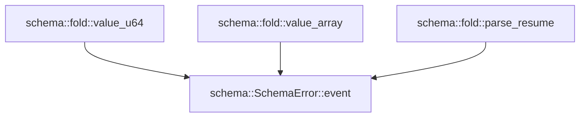

# schema::fold

[Package atlas](index.md) · [Source](../../src/fold.rs)

## Declarations

Visibility is the declaration spelling; trait members and reexports require their enclosing interface. `cfg` is not evaluated.

| Symbol | Kind | Visibility | Test / cfg |
|---|---|---|---|
| [schema::fold::LedgerProjection](../../src/fold.rs#L10) | struct_item | `pub` |  |
| [schema::fold::RunRange](../../src/fold.rs#L24) | struct_item | `pub` |  |
| [schema::fold::ContinuationFold](../../src/fold.rs#L33) | struct_item | `private` |  |
| [schema::fold::LifecycleFacts](../../src/fold.rs#L38) | struct_item | `pub` |  |
| [schema::fold::LifecycleFacts::durable_wait_until](../../src/fold.rs#L67) | function_item | `pub` |  |
| [schema::fold::InputState](../../src/fold.rs#L79) | struct_item | `private` |  |
| [schema::fold::AttemptStage](../../src/fold.rs#L88) | enum_item | `private` |  |
| [schema::fold::AttemptState](../../src/fold.rs#L96) | struct_item | `private` |  |
| [schema::fold::StopState](../../src/fold.rs#L102) | struct_item | `private` |  |
| [schema::fold::ApprovalState](../../src/fold.rs#L107) | struct_item | `private` |  |
| [schema::fold::LedgerValidator](../../src/fold.rs#L113) | struct_item | `pub` |  |
| [schema::fold::LedgerValidator::default](../../src/fold.rs#L139) | function_item | `private` |  |
| [schema::fold::LedgerValidator::new](../../src/fold.rs#L146) | function_item | `pub` |  |
| [schema::fold::LedgerValidator::push](../../src/fold.rs#L173) | function_item | `pub` |  |
| [schema::fold::LedgerValidator::finish](../../src/fold.rs#L202) | function_item | `pub` |  |
| [schema::fold::LedgerValidator::lifecycle_facts](../../src/fold.rs#L236) | function_item | `private` |  |
| [schema::fold::LedgerValidator::apply_reader_gate](../../src/fold.rs#L367) | function_item | `private` |  |
| [schema::fold::LedgerValidator::validate_backward_references](../../src/fold.rs#L390) | function_item | `private` |  |
| [schema::fold::LedgerValidator::validate_turn_allocation](../../src/fold.rs#L482) | function_item | `private` |  |
| [schema::fold::LedgerValidator::validate_turn_trigger](../../src/fold.rs#L526) | function_item | `private` |  |
| [schema::fold::LedgerValidator::validate_kind_relations](../../src/fold.rs#L632) | function_item | `private` |  |
| [schema::fold::LedgerValidator::open_attempt](../../src/fold.rs#L908) | function_item | `private` |  |
| [schema::fold::LedgerValidator::turn_consumed_input](../../src/fold.rs#L965) | function_item | `private` |  |
| [schema::fold::LedgerValidator::finish_attempt](../../src/fold.rs#L976) | function_item | `private` |  |
| [schema::fold::LedgerValidator::apply_supersedes](../../src/fold.rs#L996) | function_item | `private` |  |
| [schema::fold::LedgerValidator::record_origin](../../src/fold.rs#L1028) | function_item | `private` |  |
| [schema::fold::LedgerValidator::has_open_hold](../../src/fold.rs#L1045) | function_item | `private` |  |
| [schema::fold::validate_ledger](../../src/fold.rs#L1054) | function_item | `pub` |  |
| [schema::fold::trigger_inputs](../../src/fold.rs#L1074) | function_item | `private` |  |
| [schema::fold::value_str](../../src/fold.rs#L1095) | function_item | `private` |  |
| [schema::fold::value_u64](../../src/fold.rs#L1106) | function_item | `private` |  |
| [schema::fold::value_array](../../src/fold.rs#L1113) | function_item | `private` |  |
| [schema::fold::parse_resume](../../src/fold.rs#L1125) | function_item | `private` |  |

## Imports / reexports

| Local name | Source path | Visibility |
|---|---|---|
| `BTreeMap` | `std::collections::BTreeMap` | `private` |
| `BTreeSet` | `std::collections::BTreeSet` | `private` |
| `HashMap` | `std::collections::HashMap` | `private` |
| `HashSet` | `std::collections::HashSet` | `private` |
| `Map` | `serde_json::Map` | `private` |
| `Value` | `serde_json::Value` | `private` |
| `ranges` | `crate::event::ranges` | `private` |
| `Event` | `crate::Event` | `private` |
| `EventKind` | `crate::EventKind` | `private` |
| `SchemaError` | `crate::SchemaError` | `private` |
| `Visibility` | `crate::Visibility` | `private` |
| `OriginTuple` | `crate::OriginTuple` | `private` |
| `ResumePolicy` | `crate::ResumePolicy` | `private` |

## Module declarations

| Module | Visibility | Attributes |
|---|---|---|

## Function call graphs

Edges below are syntactically resolved calls only, including private functions. Graphs partition callers into groups of 20; they are not execution order. All unresolved sites are listed below and in the JSON inventory.

```mermaid
flowchart TD
  n0["schema::event::ranges"]
  n1["schema::event::Event::decode_canonical"]
  n2["schema::fold::LedgerValidator::record_origin"]
  n3["schema::fold::LedgerValidator::has_open_hold"]
  n4["schema::fold::validate_ledger"]
  n5["schema::fold::trigger_inputs"]
  n6["schema::fold::value_str"]
  n7["schema::fold::value_u64"]
  n8["schema::fold::value_array"]
  n9["schema::fold::parse_resume"]
  n10["schema::fold::LedgerValidator::default"]
  n11["schema::fold::LedgerValidator::new"]
  n12["schema::fold::LedgerValidator::push"]
  n13["schema::fold::LedgerValidator::finish"]
  n14["schema::fold::LedgerValidator::lifecycle_facts"]
  n15["schema::fold::LedgerValidator::apply_reader_gate"]
  n16["schema::fold::LedgerValidator::validate_backward_references"]
  n17["schema::fold::LedgerValidator::validate_turn_allocation"]
  n18["schema::fold::LedgerValidator::validate_turn_trigger"]
  n19["schema::fold::LedgerValidator::validate_kind_relations"]
  n20["schema::fold::LifecycleFacts::durable_wait_until"]
  n21["schema::fold::LedgerValidator::open_attempt"]
  n22["schema::fold::LedgerValidator::turn_consumed_input"]
  n23["schema::fold::LedgerValidator::finish_attempt"]
  n24["schema::fold::LedgerValidator::apply_supersedes"]
  n25["schema::SchemaError::event"]
  n26["schema::SchemaError::constraint"]
  n2 --> n25
  n4 --> n1
  n4 --> n11
  n4 --> n25
  n5 --> n8
  n5 --> n25
  n6 --> n25
  n12 --> n2
  n12 --> n15
  n12 --> n16
  n12 --> n17
  n12 --> n19
  n12 --> n24
  n12 --> n25
  n13 --> n14
  n15 --> n7
  n15 --> n9
  n16 --> n0
  n16 --> n5
  n16 --> n6
  n16 --> n7
  n16 --> n8
  n16 --> n26
  n17 --> n18
  n17 --> n26
  n18 --> n3
  n18 --> n5
  n18 --> n26
  n19 --> n0
  n19 --> n3
  n19 --> n6
  n19 --> n7
  n19 --> n21
  n19 --> n23
  n19 --> n26
  n21 --> n0
  n21 --> n6
  n21 --> n22
  n21 --> n26
  n22 --> n5
  n23 --> n6
  n23 --> n26
  n24 --> n0
  n24 --> n26
```

Functions 1–20: 44 direct edges

Functions 21–23: 3 direct edges

## Call sites

Includes test functions (marked in declarations). Receiver-type-required sites need type analysis/manual tracing. Calls in closures are attributed to their enclosing function; their occurrence here does not mean the closure executes immediately.

| Caller | Callee expression | Source lines | Target / classification |
|---|---|---|---|
| `durable_wait_until` | `[             self.continuation_wait_until.as_deref(),             self.admission_wait_until.as_deref(),         ]         .into_iter()         .flatten()         .max` | [68](../../src/fold.rs#L68) | receiver-type-required |
| `durable_wait_until` | `[             self.continuation_wait_until.as_deref(),             self.admission_wait_until.as_deref(),         ]         .into_iter()         .flatten` | [68](../../src/fold.rs#L68) | receiver-type-required |
| `durable_wait_until` | `[             self.continuation_wait_until.as_deref(),             self.admission_wait_until.as_deref(),         ]         .into_iter` | [68](../../src/fold.rs#L68) | receiver-type-required |
| `durable_wait_until` | `self.continuation_wait_until.as_deref` | [69](../../src/fold.rs#L69) | receiver-type-required |
| `durable_wait_until` | `self.admission_wait_until.as_deref` | [70](../../src/fold.rs#L70) | receiver-type-required |
| `default` | `Self::new` | [140](../../src/fold.rs#L140) | external-constructor-callback-or-unresolved |
| `new` | `Vec::new` | [149](../../src/fold.rs#L149) | external-constructor-callback-or-unresolved |
| `new` | `BTreeMap::new` | [150](../../src/fold.rs#L150), [166](../../src/fold.rs#L166), [167](../../src/fold.rs#L167) | external-constructor-callback-or-unresolved |
| `new` | `HashMap::new` | [151](../../src/fold.rs#L151), [152](../../src/fold.rs#L152), [153](../../src/fold.rs#L153), [154](../../src/fold.rs#L154), [156](../../src/fold.rs#L156), [157](../../src/fold.rs#L157), [159](../../src/fold.rs#L159) | external-constructor-callback-or-unresolved |
| `new` | `HashSet::new` | [155](../../src/fold.rs#L155), [161](../../src/fold.rs#L161) | external-constructor-callback-or-unresolved |
| `push` | `event.seq` | [174](../../src/fold.rs#L174) | receiver-type-required |
| `push` | `self.events.len` | [175](../../src/fold.rs#L175) | receiver-type-required |
| `push` | `Err` | [177](../../src/fold.rs#L177), [183](../../src/fold.rs#L183), [186](../../src/fold.rs#L186) | external-constructor-callback-or-unresolved |
| `push` | `SchemaError::event` | [177](../../src/fold.rs#L177), [183](../../src/fold.rs#L183), [186](../../src/fold.rs#L186) | [schema::SchemaError::event](../../src/lib.rs#L28) |
| `push` | `Some` | [178](../../src/fold.rs#L178), [183](../../src/fold.rs#L183), [187](../../src/fold.rs#L187) | external-constructor-callback-or-unresolved |
| `push` | `self.apply_reader_gate` | [192](../../src/fold.rs#L192) | [schema::fold::LedgerValidator::apply_reader_gate](../../src/fold.rs#L367) |
| `push` | `self.validate_backward_references` | [193](../../src/fold.rs#L193) | [schema::fold::LedgerValidator::validate_backward_references](../../src/fold.rs#L390) |
| `push` | `self.validate_turn_allocation` | [194](../../src/fold.rs#L194) | [schema::fold::LedgerValidator::validate_turn_allocation](../../src/fold.rs#L482) |
| `push` | `self.validate_kind_relations` | [195](../../src/fold.rs#L195) | [schema::fold::LedgerValidator::validate_kind_relations](../../src/fold.rs#L632) |
| `push` | `self.apply_supersedes` | [196](../../src/fold.rs#L196) | [schema::fold::LedgerValidator::apply_supersedes](../../src/fold.rs#L996) |
| `push` | `self.record_origin` | [197](../../src/fold.rs#L197) | [schema::fold::LedgerValidator::record_origin](../../src/fold.rs#L1028) |
| `push` | `self.events.push` | [198](../../src/fold.rs#L198) | receiver-type-required |
| `push` | `Ok` | [199](../../src/fold.rs#L199) | external-constructor-callback-or-unresolved |
| `finish` | `self.lifecycle_facts` | [203](../../src/fold.rs#L203) | [schema::fold::LedgerValidator::lifecycle_facts](../../src/fold.rs#L236) |
| `finish` | `Vec::<RunRange>::new` | [204](../../src/fold.rs#L204) | external-constructor-callback-or-unresolved |
| `finish` | `run_ranges.last_mut` | [207](../../src/fold.rs#L207) | receiver-type-required |
| `finish` | `event.seq` | [208](../../src/fold.rs#L208), [215](../../src/fold.rs#L215), [216](../../src/fold.rs#L216) | receiver-type-required |
| `finish` | `run_ranges.push` | [210](../../src/fold.rs#L210) | receiver-type-required |
| `finish` | `event                         .string_field("run")                         .expect("validated run_start has run")                         .to_owned` | [211](../../src/fold.rs#L211) | receiver-type-required |
| `finish` | `event                         .string_field("run")                         .expect` | [211](../../src/fold.rs#L211) | receiver-type-required |
| `finish` | `event                         .string_field` | [211](../../src/fold.rs#L211) | receiver-type-required |
| `finish` | `self.events.last().map_or` | [216](../../src/fold.rs#L216), [221](../../src/fold.rs#L221) | receiver-type-required |
| `finish` | `self.events.last` | [216](../../src/fold.rs#L216), [221](../../src/fold.rs#L221) | receiver-type-required |
| `finish` | `Ok` | [220](../../src/fold.rs#L220) | external-constructor-callback-or-unresolved |
| `finish` | `self                 .latest_turn                 .is_some_and` | [223](../../src/fold.rs#L223) | receiver-type-required |
| `finish` | `self.settled_turns.contains` | [225](../../src/fold.rs#L225) | receiver-type-required |
| `lifecycle_facts` | `self             .latest_turn             .is_some_and` | [237](../../src/fold.rs#L237) | receiver-type-required |
| `lifecycle_facts` | `self.settled_turns.contains` | [239](../../src/fold.rs#L239) | receiver-type-required |
| `lifecycle_facts` | `self             .approvals             .iter()             .filter(&#124;(call, _)&#124; !self.tool_results.contains_key(*call))             .max_by_key(&#124;(_, state)&#124; state.seq)             .map` | [240](../../src/fold.rs#L240) | receiver-type-required |
| `lifecycle_facts` | `self             .approvals             .iter()             .filter(&#124;(call, _)&#124; !self.tool_results.contains_key(*call))             .max_by_key` | [240](../../src/fold.rs#L240) | receiver-type-required |
| `lifecycle_facts` | `self             .approvals             .iter()             .filter` | [240](../../src/fold.rs#L240) | receiver-type-required |
| `lifecycle_facts` | `self             .approvals             .iter` | [240](../../src/fold.rs#L240) | receiver-type-required |
| `lifecycle_facts` | `self.tool_results.contains_key` | [243](../../src/fold.rs#L243), [317](../../src/fold.rs#L317), [330](../../src/fold.rs#L330), [343](../../src/fold.rs#L343) | receiver-type-required |
| `lifecycle_facts` | `latest_hold.is_some_and` | [246](../../src/fold.rs#L246), [247](../../src/fold.rs#L247) | receiver-type-required |
| `lifecycle_facts` | `self             .latest_stop             .as_ref()             .is_some_and` | [248](../../src/fold.rs#L248) | receiver-type-required |
| `lifecycle_facts` | `self             .latest_stop             .as_ref` | [248](../../src/fold.rs#L248), [252](../../src/fold.rs#L252) | receiver-type-required |
| `lifecycle_facts` | `stop.closure_point.is_none` | [251](../../src/fold.rs#L251) | receiver-type-required |
| `lifecycle_facts` | `self             .latest_stop             .as_ref()             .and_then` | [252](../../src/fold.rs#L252) | receiver-type-required |
| `lifecycle_facts` | `Vec::new` | [257](../../src/fold.rs#L257) | external-constructor-callback-or-unresolved |
| `lifecycle_facts` | `self.inputs                 .iter()                 .filter_map(&#124;(seq, input)&#124; {                     (!input.steer                         && !input.consumed                         && !input.superseded                         && (!input.queued_behind_hold &#124;&#124; terminal_tail)                         && closure_point.is_none_or(&#124;closure&#124; *seq > closure))                     .then_some(*seq)                 })                 .collect` | [259](../../src/fold.rs#L259) | receiver-type-required |
| `lifecycle_facts` | `self.inputs                 .iter()                 .filter_map` | [259](../../src/fold.rs#L259), [272](../../src/fold.rs#L272) | receiver-type-required |
| `lifecycle_facts` | `self.inputs                 .iter` | [259](../../src/fold.rs#L259), [272](../../src/fold.rs#L272) | receiver-type-required |
| `lifecycle_facts` | `(!input.steer                         && !input.consumed                         && !input.superseded                         && (!input.queued_behind_hold &#124;&#124; terminal_tail)                         && closure_point.is_none_or(&#124;closure&#124; *seq > closure))                     .then_some` | [262](../../src/fold.rs#L262) | receiver-type-required |
| `lifecycle_facts` | `closure_point.is_none_or` | [266](../../src/fold.rs#L266) | receiver-type-required |
| `lifecycle_facts` | `runnable_inputs.last().map_or_else` | [271](../../src/fold.rs#L271) | receiver-type-required |
| `lifecycle_facts` | `runnable_inputs.last` | [271](../../src/fold.rs#L271) | receiver-type-required |
| `lifecycle_facts` | `self.inputs                 .iter()                 .filter_map(&#124;(seq, input)&#124; {                     (*seq <= *maximum && !input.steer && !input.consumed && !input.superseded)                         .then_some(*seq)                 })                 .collect` | [272](../../src/fold.rs#L272) | receiver-type-required |
| `lifecycle_facts` | `(*seq <= *maximum && !input.steer && !input.consumed && !input.superseded)                         .then_some` | [275](../../src/fold.rs#L275) | receiver-type-required |
| `lifecycle_facts` | `self             .inputs             .iter()             .filter_map(&#124;(seq, input)&#124; (!input.consumed && !input.superseded).then_some(*seq))             .collect` | [280](../../src/fold.rs#L280) | receiver-type-required |
| `lifecycle_facts` | `self             .inputs             .iter()             .filter_map` | [280](../../src/fold.rs#L280) | receiver-type-required |
| `lifecycle_facts` | `self             .inputs             .iter` | [280](../../src/fold.rs#L280) | receiver-type-required |
| `lifecycle_facts` | `(!input.consumed && !input.superseded).then_some` | [283](../../src/fold.rs#L283) | receiver-type-required |
| `lifecycle_facts` | `self             .attempts             .values()             .any` | [285](../../src/fold.rs#L285) | receiver-type-required |
| `lifecycle_facts` | `self             .attempts             .values` | [285](../../src/fold.rs#L285) | receiver-type-required |
| `lifecycle_facts` | `self                 .events                 .iter()                 .filter(&#124;e&#124; e.kind() == &EventKind::ToolCall)                 .filter_map(&#124;e&#124; e.string_field("call").map(&#124;id&#124; (id, e)))                 .collect` | [295](../../src/fold.rs#L295) | receiver-type-required |
| `lifecycle_facts` | `self                 .events                 .iter()                 .filter(&#124;e&#124; e.kind() == &EventKind::ToolCall)                 .filter_map` | [295](../../src/fold.rs#L295) | receiver-type-required |
| `lifecycle_facts` | `self                 .events                 .iter()                 .filter` | [295](../../src/fold.rs#L295), [301](../../src/fold.rs#L301) | receiver-type-required |
| `lifecycle_facts` | `self                 .events                 .iter` | [295](../../src/fold.rs#L295), [301](../../src/fold.rs#L301) | receiver-type-required |
| `lifecycle_facts` | `e.kind` | [298](../../src/fold.rs#L298), [304](../../src/fold.rs#L304) | receiver-type-required |
| `lifecycle_facts` | `e.string_field("call").map` | [299](../../src/fold.rs#L299) | receiver-type-required |
| `lifecycle_facts` | `e.string_field` | [299](../../src/fold.rs#L299), [305](../../src/fold.rs#L305) | receiver-type-required |
| `lifecycle_facts` | `self                 .events                 .iter()                 .filter(&#124;e&#124; e.kind() == &EventKind::ToolExecutionStarted)                 .filter_map(&#124;e&#124; e.string_field("call"))                 .collect` | [301](../../src/fold.rs#L301) | receiver-type-required |
| `lifecycle_facts` | `self                 .events                 .iter()                 .filter(&#124;e&#124; e.kind() == &EventKind::ToolExecutionStarted)                 .filter_map` | [301](../../src/fold.rs#L301) | receiver-type-required |
| `lifecycle_facts` | `calls                 .iter()                 .filter_map(&#124;(id, event)&#124; {                     let tracked = event                         .object()                         .get("execution_tracked")                         .and_then(Value::as_bool)                         == Some(true);                     let behind_hold = self.approvals.iter().any(&#124;(held, approval)&#124; {                         !approval.answered                             && !self.tool_results.contains_key(held)                             && calls.get(held.as_str()).is_some_and(&#124;head&#124; {                                 head.seq() < event.seq()                                     && head.string_field("attempt") == event.string_field("attempt")                             })                     });                     (tracked && !started.contains(id) && behind_hold).then_some(*id)                 })                 .collect::<HashSet<_>>` | [307](../../src/fold.rs#L307) | receiver-type-required |
| `lifecycle_facts` | `calls                 .iter()                 .filter_map` | [307](../../src/fold.rs#L307) | receiver-type-required |
| `lifecycle_facts` | `calls                 .iter` | [307](../../src/fold.rs#L307) | receiver-type-required |
| `lifecycle_facts` | `event                         .object()                         .get("execution_tracked")                         .and_then` | [310](../../src/fold.rs#L310) | receiver-type-required |
| `lifecycle_facts` | `event                         .object()                         .get` | [310](../../src/fold.rs#L310) | receiver-type-required |
| `lifecycle_facts` | `event                         .object` | [310](../../src/fold.rs#L310) | receiver-type-required |
| `lifecycle_facts` | `Some` | [314](../../src/fold.rs#L314) | external-constructor-callback-or-unresolved |
| `lifecycle_facts` | `self.approvals.iter().any` | [315](../../src/fold.rs#L315) | receiver-type-required |
| `lifecycle_facts` | `self.approvals.iter` | [315](../../src/fold.rs#L315) | receiver-type-required |
| `lifecycle_facts` | `calls.get(held.as_str()).is_some_and` | [318](../../src/fold.rs#L318) | receiver-type-required |
| `lifecycle_facts` | `calls.get` | [318](../../src/fold.rs#L318) | receiver-type-required |
| `lifecycle_facts` | `held.as_str` | [318](../../src/fold.rs#L318) | receiver-type-required |
| `lifecycle_facts` | `head.seq` | [319](../../src/fold.rs#L319) | receiver-type-required |
| `lifecycle_facts` | `event.seq` | [319](../../src/fold.rs#L319) | receiver-type-required |
| `lifecycle_facts` | `head.string_field` | [320](../../src/fold.rs#L320) | receiver-type-required |
| `lifecycle_facts` | `event.string_field` | [320](../../src/fold.rs#L320) | receiver-type-required |
| `lifecycle_facts` | `(tracked && !started.contains(id) && behind_hold).then_some` | [323](../../src/fold.rs#L323) | receiver-type-required |
| `lifecycle_facts` | `started.contains` | [323](../../src/fold.rs#L323) | receiver-type-required |
| `lifecycle_facts` | `HashSet::new` | [327](../../src/fold.rs#L327) | external-constructor-callback-or-unresolved |
| `lifecycle_facts` | `self.tool_calls.keys().any` | [329](../../src/fold.rs#L329) | receiver-type-required |
| `lifecycle_facts` | `self.tool_calls.keys` | [329](../../src/fold.rs#L329) | receiver-type-required |
| `lifecycle_facts` | `self.approvals.contains_key` | [331](../../src/fold.rs#L331), [344](../../src/fold.rs#L344) | receiver-type-required |
| `lifecycle_facts` | `waiting_siblings.contains` | [332](../../src/fold.rs#L332) | receiver-type-required |
| `lifecycle_facts` | `call.as_str` | [332](../../src/fold.rs#L332) | receiver-type-required |
| `lifecycle_facts` | `self             .spawns             .keys()             .any` | [334](../../src/fold.rs#L334) | receiver-type-required |
| `lifecycle_facts` | `self             .spawns             .keys` | [334](../../src/fold.rs#L334) | receiver-type-required |
| `lifecycle_facts` | `self.child_results.contains` | [337](../../src/fold.rs#L337) | receiver-type-required |
| `lifecycle_facts` | `self             .continuations             .iter()             .filter(&#124;(call, _)&#124; {                 self.tool_calls.contains_key(*call)                     && !self.tool_results.contains_key(*call)                     && !self.approvals.contains_key(*call)             })             .filter_map(&#124;(_, fold)&#124; fold.poll_after.clone())             .max` | [338](../../src/fold.rs#L338) | receiver-type-required |
| `lifecycle_facts` | `self             .continuations             .iter()             .filter(&#124;(call, _)&#124; {                 self.tool_calls.contains_key(*call)                     && !self.tool_results.contains_key(*call)                     && !self.approvals.contains_key(*call)             })             .filter_map` | [338](../../src/fold.rs#L338) | receiver-type-required |
| `lifecycle_facts` | `self             .continuations             .iter()             .filter` | [338](../../src/fold.rs#L338) | receiver-type-required |
| `lifecycle_facts` | `self             .continuations             .iter` | [338](../../src/fold.rs#L338) | receiver-type-required |
| `lifecycle_facts` | `self.tool_calls.contains_key` | [342](../../src/fold.rs#L342) | receiver-type-required |
| `lifecycle_facts` | `fold.poll_after.clone` | [346](../../src/fold.rs#L346) | receiver-type-required |
| `lifecycle_facts` | `self.latest_turn.is_none` | [358](../../src/fold.rs#L358) | receiver-type-required |
| `lifecycle_facts` | `self.admission_wait.clone` | [363](../../src/fold.rs#L363) | receiver-type-required |
| `apply_reader_gate` | `event.object` | [368](../../src/fold.rs#L368) | receiver-type-required |
| `apply_reader_gate` | `value_u64` | [370](../../src/fold.rs#L370), [381](../../src/fold.rs#L381) | [schema::fold::value_u64](../../src/fold.rs#L1106) |
| `apply_reader_gate` | `event.seq` | [370](../../src/fold.rs#L370), [372](../../src/fold.rs#L372), [381](../../src/fold.rs#L381) | receiver-type-required |
| `apply_reader_gate` | `object.contains_key` | [371](../../src/fold.rs#L371) | receiver-type-required |
| `apply_reader_gate` | `parse_resume` | [372](../../src/fold.rs#L372) | [schema::fold::parse_resume](../../src/fold.rs#L1125) |
| `apply_reader_gate` | `object.get` | [372](../../src/fold.rs#L372), [378](../../src/fold.rs#L378) | receiver-type-required |
| `apply_reader_gate` | `event.min_reader` | [374](../../src/fold.rs#L374) | receiver-type-required |
| `apply_reader_gate` | `self.required_reader.max` | [375](../../src/fold.rs#L375) | receiver-type-required |
| `apply_reader_gate` | `object.get("upgrade").and_then` | [378](../../src/fold.rs#L378) | receiver-type-required |
| `apply_reader_gate` | `self.required_reader                         .max` | [380](../../src/fold.rs#L380) | receiver-type-required |
| `apply_reader_gate` | `Ok` | [387](../../src/fold.rs#L387) | external-constructor-callback-or-unresolved |
| `validate_backward_references` | `event.seq` | [391](../../src/fold.rs#L391) | receiver-type-required |
| `validate_backward_references` | `event.object` | [392](../../src/fold.rs#L392) | receiver-type-required |
| `validate_backward_references` | `object.contains_key` | [394](../../src/fold.rs#L394) | receiver-type-required |
| `validate_backward_references` | `ranges` | [395](../../src/fold.rs#L395), [408](../../src/fold.rs#L408), [441](../../src/fold.rs#L441) | [schema::event::ranges](../../src/event.rs#L1435) |
| `validate_backward_references` | `Err` | [397](../../src/fold.rs#L397), [410](../../src/fold.rs#L410), [421](../../src/fold.rs#L421), [435](../../src/fold.rs#L435), [443](../../src/fold.rs#L443), [456](../../src/fold.rs#L456), [469](../../src/fold.rs#L469) | external-constructor-callback-or-unresolved |
| `validate_backward_references` | `SchemaError::constraint` | [397](../../src/fold.rs#L397), [410](../../src/fold.rs#L410), [421](../../src/fold.rs#L421), [435](../../src/fold.rs#L435), [443](../../src/fold.rs#L443), [456](../../src/fold.rs#L456), [469](../../src/fold.rs#L469) | [schema::SchemaError::constraint](../../src/lib.rs#L35) |
| `validate_backward_references` | `event.kind` | [406](../../src/fold.rs#L406) | receiver-type-required |
| `validate_backward_references` | `value_u64` | [419](../../src/fold.rs#L419) | [schema::fold::value_u64](../../src/fold.rs#L1106) |
| `validate_backward_references` | `value_str` | [429](../../src/fold.rs#L429) | [schema::fold::value_str](../../src/fold.rs#L1095) |
| `validate_backward_references` | `self                     .epochs                     .get(epoch)                     .is_none_or` | [430](../../src/fold.rs#L430) | receiver-type-required |
| `validate_backward_references` | `self                     .epochs                     .get` | [430](../../src/fold.rs#L430) | receiver-type-required |
| `validate_backward_references` | `object.get("pending").and_then` | [452](../../src/fold.rs#L452) | receiver-type-required |
| `validate_backward_references` | `object.get` | [452](../../src/fold.rs#L452) | receiver-type-required |
| `validate_backward_references` | `value_array` | [454](../../src/fold.rs#L454) | [schema::fold::value_array](../../src/fold.rs#L1113) |
| `validate_backward_references` | `reference.as_u64().is_none_or` | [455](../../src/fold.rs#L455) | receiver-type-required |
| `validate_backward_references` | `reference.as_u64` | [455](../../src/fold.rs#L455) | receiver-type-required |
| `validate_backward_references` | `trigger_inputs` | [467](../../src/fold.rs#L467) | [schema::fold::trigger_inputs](../../src/fold.rs#L1074) |
| `validate_backward_references` | `inputs.iter().any` | [468](../../src/fold.rs#L468) | receiver-type-required |
| `validate_backward_references` | `inputs.iter` | [468](../../src/fold.rs#L468) | receiver-type-required |
| `validate_backward_references` | `Ok` | [479](../../src/fold.rs#L479) | external-constructor-callback-or-unresolved |
| `validate_turn_allocation` | `event.seq` | [483](../../src/fold.rs#L483) | receiver-type-required |
| `validate_turn_allocation` | `event.turn` | [484](../../src/fold.rs#L484) | receiver-type-required |
| `validate_turn_allocation` | `Ok` | [485](../../src/fold.rs#L485), [507](../../src/fold.rs#L507), [523](../../src/fold.rs#L523) | external-constructor-callback-or-unresolved |
| `validate_turn_allocation` | `self.latest_turn.map_or` | [488](../../src/fold.rs#L488) | receiver-type-required |
| `validate_turn_allocation` | `Err` | [490](../../src/fold.rs#L490), [498](../../src/fold.rs#L498), [510](../../src/fold.rs#L510), [517](../../src/fold.rs#L517) | external-constructor-callback-or-unresolved |
| `validate_turn_allocation` | `SchemaError::constraint` | [490](../../src/fold.rs#L490), [498](../../src/fold.rs#L498), [510](../../src/fold.rs#L510), [517](../../src/fold.rs#L517) | [schema::SchemaError::constraint](../../src/lib.rs#L35) |
| `validate_turn_allocation` | `self.settled_turns.contains` | [497](../../src/fold.rs#L497), [516](../../src/fold.rs#L516) | receiver-type-required |
| `validate_turn_allocation` | `self.validate_turn_trigger` | [505](../../src/fold.rs#L505) | [schema::fold::LedgerValidator::validate_turn_trigger](../../src/fold.rs#L526) |
| `validate_turn_allocation` | `Some` | [506](../../src/fold.rs#L506), [509](../../src/fold.rs#L509) | external-constructor-callback-or-unresolved |
| `validate_turn_trigger` | `event.seq` | [527](../../src/fold.rs#L527) | receiver-type-required |
| `validate_turn_trigger` | `event.turn().expect` | [528](../../src/fold.rs#L528) | receiver-type-required |
| `validate_turn_trigger` | `event.turn` | [528](../../src/fold.rs#L528) | receiver-type-required |
| `validate_turn_trigger` | `event.object` | [529](../../src/fold.rs#L529) | receiver-type-required |
| `validate_turn_trigger` | `object.get("trigger").expect` | [530](../../src/fold.rs#L530) | receiver-type-required |
| `validate_turn_trigger` | `object.get` | [530](../../src/fold.rs#L530) | receiver-type-required |
| `validate_turn_trigger` | `trigger.as_str` | [531](../../src/fold.rs#L531) | receiver-type-required |
| `validate_turn_trigger` | `Some` | [531](../../src/fold.rs#L531) | external-constructor-callback-or-unresolved |
| `validate_turn_trigger` | `Err` | [533](../../src/fold.rs#L533), [555](../../src/fold.rs#L555), [572](../../src/fold.rs#L572), [584](../../src/fold.rs#L584), [591](../../src/fold.rs#L591), [607](../../src/fold.rs#L607), [616](../../src/fold.rs#L616) | external-constructor-callback-or-unresolved |
| `validate_turn_trigger` | `SchemaError::constraint` | [533](../../src/fold.rs#L533), [555](../../src/fold.rs#L555), [572](../../src/fold.rs#L572), [584](../../src/fold.rs#L584), [591](../../src/fold.rs#L591), [600](../../src/fold.rs#L600), [607](../../src/fold.rs#L607), [616](../../src/fold.rs#L616) | [schema::SchemaError::constraint](../../src/lib.rs#L35) |
| `validate_turn_trigger` | `Ok` | [539](../../src/fold.rs#L539), [561](../../src/fold.rs#L561), [629](../../src/fold.rs#L629) | external-constructor-callback-or-unresolved |
| `validate_turn_trigger` | `trigger.get("goal").is_some` | [541](../../src/fold.rs#L541) | receiver-type-required |
| `validate_turn_trigger` | `trigger.get` | [541](../../src/fold.rs#L541) | receiver-type-required |
| `validate_turn_trigger` | `self.settled_turns.contains` | [544](../../src/fold.rs#L544) | receiver-type-required |
| `validate_turn_trigger` | `self                     .latest_stop                     .as_ref()                     .is_some_and` | [545](../../src/fold.rs#L545) | receiver-type-required |
| `validate_turn_trigger` | `self                     .latest_stop                     .as_ref` | [545](../../src/fold.rs#L545) | receiver-type-required |
| `validate_turn_trigger` | `stop.closure_point.is_none` | [548](../../src/fold.rs#L548), [570](../../src/fold.rs#L570) | receiver-type-required |
| `validate_turn_trigger` | `self.has_open_hold` | [549](../../src/fold.rs#L549), [590](../../src/fold.rs#L590) | [schema::fold::LedgerValidator::has_open_hold](../../src/fold.rs#L1045) |
| `validate_turn_trigger` | `self                     .inputs                     .values()                     .any` | [550](../../src/fold.rs#L550) | receiver-type-required |
| `validate_turn_trigger` | `self                     .inputs                     .values` | [550](../../src/fold.rs#L550) | receiver-type-required |
| `validate_turn_trigger` | `trigger_inputs(object, seq)?.expect` | [563](../../src/fold.rs#L563) | receiver-type-required |
| `validate_turn_trigger` | `trigger_inputs` | [563](../../src/fold.rs#L563) | [schema::fold::trigger_inputs](../../src/fold.rs#L1074) |
| `validate_turn_trigger` | `inputs             .last()             .expect` | [564](../../src/fold.rs#L564) | receiver-type-required |
| `validate_turn_trigger` | `inputs             .last` | [564](../../src/fold.rs#L564) | receiver-type-required |
| `validate_turn_trigger` | `self             .latest_stop             .as_ref()             .is_some_and` | [567](../../src/fold.rs#L567) | receiver-type-required |
| `validate_turn_trigger` | `self             .latest_stop             .as_ref` | [567](../../src/fold.rs#L567), [578](../../src/fold.rs#L578) | receiver-type-required |
| `validate_turn_trigger` | `self             .latest_stop             .as_ref()             .and_then(&#124;stop&#124; stop.closure_point)             .is_some_and` | [578](../../src/fold.rs#L578) | receiver-type-required |
| `validate_turn_trigger` | `self             .latest_stop             .as_ref()             .and_then` | [578](../../src/fold.rs#L578) | receiver-type-required |
| `validate_turn_trigger` | `inputs.iter().copied().collect` | [597](../../src/fold.rs#L597) | receiver-type-required |
| `validate_turn_trigger` | `inputs.iter().copied` | [597](../../src/fold.rs#L597) | receiver-type-required |
| `validate_turn_trigger` | `inputs.iter` | [597](../../src/fold.rs#L597) | receiver-type-required |
| `validate_turn_trigger` | `self.inputs.get(input_seq).ok_or_else` | [599](../../src/fold.rs#L599) | receiver-type-required |
| `validate_turn_trigger` | `self.inputs.get` | [599](../../src/fold.rs#L599) | receiver-type-required |
| `validate_turn_trigger` | `self.inputs.range` | [614](../../src/fold.rs#L614) | receiver-type-required |
| `validate_turn_trigger` | `named.contains` | [615](../../src/fold.rs#L615) | receiver-type-required |
| `validate_turn_trigger` | `self.inputs                 .get_mut(&input_seq)                 .expect` | [624](../../src/fold.rs#L624) | receiver-type-required |
| `validate_turn_trigger` | `self.inputs                 .get_mut` | [624](../../src/fold.rs#L624) | receiver-type-required |
| `validate_kind_relations` | `event.seq` | [633](../../src/fold.rs#L633) | receiver-type-required |
| `validate_kind_relations` | `event.object` | [634](../../src/fold.rs#L634), [744](../../src/fold.rs#L744) | receiver-type-required |
| `validate_kind_relations` | `event.kind` | [635](../../src/fold.rs#L635), [740](../../src/fold.rs#L740) | receiver-type-required |
| `validate_kind_relations` | `object                     .get("steer")                     .and_then(Value::as_bool)                     .unwrap_or` | [637](../../src/fold.rs#L637) | receiver-type-required |
| `validate_kind_relations` | `object                     .get("steer")                     .and_then` | [637](../../src/fold.rs#L637) | receiver-type-required |
| `validate_kind_relations` | `object                     .get` | [637](../../src/fold.rs#L637), [800](../../src/fold.rs#L800) | receiver-type-required |
| `validate_kind_relations` | `self.has_open_hold` | [641](../../src/fold.rs#L641) | [schema::fold::LedgerValidator::has_open_hold](../../src/fold.rs#L1045) |
| `validate_kind_relations` | `self.inputs.insert` | [642](../../src/fold.rs#L642) | receiver-type-required |
| `validate_kind_relations` | `steer.then_some(self.latest_turn).flatten` | [646](../../src/fold.rs#L646) | receiver-type-required |
| `validate_kind_relations` | `steer.then_some` | [646](../../src/fold.rs#L646) | receiver-type-required |
| `validate_kind_relations` | `value_str(object, "id", seq)?.to_owned` | [654](../../src/fold.rs#L654) | receiver-type-required |
| `validate_kind_relations` | `value_str` | [654](../../src/fold.rs#L654), [664](../../src/fold.rs#L664), [679](../../src/fold.rs#L679), [694](../../src/fold.rs#L694), [710](../../src/fold.rs#L710), [716](../../src/fold.rs#L716), [755](../../src/fold.rs#L755), [781](../../src/fold.rs#L781), [787](../../src/fold.rs#L787), [824](../../src/fold.rs#L824), [844](../../src/fold.rs#L844), [887](../../src/fold.rs#L887) | [schema::fold::value_str](../../src/fold.rs#L1095) |
| `validate_kind_relations` | `self.epochs.insert(id, seq).is_some` | [655](../../src/fold.rs#L655) | receiver-type-required |
| `validate_kind_relations` | `self.epochs.insert` | [655](../../src/fold.rs#L655) | receiver-type-required |
| `validate_kind_relations` | `Err` | [656](../../src/fold.rs#L656), [670](../../src/fold.rs#L670), [685](../../src/fold.rs#L685), [700](../../src/fold.rs#L700), [712](../../src/fold.rs#L712), [718](../../src/fold.rs#L718), [729](../../src/fold.rs#L729), [747](../../src/fold.rs#L747), [757](../../src/fold.rs#L757), [772](../../src/fold.rs#L772), [783](../../src/fold.rs#L783), [789](../../src/fold.rs#L789), [836](../../src/fold.rs#L836), [849](../../src/fold.rs#L849), [861](../../src/fold.rs#L861), [890](../../src/fold.rs#L890) | external-constructor-callback-or-unresolved |
| `validate_kind_relations` | `SchemaError::constraint` | [656](../../src/fold.rs#L656), [668](../../src/fold.rs#L668), [670](../../src/fold.rs#L670), [683](../../src/fold.rs#L683), [685](../../src/fold.rs#L685), [698](../../src/fold.rs#L698), [700](../../src/fold.rs#L700), [712](../../src/fold.rs#L712), [718](../../src/fold.rs#L718), [729](../../src/fold.rs#L729), [747](../../src/fold.rs#L747), [757](../../src/fold.rs#L757), [772](../../src/fold.rs#L772), [783](../../src/fold.rs#L783), [789](../../src/fold.rs#L789), [836](../../src/fold.rs#L836), [846](../../src/fold.rs#L846), [849](../../src/fold.rs#L849), [861](../../src/fold.rs#L861), [890](../../src/fold.rs#L890) | [schema::SchemaError::constraint](../../src/lib.rs#L35) |
| `validate_kind_relations` | `self.open_attempt` | [661](../../src/fold.rs#L661) | [schema::fold::LedgerValidator::open_attempt](../../src/fold.rs#L908) |
| `validate_kind_relations` | `self                     .attempts                     .get_mut(id)                     .ok_or_else` | [665](../../src/fold.rs#L665), [680](../../src/fold.rs#L680) | receiver-type-required |
| `validate_kind_relations` | `self                     .attempts                     .get_mut` | [665](../../src/fold.rs#L665), [680](../../src/fold.rs#L680) | receiver-type-required |
| `validate_kind_relations` | `self                     .attempts                     .get(id)                     .ok_or_else` | [695](../../src/fold.rs#L695) | receiver-type-required |
| `validate_kind_relations` | `self                     .attempts                     .get` | [695](../../src/fold.rs#L695) | receiver-type-required |
| `validate_kind_relations` | `self.finish_attempt` | [707](../../src/fold.rs#L707), [708](../../src/fold.rs#L708) | [schema::fold::LedgerValidator::finish_attempt](../../src/fold.rs#L976) |
| `validate_kind_relations` | `object.contains_key` | [708](../../src/fold.rs#L708) | receiver-type-required |
| `validate_kind_relations` | `value_str(object, "call", seq)?.to_owned` | [710](../../src/fold.rs#L710), [755](../../src/fold.rs#L755), [781](../../src/fold.rs#L781), [787](../../src/fold.rs#L787), [824](../../src/fold.rs#L824) | receiver-type-required |
| `validate_kind_relations` | `self.tool_calls.insert(call, seq).is_some` | [711](../../src/fold.rs#L711) | receiver-type-required |
| `validate_kind_relations` | `self.tool_calls.insert` | [711](../../src/fold.rs#L711) | receiver-type-required |
| `validate_kind_relations` | `self.tool_calls.contains_key` | [717](../../src/fold.rs#L717), [756](../../src/fold.rs#L756) | receiver-type-required |
| `validate_kind_relations` | `self.tool_results.contains_key` | [717](../../src/fold.rs#L717) | receiver-type-required |
| `validate_kind_relations` | `self                     .approvals                     .get(call)                     .is_some_and` | [724](../../src/fold.rs#L724) | receiver-type-required |
| `validate_kind_relations` | `self                     .approvals                     .get` | [724](../../src/fold.rs#L724) | receiver-type-required |
| `validate_kind_relations` | `self                     .events                     .iter()                     .rev()                     .find(&#124;event&#124; {                         event.kind() == &EventKind::ApprovalResponse                             && event.string_field("call") == Some(call)                     })                     .is_some_and` | [735](../../src/fold.rs#L735) | receiver-type-required |
| `validate_kind_relations` | `self                     .events                     .iter()                     .rev()                     .find` | [735](../../src/fold.rs#L735) | receiver-type-required |
| `validate_kind_relations` | `self                     .events                     .iter()                     .rev` | [735](../../src/fold.rs#L735) | receiver-type-required |
| `validate_kind_relations` | `self                     .events                     .iter` | [735](../../src/fold.rs#L735) | receiver-type-required |
| `validate_kind_relations` | `event.string_field` | [741](../../src/fold.rs#L741) | receiver-type-required |
| `validate_kind_relations` | `Some` | [741](../../src/fold.rs#L741), [744](../../src/fold.rs#L744), [798](../../src/fold.rs#L798), [809](../../src/fold.rs#L809), [869](../../src/fold.rs#L869), [882](../../src/fold.rs#L882), [884](../../src/fold.rs#L884) | external-constructor-callback-or-unresolved |
| `validate_kind_relations` | `event.object().get("grant").and_then` | [744](../../src/fold.rs#L744) | receiver-type-required |
| `validate_kind_relations` | `event.object().get` | [744](../../src/fold.rs#L744) | receiver-type-required |
| `validate_kind_relations` | `self.tool_results.insert` | [763](../../src/fold.rs#L763) | receiver-type-required |
| `validate_kind_relations` | `object                         .contains_key("supersedes")                         .then(&#124;&#124; ranges(object, "supersedes", seq))                         .transpose()?                         .unwrap_or_default()                         .into_iter()                         .any` | [764](../../src/fold.rs#L764) | receiver-type-required |
| `validate_kind_relations` | `object                         .contains_key("supersedes")                         .then(&#124;&#124; ranges(object, "supersedes", seq))                         .transpose()?                         .unwrap_or_default()                         .into_iter` | [764](../../src/fold.rs#L764) | receiver-type-required |
| `validate_kind_relations` | `object                         .contains_key("supersedes")                         .then(&#124;&#124; ranges(object, "supersedes", seq))                         .transpose()?                         .unwrap_or_default` | [764](../../src/fold.rs#L764) | receiver-type-required |
| `validate_kind_relations` | `object                         .contains_key("supersedes")                         .then(&#124;&#124; ranges(object, "supersedes", seq))                         .transpose` | [764](../../src/fold.rs#L764) | receiver-type-required |
| `validate_kind_relations` | `object                         .contains_key("supersedes")                         .then` | [764](../../src/fold.rs#L764) | receiver-type-required |
| `validate_kind_relations` | `object                         .contains_key` | [764](../../src/fold.rs#L764) | receiver-type-required |
| `validate_kind_relations` | `ranges` | [766](../../src/fold.rs#L766) | [schema::event::ranges](../../src/event.rs#L1435) |
| `validate_kind_relations` | `self.spawns.insert(call, seq).is_some` | [782](../../src/fold.rs#L782) | receiver-type-required |
| `validate_kind_relations` | `self.spawns.insert` | [782](../../src/fold.rs#L782) | receiver-type-required |
| `validate_kind_relations` | `self.spawns.contains_key` | [788](../../src/fold.rs#L788) | receiver-type-required |
| `validate_kind_relations` | `self.child_results.insert` | [788](../../src/fold.rs#L788) | receiver-type-required |
| `validate_kind_relations` | `object.get("subkind").and_then` | [797](../../src/fold.rs#L797), [808](../../src/fold.rs#L808) | receiver-type-required |
| `validate_kind_relations` | `object.get` | [797](../../src/fold.rs#L797), [808](../../src/fold.rs#L808), [811](../../src/fold.rs#L811) | receiver-type-required |
| `validate_kind_relations` | `object                     .get("payload")                     .and_then(serde_json::Value::as_object)                     .and_then(&#124;payload&#124; payload.get("next_attempt_at"))                     .and_then(serde_json::Value::as_str)                     .map` | [800](../../src/fold.rs#L800) | receiver-type-required |
| `validate_kind_relations` | `object                     .get("payload")                     .and_then(serde_json::Value::as_object)                     .and_then(&#124;payload&#124; payload.get("next_attempt_at"))                     .and_then` | [800](../../src/fold.rs#L800) | receiver-type-required |
| `validate_kind_relations` | `object                     .get("payload")                     .and_then(serde_json::Value::as_object)                     .and_then` | [800](../../src/fold.rs#L800) | receiver-type-required |
| `validate_kind_relations` | `object                     .get("payload")                     .and_then` | [800](../../src/fold.rs#L800) | receiver-type-required |
| `validate_kind_relations` | `payload.get` | [803](../../src/fold.rs#L803), [813](../../src/fold.rs#L813) | receiver-type-required |
| `validate_kind_relations` | `object.get("payload").and_then` | [811](../../src/fold.rs#L811) | receiver-type-required |
| `validate_kind_relations` | `payload.get("call").and_then` | [813](../../src/fold.rs#L813) | receiver-type-required |
| `validate_kind_relations` | `payload                             .get("poll_after")                             .and_then(serde_json::Value::as_str)                             .map` | [814](../../src/fold.rs#L814) | receiver-type-required |
| `validate_kind_relations` | `payload                             .get("poll_after")                             .and_then` | [814](../../src/fold.rs#L814) | receiver-type-required |
| `validate_kind_relations` | `payload                             .get` | [814](../../src/fold.rs#L814) | receiver-type-required |
| `validate_kind_relations` | `self.continuations                             .insert` | [818](../../src/fold.rs#L818) | receiver-type-required |
| `validate_kind_relations` | `call.to_owned` | [819](../../src/fold.rs#L819) | receiver-type-required |
| `validate_kind_relations` | `self                     .approvals                     .insert(                         call,                         ApprovalState {                             seq,                             answered: false,                         },                     )                     .is_some` | [825](../../src/fold.rs#L825) | receiver-type-required |
| `validate_kind_relations` | `self                     .approvals                     .insert` | [825](../../src/fold.rs#L825) | receiver-type-required |
| `validate_kind_relations` | `self.approvals.get_mut(call).ok_or_else` | [845](../../src/fold.rs#L845) | receiver-type-required |
| `validate_kind_relations` | `self.approvals.get_mut` | [845](../../src/fold.rs#L845) | receiver-type-required |
| `validate_kind_relations` | `event.turn().expect` | [859](../../src/fold.rs#L859) | receiver-type-required |
| `validate_kind_relations` | `event.turn` | [859](../../src/fold.rs#L859) | receiver-type-required |
| `validate_kind_relations` | `self.settled_turns.insert` | [860](../../src/fold.rs#L860) | receiver-type-required |
| `validate_kind_relations` | `self.latest_stop.as_mut` | [867](../../src/fold.rs#L867) | receiver-type-required |
| `validate_kind_relations` | `stop.closure_point.is_none` | [868](../../src/fold.rs#L868) | receiver-type-required |
| `validate_kind_relations` | `self                     .latest_turn                     .is_some_and` | [875](../../src/fold.rs#L875) | receiver-type-required |
| `validate_kind_relations` | `self.settled_turns.contains` | [877](../../src/fold.rs#L877) | receiver-type-required |
| `validate_kind_relations` | `self.latest_turn.is_none` | [878](../../src/fold.rs#L878) | receiver-type-required |
| `validate_kind_relations` | `value_u64` | [888](../../src/fold.rs#L888) | [schema::fold::value_u64](../../src/fold.rs#L1106) |
| `validate_kind_relations` | `Ok` | [905](../../src/fold.rs#L905) | external-constructor-callback-or-unresolved |
| `open_attempt` | `event.seq` | [909](../../src/fold.rs#L909) | receiver-type-required |
| `open_attempt` | `event.object` | [910](../../src/fold.rs#L910) | receiver-type-required |
| `open_attempt` | `value_str(object, "attempt", seq)?.to_owned` | [911](../../src/fold.rs#L911) | receiver-type-required |
| `open_attempt` | `value_str` | [911](../../src/fold.rs#L911) | [schema::fold::value_str](../../src/fold.rs#L1095) |
| `open_attempt` | `self.attempts.contains_key` | [912](../../src/fold.rs#L912) | receiver-type-required |
| `open_attempt` | `Err` | [913](../../src/fold.rs#L913), [929](../../src/fold.rs#L929), [946](../../src/fold.rs#L946) | external-constructor-callback-or-unresolved |
| `open_attempt` | `SchemaError::constraint` | [913](../../src/fold.rs#L913), [919](../../src/fold.rs#L919), [922](../../src/fold.rs#L922), [929](../../src/fold.rs#L929), [946](../../src/fold.rs#L946) | [schema::SchemaError::constraint](../../src/lib.rs#L35) |
| `open_attempt` | `event.turn().expect` | [915](../../src/fold.rs#L915) | receiver-type-required |
| `open_attempt` | `event.turn` | [915](../../src/fold.rs#L915) | receiver-type-required |
| `open_attempt` | `ranges` | [916](../../src/fold.rs#L916) | [schema::event::ranges](../../src/event.rs#L1435) |
| `open_attempt` | `usize::try_from(admitted_seq - 1).map_err` | [918](../../src/fold.rs#L918) | receiver-type-required |
| `open_attempt` | `usize::try_from` | [918](../../src/fold.rs#L918) | external-constructor-callback-or-unresolved |
| `open_attempt` | `self.events.get(admitted_index).ok_or_else` | [921](../../src/fold.rs#L921) | receiver-type-required |
| `open_attempt` | `self.events.get` | [921](../../src/fold.rs#L921) | receiver-type-required |
| `open_attempt` | `admitted.effective_visibility` | [928](../../src/fold.rs#L928) | receiver-type-required |
| `open_attempt` | `self                         .inputs                         .get(&admitted_seq)                         .expect` | [936](../../src/fold.rs#L936) | receiver-type-required |
| `open_attempt` | `self                         .inputs                         .get` | [936](../../src/fold.rs#L936) | receiver-type-required |
| `open_attempt` | `Some` | [941](../../src/fold.rs#L941) | external-constructor-callback-or-unresolved |
| `open_attempt` | `self.turn_consumed_input` | [943](../../src/fold.rs#L943) | [schema::fold::LedgerValidator::turn_consumed_input](../../src/fold.rs#L965) |
| `open_attempt` | `self.attempts.insert` | [955](../../src/fold.rs#L955) | receiver-type-required |
| `open_attempt` | `Ok` | [962](../../src/fold.rs#L962) | external-constructor-callback-or-unresolved |
| `turn_consumed_input` | `self.events.iter().any` | [966](../../src/fold.rs#L966) | receiver-type-required |
| `turn_consumed_input` | `self.events.iter` | [966](../../src/fold.rs#L966) | receiver-type-required |
| `turn_consumed_input` | `event.turn` | [967](../../src/fold.rs#L967) | receiver-type-required |
| `turn_consumed_input` | `Some` | [967](../../src/fold.rs#L967) | external-constructor-callback-or-unresolved |
| `turn_consumed_input` | `trigger_inputs(event.object(), event.seq())                     .ok()                     .flatten()                     .is_some_and` | [969](../../src/fold.rs#L969) | receiver-type-required |
| `turn_consumed_input` | `trigger_inputs(event.object(), event.seq())                     .ok()                     .flatten` | [969](../../src/fold.rs#L969) | receiver-type-required |
| `turn_consumed_input` | `trigger_inputs(event.object(), event.seq())                     .ok` | [969](../../src/fold.rs#L969) | receiver-type-required |
| `turn_consumed_input` | `trigger_inputs` | [969](../../src/fold.rs#L969) | [schema::fold::trigger_inputs](../../src/fold.rs#L1074) |
| `turn_consumed_input` | `event.object` | [969](../../src/fold.rs#L969) | receiver-type-required |
| `turn_consumed_input` | `event.seq` | [969](../../src/fold.rs#L969) | receiver-type-required |
| `turn_consumed_input` | `inputs.contains` | [972](../../src/fold.rs#L972) | receiver-type-required |
| `finish_attempt` | `event.seq` | [977](../../src/fold.rs#L977) | receiver-type-required |
| `finish_attempt` | `value_str` | [978](../../src/fold.rs#L978) | [schema::fold::value_str](../../src/fold.rs#L1095) |
| `finish_attempt` | `event.object` | [978](../../src/fold.rs#L978) | receiver-type-required |
| `finish_attempt` | `self             .attempts             .get_mut(id)             .ok_or_else` | [979](../../src/fold.rs#L979) | receiver-type-required |
| `finish_attempt` | `self             .attempts             .get_mut` | [979](../../src/fold.rs#L979) | receiver-type-required |
| `finish_attempt` | `SchemaError::constraint` | [982](../../src/fold.rs#L982), [986](../../src/fold.rs#L986) | [schema::SchemaError::constraint](../../src/lib.rs#L35) |
| `finish_attempt` | `event.turn().expect` | [983](../../src/fold.rs#L983) | receiver-type-required |
| `finish_attempt` | `event.turn` | [983](../../src/fold.rs#L983) | receiver-type-required |
| `finish_attempt` | `Err` | [986](../../src/fold.rs#L986) | external-constructor-callback-or-unresolved |
| `finish_attempt` | `Ok` | [993](../../src/fold.rs#L993) | external-constructor-callback-or-unresolved |
| `apply_supersedes` | `event.seq` | [997](../../src/fold.rs#L997) | receiver-type-required |
| `apply_supersedes` | `event.object` | [998](../../src/fold.rs#L998) | receiver-type-required |
| `apply_supersedes` | `object.get` | [999](../../src/fold.rs#L999) | receiver-type-required |
| `apply_supersedes` | `Ok` | [1000](../../src/fold.rs#L1000), [1025](../../src/fold.rs#L1025) | external-constructor-callback-or-unresolved |
| `apply_supersedes` | `ranges` | [1002](../../src/fold.rs#L1002) | [schema::event::ranges](../../src/event.rs#L1435) |
| `apply_supersedes` | `self.inputs.get_mut(&target).ok_or_else` | [1005](../../src/fold.rs#L1005) | receiver-type-required |
| `apply_supersedes` | `self.inputs.get_mut` | [1005](../../src/fold.rs#L1005), [1020](../../src/fold.rs#L1020) | receiver-type-required |
| `apply_supersedes` | `SchemaError::constraint` | [1006](../../src/fold.rs#L1006), [1013](../../src/fold.rs#L1013) | [schema::SchemaError::constraint](../../src/lib.rs#L35) |
| `apply_supersedes` | `Err` | [1013](../../src/fold.rs#L1013) | external-constructor-callback-or-unresolved |
| `record_origin` | `event.origin_key` | [1029](../../src/fold.rs#L1029) | receiver-type-required |
| `record_origin` | `Ok` | [1030](../../src/fold.rs#L1030), [1042](../../src/fold.rs#L1042) | external-constructor-callback-or-unresolved |
| `record_origin` | `event.origin_tuple` | [1032](../../src/fold.rs#L1032) | receiver-type-required |
| `record_origin` | `self.origin_tuples.get` | [1033](../../src/fold.rs#L1033) | receiver-type-required |
| `record_origin` | `Err` | [1034](../../src/fold.rs#L1034) | external-constructor-callback-or-unresolved |
| `record_origin` | `SchemaError::event` | [1034](../../src/fold.rs#L1034) | [schema::SchemaError::event](../../src/lib.rs#L28) |
| `record_origin` | `Some` | [1035](../../src/fold.rs#L1035) | external-constructor-callback-or-unresolved |
| `record_origin` | `event.seq` | [1035](../../src/fold.rs#L1035), [1039](../../src/fold.rs#L1039), [1041](../../src/fold.rs#L1041) | receiver-type-required |
| `record_origin` | `self.origin_tuples.insert` | [1039](../../src/fold.rs#L1039) | receiver-type-required |
| `record_origin` | `self.origin_keys.insert` | [1041](../../src/fold.rs#L1041) | receiver-type-required |
| `record_origin` | `origin_key.to_owned` | [1041](../../src/fold.rs#L1041) | receiver-type-required |
| `has_open_hold` | `self.approvals             .iter()             .filter(&#124;(call, _)&#124; !self.tool_results.contains_key(*call))             .max_by_key(&#124;(_, state)&#124; state.seq)             .is_some_and` | [1046](../../src/fold.rs#L1046) | receiver-type-required |
| `has_open_hold` | `self.approvals             .iter()             .filter(&#124;(call, _)&#124; !self.tool_results.contains_key(*call))             .max_by_key` | [1046](../../src/fold.rs#L1046) | receiver-type-required |
| `has_open_hold` | `self.approvals             .iter()             .filter` | [1046](../../src/fold.rs#L1046) | receiver-type-required |
| `has_open_hold` | `self.approvals             .iter` | [1046](../../src/fold.rs#L1046) | receiver-type-required |
| `has_open_hold` | `self.tool_results.contains_key` | [1048](../../src/fold.rs#L1048) | receiver-type-required |
| `validate_ledger` | `bytes.is_empty` | [1055](../../src/fold.rs#L1055) | receiver-type-required |
| `validate_ledger` | `Err` | [1056](../../src/fold.rs#L1056), [1059](../../src/fold.rs#L1059) | external-constructor-callback-or-unresolved |
| `validate_ledger` | `SchemaError::event` | [1056](../../src/fold.rs#L1056), [1059](../../src/fold.rs#L1059) | [schema::SchemaError::event](../../src/lib.rs#L28) |
| `validate_ledger` | `bytes.ends_with` | [1058](../../src/fold.rs#L1058) | receiver-type-required |
| `validate_ledger` | `LedgerValidator::new` | [1064](../../src/fold.rs#L1064) | [schema::fold::LedgerValidator::new](../../src/fold.rs#L146) |
| `validate_ledger` | `bytes         .split(&#124;byte&#124; *byte == b'\n')         .take_while` | [1065](../../src/fold.rs#L1065) | receiver-type-required |
| `validate_ledger` | `bytes         .split` | [1065](../../src/fold.rs#L1065) | receiver-type-required |
| `validate_ledger` | `line.is_empty` | [1067](../../src/fold.rs#L1067) | receiver-type-required |
| `validate_ledger` | `validator.push` | [1069](../../src/fold.rs#L1069) | receiver-type-required |
| `validate_ledger` | `Event::decode_canonical` | [1069](../../src/fold.rs#L1069) | [schema::event::Event::decode_canonical](../../src/event.rs#L168) |
| `validate_ledger` | `validator.finish` | [1071](../../src/fold.rs#L1071) | receiver-type-required |
| `trigger_inputs` | `object         .get("trigger")         .ok_or_else` | [1075](../../src/fold.rs#L1075) | receiver-type-required |
| `trigger_inputs` | `object         .get` | [1075](../../src/fold.rs#L1075) | receiver-type-required |
| `trigger_inputs` | `SchemaError::event` | [1077](../../src/fold.rs#L1077), [1083](../../src/fold.rs#L1083), [1089](../../src/fold.rs#L1089) | [schema::SchemaError::event](../../src/lib.rs#L28) |
| `trigger_inputs` | `Some` | [1077](../../src/fold.rs#L1077), [1078](../../src/fold.rs#L1078), [1083](../../src/fold.rs#L1083), [1089](../../src/fold.rs#L1089) | external-constructor-callback-or-unresolved |
| `trigger_inputs` | `trigger.as_str` | [1078](../../src/fold.rs#L1078) | receiver-type-required |
| `trigger_inputs` | `trigger.get("goal").is_some` | [1078](../../src/fold.rs#L1078) | receiver-type-required |
| `trigger_inputs` | `trigger.get` | [1078](../../src/fold.rs#L1078) | receiver-type-required |
| `trigger_inputs` | `Ok` | [1079](../../src/fold.rs#L1079) | external-constructor-callback-or-unresolved |
| `trigger_inputs` | `trigger         .as_object()         .ok_or_else` | [1081](../../src/fold.rs#L1081) | receiver-type-required |
| `trigger_inputs` | `trigger         .as_object` | [1081](../../src/fold.rs#L1081) | receiver-type-required |
| `trigger_inputs` | `value_array(trigger, "inputs", seq)?         .iter()         .map(&#124;value&#124; {             value                 .as_u64()                 .ok_or_else(&#124;&#124; SchemaError::event(Some(seq), "turn_open input must be integer"))         })         .collect::<Result<Vec<_>, _>>()         .map` | [1084](../../src/fold.rs#L1084) | receiver-type-required |
| `trigger_inputs` | `value_array(trigger, "inputs", seq)?         .iter()         .map(&#124;value&#124; {             value                 .as_u64()                 .ok_or_else(&#124;&#124; SchemaError::event(Some(seq), "turn_open input must be integer"))         })         .collect::<Result<Vec<_>, _>>` | [1084](../../src/fold.rs#L1084) | receiver-type-required |
| `trigger_inputs` | `value_array(trigger, "inputs", seq)?         .iter()         .map` | [1084](../../src/fold.rs#L1084) | receiver-type-required |
| `trigger_inputs` | `value_array(trigger, "inputs", seq)?         .iter` | [1084](../../src/fold.rs#L1084) | receiver-type-required |
| `trigger_inputs` | `value_array` | [1084](../../src/fold.rs#L1084) | [schema::fold::value_array](../../src/fold.rs#L1113) |
| `trigger_inputs` | `value                 .as_u64()                 .ok_or_else` | [1087](../../src/fold.rs#L1087) | receiver-type-required |
| `trigger_inputs` | `value                 .as_u64` | [1087](../../src/fold.rs#L1087) | receiver-type-required |
| `value_str` | `object         .get(field)         .and_then(Value::as_str)         .ok_or_else` | [1100](../../src/fold.rs#L1100) | receiver-type-required |
| `value_str` | `object         .get(field)         .and_then` | [1100](../../src/fold.rs#L1100) | receiver-type-required |
| `value_str` | `object         .get` | [1100](../../src/fold.rs#L1100) | receiver-type-required |
| `value_str` | `SchemaError::event` | [1103](../../src/fold.rs#L1103) | [schema::SchemaError::event](../../src/lib.rs#L28) |
| `value_str` | `Some` | [1103](../../src/fold.rs#L1103) | external-constructor-callback-or-unresolved |
| `value_u64` | `object         .get(field)         .and_then(Value::as_u64)         .ok_or_else` | [1107](../../src/fold.rs#L1107) | receiver-type-required |
| `value_u64` | `object         .get(field)         .and_then` | [1107](../../src/fold.rs#L1107) | receiver-type-required |
| `value_u64` | `object         .get` | [1107](../../src/fold.rs#L1107) | receiver-type-required |
| `value_u64` | `SchemaError::event` | [1110](../../src/fold.rs#L1110) | [schema::SchemaError::event](../../src/lib.rs#L28) |
| `value_u64` | `Some` | [1110](../../src/fold.rs#L1110) | external-constructor-callback-or-unresolved |
| `value_array` | `object         .get(field)         .and_then(Value::as_array)         .map(Vec::as_slice)         .ok_or_else` | [1118](../../src/fold.rs#L1118) | receiver-type-required |
| `value_array` | `object         .get(field)         .and_then(Value::as_array)         .map` | [1118](../../src/fold.rs#L1118) | receiver-type-required |
| `value_array` | `object         .get(field)         .and_then` | [1118](../../src/fold.rs#L1118) | receiver-type-required |
| `value_array` | `object         .get` | [1118](../../src/fold.rs#L1118) | receiver-type-required |
| `value_array` | `SchemaError::event` | [1122](../../src/fold.rs#L1122) | [schema::SchemaError::event](../../src/lib.rs#L28) |
| `value_array` | `Some` | [1122](../../src/fold.rs#L1122) | external-constructor-callback-or-unresolved |
| `parse_resume` | `value.ok_or_else` | [1126](../../src/fold.rs#L1126) | receiver-type-required |
| `parse_resume` | `SchemaError::event` | [1126](../../src/fold.rs#L1126), [1134](../../src/fold.rs#L1134) | [schema::SchemaError::event](../../src/lib.rs#L28) |
| `parse_resume` | `Some` | [1126](../../src/fold.rs#L1126), [1127](../../src/fold.rs#L1127), [1134](../../src/fold.rs#L1134) | external-constructor-callback-or-unresolved |
| `parse_resume` | `value.as_str` | [1127](../../src/fold.rs#L1127) | receiver-type-required |
| `parse_resume` | `Ok` | [1128](../../src/fold.rs#L1128), [1135](../../src/fold.rs#L1135) | external-constructor-callback-or-unresolved |
| `parse_resume` | `value         .as_object()         .and_then(&#124;object&#124; object.get("bounded"))         .and_then(Value::as_u64)         .ok_or_else` | [1130](../../src/fold.rs#L1130) | receiver-type-required |
| `parse_resume` | `value         .as_object()         .and_then(&#124;object&#124; object.get("bounded"))         .and_then` | [1130](../../src/fold.rs#L1130) | receiver-type-required |
| `parse_resume` | `value         .as_object()         .and_then` | [1130](../../src/fold.rs#L1130) | receiver-type-required |
| `parse_resume` | `value         .as_object` | [1130](../../src/fold.rs#L1130) | receiver-type-required |
| `parse_resume` | `object.get` | [1132](../../src/fold.rs#L1132) | receiver-type-required |
| `parse_resume` | `ResumePolicy::Bounded` | [1135](../../src/fold.rs#L1135) | external-constructor-callback-or-unresolved |
