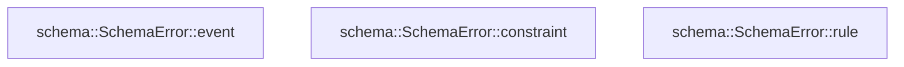

# schema

[Package atlas](index.md) · [Source](../../src/lib.rs)

## Declarations

Visibility is the declaration spelling; trait members and reexports require their enclosing interface. `cfg` is not evaluated.

| Symbol | Kind | Visibility | Test / cfg |
|---|---|---|---|
| [schema::SchemaError](../../src/lib.rs#L16) | enum_item | `pub` |  |
| [schema::SchemaError::event](../../src/lib.rs#L28) | function_item | `pub(crate)` |  |
| [schema::SchemaError::constraint](../../src/lib.rs#L35) | function_item | `pub(crate)` |  |
| [schema::SchemaError::rule](../../src/lib.rs#L44) | function_item | `pub` |  |

## Imports / reexports

| Local name | Source path | Visibility |
|---|---|---|
| `Event` | `event::Event` | `pub` |
| `EventKind` | `event::EventKind` | `pub` |
| `Visibility` | `event::Visibility` | `pub` |
| `LedgerProjection` | `fold::LedgerProjection` | `pub` |
| `LedgerValidator` | `fold::LedgerValidator` | `pub` |
| `LifecycleFacts` | `fold::LifecycleFacts` | `pub` |
| `RunRange` | `fold::RunRange` | `pub` |
| `validate_ledger` | `fold::validate_ledger` | `pub` |
| `IJsonValue` | `ijson::IJsonValue` | `pub` |
| `Block` | `types::Block` | `pub` |
| `OriginTuple` | `types::OriginTuple` | `pub` |
| `ResumePolicy` | `types::ResumePolicy` | `pub` |
| `SeqRange` | `types::SeqRange` | `pub` |
| `Error` | `thiserror::Error` | `private` |

## Module declarations

| Module | Visibility | Attributes |
|---|---|---|
| `schema::event` | `private` |  |
| `schema::fold` | `private` |  |
| `schema::ijson` | `private` |  |
| `schema::types` | `private` |  |

## Function call graphs

Edges below are syntactically resolved calls only, including private functions. Graphs partition callers into groups of 20; they are not execution order. All unresolved sites are listed below and in the JSON inventory.

Functions 1–3: 0 direct edges

## Call sites

Includes test functions (marked in declarations). Receiver-type-required sites need type analysis/manual tracing. Calls in closures are attributed to their enclosing function; their occurrence here does not mean the closure executes immediately.

| Caller | Callee expression | Source lines | Target / classification |
|---|---|---|---|
| `event` | `message.into` | [31](../../src/lib.rs#L31) | receiver-type-required |
| `constraint` | `message.into` | [39](../../src/lib.rs#L39) | receiver-type-required |
| `rule` | `Some` | [46](../../src/lib.rs#L46) | external-constructor-callback-or-unresolved |
