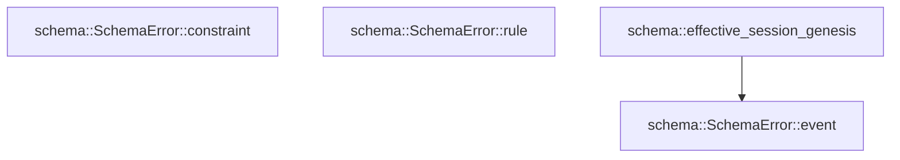

# schema

[Package atlas](index.md) · [Source](../../src/lib.rs)

## Declarations

Visibility is the declaration spelling; trait members and reexports require their enclosing interface. `cfg` is not evaluated.

| Symbol | Kind | Visibility | Test / cfg |
|---|---|---|---|
| [schema::READER_VERSION](../../src/lib.rs#L22) | const_item | `pub` |  |
| [schema::EXECUTION_READER](../../src/lib.rs#L25) | const_item | `pub` |  |
| [schema::SESSION_SCOPE_READER](../../src/lib.rs#L28) | const_item | `pub` |  |
| [schema::FOLDERS_READER](../../src/lib.rs#L31) | const_item | `pub` |  |
| [schema::GENESIS_INHERITED_FIELDS](../../src/lib.rs#L37) | const_item | `pub` |  |
| [schema::effective_session_genesis](../../src/lib.rs#L54) | function_item | `pub` |  |
| [schema::GENESIS_OPERATION_FIELDS](../../src/lib.rs#L94) | const_item | `pub` |  |
| [schema::DEFAULT_ENVIRONMENT](../../src/lib.rs#L111) | const_item | `pub` |  |
| [schema::SchemaError](../../src/lib.rs#L116) | enum_item | `pub` |  |
| [schema::SchemaError::event](../../src/lib.rs#L128) | function_item | `pub(crate)` |  |
| [schema::SchemaError::constraint](../../src/lib.rs#L135) | function_item | `pub(crate)` |  |
| [schema::SchemaError::rule](../../src/lib.rs#L144) | function_item | `pub` |  |

## Imports / reexports

| Local name | Source path | Visibility |
|---|---|---|
| `Event` | `event::Event` | `pub` |
| `EventKind` | `event::EventKind` | `pub` |
| `Visibility` | `event::Visibility` | `pub` |
| `ExecutionConfig` | `execution::ExecutionConfig` | `pub` |
| `McpConnection` | `execution::McpConnection` | `pub` |
| `McpConnectionTransport` | `execution::McpConnectionTransport` | `pub` |
| `LedgerProjection` | `fold::LedgerProjection` | `pub` |
| `LedgerValidator` | `fold::LedgerValidator` | `pub` |
| `LifecycleFacts` | `fold::LifecycleFacts` | `pub` |
| `RunRange` | `fold::RunRange` | `pub` |
| `validate_ledger` | `fold::validate_ledger` | `pub` |
| `IJsonValue` | `ijson::IJsonValue` | `pub` |
| `Block` | `types::Block` | `pub` |
| `OriginTuple` | `types::OriginTuple` | `pub` |
| `ResumePolicy` | `types::ResumePolicy` | `pub` |
| `SeqRange` | `types::SeqRange` | `pub` |
| `Error` | `thiserror::Error` | `private` |

## Module declarations

| Module | Visibility | Attributes |
|---|---|---|
| `schema::event` | `private` |  |
| `schema::execution` | `private` |  |
| `schema::fold` | `private` |  |
| `schema::ijson` | `private` |  |
| `schema::metrics` | `pub` |  |
| `schema::types` | `private` |  |

## Function call graphs

Edges below are syntactically resolved calls only, including private functions. Graphs partition callers into groups of 20; they are not execution order. All unresolved sites are listed below and in the JSON inventory.

Functions 1–4: 1 direct edges

```mermaid
flowchart TD
  n0["schema::SchemaError::event"]
  n1["schema::SchemaError::constraint"]
  n2["schema::SchemaError::rule"]
  n3["schema::effective_session_genesis"]
  n3 --> n0
```

## Call sites

Includes test functions (marked in declarations). Receiver-type-required sites need type analysis/manual tracing. Calls in closures are attributed to their enclosing function; their occurrence here does not mean the closure executes immediately.

| Caller | Callee expression | Source lines | Target / classification |
|---|---|---|---|
| `effective_session_genesis` | `events.first` | [57](../../src/lib.rs#L57) | receiver-type-required |
| `effective_session_genesis` | `Ok` | [58](../../src/lib.rs#L58), [90](../../src/lib.rs#L90) | external-constructor-callback-or-unresolved |
| `effective_session_genesis` | `serde_json::to_value` | [60](../../src/lib.rs#L60), [65](../../src/lib.rs#L65) | external-constructor-callback-or-unresolved |
| `effective_session_genesis` | `first.raw` | [60](../../src/lib.rs#L60) | receiver-type-required |
| `effective_session_genesis` | `events.iter().skip` | [61](../../src/lib.rs#L61) | receiver-type-required |
| `effective_session_genesis` | `events.iter` | [61](../../src/lib.rs#L61) | receiver-type-required |
| `effective_session_genesis` | `event.kind` | [62](../../src/lib.rs#L62) | receiver-type-required |
| `effective_session_genesis` | `event.raw` | [65](../../src/lib.rs#L65) | receiver-type-required |
| `effective_session_genesis` | `raw             .get("scope_change")             .and_then` | [66](../../src/lib.rs#L66) | receiver-type-required |
| `effective_session_genesis` | `raw             .get` | [66](../../src/lib.rs#L66) | receiver-type-required |
| `effective_session_genesis` | `value.get("execution").is_some` | [70](../../src/lib.rs#L70) | receiver-type-required |
| `effective_session_genesis` | `value.get` | [70](../../src/lib.rs#L70) | receiver-type-required |
| `effective_session_genesis` | `Err` | [71](../../src/lib.rs#L71) | external-constructor-callback-or-unresolved |
| `effective_session_genesis` | `SchemaError::event` | [71](../../src/lib.rs#L71) | [schema::SchemaError::event](../../src/lib.rs#L128) |
| `effective_session_genesis` | `Some` | [72](../../src/lib.rs#L72), [90](../../src/lib.rs#L90) | external-constructor-callback-or-unresolved |
| `effective_session_genesis` | `event.seq` | [72](../../src/lib.rs#L72) | receiver-type-required |
| `effective_session_genesis` | `change.get` | [83](../../src/lib.rs#L83) | receiver-type-required |
| `effective_session_genesis` | `next.clone` | [84](../../src/lib.rs#L84) | receiver-type-required |
| `event` | `message.into` | [131](../../src/lib.rs#L131) | receiver-type-required |
| `constraint` | `message.into` | [139](../../src/lib.rs#L139) | receiver-type-required |
| `rule` | `Some` | [146](../../src/lib.rs#L146) | external-constructor-callback-or-unresolved |
