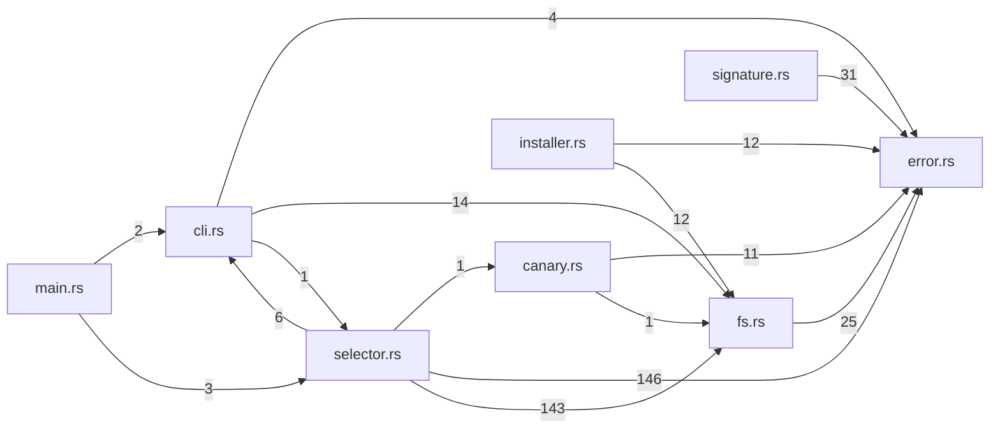

# tekes-selector — generated atlas

[All packages](../../../../docs/architecture/generated/index.md) · [Maintained explanation](../README.md)

## Cargo targets

| Target | Kind | Entry |
|---|---|---|
| `tekes_selector` | lib | [crates/selector/src/lib.rs](../../src/lib.rs) |
| `tekes-selector` | bin | [crates/selector/src/main.rs](../../src/main.rs) |
| `macos_signature` | test | [crates/selector/tests/macos_signature.rs](../../tests/macos_signature.rs) |
| `slice10_selector` | test | [crates/selector/tests/slice10_selector.rs](../../tests/slice10_selector.rs) |

## Direct workspace dependencies

| Dependency | Kind | Target cfg |
|---|---|---|

[Public/restricted API and direct callers](api.md)

## Source files / lexical modules

`src` files have full symbol/call tables and partitioned function graphs. Integration tests and examples remain in the JSON inventory.
File-derived paths below are lexical navigation, not a compiler-resolved module tree; inline module declarations are listed separately.

| File | Symbols | Call sites | Detail |
|---|---:|---:|---|
| [crates/selector/src/canary.rs](../../src/canary.rs) | 1 | 54 | [Symbols and calls](src--canary.md) |
| [crates/selector/src/cli.rs](../../src/cli.rs) | 9 | 104 | [Symbols and calls](src--cli.md) |
| [crates/selector/src/error.rs](../../src/error.rs) | 18 | 17 | [Symbols and calls](src--error.md) |
| [crates/selector/src/fs.rs](../../src/fs.rs) | 25 | 269 | [Symbols and calls](src--fs.md) |
| [crates/selector/src/installer.rs](../../src/installer.rs) | 49 | 233 | [Symbols and calls](src--installer.md) |
| [crates/selector/src/lib.rs](../../src/lib.rs) | 0 | 0 | [Symbols and calls](src--lib.md) |
| [crates/selector/src/main.rs](../../src/main.rs) | 2 | 43 | [Symbols and calls](src--main.md) |
| [crates/selector/src/model.rs](../../src/model.rs) | 25 | 0 | [Symbols and calls](src--model.md) |
| [crates/selector/src/selector.rs](../../src/selector.rs) | 129 | 2184 | [Symbols and calls](src--selector.md) |
| [crates/selector/src/signature.rs](../../src/signature.rs) | 22 | 211 | [Symbols and calls](src--signature.md) |
| [crates/selector/tests/macos_signature.rs](../../tests/macos_signature.rs) | 1 | 16 | `inventory.json` |
| [crates/selector/tests/slice10_selector.rs](../../tests/slice10_selector.rs) | 38 | 591 | `inventory.json` |

## Cross-file direct calls

Source files stand in for out-of-line modules; see declarations for inline modules. Counts are syntactic call sites, not runtime frequency.

