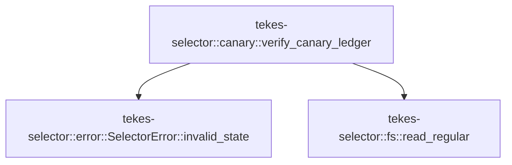

# tekes-selector::canary

[Package atlas](index.md) · [Source](../../src/canary.rs)

## Declarations

Visibility is the declaration spelling; trait members and reexports require their enclosing interface. `cfg` is not evaluated.

| Symbol | Kind | Visibility | Test / cfg |
|---|---|---|---|
| [tekes-selector::canary::verify_canary_ledger](../../src/canary.rs#L9) | function_item | `pub(crate)` |  |

## Imports / reexports

| Local name | Source path | Visibility |
|---|---|---|
| `Path` | `std::path::Path` | `private` |
| `Value` | `serde_json::Value` | `private` |
| `Uuid` | `uuid::Uuid` | `private` |
| `SelectorError` | `crate::error::SelectorError` | `private` |
| `read_regular` | `crate::fs::read_regular` | `private` |

## Module declarations

| Module | Visibility | Attributes |
|---|---|---|

## Function call graphs

Edges below are syntactically resolved calls only, including private functions. Graphs partition callers into groups of 20; they are not execution order. All unresolved sites are listed below and in the JSON inventory.

Functions 1–1: 2 direct edges

## Call sites

Includes test functions (marked in declarations). Receiver-type-required sites need type analysis/manual tracing. Calls in closures are attributed to their enclosing function; their occurrence here does not mean the closure executes immediately.

| Caller | Callee expression | Source lines | Target / classification |
|---|---|---|---|
| `verify_canary_ledger` | `Uuid::parse_str(session)         .map_err` | [15](../../src/canary.rs#L15) | receiver-type-required |
| `verify_canary_ledger` | `Uuid::parse_str` | [15](../../src/canary.rs#L15) | external-constructor-callback-or-unresolved |
| `verify_canary_ledger` | `SelectorError::invalid_state` | [16](../../src/canary.rs#L16), [18](../../src/canary.rs#L18), [22](../../src/canary.rs#L22), [24](../../src/canary.rs#L24), [35](../../src/canary.rs#L35), [37](../../src/canary.rs#L37), [39](../../src/canary.rs#L39), [42](../../src/canary.rs#L42), [47](../../src/canary.rs#L47), [49](../../src/canary.rs#L49), [77](../../src/canary.rs#L77) | [tekes-selector::error::SelectorError::invalid_state](../../src/error.rs#L87) |
| `verify_canary_ledger` | `uuid.hyphenated().to_string` | [17](../../src/canary.rs#L17) | receiver-type-required |
| `verify_canary_ledger` | `uuid.hyphenated` | [17](../../src/canary.rs#L17) | receiver-type-required |
| `verify_canary_ledger` | `Err` | [18](../../src/canary.rs#L18), [24](../../src/canary.rs#L24), [42](../../src/canary.rs#L42), [49](../../src/canary.rs#L49), [77](../../src/canary.rs#L77) | external-constructor-callback-or-unresolved |
| `verify_canary_ledger` | `storage_root.join(session).join` | [20](../../src/canary.rs#L20) | receiver-type-required |
| `verify_canary_ledger` | `storage_root.join` | [20](../../src/canary.rs#L20) | receiver-type-required |
| `verify_canary_ledger` | `read_regular(&path).map_err` | [22](../../src/canary.rs#L22) | receiver-type-required |
| `verify_canary_ledger` | `read_regular` | [22](../../src/canary.rs#L22) | [tekes-selector::fs::read_regular](../../src/fs.rs#L142) |
| `verify_canary_ledger` | `bytes.ends_with` | [23](../../src/canary.rs#L23) | receiver-type-required |
| `verify_canary_ledger` | `bytes.split_inclusive` | [32](../../src/canary.rs#L32) | receiver-type-required |
| `verify_canary_ledger` | `line             .strip_suffix(b"\n")             .ok_or_else` | [33](../../src/canary.rs#L33) | receiver-type-required |
| `verify_canary_ledger` | `line             .strip_suffix` | [33](../../src/canary.rs#L33) | receiver-type-required |
| `verify_canary_ledger` | `serde_json::from_slice(body)             .map_err` | [36](../../src/canary.rs#L36) | receiver-type-required |
| `verify_canary_ledger` | `serde_json::from_slice` | [36](../../src/canary.rs#L36) | external-constructor-callback-or-unresolved |
| `verify_canary_ledger` | `serde_json_canonicalizer::to_vec(&value)             .map_err` | [38](../../src/canary.rs#L38) | receiver-type-required |
| `verify_canary_ledger` | `serde_json_canonicalizer::to_vec` | [38](../../src/canary.rs#L38) | external-constructor-callback-or-unresolved |
| `verify_canary_ledger` | `value             .get("seq")             .and_then(Value::as_u64)             .ok_or_else` | [44](../../src/canary.rs#L44) | receiver-type-required |
| `verify_canary_ledger` | `value             .get("seq")             .and_then` | [44](../../src/canary.rs#L44) | receiver-type-required |
| `verify_canary_ledger` | `value             .get` | [44](../../src/canary.rs#L44) | receiver-type-required |
| `verify_canary_ledger` | `value.get("kind").and_then` | [52](../../src/canary.rs#L52) | receiver-type-required |
| `verify_canary_ledger` | `value.get` | [52](../../src/canary.rs#L52), [54](../../src/canary.rs#L54), [57](../../src/canary.rs#L57) | receiver-type-required |
| `verify_canary_ledger` | `value.get("thread").and_then` | [54](../../src/canary.rs#L54) | receiver-type-required |
| `verify_canary_ledger` | `Some` | [54](../../src/canary.rs#L54), [58](../../src/canary.rs#L58), [67](../../src/canary.rs#L67) | external-constructor-callback-or-unresolved |
| `verify_canary_ledger` | `value.get("run").and_then(Value::as_str).map` | [57](../../src/canary.rs#L57) | receiver-type-required |
| `verify_canary_ledger` | `value.get("run").and_then` | [57](../../src/canary.rs#L57) | receiver-type-required |
| `verify_canary_ledger` | `active_run.as_deref` | [58](../../src/canary.rs#L58), [67](../../src/canary.rs#L67) | receiver-type-required |
| `verify_canary_ledger` | `value                         .get("binary")                         .and_then(Value::as_str)                         .map` | [60](../../src/canary.rs#L60) | receiver-type-required |
| `verify_canary_ledger` | `value                         .get("binary")                         .and_then` | [60](../../src/canary.rs#L60) | receiver-type-required |
| `verify_canary_ledger` | `value                         .get` | [60](../../src/canary.rs#L60) | receiver-type-required |
| `verify_canary_ledger` | `matching_binary         .as_deref()         .is_some_and` | [73](../../src/canary.rs#L73) | receiver-type-required |
| `verify_canary_ledger` | `matching_binary         .as_deref` | [73](../../src/canary.rs#L73) | receiver-type-required |
| `verify_canary_ledger` | `binary.ends_with` | [75](../../src/canary.rs#L75) | receiver-type-required |
| `verify_canary_ledger` | `Ok` | [79](../../src/canary.rs#L79) | external-constructor-callback-or-unresolved |
