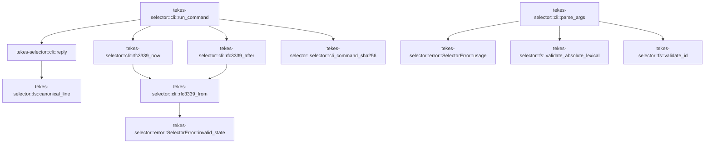

# tekes-selector::cli

[Package atlas](index.md) · [Source](../../src/cli.rs)

## Declarations

Visibility is the declaration spelling; trait members and reexports require their enclosing interface. `cfg` is not evaluated.

| Symbol | Kind | Visibility | Test / cfg |
|---|---|---|---|
| [tekes-selector::cli::Command](../../src/cli.rs#L11) | enum_item | `pub` |  |
| [tekes-selector::cli::parse_args](../../src/cli.rs#L44) | function_item | `pub` |  |
| [tekes-selector::cli::run_command](../../src/cli.rs#L144) | function_item | `pub` |  |
| [tekes-selector::cli::reply](../../src/cli.rs#L196) | function_item | `private` |  |
| [tekes-selector::cli::rfc3339_now](../../src/cli.rs#L200) | function_item | `pub(crate)` |  |
| [tekes-selector::cli::rfc3339_after](../../src/cli.rs#L204) | function_item | `pub(crate)` |  |
| [tekes-selector::cli::rfc3339_from](../../src/cli.rs#L208) | function_item | `private` |  |
| [tekes-selector::cli::tests::parser_accepts_only_the_closed_ordered_grammar](../../src/cli.rs#L239) | function_item | `private` | test; #[cfg(test)] |
| [tekes-selector::cli::tests::parser_rejects_noncanonical_paths_and_non_loopback_serve](../../src/cli.rs#L292) | function_item | `private` | test; #[cfg(test)] |

## Imports / reexports

| Local name | Source path | Visibility |
|---|---|---|
| `PathBuf` | `std::path::PathBuf` | `private` |
| `Serialize` | `serde::Serialize` | `private` |
| `SelectorError` | `crate::error::SelectorError` | `private` |
| `canonical_line` | `crate::fs::canonical_line` | `private` |
| `validate_absolute_lexical` | `crate::fs::validate_absolute_lexical` | `private` |
| `validate_id` | `crate::fs::validate_id` | `private` |
| `Selector` | `crate::selector::Selector` | `private` |
| `cli_command_sha256` | `crate::selector::cli_command_sha256` | `private` |
| `CodeSignatureVerifier` | `crate::signature::CodeSignatureVerifier` | `private` |
| `Command` | `super::Command` | `private` |
| `parse_args` | `super::parse_args` | `private` |

## Module declarations

| Module | Visibility | Attributes |
|---|---|---|
| `tekes-selector::cli::tests` | `private` | #[cfg(test)] |

## Function call graphs

Edges below are syntactically resolved calls only, including private functions. Graphs partition callers into groups of 20; they are not execution order. All unresolved sites are listed below and in the JSON inventory.

Functions 1–6: 11 direct edges

## Call sites

Includes test functions (marked in declarations). Receiver-type-required sites need type analysis/manual tracing. Calls in closures are attributed to their enclosing function; their occurrence here does not mean the closure executes immediately.

| Caller | Callee expression | Source lines | Target / classification |
|---|---|---|---|
| `parse_args` | `args.len` | [45](../../src/cli.rs#L45) | receiver-type-required |
| `parse_args` | `Err` | [46](../../src/cli.rs#L46), [136](../../src/cli.rs#L136) | external-constructor-callback-or-unresolved |
| `parse_args` | `SelectorError::usage` | [46](../../src/cli.rs#L46), [136](../../src/cli.rs#L136) | [tekes-selector::error::SelectorError::usage](../../src/error.rs#L77) |
| `parse_args` | `args.first().cloned().unwrap_or_default` | [47](../../src/cli.rs#L47) | receiver-type-required |
| `parse_args` | `args.first().cloned` | [47](../../src/cli.rs#L47) | receiver-type-required |
| `parse_args` | `args.first` | [47](../../src/cli.rs#L47) | receiver-type-required |
| `parse_args` | `PathBuf::from` | [50](../../src/cli.rs#L50), [56](../../src/cli.rs#L56), [81](../../src/cli.rs#L81), [103](../../src/cli.rs#L103), [118](../../src/cli.rs#L118), [129](../../src/cli.rs#L129), [130](../../src/cli.rs#L130) | external-constructor-callback-or-unresolved |
| `parse_args` | `validate_absolute_lexical` | [51](../../src/cli.rs#L51), [57](../../src/cli.rs#L57), [82](../../src/cli.rs#L82), [104](../../src/cli.rs#L104), [119](../../src/cli.rs#L119), [131](../../src/cli.rs#L131), [132](../../src/cli.rs#L132) | [tekes-selector::fs::validate_absolute_lexical](../../src/fs.rs#L241) |
| `parse_args` | `args[2].as_str` | [52](../../src/cli.rs#L52) | receiver-type-required |
| `parse_args` | `validate_id` | [58](../../src/cli.rs#L58), [65](../../src/cli.rs#L65), [71](../../src/cli.rs#L71), [83](../../src/cli.rs#L83), [84](../../src/cli.rs#L84), [93](../../src/cli.rs#L93) | [tekes-selector::fs::validate_id](../../src/fs.rs#L267) |
| `parse_args` | `version.clone` | [61](../../src/cli.rs#L61), [67](../../src/cli.rs#L67), [86](../../src/cli.rs#L86), [95](../../src/cli.rs#L95) | receiver-type-required |
| `parse_args` | `reason.clone` | [73](../../src/cli.rs#L73) | receiver-type-required |
| `parse_args` | `session.clone` | [87](../../src/cli.rs#L87) | receiver-type-required |
| `parse_args` | `run.clone` | [88](../../src/cli.rs#L88) | receiver-type-required |
| `parse_args` | `listen.clone` | [107](../../src/cli.rs#L107), [122](../../src/cli.rs#L122) | receiver-type-required |
| `parse_args` | `Some` | [123](../../src/cli.rs#L123) | external-constructor-callback-or-unresolved |
| `parse_args` | `web_listen.clone` | [123](../../src/cli.rs#L123) | receiver-type-required |
| `parse_args` | `args.get(2).cloned().unwrap_or_default` | [137](../../src/cli.rs#L137) | receiver-type-required |
| `parse_args` | `args.get(2).cloned` | [137](../../src/cli.rs#L137) | receiver-type-required |
| `parse_args` | `args.get` | [137](../../src/cli.rs#L137) | receiver-type-required |
| `parse_args` | `Ok` | [141](../../src/cli.rs#L141) | external-constructor-callback-or-unresolved |
| `run_command` | `cli_command_sha256` | [149](../../src/cli.rs#L149) | [tekes-selector::selector::cli_command_sha256](../../src/selector.rs#L2612) |
| `run_command` | `reply(selector.stage(bundle, version, command_hash)?).map` | [152](../../src/cli.rs#L152) | receiver-type-required |
| `run_command` | `reply` | [152](../../src/cli.rs#L152), [154](../../src/cli.rs#L154), [155](../../src/cli.rs#L155), [156](../../src/cli.rs#L156), [157](../../src/cli.rs#L157), [166](../../src/cli.rs#L166), [179](../../src/cli.rs#L179), [183](../../src/cli.rs#L183) | [tekes-selector::cli::reply](../../src/cli.rs#L196) |
| `run_command` | `selector.stage` | [152](../../src/cli.rs#L152) | receiver-type-required |
| `run_command` | `reply(selector.activate(version, command_hash)?).map` | [154](../../src/cli.rs#L154) | receiver-type-required |
| `run_command` | `selector.activate` | [154](../../src/cli.rs#L154) | receiver-type-required |
| `run_command` | `reply(selector.rollback(reason, command_hash)?).map` | [155](../../src/cli.rs#L155) | receiver-type-required |
| `run_command` | `selector.rollback` | [155](../../src/cli.rs#L155) | receiver-type-required |
| `run_command` | `reply(selector.status()?).map` | [156](../../src/cli.rs#L156) | receiver-type-required |
| `run_command` | `selector.status` | [156](../../src/cli.rs#L156) | receiver-type-required |
| `run_command` | `reply(selector.recover()?).map` | [157](../../src/cli.rs#L157) | receiver-type-required |
| `run_command` | `selector.recover` | [157](../../src/cli.rs#L157) | receiver-type-required |
| `run_command` | `rfc3339_now` | [164](../../src/cli.rs#L164), [177](../../src/cli.rs#L177) | [tekes-selector::cli::rfc3339_now](../../src/cli.rs#L200) |
| `run_command` | `rfc3339_after` | [165](../../src/cli.rs#L165), [178](../../src/cli.rs#L178) | [tekes-selector::cli::rfc3339_after](../../src/cli.rs#L204) |
| `run_command` | `reply(selector.attest_canary(                 version,                 session,                 run,                 storage_root,                 &accepted,                 &window,             )?)             .map` | [166](../../src/cli.rs#L166) | receiver-type-required |
| `run_command` | `selector.attest_canary` | [166](../../src/cli.rs#L166) | receiver-type-required |
| `run_command` | `reply(selector.attest_install_health(version, "127.0.0.1:7347", &accepted, &window)?)                 .map` | [179](../../src/cli.rs#L179) | receiver-type-required |
| `run_command` | `selector.attest_install_health` | [179](../../src/cli.rs#L179) | receiver-type-required |
| `run_command` | `reply(selector.update_selector(artifact, manifest)?).map` | [183](../../src/cli.rs#L183) | receiver-type-required |
| `run_command` | `selector.update_selector` | [183](../../src/cli.rs#L183) | receiver-type-required |
| `run_command` | `selector.serve_with_web` | [190](../../src/cli.rs#L190) | receiver-type-required |
| `run_command` | `web_listen.as_deref` | [190](../../src/cli.rs#L190) | receiver-type-required |
| `run_command` | `Ok` | [191](../../src/cli.rs#L191) | external-constructor-callback-or-unresolved |
| `reply` | `canonical_line` | [197](../../src/cli.rs#L197) | [tekes-selector::fs::canonical_line](../../src/fs.rs#L117) |
| `rfc3339_now` | `rfc3339_from` | [201](../../src/cli.rs#L201) | [tekes-selector::cli::rfc3339_from](../../src/cli.rs#L208) |
| `rfc3339_now` | `std::time::SystemTime::now` | [201](../../src/cli.rs#L201) | external-constructor-callback-or-unresolved |
| `rfc3339_after` | `rfc3339_from` | [205](../../src/cli.rs#L205) | [tekes-selector::cli::rfc3339_from](../../src/cli.rs#L208) |
| `rfc3339_after` | `std::time::SystemTime::now` | [205](../../src/cli.rs#L205) | external-constructor-callback-or-unresolved |
| `rfc3339_after` | `std::time::Duration::from_secs` | [205](../../src/cli.rs#L205) | external-constructor-callback-or-unresolved |
| `rfc3339_from` | `time         .duration_since(UNIX_EPOCH)         .map_err` | [210](../../src/cli.rs#L210) | receiver-type-required |
| `rfc3339_from` | `time         .duration_since` | [210](../../src/cli.rs#L210) | receiver-type-required |
| `rfc3339_from` | `SelectorError::invalid_state` | [212](../../src/cli.rs#L212), [218](../../src/cli.rs#L218) | [tekes-selector::error::SelectorError::invalid_state](../../src/error.rs#L87) |
| `rfc3339_from` | `duration.as_secs` | [213](../../src/cli.rs#L213) | receiver-type-required |
| `rfc3339_from` | `std::mem::MaybeUninit::<libc::tm>::uninit` | [214](../../src/cli.rs#L214) | external-constructor-callback-or-unresolved |
| `rfc3339_from` | `libc::gmtime_r` | [216](../../src/cli.rs#L216) | external-constructor-callback-or-unresolved |
| `rfc3339_from` | `broken_down.as_mut_ptr` | [216](../../src/cli.rs#L216) | receiver-type-required |
| `rfc3339_from` | `result.is_null` | [217](../../src/cli.rs#L217) | receiver-type-required |
| `rfc3339_from` | `Err` | [218](../../src/cli.rs#L218) | external-constructor-callback-or-unresolved |
| `rfc3339_from` | `broken_down.assume_init` | [221](../../src/cli.rs#L221) | receiver-type-required |
| `rfc3339_from` | `Ok` | [222](../../src/cli.rs#L222) | external-constructor-callback-or-unresolved |
| `parser_accepts_only_the_closed_ordered_grammar` | `[             "--install-root",             "/tmp/Kernel",             "stage",             "--bundle",             "/tmp/Bundle",             "--version",             "1.0.0",         ]         .map` | [240](../../src/cli.rs#L240) | receiver-type-required |
| `parser_accepts_only_the_closed_ordered_grammar` | `parse_args(&args).expect` | [250](../../src/cli.rs#L250) | receiver-type-required |
| `parser_accepts_only_the_closed_ordered_grammar` | `parse_args` | [250](../../src/cli.rs#L250) | [tekes-selector::cli::parse_args](../../src/cli.rs#L44) |
| `parser_accepts_only_the_closed_ordered_grammar` | `[             "--install-root",             "/tmp/Kernel",             "attest-install-health",             "--version",             "1.0.0",         ]         .map` | [253](../../src/cli.rs#L253) | receiver-type-required |
| `parser_accepts_only_the_closed_ordered_grammar` | `[             "--install-root",             "/tmp/Kernel",             "stage",             "--version",             "1.0.0",             "--bundle",             "/tmp/Bundle",         ]         .map` | [268](../../src/cli.rs#L268) | receiver-type-required |
| `parser_accepts_only_the_closed_ordered_grammar` | `[             "--install-root",             "/tmp/Kernel",             "status",             "--install-root",             "/tmp/Other",         ]         .map` | [280](../../src/cli.rs#L280) | receiver-type-required |
| `parser_rejects_noncanonical_paths_and_non_loopback_serve` | `["--install-root", "/tmp//Kernel", "status"].map` | [293](../../src/cli.rs#L293) | receiver-type-required |
| `parser_rejects_noncanonical_paths_and_non_loopback_serve` | `[             "--install-root",             "/tmp/Kernel",             "serve",             "--storage-root",             "/tmp/threads",             "--listen",             "0.0.0.0:7347",         ]         .map` | [296](../../src/cli.rs#L296) | receiver-type-required |
| `parser_rejects_noncanonical_paths_and_non_loopback_serve` | `[             "--install-root",             "/tmp/Kernel",             "serve",             "--storage-root",             "/tmp/threads",             "--listen",             "127.0.0.1:7347",             "--web-listen",             "127.0.0.1:7357",         ]         .map` | [308](../../src/cli.rs#L308) | receiver-type-required |
| `parser_rejects_noncanonical_paths_and_non_loopback_serve` | `[             "--install-root",             "/tmp/Kernel",             "serve",             "--storage-root",             "/tmp/threads",             "--listen",             "127.0.0.1:7347",             "--web-listen",             "0.0.0.0:7357",         ]         .map` | [330](../../src/cli.rs#L330) | receiver-type-required |
