# tekes-selector::error

[Package atlas](index.md) · [Source](../../src/error.rs)

## Declarations

Visibility is the declaration spelling; trait members and reexports require their enclosing interface. `cfg` is not evaluated.

| Symbol | Kind | Visibility | Test / cfg |
|---|---|---|---|
| [tekes-selector::error::ErrorCode](../../src/error.rs#L8) | enum_item | `pub` |  |
| [tekes-selector::error::ErrorCode::as_str](../../src/error.rs#L19) | function_item | `pub` |  |
| [tekes-selector::error::ErrorCode::message](../../src/error.rs#L31) | function_item | `pub` |  |
| [tekes-selector::error::ErrorCode::exit_code](../../src/error.rs#L43) | function_item | `pub` |  |
| [tekes-selector::error::SelectorError](../../src/error.rs#L57) | struct_item | `pub` |  |
| [tekes-selector::error::SelectorError::new](../../src/error.rs#L67) | function_item | `pub` |  |
| [tekes-selector::error::SelectorError::usage](../../src/error.rs#L77) | function_item | `pub` |  |
| [tekes-selector::error::SelectorError::invalid_bundle](../../src/error.rs#L82) | function_item | `pub` |  |
| [tekes-selector::error::SelectorError::invalid_state](../../src/error.rs#L87) | function_item | `pub` |  |
| [tekes-selector::error::SelectorError::unavailable](../../src/error.rs#L92) | function_item | `pub` |  |
| [tekes-selector::error::SelectorError::corruption](../../src/error.rs#L100) | function_item | `pub` |  |
| [tekes-selector::error::SelectorError::io](../../src/error.rs#L105) | function_item | `pub` |  |
| [tekes-selector::error::SelectorError::envelope_bytes](../../src/error.rs#L114) | function_item | `pub` |  |
| [tekes-selector::error::SelectorError::envelope_bytes::ErrorBody](../../src/error.rs#L116) | struct_item | `private` |  |
| [tekes-selector::error::SelectorError::envelope_bytes::Envelope](../../src/error.rs#L122) | struct_item | `private` |  |
| [tekes-selector::error::IoContext](../../src/error.rs#L137) | trait_item | `pub(crate)` |  |
| [tekes-selector::error::IoContext::selector_io](../../src/error.rs#L138) | function_signature_item | `private` |  |
| [tekes-selector::error::io::Result::selector_io](../../src/error.rs#L142) | function_item | `private` |  |

## Imports / reexports

| Local name | Source path | Visibility |
|---|---|---|
| `io` | `std::io` | `private` |
| `Serialize` | `serde::Serialize` | `private` |
| `Value` | `serde_json::Value` | `private` |
| `json` | `serde_json::json` | `private` |
| `Error` | `thiserror::Error` | `private` |

## Module declarations

| Module | Visibility | Attributes |
|---|---|---|

## Function call graphs

Edges below are syntactically resolved calls only, including private functions. Graphs partition callers into groups of 20; they are not execution order. All unresolved sites are listed below and in the JSON inventory.

```mermaid
flowchart TD
  n0["tekes-selector::error::SelectorError::corruption"]
  n1["tekes-selector::error::SelectorError::io"]
  n2["tekes-selector::error::SelectorError::envelope_bytes"]
  n3["tekes-selector::error::io::Result::selector_io"]
  n4["tekes-selector::error::ErrorCode::as_str"]
  n5["tekes-selector::error::ErrorCode::message"]
  n6["tekes-selector::error::ErrorCode::exit_code"]
  n7["tekes-selector::error::SelectorError::new"]
  n8["tekes-selector::error::SelectorError::usage"]
  n9["tekes-selector::error::SelectorError::invalid_bundle"]
  n10["tekes-selector::error::SelectorError::invalid_state"]
  n11["tekes-selector::error::SelectorError::unavailable"]
  n0 --> n7
  n3 --> n1
  n8 --> n7
  n9 --> n7
  n10 --> n7
  n11 --> n7
```

Functions 1–12: 6 direct edges

## Call sites

Includes test functions (marked in declarations). Receiver-type-required sites need type analysis/manual tracing. Calls in closures are attributed to their enclosing function; their occurrence here does not mean the closure executes immediately.

| Caller | Callee expression | Source lines | Target / classification |
|---|---|---|---|
| `new` | `code.message().to_owned` | [70](../../src/error.rs#L70) | receiver-type-required |
| `new` | `code.message` | [70](../../src/error.rs#L70) | receiver-type-required |
| `usage` | `Self::new` | [78](../../src/error.rs#L78) | [tekes-selector::error::SelectorError::new](../../src/error.rs#L67) |
| `invalid_bundle` | `Self::new` | [83](../../src/error.rs#L83) | [tekes-selector::error::SelectorError::new](../../src/error.rs#L67) |
| `invalid_state` | `Self::new` | [88](../../src/error.rs#L88) | [tekes-selector::error::SelectorError::new](../../src/error.rs#L67) |
| `unavailable` | `Self::new` | [93](../../src/error.rs#L93) | [tekes-selector::error::SelectorError::new](../../src/error.rs#L67) |
| `corruption` | `Self::new` | [101](../../src/error.rs#L101) | [tekes-selector::error::SelectorError::new](../../src/error.rs#L67) |
| `io` | `ErrorCode::Io.message().to_owned` | [108](../../src/error.rs#L108) | receiver-type-required |
| `io` | `ErrorCode::Io.message` | [108](../../src/error.rs#L108) | receiver-type-required |
| `io` | `Some` | [110](../../src/error.rs#L110) | external-constructor-callback-or-unresolved |
| `envelope_bytes` | `serde_json_canonicalizer::to_vec` | [125](../../src/error.rs#L125) | external-constructor-callback-or-unresolved |
| `envelope_bytes` | `self.code.as_str` | [127](../../src/error.rs#L127) | receiver-type-required |
| `envelope_bytes` | `self.code.message` | [129](../../src/error.rs#L129) | receiver-type-required |
| `envelope_bytes` | `bytes.push` | [132](../../src/error.rs#L132) | receiver-type-required |
| `envelope_bytes` | `Ok` | [133](../../src/error.rs#L133) | external-constructor-callback-or-unresolved |
| `selector_io` | `self.map_err` | [143](../../src/error.rs#L143) | receiver-type-required |
| `selector_io` | `SelectorError::io` | [143](../../src/error.rs#L143) | [tekes-selector::error::SelectorError::io](../../src/error.rs#L105) |
